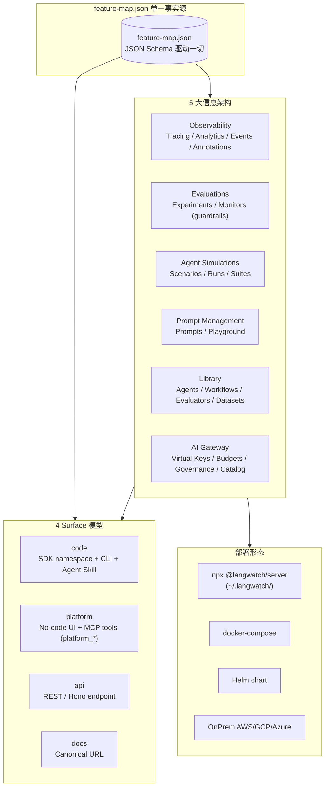
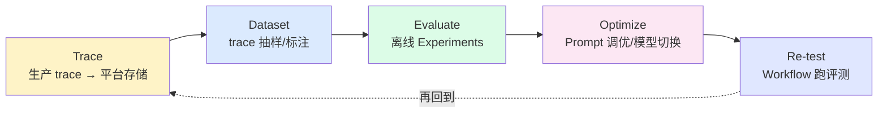
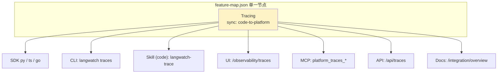
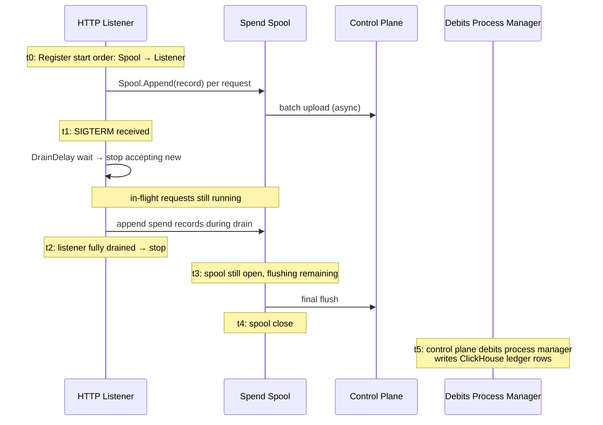
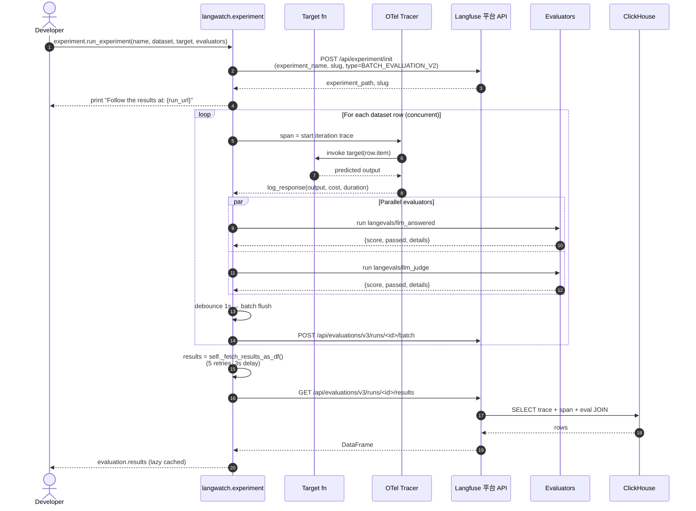

## 引子

2026 年的 LLM 应用团队面临一个老问题：**Agent 越来越复杂，但找不到合适的方法系统性测试它**。传统评测工具要么只覆盖单 LLM 调用（不覆盖 Agent + Tools + State + User Simulator），要么只覆盖生产观测（不覆盖离线回放），要么只覆盖 gateway 路由（不覆盖评估闭环）。**LangWatch（langwatch/langwatch，⭐3.5k，Apache-2.0，TypeScript + Python + Go）给出了一个端到端的统一答案：把 Trace / Dataset / Evaluate / Optimize / Re-test 串成闭环 Loop，把 code / platform / api / docs 四个 surface 用 feature-map.json 单一事实源同步，再加一个独立的 Go AI Gateway 二进制（236ns 热路径）和 Scenarios + Runs + Suites 端到端 Agent 仿真**。这是评测甜区（harbor 之后）和 AI Gateway 甜区（helicone/claude-code-router 之后）的首次真正融合。

本文基于 v0.x 源码（约 50+ 服务、3 个 SDK、sdks/python/src/langwatch/experiment/experiment.py 等核心源文件、services/aigateway/ 整套 Go 实现）做架构级深挖，目标是给"想自建 LLM 评测平台的团队"一份工程参考。

## 一、项目定位与核心价值

| 维度 | 数据 |
|---|---|
| ⭐ Stars | 3,509 |
| 主仓语言 | TypeScript（占比 60%+, 主平台 Next.js）+ Python（SDK）+ Go（AI Gateway） |
| License | Apache-2.0 + Enterprise 扩展 |
| 推送频率 | 2026-08-22（持续活跃） |
| SDK 数量 | 3 个（Python / TypeScript / Go） |
| 服务数量 | 15+（actor / api / authz / automations / langy / observability / server / ssrf / system-migrations + services/{aigateway,langevals,langyagent,nlpgo}） |
| 文档 | docs.langwatch.ai（含 self-hosting） |

LangWatch 的核心定位是 **「the platform for LLM evaluations and AI agent testing」**，提供 5 类一站式服务：
1. **Observability**（Tracing / Analytics / User Events / Annotations）
2. **Evaluations**（Experiments 离线评测 / Monitors 在线评测 guardrails）
3. **Agent Simulations**（Scenarios + User Simulator + Runs + Suites）
4. **Prompt Management**（Prompts + Playground + GitHub 同步）
5. **AI Gateway**（Virtual Keys / Budgets / Governance / Catalog / Cache Rules / Policy Matcher）

与 harbor（coding agent 终端评测）、logfire（OTel wrapper 偏向埋点）、helicone（AI Gateway hook）相比，LangWatch 是**第一个把 5 类服务作为一个统一平台管理的项目**。它的差异化不是单点性能，而是 **Loop Architecture 把 5 类服务编织成闭环 + feature-map.json 单一事实源同步 4 个 surface**。

## 二、整体架构

LangWatch 的顶层架构是 **5 大信息架构 × 4 Surface 模型 × 1 个 feature-map.json 单一事实源**：



**关键设计决策**：
- **没有「integrations」分类**：SDK/Frameworks 是 enable 功能的开关，不是 feature 本身
- **Library 是横切层**：Agents / Workflows / Evaluators / Datasets 可被 Experiments / Simulations / Monitors 复用
- **Annotations 属于 Observability**：annotate 是对 trace 的标注
- **Guardrails = Online Evaluation with as_guardrail=True**：不另设分类

部署形态层级从最轻到最重：npx → docker-compose → Helm → 云厂商 OnPrem，**默认 `npx @langwatch/server` 一行命令启动**（自动装 uv + Postgres + Redis + ClickHouse + AI Gateway binary + Langy runtime，目录统一在 `~/.langwatch/`）。

## 三、Loop Architecture：评测闭环

LangWatch 最核心的架构哲学是 **Loop Architecture** —— Trace → Dataset → Evaluate → Optimize → Re-test 五步循环：



这五步在 Python SDK 里对应 `langwatch.tracer`（T）→ `langwatch.dataset`（D）→ `langwatch.experiment`（E）→ `langwatch.prompts`（O）→ `langwatch.workflow`（R）。每一步都跨 Surface 同步（见下节），整个循环不丢信息。

## 四、Experiment 执行器：异步 + 线程双轨 + ContextVar 隔离

`langwatch.experiment.Experiment` 是 Loop 中「Evaluate」一环的核心执行器。设计上要解决**线程池并发 vs asyncio 并发**两条路径不互相打架的难题：

```python
# 来自 sdks/python/src/langwatch/experiment/experiment.py:96-105
# Async-native execution state (used by aloop / asubmit). The threading
# path keeps these empty, so every check downstream is a no-op for it.
self._async_tasks: List["asyncio.Task[Any]"] = []
self._async_semaphore: Optional[asyncio.Semaphore] = None
```

**两个执行轨的关键差异**：
- `aloop()` / `asubmit()`：asyncio.Task 列表 + Semaphore 控制并发
- `loop()` / `submit()`：concurrent.futures.ThreadPoolExecutor + Future 列表

为了让两条路径都能跟踪当前 iteration trace，**LangWatch 用 `ContextVar` 而非 Experiment 实例字段**：

```python
# 来自 sdks/python/src/langwatch/experiment/experiment.py:107-122
# Active iteration trace, per iteration context. Stored in a ContextVar
# (rather than on the Experiment instance) so concurrent async tasks don't
# step on each other — otherwise task A's log_response / target() call would
# close task B's iteration trace, leaving OTel context tokens dangling and
# raising "Failed to detach context: Token was created in a different
# Context" during async-gen cleanup.
_active_iteration_trace_ctx: ContextVar[Optional[Any]] = ContextVar(
    "_active_iteration_trace_ctx", default=None
)
```

把 trace 状态从实例字段移到 ContextVar，让 **N 个 async task 各自看到自己的 iteration trace**，避免"task A 关闭了 task B 的 trace"导致的 OTel token dangling 错误。这是处理「一个实验跑 N 个并发样本」场景的精妙设计。

## 五、Trace ID 的 32 位 Padding 陷阱

`Experiment` 在记录 trace 时调用 `_current_trace_id()`，但**不是直接读 OTel 的 trace_id**，而是把它**强制 padding 到 32 位 hex 字符串**：

```python
# 来自 sdks/python/src/langwatch/experiment/experiment.py:209-220
def _current_trace_id() -> str:
    """The active trace id, hex-encoded to the full 32 characters.
    
    The padding is what makes the id joinable. Roughly one trace in 256
    starts with a zero byte, and an unpadded id for one of those is a
    different string from the one the same trace is written under
    everywhere else, so the evaluation stops matching the dataset entry
    it belongs to.
    
    With no span active this is OTel's all-zero invalid trace id, which
    reads as "no trace" wherever a trace id is expected.
    """
    return format(trace.get_current_span().get_span_context().trace_id, "032x")
```

**为什么必须 padding**：OTel 的 trace_id 是 128-bit 整数，`format(..., "x")` 会**丢掉前导零**。约 **1/256 的 trace 首位是零字节**，此时不 padding 会得到 31 字符的 hex，与 dataset entry 里其他位置记录的 32 字符不一致 → join 失败 → evaluation 与 trace 失联。**这是 OpenTelemetry 工程化的经典陷阱**，LangWatch 用 `032x` 强制对齐。

## 六、Agent Simulation：Scenarios + Runs + Suites

`langwatch.scenarios` 是 Loop 中的「R」（Re-test）一环，与 `experiment` 共享同一后端 API（`/api/evaluations/v3/runs/`）：

```python
# 来自 sdks/python/src/langwatch/workflow/__init__.py:17-26
result = langwatch.workflow.run("workflow_abc123", data=[{"input": "hi"}])
result.print_summary()
result.results  # per-row DataFrame, same shape as experiment.run(...).results
```

`workflow.run()` 与 `experiment.run()` 返回**完全相同的 `ExperimentRunResult` 类型**——包括 lazy `result.results` DataFrame、相同的 `_poll_until_complete` 轮询机制、相同的 URL domain replace。这避免了「平台存两份不兼容的 run 数据」的问题。

**Scenarios / Runs / Suites 三层抽象**：
- **Scenario**：一次端到端仿真定义（agent + tools + state + user simulator + judge）
- **Run**：Scenario 在某数据集/参数下的实际执行
- **Suite**：一组 Run 的编排（如"基线 + 候选"对比）

`scenarios.py` 是瘦 REST facade（`list / get / create / update / delete`），核心逻辑（用户模拟、judge 调用、tool mock、state 注入）在平台后端。

## 七、AI Gateway：独立 Go 二进制 + 236ns 热路径

LangWatch 把 AI Gateway 实现为**独立 Go binary**（`services/aigateway/`，Helm sub-chart `charts/gateway/`），与平台主应用（Next.js）解耦。`services/aigateway/BENCHMARKS.md` 给出 Apple M3 Pro (Go 1.26.1) 的实测数据：

```
Router_ChatCompletions       4,836 ns/op  (chi 全栈)
Sign (POST w/ body)            859.7 ns/op  (HMAC-SHA256)
HashKey                         83.8 ns/op  (SHA-256 of VK for L1)
Precheck (3 scopes, cached)      4.6 ns/op  (零分配预算检查)
Precheck_HardStop                1.5 ns/op  (早期退出)
Walk_PrimarySuccess             71.7 ns/op  (主槽一次成功)
─────────────────────────────
热路径总开销                  ≈ 236.1 ns ≈ 0.24 μs
```

**关键设计决策**：
1. **Precheck 不调 control plane**：所有预算检查用 cached snapshot，**stale data 默认 allow**，后台 reconciler 异步对账（避免 hot path 阻塞）
2. **HashKey 不分配**：SHA-256 of raw VK，纯字符串处理，0 alloc
3. **Walk_PrimarySuccess 一次成功**：happy path 不分配，retry 引擎只走 primary slot

## 八、Pipeline 拦截器链

AI Gateway 的核心抽象是 `Interceptor` 链（`services/aigateway/app/pipeline/`）：

```mermaid
flowchart LR
    R["HTTP Request"] --> AU["Auth<br/>(Virtual Key)"]
    AU --> MR["ModelResolve<br/>(alias → canonical)"]
    MR --> PL["Policy<br/>(tools/MCP/URL deny/allow)"]
    PL --> CM["CheckModel<br/>(resolved model judge)"]
    CM --> CR["CacheRules<br/>(priority sorted)"]
    CR --> RT["RateLimit"]
    RT --> BG["Budget precheck<br/>(cached snapshot)"]
    BG --> GR["Guardrails"]
    GR --> DS["DispatchFunc<br/>(BifrostRouter)"]
    DS --> SP["Spend Spool"]
    SP --> OUT["Response"]

    style AU fill:#fee2e2
    style DS fill:#dcfce7
    style SP fill:#fef3c7
```



每一步都是独立 Interceptor，通过 `Call` 结构体携带 `Bundle`（VK 解析后的配置）+ `Request`（解析后的 body）+ `MetaAccumulator`（累积响应元数据）。**关键洞察**：`Meta` 是 snapshot，`MetaAccumulator` 是 write 端，因为 transport 可能比 dispatch 先返回（流式 keep-alive 第一个字节就要 commit headers），所以写读必须互斥：

```go
// 来自 services/aigateway/app/pipeline/pipeline.go:73-82
// MetaAccumulator is what interceptors write response metadata into.
// Dispatch runs on its own goroutine while the transport may need the
// metadata before dispatch returns (the non-streaming keep-alive commits
// the response header block the moment it writes its first byte), so
// every access is guarded.
type MetaAccumulator struct {
    mu   sync.Mutex
    meta Meta
}
```

## 九、Policy Matcher：Alias 绕过的精妙防御

`policy.Matcher` 解决一个**反直觉的防御难题**：deny 模型规则**不能在 body 上判断**，因为 body 里只有用户写的 alias，alias 会绕过：

```go
// 来自 services/aigateway/adapters/policy/matcher.go:38-50
// Model rules are deliberately NOT evaluated here. This runs before
// the model resolver, so the only model name in the body is the one
// the caller typed, and judging that means an alias routes around a
// deny: name the denied model in an alias and the rule never sees it.
// CheckModel judges the resolved id instead, from the resolver, which
// is what actually runs. Every other target (tools, MCP, URLs) is a
// property of the body as sent and belongs here.
func (m *Matcher) Check(ctx context.Context, rules []domain.PolicyRule, body []byte) error {
    rules = rulesExcludingModel(rules)  // ← body-level 先剔除 model 规则
    ...
}
```

`CheckModel` 在 `resolve.go` 里**只在 resolver 解析出真实 model 后**才执行 policy model 规则：

```go
// 来自 services/aigateway/app/pipeline/resolve.go:31-46
// The model rules are enforced here rather than in the Policy
// interceptor because only here is the real model known. Policy stays
// where it is: it also covers tools, MCP and URLs, and moving it would
// change which rejection a request carrying several violations gets.
func ModelResolve(resolve ResolveModelFunc, checkModel CheckModelFunc) Interceptor {
    return PreOnly("model_resolve", func(ctx context.Context, call *Call) error {
        resolved, err := resolve(ctx, call.Request, call.Bundle.Config)
        ...
        if checkModel != nil && len(call.Bundle.Config.PolicyRules) > 0 {
            if err := checkModel(ctx, call.Bundle.Config.PolicyRules, *resolved); err != nil {
                return err
            }
        }
```

**两个 spellings 都被 judge**（"openai/gpt-4.*" 和 "gpt-4.*" 都覆盖），避免一条规则写了带前缀另一条没写导致 alias 边界匹配不上。

## 十、Budget 软硬双限 + Provider 过滤

Budget 是**软硬双限** + **provider-filtered** 的复合模型：

```go
// 来自 services/aigateway/adapters/budget/budget.go:42-58
// SoftWarnPercent is how much of a budget must be consumed before the
// gateway attaches a warning to the response. It mirrors the control
// plane's soft-warn threshold (...) so the response header, the
// dashboard banner and the CLI all fire at the same point instead of
// the header staying silent through the whole band the dashboard
// already calls a warning.
const SoftWarnPercent = 80

// Precheck evaluates cached budget snapshots. Never calls control
// plane on hot path. Permissive by default: stale data allows the
// request through, debit reconciles later.
//
// A scope that is out of budget blocks only when its on_breach is
// "block"; every other scope at or past SoftWarnPercent contributes a
// warning, whatever its on_breach.
```

**provider-filtered budget 是更细粒度的控制**：只约束某个 vendor，不约束整个请求。**当某个 provider-filtered budget 超支时，不直接 block，而是 EXCLUDE 该 provider from the candidate chain**——dispatcher 看到 chain 空了才 block 并指出是哪个 budget 排除了所有 provider。

## 十一、Cache Rules：Priority Sorted AND-of-Matchers

Cache 规则按 priority 排序 + **AND across matcher kinds; OR within a matcher's value list**：

```go
// 来自 services/aigateway/adapters/cacherules/evaluator.go:33-42
// Sort by priority (lower = higher priority)
sorted := make([]domain.CacheRule, len(rules))
copy(sorted, rules)
sort.Slice(sorted, func(i, j int) bool {
    return sorted[i].Priority < sorted[j].Priority
})

for i := range sorted {
    rule := &sorted[i]
    if matchesRule(rule.Match, eval) {
        return &domain.CacheDecision{
            Action: rule.Action,
            RuleID: rule.ID,
        }
    }
}
```

`matchesRule` 是 **5 个 matcher 的 AND**：
- `Models`（path glob，OR within）
- `Principals`（精确字符串，OR within）
- `VKIDs`（精确，OR within）
- `VKPrefixes`（字符串前缀，OR within）
- `VKTags`（AND across，VK 必须**包含**所有 required tag）

**Missing eval-context data 时 fail-safe 不匹配**（如规则期望 VKDisplayPrefix 但没 wired）—— wiring gaps 不能误把规则应用到非预期流量。

## 十二、4 Surface 模型 + feature-map.json 同步

LangWatch **每个 feature 最多有 4 个 surface**：code / platform / api / docs。同步模型用 `sync` 字段描述（详见 FEATURE_MAP.md）：



`sync` 字段取值：
- `null`：**单向 only**（如 annotations 仅 platform 创建）
- `bidirectional`：code ↔ platform 同步（**prompts 通过 `prompt sync`**）
- `code-to-platform`：code 生成，platform 显示（tracing / experiments）
- `platform-to-code`：**目前无**（设计上预留）

`feature-map.json`（54KB）是 source of truth，CLI / MCP manifest / Skill bundle / docs index 都从这里 derive。新增 feature 时只需改一处，其他自动同步——这是平台化产品区别于框架级开源的核心方法论。

## 十三、3 个 SDK 的设计哲学

LangWatch 提供 3 个 SDK，**故意不追求 100% 对等**：

| 维度 | Python | TypeScript | Go |
|---|---|---|---|
| 覆盖度 | 全量 | 全量 | tracing + REST client（部分） |
| Tracing | ✅ | ✅ | ✅ + 8 个 instrumentations |
| REST client | ✅ generated | ✅ generated | ✅ typed |
| 主用途 | 实验 / Eval | 前端 / Node.js | 后端 / 高性能 gateway |
| Go 缺 | — | — | Analytics / Experiments / Suites / Agents / Workflows / Evaluators / Dashboards / Model Providers / Project Secrets / Model Defaults / Agent Skills / API Keys / 全部 AI Gateway |

Go SDK 故意**只覆盖** Prompts / Datasets / Traces / Annotations / Events / Evaluations / Triggers / Monitors / Scenarios / Projects——因为 Go 用户主要是后端 tracing 需求，前端用户体验功能由 Python/TS SDK 提供。

## 十四、Comparison 评估的 5 状态映射

`Experiment.compare()` 跑两个 candidate 输出对比，**5 个 ComparisonStatus** 严格映射到 3 个 wire status：

```python
# 来自 sdks/python/src/langwatch/experiment/experiment.py:96-99
# The batch protocol has three statuses, so each verdict resolves to
# exactly one of them here. Every recording path reads the wire status
# out of this table rather than naming one alongside a verdict, which
# is what keeps the status a caller reads and the status the platform
# stores from disagreeing.
_COMPARISON_ENTRY_STATUS: Dict[
    ComparisonStatus, Literal["processed", "error", "skipped"]
] = {
    "decided":         "processed",
    "tie":             "processed",
    "inconclusive":    "skipped",
    "skipped":         "skipped",
    "error":           "error",
}
```

**5 个状态各自独立**：
- `decided`：judge 选了 winner
- `tie`：candidates 等价
- `inconclusive`：swap 后结论翻转，"too close to call"
- `skipped`：候选少于 2 个，judge 未调用
- `error`：judge 失败

**inconclusive ≠ tie ≠ error**——这是「swap-and-reconcile」模式的精妙体现：把三个状态合并会丢失实验的语义。LangWatch 用一张映射表 + 单一 source of truth 保证 caller 与 platform 看到的 status 一致。

## 十五、与同类项目对比

| 维度 | LangWatch | logfire | harbor | helicone |
|---|---|---|---|---|
| **主战场** | Loop 闭环 + Agent 仿真 | OTel wrapper + 集成 | 终端 coding agent eval | AI Gateway hook |
| **核心抽象** | Loop / 4 Surface / Scenario | Span / Instrumentation / Event | Agent + Sandbox | Hook + Router |
| **AI Gateway** | ✅ Go binary 独立 236ns 热路径 | ❌ | ❌ | ✅ Python hook |
| **Agent 端到端仿真** | ✅ Scenario + User Sim + Judge + Tool/State | ❌ | ❌（仅 terminal） | ❌ |
| **评测闭环** | Trace→Dataset→Eval→Optimize→Re-test | ❌（仅 observability） | 离线 benchmark | ❌ |
| **Self-host 难度** | 中（5+ 服务） | 低（Pydantic Logfire） | 低（Docker） | 中（Python） |
| **License** | Apache-2.0 + Enterprise | AGPL + 商业 | Apache-2.0 | Apache-2.0 |
| **⭐** | 3.5k | 11k+ | 5k+ | 3k+ |
| **团队规模** | 商业公司 | Pydantic 团队 | 学术团队 | 商业公司 |

**设计差异核心**：
- **logfire** 是「OpenTelemetry 在 Python AI 场景的 idiom 化」，把 LLM/Agent 调用变成 OTel span，优势是「任何 OTel 后端都能消费」
- **helicone** 是「AI Gateway 的 Python hook 化」，用 litellm + 中间件拦截，优势是「改一行代码接入」
- **harbor** 是「终端 coding agent 的离线 benchmark」，优势是「真跑真 sandbox 真打分」
- **LangWatch** 是「端到端 Agent 平台的统一答案」，**优势是覆盖生产 + 离线 + Agent 仿真 + Gateway 五位一体 + 4 Surface 同步**

## 十六、优缺点分析

| 维度 | 优点 | 缺点 |
|---|---|---|
| **架构完整性** | 5 大 IA × 4 Surface × feature-map.json × Loop Architecture，**架构天花板高** | 单进程（Next.js 主平台） + 多服务混合，**部署复杂度高** |
| **性能** | AI Gateway Go binary 236ns 热路径，**业界 SOTA** | 主平台 Next.js 实时性弱，**实时 dashboard 需 SSE/OTLP** |
| **可扩展性** | feature-map.json 驱动新增 feature 自动同步 4 surface | 4 Surface 同步要求新增 feature 时**所有 SDK 都要加**，扩展边界硬 |
| **易用性** | 一行 `npx @langwatch/server` 本地启动 | Enterprise 收费（Organization / SCIM / Custom Roles），**OSS 边界窄** |
| **Agent 仿真深度** | Scenario + User Sim + Judge + Tool/State + Suite | Scenarios 还在 `bidirectional` 状态（`plannedSync`），**当前以 platform-to-code 单向为主** |
| **可观测性** | OTLP-native，**无 lock-in** | 主平台 ClickHouse 存储，**自托管需 ClickHouse 经验** |
| **生态** | DSPy / LangChain / LiteLLM / OpenAI / Anthropic 集成 | Go SDK 故意不全（gating 团队规模），**纯 Go 后端体验不全** |

## 十七、实践与部署

### 17.1 本地启动（最快路径）

```bash
npx @langwatch/server
```

CLI 自动装 `uv` + `postgres` + `redis` + `clickhouse` + AI Gateway binary + Langy runtime 到 `~/.langwatch/`，生成 `.env` secrets，并行启动所有服务，打开 `http://localhost:5560`。删除 `~/.langwatch/` 即可彻底重置。

### 17.2 三个开关

```bash
# ~/.langwatch/.env
LANGWATCH_ENABLE_LANGY=true      # Langy 助手 (~45MB runtime)
LANGWATCH_ENABLE_PRESIDIO=false  # PII 检测 evaluator (~670MB 模型)
LANGWATCH_ENABLE_LINGUA=false    # 语言检测 evaluator (~95MB 模型)
```

### 17.3 Python SDK：跑一次 Experiment

```python
import langwatch
from langwatch.evaluation import EvaluationResultModel

langwatch.login(api_key="...")  # 或设 LANGWATCH_API_KEY env

@langwatch.evaluation()
def my_experiment():
    dataset = langwatch.dataset.get("my_dataset_id")
    
    evaluation = langwatch.experiment.run_experiment(
        name="gpt-4o-mini vs claude-haiku",
        dataset=dataset,
        target=lambda row: my_agent(row["input"]),
        evaluators=["langevals/llm_answered", "langevals/llm_judge"],
    )
    return evaluation

results = my_experiment()
print(results.describe())  # summary stats
print(results["quality"].mean())  # aggregate one metric
```

### 17.4 AI Gateway：作为 OpenAI/Anthropic 代理

```bash
# 启动 LangWatch 后，AI Gateway 自动在 :5560 暴露
# OpenAI SDK 改成代理地址即可使用 Virtual Keys / Budgets / Governance
export OPENAI_BASE_URL=http://localhost:5560/gateway/openai/v1
export OPENAI_API_KEY=langwatch-vk-xxxxx  # Virtual Key
```

### 17.5 Kubernetes 自托管

```bash
# Helm sub-chart 部署 AI Gateway
helm repo add langwatch https://langwatch.github.io/helm
helm install langwatch-gateway langwatch/langwatch-gateway
```

### 17.6 Spend Spool 与服务启动/关闭顺序

AI Gateway 在 hot path 用 spend spool 异步记账，避免阻塞请求：

```go
// 来自 services/aigateway/serve.go:74-87
// addManagedServices registers every managed service in start order.
//
// Stop runs in reverse, so the listener is registered last and is
// therefore the first thing stopped. That ordering is load bearing.
// The spend spool has to still be open while in-flight requests
// finish, because Spool.Append counts and discards every record
// handed to it after Close, so draining the listener last would
// throw away the spend of every request that completed during the
// drain window.
func addManagedServices(g *lifecycle.Group, deps *Deps, own ownServices) {
    ...
}
```

**Start order = reverse Stop order**——这是分布式系统服务的经典原则。listener 是最后一个 start，最先 stop；spend spool 较早 start（保持接收 spend 事件），最后 stop（接收 drain 期间的所有 spend）。**这个顺序"is load bearing"**——否则 drain 期间完成的请求 spend 会被丢掉。



**为什么 Spool 不是同步 flush**：如果 gateway 每个请求同步等 spend 落盘再返回，hot path 增加数毫秒——违反 236ns 设计预算。Spool 牺牲**强一致**换**低延迟**，由 control plane 的 `gatewayDebits.process.ts` 异步对账到 ClickHouse。**这是 LLM 应用「账本」系统的标准设计**：hot path 走异步 spool，cold path 走 reconciler。

## 十七.五、Experiment 端到端数据流

把 Experiment 跑一次的全链路画出来：



**关键工程细节**：
- `experiment_type: BATCH_EVALUATION_V2` —— 与 workflow.run 共享同一后端协议
- `debounce 1s` —— 实验跑完不等 1s 就 flush batch，避免在跑就丢结果
- `_fetch_results_as_df` 用 **5 retries × 3s delay** —— 平台后端可能正在 reconcile trace + span + eval 三表 JOIN
- `result.results` 是 **lazy cached**（`_cached_results_df`）—— 多次访问不重复查询

## 十八、趋势与总结

### 3 个核心趋势判断

1. **「端到端 Agent 平台」是评测甜区的下一站**：harbor（terminal eval）→ LangWatch（full-stack eval）→ 未来会出现 **vertical-specific 端到端评测**（金融 agent、医疗 agent、客服 agent 各自的 scenario 库）。LangWatch 用 feature-map.json 单一事实源 + 4 Surface 模型给出了**平台化产品的方法论**——任何想自建 LLM 评测平台的团队都可以借鉴

2. **「AI Gateway 独立化」是工程化趋势**：helicone（Python hook）→ LangWatch（Go binary）+ Portkey（Go binary）+ LiteLLM（Python）。**独立二进制 + 236ns 热路径 + OTel-native** 是 2026 H2 的工程标配，**Hot path 不调 control plane + permissive-on-error + spend spool** 是 SOTA 模式

3. **「Loop Architecture」是 LLM 应用的元模式**：Trace → Dataset → Evaluate → Optimize → Re-test 5 步循环不是 LangWatch 独有，但**它把循环 + 4 Surface + feature-map.json 编织成可演进的工程系统**。任何 LLM 应用团队的成熟度，可以用「能否稳定跑这 5 步循环」来衡量

### 一句话总结

LangWatch = **Loop Architecture 闭环 + 4 Surface 模型 + feature-map.json 单一事实源 + AI Gateway Go binary + Scenario 端到端仿真 + 3 SDK**——它是 2026 H2 「评测 + 可观测性 + Gateway + Agent 仿真」融合平台的开山之作，给 LLM 应用团队提供了从「单点工具」走向「全栈平台」的工程参考。

### 失败模式与踩坑实录

LangWatch 在 `Experiment` 与 `AI Gateway` 都涉及**异步 + 状态机 + 多组件协作**，踩坑主要集中在 4 类：

**踩坑 1：trace_id 前导零丢失**
- 现象：`evaluation.results` DataFrame 行的 trace_id 与 dataset entry 不一致，join 失败
- 根因：OTel trace_id 是 128-bit 整数，`format(..., "x")` 丢前导零；约 1/256 的 trace 首位是零字节
- 修复：`_current_trace_id()` 用 `format(trace_id, "032x")` 强制 32 位 padding

**踩坑 2：ContextVar vs 实例字段**
- 现象：并发 async task A 调用 `log_response` 关闭了 task B 的 iteration trace，async-gen cleanup 抛 "Failed to detach context: Token was created in a different Context"
- 根因：把 trace 存在 Experiment 实例字段，多 task 共享 last-writer-wins
- 修复：active iteration trace 存 `ContextVar` 模块级变量，task 自动隔离

**踩坑 3：Policy model 规则被 alias 绕过**
- 现象：deny 规则 `gpt-4.*` 被 alias `safe-gpt4` 绕过
- 根因：deny 在 body 上判断，body 里只有用户写的 alias
- 修复：`CheckModel` 在 resolver 后用 `domain.ModelSpellings(provider, model)` 同时匹配 `openai/gpt-4` 和 `gpt-4`，覆盖 alias 边界

**踩坑 4：Drain 期间 spend 丢失**
- 现象：service mesh rollout 期间请求成功但 ClickHouse 没记账
- 根因：listener 比 spool 先 stop，drain 期间 spend append 到已 close 的 spool 被丢弃
- 修复：`addManagedServices` start order = reverse stop order；spend spool 最后 stop

### 关键资源

- **GitHub**：https://github.com/langwatch/langwatch （⭐3.5k，Apache-2.0 + Enterprise）
- **官网**：https://langwatch.ai
- **文档**：https://docs.langwatch.ai
- **Self-hosting**：https://docs.langwatch.ai/self-hosting/overview
- **Feature Map**：https://github.com/langwatch/langwatch/blob/blob/main/FEATURE_MAP.md
- **AI Gateway Benchmarks**：https://github.com/langwatch/langwatch/blob/blob/services/aigateway/BENCHMARKS.md
- **Python SDK**：https://pypi.org/project/langwatch/
- **TypeScript SDK**：https://www.npmjs.com/package/langwatch
- **Discord**：https://discord.gg/kT4PhDS2gH