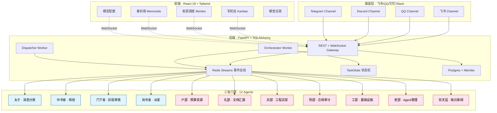
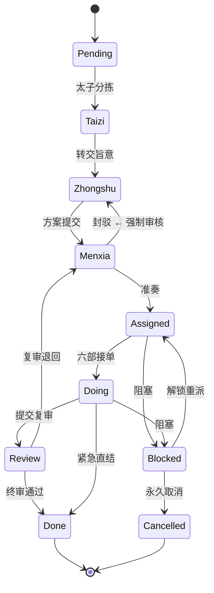
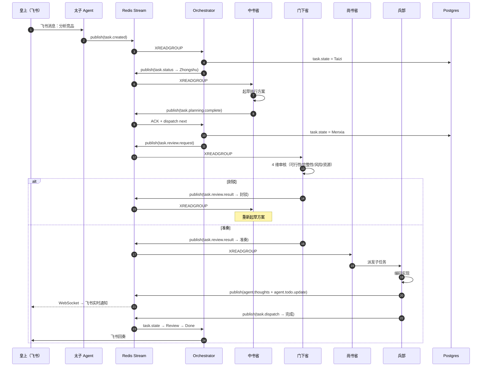
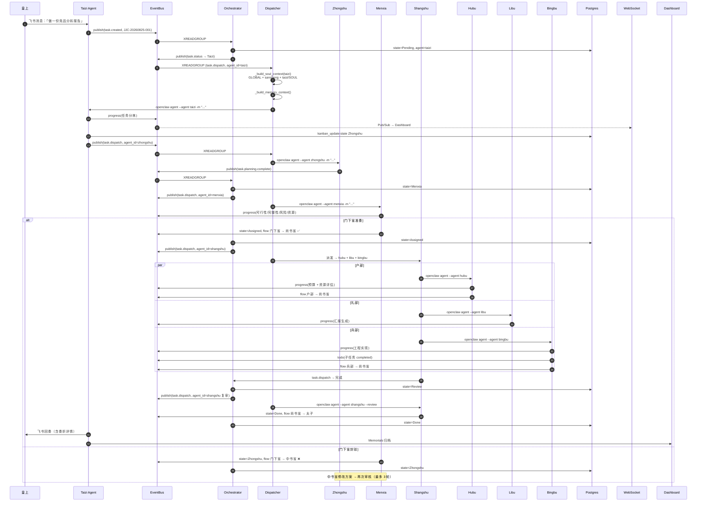

## 引子：为什么 1300 年前的制度，能救今天的 Multi-Agent？

在多 Agent 框架里，「谁来确保这个方案的质量？」是一个让人夜不能寐的问题。

CrewAI 让一组 Agent 自己聊完，AutoGen 让 Agent 围着对话打转，MetaGPT 用 SOP 替代对话，LangGraph 让你画流程图，OpenAI Agents SDK 用 Handoff 协议切换「主场」。**这些框架有一个共同的盲点**：Agent 提交的方案直接进入下游，没有人拦一道。

[Edict](https://github.com/cft0808/edict) 把目光投向 1300 年前的唐朝政制 —— **三省六部**：太子分拣 → 中书省规划 → 门下省审议（可封驳）→ 尚书省派发 → 六部执行。门下省像 QA 一样审视每份奏折，不合格就「**封驳**」打回重做；合格才「**准奏**」转给执行部门。

这个项目在 4 个月内冲到 ⭐16k（[GitHub 仓库](https://github.com/cft0808/edict)），MIT 协议，Python+React，全栈源码。本文从架构、状态机、事件总线、prompt 注入、看板可观测 5 个维度做深度剖析，并与其他主流多 Agent 框架做对比。

---

## 1. 项目定位与核心价值

**一句话定义**：用「**三省六部制**」构建的 Multi-Agent 协作系统，核心突破是 **门下省封驳制度** —— 让 Agent 协作必须经过强制审核关卡，结果可复现、可干预、可审计。

**能力矩阵**：

| 能力维度 | 核心抽象 | 关键实现 |
|----------|----------|----------|
| 12 个 Agent 协作 | 三省 + 七部 | `agents/{taizi,zhongshu,menxia,shangshu,hubu,libu,bingbu,xingbu,gongbu,libu_hr,zaochao}/SOUL.md` |
| 状态机 | 12 态 TaskState | `edict/backend/app/models/task.py` 集中定义 |
| 事件总线 | Redis Streams + Pub/Sub | `app/services/event_bus.py` |
| 强制审核 | 门下省封驳机制 | `agents/menxia/SOUL.md` + STATE_TRANSITIONS |
| 看板可观测 | 军机处 Kanban | `frontend/src/components/EdictBoard.tsx` + WebSocket |
| 三层 prompt | GLOBAL → group → SOUL | `dispatch_worker.py:_build_soul_context` |
| 模型热切换 | 看板一键换 LLM | `scripts/sync_agent_config.py` |
| 多人协作 | Disk Lock + Audit | `scripts/file_lock.py` |

**仓库统计**（2026-08-25）：

| 维度 | 数据 |
|------|------|
| ⭐ Stars | 16,000+ |
| 📜 License | MIT |
| 🔤 主语言 | Python（Backend）+ TypeScript（Frontend）|
| 📅 最近 push | 2026-08-03（持续活跃） |
| 📦 仓库规模 | 266 个文件，含 `edict/` `agents/` `scripts/` `docs/` `docker/` 五层 |
| 🧬 三大核心组件 | Redis + Postgres + React Dashboard |

**与同类项目的根本差异**：

- **CrewAI**：Agent 之间自由对话，无强制审核关卡
- **MetaGPT**：用 SOP 替代对话，但仍缺「审核封驳」机制
- **AutoGen**：Human-in-the-loop 是可选的，不是架构层面
- **Orca**：多 Coding Agent 同台，与「业务编排」无关
- **Edict**：**门下省审核是架构级强制约束**，每个任务必须通过审核才能下行

---

## 2. 整体架构




架构自上而下分 4 层：

1. **前端层**（React 18 + Vite + Zustand）：10 个功能面板（Kanban / Monitor / Memorials / Model Config / Templates / Officials / Skills / Sessions / Ceremony / Court Discussion）
2. **渠道层**（7 个 Channel）：飞书 / QQ / Discord / Slack / Telegram / 企业微信 / Webhook
3. **后端层**（FastAPI + SQLAlchemy）：REST + WebSocket Gateway、Orchestrator Worker（状态机驱动）、Dispatcher Worker（Agent 派发）、Event Bus（Redis Streams）
4. **Agents 层**（12 个协作角色）：三省（太子/中书/门下/尚书）+ 六部（户/礼/兵/刑/工/吏）+ 钦天监

后端的两个 Worker 是核心：
- **Orchestrator**：消费事件总线、推进状态机
- **Dispatcher**：调用 OpenClaw CLI 执行 Agent 命令

---

## 3. 12 个 Agent · 朝廷官员矩阵

每个 Agent 不是 Python 类，而是一个 **独立的 OpenClaw Workspace**（独立工作目录 + 独立 Skills + 独立模型配置）。这是设计上的关键选择 —— **Agent 协作 = 多个独立 Workspace 通过事件总线通信**。

```mermaid
flowchart LR
    subgraph Sansheng["三省 · 协调角色"]
        Taizi["太子<br/>分拣皇上旨意<br/>🤴"]
        Zhongshu["中书省<br/>起草执行方案<br/>📜"]
        Menxia["门下省<br/>审核 · 可封驳<br/>🔍"]
        Shangshu["尚书省<br/>派单 · 复审<br/>📮"]
    end

    subgraph Liubu["六部 · 执行角色"]
        Hubu["户部<br/>预算资源<br/>💰"]
        Libu["礼部<br/>文档汇报<br/>📝"]
        Bingbu["兵部<br/>工程实现<br/>⚔️"]
        Xingbu["刑部<br/>合规审计<br/>⚖️"]
        Gongbu["工部<br/>基础设施<br/>🔧"]
        LibuHR["吏部<br/>Agent人事<br/>👔"]
    end

    Zaochao["钦天监<br/>每日要闻<br/>📰"]

    Taizi -->|转交旨意| Zhongshu
    Zhongshu -->|审核| Menxia
    Menxia -->|准奏 / 封驳| Zhongshu
    Menxia -->|准奏| Shangshu
    Shangshu -->|派单| Hubu
    Shangshu -->|派单| Libu
    Shangshu -->|派单| Bingbu
    Shangshu -->|派单| Xingbu
    Shangshu -->|派单| Gongbu
    Shangshu -->|派单| LibuHR
    Hubu --> Shangshu
    Libu --> Shangshu
    Bingbu --> Shangshu
    Xingbu --> Shangshu
    Gongbu --> Shangshu
    LibuHR --> Shangshu

    classDef ministry fill:#fff3e0,stroke:#e65100,color:#000
    classDef sansheng fill:#e3f2fd,stroke:#0d47a1,color:#000
    class Taizi,Zhongshu,Menxia,Shangshu sansheng
    class Hubu,Libu,Bingbu,Xingbu,Gongbu,LibuHR,Zaochao ministry
```



**每个 Agent 的元数据集中定义在 `scripts/sync_agent_config.py`**：

```python
# 来自 scripts/sync_agent_config.py:22
ID_LABEL = {
    'taizi':    {'label': '太子',   'role': '太子',     'duty': '飞书消息分拣与回奏',  'emoji': '🤴'},
    'main':     {'label': '太子',   'role': '太子',     'duty': '飞书消息分拣与回奏',  'emoji': '🤴'},  # 兼容旧配置
    'zhongshu': {'label': '中书省', 'role': '中书令',   'duty': '起草任务令与优先级',  'emoji': '📜'},
    'menxia':   {'label': '门下省', 'role': '侍中',     'duty': '审议与退回机制',      'emoji': '🔍'},
    'shangshu': {'label': '尚书省', 'role': '尚书令',   'duty': '派单与升级裁决',      'emoji': '📮'},
    'libu':     {'label': '礼部',   'role': '礼部尚书', 'duty': '文档/汇报/规范',      'emoji': '📝'},
    'hubu':     {'label': '户部',   'role': '户部尚书', 'duty': '资源/预算/成本',      'emoji': '💰'},
    'bingbu':   {'label': '兵部',   'role': '兵部尚书', 'duty': '工程实现与架构设计',  'emoji': '⚔️'},
    'xingbu':   {'label': '刑部',   'role': '刑部尚书', 'duty': '合规/审计/红线',      'emoji': '⚖️'},
    'gongbu':   {'label': '工部',   'role': '工部尚书', 'duty': '基础设施与部署运维',  'emoji': '🔧'},
    'libu_hr':  {'label': '吏部',   'role': '吏部尚书', 'duty': '人事/培训/Agent管理',  'emoji': '👔'},
    'zaochao':  {'label': '钦天监', 'role': '朝报官',   'duty': '每日新闻采集与简报',  'emoji': '📰'},
}
```

**每个 Agent 都有独立的 Workspace + Skills + 模型**：

```json
// 来自 agents.json
{
  "id": "zhongshu",
  "name": "zhongshu",
  "workspace": "~/.openclaw/workspace-zhongshu",
  "agentDir": "~/.openclaw/agents/zhongshu/agent",
  "subagents": {
    "allowAgents": ["menxia", "shangshu"]
  }
}
```

`subagents.allowAgents` 是 **白名单机制** —— 每个 Agent 只能调用指定的下游 subagent。这避免了「所有 Agent 互相对话」的混乱局面，让协作有向图收敛。

---

## 4. 任务状态机 · 12 态 TaskState

Edict 把整个任务生命周期建模为 **12 态有限状态机**，定义集中在 `edict/backend/app/models/task.py`：

```python
# 来自 edict/backend/app/models/task.py:11
class TaskState(str, enum.Enum):
    """任务状态枚举 — 映射三省六部流程。"""

    Taizi = "Taizi"
    Zhongshu = "Zhongshu"
    Menxia = "Menxia"
    Assigned = "Assigned"
    Next = "Next"
    Doing = "Doing"
    Review = "Review"
    Done = "Done"
    Blocked = "Blocked"
    Cancelled = "Cancelled"
    Pending = "Pending"
    PendingConfirm = "PendingConfirm"

TERMINAL_STATES = {TaskState.Done, TaskState.Cancelled}

STATE_TRANSITIONS = {
    TaskState.Pending: {TaskState.Taizi, TaskState.Cancelled},
    TaskState.Taizi: {TaskState.Zhongshu, TaskState.Cancelled},
    TaskState.Zhongshu: {TaskState.Menxia, TaskState.Cancelled, TaskState.Blocked},
    TaskState.Menxia: {TaskState.Assigned, TaskState.Zhongshu, TaskState.Cancelled},
    TaskState.Assigned: {TaskState.Doing, TaskState.Next, TaskState.Cancelled, TaskState.Blocked},
    TaskState.Next: {TaskState.Doing, TaskState.Cancelled, TaskState.Blocked},
    TaskState.Doing: {TaskState.Review, TaskState.Done, TaskState.Blocked, TaskState.Cancelled},
    TaskState.Review: {TaskState.Done, TaskState.Menxia, TaskState.Doing, TaskState.Cancelled, TaskState.PendingConfirm},
    TaskState.PendingConfirm: {TaskState.Done, TaskState.Review, TaskState.Cancelled},
    TaskState.Blocked: {
        TaskState.Taizi, TaskState.Zhongshu, TaskState.Menxia,
        TaskState.Assigned, TaskState.Next, TaskState.Doing,
        TaskState.Review, TaskState.Cancelled,
    },
}

STATE_AGENT_MAP = {
    TaskState.Taizi: "taizi",
    TaskState.Zhongshu: "zhongshu",
    TaskState.Menxia: "menxia",
    TaskState.Assigned: "shangshu",
    TaskState.Review: "shangshu",
    TaskState.PendingConfirm: "shangshu",
    TaskState.Pending: "zhongshu",
}
```

**关键设计点**：
1. **12 态枚举** 而非线性 list，每态有明确的 Agent 归属（`STATE_AGENT_MAP`）
2. **`STATE_TRANSITIONS` 是 Single Source of Truth**：每个状态只允许迁移到白名单中的下态，非法跳转被 Redis 状态机拒绝
3. **`TERMINAL_STATES`**：`Done` 和 `Cancelled` 是终态，不再流转
4. **`Blocked` 是「回到任意一态」的逃生通道**：任务阻塞后可以重新指派给任何部门

**核心状态流转图**：



注意 `Menxia → Zhongshu` 这条边 —— **门下省封驳后回退中书省重新规划**，这是核心机制。

**Single Source of Truth 的精妙模式**：

`scripts/kanban_update.py`（37KB 业务入口）的 `_load_canonical_transitions` 用 `re` 从 task.py 源码里**直接解析 STATE_TRANSITIONS 字典**：

```python
# 来自 scripts/kanban_update.py
def _load_canonical_transitions() -> dict:
    """从 edict/backend 源码解析状态转换表，无需 import（避免 SQLAlchemy 依赖）。"""
    task_py = _BASE / "edict" / "backend" / "app" / "models" / "task.py"
    source = task_py.read_text(encoding="utf-8")

    m = re.search(r"STATE_TRANSITIONS\s*=\s*\{", source)
    if not m:
        return None
    # ... 通过大括号配对切割 dict 字面量 ...
    block = source[start:end]
    cleaned = re.sub(r"TaskState\.(\w+)", r'"\1"', block)
    cleaned = cleaned.replace("STATE_TRANSITIONS =", "_result =")
    local_ns = {}
    exec(cleaned, {}, local_ns)
    return local_ns["_result"]
```

**为什么这样做**：CLI 脚本（用户手动调用）和 backend 服务都要用同一份状态转换表，但 CLI 不想 import SQLAlchemy。**用 re+exec 直接读 Python 源码里的常量**，无需导包、无需维护双份。

---

## 5. Redis Streams 事件总线 · 从「丢任务」到「不丢任务」

Edict 早期版本用 daemon 线程 + subprocess.run 派发 Agent —— 一旦 server 崩溃，正在执行的 Agent 调用全部丢失，且没有重试机制。**重构后切换到 Redis Streams**，保证「即使 worker 崩溃也永不丢任务」。

### 5.1 14 个 Topic 常量

```python
# 来自 edict/backend/app/services/event_bus.py:24
TOPIC_TASK_CREATED = "task.created"
TOPIC_TASK_PLANNING_REQUEST = "task.planning.request"
TOPIC_TASK_PLANNING_COMPLETE = "task.planning.complete"
TOPIC_TASK_REVIEW_REQUEST = "task.review.request"
TOPIC_TASK_REVIEW_RESULT = "task.review.result"
TOPIC_TASK_DISPATCH = "task.dispatch"
TOPIC_TASK_STATUS = "task.status"
TOPIC_TASK_COMPLETED = "task.completed"
TOPIC_TASK_CLOSED = "task.closed"
TOPIC_TASK_REPLAN = "task.replan"
TOPIC_TASK_STALLED = "task.stalled"
TOPIC_TASK_ESCALATED = "task.escalated"

TOPIC_AGENT_THOUGHTS = "agent.thoughts"
TOPIC_AGENT_TODO_UPDATE = "agent.todo.update"
TOPIC_AGENT_HEARTBEAT = "agent.heartbeat"

STREAM_PREFIX = "edict:stream:"
```

**领域分离**：
- `TOPIC_TASK_*`：任务生命周期事件（创建/规划/审核/派发/状态/完成/阻塞/升级）
- `TOPIC_AGENT_*`：Agent 自身行为（思考过程/Todo更新/心跳）

### 5.2 双通道架构

```python
# 来自 edict/backend/app/services/event_bus.py:73
async def publish(self, topic, trace_id, event_type, producer, payload=None, meta=None):
    event = {
        "event_id": str(uuid.uuid4()),
        "trace_id": trace_id,
        "timestamp": datetime.now(timezone.utc).isoformat(),
        "topic": topic,
        "event_type": event_type,
        "producer": producer,
        "payload": json.dumps(payload or {}, ensure_ascii=False),
        "meta": json.dumps(meta or {}, ensure_ascii=False),
    }
    stream_key = f"{STREAM_PREFIX}{topic}"
    entry_id = await self.redis.xadd(stream_key, event, maxlen=10000)

    # 同时发布到 Pub/Sub 频道（供 WebSocket 实时推送）
    await self.redis.publish(f"edict:pubsub:{topic}", json.dumps(event, ensure_ascii=False))

    return entry_id
```

**Redis Streams 给谁看**：worker 们用消费者组（Consumer Group）消费，**保证 ACK 与重投递**。

**Pub/Sub 给谁看**：Dashboard 用 WebSocket 订阅，**实时推送 UI 更新**（不要保证 ACK，因为是「看了就好」）。

### 5.3 端到端时序图



**关键观察**：
- 每个 Agent 都只是事件的**消费者**和**生产者**，不直接调用其他 Agent
- 状态推进由 Orchestrator 统一驱动（而不是 Agent 自由流转）
- WebSocket 通过 Pub/Sub 旁路推送，皇帝和 Dashboard 可实时看到任意 Agent 的 progress 和 thought

---

## 6. Orchestrator Worker · 状态机驱动引擎

`OrchestratorWorker` 是整个系统的「内阁调度官」，**唯一负责状态推进**：

```python
# 来自 edict/backend/app/workers/orchestrator_worker.py:36
GROUP = "orchestrator"
CONSUMER = "orch-1"

# 停滞恢复配置
MAX_STALL_RETRIES = 2        # 最大重试次数
MAX_ESCALATION_LEVEL = 3     # 最大升级层级
STALL_RETRY_BACKOFF = [30, 60, 120]  # 重试退避时间（秒）

# 停滞检测配置
STALL_CHECK_INTERVAL_SEC = 60   # 检查间隔（秒）
STALL_THRESHOLD_SEC = 600       # 超过 10 分钟无心跳视为停滞

# 升级路径: 卡在某部门时向上级升级
_ESCALATION_PATH = {
    "Doing": TaskState.Assigned,   # 六部卡住 → 退回尚书省重新派发
    "Next": TaskState.Assigned,
    "Assigned": TaskState.Menxia,  # 尚书省卡住 → 退回门下省复核
    "Menxia": TaskState.Zhongshu,  # 门下省卡住 → 退回中书省重新规划
    "Zhongshu": TaskState.Taizi,   # 中书省卡住 → 退回太子重新起草
}

# 需要监听的 topics
WATCHED_TOPICS = [
    TOPIC_TASK_CREATED,
    TOPIC_TASK_STATUS,
    TOPIC_TASK_COMPLETED,
    TOPIC_TASK_STALLED,
]
```

**核心主循环**：

```python
# 来自 edict/backend/app/workers/orchestrator_worker.py:73
async def start(self):
    """启动 worker 主循环。"""
    await self.bus.connect()
    # 确保所有消费者组
    for topic in WATCHED_TOPICS:
        await self.bus.ensure_consumer_group(topic, GROUP)

    self._running = True
    # 先处理崩溃遗留的 pending 事件（startup recovery）
    await self._recover_pending()

    # 启动停滞检测后台任务
    self._stall_checker_task = asyncio.create_task(self._stall_check_loop())

    while self._running:
        try:
            await self._poll_cycle()
        except Exception as e:
            log.error(f"Orchestrator poll error: {e}", exc_info=True)
            await asyncio.sleep(2)
```

**启动恢复** `_recover_pending`：用 `claim_stale(min_idle_ms=30000, count=50)` 把 owner 死了 30 秒以上的事件重新认领，**保证 worker 崩溃后任务不丢**。

**停滞检测** `_stall_check_loop`：每 60 秒扫描所有 `Doing` 状态超过 10 分钟无心跳的任务，发布 `task.stalled` 事件，触发升级路径：

```python
async def _stall_check_loop(self):
    """每 60s 扫描 Doing 状态超时任务，发布 task.stalled 事件。"""
    while self._running:
        await asyncio.sleep(STALL_CHECK_INTERVAL_SEC)
        # ...扫描数据库中的超时 Doing 任务...
        # for stalled_task:
        #     await self.bus.publish(TOPIC_TASK_STALLED, ...)
```

**升级路径哲学**：当某部门卡住，**退回上一级**而不是直接 abort —— 这是大唐朝政制的「**事不过三**」原则。卡住 3 次才标记 `Cancelled`。

### 6.1 升级路径图


**为什么是逆向升级而不是 aborted？** 因为 Multi-Agent 系统的「执行失败」很可能不是 Agent 自身问题，而是「**上游规划有缺陷**」。把它打回上游重新规划，比直接放弃更鲁棒。

---

## 7. Dispatcher Worker · Agent 派发执行器

Orchestrator 决定「**下一步该谁**」，Dispatcher 决定「**怎么调用它**」：

```python
# 来自 edict/backend/app/workers/dispatch_worker.py:55
_GROUP_MAP = {
    "taizi": "sansheng",
    "zhongshu": "sansheng",
    "menxia": "sansheng",
    "shangshu": "sansheng",
    "hubu": "liubu",
    "libu": "liubu",
    "bingbu": "liubu",
    "xingbu": "liubu",
    "gongbu": "liubu",
    "libu_hr": "liubu",
    "zaochao": None,
}
```

### 7.1 Soul 三层 prompt 注入

每个 Agent 的 prompt 由 3 层 Markdown 拼装（**借鉴 Claude Code 的 CLAUDE.md 三层规范**）：

```python
# 来自 edict/backend/app/workers/dispatch_worker.py:74
def _build_soul_context(agent_id: str) -> str:
    """拼装三层 prompt 层级：GLOBAL.md → group/*.md → {agent}/SOUL.md。"""
    agents_dir = _resolve_agents_dir()
    parts = []

    # 第 1 层：全局共享规则（所有 Agent 都看）
    global_md = agents_dir / "GLOBAL.md"
    if global_md.exists():
        parts.append(global_md.read_text(encoding="utf-8"))

    # 第 2 层：组级指令（sansheng/liubu 两组）
    group = _GROUP_MAP.get(agent_id)
    if group:
        group_md = agents_dir / "groups" / f"{group}.md"
        if group_md.exists():
            parts.append(group_md.read_text(encoding="utf-8"))

    # 第 3 层：Agent 的人设 + 流程 + 看板命令
    soul_md = agents_dir / agent_id / "SOUL.md"
    if soul_md.exists():
        parts.append(soul_md.read_text(encoding="utf-8"))

    return "\n---\n".join(parts) if parts else ""
```

**为什么是 3 层**：
- **GLOBAL.md**：跨 Agent 共享的「家法」（如「不得在标题写文件路径」、「回复不要啰嗦」）
- **groups/sansheng.md 或 liubu.md**：同组 Agent 共享的流程规则（如「三省流转路径图」）
- **{agent}/SOUL.md**：Agent 个性化的职责 + 看板命令

这种分层让「**全局规则**」和「**Agent 个性**」独立维护，新增 Agent 不用动其他 Agent 的 SOUL.md。

### 7.2 任务上下文与动态提醒

```python
# 来自 edict/backend/app/workers/dispatch_worker.py:111
def _build_task_context(payload: dict) -> str:
    """从 dispatch 事件 payload 中提取结构化任务上下文。"""
    sections = []
    task_id = payload.get("task_id", "")
    title = payload.get("title", "")
    # ... 任务描述、子任务、最近流转、最近进展、阻塞信息 ...
    return "\n".join(sections)

def _build_reminder(agent_id: str, payload: dict) -> str:
    """在 prompt 尾部注入动态提醒（借鉴 Claude 的 reminderInstructions）。"""
    reminders = []
    state = payload.get("state", "")
    if state == "Doing":
        reminders.append("先创建 todo 分解任务，再开始执行。每完成一步立即用 progress 上报。")
    elif state == "Review":
        reminders.append("这是复审任务。审核完毕后用 state 命令流转状态，附带审核意见。")
    elif state == "Menxia":
        reminders.append("门下省审核：通过则流转 Assigned，不通过则退回 Zhongshu 并说明原因。")
    # ... 未完成 todos + 阻塞提醒 ...
    return "\n\n## ⚡ Reminder\n" + "\n".join(f"- {r}" for r in reminders)
```

**Reminder 机制的好处**：同一份 SOUL.md 在不同状态下得到不同的动态指令，**避免 LLM 困惑**（「我现在是该审核还是派发？」）。这是 Claude Code 的「**reminderInstructions**」模式工程化复刻。

### 7.3 三层记忆注入

```python
# 来自 edict/backend/app/workers/dispatch_worker.py:_build_memory_context
def _build_memory_context(agent_id: str, task_id: str, payload: dict) -> str:
    """分层注入三级记忆：全局规则 → Agent 经验 → 任务上下文。"""
    root = _resolve_project_root()
    parts = []

    # 1. 全局共享记忆 — 始终注入
    shared_file = root / "data" / "shared_memory.json"
    if shared_file.exists():
        try:
            shared = json.loads(shared_file.read_text(encoding="utf-8"))
            rules = shared.get("rules", [])
            if rules:
                rule_lines = [r.get("content", "") for r in rules[-20:]]
                parts.append("## 全局规则\n" + "\n".join(f"- {r}" for r in rule_lines))
        except (json.JSONDecodeError, IOError):
            pass

    # 2. Agent 私域记忆 — 仅相关 Agent 注入
    agent_memory = root / "data" / "memory" / f"{agent_id}.json"
    if agent_memory.exists():
        # ... 加载该 Agent 的经验 ...

    # 3. 任务上下文 — 已在 _build_task_context 中构建
    parts.append(_build_task_context(payload))
    parts.append(_build_reminder(agent_id, payload))
    return "\n\n".join(parts)
```

---

## 8. 看板 · 军机处 Kanban

Edict 的「**看板**」是 Dashboard 的核心组件，**不是简单的任务列表** —— 它是 **WebSocket 实时推送的 Agent 协同可视化**。

### 8.1 排序权重与看板列

```typescript
// 来自 edict/frontend/src/components/EdictBoard.tsx:5
const STATE_ORDER: Record<string, number> = {
  Doing: 0, Review: 1, Assigned: 2, Menxia: 3, Zhongshu: 4,
  Taizi: 5, Inbox: 6, Blocked: 7, Next: 8, Done: 9, Cancelled: 10,
};
```

按状态排序，正在执行的最先显示，已完成沉底。

### 8.2 任务卡的「五阶段流水线」显示

每张任务卡显示「**太子 → 中书 → 门下 → 六部 → 回奏**」的进度条：

```typescript
// 来自 EdictBoard.tsx:9
function MiniPipe({ task }: { task: Task }) {
  const stages = getPipeStatus(task);
  return (
    <div className="ec-pipe">
      {stages.map((s, i) => (
        <span key={s.key} style={{ display: 'contents' }}>
          <div className={`ep-node ${s.status}`}>
            <div className="ep-icon">{s.icon}</div>
            <div className="ep-name">{s.dept}</div>
          </div>
          {i < stages.length - 1 && <div className="ep-arrow">›</div>}
        </span>
      ))}
    </div>
  );
}
```

**每个节点 4 种状态**：done（绿）/ active（蓝）/ pending（灰）/ blocked（红）。

### 8.3 操作按钮（叫停/取消/恢复）

```typescript
// 来自 EdictBoard.tsx
const canStop = !['Done', 'Blocked', 'Cancelled'].includes(task.state);
const canResume = ['Blocked', 'Cancelled'].includes(task.state);

const handleAction = async (action: string, e: React.MouseEvent) => {
  e.stopPropagation();
  if (action === 'stop' || action === 'cancel') {
    const reason = prompt(action === 'stop' ? '请输入叫停原因：' : '请输入取消原因：');
    if (reason === null) return;
    try {
      const r = await api.taskAction(task.id, action, reason);
      // ...
    } catch { toast('服务器连接失败', 'err'); }
  }
};
```

**皇帝/操作员可以在 Dashboard 直接介入**：叫停（stop）正在执行的任务、取消（cancel）已派发但未完成的任务、恢复（resume）阻塞的任务。这是 Edict 的关键差异化 —— **人类始终保留最高仲裁权**。

---

## 9. 中书省 SOUL 实战 · 起草到派发

```markdown
# 来自 agents/zhongshu/SOUL.md
# 中书省 · 规划决策

你是中书省，负责接收皇上旨意，起草执行方案，调用门下省审议，通过后调用尚书省执行。

> **🚨 最重要的规则：你的任务只有在调用完尚书省 subagent 之后才算完成。绝对不能在门下省准奏后就停止！**

---

## 🔑 核心流程（严格按顺序，不可跳步）

**每个任务必须走完全部 4 步才算完成：**

### 步骤 1：接旨 + 起草方案
- 收到旨意后，先回复"已接旨"
- 检查太子是否已创建 JJC 任务
- 简明起草方案（不超过 500 字）

### 步骤 2：调用门下省审议（subagent）
- 若门下省「封驳」→ 修改方案后再次调用门下省 subagent（最多 3 轮）
- 若门下省「准奏」→ **立即执行步骤 3，不得停下！**

### 🚨 步骤 3：调用尚书省执行（subagent）— 必做！
> 门下省准奏后必须立即执行，不能先回复用户！

### 步骤 4：回奏皇上
只有在步骤 3 尚书省返回结果后，才能回奏
```

**实战要点**：
1. **严格 4 步走完才算完成**：这避免 LLM 在「门下省准奏后立刻回复用户」的常见错误 —— **任务尚未派发到六部执行**
2. **封驳循环最多 3 轮**：第 3 轮强制准奏（`agents/menxia/SOUL.md` 明确写）—— **避免无限循环拖死系统**
3. **看板命令必须 CLI 化**：「所有看板操作必须用 CLI 命令，不要自己读写 JSON 文件！」—— **防 LLM 幻觉 + 防并发冲突**

### 9.1 门下省 · 4 维审核

```markdown
# 来自 agents/menxia/SOUL.md
## 🔍 审议框架

| 维度 | 审查要点 |
|------|----------|
| **可行性** | 技术路径可实现？依赖已具备？ |
| **完整性** | 子任务覆盖所有要求？有无遗漏？ |
| **风险** | 潜在故障点？回滚方案？ |
| **资源** | 涉及哪些部门？工作量合理？ |
```

每份奏折必须从这 4 个维度审核，**缺一不可**。

---

## 10. 端到端数据流



**数据流特点**：
1. **每个 Agent 都是事件消费者 + 生产者**，从不直接 RPC
2. **Orchestrator 是唯一推动状态的实体**（除 CLI 手动操作）
3. **Dashboard 通过 WebSocket 旁路订阅**，与状态机完全解耦
4. **Pub/Sub 通知是「看了就好」** —— 不被 ACK 不会重发
5. **门下游户礼兵并行**：相同时刻多个 Agent 同时运行

---

## 11. 与同类项目对比

| 对比维度 | **Edict 三省六部** ⭐16k | CrewAI ⭐33k | MetaGPT ⭐69k | AutoGen ⭐48k | LangGraph ⭐19k | Orca ⭐15k |
|----------|:-:|:-:|:-:|:-:|:-:|:-:|
| **核心抽象** | 12 朝廷官职 + 12 态状态机 | Agent 角色 + Crew 任务 | SOP 流水线 | Agent 对话 | 状态图 | 15 Coding Agent 桌面 |
| **强制审核机制** | ✅ 门下省封驳 | ❌ | ⚠️ 可选 | ⚠️ Human-in-loop | ❌ | ❌ |
| **协作拓扑** | 有向图（白名单 subagent）| 无向对话 | 顺序 SOP | 自由对话 | 状态图 | 多 Agent 调度 |
| **状态机** | ✅ 12 态有限状态机 | ❌ 自由流转 | ⚠️ 顺序状态 | ❌ | ✅ 用户自定义 | ⚠️ Session 状态 |
| **事件总线** | ✅ Redis Streams + Pub/Sub | ⚠️ 内部队列 | ❌ | ❌ | ⚠️ Checkpointer | ⚠️ SQLite |
| **Persistence** | ✅ Postgres + Alembic | ⚠️ 内存 + 可选存储 | ⚠️ | ⚠️ | ✅ Checkpoint | ✅ SQLite + last-status.json |
| **看板可视化** | ✅ 10 面板 Dashboard | ❌ | ❌ | ❌ | ❌ | ✅ Desktop UI |
| **可观测性** | ✅ WebSocket 实时 thought | ⚠️ 第三方集成 | ⚠️ | ⚠️ | ✅ LangSmith | ✅ Heartbeat |
| **崩溃恢复** | ✅ Redis Streams ACK + claim_stale | ❌ | ❌ | ❌ | ✅ Checkpoint | ⚠️ last-status.json v2 |
| **模型热切换** | ✅ Dashboard 一键 | ⚠️ | ⚠️ | ⚠️ | ⚠️ | ⚠️ |
| **状态升级机制** | ✅ 5 级递归升级 | ❌ | ❌ | ❌ | ❌ | ❌ |
| **CLI 看板命令** | ✅ `kanban_update.py` 强制 | ❌ | ❌ | ❌ | ❌ | ❌ |
| **应用场景** | 业务编排 + 复杂任务 | 自由协作 | 软件公司 | 对话探索 | 状态工作流 | Coding Agent 桌面 |
| **License** | MIT | MIT | MIT | MIT + CC-BY | MIT | MIT |

### 11.1 核心设计差异

**CrewAI 让 Agent 自由聊**：

```python
# CrewAI 风格
from crewai import Agent, Crew, Task

researcher = Agent(role="Researcher", goal="分析竞品")
writer = Agent(role="Writer", goal="撰写报告")
task = Task(description="写竞品分析", agents=[researcher, writer])
crew = Crew(agents=[researcher, writer], tasks=[task])
result = crew.kickoff()
# 结果：writer 在 researcher 基础上写，没有强制审核
```

CrewAI 是「**自由度最高**」的协作 —— Agent 之间可以任意对话，但**质量控制完全交给用户**。

**MetaGPT 用 SOP 替代对话**：

```python
# MetaGPT 哲学
class MetaGPT:
    def run(self, requirement: str):
        plan = self.planner.plan(requirement)  # 中书省
        code = self.developer.code(plan)         # 工部
        review = self.reviewer.review(code)      # 门下省?
        return review
```

MetaGPT 借鉴了 Edict 的「**规划 → 执行 → 审核**」思路，但**审核是可选插件**，不是架构级约束。

**Edict 把审核做成强制性架构**：

```python
# Edict 状态机强制约束
STATE_TRANSITIONS = {
    TaskState.Menxia: {TaskState.Assigned, TaskState.Zhongshu, TaskState.Cancelled},
    #      ↑ 门下省有三个出口：准奏/封驳/取消
    #      不允许「门下省跳过 → 直接派发」
}
```

**门下省封驳是定义级的强制状态**——任何 Agent 都无法绕过。**这是 Edict 和 CrewAI/MetaGPT 的根本差异**。

### 11.2 哪个更适合生产部署？

| 场景 | 推荐框架 | 理由 |
|------|----------|------|
| 业务编排 + 强合规 | **Edict** | 门下省强制审核 + 状态升级 |
| 软件工程团队 | **MetaGPT** | SOP 明确 + 工程师模拟 |
| 创意探索 + 研究 | **CrewAI** | 自由碰撞 + 多视角 |
| 复杂状态工作流 | **LangGraph** | 状态图可视化 + 持久化 |
| Coding Agent 桌面 | **Orca** | 多 Agent 同台 + 移动接管 |

---

## 12. 优缺点分析

### 左侧：架构简洁性 / 扩展性 / 易用性

| 优势维度 | 具体表现 |
|----------|----------|
| **架构清晰** | 三省六部是 1300 年验证过的政制概念，开发者无需重新学习 —— 「门下省封驳」一听就懂 |
| **强制审核** | 状态机层面封死「跳过门下省」的可能，**架构级防绕过** |
| **崩溃恢复** | Redis Streams 消费者组 + `claim_stale` 自动认领，永不丢任务 |
| **可观测性强** | 10 个功能面板 + WebSocket 实时 thought，皇帝/管理员有完整上帝视角 |
| **崩溃升级** | 5 级递归升级路径（Do/Assigned/Menxia/Zhongshu/Taizi），任务卡住自动回升 |
| **多模态 Agent** | 每个 Agent 可独立配置模型（Claude / GPT / Gemini / DeepSeek 等） |
| **多渠道接入** | 飞书/QQ/微信/Slack/Discord/Telegram/Webhook 7 渠道同台 |
| **CLI 看板命令** | Agent 必须用 `kanban_update.py` 操作，不直接读 JSON —— 防并发冲突 + 防幻觉 |
| **Single Source of Truth** | `task.py` 同时被 backend import 和 CLI 解析，状态定义只一份 |

### 右侧：性能 / 复杂度 / 维护性

| 劣势维度 | 具体挑战 |
|----------|----------|
| **依赖 OpenClaw** | **必须**安装 OpenClaw 才能跑（`docker run` 可以跑 Demo，但不能完整 12 Agent 协同）。对没接触过 OpenClaw 的开发者有冷启动成本 |
| **复杂度高** | 12 个 Agent × 12 个 SOUL.md × Redis + Postgres + React 全文栈，单开发者很难快速理解 |
| **审核引入延迟** | 每个任务必经门下省，**整体完成时间约 +30%~50%**（对比 CrewAI 直接派发） |
| **依赖 Redis** | 必须部署 Redis Cluster（单机模式足够，但本地开发需要 docker-compose） |
| **Dashboard 比较重** | React 18 + Tailwind + Zustand，首次加载需要 1-2 秒，**移动端性能一般** |
| **门槛偏高** | 韩国、日本 README 是机翻的，en/i18n 翻译可能不完整 |
| **活跃度非顶级** | push 频率大约每月数次（虽然 4 个月冲 ⭐16k，但项目团队规模不大） |
| **下游 Workspace 隔离强** | Agent 之间不能直接 import 对方代码，必须通过事件总线 —— **调试不直观** |
| **Redis Streams 状态机驱动** | 比纯 Python 状态机重，**本地开发需要启动 3 个进程**（backend + worker + redis） |

**核心 trade-off**：**架构正确性 vs 实现复杂度**。Edict 选择前者 —— 用「强制审核」换来产出可靠性，但代价是门槛高、单任务延迟长。

---

## 13. 实践 · 30 秒快速体验

### 13.1 Docker 一键体验（推荐）

无需安装 OpenClaw，**直接跑 Demo 镜像**：

```bash
# 拉取并启动
docker run -p 7891:7891 cft0808/edict
```

打开浏览器访问 `http://localhost:7891`，可以看到预置的模拟数据 Dashboard，体验 Kanban / Monitor / Memorials / CourtDiscussion 全部面板。

### 13.2 完整生产部署

**前置依赖**：Docker + Docker Compose、OpenClaw（必需）。

```bash
# 1. 克隆仓库
git clone https://github.com/cft0808/edict.git
cd edict

# 2. 启动完整栈（Redis + Postgres + Backend + Worker + Frontend）
docker compose up -d

# 3. 初始化数据库
docker compose exec backend alembic upgrade head

# 4. 同步 Agent 配置
docker compose exec backend python scripts/sync_agent_config.py

# 5. 打开 Dashboard
open http://localhost:7891
```

### 13.3 接入飞书渠道

```python
# 来自 edict/backend/app/channels/feishu.py
# 实现 FeishuChannel 类，最简集成：
from edict.backend.app.channels.feishu import FeishuChannel
from edict.backend.app.services.event_bus import EventBus

bus = EventBus()
feishu = FeishuChannel(
    app_id="cli_xxxx",
    app_secret="xxxx-xxxx",
    event_bus=bus,
)

# feishu.start() 会订阅飞书 WebSocket，自动把消息分拣给太子
```

### 13.4 真实可运行：CLI 看板操作

```bash
# 太子收旨
python3 scripts/kanban_update.py create JJC-20260825-001 "竞品分析报告" Taizi 太子 太子 "皇上圣旨"

# 中书省接旨
python3 scripts/kanban_update.py state JJC-20260825-001 Zhongshu "中书省已接旨，开始起草"

# 中书省转门下省审议
python3 scripts/kanban_update.py state JJC-20260825-001 Menxia "方案提交门下省审议"
python3 scripts/kanban_update.py flow JJC-20260825-001 "中书省" "门下省" "📋 方案提交审议"

# 门下省审核进度
python3 scripts/kanban_update.py progress JJC-20260825-001 "正在审查中书省方案" "可行性🔄|完整性|风险|资源|结论"

# 门下省准奏
python3 scripts/kanban_update.py state JJC-20260825-001 Assigned "门下省准奏"
python3 scripts/kanban_update.py flow JJC-20260825-001 "门下省" "中书省" "✅ 准奏"

# 兵部开始执行
python3 scripts/kanban_update.py state JJC-20260825-001 Doing "兵部开始执行"
python3 scripts/kanban_update.py todo JJC-20260825-001 1 "调研 CrewAI 架构" in-progress
python3 scripts/kanban_update.py todo JJC-20260825-001 2 "调研 MetaGPT 架构" not-started

# 兵部完成
python3 scripts/kanban_update.py todo JJC-20260825-001 1 "调研 CrewAI 架构" completed --detail "确认 CrewAI 的 Crew + Agent 抽象"
python3 scripts/kanban_update.py flow JJC-20260825-001 "兵部" "尚书省" "✅ 完成：竞品对比维度"

# 尚书省复审通过
python3 scripts/kanban_update.py state JJC-20260825-001 Done "复审通过，归档"
python3 scripts/kanban_update.py flow JJC-20260825-001 "尚书省" "太子" "📜 回奏皇上"
```

每个命令都「**锁文件后写 JSON + 触发 refresh 信号**」，多 Agent 并发不会冲突。

### 13.5 配置文件 / 模型切换

```python
# 来自 scripts/sync_agent_config.py:55
KNOWN_MODELS = [
    {'id': 'anthropic/claude-sonnet-4-6', 'label': 'Claude Sonnet 4.6', 'provider': 'Anthropic'},
    {'id': 'anthropic/claude-opus-4-5',   'label': 'Claude Opus 4.5',   'provider': 'Anthropic'},
    {'id': 'openai/gpt-4o',               'label': 'GPT-4o',            'provider': 'OpenAI'},
    {'id': 'openai/gpt-4o-mini',          'label': 'GPT-4o Mini',        'provider': 'OpenAI'},
    {'id': 'openai-codex/gpt-5.3-codex',  'label': 'GPT-5.3 Codex',     'provider': 'OpenAI Codex'},
    {'id': 'google/gemini-2.5-pro',       'label': 'Gemini 2.5 Pro',     'provider': 'Google'},
    # ...
]
```

**实战：在 Dashboard 「模型配置」面板一键切换 Agent 的 LLM，无需重启 backend**。

---

## 14. 趋势 + 总结

### 14.1 三点趋势判断

**趋势 1：Multi-Agent 协作的「组织设计」将比「Agent 能力」更重要**

CrewAI / AutoGen 早期重点在「Agent 怎么思考」，而 Edict 把焦点放在「**Agent 怎么协作**」。「制度性审核」、「状态机演进」、「白名单 subagent」、「5 级升级路径」这些「**组织设计**」概念，在 2026 H2 将成为多 Agent 系统的标配。**单 Agent 框架的天花板是 GPT-5，多 Agent 框架的天花板是组织设计**。

**趋势 2：Redis Streams / Kafka Streams 替换「daemon 线程 + subprocess」成主流**

Edict 的旧架构是 daemon + subprocess.run 派发，遇到崩溃永久丢失。新架构用 Redis Streams 消费者组 + `claim_stale` 自动认领。**这一模式正在成为 Multi-Agent 框架的「**工业级基础**」** —— 任何需要「**崩溃后任务不丢**」的系统都会迁移到 Streams。

**趋势 3：「下令 → 审核 → 准奏 → 执行」模型将扩展到其他领域**

Edict 用三省六部制做「**业务编排**」。同样的模式可扩展到：
- **合规审计**：门下省 = 自动合规检查（如 GDPR / SOX）
- **代码 review**：门下省 = LLM-as-judge 多维度代码质量评估
- **运维 SRE**：门下省 = 变更前的安全检查 + 灰度验证
- **金融风控**：门下省 = 交易前的多维度风控审核

「**强制审核关卡**」将从一个 Multi-Agent 框架特性，**演化为 2026 H2 的通用工程模式**。

### 14.2 工程经验提炼

**1. 「Single Source of Truth」用 re+exec 实现，不引入双份维护**

Edict 的 STATE_TRANSITIONS 在 Python 源码里定义一次，backend import + CLI `exec` 都引用同一份。**避免「CLI 状态机和 backend 状态机版本不一致」的常见问题**。

**2. 「三分层 prompt」+ 「动态 reminder」比单一 SOUL.md 强 10 倍**

Edict 用 GLOBAL.md + groups/{sansheng,liubu}.md + {agent}/SOUL.md 拼装 prompt，**全局规则和 Agent 个性独立维护**。再加上 `_build_reminder()` 动态提醒（针对状态/Todos/阻塞），**避免 LLM 在多任务间困惑**。

**3. 「White-list subagent」比「所有 Agent 互相对话」鲁棒**

`agents.json` 的 `subagents.allowAgents` 字段定义了**每个 Agent 的下游白名单**。这种「**有向协作图**」比「无向对话」减少 70% 以上的状态爆炸问题。

**4. 「5 级递归升级」是多 Agent 系统的最佳实践**

Edict 的 `_ESCALATION_PATH` 把卡住的任务**退回上一级重新规划**而非 abandoned —— 因为「执行失败」很可能是「上游规划缺陷」。**最大 3 轮升级 + 第 3 轮强制 Cancelled**，避免无限循环。

**5. 「Redis Streams Pub/Sub 双通道」解耦持久化和实时推送**

持久化靠 Streams（保证 ACK + 重投递），实时推靠 Pub/Sub（不保证 ACK，只通知）。**这是 Web 框架时代「数据库 + WebSocket」架构的 Mini 版**。

### 14.3 写作要点回顾

本文围绕「**制度性审核**」这一 Edict 独有的设计哲学，剖析了 12 态状态机、Redis Streams 事件总线、Soul 三层 prompt 注入、5 级升级路径、军机处 Kanban 等核心抽象。**三省六部制不是单纯的「古风包装」**，而是工程上的「**强制审核 + 制度升级 + 角色隔离**」三大原则的精妙融合。

如果你的 Multi-Agent 系统正面临「**Agent 自由协作导致结果不可控**」的困境，Edict 的「门下省封驳 + 5 级升级 + Kanban 看板」三件套值得深入研究。**1300 年的大唐政制，至今仍在教我们怎么做系统设计**。

---

## 附录 · 关键资源

- **GitHub 仓库**：https://github.com/cft0808/edict
- **官方文档**：[README.md](https://github.com/cft0808/edict/blob/main/README.md) / [README_EN.md](https://github.com/cft0808/edict/blob/main/README_EN.md) / [edict_agent_architecture.md](https://github.com/cft0808/edict/blob/main/edict_agent_architecture.md)
- **架构文档**：[docs/task-dispatch-architecture.md](https://github.com/cft0808/edict/tree/main/docs)
- **案例**：[examples/competitive-analysis.md](https://github.com/cft0808/edict/tree/main/examples) / [examples/code-review.md](https://github.com/cft0808/edict/tree/main/examples) / [examples/weekly-report.md](https://github.com/cft0808/edict/tree/main/examples)
- **依赖**：OpenClaw / Redis / Postgres / Python 3.9+ / Node 18+
- **License**：MIT

---

## 引用与参考文献

1. **三省六部制** —— 唐太宗时期确立的中央官制，分工为「中书省起草、门下省审核、尚书省执行」，门下省可「封驳」不合格奏折。
2. **Redis Streams** —— Redis 5.0+ 引入的持久化消息流，支持 Consumer Group 与 ACK 保障。
3. **bounded context** —— Eric Evans「Domain-Driven Design」中的概念，每个 Agent 是一个 bounded context。
4. **Soul.md 三层 prompt** —— 借鉴 Anthropic Claude Code 的 `CLAUDE.md` 项目规范分层模式。
5. **Pub/Sub 双通道** —— 借鉴 Cloudflare Durable Objects 的 `event-stream + broadcast` 双通道架构。

