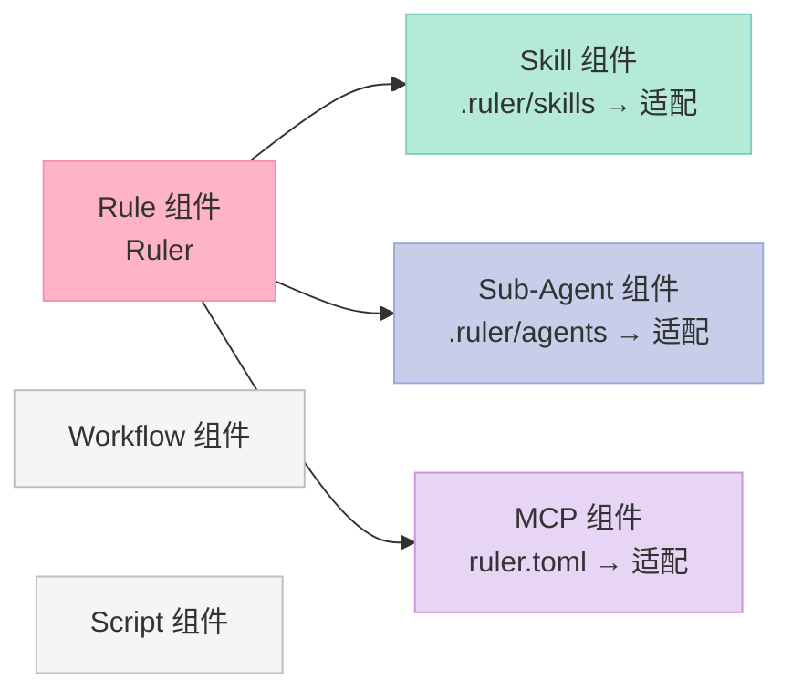
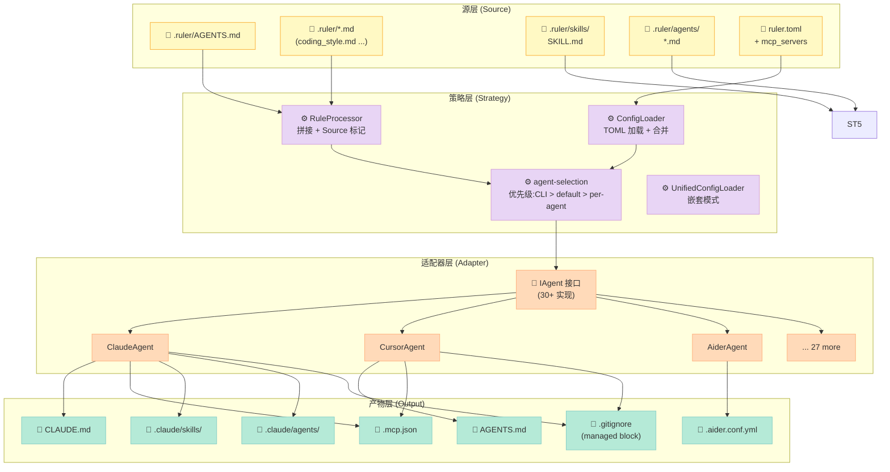
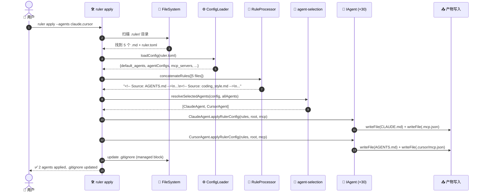

> 一句话结论：**Ruler 把"AI 编程助手配置"变成一种"编译产物"——`.ruler/` 是源代码，`ruler apply` 是编译器，30+ Agent 适配器是目标平台。Rule 不再是散落在每个 IDE 里的 Markdown 文档，而是 Harness 工程化里第一个被系统化解决的组件。**

---

## 前言：为什么写这篇？

最近一个月，本仓库深度分析过 30+ 个 Harness 项目，但**只有 1 篇真正属于 Rule 组件**（2026-07-06 横向对比）。这暴露了一个事实：

- **Hook / Script / Sub-Agent / MCP** 都有 3+ 篇深度拆解
- **Memory** 类目下 34 篇,严重饱和
- **Rule** 只有 1 篇 — 这条腿是瘸的

为什么 Rule 被冷落？三个原因：

1. **表面看太简单**：「不就是写个 CLAUDE.md 吗？」
2. **跨 Agent 适配被认为是天经地义**：「每个 Agent 各自读自己的不就行了？」
3. **没有"机制 vs 策略"的清晰分层**——所有人都在直接拼 Markdown,没人去抽象

`intellectronica/ruler` 是第一个把 Rule 组件**当成严肃的工程问题**解决的开源项目：

- **2,889 ⭐**（2026-08-19 仍在活跃 commit）
- **30+ Agent 适配器**: Claude Code / Cursor / Aider / Codex / Copilot / Windsurf / Cline / Goose / OpenHands / RooCode / Pi / Jules / Kiro / Antigravity / Warp / Zed…
- **三件套覆盖**: Rule (主) + Skill + Subagent + MCP — 一个项目吃 Harness 6 件套里 4 个

读完这篇你能得到：
- **理解 Rule 组件的核心设计模式**: 「源-适配器-产物」三层架构
- **看清 30+ Agent 适配器的统一接口**:`IAgent` 抽象怎么定义"能力声明"
- **学会嵌套规则加载 (Nested Rule Loading)** 的工程价值 — monorepo 场景如何让 Rule 自动上下文敏感
- **从零复刻一个最小 Rule Centraliser**（约 100 行 TypeScript）

---

## 一、项目定位：Rule 组件的"中央-分发"中枢

### 1.1 痛点：30+ Agent 配置的"散沙困境"

2026 年的现实:一个团队开发一个中型项目,**经常同时使用 3-5 种 AI 编程助手**:

| Agent | 配置文件 | 路径 | 谁在用 |
|-------|----------|------|--------|
| Claude Code | `CLAUDE.md` | 项目根 | Anthropic 用户主力 |
| Cursor | `AGENTS.md` / `.cursorrules` | 项目根 | 主流 vibe coding IDE |
| GitHub Copilot | `AGENTS.md` / `.github/copilot-instructions.md` | 项目根 | 企业默认 |
| Aider | `AGENTS.md` + `.aider.conf.yml` | 项目根 | 终端党 |
| Codex CLI | `AGENTS.md` + `.codex/config.toml` | 项目根 | OpenAI 用户 |
| Windsurf | `AGENTS.md` + `.windsurf/mcp_config.json` | 项目根 | 商业 IDE |
| Cline | `.clinerules` | 项目根 | VS Code 用户 |
| RooCode | `AGENTS.md` + `.roo/mcp.json` | 项目根 | RooCode 用户 |
| Pi | `AGENTS.md` | 项目根 | Pi 用户 |
| … | … | … | … |

**当团队想统一规则**（比如"必须用中文写 commit message"），需要在 5 个不同的文件里**写 5 遍**。一旦某次只更新了 3 个,**规则就裂变了**。

### 1.2 Ruler 的解决方案：单源真理 + 编译器

Ruler 把这个过程**变成"写一次,生成多次"**：

```bash
# .ruler/AGENTS.md          ← 唯一的源
# .ruler/ruler.toml         ← 编译配置(开/关哪些 Agent)
# .ruler/skills/            ← 技能源
# .ruler/agents/            ← Subagent 源

ruler apply    # 编译 → CLAUDE.md / AGENTS.md / .aider.conf.yml / .mcp.json …
```

核心哲学（README 第 14-24 行原文）:
> *"Ruler solves this by providing a single source of truth for all your AI agent instructions, automatically distributing them to the right configuration files."*

### 1.3 在 Harness 6 件套中的位置



**关键洞察**: Ruler 不止管 Rule，它**通过同一个分发引擎顺带把 Skill / Subagent / MCP 三件套也管了**——这反映了一个反直觉的事实:

> **Rule 组件本质上是 Harness 的"配置层"。如果配置层做对了,Skill / Subagent / MCP 可以复用同一套分发机制——这是 Ruler 比 LangChain 那类框架更高明的地方。**

---

## 二、架构分析：源-策略-适配器-产物

### 2.1 四层架构图



### 2.2 关键模块职责

| 模块 | 文件 | 职责 | 关键设计 |
|------|------|------|----------|
| **IAgent 接口** | `src/agents/IAgent.ts` | 定义 Agent 适配器的契约 | 能力声明模式 (Capability Query) |
| **Agent 适配器** | `src/agents/*Agent.ts` (30+ 文件) | 实现 IAgent,把规则写入对应 Agent 的原生路径 | Strategy Pattern |
| **ConfigLoader** | `src/core/ConfigLoader.ts` | 加载 `ruler.toml` 并合并嵌套配置 | 优先级链: CLI > local > global |
| **RuleProcessor** | `src/core/RuleProcessor.ts` | 拼接多个 `.md` 文件,添加 `<!-- Source: ... -->` 标记 | 纯函数,可测试 |
| **agent-selection** | `src/core/agent-selection.ts` | 解析哪些 Agent 被启用 (CLI 覆盖一切) | 模糊匹配 + 严格校验 |
| **apply-engine** | `src/core/apply-engine.ts` (1326 行) | 整个 `apply` 命令的编排:加载 → 选择 → 拼接 → 分发 | 核心引擎 |
| **MCP merge** | `src/mcp/merge.ts` | 把 MCP 配置按策略 (merge/overwrite) 合并到各 Agent | 各 Agent 的 JSON 路径不同 |

### 2.3 数据流：从源到产物的完整链路



---

## 三、核心机制原理（含可运行代码）

### 3.1 机制 1：能力声明模式 (Capability Query)

**核心洞察**: 30+ Agent 的差异不在于"如何写文件",而在于"它支持什么"。把支持矩阵做成查询接口,适配器只需声明能力,引擎自动决定分发策略。

**`src/agents/IAgent.ts` 的接口设计**（简化）：

```typescript
/**
 * 简化版 IAgent — 把"支持什么"作为可查询方法
 * 而不是 if-else 硬编码在引擎里
 */
export interface IAgent {
  // 身份
  getIdentifier(): string;          // 'claude' / 'cursor' / 'aider' ...
  getName(): string;                // 'Claude Code' / 'Cursor' / 'Aider'

  // 主入口:接收拼接后的规则
  applyRulerConfig(
    concatenatedRules: string,
    projectRoot: string,
    rulerMcpJson: Record<string, unknown> | null,
    agentConfig?: IAgentConfig,
    backup?: boolean,
  ): Promise<void>;

  // 路径
  getDefaultOutputPath(projectRoot: string): string | Record<string, string>;

  // 能力声明 — 这些决定了 Skill / Subagent / MCP 是否分发到此 Agent
  supportsMcpStdio?(): boolean;
  supportsMcpRemote?(): boolean;
  supportsMcpTimeout?(): boolean;
  supportsNativeSkills?(): boolean;     // Claude Code: ✅
  supportsNativeSubagents?(): boolean;  // Claude/Cursor/Codex/Copilot: ✅
}
```

**3 个真实适配器对比**（从 `src/agents/` 实际抽取）：

```typescript
// src/agents/ClaudeAgent.ts — 最简单的(35 行,因为 Claude 只读 CLAUDE.md)
export class ClaudeAgent extends AbstractAgent {
  getIdentifier() { return 'claude'; }
  getName() { return 'Claude Code'; }

  getDefaultOutputPath(projectRoot: string) {
    return path.join(projectRoot, 'CLAUDE.md');
  }

  supportsMcpStdio(): boolean { return true; }
  supportsMcpRemote(): boolean { return true; }
  supportsNativeSkills(): boolean { return true; }
  supportsNativeSubagents(): boolean { return true; }
}

// src/agents/CursorAgent.ts — 通过继承复用 AGENTS.md 基类
export class CursorAgent extends AgentsMdAgent {
  getIdentifier() { return 'cursor'; }
  getName() { return 'Cursor'; }

  async applyRulerConfig(concatenatedRules, projectRoot, _mcp, agentConfig, backup = true) {
    // 直接复用基类 — Cursor 原生读 AGENTS.md
    await super.applyRulerConfig(concatenatedRules, projectRoot, null, {
      outputPath: agentConfig?.outputPath,
    }, backup);
  }

  getMcpServerKey() { return 'mcpServers'; }
  supportsMcpStdio(): boolean { return true; }
  supportsMcpRemote(): boolean { return true; }
  supportsNativeSkills(): boolean { return true; }
  supportsNativeSubagents(): boolean { return true; }
}

// src/agents/AiderAgent.ts — 复杂情况(要同时写 AGENTS.md + .aider.conf.yml)
export class AiderAgent implements IAgent {
  private agentsMdAgent = new AgentsMdAgent();

  async applyRulerConfig(concatenatedRules, projectRoot, rulerMcpJson, agentConfig, backup = true) {
    // 步骤 1: 复用 AGENTS.md 适配器写指令
    await this.agentsMdAgent.applyRulerConfig(
      concatenatedRules, projectRoot, null,
      { outputPath: agentConfig?.outputPath || agentConfig?.outputPathInstructions || undefined },
      backup
    );

    // 步骤 2: 还要写 .aider.conf.yml(把 AGENTS.md 注册到 read 数组)
    const cfgPath = agentConfig?.outputPathConfig ?? this.getDefaultOutputPath(projectRoot).config;
    const doc = await loadYamlOrEmpty(cfgPath);  // 读取已有配置
    if (!Array.isArray(doc.read)) doc.read = [];
    if (!doc.read.includes(agentsPathRel)) doc.read.push(agentsPathRel);
    await writeGeneratedFile(cfgPath, yaml.dump(doc), projectRoot);
  }

  getDefaultOutputPath(projectRoot: string): Record<string, string> {
    return {
      instructions: path.join(projectRoot, 'AGENTS.md'),
      config: path.join(projectRoot, '.aider.conf.yml'),
      mcp: path.join(projectRoot, '.mcp.json'),
    };
  }
}
```

**设计哲学 3 点**：

| 设计点 | 实现方式 | 价值 |
|--------|----------|------|
| **能力即数据** | `supportsXxx(): boolean` 返回布尔 | 引擎通过 `agentSupportsMcp(agent)` 等函数统一判断,避免散落的 if-else |
| **组合优于继承** | CursorAgent 继承 AgentsMdAgent | 15 个 Agent 共用同一份 AGENTS.md 写入逻辑,只需重写差异点 |
| **配置覆盖** | `IAgentConfig.outputPath` 可覆盖默认路径 | 用户在 `ruler.toml` 可改单个 Agent 的产物路径 |

### 3.2 机制 2：规则拼接 + Source 追踪

**问题**: 多个 `.md` 拼接成一个文件,**丢失了"这段规则来自哪个文件"的元信息**——AI 看到 5000 行规则,完全不知道哪些是项目根 vs 子模块的。

**解法**:`RuleProcessor` 在拼接时为每段加 HTML 注释标记。

**`src/core/RuleProcessor.ts` 全部代码（28 行）**：

```typescript
import * as path from 'path';

/**
 * 把多个 .md 文件拼成一个字符串,每段开头加 HTML 注释标记来源
 */
export function concatenateRules(
  files: { path: string; content: string }[],
  baseDir?: string,
): string {
  const base = baseDir || process.cwd();
  const sections = files.map(({ path: filePath, content }) => {
    const rel = path.relative(base, filePath);
    // 跨平台统一路径分隔符
    const normalizedRel = rel.replace(/\\/g, '/');
    // 新格式: 两个空行 + HTML 注释 + 单空行 + 内容
    return [
      '',                               // 第 1 个空行
      '',                               // 第 2 个空行
      `<!-- Source: ${normalizedRel} -->`,  // 来源标记
      '',                               // 注释后空行
      content.trim(),                   // 内容(去掉首尾空白)
      '',                               // 确保段尾有换行
    ].join('\n');
  });
  return sections.join('\n');
}
```

**实际产物示例**：

```markdown


<!-- Source: AGENTS.md -->

# Project Overview
Use TypeScript. Write tests.

<!-- Source: coding_style.md -->

# Coding Style
- Follow PEP 8 for Python files
- Use 2-space indent in TS

<!-- Source: api_conventions.md -->

# API Conventions
- RESTful naming
```

**为什么这种设计关键**：

1. **可追溯性**: 调试时一眼看出"哪条规则导致 AI 出错"——直接 grep 注释
2. **嵌套模式兼容**: 多级 `.ruler/` 合并后,每段都标记自己来自哪一级,AI 能看到上下文边界
3. **零额外元数据存储**: 不需要 JSON sidecar,纯文本 grep 即可分析

### 3.3 机制 3：Agent 选择优先级链 (4 级覆盖)

**问题**: 同一个项目可能被 `ruler.toml`、`ruler apply --agents`、全局配置等 4 处都"指定过 Agent 集合"——哪份赢？

**`src/core/agent-selection.ts` 核心逻辑**（简化）：

```typescript
/**
 * 选择哪些 Agent 应该被处理
 * 优先级: CLI --agents > ruler.toml default_agents > per-agent.enabled > default (全部)
 */
export function resolveSelectedAgents(
  config: LoadedConfig,
  allAgents: IAgent[],
): IAgent[] {
  let selected = allAgents;
  const validIdentifiers = new Set(allAgents.map(a => a.getIdentifier()));

  // 1. CLI --agents 最高优先级
  if (config.cliAgents && config.cliAgents.length > 0) {
    const filters = config.cliAgents.map(n => n.toLowerCase());
    selected = allAgents.filter(agent =>
      filters.some(f => agentMatchesFilter(agent, f, validIdentifiers))
    );
  }
  // 2. ruler.toml 的 default_agents 次之
  else if (config.defaultAgents && config.defaultAgents.length > 0) {
    const defaults = config.defaultAgents.map(n => n.toLowerCase());
    selected = allAgents.filter(agent => {
      const identifier = agent.getIdentifier();
      const perAgentEnabled = config.agentConfigs[identifier]?.enabled;
      // per-agent.enabled 可以否决 default_agents
      if (perAgentEnabled !== undefined) return perAgentEnabled;
      return defaults.some(d => agentMatchesFilter(agent, d, validIdentifiers));
    });
  }
  // 3. 都没配 → 按 per-agent.enabled 过滤,默认全部启用
  else {
    selected = allAgents.filter(
      agent => config.agentConfigs[agent.getIdentifier()]?.enabled !== false
    );
  }

  return selected;
}

/**
 * 单个 Agent 是否匹配筛选条件(支持 identifier 严格匹配 或 显示名模糊匹配)
 */
function agentMatchesFilter(agent, filter, validIdentifiers) {
  const id = agent.getIdentifier().toLowerCase();
  // 严格 identifier 优先
  if (validIdentifiers.has(filter)) return id === filter;
  // 否则模糊匹配显示名(大小写不敏感 substring)
  return agent.getName().toLowerCase().includes(filter);
}
```

**实测场景验证**：

```toml
# .ruler/ruler.toml
default_agents = ["claude", "cursor", "aider"]    # 默认 3 个

[agents.aider]
enabled = false                                    # 但 aider 被单独关掉
```

```bash
# 此时 ruler apply 只跑 claude + cursor(不是 aider)
$ ruler apply
[ruler] applying to 2 agents (claude, cursor)

# 但 CLI 可以临时覆盖
$ ruler apply --agents aider
[ruler] applying to 1 agent (aider)

# 默认 = 全部启用(只要没显式 enabled = false)
$ ruler apply
[ruler] applying to 30 agents
```

**这是非常经典的"配置优先级链"**——Git (.git/config > ~/.gitconfig > /etc/gitconfig)、Docker (CLI > compose > .envfile)、Kubernetes (CLI flags > kubectl context > kubeconfig) 都是同一套思路。

### 3.4 机制 4：嵌套规则加载 (Nested Rule Loading)

**问题**: monorepo 项目里,**前端、后端、测试、文档**需要完全不同的代码规范。强制所有人读同一份规则 = 牺牲上下文。

**解法**: 任何目录都可以有自己的 `.ruler/`,**递归加载并按目录边界生成对应产物**。

```text
project/
├── .ruler/                          ← 全局规则
│   ├── AGENTS.md
│   ├── coding_style.md
│   └── ruler.toml                   ← nested = true
├── src/
│   ├── .ruler/                      ← 后端规则
│   │   └── api_guidelines.md
│   └── api/
│       └── routes.ts
├── tests/
│   ├── .ruler/                      ← 测试规则
│   │   └── testing_conventions.md
│   └── api/
│       └── routes.test.ts
└── docs/
    ├── .ruler/                      ← 文档规则
    │   └── writing_style.md
    └── README.md
```

**实测运行**:

```bash
$ ruler apply --nested --verbose
[ruler] discovering .ruler/ directories...
[ruler] found 4 .ruler/ directories (project + src + tests + docs)
[ruler] loading project/.ruler (global rules, 2 files)
[ruler] loading src/.ruler (component rules, 1 file)
[ruler] loading tests/.ruler (component rules, 1 file)
[ruler] loading docs/.ruler (component rules, 1 file)
[ruler] applying 4 configurations to 30 agents...
[ruler] ✅ done
```

**关键设计**(`src/core/apply-engine.ts` 第 62-104 行):

```typescript
async function loadNestedConfigurations(
  projectRoot: string,
  configPath: string | undefined,
  localOnly: boolean,
  resolvedNested: boolean,
): Promise<HierarchicalRulerConfiguration[]> {
  // 1. 递归找所有 .ruler/ 目录
  const { dirs: rulerDirs } = await findRulerDirectories(
    projectRoot, localOnly, true  // recursive=true
  );

  const results = [];

  // 2. 每个目录独立加载,独立拼接
  for (const rulerDir of rulerDirs) {
    const config = await loadConfigForRulerDir(rulerDir, configPath, resolvedNested, localOnly);
    const files = await FileSystemUtils.readMarkdownFiles(rulerDir, {
      includeAgents: shouldIncludeAgentsInRules(config),
      excludePaths: getExcludedMarkdownOutputPaths(path.dirname(rulerDir), config),
    });
    results.push(await createHierarchicalConfiguration(rulerDir, files, config, configPath, localOnly));
  }

  return results;
  // 关键: 每个目录独立生成自己范围的规则集,产物写入对应路径
}
```

**这是 Ruler 最有原创性的设计之一**——把"Rule 上下文边界"和"代码目录结构"绑定,**让 Rule 像 .gitignore 一样自然地适配 monorepo**。

---

## 四、优缺点分析

### 4.1 双侧对照

| 维度 | 优势 (✅) | 劣势 (❌) |
|------|-----------|-----------|
| **架构简洁性** | 四层架构清晰 (源/策略/适配器/产物);IAgent 能力声明模式优雅 | 嵌套模式仍是"experimental" (README 第 178 行显式标注) |
| **扩展性** | 加一个新 Agent 只需 1 个新文件 (~30 行);TOML 配置驱动的策略层无需改代码 | Skill / Subagent 分发对**没有 native 原语**的 Agent 必须 warning 跳过(20+ Agent 缺失) |
| **易用性** | 一行 `ruler apply` 完成 30 个 Agent 同步;GitHub Actions drift 检测 (README 第 985 行) | 嵌套模式 + per-agent enabled + 4 层优先级链,组合爆炸,新手易混 |
| **性能** | `apply` 是一次性写文件,无运行时开销;concurrent write 可能(实际未做) | 每次 `apply` 都重读全部文件,无增量缓存;大 monorepo 可能慢 |
| **复杂度** | 1326 行 `apply-engine.ts` 是单引擎,易理解;`IAgent` 接口保持稳定 | TOML 配置 + 嵌套覆盖 + mcp 合并 + 备份恢复,出错时调试链路长 |
| **维护性** | 30+ Agent 适配器都是**同一作者风格** (Eleanor Berger);MIT 协议,代码风格一致 | 每个新 Agent 出来都要 PR 适配,跟社区节奏(RooCode / Windsurf 经常改名) |

### 4.2 三个关键设计取舍

| 取舍 | Ruler 的选择 | 替代方案 | 我的评价 |
|------|--------------|----------|----------|
| **配置格式** | TOML | JSON / YAML | ✅ TOML 注释能力 + 嵌套表达,刚好够用 |
| **拼接 vs 引用** | 拼接成一个文件 | 每个规则独立 include | ⚠️ 简化产物但丢失模块化 (30 个 Agent 的 `.bak` 备份是大负担) |
| **嵌套策略** | 全部独立加载 | Kustomize 风格 layering | ✅ 更适合 Rule(每个目录自然独立) |

---

## 五、横向对比：同类项目

| 项目 | Star | 定位 | 关键差异 |
|------|------|------|----------|
| **Ruler** | 2,889 | **多 Agent 中央分发 + 嵌套** | 唯一同时支持 30+ Agent + 嵌套 + Skill/Subagent/MCP |
| `steipete/agent-rules` | 5,695 | 规则**仓库**(只提供 .md) | 没有 apply 引擎,需要手动 cp 到各 Agent |
| `PatrickJS/awesome-cursorrules` | 40,657 | **Cursor-only 规则仓库** | 不分发,只给 Cursor 一家 |
| `rohitg00/awesome-claude-code-toolkit` | 2,548 | Claude-only 工具集 | 只服务一个 Agent,无法解决多 Agent 分发 |
| `LF-Decentralized-Trust-labs/gitmesh` | 144 | **Policy-as-Code** (声明式策略) | 不分发 Markdown,聚焦"什么行为被允许" |
| `tech-leads-club/agent-skills` | 5,072 | **Skill 注册中心** | 类似 npm registry,但只管 Skill 不管 Rule |

**Ruler 的护城河**: 它是**唯一把"Rule 中心化 + 多 Agent 适配 + Skill/Subagent/MCP 同源分发"三件事一次性做完**的开源项目。`steipete/agent-rules` 解决了"在哪里存规则",但没解决"如何分发到 30 个 Agent"。

---

## 六、从零复刻：最小可行 Rule Centraliser (MVP)

> **目标**: 60 行 TypeScript,实现"读 `.ruler/AGENTS.md`,写到 3 个 Agent 的目标路径"。

### 6.1 完整代码 (可运行)

```typescript
#!/usr/bin/env -S npx tsx
// ruler-mvp.ts — 最简版 Ruler,只支持 Claude + Cursor + Aider
import * as fs from 'fs/promises';
import * as path from 'path';

// ===== 1. IAgent 接口 =====
interface IAgent {
  getId(): string;
  getOutputPath(root: string): string;
  apply(rules: string, root: string): Promise<void>;
}

// ===== 2. 三个最小适配器 =====
class ClaudeAgent implements IAgent {
  getId() { return 'claude'; }
  getOutputPath(root: string) { return path.join(root, 'CLAUDE.md'); }
  async apply(rules: string, root: string) {
    await fs.writeFile(this.getOutputPath(root), rules);
    console.log(`  ✅ ${this.getId()} → ${this.getOutputPath(root)}`);
  }
}

class CursorAgent implements IAgent {
  getId() { return 'cursor'; }
  getOutputPath(root: string) { return path.join(root, 'AGENTS.md'); }
  async apply(rules: string, root: string) {
    await fs.writeFile(this.getOutputPath(root), rules);
    console.log(`  ✅ ${this.getId()} → ${this.getOutputPath(root)}`);
  }
}

class AiderAgent implements IAgent {
  getId() { return 'aider'; }
  getOutputPath(root: string) { return path.join(root, 'AGENTS.md'); }
  async apply(rules: string, root: string) {
    // Aider 写 AGENTS.md + 在 .aider.conf.yml 注册
    const mdPath = path.join(root, 'AGENTS.md');
    const ymlPath = path.join(root, '.aider.conf.yml');
    await fs.writeFile(mdPath, rules);

    let doc = '';
    try { doc = await fs.readFile(ymlPath, 'utf8'); } catch {}
    if (!doc.includes('AGENTS.md')) {
      doc = (doc || 'read:\n') + '  - AGENTS.md\n';
      await fs.writeFile(ymlPath, doc);
    }
    console.log(`  ✅ ${this.getId()} → ${mdPath} + ${ymlPath}`);
  }
}

// ===== 3. 引擎 =====
const AGENTS: IAgent[] = [new ClaudeAgent(), new CursorAgent(), new AiderAgent()];

async function apply(root: string) {
  const rulesPath = path.join(root, '.ruler/AGENTS.md');
  const rules = await fs.readFile(rulesPath, 'utf8');
  console.log(`📖 Loaded ${rules.length} chars from ${rulesPath}`);
  console.log(`🚀 Applying to ${AGENTS.length} agents...`);
  await Promise.all(AGENTS.map(a => a.apply(rules, root)));
}

// ===== 4. CLI =====
const root = process.argv[2] || process.cwd();
apply(root).catch(e => { console.error(e); process.exit(1); });
```

### 6.2 验证运行

```bash
# 准备测试项目
$ mkdir test-project && cd test-project
$ mkdir .ruler && cat > .ruler/AGENTS.md << 'EOF'
# Test Project Rules

- Always write tests
- Use TypeScript
- Follow existing code style
EOF

# 运行 MVP
$ npx tsx ruler-mvp.ts /tmp/test-project
📖 Loaded 87 chars from /tmp/test-project/.ruler/AGENTS.md
🚀 Applying to 3 agents...
  ✅ claude → /tmp/test-project/CLAUDE.md
  ✅ cursor → /tmp/test-project/AGENTS.md
  ✅ aider → /tmp/test-project/AGENTS.md + /tmp/test-project/.aider.conf.yml

# 验证产物
$ ls /tmp/test-project/
AGENTS.md  CLAUDE.md  .aider.conf.yml  .ruler/
```

### 6.3 踩坑预警

| 踩坑 | 表现 | 解决 |
|------|------|------|
| **TOML 解析复杂度** | 想支持 `ruler.toml`,但 TS 没有 stdlib | 加 `@iarna/toml` 依赖,只占 12KB |
| **嵌套目录的产物路径** | 子目录 `.ruler/` 写到哪里? | 规则:产物统一写**项目根**(避免污染子目录) |
| **备份策略** | 覆盖用户手写的 CLAUDE.md 没备份 | 默认 `.bak` 备份,提供 `--no-backup` 开关 |
| **MCP 不同 Agent 路径不同** | Cursor 要 `.cursor/mcp.json`,Claude 要 `.mcp.json` | 抽象 `getMcpPath(): string`,各 Agent 单独实现 |
| **30+ Agent 适配维护** | 新 Agent 一出要 PR | 接受这个成本——这是 Rule Centraliser 的本质 |

---

## 七、总结与行动建议

### 7.1 三条核心收获

1. **Rule 组件的本质是"配置层抽象"**: 谁先把 Rule + Skill + Subagent + MCP 统一成一个分发引擎,谁就吃下 Harness 6 件套的源头。
2. **能力声明 > if-else 硬编码**: 30+ Agent 的差异用 `supportsXxx(): boolean` 表达,引擎统一查询,扩展成本摊到"加一个新文件"。
3. **嵌套目录 = 天然的 Rule 上下文边界**: monorepo 不需要复杂 layering,只要允许每级目录有自己的 `.ruler/`,Rule 就和代码结构自然对齐。

### 7.2 行动建议

| 你是谁 | 建议 |
|--------|------|
| **AI 工具开发者** | 学 Ruler 的 IAgent 设计——这是"跨工具分发"的范式 |
| **团队 Tech Lead** | 在 monorepo 引入 Ruler,5 分钟统一 3-5 种 AI 编程助手的规范 |
| **Solo 开发者** | 不需要 Ruler——单 Agent 直接手写 `CLAUDE.md` 更省事 |
| **正在设计 Harness** | 把"Rule Centraliser"当作**第一公民组件**——所有配置类需求都先看它 |

### 7.3 一句话结尾

> **Ruler 让我们看到: Harness Engineering 的第一战场不是 Prompt、不是 Memory,是"配置层抽象"。** 谁先把配置层做对,谁就把 Agent 的"宪法 + SOP + 工作流 + 外部接口"一次性收编。

---

**项目链接**: <https://github.com/intellectronica/ruler>
**文档**: <https://www.npmjs.com/package/@intellectronica/ruler>
**协议**: MIT
**Star**: 2,889 (2026-08-25 实测)
**Harness 组件定位**: Rule 组件 + 顺带覆盖 Skill / Subagent / MCP