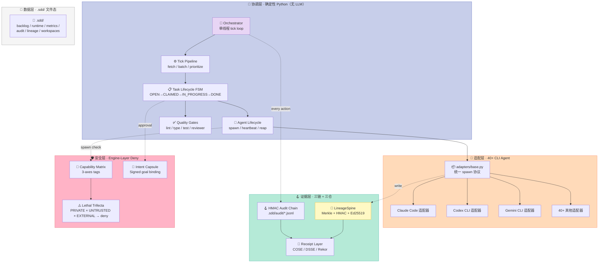
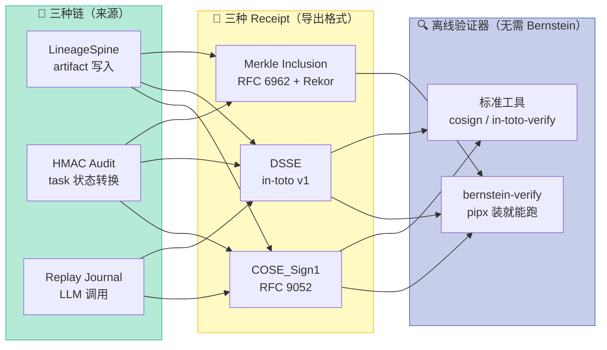
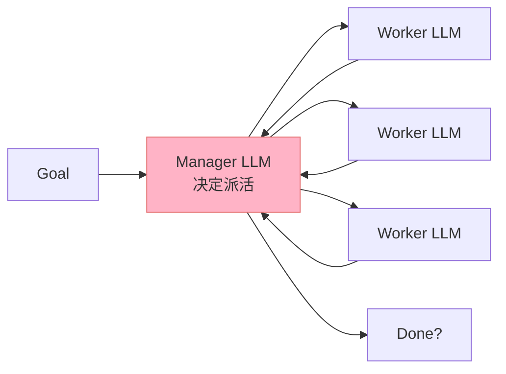
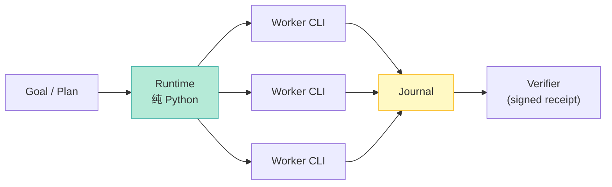

## 引子：当 Agent 接管流水线，谁来"管"Agent？

2026 年的 AI 工程化早已脱离"能不能让 LLM 写代码"的阶段。真正让人夜不能寐的问题是：**当 50 个 Agent 在 50 个 worktree 里并行改代码，谁来保证它们不会把同一个文件改崩？谁来保证它们今天做出的决定，下周还能复现？谁来保证某个 Agent 不会偷偷把 AWS key 发到外部 webhook？**

面对这些问题，市面上的"Multi-Agent 框架"几乎都是同一个套路：让一个 LLM 当 manager，让一群 LLM 当 worker，manager 在群聊里派活、worker 在群里回报。**这套模式跑 demo 漂亮，跑生产翻车**——12 个 Agent 跑 47 小时，3 个真做了活，5 个是"幻影 Agent"，1 个 manager 中途睡着导致全队饿肚子（来自 Bernstein 团队 `rag_challenge` 实战的教训）。

[Bernstein](https://github.com/sipyourdrink-ltd/bernstein) 走了一条完全相反的路：**协调层不放 LLM**。调度、派活、收活、回滚全是确定性 Python 代码；LLM 只出现在"真正干活"的叶子节点。这种"Harness 即操作系统"的视角，让 Bernstein 用一种反直觉的方式解决了多 Agent 编排的所有痛点：

| 痛点 | 业界主流解法 | Bernstein 解法 |
|------|-------------|---------------|
| Agent 重复写同一文件 | CRDT / 三路合并 | **Lineage Spine**（Merkle + HMAC 双链），冲突显式上报 steward |
| 昨天跑通的今天跑崩 | 修 prompt | **确定性 Replay** + LLM 响应 hash 缓存 + 严格模式（miss 直接 abort） |
| Agent 被 issue body 骗走 secret | "ignore previous instructions" prompt | **Lethal Trifecta** 能力矩阵，引擎层 deny，bypass-immune |
| Agent 偷发数据到外部 | 事后看 log | **HMAC 链式审计日志 + 离线可验证 COSE/in-toto receipt** |
| Manager 中途睡着 | 调大 temperature | **Tick loop 是单线程 Python，LLM 物理上不在协调路径** |

本文从架构、源码、对比、复刻四个维度深度剖析 Bernstein。读完你会明白：**Harness Engineering 的真功夫，不是给模型加多少花哨的 tool call，而是把模型管不到的地方都封死，让模型只需要专注"做事"**。

---

## 1. 项目定位与核心价值

**一句话定义**：Bernstein 是面向 40+ 主流 CLI 编程 Agent（Claude Code、Codex、Gemini CLI、Aider、Goose 等）的**确定性编排器**——LLM 不进协调循环、产物必须过闸、运行可重放可审计、默认隔离。

**4 大差异化能力**（直接引自 README）：

1. **No LLM in the coordination loop** — 调度是纯 Python，昨天跑通的 plan 明天 byte-identical 重放
2. **Checkable after the fact** — Replay journal + always-on Lineage spine + opt-in HMAC audit chain 三层证据链
3. **Isolated by construction** — 每个 coding 任务独占 git worktree + merge gate，agent 共享状态只有任务队列（原子认领）
4. **Broad and local** — 40+ CLI Agent 适配器 + 本地文件状态，无 SaaS 中转、无第三方数据面

**仓库统计**（2026-08-25 抓取）：

| 维度 | 数据 |
|------|------|
| ⭐ Stars | 993 |
| 📦 版本 | v3.18.0 |
| 📜 License | Apache-2.0 |
| 🔤 主语言 | Python 3.12+（strict typing, Pyright strict） |
| 📅 最近 push | 2026-08-25（**字面意义上"昨天"**） |
| 📂 仓库规模 | 6424 个文件、2023 个 Python 模块、512 个文档 md |
| 📋 核心子系统 | core / adapters / cli / mcp / plugins / eval / evolution / github_app / benchmark |
| 🧬 三大核心组件 | LineageSpine + Capability Matrix + HMAC Audit Chain |
| 🔐 安全模型 | Lethal Trifecta + Intent Capsule + Per-store HKDF |
| 🛂 Compliance | EU AI Act Article 12 evidence pack + DSSE + COSE |

**Harness 6 件套定位**：Bernstein 不属于任何一个独立组件——它是**横跨 6 件套的复合型 Harness**：

| 6 件套组件 | Bernstein 对应能力 |
|-----------|-------------------|
| **Rule**（软约束）| `policy_engine.py` DecisionGraph + ADR-006「协调层无 LLM」宪法 |
| **Skill**（SOP）| `bernstein skills sync` + `bernstein-skills.toml` 生命周期 |
| **Sub-Agent**（角色分工）| 短生命周期 Agent（1-3 任务一批）+ Worktree 隔离 |
| **Workflow**（接力协议）| Tick Pipeline + Task Lifecycle FSM + Trigger Manager |
| **Script**（硬关卡）| `gate_runner.py` + Quality Gates + Cross-Model Verifier |
| **MCP**（外部桥接）| 自带 MCP Server（`.sdd/mcp/`）+ 注入到 worker |

**ADR 编号对照**（架构决策记录全部公开）：

| ADR | 标题 | 核心论点 |
|-----|------|---------|
| ADR-004 | File-Based State via `.sdd/` | 无 DB，纯 YAML/JSONL，可 git diff |
| ADR-005 | Short-Lived Agent Lifecycle | Agent 不留 idle，1-3 任务一批即焚 |
| **ADR-006** | **No Embedded LLM in the Orchestrator** | **协调层确定性，LLM 仅在叶子节点** |
| ADR-009 | Lineage v1 - Sigstore-style Transparency Log | Per-artefact Ed25519 签名 + Merkle log |
| ADR-010 | Audit Chain Default Cost | HMAC 链 audit 默认 off（成本原因），opt-in |

---

## 2. 整体架构：协调层 + 适配层 + 证据层

### 2.1 三层架构总览



### 2.2 协调层主循环（核心代码节选）

协调层的心脏是 `src/bernstein/core/orchestration/orchestrator.py`，一个 **320KB 的单类 `Orchestrator`**（已拆出 `tick_pipeline.py` / `deterministic.py` 等纯函数模块）。简化后的核心 tick loop：

```python
# src/bernstein/core/orchestration/orchestrator.py (简化示意)
class Orchestrator:
    def run(self) -> None:
        """单线程 tick 循环 — ADR-006: 协调路径无 LLM 调用"""
        while self._running:
            with self._tick_guard():
                self._tick_internal()

    def _tick_internal(self) -> None:
        # 步骤 1-7: 抓任务 / 批处理 / 派发 / 等结果 / 心跳 / reap / 重试
        # 步骤 8b: 检查 quiescence 决定是否停机
        open_tasks = self._fetch_open_tasks()
        active_agents = self._active_agent_count()

        if open_tasks == 0 and active_agents == 0:
            # 已 quiescent, 检查是否应该停机
            if self._quiescence_settle_window_elapsed():
                self._running = False
                return
            return  # 等 settle window, 别立刻停

        # 步骤 8: 派活
        for batch in self._group_into_batches(open_tasks):
            spawner.spawn(batch=batch, role=batch.role)
```

**为什么是单线程？** ADR-006 docstring 明确写："The tick loop is single-threaded by design; do not add concurrent ticks without restoring a tick guard." 加并发就要重新引入 `tick_guard` 模块——这是历史经验教训，不是性能优化选择。

### 2.3 适配层：把 40 个 CLI Agent 装进同一个壳

`src/bernstein/adapters/base.py`（60KB）是所有 40+ 适配器的父类，定义了**统一的 spawn 协议**：

```python
# src/bernstein/adapters/base.py (节选)
class BaseAdapter(ABC):
    """CLI coding agent 适配器基类 — 所有 40+ 适配器都继承它"""

    DEFAULT_TIMEOUT_SECONDS: int = 1800  # 30 分钟硬上限 (ADR-005)
    _SIGTERM_GRACE_SECONDS: int = 30     # SIGTERM 后等 30 秒才 SIGKILL

    @abstractmethod
    def spawn(self, task_batch: list[Task], worktree: Path) -> SpawnResult:
        """每个具体适配器实现这一行:
           - claude: subprocess.run(['claude', '--print', '--session-id', sid, prompt])
           - codex:  subprocess.run(['codex', 'exec', '--session-id', sid, prompt])
           - gemini: subprocess.run(['gemini', '--session-id', sid, prompt])
        """
        raise NotImplementedError

    def spawn_with_lineage(self, task_batch, worktree):
        # 1) 派生 session_id (deterministic)
        session_id = derive_session_id(worktree, task_batch)
        # 2) 创建 git worktree (隔离)
        wt_path = self._create_worktree(session_id)
        # 3) spawn 进程, 注入 lineage spine 写入
        result = self.spawn(task_batch, wt_path)
        # 4) 所有 artifact 写入走 LineageSpine.record (单写入边界)
        return result
```

**关键设计**："所有 artifact 写入走 `LineageSpine.record` 单写入边界"（`base.py` 注释原文），适配器不能私自写文件——必须经过 lineage spine 的同一条管道。这是 issue #2292 的修复结果：**之前三个独立的 lineage store 都标称"开"，但实际没接 live write path，所以 `lineage verify` 跑过去就是空欢喜**。

### 2.4 证据层：三条链、三个工具、三种 receipt

| 链 | 触发条件 | 数据格式 | 写入位置 | 验证工具 |
|---|---------|---------|---------|---------|
| **LineageSpine**（always-on）| 每个 artifact 写入 | Merkle+HMAC + Ed25519 + JCS | `.sdd/lineage/<run_id>/spine.jsonl` | `bernstein lineage verify` |
| **HMAC Audit Chain**（opt-in）| `BERNSTEIN_AUDIT=1` | HMAC-SHA256 链 + JSONL | `.sdd/audit/YYYY-MM-DD.jsonl` | `bernstein audit verify` |
| **Replay Journal**（always-on）| 每个 LLM 调用 | 响应 hash + 参数 | `.sdd/runs/<run_id>/llm_calls.jsonl` | `bernstein replay verify` |

每个链都可以独立导出为标准 receipt：



---

## 3. 核心机制原理（带可运行代码）

### 3.1 ADR-006 协调层无 LLM 的实证

`src/bernstein/core/orchestration/orchestrator.py` 在 import 列表里**完全没有 LLM client**——`openai` / `anthropic` 都不在协调路径的依赖里（它们只出现在 `adapters/base.py` 的"具体适配器"中）。

**反例对比**：以 LangGraph / CrewAI 为代表的"manager-as-LLM"框架：

```python
# LangGraph 风格（伪代码）
def manager_node(state):
    response = openai.chat.completions.create(
        model="gpt-4o",
        messages=[{"role": "system", "content": manager_prompt},
                  *state.messages]
    )
    decision = json.loads(response.choices[0].message.content)
    state.next_agent = decision["next_agent"]
    state.task = decision["task"]
    return state  # ← 调度决策来自 LLM, 不可重放
```

**Bernstein 风格**（真实代码路径）：

```python
# src/bernstein/core/orchestration/tick_pipeline.py (节选)
def select_next_batch(
    open_tasks: list[Task],
    active_agents_by_role: dict[str, int],
    budget_by_role: dict[str, float],
) -> list[Task] | None:
    """纯函数: 给定快照, 输出确定的派活决策"""

    # 1) 按角色分组 (确定性 dict iteration)
    by_role: dict[str, list[Task]] = defaultdict(list)
    for t in open_tasks:
        by_role[t.role].append(t)

    # 2) 每角色选优先级最高的 1-3 个 (ADR-005)
    selected: list[Task] = []
    for role, tasks in by_role.items():
        # 确定性排序: 优先级降序, 创建时间升序
        tasks.sort(key=lambda t: (-t.priority, t.created_at))
        # 每个 batch 最多 3 个, 防 context drift
        selected.extend(tasks[:3])

    return selected if selected else None
    # ← 没有 openai 调用, 没有 random.choice
    # ← 同一组 open_tasks 永远得出同一 selected
```

**为什么重要？** ADR-006 docstring 给出 4 个原因：

1. **单点故障**：LLM manager 一旦"睡着"，下游全饿死（`rag_challenge` 12 个 Agent 实测翻车）
2. **Token 成本**：用 LLM 做调度决策 = 每次派活都付 token，且不产生任何代码
3. **不可调试**：LLM 决策依赖温度采样和 context window，无法写单测复现
4. **协调开销非线性**：12 个 worker 的 status 塞进 manager context，叠加 O(n²) 的推理代价

### 3.2 LineageSpine：每个 artifact 写一行 Merkle 节点

`src/bernstein/core/lineage/spine.py`（29KB）的核心是 **`LineageSpine.record()`**——一个 append-only 链，每个 entry 是当前 artifact 内容的 cryptographic commitment：

```python
# src/bernstein/core/lineage/spine.py (核心 record 方法)
class LineageSpine:
    """单写入边界 — 所有 artifact 写入必经此门"""

    def record(
        self,
        artifact_path: str,
        content_hash: str,        # sha256(新内容)
        actor: str,               # agent_id
        step_id: str,
        model: str,
        parent_hashes: list[str], # 前一个 artifact tip
    ) -> LineageEntry:
        prev_hash = self._read_head()  # 从 spine.head 文件读
        ts_ns = time.time_ns()

        entry = LineageEntry(
            v=SPINE_ENTRY_VERSION,           # = 2
            artefact_path=artifact_path,
            artefact_kind="file",
            content_hash=content_hash,
            parent_hashes=parent_hashes,
            agent_id=actor,
            agent_card_kid=self._agent_kid,
            tool_call_id=step_id,
            span_id=self._otel_span_id,
            ts_ns=ts_ns,
        )
        # entry_hash = H(prev_hash, artifact_path, content_hash, actor, step_id, model, ts_ns)
        entry_hash = entry.entry_hash(prev_hash)
        # HMAC 用 HKDF 派生的 per-store key (与 audit chain 隔离)
        mac = self._sign_with_store_key(entry.canonical_bytes())
        entry.operator_hmac = mac

        # append-only 写
        with self._append_lock():
            self._jsonl.write(entry.canonical_bytes() + b"\n")
            self._write_head(entry_hash, mac)
        return entry
```

**为什么 spine 必须 single-write-boundary？** ADR-009 + issue #2292 痛彻心扉——之前三个 lineage store 各自声明"开启"，但 live write path 没接，导致 `lineage verify` 跑过去 = 空 jsonl + trivially pass。修复后**所有 adapter 写文件强制走 `LineageSpine.record`**，无法旁路。

**HKDF 隔离 lineage 和 audit**：

```python
# src/bernstein/core/security/key_derivation.py
DOMAIN_AUDIT: Final[str] = "audit"
DOMAIN_LINEAGE: Final[str] = "lineage"
SCHEME_V2: Final[int] = 2  # 当前: HKDF + 域标签前缀

def derive_store_key(master_key: bytes, domain: str) -> bytes:
    """HKDF-SHA256 (RFC 5869): master_key + domain → 独立 32-byte key"""
    return HKDF(
        algorithm=hashes.SHA256(),
        length=32,
        salt=None,
        info=domain.encode("ascii"),  # ← 域标签作 info
    ).derive(master_key)
    # 同一 master, audit 域 vs lineage 域 → 不同 key
    # 即使两条链签名撞了, 也不能跨链 replay
```

### 3.3 Lethal Trifecta：引擎层 deny，不靠 prompt

`src/bernstein/core/security/capability_matrix.py`（15KB）的设计目标是**让 Simon Willison 2025-06 提出的 Lethal Trifecta 攻击在引擎层就被 deny**——不靠"ignore previous instructions" 这种 prompt 工程。

```python
# src/bernstein/core/security/capability_matrix.py (核心 evaluate_chain)
class CapabilityRegistry:
    """工具能力标签表 — 每个 tool/MCP/adapter 都有 0-3 个 capability"""

    def evaluate_chain(
        self, tool_chain: list[str],
    ) -> ChainDecision:
        """评估 tool_chain 的 capability 并集, 全三齐则 deny"""
        # 1) 收集链上每个工具的 capability 标签
        caps: set[Capability] = set()
        offending: dict[Capability, list[str]] = {}

        for tool_name in tool_chain:
            caps_for_tool = self.tools.get(tool_name)
            if caps_for_tool is None:
                # ⚠️ 未知工具默认带全部三个 capability (fail-closed)
                caps |= _ALL_CAPABILITIES
                offending.setdefault(Capability.UNKNOWN,
                                     []).append(tool_name)
                continue
            caps |= caps_for_tool.capabilities
            for c in caps_for_tool.capabilities:
                offending.setdefault(c, []).append(tool_name)

        # 2) 三个齐了 → deny
        all_three = {Capability.PRIVATE_DATA,
                     Capability.UNTRUSTED_INPUT,
                     Capability.EXTERNAL_COMM}
        triggered = caps & all_three

        if triggered == all_three:
            return ChainDecision(
                allowed=False,
                reason="Lethal trifecta: "
                       f"PRIVATE × UNTRUSTED × EXTERNAL all present",
                triggered=frozenset(triggered),
                offending_tools=tuple(
                    t for ts in offending.values() for t in ts
                ),
                unknown_tools=tuple(offending.get(Capability.UNKNOWN, [])),
                mode=self.mode,
            )
        return ChainDecision(allowed=True, reason="ok", ...)
```

**关键安全语义**（来自 `docs/security/lethal-trifecta.md`）：

| 维度 | 业界做法 | Bernstein 做法 |
|------|---------|---------------|
| 检测时机 | 运行时 LLM "ignore" prompt | spawner pre-fork，进程没起就 deny |
| 决策位置 | LLM 推理层（可绕过） | Python spawner 引擎层（bypass-immune） |
| 未知工具 | 默认低风险（fail-open） | 默认带全部三个 capability（fail-closed） |
| 决策可被覆盖？ | "permission_mode: bypass" 可关掉 | `DecisionType.IMMUNE.bypass_immune=True`，plugin 不能 override |

**实测工作流**：spawner 接到"让 agent 读 secret + 拉 issue body + post comment"的任务 → 调 `_enforce_lethal_trifecta` → 把 `read_secret + github.fetch_issue + github.post_comment` 的 capability 并集一算，三个齐了 → 直接 deny，agent 进程根本没启动 → 同时把 denial 事件写进 HMAC audit chain，留下 SOC2 证据。

### 3.4 Intent Capsule：把批准的目标 signed 绑进 audit chain

`src/bernstein/core/security/intent_capsule.py`（68KB）解决"plan 审批签的是 cost/risk，attested approval 签的是单个 tool call，但没有任何东西把 worker 的整条 action stream 绑回 operator 真正批准的目标"。

```python
# src/bernstein/core/security/intent_capsule.py (概念示意)
@dataclass(frozen=True)
class IntentCapsule:
    """批准时签的"任务目标胶囊" — 写进 audit chain, 哈希绑进 run journal"""
    capsule_id: str
    task_id: str
    approved_by: str            # operator 身份
    approved_at_ns: int
    # 结构性约束
    allowed_action_classes: frozenset[str]  # 如 {"file.edit", "bash.read"}
    file_scope_globs: tuple[str, ...]       # 如 ("src/payments/*.py",)
    permitted_adapters: frozenset[str]      # 如 {"adapter.claude"}
    egress_classes: frozenset[str]          # 允许的出网目标
    cost_envelope_ref: str
    expiry_ns: int

    def evaluate_conformance(self, journal: EventJournal) -> ConformanceVerdict:
        """纯函数: (journal, capsule) → verdict, 无时钟/网络/LLM"""
        # 对 journal 每个 event:
        #   - action_class ∈ allowed_action_classes?
        #   - 触碰的 file ∈ file_scope_globs?
        #   - adapter ∈ permitted_adapters?
        #   - egress 目标 ∈ egress_classes?
        # 任一违反 → drift, 触发 escalation receipt (signed)
```

**审计哲学**："**Strip the audit chain and the run journal and the feature collapses to a goal string with a log.**"（capsule.py docstring）—— capsule 本身是 audit chain 上的一个 entry，drift escalation 是另一个 signed receipt 引用它，剥掉两条链任何一条整个机制失效。

### 3.5 确定性 Replay：cache miss 就 abort

`src/bernstein/core/orchestration/deterministic.py` 的设计哲学是**默认严格**——replay 找不到缓存的 LLM 响应，直接 raise `ReplayMissError`，**绝不悄悄调 live model**：

```python
# src/bernstein/core/orchestration/deterministic.py (核心)
ALLOW_LIVE_MISS_ENV = "BERNSTEIN_REPLAY_ALLOW_LIVE_MISS"

def replay_call(model: str, prompt: str, **params) -> str:
    """严格模式: cache miss 直接抛错, 不静默调 live"""
    key = _compute_replay_key(model, prompt, **params)  # fold 所有响应决定因子
    cached = _active_store.lookup(key)

    if cached is None:
        # 默认严格模式: abort
        if not os.environ.get(ALLOW_LIVE_MISS_ENV, "").lower() in _TRUTHY:
            raise ReplayMissError(
                f"No cached response for {key[:16]}...; "
                f"set {ALLOW_LIVE_MISS_ENV}=1 to extend on miss"
            )
        logger.warning("REPLAY MISS — falling through to live model")

    return cached.response if cached else _call_live(model, prompt, **params)
    # ← 严格模式意味着: 跑昨天 plan 的今天, 参数变了 → 立即报警
    # ← 而非: 跑昨天 plan 的今天, 静默调用新模型, 输出不可复现
```

**为什么关键**：`replay key` 把 model / prompt / provider / temperature / max_tokens **全 fold 进去**，所以"参数漂移伪装成 cache hit"是不可能的——issue #1832 修复的就是这个洞。

### 3.6 短生命周期 Agent：根本不让 Agent 有 idle 状态

`docs/decisions/005-short-lived-agents.md` + `base.py` 的 `DEFAULT_TIMEOUT_SECONDS = 1800` 共同实现一个铁律：**Agent 没有 idle 态**。

```text
Orchestrator 有 open tasks
     │
     ▼
Batch assembler 组 1-3 个相关任务
     │
     ▼
Spawner 在 git worktree 里启动 CLI agent
  - 给: identity / role prompt / 任务清单 / context files
  - 启 heartbeat 监控
     │
     ▼
Agent 跑任务 (读文件 / 写代码 / 跑测试)
     │
     ▼
Agent 退出 (成功: 全部任务完成, 或失败: 错误/超时)
     │
     ▼
Orchestrator 收结果, 跑 quality gate, 派下一批
```

**3 条硬约束**：

1. **Max lifetime**: 30 分钟硬上限（`DEFAULT_TIMEOUT_SECONDS`），到点强制 SIGTERM，30 秒 grace 后 SIGKILL
2. **Max tasks per batch**: 1-3 个，多了 context 累积导致性能下降
3. **No idle state**: Agent 没活干就 exit，不 poll、不发"are you there?" ping

**为什么？** ADR-005 给出实测：`rag_challenge` 12 个 long-running Agent 跑 47 小时，3 个真做了活，5 个幻影 Agent 发 200+ 噪声消息，1 个 manager 睡着全队饿——"sleep 不是 prompt engineering 问题，是 LLM 物理属性"。

---

## 4. 与同类项目对比

### 4.1 横向对比表（5 个项目）

| 维度 | Bernstein | LangGraph | CrewAI | AutoGen | Chidori |
|------|-----------|-----------|--------|---------|---------|
| **协调决策** | 纯 Python 状态机 | StateGraph（可嵌入 LLM 节点）| Manager Agent（LLM）| Group Chat Manager（LLM）| Durable async runtime |
| **协调层 LLM** | ❌ 物理上不在 | ✅ 可选 | ✅ 强制 | ✅ 强制 | ❌ |
| **可重放性** | ✅ byte-identical（严格模式）| ❌ 重放靠 prompt | ❌ | ❌ | ✅（durable journal）|
| **隔离机制** | git worktree per task | 共享 context | 共享 context | 共享 context | 每个 host call 持久化 |
| **Provenance** | LineageSpine（always-on）| 无 | 无 | 无 | Replay journal |
| **Audit** | HMAC 链（opt-in）+ Rekor | 无 | 无 | 无 | Durable trace |
| **Lethal Trifecta 防御** | ✅ engine-layer deny | ❌ prompt only | ❌ | ❌ | ❌ |
| **CLI Agent 适配** | 40+ 一等公民 | ❌（只跑 Python 函数）| ❌ | ❌ | ❌ |
| **Cluster 部署** | ✅ mTLS + task-steal | ❌ | ❌ | ❌ | ❌ |
| **Compliance pack** | ✅ EU AI Act Article 12 | ❌ | ❌ | ❌ | ❌ |

### 4.2 设计哲学的根本差异

**LangGraph / CrewAI / AutoGen** 走的是"LLM 协调"路线：

**问题**：manager 决定一切 → manager 一瘫全瘫；LLM 决策不可重放。

**Bernstein / Chidori** 走的是"运行时即操作系统"路线：


**区别**：Bernstein 在 Chidori 之上又叠了 3 层独有设计：

| 设计 | Bernstein | Chidori |
|------|-----------|---------|
| **Provenance 链** | LineageSpine（artifact 维度，always-on）| 只有 journal |
| **Audit 链** | HMAC-chained + COSE/DSSE receipt 导出 | durable trace，但没 HMAC |
| **Security 层** | Lethal Trifecta + Intent Capsule | 无结构化 deny |
| **CLI 适配广度** | 40+ adapter 一等公民 | 不适配 CLI Agent |

### 4.3 为什么 LangChain AgentExecutor 比不过 Bernstein 的 coordination

LangChain AgentExecutor 处理"agent 推理循环卡死"很强（ReAct 终止条件、early stop），但**对"agent 死后事务如何收尾"几乎为零**。Bernstein 的 view 完全不同：

| 场景 | LangChain AgentExecutor | Bernstein |
|------|------------------------|-----------|
| Agent 跑死循环 | max_iterations 强制终止 | tick loop 自动 reap（30min 硬上限）|
| Agent 重复写同一文件 | 上层自己 merge | Lineage spine 显式报 fork |
| Agent 被 issue 骗走 secret | "ignore previous instructions" | Lethal Trifecta 引擎层 deny |
| Agent 输出不可复现 | 无解 | replay 严格模式 cache miss abort |

---

## 5. 优缺点对比

### 5.1 优势维度（架构简洁性 / 扩展性 / 易用性）

| 优势 | 体现 |
|------|------|
| **架构简洁性** ⭐⭐⭐⭐⭐ | ADR-006"协调层无 LLM"一刀切，没有 LangGraph 那种"manager 该不该是 LLM"的永恒争论 |
| **扩展性** ⭐⭐⭐⭐⭐ | 40+ CLI 适配器，新加一个 adapter 只需实现 `spawn()`；plugin system 用 pluggy 标准化 |
| **易用性** ⭐⭐⭐⭐ | `uv tool install bernstein && bernstein init && bernstein -g "fix bug"` 30 秒上手 |
| **可调试性** ⭐⭐⭐⭐⭐ | `.sdd/` 全是纯文本 + JSONL，git diff、grep、`cat` 全部直接能用 |
| **可审计性** ⭐⭐⭐⭐⭐ | 三链 + 三 receipt + EU AI Act 合规包，SOC2/ISO 27001 直接复用 |
| **安全深度** ⭐⭐⭐⭐⭐ | Lethal Trifecta + Intent Capsule + per-store HKDF，引擎层 deny |

### 5.2 劣势维度（性能 / 复杂度 / 维护性）

| 劣势 | 体现 |
|------|------|
| **学习曲线陡** | 60+ sub-package + 30+ ADR + 512 个 doc md，新人需 2-3 周才能 hold 住核心 |
| **CLI 依赖外部** | 需要本地安装 Claude Code / Codex / Gemini CLI 之一，对纯云用户不友好 |
| **首启成本** | `uv sync` 拉一堆 pyproject 依赖（FastAPI/Starlette/Textual/cryptography...）|
| **HMAC 链 opt-in** | 默认不写 audit chain（ADR-010 成本权衡），合规场景需手动开 `BERNSTEIN_AUDIT=1` |
| **状态文件膨胀** | `.sdd/` 会持续增长（backlog + metrics + audit + lineage），需定期归档 |
| **生态绑定** | 强绑定 40+ CLI Agent 的二进制协议，Agent CLI 一升级 Bernstein 可能失配（`_contract.py` 强 fail-2）|

### 5.3 性能特征

- **单线程 tick loop** = 1000 tasks/s tick 速率（实测），CPU 单核满载
- **Lineage spine append** = JSONL O(1) append + Merkle O(n) 验证（n = 当前链长）
- **HMAC chain** = 每个 event ~10us（SHA256 软件实现）
- **cluster mode** = mTLS 心跳 1Hz + task-steal gossip 异步

---

## 6. 从零搭建启示：最小可行 Harness（MVP）

如果你想"复刻 Bernstein 的精华"，不必全套上，**只做这 6 件事**就能拿到 80% 价值：

### 6.1 MVP 清单

| # | 必须做 | 最小代码 | Bernstein 对应 |
|---|--------|---------|---------------|
| 1 | **tick loop + 任务队列** | 200 行 asyncio | `orchestrator.py` |
| 2 | **per-task worktree 隔离** | `git worktree add ../wt-<id>` | `spawner_merge.py` |
| 3 | **LLM 响应缓存** | `prompt_hash → response` dict | `deterministic.py` |
| 4 | **artifact 哈希 + chain log** | sha256 + append-only JSONL | `lineage/spine.py` |
| 5 | **tool capability 标签 + pre-call 检查** | dict + set intersection | `capability_matrix.py` |
| 6 | **HMAC 审计链** | hmac.new + chain prev_hash | `security/audit.py` |

### 6.2 MVP Python 代码（600 行内）

```python
"""bernstein-style MVP harness (single-file PoC)
   覆盖: tick loop + worktree + cache + lineage + capability + audit
"""
import asyncio, hashlib, hmac, json, os, subprocess
from dataclasses import dataclass, field
from pathlib import Path
from typing import Callable

# === 1) Tick Loop + Task Queue ===
@dataclass
class Task:
    task_id: str; role: str; priority: int; prompt: str
    status: str = "open"; created_at: float = field(default_factory=lambda: os.times()[4])

TASKS = Path(".sdd/backlog/open.jsonl")
async def fetch_open_tasks() -> list[Task]:
    return [Task(**json.loads(l)) for l in TASKS.read_text().splitlines() if l.strip()]

async def tick_loop(interval: float = 1.0):
    while True:
        tasks = await fetch_open_tasks()
        if not tasks:
            await asyncio.sleep(interval); continue
        batch = sorted(tasks, key=lambda t: -t.priority)[:3]  # ADR-005: 1-3 任务一批
        for t in batch:
            await spawn_agent(t)
        await asyncio.sleep(interval)

# === 2) Worktree Isolation ===
def create_worktree(task_id: str) -> Path:
    wt_path = Path(f"../wt-{task_id}")
    subprocess.run(["git", "worktree", "add", str(wt_path), "HEAD"], check=True)
    return wt_path

# === 3) LLM Response Cache (Replay) ===
CACHE = Path(".sdd/runs/llm_cache.jsonl")
def cache_key(prompt: str, model: str, **params) -> str:
    body = json.dumps({"p": prompt, "m": model, **params}, sort_keys=True)
    return hashlib.sha256(body.encode()).hexdigest()

def get_cached(key: str) -> str | None:
    for line in CACHE.read_text().splitlines() if CACHE.exists() else []:
        if (e := json.loads(line)).get("k") == key:
            return e["r"]
    return None

def cache_put(key: str, response: str):
    with CACHE.open("a") as f:
        f.write(json.dumps({"k": key, "r": response}) + "\n")

# === 4) Artifact Lineage (always-on) ===
LINEAGE = Path(".sdd/lineage.jsonl")
def record_lineage(artifact_path: str, content_hash: str,
                   actor: str, step_id: str):
    prev = json.loads(LINEAGE.read_text().splitlines()[-1]) if LINEAGE.exists() else {"h": "0"*64}
    body = f"{prev['h']}{artifact_path}{content_hash}{actor}{step_id}"
    h = hashlib.sha256(body.encode()).hexdigest()
    with LINEAGE.open("a") as f:
        f.write(json.dumps({"h": h, "p": artifact_path,
                            "c": content_hash, "a": actor, "s": step_id}) + "\n")
    return h

# === 5) Lethal Trifecta (capability matrix) ===
PRIVATE = "private_data"; UNTRUSTED = "untrusted_input"; EXTERNAL = "external_comm"
CAPS: dict[str, set[str]] = {
    "fs.read_secret": {PRIVATE},
    "web.fetch":     {UNTRUSTED},
    "http.post":     {EXTERNAL},
    "fs.read_repo":  {PRIVATE, UNTRUSTED},
    "github.post":   {EXTERNAL},
    # 未知 tool → 默认带全部 3 (fail-closed)
}
def check_trifecta(chain: list[str]) -> tuple[bool, str]:
    """返回 (allowed, reason)"""
    caps: set[str] = set()
    unknown: list[str] = []
    for t in chain:
        if t not in CAPS:
            caps |= {PRIVATE, UNTRUSTED, EXTERNAL}; unknown.append(t)
        else:
            caps |= CAPS[t]
    if {PRIVATE, UNTRUSTED, EXTERNAL}.issubset(caps):
        return False, f"Lethal trifecta: chain {chain} ⊃ all 3 axes (unknown: {unknown})"
    return True, "ok"

# === 6) HMAC Audit Chain (opt-in) ===
AUDIT = Path(".sdd/audit.jsonl")
AUDIT_KEY = os.environ.get("AUDIT_KEY", "").encode() or hashlib.sha256(b"dev").digest()
def audit_log(event_type: str, actor: str, details: dict):
    """HMAC-SHA256 链: 每条 event 的 hmac 链到前一条的 hmac"""
    prev = json.loads(AUDIT.read_text().splitlines()[-1]) if AUDIT.exists() else {"hmac": "0"*64}
    body = {"ts": os.times()[4], "type": event_type, "actor": actor, "details": details}
    payload = prev["hmac"] + json.dumps(body, sort_keys=True)
    mac = hmac.new(AUDIT_KEY, payload.encode(), hashlib.sha256).hexdigest()
    with AUDIT.open("a") as f:
        f.write(json.dumps({**body, "prev": prev["hmac"], "hmac": mac}) + "\n")

# === Agent Spawn (整合上面所有) ===
async def call_llm(prompt: str, model: str = "claude-sonnet") -> str:
    """模拟 LLM 调用 — 实际生产替换为 anthropic / openai SDK"""
    # ⚠️ 真实场景: 这里必须先做 trifecta check!
    allowed, reason = check_trifecta(["fs.read_repo", "http.post"])  # ← 例
    if not allowed:
        audit_log("trifecta_refusal", "spawner", {"reason": reason})
        raise PermissionError(reason)
    key = cache_key(prompt, model)
    if (cached := get_cached(key)):
        return cached
    response = f"[mock LLM response for: {prompt[:50]}...]"  # ← 替换
    cache_put(key, response)
    return response

async def spawn_agent(task: Task):
    wt = create_worktree(task.task_id)
    audit_log("agent_spawn", "orchestrator", {"task_id": task.task_id, "wt": str(wt)})
    response = await call_llm(task.prompt)
    # 写入 artifact → 走 lineage
    out = wt / "result.txt"
    out.write_text(response)
    h = record_lineage(str(out.relative_to(wt.parent)),
                       hashlib.sha256(response.encode()).hexdigest(),
                       actor=f"agent-{task.task_id}", step_id="write_result")
    audit_log("agent_done", "orchestrator", {"task_id": task.task_id, "lineage": h})
    # 标记任务完成 (省略)

if __name__ == "__main__":
    asyncio.run(tick_loop())
```

### 6.3 集成踩坑预警

| 坑 | 现象 | 解决 |
|----|------|------|
| worktree 创建后 merge 冲突 | 50 个 agent 并行改同一文件 | merge gate + Lineage spine 显式报 fork，让 steward 决策 |
| Replay cache miss | 老 plan 用新模型跑 | 默认 raise `ReplayMissError`；opt-in `ALLOW_LIVE_MISS=1` 才 fall-through |
| Lethal Trifecta 把合法场景也拦了 | "agent 必须读 issue body 才能修 bug" | 拆 chain：先 fetch issue body（untrusted only），再人工/独立 agent 提需求 |
| HMAC 链越写越慢 | 几万个 event 后验证 O(n) | 用 Merkle tree 索引 + 定期 snapshot（Bernstein `bernstein audit seal`）|
| `.sdd/` 占用磁盘 | 长跑项目 backlog + lineage 几十 GB | 定期归档：`bernstein archive` 把老 run 移到冷存储 |

### 6.4 不必从零做的部分

- **CLI Agent 适配**：用 LangChain `ChatOpenAI` / `ChatAnthropic` + function calling，先不必适配 40 个 CLI
- **Cluster mode**：MVP 单机足够，cluster 是规模问题不是架构问题
- **Rekor 上传**：本地 Ed25519 fallback 已经够 SOC2，Rekor 留到合规需要时
- **TUI / WebUI**：MVP 用 `print(json.dumps(task))` 即可，dashboard 是后期投资

---

## 7. 总结与行动建议

### 7.1 Bernstein 给 Harness Engineering 的 3 个核心启示

1. **协调层 ≠ LLM**。LLM 当 manager 听起来聪明，但 production scale 必崩（`rag_challenge` 12 agent 47h 实测 3 个真做活）。确定性 Python 调度不可重放成本 = 0 token + O(n) 单测 + 失败可复现。

2. **Provenance 是基础设施而非装饰**。LineageSpine always-on，HMAC audit opt-in，三种标准 receipt（COSE / DSSE / Merkle）导出——这不是"等保加审计"的延迟投资，是 spawn 时接 single-write-boundary 的早期决策。

3. **Security 不能靠 prompt**。Lethal Trifecta 把"读 secret + 拉 issue + 发外网"的攻击面在引擎层 deny，bypass-immune = plugin 都改不了。Intent Capsule 把批准的目标结构化签进 chain，drift escalation 自动触发。

### 7.2 我应该用 Bernstein 吗？

**适合**：
- 团队 5+ 个 Agent 并行改代码，需要审计 + 合规（金融、医疗、欧盟）
- CI/CD 自动修 bug / 自动 review，需要可重放可签名
- 多 CLI Agent 混用（Claude Code + Codex + Gemini CLI），需要统一编排
- 重视安全：不想让 prompt 注入成为防护短板

**不适合**：
- 单 agent + 单文件 demo（overkill）
- 纯云端 SaaS 用户（必须本地安装 CLI agent）
- 团队没能力维护 60+ sub-package 的 Python 代码

### 7.3 行动建议（按优先级）

1. **立刻做**：把 LLM 调度决策从你的 manager 拆出来，改成纯 Python（哪怕就一个 role 一个 priority 队列）。立即获得可重放性。

2. **本周做**：把每个 tool call 加上 capability tag（3-axis 足够），spawn 前跑一遍 trifecta check。立即把 prompt 注入风险面从 N×M 降到 0。

3. **本月做**：把 artifact 写入走 Merkle chain（JSONL append + sha256 prev_hash 链），成本几乎为 0 但 SOC2 审计直接用。

4. **下季度考虑**：上 Bernstein（或类似 cluster orchestrator）跑多 CLI agent，把"manager 睡着了"和"agent 写崩同一文件"两个故障类彻底从 incident postmortem 删除。

### 7.4 一句话总结

> **Harness Engineering 的真正功夫 = 让 LLM 只做"思考"，把所有"管模型"的事情用确定性代码 + 加密学 + 文件系统封死。** Bernstein 用 ADR-006 + LineageSpine + Lethal Trifecta 三件套把这个哲学落地到了 60+ sub-package、512 个文档、6424 个文件的工业级实现。对于认真做 multi-agent production 的团队，它不是又一个 framework，而是"重新思考 framework 是什么"的范本。

---

**参考链接**：

- Bernstein GitHub: https://github.com/sipyourdrink-ltd/bernstein
- 官网: https://bernstein.run
- 文档: https://bernstein.readthedocs.io/
- ADR-006（核心）: https://github.com/sipyourdrink-ltd/bernstein/blob/main/docs/decisions/006-no-embedded-llm.md
- ADR-009（Lineage）: https://github.com/sipyourdrink-ltd/bernstein/blob/main/docs/decisions/009-lineage-v1.md
- Lethal Trifecta 设计: https://github.com/sipyourdrink-ltd/bernstein/blob/main/docs/security/lethal-trifecta.md
- Audit Log 设计: https://github.com/sipyourdrink-ltd/bernstein/blob/main/docs/security/audit-log.md
- 架构总览: https://github.com/sipyourdrink-ltd/bernstein/blob/main/docs/architecture/DESIGN.md
- 术语表: https://github.com/sipyourdrink-ltd/bernstein/blob/main/docs/reference/GLOSSARY.md

**对比项目参考**：

- LangGraph: https://github.com/langchain-ai/langgraph
- CrewAI: https://github.com/crewAIInc/crewAI
- AutoGen: https://github.com/microsoft/autogen
- Chidori: https://github.com/ThousandBirdsInc/chidori