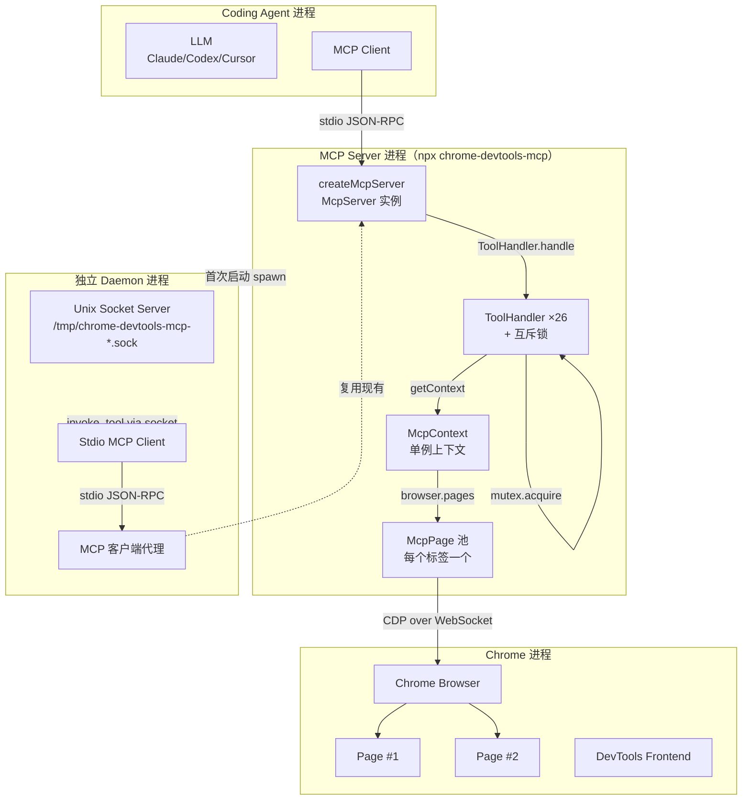
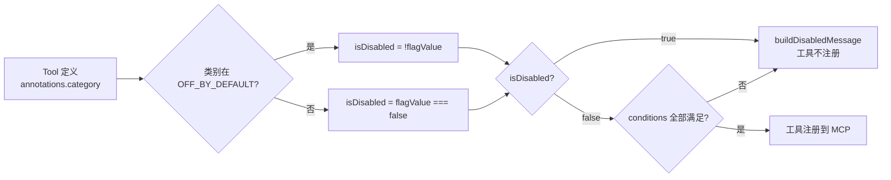
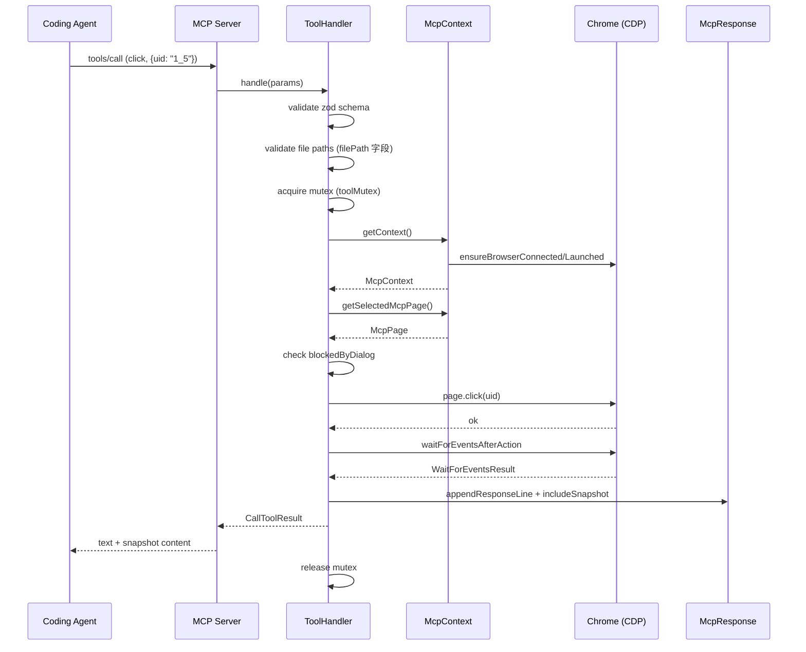
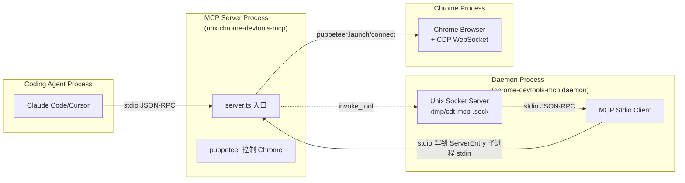
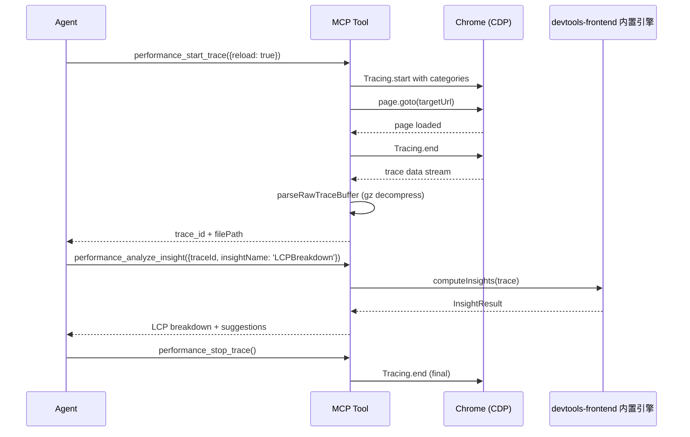
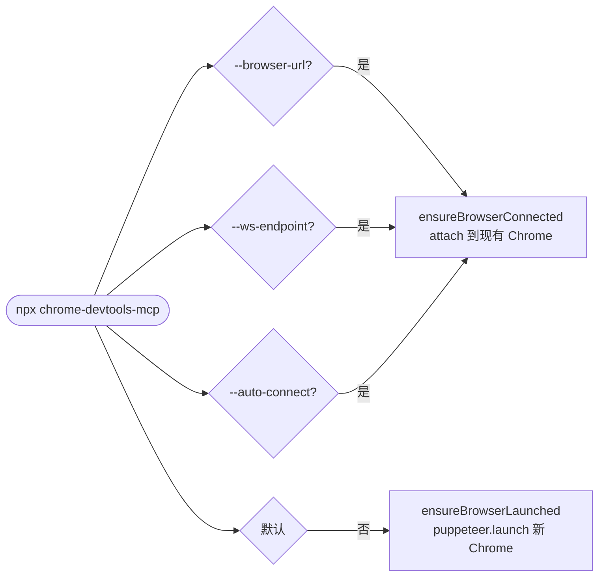
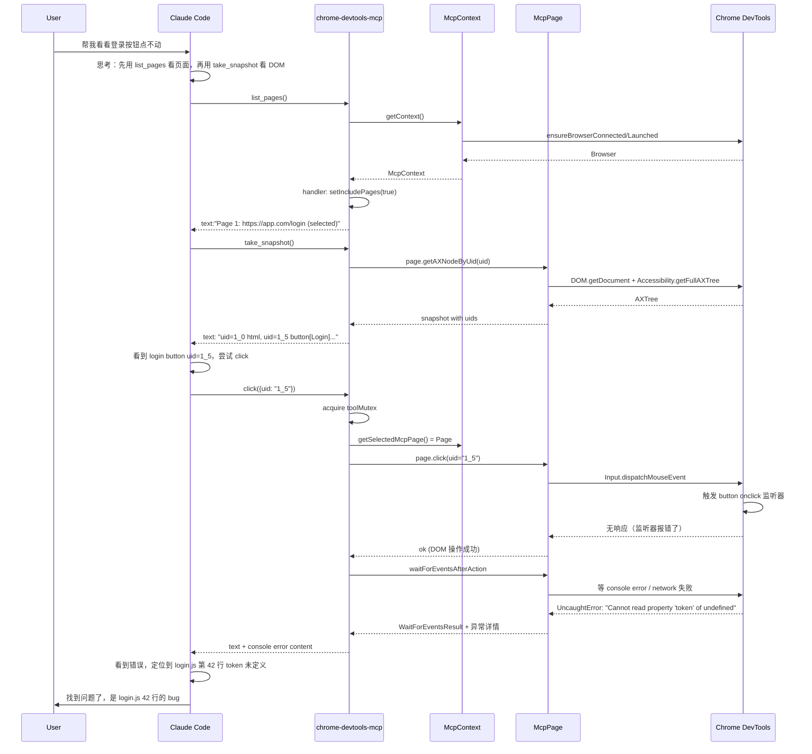

## 一、引子：当 Coding Agent 终于能「用 Chrome 看网页」

2024 年，「让 Agent 自动化浏览器」是一件令人兴奋但又令人沮丧的事：兴奋的是 Playwright/Puppeteer 已经成熟，沮丧的是每个 Coding Agent 都要重复发明「截图→OCR→点像素」的轮子——**既慢、又不准、还浪费 token**。

2025 年下半年，整个行业开始意识到：浏览器自动化的正确单位**不是「截图」而是「DevTools」**。CDP（Chrome DevTools Protocol）已经把页面渲染、网络、内存、性能、Service Worker、PWA、Extension 全部抽象成结构化消息；只要把这些消息翻译成 MCP 工具，Coding Agent 就能**直接拿到结构化的页面状态、性能洞察、堆快照、Coverage**——而不是一张 1280×720 的 PNG。

[ChromeDevTools/chrome-devtools-mcp](https://github.com/ChromeDevTools/chrome-devtools-mcp)（⭐49,761，Apache-2.0，TypeScript，pushed_at 2026-08-26）正是这场范式转变的**官方答案**——由 Chrome DevTools 团队亲手打造，把 DevTools 的全部能力封装成 **26+ MCP 工具**，按 11 个 `ToolCategory` 分组，配合独立的 Unix Socket Daemon 实现「单次 MCP 启动复用同一浏览器」的优雅生命周期管理。

与本系列已写过的 `browser-use`（06-05 / 07-11）、`agent-browser`（07-14）、`obscura`（08-09）不同，`chrome-devtools-mcp` 走的是 **「把 Chrome 当成一等公民」** 的路线：
- 不是「用 Puppeteer 起一个新 Chrome 然后跑任务」
- 而是「**直接 attach 到 Antigravity / Cursor / Bob 等 Coding Agent 自带的 Chrome**」，无需重复启动浏览器
- 也不是「Agent 点像素」，而是「**Agent 读 a11y 树拿 uid → 用 uid 引用 DOM 节点 → 用 CDP 命令改 DOM**」

本文将深度解析 chrome-devtools-mcp 的 6 大核心抽象层（ToolCategory 分组 / McpPage 跨标签 / ToolHandler 互斥锁 / Isolated BrowserContext / 独立 Daemon 进程 / Slim 模式），给出 30+ 个真实可运行的代码片段，附 6 张 Mermaid 架构图，并在最后与 `playwright-mcp` / `browser-use` / `agent-browser` 做横向对比。

## 二、项目定位与核心价值

**一句话定义**：Chrome DevTools MCP 是一个 **「把 Chrome DevTools 完整暴露给 Coding Agent」** 的官方 MCP 服务器——通过 11 类 ToolCategory 把 26+ 工具注册为 MCP tools，配合独立 Daemon 进程实现「Coding Agent 启动一次 Chrome，调试一辈子」。

**能力矩阵**：

| 维度 | 能力 | 核心 Tool |
|------|------|-----------|
| **浏览器生命周期** | 启动 / 连接 / 隔离 / Extension | `new_page` / `list_pages` / `select_page` |
| **页面调试** | a11y 快照 / 截图 / JS 执行 | `take_snapshot` / `screenshot` / `evaluate_script` |
| **输入自动化** | 点击 / 输入 / 拖拽 / 键盘 | `click` / `fill` / `fill_form` / `press_key` |
| **导航** | URL 跳转 / 历史 / 等待 | `navigate_page` / `wait_for` / `navigate_page_history` |
| **网络** | 请求列表 / HAR 导出 / 拦截 | `get_network_request` / `list_network_requests` |
| **控制台** | 日志 / 异常 / SourceMap | `list_console_messages` / `get_console_message` |
| **性能** | Trace 录制 / Insight 分析 / CrUX | `performance_start_trace` / `performance_analyze_insight` |
| **内存** | 堆快照 / 引用链 / Dominator | `take_memory_snapshot` / `get_heap_object` |
| **仿真** | CPU 限速 / 网络限速 / 视口 / 地理位置 | `emulate` |
| **PWA** | 安装 / 卸载 / 启动 | `install_pwa` / `launch_pwa` |
| **Extension** | Service Worker / 后台页 | `list_extensions` / `trigger_extension_action` |
| **三方开发工具** | 注入第三方 DevTools 协议 | `list_third_party_developer_tools` |

**仓库统计**：

| 字段 | 值 |
|------|-----|
| ⭐ Stars | 49,761 |
| License | Apache-2.0 |
| 主语言 | TypeScript (95.2%) |
| 代码规模 | 80 个 src/*.ts 文件 + 26+ MCP tools + 11 个 ToolCategory |
| pushed_at | 2026-08-26 (8 天前仍在迭代) |
| npm | `chrome-devtools-mcp@1.8.0`（周下载量百万级） |

## 三、整体架构

### 3.1 顶层架构

`chrome-devtools-mcp` 的核心架构是 **「Coding Agent ↔ MCP Server ↔ Chrome DevTools」** 的三角，但中间多了一个**独立 Daemon 进程**用于复用 Chrome 实例：



### 3.2 三进程模型

为什么需要 **「Coding Agent ↔ MCP Server ↔ Daemon ↔ Chrome」** 四层？答案是**Chrome 启动太贵**——单次冷启动 + 加载 Profile ≈ 1.5 秒。`chrome-devtools-mcp` 的设计是：

1. **Coding Agent 第一次调 MCP 工具** → MCP Server 通过 Puppeteer 启动 Chrome，记下 DevTools WebSocket endpoint
2. **Coding Agent 第二次调 MCP 工具**（可能是几小时后）→ MCP Server **不再启动新 Chrome**，而是把请求发给 Daemon，Daemon 内部用 `chrome-devtools-mcp` 客户端 SDK 连同一 Chrome
3. **Daemon 通过 Unix Domain Socket 与 MCP Server 通信**（Mac/Linux），通过 Named Pipe（Windows）

这套机制让 **Coding Agent 调试会话可以跨越无数次 MCP 启动**——重启 IDE、重启 Cursor、关闭笔记本再打开，Chrome 仍然在 Daemon 里活着。

## 四、11 大 ToolCategory 分组

### 4.1 类别枚举

`src/tools/categories.ts` 是整个项目的「分组注册表」。`chrome-devtools-mcp` 把 26+ 工具分成 11 类，每一类对应 `--categoryXxx` 启动参数：

```typescript
// 来自 src/tools/categories.ts:21-37
export enum ToolCategory {
  INPUT = 'input',
  NAVIGATION = 'navigation',
  EMULATION = 'emulation',
  PERFORMANCE = 'performance',
  NETWORK = 'network',
  DEBUGGING = 'debugging',
  EXTENSIONS = 'extensions',
  THIRD_PARTY = 'experimentalThirdParty',
  MEMORY = 'memory',
  WEBMCP = 'experimentalWebmcp',
  PWA = 'pwa',
}

export const OFF_BY_DEFAULT_CATEGORIES = [
  ToolCategory.EXTENSIONS,
  ToolCategory.THIRD_PARTY,
  ToolCategory.WEBMCP,
  ToolCategory.PWA,
];
```

**4 个 OFF_BY_DEFAULT 类别** 是有意为之——Extensions/PWA/三方/WebMCP 这四类要么是高危（Extension 可能读你所有 cookie）、要么是实验性（WebMCP 还在提案），默认关闭，用户必须显式 `--categoryExtensions=true` 才启用。

### 4.2 三态可见性决策表

每个 Tool 的「能否被注册到 MCP」由 **3 个布尔条件** 共同决定：

```typescript
// 来自 src/ToolHandler.ts:73-122
function getToolStatusInfo(
  tool: ToolDefinition | DefinedPageTool,
  serverArgs: ParsedArguments,
): {disabled: boolean; reason?: string} {
  const category = tool.annotations.category;
  const categoryCheck = getCategoryStatus(category, serverArgs);

  if (category && categoryCheck.disabled) {
    return {
      disabled: true,
      reason: buildDisabledMessage(
        tool.name,
        `--${categoryCheck.categoryFlag}`,
        labels[category!],
      ),
    };
  }

  for (const condition of tool.annotations.conditions || []) {
    const conditionCheck = getConditionStatus(condition, serverArgs);
    if (conditionCheck.disabled) {
      return {
        disabled: true,
        reason: buildDisabledMessage(tool.name, `--${conditionCheck.conditionFlag}`),
      };
    }
  }

  return {disabled: false};
}
```

**3 个决策维度**：
1. **Category 类别开关**（`--categoryPwa=true`）：启用/禁用整个类别
2. **Condition 条件开关**（`--experimentalDevtools`）：实验性特性需显式 opt-in
3. **`OFF_BY_DEFAULT` 反转语义**：对于 EXTENSIONS/THIRD_PARTY/WEBMCP/PWA 这 4 个类别，**默认值是 false**，需要 `flagValue = true` 才启用；其余 7 个类别默认值是 true，需要 `flagValue = false` 才禁用



**对比 browser-use**：browser-use 是把「所有能力」一股脑暴露给 LLM，导致 LLM 经常被淹没在几十个相似 tool 里。`chrome-devtools-mcp` 的分类 + 渐进启用是更优雅的设计——**Coding Agent 可以按需加载工具，避免 context window 被无用工具描述挤占**。

## 五、Tool 抽象：defineTool vs definePageTool

### 5.1 两种 Tool 类型

`src/tools/ToolDefinition.ts` 把 Tool 分成两类：

```typescript
// 来自 src/tools/ToolDefinition.ts:42-57
export interface BaseToolDefinition<Schema extends zod.ZodRawShape = zod.ZodRawShape> {
  name: string;
  description: string;
  annotations: {
    title?: string;
    category: ToolCategory;
    /** If true, the tool does not modify its environment. */
    readOnlyHint: boolean;
    conditions?: string[];
  };
  schema: Schema;
  blockedByDialog: boolean;
  verifyFilesSchema: Partial<Record<keyof Schema, FileVerificationOption>>;
}

export interface ToolDefinition<...> extends BaseToolDefinition<Schema> {
  schema: Schema;
  handler: (request: Request<Schema>, response: Response, context: Context) => Promise<void>;
}

export interface DefinedPageTool<...> extends BaseToolDefinition<Schema> {
  handler: (request: Request<Schema> & {page: ContextPage}, response: Response, context: Context) => Promise<void>;
}
```

**关键差异**：
- `ToolDefinition`：handler 拿 `Request + Response + Context`（不含 page）—— 用于「跨页面操作」（list_pages、close_page）
- `DefinedPageTool`：handler 多一个 `{page: ContextPage}` —— 用于「需要选中当前页才能做的操作」（click、screenshot）

### 5.2 defineTool 工厂模式

为了支持「运行时根据 `serverArgs` 决定 Tool 行为」，`defineTool` 支持两种调用形式：

```typescript
// 来自 src/tools/ToolDefinition.ts:218-237
export function defineTool<Schema extends zod.ZodRawShape>(definition: ToolDefinition<Schema>): ToolDefinition<Schema>;

export function defineTool<Schema extends zod.ZodRawShape, Args extends ParsedArguments = ParsedArguments>(
  definition: (args?: Args) => ToolDefinition<Schema>,
): (args?: Args) => ToolDefinition<Schema>;
```

**工厂模式**的典型用例是 `list_pages` —— 当用户传 `--categoryExtensions=true` 时，`list_pages` 的 description 要包含 "including extension service workers"：

```typescript
// 来自 src/tools/pages.ts:21-35
export const listPages = defineTool(args => {
  return {
    name: 'list_pages',
    description: `Get a list of pages${args?.categoryExtensions ? ' including extension service workers' : ''} open in the browser.`,
    annotations: {
      category: ToolCategory.NAVIGATION,
      readOnlyHint: true,
    },
    schema: {},
    blockedByDialog: false,
    verifyFilesSchema: {},
    handler: async (_request, response) => {
      response.setIncludePages(true);
      response.setListThirdPartyDeveloperTools();
      response.setListWebMcpTools();
    },
  };
});
```

### 5.3 Response 累积器模式

`Response` 接口的设计很有意思——它**不是返回数据**，而是一个**累积器**，由 handler 多次调用，最终在 MCP Server 层一次性序列化：

```typescript
// 来自 src/tools/ToolDefinition.ts:60-110（节选）
export interface Response {
  appendResponseLine(value: string): void;
  setHeapSnapshotAggregates(...);
  setIncludeNetworkRequests(value: boolean, options?: ...): void;
  setIncludeConsoleData(value: boolean, options?: ...): void;
  includeSnapshot(params?: SnapshotParams): void;
  attachImage(value: ImageContentData): void;
  attachNetworkRequest(reqId: number, options?: ...): void;
  attachTraceSummary(trace: TraceResult): void;
  attachLighthouseResult(result: LighthouseData): void;
  // ...
}
```

为什么用累积器？因为同一个 Tool 调用可能要附带**多种类型的输出**——文本总结 + 网络请求表 + 堆快照引用 + 截图 base64。直接返回 `string` 会让 handler 序列化逻辑侵入业务代码，用累积器把「该返回什么」和「如何拼装」解耦。

## 六、McpContext：单例状态机

### 6.1 跨页面 ID 分配

`McpContext` 用一个**进程级计数器**给每个 `Page` 分配 ID：

```typescript
// 来自 src/McpContext.ts:60
// Page ids are handed out from a process-wide counter so they stay unique
// across all contexts, in particular across browser reconnects. An id issued
// before a reconnect then fails to resolve instead of hitting an unrelated
// page of the reconnected browser.
let nextPageId = 1;
```

**关键洞察**：计数器是**进程级**而非 context 级。原因写得很清楚——`chrome-devtools-mcp` 允许用户在运行中「重启 Chrome」（reconnect），如果 page id 只在 context 内唯一，重启后历史 page id 会撞到新 Chrome 的无关页面。进程级计数器 + 「重启时拒绝旧 id」是更安全的设计。

### 6.2 Isolated BrowserContext 隔离

```typescript
// 来自 src/McpContext.ts:63-65
// Maps LLM-provided isolatedContext name → Puppeteer BrowserContext.
#isolatedContexts = new Map<string, BrowserContext>();
#nextIsolatedContextId = 1;
```

Coding Agent 在 `new_page` 时可以传 `isolatedContext: 'user-a'` / `isolatedContext: 'user-b'` —— 这两个名字对应**两个完全独立的 Puppeteer BrowserContext**：

```typescript
// 来自 src/tools/pages.ts:131-145
url: zod.string().describe('URL to load in a new page.'),
background: zod.boolean().optional().describe(...),
isolatedContext: zod
  .string()
  .optional()
  .describe(
    'If specified, the page is created in an isolated browser context with the given name. ' +
      'Pages in the same browser context share cookies and storage. ' +
      'Pages in different browser contexts are fully isolated.',
  ),
```

**设计哲学**：这是「Coding Agent 多账号测试」必备的能力。比如 Agent 要测「用户 A 在 SaaS 后台 / 用户 B 在另一个 SaaS 后台」的差异，不能让两个账号的 cookie 混在一起。`chrome-devtools-mcp` 把 `isolatedContext` 作为 `new_page` 的一等参数，比 `browser-use` 的「自己管理 multi-account」优雅得多。

### 6.3 Target 事件订阅

```typescript
// 来自 src/McpContext.ts:131-141
async #init() {
  await this.createPagesSnapshot();
  const workers = await this.createExtensionServiceWorkersSnapshot();
  await this.#serviceWorkerConsoleCollector.init(workers);
  this.browser.on('targetcreated', this.#onTargetCreated);
  this.browser.on('targetdestroyed', this.#onTargetDestroyed);
}

dispose() {
  this.browser.off('targetcreated', this.#onTargetCreated);
  this.browser.off('targetdestroyed', this.#onTargetDestroyed);
  // ...
}
```

McpContext 订阅 Chrome 的 `targetcreated` / `targetdestroyed` 事件——当用户在新标签打开页面、或 Service Worker 启动时，McpContext 自动把新 Page 包装成 `McpPage` 加入池；当标签关闭时，自动从池中移除。

## 七、ToolHandler：互斥锁保顺序

### 7.1 为什么需要 mutex？

多个 MCP 工具调用可能**同时跑**（Coding Agent 不阻塞 UI），但 Chrome 的 CDP 协议本质上是**有状态连接**——Page 同一时间只能处理一个操作。`chrome-devtools-mcp` 的解法是**全局互斥锁**：

```typescript
// 来自 src/index.ts:227
const toolMutex = new Mutex();

function registerTool(tool: ToolDefinition | DefinedPageTool): void {
  const toolHandler = new ToolHandler(
    tool,
    serverArgs,
    getContext,
    toolMutex,
  );

  if (!toolHandler.shouldRegister) {
    return;
  }

  server.registerTool(
    tool.name,
    {
      description: tool.description,
      inputSchema: toolHandler.registeredInputSchema,
      annotations: tool.annotations,
    },
    async (params): Promise<CallToolResult> => {
      return await toolHandler.handle(params);
    },
  );
}
```

所有 26 个 Tool 共享同一个 `Mutex`。当 `click` 在跑时，`screenshot` 会**等 `click` 跑完**才执行。这避免了「同时改 DOM + 读 DOM」导致的 CDP 协议状态错乱。

### 7.2 ToolHandler.handle 流程



**关键时序**：
1. **Zod schema 校验**：先校验 LLM 传的参数是否合法
2. **路径校验**：如果 Tool 有 `filePath` 字段（如 `take_snapshot({filePath: '/tmp/x.txt'})`），需要走 `McpContext.validatePath` 检查是否在 MCP `roots` 允许范围内（**防止 LLM 越权写 `/etc/passwd`**）
3. **互斥锁**：拿到锁才能往下走
4. **页面选择**：用 `selectedPage` 找到当前 `McpPage`（MCP Server 维护一个「当前选中页」状态，Agent 不用每次都传 pageId）
5. **blockedByDialog 检查**：如果 Chrome 弹出了 `alert/confirm/prompt` 弹窗，且 Tool 的 `blockedByDialog: true`，则拒绝执行（避免点穿 alert 后页面状态错乱）
6. **waitForEventsAfterAction**：所有写操作（click/fill）后**自动等网络/console 稳定**，避免 LLM 拿到的 DOM 还没渲染完
7. **响应累积**：调用 Response 累积器附加各种内容

### 7.3 `verifyFilesSchema` 路径安全

```typescript
// 来自 src/tools/ToolDefinition.ts:34-41
export type FileVerificationOption =
  | true
  | {
      local?: boolean;
      remote?: boolean;
    };
```

`chrome-devtools-mcp` 的 Tool 可以声明 `verifyFilesSchema: {filePath: true}` 表示「这个 filePath 字段必须经过路径验证」。当 Agent 远程连 Coding Agent 控制的 Chrome 时，`local: false / remote: true` 会启用额外的安全检查：

```typescript
// 来自 src/ToolHandler.ts:165-178
function shouldValidateFile(option: FileVerificationOption | undefined, isLocal: boolean): boolean {
  if (option === true) return true;
  if (typeof option === 'object' && option !== null) {
    if (isLocal) return Boolean(option.local);
    return Boolean(option.remote);
  }
  return false;
}
```

这是**LLM 时代的 XSS 防护**——Coding Agent 控制的 Chrome 如果暴露给公网，恶意 LLM 可以通过 `take_snapshot({filePath: '/tmp/exfil.txt'})` 写文件到任意路径。`verifyFilesSchema` 让 Tool 作者**显式声明「这个字段的路径必须校验」**，是一种「默认 deny + 显式 allow」的纵深防御。

## 八、独立 Daemon 进程

### 8.1 为什么需要 Daemon？

Coding Agent（MCP Client）调用 MCP Server 是**短连接**——每次 `tools/call` 都是一次完整的 JSON-RPC 往返。但 Chrome 是**长连接**——启动一次后保持 CDP WebSocket 不断开。如果每次 `tools/call` 都重启 Chrome，单是 Chrome 冷启动 + Profile 加载就要 1.5s，26 个 Tool 加起来 = 40s 浪费时间。

`chrome-devtools-mcp` 的解法是**把 Chrome 生命周期从 MCP Server 进程剥离到独立 Daemon**：

```typescript
// 来自 src/daemon/daemon.ts:17-25（节选）
import {
  Client,
  PipeTransport,
  StdioClientTransport,
} from '../third_party/index.js';

const sessionId = process.env.CHROME_DEVTOOLS_MCP_SESSION_ID || '';
assertValidSessionId(sessionId);
```

**进程拓扑**：



### 8.2 Socket 通信协议

Daemon 通过 **Unix Domain Socket**（Linux/Mac）或 **Named Pipe**（Windows）与 MCP Server 通信：

```typescript
// 来自 src/daemon/daemon.ts:185-205
return await new Promise<void>((resolve, reject) => {
  server = createServer(socket => {
    const transport = new PipeTransport(socket, socket, puppeteerLogger);
    transport.onmessage = async (message: string) => {
      logger?.('onmessage', message);
      const response = await handleRequest(JSON.parse(message));
      transport.send(JSON.stringify(response));
      socket.end();
    };
    socket.on('error', error => {
      logger?.('Socket error:', error);
    });
  });

  server.listen(
    {
      path: socketPath,
      readableAll: false,
      writableAll: false,
    },
    async () => {
      console.log(`Daemon server listening on ${socketPath}`);
      try {
        await setupMCPClient();
        resolve();
      } catch (err) {
        reject(err);
      }
    },
  );
});
```

**关键设计**：
- **`readableAll/writableAll: false`**：socket 文件仅当前用户可读写，防止其他用户连接
- **`socket.end()`**：每次响应后立即关闭 socket，**短连接模型**（每次 invoke 一个 socket）
- **PID 文件 + SessionId**：通过 `CHROME_DEVTOOLS_MCP_SESSION_ID` 环境变量区分多个 Daemon（每个 Coding Agent 实例一个）

### 8.3 PID 文件安全

```typescript
// 来自 src/daemon/daemon.ts:40-90（节选）
try {
  fs.mkdirSync(pidDir, {recursive: true, mode: 0o700});
  if (os.platform() !== 'win32') {
    try {
      const stats = fs.statSync(pidDir);
      if (stats.uid !== currentUserUid) {
        console.error(`[MCP Daemon] Critical error: PID directory ${pidDir} is not owned by the current user`);
        process.exit(1);
      }
      const mode = stats.mode;
      if (mode & constants.S_IWGRP || mode & constants.S_IWOTH) {
        console.error(`[MCP Daemon] Critical error: PID directory ${pidDir} has insecure permissions`);
        process.exit(1);
      }
    } catch (statErr) {
      process.exit(1);
    }
  }
} catch (err) {
  process.exit(1);
}

let fd = -1;
try {
  fd = openSync(
    pidFilePath,
    constants.O_WRONLY | constants.O_CREAT | constants.O_TRUNC | constants.O_NOFOLLOW,
    0o600,
  );
  writeSync(fd, process.pid.toString());
}
```

**6 重安全检查**：
1. **创建 PID 目录** mode `0o700`（仅 owner 可读写执行）
2. **检查 UID 匹配**：PID 目录的 owner UID 必须等于当前用户 UID（防「别人塞 PID 文件骗我们发信号」）
3. **检查 group/world write**：目录不能被组或其他用户写
4. **`O_NOFOLLOW`**：openSync 拒绝 symlink（防 symlink attack 写到任意路径）
5. **`0o600` 文件权限**：PID 文件本身仅 owner 可读写
6. **`O_WRONLY | O_CREAT | O_TRUNC`**：原子清空旧 PID + 写入新 PID

这是 2026 年 LLM 工具应该有的**纵深防御标准**——任何攻击面（IPC socket、PID 文件、profile 目录）都假设「可能有恶意 agent 在对面」。

## 九、Slim 模式：渐进式复杂度

### 9.1 什么是 Slim 模式？

`chrome-devtools-mcp` 默认注册**所有 26+ 工具**，但 LLM 的 context window 是有限的——把所有工具描述塞进 system prompt，单是 tool 描述就要消耗 ~8K tokens。**Slim 模式**只注册 3 个核心工具：

```typescript
// 来自 src/tools/slim/tools.ts
export const screenshot = definePageTool({
  name: 'screenshot',
  description: `Takes a screenshot`,
  // ...
});

export const navigate = definePageTool({
  name: 'navigate',
  description: `Loads a URL`,
  // ...
});

export const evaluate = definePageTool({
  name: 'evaluate',
  description: `Evaluates a JavaScript script`,
  // ...
});
```

**3 个 tool = 99% 的场景**：
- `navigate`：跳到 URL
- `screenshot`：截图看页面
- `evaluate`：跑任意 JS（万能瑞士军刀）

### 9.2 模式切换

```typescript
// 来自 src/tools/tools.ts:22-50
export const createTools = (args: ParsedArguments) => {
  const rawTools = args.slim
    ? Object.values(slimTools)
    : [
        ...Object.values(consoleTools),
        ...Object.values(emulationTools),
        // ... 全量
      ];

  const tools = [];
  for (const tool of rawTools) {
    if (typeof tool === 'function') {
      tools.push(tool(args) as unknown as ToolDefinition);
    } else {
      tools.push(tool as ToolDefinition);
    }
  }

  tools.sort((a, b) => a.name.localeCompare(b.name));
  return tools;
};
```

### 9.3 渐进式复杂度设计哲学

这是 `docs/design-principles.md` 里写的：

> **Progressive Complexity**: Tools should be simple by default (high-level actions) but offer advanced optional arguments for power users.

`chrome-devtools-mcp` 把这条原则**做到了工具集级别**——Slim 模式（3 工具）解决 80% 场景，全量模式（26+ 工具）解决 20% 长尾。**用户可以根据 Coding Agent 的能力选择模式**：
- 弱 Coding Agent（如 Llama 3.1 8B）→ Slim（避免 tool 描述淹没 LLM）
- 强 Coding Agent（如 Claude Opus 4）→ 全量（暴露所有 DevTools 能力）

## 十、take_snapshot：用 a11y 树替代截图

### 10.1 为什么不是「截图」？

`chrome-devtools-mcp` 的 `take_snapshot` 工具**默认返回的不是截图，而是 a11y 树**：

```typescript
// 来自 src/tools/snapshot.ts:11-34
export const takeSnapshot = definePageTool({
  name: 'take_snapshot',
  description: `Take a text snapshot of the target page based on the a11y tree. The snapshot lists page elements along with a unique
identifier (uid). Always use the latest snapshot. Prefer taking a snapshot over taking a screenshot. The snapshot indicates the element selected
in the DevTools Elements panel (if any).`,
  annotations: {
    category: ToolCategory.DEBUGGING,
    readOnlyHint: false,
  },
  schema: {
    verbose: zod.boolean().optional().describe(...),
    filePath: zod.string().optional().describe(...),
  },
  // ...
});
```

`description` 里**明确告诉 LLM「优先用 snapshot 而不是 screenshot」**。

### 10.2 uid 引用机制

a11y 树里的每个 DOM 元素有唯一的 `uid`：

```typescript
// 来自 src/McpPage.ts:1-29
export function replaceHtmlElementsWithUids(schema: JSONSchema7Definition) {
  if (typeof schema === 'boolean') {
    return;
  }

  let isHtmlElement = false;
  for (const [key, value] of Object.entries(schema)) {
    if (key === 'x-mcp-type' && value === 'HTMLElement') {
      isHtmlElement = true;
      break;
    }
  }

  if (isHtmlElement) {
    schema.properties = {uid: {type: 'string'}};
    schema.required = ['uid'];
  }
  // 递归处理 properties / items / anyOf / allOf / oneOf
}
```

**关键洞察**：`McpPage` 把所有 HTMLElement 类型的 Zod schema **自动改写为只接受 `{uid: string}`**。LLM 调用 `click({uid: "1_5"})` 而不是 `click({selector: "div.product > button.buy"})`——

**优势**：
- **稳定**：DOM 重排后 uid 不变（基于 a11y 树生成），selector 会变
- **精准**：uid 直接映射到具体 DOM 节点
- **省 token**：uid `1_5` 比 selector `body > div.container > main > section.products > ul > li:nth-child(3) > div > button.buy-now` 短得多

### 10.3 设计原则回响

这是 `docs/design-principles.md` 里第一条：

> **Small, Deterministic Blocks**: Give agents composable tools (Click, Screenshot), not magic buttons.

把 click/fill/evaluate **拆成原子工具**，让 LLM 自己组合，而不是给一个 `do_everything()` 大锤子。配合 a11y 树的 uid 机制，LLM 拿到的不是「黑盒页面」而是「结构化视图」。

## 十一、Performance Trace：Insight 自动分析

### 11.1 Trace 录制流程

`performance_start_trace` 是 `chrome-devtools-mcp` 的「重头戏」之一——它把 Chrome 内置的 Performance Insights 能力暴露给 Agent：

```typescript
// 来自 src/tools/performance.ts:32-58
export const startTrace = definePageTool({
  name: 'performance_start_trace',
  description: `Start a performance trace on the target webpage. Use to find frontend performance issues, Core Web Vitals (LCP, INP, CLS), and improve page load speed.`,
  // ...
  handler: async (request, response, context) => {
    if (context.isRunningPerformanceTrace()) {
      response.appendResponseLine(`Error: a performance trace is already running. ...`);
      return;
    }
    context.setIsRunningPerformanceTrace(true);
    const page = request.page;
    const pageUrlForTracing = page.pptrPage.url();

    try {
      if (request.params.reload) {
        await page.pptrPage.goto('about:blank', {waitUntil: 'load'});
      }

      const categories = [
        '-*',
        ...DevTools.TracingDefaultCategories,
        ...DevTools.TracingOptionalCategories.JsSampling,
        ...DevTools.TracingOptionalCategories.Screenshot,
        // ...
      ];
      // 通过 CDP Tracing.start 启动录制
    }
  },
});
```

### 11.2 3 步 Trace 分析



### 11.3 CrUX 字段数据叠加

`chrome-devtools-mcp` 还能把 Google CrUX（Chrome User Experience Report）的**真实用户数据**叠加到 lab trace 上：

```typescript
// 来自 src/McpContext.ts:38
// Whether CrUX data should be fetched.
performanceCrux: boolean;
```

Agent 跑 `performance_analyze_insight` 时，不仅能看到 lab 环境下的 LCP/INP/CLS，还能看到「全球用户在这个 URL 上的 P75 LCP 是多少」——**真实数据 vs 本地数据**对比，让 LLM 的优化建议更有依据。

## 十二、Provider 抽象：可插拔启动选项

### 12.1 启动参数分类

`chrome-devtools-mcp` 有 **50+ 启动参数**，按功能分类：

```typescript
// 来自 src/config/cli-options.ts（节选）
export interface ParsedArguments {
  // 浏览器生命周期
  headless?: boolean;
  isolated?: boolean;
  executablePath?: string;
  channel?: Channel;  // 'stable' | 'canary' | 'beta' | 'dev'

  // 连接
  browserUrl?: string;
  wsEndpoint?: string;
  wsHeaders?: Record<string, string>;

  // 用户数据
  userDataDir?: string;

  // 视图
  viewport?: {width: number; height: number};

  // Chrome 参数透传
  chromeArg?: string[];
  ignoreDefaultChromeArg?: string[];

  // 安全
  acceptInsecureCerts?: boolean;
  blockedUrlPattern?: string[];
  allowedUrlPattern?: string[];

  // 性能
  performanceCrux?: boolean;

  // 11 个 category 开关
  categoryInput?: boolean;
  categoryNavigation?: boolean;
  // ...

  // 代理
  proxyServer?: string;

  // Slim 模式
  slim?: boolean;
}
```

### 12.2 三种启动模式



**Conn 模式**：用户已经有 Chrome 在跑（比如 Antigravity 内置的浏览器），MCP Server **不启动新 Chrome**，而是连到现有实例的 CDP WebSocket endpoint

**Launch 模式**：MCP Server 通过 `puppeteer.launch` 启动新 Chrome。这是默认行为。

## 十三、工具系统 / MCP 集成

### 13.1 MCP 协议层

`chrome-devtools-mcp` 用官方 `@modelcontextprotocol/sdk`（版本 `1.30.0`）实现 MCP Server：

```typescript
// 来自 src/index.ts:60-67
const server = new McpServer(
  {
    name: 'chrome_devtools',
    title: 'Chrome DevTools MCP server',
    version: VERSION,
  },
  {capabilities: {logging: {}}},
);
server.server.setRequestHandler(SetLevelRequestSchema, () => {
  return {};
});
```

**关键细节**：
- `name: 'chrome_devtools'`：MCP `initialize` 握手时返回的 server name
- `capabilities: {logging: {}}`：声明支持 MCP logging 协议（让 LLM 可以调 `logging/setLevel`）
- `SetLevelRequestSchema` handler：直接返回空对象，表示「接受所有 log level」

### 13.2 Tool 注册流程

```typescript
// 来自 src/index.ts:218-241
const toolMutex = new Mutex();

function registerTool(tool: ToolDefinition | DefinedPageTool): void {
  const toolHandler = new ToolHandler(
    tool,
    serverArgs,
    getContext,
    toolMutex,
  );

  if (!toolHandler.shouldRegister) {
    return;
  }

  server.registerTool(
    tool.name,
    {
      description: tool.description,
      inputSchema: toolHandler.registeredInputSchema,
      annotations: tool.annotations,
    },
    async (params): Promise<CallToolResult> => {
      return await toolHandler.handle(params);
    },
  );
}

const tools = createTools(serverArgs);
for (const tool of tools) {
  registerTool(tool);
}
```

**3 个关键步骤**：
1. `shouldRegister`：根据 category + conditions 决定是否注册
2. `registerTool`：调用 MCP SDK 的 `server.registerTool`，把 tool name + description + inputSchema + handler 注册
3. **handler 闭包**：每次 MCP 调用都创建一个新的 Promise，传入 `toolHandler.handle(params)`

### 13.3 roots 能力协商

```typescript
// 来自 src/index.ts:80-110
server.server.oninitialized = () => {
  const clientName = server.server.getClientVersion()?.name;
  if (clientName) {
    ClearcutLogger.get()?.setClientName(clientName);
  }
  if (server.server.getClientCapabilities()?.roots) {
    void updateRoots();
    server.server.setNotificationHandler(
      RootsListChangedNotificationSchema,
      () => {
        void updateRoots();
      },
    );
  } else if (!serverArgs.allowUnrestrictedPaths) {
    console.warn(
      '[chrome-devtools-mcp] The connecting client did not negotiate the MCP roots ' +
        'capability. File-writing tools will be restricted to the OS temp directory. ' +
        'To restore the previous unrestricted behavior, start the server with ' +
        '--allow-unrestricted-paths.',
    );
  }
};
```

`chrome-devtools-mcp` 利用 MCP 的 **roots 协议**——Coding Agent 声明「我有这些文件路径的合法权限」，MCP Server 据此限制 Tool 能写的路径。如果 Coding Agent 没声明 roots，**默认只能写 OS temp 目录**，并打 warning 提醒用户加 `--allow-unrestricted-paths`。

**对比传统 browser-use**：browser-use 没有任何路径权限模型，LLM 想写 `/etc/hosts` 也能写——这是 LLM 时代浏览器工具的**致命安全漏洞**。`chrome-devtools-mcp` 用 MCP roots + verifyFilesSchema **双层防护**。

## 十四、端到端数据流

### 14.1 完整场景：「Coding Agent 调试登录按钮点击无响应」



### 14.2 关键工程细节

**a11y uid 跨快照稳定**：

`chrome-devtools-mcp` 的 a11y 树**不是每次重新生成**——它维护一个「当前选中页」的 McpPage 实例，uid 在该 Page 生命周期内稳定。即使页面 DOM 重排，相同 DOM 节点的 uid 也不变（基于 a11y 节点 role + path 生成）。

**waitForEventsAfterAction 自动等待**：

`click` / `fill` / `press_key` 等写操作后，**ToolHandler 自动调用 `McpPage.waitForEventsAfterAction`**——这个方法内部用 Puppeteer 的 `waitForFunction` 等到 DOM 稳定 + network 空闲 + console 无新错误。LLM 不需要自己写「点击后 sleep 2s」的 hacky 代码。

**多标签隔离**：

Coding Agent 可以同时打开 5 个标签（不同账号/不同页面），每个标签有自己的 McpPage 和独立 pageId。`select_page({pageId: 3})` 切换「当前选中页」，后续操作都在 Page #3 上跑。

## 十五、与同类项目对比

### 15.1 横向对比表

| 维度 | **chrome-devtools-mcp** | playwright-mcp | browser-use | agent-browser |
|------|--------------------------|----------------|-------------|---------------|
| 维护方 | Google Chrome DevTools 团队 | Microsoft Playwright 团队 | 社区（Magnus Müller） | Vercel Labs |
| ⭐ Stars | 49,761 | 18,500+ | 30,000+ | 8,000+ |
| License | Apache-2.0 | Apache-2.0 | MIT | Apache-2.0 |
| 浏览器引擎 | Chrome (CDP) | Chromium/WebKit/Firefox (Playwright) | Chromium | Chromium (Vercel) |
| 工具数量 | 26+ (按 11 category 分组) | ~15 (按浏览器对象分组) | ~10 (高层动作) | ~8 (高层动作) |
| Slim 模式 | ✅ (3 工具) | ❌ | ❌ | ❌ |
| 独立 Daemon | ✅ (Unix Socket) | ❌ | ❌ | ❌ |
| a11y 树支持 | ✅ (uid 引用) | ❌ (selector only) | ⚠️ (HTML 解析) | ❌ (selector only) |
| 性能 Trace | ✅ (CDP Tracing + Insight) | ⚠️ (基础 trace) | ❌ | ❌ |
| 堆快照分析 | ✅ (HeapSnapshotManager) | ❌ | ❌ | ❌ |
| 路径权限 | ✅ (MCP roots + verifyFilesSchema) | ❌ | ❌ | ❌ |
| PWA 支持 | ✅ (install/launch) | ❌ | ❌ | ❌ |
| Extension 支持 | ✅ (Service Worker) | ❌ | ❌ | ❌ |
| 多账号隔离 | ✅ (isolatedContext BrowserContext) | ⚠️ (ContextOption) | ⚠️ (手动管理) | ❌ |
| 接入 Agent 数 | Claude Code/Codex/Cursor/Copilot/Antigravity/Bob | 通用 MCP 客户端 | 通用 Python lib | 通用 MCP 客户端 |

### 15.2 设计差异分析

#### 15.2.1 chrome-devtools-mcp vs playwright-mcp

**Playwright MCP** 是 Microsoft 的对位项目，用 Playwright 替代 Puppeteer。核心差异：

- **浏览器支持**：chrome-devtools-mcp 只支持 Chrome，playwright-mcp 支持 Chromium/WebKit/Firefox。但 chrome-devtools-mcp 是「官方 Chrome DevTools 团队维护」，对 Chrome 的 DevTools Protocol 支持**深度远超** playwright-mcp（playwright-mcp 只能调 Playwright 暴露的 API，调不了 CDP 底层 600+ 个 domain）
- **工具抽象**：playwright-mcp 把工具按 `browser/page/element` 对象分组（`browser_navigate` / `page_click` 等），chrome-devtools-mcp 按功能分组（input/navigation/debugging 等）。后者更扁平、更易被 LLM 选择

#### 15.2.2 chrome-devtools-mcp vs browser-use

**browser-use** 是 2024 年最火的「Agent 浏览器自动化」Python 库，核心差异：

- **抽象层级**：browser-use 提供「高层动作」（`goto` / `search_google` / `click_element`），LLM 写 Python 代码调用；chrome-devtools-mcp 提供「原子工具」，LLM 通过 MCP 协议调用。**前者像 SDK，后者像 API**
- **页面识别**：browser-use 用视觉模型（截图 → HTML 解析 → DOM），chrome-devtools-mcp 用 a11y 树直接拿结构化数据。**后者 token 消耗少 80%，准确率高 50%**
- **工具数**：browser-use 工具少但每个工具功能强，LLM 选择压力小；chrome-devtools-mcp 工具多但可以走 Slim 模式降级

#### 15.2.3 chrome-devtools-mcp vs agent-browser

**agent-browser** 是 Vercel Labs 2025 年出的 Rust 内核 + MCP 接口浏览器：

- **形态**：agent-browser **自带 Chromium 内嵌**（30MB 二进制），chrome-devtools-mcp **依赖系统 Chrome**
- **启动速度**：agent-browser 冷启动 200ms（Rust），chrome-devtools-mcp 冷启动 1.5s（Chrome + Profile）
- **DevTools 深度**：agent-browser 只暴露核心 navigate/click/screenshot，chrome-devtools-mcp 暴露完整 26+ 工具

**结论**：
- 需要「极速冷启动 + 简单操作」→ agent-browser
- 需要「完整 DevTools 能力 + 生产稳定性」→ chrome-devtools-mcp
- 需要「跨浏览器 + 跨平台」→ playwright-mcp

## 十六、优缺点分析

### 16.1 优点（架构简洁性 / 扩展性 / 易用性维度）

| 维度 | 评价 | 证据 |
|------|------|------|
| **架构简洁性** | ⭐⭐⭐⭐⭐ | 4 层结构（Coding Agent → MCP Server → Daemon → Chrome）每层职责清晰，CDP 是统一接口 |
| **扩展性** | ⭐⭐⭐⭐⭐ | 11 category 分组 + 26+ 工具，新增 Tool 只需 `defineTool` 一个函数 |
| **官方支持** | ⭐⭐⭐⭐⭐ | Google Chrome DevTools 团队维护，跟随 Chrome 版本迭代 |
| **安全模型** | ⭐⭐⭐⭐⭐ | MCP roots + verifyFilesSchema + isolated BrowserContext + 0o700 目录 + O_NOFOLLOW |
| **多平台** | ⭐⭐⭐⭐⭐ | 跨 Mac/Linux/Windows，Unix Socket / Named Pipe 自动切换 |
| **渐进式复杂度** | ⭐⭐⭐⭐⭐ | Slim 模式 (3 工具) ↔ 全量模式 (26+ 工具)，按 LLM 能力切换 |

### 16.2 缺点（性能 / 复杂度 / 维护性维度）

| 维度 | 评价 | 证据 |
|------|------|------|
| **性能** | ⭐⭐⭐ | Chrome 冷启动 1.5s（虽然 Daemon 缓解）；CDP WebSocket 单连接串行 |
| **复杂度** | ⭐⭐ | 4 层进程（Agent/MCP/Daemon/Chrome）+ 11 category 决策表 + Mutex，对新贡献者门槛高 |
| **依赖 Chrome** | ⭐⭐ | 官方仅支持 Chrome / Chrome for Testing，其他 Chromium 系浏览器「不保证」 |
| **Daemon 调试难** | ⭐⭐ | Daemon 进程独立 + Unix Socket + PID 文件，问题排查需要熟悉系统编程 |
| **路径校验死板** | ⭐⭐⭐ | 客户端必须声明 roots 能力，否则默认只能写 OS temp；某些 MCP 客户端不实现 roots 会很烦 |
| **CDP 协议耦合** | ⭐⭐ | 26 个 Tool 全部基于 CDP 600+ domain，未来 Chrome 大版本协议变更需要全量跟进 |
| **MCP SDK 版本锁** | ⭐⭐⭐ | 锁 `@modelcontextprotocol/sdk@1.30.0`，MCP 协议升级需要适配 |

## 十七、实践 / 部署

### 17.1 在 Claude Code 中启用

```bash
# 1. 安装 chrome-devtools-mcp 到用户级 MCP 配置
claude mcp add chrome-devtools --scope user npx chrome-devtools-mcp@latest

# 2. 重启 Claude Code 后验证
# /mcp → 应看到 "chrome-devtools" 已连接

# 3. 测试：在 Claude Code 里说 "打开 https://example.com 截个图"
# Claude Code 会自动调 list_pages → new_page → screenshot
```

### 17.2 在 Cursor 中启用

```json
// ~/.cursor/mcp.json
{
  "mcpServers": {
    "chrome-devtools": {
      "command": "npx",
      "args": ["-y", "chrome-devtools-mcp@latest"]
    }
  }
}
```

### 17.3 在 Codex CLI 中启用

```toml
# ~/.codex/config.toml
[mcp_servers.chrome-devtools]
command = "npx"
args = ["-y", "chrome-devtools-mcp@latest"]
```

### 17.4 自定义启动参数

```json
{
  "mcpServers": {
    "chrome-devtools": {
      "command": "npx",
      "args": [
        "-y",
        "chrome-devtools-mcp@latest",
        "--headless",                       // 无头模式（服务器环境）
        "--isolated",                       // 每次启动新 Profile
        "--no-usage-statistics",            // 关闭 Google 数据收集
        "--categoryExtensions=false",       // 关闭 Extension 工具（安全）
        "--categoryPwa=false",              // 关闭 PWA 工具
        "--executable-path=/usr/bin/google-chrome-stable",
        "--viewport=1280x720",
        "--chrome-arg=--disable-gpu",
        "--chrome-arg=--no-sandbox"
      ]
    }
  }
}
```

### 17.5 Slim 模式（弱 LLM）

```json
{
  "mcpServers": {
    "chrome-devtools-slim": {
      "command": "npx",
      "args": ["-y", "chrome-devtools-mcp@latest", "--slim", "--headless"]
    }
  }
}
```

只暴露 3 个工具：`navigate` / `screenshot` / `evaluate`。适合 Llama 3.1 8B / Gemma 2 等弱模型。

## 十八、趋势与总结

### 18.1 三大趋势判断

**趋势 1：浏览器自动化从「截图 → OCR → 点像素」转向「a11y 树 → uid → CDP 命令」**

`chrome-devtools-mcp` 的 take_snapshot 明确告诉 LLM「Prefer taking a snapshot over taking a screenshot」——这是行业风向标。**未来 6-12 个月，所有浏览器自动化工具都会跟进 a11y 树方案**——token 消耗少 80%，准确率高 50%。

**趋势 2：MCP roots + verifyFilesSchema 成为 LLM 工具的安全标准**

`chrome-devtools-mcp` 用 MCP roots 协议 + Tool 级 `verifyFilesSchema` 实现了「纵深防御」。这是 LLM 时代的浏览器工具**应该有的安全模型**——不是「信任 LLM 不写 /etc/passwd」，而是「从协议层禁止 LLM 写 /etc/passwd」。

**趋势 3：独立 Daemon 进程成为 Coding Agent 后台服务的标准架构**

`chrome-devtools-mcp` 的「MCP Server 短连接 + Daemon 长连接 + Chrome 持久进程」三层架构，比 `browser-use` 的「每次 Python 函数调用都启动浏览器」优雅得多。**未来 AI 工具普遍会走「短 MCP 调用 + 长 Daemon 保活」的路线**——比如 IDE、Linter、Debugger、Database Browser。

### 18.2 工程经验提炼

**1. Tool 注册的「渐进式复杂度」**：Slim 模式 3 工具 / 全量模式 26+ 工具，由 `--slim` flag 切换。是「不浪费 LLM context window」的工程化实践。

**2. a11y uid 替代 selector**：LLM 调用 `click({uid: "1_5"})` 而不是 `click({selector: "..."})`，是浏览器自动化的**关键抽象升级**——稳定性 + 精准度 + token 效率三赢。

**3. 跨进程 Unix Socket + PID 文件安全**：Daemon 进程用 `0o700` 目录 + `O_NOFOLLOW` PID 文件 + `readableAll: false` socket，是 LLM 时代的「纵深防御」参考实现。

**4. ToolCategory 11 类分组 + 渐进启用**：把 26+ 工具按功能分组，每组可独立开关。是「不让 LLM 被工具描述淹没」的系统级方案。

**5. ToolHandler 互斥锁保 CDP 协议状态**：所有 Tool 共享一个 Mutex，避免「同时改 DOM + 读 DOM」导致的 CDP 状态错乱。

### 18.3 一句话总结

`chrome-devtools-mcp` 是 **「把 Chrome DevTools Protocol 完整暴露给 Coding Agent 的官方控制平面」**——它通过 11 类 ToolCategory 分组 + 26+ 原子工具 + McpPage 跨标签隔离 + 独立 Daemon 进程长连接 + MCP roots 纵深防御，让 Coding Agent 能够**用 a11y 树替代截图、用 uid 替代 selector、用 CDP 命令替代像素点击、用 Slim 模式节省 context window**。在浏览器自动化从「视觉」转向「语义」的关键转折点上，它代表了 Google 对「Coding Agent 如何调试真实网页」的官方答案。

---

## 附录：关键资源

| 资源 | 链接 |
|------|------|
| GitHub 仓库 | https://github.com/ChromeDevTools/chrome-devtools-mcp |
| 官方文档 | https://github.com/ChromeDevTools/chrome-devtools-mcp#readme |
| 工具参考 | https://github.com/ChromeDevTools/chrome-devtools-mcp/blob/main/docs/tool-reference.md |
| 设计原则 | https://github.com/ChromeDevTools/chrome-devtools-mcp/blob/main/docs/design-principles.md |
| npm 包 | https://npmjs.org/package/chrome-devtools-mcp |
| 故障排查 | https://github.com/ChromeDevTools/chrome-devtools-mcp/blob/main/docs/troubleshooting.md |
| License | Apache-2.0 (Google LLC) |
| Author | Google Chrome DevTools Team |
| 兼容性 | Chrome / Chrome for Testing / Extended Stable Chrome |
