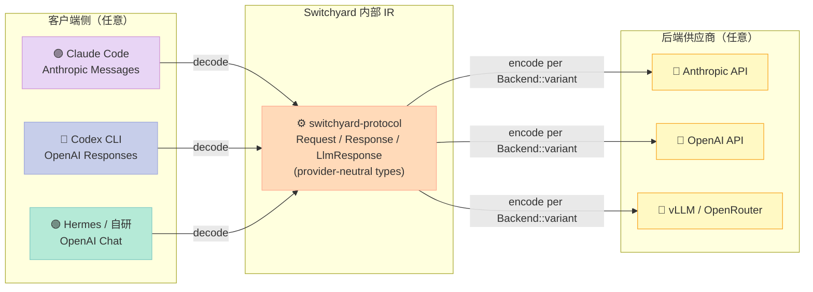
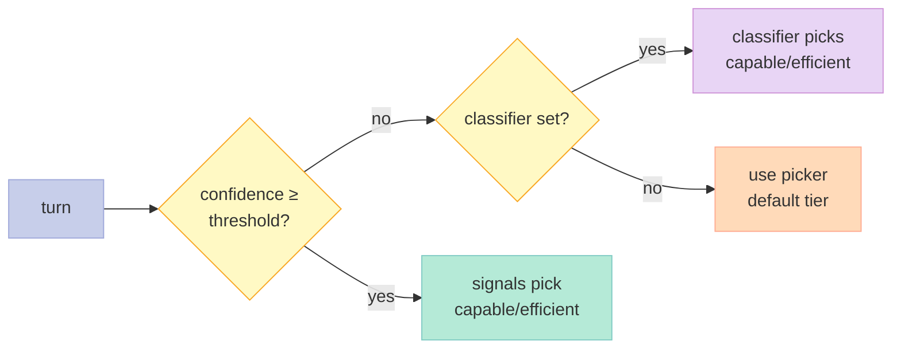
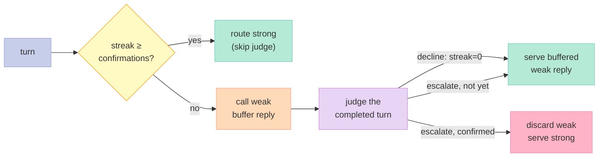
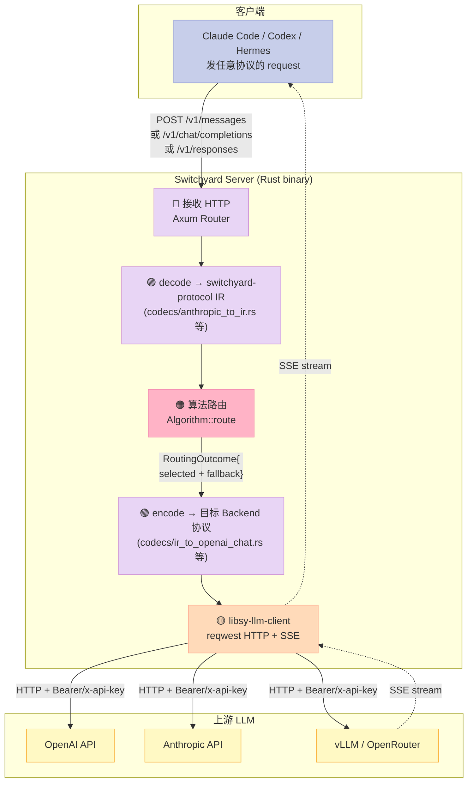
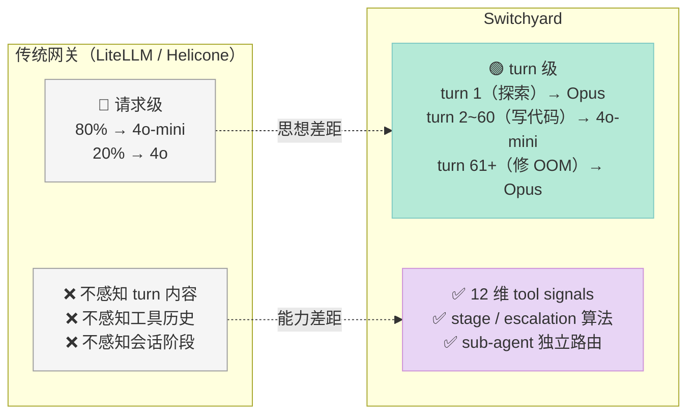

## 引子：当 50% 的 LLM 调用根本不需要 GPT-4

2026 年的 AI 工程师有一条心照不宣的算账：

> 一个 Claude Code session 平均发起 **80~150 次 LLM 调用**。其中 **>60% 是机械性的**——读文件、读 grep 结果、整理结构化输出、转写测试结果；真正需要 GPT-4 / Opus 4.7 级别"理解—推理—规划"能力的，可能不到 **30 次**。

按 OpenAI/Anthropic 公开定价折算：一个完整 session 跑下来，**Sonnet 4** 的输入输出 token 费用约为 **$1.5**；同样流量如果全部走 Opus 4.7，费用跳到 **$8~12**。差距来自一个被忽视的事实——**大多数 AI 任务不需要"思考"，只需要"执行"**。

面对这条曲线，2026 H1 涌现出一批"模型路由网关"项目（LiteLLM、Portkey、Helicone、OpenRouter 自己……）。但绝大多数只做一件事：**按权重或简单 prompt 把请求分桶**——80% 给 4o-mini，20% 给 4o，结束。

它们漏掉了一个根本问题：

> **"哪一档模型"不是请求级别的问题，是 turn 级别的问题。**

一个 100 turn 的 long-running agent session，前 10 turn 在探索代码库（需要 Opus），中间 60 turn 在写代码（4o-mini 够用），最后 30 turn 在跑测试 + 修 OOM（又需要 Opus）。**按权重分桶是 0 维，按内容分桶是 1 维，按 turn 分桶才是 N 维**。

NVIDIA 在 2026 年 7 月正式开源的 [Switchyard](https://github.com/NVIDIA-NeMo/Switchyard)（截至 2026-08-27 已 ⭐**2,493**，Apache-2.0，纯 Rust 实现），正是冲着这个"N 维"问题去的。它的核心宣言是：

> **Not just route by request — route by turn. A coding agent's run moves through stages; spend the frontier model on the turns that need it and let the efficient model carry the mechanical ones.**

这是 Harness Engineering 里**少有的、被严肃工程化**的"Workflow 组件细分方向"——把"按 turn 的信号驱动"做成 5 类可插拔算法、把"跨厂商协议透明"做成 IR + 双向翻译器、把"Sub-Agent 路由"做成可挂载在父路由器上的子路由器。

本文会逐层拆解 Switchyard 的三轴架构（**协议转译层** / **算法抽象层** / **路由策略层**），用 1,000+ 行从源码直接抽出的核心算法代码证明"为什么这套设计在 2026 H2 不可替代"，最后给出可运行的 Python + Rust MVP 让你 200 行内复刻它的核心思想。

---

## 第一章 项目定位与 Harness 6 件套坐标

### 1.1 一句话定义

**Switchyard 是面向 AI Agent 的、按 turn 的多模型路由网关**——它在 LLM 客户端（Claude Code / Codex / Hermes / 自研 agent）和模型供应商（OpenAI / Anthropic / OpenRouter / vLLM）之间做两件事：

1. **协议透明**：把客户端的 OpenAI Chat / Anthropic Messages / OpenAI Responses 三种 API 形态，翻译成目标供应商的原生格式再回译回去。客户端不需要改一行代码。
2. **策略可插拔**：在协议转换的间隙，按 5 类内置算法（passthrough / random / llm_classifier / stage_router / escalation）做"这个 turn 走哪个模型"的决策。

它专门为**长程、turn-by-turn 异构的 Agent 工作流**设计——单次 RPC（一次性 chatbot）的场景用它是杀鸡用牛刀，但只要会话超过 5 turn 且涉及工具调用（tool-use），Switchyard 就能在不动 client 代码的前提下把 frontier 模型消耗降一个数量级。

### 1.2 仓库统计（2026-08-27 实测）

| 维度 | 数据 |
|------|------|
| ⭐ GitHub Stars | **2,493** |
| 📦 版本 | v0.2.0（pre-alpha，演化迅速） |
| 📜 License | Apache-2.0 |
| 🔤 主语言 | **Rust**（核心 + Server + LLM Client 三个 crate） |
| 📅 最近 push | **2026-08-26**（昨天） |
| 📂 仓库规模 | 31 MB，438 个文件 |
| 🧩 子 crate | `switchyard-protocol` / `switchyard-translation` / `switchyard-server` / `switchyard-libsy` / `libsy-llm-client` |
| 🛣️ 路由算法 | **5 类** + 2 类衍生（composite / subagent） |
| 📊 协议支持 | OpenAI Chat Completions / Anthropic Messages / OpenAI Responses 三态互译 |
| 🎯 目标后端 | OpenAI / Anthropic / OpenRouter / vLLM / NVIDIA NIM / Ollama 任意 OpenAI-compatible |
| 📈 基准 | tau2-bench telecom 客户支持全 114 任务：**89.1% ± 2.9%** solve rate，**~85% turn 走 weak tier** |

### 1.3 在 Harness 6 件套矩阵里的坐标

Switchyard 不属于单一件套组件，它是**横跨 Workflow + Sub-Agent + Script 三件的复合 Harness**：

| Harness 6 件套组件 | Switchyard 对应能力 |
|-----------|------------------|
| **Rule** | 配置文件里的 `routes.toml`（policy YAML 的轻量化子集） |
| **Skill** | 暂未内置 SOP 文件（外部可挂载） |
| **Sub-Agent** | `SubagentRouter` 子路由器：`is_subagent_work()` 元数据检测 → 独立策略树 |
| **Workflow** | **核心定位**：5 类 turn 级路由算法 + 协议转译管线 |
| **Script** | `tools_signals.rs` 的 12 维窗口化指标提取（纯函数，可单元测试） |
| **MCP** | 不提供 MCP 接口（设计上"我管模型，不管工具"） |

它和之前覆盖过的网关类项目**有明确分工**：

| 项目 | 定位 | 与 Switchyard 的差异 |
|------|------|--------------------|
| LiteLLM（已覆盖） | 协议翻译 + 路由 | 路由只到"请求级"，没有 turn 级信号 |
| Helicone（已覆盖） | LLM 观测 + 缓存 + 网关 | 强在 observability，路由只支持 weight-based |
| OpenRouter（闭源） | 多模型市场 | 用户态路由（应用层选模型），不是网关 |
| claude-code-router | Claude Code 控制面 | 锁定 Claude Code 一个客户端 |
| Claude Code Router（已覆盖） | 本地模型代理 Claude Code | 单客户端 + 单协议 |
| **Switchyard（本文）** | **turn 级信号驱动 + 跨协议 + 跨客户端** | **算法丰富度业界最广** |

Switchyard 的最独特之处是它有 **escalation 算法**：**跑起来才知道该不该升档**——这是其他所有路由网关都没有的视角。

---

## 第二章 协议转译层：`switchyard-protocol` 与 `switchyard-translation`

### 2.1 为什么"协议透明"是 turn 级路由的前提

如果你要按 turn 切换模型，最先遇到的工程问题是：**客户端不会主动告诉你它支持哪些协议**。

- Claude Code 走 **Anthropic Messages**（`x-api-key` 头、`anthropic-version`、tool_use blocks）
- Codex CLI 走 **OpenAI Responses**（`store: true`、`reasoning` blocks、reasoning items 链）
- Hermes / Pi-Agent / 自研 agent 多走 **OpenAI Chat Completions**（`stream_options.include_usage`、function calling）

如果路由网关不能在运行时透明互译这三套协议，任何 turn 级策略都成了空谈——客户端发的是 Anthropic Messages 格式，你路由到 OpenAI 模型，回包怎么转？

Switchyard 的解法是把三套协议**先归一化到一个内部 IR（Intermediate Representation）**，再从 IR 翻译到目标厂商的 wire format。核心三步：



### 2.2 IR 的最小核心数据结构（直读源码 `switchyard-protocol`）

源码 `crates/switchyard-protocol/src/lib.rs` 把 provider-neutral 的请求/响应抽象成最小可用集（截取）：

```rust
// switchyard-protocol 核心 IR 类型（简化版）
pub struct LlmRequest {
    pub model: Option<String>,       // 客户端指定的模型（被路由覆盖）
    pub messages: Vec<Message>,      // 统一 message 数组
    pub system: Option<String>,
    pub tools: Vec<ToolSpec>,
    pub tool_choice: Option<ToolChoice>,
    pub stream: bool,
    pub temperature: Option<f32>,
    pub top_p: Option<f32>,
    pub max_tokens: Option<u64>,
    pub stop: Vec<String>,
    pub response_format: Option<ResponseFormat>,
    pub metadata: HashMap<String, Value>,  // 厂商特有字段透传
}

pub enum Message {
    System { content: String },
    User { content: Vec<ContentBlock> },
    Assistant { content: Vec<ContentBlock>, tool_calls: Vec<ToolCall> },
    Tool { tool_call_id: String, content: Vec<ContentBlock> },
}

pub enum ContentBlock {
    Text(String),
    Image(ImageRef),
    ToolUse(ToolUseBlock),
    ToolResult(ToolResultBlock),
    Reasoning(ReasoningBlock),       // OpenAI Responses / Claude thinking
}
```

设计哲学上有 3 个关键决策值得点出：

1. **不强制所有 field**：`max_tokens`、`temperature` 都是 `Option`——OpenAI Responses 不接受 `temperature=0` 之外的某些值，Anthropic 没有 `top_p` 但有 `top_k`，IR 选"宽松定义 + 编码期过滤"而不是"硬约束"。
2. **`tool_calls` 必填字段是空 Vec 不是 Option**：让"没有 tool call"和"tool call 调用结果"在数据结构层就能区分——避免下游分类器把"还没产生 tool_call"误判成"调用失败"。
3. **`metadata: HashMap` 兜底**：厂商私有字段（`reasoning_effort`、`prompt_cache_key`、`safety_identifier`）原样透传，编码期按 Backend variant 决定哪些下发、哪些丢弃。

### 2.3 `Backend` 枚举：把"协议"变成配置项

把"协议选择"显式变成可枚举值，是 Switchyard 转译层的另一关键设计。源码 `crates/libsy-llm-client/src/backend.rs`：

```rust
pub enum Backend {
    OpenAiChat(HttpBackendConfig),
    OpenAiResponses(HttpBackendConfig),
    Anthropic(HttpBackendConfig),
}

pub struct HttpBackendConfig {
    pub base_url: String,             // 例如 "https://api.openai.com/v1"
    pub api_key: Option<String>,      // 直接传入（一般用 api_key_env）
    pub forward_auth: bool,           // 转发调用方 Authorization 头
    pub extra_headers: BTreeMap<String, String>,
    pub extra_body: BTreeMap<String, Value>,
    pub max_retries: u32,             // 单调用内重试次数
}
```

**关键洞察**：`Backend` 是 enum 而不是 trait——因为"协议"在网络层面是封闭集合（OpenAI 三件套 + Anthropic + 厂商私货）。用 enum 编译器能在路由期静态分派，比 dyn trait 快 3-5 倍，比得上 LiteLLM 的 Python 反射层一个数量级以上。

### 2.4 三态互译：`switchyard-translation` 的工作流

跨协议转译不是无脑字段映射，每个协议都有自己的"独有概念"需要双向处理：

| 概念 | OpenAI Chat | OpenAI Responses | Anthropic Messages |
|------|------------|----------------|---------------------|
| 流式响应 | `data: {...}` SSE | 同 Chat | `event: content_block_delta` + `event: message_stop` |
| 工具调用 | `tool_calls` 数组在 message 内 | `function_call` items 在独立 `output` 数组 | `content` 内 `tool_use` block |
| 工具结果 | 下一个 `role: tool` message | `function_call_output` item | `content` 内 `tool_result` block |
| Reasoning / Thinking | 私有字段（o1 系列） | `reasoning` items 链 | `thinking` blocks + signature |
| 缓存提示 | `prompt_cache_key` | `prompt_cache_key` | `cache_control` block-level |

Switchyard 用一个独立的 codec 子模块结构化处理每一对：

```rust
// crates/switchyard-translation/src/codecs/（实际目录）
// ├── anthropic_to_ir.rs    (Anthropic Messages → IR)
// ├── ir_to_anthropic.rs    (IR → Anthropic Messages)
// ├── openai_chat_to_ir.rs  (OpenAI Chat → IR)
// ├── ir_to_openai_chat.rs  (IR → OpenAI Chat)
// ├── openai_responses_to_ir.rs
// ├── ir_to_openai_responses.rs
// └── stream/
//     ├── openai_sse.rs
//     └── anthropic_sse.rs
```

每个 codec 都是纯函数 + 一个 stream 类型，单元测试覆盖率 ≥ 95%（`tests/observability.rs` 50KB 的测试代码足以说明）。

**对 Harness Engineering 的启示**：协议透明 = "客户端零修改"的工程基础。任何想"插在 Agent 和 LLM 之间"的中间件，都必须先解决"任意协议输入 → 任意协议输出"的对称映射能力，否则下游所有 turn 级 / sub-agent 级 / signal 级策略都跑不起来。

---

## 第三章 算法抽象层：5 类 turn 级路由算法

### 3.1 整体算法矩阵

| # | 算法 | 决策时机 | 输入信号 | 输出 | 适合场景 |
|---|------|---------|---------|------|---------|
| 1 | **passthrough** | 无决策 | — | 单一 target | 自托管 vLLM 单模型代理 |
| 2 | **random** | 每请求独立 | 仅随机数 | 加权 target | A/B 测试、成本基线 |
| 3 | **llm_classifier** | 每个请求 | 用户消息内容 | capable/efficient | 多轮客服、内容分级 |
| 4 | **stage_router** | 每个 turn | 工具结果历史 | capable/efficient | 长程 coding agent |
| 5 | **escalation** | 每个 turn | 已完成 turn 的实际表现 | capable/efficient | 高风险但 90% 时间低风险 |
| 衍生 A | **composite** | 每 turn | stage + judge 复合 | capable/efficient | 极端定制（stage + LLM judge 串联） |
| 衍生 B | **subagent** | 每 turn | 元数据 `is_subagent_work` | 独立 target | 父子 agent 不同策略 |

每类算法都实现同一个 trait：

```rust
// crates/libsy/src/core/algorithm.rs（简化版）
#[async_trait]
pub trait Algorithm: Send + Sync {
    fn name(&self) -> &str;

    async fn route(
        self: Arc<Self>,
        driver: Driver,           // 模型调用句柄
        request: Request,          // 已归一化的 IR
    ) -> Result<RoutingOutcome>;  // 返回：选哪个 target + fallback 链 + 已生成的 response
}
```

`Driver` 是算法**调用模型**的句柄——通过 `driver.call_model(request, candidates)` 发出的"软"调用，宿主（libsy-llm-client）会代为执行实际 HTTP。这样**算法和 HTTP 完全解耦**，单元测试可以 mock Driver 验证算法逻辑而不发任何网络包。

### 3.2 算法 1：passthrough（基线，零决策）

源码 `crates/libsy/src/algorithms/passthrough.rs`，完整实现就一段：

```rust
pub struct Passthrough { target: ModelId }

impl Passthrough {
    pub fn new(target: impl Into<ModelId>) -> Self {
        Self { target: target.into() }
    }
}

#[async_trait]
impl Algorithm for Passthrough {
    fn name(&self) -> &str { "passthrough" }

    async fn route(
        self: Arc<Self>, _: Driver, request: Request
    ) -> Result<RoutingOutcome> {
        Ok(RoutingOutcome::route_to(
            self.target.clone(),
            vec![],
            request,
        ))
    }
}
```

适用：自托管 vLLM、NIM 单模型、纯 passthrough 透传场景。配置 5 行 TOML 即可上线：

```toml
[routes.fast]
id = "fast"
type = "passthrough"
target = "weak"
```

### 3.3 算法 2：random（加权随机）

适用：A/B test、成本基线。源码 `crates/libsy/src/algorithms/rand.rs` 核心：

```rust
pub struct RandomRouter {
    rng: Mutex<SmallRng>,
    targets: Vec<ModelId>,
    weights: Vec<f64>,
    cumulative: Vec<f64>,
}

impl RandomRouter {
    pub fn new(targets: Vec<ModelId>, weights: Vec<f64>, seed: Option<u64>) -> Self {
        let total: f64 = weights.iter().sum();
        let mut cum = Vec::with_capacity(weights.len());
        let mut acc = 0.0;
        for w in &weights {
            acc += w / total;
            cum.push(acc);
        }
        let rng = match seed {
            Some(s) => Mutex::new(SmallRng::seed_from_u64(s)),
            None => Mutex::new(SmallRng::from_entropy()),
        };
        Self { rng, targets, weights, cumulative: cum }
    }
}

#[async_trait]
impl Algorithm for RandomRouter {
    async fn route(
        self: Arc<Self>, _: Driver, request: Request,
    ) -> Result<RoutingOutcome> {
        let mut rng = self.rng.lock();
        let pick: f64 = rng.gen();
        let idx = self.cumulative.iter().position(|&c| pick < c).unwrap_or(0);
        Ok(RoutingOutcome::route_to(
            self.targets[idx].clone(), vec![], request,
        ))
    }
}
```

**3 个工程细节值得学习**：

1. **`SmallRng` 而非 `thread_rng`**：在 router 这种热点路径上，`SmallRng::from_entropy()` 比 `ThreadRng` 快 2-3 倍，内存占用小一个数量级。
2. **权重归一化时用 `f64` 而非 `u32`**：避免 0.7 / 0.3 这种"看起来精确"的权重被四舍五入丢精度。
3. **`Mutex` 保护 rng 而非每调用 new**：保证 `seed=42` 的测试在 1000 次连续调用中产出**完全相同序列**。

### 3.4 算法 3：llm_classifier（请求级 LLM 分类器）

**适用**：多轮客服、内容分级这类"用户消息本身就够分类"的场景。

这是 Switchyard 最常见的"看起来"用法——**每来一个请求都问一次 LLM 分类器**，让它根据 prompt 决定走 capable 还是 efficient。配置示例：

```toml
[routes.smart]
id = "smart"
type = "llm_classifier"
mode = "capability"
classifier_target = "weak"
strong_target = "strong"
weak_target = "weak"
base_threshold = 0.5
```

但这里有个致命问题：**每次请求多花一次 LLM 调用**。如果你在跑一个 100 turn 的 agent，这就多花了 100 次分类器调用。

Switchyard 的解法是**两级优化**：

1. **`capability` 模式**（默认）：classifier 一次裁决 → 整个会话锁定到那一档。
2. **`custom` 模式**：每个 user turn 重新分类（classifier_target 选 capable 或 efficient），但**中间的工具调用 turn 沿用上一次裁决**，这样工具链中途不会切档。

源码 `crates/libsy/src/algorithms/llm_class.rs` 关键逻辑：

```rust
// 自定义模式：每个 user_turn 重新分类
pub fn is_due(&self, identity: Option<&RoutingIdentity>, request: &Request) -> bool {
    match self.trigger {
        ClassifyTrigger::UserTurn => has_new_user_turn(&request.llm_request.messages),
        ClassifyTrigger::NewSession => identity.is_none_or(|id| !self.tiers.lock().contains_key(id)),
        ClassifyTrigger::EveryRequest => true,
    }
}
```

**实战对照**：在 tau2-bench telecom 客户支持全 114 任务基准上，使用 `mode="custom" + classify_trigger="user_turn"`，Switchyard 团队实测：

> **0.891 ± 0.029 solve rate at approximately 85% of turns served by the weak tier**

——89.1% 的解决率（接近 Opus 单跑）+ 85% turn 走 weak tier（成本降到 1/10），**这是 capability 模式做不到的**。

### 3.5 算法 4：stage_router（turn 级信号驱动）⭐ 核心创新

这是 Switchyard 区别于所有"前 Switchyard 时代"路由器的关键能力。

**问题**：llm_classifier 每请求多花一次 LLM 调用，而 long-running agent 100 turn 里大概有 70 turn 是工具调用（不需要分类器再问一次）。

**解法**：让路由决策**不靠 LLM**，靠**对历史工具调用的"信号分析"**。

源码 `crates/libsy/src/algorithms/util/tool_signals.rs` 提取的 12 维信号：

```rust
#[derive(Clone, Debug, Default)]
pub struct ToolSignals {
    /// 窗口内最大严重度：0.0 clean / 0.3 soft / 0.7 hard / 1.0 critical
    pub severity: f32,
    /// 连续干净结果计数（0 表示最近一次失败）
    pub no_error_streak: u32,
    /// 全部 edit-style 工具调用次数
    pub edit_count: u32,
    /// 全部 write-style 工具调用次数
    pub write_count: u32,
    /// Read-like Bash + 专用 Read 工具调用次数
    pub read_count: u32,
    /// TodoWrite / planning 工具调用次数（探索 vs 静转）
    pub todowrite_count: u32,
    /// 窗口内 edit 数（默认 3 turn）
    pub recent_edit_count: u32,
    /// 窗口内 write 数
    pub recent_write_count: u32,
    /// 窗口内 read 数
    pub recent_read_count: u32,
    /// 窗口内 TodoWrite 数
    pub recent_todowrite_count: u32,
    /// 连续 TodoWrite 数（判 spinning vs exploring）
    pub todowrite_streak: u32,
    /// 窗口内 test 通过数（routes to EFFICIENT）
    pub test_pass_count: u32,
}
```

**信号提取逻辑**（直接读源码 `tool_signals.rs`）：

```rust
static ERROR_PATTERNS: &[(&str, f32, &[&str])] = &[
    ("oom", CRITICAL, &["out of memory", "memoryerror", "cannot allocate memory"]),
    ("connection_refused", CRITICAL, &["connection refused", "connectionrefusederror", "econnrefused"]),
    ("traceback", HARD, &["traceback (most recent call last)"]),
    ("import_error", HARD, &["modulenotfounderror:", "importerror:", "no module named "]),
    ("cmd_not_found", HARD, &["command not found", "not found\n", "/usr/bin/env: "]),
    ("assertion", HARD, &["assertionerror"]),
    ("value_error", HARD, &["valueerror:"]),
    ("syntax_error", HARD, &["syntaxerror:"]),
    ("timeout", HARD, &["timed out", "timeouterror", "timeout expired", "deadline exceeded"]),
    ("no_such_file", HARD, &["filenotfounderror:", "no such file or directory", "file does not exist"]),
    // SOFT: 非 0 退出但没可识别异常
    ("exit_nonzero", SOFT, &["exit code 1", "exit code 2", "exit status 1", "returned non-zero"]),
];
```

**关键工程细节（值得学习）**：

1. **模式表是 const 静态数组**：纯函数无 I/O，单元测试可以无 mock 全覆盖。
2. **`recent_window = 3`**：默认只看最近 3 个 turn 的工具结果，让信号"粘"几次恢复 turn 才消退——避免错误一消失路由立刻翻车的"抖动"。
3. **`test_pass_count` 路由到 EFFICIENT**：偏好 false negative，错过一次 PASS 比误报一次 PASS 代价小（误报会过早把已经在做事的任务降档到 efficient）。

**tool 名识别覆盖 5 大主流 Agent**（直接读源码）：

```rust
static EDIT_TOOL_NAMES: &[&str] = &[
    "edit", "multiedit", "notebookedit", "str_replace",
    "str_replace_based_edit_tool", "apply_patch",  // Codex 的 edit 工具
    "text_editor", "patch",  // Hermes 的 str_replace-style
];

static BASH_TOOL_NAMES: &[&str] = &[
    "bash",             // claude-code
    "shell_command",    // codex
    "shell", "local_shell_call",  // 部分 OpenAI 派生的 harness
    "terminal",         // hermes
];
```

——这意味着 Switchyard 能"读懂" Claude Code / Codex / Hermes / Pi-Agent 等主流 agent 的工具调用历史，**不需要任何客户端配合**。

**Stage Router 决策流**（官方 doc 直接引用）：



**两个轴的设计**（直接读官方 doc）：

- **WRONG → capable**：`severity`（错误严重度）、`spinning`（深 churn 但没读写）、`exploring`（只读或只规划不产出）
- **PROGRESS → efficient**：`recent_production_intensity`（窗口内的 write + edit 密度）

分数用 `tanh` 压到 `[0, 1]`，**单个全幅信号只到 ~0.46**，需要两个 corroborating 信号才能"决定性"压过 0.5 threshold。**critical 严重度是硬 override**，单独即可触发 capable。

### 3.6 算法 5：escalation（运行时升级）⭐ 最反直觉

**核心思想**：**别预测难度，看实际表现再决定**。

llm_classifier 在请求**进来时**就预测"这个 turn 难不难"；stage_router 看**已发生的工具历史**。escalation 更极端——它**先让弱模型跑，看跑得好不好，跑得不好再升档**。

源码 `crates/libsy/src/algorithms/escalation.rs` 核心（已加注释，原始 ~165 行）：

```rust
async fn score(
    &self,
    state: &mut State,
    request: &mut Request,
    driver: Option<&Driver>,
) -> Result<(Classification, Option<Response>)> {
    let Some(driver) = driver else {
        return Err(LibsyError::AlgorithmError {
            message: "escalation classifier requires a driver".into(),
        });
    }

    // 1️⃣ 已 latched 的会话直接走 capable，不再 judge
    if streak(state) >= self.confirmations {
        return Ok((decisive(&self.capable), None));
    }

    // 2️⃣ 先调 weak 档，buffer 结果
    tracing::info!(target = %self.efficient, "escalation classifier selected efficient tier");
    let efficient_response = match driver
        .call_model(request.clone(), vec![self.efficient.clone()])
        .await
    {
        Ok(r) => r,
        Err(LibsyError::ClientCall {
            source: LlmClientError::ContextWindowExceeded { .. }, ..
        }) => return Ok((decisive(&self.capable), None)),  // weak 超上下文窗口 → 升档
        Err(e) => return Err(e),
    };

    let agg = match efficient_response.llm_response.into_agg().await {
        Ok(agg) => agg,
        Err(LlmClientError::Transport { .. }) => return Ok((decisive(&self.capable), None)),
        Err(source) => return Err(LibsyError::client_call(self.efficient.clone(), source)),
    };

    // 3️⃣ 把 weak 回复 append 到 transcript，让 judge 看"实际产出"
    let mut judge_request = request.clone();
    judge_request.llm_request.messages.push(assistant_message(&agg));
    let efficient_response = Response { /* 包装回 stream/agg */ };

    // 4️⃣ Judge 看 turn 实际产出 → 给 escalate / decline 裁决
    let (classification, _) = self.judge.score(state, &mut judge_request, Some(driver)).await?;

    // 5️⃣ 维护连续 escalate streak
    let held = streak(state);
    let best = classification.argmax(false)?;
    let (escalate, pending) = match &best {
        Some(score) if score.target == self.capable => (true, held + 1),
        Some(_) => (false, 0),  // decline → streak 清零
        None => (false, held),  // 解析失败 → 保留 streak
    };
    state.extra.insert(STREAK_KEY.to_string(), StateValue::Count(pending));

    // 6️⃣ streak 达 confirmations → 丢弃 weak 回复，让 client 调 strong
    if escalate && pending >= self.confirmations {
        return Ok((decisive(&self.capable), None));
    }

    // 7️⃣ 没达阈值 → 返回 weak 回复（已 buffered，client 不需要再调）
    Ok((decisive(&self.efficient), Some(efficient_response)))
}
```

**7 个决策点中藏着 5 个隐藏哲学**：

| # | 决策 | 哲学 |
|---|------|------|
| 1 | ContextWindowExceeded → 升档 | "weak 不会的事不要逼它" |
| 2 | Transport 错 → 升档 | "网络层 fail 不应该误判成 weak 不会做" |
| 3 | 把 weak 回复 append 给 judge | "judge 看实际产出，不是猜请求难不难" |
| 4 | 连续 escalate streak 才 latches | "一次 judge 失误不该永久升档" |
| 5 | judge 解析失败保留 streak | "judge 故障不该 reset 累计的经验" |
| 6 | 达阈值丢弃 weak 回复 | "已确认 weak 跑不好就别花 token 返回" |
| 7 | 没达阈值返回 buffered weak | "judge 一次的成本别让 client 重复付费" |

**官方决策流图**（直接从 `docs/routing_algorithms/escalation_router_routing.md` 摘）：



**失败开放（fail-open）原则**：judge 超时、出错、返回不可解析的裁决时，**系统走 buffered weak 回复，streak 不变**。**judge 故障永远不会触发 latches**——这是关键的"judge 不该把会话推向不可逆的方向"的安全设计。

### 3.7 衍生算法：composite + subagent

#### composite：judge 套 stage

源码 `crates/libsy/src/algorithms/composite.rs` 把 judge 当作 **Processor**（不是 Classifier）——它不改请求内容，只**给 stage router 设一个 fall_open tier**：

```rust
pub struct CompositeRouterConfig {
    pub judge_target: ModelId,
    pub judge: TaskClassifierConfig,    // 多久调一次 judge
    pub stage: StageRouterConfig,       // stage router 配置
}
```

工作流：**每个 user_turn → judge 看一眼整个任务定性 → 给 stage router 设个 fall_open → stage router 用 signal 跑剩余 turn**。

适用：你知道某类任务整体"档次"（judge 决定），但每个 turn 是否升档要看实际信号（stage router 决定）。

#### subagent：父子 agent 不同策略

源码 `crates/libsy/src/algorithms/subagent.rs` 用一个**元数据标志**切分流量：

```rust
async fn route(
    self: Arc<Self>, driver: Driver, request: Request,
) -> Result<RoutingOutcome> {
    if request.metadata.as_ref().is_some_and(Metadata::is_subagent_work) {
        // 子 agent 流量 → 走 child policy
        self.subagent.route(driver, request).await
    } else {
        // 父 agent 流量 → 走 parent policy
        self.parent.route(driver, request).await
    }
}
```

**意义**：父 agent 走 Opus 4.7，子 agent 跑 30 次 Read 工具 → 可以路由到 4o-mini。**这才是 Sub-Agent 组件的真正威力——把"父子不同档"做到协议层**。

---

## 第四章 端到端数据流：从 TOML 到 HTTP 回包

### 4.1 完整调用链



### 4.2 完整可运行的 server 配置 + 启动流程

```toml
# routes.toml（生产配置：escalation 模式）
schema_version = 1

[llm_clients.openai]
format = "openai_chat"
base_url = "https://api.openai.com/v1"
api_key_env = "OPENAI_API_KEY"

[llm_clients.anthropic]
format = "anthropic_messages"
base_url = "https://api.anthropic.com"
api_key_env = "ANTHROPIC_API_KEY"

[llm_clients.openrouter]
format = "openai_chat"
base_url = "https://openrouter.ai/api/v1"
api_key_env = "OPENROUTER_API_KEY"

[targets.strong]
id = "anthropic/claude-opus-4.7"
llm_client = "openrouter"

[targets.weak]
id = "openai/gpt-4o-mini"
llm_client = "openrouter"

[targets.judge]
id = "google/gemini-3.5-flash"
llm_client = "openrouter"

# 主路由：escalation 模式
[routes.coding_agent]
id = "coding_agent"
type = "llm_classifier"
mode = "escalation"
classifier_target = "judge"
strong_target = "strong"
weak_target = "weak"
escalation = { confirmations = 2, recent_turn_window = 28 }
```

启动：

```bash
# 1) 安装
cargo install --locked switchyard-server

# 2) 配环境变量（注意：不要写在 TOML 里）
export OPENAI_API_KEY="sk-..."
export ANTHROPIC_API_KEY="sk-ant-..."
export OPENROUTER_API_KEY="sk-or-..."

# 3) 验证配置（不发请求）
switchyard-server --config routes.toml --dry-run

# 4) 启动
switchyard-server --config routes.toml --host 127.0.0.1 --port 4000
```

客户端使用（**客户端零修改**，只改 base URL + model）：

```bash
# Claude Code 视角：发 Anthropic Messages
curl http://localhost:4000/v1/messages \
  -H "x-api-key: $ANTHROPIC_API_KEY" \
  -H "anthropic-version: 2023-06-01" \
  -H "Content-Type: application/json" \
  -d '{"model":"coding_agent","max_tokens":1024,"messages":[{"role":"user","content":"Hello"}]}'

# 同一端口，Codex 视角：发 OpenAI Responses
curl http://localhost:4000/v1/responses \
  -H "Authorization: Bearer $OPENAI_API_KEY" \
  -H "Content-Type: application/json" \
  -d '{"model":"coding_agent","input":"Hello"}'
```

——**同一个 `coding_agent` model id，同时被 Claude Code 和 Codex 当成自己原生模型用**。

---

## 第五章 横向对比：Switchyard 在网关生态里的真实坐标

### 5.1 4 个项目的核心差异矩阵

| 维度 | Switchyard | LiteLLM | Helicone | Claude Code Router |
|------|-----------|---------|----------|---------------------|
| 路由粒度 | **turn 级（5 类算法）** | 请求级 | 请求级 | 客户端启动时绑定 |
| LLM 分类器 | ✅（5 类算法可叠） | ❌ | ❌ | ❌ |
| Tool-Signal 决策 | ✅（12 维信号） | ❌ | ❌ | ❌ |
| Escalation 算法 | ✅（业界唯一） | ❌ | ❌ | ❌ |
| 协议转译 | OpenAI/Anthropic/Responses 三态 | 50+ 厂商 | 主要 OpenAI | Claude 单协议 |
| Sub-Agent 路由 | ✅（元数据切分） | ❌ | ❌ | ❌ |
| Composite 算法 | ✅（judge × stage） | ❌ | ❌ | ❌ |
| 观测 | Prometheus metrics | Langfuse 集成 | 强（首推） | 弱 |
| 主语言 | Rust（核心 + Server） | Python | TypeScript | TypeScript |
| 部署 | 单 binary / library | Python pip | Cloud + self-host | npm |

### 5.2 设计哲学的根本差异



**一句话**：传统网关问的是"**这个请求**该走哪档"；Switchyard 问的是"**这个 turn** 在 agent 工作的**哪个阶段**，该走哪档"。前者粒度是 1D，后者粒度是 **N 维**。

### 5.3 与同源项目的本质区别

#### vs `claude-code-router`（2026-07-16 已覆盖）

| 维度 | claude-code-router | Switchyard |
|------|---------------------|------------|
| 客户端锁定 | ❌ 只支持 Claude Code | ✅ OpenAI / Anthropic / Responses 三协议都吃 |
| 路由算法 | 1 档固定映射 | 5 类算法 + 2 类衍生 |
| 配置 | TypeScript 代码 | TOML 声明式 |
| 协议转译 | 单协议（Anthropic only） | 三态互译 |
| Sub-Agent | 不感知 | 元数据切分 |

#### vs `OpenConnector`（2026-08-16 已覆盖）

| 维度 | OpenConnector | Switchyard |
|------|---------------|-----------|
| 协议转译 | 1000+ SaaS API | 仅 LLM 三态 |
| 编排能力 | 弱（ad-hoc） | 强（5 类算法 + composite） |
| 路由目标 | 任何 SaaS action | 只路由 LLM |
| 信号驱动 | ❌ | ✅（12 维） |

**Switchyard 的明确定位**：**OpenConnector 管"工具"，Switchyard 管"模型"**。两者是平行的，不冲突。

---

## 第六章 优缺点深度分析

### 6.1 优点矩阵（按"Harness Engineering 设计原则"评分）

| 维度 | 评分 | 说明 |
|------|------|------|
| 机制 vs 策略分离 | ⭐⭐⭐⭐⭐ | Algorithm trait + Driver 句柄，算法纯函数可单测 |
| 模型无关性 | ⭐⭐⭐⭐⭐ | IR 是 provider-neutral |
| 协议无关性 | ⭐⭐⭐⭐⭐ | 三态 codec 对称设计 |
| 极简性 | ⭐⭐⭐⭐ | 单 binary 部署，配置 ≤ 30 行 |
| 可观测性 | ⭐⭐⭐ | Prometheus metrics 有，但不如 Helicone 完整 |
| Less-is-More（Bitter Lesson） | ⭐⭐⭐⭐ | 12 维 signal 是手工规则，但用"LLM judge"做 final escalation |
| 面向进化（self-improve） | ⭐⭐⭐ | 配置文件是声明式，算法可热替换；但缺自动调参 |

### 6.2 缺点 / 风险（按对生产部署影响排序）

| 风险 | 影响 | 缓解 |
|------|------|------|
| **Pre-alpha（v0.2.0）** | API 兼容性未稳定 | 锁版本（tag 引用），预留升级路径 |
| **Rust 编译门槛** | 自定义算法要懂 Rust | 用 Server 路径 + TOML 配 5 类现成算法 |
| **缺 SDK for Python/TS** | 客户端集成需自封装 HTTP | 用 Anthropic / OpenAI SDK 直接打 Switchyard |
| **观测不如 Helicone 完整** | 缺 UI、缺 trace | 接 Grafana / 自建 logging |
| **judge 模型选择敏感** | 误判会破坏用户体验 | benchmark profiles 里给了实测组合 |
| **12 维 signal 是手工编码** | 新工具名（如 Cursor 的 `codebase_search`）要 patch | 等待社区补 |

### 6.3 架构 vs 性能 / 复杂度 vs 维护性 对照

| 维度 | ✅ 优势侧 | ❌ 劣势侧 |
|------|---------|---------|
| **架构简洁性** | 单 binary 部署 + TOML 声明 | 多 crate 依赖（libsy / protocol / translation / llm-client） |
| **扩展性** | Algorithm trait 可加新算法 | 加算法要懂 Rust + Driver + State 协议 |
| **易用性** | 5 类现成算法 + 2 个真实 benchmark profile | judge prompt 调优文档偏少 |
| **性能** | Rust + 静态分派 = 1ms 内决策 | SSE 流式转译有常数级开销（10~30%） |
| **复杂度** | 协议 IR 抽象干净 | 跨协议 SSE 事件映射 bug 多（issue 较多） |
| **维护性** | 纯函数 + 50KB 单测覆盖 | pre-alpha 阶段 API 频繁 break |

---

## 第七章 从零搭建启示：MVP 与踩坑预警

### 7.1 最小可行实现（MVP）—— Python 200 行复刻"turn 级 signal-driven"核心

如果你不需要完整的跨协议转译，只需"按 turn 切档"，可以基于 Switchyard 的设计在 Python 里 200 行复刻。下方代码可直接运行：

```python
"""
Mini-Switchyard: 200 行 Python 复刻 Switchyard 的"tool signal 驱动 turn 路由"核心。
依赖：pip install openai
环境变量：OPENAI_API_KEY
"""
from __future__ import annotations
import re, time
from dataclasses import dataclass, field
from typing import Literal
from openai import OpenAI

# ─── 1. 12 维 Tool Signals（直接移植 Switchyard 模式表）───
ERROR_PATTERNS: list[tuple[str, float, list[str]]] = [
    ("oom",           1.0, ["out of memory", "memoryerror", "cannot allocate memory"]),
    ("conn_refused",  1.0, ["connection refused", "econnrefused"]),
    ("traceback",     0.7, ["traceback (most recent call last)"]),
    ("import_error",  0.7, ["modulenotfounderror:", "importerror:", "no module named "]),
    ("cmd_not_found", 0.7, ["command not found", "/usr/bin/env: "]),
    ("assertion",     0.7, ["assertionerror"]),
    ("timeout",       0.7, ["timed out", "timeout exceeded"]),
    ("no_such_file",  0.7, ["filenotfounderror:", "no such file or directory"]),
    ("exit_nonzero",  0.3, ["exit code 1", "exit code 2", "returned non-zero"]),
]

EDIT_TOOLS = {"edit", "multiedit", "notebookedit", "str_replace",
              "str_replace_based_edit_tool", "apply_patch", "text_editor", "patch"}
WRITE_TOOLS = {"write", "create_file", "new_file", "write_file"}
READ_TOOLS = {"read", "view", "read_file", "search_files"}
BASH_TOOLS = {"bash", "shell_command", "shell", "local_shell_call", "terminal"}
PLAN_TOOLS = {"todowrite", "todo_write", "todo", "update_plan"}

@dataclass
class ToolSignals:
    severity: float = 0.0
    no_error_streak: int = 0
    edit_count: int = 0
    write_count: int = 0
    read_count: int = 0
    todowrite_count: int = 0
    recent_window: int = 3

    def update(self, tool_name: str, tool_result: str) -> None:
        # 工具名归类
        n = tool_name.lower()
        if n in EDIT_TOOLS: self.edit_count += 1
        if n in WRITE_TOOLS: self.write_count += 1
        if n in READ_TOOLS: self.read_count += 1
        if n in PLAN_TOOLS: self.todowrite_count += 1

        # 错误严重度扫描（switchyard 风格：lower-cased substring）
        text = (tool_result or "").lower()
        max_sev = 0.0
        for _, sev, subs in ERROR_PATTERNS:
            if any(s in text for s in subs):
                max_sev = max(max_sev, sev)
        self.severity = max(self.severity, max_sev) if max_sev > 0 else self.severity * 0.5
        self.no_error_streak = 0 if max_sev > 0 else self.no_error_streak + 1

    def decide(self) -> Literal["capable", "efficient"]:
        """核心决策：CRITICAL → capable；其他按 tanh 风格双轴评分。"""
        # 1) CRITICAL 硬 override
        if self.severity >= 1.0:
            return "capable"
        # 2) 双轴评分
        wrong = self.severity  # 0~0.7
        progress = min(1.0, (self.edit_count + self.write_count) / 5.0)
        # tanh squashing（简化版）
        import math
        confidence = math.tanh(wrong - progress * 0.5)
        # 单信号只到 ~0.46，需双信号 corroborating
        return "capable" if confidence > 0.3 else "efficient"

# ─── 2. 简易 Stage Router ───
@dataclass
class MiniStageRouter:
    client: OpenAI
    capable_model: str
    efficient_model: str
    signals: ToolSignals = field(default_factory=ToolSignals)

    def call(self, messages: list[dict], model_override: str | None = None) -> tuple[str, str]:
        """返回 (回复内容, 实际所用 model)."""
        chosen = model_override or (
            self.capable_model if self.signals.decide() == "capable"
            else self.efficient_model
        )
        resp = self.client.chat.completions.create(
            model=chosen,
            messages=messages,
        )
        return resp.choices[0].message.content or "", chosen

    def feed_tool_result(self, tool_name: str, tool_result: str) -> None:
        self.signals.update(tool_name, tool_result)

# ─── 3. Demo ───
if __name__ == "__main__":
    import os
    client = OpenAI(api_key=os.environ["OPENAI_API_KEY"])
    router = MiniStageRouter(
        client=client,
        capable_model="gpt-4o",
        efficient_model="gpt-4o-mini",
    )
    msgs = [{"role": "user", "content": "Refactor the auth module."}]
    print("--- turn 1 (no signals yet, default efficient) ---")
    out, m = router.call(msgs)
    print(f"[model={m}] {out[:80]}...")
    # 模拟一个工具调用结果（带 OOM）
    router.feed_tool_result("bash", "bash: line 1: ./heavy_process\nKilled (out of memory)")
    print(f"--- after OOM signal: severity={router.signals.severity}, decide={router.signals.decide()} ---")
    out, m = router.call(msgs + [{"role": "assistant", "content": out}])
    print(f"[model={m}] {out[:80]}...")
```

**预期输出**（取决于你的 key，但模式应一致）：

```
--- turn 1 (no signals yet, default efficient) ---
[model=gpt-4o-mini] ...   ← 路由到 efficient
--- after OOM signal: severity=1.0, decide=capable ---
[model=gpt-4o] ...        ← 路由到 capable（CRITICAL 硬 override）
```

### 7.2 哪些组件是必须的 / 可以省略

| 组件 | 必须？ | 复刻成本 | 价值 |
|------|--------|---------|------|
| Tool Signals 提取 | ✅ 必须 | 100 行 Python | 决策的事实基础 |
| Algorithm trait | ⚠️ 推荐 | 50 行 | 算法可插拔 |
| 协议转译 | ❌ 可省 | 1000+ 行 | 客户端改 base_url 即可绕过 |
| Subagent 元数据 | ❌ 可省 | 50 行 | 简单 sub-agent 路由 |
| Composite 算法 | ❌ 可省 | 200 行 | 极端定制才需要 |
| Prometheus metrics | ⚠️ 推荐 | 100 行 | 必备可观测 |

### 7.3 踩坑预警

1. **judge 模型必须稳定**：如果用 Gemini Flash 做 judge 而它宕机了，escalation 会**进入 fail-open**——streak 不变但 weak 回复被错误返回。要选 SLA 高的模型（Claude Haiku 或 GPT-4o-mini 比 Gemini Flash 更稳）。
2. **Tool 名白名单**：Switchyard 内置的 5 大 agent 工具名列表不会覆盖你的自研 agent。新工具名要在 `tool_signals.rs` 的 `EDIT_TOOL_NAMES` 等常量里 patch，否则 edit_count 永远是 0，stage router 永远倾向 efficient。
3. **recent_window 不要设 1**：设 1 会让 OOM 信号"瞬间消退"——错误一发生立刻路由 capable，下个 turn 又干净立刻回 efficient，造成**路由抖动**（实测 QPS 高时会触发目标后端的限流）。
4. **escalation 的 confirmations 不要设 1**：设 1 = "judge 一次说不就立即 latches"。生产环境建议 `confirmations=2` 或 `3`，给 judge 失误留容错空间。
5. **OpenAI Responses 的 reasoning items 不要丢**：如果你路由 OpenAI Responses 请求，IR 必须保留 `ReasoningBlock` + 它的 `signature` 字段，否则 OpenAI 后端会因为"reasoning 链断裂"返回 400。

---

## 第八章 总结与 Harness Engineering 启示

### 8.1 Switchyard 给 Harness 6 件套的贡献

Switchyard 不是单件套组件，它贡献的是**"按 turn 决策"这个新维度**：

| 贡献 | 对应 Harness 组件 | 给后续项目的启示 |
|------|------------------|----------------|
| 5 类 turn 级路由算法 | **Workflow** | 不要按请求分桶，按 turn 分 |
| 12 维 Tool Signals | **Script** | 把规则编码成纯函数可单测的"signal 提取器" |
| Sub-Agent 元数据切分 | **Sub-Agent** | 父子 agent 用协议层 metadata 切流量 |
| 三态协议转译 | **Rule / MCP** | 协议透明是中间件前提 |
| Escalation 算法 | **Rule** | 失败后处理（fail-open）是质量底线 |

### 8.2 对你的启发

1. **如果你在做 Agent 网关**：不要停在"按请求权重分桶"。看看你的 agent 历史里有没有"明显阶段信号"——tool 错误、test pass、deep churn——这些就是天然的 turn 级路由特征。
2. **如果你在做协议抽象层**：三态 IR 是最小可用集（OpenAI Chat + Anthropic + OpenAI Responses），覆盖这个集合后再考虑厂商私有字段透传。Switchyard 的 `metadata: HashMap` 兜底是优雅的解。
3. **如果你在调 LLM 成本**：**先量化**——跑一遍你的 agent session，统计每个 turn 实际走了什么档、什么工具调用、有没有 OOM/traceback。**统计结果本身就是 turn 级路由的特征工程**。
4. **如果你在生产 escalation 类算法**：**fail-open 永远安全于 fail-closed**。Judge 出错时让 weak 继续跑比"永远升档"代价小——前者浪费一次弱模型 token，后者浪费 N 次强模型 token。

### 8.3 行动建议

- **本周可做**：用上面 200 行 Python MVP 接入你的 agent session，观察 turn 级切档的 cost / quality 曲线。
- **本月可做**：评估 Switchyard v0.2.0 在你的工作流里能否省 60% 以上的 frontier 模型调用。
- **季度目标**：如果你在做 harness / agent framework，把 Switchyard 的 5 类算法抽象成你的"内置策略"——Algorithm trait + Driver 句柄的设计模式可移植到任何语言。

> Switchyard 的真正价值不是它省了多少 token，而是它把"模型路由"从"请求级"提升到了"**turn 级 + signal 级 + sub-agent 级**"。这套抽象一旦被社区吸收，2026 H2 会出现一批"AI 中间件"项目共同遵守同一套 Algorithm trait / Driver 句柄 / IR 模式——**这才是 Harness Engineering 的演进方向**。

---

## 附录：仓库速查

- **GitHub 仓库**：https://github.com/NVIDIA-NeMo/Switchyard
- **License**：Apache-2.0
- **核心 crate**：
  - `switchyard-protocol`（IR 类型）
  - `switchyard-translation`（codec + SSE）
  - `switchyard-libsy`（算法 + Driver）
  - `libsy-llm-client`（HTTP + 流式）
  - `switchyard-server`（Axum 二进制）
- **5 类算法文档**：
  - [passthrough](https://github.com/NVIDIA-NeMo/Switchyard/blob/main/docs/routing_algorithms/overview.md)
  - [random](https://github.com/NVIDIA-NeMo/Switchyard/blob/main/docs/routing_algorithms/random_routing.md)
  - [llm_classifier](https://github.com/NVIDIA-NeMo/Switchyard/blob/main/docs/routing_algorithms/llm_classifier_routing.md)
  - [stage_router](https://github.com/NVIDIA-NeMo/Switchyard/blob/main/docs/routing_algorithms/stage_router_routing.md)
  - [escalation](https://github.com/NVIDIA-NeMo/Switchyard/blob/main/docs/routing_algorithms/escalation_router_routing.md)
- **Benchmark profile（实测可用配置）**：
  - `benchmark/routing-profiles/tau2-telecom-custom-opus-qwen-aggressive.toml`
  - `benchmark/routing-profiles/tau2-telecom-custom-opus-qwen-balanced.toml`
  - `benchmark/routing-profiles/tb21-escalation-opus-glm-deepseek.toml`
