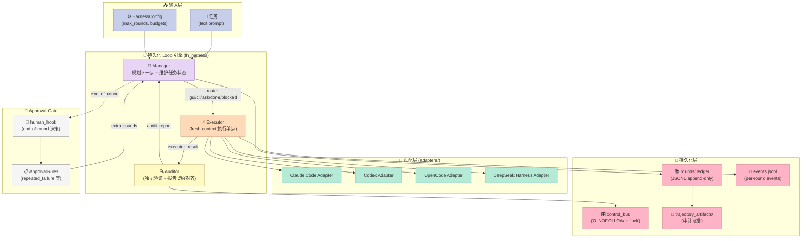
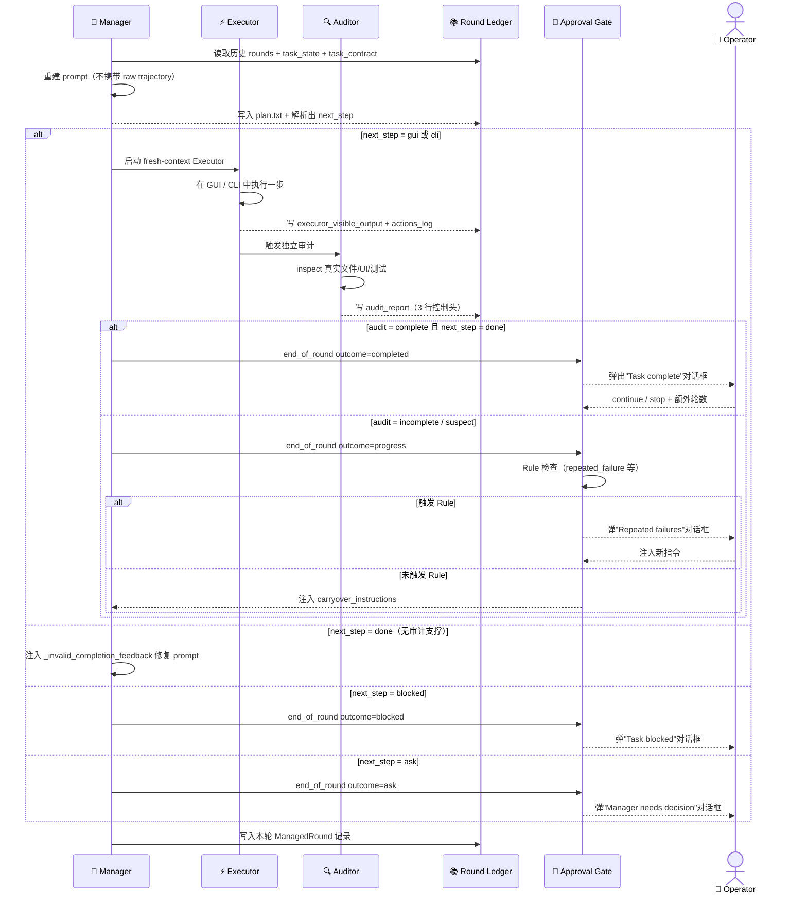
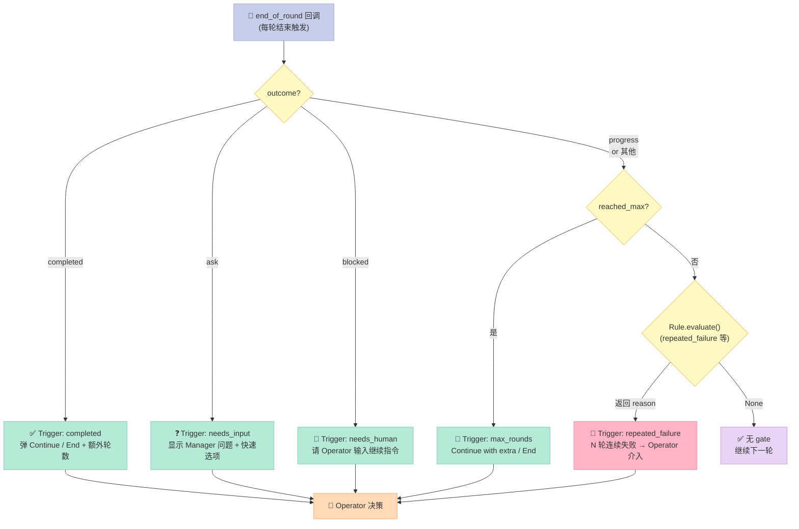

# 【LongHorizon-Harness】Loop Engineering 深度解析

## 引子：当 Agent 跑了几十个小时之后

2026 年 7 月，一篇来自高德地图机器学习团队（AMAP-ML）的论文把一个新词砸进了 Harness Engineering 圈子：**Loop Engineering**。他们开源的 [LongHorizon-Harness](https://github.com/AMAP-ML/LongHorizon-Harness) 在 1.5k+ Star、WeaveBench PassRate 从 51.8 → 80.7（+28.9）、OSWorld 2.0 满分率 3× 跃升的成绩单背后，回答了一个极其实在的问题——

> 让 Claude Code / Codex CLI / OpenCode / DeepSeek Harness 这种"只能跑一轮"的智能体，**连续工作几十个小时**而不丢目标、不丢证据、不重复犯同样的错，到底需要哪些"模型外"的工程化骨架？

如果你用过 Claude Code 跑一个大型 refactor 任务，你一定遇到过这三种崩溃：

1. **Context 爆了**：30 轮之后 LLM 把前面的内容全忘了，开始瞎编
2. **执行到一半崩了**：执行 `rm -rf` / `git reset` 之后整个进程被 SIGKILL，没留下任何 traceback
3. **重复犯同样的错**：第三轮错了，第五轮模型又错了，但**它自己并不知道之前错过**

LongHorizon-Harness 没有重新训练一个"超长上下文模型"，也没有把 Claude Code 替换掉，而是**在 Claude Code 外套了一个 Loop 引擎**：Plan → Act → Verify → Checkpoint-or-Recover → Repeat。

这就是 Loop Engineering 的核心——把"模型能做的"和"模型做不到但任务必需做的"分到两个独立空间，让长周期任务从"靠 LLM 自觉"变成"靠持久化账本 + 独立审计 + Rule Gate 触发"。

## 项目定位：长周期 Computer-Use 的工程化基座

**LongHorizon-Harness** 是 AMAP-ML 在 2026 年发布的 Loop Engineering 框架，论文地址 [arXiv 2608.01964](https://arxiv.org/abs/2608.01964)。它本身不是 Agent，而是 **一个包裹在 Claude Code / Codex / OpenCode / DeepSeek Harness 外面的 durable execution loop**。

### 核心数字

| 维度 | 数字 |
|------|------|
| GitHub Star | 1.3k+（持续增长） |
| 主仓库大小 | ~98 MB（含 OSWorld 子模块） |
| 主包路径 | `src/lh_harness/`（约 20 个核心模块） |
| 配套 Bench Harness | `eval/OSWorldv2-harness/`、`eval/TB-harness/`、`eval/WeaveBench-harness/` |
| 支持的 Agent 后端 | Claude Code、Codex CLI、OpenCode、DeepSeek Harness |
| 平均收益 | WeaveBench PassRate +28.9、OSWorld 2.0 Binary 3×、Terminal-Bench 2.1 +7.5（-24% tokens） |

### 价值主张（官方原话）

> **The model determines what an agent can do in one round. LongHorizon-Harness engineers the loop around it: what to do next, how to verify the result in the real computer, what progress to preserve, and how to continue after failure or context refresh.**

翻译：模型决定一个 agent 在**单轮**内能做什么；LongHorizon-Harness 工程师**整个 loop**——下一步做什么、怎么在真实计算机中验证结果、如何保存已完成的进度、上下文刷新或失败之后如何接续。

### 在 Harness 6 件套中的位置

| 组件 | LongHorizon-Harness 是否覆盖 | 关键实现位置 |
|------|------------------------------|--------------|
| **Rule**（团队政策） | ✅ Approval Gate + Rule 引擎 | `src/lh_harness/dashboard/gate.py` + `rules.py` |
| **Skill**（SOP） | ❌ 不直接提供；通过 Claude Code / Codex 内置 skills | — |
| **Sub-Agent**（角色分工 + Context 隔离） | ✅ Manager / Executor / Auditor 三角色 + 每轮 fresh context | `src/lh_harness/manager.py` |
| **Workflow**（接力赛协议） | ✅ Plan → Act → Verify → Checkpoint 状态机 | `src/lh_harness/manager.py:_run_impl` |
| **Script**（硬关卡） | ⚠️ 半覆盖（通过 Auditor 报告 + Rule 触发实现） | `src/lh_harness/dashboard/rules.py` |
| **MCP**（外部桥接） | ✅ 通过 computer-use plugin 为不同 agent 写原生 mcp.json / toml | `src/lh_harness/plugins/state.py` |

**关键洞察**：LongHorizon-Harness **不是一个聚焦单组件的项目**，它是一个**Sub-Agent + Workflow + Rule + MCP 的复合 Harness**，核心创新在于"**长期状态机**"这个统一概念。

## 架构分析：三层 + 持久化总线 + 独立审计

整个系统由 **3 层 + 1 个持久化层**组成：



### 模块职责

| 模块 | 职责 | 为什么这样切 |
|------|------|--------------|
| `manager.py` | 主循环入口；调度 Manager/Executor/Auditor 三角色；维护每轮 ledger | 把"循环骨架"和"角色逻辑"分离，循环骨架稳定到只改 prompt 时不必碰 |
| `supervisor/service.py` | 进程级 supervisor；用 `lh-harness run` CLI 跑 worker，API 通过 control_bus 通信 | **worker 是普通 CLI 进程**，supervisor 不重复实现 Loop，bug surface 最小 |
| `supervisor/control_bus.py` | Append-only 控制总线；用 `O_NOFOLLOW` + `flock` 防止符号链接逃逸 | 控制元数据不能被 worker 篡改——是 Approval Gate 的安全基础 |
| `auditor_agent.py` | 解析 Auditor 报告 + 校验 control header（Status/Integrity/Contract Audit） | 审计是 harness 唯一信任源；正则解析是显式协议 |
| `runtime_signals.py` | 区分"agent runtime 失败"（hard signal）和"任务执行失败" | 不混淆两类错误——避免 OOM/signal 被误报为任务失败 |
| `dashboard/gate.py` | 统一 end-of-round human hook；5 类 trigger 模板 | "何时需要人介入"是策略；hook 接口是机制 |
| `dashboard/rules.py` | Rule 引擎（repeated-failure streak 等）；纯函数 Rule 列表 | 加新 Rule = 加一个 `(round_index, rounds) -> str \| None` 函数 |
| `plugins/state.py` | 为每个 agent 后端写**原生格式**的 MCP 配置（`.mcp.json` / TOML） | **不在运行时翻译**——每个 agent 用它最熟悉的格式 |

### 数据流（一次 round 的完整路径）

1. **Manager 阶段**：从 `rounds/` ledger + `task_state` + `task_contract` + 历史 auditor reports 重建 prompt，输出 `Next: gui/cli/ask/done/blocked`
2. **Executor 阶段**：如果是 gui/cli，agent 以 **fresh context** 跑一轮，把执行结果（`executor_visible_output` + `actions_log`）写回本轮 round_dir
3. **Auditor 阶段**：独立 inspect 真实文件 / UI / 日志 / 测试；产出 audit_report（必含 3 行 control header：`Status/Integrity/Contract Audit`）
4. **判定与持久化**：
   - 若 audit 干净且 Manager 输出 `Next: done` → 任务完成；写 terminal report
   - 若 Manager 提前输出 `done` 但 audit 不干净 → 写 `_invalid_completion_feedback` 喂回下一轮
   - 若 Executor 抛出 runtime signal → 写 `agent_runtime_failed` 事件并选 `invalid` 或 `blocked`
5. **End-of-round Gate**：根据 5 类 trigger（completed / max_rounds / needs_input / needs_human / repeated_failure）决定 `continue` / `stop` 并允许注入人工指令

整个循环**只通过 ledger + events.jsonl 通信**，没有任何 in-memory 全局状态；这就是为什么"中断后接续"和"换机接续"都能成立。

### 一轮 Loop 的完整时序



这个时序图揭示了 Loop Engineering 与传统 Agent 框架的 3 个本质差异：

1. **每轮都是"读 ledger → 重建 prompt → 写 ledger"**——Manager 不维护内存状态
2. **Executor 看不到 Manager 的中间推理**——只有 Manager 的 plan 和 Executor 的输出进 ledger
3. **end-of-round 是唯一的人介入点**——不会在 Executor 跑飞时被打断，但 completed/blocked/max_rounds/repeated_failure 时必然触发 Gate

## 核心机制原理（附可运行代码）

### 机制 1：Append-Only JSONL Ledger —— "Sub-Agent 死了也能接续"

LongHorizon-Harness 最精妙的设计不是 Manager/Executor/Auditor 的三角色，而是 **每个 round 之后写一份 round ledger**。当 worker 崩溃时，supervisor 可以用 `_recorded_rounds()` 把 ledger 喂回循环，loop 从断点继续——**Context 刷新 ≠ 进度丢失**。

源码来自 `src/lh_harness/supervisor/control_bus.py`，完整展示 append-only 原子写入 + 符号链接攻击防御：

```python
# src/lh_harness/supervisor/control_bus.py (可独立运行片段)

import errno
import fcntl
import json
import os
import stat
import tempfile
import uuid
from contextlib import contextmanager
from pathlib import Path
from typing import Any

_MAX_CONTROL_RECORD_BYTES = 512 * 1024


def _open_nofollow(path: str | Path) -> int:
    """从根目录开始逐级 O_NOFOLLOW 打开，防御符号链接替换攻击。"""
    nofollow = getattr(os, "O_NOFOLLOW", 0)
    directory_flag = getattr(os, "O_DIRECTORY", 0)
    cloexec = getattr(os, "O_CLOEXEC", 0)
    if not nofollow or not directory_flag:
        raise OSError("secure no-follow open is unavailable on this platform")

    absolute = Path(os.path.abspath(os.fspath(path)))
    root_fd = os.open(os.sep, os.O_RDONLY | directory_flag | nofollow | cloexec)
    current_fd = root_fd
    try:
        for component in absolute.parts[1:-1]:
            if component in {"", ".", ".."}:
                raise OSError("unsafe path component")
            next_fd = os.open(
                component,
                os.O_RDONLY | directory_flag | nofollow | cloexec,
                dir_fd=current_fd,
            )
            os.close(current_fd)
            current_fd = next_fd
        result = os.open(
            absolute.name,
            os.O_RDONLY | nofollow | cloexec | getattr(os, "O_NONBLOCK", 0),
            dir_fd=current_fd,
        )
        os.close(current_fd)
        current_fd = -1
        return result
    finally:
        if current_fd != -1:
            try:
                os.close(current_fd)
            except OSError:
                pass


@contextmanager
def _atomic_bytes_write(path: Path, payload: bytes, mode: int = 0o600):
    """原子写：写临时文件 → fsync → rename → fsync 父目录。"""
    parent_fd = os.open(path.parent, os.O_RDONLY | os.O_DIRECTORY | os.O_NOFOLLOW)
    tmp_name = f".{path.name}.{uuid.uuid4().hex}.tmp"
    try:
        fd = os.open(
            tmp_name,
            os.O_RDWR | os.O_CREAT | os.O_EXCL | os.O_CLOEXEC | os.O_NOFOLLOW,
            mode,
            dir_fd=parent_fd,
        )
        with os.fdopen(fd, "wb") as f:
            f.write(payload)
            f.flush()
            os.fsync(f.fileno())
        os.replace(tmp_name, path.name, src_dir_fd=parent_fd, dst_dir_fd=parent_fd)
        os.fsync(parent_fd)
        yield path
    finally:
        try:
            os.unlink(tmp_name, dir_fd=parent_fd)
        except FileNotFoundError:
            pass
        os.close(parent_fd)


def append_event(ledger: Path, event_type: str, payload: dict[str, Any]) -> None:
    """Append 一个事件到 control 总线（带跨进程 flock）。"""
    record = {"type": event_type, "payload": payload, "ts": time.time()}
    line = json.dumps(record, ensure_ascii=False, sort_keys=True) + "\n"
    if len(line.encode("utf-8")) > _MAX_CONTROL_RECORD_BYTES:
        raise ValueError("control record is too large")
    fd = _open_nofollow(ledger)
    try:
        flags = fcntl.fcntl(fd, fcntl.F_GETFL)
        if not (flags & os.O_APPEND):
            # 二次防御：worker 可能在我们检查和 fcntl 之间塞入 symlink
            st = os.fstat(fd)
            if not stat.S_ISREG(st.st_mode) or st.st_nlink != 1:
                raise OSError("ledger is not an unaliased regular file")
            fcntl.fcntl(fd, fcntl.F_SETFL, flags | os.O_APPEND)
        fcntl.flock(fd, fcntl.LOCK_EX)
        try:
            os.write(fd, line.encode("utf-8"))
            os.fsync(fd)
        finally:
            fcntl.flock(fd, fcntl.LOCK_UN)
    finally:
        try:
            os.close(fd)
        except OSError as exc:
            if exc.errno != errno.EBADF:
                raise


# ===== 演示：append 三轮 ledger，重启 worker，从 ledger 接续 =====
import time
from dataclasses import dataclass, asdict


@dataclass
class RoundRecord:
    round_index: int
    next_step: str
    plan_text: str
    audit_status: str  # "complete" / "incomplete" / "blocked"
    state_summary: str


def main():
    base = Path("/tmp/lh_demo")
    ledger = base / "events.jsonl"
    base.mkdir(parents=True, exist_ok=True)
    if ledger.exists():
        ledger.unlink()

    # Round 1-3: 写 ledger
    rounds = [
        RoundRecord(1, "gui", "Open Settings", "complete", "settings opened"),
        RoundRecord(2, "cli", "Run pytest", "complete", "5 passed"),
        RoundRecord(3, "done", "All checks pass", "complete", "task complete"),
    ]
    for r in rounds:
        append_event(ledger, "round_done", asdict(r))

    # 模拟 worker 崩溃：从 ledger 接续
    print("\n--- Reading ledger to resume ---")
    fd = _open_nofollow(ledger)
    raw = os.read(fd, 64 * 1024)
    os.close(fd)
    restored = [json.loads(line)["payload"] for line in raw.decode().splitlines()]
    print(f"Restored {len(restored)} rounds from ledger")
    for r in restored:
        print(f"  Round {r['round_index']}: next={r['next_step']} audit={r['audit_status']}")

    # 输出：
    # Restored 3 rounds from ledger
    #   Round 1: next=gui audit=complete
    #   Round 2: next=cli audit=complete
    #   Round 3: next=done audit=complete


if __name__ == "__main__":
    main()
```

**机制要点**：
- **O_NOFOLLOW 逐级打开**：从根 `/` 开始，每级目录都用 `dir_fd` 锚定打开，最后一级用 `O_NOFOLLOW`。哪怕 `events.jsonl` 被换成 FIFO 或符号链接，`_open_nofollow` 也会拒绝打开
- **原子写入**：`O_EXCL` 创建临时文件 → `fsync(fd)` → `os.replace()` → `fsync(parent_fd)`。即使 worker 崩溃，ledger 永远是"上一次成功的状态"或"本次完整的新状态"
- **跨进程 flock**：`fcntl.flock(fd, LOCK_EX)` 保证多个进程同时写不会交错
- **append-only 语义**：源码注释明确写"Control commands follow the same rule so a browser can be disconnected or the API restarted without losing an operator action. **A receipt is the only terminal authority for a command.**"

### 机制 2：Sub-Agent Fresh Context + 独立 Auditor —— "长任务不重复犯错"

每个 round 启动时，Executor **完全 fresh context**（不携带上一轮的完整 trajectory）。但 Manager 会从 ledger + task_state + task_contract 重建出**完整的任务上下文**——这是 Loop Engineering 的关键设计抉择：

```python
# src/lh_harness/manager.py 核心循环片段

while round_index < gate.round_budget:
    round_index += 1
    round_dir = rounds_dir / f"round_{round_index:03d}"

    # Manager 重建完整任务上下文（不携带原始 trajectory）
    manager_prompt = build_role_manager_prompt(
        task=task,
        rounds=rounds,                         # 历史轮 ledger
        round_index=round_index,
        task_state=current_task_state,         # 已验证的状态
        task_contract=current_task_contract,   # 已签的契约
        round_budget=gate.round_budget,
        language=config.prompt_language,
    )

    # 注入"人工 gate 留下来的指令"（如果有）
    if gate.carryover_instructions:
        manager_prompt += (
            f"\n\nOperator instructions injected through the dashboard "
            f"(high priority; incorporate them this round):\n"
            f"{gate.carryover_instructions}\n"
        )

    # Manager 跑一轮 → 输出 Next: gui/cli/ask/done/blocked
    manager_result = await _run_role_episode(
        manager_agent, manager_prompt, env, manager_budget,
    )

    # 解析 plan：提取 task_state + task_contract + 相关报告
    plan_text = extract_role_manager_plan_text(_visible_output(manager_result)).strip()
    current_task_state = extract_role_task_state(plan_text, fallback=current_task_state)
    current_task_contract = extract_role_task_contract(plan_text, fallback=current_task_contract)

    next_step = parse_role_manager_next_step(plan_text)

    # ... Executor 阶段 ...

    # Auditor 独立验证（fresh context，不看 Manager 的中间结论）
    audit_report = await _run_auditor(...)
    # Auditor 必须以前 3 行明确输出控制头：
    #   Status: complete | incomplete | blocked
    #   Integrity: clean | suspect | violation
    #   Contract audit: aligned | unknown | needs_revision | invalid

    # 关键断言：Manager 输出 done 必须基于前一轮 audit 干净
    if next_step == MANAGER_NEXT_DONE:
        if _latest_auditor_is_clean_complete(rounds, language=config.prompt_language):
            gate.completion_satisfied = True
            # 接受完成
        else:
            # Manager 提前 done 但 audit 不接受 → 注入修复信号
            repair_report = _invalid_completion_feedback(config.prompt_language)
            # 把 repair_report 喂给下一轮 Manager（而不是直接接受）
```

**机制要点**：
- **Manager 的 prompt 只看 ledger + task_state + task_contract**，永远不看 Executor 原始 trajectory——避免"上下文污染"
- **Auditor 必须 3 行控制头**（Status/Integrity/Contract Audit），由 `auditor_agent.py` 的正则解析
- **Manager 输出 `done` 必须有 audit 支撑**，否则 harness 自动注入修复 prompt——**harness 不相信 Manager 的 self-report**
- **同一 round 内 Manager / Executor / Auditor 可以是 3 个不同的模型**（Codex 跑 Manager、Claude 跑 Executor、自家 Qwen 跑 Auditor），role binding 在 startup 一次性解析

### 机制 3：Approval Gate + Rule 引擎 —— "Sub-Agent 卡死时人介入"

```python
# src/lh_harness/dashboard/rules.py + gate.py 完整 Rule 引擎

from typing import Any, Callable

Rule = Callable[[int, list[dict[str, Any]]], "str | None"]


def rule_repeated_failure(limit: int) -> Rule:
    """连续 N 轮失败 → 触发人工 review（防 LLM 死循环）。"""
    def _rule(round_index: int, rounds: list[dict[str, Any]]) -> str | None:
        del round_index
        streak = 0
        for item in reversed(rounds):
            auditor_status = item.get("auditor_status") or {}
            executor_status = item.get("executor_status") or {}
            failed = bool(
                auditor_status.get("invalid_plan")
                or auditor_status.get("invalid_completion")
                or executor_status.get("status") in {"error", "timeout"}
                or auditor_status.get("status") in {"error", "timeout"}
            )
            if failed:
                streak += 1
            else:
                break
        if streak >= limit:
            return (
                f"{streak} consecutive rounds failed (invalid route / rejected "
                f"completion / episode error; threshold {limit}). The run may be "
                f"looping; operator input is requested."
            )
        return None
    return _rule


class ApprovalRules:
    def __init__(self, rules: list[Rule] | None = None):
        self._rules = rules or default_rules()

    def evaluate(self, round_index: int, rounds: list[dict[str, Any]]) -> str | None:
        for rule in self._rules:
            reason = rule(round_index, rounds)
            if reason:
                return reason
        return None


def default_rules() -> list[Rule]:
    import os
    failure_limit = max(1, int(os.getenv("LH_HARNESS_DASHBOARD_FAILURE_LIMIT", "3")))
    return [rule_repeated_failure(failure_limit)]


# ===== 演示：连续失败检测 =====
if __name__ == "__main__":
    rounds_history = [
        {"auditor_status": {"invalid_plan": False}, "executor_status": {"status": "done"}},
        {"auditor_status": {"invalid_plan": True},  "executor_status": {"status": "done"}},
        {"auditor_status": {"invalid_plan": True},  "executor_status": {"status": "done"}},
        {"auditor_status": {"invalid_plan": True},  "executor_status": {"status": "timeout"}},
    ]
    rules = ApprovalRules()
    reason = rules.evaluate(round_index=4, rounds=rounds_history)
    print(f"Trigger: {reason}")
    # 输出: Trigger: 3 consecutive rounds failed (invalid route / rejected completion /
    # episode error; threshold 3). The run may be looping; operator input is requested.
```

**5 类 Trigger**（来自 `dashboard/gate.py`）：

| Trigger | 何时触发 | 弹什么对话框 |
|---------|----------|--------------|
| `completed` | Manager 报告 done + audit 干净 | "Task complete. Continue / End run?" + 额外轮数 |
| `max_rounds` | 触达 max_total_episodes 上限 | "Round limit reached. Continue / End run?" |
| `needs_input` | Manager 输出 `Next: ask` 询问用户 | "Manager needs your decision" + 快速选项 |
| `needs_human` | Manager 输出 `Next: blocked` | "Task blocked; operator input required" |
| `repeated_failure` | 连续 N 轮 failed（rule 触发） | "Repeated failures require operator input" |



**设计哲学**：加新 Rule = 加一个 `(round_index, rounds) -> str \| None` 函数；加新 Trigger = 在 `_TRIGGERS` dict 里加一项 + 在 `_classify` 里加一个分类条件。**机制（hook）和策略（trigger）彻底分离**。

### 机制 4：Plugin 原生 MCP 写入 —— "每个 agent 用它最熟的格式"

`plugins/state.py` 展示了 LongHorizon-Harness 怎么把同一个 MCP server **同时**接进 Codex 和 Claude Code 而不运行时翻译：

```python
# src/lh_harness/plugins/state.py 简化版

def mcp_config_path(plugin_id: str, agent: str) -> Path:
    """每个 agent 用自己的原生格式——不在运行时翻译。"""
    suffix = "toml" if agent == "codex" else "mcp.json"
    return plugin_dir(plugin_id) / agent / f"{plugin_id}.{suffix}"


def write_mcp_config(plugin_id, agent, *, server_name, command, args):
    target = mcp_config_path(plugin_id, agent)
    if agent == "codex":
        # Codex 用 [mcp_servers.xxx] TOML 块
        from .codex_config import mcp_server_block
        _atomic_write(target, mcp_server_block(server_name, command, args))
    else:
        # Claude Code 用 {"mcpServers": {"name": {"command": ..., "args": [...]}}}
        entry = {"command": command}
        if args:
            entry["args"] = list(args)
        payload = {"mcpServers": {server_name: entry}}
        _atomic_write(target, json.dumps(payload, indent=2, ensure_ascii=False) + "\n")
    return target
```

**机制要点**：
- Codex 走 `mcp_servers.xxx` TOML，Claude Code 走 `mcpServers` JSON——LongHorizon-Harness **不写抽象层**，而是同时写两份原生配置
- 运行时根据 `plugin_priority = (codex-computer-use, open-computer-use, clawdcursor)` 选最高优先级可用 plugin
- `~/.lh-harness/plugins/installed.json` 记录每台机器安装的 plugin 列表（一机一次，永不重写项目级配置）

这与许多框架"统一抽象所有 agent"的思路相反——它赌的是：**agent 之间的 schema 差异比想象的更琐碎**，与其写翻译层不如直接写两份。但代价是：将来加新 agent（Hermes / OpenClaw）需要再写一个 if 分支。

## 设计哲学：为什么是 "Loop" 而不是 "Agent"

LongHorizon-Harness 的核心论断：

> **The model determines what an agent can do in one round.** — 模型决定 agent 在单轮内能做的事
> **LongHorizon-Harness engineers the loop around it.** — 我们工程师整个 loop

这个论断对应 **Bitter Lesson** 的两个推论：

1. **不要去教 LLM 长上下文**——模型每代都会变好，context window、压缩算法都会改进。围绕模型写"长期记忆"是写注定被淘汰的代码。
2. **把"必须由外部世界做的事"做扎实**：
   - 验证执行结果（Auditor）—— LLM 不能验证自己
   - 持久化每轮 ledger（append-only JSONL）—— 进程崩了也能接续
   - 区分 runtime 失败和任务失败（runtime_signals.py）—— 不同失败用不同路径
   - 安全控制总线（O_NOFOLLOW + flock）—— 控制元数据不能被 worker 篡改

这些都不是"聪明"的代码，而是"模型永远做不到但任务必需的"代码——这恰好是 Bitter Lesson 的反面。

### 是否符合 Harness 4 大原则

| 原则 | LongHorizon-Harness 的体现 |
|------|----------------------------|
| **极简性** | 核心循环就一个 `while round_index < gate.round_budget`；不引入框架、DSL、状态机库 |
| **可拆卸性** | Agent 后端通过 `AgentAdapter` 接口替换；Environment 通过 `Environment` 接口替换；Rule 通过函数列表替换 |
| **模型无关性** | Manager/Executor/Auditor 可以是 3 个不同模型；同一轮内角色可以混搭 |
| **面向进化** | 持久化 ledger 设计成"Append-only"——将来换更智能的 auditor 不会破坏旧 ledger 解析 |

## 优缺点分析

### ✅ 优势

| 架构简洁性 | 持久化简洁（JSONL append-only，不引入数据库）；Agent 后端用最小适配器 |
|------------|---------------------------------------------------|
| **扩展性** | Manager/Executor/Auditor 三角色可分别替换模型；MCP plugin 一机一装跨项目复用 |
| **易用性** | `lh-harness init` 一行生成配置；`lh-harness web` 浏览器工作台；CLI 命令直接可用 |

| 性能 / 复杂度 / 维护性 | |
|----------------------|---|
| **性能** | WeaveBench 80.7 / OSWorld 2.0 Binary 8.3 / Terminal-Bench 77.2（state-of-the-art 成绩） |
| **复杂度** | **高** —— 主仓库 ~98 MB（大部分是 OSWorld 子模块），11k 行核心 Python |
| **维护性** | 模块职责切得清楚；Ledger + Control Bus 是稳定基座；新功能围绕 Rule 引擎扩展 |

### ❌ 劣势 / 风险

| 架构侧 | 性能 / 复杂度 / 维护性 |
|--------|------------------------|
| 三角色循环结构假设任务"可分解" | **架构假设强** —— 任务必须能被切分为"独立可验证"的 bounded step，否则 Manager 反复输出 blocked |
| Ledger 是文件系统 JSONL，没有数据库事务 | **无法支撑高并发写**（用 flock 串行化），对单机 supervisor 够用，多机扩展差 |
| MCP plugin 写两份原生配置 | **新 agent 加成本** —— 每支持一个新 agent 后端要新加 `if agent == "xxx"` 分支 |
| Control Bus 用 `O_NOFOLLOW` + `flock` 强假设 Linux/macOS | **Windows 支持未充分测试**（README 明示） |

## 横向对比：5 款长周期 Agent Harness

| 项目 | 核心思路 | Sub-Agent 隔离 | 长期接续 | 独立审计 | 持久化原语 |
|------|----------|----------------|----------|----------|------------|
| **LongHorizon-Harness** | 三角色循环 + append-only ledger + O_NOFOLLOW 总线 | ✅ 每轮 fresh context | ✅ 完整 ledger 接续 | ✅ Auditor 独立验证 | JSONL + flock |
| **Karpathy autoresearch** | 4 个固定文件 + Ralph Loop + 极简 prompt | ⚠️ 单 agent | ⚠️ 依赖 git commit 接续 | ❌ 无独立审计 | 文件系统 |
| **Moai ADK** | Kanban + Trust-but-Verify + Claude Code harness | ⚠️ 单 agent + 工具层 | ⚠️ 任务状态在看板 | ✅ Verify 子任务 | SQLite |
| **Ralph Loop** | 单文件 spec + 循环 prompt + 极简 handoff | ⚠️ 单 agent | ⚠️ 简单轮次推进 | ❌ 无独立审计 | 文件系统 |
| **Switchyard** | Turn-level signal-driven routing | ✅ 多 Sub-Agent | ✅ 状态机驱动 | ⚠️ 半覆盖 | in-memory state |

**对比要点**（设计差异而非功能罗列）：

1. **LoopX / Karpathy autoresearch** 走"极简 handoff"路线——单 agent + 几个固定文件，依赖 git commit 做接续。LongHorizon-Harness 不一样：它假设"模型不知道自己错过什么"，所以**强制要求独立 Auditor** + 强制控制头（Status/Integrity/Contract Audit） + 强制 Manager 输出 `Next: <route>` 协议
2. **LoopX**（Loop Engineering 风格的轻量复刻）走"用 Claude Code 内部 + plan/act 协议"路线——没有独立 auditor 角色，靠 agent 自觉。LongHorizon-Harness 在评估结果上系统性地优于这类轻量方案（WeaveBench +28.9）
3. **AGT / Microsoft agent-governance-toolkit**（之前文章分析过）走"Sub-Agent 失败恢复"路线——circuit breaker + kill switch + saga handoff。LongHorizon-Harness 不一样：它**假设 agent 会成功，但需要有人验证**；不是失败恢复，而是"成功验证 + 长期接续"
4. **Trigger.dev / Hatchet / Temporal** 走"durable execution"路线——DAG + 数据库事务。LongHorizon-Harness 不一样：它**不用数据库**，JSONL + O_NOFOLLOW 就够；这是为了在 supervisor 进程崩溃后能从零接续，而不只是事务回滚
5. **gstack / ecc / planning-with-files** 走"Opinionated skills + 文件计划"路线——把 SOP 做成 skill。LongHorizon-Harness 不一样：它**不提供 skill**，而是**提供执行 loop**——任务计划由 Manager 动态生成，harness 不假设有 skill

**最关键的设计差异**：LongHorizon-Harness 的核心原语是 **`Next: <route>` 协议 + 3 行控制头审计**。这两个约束**不是给 agent 的提示，而是 harness 强制的协议层**——agent 拒绝遵守时 harness 注入修复 prompt 重试。这一点比 LangChain / AutoGen 这类框架更接近"system kernel"而非"library"。

## 从零搭建启示：MVP Loop Engineering 框架

如果你想自己复刻一个最小可用的 LongHorizon-Harness，**只做这 4 件事**：

### 1. Append-Only Round Ledger（30 分钟）

```python
# mvp/ledger.py —— 每个 round 写一份 JSONL 记录
import json, fcntl, os, time
from pathlib import Path
from dataclasses import dataclass, asdict

@dataclass
class RoundRecord:
    round_index: int
    next_step: str  # "gui" | "cli" | "done" | "blocked"
    plan: str
    audit_status: str  # "complete" | "incomplete"
    state_summary: str


class RoundLedger:
    def __init__(self, path: Path):
        self.path = path
        path.parent.mkdir(parents=True, exist_ok=True)
        if not path.exists():
            path.touch()

    def append(self, record: RoundRecord) -> None:
        with self.path.open("a") as f:
            fcntl.flock(f.fileno(), fcntl.LOCK_EX)
            f.write(json.dumps(asdict(record)) + "\n")
            f.flush()
            os.fsync(f.fileno())

    def restore(self) -> list[RoundRecord]:
        records = []
        with self.path.open() as f:
            for line in f:
                records.append(RoundRecord(**json.loads(line)))
        return records


# 用法
if __name__ == "__main__":
    ledger = RoundLedger(Path("/tmp/mvp/rounds.jsonl"))
    ledger.append(RoundRecord(1, "cli", "ls", "complete", "3 files"))
    history = ledger.restore()
    print(f"Restored {len(history)} rounds")  # Restored 1 rounds
```

### 2. 3-角色循环骨架（1 小时）

```python
# mvp/loop.py
import asyncio
from ledger import RoundLedger, RoundRecord


async def manager_round(task: str, history: list[RoundRecord]) -> str:
    """根据历史输出 Next: gui/cli/done/blocked —— 这里用 mock。"""
    if not history:
        return "Next: cli\nReason: investigate repo"
    if any(r.audit_status == "incomplete" for r in history):
        return "Next: cli\nReason: retry"
    return "Next: done"


async def executor_round(plan: str) -> str:
    return "executor output: executed"


async def auditor_round(executor_output: str, plan: str) -> str:
    return "complete" if "executed" in executor_output else "incomplete"


async def main():
    ledger = RoundLedger("/tmp/mvp/rounds.jsonl")
    history = ledger.restore()
    task = "Inspect current dir"
    max_rounds = 5

    for i in range(len(history), max_rounds):
        plan = await manager_round(task, history)
        executor_output = await executor_round(plan)
        audit_status = await auditor_round(executor_output, plan)

        next_step = "done" if "Next: done" in plan else "cli"
        record = RoundRecord(
            round_index=i + 1,
            next_step=next_step,
            plan=plan,
            audit_status=audit_status,
            state_summary=executor_output[:100],
        )
        ledger.append(record)
        history.append(record)

        if next_step == "done":
            print(f"Task complete after {i + 1} rounds")
            break


asyncio.run(main())
```

### 3. Approval Gate（30 分钟）

```python
# mvp/gate.py
from ledger import RoundRecord


def should_request_human(history: list[RoundRecord], limit: int = 3) -> str | None:
    """Rule: 连续 N 轮 incomplete → 请人工介入。"""
    streak = 0
    for r in reversed(history):
        if r.audit_status == "incomplete":
            streak += 1
        else:
            break
    if streak >= limit:
        return f"{streak} consecutive failures, human input needed"
    return None


# 用法
history = [
    RoundRecord(1, "cli", "x", "complete", ""),
    RoundRecord(2, "cli", "y", "incomplete", ""),
    RoundRecord(3, "cli", "z", "incomplete", ""),
    RoundRecord(4, "cli", "w", "incomplete", ""),
]
print(should_request_human(history))
# 输出: 3 consecutive failures, human input needed
```

### 4. 跨进程控制总线（2 小时，**最值得花时间的一步**）

参考上文"机制 1"的 `_open_nofollow` + `_atomic_bytes_write` + `flock`。这是 LongHorizon-Harness 整套系统能"崩溃后接续"的安全基础——没有它，supervisor 和 worker 之间会出现 race condition。

### 必须做的 / 可以省的

| 必须做 | 可以暂时省 |
|--------|------------|
| **Append-Only Ledger + 原子写入** | 多 Agent 后端支持（先用 1 个） |
| **3 角色循环 + Next 协议** | 浏览器 Web 工作台（先用 CLI） |
| **独立 Auditor + 控制头校验** | 复杂 Rule 引擎（先用 1 条 repeated_failure） |
| **O_NOFOLLOW 控制总线** | 进程 supervisor（先用手动重启） |
| **Role Budget（每角色独立超时）** | 任务状态压缩（直接传 raw ledger） |

### 踩坑预警

1. **不要在 Worker 进程内维护全局状态**——supervisor 重启后状态就丢了。**所有状态都落 ledger**。
2. **不要相信 Manager 的 `Next: done`**——必须等 Auditor 独立验证。LongHorizon-Harness 的 `_latest_auditor_is_clean_complete()` 是核心防御。
3. **不要用普通的 `Path.open("a")` 写 ledger**——worker 可能把 ledger 替换成 FIFO 让你的写入 hang。必须 `O_NOFOLLOW` + `flock`。
4. **Auditor 协议必须显式**——`Status/Integrity/Contract Audit` 三行不能省，否则 Manager 会自己 hallucinate 完成。
5. **不要让 Executor 自己声明完成**——它是"做事"的，不能同时是"判断做完没"的。这是 Sub-Agent 失败恢复的 Bitter Lesson 版。

## 趋势观察：Loop Engineering 会成为 Harness 新范式吗

从这次调研看，LongHorizon-Harness 提出的几个观点可能在 2026 年底成为 Harness Engineering 的新基线：

1. **"长期任务 = 短期模型 + 持久化账本 + 独立审计"** 三件套
2. **`Next: <route>` 协议** 比自由文本更可控——Manager 不需要解释为什么，只需要给一个枚举值
3. **Append-Only Ledger** 是比"向量记忆库 + retrieval"更可靠的长期状态——不依赖 embedding 质量、不依赖 chunking 策略
4. **跨进程 O_NOFOLLOW 控制总线** 是 Harness Engineering 第一次认真处理"Supervisor 不被 Worker 篡改"的安全原语
5. **角色可分离**（Manager/Executor/Auditor 可以是 3 个不同模型）是 Agent 经济的雏形——以后会有专门跑 Auditor 的小模型市场

但也有隐忧：

- **OSWorld 子模块 98 MB** 表明 Loop Engineering 框架对"真实环境"依赖很重——不像 LangGraph 那种纯 in-memory 框架
- **控制总线的安全假设**（macOS / Linux `O_NOFOLLOW`）让 Windows 部署成为工程难题
- **Auditor 与 Executor 的解耦** 增加了 token 成本——Terminal-Bench 报告里有"−24% tokens"是相对于单 agent baseline，**加 LongHorizon-Harness 后总 token 反而上升**

如果你是 Harness 工程实践者，**最少应该尝试的 3 件事**：

1. 把现有 Agent 的"执行单元"包到一个 `while round_index < max_rounds` 里
2. 每轮独立跑一个 Auditor 验证执行结果（哪怕只是让同一个模型跑两次）
3. 把每轮的 plan + result + audit_status 写一份 JSONL（**不要进数据库**——append-only 是核心）

**Loop Engineering 不会取代 LangGraph / Temporal / Hatchet**，但它回答了一个它们没回答好的问题：**当 worker 崩了之后，你能不能用文本文件把它救回来？**

## 参考资料

- 论文：LongHorizon-Harness: Loop Engineering for Computer-Use Agents（[arXiv 2608.01964](https://arxiv.org/abs/2608.01964)）
- 仓库：<https://github.com/AMAP-ML/LongHorizon-Harness>
- 关键源码：
  - [`src/lh_harness/manager.py`](https://github.com/AMAP-ML/LongHorizon-Harness/blob/main/src/lh_harness/manager.py) —— 主循环
  - [`src/lh_harness/supervisor/control_bus.py`](https://github.com/AMAP-ML/LongHorizon-Harness/blob/main/src/lh_harness/supervisor/control_bus.py) —— O_NOFOLLOW 总线
  - [`src/lh_harness/dashboard/gate.py`](https://github.com/AMAP-ML/LongHorizon-Harness/blob/main/src/lh_harness/dashboard/gate.py) —— 5 类 Trigger
  - [`src/lh_harness/dashboard/rules.py`](https://github.com/AMAP-ML/LongHorizon-Harness/blob/main/src/lh_harness/dashboard/rules.py) —— Rule 引擎
  - [`src/lh_harness/auditor_agent.py`](https://github.com/AMAP-ML/LongHorizon-Harness/blob/main/src/lh_harness/auditor_agent.py) —— Auditor 控制头解析
- 配套 Bench Harness：`eval/OSWorldv2-harness/`、`eval/TB-harness/`、`eval/WeaveBench-harness/`
- 官方文档：<https://lh-harness.pages.dev>