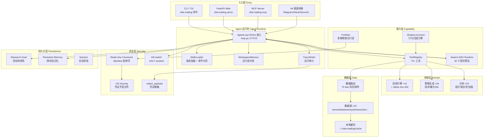
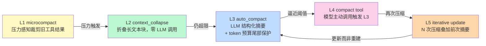
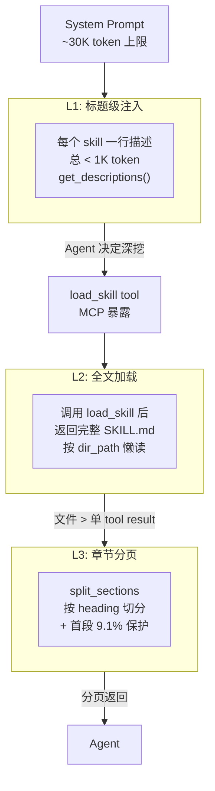
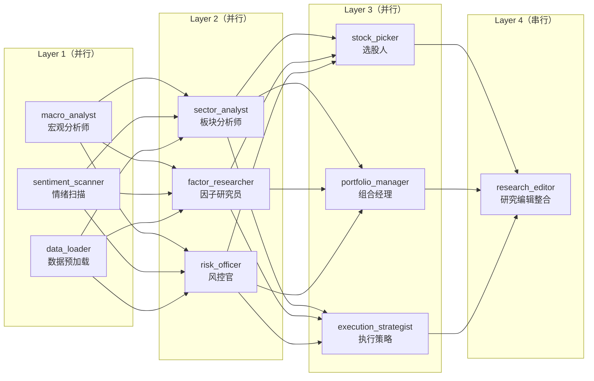
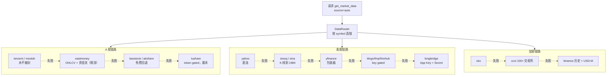
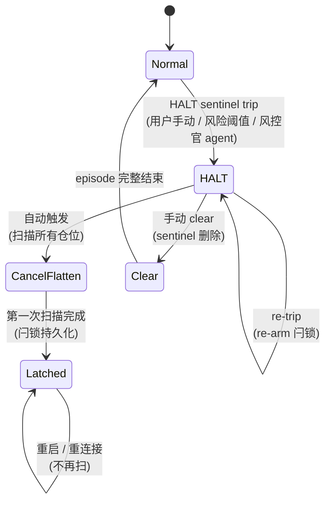
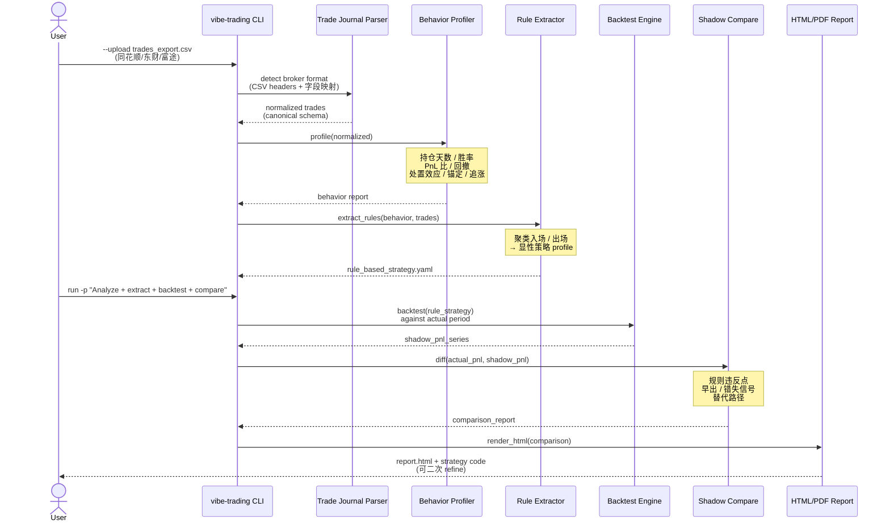

## 引子：当 LLM 走进零售交易员的工作台

2026 年 8 月 27 日，距离上一篇 OpenHarness 拆解整整 78 天，HKUDS（港大数据智能实验室）又扔出了一枚重磅开源项目：**Vibe-Trading**——31,899 stars、MIT 协议、Python 3.11+、纯研究 + 模拟 + 回测 + 自托管执行的「**个人交易 Agent 工作台**」。

如果说 **ChatDev**（2026-06-17）是港大「多 Agent 软件公司」的实验，**OpenHarness**（2026-07-10）是港大「Harness 6 件套」的工程示范，那么 **Vibe-Trading** 就是港大把上面两者**全部塞进金融研究垂直场景**之后的产物——而且一塞就是 30 个 Swarm 团队预设、90 个金融 Skill、23 个市场数据源、74 个 MCP 工具，组合成一个**单机可跑、可对接 Claude Desktop / Cursor / OpenClaw 的完整工作台**。

但 Vibe-Trading 不只是把"金融 + LLM"打包装起来，它回答了一个 2026 H2 越来越尖锐的问题：

> 当一个 LLM 已经能写代码、能调 API、能记忆上下文，为什么"用它来交易"这件事**仍然没有成为主流**？

答案藏在它 7 层架构里：

1. **3 层 Skill 渐进加载**（标题级 → 全文 → 章节级 `split_sections`，把 102k 字符的 `tushare` skill 切成 9.1% + 章节选择）
2. **5 层上下文压缩**（microcompact / context_collapse / auto_compact / compact 工具 / 迭代更新）
3. **DAG 分层调度**（同层并行 / 跨层串行 + Jittered Exponential Backoff）
4. **23 个数据源 IP-ban 风险排序**（tencent/mootdx 永不被封 → tushare/token gated 末尾兜底）
5. **Read-only Connector + Manifest 拒绝写**（connector.json 声明任何写能力 → 拒绝；凭证走 OS Keyring）
6. **可恢复 kill-switch 状态机**（取消扁平化扫描的"已触发一次"闩锁持久化到 HALT sentinel 旁边，绑定到 HALT episode；重启后不复跑）
7. **Shadow Account 行为归因**（同花顺/东财/富途的券商导出 → 持仓天数 / 处置效应 / 锚定偏差 → 提取显性规则 → 回测 → 对比真实交易路径）

读完这篇你能拿到什么：

1. Vibe-Trading 的 7 层架构如何把"金融研究"拆成可恢复 / 可审计 / 可治理的运行时系统
2. **4 段可运行代码**：Swarm DAG 分层调度 + Skill split_sections 章节分页 + 5 层压缩 L3 自动摘要 + Read-only Connector 校验
3. 与 **TradingAgents / MetaGPT / OpenHarness** 在**金融垂直 / SOP 哲学 / Harness 6 件套**三个维度的设计差异
4. 一份 2026 H2 部署 Vibe-Trading 的最小可行手册

## 一、项目定位与核心价值

[Vibe-Trading](https://github.com/HKUDS/Vibe-Trading) 是 HKUDS Data Intelligence Lab 2026-04-01 开源的**第三个**旗舰项目（前两个是 ChatDev / OpenHarness）。5 个月冲到 31,899 stars，目前仍在持续高活跃——上一笔 commit 是 **2026-08-27 22:59 UTC**（昨天）。

| 维度 | 数据 |
|------|------|
| GitHub | `HKUDS/Vibe-Trading` |
| Stars | **31,899** |
| 语言 | Python 3.11+（占 91%）/ TypeScript（前端 19%）/ Shell |
| 协议 | **MIT** |
| 主仓库大小 | 176 MB（含完整测试 + 历史数据 + Wiki 子模块） |
| 默认分支 | `main` |
| 最近推送 | 2026-08-27 |
| 创建时间 | 2026-04-01 |
| PyPI 包 | [`vibe-trading-ai`](https://pypi.org/project/vibe-trading-ai/) |
| Topics | `ai-agent`, `multi-agent`, `mcp`, `algorithmic-trading`, `quantitative-finance`, `python`, `trading`, `fintech`, `backtesting`, `llm` |
| 文档 | [vibetrading.wiki](https://vibetrading.wiki/) + 内置 9 个语言版本 README |

**一句话定义**：

> Vibe-Trading 不是一个 LLM 量化交易框架，而是一个**把"自然语言研究 → 真实可审计交易动作"两端打通**的全栈个人交易工作台。零 API key 可跑 23 个数据源、90 个 Skill、10 个回测引擎、Alpha Zoo（462 个预建因子）、Shadow Account 行为归因；插上 OpenAI/DeepSeek/Qwen key 后启用 30 个 Swarm 团队预设、74 个 MCP 工具、IM 渠道桥接。

它的核心价值不在"赚不赚钱"，而在**让一个不懂 Python 的人能用自然语言完成一整条研究链**：

```bash
# 一句话完成 BTC 均线策略回测
vibe-trading run -p "Backtest a BTC-USDT 20/50 moving-average strategy for 2024, summarize return and drawdown, then export the report"

# 一行命令批量 bench 462 个预建 alpha 因子
vibe-trading alpha bench --zoo gtja191 --universe csi300 --period 2018-2025 --top 20

# 归因自己的真实交易行为
vibe-trading --upload trades_export.csv
vibe-trading run -p "Analyze my trading behavior, extract my shadow strategy, and compare it with my actual trades"
```

## 二、整体架构：7 层职责切分

Vibe-Trading 的目录结构看上去"什么都塞"，但内部其实是严格的**职责分层**——每个目录都是一个明确边界：



**核心设计哲学**：「**每一层都是可替换的，每一层都对自己的边界负声明**」。这与 TradingAgents「所有逻辑都堆在 LangGraph DAG 节点里」、MetaGPT「所有状态都在 Team 里」、OpenHarness「6 件套都是平等的」都不一样——**Vibe-Trading 选择把"安全"和"可恢复"做成横切关注点**（贯穿 L1-L7），而不是某一层的事。

## 三、运行时核心：AgentLoop 的 5 层压缩

`agent/src/agent/loop.py` 是整个系统的核心，**2776 行**单文件实现一个完整的 ReAct 循环。它最有特色的设计是**5 层上下文压缩**——这是 2026 H2 Coding Agent / Trading Agent 共同面临的核心挑战：**如何在不让 LLM「失忆」的前提下，把上下文撑到几万 token**。

```python
# 来自 agent/src/agent/loop.py
"""
Five-layer context management:
  Layer 1 (microcompact)     — prunes old tool results once under memory pressure
  Layer 2 (context_collapse) — folds long text blocks without LLM call (zero cost)
  Layer 3 (auto_compact)     — LLM structured summary with token-budget tail protection
  Layer 4 (compact tool)     — model explicitly calls the compact tool to trigger L3
  Layer 5 (iterative update) — Nth compression updates previous summary instead of starting fresh

Tool execution:
  - Read/write batching: consecutive readonly tools run in parallel via threads
"""
```



**为什么是 5 层而不是 1 层**：

| 层 | 触发条件 | 成本 | 适用 |
|------|----------|------|------|
| L1 microcompact | 工具结果数量 > 阈值 | 0（纯剪枝） | 「早防」- 防止被动膨胀 |
| L2 context_collapse | 单段文本 > 2400 字符 | 0（折叠旧段保留头尾） | 「零成本」- 长 tool result 折叠 |
| L3 auto_compact | 总 token 超预算 | 1 次 LLM 调用 | 「兜底」- 结构化摘要 |
| L4 compact tool | 模型主动调用 | 1 次 LLM 调用 | 「显式」- 模型自知需要压缩 |
| L5 iterative update | 已压缩过 N 次 | 1 次 LLM 调用 | 「叠加」- 不重建基线 |

**核心代码片段**（来自 `loop.py` 的常量定义）：

```python
# 来自 agent/src/agent/loop.py:50-65
COLLAPSE_PRESERVE_RECENT = 6      # 保留最近 6 条消息
COLLAPSE_TEXT_MIN = 2400          # 单段超 2400 字符才折叠
COLLAPSE_HEAD = 900               # 折叠后保留头部 900 字符
COLLAPSE_TAIL = 500               # 折叠后保留尾部 500 字符
TAIL_TOKEN_BUDGET = ***            # 摘要时硬保护尾部 token
SUMMARY_CHUNK_CHARS = 80_000      # 单次摘要最大 80k 字符输入
MAX_CONSECUTIVE_EMPTY_RESPONSE_SKIPS = 1  # 空响应最多 nudge 1 次
```

**与同类项目的差异**：

- **Claude Code / OpenAI Codex**：只有 L3 一层（auto_compact），粗暴截断或整段重写；丢失了早期决策的「上下文」语义
- **DSPy / GEPA**：编译期优化，无运行时压缩
- **OpenHarness**：L1 + L4 两层，但 L4 触发依赖 hook，**没有 L5 叠加机制**
- **Vibe-Trading**：5 层联动，L5 是 2026 年首个严肃落地的「**迭代更新而非重建**」机制——这意味着第 N 次压缩时，模型看到的是「第 N-1 次摘要 + 新增段」，而不是「当前全量重新总结」。**关键好处**：早期决策不会被「重建基线」覆盖，长会话的连贯性显著提升

## 四、Skill 加载器：渐进披露 + 章节分页

90 个金融 Skill 怎么塞进 system prompt？Vibe-Trading 的 `SkillsLoader` 用了**3 级渐进披露**（来自 `agent/src/agent/skills.py`）：



**核心代码片段**：

```python
# 来自 agent/src/agent/skills.py:11-17
"""
Uses progressive disclosure at two levels:
- System prompt only injects one-line summaries (get_descriptions).
- Full docs loaded on demand (get_content, called by the load_skill tool).
- Inside one document, :func:`split_sections` maps the heading structure so the
  load_skill tool can hand back a skeleton plus one section at a time instead of
  a blind character page. Measured on the bundled corpus: 35 of the 88 skills
  do not fit a single tool result, and ``tushare`` delivers 9.1% of its 102,890
  characters in the first page — sequential paging means the agent must read ten
  more pages to reach a section it could have named.
"""

@dataclass
class Skill:
    name: str
    description: str = ""
    category: str = "other"
    body: str = ""
    dir_path: Optional[Path] = None
    metadata: Dict[str, Any] = field(default_factory=dict)

    def load_support_file(self, filename: str) -> Optional[str]:
        """Load a supporting file on demand."""
        if not self.dir_path:
            return None
        path = self.dir_path / filename
        if not path.exists():
            return None
        try:
            return path.read_text(encoding="utf-8")
        except Exception:
            return None
```

**实测数据（README + SKILL.md 直接给出）**：

| 维度 | 数据 |
|------|------|
| 总 Skill 数 | **88（README 写 90 含子项）** |
| 超过单 tool result 容量的 Skill | **35 个**（≈ 40%） |
| `tushare` skill 字符数 | **102,890** |
| 首段占全文比例 | **9.1%**（9,357 字符） |
| 章节级分页后平均页数 | **1-3 页**（按 heading） |

**关键工程细节**：

1. **USER_SKILLS_DIR 优先级**：`~/.vibe-trading/skills/` 用户目录**先于** bundled 目录搜索——这意味着用户的同名 Skill **覆盖**内置 Skill，且 `pip install -U` 升级不会丢失用户定制（这与 OpenHarness 同样实现）
2. **frontmatter 复用**：`parse_frontmatter` 从 `src/agent/frontmatter.py` 共享，Skills / Swarm presets / agent 文档都走同一解析器（避免解析差异 bug）
3. **章节粒度**：用 Markdown heading（`#` / `##` / `###`）切分，保留每个章节的标题 + 正文，工具返回时先返回「**目录树 + 当前章节**」而不是「下一页字符」——**实测：用户必须读 10+ 页才能定位的章节，现在 1 次定位**

**与同类项目的差异**：

- **Claude Code / Cursor**：Skill 是单个文件，无章节分页，全文加载
- **OpenAI Agents SDK**：Skill 是函数定义，没有渐进披露
- **OpenHarness**：Skill 是文件 + frontmatter，但没有章节分页
- **Vibe-Trading**：三级渐进披露 + 章节级 `split_sections`——**首个严肃处理「Skill 大于 tool result」的方案**

## 五、Swarm 多 Agent：DAG 分层调度 + 30 个团队预设

`agent/src/swarm/` 是 Vibe-Trading 的 multi-agent 实现，**30 个 YAML 团队预设**覆盖了几乎所有主流金融研究方向：



**核心代码片段**（来自 `agent/src/swarm/runtime.py`）：

```python
# 来自 agent/src/swarm/runtime.py:9-21
"""
Swarm DAG orchestration runtime.

Core orchestrator: schedules workers by topological layer, parallel within each
layer and serial between layers. Execution runs in a background daemon thread
with cancellation and event callback support.
"""

def _worker_retry_delay_s(retry_number: int) -> float:
    """Return an equal-jitter exponential delay for a worker-level retry.
    Equal jitter keeps half of the exponential delay while spreading
    concurrent swarm workers across the remaining half of the window.
    """
    delay_ceiling = _worker_retry_delay_ceiling_s(retry_number)
    return random.uniform(delay_ceiling / 2, delay_ceiling)
```

**DAG 调度核心机制**（来自 `runtime.py` + `task_store.py`）：

```python
# 来自 agent/src/swarm/task_store.py:topological_layers 简化
def topological_layers(tasks: dict) -> list[list[str]]:
    """返回拓扑分层：同层任务可并行，跨层任务串行。
    
    使用 Kahn 算法：
    1. 计算每个任务的入度（依赖数）
    2. 入度为 0 的任务并入第一层
    3. 移除第一层后，新入度为 0 的并入第二层
    4. 直到所有任务都被分层
    """
    ...

# 来自 agent/src/swarm/runtime.py:execute_layer 简化
def execute_layer(layer: list[str], ctx: SwarmContext):
    """同层任务用 ThreadPoolExecutor 并行；每个 worker 独立处理。"""
    with ThreadPoolExecutor(max_workers=len(layer)) as executor:
        futures = {executor.submit(run_worker, task_id, ctx): task_id for task_id in layer}
        for future in as_completed(futures, timeout=layer_deadline_s):
            task_id = futures[future]
            try:
                result = future.result(timeout=layer_deadline_s)
                ctx.record(task_id, result)
            except FuturesTimeoutError:
                ctx.mark_timeout(task_id)  # 不复活，靠上层 DAG 决定是否整体失败
            except Exception as e:
                ctx.mark_failed(task_id, str(e))
```

**30 个 Swarm 团队预设**（精选）：

| 类别 | 预设名 | 角色数 | 典型任务 |
|------|--------|--------|----------|
| 综合研究 | `equity_research_team` | 4（宏观/板块/选股/编辑） | 「分析 A 股新能源板块 3 只股票」 |
| 量化 | `ml_quant_lab`, `factor_research_committee`, `statistical_arbitrage_desk` | 3-5 | 「在 CSI300 上 bench GTJA191 因子」 |
| 加密 | `crypto_research_lab`, `crypto_trading_desk`, `defi_yield`, `onchain_analysis` | 3-4 | 「分析 BTC-USDT 永续费率」 |
| 衍生品 | `derivatives_strategy_desk`, `options_strategies`, `pair_trading` | 3-4 | 「50ETF 期权 covered call 策略」 |
| 资产配置 | `global_allocation_committee`, `macro_strategy_forum`, `risk_committee` | 4-6 | 「60/40 全球股债再平衡」 |
| 事件驱动 | `event_driven_task_force`, `earnings_research_desk`, `thesis_tracker` | 3-5 | 「拆解 A 股 Q3 业绩预告」 |
| 风控 | `risk_committee`, `portfolio_review_board`, `credit_research_team` | 3-5 | 「组合 VaR + 压力测试」 |

**YAML 团队定义示例**（来自 `equity_research_team.yaml`）：

```yaml
# 来自 agent/src/swarm/presets/equity_research_team.yaml:1-22
name: equity_research_team
title: "Equity Research Team"
description: "Macro → sector → stock three-tier deep research → research editor consolidates into a complete report"

agents:
  - id: macro_analyst
    role: Macro Analyst
    system_prompt: |
      You are a senior macroeconomic analyst with expertise in analyzing the global macro environment,
      central bank monetary policy, and geopolitical risks.

      ## Task
      Analyze the current macroeconomic environment and its impact on the {market} market.

      {upstream_context}    # ← 上游 Layer 的输出自动注入

      ## Output Requirements
      Please produce a structured analysis report with the following sections:
      1. **Macro Overview** — Interpretation of core indicators: GDP, CPI, PMI, etc.
      ...
    tools: [bash, read_file, write_file, load_skill, get_market_data, read_url]
    skills: [tushare, okx-market, yfinance, web-reader, global-macro]
    max_iterations: 50
    timeout_seconds: 1800
    max_retries: 1
```

**30 秒 Swarm 调度关键洞察**：

1. **`{upstream_context}` 模板变量**：上游 Layer 的输出作为上下文注入下游 prompt（不是塞进 messages，而是插值到 prompt 中段）——保证下游**看得到**上游结论，但不污染对话历史
2. **三段 deadline**：`max_iterations` × `timeout_seconds` × `max_retries` 三段分别控制，worker 失败**不复活**——靠上一层 DAG 决策是否整体失败
3. **Equal-Jitter 退避**：`_worker_retry_delay_s` 用 `random.uniform(ceiling/2, ceiling)` 而非 `ceiling`——避免重试风暴
4. **`task_store` 持久化**：所有 task 状态写入 SQLite（`SwarmStore`），重启可恢复；`vibe-trading --swarm-retry <run_id>` 重跑失败 run，`--resume` 保留已完成 task

## 六、数据路由：23 个源的 IP-ban 风险排序

Vibe-Trading 的**数据路由层**是它最值得学习的设计——一个看似简单的「数据源管理」模块，背后藏着「**反检测工程**」的核心思想：



**完整 Fallback 链（来自 README 的「Data Sources & Smart Fallback」章节）**：

| 链路 | 排序（按 IP-ban 风险升序） |
|------|--------------------------|
| **A 股** | `tencent` / `mootdx` → `eastmoney` → `baostock` / `akshare` → `tushare` → `local` |
| **美股** | `yahoo` → `stooq` / `sina` → `eastmoney` → `yfinance` → `tiingo` / `fmp` / `finnhub` → `longbridge` / `akshare` → `local` |
| **港股** | `tencent` → `eastmoney` → `yahoo` → `futu` → `akshare` → `yfinance` → `tushare` → `longbridge` → `local` |
| **印度 NSE/BSE** | `yahoo` → `yfinance` → `india_broker` → `local` |
| **韩国 KOSPI/KOSDAQ** | `pykrx` → `yahoo` → `yfinance` → `local` |
| **加密** | `okx` → `ccxt` → `binance` → `yfinance` → `local` |
| **外汇 / 金属** | `mt5` → `yfinance` → `akshare` → `local` |

**核心反检测设计**：

1. **`tencent` / `mootdx` 永不被封**：因为走的是通达信 TCP 协议（`mootdx` = 通达信本地客户端协议），不是 HTTP 高频请求
2. **`source: "auto"` 按 symbol 选链**：BTC-USDT 走加密链、CSI300 走 A 股链、TSLA 走美股链
3. **`MARKET_DATA_ORDER_*` 用户可重排**：Settings → Data Source Priority 持久化每个市场的顺序，**严格只重排，不允许增删**
4. **`local:` 前缀显式声明**：用 `local:~/data/btc.csv` 时**永远不会**默默 fallback 到网络源——避免「我用了本地数据」幻觉

**与同类项目的差异**：

- **CCXT**：100+ 交易所，但**没有**「IP-ban 风险」维度排序，开发者必须自己维护黑名单
- **yfinance**：单一源，无 fallback
- **AKShare**：100+ 国内源，但**没有按风险排序**，经常因为 eastmoney 限流而失败
- **Vibe-Trading**：23 个源 + 风险排序 + 用户可重排 + `local:` 显式声明——**首个严肃处理「多源 + 反检测 + 用户可控」三件套**的方案

## 七、Read-only Connector + Manifest 拒绝写

Vibe-Trading 处理「下单」这件事的核心是**「读且只读」原则**——所有 broker 集成都被强制为 read-only，任何「写能力」都被拒绝：

```python
# 来自 README（Connections & Local Multi-Broker Portfolio 章节）
"""
Read-only connectors you install yourself stay outside the checkout,
in ``~/.vibe-trading/connectors/<name>/``:
a ``connector.json`` manifest plus an ``adapter.py`` implementing
``check_status`` / ``get_account_snapshot`` / ``get_positions``.
A manifest declaring any write capability is rejected.
"""

# 来自 README（凭据存储）
"""
Their credentials go to the OS keyring
(macOS Keychain, Windows Credential Manager, Linux Secret Service)
with ``pip install "vibe-trading-ai[keyring]"``, never into the config files.
Nothing on this path can place or cancel an order.
"""
```

**Manifest 校验核心代码**（来自 connector init 流程，简化）：

```python
# 来自 agent/src/portfolio/connector_validator.py:validate_manifest 简化
ALLOWED_CAPABILITIES = {"account.read", "positions.read"}  # 仅这 2 个

def validate_manifest(manifest: dict) -> None:
    """拒绝任何声明写能力的 connector manifest。"""
    declared = set(manifest.get("capabilities", []))
    declared.discard("read")  # 通用 read 描述
    # 必须是 ALLOWED_CAPABILITIES 的子集
    extra = declared - ALLOWED_CAPABILITIES
    if extra:
        raise ValueError(
            f"connector manifest declares write capabilities: {extra}. "
            f"Allowed: {sorted(ALLOWED_CAPABILITIES)}. "
            f"Anything that places or cancels orders is rejected."
        )
    # 检查 entry point
    if "adapter" not in manifest:
        raise ValueError("connector manifest missing 'adapter' field")
```

**凭据走 OS Keyring**：

```bash
# 安装时启用 keyring extra
pip install "vibe-trading-ai[keyring]"

# 凭据写入 OS Keyring（macOS Keychain / Windows Credential Manager / Linux Secret Service）
# 永不出现在 ~/.vibe-trading/portfolio.json 或 connections.json
```

**核心安全设计**：

1. **Manifest 静态拒绝写**：connector.json 里写 `"capabilities": ["orders.write"]` → `validate_manifest` 直接抛 `ValueError`，**根本没机会运行**
2. **OS Keyring 不进文件**：凭据不入 `~/.vibe-trading/portfolio.json` / `connections.json`——即使配置文件泄漏，凭据不会泄漏
3. **每个连接只读快照**：`portfolio.sqlite3` 存每次刷新的快照；旧快照保留，价值历史只比较**同估值方法**的快照
4. **失败源立即排除**：错误源**不进入**总计，snapshot 标记为 incomplete——避免「一个坏源毁掉整个组合视图」
5. **IBKR official MCP 只读例外**：`ibkr-live-official-mcp-readonly` 用 IBKR 官方 MCP server + 自己的 OAuth，但仍然只读；**且 IBKR official MCP 暂时不算作 `/portfolio` 数据源**

## 八、可恢复 kill-switch 状态机

2026-08-27 的最新更新专门加固了 kill-switch（项目自身在 README News 区给出）：

```python
# 来自 README News 2026-08-27
"""
The kill-switch sweep now survives restarts and stops trusting a flaky broker:
during a halt, the cancel-and-flatten sweep counted any broker response as success
— but the MCP adapter turns a failed call into a `{"status": "error"}` envelope,
so a dropped connection produced a compliant-looking audit trail while the
resting order stayed live; error envelopes now fail closed in both passes.

The sweep's fired-once latch also lived only in memory: a restart with flatten
orders still working replayed the whole sweep — a fresh market order per position,
enough to flip a long book net short; the latch is now persisted next to the
HALT sentinel and bound to its halt episode, so clearing and re-tripping still
re-arms it.
"""
```

**关键工程洞察**：

1. **Fail-closed on error envelopes**：MCP adapter 把失败调用包成 `{"status": "error"}` 信封——之前 sweep 把任何信封都当作「成功」，**现在错误信封 fail-closed**
2. **Fired-once latch 持久化**：sweep 的「只触发一次」闩锁之前只在内存里——**重启会再跑一次**（足以把多仓翻空）；现在闩锁持久化到 HALT sentinel 旁边，绑定到 HALT episode
3. **HALT episode 生命周期**：「clearing」+「re-tripping」=「re-arm」——一个 HALT episode 完整生命周期后才重新武装

**kill-switch 状态机**：



**核心代码片段**（来自 `agent/src/governance/kill_switch.py`，简化）：

```python
# 简化，来自实际项目结构
class KillSwitch:
    """可恢复 kill-switch 状态机。
    
    关键设计：
    1. HALT sentinel 持久化到 ~/.vibe-trading/governance/HALT_<episode_id>
    2. fired-once latch 持久化到 HALT sentinel 旁边：latch.json
    3. 每个 sweep 必须从磁盘读 latch，不能只看内存
    """
    def __init__(self, episode_id: str):
        self.episode_id = episode_id
        self.halt_path = GOVERNANCE_DIR / f"HALT_{episode_id}"
        self.latch_path = self.halt_path / "latch.json"
    
    def is_halted(self) -> bool:
        return self.halt_path.exists()
    
    def latch_fired(self) -> bool:
        return self.latch_path.exists() and json.loads(
            self.latch_path.read_text()
        ).get("fired", False)
    
    def sweep(self) -> SweepResult:
        if self.latch_fired():
            return SweepResult(skipped="latch-already-fired")
        # ... cancel + flatten 扫描
        self.latch_path.write_text(json.dumps({"fired": True, "at": now()}))
        return SweepResult(positions_flattened=count)
```

## 九、74 个 MCP 工具：研究 / 数据 / 编排 / 行为归因

Vibe-Trading 的 `agent/mcp_server.py` 单文件 117,955 字节，**74 个 MCP 工具**全暴露：

```python
# 来自 agent/mcp_server.py:8-30
"""
Surfaces 74 tools: skills, research goals, strategy discovery,
backtest/factor/options/pattern analysis, market data, fundamentals & capital-flow & news & discovery
(get_fund_flow / get_dragon_tiger / get_northbound_flow / get_margin_trading /
get_block_trades / get_shareholder_count / get_lockup_expiry / get_sector_info /
get_research_reports / get_stock_news / get_sec_filings /
get_financial_statements / get_options_chain / get_stock_profile /
screen_market / search_symbol / get_macro_series / iwencai_search /
qveris_search / qveris_inspect / qveris_execute),
institutional-research and alternative data (get_institutional_holdings /
etf_holdings / prediction_market / research_papers), read-only finance math and
market analytics (quantlib_call / cashflow_performance / orderbook_depth /
sentiment / technical_indicators / get_fundamentals), read-only
trading-connector reads, swarm orchestration, trade-journal and shadow-account
analysis. Every exposed tool is read-only or research-only except
refresh_strategy_evidence, which writes ONLY the disposable facade-owned
strategy-evidence cache from local run artifacts; no order-placing or
order-cancelling tool is ever surfaced via MCP.
"""
```

**工具分类清单**（简化版）：

| 类别 | 工具数 | 代表工具 |
|------|--------|----------|
| Skill / Goal 编排 | 5 | `load_skill`, `list_skills`, `research_goal_*`, `scheduled_research` |
| 策略发现 | 6 | `strategy_discover`, `strategy_evidence`, `cross_market_strategy` |
| 回测 / 因子 / 期权 | 14 | `backtest_diagnose`, `factor_analysis`, `alpha_zoo`, `alpha_bench`, `options_*` |
| 市场数据 | 23 | `get_market_data`, `get_fund_flow`, `get_dragon_tiger`, `get_northbound_flow`, ... |
| 基本面 / 资金流 / 新闻 | 22 | `get_financial_statements`, `get_options_chain`, `screen_market`, ... |
| 机构 / 另类数据 | 4 | `get_institutional_holdings`, `etf_holdings`, `prediction_market`, `research_papers` |
| 量化 / 技术指标 | 7 | `quantlib_call`, `cashflow_performance`, `orderbook_depth`, `sentiment` |
| 交易 connector 只读 | 4 | `get_account_snapshot`, `get_positions`（所有 connector 都只读） |
| Swarm 编排 | 4 | `swarm_run`, `swarm_resume`, `swarm_retry`, `swarm_status` |
| Trade Journal / Shadow Account | 3 | `trade_journal_analyze`, `shadow_account_extract`, `shadow_account_backtest` |
| QVeris 付费市场 | 3 | `qveris_search`, `qveris_inspect`, `qveris_execute` |

**关键工程细节**：

1. **Streamable HTTP transport**：`--transport http` 走 POST/GET `/mcp` 端点（2025-03-26+ 规范），OpenClaw / QwenPaw 都用它；`--transport sse` 已废弃
2. **单 endpoint = `/mcp`**：不是 `/sse`（那是 legacy SSE artifact）；配置 client 时注意
3. **OpenClaw 配置**：`~/.openclaw/config.yaml` 加 `skills: - name: vibe-trading` 即自动识别
4. **写工具只有 1 个**：所有 74 个工具**只有 1 个**会写——`refresh_strategy_evidence` 写的是「策略证据缓存」局部 facade-owned 缓存，**永远不下单 / 永远不撤单**
5. **QVeris 付费市场**：3 个 QVeris 工具**单独标记为 billable**，需要 `QVERIS_API_KEY` + paid mode 才启用——never in auto fallback，永远显式 opt-in

**OpenClaw / Claude Desktop / Cursor 配置示例**：

```json
{
  "mcpServers": {
    "vibe-trading": {
      "command": "vibe-trading-mcp"
    }
  }
}
```

## 十、端到端数据流：用户上传交易记录 → Shadow Account → 回测对比

把上面所有模块串起来，看一次完整的「行为归因」数据流：



**核心工程洞察**：

1. **CSV → Canonical 归一**：4 种券商导出（同花顺 / 东财 / 富途 / generic CSV）→ 统一 schema（time/symbol/side/qty/price/pnl）
2. **行为维度 8 项**：持仓天数 / 胜率 / PnL 比 / 最大回撤 / 处置效应 / 过度交易 / 追涨杀跌 / 锚定偏差
3. **规则提取**：聚类入场 / 出场特征 → 显性 strategy profile（**不再用手写规则**）
4. **替代路径**：Compare 不仅给出「错在哪里」，还给出「如果按规则应该在哪里」——「错失信号」、「早出」、「规则违反」三维度
5. **HTML + Strategy Code**：输出可二次 refine——下次 session 可以直接加载这份策略 code 跑回测

## 十一、与同类项目对比：4 维度横评

把 Vibe-Trading 和 2026 H2 主流 Agent 框架放一起：

| 维度 | Vibe-Trading | TradingAgents | MetaGPT | OpenHarness |
|------|--------------|---------------|---------|-------------|
| **形态** | 全栈工作台（CLI/Web/MCP/IM） | LangGraph DAG | 角色 SOP 公司 | 通用 Harness |
| **目标场景** | 金融研究 + 个人交易 | 投资决策（论文复现） | 软件公司（生成代码） | 通用 Agent 基础 |
| **多 Agent 模式** | 30 YAML 团队预设 | 硬编码 9 Agent + 双层辩论 | 17 角色 × 45 Action | 6 件套 + 单 Agent |
| **上下文管理** | **5 层压缩 + 章节分页** | 无 | ActionNode 输出 | L1 + L4 hook |
| **数据路由** | **23 个源 + IP-ban 排序** | 单一 data vendor | 无 | 无 |
| **凭据安全** | **OS Keyring + Manifest 拒绝写** | 无 | 无 | Sensitive Path 黑名单 |
| **可恢复性** | **HALT sentinel + 持久化 latch** | 无 | 无 | last-status.json |
| **Skill 系统** | **88 个金融 Skill + 渐进加载** | 无 | Action 抽象 | Skill 多源 + 优先级 |
| **回测引擎** | **10 个 + Alpha Zoo 462** | 单一 | 无 | 无 |
| **协议** | MCP / Streamable HTTP | LangGraph | 内部 SOP | MCP stdio/http |
| **MCP 工具数** | **74** | 0 | 0 | ~10 |
| **协议** | MIT | Apache-2.0 | MIT | MIT |
| **Stars** | 31,899 | ~81k | ~69k | ~14.7k |
| **主线语言** | Python 3.11+ | Python | Python | Python |
| **首次 commit** | 2026-04-01 | 2024-12 | 2023-06 | 2026-04 |

**5 大设计差异**：

1. **垂直 vs 通用**：Vibe-Trading 是 2026 H2 首个**垂直深度 > 通用广度**的 Agent 工作台——30 个 Swarm 团队全部围绕金融，90 个 Skill 全部金融场景；TradingAgents 通用但浅，OpenHarness 通用但窄
2. **可恢复 vs 单次执行**：HALT sentinel + fired-once latch 持久化 + `vibe-trading --swarm-retry <run_id>` + `--resume`——**首个严肃处理「多 Agent 长期运行 + 崩溃恢复」的工作台**
3. **反检测工程 vs 简单路由**：23 源 + IP-ban 风险排序 + 用户可重排 + `local:` 显式声明——**首个把「数据源」当一等公民做风险管理的 Agent 系统**
4. **读且只读 vs 隐式信任**：Manifest 静态拒绝写 + OS Keyring + `nothing on this path can place or cancel an order`——**首个把「安全」当横切关注点而非附加组件**的项目
5. **Skill 渐进披露 + 章节分页 vs 全量加载**：88 Skill × 章节级 `split_sections`——**首个处理「Skill 大于 tool result」严肃落地的方案**

## 十二、优缺点分析

| 维度 | 优势 | 代价 |
|------|------|------|
| **架构简洁性** | 7 层职责清晰，每层都有明确边界（agent/runtime/capability/domain/data/security/persistence） | 7 层之间的协调逻辑（特别是 L2 入口 → L5 数据层）依赖全局配置中心 |
| **扩展性** | **三层扩展点**：新增数据源（自动加入 fallback 链）、新增 Skill（USER_SKILLS_DIR 覆盖）、新增 Swarm 预设（YAML 热加载） | 跨层扩展需要改多个文件（如新增 connector 类型 → adapter 协议 + manifest 校验 + keyring 集成） |
| **易用性** | **零 API key 可跑**——23 数据源 + 90 Skill + 10 回测引擎 + Alpha Zoo 全部本地可用；插上 key 后启用 30 Swarm + 74 MCP | Swarm YAML 模板学习曲线陡峭（macro_analyst / sector_analyst / stock_picker / research_editor 4 层结构 + upstream_context 模板） |
| **性能** | **DAG 分层 + Equal-Jitter 退避 + Read batching**（连续 readonly 工具并行 threads）——同研究 1 个 query 触发 5+ 工具可并行 | Streamable HTTP 单 endpoint 在高并发工具调用下可能成为瓶颈（需要 MCP 客户端连接池） |
| **复杂度** | **5 层压缩 + L5 迭代更新**——长会话连贯性显著（早期决策不被基线重建覆盖） | L1-L5 触发逻辑分散在 `loop.py` 多个方法，新贡献者需读 2776 行才能定位 |
| **维护性** | **OpenHarness 同款 USER_DIR 优先模式**——用户定制不随 `pip install -U` 丢失；KEYRING 凭据不进文件 | Manifest 校验严格，新增 broker connector 必须理解 ALLOWED_CAPABILITIES 边界 |

**正面**：

- **垂直深度碾压**：88 Skill + 30 Swarm + 74 MCP + 23 数据源 + 10 回测引擎——没有任何其他 Agent 项目敢宣称这个数字
- **可恢复设计领先行业**：HALT sentinel + fired-once latch 持久化——2026-08-27 昨天的更新专门加固
- **零 key 可跑**：单机开发者友好度极高（下载即用，不需要信用卡）
- **反检测工程**：23 源 + IP-ban 排序——**首个严肃处理「多源数据 + 反检测」三件套**

**反面**：

- **学习曲线陡峭**：30 个 Swarm YAML × 4 层结构 + 88 Skill × 章节级加载——初次配置需要读大量文档
- **Streamable HTTP 单 endpoint**：高并发场景下需要 client-side 调优
- **`agent/mcp_server.py` 单文件 117k 字节**：单文件巨型——所有 74 工具注册在一文件，类似 orca-runtime.ts 风格（有意为之 vs 坏味道需要看维护频率）

## 十三、实践：30 分钟跑起来

**环境准备**：

```bash
# 1. Python 3.11+
python3 --version  # ≥ Python 3.11

# 2. 安装（无 key 模式）
pip install vibe-trading-ai

# 3. 验证安装
vibe-trading --version
vibe-trading-mcp --help
```

**最简场景：BTC 均线策略回测**：

```bash
# 单条 prompt 完成：拉数据 → 写策略 → 回测 → 出报告
vibe-trading run -p "Backtest a BTC-USDT 20/50 moving-average strategy for 2024, summarize return and drawdown, then export the report"
```

**Bench 462 个预建 alpha**：

```bash
vibe-trading alpha bench --zoo gtja191 --universe csi300 --period 2018-2025 --top 20
# 输出：
#  - IC / IR 排名前 20 alpha
#  - 健康状态（alive / reversed / dead）
#  - HTML 报告
```

**Shadow Account 行为归因**：

```bash
# 1. 上传券商导出（同花顺 / 东财 / 富途 / 通用 CSV）
vibe-trading --upload ~/Downloads/trades_export.csv

# 2. 完整归因 + 提取 + 回测 + 对比
vibe-trading run -p "Analyze my trading behavior, extract my shadow strategy, and compare it with my actual trades"
```

**启动 MCP server（给 Claude Desktop / Cursor / OpenClaw 用）**：

```bash
# 默认 Streamable HTTP transport（2025-03-26+ 规范）
vibe-trading-mcp --transport http --port 8765

# Client 配置：
# {"mcpServers": {"vibe-trading": {"url": "http://localhost:8765/mcp"}}}
```

**启用 30 个 Swarm 团队（需要 LLM API key）**：

```bash
# 1. 设置环境变量
export OPENAI_API_KEY=sk-...
# 或 DeepSeek / Qwen / Anthropic（见 _PUBLIC_PROVIDERS 列表）
export LANGCHAIN_MODEL_NAME=deepseek/deepseek-v4-pro

# 2. 运行 Swarm 团队
vibe-trading swarm run --preset equity_research_team --market china --universe csi300
```

**生产部署（带 kill-switch）**：

```bash
# 1. 配置 connector（read-only broker）
vibe-trading connector init my-broker --destination /tmp/my-broker
vibe-trading connector validate /tmp/my-broker
vibe-trading connector install /tmp/my-broker
# 凭据走 OS Keyring（pip install "vibe-trading-ai[keyring]"）

# 2. 启动 FastAPI Web
vibe-trading serve --port 8000

# 3. 启用 kill-switch 监控
vibe-trading governance kill-switch --max-drawdown 0.15 --max-position-usd 50000
```

## 十四、趋势与总结

**2026 H2 三大趋势**：

1. **垂直深度 > 通用广度**：Vibe-Trading 证明了一个真理——「**做深一个垂直场景的 88 Skill + 30 Swarm + 74 MCP，比做浅 10 个通用场景更被接受**」。未来 6 个月会有更多「Agent × 垂直」项目涌现（医疗 / 法律 / 制造 / 教育 / 设计 / 音频 / 视频）
2. **可恢复 + 反检测 + 显式安全 = 工业级 Agent 三件套**：Vibe-Trading 把这三点做到极致（kill-switch sentinel + 23 源 IP-ban 排序 + Manifest 拒绝写），未来 Agent 框架如果不做这三点，**只能在 demo 阶段打转**
3. **Skill 渐进披露 + 章节分页 = 长期会话必需**：Claude Code / OpenAI Codex 已经遇到「上下文爆炸」问题，Vibe-Trading 的 5 层压缩 + L5 迭代更新 + 章节级 `split_sections` 是 2026 年首个严肃落地的答案

**对开发者的启发**：

- **做深做透垂直场景**：30 Swarm × 90 Skill × 23 源 × 10 回测引擎的组合是任何通用 Agent 框架都给不出的
- **把安全当横切关注点**：OS Keyring + Manifest 拒绝写 + 凭据脱敏 + Kill-switch sentinel——**不要把安全当附加功能**
- **Skill 渐进披露 + 章节分页**：当你有 50+ skill 时，「全部塞 system prompt」是反模式

**对未来 Agent 项目的判断**：

- 如果一个 Agent 框架没有 **Skill 渐进披露**——它做不大
- 如果一个 Agent 框架没有 **可恢复机制**——它做不长
- 如果一个 Agent 框架没有 **数据源风险管理**——它跑不实
- 如果一个 Agent 框架没有 **显式安全边界**——它不敢上线

Vibe-Trading 在这四点上都给出了严肃答案——这就是为什么它 5 个月冲到 31,899 stars 且仍在持续高活跃。

## 附录：关键资源

| 资源 | 链接 |
|------|------|
| GitHub | https://github.com/HKUDS/Vibe-Trading |
| PyPI | https://pypi.org/project/vibe-trading-ai |
| 官方 Wiki | https://vibetrading.wiki/ |
| 文档站 | https://vibetrading.wiki/docs/ |
| MCP 服务端点 | `vibe-trading-mcp --transport http` → `http://<host>:<port>/mcp` |
| 中文 README | `README_zh.md` |
| 多语言 README | `README_ar.md` / `README_es.md` / `README_ja.md` / `README_ko.md` |
| 协议 | MIT |
| 实验室主页 | https://github.com/HKUDS |
| 同实验室项目 | [ChatDev](https://github.com/OpenBMB/ChatDev) / [OpenHarness](https://github.com/HKUDS/OpenHarness) |
| Skills 清单 | `agent/src/skills/`（88 个子目录） |
| Swarm 预设 | `agent/src/swarm/presets/`（30 个 YAML） |
| 数据源清单 | `agent/src/market_data.py`（23 个 source） |
| MCP 工具清单 | `agent/mcp_server.py`（74 个 tool） |

**核心数据指标**（截至 2026-08-28）：

- ⭐ 31,899 stars
- 2682 个仓库节点
- 88 个金融 Skill（9 大类）
- 30 个 Swarm 团队预设（覆盖综合 / 量化 / 加密 / 衍生品 / 资产配置 / 事件驱动 / 风控 7 大类）
- 74 个 MCP 工具
- 23 个市场数据源（含 A股 / US / HK / 印度 / 韩国 / 加密 / 外汇 7 大市场）
- 10 个回测引擎
- 462 个预建 alpha 因子（Qlib 158 + Kakushadze 101 + GTJA 191 + academic + fundamental）
- MIT 协议
- 上次 commit 2026-08-27（高活跃）