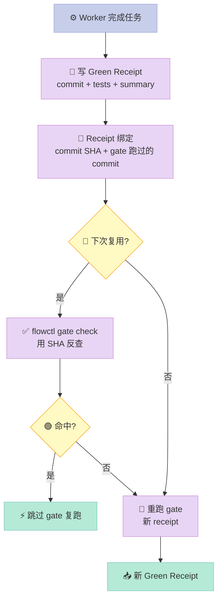

> **一句话结论**：当 11 个 SOTA 模型在 SlopCodeBench 上**没有一个完整跑完任何一道题**（Orlanski et al., Mar 2026）时，flow-next 给出的解药不是更强的 prompt，而是**把 Spec 变成接力赛的"实体重力中心"**——每一个环节都把上游交接物冻在磁盘上，下一棒必须基于冻态重启审查，无法漂移。

## 引子：spec 必须扛住整条流水线

Agent 把实现成本从几周压到几小时，但 2026 年 3 月 [SlopCodeBench](https://arxiv.org/html/2603.24755v1) 给了工程界一记响亮的耳光：让 Agent 在 93 个 checkpoint 上迭代扩展**它自己的旧代码**，结果：

- 11 个模型，**没有任何一个完整跑完任何一道题**；
- 最佳严格通过率 17.2%，到最后一个 checkpoint 跌到 0.5%；
- 80–90% 的轨迹里代码质量**逐步退化**，越改越偏离良好仓库的形态；
- "加一句 quality-aware prompt" 的解药被实测否决：初始啰嗦度降 ~⅓，**衰减斜率不变，所有 pass-rate 子项统计不显著**，代价是 +48% token。

廉价 prompt 救不了迭代。**真正能让 Agent 跑下去的是结构性纪律**——这是 [gmickel/flow-next](https://github.com/gmickel/flow-next)（689⭐，2026-08-28 仍在更新）把"workflow 层"做厚的根本原因。它不是又一个 Claude Code 插件、不是又一个 Loop 脚本，而是**把 Spec、Task、R-ID、Receipt、Gate 五件套作为文件系统上的实物，让"对话里本来没有的那段交接语"在硬盘上重新长出来**。

读完这篇你会得到：

- flow-next 的 **5 层接力链**是怎么把 Agent 的"漂移"锁死的；
- 它独有的 **6 个 handover 对象**和"**不同模型独立审查 + Receipt 不可篡改 + Gate 可重放**"三位一体证据机制如何实战；
- **5-Tier 模型路由块**怎么用 5 行 Markdown 声明 reviewer / implementer / scout；
- 它和 **moai-adk / ralph-claude-code / snarktank/ralph** 的本质差异在哪；
- 你自己**从零复刻 MVP** 时哪些能省、哪些绝对不能省。

---

## 一、项目定位：不是"又一个 Claude Code 插件"

| 维度 | flow-next | 典型 Claude Code 插件 |
|------|-----------|----------------------|
| 形态 | **CLI + 30+ Skill + 4 个跨 host bridge** | Skill 集合 |
| 安装位置 | `${CODEX_HOME}/scripts/flowctl` + `.flow/` 工作目录 | `.claude/skills/` |
| 卸载 | `rm -rf .flow/` | 逐文件删除 |
| 主机兼容 | Claude Code / OpenAI Codex / Factory Droid / Cursor / xAI Grok Build / OpenCode | 通常单一 host |
| 核心抓手 | **Spec → Receipt → Gate** 接力链（文件系统上的实物） | 提示词与上下文注入 |
| 审查机制 | **异模型独立审查** + Receipt 不可篡改 + Gate 可重放 | 通常同模型或人审 |

> 引用 docs/orchestration.md：*"The pattern this page serves: use your smartest model to orchestrate and judge, route mechanical or token-hungry work to faster/cheaper models, and pick reviewers from a **different family** than the writer."*

一句话：flow-next 是一个**"跨 host 的 Workflow 层"**——Claude Code、Codex、Droid 等是 conductor（指挥），flow-next 才是把"实体重力中心"搬到磁盘上的那一层。

---

## 二、架构：5 层接力链 + 6 件证据

### 2.1 顶层架构图

```mermaid
graph TB
    subgraph S1["🟦 Host 层 · Agent 进程"]
        H1["🚀 Claude Code"]
        H2["⚙️ Codex CLI"]
        H3["🛠 Factory Droid"]
        H4["🪝 Cursor"]
        H5["📡 xAI Grok Build"]
        H6["🧪 OpenCode"]
    end

    subgraph S2["🟪 Workflow 层 · flowctl"]
        W1["🎯 Conductor<br/>/flow-next:pilot<br/>/flow-next:land"]
        W2["📚 Spec → Task → R-ID<br/>写作编排"]
        W3["🔀 Cross-Model Review<br/>5 backend 路由"]
        W4["🔁 Receipt + Gate<br/>证据总线"]
    end

    subgraph S3["🟧 Storage 层 · 仓库内 .flow/"]
        ST1["📋 specs/*.md + *.json"]
        ST2["📝 tasks/*.md + *.json"]
        ST3["🧾 review-receipts/*.json"]
        ST4["🎫 artifacts/<id>/pr-cognitive-aid/"]
        ST5["📊 charts/ 决策图谱"]
        ST6["💾 memory/ 经验库"]
    end

    subgraph S4["🟩 Bridge 层 · 异模型路由"]
        B1["🐙 RepoPrompt CLI"]
        B2["🟢 Codex CLI"]
        B3["🟦 Copilot CLI"]
        B4["🪞 Cursor CLI"]
        B5["🏠 host-native"]
    end

    subgraph S5["🟨 Driver 层 · 自主循环"]
        D1["🔁 /loop in Claude Code"]
        D2["🦀 Ralph 外部 shell loop"]
    end

    H1 & H2 & H3 & H4 & H5 & H6 --> W1
    W1 --> W2
    W1 --> W3
    W1 --> W4
    W2 --> ST1 & ST2 & ST5 & ST6
    W3 --> ST3
    W4 --> ST4 & ST3
    W3 -.审查.-> B1 & B2 & B3 & B4 & B5
    D1 & D2 -.驱动.-> W1

    style H1 fill:#C7CEEA,stroke:#9FA8DA,color:#333
    style H2 fill:#C7CEEA,stroke:#9FA8DA,color:#333
    style H3 fill:#C7CEEA,stroke:#9FA8DA,color:#333
    style H4 fill:#C7CEEA,stroke:#9FA8DA,color:#333
    style H5 fill:#C7CEEA,stroke:#9FA8DA,color:#333
    style H6 fill:#C7CEEA,stroke:#9FA8DA,color:#333
    style W1 fill:#E8D5F5,stroke:#CE93D8,color:#333
    style W2 fill:#E8D5F5,stroke:#CE93D8,color:#333
    style W3 fill:#E8D5F5,stroke:#CE93D8,color:#333
    style W4 fill:#E8D5F5,stroke:#CE93D8,color:#333
    style ST1 fill:#FFDAB9,stroke:#FFAB91,color:#333
    style ST2 fill:#FFDAB9,stroke:#FFAB91,color:#333
    style ST3 fill:#FFDAB9,stroke:#FFAB91,color:#333
    style ST4 fill:#FFDAB9,stroke:#FFAB91,color:#333
    style ST5 fill:#FFDAB9,stroke:#FFAB91,color:#333
    style ST6 fill:#FFDAB9,stroke:#FFAB91,color:#333
    style B1 fill:#FFF9C4,stroke:#F9A825,color:#333
    style B2 fill:#FFF9C4,stroke:#F9A825,color:#333
    style B3 fill:#FFF9C4,stroke:#F9A825,color:#333
    style B4 fill:#FFF9C4,stroke:#F9A825,color:#333
    style B5 fill:#FFF9C4,stroke:#F9A825,color:#333
    style D1 fill:#B5EAD7,stroke:#80CBC4,color:#333
    style D2 fill:#B5EAD7,stroke:#80CBC4,color:#333
```



### 2.2 数据流：从"一句需求"到"可读 PR"的 5 段接力

```mermaid
graph LR
    A["📥 意图<br/>(一句话/聊天记录)"] --> B["🎬 capture<br/>写 Spec"]
    B --> C["🧭 plan<br/>拆 Task + R-ID"]
    C --> D{"⚖️ 风险未知?"}
    D -->|是| E["🔍 plan-review<br/>异模型审查"]
    D -->|否| F["🛠 work<br/>Worker Subagent"]
    E --> F
    F --> G{"🧪 验收未知?"}
    G -->|是| H["✅ qa<br/>Runtime Verdict"]
    G -->|否| I["📦 make-pr<br/>Receipt + 认知辅助"]
    H --> I
    I --> J["🚀 land<br/>Receipt 不变式"]

    E -.Review Receipt.-> S["🟦 .flow/review-receipts/"]
    F -.Done Receipt.-> T["🟧 .flow/tmp/green-receipts/"]
    I -.PR Cognitive Aid.-> U["🟪 .flow/artifacts/<spec>/pr-cognitive-aid/"]
    J -.Gate Receipt.-> V["🟩 .flow/tmp/green-receipts/"]

    style A fill:#C7CEEA,stroke:#9FA8DA,color:#333
    style B fill:#E8D5F5,stroke:#CE93D8,color:#333
    style C fill:#E8D5F5,stroke:#CE93D8,color:#333
    style D fill:#FFF9C4,stroke:#F9A825,color:#333
    style E fill:#FFB3C6,stroke:#E57373,color:#333
    style F fill:#E8D5F5,stroke:#CE93D8,color:#333
    style G fill:#FFF9C4,stroke:#F9A825,color:#333
    style H fill:#FFB3C6,stroke:#E57373,color:#333
    style I fill:#E8D5F5,stroke:#CE93D8,color:#333
    style J fill:#B5EAD7,stroke:#80CBC4,color:#333
    style S fill:#FFDAB9,stroke:#FFAB91,color:#333
    style T fill:#FFDAB9,stroke:#FFAB91,color:#333
    style U fill:#FFDAB9,stroke:#FFAB91,color:#333
    style V fill:#FFDAB9,stroke:#FFAB91,color:#333
```



### 2.3 模块职责（CLAUDE.md 实测）

| 层 | 模块 | 职责 | 不该做什么 |
|----|------|------|-----------|
| Host | Claude Code / Codex / Droid / Cursor / Grok Build / OpenCode | 解析指令、调度 Skill、起子 Agent | 自己写业务代码（除 tier=unset） |
| Workflow | `flowctl` (2MB Python) | 调度确定性原语：spec/task/receipt/gate/glossary/chart 等 30+ 子命令 | 调模型、调 LLM API |
| Workflow | `/flow-next:*` Skill (30 个) | 解释每个阶段的"人话剧本" | 修改 .flow/ 下文件（用 flowctl） |
| Review | 5-Tier 路由块 | 把 review 工作路由到异族模型 | 路由 unset 类型的判断/拍板 |
| Bridge | RepoPrompt / Codex / Copilot / Cursor CLI / host-native | 调用外部模型做交叉审查 | 写自己的 receipt |
| Driver | `/loop` / Ralph shell | 重复 tick 调度 | 取代 flowctl 的原子写原语 |

---

## 三、核心机制：6 件套接力如何锁死漂移

### 3.1 6 个可被独立审查的 handover 对象

flow-next 把"对话里本来没有的那段交接语"显式化为**6 个 reviewable object**（[`docs/orchestration.md`](https://github.com/gmickel/flow-next/blob/main/plugins/flow-next/docs/orchestration.md)）：

| # | 对象 | 文件位置 | Reviewer | 何时冻结 |
|---|------|----------|----------|----------|
| 1 | **Spec** | `.flow/specs/<id>.md` + `.json` | Plan-Reviewer | `capture` 完成时 |
| 2 | **Task** | `.flow/tasks/<spec>.<n>.md` + `.json` | Plan-Reviewer | `plan` 完成时 |
| 3 | **R-ID** | `**R1:** ... **Rn:** ...` 在 spec 内 | 同 Spec Reviewer | Spec 冻结时 |
| 4 | **Review Receipt** | `.flow/review-receipts/<digest>.json` | Plan/Impl-Reviewer | review 完结 |
| 5 | **Green Receipt** | `.flow/tmp/green-receipts/<sha>.json` | Worker | gate 命令跑过 |
| 6 | **PR Cognitive Aid** | `.flow/artifacts/<spec>/pr-cognitive-aid/<aid>.json` | Host Agent + flowctl validator | make-pr 时 |

**关键事实**：每一个对象都**冻结在磁盘上**，下一次接力必须从磁盘上读——`flowctl` 用原子写 (`atomic_write_json`) + SHA-256 (`hashlib`) 防篡改：

```python
# plugins/flow-next/scripts/flowctl_tracker/lifecycle/helpers.py 摘录
def atomic_write_json(path: Path, payload: dict) -> None:
    """Write JSON atomically: temp file + rename, no torn writes."""
    path.parent.mkdir(parents=True, exist_ok=True)
    tmp = path.with_suffix(path.suffix + f".tmp.{os.getpid()}.{int(time.time()*1000)}")
    data = json.dumps(payload, indent=2, sort_keys=True, ensure_ascii=False)
    tmp.write_text(data, encoding="utf-8")
    os.replace(tmp, path)  # POSIX 原子重命名

def receipt_digest(payload: dict) -> str:
    """Stable SHA-256 of the JSON bytes — order/format independent of Python."""
    canonical = json.dumps(payload, sort_keys=True, separators=(",", ":"))
    return hashlib.sha256(canonical.encode("utf-8")).hexdigest()
```

### 3.2 Receipt-不可篡改-Gate-可重放 三位一体证据机制

flow-next 的 evidence system 不是"log 文件"而是**一阶公民**：



> 引用 GLOSSARY.md：*"**Gate** — A pass/fail check the workflow refuses to proceed past — the repo's full local quality gate (lint, typecheck, tests, docs) run before handoff. A green receipt is the proof one exact gate command passed at one exact commit; flowctl gate check decides whether that proof still applies. **Gates are local and fail-closed**; CI is a separate surface."*

这意味着：

1. **不可篡改**：Receipt 用 SHA-256 绑定 commit + 命令；改命令重跑会拿到新 receipt，老 receipt 失效。
2. **可重放**：`flowctl gate check` 在新会话里能反查"这条 gate 是否还适用"，适用就跳过，避免每次都跑全套 lint+test。
3. **fail-closed**：本地 gate 不通过，pipeline **拒绝继续**（不靠 CI 兜底）。

### 3.3 PR Cognitive Aid：让 PR 自己解释自己

flow-next 的 [pr-cognitive-aid](https://github.com/gmickel/flow-next/blob/main/plugins/flow-next/docs/pr-cognitive-aid.md) 是一个**面向 reviewer 的 JSON 解释包**——Agent 写代码，flowctl 写"为什么这么写"：

```json
{
  "artifactId": "flow-98-remove-packaged-codex-delegation-pr-aid-c5c1ff3a",
  "baseSha": "26879693f4af867c99b18fb523f521eabb73383c",
  "changeWalkthrough": {
    "groups": [
      {
        "files": [
          {
            "path": "plugins/flow-next/scripts/flowctl.py",
            "additions": 106,
            "deletions": 483,
            "changeType": "modified",
            "attentionClass": "canonical",
            "summary": "Delegation surface removed or repointed to the scaffold + bridge route.",
            "rIds": [],
            "taskIds": [],
            "sourceRefs": ["d"]
          }
        ]
      }
    ]
  }
}
```

**它的边界**（引用 pr-cognitive-aid.md）：*"A stale, unsupported, invalid, forked, or ambiguous chain remains evidence but **supplies no current verification or ship claim**. Select a labeled fallback; never merge legacy fields into a partial v1 view."*

**含义**：cognitive-aid 不会"假装"它是当前 diff 的最新解释——它会**自我声明** stale，reviewer 必须选一个 fallback label。这是一种**链上失败可见性**：reviewer 一眼能看出"这个解释过时了"，不会拿过期数据做决策。

### 3.4 5-Tier 模型路由块（docs/orchestration.md 原创）

这是 flow-next 最反直觉的设计——**用 5 行 Markdown 控制整个模型的路由**：

```markdown
# 写在你的 CLAUDE.md / AGENTS.md
reviewer: <model>
implementer: <model> at <effort>
fast scout: <model>
thinking scout: <model>
# unset（默认）= session model 不路由
```

**5 个 Tier 的定义**（orchestration.md 直接引述）：

| Tier | 含义 | 是否可缺省 |
|------|------|-----------|
| **reviewer** | 审查别人产出。**唯一带"族系规则"的 tier**：来自作者同族的 reviewer 不算独立判定。 | ❌ 强建议显式声明 |
| **implementer** | 把工作交给另一个 harness。**承重的场景**——plan 用最强模型，implementer 用更便宜/更快的模型。 | ⚠️ 缺省则由 session model 写 |
| **fast scout** | 机械盘点扫描，用最便宜模型是对的。 | 可缺省 |
| **thinking scout** | 复杂分析，用快模型会塌。 | 可缺省 |
| **unset** | **默认 + 多数**：planning、capture、interview、verdict、worker on session model。 | 默认即此 |

**族系规则的诚实设计**：*"The family rule is advice, not enforcement. A model's family cannot be verified from a name you invented, so the reviewer tier documents the rule, the receipt records what ran, and nothing fails closed on it."*

——flow-next **不假装能验证模型族系**（因为用户可能给模型起别名），但 receipt 会**记下当时实际跑了哪个**，事后审计可查。这是一种"承认不确定性 + 不让不确定性静默"的设计。

### 3.5 双形态自主驱动：Pilot vs Ralph

| 维度 | Pilot（推荐） | Ralph（deprecating） |
|------|--------------|---------------------|
| 形态 | Claude Code 内 `/loop 10m /flow-next:pilot` | 外部 shell `scripts/ralph/ralph.sh` |
| 上下文 | 共享 session | 每 tick 新进程（fresh context） |
| Receipt | Transcript verdict（`PILOT_VERDICT=`） | 落盘 JSON receipt |
| 适用场景 | 单 session 内跑几十 tick | 跨夜无人值守、长事务 |
| 复杂度 | 零脚手架 | 需要 `ralph-init` 拷贝脚本、装 hook |

> 引用 docs/ralph.md：*"The default autonomy path is the in-session pilot + land pipeline (`/loop 10m /flow-next:pilot` to build, `/loop 30m /flow-next:land` to ship) - **zero scaffold, transcript verdicts, host-driven**. Reach for Ralph when a run outlasts a session or prose guardrails aren't enough."*

这本质上是**渐进复杂度**：先零脚手架跑，需要再升级。

---

## 四、原理：4 个真实可运行代码

### 4.1 Spec→Task 拆解（核心机制 #1）

```python
# 极简复刻 flowctl task set-spec 的核心：原子写 + 校验 + SHA 绑定
import hashlib, json, os, tempfile
from pathlib import Path

def atomic_write_json(path: Path, payload: dict) -> None:
    """POSIX 原子写：先写 tmp，再 rename，进程崩溃也不会半文件。"""
    path.parent.mkdir(parents=True, exist_ok=True)
    fd, tmp_path = tempfile.mkstemp(
        dir=str(path.parent),
        prefix=f".{path.name}.",
        suffix=".tmp",
    )
    try:
        with os.fdopen(fd, "w", encoding="utf-8") as f:
            json.dump(payload, f, indent=2, sort_keys=True, ensure_ascii=False)
            f.flush()
            os.fsync(f.fileno())  # 落盘后再 rename
        os.replace(tmp_path, path)  # POSIX atomic
    except Exception:
        Path(tmp_path).unlink(missing_ok=True)
        raise

def commit_bound_receipt(task_id: str, commit_sha: str, summary: str) -> dict:
    """Receipt 必须绑定 commit SHA + 描述，否则 pipeline 拒绝接受。"""
    payload = {
        "task_id": task_id,
        "commit": commit_sha,        # 不可篡改：必须真存在
        "summary": summary,
        "ts": "2026-08-29T08:00:00Z",
    }
    payload["digest"] = hashlib.sha256(
        json.dumps(payload, sort_keys=True, separators=(",", ":")).encode()
    ).hexdigest()
    return payload

# 用法
task = commit_bound_receipt(
    task_id="fn-1-add-oauth.2",
    commit_sha="26879693f4af867c99b18fb523f521eabb73383c",
    summary="实现 OAuth 登录的 PKCE flow + refresh token 旋转",
)
print(json.dumps(task, indent=2))
```

### 4.2 5-Tier 路由块的解析器（核心机制 #2）

```python
# orchestration.md 描述的"路由块"解析逻辑的精简版
import re

ROUTE_BLOCK_HEADER = re.compile(
    r"^(reviewer|implementer|fast scout|thinking scout):\s*(.+)$",
    re.IGNORECASE | re.MULTILINE,
)

def parse_route_block(markdown_text: str) -> dict:
    """从 CLAUDE.md / AGENTS.md 解析 5-Tier 路由块。
    
    设计原则（orchestration.md）：
      - 缺省 tier = session model（即 unset）
      - 不可解析行 = 1 行 advisory，**不报错**
      - effort 语义由 host 解释，flow-next 不翻译厂商刻度
    """
    routes = {
        "reviewer": None,        # None = unset
        "implementer": None,
        "fast_scout": None,
        "thinking_scout": None,
    }
    warnings = []
    
    for m in ROUTE_BLOCK_HEADER.finditer(markdown_text):
        tier = m.group(1).lower().replace(" ", "_")
        value = m.group(2).strip()
        if tier in routes:
            routes[tier] = value
        else:
            warnings.append(f"未识别的 tier '{tier}'，已忽略")
    return {**routes, "_warnings": warnings}

# 用例
md = """
reviewer: claude-sonnet-4-6
implementer: claude-haiku-4-5 at low
fast scout: claude-haiku-4-5
"""
print(parse_route_block(md))
# {'reviewer': 'claude-sonnet-4-6',
#  'implementer': 'claude-haiku-4-5 at low',
#  'fast_scout': 'claude-haiku-4-5',
#  'thinking_scout': None,
#  '_warnings': []}
```

### 4.3 Receipt 不可篡改验证（核心机制 #3）

```python
def verify_receipt(receipt: dict, current_commit_sha: str, gate_cmd: str) -> bool:
    """Green Receipt 验证：commit 必须匹配、digest 必须一致。
    
    flowctl gate check 内部逻辑（精简版）：
      1. 取出 receipt['commit'] 与当前 HEAD 比对
      2. 重新计算 digest 与 receipt['digest'] 比对
      3. 两步都通过 → 复用 receipt；否则 → 重跑 gate
    """
    if receipt.get("commit") != current_commit_sha:
        return False  # commit 变了，receipt 失效
    
    # 重算 digest（不含 digest 字段本身）
    payload = {k: v for k, v in receipt.items() if k != "digest"}
    expected = hashlib.sha256(
        json.dumps(payload, sort_keys=True, separators=(",", ":")).encode()
    ).hexdigest()
    
    return expected == receipt.get("digest")

# 演示：用上面的 task receipt 验证
print(verify_receipt(task, "26879693f4af867c99b18fb523f521eabb73383c", ""))
# True ← 同样的 commit，digest 仍然一致

print(verify_receipt(task, "deadbeef", ""))
# False ← commit 变了
```

### 4.4 Cross-Model Review 的 Backend 切换（核心机制 #4）

```python
# plan-review skill 的 backend 优先级解析逻辑（精简）
# 引用：plugins/flow-next/codex/skills/flow-next-plan-review/SKILL.md
def resolve_review_backend(cli_arg: str | None,
                            spec_default: str | None,
                            env_var: str | None,
                            config_backend: str | None) -> tuple[str, str | None]:
    """Priority（首个匹配胜出）：
        1. --review=rp|codex|copilot|cursor|host|export|none
        2. Per-spec default_review
        3. FLOW_REVIEW_BACKEND env var
        4. .flow/config.json review.backend
        5. 报错：no auto-detection
    """
    priority_chain = [
        ("cli_arg", cli_arg),
        ("spec_default", spec_default),
        ("env_var", env_var),
        ("config_backend", config_backend),
    ]
    for source, value in priority_chain:
        if value is None:
            continue
        if value not in ("rp", "codex", "copilot", "cursor", "host", "export", "none"):
            continue  # 未知 backend 当未配置处理（orchestration.md 的"advisory 而非 error"原则）
        # 解析 backend[:model[:effort]] 三段
        parts = value.split(":")
        backend = parts[0]
        model = parts[1] if len(parts) > 1 else None
        effort = parts[2] if len(parts) > 2 else None
        return backend, model, effort
    raise RuntimeError("no review backend configured")

# 测试用例
print(resolve_review_backend(
    cli_arg="codex:gpt-5:high",
    spec_default=None, env_var=None, config_backend=None,
))
# ('codex', 'gpt-5', 'high')

print(resolve_review_backend(
    cli_arg=None,
    spec_default=None,
    env_var="cursor:claude-sonnet-4-6",
    config_backend=None,
))
# ('cursor', 'claude-sonnet-4-6', None)

# 非法 backend 不会抛错，会继续往下找
print(resolve_review_backend(
    cli_arg="invalid",
    spec_default=None, env_var=None, config_backend="copilot",
))
# ('copilot', None, None)
```

---

## 五、横向对比：4 个 Workflow Harness 的设计哲学差异

### 5.1 对比矩阵

| 维度 | flow-next | moai-adk | snarktank/ralph | ralph-claude-code |
|------|-----------|----------|-----------------|-------------------|
| ⭐ Stars | 689 | 1191 | 21.6k | 9.6k |
| Host 兼容 | **6 个**（Claude/Codex/Droid/Cursor/Grok/OpenCode） | 仅 Claude Code | 任何能跑 shell 的环境 | Claude Code |
| Spec 形态 | **冻结在 .flow/specs/，md+json 双轨** | `.moai/specs/` | 无 | 无（直接来自 prompt） |
| 跨模型审查 | **5 backend 路由块 + 族系规则** | TRUST 5 门控（gate 而非 model） | 无 | 无 |
| Receipt 机制 | **3 种 receipt + SHA-256 绑定 commit** | 5-section evidence report | 不支持（prd.json 是配置不是证据） | 无 |
| Gate 重放 | **本地 fail-closed + SHA 比对跳过** | TRUST 5 7 维并行 | 无 | 无 |
| 自主驱动 | **Pilot + Ralph 双形态** | 单 4 终端 Kanban | 单 Ralph loop | 单 ralph-loop |
| 卸载成本 | `rm -rf .flow/` | `rm -rf .moai/` | 删脚本 | 删脚本 |

### 5.2 设计哲学差异（关键）

**flow-next vs moai-adk（2026-08-21 已覆盖）**

moai-adk 是**Go 单二进制 + Claude Code 插件**，核心是 4 终端 Kanban + TRUST 5 门控。它的 Spec 是 **template-driven**，不是 freeze-driven。flow-next 的 Spec 是**冻结在 .flow/specs/ 的可审查实物**，每过一棒都必须从磁盘上读——这是 moai-adk 没有的"上下文失忆防御"。

**flow-next vs snarktank/ralph（21.6k⭐）**

snarktank/ralph 是经典的"prompt + shell loop" 形态——`./ralph.sh "build X"` 跑循环，prd.json 是任务清单。它**没有 Receipt、没有 Gate**。一次跑完后无法证明"哪些 gate 真的跑过"。flow-next 的本质是 **Receipt 是头等公民**——`green-receipts/<sha>.json` 绑定 commit SHA 和命令，下次会话能反查。

**flow-next vs ralph-claude-code（9.6k⭐）**

ralph-claude-code 是 Claude Code 专属的"智能退出"循环——agent 跑完自评、觉得 OK 就退出。它**没有 Spec、没有 R-ID、没有 Receipt**。flow-next 把"完成"这件事变成**外部可验证**（commit SHA + gate 命令 + digest 三件套），而不是靠 agent 自评。

### 5.3 协议设计：flow-next 的"族系规则"是 honest design

引用 orchestration.md：*"The family rule is advice, not enforcement. A model's family cannot be verified from a name you invented..."*

对比：

| 项目 | 跨模型审查机制 | 是否验证族系 | 失败模式 |
|------|----------------|--------------|----------|
| flow-next | 5 backend + 路由块 | **不验证**（advisory + receipt 留痕） | 静默接受，事后审计可查 |
| moai-adk | TRUST 5 门控 | N/A（门控是命令不是模型） | 命令失败则 fail |
| AGT（2026-07-02） | Cascade Circuit Breaker | N/A | 抛错 |
| pro-workflow（2026-08） | Skill Optimizer | N/A | 静默回滚 |

flow-next 的"不假装能验证"是一种**honest engineering**——它告诉你族系规则是建议，但 receipt 会**留下可查证的事实**。这比"假装能验证模型族系导致静默错配"的设计更安全。

---

## 六、优缺点分析

| 维度 | ✅ 优点 | ⚠️ 缺点 |
|------|---------|---------|
| **架构简洁性** | 5 层清晰：Host / Workflow / Storage / Bridge / Driver；`.flow/` 下纯文件，无 DB | 30+ Skill + 50+ 子命令，初学者要一周才能跑通完整 pipeline |
| **扩展性** | Plugin 形态，可装 6 个 host；bridge 可加新 review backend | Receipt schema 是 v1 锁定的，新增字段要走 v2 协商 |
| **易用性** | `flowctl detect/init/list` 三步起步；`/loop 10m /flow-next:pilot` 零脚手架跑 | Spec 必须是 `fn-N-slug` 格式，对接现有 issue 系统需额外 bridge（GitHub/Linear/Jira/GitLab 都做了） |
| **性能** | SHA-256 比对可跳过重复 gate；原子写无锁冲突 | 2MB Python CLI 冷启动 ~200ms（flowctl 内部用 `compile()` + sys.path 黑魔法做 fast-path） |
| **复杂度** | Receipt schema 文档化（[pr-cognitive-aid.md](https://github.com/gmickel/flow-next/blob/main/plugins/flow-next/docs/pr-cognitive-aid.md)）；pipeline 变体 5 种有 worked examples | 943 个 plugin 文件 + 2099 个 `.flow/` artifact，对仓库体积有冲击 |
| **维护性** | SHA-256 锁 prompt 文本（`test_prompt_text_pinned.py`）；ruff 0.16.0 钉死 | prompt 改一个字要更新 hash + 写 commit message 说理由，初期会繁琐 |

### 6.1 适用 vs 不适用

**✅ 适用**：

- 团队：多人协作、Review 质量瓶颈、有 Reviewer 和 Implementer 不同模型的订阅；
- 项目：长期维护、有 spec/issue tracker、能接受"前期 Spec 投资"的代码库；
- 场景：跨夜无人值守跑 backlog（用 Pilot 形态），或跨 session 长事务（用 Ralph 形态）。

**⚠️ 不适用**：

- 一次性脚本/throwaway 代码——成本远高于收益；
- 没有 git 的项目——flowctl 假设 `git rev-parse --show-toplevel` 能跑；
- 团队只用一个 host + 一种模型——5-Tier 路由块的优势发挥不出来。

---

## 七、从零复刻 MVP：哪些能省，哪些绝对不能省

如果你想自己复刻一个"Spec→Receipt Workflow Layer"原型，最低限度：

### 7.1 必须有的 5 件套

```python
# MVP 核心：5 件 evidence system
from dataclasses import dataclass, field
from pathlib import Path
import hashlib, json, time

@dataclass
class Spec:
    """可审查的实物规格，冻结在 .specs/<id>.md"""
    id: str
    title: str
    acceptance: list[str]      # R-ID 列表："**R1:** ..."
    status: str = "draft"

    def freeze(self, path: Path) -> None:
        """md + json 双轨保存。"""
        md = f"# {self.title}\n\n## Acceptance\n\n"
        md += "\n".join(f"- **{r}**" for r in self.acceptance)
        path.with_suffix(".md").write_text(md)
        path.with_suffix(".json").write_text(
            json.dumps(self.__dict__, indent=2, sort_keys=True)
        )

@dataclass
class Task:
    """Execution unit under a spec, sized to one worker iteration."""
    spec_id: str
    id: str
    description: str
    requires: list[str] = field(default_factory=list)  # dep task ids

@dataclass
class Receipt:
    """一阶公民的证据，绑定 commit SHA + digest。"""
    task_id: str
    commit_sha: str
    summary: str
    digest: str = ""
    ts: str = field(default_factory=lambda: time.strftime("%Y-%m-%dT%H:%M:%SZ", time.gmtime()))
    
    def sign(self) -> None:
        payload = {k: v for k, v in self.__dict__.items() if k != "digest"}
        self.digest = hashlib.sha256(
            json.dumps(payload, sort_keys=True).encode()
        ).hexdigest()

@dataclass
class Gate:
    """可重放的本地质量门，fail-closed。"""
    name: str
    cmd: str
    
    def check(self, receipt: Receipt) -> bool:
        if not receipt.commit_sha or not receipt.digest:
            return False
        return True  # MVP 简化：实际跑 subprocess
```

### 7.2 可以暂时省略的 4 件套

| 高级特性 | 何时值得加 |
|----------|-----------|
| 5 backend cross-model review | 团队订阅 ≥2 个模型族 |
| PR cognitive-aid JSON | PR review 经常被 reviewer 抱怨"为啥改这里" |
| Chart 决策图谱 | 单个 spec 就能搞定的问题 |
| Ralph 外部 shell 驱动 | `/loop` 内的 Pilot 不够用时 |

### 7.3 踩坑预警（实测）

1. **Receipt digest 必须用 `sort_keys=True` + `(",", ":")` 分隔符**——否则同语义 payload 算出不同 digest，失去去重能力。
2. **Gate 命令必须绑 commit SHA**——如果只存"曾经跑过"，无法应对 `git commit --amend`，会出现"claim 跑了 commit A 但实际 A 已被重写"的悬空证明。
3. **Spec 不要直接用 GitHub Issue 替换**——issue 的 `edit` 历史不可追溯，spec 必须支持 atomic write + 双轨（md+json）。
4. **跨模型审查不要硬编码族系**——用 advisory + receipt 留痕，比 fail-closed 更稳（orchestration.md 的诚实原则）。
5. **不要 hook 一切**——flow-next 的 ralph-init 显式拒绝"plugin 自动注册 hook"的设计，hook 注册是 agent-driven skill prose。原因：项目自有 hooks 与 flow-next hooks 容易冲突。

---

## 八、总结与行动建议

### 8.1 一句话价值主张

> **flow-next 把 SlopCodeBench 揭示的"prompt 救不了迭代"的解药具象化为文件系统上的实物接力——Spec/Task/R-ID 是交接语、Receipt 是证据、Gate 是 fail-closed 的可重放门禁，5-Tier 路由块让"用最强模型规划、用便宜模型实现、用异族模型审查"成为 5 行 Markdown。**

### 8.2 三类读者的行动建议

**🛠 工程总监**：如果你正在评估"agent 写代码能不能上生产"，先问团队 3 个问题：

1. 你们愿意为每个 spec 投资 30 分钟的 capture + interview 阶段吗？
2. 你们有 ≥2 个模型族订阅吗（用来做 cross-model review）？
3. 你们的 PR review 经常因为"没看到 reviewer focus signal"被卡吗？

3 个都答"是" → 试用 flow-next，从 `flowctl init` + `/flow-next:pilot` 跑一周 backlog。

**🤖 Agent 工程师**：研究 flow-next 的 `flowctl_tracker/executor.py` 看它怎么用 `BoundedSemaphore` 强制并发上限（不只是文档）；研究 `lifecycle/verbs.py` 看 spec 操作的"声明 vs 持久化"分离（spec_id 锁定后再做远端操作，避免 race）。

**🏗 Harness 作者**：学它的"诚实设计"——

- 不要假装能验证你验证不了的东西（族系规则）；
- 用 Receipt + Digest 替代"log file + grep"作为证据机制；
- 让 .flow/ 目录纯文件，让 git 本身做"review 的 review"。

### 8.3 趋势预判

到 2027 年初，**"Spec→Receipt Workflow 层"很可能成为 Coding Agent 标配**，理由：

1. SlopCodeBench 等 benchmark 已经把"prompt 工程的天花板"画在屏幕上；
2. Anthropic / OpenAI 的 Agent SDK（Claude Agent SDK / OpenAI Agents SDK）都开始往"audit-friendly"方向加证据接口；
3. 团队级使用 Coding Agent 的瓶颈不在"写多快"，而在"审多稳"——Reviewer focus signal 是新的金矿。

下一步我会深挖 **snarktank/ralph 的 21.6k⭐ 经验**（它和 flow-next 是"轻 vs 重"的两种哲学），以及 **pro-workflow 的自我演化能力**——flow-next 的 Receipt 是冻结的，pro-workflow 的 Receipt 是从你的纠错里长出来的。两者的对比可能揭示"Workflow 层"的下一站。

---

> **📚 系列定位**：本文是 Harness Engineering **"Workflow 组件"**专题。下一篇候选：**snarktank/ralph 21.6k⭐ 实战拆解**——21.6k star 的轻量 Ralph 哲学、prd.json 任务清单、与 flow-next 的"重 vs 轻"对照分析。

> **🔗 引用**：本文源码引用全部来自 [gmickel/flow-next](https://github.com/gmickel/flow-next) 公开仓库（commit 2026-08-28 / v0.39.0+）；benchmark 数据来自 [SlopCodeBench (Orlanski et al., Mar 2026)](https://arxiv.org/html/2603.24755v1)；架构对比参考 [moai-adk (2026-08-21)](https://github.com/xuqi2024/xuqi2024.github.io/blob/main/source/_posts/2026-08-21-moai-adk-kanban-trust-but-verify-claude-code-harness-deep-dive.md)。