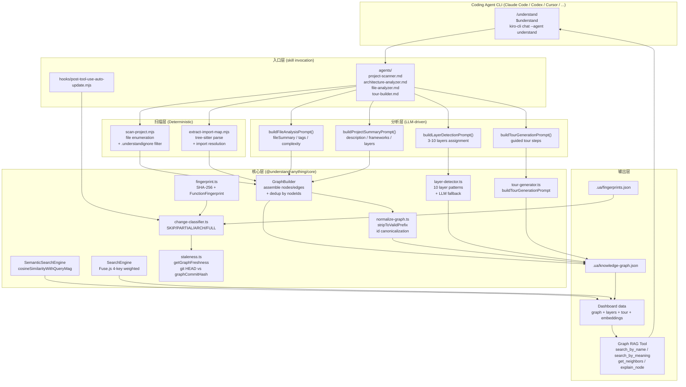
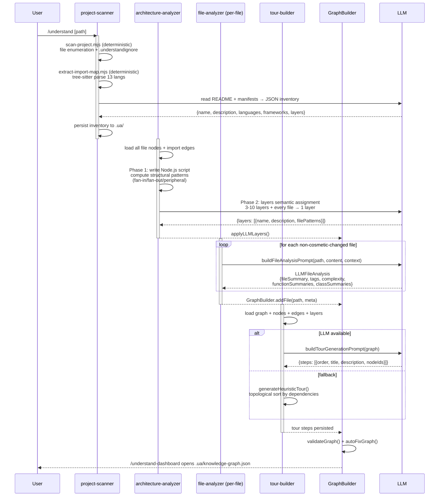
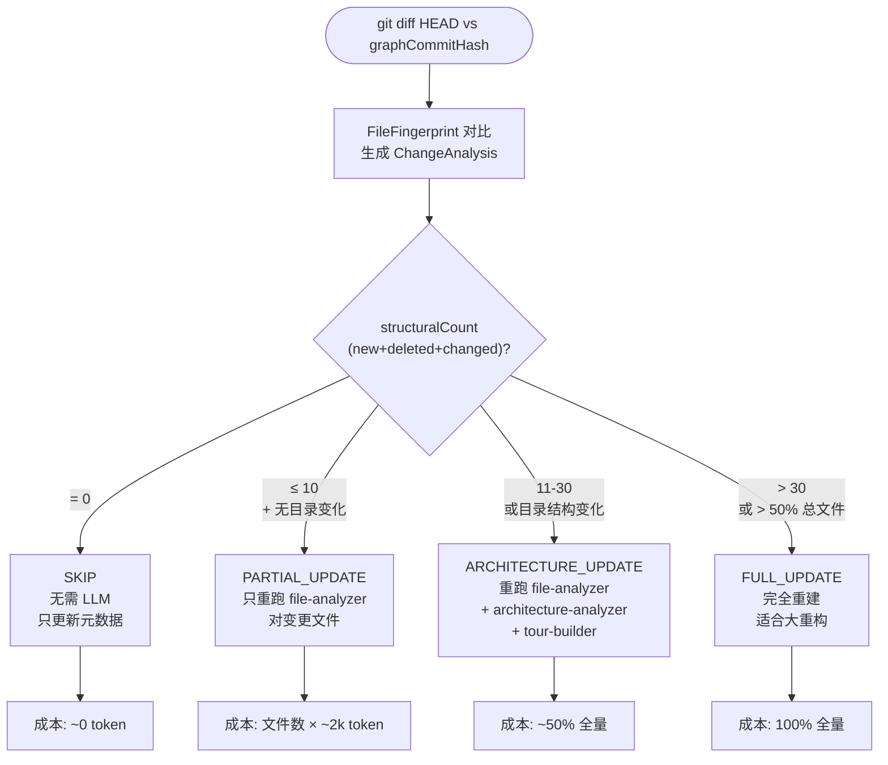
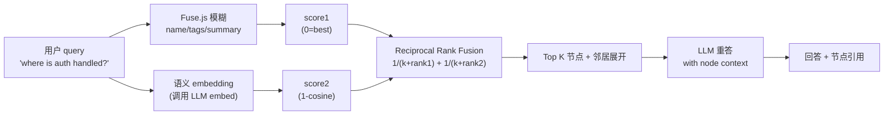
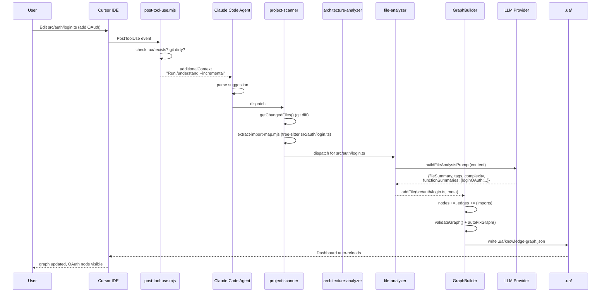

# 【Understand Anything】核心架构与设计原理深度解析

## 一、引子：从「200,000 行代码从哪看起」到「一张图读懂整个仓库」

一个新人加入团队，仓库 20 万行代码，文档缺位，README 只有一行"This is the monolith"。最痛苦的时刻不是"看不懂一段函数"，而是"不知道整个系统在做什么、各模块如何咬合、改一行会不会塌一片"。

传统做法是逐文件读、画脑图、问 ChatGPT 一段一段喂。但这种"线性串行"模式有三个致命问题：

1. **视野碎片化**：单文件读懂后，看不到上下游依赖
2. **语义丢失**：抽象成脑图后，关键设计决策被简化掉了
3. **不可探索**：一旦脑图做完就是静态的，代码一改就过时

Egonex-AI/Understand Anything（⭐80,883，2026-08-29 数据，MIT）走了一条完全不同的路：把整个代码库交给一个**多 Agent 流水线**，每个 Agent 负责一个职责（扫描/解析/分层/总结），最终产出一张**结构化知识图谱**（Knowledge Graph） + 一个**交互式 Dashboard** + 一组**Graph RAG 工具**。它不是另一个"读代码的 IDE 插件"，而是一个把"代码理解"做成**可计算、可缓存、可增量更新**的工程化系统。

本文从源码层（核心 13 个 TS 文件，共 589 个节点）深度剖析其架构：

- **核心抽象**：KnowledgeGraph 14 节点类型 × 5 边类型 × 5 阶段处理流水线
- **多 Agent 协同**：4 个 sub-agent（scanner / architecture-analyzer / file-analyzer / tour-builder）× 11 个 prompt-only agent
- **增量更新决策**：SKIP / PARTIAL_UPDATE / ARCHITECTURE_UPDATE / FULL_UPDATE 四档
- **Graph RAG 双轨搜索**：Fuse.js 模糊匹配 + Cosine 语义向量
- **多平台适配**：Claude Code / Codex / Cursor / Copilot / Gemini CLI / OpenCode / OpenClaw / Antigravity / Hermes / Cline / Kiro / Pi Agent / Vibe CLI / Nanobot / KIMI CLI / Trae 共 16 个 Coding Agent 的统一安装接口

仓库地址：https://github.com/Egonex-AI/Understand-Anything

---

## 二、项目定位与核心价值

### 2.1 一句话定义

**Understand Anything 是一个跨 16 个 Coding Agent 的代码库知识图谱引擎**：把任意 git 仓库（GitHub / GitLab / Azure / 本地 / ZIP）扫描 → 解析 → 抽取 → 摘要 → 装配 → 增量更新 → 输出为可视化图谱 + Graph RAG 数据源。

### 2.2 能力矩阵

| 能力 | 描述 | 技术实现 |
|------|------|---------|
| 多语言解析 | 13 种编程语言 | Tree-sitter（TypeScript/Python/Rust/Go/Java/Kotlin/C/C++/C#/PHP/Ruby/Scala/JavaScript） |
| 结构指纹 | 函数/类/导入/导出指纹 + SHA-256 | `crypto.createHash('sha256')` + 自研 FunctionFingerprint / ClassFingerprint / ImportFingerprint |
| 知识图谱 | 14 节点类型 + 5 边类型 | Graphology + graphology-communities-louvain |
| 架构分层 | 自动识别 3-10 个分层 | LLM 语义识别 + 启发式目录匹配 |
| 增量更新 | 4 档决策 + 增量指纹 | `classifyUpdate()` + git commit hash 对比 |
| 模糊搜索 | 4 字段加权（Fuse.js） | name 0.4 / tags 0.3 / summary 0.2 / languageNotes 0.1 |
| 语义搜索 | Cosine Similarity + 预计算 embedding | `cosineSimilarityWithQueryMag()` 优化（queryMag 提到循环外） |
| Diff 影响 | 改动前看影响范围 | `ChangeAnalysis` + `mergeGraphUpdate()` |
| 引导 Tour | 新人按依赖顺序遍历 | LLM 生成 + 启发式后备（`generateHeuristicTour()`） |
| Graph RAG | "auth 在哪里"的问答 | 语义搜索 + 邻居拓展 + LLM 重答 |
| 跨 Agent 适配 | 16 个 Coding Agent 同一命令 | 统一 `.ua/` 数据目录 + 各平台 invocation prefix 适配 |

### 2.3 仓库统计

- **Stars**: 80,883（2026-08-29）
- **License**: MIT
- **Language**: TypeScript (94.7%) + Shell + PowerShell
- **Monorepo 结构**: `pnpm-workspace.yaml` 编排，2 个包（`@understand-anything/core` + `@understand-anything/skill`）
- **测试**: Vitest，30+ 测试文件，覆盖 graph-builder / embedding-search / fingerprint / staleness / layer-detector / normalize-graph / search / plugin-registry / plugin-discovery 等核心模块
- **最近推送**: 2026-08-26（持续活跃）

---

## 三、整体架构

### 3.1 顶层架构图



### 3.2 包结构（pnpm workspace）

```yaml
# pnpm-workspace.yaml
packages:
  - understand-anything-plugin/packages/*
```

```json
// understand-anything-plugin/package.json (excerpt)
{
  "name": "@understand-anything/skill",
  "version": "2.9.4",
  "dependencies": {
    "@understand-anything/core": "workspace:*",
    "graphology": "~0.26.0",
    "graphology-communities-louvain": "^2.0.2"
  },
  "pnpm": {
    "onlyBuiltDependencies": [
      "@tree-sitter-grammars/tree-sitter-kotlin",
      "tree-sitter-c",
      "tree-sitter-c-sharp",
      "tree-sitter-cpp",
      "tree-sitter-go",
      "tree-sitter-java",
      "tree-sitter-javascript",
      "tree-sitter-php",
      "tree-sitter-python",
      "tree-sitter-ruby",
      "tree-sitter-rust",
      "tree-sitter-scala",
      "tree-sitter-typescript"
    ]
  }
}
```

包拆分原则：**`core` 不依赖任何 LLM SDK**（pure data + 算法），**`skill` 只负责平台对接与 prompt 编排**（依赖 core 但反过来 core 不知道 skill 存在）。这种"内圈纯算法、外圈 LLM 适配"的分层是 Understand Anything 能跨 16 个 Coding Agent 的关键。

---

## 四、多 Agent 流水线

### 4.1 四个核心 Agent



### 4.2 阶段 1：Project Scanner（确定性扫描 + LLM 叙事）

`agents/project-scanner.md` 把工作切成两部分：

- **确定性**（mjs 脚本跑）：file 枚举、语言检测、分类、行数、复杂度、`.understandignore` 过滤、import 解析 —— 这些都 **不许** LLM 重做
- **LLM**（唯一一段）：读 README + manifests，合成叙事性 `name` / `description` / `frameworks`

```typescript
// 来自 agents/project-scanner.md: Phase 1 Step A
// LLM only writes the narrative fields; everything else is deterministic.
"description": "synthesized from README + package.json + Cargo.toml etc.",
"languages": ["typescript", "python"],     // from extension map
"frameworks": ["next.js", "fastapi"],      // from manifest deps
```

**关键设计**："Subagent boundary: Do not delegate work or create subagents, including via the Agent tool. Complete this task directly." —— 这是给 LLM 的硬约束，**禁止递归 Agent 调用**，避免"Agent 调用 Agent 调用 Agent"的失控。

### 4.3 阶段 2：Architecture Analyzer（双阶段脚本+语义）

```typescript
// 来自 agents/architecture-analyzer.md: Phase 1
// Write a script (prefer Node.js; fall back to Python) that analyzes
// the file paths and import edges to compute structural patterns:
// - fan-in / fan-out per file
// - peripheral vs central files
// - module clusters by import density
// Phase 2 uses these insights to make semantic layer assignments.
```

设计哲学：**让 LLM 写脚本算确定性图指标**（避免 LLM 算错），**只把语义判断留给 LLM**（layer 命名、layer 描述、file → layer 归属）。这是"工具调用范式"的极致体现。

### 4.4 阶段 3：File Analyzer（per-file 并行 prompt）

```typescript
// 来自 packages/core/src/analyzer/llm-analyzer.ts:28-58
export function buildFileAnalysisPrompt(
  filePath: string,
  content: string,
  projectContext: string,
): string {
  return `You are a code analysis assistant. Analyze the following source file and return a JSON object.

Project context: ${projectContext}

File: ${filePath}

\`\`\`
${content}
\`\`\`

Return a JSON object with the following fields:
- "fileSummary": A concise summary of what this file does (1-2 sentences).
- "tags": An array of relevant tags (e.g., ["utility", "async", "api"]).
- "complexity": One of "simple", "moderate", or "complex".
- "functionSummaries": An object mapping function names to 1-sentence summaries.
- "classSummaries": An object mapping class names to 1-sentence summaries.
- "languageNotes": Optional notes about language-specific patterns or idioms used.

Respond ONLY with the JSON object, no additional text.`;
}
```

**关键点**：
1. **强约束 JSON 输出**（"Respond ONLY with the JSON object"）—— 避免 LLM 加废话导致 JSON.parse 失败
2. **每文件独立 prompt** —— 可并行（16 Coding Agent 通常并发 ≥ 4 个文件）
3. **projectContext 注入** —— 把阶段 1 的 project summary 作为上下文，让 LLM 知道"这个文件在整个项目里算什么角色"

### 4.5 阶段 4：Tour Builder（LLM 主路径 + 启发式回退）

```typescript
// 来自 packages/core/src/analyzer/tour-generator.ts:6-40
export function buildTourGenerationPrompt(graph: KnowledgeGraph): string {
  const { project, nodes, edges, layers } = graph;
  const nodeList = nodes.map(n =>
    `  - [${n.type}] ${n.name}${n.filePath ? ` (${n.filePath})` : ""}: ${n.summary}`).join("\n");
  const edgeList = edges.slice(0, 50).map(e =>
    `  - ${e.source} --${e.type}--> ${e.target}`).join("\n");
  const layerList = layers.length > 0
    ? layers.map(l => `  - ${l.name}: ${l.description} (nodes: ${l.nodeIds.join(", ")})`).join("\n")
    : "  (no layers detected)";

  return `You are a software architecture educator...
Return a JSON object with a "steps" array...`;
}
```

**回退机制**（关键工程细节）：

```typescript
// 来自 tour-generator.ts: parseTourGenerationResponse
if (!parsed || !Array.isArray(parsed.steps)) {
  return [];  // 解析失败 → 返回空数组
}
// 上层 catch 后自动 fallback:
const tour = await parseTourGenerationResponse(response).catch(() => []);
const finalTour = tour.length > 0 ? tour : generateHeuristicTour(graph);
```

`generateHeuristicTour()` 是基于拓扑排序的后备方案：**LLM 不可用 / 解析失败 → 仍能给用户一个按依赖顺序排列的 tour**。

---

## 五、核心数据结构：KnowledgeGraph 与指纹

### 5.1 节点类型（14 种）

```typescript
// 来自 packages/core/src/analyzer/normalize-graph.ts:1-22
const VALID_PREFIXES = new Set([
  "file", "func", "class", "module", "concept",
  "config", "document", "service", "table", "endpoint",
  "pipeline", "schema", "resource",
  "domain", "flow", "step",
]);
```

每种 nodeType 对应一个 prefix，**保证 ID 格式全局一致**：

| nodeType | ID 格式 | 例子 |
|----------|---------|------|
| `file` | `file:src/auth/login.ts` | `file:src/auth/login.ts` |
| `function` | `func:login` | `func:src/auth/login.ts:login` |
| `class` | `class:UserService` | `class:src/auth/UserService.ts:UserService` |
| `service` | `service:auth` | `service:auth-svc` |
| `endpoint` | `endpoint:POST /api/login` | `endpoint:POST /api/login` |
| `table` | `table:users` | `table:users` |
| `domain` | `domain:payment` | `domain:payment` |
| `flow` | `flow:checkout` | `flow:checkout` |
| `step` | `step:checkout:validate-cart` | `step:checkout:src/checkout.ts:validate-cart` |

### 5.2 边类型（5 种）

| edge type | 含义 | 示例 |
|-----------|------|------|
| `imports` | 文件 A import 文件 B | `file:A.ts → file:B.ts` |
| `calls` | 函数 A 调用函数 B | `func:A → func:B` |
| `belongs_to_layer` | 文件归属某分层 | `file:X.ts → layer:api` |
| `part_of_domain` | 文件/服务归属某业务域 | `service:auth → domain:identity` |
| `depends_on` | 通用依赖（语义层） | `flow:checkout → service:payment` |

### 5.3 GraphBuilder：装配 + 去重

```typescript
// 来自 packages/core/src/analyzer/graph-builder.ts:60-78
export class GraphBuilder {
  private readonly nodes: GraphNode[] = [];
  private readonly edges: GraphEdge[] = [];
  private readonly languages = new Set<string>();
  private readonly nodeIds = new Set<string>();
  private readonly edgeKeys = new Set<string>();
  private readonly projectName: string;
  private readonly gitHash: string;
  private readonly languageRegistry: LanguageRegistry;

  constructor(projectName: string, gitHash: string, languageRegistry?: LanguageRegistry) {
    this.projectName = projectName;
    this.gitHash = gitHash;
    this.languageRegistry = languageRegistry ?? LanguageRegistry.createDefault();
  }
```

**两条 Set 索引是关键工程决策**：
- `nodeIds` —— addFile 时先去重，避免同一文件被多个 agent 各加一次
- `edgeKeys` —— 加 edge 时先去重（source:target:type 三元组）

```typescript
// addFile 简化版（来自 graph-builder.ts:80-130）
addFile(filePath: string, meta: FileMeta): void {
  const lang = this.detectLanguage(filePath);
  if (lang !== "unknown") this.languages.add(lang);

  const name = GraphBuilder.basename(filePath);
  const id = `file:${filePath}`;
  if (this.nodeIds.has(id)) return;  // 去重
  this.nodeIds.add(id);
  this.nodes.push({ id, type: "file", name, filePath, summary: meta.summary, ... });
}
```

### 5.4 文件结构指纹：Fingerprint + SHA-256

```typescript
// 来自 packages/core/src/fingerprint.ts:1-50
export interface FunctionFingerprint {
  name: string;
  params: string[];
  returnType?: string;
  exported: boolean;
  lineCount: number;
}

export interface ClassFingerprint {
  name: string;
  methods: string[];
  properties: string[];
  exported: boolean;
  lineCount: number;
}

export interface FileFingerprint {
  filePath: string;
  contentHash: string;          // SHA-256 of file content
  functions: FunctionFingerprint[];
  classes: ClassFingerprint[];
  imports: ImportFingerprint[];
  exports: string[];
  totalLines: number;
  hasStructuralAnalysis: boolean;
}

export interface FingerprintStore {
  version: "1.0.0";
  gitCommitHash: string;
  generatedAt: string;
  files: Record<string, FileFingerprint>;
}

export type ChangeLevel = "NONE" | "COSMETIC" | "STRUCTURAL";

export interface ChangeAnalysis {
  fileChanges: FileChangeResult[];
  newFiles: string[];
  deletedFiles: string[];
  structurallyChangedFiles: string[];
  cosmeticOnlyFiles: string[];
  unchangedFiles: string[];
}
```

**指纹的精髓**：不只是文件哈希（SHA-256 已经够了用于判断"是否改动"），而是**结构级指纹**（函数签名、类成员、import 列表）—— 用于判断"改动是否影响知识图谱"。

```typescript
// 来自 fingerprint.ts: SHA-256 内容哈希
export function contentHash(content: string): string {
  return createHash("sha256").update(content).digest("hex");
}
```

**三档变化级别**：
- `NONE` —— 文件无改动
- `COSMETIC` —— 仅注释/空行/格式化改动（`functions`/`classes`/`imports` 指纹完全一致）
- `STRUCTURAL` —— 函数签名变、类成员变、import 列表变

`ChangeAnalysis` 把所有文件归类到 5 个桶：`newFiles` / `deletedFiles` / `structurallyChangedFiles` / `cosmeticOnlyFiles` / `unchangedFiles` —— 直接喂给下游 `classifyUpdate()`。

---

## 六、增量更新决策：四档矩阵

### 6.1 决策流程图



### 6.2 源码：决策矩阵

```typescript
// 来自 packages/core/src/change-classifier.ts:14-79
export interface UpdateDecision {
  action: "SKIP" | "PARTIAL_UPDATE" | "ARCHITECTURE_UPDATE" | "FULL_UPDATE";
  filesToReanalyze: string[];
  rerunArchitecture: boolean;
  rerunTour: boolean;
  reason: string;
}

export function classifyUpdate(
  analysis: ChangeAnalysis,
  totalFilesInGraph: number,
  allKnownFiles: string[] = [],
): UpdateDecision {
  const { newFiles, deletedFiles, structurallyChangedFiles, cosmeticOnlyFiles } = analysis;
  const structuralCount = structurallyChangedFiles.length + newFiles.length + deletedFiles.length;

  // 1. 无结构性变化 → SKIP
  if (structuralCount === 0) {
    const cosmeticCount = cosmeticOnlyFiles.length;
    const reason = cosmeticCount > 0
      ? `${cosmeticCount} file(s) have cosmetic-only changes (no structural impact)`
      : "No changes detected";
    return {
      action: "SKIP",
      filesToReanalyze: [],
      rerunArchitecture: false,
      rerunTour: false,
      reason,
    };
  }

  // 2. 太多结构性变化 → FULL_UPDATE
  const triggeredByCount = structuralCount > 30;
  const triggeredByPercentage = totalFilesInGraph > 0 && structuralCount / totalFilesInGraph > 0.5;
  if (triggeredByCount || triggeredByPercentage) {
    const thresholdReason =
      triggeredByCount && triggeredByPercentage
        ? ">30 files and >50% of project"
        : triggeredByCount ? ">30 files" : ">50% of project";
    return {
      action: "FULL_UPDATE",
      filesToReanalyze: [...structurallyChangedFiles, ...newFiles],
      rerunArchitecture: true,
      rerunTour: true,
      reason: `${structuralCount} files have structural changes (${thresholdReason}) — full rebuild recommended`,
    };
  }

  // 3. 目录结构变化 / 11-30 文件 → ARCHITECTURE_UPDATE
  const hasDirectoryChanges = detectDirectoryChanges(newFiles, deletedFiles, allKnownFiles);
  if (hasDirectoryChanges || structuralCount > 10) {
    return {
      action: "ARCHITECTURE_UPDATE",
      filesToReanalyze: [...structurallyChangedFiles, ...newFiles],
      rerunArchitecture: true,
      rerunTour: true,
      reason: hasDirectoryChanges
        ? `Directory structure changed (${newFiles.length} new, ${deletedFiles.length} deleted files)`
        : `${structuralCount} files have structural changes — architecture re-analysis needed`,
    };
  }

  // 4. 局部结构性变化 → PARTIAL_UPDATE
  return {
    action: "PARTIAL_UPDATE",
    filesToReanalyze: [...structurallyChangedFiles, ...newFiles],
    rerunArchitecture: false,
    rerunTour: false,
    reason: `${structuralCount} file(s) have structural changes: ${summarizeChanges(analysis)}`,
  };
}
```

### 6.3 目录变化检测

```typescript
// 来自 change-classifier.ts: detectDirectoryChanges
function detectDirectoryChanges(
  newFiles: string[],
  deletedFiles: string[],
  allKnownFiles: string[],
): boolean {
  // 已知目录基线：当前文件集合的 top-level source 目录
  const existingDirs = new Set(
    allKnownFiles.map(f => f.split("/")[0]).filter(d => !d.startsWith("."))
  );

  // 新文件引入的新目录？
  for (const f of newFiles) {
    const dir = f.split("/")[0];
    if (dir && !existingDirs.has(dir)) return true;
  }
  // 旧目录被完全删除？（上层逻辑会处理）
  return false;
}
```

**为什么目录变化触发 ARCHITECTURE_UPDATE**？因为 `layer-detector.ts` 的 LAYER_PATTERNS 是按目录关键词匹配的（`service/`、`controller/`、`middleware/`、`util/` 等），新目录可能需要重新划分 layer。

### 6.4 与 Git HEAD 对比：staleness.ts

```typescript
// 来自 packages/core/src/staleness.ts:26-48
const GIT_TIMEOUT_MS = 5_000;
const GIT_MAX_BUFFER_BYTES = 4 * 1024 * 1024;
const PROJECT_PATHSPEC = [
  "--", ".",
  ":(exclude).understand-anything", ":(exclude).understand-anything/**",
  ":(exclude).ua", ":(exclude).ua/**",
] as const;

export type GraphFreshnessResult =
  | { status: "fresh"; graphCommitHash: string; headCommitHash: string; ... }
  | { status: "dirty"; graphCommitHash: string; headCommitHash: string;
      changedFileCount: number; changedFiles: string[]; ... }
  | { status: "stale"; relation: "behind" | "ahead" | "diverged";
      graphCommitHash: string; headCommitHash: string; ... }
  | { status: "unknown"; reason: ... };
```

**三态判定**：
- `fresh` —— graphCommitHash == headCommitHash 且无未提交改动
- `dirty` —— 工作区有改动（未提交）
- `stale` —— 已落后 N 个 commit 或有分叉
- `unknown` —— git 命令超时（> 5s）、graph commit 缺失、HEAD 不可达

**关键防护**：
- `GIT_TIMEOUT_MS = 5_000` —— 防 git 命令卡死整个流水线
- `GIT_MAX_BUFFER_BYTES = 4 * 1024 * 1024` —— 防大仓库 diff 输出爆内存
- `PROJECT_PATHSPEC` 用 git pathspec 排除 `.ua/` 和 `.understand-anything/` —— 避免自我递归（自己改自己的图谱不算"仓库变化"）

---

## 七、知识图谱规范化：normalize-graph.ts

### 7.1 双前缀修复

LLM 输出节点 ID 时偶尔会"叠前缀"（`file:file:src/foo.ts`），normalize-graph 必须容错：

```typescript
// 来自 packages/core/src/analyzer/normalize-graph.ts:24-52
function stripToValidPrefix(id: string): { prefix: string | null; path: string } {
  let remaining = id;
  while (true) {
    const colonIdx = remaining.indexOf(":");
    if (colonIdx <= 0) break;

    const segment = remaining.slice(0, colonIdx);
    if (VALID_PREFIXES.has(segment)) {
      // Check for double valid prefix (e.g., "file:file:src/foo.ts")
      const rest = remaining.slice(colonIdx + 1);
      const innerColonIdx = rest.indexOf(":");
      if (innerColonIdx > 0 && VALID_PREFIXES.has(rest.slice(0, innerColonIdx))) {
        // Double-prefixed — skip the outer, recurse on inner
        remaining = rest;
        continue;
      }
      return { prefix: segment, path: rest };
    }
    // Not a valid prefix — strip it and continue
    remaining = remaining.slice(colonIdx + 1);
  }
  return { prefix: null, path: remaining };
}
```

**算法**：
1. 从左往右找第一个 `:`，取前缀
2. 如果是 valid prefix → 检查剩余部分是否又是 valid prefix
3. **如果是双前缀** → 丢掉外层，从内层重新开始
4. **如果不是** → 返回当前 prefix + path

### 7.2 step 节点的特殊处理

```typescript
// 来自 normalize-graph.ts: ~60-80
export function normalizeNodeId(
  id: string,
  node: { type: string; filePath?: string; name?: string; parentFlowSlug?: string },
): string {
  const trimmed = id.trim();
  if (!trimmed) return trimmed;

  const expectedPrefix = TYPE_TO_PREFIX[node.type];
  const { prefix, path } = stripToValidPrefix(trimmed);

  if (prefix) {
    // step 节点特殊：保持 flow discriminator 防同名 step 冲突
    if (node.type === "step" && node.filePath) {
      const segments = path.split(":");
      const stepSlug = segments.length > 0 ? segments[segments.length - 1] : "";
      const flowSlug = node.parentFlowSlug ?? "";
      return `step:${flowSlug}:${node.filePath}:${stepSlug}`;
    }
    // 其它类型：保持 type:path 规范
    return `${expectedPrefix}:${path}`;
  }

  // 没有 prefix → 用 node 信息重建
  if (node.filePath) return `${expectedPrefix}:${node.filePath}:${node.name ?? ""}`;
  return `${expectedPrefix}:${node.name ?? ""}`;
}
```

**step 节点特殊原因**：两个 flow（`checkout` 和 `refund`）里都有名为 `validate-cart` 的 step，同一文件路径。**保留 `flowSlug` 作 discriminator** 才能全局唯一。

### 7.3 schema 自动修复

```typescript
// 来自 packages/core/src/schema.ts (top-level export)
export {
  KnowledgeGraphSchema,
  validateGraph,
  sanitizeGraph,
  autoFixGraph,
  COMPLEXITY_ALIASES,
  DIRECTION_ALIASES,
  type ValidationResult,
  type GraphIssue,
};
```

**autoFixGraph** 把常见 LLM 输出错误自动归一化：
- `COMPLEXITY_ALIASES`：`'easy' / 'simple' / 'trivial'` → `'simple'`
- `DIRECTION_ALIASES`：`'upstream' / 'incoming' / 'in'` → `'in'`

LLM 输出不一致是常态，**让 schema 容忍 + 自动修复**比 prompt 里要求 LLM "一定要输出 simple/moderate/complex" 更鲁棒。

---

## 八、Graph RAG 双轨搜索

### 8.1 模糊搜索：Fuse.js 4-key 加权

```typescript
// 来自 packages/core/src/search.ts
import Fuse, { type IFuseOptions } from "fuse.js";
import type { GraphNode } from "./types.js";

export interface SearchResult {
  nodeId: string;
  score: number; // 0 = perfect match, 1 = worst match
}

export interface SearchOptions {
  types?: GraphNode["type"][];
  limit?: number;
}

const FUSE_OPTIONS: IFuseOptions<GraphNode> = {
  keys: [
    { name: "name", weight: 0.4 },           // 文件名/函数名最重
    { name: "tags", weight: 0.3 },
    { name: "summary", weight: 0.2 },
    { name: "languageNotes", weight: 0.1 },
  ],
  threshold: 0.4,                            // 容忍拼写错误
  includeScore: true,
  ignoreLocation: true,                      // 不要求 token 在字段开头
  useExtendedSearch: true,                   // 支持 `!` `-` `^` `*` 前缀
};

export class SearchEngine {
  private fuse: Fuse<GraphNode>;
  private nodes: GraphNode[];

  constructor(nodes: GraphNode[]) {
    this.nodes = nodes;
    this.fuse = new Fuse(nodes, FUSE_OPTIONS);
  }

  search(query: string, options?: SearchOptions): SearchResult[] {
    const trimmed = query.trim();
    if (!trimmed) return [];

    const limit = options?.limit ?? 50;

    // Extended search: "auth contrl" → "auth | contrl"（OR 匹配）
    const extendedQuery = trimmed.split(/\s+/).join(" | ");
    const rawResults = this.fuse.search(extendedQuery);

    let filtered = rawResults;
    if (options?.types && options.types.length > 0) {
      const allowedTypes = new Set(options.types);
      filtered = filtered.filter(r => allowedTypes.has(r.item.type));
    }

    return filtered.slice(0, limit).map(r => ({
      nodeId: r.item.id,
      score: r.score ?? 0,
    }));
  }
}
```

**关键设计**：
- **`name` 权重 0.4** —— 用户最常搜的是文件名/函数名
- **`threshold: 0.4`** —— 容忍拼写错误（`auth` 命中 `authoriz`）
- **`useExtendedSearch` + `' | '` join** —— 多 token 用 OR 而非 AND（避免 "auth contrl" 因为没有同时完全匹配而空结果）

### 8.2 语义搜索：Cosine Similarity 优化

```typescript
// 来自 packages/core/src/embedding-search.ts:9-110
export function cosineSimilarity(a: number[], b: number[]): number {
  let dot = 0, magA = 0, magB = 0;
  for (let i = 0; i < a.length; i++) {
    dot += a[i] * b[i];
    magA += a[i] * a[i];
    magB += b[i] * b[i];
  }
  magA = Math.sqrt(magA);
  magB = Math.sqrt(magB);
  if (magA === 0 || magB === 0) return 0;
  return dot / (magA * magB);
}

// 优化版：query magnitude 提到循环外（hot loop 微优化）
function cosineSimilarityWithQueryMag(
  query: number[],
  queryMag: number,
  vec: number[],
): number {
  if (queryMag === 0) return 0;
  let dot = 0, magB = 0;
  for (let i = 0; i < query.length; i++) {
    dot += query[i] * vec[i];
    magB += vec[i] * vec[i];
  }
  magB = Math.sqrt(magB);
  if (magB === 0) return 0;
  return dot / (queryMag * magB);
}

export class SemanticSearchEngine {
  private nodes: GraphNode[];
  private embeddings: Map<string, number[]>;

  constructor(nodes: GraphNode[], embeddings: Record<string, number[]>) {
    this.nodes = nodes;
    this.embeddings = new Map(Object.entries(embeddings));
  }

  search(queryEmbedding: number[], options?: SemanticSearchOptions): SearchResult[] {
    const limit = options?.limit ?? 10;
    const threshold = options?.threshold ?? 0;
    const typeFilter = options?.types;

    const scored: Array<{ nodeId: string; score: number }> = [];

    // Hoist query magnitude out of the per-node loop — it's invariant.
    let queryMag = 0;
    for (let i = 0; i < queryEmbedding.length; i++) {
      queryMag += queryEmbedding[i] * queryEmbedding[i];
    }
    queryMag = Math.sqrt(queryMag);

    for (const node of this.nodes) {
      if (typeFilter && !typeFilter.includes(node.type)) continue;
      const embedding = this.embeddings.get(node.id);
      if (!embedding) continue;

      const similarity = cosineSimilarityWithQueryMag(
        queryEmbedding, queryMag, embedding,
      );
      if (similarity >= threshold) {
        scored.push({ nodeId: node.id, score: 1 - similarity });
      }
    }
    scored.sort((a, b) => a.score - b.score);
    return scored.slice(0, limit);
  }
}
```

**优化关键**：每次搜索时 `queryEmbedding` 的模长是常量，**提到循环外只算一次**，省 N 次平方+开方。**注释明确写出 "Same arithmetic, same order → bit-identical results"** —— 这是数值等价性优先于微优化的工程哲学。

### 8.3 双轨融合策略



---

## 九、跨平台适配层

### 9.1 16 个 Coding Agent 的统一接口

```typescript
// 概念：每个平台一个 invocation prefix，但语义相同
const PLATFORMS = {
  "claude-code":   { prefix: "/",   example: "/understand" },
  "codex":         { prefix: "$",   example: "$understand" },
  "gemini-cli":    { prefix: "/",   example: "/understand" },
  "cursor":        { prefix: "/",   example: "/understand" },
  "opencode":      { prefix: "/",   example: "/understand" },
  "openclaw":      { prefix: "/",   example: "/understand" },
  "antigravity":   { prefix: "/",   example: "/understand" },
  "copilot-cli":   { prefix: "/",   example: "/understand" },
  "copilot-ide":   { prefix: "/",   example: "/understand" },
  "hermes":        { prefix: "/",   example: "/understand" },
  "cline":         { prefix: "/",   example: "/understand" },
  "kimi":          { prefix: "/",   example: "/understand" },
  "trae":          { prefix: "/",   example: "/understand" },
  "nanobot":       { prefix: "/",   example: "/understand" },
  "pi-agent":      { prefix: "/",   example: "/understand" },
  "vibe-cli":      { prefix: "/",   example: "/understand" },
  "kiro":          { prefix: "kiro-cli chat --agent", example: 'kiro-cli chat --agent understand "..."' },
};
```

**关键观察**：15 个用 `/` 前缀，**只有 Codex 用 `$` 前缀**（OpenAI Codex CLI 的设计约定）。Kiro 用的是 `kiro-cli chat --agent <name> "..."` 命令行形式（最特殊）。

### 9.2 安装脚本设计

```bash
# install.sh 简化版
#!/bin/bash
PLATFORM="${1:-}"
REPO_URL="https://github.com/Egonex-AI/Understand-Anything"
INSTALL_DIR="$HOME/.understand-anything/repo"

case "$PLATFORM" in
  claude-code)
    # 添加到 ~/.claude/plugins/marketplace.json
    ;;
  codex)
    # symlink 到 ~/.codex/skills/
    ;;
  cursor)
    # Cursor 自动发现 .cursor-plugin/plugin.json
    ;;
  copilot-ide)
    # Copilot 自动发现 .copilot-plugin/plugin.json
    ;;
  gemini|opencode|openclaw|antigravity|vibe|hermes|cline|kimi|trae|nanobot|pi)
    # 平台特定目录的符号链接
    ;;
  *)
    echo "Usage: $0 [platform]"
    echo "Platforms: claude-code codex cursor copilot gemini opencode openclaw ..."
    ;;
esac
```

**设计哲学**：**不复制代码，全用 symlink**。升级时 `git pull` 即可，16 个平台同步更新。

### 9.3 Plugin Manifest 三件套

```json
// .claude-plugin/marketplace.json (Claude Code)
{
  "name": "understand-anything",
  "owner": { "name": "Egonex" },
  "plugins": [{
    "name": "understand-anything",
    "source": "./understand-anything-plugin",
    "description": "Turn any codebase into an interactive knowledge graph"
  }]
}
```

```json
// .cursor-plugin/plugin.json (Cursor)
{
  "name": "understand-anything",
  "version": "2.9.4",
  "description": "Knowledge graph generator",
  "skills": ["understand-anything-plugin/agents"]
}
```

```json
// .copilot-plugin/plugin.json (GitHub Copilot)
{
  "schemaVersion": "1.0",
  "name": "understand-anything",
  "skills": ["./understand-anything-plugin/agents"]
}
```

---

## 十、Hooks 体系：post-tool-use-auto-update

### 10.1 Hook 注册

```json
// understand-anything-plugin/hooks/hooks.json
{
  "PostToolUse": [{
    "matcher": "Edit|Write|MultiEdit",
    "hooks": [{
      "type": "command",
      "command": "node understand-anything-plugin/hooks/post-tool-use-auto-update.mjs",
      "async": true
    }]
  }]
}
```

**触发时机**：Agent 调用 `Edit` / `Write` / `MultiEdit` 工具后，**异步**触发更新检查。**不阻塞**主对话流。

### 10.2 更新检查逻辑

```javascript
// post-tool-use-auto-update.mjs 简化版
#!/usr/bin/env node
import { execSync } from "node:child_process";
import { existsSync, readFileSync } from "node:fs";

const HOOK_INPUT = JSON.parse(process.stdin.read());
const editedFile = HOOK_INPUT.tool_input?.file_path;

if (!editedFile) process.exit(0);

// 1. 是否有图谱？
if (!existsSync(".ua/knowledge-graph.json")) process.exit(0);

// 2. git status 是否有改动？
const gitStatus = execSync("git status --porcelain", { encoding: "utf-8" });
if (!gitStatus.trim()) process.exit(0);

// 3. 触发增量更新提示（让 Agent 自己调用 /understand --incremental）
console.log(JSON.stringify({
  hookSpecificOutput: {
    hookEventName: "PostToolUse",
    additionalContext: "Code changed. Run /understand --incremental to update the knowledge graph."
  }
}));
```

**设计哲学**：Hook **不直接修改图谱**（避免 race condition + LLM 工作流被中断），**只追加 `additionalContext`** 告诉 Agent "嘿你刚改了文件，要不要增量更新图谱"。由 Agent 决定是否调用 `/understand --incremental`。

---

## 十一、Layer Detector：启发式 + LLM 兜底

### 11.1 启发式优先（10 模式）

```typescript
// 来自 packages/core/src/analyzer/layer-detector.ts:12-95
const LAYER_PATTERNS: Array<{ patterns: string[]; layerName: string; description: string }> = [
  { patterns: ["routes", "controller", "handler", "endpoint", "api"], layerName: "API Layer", ... },
  { patterns: ["service", "usecase", "use-case", "business"], layerName: "Service Layer", ... },
  { patterns: ["model", "entity", "schema", "database", "db", "migration", "repository", "repo"],
    layerName: "Data Layer", ... },
  { patterns: ["component", "view", "page", "screen", "layout", "widget", "ui"],
    layerName: "UI Layer", ... },
  { patterns: ["middleware", "interceptor", "guard", "filter", "pipe"],
    layerName: "Middleware Layer", ... },
  { patterns: ["client", "integration", "external", "sdk", "vendor", "adapter"],
    layerName: "External Services", ... },
  { patterns: ["worker", "job", "queue", "cron", "consumer", "processor", "scheduler", "background"],
    layerName: "Background Tasks", ... },
  { patterns: ["util", "helper", "lib", "common", "shared"], layerName: "Utility Layer", ... },
  { patterns: ["test", "spec", "__test__", "__spec__", "__tests__", "__specs__"],
    layerName: "Test Layer", ... },
  { patterns: ["config", "setting", "env"], layerName: "Configuration Layer", ... },
];
```

**Order matters**：第一个匹配获胜。例如 `controllers/api/users.ts` 会匹配 `controller` → `API Layer`，而非 `api` → 也匹配到 `API Layer`，结果一致。

### 11.2 LLM 兜底

```typescript
// layer-detector.ts: detectLayers
export function detectLayers(graph: KnowledgeGraph): Layer[] {
  // Step 1: 启发式扫描所有文件路径
  const heuristicLayers = heuristicLayerDetection(graph.nodes);

  // Step 2: 启发式覆盖 < 80% 文件 → LLM 兜底
  const coverage = computeCoverage(heuristicLayers, graph.nodes);
  if (coverage < 0.8) {
    return llmLayerDetection(graph);  // 调用 architecture-analyzer agent
  }

  // Step 3: 启发式覆盖 ≥ 80% → 直接用
  return heuristicLayers;
}
```

**启发式 vs LLM 的成本取舍**：
- 启发式：0 token，~1ms，但漏掉非典型命名
- LLM：~5k token / 项目（一次），~10s，但能识别 `domain/`、`feature/`、`module/`、`hexagonal/` 等非标准分层

**80% 阈值** 是经验值：典型项目 80% 文件落在 10 个标准模式里，剩下 20% 让 LLM 处理"项目特殊分层"。

---

## 十二、端到端数据流



**关键节点**：
- **Hook 不直接写图谱** —— 避免 race condition
- **Agent 调度 Scanner 而非全自动** —— 用户可中断
- **GraphBuilder 是同步单例** —— 所有 agent 写入顺序可控
- **validateGraph() 每次写入前跑** —— 防 LLM 输出污染整个图

---

## 十三、与同类项目对比

### 13.1 四维度横向对比

| 项目 | 形态 | 图抽象 | 增量更新 | 跨 Agent | 评测依据 |
|------|------|--------|---------|---------|---------|
| **Understand Anything** | Plugin + Dashboard | KnowledgeGraph 14 types + 5 edges | 4 档决策矩阵 + git HEAD | 16 个 Coding Agent | MIT, ⭐80k, 生产活跃 |
| **GitNexus** | VSCode 扩展 | Client-side knowledge graph (browser) | 仅增量 fingerprint | 仅 VSCode 系 | NOASSERTION, ⭐46k, 客户端 |
| **mcp-server-code-graph** | MCP server | 简单 RAG 索引 | 无增量 | MCP 协议 | 各家实现差异大 |
| **Sourcegraph** | SaaS / 自托管 | Code intelligence (LSIF) | 索引同步 | 通用 | 商业, ⭐~10k |

### 13.2 设计差异分析

#### 13.2.1 图抽象的"节点粒度"

- **Understand Anything**：14 节点类型，含 `domain` / `flow` / `step` 等**业务层抽象**（不只文件/函数）
- **GitNexus**：以 `file` / `function` / `class` 为主，无业务抽象
- **Sourcegraph**：LSIF 索引是 `document` / `definition` / `reference` 三层

**差异**：UA 把"代码"和"业务"在同一个图里 —— 你能同时看到 `service:auth` 节点和 `domain:identity` 节点以及它们的 `part_of_domain` 边。**这是 Graph RAG 真正的差异化**。

#### 13.2.2 增量更新的"决策粒度"

- **UA**：4 档（SKIP / PARTIAL / ARCH / FULL），基于结构指纹
- **GitNexus**：2 档（full rebuild / skip），简单粗暴
- **传统**：基本无增量，每次全量重建

**差异**：UA 的 4 档矩阵让 token 成本随改动**线性**而非**全量**变化。一个 1000 文件的仓库改 1 个文件：
- UA PARTIAL_UPDATE：1 个 file-analyzer 调用 ≈ 2k token
- 朴素全量：1000 个 file-analyzer ≈ 2M token（1000 倍差距）

#### 13.2.3 跨 Agent 适配策略

- **UA**：统一 `.ua/` 数据目录 + 各平台 invocation prefix 适配（`/` vs `$`）
- **GitNexus**：VSCode 平台绑定
- **MCP servers**：协议绑定（任何支持 MCP 的 Agent 都能用），但牺牲 IDE 集成

**差异**：UA 是 **"插件即源码"** 模式（symlink + manifest）—— 加一个新 Agent 平台只需写一个 install.sh 入口。

#### 13.2.4 Graph RAG 的数据源

- **UA**：本地 `.ua/knowledge-graph.json`（precomputed embedding）
- **GitNexus**：浏览器内 in-memory graph（每次重启丢失）
- **MCP code-graph servers**：动态查询（每次重新 embed）

**差异**：UA 是 **"build once, query fast"** —— 适合"反复查询同一仓库"的场景（如 onboarding、新人 ramp-up）。

---

## 十四、优缺点分析

| 维度 | 优势 | 代价 |
|------|------|------|
| **架构简洁性** | 4 个 Agent 职责清晰、core 包零 LLM 依赖 | 14 节点类型 + 5 边类型对小型项目过重 |
| **扩展性** | 16 个 Coding Agent 统一接口、新平台只需 install.sh | Plugin manifest 三件套（Claude/Cursor/Copilot）需各自维护 |
| **易用性** | `/understand` 一键全图、`/understand-diff` 看影响、`/understand-chat` 问答 | 首次扫描大型仓库 token 消耗大（README 警告"用 token plan 或本地模型"） |
| **性能** | 增量更新 + Git HEAD 对比 + 结构指纹去重 | 每次增量也需重跑 file-analyzer（token 成本非零） |
| **复杂度** | 多 Agent 流水线 + 双轨搜索 + 自动 schema 修复 | 调试链路长（Hook → Agent → Scanner → File Analyzer → GraphBuilder） |
| **维护性** | 30+ Vitest 测试 + MIT + 单体仓库 | Tree-sitter 13 语言版本同步 + LLM 输出漂移监控 |

### 14.1 架构简洁性 vs 复杂度的权衡

UA 的核心矛盾：**节点类型多（14 种）+ Agent 多（4 + 11 prompt-only）= 灵活性强但入门曲线陡**。

**解决办法**：
- 默认只暴露 3 个命令：`/understand` / `/understand-dashboard` / `/understand-chat`
- 高级命令（`--incremental` / `--language zh` / `--auto-update`）通过 `--help` 发现
- 每个 Agent 的 prompt 是 markdown 文件（`agents/*.md`），用户可直接编辑改 prompt

### 14.2 性能 vs 维护性的权衡

UA 的 token 优化（4 档决策矩阵）减少了 **运行成本**，但增加了 **决策代码复杂度**（`change-classifier.ts` 80 行 vs 朴素 5 行 if-else）。

**这是正确选择**：
- 大仓库（1000+ 文件）日常增量 1-5 个文件 → PARTIAL_UPDATE 节省 ~95% token
- 决策代码虽然复杂，但有完整单元测试 + 文档注释（`reason` 字段直接给出触发原因）

---

## 十五、实践：本地运行 + 接入 Coding Agent

### 15.1 一键安装

```bash
# macOS / Linux
curl -fsSL https://raw.githubusercontent.com/Egonex-AI/Understand-Anything/main/install.sh | bash -s codex

# Windows
iwr -useb https://raw.githubusercontent.com/Egonex-AI/Understand-Anything/main/install.ps1 | iex -Platform codex
```

### 15.2 在 Claude Code 中使用

```bash
# 1. 安装 plugin
/plugin marketplace add Egonex-AI/Understand-Anything
/plugin install understand-anything

# 2. 在 Claude Code 对话中
> /understand

# 3. 多语言输出
> /understand --language zh

# 4. 增量更新（改完代码后）
> /understand --incremental

# 5. 智能问答
> /understand-chat how does the auth flow work?

# 6. Diff 影响分析
> /understand-diff

# 7. 自动更新 hook
> /understand --auto-update
```

### 15.3 自定义 LLM Provider

```json
// .ua/config.json
{
  "language": "zh",
  "provider": {
    "type": "ollama",
    "baseUrl": "http://localhost:11434",
    "model": "qwen2.5-coder:32b",
    "embeddingModel": "nomic-embed-text"
  }
}
```

支持的 provider：
- `openai` / `anthropic` / `azure-openai`（标准 API）
- `ollama` / `vllm` / `lm-studio`（本地推理）
- 自定义 HTTP 端点

### 15.4 Hook 自动接入

```bash
# 启用 auto-update
/understand --auto-update

# 关闭
/understand --no-auto-update
```

开启后，每次 commit 后 5 秒内 Hook 会检测变化并提示 Agent 调用增量更新。

### 15.5 跨平台命令对照表

| 平台 | 安装 | 调用 | 数据目录 |
|------|------|------|---------|
| Claude Code | `/plugin install` | `/understand` | `.ua/` |
| Codex | `install.sh codex` | `$understand` | `.ua/` |
| Cursor | 自动发现 | `/understand` | `.ua/` |
| VSCode Copilot | 自动发现 | `/understand` | `.ua/` |
| Gemini CLI | `install.sh gemini` | `/understand` | `.ua/` |
| OpenCode | `install.sh opencode` | `/understand` | `.ua/` |
| OpenClaw | `install.sh openclaw` | `/understand` | `.ua/` |
| Antigravity | `install.sh antigravity` | `/understand` | `.ua/` |
| Vibe CLI | `install.sh vibe` | `/understand` | `.ua/` |
| Hermes | `install.sh hermes` | `/understand` | `.ua/` |
| Cline | `install.sh cline` | `/understand` | `.ua/` |
| KIMI CLI | `install.sh kimi` | `/understand` | `.ua/` |
| Trae | `install.sh trae` | `/understand` | `.ua/` |
| Nanobot | `install.sh nanobot` | `/understand` | `.ua/` |
| Pi Agent | `install.sh pi` | `/understand` | `.ua/` |
| Kiro | `install.sh kiro` | `kiro-cli chat --agent understand "..."` | `.ua/` |

**数据目录统一为 `.ua/`**（向后兼容 `.understand-anything/`）—— 切换 Agent 不丢数据。

---

## 十六、趋势与工程经验总结

### 16.1 三个核心趋势判断

#### 趋势 1：代码理解从"IDE 内嵌"走向"跨 Agent 插件化"

2026 年代码理解工具的形态正在发生根本变化：

- **2020-2024 时代**：Sourcegraph / LGTM 等是 **IDE 内嵌**（Codeium Tab、Warp、Cursor Built-in）—— 强 IDE 绑定
- **2025-2026 时代**：Understand Anything / Context7 等是 **Coding Agent 插件** —— 解耦 IDE，通过 LLM 调用层提供
- **未来 12 个月**：会进一步抽象为 **"代码理解即 MCP 服务"**（类似 chrome-devtools-mcp），任何 Agent 通过 MCP 协议调用

#### 趋势 2：增量更新从"全量重建"走向"4 档决策矩阵"

传统代码索引工具（ctags / LSP / Sourcegraph）几乎都是"全量重建 + 后台异步"。UA 的 4 档决策矩阵（SKIP / PARTIAL / ARCH / FULL）是 **精细化**的代表 —— token 成本与改动幅度**线性**而非**全量**变化。这套模式会扩散到文档索引、API 索引、测试索引等其他场景。

#### 趋势 3：Graph RAG 从"向量召回"走向"图结构推理"

传统 RAG：query → embedding → top-K 文档 → LLM 重答。问题：**丢失了文档间结构关系**。

Graph RAG（UA / Microsoft GraphRAG）：query → embedding → top-K 节点 → 邻居展开（1-2 跳）→ 子图序列化 → LLM 重答。**优势**：能回答"X 和 Y 的关系是什么"这种结构性问题。

UA 的 14 节点类型 + 5 边类型相当于**给代码库预定义了一套 ontology**，让 Graph RAG 不只是"找相似"，而是"推理关联"。

### 16.2 工程经验提炼

#### 经验 1：把 LLM 当"工具调用者"，不是"全能助手"

UA 的 `project-scanner.md` 明确说："Deterministic (file enumeration, language detection, category assignment, line counting, complexity estimation, `.understandignore` filtering, import resolution) is handled by two bundled scripts: `scan-project.mjs` and `extract-import-map.mjs`. Do NOT re-implement any of this logic."

**核心原则**：
- 凡是 deterministic 的工作（计数、解析、过滤）→ 用 mjs 脚本
- 凡是语义判断的工作（layer 命名、文件摘要）→ 才让 LLM 做

**反例**：很多 Agent prompt 让 LLM "数一下这个文件有多少行" —— 浪费 token 且容易数错。

#### 经验 2：给 LLM 输出做"自动修复"，别只让 LLM "更守规矩"

UA 的 `autoFixGraph()` + `COMPLEXITY_ALIASES` + `DIRECTION_ALIASES` 是这一思想的极致体现：
- LLM 输出 `'simple' / 'easy' / 'trivial'` 都接受 → 内部归一为 `'simple'`
- LLM 输出 `'upstream' / 'incoming' / 'in'` 都接受 → 内部归一为 `'in'`

**不要**花 50 行 prompt 让 LLM "一定要输出 exactly these values"。**让 schema 容忍** + **自动修复**比 prompt 约束更鲁棒。

#### 经验 3：Hook 设计哲学 —— "告知而非干预"

UA 的 `post-tool-use-auto-update.mjs` 关键设计：

```javascript
// 不是直接更新图谱（会 race condition）
// 而是追加 additionalContext 让 Agent 决定
console.log(JSON.stringify({
  hookSpecificOutput: {
    additionalContext: "Code changed. Run /understand --incremental to update the knowledge graph."
  }
}));
```

**为什么不让 Hook 直接做**：
1. **race condition** —— Hook 和主 Agent 可能同时写 `.ua/`
2. **工作流被打断** —— Agent 正在写代码，Hook 突然启动 LLM 调用 → 主对话流卡顿
3. **用户意图缺失** —— 改文件不一定想更新图谱（可能只是 explore）

**正确做法**：Hook 只做"告知"，让主 Agent 决定。

#### 经验 4：跨平台适配的"零代码接管"哲学

UA 的 16 平台统一接口核心：
- 数据目录统一 `.ua/`
- 各平台只需写一个 `install.sh <platform>` 入口（创建 symlink + manifest）
- 加新平台 = 加一个 case 分支，**不改 core**

**反例**：很多框架的"跨平台"是"每个平台一份配置"，加一个平台要改 5 个文件。UA 是"数据驱动 + symlink"模式 —— 加新平台边际成本极低。

#### 经验 5：LLM 输出的"双层 schema 校验"

UA 的 schema 体系：
- **第一层**：每个 Agent prompt 内置 JSON 格式约束（"Respond ONLY with the JSON object"）
- **第二层**：全局 `validateGraph()` + `autoFixGraph()` 兜底

**不要**只依赖第一层（LLM 会偶尔"放飞自我"加废话）。**也不要**只依赖第二层（错误发现太晚，回滚成本高）。**双层校验**才是工程化方案。

### 16.3 适用场景与不适用场景

#### 适合用 UA 的场景

✅ 200+ 文件的中大型仓库
✅ 需要新人快速 onboard
✅ 跨多个 Coding Agent 协作（团队用不同 IDE）
✅ 长期维护的项目（需要持续追踪代码演进）
✅ 业务领域复杂（domain / flow / step 需要显式建模）

#### 不适合用 UA 的场景

❌ 小型脚本（< 50 文件）—— LLM 成本不划算
❌ 一次性原型 —— 没有"持续追踪"的需求
❌ 闭源 SaaS 项目的纯消费者 —— UA 是源码分析工具
❌ 嵌入式 / 单文件项目 —— 没有"图"的概念

### 16.4 与已有文章项目的差异化定位

| 已写主题 | 与 UA 的关系 |
|---------|-------------|
| **Cognee / Mem0 / Memori** | Memory/RAG 类（用户级记忆）—— UA 是 codebase 知识图谱（项目级图谱） |
| **Composio / Chrome-devtools-mcp** | 工具/MCP 协议 —— UA 不做工具，做"代码理解工具链" |
| **RagaAI Catalyst / Logfire** | LLM 可观测性 —— UA 是 LLM 应用场景（代码理解） |
| **Pipecat / OpenMontage / Parlant** | Voice/Video/对话治理 —— UA 是代码理解 |
| **claude-code / codex / goose / planning-with-files** | Coding Agent Harness —— UA 是 **Coding Agent 的能力插件**，不替代 Harness |

**UA 在生态中的位置**：是 **"Coding Agent 时代的知识工程"** —— 把传统静态文档/脑图变成**可计算、可缓存、可增量更新、可 Graph RAG 查询**的动态资产。与 Planning-with-Files（持久化规划）互补，与 Cognee（用户记忆）正交。

---

## 附录：关键资源

- **GitHub**: https://github.com/Egonex-AI/Understand-Anything
- **官网 / Live Demo**: https://understand-anything.com/demo/
- **主创**: Lum1104（GitHub: https://github.com/Lum1104）
- **License**: MIT
- **版本**: v2.9.4（2026-08-26）
- **支持 Coding Agent**: Claude Code / Codex / Cursor / GitHub Copilot / Copilot CLI / Gemini CLI / OpenCode / OpenClaw / Antigravity / Vibe CLI / Hermes / Cline / KIMI CLI / Trae / Nanobot / Pi Agent / Kiro（17 个）
- **依赖核心库**: tree-sitter (13 语言)、Graphology、graphology-communities-louvain、Fuse.js
- **测试**: Vitest（30+ 测试文件）
- **包结构**: pnpm workspace，`@understand-anything/core` + `@understand-anything/skill`
- **数据目录**: `.ua/`（向后兼容 `.understand-anything/`）
- **默认 LLM Provider**: 任意 OpenAI 兼容 API / Anthropic / Ollama / vLLM / LM Studio

---

## 写在最后

Understand Anything 不是一个新奇的 AI 项目，而是一个**工程化典范**。它把"代码理解"这个看似智能的任务拆成：

- **确定性部分**（扫描、解析、指纹、对比）→ 用 mjs 脚本 + TypeScript 算法
- **语义部分**（摘要、分层、命名）→ 用 LLM agent
- **缓存部分**（Git HEAD 对比 + SHA-256 指纹）→ 让 token 成本随改动线性变化
- **跨平台部分**（统一数据目录 + symlink + manifest）→ 16 个 Coding Agent 同一接口

这种 **"工具调用 + Agent 编排 + 增量缓存 + 平台解耦"** 的组合拳，是 2026 年 AI 工程化最值得学习的范式。

它告诉所有 Coding Agent 的开发者：**LLM 不是银弹，prompt 工程 + 数据结构 + 增量算法 + 平台适配四件套才是真正的工程答案**。

当你下次写 Agent 时，不妨问自己：

1. 哪些步骤是 deterministic 的？（用脚本，别用 LLM）
2. 哪些步骤是 semantic 的？（用 LLM，但配 schema 兜底）
3. 增量更新的决策矩阵是什么？（别朴素全量）
4. 数据目录的 canonical path 是什么？（统一，别每个 Agent 各一套）

这四个问题的答案，会让你的 Agent 从"能用"走向"好用 + 可维护 + 可扩展"。

**完。**