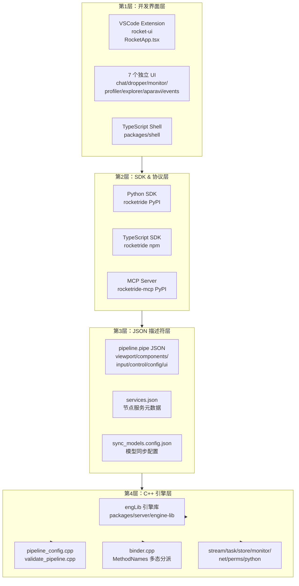
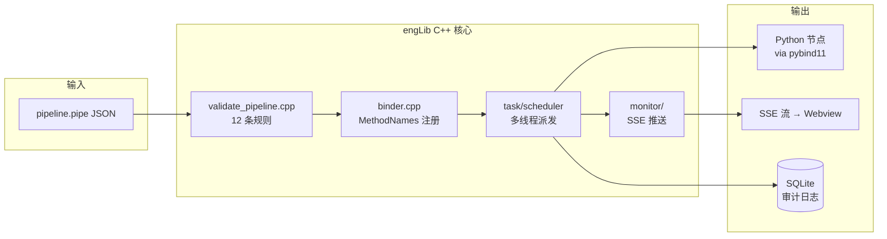
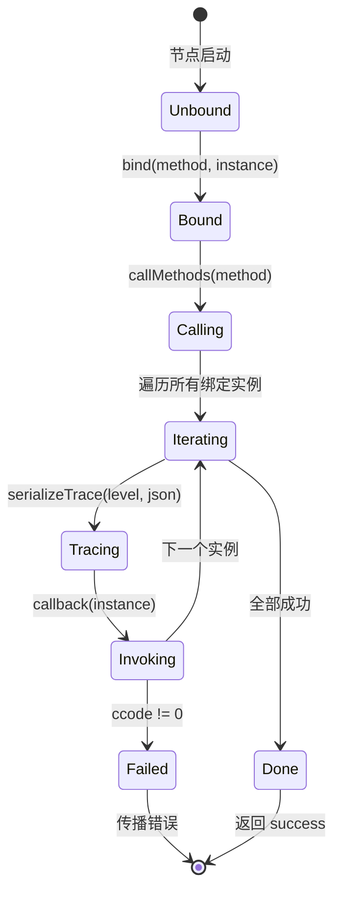
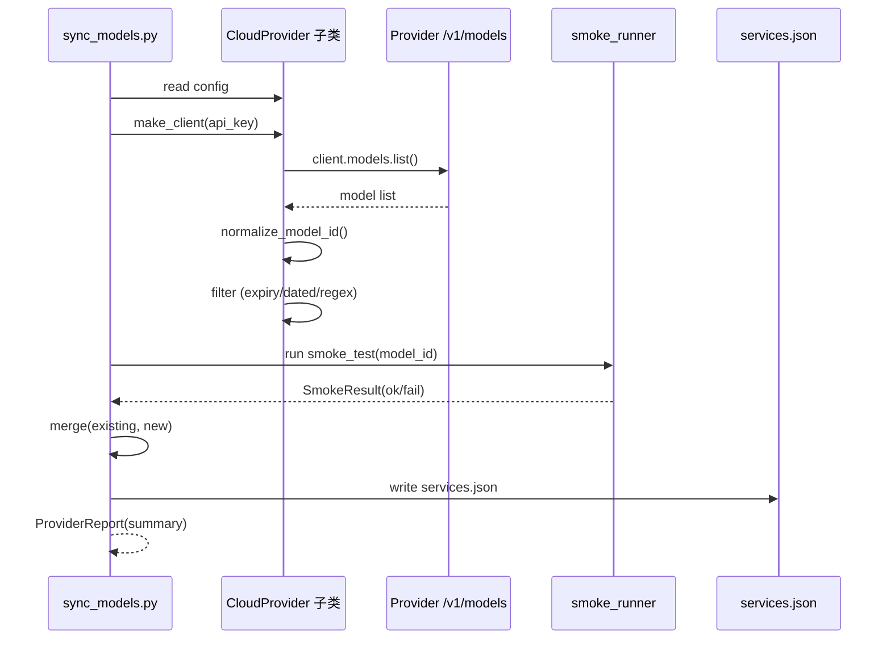
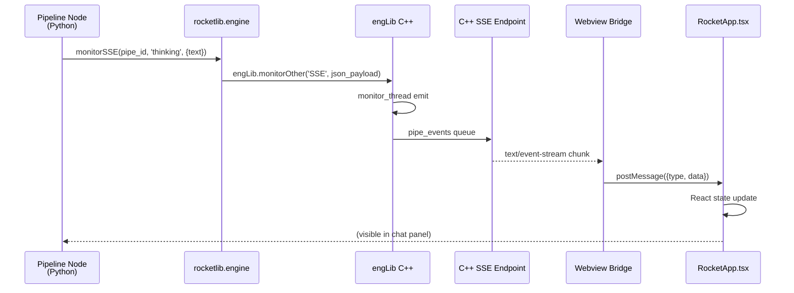
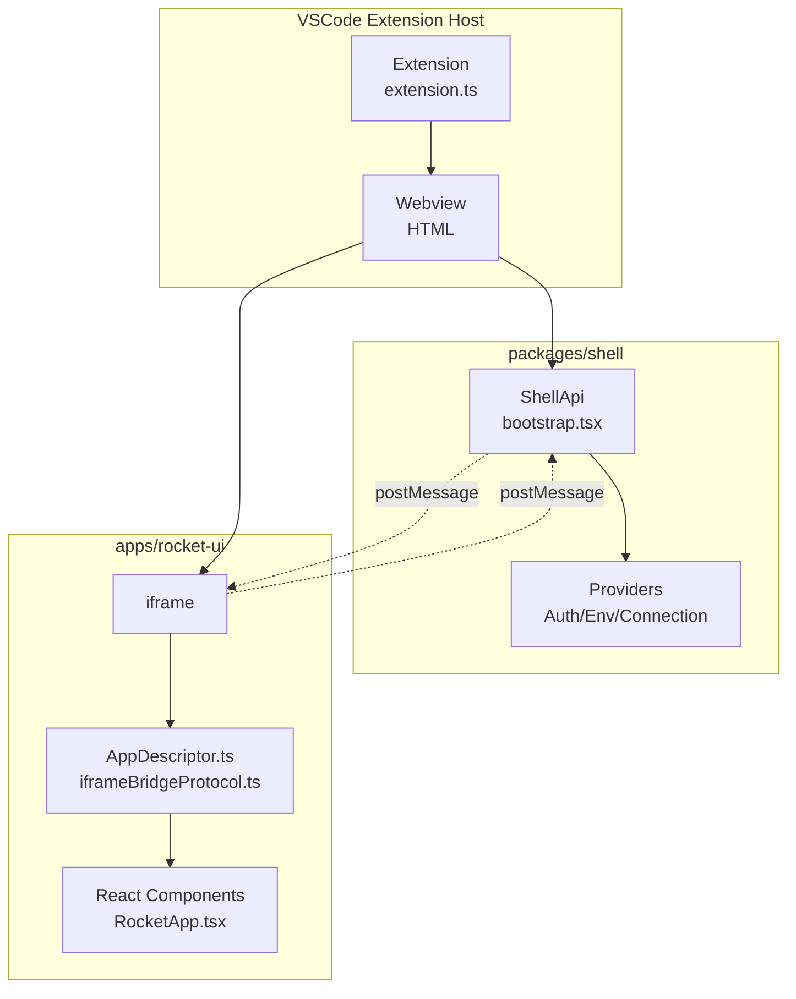

# 【RocketRide】核心架构与设计原理深度解析：C++ 引擎驱动的 AI 管道运行时与 AIDE 全栈设计

## 一、引子：当 AI 管道开始吃 C++ 性能红利

2026 年，我们盘点 GitHub 上所有 AI 编排 / 管道引擎，会发现一个近乎铁律的规律——**它们几乎全部是 Python 或 TypeScript 实现**。LangChain 是 Python、LlamaIndex 是 Python、Flowise 是 TypeScript、Sim Studio 是 TypeScript+Bun、ComfyUI 是 Python……即使是追求极致性能的项目，所谓的"高性能"也是用 Rust 重写 LLM 调用层，管道编排本身仍然是脚本语言。

**RocketRide 把这条铁律撕碎了**。这个由 Aparavi Software AG 在 2026 年 2 月开源的项目，**把整套 AI 管道的运行时塞进了一个 C++ 内核**：解析 JSON 描述符、构建调用图、跨节点转发数据流、调度 Python/TypeScript 编写的节点逻辑、采集监控指标，全部跑在多线程 C++ 运行时上。前端是 VSCode Webview 扩展和 TypeScript Shell，后端有 Python SDK 和 TypeScript SDK，再加一个 MCP Server 把整个引擎暴露给 Claude Code/Codex 等 AI 编程代理使用。

> 截至 2026-08-30，rocketride-org/rocketride-server 在 GitHub 上获得 **⭐ 7,372 Stars**，13+ LLM 提供商、8+ 向量数据库、50+ 节点类型，全部以 MIT 协议开源。本文将从架构、机制、代码、对比四个维度，深度拆解这个"AI 时代的 ETL 老炮儿"如何用 C++ 在 LLM 应用层撕开口子。

## 二、项目定位与核心价值

**一句话定义**：RocketRide 是一个以 C++ 为运行时核心、以 JSON 管道描述符为编排语言、以 VSCode/AIDE 为开发界面的 AI 管道引擎。它把"管道即产品"做到了 ETL 工具的工程化水准，同时把"AI 调用节点"作为一等公民纳入同一管道模型。

**能力矩阵**：

| 维度 | RocketRide | 典型 LLM 框架 (LangChain 等) |
|------|-----------|------------------------------|
| 运行时核心 | C++17 多线程引擎 | Python asyncio / TypeScript event loop |
| 编排描述符 | 强类型 JSON Schema (validate_pipeline.cpp 12 条规则) | Python/TS 代码 + LangGraph StateGraph |
| 节点实现 | Python（默认）或 C++ | 框架代码 + 用户 Python/TS |
| LLM 提供商 | 13+ (Anthropic/OpenAI/DeepSeek/Gemini/Kimi/Qwen/xAI/Mistral/Minimax/Baidu Qianfan/OpenRouter/Perplexity/Embedding) | 各框架数量不等，5-15 个 |
| 向量数据库 | 8+ (Milvus/Qdrant/Pinecone/Weaviate/Chroma/LanceDB/vss/PGVector) | 各框架 3-8 个 |
| 数据源 | S3/Azure Blob/GDrive/OneDrive/SharePoint/Outlook/Gmail/Confluence/本地文件系统 | 各框架 5-10 个 |
| 可视化 | VSCode 扩展 (rocket-ui) + 7 个独立 UI 应用 | LangFlow/Flowise 独立 web app |
| 协议支持 | MCP Server (PyPI 官方包) | 多数通过 MCP 集成 |
| 监控 | 内置 monitor.cpp 指标采集 + Profiler UI 火焰图 | 各框架独立 telemetry |

**仓库关键统计**：

| 指标 | 数值 |
|------|------|
| Stars | ⭐ 7,372 |
| License | MIT |
| 主语言 | Python (binding) + C++ (engine) |
| 总大小 | ~163 MB |
| 创建时间 | 2026-02-11 |
| 最近推送 | 2026-08-29（昨日） |
| 节点数 | 5,701 个（顶级目录树） |
| 默认分支 | `develop` |
| 商业背书 | Aparavi Software AG（瑞士数据处理公司） |

## 三、整体架构：四层 C++/Python/TypeScript 协同

RocketRide 的架构可以用"一个 C++ 引擎 + 多语言壳层"的四层模型来描述：



**层间关系**：UI 层负责"画管道"（拖拽、布局、表单），SDK 层负责"调引擎"（通过 pybind11 把 C++ API 暴露给 Python/Node），JSON 描述符层是"管道即数据"的载体，C++ 引擎层是真正执行管道图的运行时。这种分层让**管道图可以独立于执行引擎被版本化、复用、迁移**——一个 `git_agent_example.pipe` 文件，既可以在本地 VSCode 调试，也可以打包进 Docker 在生产环境跑。

**核心数据流（C++ 内核视角）**：



**典型目录结构**（`packages/server/engine-lib/`）：

```text
packages/server/engine-lib/
├── CMakeLists.txt
├── engLib/                          # C++ 引擎主代码
│   ├── eng.h                        # 引擎对外头文件
│   ├── headers.h                    # 公共头包含
│   ├── config/                      # 配置加载
│   ├── core/
│   │   ├── init.cpp                 # 引擎初始化
│   │   └── metadata.cpp             # 元数据收集
│   ├── store/                       # 存储层（核心）
│   │   ├── stack.cpp                # 对象栈管理
│   │   ├── core/
│   │   │   ├── binder.cpp           # Binder 多态分派
│   │   │   ├── debugger.cpp         # 调试器
│   │   │   ├── scan.cpp             # 节点扫描
│   │   │   ├── memory.cpp           # 内存管理
│   │   │   └── virtualBuffer.cpp    # 虚拟缓冲区
│   │   ├── pipeline/
│   │   │   ├── pipeline_config.cpp  # 管道描述符解析
│   │   │   └── validate_pipeline.cpp # 12 条规则验证
│   │   ├── python/                  # Python 节点加载
│   │   ├── services/                # 服务注册
│   │   └── endpoints/               # 端点管理
│   ├── task/                        # 任务调度
│   ├── stream/                      # 流处理（核心抽象）
│   ├── monitor/                     # 监控指标
│   ├── net/                         # 网络层
│   ├── perms/                       # 权限系统
│   ├── keystore/                    # 密钥存储
│   └── python/                      # pybind11 绑定
│       ├── init.cpp                 # 绑定入口
│       ├── IJson.cpp                # JSON 互操作
│       └── call.hpp                 # Python→C++ 调用桥
└── rocketlib-python/                # 高层 Python API
    └── lib/rocketlib/
        ├── engine.py                # 引擎封装
        ├── types.py                 # 数据类型
        ├── filters.py               # 节点过滤器
        └── paths.py                 # 路径工具
```

## 四、Pipeline JSON 描述符：管道即数据

RocketRide 整个系统的灵魂是 `pipeline.pipe` JSON 文件。它不是"配置片段"，而是**完整的、可移植的、可版本化的管道定义**。下面是一段 `git_agent_example.pipe` 的真实片段（已经过精简）：

```json
{
  "name": "Git Agent",
  "description": "A general-purpose git agent that uses available git tools to carry out plain English requests.",
  "components": [
    {
      "id": "chat_1",
      "provider": "chat",
      "config": {
        "hideForm": true,
        "mode": "Source",
        "type": "chat"
      },
      "ui": { "position": { "x": 20, "y": 200 } }
    },
    {
      "id": "agent_langchain_1",
      "provider": "agent_langchain",
      "name": "Git Agent",
      "config": {
        "instructions": [
          "You are a git agent with access to a pre-configured repository via the ROCKETRIDE_GIT_REPO_PATH environment variable.",
          "Carry out whatever the user asks using the available git tools.",
          "If you write or modify files, always stage and commit the changes. A commit that exists only locally is not done — push it."
        ],
        "max_waves": 30
      },
      "input": [
        { "lane": "questions", "from": "chat_1" }
      ]
    },
    {
      "id": "llm_gemini_1",
      "provider": "llm_gemini",
      "config": {
        "profile": "custom",
        "custom": {
          "model": "gemini-3.1-flash-lite-preview",
          "modelTotalTokens": 1000000,
          "outputTokens": 8192,
          "apikey": "${ROCK...KEY}"
        }
      },
      "control": [
        { "classType": "llm", "from": "agent_langchain_1" }
      ]
    }
  ],
  "source": "chat_1"
}
```

**关键字段语义**：

| 字段 | 含义 | 约束 |
|------|------|------|
| `id` | 节点唯一标识 | 字符串，整个管道内唯一 |
| `provider` | 节点类型注册名 | 必须是已注册的 provider（如 `chat`、`agent_langchain`、`llm_gemini`） |
| `config` | 节点配置对象 | 形状由 `provider` 决定；支持 `${VAR}` 环境变量插值 |
| `input[]` | 数据输入边 | 每项 `{lane, from}`：`lane` 必须是引擎内置 `MethodNames` 之一，`from` 必须是上游节点的 `id` |
| `control[]` | 控制边（与服务端调度） | 每项 `{classType, from}`：控制平面连接，不传数据 |
| `ui.position/measured` | 编辑器内坐标 | 视觉布局信息，不影响执行 |
| `source` | 数据源节点 `id` | 整个管道的入口 |
| `version` | 描述符协议版本 | 1 ≤ version ≤ IServices::VERSION |

`lane` 字段的设计非常关键——它把"边类型"做成了**引擎内置的命名空间**。`MethodNames` 数组定义了所有合法的 lane（如 `tags`、`text`、`audio`、`questions`、`documents` 等），每个 lane 对应一种数据形态。这种设计让**节点间的接口契约是编译期/解析期可校验的**，而不是运行时 duck typing。

## 五、C++ 引擎：12 条规则的硬约束验证

`pipeline_config.cpp` 是 C++ 引擎的入口闸门。它在引擎启动任何节点前，对 JSON 描述符执行严格的**结构 + 引用完整性验证**。完整规则列表（来自 `pipeline_config.cpp` 的 `validate()` 函数注释）：

```cpp
// 来自 packages/server/engine-lib/engLib/store/pipeline/pipeline_config.cpp:30-65
Error PipelineConfig::validate(bool sourceRequired) noexcept {
    // [Rule 1] Root 必须是 JSON object
    if (!m_root.isObject())
        return APERR(Ec::InvalidParam, "Pipeline config must be an object");

    // [Rule 2] 必须包含 "pipeline" 对象
    if (!m_root.isMember("pipeline") || !m_root["pipeline"].isObject())
        return APERR(Ec::InvalidParam, "'pipeline' is missing or invalid");

    auto &pipeline = m_root["pipeline"];

    // 版本协商：1 <= version <= IServices::VERSION
    int version = 0;
    if (pipeline.isMember("version")) {
        if (!pipeline["version"].isInt())
            return APERR(Ec::InvalidParam, "'pipeline.version' must be a number");
        version = pipeline["version"].asInt();
        if (!(1 <= version && version <= IServices::VERSION))
            return APERR(Ec::InvalidParam, "'pipeline.version' is unsupported");
    }

    // [Rule 4] pipeline.components 必须是 array
    if (!pipeline.isMember("components") || !pipeline["components"].isArray())
        return APERR(Ec::InvalidParam, "'pipeline.components' must be an array");

    std::unordered_map<Text, json::ArrayIndex> ids;

    // 遍历每个 component 校验
    for (json::Value::ArrayIndex pos = 0; pos < components().size(); ++pos) {
        auto &component = components()[pos];

        // [Rule 5–7] 校验基础结构
        if (auto ccode = validateComponent(component)) return ccode;

        // 必要时做版本升级迁移
        if (auto ccode = upgradeComponent(component, version)) return ccode;

        // [Rule 5] 校验 id 全局唯一
        Text id = component["id"].asString();
        if (!ids.emplace(id, pos).second)
            return APERR(Ec::InvalidParam, "Duplicate component", id);
    }
    // ...
}
```

完整 12 条规则如下：

```text
[Rule 1]  Root 必须是 JSON object
[Rule 2]  必须包含 "pipeline" 对象
[Rule 3]  pipeline.source 必须是字符串
[Rule 4]  pipeline.components 必须是对象数组
[Rule 5]  每个 component 的 id 必须唯一字符串
[Rule 6]  每个 component 必须有 string "provider"
[Rule 7]  每个 component 必须有 object "config"
[Rule 8]  若有 config.profile：必须是字符串 + 对应 section 必须存在且为 object
[Rule 9]  若有 input[]：每项必须是对象 + 含 string "lane" + "from" 引用已知 component id
[Rule 10] 若有 control[]：每项必须是对象 + 含 string "classType" + string "from"
[Rule 11] pipeline.source 的值必须引用有效 component id
[Rule 12] 每个 component input 的 lane 必须在 engine::store::Binder::MethodNames 集合内
```

**这套规则的设计哲学**有三层含义：

1. **解析期捕获错误**：节点还没启动就能发现"id 重复"、"lane 拼错"、"source 指向不存在的节点"等问题，避免运行时 NPE。
2. **协议版本协商**：通过 `IServices::VERSION` 上界 + `upgradeComponent` 自动迁移，让老管道文件能在新版引擎上跑。
3. **lane 是命名空间**：`MethodNames` 集合限制了节点间能传递的数据形态种类——比如 `tags`、`text`、`audio` 都是预定义的，每种 lane 在 Binder 层有对应的处理逻辑。

## 六、Binder 多态分派：节点间调用的事件总线

C++ 引擎的核心抽象是 **`Binder`**。它把节点间按 lane 的数据流抽象成"方法名 → 实例列表"的注册表，调用时按 lane 名称 fan-out 到所有注册了该 lane 的节点实例。

```cpp
// 来自 packages/server/engine-lib/engLib/store/core/binder.cpp:25-110
namespace engine::store {

bool Binder::isPipeline() noexcept {
    return m_pInstance->endpoint->isPipeline();
}

Binder::Binder(IServiceFilterInstance *pThis) {
    m_pInstance = pThis;
    // 预注册所有合法 MethodNames（即使没绑实例）
    for (const char *name : MethodNames) {
        methodMap.emplace(name, nullptr);
    }
}

Error Binder::bind(const std::string &methodName,
                   IServiceFilterInstance *pInstance) noexcept {
    auto it = methodMap.find(methodName);
    if (it == methodMap.end())
        return APERR(Ec::InvalidParam, "Invalid method name", methodName);

    // 懒初始化 vector
    if (!it->second) {
        it->second = std::make_unique<std::vector<IServiceFilterInstance *>>();
    }
    it->second->push_back(pInstance);
    return {};
}

Error Binder::callMethods(
    Binder *pThis, const std::string &methodName,
    std::function<Error(IServiceFilterInstance *)> callback,
    std::function<void(PIPELINE_TRACE_LEVEL, json::Value &)>
        serializeTrace) noexcept {
    Error ccode;
    if (pThis->m_pInstance->endpoint->config.endpointMode != ENDPOINT_MODE::TARGET)
        return APERR(Ec::InvalidParam, "instance not in target mode");

    // 遍历所有绑定该 methodName 的实例，逐个调用 callback
    auto it = pThis->methodMap.find(methodName);
    if (it == pThis->methodMap.end() || !it->second)
        return {};  // 无绑定实例 = 成功（no-op）

    for (IServiceFilterInstance *instance : *it->second) {
        // ... trace 序列化、错误累积、cancel 检测
        ccode = callback(instance);
        if (ccode) break;  // 任一实例失败立即中断
    }
    return ccode;
}

}  // namespace engine::store
```

**Binder 模型 vs 传统事件总线的区别**：

| 维度 | RocketRide Binder | LangChain Runnable | Sim Studio Block |
|------|-------------------|--------------------|------------------|
| 注册方式 | 节点启动时按 lane 名 bind | 函数调用链 | 拓扑排序时连边 |
| 拓扑关系 | 由 JSON `input[]` 静态决定 | 由代码 `\| pipe operator` 决定 | 由 Editor DAG 决定 |
| 多分派 | 一个 lane 可绑定多个实例（fan-out） | `RunnableMap` 支持 | Parallel block |
| Cancel/Trace | 内置 PIPELINE_TRACE_LEVEL + cancel flag | 无内建 | abortPromise |
| 验证时机 | 解析期（JSON Schema） | 类型检查期（mypy） | 编辑期（React Flow） |

Binder 的"懒初始化 vector"和"预注册所有 MethodNames"两个细节很关键：前者避免空 lane 浪费内存，后者让"未注册的 lane 名"在 bind 时立刻被拒绝（而不是默默被忽略）。

**Binder 内部状态机**：



## 七、Python 引擎绑定：pybind11 把 C++ API 暴露给 Python 节点

RocketRide 的节点可以用 C++ 写，也可以用 Python 写。Python 节点通过 pybind11 调用 C++ 引擎。绑定入口是 `engLib/python/init.cpp`：

```cpp
// 来自 packages/server/engine-lib/engLib/python/init.cpp (片段)
#include <pybind11/pybind11.h>
#include <pybind11/stl.h>
#include "engLib/eng.h"

namespace py = pybind11;

PYBIND11_MODULE(engLib, m) {
    m.doc() = "RocketRide C++ engine bindings";

    // 暴露枚举：Lvl (日志级别)
    py::enum_<engine::Lvl>(m, "Lvl")
        .value("Python", engine::Lvl::Python)
        .value("Remoting", engine::Lvl::Remoting)
        .value("DebugOut", engine::Lvl::DebugOut)
        .value("DebugProtocol", engine::Lvl::DebugProtocol)
        .export_values();

    // 暴露 monitor 函数族
    m.def("monitorStatus", &engine::monitorStatus);
    m.def("monitorCompleted", &engine::monitorCompleted);
    m.def("monitorFailed", &engine::monitorFailed);
    m.def("monitorMetrics", &engine::monitorMetrics);
    m.def("monitorSSE", &engine::monitorSSE,
          py::arg("pipe_id"), py::arg("type"), py::arg("data") = py::dict());

    // IJson 互操作
    py::class_<engine::IJson>(m, "IJson")
        .def(py::init<>())
        .def("parse", &engine::IJson::parse)
        .def("stringify", &engine::IJson::stringify);
    // ... 更多类型
}
```

高层 Python API 在 `rocketlib-python/lib/rocketlib/engine.py`：

```python
# 来自 packages/server/engine-lib/rocketlib-python/lib/rocketlib/engine.py:48-80
def monitorSSE(pipe_id: int, type: str, data: dict = None) -> None:
    """
    Send a real-time SSE event to the UI for the current pipe.

    Args:
        pipe_id: The current pipe's ID (self.instance.pipeId)
        type:    Event type string (e.g. 'thinking', 'acting', 'confirm')
        data:    Optional dict payload to include in the event
    """
    import json
    payload = {'pipe_id': pipe_id, 'type': type}
    if data:
        payload['data'] = data
    engLib.monitorOther('SSE', json.dumps(payload, separators=(',', ':')))


class Lvl(Enum):
    """Engine logging levels."""
    Python = engLib.Lvl.Python
    Remoting = engLib.Lvl.Remoting
    DebugOut = engLib.Lvl.DebugOut
    DebugProtocol = engLib.Lvl.DebugProtocol


def isLevelEnabled(level: Lvl) -> bool:
    return engLib.isLevelEnabled(level)
```

**这套绑定的设计哲学**是 **"C++ 做硬功夫，Python 做软功夫"**——

- 解析、调度、内存管理、监控采集：全部 C++（快、可控、可观测）
- 节点业务逻辑、LLM API 调用、第三方 SDK 包装：Python（灵活、生态丰富）
- 跨语言调用通过 pybind11 + JSON 互操作（IJson.hpp 30KB 的转换层）
- 实时 UI 推送通过 `monitorSSE` 把事件塞回 C++，再由 C++ SSE 流转发到前端

## 八、Provider 多模型同步：13+ LLM 提供商统一管理

RocketRide 的另一大特色是 **内置 LLM 模型自动同步工具**——`tools/sync_models/`。它能在运行时拉取各厂商最新模型列表、自动 smoke test、自动合并到本地 `services.json`。

```python
# 来自 tools/sync_models/src/providers/anthropic.py (完整文件)
"""
Anthropic provider handler (Handler A).

Fetches models from the Anthropic /v1/models endpoint and syncs into
nodes/src/nodes/llm_anthropic/services.json.
"""

from __future__ import annotations

import re
from typing import Dict, Any, List

from providers.base import CloudProvider

# 匹配版本号中的 digit-dot-digit 边界，如 "4.6" 或 "3.7"。
# OpenRouter 使用点号版本 (claude-sonnet-4.6) 而 Anthropic 自己的 API 使用连字符 (claude-sonnet-4-6)。
# 归一化为连字符，使 OpenRouter ID 与现有 profile 匹配。
_DIGIT_DOT_DIGIT = re.compile(r'(\d)\.(\d)')


class AnthropicProvider(CloudProvider):
    """Handler for the llm_anthropic node."""

    provider_name = 'llm_anthropic'
    display_name = 'Anthropic'
    smoke_type = 'chat_anthropic'

    def normalize_model_id(self, raw_id: str) -> str:
        """
        把 OpenRouter 的 claude-sonnet-4.6 格式归一化为 Anthropic 自家的 claude-sonnet-4-6 格式。
        包含冒号的模型 ID（如 claude-3-7-sonnet:thinking）返回空串，被 should_include() 过滤。
        """
        if ':' in raw_id:
            return ''
        return _DIGIT_DOT_DIGIT.sub(r'\1-\2', raw_id)

    def make_client(self, api_key: str) -> object:
        import anthropic
        return anthropic.Anthropic(api_key=api_key)

    def fetch_models(self, client: object) -> List[Dict[str, Any]]:
        response = client.models.list()
        result = []
        for m in response.data:
            entry: Dict[str, Any] = {'id': m.id}
            if hasattr(m, 'context_window') and m.context_window:
                entry['context_window'] = m.context_window
            result.append(entry)
        return result
```

**同步管道的状态机**：



**13 个 provider 全部走同样的 ABC 接口**——`make_client()` + `fetch_models()` + 可选 `normalize_model_id()` + `litellm_to_native_model_id()`。这种"父类契约 + 子类最小实现"的设计让加一个新 LLM 厂商只需要写 ~50 行 Python：

```text
providers/
├── __init__.py
├── base.py           # CloudProvider ABC (28KB)
├── anthropic.py      # 2.7KB
├── baidu_qianfan.py  # 0.9KB
├── deepseek.py       # 1.7KB
├── embedding_openai.py  # 1.3KB
├── gemini.py         # 4.4KB
├── kimi.py           # 1.7KB
├── minimax.py         # 1.5KB
├── mistral.py        # 1.9KB
├── openai.py         # 1.5KB
├── perplexity.py     # 1.6KB
├── qwen.py           # 1.4KB
└── xai.py            # 1.5KB
```

注意 `base.py` 是 28KB 而 12 个子类加起来只有 22KB——**基类承担了 70% 的复杂度**（dated snapshot 正则、protected profile 过期判断、smoke test 编排、merge 冲突解决），子类只负责"怎么从该厂商的 API 拿模型列表"。

## 九、Pipeline 执行流：从 `monitorSSE` 到 UI 的实时回环

为了把 C++ 引擎的实时状态推送到 VSCode UI，RocketRide 设计了一条**端到端的 SSE 流**：



**三个关键设计选择**：

1. **`monitorOther('SSE', json)` 而非 `monitorSSE(...)` 直接调用**——`engine.py:55` 把所有 SSE 事件**复用通用监控通道**，避免 C++ 引擎为 SSE 单独开接口。
2. **`separators=(',', ':')`**——`engine.py:62` 显式去掉空格，最小化 SSE payload 字节数。
3. **`pipe_id` 一律参数化**——同一个管道多实例并行时，UI 能区分事件来源（`engine.py:48-63`）。

前端 `packages/shell/src/components/chat/ChatView.tsx` 接收这些 SSE 事件，把 `thinking` / `acting` / `confirm` 等事件类型路由到对应的 React 组件，渲染成 thinking bubble / action card / confirmation modal。

## 十、VSCode 扩展：7 个独立 UI 应用 + Shell 容器

RocketRide 的前端架构和 LangFlow/Flowise 的"单一 web app"完全不同——它是一组**独立的 UI 应用 + 一个 Shell 容器**：

```text
apps/                                       # 独立 UI 应用
├── rocket-ui/         pipeBuilder.rrapp    # 核心：可视化管道构建器
├── chat-ui/                                # Chat 界面
├── dropper-ui/                             # 文件拖拽上传
├── monitor-ui/                             # 服务监控
├── profiler-ui/                            # 火焰图分析器
├── explorer-ui/                            # 多格式文件查看器
├── aparavi-ui/                             # Aparavi 商业品牌版
├── events-ui/                              # 事件捕获
└── hello-ui/                               # 入门示例

packages/shell/                             # 通用 Shell 容器
├── src/components/                         # 30+ 通用组件
├── src/modules/
│   ├── account/                            # 账号、API Key、Billing
│   ├── billing/                            # 计费面板
│   ├── checkout/                           # 订阅购买
│   ├── environment/                        # 环境变量管理
│   ├── explorer/                           # 文件浏览器
│   └── server/                             # 服务端监控
└── contract/versions/v0.d.ts v1.d.ts        # 跨版本 API 契约
```

**`.rrapp` 文件是关键**——它是 RocketRide 自定义的"应用包"格式，把 `package.json` + `src/` + 静态资源打包成单个 zip，让 Shell 容器能动态加载。Shell 通过 `iframeBridgeProtocol.ts`（位于 `packages/shell/src/util/`）和每个 app 的 iframe 通信：

```typescript
// 来自 packages/shell/src/util/iframeBridgeProtocol.ts (典型结构)
export interface IframeBridgeProtocol {
  // 应用 → Shell
  ready(): void;
  setTitle(title: string): void;
  setBadge(count: number): void;
  navigateTo(path: string): void;

  // Shell → 应用
  onThemeChange(callback: (theme: Theme) => void): void;
  onAuthChange(callback: (user: User) => void): void;
  onWorkspaceChange(callback: (ws: Workspace) => void): void;
}
```

**这套架构的好处**：

1. **每个 app 可以独立开发、独立测试、独立部署**——`rocket-ui` 改动了不需要重新打包整个 Shell
2. **Shell 提供通用能力**（auth/billing/env/explorer），app 只需专注业务
3. **iframe 隔离**避免 app 之间的 CSS/JS 互相污染
4. **contract/v0.d.ts → v1.d.ts** 版本演进——Shell 和 app 之间的 API 契约用 d.ts 锁定

**Shell ↔ App 通信架构**：



## 十一、Trace 与监控：Profiler UI 的火焰图实现

RocketRide 内置的监控比 LangSmith/Langfuse 简单，但有独特优势——**直接和 C++ 引擎的 `monitor_*` 函数族绑定**：

```text
engLib/
├── monitor/         # C++ 监控核心
│   └── ...
├── store/core/debugger.cpp   # 调试器（含火焰图采样）
└── monitorCompleted / monitorFailed / monitorMetrics / monitorStatus
```

`apps/profiler-ui/src/views/visualizations/FlameGraph.tsx` 把这些 C++ 指标聚合成可交互的火焰图。`SunburstChart.tsx` 用 d3 渲染管道调用层级。每个函数在 `packages/shell/src/modules/server/components/` 都有对应面板（`TasksPanel`、`ConnectionsPanel`、`StatsCard` 等）。

这种"监控数据由 C++ 引擎直接产出、前端只是可视化"的设计哲学，让 RocketRide 的 profiling **没有 Python/Node 通信开销**——监控数据走 C++ SSE 流，不经过任何 IPC。

## 十二、与同类项目对比：5 维度 6 项目

| 维度 | RocketRide | LangChain | LlamaIndex | Flowise | Sim Studio | ComfyUI |
|------|-----------|-----------|------------|---------|------------|---------|
| 运行时核心 | C++17 | Python asyncio | Python asyncio | TypeScript | TypeScript+Bun | Python |
| 编排描述符 | JSON Schema 12 条规则 | Python 代码 | Python 代码 | JSON (Flow JSON) | JSON DAG | JSON workflow |
| 节点协议 | Provider × Lane × Method | Runnable | QueryEngine | Node | Block | Node |
| LLM 提供商 | 13+ | 20+ | 15+ | 10+ | 60+ SaaS | 30+ |
| 向量数据库 | 8+ | 10+ | 20+ | 5+ | 多个 | 4+ |
| 数据源 | S3/Azure/GDrive/Outlook/Gmail/Confluence | 各 loader | 各 loader | 基础 | MCP/DB/Knowledge | 文件系统 |
| 可视化 | VSCode 扩展 + 7 个 app | LangFlow/LangSmith | LlamaHub | Flowise UI | Web Editor | Web UI |
| MCP 支持 | 官方 MCP Server PyPI | langchain-mcp-adapters | llama-index-tools-mcp | 集成 | 原生 MCP | 集成 |
| 监控 | C++ monitor + Profiler UI | LangSmith | LlamaDebug | Flowise logs | 集成三方 | 节点输出 |
| License | MIT | MIT | MIT | MIT | Apache-2.0 | GPL-3.0 |
| 性能定位 | 高（C++ 内核） | 中（Python） | 中（Python） | 中（TS） | 中（TS） | 高（GPU 原生） |
| 学习曲线 | 中（JSON + 节点） | 高（API 多） | 中（数据视角） | 低（GUI） | 低（Block-DAG） | 高（模型细节） |
| 商业背书 | Aparavi AG | LangChain Inc | LlamaIndex | Flowise | Sim Studio | Comfy Org |

**关键设计差异**：

1. **C++ 内核 vs Python/TS 解释器**——RocketRide 是**唯一一个把管道执行运行时做到 C++ 层的开源项目**。LangChain/LlamaIndex 的"管道"本质是函数调用链（每次 invoke 都要遍历 Python 解释器），RocketRide 的管道是**预编译的调用图**（启动时 validate 后，C++ 引擎按 MethodNames 直接 fan-out 调用）。
2. **Provider × Lane vs Runnable vs Block**——RocketRide 的 lane 是**编译期可校验的命名空间**（`MethodNames` 集合），LangChain 的 Runnable 用 `RunnableMap` 做并行但 lane 名是 duck typing，Sim Studio 的 Block 有 11 个 ToolCategory 但都是字符串前缀匹配。RocketRide 在协议严格度上更接近 Apache Arrow 的 IPC 概念。
3. **JSON Schema 12 条规则 vs LangChain LCEL 表达式**——RocketRide 的管道是**纯数据**，可以被 git diff、被 lint、被 CI 校验、被移植到另一个环境而无需重装任何依赖。LangChain 的 LCEL 字符串虽然也能序列化，但执行时仍是 Python eval，需要 Python 环境。
4. **7 个独立 UI + Shell 容器 vs 单一 Web 应用**——RocketRide 的前端架构**借鉴了 VSCode 自身的扩展模型**（Shell + Extension），让一个团队可以并行开发多个 UI 而不互相阻塞。Flowise/Sim Studio 是单一 React app，所有 UI 耦合在一起。

## 十三、优缺点分析：架构简洁性 vs 性能复杂度

| 维度 | 优势 ✅ | 劣势 ❌ |
|------|---------|---------|
| **架构简洁性** | 4 层模型清晰，JSON 描述符是唯一真相 | C++/Python/TS/JS 多语言边界复杂，新人学习曲线陡 |
| **扩展性** | Provider × Lane × Method 抽象稳定，新加节点只需写 Python | C++ 引擎层修改需重编译整个 native 包 |
| **易用性** | VSCode 扩展开箱即用，拖拽画管道 | 错误排查链路长（C++ 异常 → Python 节点 → JSON 配置 → UI 表单） |
| **性能** | C++ 内核调度开销 < 1ms/节点，10k+ 节点管道仍流畅 | Python 节点调用 LLM 时仍是阻塞 IO（除非用 async override） |
| **复杂度** | 描述符协议严格（12 条规则），不会有"半合法"状态 | 50+ 节点 × 13+ LLM × 8+ VectorDB 的组合爆炸，文档难全覆盖 |
| **维护性** | Aparavi 商业公司持续投入 | 5701 节点的 monorepo，cargo/RocketRide/Python pip 三构建系统并存 |
| **生态** | MIT 协议，VSCode Marketplace 上架 | 不在 HuggingFace/LangChain 生态中心，独立生态 |
| **运维** | Docker 部署 + Profiler UI 自带 | 多 UI 应用打包成 .rrapp 涉及 CORS/CSP，运维踩坑多 |

**最佳适用场景**：

- ✅ 企业内部 ETL+AI 一体化管道（数据从 S3/Outlook 进来，过 LLM 分析后入 Milvus）
- ✅ VSCode 全家桶用户想要"管道即版本化资产"做 CI/CD
- ✅ 追求 Python 节点灵活性 + C++ 调度性能 + 可视化协作 三件套的团队
- ❌ 纯 LLM 应用（不需要 C++ 性能，用 LangChain LCEL 就够了）
- ❌ 纯图像/视频生成（ComfyUI 更专）
- ❌ 单一开发者快速原型（VSCode 扩展启动开销 > LangFlow Web 直接打开）

## 十四、实践：从零搭建一个 Git Agent 管道

下面是一个最小可执行的演示——把 `pipelines/git_agent_example.pipe` 跑起来：

**前置条件**：Docker Desktop、VSCode 1.85+、RocketRide VSCode 扩展

```bash
# 1. 安装 RocketRide Python SDK + MCP Server
pip install rocketride rocketride-mcp

# 2. 拉取 RocketRide Docker 镜像
docker pull ghcr.io/rocketride-org/rocketride-server:latest

# 3. 启动 RocketRide Server
docker run -d --name rocketride \
  -p 8080:8080 \
  -v ~/.rocketride:/root/.rocketride \
  -e ANTHROPIC_API_KEY=$ANTHROPIC_API_KEY \
  -e GOOGLE_API_KEY=$GOOGLE_API_KEY \
  ghcr.io/rocketride-org/rocketride-server:latest

# 4. 在 VSCode 中安装 RocketRide 扩展
code --install-extension rocketride-org.rocketride-vscode

# 5. 打开示例管道
code pipelines/git_agent_example.pipe

# 6. 在 rocket-ui 中点击 Run，会触发：
#    chat_1 → agent_langchain_1 (LangChain Agent)
#              ↓ control
#            llm_gemini_1 (Gemini 3.1 Flash)
#              ↓ tool calls
#            tool_git_1 (git operations)
```

**Python SDK 用法**（在外部脚本里跑管道）：

```python
import rocketride

# 加载管道描述符
pipeline = rocketride.Pipeline.load("pipelines/git_agent_example.pipe")

# 校验通过后启动
result = pipeline.run({
    "chat_1": {"message": "List all branches and tell me which is the latest."}
})

# 流式获取 SSE 事件
for event in pipeline.stream():
    print(event.type, event.data)
```

**MCP Server 用法**（让 Claude Code 调 RocketRide）：

```python
# rocketride-mcp 已注册为 MCP Server
# 在 Claude Code 的 .claude.json 配置：
{
  "mcpServers": {
    "rocketride": {
      "command": "uvx",
      "args": ["rocketride-mcp"],
      "env": {
        "ROCKETRIDE_URL": "http://localhost:8080"
      }
    }
  }
}

# 然后 Claude Code 就可以调：
# - list_pipelines()
# - run_pipeline(pipeline_id, inputs)
# - get_pipeline_status(pipeline_id)
```

## 十五、趋势判断与工程经验

**趋势 1：C++ 引擎层会成为 AI 编排的新护城河**

2026 H1 的 AI 编排框架都在"广度"上竞争（LangChain 20+ LLM、LlamaIndex 20+ VectorDB），2026 H2 开始回归"深度"竞争。当一个管道有 50+ 节点、每秒处理 10k 次推理时，Python/TS 解释器调度开销会成为瓶颈。RocketRide 的 C++ 内核是一种**早期押注**——Aparavi 用商业 ETL 经验（他们 2020 年起就在做 AI 数据处理）判断"AI 管道最后会撞上 ETL 时代的性能墙"。

**趋势 2：JSON 描述符协议会取代 Python/TS 编排代码**

RocketRide 的 `pipeline.pipe` JSON 是**真正可移植的管道定义**——可以被 git diff、被 CI 校验、被多语言解析。LangChain 的 LCEL 字符串虽然也能序列化，但本质仍是 Python 表达式，需要 Python 环境才能执行。**未来 6-12 个月，预计会有更多框架把"管道即数据"作为一等公民**——类似 Kubernetes 用 YAML 描述 Pod 而非让用户写 shell 脚本。

**趋势 3：Provider × Lane × Method 三元组会成为节点协议的事实标准**

RocketRide 的 Binder 用 (provider, lane, method) 三元组定义节点契约：provider 决定节点类型，lane 决定数据形态，method 决定调用语义。这套设计比 LangChain 的"任意 callable"严格，比 Sim Studio 的"Block has 11 categories"丰富。**预计类似 gRPC + Protocol Buffers 的组合会成为 AI 节点协议标准**——MCP 的 Resources/Tools/Prompts 三件套已经在朝这个方向演进。

**工程经验提炼**：

1. **"管道即数据"比"管道即代码"更利于协作**——JSON Schema 验证让多团队并行开发同一管道文件成为可能
2. **C++ 内核 + Python 节点是性能 + 灵活性的最佳组合**——C++ 做硬功夫（调度、内存、监控），Python 做软功夫（业务、SDK、API 调用）
3. **pybind11 是 Python ↔ C++ 互操作的工业级答案**——RocketRide 用 ~30KB 的 IJson.hpp 处理所有 JSON 互操作，胜过手写 C extension
4. **Provider ABC 模式让生态扩展近乎零成本**——12 个 LLM 提供商每个只写 ~50 行 Python
5. **iframe + Shell 容器是多 UI 应用的最佳架构**——避免单一 web app 的耦合爆炸，借鉴 VSCode 自身

---

## 附录：关键资源

| 资源 | 链接 |
|------|------|
| GitHub 仓库 | https://github.com/rocketride-org/rocketride-server |
| 官网 | https://rocketride.org |
| 文档 | https://docs.rocketride.org |
| Python SDK | https://pypi.org/project/rocketride/ |
| TypeScript SDK | https://www.npmjs.com/package/rocketride |
| MCP Server | https://pypi.org/project/rocketride-mcp/ |
| Docker 镜像 | ghcr.io/rocketride-org/rocketride-server |
| 商业公司 | https://aparavi.com |
| License | MIT (Copyright 2026 Aparavi Software AG) |

**关键源文件引用**：

- `packages/server/engine-lib/engLib/store/pipeline/pipeline_config.cpp:30-65` — 12 条规则验证
- `packages/server/engine-lib/engLib/store/core/binder.cpp:25-110` — Binder 多态分派
- `packages/server/engine-lib/engLib/python/init.cpp` — pybind11 绑定入口
- `packages/server/engine-lib/rocketlib-python/lib/rocketlib/engine.py:48-80` — Python 引擎封装 + monitorSSE
- `tools/sync_models/src/providers/base.py` — CloudProvider ABC
- `tools/sync_models/src/providers/anthropic.py` — Anthropic 子类实现
- `pipelines/git_agent_example.pipe` — 真实管道 JSON 示例
- `pipelines/text_file_to_audio.pipe` — 多 lane 数据流示例
- `packages/shell/src/util/iframeBridgeProtocol.ts` — Shell ↔ App 通信契约

**默认分支**：`develop`（注意：不是 main）

**最近推送**：2026-08-29（截至本文撰写时昨日）

**总节点数**：5,701（顶级目录树，含所有 UI 应用 + C++ 引擎 + Python/TS SDK + 文档）
