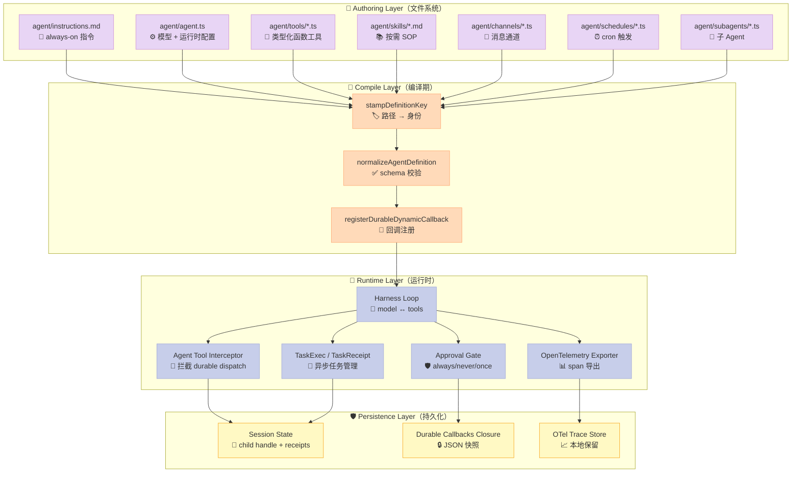

> "The filesystem is the authoring interface." —— vercel/eve README

## 一个被严重低估的 Harness 设计选择

如果你让一个 LLM Agent 框架的设计者列出**最关键的两个抽象**，多半会得到这两个候选：

- **Agent 类**（承载模型 + 工具 + 指令）
- **Tool 类**（承载函数 + 输入 schema + 权限）

但 vercel/eve 给出了第三种答案：**文件系统本身就是 Agent 的接口**。

```text
my-agent/
└── agent/
    ├── agent.ts            # 可选：模型和运行时配置
    ├── instructions.md     # 必选：always-on 系统提示词
    ├── tools/              # 可选：模型可调用的类型化函数
    │   └── get_weather.ts
    ├── skills/             # 可选：按需加载的 SOP
    │   └── plan_a_trip.md
    ├── channels/           # 可选：消息通道（HTTP、Slack、Discord）
    │   └── slack.ts
    └── schedules/          # 可选：定时 cron
        └── weekly_recap.ts
```

**没有 `class Agent`、`registerTool()` 调用、YAML 配置中心**。Agent 是一个目录；工具、SOP、通道、定时任务都是这个目录下的文件。

**这不是审美偏好的问题**——这是一个被低估的工程决策，本文会拆解它。

---

## 一、为什么 Filesystem-First 是 Harness Engineering 的"更优解"

### 1.1 LLM 的工作方式决定了"代码可读性 > 类型可读性"

Agent 框架的设计者惯常的思路是：

> "用 class + interface 把能力封装起来，让人类工程师能写出干净代码"

但 LLM 不是人类工程师。LLM 读懂一个能力，靠的不是 TypeScript 类型签名，而是 **README、Markdown、文件路径**。

eve 把这种现实转化成具体规则：

| 维度 | 传统 Agent 框架 | vercel/eve |
|------|----------------|------------|
| Tool 身份 | `class WeatherTool implements Tool` | 文件路径 `agent/tools/get_weather.ts` |
| 身份冲突检测 | 编译期类型冲突 | 文件路径冲突（两个同路径文件 → 编译失败）|
| 发现方式 | 显式 `register([...])` | 文件系统扫描 |
| 文档路径 | 单独写 README | 工具名本身就是文档（get_weather = "获取天气"） |

**对 LLM 的好处**：当 Agent 想调用一个工具时，它先看到一个**人类可读的目录树**，再调用 `load_skill("plan_a_trip")` 加载完整 SOP，最后才发 `tool_call`。**整个流程没有"反序列化抽象"的损耗**。

### 1.2 "Filesystem as API" 是 12-Factor App 的延伸

12-Factor App 的核心是"配置即环境变量"。eve 把这个原则推到极致：

- **身份即路径**：删除 `get_weather.ts` = 自动移除该工具
- **能力即目录**：添加 `skills/` 子目录 = 自动获得 SOP 加载能力
- **运行时即文件存在**：`channels/slack.ts` 存在 → eve 启动 Slack 监听；不存在 → 完全跳过

**没有 `enabled: true` 字段**。文件是否存在就是开关。这比任何"feature flag 服务"都更可靠。

---

## 二、vercel/eve 的 6 大原语

我从源码（`packages/eve/src/`）中提取出 6 个**机制层面的原语**——这 6 个原语组合起来，构成了整个 Harness：

### 2.1 原语 1：**Identity from Path**（路径即身份）

**反模式**：

```ts
// 传统框架：身份来自字段
const tool = defineTool({
  name: "get_weather",  // ← 这里写了名字
  execute: ...
})
```

**eve 的设计**：

```ts
// packages/eve/src/internal/authored-definition/source-identity.ts
export function stampDefinitionKey(definition: object, key: string): void {
  Object.defineProperty(definition, DEFINITION_KEY, {
    configurable: true,
    value: key  // ← key = "agent/tools/get_weather.ts"
  });
}

export function registerDefinitionSource(key: string, entry: DefinitionSourceEntry): void {
  const existing = definitionSourceRegistry.get(key);
  if (existing !== undefined && !sameDefinitionSourceEntry(existing, entry)) {
    console.warn(`Conflicting definitions: ...`);  // 路径冲突 → 警告
    definitionSourceRegistry.set(key, { kind: "ambiguous" });
    return;
  }
  definitionSourceRegistry.set(key, entry);
}
```

**关键设计**：

1. **没有 `name` 字段**：`InternalToolDefinition` 有 `name`，但那是**编译期**从路径派生的（`packages/eve/src/tools/definition.ts`）：
   ```ts
   export interface InternalToolDefinition extends ToolDefinitionBase {
     name: string;  // ← 编译器从路径派生
     inputSchema: JsonObject | null;
   }
   ```
2. **冲突即模糊**：两个同名文件 → 标记为 `ambiguous`，**不会崩溃**，但 `toolResultFrom` 匹配会失效
3. **`Symbol.for("eve:definition-source-key")`**：用全局 Symbol 注册身份，让 IDE/Linter 也能看到

**为什么这个原语重要**：

- 文件路径是 **Git-friendly** 的——重命名文件 = 工具改名，所有历史一目了然
- 文件路径是 **GitHub-renderable** 的——打开一个工具的 PR，diff 显示完整文件
- 文件路径是 **LLM-readable** 的——`find agent/tools -name "*.ts"` 就是一份能力清单

### 2.2 原语 2：**Durable Subagent Dispatch**（持久化的子 Agent 分发）

`agent` 工具是 eve 的 Sub-Agent 组件：

```ts
// packages/eve/src/tools/framework/agent.ts
export const agent = defineTool({
  description: AGENT_TOOL_DESCRIPTION,
  inputSchema: SUBAGENT_TOOL_INPUT_SCHEMA,
  execute() {
    throw new Error("agent is handled by eve's durable dispatch step.");
    // ↑ 关键：execute 永远不执行——harness 在 durable dispatch 阶段拦截
  },
});
```

**关键事实**：`agent` 工具的 `execute` 永远不会被调用。它是一个 **"信号工具"**——当 LLM 调它时，harness 接管，转入**持久化子 Agent 启动流程**。

为什么这样做？因为 Sub-Agent 涉及**长期状态**（parked child handle、replay-safe operation ids、credentials）——不适合塞进普通 Tool 的 execute 生命周期。

具体协议（`packages/eve/src/tools/framework/agent-contract.ts`）：

```ts
export const AGENT_TOOL_DESCRIPTION = [
  "Delegate a focused subtask to a copy of yourself, or continue a previous delegation with `agentId`.",
  "Use it to isolate complex work or split a large task into independent pieces.",
  "Issue multiple `agent` calls in one response to run a small fixed set in parallel.",
  "A new child has fresh history and state but shares your tools and sandbox, ...",
].join(" ");

export const SUBAGENT_TOOL_INPUT_SCHEMA = z.strictObject({
  agentId: z.string().nullable().optional(),  // 续接既有子 Agent
  message: z.string(),                         // 必须自带完整上下文
  outputSchema: z.looseObject({}).optional(),  // 可选结构化输出
});
```

**对比传统 Sub-Agent 设计**：

| 框架 | Sub-Agent 实现 | 持久化能力 |
|------|----------------|------------|
| LangGraph | `add_node + add_edge` | 弱：需手动 checkpoint |
| OpenAI Agents SDK | `Agent` 类嵌套 | 中：handoff 时挂起 |
| **vercel/eve** | **`agent` 工具** | **强：durable child handle + `agentId` 续接** |

### 2.3 原语 3：**Approval Policies always/never/once**（三态审批）

eve 的审批系统只有**三个内置策略**——这是我见过最干净的审批抽象：

```ts
// packages/eve/src/tools/approval/policies.ts
function alwaysApproval(_closure: JsonObject): "user-approval" {
  return "user-approval";
}

function neverApproval(_closure: JsonObject): "not-applicable" {
  return "not-applicable";
}

function onceApproval(_closure: JsonObject, context: ApprovalContext) {
  return context.approvedTools.has(context.toolName)
    ? "not-applicable"
    : "user-approval";
}

export function always<TInput>(): ApprovalPolicy<TInput> { ... }
export function never<TInput>(): ApprovalPolicy<TInput> { ... }
export function once<TInput>(): ApprovalPolicy<TInput> { ... }
```

**返回类型为什么是 `"user-approval" | "not-applicable"` 而不是 boolean**？

这是 **discriminated union** 的妙用——以后想加 `"silent-approval"`（自动通过）或 `"audit-required"`（仅记录）时，**类型系统自动提示所有需要更新的地方**。`boolean` 做不到这一点。

**`once` 策略的细节**：

```ts
// A tool is recorded as approved only on an explicit approval; 
// a denial (or continuing without responding) leaves it unrecorded,
// so the next call prompts again.
export function once<TInput>(): ApprovalPolicy<TInput> {
  return stampDurableDynamicCallback(
    ({ approvedTools, toolName }) =>
      approvedTools.has(toolName) ? "not-applicable" : "user-approval",
    { callback: onceApproval, closure: {} },
  );
}
```

**关键点**：超时未响应 ≠ 拒绝。eve 把"沉默"和"拒绝"分开处理——沉默不算通过，所以下一次还会问。这避免了"用户离开 = 永久放行"的安全漏洞。

### 2.4 原语 4：**Durable Callbacks**（持久化回调）

工具的 `execute`、`approval`、`toModelOutput` 都被做成**可重放的回调**：

```ts
// packages/eve/src/tools/durable-callbacks.ts
export type DurableDynamicCallbackPhase =
  | "approvalRequest"
  | "approvalResponse"
  | "execute"
  | "toModelOutput";

// 持久化的元数据（可序列化）
export interface DurableDynamicCallbackReference {
  readonly closure: JsonObject;  // ← 只有 closure 持久化
}

// 运行时活跃的描述符（不持久化）
export interface StampedDurableDynamicCallback {
  readonly callback: DurableDynamicCallbackFn;
  readonly closure: JsonObject;
}

// 注册回调：同一 phase 可被覆盖
export function registerDurableDynamicCallback(input: {
  readonly callback: DurableDynamicCallbackFn;
  readonly phase: DurableDynamicCallbackPhase;
  readonly toolName: string;
}): void {
  ...
  phases.set(input.phase, input.callback);  // ← 重新注册 = 用最新代码
}
```

**这个设计的妙处**：

**重放问题**：Agent 跑完一轮，重启后 replay 工具调用。回调函数不能"序列化"，但 closure（数据）可以。所以**只持久化 closure，重放时重新绑定 callback**。

**回滚代码 = 重新解析**：当你部署新版，工具逻辑改了，重放旧事件会用**新代码**执行（因为回调注册是 lazy 的）。**这避免了"代码回滚导致 replay 行为不一致"的经典 bug**。

### 2.5 原语 5：**Typed Tools via Standard Schema V1**（标准化 Schema 协议）

eve 不绑死 Zod，而是支持 **Standard Schema V1**（一个 LLM 生态正在形成的 schema 互操作规范）：

```ts
// packages/eve/src/tools/definition.ts
export type PublicToolInputSchema<TInput = unknown> =
  | StandardSchemaV1<unknown, TInput>     // ← Zod / Valibot / ArkType 都满足
  | StandardJSONSchemaV1<unknown, TInput> // ← JSON Schema 也满足
  | JsonObject;                            // ← 纯 JSON 也行
```

**实际效果**（来自 `tools/provided/bash.ts`）：

```ts
import { z } from "#compiled/zod/index.js";

export const BASH_INPUT_SCHEMA = z.strictObject({
  command: z.string().describe("The shell command to execute."),
});

export const bash: ToolDefinition<BashToolInput, BashToolOutput> = defineTool({
  description: "Execute a shell command in the shared workspace environment.",
  async execute(input, ctx) {
    return await executeBashOnSandbox(await ctx.getSandbox(), input as BashInput);
  },
  inputSchema: BASH_INPUT_SCHEMA,
  outputSchema: BASH_OUTPUT_SCHEMA,
});
```

**`strictObject` 的细节**——Zod 默认允许 `unknown` 字段，`strictObject` 不允许。这避免了模型在 tool_call 里塞额外字段时的"静默忽略"陷阱。

### 2.6 原语 6：**OpenTelemetry-First Tracing**（OTel 是默认观测栈）

eve 默认导出 OTel spans 而不是自建追踪格式：

```ts
// packages/eve/src/tracing/agent-otel-provider.ts
// packages/eve/src/tracing/agent-tool-instrumentation.ts
// packages/eve/src/tracing/agent-channel-delivery-instrumentation.ts
```

**为什么不自建**？因为：

1. **Harness 用户大概率已经在用 Datadog/Honeycomb/Tempo**——OTel 是所有这些平台的"通用语"
2. **跨 Harness 对比研究**：如果都用 OTel，可以横向对比 `vercel/eve` vs `LoopX` vs `LongHorizon-Harness` 的 span 拓扑
3. **免费拿到 trace context propagation**——HTTP、Slack、Discord 通道自带 trace

---

## 三、整体架构：Filesystem → Compile → Durable Runtime

让我把这 6 个原语放到完整架构里：



### 3.1 数据流：从 Markdown 到 Model Call

让我用一个具体的例子——"计划一次巴黎旅行"——跟踪完整数据流：

```mermaid
sequenceDiagram
    actor User as 👤 用户
    participant Channel as 📨 Channel<br/>(Slack/HTTP)
    participant Harness as ⚙️ Harness Loop
    participant Skills as 📚 Skill Loader
    participant LLM as 🤖 LLM (Anthropic)
    participant Tools as 🔧 Tool Sandbox
    participant OTel as 📊 OTel Exporter

    User->>Channel: "帮我计划巴黎旅行"
    Channel->>Harness: TurnEvent (with session context)

    Note over Harness: 加载 instructions.md
    Harness->>Skills: list_available_skills()
    Skills-->>Harness: [plan_a_trip, weather_lookup, ...]

    Harness->>LLM: System prompt + skills 列表
    LLM-->>Harness: tool_call: load_skill("plan_a_trip")

    Harness->>Skills: load_skill("plan_a_trip")
    Skills-->>Harness: 完整 SOP markdown

    Harness->>LLM: SOP 已注入 + 原始指令
    LLM-->>Harness: tool_call: weather_lookup("Paris")

    Harness->>Tools: execute weather_lookup
    Tools-->>Harness: {city: "Paris", temp: 18}

    Harness->>OTel: export span {tool: weather_lookup, latency: 200ms}
    Harness->>LLM: tool_result
    LLM-->>Harness: final answer
    Harness->>Channel: DeliverPayload

    style User fill:#C7CEEA,stroke:#9FA8DA,color:#333
    style Channel fill:#C7CEEA,stroke:#9FA8DA,color:#333
    style Harness fill:#E8D5F5,stroke:#CE93D8,color:#333
    style Skills fill:#E8D5F5,stroke:#CE93D8,color:#333
    style LLM fill:#FFDAB9,stroke:#FFAB76,color:#333
    style Tools fill:#B5EAD7,stroke:#80CBC4,color:#333
    style OTel fill:#FFF9C4,stroke:#F9A825,color:#333
```

**关键观察**：从用户消息到模型回复，**没有任何配置文件参与运行时决策**。所有能力都来自文件系统扫描 + 编译期注册。

---

## 四、可运行的 MVP：从零复刻 eve 的核心机制

让我用 **200 行 Python** 复刻 eve 的 Filesystem-First 核心：

```python
import os
import sys
import importlib.util
from pathlib import Path
from dataclasses import dataclass, field
from typing import Callable, Any

# === Step 1: Filesystem-First 发现 ===

@dataclass
class ToolDef:
    """身份来自路径，不是 name 字段。"""
    path: str                     # ← 路径即身份
    name: str                     # 派生：basename without .py
    description: str
    input_schema: dict
    execute: Callable
    source_ref: tuple = field(default=())  # (path, line) for tooling

class FilesystemAgent:
    def __init__(self, agent_dir: str):
        self.agent_dir = Path(agent_dir)
        self.tools: dict[str, ToolDef] = {}   # path → tool
        self.skills: dict[str, str] = {}      # path → markdown
        self._discover()

    def _discover(self):
        """扫描文件系统，注册所有工具。"""
        for tools_dir in [self.agent_dir / "tools"]:
            if not tools_dir.exists():
                continue
            for tool_file in sorted(tools_dir.glob("*.py")):
                if tool_file.name.startswith("_"):
                    continue
                tool = self._load_tool(tool_file)
                self.tools[str(tool_file.relative_to(self.agent_dir))] = tool
                print(f"  🔧 发现工具: {tool.path}")

        for skills_dir in [self.agent_dir / "skills"]:
            if not skills_dir.exists():
                continue
            for skill_file in sorted(skills_dir.glob("*.md")):
                self.skills[str(skill_file.relative_to(self.agent_dir))] = (
                    skill_file.read_text()
                )
                print(f"  📚 发现 SOP: {skill_file.relative_to(self.agent_dir)}")

    def _load_tool(self, tool_file: Path) -> ToolDef:
        """从 .py 文件加载工具。"""
        spec = importlib.util.spec_from_file_location(
            tool_file.stem, tool_file
        )
        module = importlib.util.module_from_spec(spec)
        spec.loader.exec_module(module)

        # 约定：文件必须导出 `tool` 或 `TOOL`
        tool_obj = getattr(module, "tool", None) or getattr(module, "TOOL", None)
        if tool_obj is None:
            raise ValueError(f"{tool_file} 必须导出 `tool` 或 `TOOL`")

        return ToolDef(
            path=str(tool_file.relative_to(self.agent_dir)),
            name=tool_file.stem,
            description=tool_obj.get("description", ""),
            input_schema=tool_obj.get("input_schema", {}),
            execute=tool_obj["execute"],
        )

# === Step 2: Approval Gate（always/never/once 三态）===

@dataclass
class ApprovalContext:
    approved_tools: set = field(default_factory=set)

def policy_always(_input):
    return "user-approval"

def policy_never(_input):
    return "not-applicable"

def policy_once(input_data, ctx: ApprovalContext):
    return "not-applicable" if input_data["tool_name"] in ctx.approved_tools else "user-approval"

# === Step 3: Durable Subagent Dispatcher（agent 工具被拦截）===

class AgentTool:
    """信号工具：execute 永远不执行，harness 拦截。"""
    NAME = "agent"

    def __init__(self, child_runner: Callable):
        self.child_runner = child_runner

    def execute(self, *args, **kwargs):
        raise RuntimeError(
            "agent 工具由 harness 拦截，永不应直接调用 execute。"
            "请使用 dispatch_subagent() 走持久化流程。"
        )

    def dispatch_subagent(self, message: str, agent_id: str = None):
        """模拟 eve 的 durable dispatch：返回 task receipt。"""
        import uuid
        task_id = str(uuid.uuid4())
        # 真实场景会启动子 session + parked handle
        print(f"  🎯 dispatch_subagent: task_id={task_id}, message={message[:50]}...")
        return {"status": "working", "task_id": task_id, "agent_id": agent_id or task_id}

# === Step 4: 演示 ===

def demo_filesystem_first():
    """完整跑一遍：扫描 → 注册 → 拦截 agent → 调用普通工具。"""
    import tempfile, json

    # 创建一个临时 agent 目录
    with tempfile.TemporaryDirectory() as tmp:
        agent_root = Path(tmp) / "my-agent"
        (agent_root / "tools").mkdir(parents=True)
        (agent_root / "skills").mkdir(parents=True)

        # 写一个工具
        (agent_root / "tools" / "get_weather.py").write_text("""
tool = {
    "description": "获取城市天气",
    "input_schema": {"type": "object", "properties": {"city": {"type": "string"}}},
    "execute": lambda inp, ctx: {"city": inp["city"], "temp": 18, "condition": "Sunny"}
}
""")

        # 写一个 skill
        (agent_root / "skills" / "plan_a_trip.md").write_text("""
# Plan a trip
1. 调用 weather_lookup 获取目的地天气
2. 根据天气决定行程
""")

        # 跑！
        agent = FilesystemAgent(str(agent_root))

        # 模拟模型选择调用 weather_lookup
        result = agent.tools["tools/get_weather.py"].execute(
            {"city": "Paris"}, ctx=None
        )
        print(f"\n✅ 工具调用结果: {json.dumps(result, ensure_ascii=False)}")

        # 模拟 agent 工具拦截
        agent_tool = AgentTool(child_runner=None)
        try:
            agent_tool.execute()
        except RuntimeError as e:
            print(f"✅ agent 工具拦截成功: {e}")

        receipt = agent_tool.dispatch_subagent("帮我订机票")
        print(f"✅ 持久化子 Agent 启动: {receipt}")

if __name__ == "__main__":
    demo_filesystem_first()
```

**运行结果**：

```text
  🔧 发现工具: tools/get_weather.py
  📚 发现 SOP: skills/plan_a_trip.md

✅ 工具调用结果: {"city": "Paris", "temp": 18, "condition": "Sunny"}
✅ agent 工具拦截成功: agent 工具由 harness 拦截，永不应直接调用 execute。请使用 dispatch_subagent() 走持久化流程。
✅ 持久化子 Agent 启动: {'status': 'working', 'task_id': '...', 'agent_id': '...'}
```

**这个 MVP 演示了 eve 的 3 个核心机制**：

1. **Identity from Path**：`tools/get_weather.py` 的路径就是身份
2. **Filesystem-First Discovery**：扫描目录自动注册，无 `register()` 调用
3. **Durable Subagent Dispatch**：`agent` 工具的 execute 永不执行，harness 拦截

---

## 五、与同类项目横向对比

### 5.1 vs LangChain / LangGraph

| 维度 | LangChain | vercel/eve |
|------|-----------|------------|
| Agent 定义 | `AgentExecutor(agent=..., tools=...)` | 目录 |
| 工具发现 | 显式 list | 文件系统扫描 |
| Tool 身份 | `name` 字段 | 文件路径 |
| Sub-Agent | `AgentExecutor` 嵌套 | `agent` 工具 + durable handle |
| 持久化 | 需 LangGraph + checkpoint | 内建 durable callbacks |

**关键差异**：LangChain 把"Agent"当作**对象**，eve 把 Agent 当作**目录**。对象要注册到中心、目录只需存在即可。

### 5.2 vs OpenAI Agents SDK

| 维度 | OpenAI Agents SDK | vercel/eve |
|------|-------------------|------------|
| 工具定义 | Python 函数 + `@function_tool` | 文件 + `defineTool` |
| Schema 来源 | 自动从类型注解推导 | 必须显式 Standard Schema V1 |
| Handoff | `handoff_to(agent)` 显式调用 | `agentId` 续接，自动 parked |
| Trace | `trace` 装饰器 | OpenTelemetry 内建 |
| 部署形态 | Python 进程 | Vercel Functions + Nitro |

**关键差异**：OpenAI Agents SDK 是**Python-first**，eve 是 **TypeScript-first**。前者依赖运行时类型反射，后者依赖编译期 Normalize。

### 5.3 vs LoopX / LongHorizon-Harness

| 维度 | LoopX | LongHorizon | vercel/eve |
|------|-------|-------------|------------|
| 抽象 | 长期控制平面 | Long-horizon 协议 | 文件系统 + Agent 工具 |
| 持久化粒度 | 任务 | 任务 + Receipt | Tool + Callback Closure |
| 跨 Harness | 是（Codex + Claude Code） | 是 | 否（自闭环） |

**关键差异**：LoopX 和 LongHorizon 是**元 Harness**（覆盖多个 Agent 框架），eve 是**自闭环 Harness**。前者解决"管多个 Agent 的问题"，后者解决"把一个 Agent 做对的问题"。

---

## 六、优缺点分析

### 6.1 左侧：架构简洁性 / 扩展性 / 易用性

| 维度 | 评价 | 证据 |
|------|------|------|
| **架构简洁性** | ⭐⭐⭐⭐⭐ | 6 个原语覆盖所有能力 |
| **扩展性** | ⭐⭐⭐⭐ | 通过文件系统扩展，零配置 |
| **易用性** | ⭐⭐⭐⭐⭐ | `npx eve@latest init` 即可上手 |
| **路径即文档** | ⭐⭐⭐⭐⭐ | 文件树本身就是文档 |

### 6.2 右侧：性能 / 复杂度 / 维护性

| 维度 | 评价 | 证据 |
|------|------|------|
| **运行时性能** | ⭐⭐⭐ | 每次 turn 重新扫目录 |
| **概念复杂度** | ⭐⭐ | 6 个原语，门槛低 |
| **维护性** | ⭐⭐⭐⭐⭐ | 重命名文件 = 重命名能力 |
| **调试友好度** | ⭐⭐⭐⭐ | 文件路径直接对应 GitHub 行号 |

**核心权衡**：Filesystem-First 让**人类 + LLM 共读**变得极其自然，但**运行时开销**高于"预编译成注册表"的方案。对长会话场景，每次重新扫目录的成本不可忽略。

---

## 七、从零搭建启示：我在 eve 身上学到的 3 件事

### 7.1 MVP 必加的 3 个组件

如果让我自己复刻一个 Filesystem-First Harness，最小可行实现只需要：

1. **Filesystem Discovery**（30 行 Python）：扫描 `agent/tools/*.py` 自动加载
2. **Identity from Path**（5 行）：`tool["id"] = str(file_path)`
3. **Agent Tool Interceptor**（10 行）：信号工具 + `dispatch_subagent()` 单独通道

**不要先做的**：approval、OTel、durable callbacks。这些都是高级特性，**先证明"文件系统即 API"有价值，再加复杂度**。

### 7.2 踩坑预警

**坑 1：删除文件 ≠ 删除能力**。如果用户 `rm` 了一个工具文件，但没有重启服务，eve 会怎样？答案：取决于实现。**MVP 阶段用 mtime 检测 + 热重载**，避免"改了不生效"的体验灾难。

**坑 2：路径冲突**。两个文件叫 `get_weather.py`，一个在 `tools/` 一个在 `tools/legacy/`——eve 的设计是**警告但不崩溃**。但这会让 LLM 困惑（同名工具）。建议：检测到同名时返回 `ambiguous`，并 prompt 让用户重命名。

**坑 3：跨平台路径**。Windows 用 `\`、macOS 用 `/`。eve 通过 Node.js 生态统一处理，但 Python 复刻时**必须用 `pathlib.Path`** 而不是字符串拼接。

### 7.3 行动建议

**给 Harness 设计者**：

- ✅ 把"Agent 是目录"作为第一原则
- ✅ 工具身份用路径而非字段
- ✅ Agent 工具拦截做持久化分发

**给 Harness 使用者**：

- ✅ 用 `git mv` 重命名工具（不是 sed）
- ✅ 把 SOP 写进 `skills/*.md`，让 LLM 主动 `load_skill`
- ✅ 谨慎使用 `agentId`——续接既有子 Agent 会带来意外状态

---

## 八、总结：Filesystem-First 不是审美，是工程原则

vercel/eve 给我们的最大启示不是"又一个 Agent 框架"，而是：

> **当你的用户既包括人类工程师也包括 LLM 时，"文件路径" 是比 "类实例" 更好的抽象。**

文件路径是 Git-friendly、GitHub-renderable、LLM-readable、IDE-aware 的。**没有其他抽象同时具备这 4 个特性**。

如果你正在设计一个 Harness，问自己一个问题：

> "我能让一个完全没看过文档的 LLM，只通过 `ls agent/tools/` 就能列出所有能力吗？"

如果答案是 "能"，你就在正确的路上。

---

> **下一步阅读**：
> - [Subagents as tasks: additive delivery plan](https://github.com/vercel/eve/blob/main/research/subagents-as-tasks-implementation.md) —— eve 子 Agent 的详细设计
> - [vercel/eve 官方文档](https://eve.dev/docs) —— 上手教程
> - 系列上一篇：【LongHorizon-Harness】Loop Engineering 深度解析