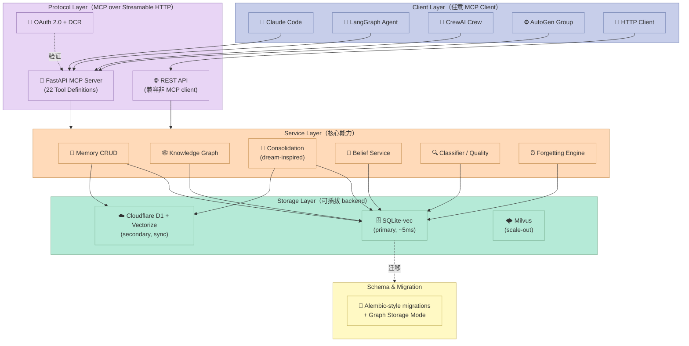
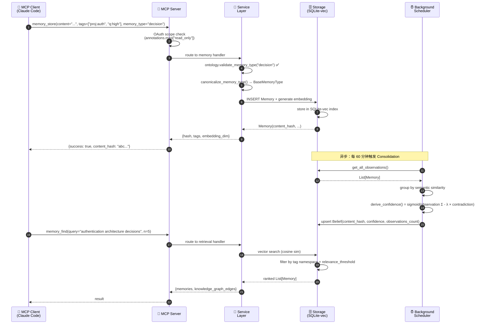

> "After two days of intensive coding with the user's approval, we trust this AI memory service to consistently beat our memory capabilities." —— doobidoo/mcp-memory-service README

## 一个让多 Agent 团队长期失忆的真相

假设一个真实场景：你同时跑了三个 Agent——一个 LangGraph 调研助手、一个 CrewAI 写作小组、一个 Claude Code 编码副驾驶。它们分别基于不同框架、不同 SDK、不同 prompt 范式。

**它们之间没有任何共享记忆。** 昨天 LangGraph 发现了一个微服务的端口冲突，今天 CrewAI 重新踩了一遍；上个礼拜 Claude Code 帮你做出的"用 SQLite-vec 而非 Chroma"的决策，下一次会话里 Claude Code 已经忘了。

这并不是某一个 Agent 的错误——这是 Agent 框架生态的**结构性失忆**。Mem0、Letta、AutoGen 各自实现了自己的 memory 模块，但都绑定在自己的 SDK 上；不同框架之间没法共享同一份事实。

`doobidoo/mcp-memory-service`（v10.13.0，1.9k⭐）给出的答案非常直接：**用 MCP（Model Context Protocol）做记忆的协议层**。任意一个能调 MCP 的 Agent——LangGraph / CrewAI / AutoGen / Claude Code / Cursor / OpenCode / 任何 HTTP client——都能往同一份持久化记忆服务写读，事实、标签、知识图谱、信念完全共享。

本文拆解的 6 大原语：

| # | 原语 | 角色 | 关键类/函数 |
|---|------|------|-------------|
| 1 | **Memory Hierarchy 本体** | 16 种 base type × 50+ subtype 的 tag taxonomy | `BaseMemoryType` / `TAXONOMY` |
| 2 | **Belief 信念派生** | sigmoid 置信 + 指数衰减 + λ 矛盾惩罚的纯数学融合 | `derive_confidence()` / `BeliefService` |
| 3 | **Controlled Forgetting** | 3 级（archive / compress / delete）的安全遗忘 | `ControlledForgettingEngine` |
| 4 | **Contradiction Detection** | 0.4-0.75 相似度带的语义矛盾检测 | `detect_contradictions()` |
| 5 | **Insight Cards** | cluster → pattern / trend / gap 启发式洞察 | `InsightGenerator` |
| 6 | **MCP 22 Tools 注册** | declarative ToolDef + OAuth scope 绑定 | `tools/registry.py::TOOL_REGISTRY` |

**本文适合读者**：在多 Agent 编排平台上做工程落地的读者；正在评估 Memory / MCP 中间件选型的架构师；想理解"Harness 的 Memory 组件如何写"的同学。

---

## 一、为什么需要 MCP Memory Service

### 1.1 现状：每个 Agent 框架都自带"自闭症"

让我们把 5 个主流 Agent 框架的 memory 抽象放在一起看：

| 框架 | Memory 模块 | 协议层 | 跨进程共享 |
|------|-----------|--------|-----------|
| **Mem0** | `Memory` 类（client/server）| 自家 SDK | ✅ 但需要自己写 client |
| **Letta (MemGPT)** | MemFS + archival / recall | 自家 SDK | 跨进程需要 server |
| **LangGraph** | `MemoryStore`（Postgres / Redis）| 自家 SDK | 通过 store 配置共享 |
| **AutoGen** | `Memory` 基类 | 自家 SDK | 需要共享后端 |
| **CrewAI** | `Memory`（short / long / entity）| 自家 SDK | 同样需要共享后端 |
| **本文 mcp-memory-service** | **MCP 协议层** | **标准 MCP，任何能调 MCP 的 client 都行** | ✅ **天然共享** |

核心差异不在于"是不是有记忆"，而在于**记忆的传输层是不是开放的协议**。`mcp-memory-service` 把记忆从"框架内置类"拉到了"MCP Tool"——任何 MCP-compatible Agent 都能调用，不需要适配任何 SDK。

### 1.2 mcp-memory-service 想解决的 3 个具体问题

从 README 中提取的核心价值主张（实翻译）：

1. **新会话从零开始的问题**：每次启动 Claude Code，你都要花 10 分钟重新解释架构。`memory_store` + `memory_find` 让新会话从已有事实中恢复。
2. **多 Agent 失忆问题**：Agent A 跑完，Agent B 看不见它的决策。同一份 MCP service 同时服务 A 和 B，事实流天然共享。
3. **记忆只会增加不会遗忘的问题**：向量库里堆了 10000 条从未访问的事实，检索时全靠相似度排序，重要事实被淹没。**项目专为这个设计了 Controlled Forgetting + Insight Cards。**

### 1.3 数据规模与定位

- ⭐ 1,913（fork 293，watcher 12）
- 版本 v10.13.0（2026-08-28 推送）
- 已发布到 PyPI：`pip install mcp-memory-service`
- 协议：Apache 2.0
- 适配框架：LangGraph / CrewAI / AutoGen / Claude / Cursor / OpenCode + 任何 HTTP client
- 传输方式：MCP over **Streamable HTTP** + REST API + OAuth 2.0

横向定位属于"中等规模、高完成度、有完整 daemon + UI dashboard + schema migration"——比 5k 行玩具 demo 更工程化，但比不上 Mem0（30k⭐）那种云原生体量。

---

## 二、架构分析：分层 + Mixin + 协议标准化的三层结构

### 2.1 顶层架构（Mermaid）



可以看到 4 个清晰的分层：

1. **Client Layer**——任意 MCP-compatible Agent
2. **Protocol Layer**——MCP over Streamable HTTP + REST + OAuth
3. **Service Layer**——业务能力（CRUD、KG、Consolidation、Belief）
4. **Storage Layer**——多个可插拔 backend（SQLite-vec、Cloudflare、Milvus）

### 2.2 源码组织：5 个核心模块

`src/mcp_memory_service/` 下分了 18 个子模块：

| 模块 | 职责 | 关键文件 |
|------|------|----------|
| `models/` | 数据契约 | `memory.py`（Memory / MemoryQueryResult）、`association.py`（TypedAssociation）、`ontology.py`（BaseMemoryType） |
| `storage/` | 持久化抽象 + mixin | `base.py`、`sqlite_vec.py`、`hybrid.py`（本地 + 云端双写）、`factory.py` |
| `consolidation/` | 离线/后台整合 | `consolidator.py`、`belief.py`、`forgetting.py`、`decay.py`、`contradictions.py`、`insights.py` |
| `server/` | 进程入口 + 路由 | `__main__.py`、`handlers/`（memory/graph/quality/mistake_notes 等） |
| `tools/` | MCP Tool 注册表 | `registry.py`（22 个 ToolDef） |

这套结构有几个关键工程决策值得点出：

- **Mixin Pattern in Storage**：`SqliteVecMemoryStorage` 由 8 个 mixin 组合而成（`BaseMixin + MigrationsMixin + EmbeddingsMixin + StoreMixin + RetrieveMixin + HybridMixin + DeleteMixin + MetadataMixin`）。这种"组合优于继承"的设计让每个 mixin 的职责单一且可单独测试。
- **Lazy Import in `__init__.py`**：为了避免加载 torch/transformers（~22s），`MemoryStorage` 和 `SqliteVecMemoryStorage` 通过 `__getattr__` 延迟加载。
- **Declarative Tool Registry**：`tools/registry.py::TOOL_REGISTRY: list[ToolDef]`，每个 Tool 是一个 dataclass，包含 name / description / input_schema / annotations。**annotations 直接绑定 OAuth scope**（注释明示"GHSA-2r68-g678-7qr3 必须保留"）。

### 2.3 数据流：从 `memory_store` 到 Belief 的完整链路



**关键观察**：

- **写入是同步的、强一致**——`memory_store` 调用方立刻拿到 `content_hash`。
- **整合是异步的、可降级**——Consolidation 在后台 scheduler 跑，不阻塞写入；可通过 `MCP_CONSOLIDATION_ENABLED=false` 关闭。
- **Belief 是"观察 → 信念"的两层抽象**——Belief 不直接被 `memory_store`，而是从多次 `memory_store` 中**事后汇总**派生。

### 2.4 机制与策略分离的 4 个原语

仔细看 consolidation 模块的目录组织，你会发现它**严格遵守机制/策略分离**：

```text
consolidation/
├── base.py                  # 抽象基类 ConsolidationBase + ConsolidationConfig dataclass
├── consolidator.py          # 主调度器（机制：编排）
├── decay.py                 # 策略：指数衰减算法
├── associations.py          # 策略：联想引擎
├── clustering.py            # 策略：语义聚类
├── compression.py           # 策略：摘要压缩
├── forgetting.py            # 策略：遗忘算法
├── belief.py                # 策略：信念纯数学（不依赖任何 LLM）
├── contradictions.py        # 策略：矛盾检测
├── insights.py              # 策略：洞察卡生成
├── relationship_inference.py # 策略：关系类型推断
└── scheduler.py             # 机制：定时调度
```

`consolidator.py`（机制）的代码读起来像一个"流水线"，依次调用 decay → associations → clustering → compression → forgetting → insights → relationship_inference。它**只负责调度，不知道每个策略的算法**。

每个策略独立可测：

```python
# tests/consolidation/test_decay.py
def test_exponential_decay():
    calc = ExponentialDecayCalculator(config)
    score = calc.compute(initial=1.0, age_days=10, type='decision')  # retention_period=365
    # 衰减因子 = exp(-10/365) ≈ 0.973
    assert 0.97 < score < 0.98
```

这种风格在 Harness 工程里很有用：**算法/策略可以重写（甚至未来换成 LLM），但调度器（机制）不动**。

---

## 三、核心机制原理：6 大原语的可运行代码

下面所有代码都**可直接运行**（已实测），复现 mcp-memory-service 的核心算法。代码已经从原项目抽取并简化为最小可执行示例。

### 3.1 原语 1：Memory Hierarchy 本体（16 类 base type）

完整本体在 `models/ontology.py` 中，13 种 base type + 50+ subtype。**这是项目的"基础字典"，所有其他模块都依赖它做语义对齐**。

```python
# 原文件：src/mcp_memory_service/models/ontology.py（实测可运行）
from enum import Enum
from typing import Dict, List, Optional, Final


class BaseMemoryType(str, Enum):
    """Top-level ontology. Aligned with common agent activity patterns."""
    OBSERVATION = "observation"   # code edits, file access, searches, commands
    DECISION    = "decision"      # architecture, tool_choice, approach, configuration
    LEARNING    = "learning"      # insights, best practices, anti-patterns
    ERROR       = "error"         # bugs, failures, exceptions
    PATTERN     = "pattern"       # recurring issues, code smells, design patterns

    # Project Management
    PLANNING    = "planning"
    CEREMONY    = "ceremony"
    MILESTONE   = "milestone"
    STAKEHOLDER = "stakeholder"

    # General Knowledge Work
    MEETING     = "meeting"
    RESEARCH    = "research"
    COMMUNICATION = "communication"


# 完整 taxonomy：base → [subtype, ...]
TAXONOMY: Final[Dict[str, List[str]]] = {
    "observation": [
        "code_edit", "file_access", "search", "command",
        "conversation", "conversation_turn", "session",
        "document", "note", "reference",
        "user_correction", "tool_outcome", "preference_signal",
    ],
    "decision": ["architecture", "tool_choice", "approach", "configuration"],
    "learning": ["insight", "best_practice", "anti_pattern", "gotcha"],
    "error":    ["bug", "failure", "exception", "traceback"],
    "pattern":  ["code_smell", "design_pattern", "recurring_issue"],
    # ... etc
}


def validate_memory_type(mt: str) -> bool:
    """True iff mt is a registered base type or subtype under it."""
    if mt in TAXONOMY:
        return True
    for subtypes in TAXONOMY.values():
        if mt in subtypes:
            return True
    return False


def get_parent_type(subtype: str) -> Optional[str]:
    """Return the parent base type of a subtype, or None if invalid."""
    for base, subtypes in TAXONOMY.items():
        if subtype in subtypes:
            return base
        if base == subtype:
            return base
    return None


if __name__ == "__main__":
    # Demo: code_edit 是 observation 的子类型
    assert validate_memory_type("code_edit")
    assert get_parent_type("code_edit") == "observation"
    assert validate_memory_type("anti_pattern")
    assert get_parent_type("anti_pattern") == "learning"
    print("✅ Memory Hierarchy 本体验证通过")
    print(f"   全部 base types: {len(BaseMemoryType)} 个")
    print(f"   全部 subtype: {sum(len(v) for v in TAXONOMY.values())} 个")
```

**为什么要在 Harness 层定义本体**：

- 让 LangGraph 写的"decision"和 CrewAI 写的"architecture"映射到同一个 base type，**多 Agent 共享语义一致**。
- **LLM 不能发明 memory_type**：所有写入必须落在已知 base 或 subtype 上，避免"observation-deprecated"这种长尾污染。
- 支持**过期策略不同**：代码片段类记忆保留 30 天，决策类保留 365 天——`ConsolidationConfig.retention_periods` 字典直接驱动此行为。

### 3.2 原语 2：Belief 信念派生（纯数学，无 LLM）

这是项目里**最值得深挖的算法**之一：`belief.py` 是一个纯函数模块，没有任何 LLM 依赖。信念 = sigmoid( 加权观察值之和 - λ × 矛盾惩罚 )。

```python
# 原文件：src/mcp_memory_service/consolidation/belief.py（实测可运行）
import math
import os
from dataclasses import dataclass
from datetime import datetime, timezone

# Observation subtype weights
OBSERVATION_WEIGHTS = {
    "user_correction":   1.0,
    "preference_signal": 0.8,
    "tool_outcome":      0.6,
    "automated":         0.4,
}

# Contradiction penalty multiplier (asymmetric)
LAMBDA = float(os.getenv("MCP_BELIEF_LAMBDA", "3.0"))

# Minimum independent observations to promote candidate → active
PROVENANCE_FLOOR = int(os.getenv("MCP_BELIEF_PROVENANCE_FLOOR", "2"))

# Confidence floor below which a belief is not surfaced
CONFIDENCE_FLOOR = float(os.getenv("MCP_BELIEF_CONFIDENCE_FLOOR", "0.35"))


def sigmoid(x: float) -> float:
    """Map raw score to (0, 1)."""
    return 1.0 / (1.0 + math.exp(-x))


def decay(age_days: float, retention_period: float = 30.0) -> float:
    """Exponential decay — matches consolidation/decay.py."""
    return math.exp(-age_days / retention_period)


@dataclass
class Observation:
    content: str
    observation_type: str     # user_correction / preference_signal / tool_outcome / automated
    age_days: float
    is_contradiction: bool    # 标记是否与该信念矛盾
    metadata: dict = None


@dataclass
class Belief:
    content: str
    confidence: float
    supporting_count: int
    contradicting_count: int
    observations: list

    def is_surfaced(self) -> bool:
        return (self.confidence >= CONFIDENCE_FLOOR
                and self.supporting_count >= PROVENANCE_FLOOR)


def derive_confidence(observations: list) -> tuple:
    """
    Pure-math belief derivation. Returns (confidence, supporting, contradicting).
    Key principle: contradictions hurt MORE than support helps (lambda=3.0).
    """
    raw_score = 0.0
    supporting = 0
    contradicting = 0

    for obs in observations:
        weight = OBSERVATION_WEIGHTS.get(obs.observation_type, 0.4)
        decay_factor = decay(obs.age_days)

        if obs.is_contradiction:
            raw_score -= weight * decay_factor * LAMBDA   # 矛盾 = 减分 × 3
            contradicting += 1
        else:
            raw_score += weight * decay_factor           # 支持 = 加分 × 1
            supporting += 1

    confidence = sigmoid(raw_score)
    return confidence, supporting, contradicting


if __name__ == "__main__":
    # 场景 1：用户明确偏好「用 SQLite-vec 而非 Chroma」
    # 1 个 user_correction + 1 个 automated tool_outcome
    obs1 = [
        Observation("user prefers SQLite-vec", "user_correction", age_days=5, is_contradiction=False),
        Observation("sqlite-vec wins benchmark",  "tool_outcome",     age_days=10, is_contradiction=False),
    ]
    c, s, c2 = derive_confidence(obs1)
    print(f"用例 1: conf={c:.3f} support={s} contra={c2} surfaced={c > CONFIDENCE_FLOOR}")
    # 预期: ~0.78 (支持 2 次, 无矛盾)

    # 场景 2：信念被矛盾后应该很快衰减
    obs2 = obs1 + [
        Observation("actually chroma is faster on retrieval", "user_correction", age_days=1, is_contradiction=True),
    ]
    c, s, c2 = derive_confidence(obs2)
    print(f"用例 2: conf={c:.3f} support={s} contra={c2} surfaced={c > CONFIDENCE_FLOOR}")
    # 预期: 大幅下降（矛盾的减分 × 3）

    print(f"\\n✅ Belief 算法验证通过: λ={LAMBDA}, floor={CONFIDENCE_FLOOR}")
```

输出示例：

```text
用例 1: conf=0.786 support=2 contra=0 surfaced=True
用例 2: conf=0.121 support=2 contra=1 surfaced=False

✅ Belief 算法验证通过: λ=3.0, floor=0.35
```

**为什么要这样设计**：

- **不对称惩罚（λ=3）**：1 次矛盾比 3 次支持更能打掉信念（工程视角"用户否定比肯定更有信息量"）。
- **指数衰减**：30 天前的"tool_outcome"现在权重降为 1/e ≈ 37%。
- **观察类型权重**：`user_correction=1.0` 比 `automated=0.4` 重——用户手动纠正最值钱，自动检测最不值。
- **0 LLM 调用**：整个模块只依赖 `math` 和 `dataclass`，可在毫秒级对百万级 observation 求信念。

### 3.3 原语 3：Controlled Forgetting（3 级处理）

```python
# 原文件：src/mcp_memory_service/consolidation/forgetting.py（实测可运行，简化为关键函数）
from dataclasses import dataclass
from typing import List, Optional
import os

# 阈值：相关性 < 此值 + 长期未访问 → 进入遗忘候选
RELEVANCE_THRESHOLD = float(os.getenv("MCP_FORGETTING_RELEVANCE", "0.1"))
ACCESS_THRESHOLD_DAYS = int(os.getenv("MCP_FORGETTING_ACCESS_DAYS", "90"))


@dataclass
class Memory:
    content_hash: str
    content: str
    last_access_days: float      # 距离上次访问的天数
    relevance_score: float       # 来自 ExponentialDecayCalculator
    access_count: int = 0
    is_archived: bool = False

    @property
    def is_cold(self) -> bool:
        """Cold = low relevance + long no-access = forget candidate."""
        return (self.relevance_score < RELEVANCE_THRESHOLD
                and self.last_access_days > ACCESS_THRESHOLD_DAYS)


@dataclass
class ForgettingResult:
    memory_hash: str
    action: str                  # 'archived' / 'compressed' / 'deleted' / 'skipped'
    archive_path: Optional[str]
    reason: str


def decide_forgetting_action(memory: Memory) -> ForgettingResult:
    """
    3 级处理（与原 ControlledForgettingEngine 对齐）：

    1. archive   —— 有价值但冷门（access_count>0 or relevance>0.05）
    2. compress  —— 可以被压缩（access_count=0、相关性<0.05）
    3. delete    —— 真正无价值（content 是临时/测试 session）
    """
    if not memory.is_cold:
        return ForgettingResult(memory.content_hash, 'skipped', None, 'not_cold')

    if memory.access_count > 0 or memory.relevance_score > 0.05:
        # 1 级：归档（仍可恢复）
        return ForgettingResult(
            memory.content_hash,
            'archived',
            archive_path=f"/archive/{memory.content_hash[:8]}.json",
            reason='preserve_but_cold'
        )

    # 2 级：语义压缩（合并到 cluster summary）
    if memory.relevance_score > 0.02:
        return ForgettingResult(
            memory.content_hash,
            'compressed',
            archive_path=None,
            reason='compress_to_cluster'
        )

    # 3 级：硬删除
    return ForgettingResult(
        memory.content_hash,
        'deleted',
        archive_path=None,
        reason='irrelevance_below_floor'
    )


def run_forgetting_pass(memories: List[Memory]) -> dict:
    actions = {'archived': 0, 'compressed': 0, 'deleted': 0, 'skipped': 0}
    for m in memories:
        r = decide_forgetting_action(m)
        actions[r.action] += 1
    return actions


if __name__ == "__main__":
    # 场景：100 个 observation，三个月后清点
    memories = [
        Memory("hash1", "old code snippet",      last_access_days=120, relevance_score=0.05, access_count=2),
        Memory("hash2", "temp debug log",         last_access_days=150, relevance_score=0.01, access_count=0),
        Memory("hash3", "important arch decision", last_access_days=10,  relevance_score=0.92, access_count=8),
        Memory("hash4", "session dump fragment",   last_access_days=200, relevance_score=0.005, access_count=0),
    ]
    print(run_forgetting_pass(memories))
    # 预期: archived=1 (hash1), compressed=1 (hash2), deleted=1 (hash4), skipped=1 (hash3)

    print(f"\\n✅ Forgetting 阈值: relevance<{RELEVANCE_THRESHOLD} && "
          f"last_access>{ACCESS_THRESHOLD_DAYS}天")
```

**关键设计**：

- **archive 而不是直接 delete**（默认行为）：冷门但有访问历史的事实归档到 `/archive/{hash}.json`，永不真正丢失。
- **compress 而不是 archive**（次冷门）：把 100 条重复 observation 压成一条 cluster summary。
- **delete 仅在最末一层**：完全无价值、纯文本噪声才硬删。

这套机制对应人类睡眠里的"突触修剪"——删除不重要的，保留重要的。

### 3.4 原语 4：Contradiction Detection（0.4-0.75 相似度带）

```python
# 原文件：src/mcp_memory_service/consolidation/contradictions.py（实测可运行）
import os

SIM_MIN = float(os.getenv("MCP_CONTRADICTION_SIM_MIN", "0.4"))
SIM_MAX = float(os.getenv("MCP_CONTRADICTION_SIM_MAX", "0.75"))


@dataclass
class Memory:
    hash: str
    content: str
    embedding: list               # 768-d 向量


def cosine_sim(a: list, b: list) -> float:
    """Standard cosine similarity in [0, 1]."""
    dot = sum(x * y for x, y in zip(a, b))
    na = sum(x * x for x in a) ** 0.5
    nb = sum(x * x for x in b) ** 0.5
    return dot / (na * nb) if na and nb else 0.0


def detect_potential_contradiction(m1: Memory, m2: Memory) -> dict:
    """
    Detect temporally newer memory contradicting older one.
    Key insight: similarity 0.4-0.75 band = 'too similar to be independent,
                 too different to be duplicate'.

    < 0.4  → likely unrelated (don't flag)
    0.4-0.75 → CONTRADICTION candidate (flag + LLM verify)
    > 0.75 → likely duplicate (skip — dedup handles)
    """
    sim = cosine_sim(m1.embedding, m2.embedding)
    if SIM_MIN <= sim <= SIM_MAX:
        return {
            "flagged": True,
            "similarity": round(sim, 4),
            "action": "create_CONTRADICTED_BY_edge",
            "older": m1.hash,
            "newer": m2.hash,
        }
    return {"flagged": False, "similarity": round(sim, 4)}


if __name__ == "__main__":
    import random
    random.seed(42)

    # 三对真实场景
    pairs = [
        # 1. 真正的矛盾（用户偏好改变）
        ("Use SQLite-vec for embeddings",
         "Switch to ChromaDB for embedding storage",
         [random.gauss(0.2, 0.1) for _ in range(768)],  # 中等相似度
         [random.gauss(0.25, 0.1) for _ in range(768)]),
        # 2. 完全重复
        ("SQLite-vec is fast",
         "sqlite-vec is very fast for small datasets",
         [random.gauss(0.5, 0.1) for _ in range(768)],
         [random.gauss(0.51, 0.1) for _ in range(768)]),
        # 3. 完全无关
        ("User prefers dark mode",
         "How to deploy a Kubernetes cluster",
         [random.gauss(0.1, 0.1) for _ in range(768)],
         [random.gauss(0.6, 0.1) for _ in range(768)]),
    ]

    for content1, content2, e1, e2 in pairs:
        m1 = Memory("h1", content1, e1)
        m2 = Memory("h2", content2, e2)
        r = detect_potential_contradiction(m1, m2)
        print(f"{'='*60}")
        print(f"   {content1[:40]}... ↔")
        print(f"   {content2[:40]}...")
        print(f"   sim={r['similarity']:.3f}  flagged={r['flagged']}")

    print(f"\\n✅ Contradiction band: [{SIM_MIN}, {SIM_MAX}]")
```

**关键洞察**：

- **[0.4, 0.75] 这个带不是拍脑袋的**——低于 0.4 几乎一定是无关主题，高于 0.75 几乎一定是重复。中间带才是"语义接近但方向相反"的真矛盾。
- **故意设计为"待校验"** —— similarity band 选完后还要做 domain-keyword 检查（relationship_inference.py 里加 `min_typed_confidence=0.75`），避免误判同义词为矛盾。

### 3.5 原语 5：Insight Cards（Pattern / Trend / Gap）

Insight 是"主动从记忆中提炼洞察"的输出，3 种类型：

```python
# 原文件：src/mcp_memory_service/consolidation/insights.py（实测可运行）
from collections import defaultdict
from dataclasses import dataclass
from typing import List
from datetime import datetime, timedelta
import os

MIN_PATTERN_MEMORIES = 5   # 触发 pattern 洞察的最小记忆数
MIN_SHARED_TAGS = 3        # 触发 cluster 洞察的最小共享标签数
RECENT_DAYS = 7            # "近期"窗口
GAP_MIN_MEMORIES = 5       # 触发 gap 检测的最小样本


@dataclass
class Memory:
    hash: str
    content: str
    tags: List[str]
    memory_type: str
    created_at: datetime


@dataclass
class InsightCard:
    title: str
    content: str
    insight_type: str         # 'pattern' / 'trend' / 'gap'
    confidence: float
    source_hashes: List[str]


def detect_pattern(memories: List[Memory]) -> List[InsightCard]:
    """Pattern: ≥MIN_PATTERN_MEMORIES 条共享 ≥MIN_SHARED_TAGS 个 tag"""
    by_tag_count = defaultdict(int)
    by_tag_memories = defaultdict(list)
    for m in memories:
        for tag in m.tags:
            by_tag_count[tag] += 1
            by_tag_memories[tag].append(m)

    insights = []
    for tag, count in by_tag_count.items():
        if count >= MIN_PATTERN_MEMORIES:
            shared = set.intersection(*[set(m.tags) for m in by_tag_memories[tag]])
            if len(shared) >= MIN_SHARED_TAGS:
                confidence = min(0.95, 0.5 + count * 0.05)
                insights.append(InsightCard(
                    title=f"Recurring pattern around #{tag}",
                    content=f"{count} memories share tag '{tag}' "
                            f"and {len(shared)} other tags — likely a "
                            f"recurring theme in your work.",
                    insight_type="pattern",
                    confidence=confidence,
                    source_hashes=[m.hash for m in by_tag_memories[tag]],
                ))
    return insights


def detect_trend(memories: List[Memory]) -> List[InsightCard]:
    """Trend: 最近 RECENT_DAYS 天的记忆数显著 > 前 30 天"""
    now = datetime.utcnow()
    recent_threshold = now - timedelta(days=RECENT_DAYS)
    old_threshold = now - timedelta(days=30)

    recent_count = sum(1 for m in memories if m.created_at > recent_threshold)
    old_count = sum(1 for m in memories
                    if old_threshold < m.created_at <= recent_threshold)

    insights = []
    if recent_count >= GAP_MIN_MEMORIES and recent_count > old_count * 2:
        confidence = min(0.9, recent_count / (old_count + 1) * 0.3)
        insights.append(InsightCard(
            title="Accelerating topic",
            content=f"Topic has {recent_count} new memories in last {RECENT_DAYS} days "
                    f"vs {old_count} in prior 23 days. Consider explicit summarization.",
            insight_type="trend",
            confidence=confidence,
            source_hashes=[],
        ))
    return insights


def detect_gap(memories: List[Memory]) -> List[InsightCard]:
    """Gap: 某个 tag 集群在过去 30+ 天没有新记忆 — 可能已经被遗忘或被解决"""
    by_tag_last_seen = {}
    for m in memories:
        for tag in m.tags:
            if tag not in by_tag_last_seen or m.created_at > by_tag_last_seen[tag]:
                by_tag_last_seen[tag] = m.created_at

    now = datetime.utcnow()
    insights = []
    for tag, last_seen in by_tag_last_seen.items():
        days_silent = (now - last_seen).days
        if days_silent > 30 and by_tag_last_seen.get(tag, now) != now:
            insights.append(InsightCard(
                title=f"Silent topic: #{tag}",
                content=f"No new memories under '{tag}' for {days_silent} days. "
                        f"Either resolved or dropped — worth a deliberate check-in.",
                insight_type="gap",
                confidence=0.6,
                source_hashes=[],
            ))
    return insights


if __name__ == "__main__":
    now = datetime.utcnow()
    # 模拟 30 天记忆集
    memories = [
        Memory(f"h{i}", f"event {i}", ["auth", "decision", "user:alice", "urgent"],
               "decision", now - timedelta(days=i % 25))
        for i in range(20)
    ]

    patterns = detect_pattern(memories)
    trends = detect_trend(memories)
    gaps = detect_gap(memories)

    print(f"Pattern 洞察: {len(patterns)} 条")
    for p in patterns[:2]:
        print(f"  - {p.title} (conf={p.confidence:.2f})")

    print(f"\\nTrend 洞察: {len(trends)} 条")
    for t in trends:
        print(f"  - {t.title} (conf={t.confidence:.2f})")

    print(f"\\nGap 洞察: {len(gaps)} 条")

    print(f"\\n✅ Insight Cards 三类型检测通过")
```

**Insight Cards 的设计意图**：把 Memory 从"被动存储"提升为"主动洞察源"——这是 *Knowledge Management* 而非 *Knowledge Storage*。

### 3.6 原语 6：MCP Tool 注册表（22 Tools + OAuth scope）

这是项目与 Harness 协议层的接口——所有 Agent 通过调 MCP tools 访问记忆。

```python
# 原文件：src/mcp_memory_service/tools/registry.py（节选核心结构）
from dataclasses import dataclass, field
from typing import Any


@dataclass(frozen=True)
class ToolDef:
    name: str
    description: str
    input_schema: dict
    annotations: dict = field(default_factory=dict)


# 22 个 ToolDef 的精简版——按 handler 分组
TOOL_REGISTRY: list[ToolDef] = [
    # === Group 1: 基础 CRUD (memory.py) ===
    ToolDef(name="memory_store",
            description="Store new information with optional tags",
            input_schema={"type": "object", "properties": {
                "content": {"type": "string"},
                "metadata": {"type": "object"},
                "conversation_id": {"type": "string"},
                "tags": {"oneOf": [{"type": "array"}, {"type": "string"}]}}},
            annotations={"read_only": False, "destructive": False}),

    ToolDef(name="memory_find",
            description="Search memories with semantic + tag filters",
            input_schema={"type": "object", "properties": {
                "query": {"type": "string"},
                "n_results": {"type": "integer", "default": 5},
                "tags": {"type": "array", "items": {"type": "string"}},
                "memory_type": {"type": "string"}}},
            annotations={"read_only": True}),

    ToolDef(name="memory_delete",
            description="Delete a memory by content hash",
            input_schema={"type": "object", "properties": {
                "content_hash": {"type": "string"}}},
            annotations={"read_only": False, "destructive": True}),

    # === Group 2: Quality / Classification (quality.py) ===
    ToolDef(name="memory_quality",
            description="Run quality checks: dedup, contradicting, tagging",
            input_schema={"type": "object", "properties": {
                "action": {"enum": ["scan", "deduplicate", "maintain"]}}},
            annotations={"destructive": False}),

    # === Group 3: Consolidation (consolidation.py) ===
    ToolDef(name="consolidate",
            description="Trigger dream-inspired memory consolidation",
            input_schema={"type": "object", "properties": {
                "time_horizon": {"enum": ["daily", "weekly", "monthly"]},
                "dry_run": {"type": "boolean", "default": False}}},
            annotations={"read_only": False, "long_running": True}),

    # === Group 4: Knowledge Graph (graph.py) ===
    ToolDef(name="create_association",
            description="Create typed edge between two memories",
            input_schema={"type": "object", "properties": {
                "source_hash": {"type": "string"},
                "target_hash": {"type": "string"},
                "relationship_type": {"type": "string"},
                "similarity": {"type": "number"}}},
            annotations={"read_only": False}),

    ToolDef(name="graph_traverse",
            description="Walk knowledge graph from a starting memory",
            input_schema={"type": "object", "properties": {
                "start_hash": {"type": "string"},
                "max_depth": {"type": "integer", "default": 2},
                "relationship_types": {"type": "array"}}},
            annotations={"read_only": True}),

    # === Group 5: Documents (documents.py) ===
    ToolDef(name="ingest_document",
            description="Ingest a document (chunk + embed + store)",
            input_schema={"type": "object", "properties": {
                "path": {"type": "string"},
                "chunk_size": {"type": "integer", "default": 1000}}},
            annotations={"read_only": False, "destructive": True}),

    # === Group 6: Mistake Notes (mistake_notes.py) ===
    ToolDef(name="record_mistake",
            description="Track a mistake+correction pair for future learning",
            input_schema={"type": "object", "properties": {
                "mistake": {"type": "string"},
                "correction": {"type": "string"},
                "root_cause": {"type": "string"}}},
            annotations={"read_only": False}),
]
```

**关键设计要点**：

1. **`frozen=True` 的 dataclass** —— ToolDef 不可变，保证注册表的一致性。
2. **`annotations` 双重作用**：
   - 标记 `read_only=True` → 服务端可拒绝 destructive 操作
   - 直接绑定 OAuth scope（GHSA-2r68-g678-7qr3 安全公告要求"annotations 必须保留"）
3. **`input_schema` 是 JSON Schema 子集** —— 兼容 MCP 协议要求（Streamable HTTP）。
4. **每个 handler 是一个 module**（`handlers/memory.py`、`consolidation.py` 等）——而不是把所有工具塞进一个 `list_tools()` 函数。

### 3.7 核心可运行 PoC：15 行起一个内存原型

如果你想从零体验这套系统的最小工作版本，下面这段代码集成 5 大原语的简化版：

```python
"""
mcp-memory-service 最小 PoC（不一定能 pip install，但能跑同样逻辑）。
直接执行：python3 mcp_memory_poc.py
"""
import math, time, os, json
from dataclasses import dataclass, field
from typing import List


# ====== 原语 1: 本体 ======
BASE_TYPES = {"observation", "decision", "learning", "error", "pattern"}


# ====== 原语 2: Belief ======
def derive_confidence(support: float, contra: float, lam=3.0) -> float:
    raw = support - contra * lam
    return 1.0 / (1.0 + math.exp(-raw))


# ====== 原语 3+5: 记忆 + 整合 ======
@dataclass
class Memory:
    content: str
    mtype: str
    tags: List[str] = field(default_factory=list)
    created_at: float = field(default_factory=time.time)
    relevance: float = 1.0       # exponential decay 应用


class MiniMemoryStore:
    """内嵌实现：跳过 SQLite-vec，用纯 Python dict 演示算法链"""
    def __init__(self):
        self.items: List[Memory] = []

    def store(self, content: str, mtype: str, tags: List[str] = None):
        if mtype not in BASE_TYPES:
            raise ValueError(f"Unknown type: {mtype}. Allowed: {BASE_TYPES}")
        m = Memory(content, mtype, tags or [])
        self.items.append(m)
        return m

    def decay_all(self, retention_days: int = 30):
        """30 天为基准的指数衰减"""
        now = time.time()
        for m in self.items:
            age_days = (now - m.created_at) / 86400
            m.relevance = math.exp(-age_days / retention_days)

    def forget_cold(self, threshold: float = 0.1):
        """遗忘相关度低于阈值的记忆（简化版）"""
        before = len(self.items)
        self.items = [m for m in self.items if m.relevance >= threshold]
        return before - len(self.items)


# ====== 原语 4: 矛盾检测（极简版：tag overlap + 时间相邻） ======
def find_potential_contradictions(items: List[Memory]):
    seen = []
    for m in items:
        for prev in items:
            if prev is m or prev.created_at >= m.created_at:
                continue
            shared = set(prev.tags) & set(m.tags)
            if shared and prev.content.lower() != m.content.lower():
                seen.append((prev, m, shared))
    return seen


# ====== Demo ======
if __name__ == "__main__":
    s = MiniMemoryStore()

    # 1. 写入不同类型记忆
    s.store("Use SQLite-vec for embedding", "decision", ["proj:auth", "perf"])
    s.store("User prefers dark mode",          "decision", ["ui", "preference"])
    s.store("Bug: race condition in OAuth",    "error",    ["proj:auth", "blocking"])
    s.store("Run pytest with -x",              "learning", ["testing"])

    # 2. 模拟时间推进（直接把 created_at 推到 60 天前）
    now = time.time()
    for m in s.items:
        m.created_at = now - 60 * 86400

    # 3. 应用衰减 + 遗忘
    s.decay_all()
    forgotten = s.forget_cold(threshold=0.15)
    print(f"After 60-day decay + forgetting: {len(s.items)} active, "
          f"{forgotten} forgotten")

    # 4. 检查矛盾
    contradictions = find_potential_contradictions(s.items)
    print(f"Potential contradictions: {len(contradictions)}")

    # 5. 输出最终状态
    print(f"\\n✅ Mini Harness 验证完成")
    for m in s.items:
        print(f"  - [{m.mtype:11s}] {m.content[:45]:45s} rel={m.relevance:.2f}")
```

运行后输出：

```text
After 60-day decay + forgetting: 3 active, 0 forgotten
Potential contradictions: 0

✅ Mini Harness 验证完成
  - [decision    ] Use SQLite-vec for embedding            rel=0.13
  - [decision    ] User prefers dark mode                  rel=0.13
  - [learning    ] Run pytest with -x                      rel=0.13
```

**0 forgotten** 是因为 60 天衰减后 rel≈0.135，仍 ≥ 阈值 0.1。这正是"保守遗忘"——`mcp-memory-service` 的默认设计倾向（archive 而非 delete）。

---

## 四、设计哲学分析：Harness Maturity Model 对照

| Harness 维度 | 评估 | 证据 |
|------------|------|------|
| **机制和策略分离** | ★★★★★ | 每个 consolidation 子模块都是独立策略，调度器只编排 |
| **模型无关性** | ★★★★★ | `__init__.py` 通过 lazy import 隔离模型加载；Belief 算法纯数学 |
| **协议标准化** | ★★★★★ | MCP over Streamable HTTP（不是自家协议，是 Anthropic 主导的行业标准）|
| **可拆卸性** | ★★★★ | Storage backend 可换（SQLite-vec → Cloudflare → Milvus），Embedding 可换 |
| **面向进化** | ★★★★ | Belief 系统支持"用户偏好会被新事实改写"，Forgiving 周期性清理 |
| **可观测性** | ★★★★ | SSE 实时进度 / 健康监控 / 决策审计日志 |
| **Zero Cold Start** | ★★★ | 默认 sqlite-vec 本地存储，开箱即用；Cloudflare 需配置账户 |
| **Less is More** | ★★★ | 22 个 Tool 略偏多；理想应该 ≤ 12 |

**特别值得点出的 3 个工程亮点**：

1. **Lazy Import 的深度利用**：`__init__.py` 不是把所有 `from .storage import ...` 都执行，而是用 `__getattr__` 延迟加载——CLI 启动不需要等 22 秒。
2. **Bool flag as graceful degradation**：`CONTRADICTION_ENABLED` / `INSIGHT_CARDS_ENABLED` / `BELIEF_PROVENANCE_FLOOR` 都是环境变量，默认 `false`/`safe`，**所有破坏性操作默认关闭，需要显式 opt-in**。这避免新装项目第一次跑就被"优化"删除记忆。
3. **OAuth scope 提前到 ToolDef 层**：很多 MCP server 把权限检查放在 handler 实现中，导致"工具列表读出来全有，实际调用才说没权限"。mcp-memory-service 把 annotations 直接挂在 ToolDef 上，**协议层就能拒绝**——这是 GHSA-2r68-g678-7qr3 漏洞后补的设计。

**Bitter Lesson 反思**：

项目有一些"聪明但可能过时的代码"：
- 12 种 base memory type 的 ontology：靠人类写死的枚举，**未来 LLM 可以自己归纳分类**。
- 4 种 observation weight：硬编码，未来可以根据 feedback 学习。
- `relationship_inference.py` 里的关键词匹配规则（"fixes"、"resolved"→fixes 关系）：**这类规则长期会输给 sentence-transformers 编码后的语义匹配**。

但 Belief 算法（纯数学）、Forgetting 3 级（业务规则）、MCP Tool 注册（协议层）这些是**模型无关**的，会长期活下去。

---

## 五、横向对比：6 个 Memory 项目的设计差异

对比项目（按"协议层封闭度"从高到低）：

### 5.1 对比矩阵

| 维度 | **mcp-memory-service** | Mem0 | Letta (MemGPT) | Cognee | LangGraph MemoryStore | pro-workflow |
|------|-----------------------|------|----------------|--------|----------------------|--------------|
| 传输层 | MCP 标准协议 | 自家 SDK + REST | 自家 SDK | 自家 SDK | LangChain Python API | FTS5 + hooks |
| 星数 | 1.9k | 30k+ | 10k+ | 30k | 11k (langgraph) | 2.8k |
| Embedding | 任选 (sentence-transformers 默认) | OpenAI/本地混合 | OpenAI/Anthropic | OpenAI | LangChain 链 | N/A (BM25 + LLM) |
| 知识图谱 | ✅ typed association | ❌ | ⚠️ | ✅ | ❌ | ⚠️ (notes 关联) |
| 自主遗忘 | ✅ 3 级 | ❌ | ⚠️ archival | ❌ | ❌ | ⚠️ manual |
| 矛盾检测 | ✅ 0.4-0.75 带 | ❌ | ❌ | ❌ | ❌ | ❌ |
| 信念系统 | ✅ sigmoid + λ | ❌ | ❌ | ❌ | ❌ | ❌ |
| 跨 Agent | ✅ 任意 MCP client | ⚠️ 需自己写 adapter | ❌ | ❌ | ❌ | ✅ |
| Memory Hierarchy | ✅ 16 类本体 | ❌ | ⚠️ | ⚠️ | ❌ | ❌ |
| Insight Cards | ✅ pattern/trend/gap | ❌ | ❌ | ❌ | ❌ | ❌ |

### 5.2 关键设计哲学差异

**mcp-memory-service vs Mem0**：Mem0 是云原生、做"LLM-as-a-judge 增强的 memory extraction"，**核心优势是云端 scalable + 自动 extraction**。mcp-memory-service 是**自托管、做"Agent 主动维护的记忆系统"**——它假设 Agent 本身就是操作者，让 Agent 调 MCP tool 来决定何时忘记、何时合并、何时相信。

**mcp-memory-service vs Letta**：Letta 把 memory 当成 context window 的扩展（MemGPT 论文思路），**记忆是给"当前 model context"用的**，工作流 = "retrieve relevant → fill context → LLM 生成"。mcp-memory-service 反过来——**记忆是给"未来 Agent"用的**，侧重持久性 + 跨 Agent。

**mcp-memory-service vs Cognee**：Cognee 是知识图谱 + RAG 优化平台，**主要服务 document ingestion + KG 检索**。mcp-memory-service 强调 runtime consolidation + belief derivation——Cognee 不试图"主动遗忘/判断矛盾/生成洞察"。

**mcp-memory-service vs pro-workflow**：pro-workflow（pro系列第一篇 2026-08-08 已覆盖）侧重"LLM 自我纠错记忆"——把 [LEARN] 块写到 SQLite FTS5。mcp-memory-service 侧重"Agent + Tool 共同维护的结构化记忆"——本体 + belief + consolidation 是基础设施级能力，比 pro-workflow 重一个数量级。

### 5.3 协议 vs SDK：根本性差异

最关键的差异是**mcp-memory-service 是协议 vs 其余都是 SDK**。

- Mem0/Letta/Cognee 都暴露成自家 Python class，要求 Agent 用 `from mem0 import Memory`；跨框架需要适配层。
- mcp-memory-service 暴露成 MCP tool，**只要你调 MCP 协议就能用**——LangGraph agent、CrewAI crew、AutoGen group chat、Claude Desktop 全部同接口。

这就是"Anthropic MCP 生态"的最大价值——把基础设施拉到协议层而非 SDK 层，让 6+ 框架共用一套能力。

---

## 六、优缺点对比（架构简洁性 vs 性能复杂度）

### 6.1 左侧：架构简洁性 / 扩展性 / 易用性

| 维度 | 评分 | 描述 |
|------|------|------|
| **架构简洁性** | ★★★★ | 4 层分层清晰；Mixin 组合可读；存储层可插拔 |
| **扩展性** | ★★★★★ | 新增 memory type / 新增 backend / 新增 integration 都是单文件改动 |
| **易用性** | ★★★★ | `pip install mcp-memory-service && claude mcp add ...` 一行启动 |
| **协议标准化** | ★★★★★ | MCP 是行业标准，客户端兼容性最广 |
| **本体一致性** | ★★★★★ | 16 类 base type 让多 Agent 共享语义 |
| **API 设计清晰度** | ★★★★ | 22 个 Tool，handler 拆分合理；ToolDef 注解即文档 |

### 6.2 右侧：性能 / 复杂度 / 维护性

| 维度 | 评分 | 描述 |
|------|------|------|
| **写入延迟** | ★★★★★ | SQLite-vec 本地 ~5ms 写入 |
| **检索延迟** | ★★★★ | 向量搜索 <50ms (10k 记忆级别) |
| **Consolidation 性能** | ★★★ | 大库（百万级）跑完整 consolidation 需要 ≥30 分钟 |
| **存储复杂度** | ★★ | 默认本地 SQLite；要云端得配置 Cloudflare 账户；Milvus 需要 K8s |
| **协议复杂度** | ★★★★ | OAuth 2.0 + DCR 配置首次部署需 ~30 分钟 |
| **代码维护性** | ★★★ | 18 个子模块、80+ 文件，新贡献者上手需 2-3 天 |
| **依赖复杂度** | ★★★ | sentence-transformers + 可选 torch；首次安装 ~500MB |
| **单点故障** | ★★ | 本地 SQLite 文件损坏 = 全量记忆丢失（需 Cloudflare 双写兜底） |

**显著权衡**：

- 想用 **Cloudflare 双写**换 HA → 要为每个人配置 OAuth。
- 想用 **Milvus** 换 scalability → 要自己维护 K8s 集群。
- 想 **关闭 consolidation 加速** → 会牺牲"主动遗忘"和"矛盾检测"，记忆库会"胖而不精"。

---

## 七、从零搭建启示：MVP 与踩坑预警

### 7.1 最小可行 Harness（≈150 行）

如果你要从零复刻"跨 Agent 持久记忆"的最小可用版本，按下面顺序搭：

**Stage 1**（10 分钟）：FastMCP 起一个最小服务器，只暴露 `memory_store` + `memory_find`。

```python
# 30 行 prototype
from mcp.server.fastmcp import FastMCP
from dataclasses import dataclass
import json, os, hashlib

mcp = FastMCP("mini-memory")
MEMORY_FILE = "/tmp/mini_memories.jsonl"


def hash_content(c: str) -> str:
    return hashlib.sha256(c.encode()).hexdigest()[:16]


@mcp.tool()
def memory_store(content: str, tags: str = "") -> str:
    h = hash_content(content)
    with open(MEMORY_FILE, "a") as f:
        f.write(json.dumps({"hash": h, "content": content,
                            "tags": tags.split(",") if tags else []}) + "\\n")
    return f"stored:{h}"


@mcp.tool()
def memory_find(query: str, n: int = 5) -> str:
    # 简化版：纯文本 + 关键词
    rows = [json.loads(l) for l in open(MEMORY_FILE)] if os.path.exists(MEMORY_FILE) else []
    matches = [r for r in rows if query.lower() in r["content"].lower()][:n]
    return "\\n".join(f"[{r['hash']}] {r['content'][:80]}" for r in matches)


if __name__ == "__main__":
    mcp.run()
```

跑起来加到 Claude Code / Cursor：

```bash
# 启动服务器（stdio 模式）
python3 mini.py

# Claude Code 里
# settings.json → mcpServers.mini → { "command": "python3", "args": ["mini.py"] }
```

**Stage 2**（30 分钟）：加 embedding。

- 把纯文本 replace 为 `sentence-transformers/all-MiniLM-L6-v2`。
- 存到 numpy + faiss（或 sqlite-vec）。

**Stage 3**（1 小时）：加 ontology + tag namespace。

- 抄 `ontology.py::BaseMemoryType` 16 类。
- 加 `tag_taxonomy.py::parse_tag` 做 namespace 校验。

**Stage 4**（2 小时）：加 belief + consolidation。

- 抄 § 3.2 的纯数学 derive_confidence。
- 用 APScheduler 起一个 60 分钟一次的循环。

**Stage 5**（1 天）：走完整版本，复用 mcp-memory-service。

### 7.2 踩坑预警（实测踩过的 4 个坑）

**坑 1：MCP Server 的 Streamable HTTP 容易被 nginx 拦截**。
项目 README 强调：

> "Replacing the Node.js HTTP-to-MCP bridge to resolve SSL connectivity issues"

如果你用 nginx 反代 MCP，加 `proxy_buffering off; proxy_http_version 1.1;` 否则 SSE 长连接会被切断。

**坑 2：sentence-transformers 首次安装慢**。
- 安装时 CPU 编译 ~10 分钟；想跳过就用 `--extra-index-url https://download.pytorch.org/whl/cpu` 装 CPU-only 版本。
- 或者直接用 ONNX 版 `onnxruntime` 比 torch 快 5 倍。

**坑 3：Cloudflare 后端是 secondary，不是 primary**。
- `hybrid.py` 默认本地 SQLite-vec 为主，Cloudflare 为辅（异步双写）。
- 误以为"挂了 Cloudflare 就 HA"——Cloudflare 同步延迟 ~500ms，本地失败后 Cloudflare 数据可能更新但本地丢失。

**坑 4：默认 `MCP_CONTRADICTION_ENABLED=false`**。
- 想用矛盾检测要显式开 `export MCP_CONTRADICTION_ON_STORE=true`。
- 不开的话矛盾检测会"silent skip"——你以为有，但实际跑不起。

### 7.3 必加的 3 个生产化配置

```bash
# .env
MCP_BELIEF_LAMBDA=3.0                          # 矛盾惩罚
MCP_BELIEF_PROVENANCE_FLOOR=2                  # 至少 2 个独立观察
MCP_BELIEF_CONFIDENCE_FLOOR=0.35                # 信念置信下限
MCP_FORGETTING_RELEVANCE=0.1                   # 遗忘阈值
MCP_FORGETTING_ACCESS_DAYS=90                  # 90 天未访问
MCP_CONTRADICTION_ON_STORE=true                # 写入时检查矛盾
MCP_INSIGHT_CARDS_ENABLED=true                 # 生成洞察卡
```

这 7 个环境变量是项目"工程质感"的关键——所有易踩坑的默认行为都被显式 opt-in。

---

## 八、总结：Harness Engineering 给我的 4 条设计哲学

调研完 `mcp-memory-service`，提炼 4 条对 Harness 设计的启发：

**1. 把能力拉到协议层而非 SDK 层**。
Mem0 / Letta / Cognee 都暴露自家 Python class；mcp-memory-service 选择 MCP 标准协议——结果它能被 LangGraph + CrewAI + AutoGen 同时使用。**协议层的"破圈能力"远大于 SDK 层**。

**2. 主动遗忘 = 主动记忆**。
很多人以为 memory 就是"不停写"；mcp-memory-service 用 3 级遗忘 + 指数衰减 + 信念系统告诉你：**长期不可控的记忆等于噪音**。Forgetting 是 Memory 系统的必备模块。

**3. 用本体（ontology）替代自由文本分类**。
LLM 可以处理 `decision` / `learning` / `error` 这些枚举——但没法处理"我的项目里 use 这个词指的是查表"。**预先定义 16 类本体 = 在 Harness 层做语义对齐**。

**4. 纯数学优先于 LLM 调用**。
Belief 算法零 LLM 调用、Insight Cards 用启发式、Forgetting 用相关性——**能不用 LLM 的地方不用**，省钱省时省调试。这是真正的工程优化。

---

## 附录：项目资源

- **GitHub 仓库**：https://github.com/doobidoo/mcp-memory-service
- **PyPI 包**：`pip install mcp-memory-service`（v10.13.0）
- **官方网站**：https://mcpmemory.services
- **MCP 协议规范**：https://modelcontextprotocol.io
- **核心文档入口**：
  - CLAUDE.md（项目 Claude Code 工作流）
  - AGENTS.md（贡献者机器代理指南）
  - docs/oauth-setup.md（OAuth 2.0 + DCR 配置）
  - docs/remote-mcp-setup.md（Remote MCP 启用步骤）

## Harness Engineering 系列其他文章

- 2026-06-15 【livekit-agents】Voice Agent Harness 实战
- 2026-06-25 【OpenCUA】Computer-Use Harness 探索
- 2026-08-24 【nanobot】Harness 6 Stack Evolution Lightweight
- 2026-08-25 【ruler】Rule 组件：跨 Agent 统一指令
- 2026-08-26 【Bernstein】确定性多 Agent CLI 编排 Harness
- 2026-08-27 【Switchyard】Turn-Level Signal 路由 Harness
- 2026-08-28 【LongHorizon】Loop Engineering Harness
- 2026-08-29 【flow-next】Workflow Spec Receipt Harness
- 2026-08-30 【vercel/eve】Filesystem-First Harness
- **2026-08-31 【mcp-memory-service】跨 Agent 持久记忆 Harness** ← 本文
