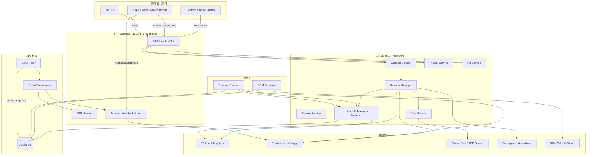
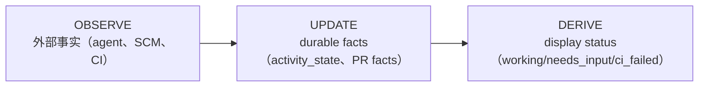
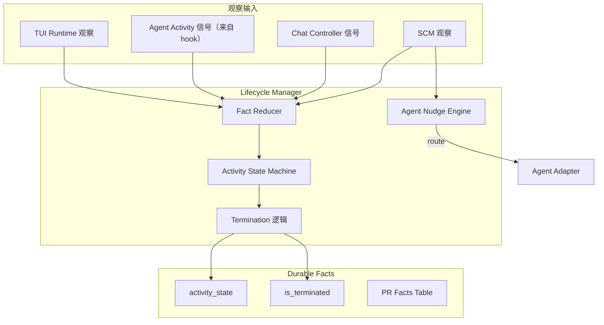
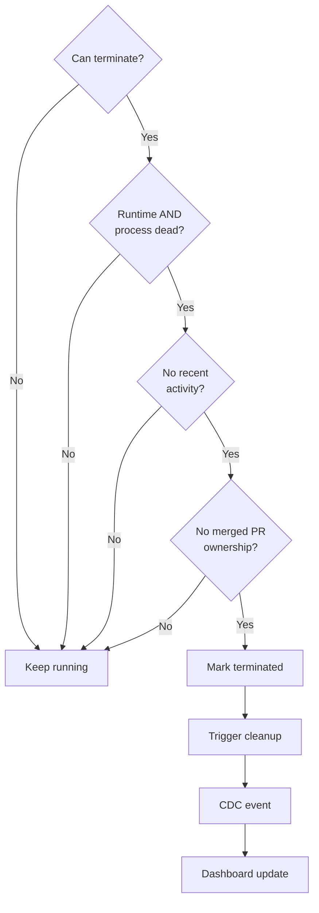
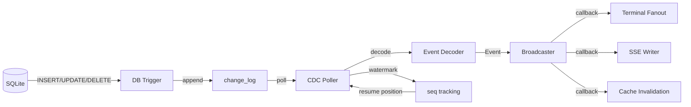
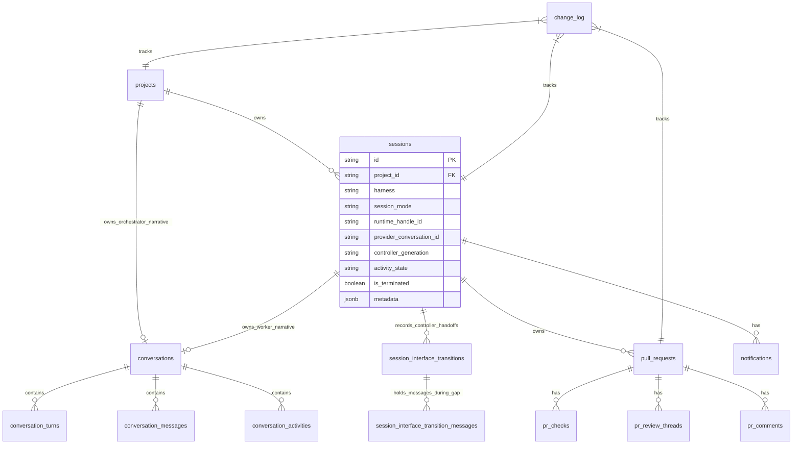
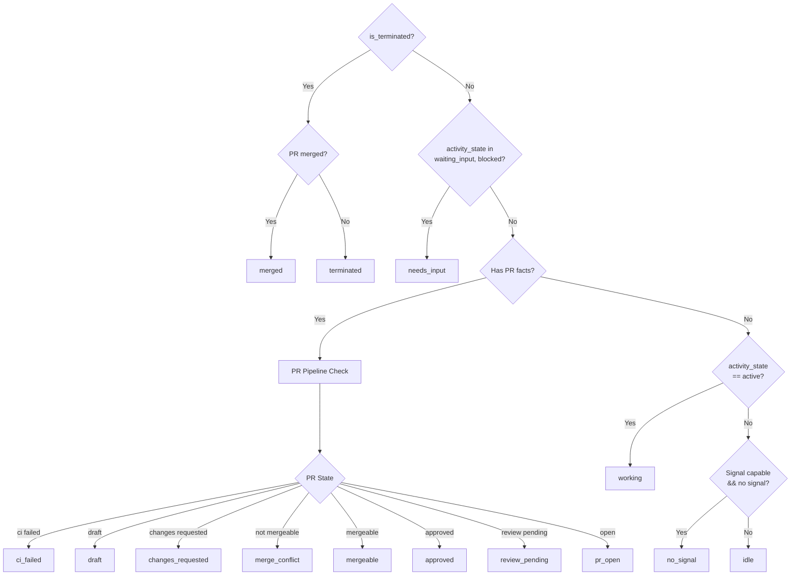
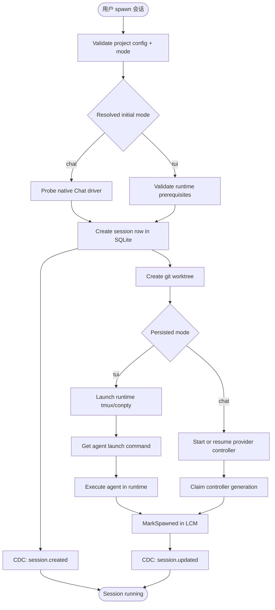
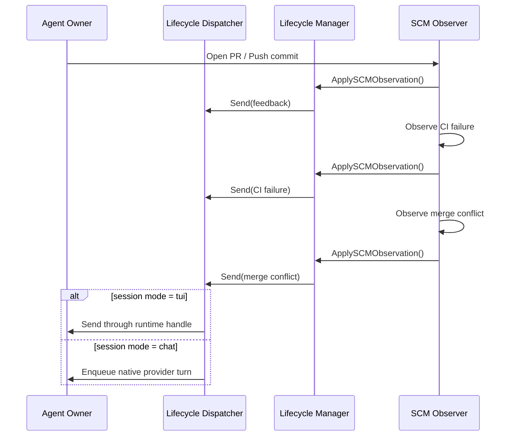
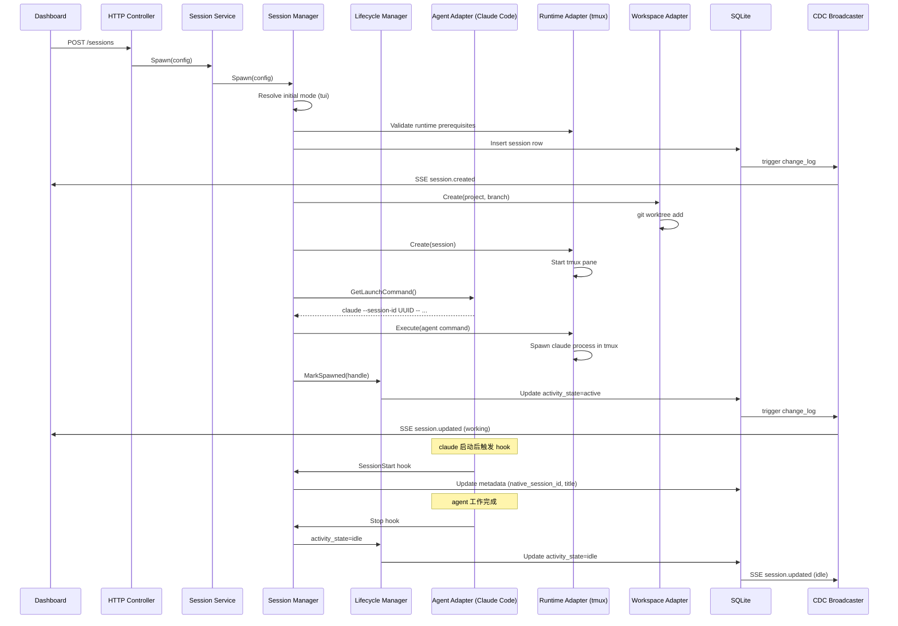

# 【Agent Orchestrator】26 个 Coding Agent 同台编排的桌面工作空间架构深度解析

> 一个会话、一个 worktree、一个 agent、一份反馈循环；一个项目、一个 orchestrator、一块 Kanban、一条事实管道。Agent Orchestrator 把 Coding Agent 从「命令行单跑」变成「团队协同」。

## 一、引子

2026 年的 Coding Agent 生态正经历一场结构性变化。年初 Claude Code、Codex、Cursor 等工具各自为战，单个 agent 在终端里处理单个任务。到了年中，开发者开始同时跑 2-5 个 agent：让一个修 bug、另一个重构、第三个写测试。但在命令行层面管理多 agent 会立刻撞墙——多个终端窗口、多个 worktree 目录、多个 PR、多个 CI 状态、多个 review 反馈……没有统一视图。

**Agent Orchestrator（AO）** 是为这个问题设计的桌面级解决方案。它用一个长跑的 Go daemon 同时监督 26 款主流 Coding Agent（Claude Code、Codex、Cursor、opencode、Aider、Copilot、Grok、Kimi、Pi、Droid、Crush、Cline、Goose、Qwen、Continue、Devin、Kiro、Kilo Code、Vibe、Muse、Agy、Autohand、Kimchi、Prime Agent），把每个会话绑定到一个隔离 git worktree，通过 OBSERVE-UPDATE-DERIVE 三段式事实管道把外部状态（agent 活动、SCM、CI、review、merge conflict）实时投影到 Kanban。架构核心是 **Port-Based 六边形设计 + Durable Facts + Derived Status + CDC 实时事件流**，把"agent 在跑什么"和"UI 该显示什么状态"完全解耦。

本文基于 `Untrivial-ai/agent-orchestrator` v0.0.1 / commit `b5f89334b1`（2026-09-01），深入剖析它的核心架构。

## 二、项目定位与核心价值

### 2.1 一句话定义

Agent Orchestrator 是一个**长跑型桌面工作空间**，让开发者把 26 款 Coding Agent 当作团队成员一样同时调度——每个 worker 拥有独立 worktree 与接口模式（terminal TUI 或 native Chat），所有会话通过共享的 durable facts 表和 SQLite CDC 事件流在 Kanban 上同台呈现。

### 2.2 仓库统计

| 维度 | 数值 |
| --- | --- |
| Stars | ⭐ 10,776 |
| License | Apache-2.0 |
| 主语言 | Go（后端 daemon）+ TypeScript（Electron/React 桌面端）|
| 大小 | 194 MB（前后端 + assets）|
| Commit 数 | 4,674+ PR（活跃度极高）|
| 默认分支 | `main` |
| 最近推送 | 2026-09-01 |

### 2.3 能力矩阵

| 维度 | AO 的实现 |
| --- | --- |
| 支持 agent 数 | 26 个 Coding Agent 同台 |
| 并发模型 | N 个 worker 会话并行 + 1 个 orchestrator 调度层 |
| 隔离方式 | 每个 worker 独立 git worktree + branch |
| 接口模式 | TUI（终端 interactive）+ Chat（native provider protocol），可运行时 handoff |
| 实时事件 | SQLite CDC trigger → poller → broadcaster → SSE/WebSocket |
| PR/CI 观察 | SCM Observer 异步轮询 GitHub/GitLab，reducer 转化为 durable facts |
| 反馈回环 | CI 失败、review 评论、merge conflict 自动 dispatch 回 owner agent |
| 移动端 | Expo + React Native + LAN authenticated REST/SSE |
| CLI | `ao` 命令（spawn/inspect/handoff/terminate）|

## 三、整体架构

AO 是经典的 **Port-Based 六边形架构**，核心代码永不依赖具体实现。所有外部系统（agent harness、tmux/conpty runtime、GitHub、SQLite）都通过 `backend/internal/ports/` 接口访问，由 `backend/internal/adapters/` 提供具体实现。



### 3.1 三段式事实管道

整个系统的**第一性原理**是 **OBSERVE → UPDATE → DERIVE**：



**关键洞察**：UI 显示状态**从不持久化**。它由 service 层在 read-time 从 durable facts 实时计算而来。这意味着：
- 没有任何「状态不一致」的修复逻辑——因为状态从来不被存储
- 任何字段变更自动级联到 UI——只要事实变化，状态自动更新
- 多个前端同时打开看到的状态完全一致——因为是同一份 facts 同一份算法

### 3.2 Durable Facts vs Derived Status

| 字段类型 | 表/字段 | 写入路径 |
| --- | --- | --- |
| **durable** | `activity_state`（active/idle/waiting_input/blocked/exited）| Lifecycle Manager reducer |
| **durable** | `is_terminated`（bool）| Lifecycle Manager |
| **durable** | `session_mode`（tui/chat）| Lifecycle Manager（CAS epoch）|
| **durable** | `runtime_handle_id` / `provider_conversation_id` | Lifecycle Manager |
| **durable** | `pr` / `pr_checks` / `pr_review_threads` | SCM Observer reducer |
| **durable** | `change_log`（所有表 trigger 追加）| DB trigger |
| **derived** | working / needs_input / ci_failed / mergeable | Service 层 read-time 计算 |
| **derived** | draft / changes_requested / approved | Service 层 read-time 计算 |

## 四、应用类型：TUI 与 Chat 双接口控制器 epoch

AO 把每个 worker 会话看作**两个接口模式之间的可切换状态机**：
- **TUI mode**：agent 跑在 tmux/conpty runtime 里，用户用 native 终端 UI 监督
- **Chat mode**：agent 跑在 native provider protocol 里（ACP/Claude API/Codex API），没有 agent terminal runtime

任意时刻**只有一个控制器是 live**。两者可通过 `AgentInterfaceHandoff` capability 互相切换（保持同一个 native conversation id）。

```mermaid
sequenceDiagram
    participant UI as Dashboard
    participant Mgr as Session Manager
    participant DB as SQLite
    participant Source as 当前控制器
    participant Target as 目标控制器

    UI->>Mgr: POST /interface-transition(target, policy)
    Mgr->>DB: Claim one active transition (CAS)
    alt source = Chat
        Mgr->>Source: Arm handoff; close intake
    else source = TUI
        Mgr->>Source: Gate new terminal input
    end
    Mgr->>Target: Preflight binary/auth/protocol

    alt policy = drain
        Mgr->>Source: Finish accepted work
    else policy = interrupt
        Mgr->>Source: Cancel active provider turn
    end

    Mgr->>Source: Stop and wait for shutdown
    Mgr->>Lifecycle: CommitControllerEpoch(source, target, native_id)
    Lifecycle->>DB: CAS mode + clear old generation/handles + idle fact
    Mgr->>Target: Native resume(same conversation id)
    Mgr->>DB: Persist new handle/generation
    DB-->>UI: session_updated CDC invalidation
```

**关键设计**：harness 必须显式声明 `AgentInterfaceHandoff` capability 才有资格切换。Claude Code 和 Codex 是当前唯一两个满足此契约的 harness——他们的 TUI resume id 和 Chat protocol id 已被证明指向同一个 native conversation。

## 五、核心引擎一：Agent Adapter Registry

### 5.1 设计哲学：每个 adapter 实现 ports.Agent 接口

每个 Coding Agent 都封装成 `adapters.Adapter` 接口实现：

```go
// 来自 backend/internal/adapters/registry.go:30-45
type Adapter interface {
    Manifest() Manifest  // 自描述（ID/Name/Description/Version/Capabilities）
}

type Manifest struct {
    ID           string       `json:"id"`
    Name         string       `json:"name"`
    Description  string       `json:"description"`
    Version      string       `json:"version"`
    Capabilities []Capability `json:"capabilities"`  // agent / issue-tracker
}
```

`Registry` 在 daemon boot 时一次性注册所有 adapter，后续只读不写：

```go
// 来自 backend/internal/adapters/registry.go:46-90
func (r *Registry) Register(adapter Adapter) error {
    manifest := adapter.Manifest()
    if manifest.ID == "" {
        return fmt.Errorf("adapter id is required")
    }
    if _, exists := r.adapters[manifest.ID]; exists {
        return fmt.Errorf("adapter %q is already registered", manifest.ID)
    }
    r.adapters[manifest.ID] = adapter
    return nil
}
```

### 5.2 Adapter 集合：26 个 Coding Agent

`backend/internal/adapters/agent/registry/registry.go` 是注册表的**单一真实来源**：

```go
// 来自 backend/internal/adapters/agent/registry/registry.go:43-78
func Constructors() []adapters.Adapter {
    return []adapters.Adapter{
        claudecode.New(),   // Claude Code
        codex.New(),        // OpenAI Codex
        opencode.New(),     // opencode
        grok.New(),         // Grok CLI
        cursor.New(),       // Cursor Agent
        qwen.New(),         // Qwen Coder
        copilot.New(),      // GitHub Copilot
        kimi.New(),         // Kimi CLI
        muse.New(),         // Muse
        droid.New(),        // Factory Droid
        amp.New(),          // Sourcegraph Amp
        agy.New(),          // Agy
        crush.New(),        // Crush
        aider.New(),        // Aider
        goose.New(),        // Block Goose
        auggie.New(),       // Auggie
        continueagent.New(),// Continue
        devin.New(),        // Devin
        omp.New(),          // Oh-My-Pi
        cline.New(),        // Cline
        kiro.New(),         // Kiro
        kilocode.New(),     // Kilo Code
        vibe.New(),         // Vibe
        pi.New(),           // Pi
        kimchi.New(),       // Kimchi
        primeagent.New(),   // Prime Agent
        autohand.New(),     // Autohand
    }
}
```

**新增 harness 的成本**：只需要在 `Constructors()` 添加一行 + 在 `domain.AgentHarness` 加一个常量。

### 5.3 Agentbase 抽象基类

`agentbase.Base` 为每个 adapter 提供 no-op 默认实现，adapter 只需 override 真正定制的方法：

```go
// 来自 backend/internal/adapters/agent/agentbase/agentbase.go:42-72
type Base struct{}

// GetConfigSpec: 默认无 agent-specific config
func (Base) GetConfigSpec(ctx context.Context) (ports.ConfigSpec, error) {
    return ports.ConfigSpec{}, ctx.Err()
}

// GetPromptDeliveryStrategy: 默认 prompt 在 launch command 里传
func (Base) GetPromptDeliveryStrategy(ctx context.Context, _ ports.LaunchConfig) (ports.PromptDeliveryStrategy, error) {
    if err := ctx.Err(); err != nil {
        return "", err
    }
    return ports.PromptDeliveryInCommand, nil
}

// GetAgentHooks: 默认无 native hook
func (Base) GetAgentHooks(ctx context.Context, _ ports.WorkspaceHookConfig) error {
    return ctx.Err()
}

// GetRestoreCommand: 默认无可恢复会话
func (Base) GetRestoreCommand(ctx context.Context, _ ports.RestoreConfig) (cmd []string, ok bool, err error) {
    return nil, false, nil
}
```

### 5.4 Claude Code Adapter 完整剖析

以 `claudecode.Plugin` 为例，它实现了 `ports.Agent`、`ports.AgentAuthChecker`、`ports.EmptyComposerDetector`、`ports.AgentInterfaceHandoff`、`ports.TerminalSurfaceInspector` 共 **5 个 port 接口**：

```go
// 来自 backend/internal/adapters/agent/claudecode/claudecode.go:73-93
type Plugin struct {
    agentbase.Base
    binaryMu       sync.Mutex
    resolvedBinary string
}

var _ adapters.Adapter                     = (*Plugin)(nil)
var _ ports.Agent                          = (*Plugin)(nil)
var _ ports.AgentAuthChecker               = (*Plugin)(nil)
var _ ports.EmptyComposerDetector          = (*Plugin)(nil)
var _ ports.AgentInterfaceHandoff          = (*Plugin)(nil)
var _ ports.AgentInterfaceHandoffHistoryProbe = (*Plugin)(nil)
var _ ports.TerminalSurfaceInspector       = (*Plugin)(nil)
```

**关键能力一：GetLaunchCommand（构造 argv）**

```go
// 来自 backend/internal/adapters/agent/claudecode/claudecode.go:154-181
func (p *Plugin) GetLaunchCommand(ctx context.Context, cfg ports.LaunchConfig) (cmd []string, err error) {
    // Defense-in-depth：project service 写入时已校验，launch 时再校验一次
    if err := cfg.Config.Validate(); err != nil {
        return nil, fmt.Errorf("claude-code: %w", err)
    }

    binary, err := p.claudeBinary(ctx)
    if err != nil {
        return nil, err
    }

    permissions := cfg.Permissions
    if permissions == "" {
        permissions = cfg.Config.Permissions
    }
    return agentruntime.BuildLaunchCommand(agentruntime.LaunchConfig{
        Harness:          agentruntime.HarnessClaudeCode,
        Binary:           binary,
        SessionID:        cfg.SessionID,
        NativeSessionID:  cfg.NativeSessionID,
        Model:            cfg.Config.Model,
        Prompt:           cfg.Prompt,
        SystemPrompt:     cfg.SystemPrompt,
        SystemPromptFile: cfg.SystemPromptFile,
        Permission:       agentruntime.PermissionPolicy(permissions),
        AllowedTools:     cfg.AllowedTools,
        DisallowedTools:  cfg.DisallowedTools,
    })
}
```

构造的 argv 形状：
```
claude [--session-id <uuid>] [--permission-mode <mode>] \
       [--append-system-prompt-file <path> | --append-system-prompt <text>] \
       [-- <prompt>]
```

`--session-id` 把 Claude 的 native UUID pin 住，让会话可恢复；prompt 在 `--` 之后避免被误识别为 flag。

**关键能力二：PreLaunch（trust 预设）**

Claude Code 在任何新目录首次运行会弹"do you trust this folder?"对话框。AO 的每个 worktree 都是新路径，没有这个预写会卡死。`PreLaunch` 把 trust 信息**additively + atomically**写入 `~/.claude.json`：

```go
// 来自 backend/internal/adapters/agent/claudecode/claudecode.go（注释）
// AO worktree is derived from the repo the user is already running AO in,
// so it is inherently trusted. PreLaunch records that trust in ~/.claude.json
// before launch, additively and atomically, so it cannot clobber a
// concurrently-running Claude instance's config.
func (p *Plugin) PreLaunch(ctx context.Context, cfg ports.L) {
    // ...
}
```

### 5.5 Hook 集成：10 个事件归一化

AO 为 Claude Code 安装 10 个 hook（写到 `.claude/settings.local.json`）：

```go
// 来自 backend/internal/adapters/agent/claudecode/hooks.go:18-44
var claudeManagedHooks = []hooksjson.HookSpec{
    {Event: "SessionStart", Matcher: &claudeSessionStartMatcher,
     Command: claudeHookCommandPrefix + "session-start"},
    {Event: "UserPromptSubmit", Command: claudeHookCommandPrefix + "user-prompt-submit"},
    {Event: "PreToolUse", Command: claudeHookCommandPrefix + "pre-tool-use"},
    {Event: "PostToolUse", Command: claudeHookCommandPrefix + "post-tool-use"},
    {Event: "PostToolUseFailure", Command: claudeHookCommandPrefix + "post-tool-use-failure"},
    {Event: "PermissionRequest", Command: claudeHookCommandPrefix + "permission-request"},
    {Event: "Stop", Command: claudeHookCommandPrefix + "stop"},
    {Event: "Notification", Command: claudeHookCommandPrefix + "notification"},
    {Event: "SubagentStop", Command: claudeHookCommandPrefix + "subagent-stop"},
    {Event: "SessionEnd", Command: claudeHookCommandPrefix + "session-end"},
}
```

每个 hook 把归一化的 activity-state 信号写回 AO 的 SQLite store（activity_state 从 `idle` → `active` → `blocked` → `waiting_input` → `exited`）。**关键工程细节**：tool-use 三个 hook 没有 matcher（每个工具都触发），lifecycle 用 `tool_name` + `tool_use_id` 在收到对应 PostToolUse 时才清除 stale 的 `blocked` 状态——避免并发 subagent traffic 把 blocked 误清除。

## 六、核心引擎二：Lifecycle Manager Reducer

### 6.1 LCM 的职责

LCM 是所有 session lifecycle fact 的**canonical write path**：



### 6.2 终止守护：4 条件 AND

LCM 只在**所有 4 个条件同时满足**时终止会话：



### 6.3 终止多 PR 规则

```go
// 来自 backend/internal/lifecycle/manager.go（注释）
// The reducer reads it to apply the multi-PR completion rule (terminate only
// when no open PR remains and at least one merged) and to suppress
// merge-conflict nudges on PRs stacked behind an open parent.
```

## 七、核心引擎三：SQLite CDC 实时事件流

### 7.1 CDC 管道

AO 用 SQLite triggers 把所有表变更写入 `change_log`，由 CDC poller tail 出事件：



### 7.2 数据库 schema 关键关系



### 7.3 显示状态推导优先级



## 八、Provider 抽象层：Session Manager

### 8.1 Session Spawn Flow



### 8.2 Chat 与 TUI 模式分流

`Session Manager` 是 spawn 引擎的核心，根据 resolved initial mode 分流到两条路径：
- **Chat path**：`ChatSvc.Preflight` 检测 binary/auth/protocol → `ChatDriver.Start or resume provider conversation`（无 agent runtime handle）
- **TUI path**：`RuntimeAdapter.Validate prerequisites` → `RuntimeAdapter.Create`（起 tmux/conpty）→ `Agent.GetLaunchCommand()` → `Runtime.Execute(agent command)`

两条路径在 `MarkSpawned` 处合并，写入 activity_state durable fact。

## 九、观察与反馈回环：10 条 SCM 反应路径

SCM Observer 异步轮询 GitHub/GitLab，把外部状态变化 dispatch 回 owner agent：



每条 reaction 都有 dedup 签名（`GetPRLastNudgeSignature` / `UpdatePRLastNudgeSignature`）持久化，确保 daemon 重启后**不会重复 nudge 同一个 owner**。

## 十、HTTP 层：Loopback Daemon + SSE

### 10.1 端口绑定策略

```go
// 来自 backend/internal/daemon/daemon.go（注释）
// Fail fast only if a daemon is genuinely still serving the recorded port.
// CheckStale confirms the run-file's PID is alive, but that alone is not
// proof a predecessor owns the port: the file leaks when the daemon is hard
// killed without a graceful shutdown (the norm on Windows, where the desktop
// supervisor can only TerminateProcess it), and Windows reuses the recorded
// PID for unrelated processes. So a "live" PID is verified against an actual
// /healthz probe; a run-file left by a crashed/hard-killed/reused-PID
// predecessor is treated as stale and overwritten when the new server starts.
```

### 10.2 移动端 LAN 接入

移动端通过 LAN 的 authenticated REST/SSE 接入（`authprobe` adapter 检测 OAuth credentials），并通过 authenticated mux 接 Terminal WebSocket。所有 daemon-mobile 通信走**显式 token + bearer**，避免明文 LAN 暴露。

## 十一、端到端数据流：worker spawn → agent 启动 → CDC broadcast



## 十二、与同类项目对比

### 12.1 对比维度表

| 维度 | **Agent Orchestrator** | Orca (桌面 ADE) | Claude Code Router (本地控制平面) | Composio (工具集成中台) |
| --- | --- | --- | --- | --- |
| 形态 | 桌面 workspace + daemon | 桌面 ADE + CLI 子进程 | HTTP proxy + Electron | 工具集成 SaaS |
| 支持 agent 数 | **26 同台** | 15 同台 | 5 (Claude/Codex/Grok/ZCode/OpenCode) | N/A（不直接调 agent） |
| Worktree 隔离 | **原生 git worktree per session** | worktree 并行但 session-less | 无 | 无 |
| 持久化模型 | **durable facts + derived status** | session-scanner JSONL | last-status.json v2 | N/A |
| CDC 事件流 | **SQLite trigger + poller + SSE** | 无 | Hook + HTTP mutation diff | N/A |
| 反馈回环 | **10 条 SCM reaction（CI/review/conflict）** | 简化（无 SCM observer） | 无 | 无 |
| TUI/Chat 双模式 | **是（harness-declared capability）** | 否（纯 TUI） | 否 | 否 |
| 接口 epoch CAS | **有（CommitControllerEpoch）** | 无 | 无 | 无 |
| 移动端 | **是（Expo + LAN）** | 是（NaCl box E2EE） | 无 | 否 |

### 12.2 设计差异分析

**Agent Orchestrator vs Orca**：两者都是"多 Coding Agent 同台桌面"，但 AO 把 **session** 作为一等公民（一个 worker = 一个独立 worktree + 一个独立接口模式 + 一个独立 PR），Orca 把 **pane** 作为一等公民（伪 tmux 派发器翻译）。AO 是**面向结果**（每个 worker 跑完有 PR/CI/review），Orca 是**面向交互**（每个 pane 是一个 agent 终端）。

**Agent Orchestrator vs Claude Code Router**：两者都做 Coding Agent 基础设施，但层次不同。Router 是 **Provider 中间层**（HTTP 入口 + 多 LLM 路由 + Fusion），AO 是 **Agent 工作空间层**（worktree + durable facts + CDC）。Router 解决"用哪个模型"，AO 解决"管理哪个 agent 在跑什么"。

**Agent Orchestrator vs Composio**：Composio 是**工具集成中台**（Provider 抽象 + 1000+ toolkits），AO 把这些 provider 抽象**下沉到 adapter 层**（每个 agent 自己的 launch command + hook 协议 + restore 协议）。Composio 不直接调度 agent，AO 不直接提供 SaaS 工具——两者**完全正交**。

**Agent Orchestrator 的护城河**：
1. **durable facts + derived status** —— UI 状态从不被存储，所有显示问题变成"修改算法"而非"修复脏数据"
2. **10 条 SCM reaction + dedup signature** —— 让 agent 在 CI 失败/review conflict 时自动被推送，而不是等人来查
3. **CommitControllerEpoch CAS** —— TUI/Chat 双接口 epoch 切换保证只有一个控制器 live，避免"双重控制"竞态
4. **agentbase.Base 默认实现** —— 26 个 adapter 中简单的只需声明 `Manifest()`，复杂（如 Claude Code）的只 override 定制方法

## 十三、优缺点分析

### 13.1 架构简洁性 / 扩展性 / 易用性

| 优势 | 说明 |
| --- | --- |
| **Port-Based 六边形架构** | 新增 harness 只改 `Constructors()` 一行 + `domain.AgentHarness` 一行；不污染 core 代码 |
| **durable facts 单一真相** | 不存在"UI 显示 vs 数据库"的同步问题，状态永远从 facts 推导 |
| **agentbase 默认实现** | 简单 adapter 只需声明 `Manifest()`，无需重写 7 个 no-op 方法 |
| **CDC 实时事件流** | 所有表变更 → SQLite trigger → poller → broadcaster → SSE，零自定义事件总线 |
| **多端协同** | Electron 桌面 + Expo 移动 + CLI 三端共享同一个 daemon 的 HTTP/WS |

### 13.2 性能 / 复杂度 / 维护性

| 代价 | 说明 |
| --- | --- |
| **SQLite 单文件存储** | 单 daemon 部署下没问题，但多 daemon 横向扩展需要切换 PostgreSQL + external CDC |
| **状态机复杂度高** | LCM reducer 5.6 万行代码 + reactions 3.3 万行，新加 SCM reaction 需要理解 dedup signature + controller generation 隔离 |
| **会话管理 18.9 万行** | `session_manager/manager.go` 极巨型（189498 字节），状态集中在一个文件避免 ghost pane 风险，但学习曲线陡峭 |
| **26 个 adapter 同步维护** | 每个 harness 升级（特别是 hook 协议变化）需要同步更新对应 adapter；claude-code 这种 hook 多达 10 个的事件维护成本高 |
| **run-file 跨平台差异** | Windows 下 PID 复用问题 + 优雅关闭只能靠 TerminateProcess，导致 run-file stale 检测需要 healthz 二次确认 |

## 十四、实践 / 部署

### 14.1 安装

| 平台 | 下载 |
| --- | --- |
| macOS (Apple Silicon) | `agent-orchestrator-darwin-arm64.dmg` |
| macOS (Intel) | `agent-orchestrator-darwin-x64.dmg` |
| Windows | `agent-orchestrator-win32-x64.exe` |
| Linux (AppImage) | `agent-orchestrator-linux-x64.AppImage` |
| Linux (Debian/Ubuntu) | `agent-orchestrator-linux-x64.deb` |

### 14.2 CLI 实战（基于 README + 文档推导）

```bash
# 安装完成后 daemon 自动运行；首次启动会创建 ~/.agent-orchestrator/ 目录

# 查看可用 agent
ao agents list

# 在当前 git repo 中创建一个 Claude Code worker 会话
ao spawn --harness claude-code --prompt "Refactor src/auth/login.ts to use async/await"

# 列出当前项目的所有 worker
ao sessions list --project .

# 把 worker 从 TUI 切到 Chat 模式（如果 harness 支持）
ao sessions handoff <session-id> --target chat --policy drain

# 把 CI 失败反馈推回 owner agent
ao feedback send <session-id> --type ci-failure

# 终止会话（4 条件守护：runtime dead + 无 recent activity + 无 merged PR）
ao sessions terminate <session-id>
```

### 14.3 工作空间 Kanban 实操

打开 desktop app 后：

1. **添加 repository**：File → Add Repo → 选择 git 仓库
2. **创建 worker**：New Task → 选 harness（Claude Code）+ model + 任务描述
3. **看 Kanban**：
   - **Working**：agent 正在跑（activity_state=active）
   - **Needs you**：blocked / waiting_input / failed CI / changes_requested
   - **In review**：open/draft PR 等 CI/review
   - **Ready to merge**：mergeable PR（approved）
4. **打开 worker** 查看 conversation/terminal/changed files/PR/browser preview
5. **Orchestrator 视图**：项目级 plan 模式（持久化 conversation），把模糊目标拆分成可执行 worker

## 十五、趋势与总结

### 15.1 趋势判断

1. **durable facts + derived status 模式扩散**：2026 H2 会有更多 agent 框架采用"事实持久化 + 状态派生"（避免"双重控制"竞态），AO 是这一范式的代表实现
2. **多 Coding Agent 桌面编排标准化**：26 个 adapter 同台已成 baseline；新加入的 harness 必须实现 `AgentInterfaceHandoff` capability 才能享受 TUI↔Chat epoch 切换
3. **SQLite CDC 重新成为本地优先的实时事件方案**：相比 Kafka/Redis Streams，SQLite trigger + poller 对单机 daemon 是更轻量选择
4. **Orchestrator ↔ Worker 双层架构成为大型项目标配**：Orchestrator 持久化 plan + Worker 跑实现细节，AO 是这一模式的早期落地
5. **移动端接管 Coding Agent** 会成为新一波投入点：AO 的 Expo + LAN authenticated REST/SSE 与 Orca 的 NaCl box E2EE 移动配对是两条不同路线，未来可能融合

### 15.2 工程经验提炼

- **"事实持久化 + 状态派生"是消除并发 bug 的工程原则**：UI 显示状态从不被存储，意味着没有任何"忘了同步"的失败模式
- **Port-Based 六边形架构在 Coding Agent 编排场景特别有效**：26 个 harness × N 种接口模式 × M 个外部系统（tmux/git/ci/scm），如果 core 代码依赖具体实现，会迅速腐化
- **agentbase.Base 抽象基类降低 26 个 adapter 的同步维护成本**：简单 adapter 5 行代码搞定（仅声明 Manifest），复杂 adapter 只 override 真正定制的方法
- **CDC pipeline 让"长跑 daemon"和"实时 UI"解耦**：前端只订阅 SSE，后端只写 SQLite，零自定义事件总线

## 附录：关键资源

| 资源 | 链接 |
| --- | --- |
| GitHub 仓库 | https://github.com/Untrivial-ai/agent-orchestrator |
| 官方文档 | https://aoagents.dev/docs |
| Releases | https://github.com/Untrivial-ai/agent-orchestrator/releases |
| Discord | https://discord.com/invite/UZv7JjxbwX |
| X/Twitter | https://x.com/aoagents |
| 架构文档 | `docs/architecture.md`（33KB）|
| 包结构 | `docs/backend-code-structure.md`（25KB）|
| License | Apache-2.0 |

> **本文基于 commit `b5f89334b1`（2026-09-01）。** Agent Orchestrator 处于高频迭代期，每月发布多个版本，建议读者结合实际 release 验证细节。
