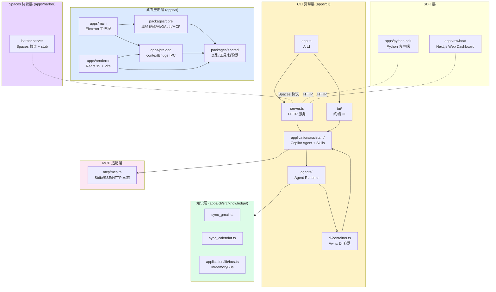
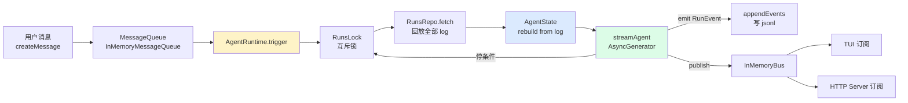
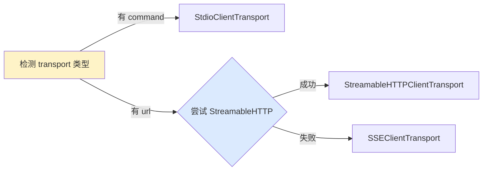
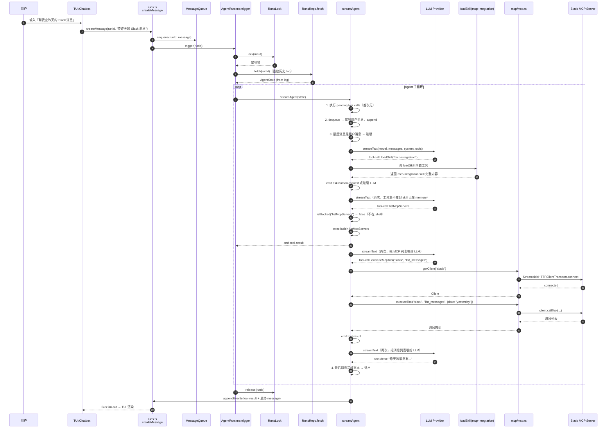

## 引子：为什么「长期记忆」才是 AI 同事的真问题

2026 年的 AI 编程 Agent 市场已经极度饱和——Claude Code、Codex、Goose、OpenMontage、planning-with-files……三十个项目塞满了「让 Coding Agent 更能干活」的赛道。但当我们把镜头从「程序员」转向「普通知识工作者」（销售、运营、研究员、产品经理、律师），会发现**几乎所有工具都还是「对话即上下文」的范式**：

- 你问 ChatGPT：上一次和客户谈的那个 SaaS 集成方案是什么？→ 它说「我不记得那次对话」。
- 你用 Notion AI：把你 200 篇会议纪要喂进去做摘要 → 它只能针对当前 prompt 临时检索。
- 你装 Cursor / Claude Code：上下文窗口用完就「忘记」昨天的对话。

这类工具的核心隐喻是 **「session-scoped retrieval」**：每开一个新对话，就从向量库里冷启动召回几段文本。这跟人脑的工作方式完全不同——人脑是 **「长期记忆 + 当下注意力」**：昨天开的会、上午发的邮件、3 个月前做的决定，它们不是「被检索」的，而是「已经在脑子里」的背景知识。

**rowboatlabs/rowboat**（⭐17.4k, Apache-2.0, Y Combinator S24，2 天前刚 push）就是冲着这个真问题来的。它的定位是：

> **A desktop AI coworker with a memory of your work and built-in surfaces to act on it.**

翻译过来：不是「又一个 ChatGPT UI」，而是一个**桌面 AI 同事**——它把你的邮件、会议纪要、Slack、笔记、代码、浏览器**长期索引成一个 Obsidian 风格的反向链接知识图谱**，并且自带 Email / Notes / Browser / Code Mode / Meeting Notes / Workspaces 六种「工作表面」让 AI 能直接动手干活。

本文会从 5 个层次拆解 Rowboat 的架构：

1. **顶层 monorepo**：7 个子应用 + 多层 pnpm workspace
2. **CLI Runtime**：事件溯源的 Agent 循环 + subflow 多 Agent 递归
3. **Skill Catalog**：load-on-demand 提示工程 + alias 规范化
4. **Knowledge Sync**：Gmail / Calendar 反向同步成 Markdown 笔记
5. **MCP & Security**：MCP 三种 transport 自动降级 + allowlist 命令注入防御

## 项目定位与核心价值

| 维度 | 数值 / 描述 |
|------|-------------|
| **仓库** | `rowboatlabs/rowboat` |
| **License** | Apache-2.0（**商用友好**） |
| **Stars** | 17,441（持续增长，2 天前 push） |
| **语言 / 技术** | TypeScript（CLI）+ Electron 39（桌面）+ React 19 + Vite 7 + Tailwind |
| **创建时间** | 2025-01-13 |
| **架构模式** | 单仓多 App + CLI 引擎 + Electron 桌面包装 |
| **核心范式** | 长期知识图谱 + 事件溯源 Agent Runtime + Skill Catalog |
| **支持平台** | macOS / Windows / Linux |

**核心价值矩阵**：

| 能力 | Rowboat | ChatGPT/Notion AI | Claude Code |
|------|---------|-------------------|-------------|
| 长期记忆（跨 session） | ✅ 反向链接 Markdown 图谱 | ❌ 每对话冷启动 | ⚠️ 仅 session 内 |
| 邮件 / 日历 / Slack 接入 | ✅ 内置 sync | ❌ 无 | ❌ 无 |
| 离线 / 本地优先 | ✅ 全数据 Markdown 在 `~/.rowboat` | ❌ 云端 | ❌ 云端 |
| 多 Agent 协作 | ✅ subflow 递归 | ❌ 单 Agent | ⚠️ worktree 并行 |
| 自定义工作表面 | ✅ Email/Browser/Code/Notes 内置 + 用户可建 App | ❌ 无 | ❌ 无 |
| MCP 协议 | ✅ Stdio / SSE / Streamable HTTP 三态 | ⚠️ 需手动配置 | ✅ |

> **关键差异**：Rowboat 把「AI 同事」拆成两个独立却又互补的部分——**CLI 引擎**（apps/cli，纯 TypeScript，负责 Agent 循环、知识图谱、MCP）和 **Electron 桌面应用**（apps/x，负责 UI 工作表面）。这是它和「ChatGPT 套壳」类项目的最大区别：**CLI 是真正的产品，UI 是 CLI 的一个可选视图**。

## 整体架构

Rowboat 是一个 7 个子应用 + 4 个 workspace 包的 monorepo：



**关键设计哲学**：

- **CLI 优先**：所有核心逻辑（Agent Runtime / Knowledge Sync / MCP / Skills）都在 `apps/cli` 里，Electron 桌面应用只是「同一个 CLI 引擎的可选 UI 视图」
- **多层 pnpm workspace**：Electron 内部又是一个嵌套 pnpm workspace（`apps/x/packages/shared` → `packages/core` → `apps/preload` → `apps/renderer` → `apps/main`），用 esbuild 打包规避 Electron Forge 解析 symlink 的问题
- **Spaces 协议独立成仓**：`apps/harbor` 是 Spaces 协议 + stub server，定义 UI ↔ Server 双向状态同步的 wire contract

> 来源：`CLAUDE.md:18-32`（Monorepo Structure），`apps/cli/src/di/container.ts:12-29`（DI 注册）

## 核心引擎一：事件溯源的 Agent Runtime

Rowboat 的 Agent Runtime 是一个**事件溯源（event-sourced）+ 异步生成器（AsyncGenerator）+ DI 容器**的组合，是整个 CLI 引擎的心脏。

### 核心数据结构

```typescript
// 来自 apps/cli/src/runs/runs.ts:21-26
export const Run = z.object({
    id: z.string(),
    createdAt: z.iso.datetime(),
    agentId: z.string(),
    log: z.array(RunEvent),   // ← 关键：所有状态 = 事件的累积
});
```

**每一个 `Run` 就是一份「事件日志」**——所有状态变化都通过 `appendEvents()` 追加到 `${runId}.jsonl` 文件里。**当前状态 = 所有事件的累积**，而不是某个「当前变量」。这是事件溯源的核心特征：

```typescript
// 来自 apps/cli/src/runs/repo.ts:39-43
async appendEvents(runId: string, events: z.infer<typeof RunEvent>[]): Promise<void> {
    await fsp.appendFile(
        path.join(WorkDir, 'runs', `${runId}.jsonl`),
        events.map(event => JSON.stringify(event)).join("\n") + "\n"
    );
}
```



### Agent 主循环

`streamAgent()` 是一个**永不结束的 while(true) 循环**，直到出现三个停止条件之一：

1. **等待用户授权**（`pendingAskHumans` 或 `pendingToolPermissions` 非空）
2. **最后一条消息是纯文本**（无 tool-call）
3. **主调度器拿不到更多事件**

```typescript
// 来自 apps/cli/src/agents/runtime.ts:536-660（精简版）
while (true) {
    loopCounter++;

    // 1. 执行所有 pending tool calls（含 agent-as-tool → 递归 streamAgent）
    for (const toolCallId of Object.keys(state.pendingToolCalls)) {
        const toolCall = state.toolCallIdMap[toolCallId];

        if (toolCall.toolName === "ask-human") continue;
        if (state.deniedToolCallIds[toolCallId]) { /* emit denied */ continue; }
        if (state.pendingToolPermissionRequests[toolCallId]) continue;

        if (agent.tools![toolCall.toolName].type === "agent") {
            // subflow：递归调用 streamAgent
            for await (const event of streamAgent({ state: subflowState, ... })) {
                yield* processEvent({ ...event, subflow: [toolCallId, ...event.subflow] });
            }
        } else {
            result = await execTool(agent.tools![toolCall.toolName], toolCall.arguments);
        }
    }

    // 2. 停条件：等待用户
    if (state.getPendingAskHumans().length || state.getPendingPermissions().length) return;

    // 3. 从 MessageQueue 拉取新用户消息
    while (true) {
        const msg = await messageQueue.dequeue(runId);
        if (!msg) break;
        yield* processEvent({ type: "message", message: { role: "user", content: msg.message }, ... });
    }

    // 4. 停条件：最后一条是纯文本
    const lastMessage = state.messages[state.messages.length - 1];
    if (lastMessage && lastMessage.role === "assistant"
        && (typeof lastMessage.content === "string" || !lastMessage.content.some(p => p.type === "tool-call"))) {
        return;
    }

    // 5. 跑一次 LLM turn
    const messageBuilder = new StreamStepMessageBuilder();
    for await (const event of streamLlm(model, state.messages, agent.instructions, tools)) {
        messageBuilder.ingest(event);
        yield* processEvent({ type: "llm-stream-event", event, ... });
    }

    // 6. 处理 tool-call 的副作用（emit ask-human-request / tool-permission-request / spawn-subflow）
    if (message.content instanceof Array) {
        for (const part of message.content) {
            if (part.type === "tool-call") {
                if (underlyingTool.type === "builtin" && underlyingTool.name === "ask-human") {
                    yield* processEvent({ type: "ask-human-request", query: part.arguments.question, ... });
                }
                if (underlyingTool.type === "builtin" && underlyingTool.name === "executeCommand" && isBlocked(part.arguments.command)) {
                    yield* processEvent({ type: "tool-permission-request", toolCall: part, ... });
                }
                if (underlyingTool.type === "agent" && underlyingTool.name) {
                    yield* processEvent({ type: "spawn-subflow", agentName: underlyingTool.name, ... });
                }
            }
        }
    }
}
```

> 来源：`apps/cli/src/agents/runtime.ts:500-751`

**这个循环的精妙之处**：

- **每轮做两件事**：(a) 处理已经累积的 pending tool calls（含 ask-human / permission），(b) 跑一次新的 LLM turn
- **Agent-as-Tool 递归**：`type === "agent"` 的工具调用直接递归 `streamAgent()`，但通过 `subflow: [toolCallId, ...event.subflow]` 标记事件属于哪个子流，UI 可以独立渲染
- **三态消息模型**：`AgentState.subflowStates` 用嵌套 map 表示多 Agent 树，每个 subflow 有自己的 `pendingToolCalls` / `pendingAskHumans` / `getPendingPermissions()`
- **状态从 log 重放**：`AgentState.ingest()` 处理所有事件类型，每次 `trigger()` 都从 `runsRepo.fetch()` 重新构建

### Subflow 状态机

```typescript
// 来自 apps/cli/src/agents/runtime.ts:357-498
export class AgentState {
    runId: string | null = null;
    agent: z.infer<typeof Agent> | null = null;
    agentName: string | null = null;
    messages: z.infer<typeof MessageList> = [];
    subflowStates: Record<string, AgentState> = {};   // ← 子 Agent 状态树
    toolCallIdMap: Record<string, z.infer<typeof ToolCallPart>> = {};
    pendingToolCalls: Record<string, true> = {};
    pendingToolPermissionRequests: Record<string, z.infer<typeof ToolPermissionRequestEvent>> = {};
    pendingAskHumanRequests: Record<string, z.infer<typeof AskHumanRequestEvent>> = {};
    allowedToolCallIds: Record<string, true> = {};
    deniedToolCallIds: Record<string, true> = {};

    getPendingPermissions(): z.infer<typeof ToolPermissionRequestEvent>[] {
        const response = [];
        // 递归收集所有 subflow 的 pending
        for (const [id, subflowState] of Object.entries(this.subflowStates)) {
            for (const perm of subflowState.getPendingPermissions()) {
                response.push({ ...perm, subflow: [id, ...perm.subflow] });
            }
        }
        // 本层的 pending
        for (const perm of Object.values(this.pendingToolPermissionRequests)) {
            response.push({ ...perm, subflow: [] });
        }
        return response;
    }
}
```

**这是一个递归的状态树**：当父 Agent 调用一个 `type === "agent"` 的工具时，会创建一个 subflow（key 是 toolCallId），subflow 自己又可以调其他 agent，形成**任意深度的嵌套**。`getPendingPermissions()` 和 `getPendingAskHumans()` 通过递归把所有子流的状态聚合起来，UI 一次性看到「整个调用树有哪些地方需要用户介入」。

## 核心引擎二：Awilix DI 容器 + InMemoryBus

Rowboat 用 [Awilix](https://github.com/jeffijoe/awilix)（一个 TypeScript DI 库）做依赖注入，所有核心组件都注册为单例：

```typescript
// 来自 apps/cli/src/di/container.ts:12-29
import { asClass, createContainer, InjectionMode } from "awilix";
import { FSModelConfigRepo, IModelConfigRepo } from "../models/repo.js";
import { FSMcpConfigRepo, IMcpConfigRepo } from "../mcp/repo.js";
import { FSAgentsRepo, IAgentsRepo } from "../agents/repo.js";
import { FSRunsRepo, IRunsRepo } from "../runs/repo.js";
import { IMonotonicallyIncreasingIdGenerator, IdGen } from "../application/lib/id-gen.js";
import { IMessageQueue, InMemoryMessageQueue } from "../application/lib/message-queue.js";
import { IBus, InMemoryBus } from "../application/lib/bus.js";
import { IRunsLock, InMemoryRunsLock } from "../runs/lock.js";
import { IAgentRuntime, AgentRuntime } from "../agents/runtime.js";

const container = createContainer({
    injectionMode: InjectionMode.PROXY,  // ← 关键：懒解析
    strict: true,
});

container.register({
    idGenerator: asClass<IMonotonicallyIncreasingIdGenerator>(IdGen).singleton(),
    messageQueue: asClass<IMessageQueue>(InMemoryMessageQueue).singleton(),
    bus: asClass<IBus>(InMemoryBus).singleton(),
    runsLock: asClass<IRunsLock>(InMemoryRunsLock).singleton(),
    agentRuntime: asClass<IAgentRuntime>(AgentRuntime).singleton(),
    mcpConfigRepo: asClass<IMcpConfigRepo>(FSMcpConfigRepo).singleton(),
    modelConfigRepo: asClass<IModelConfigRepo>(FSModelConfigRepo).singleton(),
    agentsRepo: asClass<IAgentsRepo>(FSAgentsRepo).singleton(),
    runsRepo: asClass<IRunsRepo>(FSRunsRepo).singleton(),
});

export default container;
```

**`InjectionMode.PROXY` 的妙处**：注册的是「类」，不是「实例」。当代码 `container.resolve<IRunsRepo>('runsRepo')` 时，awilix 通过 Proxy **懒解析** `IRunsRepo` 的构造函数参数，按名字（不是按类型！）从容器里查依赖——`FSRunsRepo` 构造时需要 `idGenerator`，proxy 会自动注入。

`AgentRuntime` 的构造函数参数全是接口类型，运行时被注入具体实现：

```typescript
// 来自 apps/cli/src/agents/runtime.ts:38-59
constructor({
    runsRepo,
    idGenerator,
    bus,
    messageQueue,
    modelConfigRepo,
    runsLock,
}: {
    runsRepo: IRunsRepo;
    idGenerator: IMonotonicallyIncreasingIdGenerator;
    bus: IBus;
    messageQueue: IMessageQueue;
    modelConfigRepo: IModelConfigRepo;
    runsLock: IRunsLock;
}) {
    this.runsRepo = runsRepo;
    // ...
}
```

测试时可以把 `bus` 换成 mock bus，把 `runsRepo` 换成 in-memory repo，做单元测试不需要改业务代码。

### InMemoryBus pub/sub

```typescript
// 来自 apps/cli/src/application/lib/bus.ts:12-34
export class InMemoryBus implements IBus {
    private subscribers: Map<string, ((event: z.infer<typeof RunEvent>) => Promise<void>)[]> = new Map();

    async publish(event: z.infer<typeof RunEvent>): Promise<void> {
        const pending: Promise<void>[] = [];
        for (const subscriber of this.subscribers.get(event.runId) || []) {
            pending.push(subscriber(event));
        }
        for (const subscriber of this.subscribers.get('*') || []) {  // ← 全局订阅
            pending.push(subscriber(event));
        }
        await Promise.all(pending);
    }

    async subscribe(runId: string, handler: ...): Promise<() => void> {
        if (!this.subscribers.has(runId)) this.subscribers.set(runId, []);
        this.subscribers.get(runId)!.push(handler);
        return () => { this.subscribers.get(runId)!.splice(index, 1); };
    }
}
```

**两层订阅**——具体 `runId` 的订阅者和 `'*'` 全局订阅者。TUI 只关心当前 run 的事件，但全局 monitor / 调试器 / log recorder 可以订阅所有 run 的所有事件。`Promise.all(pending)` 保证 fan-out 并发不阻塞 Agent 循环。

## 核心引擎三：Skill Catalog — Load-on-Demand 提示工程

Rowboat 的 Copilot Agent 用了**Skill Catalog** 模式：所有 skills 列在 system prompt 里，但实际内容**不展开**——只有 Agent 主动调 `loadSkill` 时才加载。

```typescript
// 来自 apps/cli/src/application/assistant/agent.ts:14-19
export const CopilotAgent: z.infer<typeof Agent> = {
    name: "rowboatx",
    description: "Rowboatx copilot",
    instructions: CopilotInstructions,
    tools,
};
```

`CopilotInstructions` 是一段巨型 system prompt，里面嵌入了 `${skillCatalog}` 占位符：

```typescript
// 来自 apps/cli/src/application/assistant/instructions.ts:7-19
export const CopilotInstructions = `You are an intelligent workflow assistant helping users manage their workflows in ${BASE_DIR}. ...

Use the catalog below to decide which skills to load for each user request. Before acting:
- Call the \`loadSkill\` tool with the skill's name or path so you can read its guidance string.
- Apply the instructions from every loaded skill while working on the request.

${skillCatalog}
...`;
```

**Skill Catalog 的生成逻辑**：

```typescript
// 来自 apps/cli/src/application/assistant/skills/index.ts:65-82
const catalogSections = skillEntries.map((entry) => [
    `## ${entry.title}`,
    `- **Skill file:** \`${entry.catalogPath}\``,
    `- **Use it for:** ${entry.summary}`,
].join("\n"));

export const skillCatalog = [
    "# Rowboat Skill Catalog",
    "",
    "Use this catalog to see which specialized skills you can load. Each entry lists the exact skill file plus a short description of when it helps.",
    "",
    catalogSections.join("\n\n"),
].join("\n");
```

**效果**：Agent 的 system prompt 里有一个「目录」（每个 skill 只是一行标题 + 一行用途），但完整的 skill 内容（几百行的 markdown）只在 Agent 调用 `loadSkill("mcp-integration")` 时才进入上下文。

### Skill Alias 规范化

`resolveSkill()` 用 `aliasMap` 实现**多别名 → 同一份 skill**：

```typescript
// 来自 apps/cli/src/application/assistant/skills/index.ts:84-114
const normalizeIdentifier = (value: string) =>
  value.trim().replace(/\\/g, "/").replace(/^\.\/+/, "");

const registerAliasVariants = (alias: string, entry: ResolvedSkill) => {
  const normalized = normalizeIdentifier(alias);
  if (!normalized) return;

  const variants = new Set<string>([normalized]);

  if (/\.(ts|js)$/i.test(normalized)) {
    variants.add(normalized.replace(/\.(ts|js)$/i, ""));
    variants.add(
      normalized.endsWith(".ts") ? normalized.replace(/\.ts$/i, ".js") : normalized.replace(/\.js$/i, ".ts"),
    );
  } else {
    variants.add(`${normalized}.ts`);
    variants.add(`${normalized}.js`);
  }
  for (const variant of variants) registerAlias(variant, entry);
};

for (const entry of skillEntries) {
  const absoluteTs = path.join(CURRENT_DIR, entry.folder, "skill.ts");
  const absoluteJs = path.join(CURRENT_DIR, entry.folder, "skill.js");
  const baseAliases = [
    entry.id,
    entry.folder,
    `${entry.folder}/skill`,
    `${entry.folder}/skill.ts`,
    `${entry.folder}/skill.js`,
    `skills/${entry.folder}/skill.ts`,
    `skills/${entry.folder}/skill.js`,
    `${CATALOG_PREFIX}/${entry.folder}/skill.ts`,
    `${CATALOG_PREFIX}/${entry.folder}/skill.js`,
    absoluteTs,
    absoluteJs,
  ];
  for (const alias of baseAliases) registerAliasVariants(alias, resolvedEntry);
}
```

**这个 aliasMap 让 Agent 可以用 11 + 2 个不同的字符串来引用同一个 skill**：

- `"mcp-integration"`（id）
- `"mcp-integration/skill.ts"`、`"mcp-integration/skill.js"`
- `"skills/mcp-integration/skill.ts"`
- `"src/application/assistant/skills/mcp-integration/skill.ts"`
- `/abs/path/to/skill.ts`、`/abs/path/to/skill.js`
- `.ts ↔ .js` 互转

Agent 即使用错的格式也能 resolve 到正确的 skill（**容错优于精确**）。

### 5 个内置 Skill 矩阵

| Skill ID | 职责 | 关键能力 |
|----------|------|----------|
| **workflow-authoring** | 创建 / 修改 `agents/*.json` | Schema 校验、命名规则、3 种 tool type 字段示例 |
| **builtin-tools** | 使用 `executeCommand` / 文件操作 / MCP 查询 | 默认 allowlist（cat/curl/jq/ls 等 10 个）+ 安全约束 |
| **mcp-integration** | 发现 / 执行 MCP 工具 | Stdio + SSE + Streamable HTTP 三种 transport + 必须用 `addMcpServer` 校验 |
| **deletion-guardrails** | 删除 workflow / agent 前的确认 | 强制 ask-human |
| **workflow-run-ops** | 列出 runs / 检查暂停 / 管理 cron schedule | 状态查询 + cron 操作 |

> 来源：`apps/cli/src/application/assistant/skills/index.ts:27-63`

## 知识同步层：Gmail / Calendar → Markdown 知识图谱

Rowboat 的知识图谱**不是向量数据库，而是 Obsidian 风格的反向链接 Markdown 文件**。这种选择有几个好处：

1. **可读 / 可编辑**：用户用 Obsidian / Vim 就能直接修改
2. **零迁移成本**：数据 100% 在本地
3. **天然双向链接**：`[[客户名]]` 这种 wikilink 在 Obsidian 里自动渲染成关系图

Gmail 同步示例：

```typescript
// 来自 apps/cli/src/knowledge/sync_gmail.ts:1-20
import fs from 'fs';
import path from 'path';
import { google } from 'googleapis';
import { authenticate } from '@google-cloud/local-auth';
import { NodeHtmlMarkdown } from 'node-html-markdown'
import { OAuth2Client } from 'google-auth-library';

// Configuration
const DEFAULT_SYNC_DIR = 'synced_emails_ts';
const CREDENTIALS_PATH = path.join(process.cwd(), 'credentials.json');
const TOKEN_PATH = path.join(process.cwd(), 'token_api.json'); // Reuse Python's token
const SYNC_INTERVAL_MS = 60 * 1000;
const SCOPES = ['https://www.googleapis.com/auth/gmail.readonly'];

const nhm = new NodeHtmlMarkdown();
```

**OAuth 流程**：

```typescript
// 来自 apps/cli/src/knowledge/sync_gmail.ts:59-88
async function authorize(): Promise<OAuth2Client> {
    let client = await loadSavedCredentialsIfExist();
    // 1. token 未过期 → 直接用
    if (client && client.credentials && client.credentials.expiry_date && client.credentials.expiry_date > Date.now()) {
        console.log("Using existing valid token.");
        return client;
    }
    // 2. token 过期但有 refresh_token → 刷新
    if (client && client.credentials && (!client.credentials.expiry_date || client.credentials.expiry_date <= Date.now()) && client.credentials.refresh_token) {
        console.log("Refreshing expired token...");
        try {
            await client.refreshAccessToken();
            await saveCredentials(client);
            return client;
        } catch (e) {
            // 3. 刷新失败 → 清掉 token 重新走完整 OAuth
            fs.existsSync(TOKEN_PATH) && fs.unlinkSync(TOKEN_PATH);
        }
    }
    // 4. 全新 OAuth
    console.log("Performing new OAuth authentication...");
    client = await authenticate({ scopes: SCOPES, keyfilePath: CREDENTIALS_PATH }) as any;
    if (client && client.credentials) await saveCredentials(client);
    return client!;
}
```

**三段降级**（token-valid → refresh-token → re-auth）保证了 7×24 不需要用户介入的同步。`token_api.json` 和 Python 端的复用同一个 token，避免「Python 同步时 token 刷新导致 TS 同步失败」。

**关键的兼容性细节**（实测踩过的坑）：

```typescript
// 来自 apps/cli/src/knowledge/sync_gmail.ts:33-35
const credentials = {
    type: 'authorized_user',
    client_id: key.client_id,
    client_secret: key.client_secret,
    refresh_token: tokenData.refresh_token || tokenData.refreshToken, // Handle both cases
    access_token: tokenData.token || tokenData.access_token,           // Handle both cases
    expiry_date: tokenData.expiry || tokenData.expiry_date
};
```

Python 和 JS 的字段命名约定不同（`refresh_token` vs `refreshToken`、`access_token` vs `token`），Rowboat 同时兼容两种命名。

## MCP 集成：三态 Transport 自动降级

Rowboat 支持三种 MCP transport，并且**自动降级**：

```typescript
// 来自 apps/cli/src/mcp/mcp.ts:36-58
// create transport
if ("command" in config) {
    transport = new StdioClientTransport({
        command: config.command,
        args: config.args,
        env: config.env,
    });
} else {
    // Forward any configured headers (e.g. Authorization) so
    // auth-protected remote MCP servers can be reached.
    const requestInit = config.headers
        ? { headers: config.headers }
        : undefined;
    try {
        transport = new StreamableHTTPClientTransport(new URL(config.url), {
            requestInit,
        });
    } catch (error) {
        // if that fails, try sse transport
        transport = new SSEClientTransport(new URL(config.url), {
            requestInit,
        });
    }
}
```

**降级链**：



**关键设计**：

1. **三态分支**：先看 config 有没有 `command` 字段，有 → Stdio（本地进程），没有 → 远程 url
2. **远程降级**：先尝试 Streamable HTTP（2025 标准），失败后回退 SSE（2024 旧标准）。这避免了「远程 MCP server 还在用 SSE 但你只支持 StreamableHTTP」导致连接失败
3. **headers 透传**：`config.headers` 透传到 `requestInit`，让 `Authorization: Bearer xxx` 这种认证头可以传到远程 server
4. **client 连接 + 状态缓存**：`clients: Record<string, mcpState>` 缓存 `client` 实例，避免每次 tool call 都重新 connect

```typescript
// 来自 apps/cli/src/mcp/mcp.ts:23-32 + 64-77
async function getClient(serverName: string): Promise<Client> {
    if (clients[serverName] && clients[serverName].state === "connected") {
        return clients[serverName].client!;  // ← 缓存复用
    }
    const repo = container.resolve<IMcpConfigRepo>('mcpConfigRepo');
    const { mcpServers } = await repo.getConfig();
    const config = mcpServers[serverName];
    if (!config) throw new Error(`MCP server ${serverName} not found`);
    // ...
    const client = new Client({ name: 'rowboatx', version: '1.0.0' });
    await client.connect(transport);
    clients[serverName] = { state: "connected", client, error: null };
    return client;
}
```

> 来源：`apps/cli/src/mcp/mcp.ts:1-132`

## 安全层：Allowlist 命令注入防御

Agent 调 `executeCommand` 跑 shell 是「最有破坏力的能力」，Rowboat 用了**多层防御**：

### 第一层：Allowlist 默认值

```typescript
// 来自 apps/cli/src/config/security.ts:7-18
const DEFAULT_ALLOW_LIST = [
    "cat", "curl", "date", "echo", "grep", "jq", "ls", "pwd", "yq", "whoami"
]
```

**只允许 10 个最无害的命令**，其它任何命令都默认被拒。Agent 想跑 `rm` / `chmod` / `dd` 必须先改 `~/.rowboat/config/security.json`。

### 第二层：Mtime 缓存避免每次读盘

```typescript
// 来自 apps/cli/src/config/security.ts:79-96
export function getSecurityAllowList(): string[] {
    ensureSecurityConfig();
    try {
        const stats = fs.statSync(SECURITY_CONFIG_PATH);
        if (cachedAllowList && cachedMtimeMs === stats.mtimeMs) {
            return cachedAllowList;
        }
        const allowList = readAllowList();
        cachedAllowList = allowList;
        cachedMtimeMs = stats.mtimeMs;
        return allowList;
    } catch {
        cachedAllowList = null;
        cachedMtimeMs = null;
        return readAllowList();
    }
}
```

每次 `isBlocked()` 不会触发 `fs.statSync` + `readFileSync` + `JSON.parse` 三连击——用 mtime 做 cache invalidation，用户改了 security.json 立即生效。

### 第三层：分隔符感知（防注入）

```typescript
// 来自 apps/cli/src/application/lib/command-executor.ts:13-15
// Order matters: longer separators (`||`, `&&`) must precede their single-char
// prefixes (`|`, `&`) so the leftmost-longest match consumes the right token.
// `&` (background), backtick / `$(` (command substitution), and `(` `)`
// (subshell) are also command separators — without them, `echo hi & rm /x`,
// `echo \`rm /x\``, and `echo $(rm /x)` slip past isBlocked() with only
// `echo` in the allowlist.
const COMMAND_SPLIT_REGEX = /(?:\|\||&&|&|;|\||\n|`|\$\(|\(|\))/;
```

**注释里直接列了 4 类注入攻击**：

1. `echo hi & rm /x` — `&` 后台执行
2. `echo \`rm /x\`` — 反引号命令替换
3. `echo $(rm /x)` — `$(...)` 命令替换
4. `echo hi || rm /x` — `||` 逻辑或短路

`COMMAND_SPLIT_REGEX` 把这些都当作分隔符，先 split 再提「每个段的主命令」，最后跟 allowlist 比对。

### 第四层：Wrapper 展开

```typescript
// 来自 apps/cli/src/application/lib/command-executor.ts:42-48
const WRAPPER_COMMANDS = new Set(['sudo', 'env', 'time', 'command']);
// ...
if (WRAPPER_COMMANDS.has(primary) && index + 1 < tokens.length) {
    const wrapped = sanitizeToken(tokens[index + 1]).toLowerCase();
    if (wrapped) discovered.add(wrapped);
}
```

**`sudo rm -rf /`** 即使 allowlist 里有 `sudo` 但没 `rm`，也会被拒——因为 wrapper 会展开一层下一命令。这防御了「在 sudo / env / time / command 这些 wrapper 里藏危险命令」的攻击。

### 第五层：环境变量前缀跳过

```typescript
// 来自 apps/cli/src/application/lib/command-executor.ts:30-33
let index = 0;
while (index < tokens.length && ENV_ASSIGNMENT_REGEX.test(tokens[index])) {
    index++;
}
```

`KEY=value ls` 这种「环境变量前缀 + 主命令」的语法被正确解析——只有 `ls` 才是要检查的命令，`KEY=value` 被跳过。

> 来源：`apps/cli/src/application/lib/command-executor.ts:1-100`，`apps/cli/src/config/security.ts:1-101`

## 端到端数据流：用户问「帮我查昨天的 Slack 消息」会发生什么？



**这个流程的 8 个关键观察**：

1. **触发即 replay**：`AgentRuntime.trigger()` 每次都从 jsonl 重放完整 log，不依赖内存状态
2. **消息驱动**：用户消息进入 `MessageQueue`，Agent 循环主动 `dequeue`
3. **Skill 加载透明**：Agent 调 `loadSkill` 不是 LLM 调用，是**内置工具调用**，skill 内容进入 AgentState.messages
4. **MCP 自动缓存**：`getClient` 缓存连接，第二次调用直接返回
5. **权限检查双轨**：shell 命令走 `isBlocked`，MCP/builtin 工具不检查
6. **事件全记录**：tool-call、tool-result、permission-request、ask-human-request、text-delta 都进 jsonl
7. **Bus fan-out**：TUI 订阅当前 runId，渲染流式输出
8. **Stop 条件三层**：等待用户 / 纯文本 / 主调度器无事件——任一触发就 return

## 与同类项目对比

| 维度 | Rowboat | ChatGPT Plus / Claude.ai | Notion AI | Cursor / Claude Code | Goose / OpenAI Codex |
|------|---------|-------------------------|-----------|----------------------|----------------------|
| **定位** | 桌面 AI 同事 + 长期记忆 | 对话 SaaS | 文档 AI 增强 | Coding Agent Harness | Coding Agent Harness |
| **记忆模型** | Markdown 知识图谱 + 反向链接 | session 内 context | 单文档索引 | session 内 context | session 内 context |
| **本地优先** | ✅ 全数据 Markdown | ❌ 云端 | ❌ 云端 | ⚠️ 部分本地 | ⚠️ 部分本地 |
| **多 Agent** | subflow 递归 + skill catalog | ❌ | ❌ | ✅ worktree 并行 | ⚠️ 部分 |
| **工作表面** | 6+ 内置 + 用户自建 App | Chat UI | Notion UI | IDE | Terminal |
| **协议支持** | MCP 三态 + 自定义事件 | ❌ | ❌ | MCP + Hooks | MCP |
| **可定制性** | ✅ 创建自定义 Agent JSON | ❌ | ⚠️ 模板 | ✅ AGENTS.md | ✅ Recipe YAML |
| **License** | Apache-2.0 | 闭源 | 闭源 | 闭源 / 闭源 | Apache-2.0 |

### 设计差异分析

**1. 长期记忆 vs 临时检索**

| 项目 | 记忆范式 | 实现成本 | 用户价值 |
|------|---------|---------|---------|
| ChatGPT / Claude.ai | 无持久记忆 | 0 | 低（每对话冷启动） |
| Notion AI | 文档级索引（无反向链接） | 中 | 中（按文档召回） |
| Cursor / Claude Code | session 内 context | 低 | 高（编程场景够用） |
| **Rowboat** | **Markdown 知识图谱 + 反向链接 + 笔记编辑** | 高 | **极高（跨 session 持久）** |

Rowboat 的「知识图谱」不是向量数据库的别名——它是**实实在在的 `.md` 文件**，可以用 Obsidian / VS Code / 任何编辑器打开、修改、commit 到 git。**知识不是「藏在模型里」，而是「活在文件系统里」**——这是 2026 年最稀缺的范式回归。

**2. 事件溯源 vs 当前状态**

```typescript
// 传统做法（LangChain / CrewAI / AutoGen）：每个 Agent 自己管 state
class Agent {
    private currentState = new AgentState();  // 内存里的可变状态
    async step() {
        this.currentState.messages.push(newMessage);  // 直接改
    }
}

// Rowboat 做法：事件溯源
class AgentState {
    ingest(event: RunEvent) {
        switch (event.type) { /* 累积事件，重建状态 */ }
    }
}
async trigger(runId) {
    const run = await this.runsRepo.fetch(runId);  // 从 jsonl 重放
    const state = new AgentState();
    for (const event of run.log) state.ingest(event);  // ← 重建
}
```

**事件溯源带来 3 个能力**：(a) **重启不丢状态**——daemon 死了再起来，重放 jsonl 就回到原状；(b) **天然审计**——所有事件都有 timestamp + runId + subflow 路径，合规场景可用；(c) **支持时光机调试**——把 log 喂给调试器，能精确还原任意时刻状态。

**3. Skill Catalog vs System Prompt 全量**

| 范式 | Token 消耗 | Agent 行为 | 适用规模 |
|------|----------|-----------|---------|
| 把所有 skill 内容塞 system prompt | 线性增长（每加一个 skill 就 +N token） | Agent 全知道，但注意力分散 | ≤ 5 个 skill |
| **Skill Catalog + loadSkill** | **O(1)（只塞目录）** | **Agent 按需加载，注意力聚焦** | **20+ skills 不爆** |

Rowboat 的 Skill Catalog 把所有 skill 的「名字 + 一行用途」放在 system prompt 里（~500 token），完整 skill 内容（几百行 markdown）只在 `loadSkill("xxx")` 调用时才进入上下文。**这是 Anthropic Context Engineering 思想的工程化落地**——「system prompt 不是越长越好，而是越精越好；按需加载比全量塞进去更有效」。

**4. Subflow 递归 vs handoff / worktree**

| 范式 | 实现 | 隔离 | 并行 | 状态共享 |
|------|------|------|------|---------|
| OpenAI Agents SDK handoff | 控制权完全转移 | 中（handoff 后原 Agent 失去 state） | ❌ | ❌ |
| Cursor worktree | 独立 git worktree | 高（文件系统隔离） | ✅ | ❌ |
| **Rowboat subflow** | **`AgentState` 嵌套 map** | **中（state 独立，event 共享）** | **❌（顺序递归）** | **✅（父能看到 subflow 所有事件）** |

Rowboat 的 subflow 是**父 Agent 主动调子 Agent 作为工具**，子 Agent 跑完后结果作为 tool-result 返回父 Agent。**状态隔离**（子 Agent 有自己的 messages / pending），**事件共享**（所有 subflow 事件都带 `subflow: [toolCallId, ...]` 路径，父 Agent 通过 Bus 看到全貌）。

## 优缺点分析

| 维度 | 优势 ✅ | 劣势 ⚠️ |
|------|---------|---------|
| **架构简洁性** | CLI 引擎独立，UI 是可选视图；事件溯源 + subflow 递归 + Skill Catalog 三件套互不耦合 | 概念门槛较高（事件溯源 + DI + subflow 对新手不友好） |
| **扩展性** | 加新 Skill 只要新建 `skills/<id>/skill.ts` 并在 `index.ts` 注册；加新 Agent 只要新建 `agents/<id>.json`；MCP server 任意接 | 配置文件越多越复杂（`~/.rowboat/config/{models,security,mcp}.json` 散落多处） |
| **易用性** | 桌面应用 + TUI + Web Dashboard 三端可访问；零代码写自定义 Agent | 必须下载桌面客户端才能用核心功能；CLI 学习曲线较陡 |
| **性能** | 单进程内事件溯源，无网络往返；MCP client 缓存；Allowlist mtime 缓存 | 长 session 的 jsonl 文件会增长（需要定期 truncate）；LLM 调用仍是同步阻塞 |
| **复杂度** | Awilix DI 容器 + InMemoryBus + Event Sourcing 三件套工业级抽象 | 调试难度高（事件溯源的状态需要 replay 才能理解） |
| **维护性** | TypeScript 全栈；Zod schema 强类型；esbuild 单文件打包 Electron | monorepo 嵌套 pnpm workspace 配置成本高；版本升级需要同步 zod 版本（`apps/harbor/CONTRACT.md` 明确警告） |

**一句话总结**：Rowboat 在「**长期记忆 + 多 Agent + 知识图谱**」的交叉点上是当前最完整的工程实现，但代价是**较高的概念门槛和配置复杂度**——它不是给「就想跟 AI 聊聊天」的用户准备的。

## 实践：5 分钟跑通 Rowboat CLI

### 1. 克隆 + 安装

```bash
git clone https://github.com/rowboatlabs/rowboat.git
cd rowboat/apps/cli
pnpm install
```

### 2. 配置模型

```bash
mkdir -p ~/.rowboat/config
cat > ~/.rowboat/config/models.json << 'EOF'
{
  "version": 2,
  "providers": {
    "anthropic": {
      "flavor": "anthropic",
      "apiKey": "sk-ant-xxx"
    }
  },
  "assistantModel": { "provider": "anthropic", "model": "claude-sonnet-4-5" }
}
EOF
```

> 完整 schema 见 `apps/x/packages/core/src/models/`（v2；v1 文件启动时自动迁移）

### 3. 配置命令 allowlist（可选）

```bash
# 默认已经有 10 个最安全的命令
cat ~/.rowboat/config/security.json
# ["cat","curl","date","echo","grep","jq","ls","pwd","yq","whoami"]

# 想要更多命令？编辑 security.json
cat > ~/.rowboat/config/security.json << 'EOF'
["cat", "curl", "date", "echo", "grep", "jq", "ls", "pwd", "yq", "whoami",
 "git", "npm", "node", "python", "psql", "docker"]
EOF
```

### 4. 添加 MCP server（可选）

```bash
cat > ~/.rowboat/config/mcp.json << 'EOF'
{
  "mcpServers": {
    "filesystem": {
      "command": "npx",
      "args": ["-y", "@modelcontextprotocol/server-filesystem", "/tmp"]
    }
  }
}
EOF
```

> 注意：**不要用 `createFile` / `updateFile` 内置工具直接编辑 mcp.json**——必须用 `addMcpServer` 内置工具（带 schema 校验）。否则会启动报错。

### 5. 启动 TUI

```bash
pnpm start
```

输入「查一下当前目录的文件结构」——Agent 会自动调 `loadSkill("builtin-tools")` → 加载 `executeCommand` 说明 → 跑 `ls -la` → 返回结果。

### 6. 启动 HTTP server（让 Web Dashboard / Python SDK 连接）

```bash
pnpm start -- --server
# 默认监听 :3456
```

```python
# 用 Python SDK 调
from rowboat_sdk import RowboatClient
client = RowboatClient("http://localhost:3456")
run = client.create_run(agent_id="rowboatx")
client.create_message(run.id, "今天的天气怎么样？")
```

## 趋势与未来

**1. 「长期记忆」将成为 AI 工具的标配**

2024 年的 AI 工具都在卷 context window（128k → 1M → 10M），但 2026 H2 的趋势是 **「context window 是 RAM，文件系统是 disk」**——和 Rowboat 的 Skill Catalog + 知识图谱同构。OpenMontage（2026-07-04）、planning-with-files（2026-07-06）也在走这条路。**未来 12 个月，「AI 同事」会从「对话窗口」演化成「有持久记忆 + 主动推送 + 任务追踪的桌面应用」**——Rowboat 已经走在这条路的最前面。

**2. 事件溯源会取代「当前状态」**

传统 Agent 框架（LangChain / LlamaIndex / CrewAI / AutoGen）都是「Agent 自己管可变状态」。但 Rowboat 的事件溯源证明了：**所有 Agent 状态都可以从 log 重建**，这给「AI 调试器 / 时光机 / 合规审计 / daemon 重启不丢状态」打开了门。2026 H2 会有更多 Agent 框架迁移到事件溯源架构。

**3. Skill Catalog 是 Prompt Engineering 的下一站**

System prompt 工程已经从「怎么写 prompt」演化成「**怎么组织可复用的 prompt 单元**」。Rowboat 的 Skill Catalog 把「**load-on-demand**」做成了一等公民——Agent 不是「什么都知道」，而是「需要时去查」。这跟 Anthropic 的 [Effective context engineering for AI agents](https://www.anthropic.com/engineering/effective-context-engineering-for-ai-agents) 报告里的核心结论一致。

**4. Obsidian-style 知识图谱 vs 向量 RAG**

向量 RAG（Embedding + 余弦相似度）的局限性在 2026 H2 越来越明显：它无法捕捉「实体间的强关系」（例如「这个客户的付款条件和另一个客户的付款条件有 3 个不同点」）。**反向链接 + Markdown 笔记 + 全文检索** 的组合，会在「**需要强可解释性的场景**」（合规、研究、法律）逐步取代纯向量方案。Rowboat 的「`~/.rowboat/` 目录全是 Markdown」是这条赛道的早期信号。

**5. Spaces 协议 = AI 应用的「HTTP/2」**

`apps/harbor` 是 Spaces 协议的 stub server——一种 UI ↔ Server 双向状态同步的 wire contract（与 `@rowboat/spaces-protocol` 包配套）。**当 AI 应用的状态越来越复杂（多 surface 同步 + 多端访问 + 实时协作），单纯的 JSON-over-HTTP 不够用**，需要一个像 HTTP/2 streaming / WebSocket / CRDT 一样的新协议。Spaces 是 AI 应用时代的早期探索。

---

**关键资源**：

| 类别 | 链接 |
|------|------|
| 仓库 | https://github.com/rowboatlabs/rowboat |
| 官网 | https://www.rowboatlabs.com |
| 下载 | https://www.rowboatlabs.com/downloads |
| 文档 | https://docs.rowboatlabs.com |
| 许可证 | Apache-2.0 |
| Stars | 17,441（持续增长） |
| Discord | https://discord.gg/wajrgmJQ6b |
| Twitter | https://x.com/intent/user?screen_name=rowboatlabshq |
| 母公司 | Y Combinator S24 Batch |

**架构核心文件**：

| 职责 | 文件 |
|------|------|
| 顶层 monorepo 文档 | `CLAUDE.md` |
| Electron 应用构建配置 | `apps/x/package.json`, `apps/x/apps/main/forge.config.cjs` |
| Agent 主循环 | `apps/cli/src/agents/runtime.ts` |
| Agent 状态聚合 | `apps/cli/src/agents/runtime.ts:357-498`（AgentState 类） |
| DI 容器 | `apps/cli/src/di/container.ts` |
| Event Bus | `apps/cli/src/application/lib/bus.ts` |
| Skill Catalog | `apps/cli/src/application/assistant/skills/index.ts` |
| Copilot Agent | `apps/cli/src/application/assistant/agent.ts` |
| MCP 三态 transport | `apps/cli/src/mcp/mcp.ts` |
| 命令 allowlist 安全 | `apps/cli/src/config/security.ts`, `apps/cli/src/application/lib/command-executor.ts` |
| Gmail 同步 | `apps/cli/src/knowledge/sync_gmail.ts` |
| Calendar 同步 | `apps/cli/src/knowledge/sync_calendar.ts` |
| 事件溯源存储 | `apps/cli/src/runs/repo.ts` |
| Spaces 协议 | `apps/harbor/CONTRACT.md` |