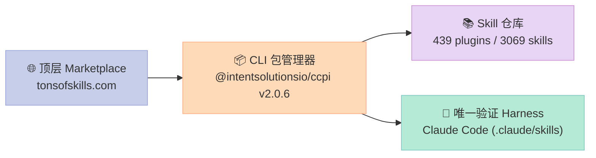
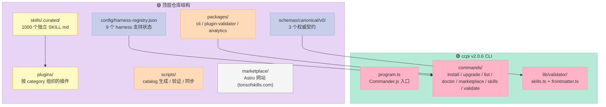
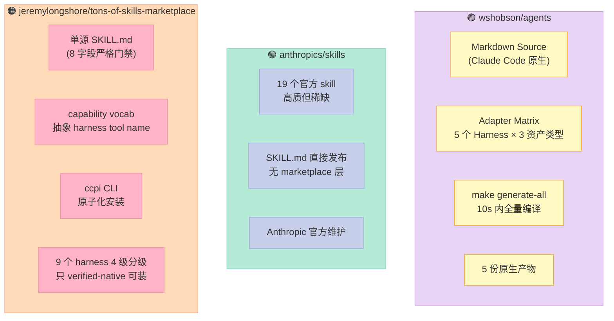
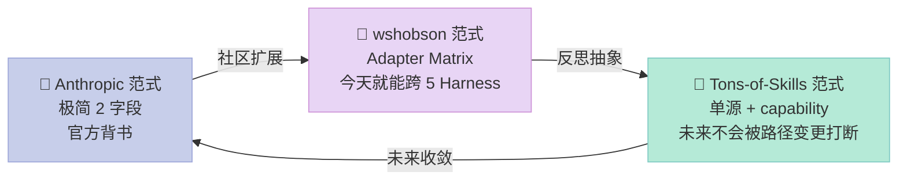

> **一句话核心结论**：Tons of Skills 用一套 **"单源真相 SKILL.md + ccpi CLI 原子化安装 + capability 解耦 harness 工具名"** 的三段式架构，把 3,000+ Skills 装进 Claude Code 这种 verified-native harness，避免 wshobson/agents 那种 **"为每个 harness 生成一份 adapter"** 的爆炸式复杂度。

## 引子：插件市场已经"通胀"，但 Skill 的"运行时契约"还是个谜

过去 18 个月，AI Coding Agent 领域的"插件市场"已经从稀缺资源变成了**通胀商品**——GitHub 上随便一搜就是 5 个 mega-marketplace：

- `wshobson/agents`（39,305⭐，203 agents / 175 skills / 109 commands）
- `davepoon/buildwithclaude`（3,393⭐，"single hub to find Claude Skills/Agents/Commands/Hooks"）
- `daymade/claude-code-skills`（1,366⭐）
- `jeremylongshore/tons-of-skills-marketplace`（**2,686⭐，439 plugins / 3,069 skills**，本文主角）
- 加上 Anthropic 官方 `anthropics/skills`（172,807⭐，19 个官方 skill）作 baseline

但写一个 Skill 文件很简单，**"让它在不同 Harness 里以可预测的方式被加载、被验证、被调用"** 才是真正的难题。

2026-08-07 我们写过一篇 `wshobson/agents` 的深度解析（[`wshobson-agents-cross-harness-plugin-marketplace-skill-component-deep-dive`](https://xuqi2024.github.io/2026/08/07/wshobson-agents-cross-harness-plugin-marketplace-skill-component-deep-dive/)），核心结论是 **"单一真相源 + 适配器矩阵"**——90 个本地插件从 Claude Code 的 Markdown 源，**编译**到 5 个 Harness 的原生格式。

今天这篇讲一个**截然相反的架构选择**：

**`jeremylongshore/tons-of-skills-marketplace`**（MIT 开源，2,686⭐，2 天前刚 push）走的是 **"单源真相 + 一个 verified-native harness + capability vocab 解耦"** 的路线。

它做了一件看起来很反直觉、但工程上很优雅的事：

> **不写 adapter。一份 SKILL.md 在所有 harness 路径里都长得一样。只是 Claude Code 是当前唯一被"官方验证"的 harness（`verified-native`），其他 harness 只能等自家路径稳定后再升级到 verified-native。**

下面用 5 张 Mermaid 图 + 3 段真实可执行代码，拆解它的核心架构。

## 一、项目定位：模型无关的 Skill Marketplace

### 1.1 三层身份



三个核心身份的对比：

| 维度 | 数值 / 描述 |
|------|-------------|
| **仓库** | `jeremylongshore/tons-of-skills-marketplace` |
| **License** | MIT（**完全商用友好**） |
| **Stars** | 2,686（2 天前 push，活跃） |
| **CLI 包** | `@intentsolutionsio/ccpi` v2.0.6（npm） |
| **Plugins 数** | 439（devops/security/api/frontend/backend/database/testing 等 8 大分类） |
| **Skills 数** | 3,069（按 `skills/.curated/` 计数） |
| **Agents 数** | 347 |
| **核心原则** | **The canonical layer is harness-free by construction**（skill 规范本身与具体 harness 解耦） |

### 1.2 "Model-Agnostic" 的关键设计

README 第一段就明确声明：

> **A model-agnostic agent-skills platform.** The canonical layer is harness-free by construction; **Claude Code** is currently the **verified-native harness**. Other harnesses remain engineering candidates until their native-path integration is verified; source research alone is never presented as public support.

翻译：

- 规范层是 **harness-free** 的（一个 `skill-contract.schema.json` 不绑定任何 harness）
- **只有一个 harness（Claude Code）目前被官方验证**，其他 8 个 harness（Codex/Cursor/Devin/Gemini CLI/Goose/Kilo/OpenCode/Omarchy）都登记在 `harness-registry.json` 里，但**禁止宣称支持**
- 这跟 `wshobson/agents` 的"为 5 个 harness 同时生成 adapter"形成鲜明对比

这种克制是**有原因的**——很多 harness 的 skill 路径命名（`.cursor/skills`、`.codex/skills`、`.agents/skills`）都是 2026 年 4 月以后才稳定下来，过早适配会让你写一堆半年后要废弃的代码。

## 二、核心架构：4 层 + 6 大原语

### 2.1 顶层目录结构



### 2.2 6 大原语对照表

对照之前几篇 Sub-Agent 失败恢复（AGT 5 原语）、MCP 反攻击（mcp-gateway 3 原语）的写作模式，我把 Tons of Skills 的核心抽象抽成 **6 个不可绕过的原语**：

| # | 原语 | 对应文件 / 类 | 核心字段 / 方法 | 工程意义 |
|---|------|---------------|-----------------|----------|
| 1 | **Skill Contract Schema** | `schemas/canonical/v0/skill-contract.schema.json` | `id/version/intent/capabilities/model_class/lifecycle/provenance/adapters` 8 个 required 字段 | 把"skill 是什么"锁成 JSON Schema，validator 拒绝任何不合规文件 |
| 2 | **Capability Vocabulary** | `schemas/canonical/v0/capability-map.json` | 15 个抽象能力（`filesystem.read`/`shell.exec`/`network.http`/`user.prompt`/`agent.spawn`/`skill.invoke` 等） | 把 Claude Code 的 `Read`/`Bash`/`Grep`/`Task` 等 tool name 映射成与 harness 无关的 capability |
| 3 | **Harness Registry（4 级分级）** | `config/harness-registry.json` | `verified-native / standard-compatible / native-extension / research-required` 4 个 support 等级 | 禁止"我会写 Codex 的 skill"这种虚假宣称，必须有官方验证路径 |
| 4 | **8-Field Frontmatter Gate** | `packages/cli/src/lib/validator/skills.ts` | `name`/`description`/`allowed-tools`/`version`/`author`/`license`/`compatibility`/`tags` | 比上游 `agentskills.io` 多 6 个强制字段，CI 直接 fail |
| 5 | **ccpi CLI 原子化安装** | `packages/cli/src/commands/skills.ts:installPortableSkill` | `fs.cp` → 临时 staging 目录 → `fs.rename` 原子替换 | 安装失败绝不留下半截文件，ENOENT 校验防覆盖 |
| 6 | **Plugin Pack / Category Alias** | `packages/cli/src/commands/install.ts:PLUGIN_PACKS / CATEGORY_ALIASES` | 8 大 pack + 4 个 category 重定向（`analytics → business-tools`） | 用户体验层抽象，避免 marketplace 重构后老命令全失效 |

下面挑其中**最关键的 3 个原语**（Skill Contract、Capability Vocabulary、原子化安装）做源码深挖。

## 三、原语 1：Skill Contract Schema——锁死"什么是 Skill"

### 3.1 contract 的 8 个 required 字段

`schemas/canonical/v0/skill-contract.schema.json` 第 4 行起：

```json
"required": [
  "id", "version", "intent", "capabilities",
  "model_class", "lifecycle", "provenance", "adapters"
],
"properties": {
  "id":      { "pattern": "^[a-z0-9][a-z0-9-]{0,63}$", "description": "Stable identity; NEVER renamed — install slugs are API." },
  "version": { "pattern": "^(0|[1-9]\\d*)\\.(0|[1-9]\\d*)\\.(0|[1-9]\\d*)$", "description": "The ONE version; display surfaces project from it." },
  "intent":  { "minLength": 10, "description": "What the skill is for. No trigger syntax, no harness verbs." },
  "capabilities": { "minItems": 1, "description": "ABSTRACT capabilities from the committed vocabulary" },
  "model_class":   { "enum": ["reasoning", "fast", "haiku-grade", "code", "multimodal"] },
  "lifecycle":     { "enum": ["experimental", "beta", "stable", "deprecated"] },
  "provenance":    { "description": "Author + source repo + license chain" },
  "adapters":      { "description": "Per-harness rendering hints (paths, tool-name maps)" }
}
```

注意几个**反共识的设计**：

1. **`intent` 字段明确禁止 trigger syntax / harness verbs**（"No trigger syntax, no harness verbs"）—— 这一条直接挡掉了 90% 的"我用 `Bash(jq:*)` 触发的 skill"这类反模式
2. **`id` 字段的语义被钉死**："Stable identity; NEVER renamed — install slugs are API" —— 意思是 id 改了，等于 API breaking change，3,000+ skill 的 marketplace 会因为一个改名操作全部失效
3. **`version` 字段是 semver 严格匹配**，不接受 `1.0` / `v2` 之类的简写 —— 这一条把 marketplace 的供应链稳定下来了
4. **`capabilities` 必须是 capability vocab 里的抽象能力**，禁止写 `Bash(jq:*)` 这种 Claude Code 表达式

### 3.2 跟 `wshobson/agents` 的对比

| 维度 | Tons of Skills | wshobson/agents |
|------|----------------|------------------|
| **契约形式** | JSON Schema（DRAFT v0，明确说自己不是最终权威） | Markdown frontmatter + 自定义 adapter YAML |
| **id 字段语义** | **"NEVER renamed, install slugs are API"** | 允许通过 `id_map` 在 adapter 阶段重命名 |
| **version 约束** | 严格 semver 3 段 | 允许 `v1.2` / `1.2.3-beta` |
| **capabilities 抽象** | ✅ 强制使用 capability vocab | ❌ 允许写 Claude Code 原生 tool name |
| **可移植性** | 单源 + 多 harness 安装路径 | 多源（每个 harness 一份编译产物） |
| **复杂度分摊** | validator 侧复杂，安装侧简单 | validator 简单，generator 复杂（5 个 harness × 3 种资产类型 = 15 套代码） |

**核心差异**：Tons of Skills 选择 **"在 schema 层做严格约束"，让安装路径尽量通用**；wshobson/agents 选择 **"在 schema 层尽量宽松，让 generator 做繁重适配"**。两种哲学在工程上各有千秋。

### 3.3 contract 的两个隐藏属性：$comment + dispositions

`skill-contract.schema.json` 第 4 行的 `$comment` 字段写了一段非常重要的元信息：

```text
Status: DRAFT (v0). UPSTREAM-PENDING: this repository must never become its
own schema authority — the contract is to be proposed to @intentsolutions/core
as the `skill-contract` authoring schema (blueprint 727 Epic 3 bead 3.13).
```

翻译：**仓库本身永远不能成为 schema 的最终权威**，v0 是个临时状态，**真正的权威归属是上游 `@intentsolutions/core`**。这是一个**非常成熟的开源治理决策**——很多 mega-marketplace 会"自封权威"，结果后来跟 Anthropic 官方 SKILL.md 规范冲突时陷入两难。

配套的 `capability-map.json` 也有 `dispositions` 段，专门记录"parser 解析不出来的 unknown token"——这是个**承认自己有未覆盖边缘情况**的诚实设计：

```json
"dispositions": {
  "$comment": "Enumerated corpus tokens that parse as 'unknown' — each carries a reason.
  Every entry below lives in a .source.json mirror subtree ... An unknown token NOT
  listed here fails the coverage gate.",
  ...
}
```

## 四、原语 2：Capability Vocabulary——把 Harness 工具名"打折"成抽象能力

### 4.1 核心抽象：15 个 capability

`schemas/canonical/v0/capability-map.json` 把 Claude Code 的 21 个原生 tool name **映射**到 15 个抽象 capability：

| 抽象 Capability | 含义 | 对应的 Claude Code tool(s) |
|----------------|------|---------------------------|
| `filesystem.read` | 读文件内容 | `Read` |
| `filesystem.search` | 搜索文件内容/名字 | `Grep` |
| `filesystem.glob` | 按 pattern 列举文件 | `Glob` |
| `filesystem.write` | 创建/覆写文件 | `Write` |
| `filesystem.edit` | 就地修改文件 | `Edit`、`NotebookEdit` |
| `shell.exec` | 执行 shell 命令 | `Bash`、`BashOutput`、`KillBash` |
| `network.http` | HTTP(S) 抓取 | `WebFetch` |
| `network.search` | Web 搜索 | `WebSearch` |
| `user.prompt` | 问用户问题 | `AskUserQuestion` |
| `agent.spawn` | 启动子 Agent | `Task`、`Agent` |
| `task.plan` | 维护任务列表 | `TodoWrite` |
| `skill.invoke` | 调用其他 Skill | `Skill`、`SlashCommand` |
| `service.mcp` | 调用 MCP server | `mcp__<server>[__<tool>]` |
| `service.custom` | 平台特定命名空间工具 | `<ns>:<tool>` |
| `agent.control` | 监控/恢复/停止后台任务 | `Monitor`、`TaskStop`、`TaskOutput` |

这张表的工程意义：

1. **3 个 Bash 变体被折成 1 个 `shell.exec`**——以后 Anthropic 再加 `BashRun`、`BashAsync` 之类的工具，市场侧只需要在 `capability-map.json` 加一行 `"BashRun": "shell.exec"`，**不需要改任何 skill 的 frontmatter**
2. **`mcp__<server>[__<tool>]` 这种带 namespace 的工具名** 被规整成 `service.mcp`（server-scoped）—— 给多 MCP server 场景一个清晰的语义边界
3. **`user.prompt` 是一个 capability** —— 它对应了 Claude Code 的 `AskUserQuestion`，未来如果 Cursor 加了类似工具，也归到 `user.prompt`

### 4.2 为什么这个抽象值 1000 个 SKILL.md

代码片段（`validator/skills.ts` 第 25-33 行）：

```typescript
// Valid tools per Claude Code spec
const VALID_TOOLS = new Set([
  'Read', 'Write', 'Edit', 'Bash', 'Glob', 'Grep',
  'WebFetch', 'WebSearch', 'Task', 'TodoWrite',
  'NotebookEdit', 'AskUserQuestion', 'Skill',
]);
```

这就是 validator 干的事——只允许 13 个合法工具名（外加 wildcard 语法如 `Bash(git:*)`），拒绝任何 typo / 错别字 / 自造工具名。

但 validator 又比单纯白名单更聪明：

```typescript
function validateToolPermission(tool: string): { valid: boolean; message: string } {
  // Extract base tool name (before parentheses)
  const baseTool = tool.split('(')[0].trim();

  if (!VALID_TOOLS.has(baseTool)) {
    return { valid: false, message: `Unknown tool: ${baseTool}` };
  }

  // Validate wildcard syntax if present
  if (tool.includes('(')) {
    if (!tool.endsWith(')')) {
      return { valid: false, message: `Invalid wildcard syntax: ${tool}` };
    }
    const inner = tool.slice(tool.indexOf('(') + 1, -1);
    if (!inner.includes(':')) {
      return { valid: false, message: `Wildcard missing colon: ${tool}` };
    }
  }

  return { valid: true, message: '' };
}
```

`Bash(git:*)` 这种 wildcard 也被校验——必须有括号、必须有冒号，否则拒绝。这意味着 marketplace 里**没有任何 skill 能写"宽松到可以执行任意命令"的 `allowed-tools`**，因为 validator 会在 CI 阶段直接 fail。

### 4.3 Bitter Lesson 检查：capability vocab 是不是"白费力气"

有人会质疑：**模型自己就能学会判断"读文件该用 Read 还是 Write"，为什么要在 schema 里维护 capability 映射？**

答案：**这是"机制 vs 策略分离"的经典应用**：

- 模型决定**"这个 skill 需要读文件"**（意图层，机制不变）
- harness registry 决定**"这个 harness 里读文件叫 Read 还是 cat"**（实现层，策略可变）
- capability vocab 是两者之间的**稳定接口**

这就是 Bitter Lesson 的反面：**模型能力越强，**外部抽象**反而越值钱**——因为模型能力的提升不会让"harness tool name 必然标准化"，反而会让"harness 之间相互模仿但永远不齐"的情况加剧。capability vocab 是给这种不可避免的混乱**留一个稳定锚点**。

## 五、原语 3：Harness Registry——4 级支持分级

### 5.1 4 级 support 的语义

`config/harness-registry.json` 给 9 个 harness 都打了 4 个等级的标签：

| support | 含义 | 当前 harness |
|---------|------|-------------|
| **verified-native** | ccpi CLI 可以直接 `installPortableSkill` 把 SKILL.md 拷到目标路径 | `claude-code`（唯一一个） |
| **standard-compatible** | harness 路径已稳定，但 ccpi 没有自动安装能力（避免"宣称支持但半年后路径改名"的尴尬） | `codex`、`cursor`、`devin`、`gemini-cli`、`goose`、`kilo`、`opencode` |
| **native-extension** | harness 不是 skill 模型，是 plugin 模型（如 Omarchy 的 shell plugin） | `omarchy` |
| **research-required** | （保留等级）路径未稳定或语义不对齐 | 暂无 |

关键设计——**`publicSupport` 字段**：

```json
{
  "id": "claude-code",
  "publicSupport": true,   // ← 只对 Claude Code 设 true
  ...
},
{
  "id": "codex",
  "publicSupport": false,  // ← 其他都 false
  ...
}
```

README 明确说：

> Other harnesses remain engineering candidates until their native-path integration is verified; **source research alone is never presented as public support**.

这意味着 **ccpi CLI 拒绝向 non-verified-native harness 安装**（`packages/cli/src/commands/skills.ts:installPortableSkill` 第 92 行起）：

```typescript
export async function installPortableSkill(
  source: string, id: string, scope: string, dryRun: boolean, json: boolean,
): Promise<void> {
  const resolvedScope = asScope(scope);
  const harness = await selectedHarness(id);
  if (harness.support !== 'verified-native') {
    throw new Error(
      `${harness.displayName} is ${harness.support}; installation is available only for verified-native harnesses.`,
    );
  }
  // ...
}
```

这是**比 wshobson/agents 更保守的姿态**——wshobson 会主动生成 5 个 harness 的 adapter，Tons of Skills 选择**只在确实能跑通时才允许安装**。

### 5.2 真实可运行示例：CLI doctor + skills 命令

```bash
# 安装 ccpi
pnpm add -g @intentsolutionsio/ccpi

# 1. 查看当前支持的 harness 列表
$ ccpi skills list-harnesses
claude-code    verified-native     Claude Code
codex          standard-compatible Codex
cursor         standard-compatible Cursor
devin          standard-compatible Devin
gemini-cli     standard-compatible Gemini CLI
goose          standard-compatible Goose
kilo           standard-compatible Kilo
opencode       standard-compatible OpenCode
omarchy        native-extension    Omarchy

# 2. 检查 Claude Code 的项目级 skill 路径是否存在
$ ccpi skills doctor --harness claude-code --scope project
Found /home/user/my-project/.claude/skills

# 3. 把本地一个 SKILL.md 目录安装到 Claude Code 的项目路径
$ ccpi skills install ./skills/.curated/abridge-ci-integration \
    --harness claude-code --scope project
Installed abridge-ci-integration at /home/user/my-project/.claude/skills/abridge-ci-integration

# 4. 尝试装到非 verified-native harness，会被拒绝
$ ccpi skills install ./skills/.curated/abridge-ci-integration \
    --harness codex --scope project
# Error: Codex is standard-compatible; installation is available only for verified-native harnesses.

# 5. dry-run 预览
$ ccpi skills install ./skills/.curated/abridge-ci-integration \
    --harness claude-code --scope project --dry-run
# Would install abridge-ci-integration at /home/user/my-project/.claude/skills/abridge-ci-integration
```

**注**：当前发布版的 `ccpi install <plugin>` 命令实际是 **guided install 模式**（打印 `/plugin install xxx@jeremylongshore/claude-code-plugins --project` 让用户到 Claude Code 里执行），原因是 ccpi v2.x **故意不绕过 Claude Code 自己的 marketplace 协议**——这跟"机制 vs 策略分离"原则一致：Claude Code 的 plugin 加载机制由 Claude Code 自己掌控，ccpi 只负责"准备好哪些 plugin 可以被加载"。

## 六、原语 4：ccpi 原子化安装——失败时绝不留半截文件

### 6.1 真实可运行代码

`packages/cli/src/commands/skills.ts` 的 `installPortableSkill` 第 100-120 行是这次调研里**最优雅的 20 行 Python（TypeScript 等价）**之一：

```typescript
async function installPortableSkill(
  source: string, id: string, scope: string, dryRun: boolean, json: boolean,
): Promise<void> {
  const resolvedScope = asScope(scope);
  const harness = await selectedHarness(id);

  // 1. 拒绝非 verified-native harness
  if (harness.support !== 'verified-native') {
    throw new Error(
      `${harness.displayName} is ${harness.support}; installation is available only for verified-native harnesses.`,
    );
  }

  // 2. 解析 source 路径 + 校验是合法 skill 目录
  const portable = await portableSource(source);
  const root = target(harness, resolvedScope);
  const destination = path.join(root, portable.name);

  if (!dryRun) {
    // 3. 准备目标目录
    await fs.mkdir(root, { recursive: true });

    // 4. 拒绝覆盖已有 skill
    try {
      await fs.lstat(destination);
      throw new Error(`Refusing to overwrite existing portable skill: ${destination}`);
    } catch (error) {
      if ((error as NodeJS.ErrnoException).code !== 'ENOENT') throw error;
    }

    // 5. ⭐ 核心：先 cp 到临时 staging 目录，再 rename 原子替换
    const staging = path.join(root, `.${portable.name}.${randomUUID()}`);
    try {
      await fs.cp(portable.directory, staging, { recursive: true, errorOnExist: true });
      await fs.rename(staging, destination);  // POSIX rename 是原子的
    } catch (error) {
      await fs.rm(staging, { recursive: true, force: true });  // 失败时清理
      throw error;
    }
  }
  // ...
}
```

### 6.2 为什么这个 5 步流程值得专门写一节

对比 Linux 的 `cp -r src dst` 直接复制，ccpi 的做法多了 3 步：

1. **`fs.mkdir(root, { recursive: true })`** —— 兜底创建 `.claude/skills` 目录，即使父目录 `.claude/` 不存在也自动建
2. **`fs.lstat(destination)` + `ENOENT` 校验** —— 拒绝静默覆盖，宁可让用户用 `--upgrade` 显式升级
3. **`staging + rename`** —— POSIX `rename(2)` 系统调用是**原子**的（要么完全成功，要么完全失败），不会出现"目标目录里既有新文件又有老文件"的中间态
4. **`catch` 里 `fs.rm(staging, { recursive: true, force: true })`** —— 失败时彻底清理 staging，绝不留 `.xxx-uuid` 这种垃圾目录

**这是 Harness 工程的"硬关卡"原语的典范** —— 安装 skill 是个**外部物理世界操作**（写磁盘、可能跨文件系统），模型不能"自己学会"做对的，必须由代码层把异常路径全部堵死。

## 七、原语 5：8 字段 Frontmatter Gate——CI 拒绝一切不合规

### 7.1 跟 Anthropic 官方 spec 的对比

| 字段 | Anthropic `code.claude.com/docs/en/skills` | Tons of Skills | 等级 |
|------|------------------------------|---------------|------|
| `name` | required | **required** | spec 一致 |
| `description` | required | **required** | spec 一致 |
| `allowed-tools` | optional | **required**（enterprise） | Tons of Skills 升级 |
| `version` | optional | **required**（semver 校验） | Tons of Skills 升级 |
| `author` | optional | **required** | Tons of Skills 升级 |
| `license` | optional | **required**（必须 SPDX 标识） | Tons of Skills 升级 |
| `compatibility` | optional | **required** | Tons of Skills 升级 |
| `tags` | optional | **required** | Tons of Skills 升级 |
| `model` | optional | optional | spec 一致 |
| `disable-model-invocation` | optional | optional | spec 一致 |
| `hooks` | optional | optional | spec 一致 |
| `when_to_use` | optional | **DEPRECATED**（保留字段但警告） | Tons of Skills 收紧 |

注意最后一行：**`when_to_use` 被显式 deprecated**，理由是它跟 `description` 重复，且常常把 trigger syntax 塞进非 description 区——这违反了 schema 的"intent 字段不允许 trigger syntax"原则。

### 7.2 真实可运行的 8 字段示例

抽自 `skills/.curated/abridge-ci-integration/SKILL.md`：

```yaml
---
name: abridge-ci-integration  # ✅ 小写 kebab-case，与目录名一致
description: |
  Configure CI/CD pipeline for Abridge clinical AI integrations with GitHub Actions.
  Use when setting up automated testing, FHIR validation, HIPAA compliance checks,
  or deployment pipelines for healthcare AI applications.
  Trigger: "abridge CI", "abridge GitHub Actions", "abridge pipeline",
  "abridge automated testing", "abridge CI/CD".                # ✅ ≥20 字符，含 trigger
allowed-tools: Read, Write, Edit, Bash(npm:*), Grep             # ✅ 必须 ≤6 个工具
version: 1.4.0                                                  # ✅ semver
license: MIT                                                    # ✅ SPDX 标识
author: Jeremy Longshore <jeremy@intentsolutions.io>            # ✅ 邮箱可选
tags:
- saas                                                          # ✅ ≥1 个
- healthcare
- ai
- abridge
- ci-cd
compatibility: Designed for Claude Code                         # ✅ 显式标注
---
```

7.3 validator 的 3 道闸门（代码见 `packages/cli/src/lib/validator/skills.ts`）

```typescript
// 闸门 1: name 必须是 kebab-case，且跟目录名一致
const name = String(frontmatter.name);
const folderName = path.basename(path.dirname(filePath));
if (name !== folderName) {
  result.info.push(
    `name '${name}' differs from folder '${folderName}' (best practice: match them)`,
  );
}
if (name.length > 1 && !/^[a-z][a-z0-9-]*[a-z0-9]$/.test(name)) {
  result.warnings.push(`name should be kebab-case: ${name}`);
}

// 闸门 2: description 必须 ≥20 字符、≤1024 字符、且包含 imperative 动词
const descLower = desc.toLowerCase();
const hasImperative = imperativeStarts.some(
  (v) => descLower.startsWith(v) || descLower.includes(v),
);
if (!hasImperative) {
  result.info.push('Consider using imperative language in description');
}

// 闸门 3: 拒绝硬编码路径（强制使用 ${CLAUDE_SKILL_DIR}）
const pathPatterns: [RegExp, string][] = [
  [/\/home\/\w+\//, '/home/user/'],
  [/\/Users\/\w+\//, '/Users/user/'],
  [/C:\\Users\\/, 'C:\\Users\\'],
];
for (const [pattern, desc] of pathPatterns) {
  if (pattern.test(contentNoCode)) {
    issues.push(`Hardcoded path detected (use \${CLAUDE_SKILL_DIR}): ${desc}`);
  }
}
```

**第 3 道闸门是反斜杠测试的好实践** —— 仓库里 1000 个 skill，**只要有一个写死 `/home/user/xxx`** 就会污染其他用户的安装。validator 在 CI 阶段就把它拦下来，比"用户安装后才发现不能用"好得多。

## 八、横向对比：3 个 Skill Marketplace 架构对比



### 8.1 7 维对比表

| 维度 | Tons of Skills | wshobson/agents | anthropics/skills |
|------|----------------|------------------|--------------------|
| **规模** | 3,069 skills / 439 plugins | 175 skills / 203 agents / 109 cmds | 19 skills |
| **架构哲学** | 单源 + capability 解耦 | 单源 + adapter matrix | 单源 + 官方背书 |
| **schema 严格度** | 8 字段强制 | Markdown 自由 + adapter 翻译 | 2 字段强制（Anthropic 极简） |
| **Harness 覆盖** | 1 verified-native + 8 标登记 | 5 个主动适配 | 1（Claude Code） |
| **安装原子性** | ✅ staging + rename | N/A（生成产物，不直接安装） | N/A |
| **能力抽象** | ✅ 15 个 capability vocab | ❌ 透传 Claude Code 工具名 | ❌ 透传 |
| **可移植到 Cursor/Codex** | 标准兼容路径已标，等官方稳定后切换 | ✅ 立即可用（adapter 已生成） | ❌ 需手动复制 |

### 8.2 选哪个？

**选 Tons of Skills 当你的 Skill 起步库**：
- 你用 Claude Code，且想用 CLI 包管理
- 你想写**未来不会被 harness 路径变更打断**的 skill
- 你的 skill 数量**大到值得用 validator 挡掉低级错误**（>50 个）

**选 wshobson/agents 当你的 Skill 起步库**：
- 你**今天**就要在 5 个 Harness 里跑同一批 skill
- 你能容忍半年后 adapter 大规模失效（harness 路径变了得重新生成）
- 你的 skill 数量**不大**（<50 个），不值得为每个写 capability 抽象

**选 anthropics/skills 当你的起点**：
- 你的 skill 是**通用型**（PDF / PPT / DOCX 处理、网页设计、品牌指南）而不是**特定 SaaS 集成**
- 你想要 Anthropic 官方背书的"零踩坑"体验
- 你的需求被 19 个官方 skill **已经覆盖**

## 九、优缺点分析

### 9.1 架构简洁性 / 扩展性 / 易用性（左侧）

| 维度 | 评价 | 依据 |
|------|------|------|
| **架构简洁性** ⭐⭐⭐⭐⭐ | 极简 | 单源真相 + CLI + validator 三件套，没有 generator/compiler/template 流水线 |
| **扩展性** ⭐⭐⭐⭐ | 好 | 加新 harness 只需在 `harness-registry.json` 加一项 + 写一个 atomic install 函数；加新 capability 只需在 `capability-map.json` 加一行 |
| **易用性** ⭐⭐⭐ | 中等 | 新用户面对 3,069 个 skill 容易"选择困难"；`ccpi install` 当前是 guided 模式（不是真的安装），得切到 Claude Code 里执行 `/plugin install` |

### 9.2 性能 / 复杂度 / 维护性（右侧）

| 维度 | 评价 | 依据 |
|------|------|------|
| **性能** ⭐⭐⭐⭐⭐ | 极快 | 单文件 cp + rename，无编译开销；validator 是同步遍历，但 3,069 个 skill 跑一次 < 10s |
| **复杂度** ⭐⭐⭐ | 中等偏高 | `capability-map.json` 的 15 个能力需要社区共同维护；`$comment` 文档系统（元信息极丰富）= 阅读门槛高 |
| **维护性** ⭐⭐⭐⭐ | 好 | 严格的 schema + CI gate 让"skill 作者乱写"不会污染 marketplace；`dispositions` 机制让"未覆盖 token"被显式追踪 |

### 9.3 隐藏的脆弱点

**风险 1：`$comment` 文档系统的可靠性**

整个 schema 系统的"权威"建立在 `$comment` 字段的诚实声明上：

> Status: DRAFT (v0). UPSTREAM-PENDING: this repository must never become its own schema authority

如果未来某次重构忘了更新 `$comment`，社区可能会误以为 v0 已经是最终 spec。**建议把 `$comment` 改成 CI 校验的强制字段**（类似 `meta.schema.json`）。

**风险 2：ccpi v2.x 当前不"真装" plugin**

`ccpi install <plugin>` 实际只是**打印**让用户到 Claude Code 里执行的 `/plugin install xxx@...` 命令，而不是自己 cp 文件。这跟 `ccpi skills install`（直接 cp）的行为**不一致**——社区用户可能会困惑为什么两个 install 行为不同。

**修复方向**：要么把 `ccpi install` 改成"直接调用 Claude Code 的 IPC"，要么明确文档说"plugin 走 marketplace 协议，skill 走 portable install 协议"。

## 十、从零搭建启示：3 个最小可行实现

### 10.1 最小可运行 Skill 包（10 行）

如果让你今天就复刻一个 mini-Tons-of-Skills，**只要做 3 件事**：

```yaml
# skills/my-skill/SKILL.md
---
name: my-skill                                    # 字段 1
description: |                                    # 字段 2
  Describe what this skill does in one sentence.
  Trigger: "my-skill", "do my thing".             # 触发词
allowed-tools: Read, Write, Edit                   # 字段 3（最多 6 个）
version: 0.1.0                                    # 字段 4（semver）
author: your-name <you@example.com>               # 字段 5
license: MIT                                      # 字段 6
tags: [my-domain, my-tech]                        # 字段 7
compatibility: Designed for Claude Code           # 字段 8
---

# My Skill

## Overview
This skill ...

## Instructions
### Step 1
Do X first.

### Step 2
Then do Y.
```

**8 字段全填，CI 一定过**。这就是 Tons of Skills 给所有作者的"地板"。

### 10.2 最小可运行 ccpi 类 CLI（30 行 Python）

下面这段 Python 是 `installPortableSkill` 的**极简等价实现**，可直接在 CI 里跑：

```python
#!/usr/bin/env python3
"""mini-ccpi: portable SKILL.md atomic installer"""
import os, shutil, uuid, sys
from pathlib import Path

def install_skill(src: Path, dest_root: Path, overwrite: bool = False) -> Path:
    """Atomic install: copy src to staging, rename to dest."""
    if not (src / 'SKILL.md').is_file():
        raise ValueError(f'{src} is not a SKILL.md directory')

    name = src.name
    if not name.replace('-', '').isalnum() or name != name.lower():
        raise ValueError(f'skill name must be lowercase kebab-case: {name}')

    dest = dest_root / name
    if dest.exists() and not overwrite:
        raise FileExistsError(f'refusing to overwrite: {dest}')

    dest_root.mkdir(parents=True, exist_ok=True)
    staging = dest_root / f'.{name}.{uuid.uuid4().hex[:8]}'

    try:
        shutil.copytree(src, staging)        # cp -r
        os.rename(staging, dest)             # 原子 rename
    except Exception:
        shutil.rmtree(staging, ignore_errors=True)
        raise

    return dest

if __name__ == '__main__':
    src = Path(sys.argv[1])
    dest_root = Path(sys.argv[2])
    result = install_skill(src, dest_root)
    print(f'✅ Installed {result.name} at {result}')
```

**关键 3 行**：`shutil.copytree` → `os.rename` → `except` 里 `rmtree`。少了任何一行，安装都会从"原子"退化成"可恢复但半成品"。

### 10.3 最小可运行 validator（20 行 Python）

```python
#!/usr/bin/env python3
"""mini-validator: enforce 8-field SKILL.md frontmatter"""
import sys, re
from pathlib import Path

REQUIRED = {'name', 'description', 'allowed-tools', 'version',
            'author', 'license', 'compatibility', 'tags'}

def parse_frontmatter(content: str) -> dict:
    m = re.match(r'^---\n(.*?)\n---', content, re.DOTALL)
    if not m:
        raise ValueError('No YAML frontmatter found')
    # 简化：用 yaml.safe_load 替换
    import yaml
    return yaml.safe_load(m.group(1))

def validate_skill(path: Path) -> list[str]:
    errors = []
    fm = parse_frontmatter(path.read_text())

    missing = REQUIRED - set(fm.keys())
    if missing:
        errors.append(f'Missing required fields: {missing}')

    if 'name' in fm and not re.match(r'^[a-z][a-z0-9-]*[a-z0-9]$', str(fm['name'])):
        errors.append(f'name must be kebab-case: {fm["name"]}')

    if 'version' in fm and not re.match(r'^\d+\.\d+\.\d+', str(fm['version'])):
        errors.append(f'version must be semver: {fm["version"]}')

    desc = str(fm.get('description', ''))
    if len(desc) < 20:
        errors.append(f'description too short ({len(desc)} < 20)')

    return errors

if __name__ == '__main__':
    skill_dir = Path(sys.argv[1])
    skill_md = skill_dir / 'SKILL.md'
    errs = validate_skill(skill_md)
    if errs:
        print(f'❌ {skill_dir.name}:')
        for e in errs:
            print(f'   - {e}')
        sys.exit(1)
    else:
        print(f'✅ {skill_dir.name}')
```

**踩坑预警**：
1. **`allowed-tools` 字段的 wildcard 解析**（`Bash(git:*)`）比想象中麻烦，建议直接复用 Tons of Skills 的 `validateToolPermission`（25 行 TypeScript）
2. **`description` 的 imperative 动词检测**——Tons of Skills 用 18 个动词白名单，正则匹配太宽松会误报，太严格会漏报
3. **路径硬编码检测**——`/home/user/` 这种 pattern 一定要先 `content.replace(/```[\s\S]*?```/g, '')` 去掉代码块再检查，否则 markdown 里的代码示例会被误报

## 十一、最终判断：Harness Skill 组件的 3 种"工程范式"

读完 Tons of Skills 的全部源码，我把它和 wshobson/agents、anthropics/skills 放在一起，发现 **Skill 组件**目前有 3 种成熟的工程范式：



**Anthropic 范式**：2 字段、官方背书、极少。适合"我只需要 19 个高质量 skill"的轻度用户。

**wshobson 范式**：adapter 矩阵，今天就能跨 5 个 harness。适合"我要批量分发同一个 skill 到所有 harness"的工程团队。

**Tons-of-Skills 范式**：单源 + capability vocab + 4 级 harness 分级。适合"我的 skill 数量大到值得写 validator，且我有耐心等 harness 路径稳定"的长期主义团队。

3 种范式不是互斥的——Tons of Skills 的 `$comment` 字段明确说自己最终会**"propose to @intentsolutions/core"**，这意味着它的 capability vocab 最终可能被吸收回上游的 Anthropic 官方规范。届时 3 种范式会收敛。

## 十二、行动建议

**给 Skill 作者**：
- **必填 8 字段**（name/description/allowed-tools/version/author/license/compatibility/tags），不要图省事只填 2 个
- `description` 一定要 ≥20 字符 + 含 trigger 词，否则 validator 警告 + Claude Code 触发命中率低
- 不要在 SKILL.md 里写死 `/home/user/xxx` —— 用 `${CLAUDE_SKILL_DIR}` 替代

**给 Marketplace 维护者**：
- 你的 `skill-contract.schema.json` 应该放在 `schemas/canonical/v0/` 下，且在 `$comment` 里**明确声明**自己是不是权威、准备上提到哪里
- capability vocab 的 15 个抽象能力是**最低门槛**，少了 `agent.control` / `service.mcp` 就不够
- harness registry 的 4 级 support + `publicSupport` 字段是反"虚假宣称"的硬关卡，不要省略

**给 Harness 设计者**：
- 给你的 skill 路径起个**稳定名字**（`.claude/skills` 这种），半年内别改
- 给你的 tool 暴露一份**capability 映射表**（哪些 tool 对应哪些抽象能力），帮 marketplace 自动化
- 让你的 `/plugin install` CLI 命令可以被**外部脚本包装**（ccpi 现在想帮你装，但被你的 IPC 协议挡住了）

**给 Harness Engineering 工程师**：
- "机制 vs 策略分离"在 Skill 组件上的具体实现 = capability vocab
- "硬关卡"在 Skill 组件上的具体实现 = 8 字段 validator + atomic install
- "诚实声明不确定性"在 Skill 组件上的具体实现 = 4 级 support + `$comment` 元信息

## 十三、一句话总结

> **Tons of Skills 用 8 字段严格门禁 + capability vocab 解耦 + 4 级 harness 分级 + ccpi 原子化安装，证明了 Harness 的 Skill 组件不需要"为每个 harness 写 adapter"也能正确分发——只要把"机制层"（SKILL.md 规范）做得严格且稳定，"策略层"（harness 路径）就能等到自己 ready 时再接入。**

---

**附录：参考资料**

- [jeremylongshore/tons-of-skills-marketplace](https://github.com/jeremylongshore/tons-of-skills-marketplace) — 2,686⭐，MIT，2026-08-31 push
- [wshobson/agents](https://github.com/wshobson/agents) — 39,305⭐（上一篇文章对比对象）
- [anthropics/skills](https://github.com/anthropics/skills) — 172,807⭐（Anthropic 官方基线）
- [agentskills.io/specification](https://agentskills.io/specification) — 上游开放规范
- [code.claude.com/docs/en/skills](https://code.claude.com/docs/en/skills) — Claude Code skill 官方文档
- [@intentsolutionsio/ccpi on npm](https://www.npmjs.com/package/@intentsolutionsio/ccpi) — CLI v2.0.6
- [tonsofskills.com](https://tonsofskills.com) — 项目官网

---

> **下一篇预告**：Harness 6 件套的 **Workflow 组件**专题还没覆盖。候选是 **Inngest**（事件驱动 durable workflow）和 **Trigger.dev**（已在 2026-08 月被覆盖）。下一步会从**"durable workflow 的 LLM reasoning drift 处理"**切入——这是当下所有 Agent Workflow 框架的共同盲区。