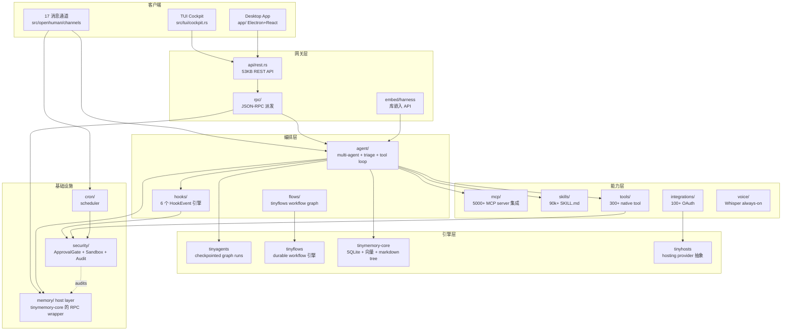
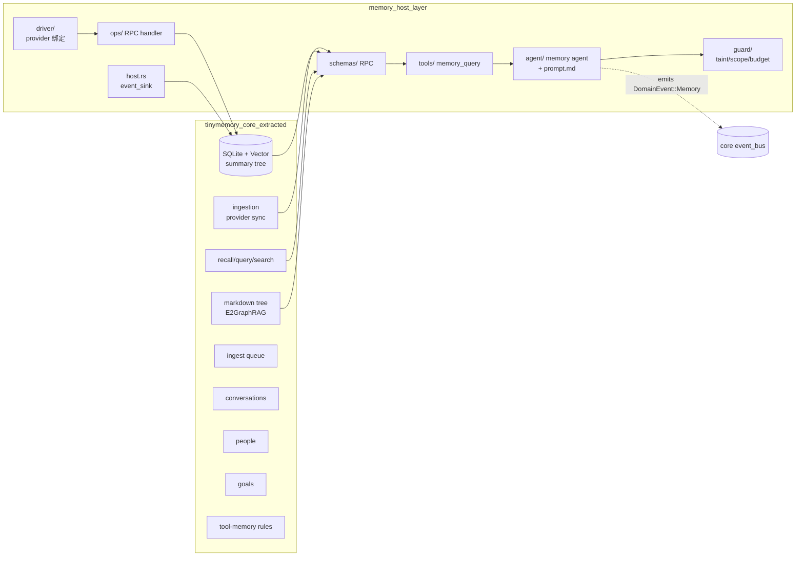
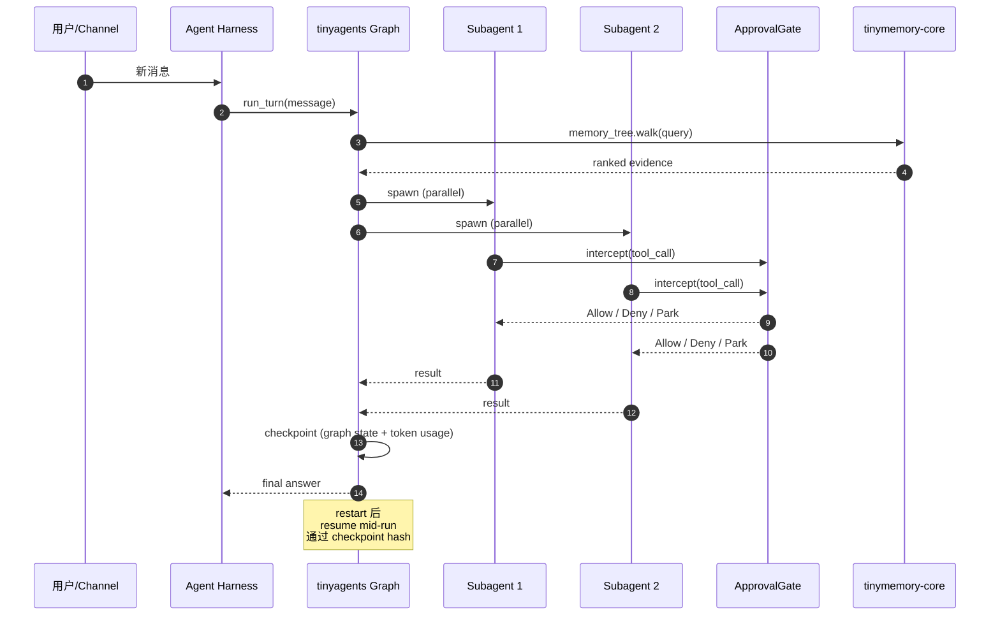
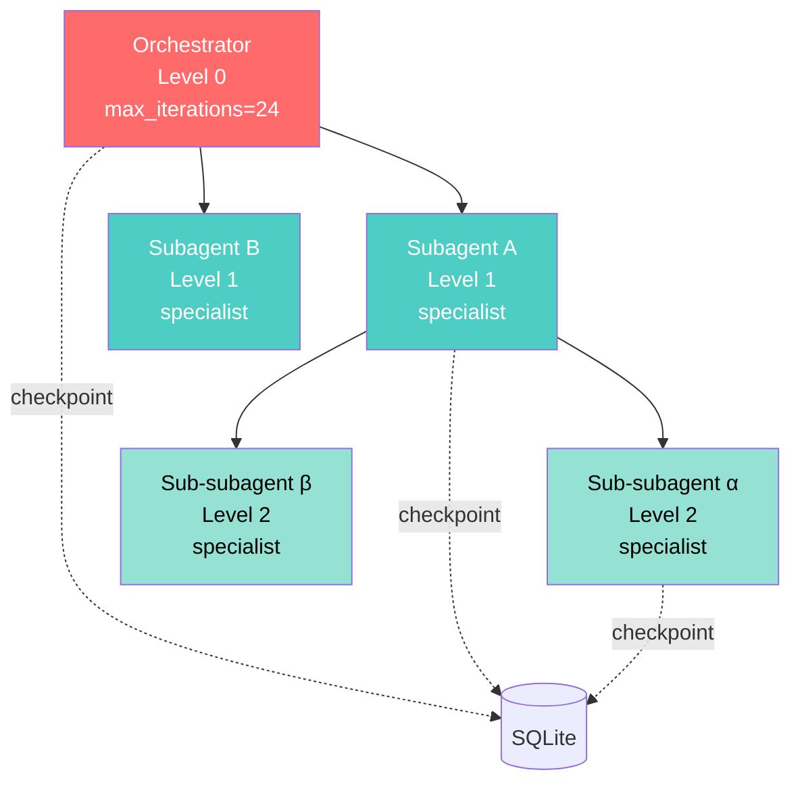
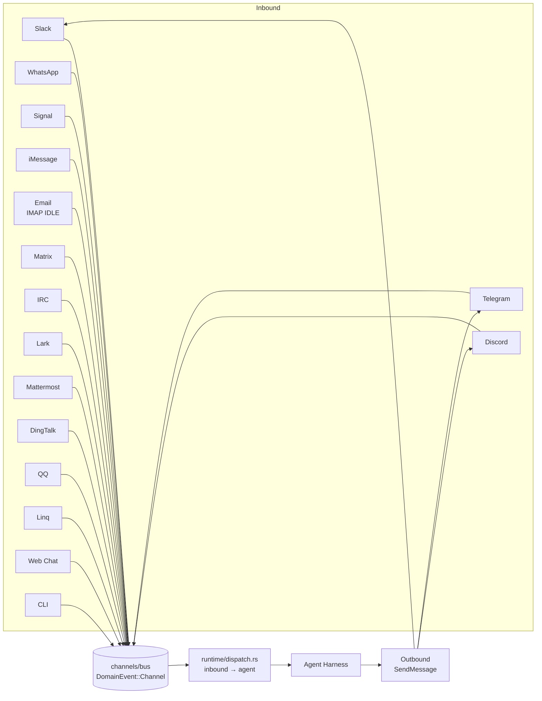
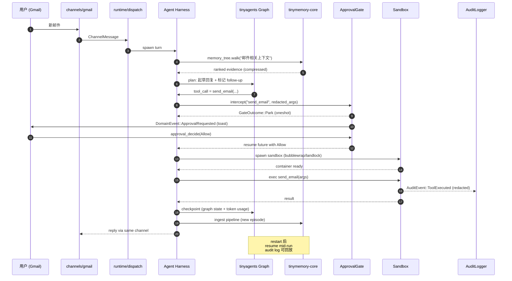

# 引子：当 AI 开始「认识你」

过去两年几乎所有的 Coding Agent 都在解决同一个问题：**怎么让 AI 写好代码**。Claude Code、Codex、Cursor、goose、OpenMontage —— 它们比拼的是谁的工具调用更稳、谁的上下文更长、谁能 fork 100 个 subagent 跑 swarms。

但还有一类 agent 几乎被 Coding Agent 圈忽略：**「它认识你」的 agent**。它们不是帮你写一段代码，而是把 Gmail、Notion、Slack、GitHub、Calendar 上**你**的所有上下文汇总、压缩、可查询；它们不写代码，只在合适的时机把合适的信息推到你的面前；它们的目标不是 AGI，而是 **AGU** —— "AGI for You"。

[tinyhumansai/openhuman](https://github.com/tinyhumansai/openhuman)（⭐39,298，最近更新 2026-09-01）是这个方向上当前最具野心的开源项目之一：Rust 写的本地优先个人 AI 超级智能体，自带 Memory Tree + Obsidian Vault、tinyagents/tinyflows 双子引擎、17 个消息通道、ApprovalGate 中间件 + 多后端沙箱。它不仅声称要"成为你"，还声称要把"成为你"这件事**压缩到 44-51 MiB RSS 空闲、~100ms 冷启动**。本文试图把它剖开，看看这种"长期记忆型 agent harness"在 2026 H2 走到了哪一步。

---

# 一、项目定位与核心价值

## 1.1 一句话定义

> **OpenHuman = 本地优先的个人 AI 超级智能体**，由三层组成：
> - **The Brain**：Memory Tree + Obsidian Vault + 90k+ Skills，把你的所有数据压缩成可查询的 Markdown 树；
> - **The Orchestrator**：tinyagents/tinyflows 双子引擎驱动 checkpointed graph runs + 持久 workflows + A2A E2E 加密；
> - **The Researcher/Doer**：自带 web 搜索 / 浏览器 / 语音 / 媒体生成，17 消息通道，sub-agent 三级嵌套。

## 1.2 仓库统计

| 字段 | 值 |
|------|----|
| ⭐ Stars | **39,298** |
| 默认分支 | main |
| 主语言 | Rust（核心）+ TypeScript（桌面 app/）+ Python（少量脚本）|
| 许可证 | **GPL-3.0**（注意 GPL，与已写过的 MIT/Apache-2.0 项目不同）|
| 仓库体积 | 193 MB |
| 最近推送 | 2026-09-01（活跃）|
| Topics | agent-framework · ai-agents · artificial-intelligence · developer-tools · llm · **local-first** · multi-agent · open-source |

> 关键判别信号：`local-first` 是 OpenHuman 区别于 Claude Cowork / Manus / Devin 的核心标签 —— 数据不离开你的机器，**on-device 加密 + 一键 Privacy Mode 强制无云推理**。

## 1.3 能力矩阵

OpenHuman 在 README 中把自己定位成 "3 件其他助手没有的事"：

1. **🧠 Brain：持久本地记忆**
   - Memory Tree + Obsidian Wiki（你的数据被压缩成 SQLite + Markdown 树，可被 Obsidian 打开）
   - 100+ OAuth 集成 + 5,000+ MCP server + 90,000+ Skills
   - **Auto-fetch 每 20 分钟自动拉数据**，让"明天早上 agent 已经知道昨晚发生了什么"
   - Goals & Todos（长程目标 + 每线程持久目标 + 共享 kanban）
   - **TokenJuice** 把工具输出在送进 LLM 之前压缩到 20% 大小（"a brain this big would be unaffordable without it"）

2. **🕸️ Orchestrator：图驱动而非循环驱动**
   - **Workflows**：agent 自己提议自动化，你在画布上 review 后保存（基于 tinyflows）
   - **A harness that finishes the job**：tinyagents 上的 checkpointed graph runs（卡死的 agent 被 steer，已停止的 agent 返回 root cause，每次 run 可重放并计算真实每次调用成本）
   - **Split brain**：reflex agent 三分流 + deep reasoning core 委派 worker fleets

3. **🔬 Deep Researcher & Doer**：自带搜索 / 抓取 / 浏览器 / 语音 / 媒体生成

---

# 二、整体架构：六大子系统

OpenHuman 的代码组织在 `src/openhuman/` 下，**6,871 个节点**清晰划分为 30 个二级域。最关键的六大子系统：



## 2.1 Cargo.toml 默认 features（domain gates）

OpenHuman 用 **feature flag 严格隔离每个域**，这是它能压到 81 MiB library-minimal binary 的关键。`scripts/ci/product-features.txt` 是产品构建清单，`Cargo.toml` 的 default = "Contrib" 是开发者构建清单。OpenHuman **没有 `library-minimal` meta feature**（AGENTS.md "Compile-time domain gates"）：

```bash
# 嵌入式库最小配方（来自 docs/library-minimal-recipe.md）
GGML_NATIVE=OFF cargo build --release \
  --no-default-features --features "skills,flows"
```

库最小配方里 `voice` / `web3` / `meet` / `tui` 都默认 OFF，**只保留 agent turn + subagent delegation + memory ingest + workflow run + python/js skill execution**。

## 2.2 关键尺寸数字（实测 vs 营销）

OpenHuman 在 `docs/harness-comparison-2026-07-22.md` 里非常坦诚地公布了和同类的对比（**这是这个赛道里唯一有第三方可复现 benchmark 的项目**）：

| Harness | 语言 | 部署形态 | RAM 空闲 | 启动 | 边际成本（per agent）|
|---|---|---|---|---|---|
| **OpenHuman core** | Rust，embeddable library | Library / 1 RPC process，agent 共享进程 | **44-51 MiB** settled；35-44 MiB slim | ~100-140 ms 冷 turn；~0 idle CPU | ~0.4 MiB cold；~1.8 MiB warm |
| OpenAI Codex CLI (codex-rs) | Rust | CLI process per session | 无公开 RSS | 毫秒级（定性）| N 个独立进程 |
| ZeroClaw | Rust | CLI + daemon | <5 MB 自报 | <10 ms 自报 | 多并发（无数字）|
| OpenClaw | TypeScript / Node | daemon + channel bridge | >1 GB（对手营销）| 慢（Node 重依赖）| N 个进程 |
| Claude Code | TypeScript | CLI | 500 MB-1 GB（leak bug）| — | 单进程 |

> 数字解读：OpenHuman **库嵌入时 ~0.4 MiB/agent cold、~1.8 MiB/agent warm** 边际成本 —— **in-process 共享是它比 "process-per-agent" 类项目（Codex CLI / Claude Code / OpenClaw）便宜 100× 的核心**。前提是它把"agent 间隔离"换成"同一进程内 task-local context"，靠 `agent/harness/fork_context.rs` 的 task-local parent context 做 KV-cache 复用（这是 OpenHuman 在 README 里特别强调的设计点）。

---

# 三、The Brain：Memory Tree + Obsidian Vault

> 来自 `src/openhuman/memory/README.md`：

> "The substance of the memory subsystem was extracted into [`tinymemory-core`](https://github.com/tinyhumansai/tinymemory): the SQLite/vector store, the markdown summary tree, the provider sync pipelines, ingestion, recall/query/search, the ingest queue, conversations, people, goals and the tool-memory rules."

这是 OpenHuman 最精彩的一个工程决策：**把记忆子系统物理上拆成独立 crate**，主仓库只保留 RPC wrapper + agent tool + guard + driver binding。**为什么这么做**：让 memory 子系统可以被 Claude Code、Cursor、Codex、OpenCode **作为 backend 复用**（README 里明确写到："OpenHuman ships an optional `Memory` backend that proxies to [agentmemory](https://github.com/rohitg00/agentmemory). Set `memory.backend = "agentmemory"` in `config.toml` and the same durable store powers OpenHuman alongside Claude Code, Cursor, Codex, and OpenCode"）。

## 3.1 Memory 域的 7 大子模块



## 3.2 Memory Tree 的查询工具（来自 memory/agent/agent/prompt.md）

memory 子系统暴露给主 agent 的不是一个简单的 "search" tool，而是 **5 类语义化查询接口**：

```markdown
# 来自 src/openhuman/memory/agent/agent/prompt.md:1-50
1. `memory_tree` — 主工具，5 种 mode:
   - `walk` / `smart_walk` — 确定性 E2GraphRAG 检索（无 LLM 介入）
   - `search_entities` — 先找 canonical entity ID
   - `query_source` — 按 source kind（chat/email/document）+ 时间窗过滤
   - `drill_down` — 展开 summary node 一层
   - `fetch_leaves` — 拉 raw chunk 用于引用
2. `memory_recall` — 遗留 key-value 检索
3. `query_memory` — 简单文本搜索
4. `memory_doctor` — 诊断 tree 健康
5. `memory_flavour` — 用户的 distilled style/preference 画像
```

**关键设计原则 "Fail fast — do not exhaust your tool budget"**：

> "Searching again and again over an empty memory tree is a failure, not thoroughness — it burns ~80s and still returns nothing, then dies with `[SUBAGENT_INCOMPLETE]` and the user's question goes unanswered. An honest 'no data found' delivered in a couple of calls is the correct, successful outcome."

**Two-strike rule**：第一次 `memory_tree walk` 没命中，最多尝试**一次** alternate angle（`search_entities + walk` 或单次 `memory_recall`）。再空就 stop。这是反 "agentic loop 死循环" 的硬约束。

---

# 四、The Orchestrator：tinyagents + tinyflows 双引擎

OpenHuman 的 orchestrator 由两个独立子 crate 组成 —— 这也是它的工程美学：**主仓库做集成，子仓库做实现**。

## 4.1 tinyagents：checkpointed graph runs

来自 README "An orchestrator, not a chatbot"：

> "Most agent harnesses run one agent in one loop. OpenHuman is an orchestrator:
> - **Graphs, not loops**: turns run as checkpointed graphs on tinyagents. They pause for a human, survive a restart, and resume mid-run.
> - **Sub-agent fleets**: specialists spawn three levels deep; stuck agents become root-cause reports.
> - **Agent-to-agent, encrypted**: instances orchestrate each other over Signal-protocol E2E sessions with x402 payments."

**Checkpoint + resume 模式** 是 tinyagents 的灵魂。它不是 LangGraph 的 DAG（虽然看起来像），而是 **"可暂停的、跨重启可恢复的、人类可干预的 graph"**。对比 LangGraph 的 `Pregel` 模型（每条边 step 走完才可干预），tinyagents 在每个 tool call 后都允许 `ApprovalGate` 暂停。



## 4.2 tinyflows：durable workflow 引擎

flows 子系统的工作流机制比 LangGraph / Temporal 都激进：**agent 提议 workflow → 用户在画布上 review → 保存为 durable trigger-driven run**。

来源：`src/openhuman/flows/agents/workflow_builder/agent.toml:1-20`：

```toml
id = "workflow_builder"
display_name = "Workflow Builder"
delegate_name = "build_workflow"
when_to_use = "Workflow authoring specialist — owns building tinyflows automation graphs..."
temperature = 0.2
max_iterations = 12
iteration_policy = "extended"
sandbox_mode = "none"
omit_safety_preamble = true  # ★ 关键安全设计

[model]
hint = "reasoning"

[tools]
# DELIBERATELY NARROW: propose/revise + read + dry-run + Composio discovery
# NO shell, NO file writes, NO channel sends
```

**关键安全设计**：workflow_builder agent 的工具集被故意收窄到"propose/revise/read/dry-run + 保存到现有 flow id"，**永远不能自己 enable 一个 flow**，永远不能自己 run 一个 flow。`create_workflow` 创建的 flow 永远 force-disabled。`run_flow` 必须经过 `ApprovalGate` 的真人类审批卡。

## 4.3 Sub-agent 三级嵌套

来自 `src/openhuman/agent/harness/session/types.rs` —— Agent 主循环：

```rust
// 来自 src/openhuman/agent/harness/session/types.rs:24-87
#[derive(Debug, Clone, Copy, Default, PartialEq, Eq)]
pub struct TurnOverrides {
    /// Skip loading, auto-resuming, and injecting this thread's durable
    /// [active_goal] block for this turn
    pub suppress_active_goal: bool,
    /// Run this turn with NO tools regardless of the agent's built tool set
    pub suppress_tools: bool,
    /// Force TriggerMemoryAgent::Never behaviour for this turn
    pub suppress_memory_agent: bool,
    /// Skip auto-resuming from agent's most-recent on-disk transcript
    pub suppress_transcript_autoload: bool,
}
```

**关键洞察**：每个 turn 都接受 overrides，**bare greeting / 小型对话可以"降级"成纯文本响应** —— 不进入 tool loop、不走 memory-agent retrieval、不重新注入上一任务的 stale 目标。**这是 opencompany issue #1725 的解法** —— Agent 主循环在运行时可被细粒度控制。

`run_subagent` / `SubagentRunOptions` / `SubagentRunError`（来自 `harness/subagent_runner/`）提供三级嵌套支持：



> **关键工程约束**：stuck agent 必须 **变成 root-cause report** —— 不允许无限嵌套卡死。OpenHuman 用 `iteration_policy = "extended"` 控制 "max_iterations" + 把卡死的执行转换成可读报告。

---

# 五、Tool Dialect：3 种工具调用方言的可插拔调度

来自 `src/openhuman/agent/dispatcher.rs`：OpenHuman 抽象了 3 种工具调用方言（**这和 OpenAI Agents SDK / LangChain 的 tool calling 抽象不是一个维度**）：

```rust
// 来自 src/openhuman/agent/dispatcher.rs:50-100
pub trait ToolDispatcher: Send + Sync {
    fn parse_response(&self, response: &ChatResponse) -> (String, Vec<ParsedToolCall>);
    fn format_result(&self, ...) -> ConversationMessage;
    // ...
}

// 3 种 dialect:
struct XmlDialect;        // <tool name="...">...</tool>
struct JsonDialect;       // {"tool_calls": [...]}
struct PFormatDialect;    // OpenHuman 自有 P-Format
```

**核心设计**：dialect 决定 model 怎么**表达**工具调用和**解析**返回值，但**绝不决定**：

```rust
// 来自 src/openhuman/agent/dispatcher.rs:30-45
// What did not move, and will not
//
// Executing a tool. The security policy, the approval gate, the sandbox,
// the per-call timeout, the progress events — those are OpenHuman's, and
// a dialect never decides what is *allowed to happen*, only what the
// model reads and writes. That line is what keeps the policy auditable
// in one place.
```

> 哲学："dialect = 语言；policy = 法律"。**语言层和政策层严格隔离**，让审计只需读一个地方（security 模块）。

---

# 六、安全子系统：ApprovalGate + 多后端 Sandbox

OpenHuman 的安全设计是它"个人 AI"定位的护城河 —— **你授权 agent 跑 Gmail / Slack / Calendar 上的真实操作，怎么确保它不会乱删？**

## 6.1 ApprovalGate：oneshot channel 的中间件

来自 `src/openhuman/security/approval/gate.rs:1-50`：

```rust
// 来自 src/openhuman/security/approval/gate.rs:1-50
//! Flow (issue #1339):
//! 1. Agent harness calls ApprovalGate::intercept with the tool name,
//!    a redacted JSON of the arguments, and a short summary.
//! 2. Gate checks the user's "Always allow" allowlist
//!    (autonomy.auto_approve, read live via live_policy). Hit → Allow
//!    immediately. An ApproveAlwaysForTool decision adds the tool to
//!    that list via approval_decide (config save + policy reload).
//! 3. Otherwise: persist a row in pending_approvals, publish a
//!    DomainEvent::ApprovalRequested event so the UI can pop a toast,
//!    and park the call on a oneshot::Sender keyed by request_id.
//! 4. UI calls approval_decide (RPC) which routes through
//!    ApprovalGate::decide → sends the decision on the oneshot.
//! 5. The parked future wakes with the decision and translates it into
//!    GateOutcome::Allow / Deny.
```

**关键细节 `COPILOT_APPROVAL_TTL`**：

```rust
// 来自 src/openhuman/security/approval/gate.rs:60-75
const COPILOT_APPROVAL_TTL: Duration = Duration::from_secs(180);  // 3 minutes
```

> Flow Canvas copilot 的 live-run 路径走的是 **3 分钟** park 窗口（默认 10 分钟），因为 stale 10 分钟 park 在用户已经离开的 copilot pane 上是灾难。

## 6.2 Sandbox 多后端

```rust
// 来自 src/openhuman/security/mod.rs (re-export)
pub mod docker, bubblewrap, firejail, landlock;
pub fn create_sandbox(config: &SecurityConfig) -> Arc<dyn Sandbox>;
```

4 种 sandbox backend 自动 detect：

| Backend | 平台 | 隔离强度 |
|---|---|---|
| `docker` | 跨平台 | 容器级（最强）|
| `bubblewrap` (`bwrap`) | Linux | 用户命名空间（轻量）|
| `firejail` | Linux | seccomp + namespace |
| `landlock` | Linux | 内核 LSM（最轻，5.13+）|
| `noop` | 全部 | 仅记录，不隔离 |

**`pub enum AutonomyLevel`** + `CommandRiskLevel` + `ToolOperation` + `ActionTracker` 共同构成策略：

```rust
// 来自 src/openhuman/security/README.md
pub enum AutonomyLevel {
    Supervised,      // 每个外部效应都要审批
    SemiAutonomous,  // 已知工具可自动
    Autonomous,      // 完全自主
}
```

## 6.3 Tool Policy Engine：per-session 决策快照

来自 `src/openhuman/tools/agent_policy/engine.rs`：

```rust
// 来自 src/openhuman/tools/agent_policy/engine.rs:1-50
pub struct ToolPolicyEngine;

impl ToolPolicyEngine {
    pub fn build_session(
        agent_id: impl Into<String>,
        channel: impl Into<String>,
        entrypoint: impl Into<String>,
        channel_permissions: &HashMap<String, String>,
        tools: &[Box<dyn Tool>],
        visible_tool_names: &HashSet<String>,
    ) -> super::ToolPolicySession {
        // ... 决定每个 tool 的 ToolPolicyAction:
        //   HideFromPrompt / Deny / Allow
        // 通道权限为空 → 遗留的不限制
        // 任何 channel policy 存在 → 未知 channel fallback 到 read-only
    }
}
```

**关键安全约束**：每个 agent session 在启动时构建一个 **确定性的** 策略快照（`channel_permissions` × `tools` × `visible_tool_names` 的笛卡尔积）。**空 `channel_permissions` 保留 legacy 不限制行为**；但**一旦任何 channel policy 存在**，未知 channel 自动降到只读 —— **fail-closed 哲学**。

## 6.4 Audit Log

```rust
// 来自 src/openhuman/security/README.md
pub struct AuditLogger;           // append-only audit trail
pub enum AuditEventType;
pub struct AuditEvent;
pub struct Actor;
pub struct Action;
pub struct ExecutionResult;
```

所有 agent action（allow / deny / approved / denied / policy-loaded / sandbox-spawned）**append-only** 写入 audit log。配 `redact()` 4-char-prefix 脱敏（不让敏感数据进 log）。

---

# 七、Channels：17 消息通道的 ingress + egress 抽象

来自 `src/openhuman/channels/README.md`：

```rust
// 来自 src/openhuman/channels/README.md
pub trait Channel;
pub struct SendMessage;
pub struct ChannelMessage;
pub struct ChannelDefinition;
pub enum ChannelAuthMode;
pub fn start_channels;        // 启动所有 enabled channel
pub fn doctor_channels;       // 诊断连通性
```

**已支持的 17 个通道**：

| 通道 | Provider |
|---|---|
| Slack · Discord · Telegram · WhatsApp · WhatsApp Web · Signal · iMessage · IRC · Matrix · Email (IMAP IDLE + SMTP) · Lark · Mattermost · DingTalk · QQ · Linq · Web · CLI |

每个 provider 都是独立 `providers/<name>.rs` 文件，**Cargo feature gate** 控制编译（`whatsapp-web` 默认 OFF）。



**关键设计**：每条入站消息通过 `channels/bus.rs` 发出 `DomainEvent::Channel(*)`，由 `runtime/dispatch.rs` 路由到 agent harness。**通道凭据存储** 不在 channels 模块（delegate 到 `credentials/`）—— 让 channel 模块只关心 IO。

---

# 八、Skills：agentskills.io 风格的本地技能目录

来自 `src/openhuman/skills/README.md`：

> "Discovery and parsing of agentskills.io-style skills (a directory containing `SKILL.md` with YAML frontmatter and Markdown instructions). Owns scope resolution (User vs Project vs Legacy), trust-marker enforcement, resource reading, and install/uninstall."

```rust
// 来自 src/openhuman/skills/README.md
pub enum SkillScope;       // User / Project / Legacy
pub const MAX_SKILL_RESOURCE_BYTES: u64 = 128 * 1024;  // per-resource RPC payload 上限
pub struct ToolResult;
pub enum ToolContent;      // content blocks returned by skill / tool execution
pub mod bus;               // emits DomainEvent::Skill on install/uninstall
```

**Skills vs Tools 的关键差异**：
- **Tool** = Rust 实现的工具（`tools/<domain>.rs`，300+ 个）
- **Skill** = Markdown + YAML frontmatter 描述的指令（90,000+ 来自社区）

**Scope resolution**（User > Project > Legacy 优先级）+ **trust-marker** 是 OpenHuman 防 skill 注入的关键：未签名的 skill 在 agent 端**不可见**，必须经用户显式 install。

执行路径：`run_skill` 在**隔离 worker** 里跑 body，**不再被 splice 进 chat turn** —— 这是 OpenHuman 在 2026 年从 "skill = 长 prompt 注入" 转向 "skill = 隔离 worker" 的关键决策。

---

# 九、MCP + Hosting + Integrations 三件套

## 9.1 MCP

```rust
// 来自 src/openhuman/mcp/README.md
pub mod audit;            // 审计 MCP 调用
pub mod stub;             // 测试 stub
```

MCP 子系统包含 5,000+ MCP server 集成 + 完整 audit（`audit/schemas.rs` 定义 MCP call 的 schema 校验）。这是 OpenHuman "MCP 是 first-class citizen" 的体现 —— **不是把 MCP 当成插件**，而是把 MCP 当成"tool 之外的另一类工具"。

## 9.2 tinyhosts：hosting provider 抽象

来自 `src/openhuman/hosting/mod.rs:1-50`：

```rust
// 来自 src/openhuman/hosting/mod.rs:1-50
//! Hosting: putting a workspace on the internet.
//!
//! The split is the point. Nothing here knows the word "project" or
//! "readyState", and nothing in tinyhosts knows what a workspace is.

pub fn hosting_launch_site;     // directory → live site + DB
pub fn hosting_rollback;        // production → earlier deployment
```

**9 个工具**（`hosting_launch_site` / `hosting_rollback` / `hosting_list_*` 等）。凭据解析 fallback chain：`[hosting].api_key` → provider env var → `Ok(None)`（**不注册 tools**）。

> "A tool that is present and cannot work is worse than one that is absent: a model will retry it." —— OpenHuman 用 fail-closed 哲学解决"半成品工具浪费 token"问题。

## 9.3 Integrations：100+ OAuth + auto-fetch


**Auto-fetch 20 分钟同步** 是 README 强调的差异化：Connect your accounts → auto-fetch pulls data locally → Memory Tree compresses → Obsidian vault updated → agent 第二天早上已经"知道"昨晚发生了什么。

---

# 十、TUI Cockpit：终端调试 cockpit

来自 `src/tui/`：

```rust
// 来自 src/tui/cockpit.rs
pub mod cockpit;            // 终端调试界面
pub mod composer;
pub mod controls;
pub mod render;
pub mod runner;
pub mod state;
```

OpenHuman 提供了一个 **TUI cockpit** 让运维 / 调试不需要装 Desktop App。`src/tui` 是 feature-gated（`#[cfg(feature = "tui")]`），默认 OFF 让 library-minimal binary 更小。

`src/openhuman/desktop/` 下还有 66 个文件的 Desktop 自动化（accessibility / focus / globe / notifications），让 OpenHuman 可以在 macOS / Windows / Linux 上**真实操作系统** —— 不是单纯的 CLI 工具。

---

# 十一、端到端数据流：一次完整的 chat turn



**关键观察**：每一步都有显式的 audit + checkpoint + sandbox。**没有任何"agent 自行决策执行"** —— 所有外部效应必须经过 ApprovalGate。

---

# 十二、与同类项目对比

OpenHuman 在 `docs/harness-comparison-2026-07-22.md` 里提供了与 Claude Cowork / OpenClaw / Hermes Agent 的官方对比表。**我加上 Coding Agent 圈里几个重要参照**：

| 维度 | **OpenHuman** | Claude Code | openai/codex | aaif-goose/goose | LangGraph |
|---|---|---|---|---|---|
| **定位** | 个人 AI 超级智能体 | 终端 Coding Agent | 终端 Coding Agent | Coding Agent Harness | DAG 工作流框架 |
| **主语言** | Rust | TypeScript | Rust | Rust | Python |
| **License** | GPL-3.0 | 闭源 | Apache-2.0 | Apache-2.0 | MIT |
| **RAM 空闲** | **44-51 MiB** | 500MB-1GB | 无公开数据 | 50-100MB | 取决于 host |
| **核心抽象** | Memory Tree + tinyagents + tinyflows | Tool loop | MultiAgentVersion V1/V2 | Provider Registry + Hook | Pregel DAG |
| **多 agent 嵌套** | **3 层 subagent** | sub-agent 工具调用 | MultiAgentVersion | 单 agent 多 provider | 任意 |
| **持久记忆** | ✅ **tinymemory-core** | ❌ 无 | ❌ 无 | ❌ 无 | ✅ Checkpoint |
| **Workflow** | ✅ tinyflows | ❌ 无 | ❌ 无 | ❌ 无 | ✅ 是核心 |
| **A2A 通信** | ✅ **Signal E2E + x402** | ❌ 无 | ❌ 无 | ❌ 无 | ❌ 无 |
| **消息通道数** | **17 (含 IMAP IDLE)** | 0 | 0 | 0 | 0 |
| **审批中间件** | ✅ ApprovalGate + 多 TTL | 工具 confirm | seatbelt sandbox | Hook 11 事件 | 需自己写 |
| **Sandbox 后端** | Docker/bwrap/firejail/landlock/noop | seatbelt | Landlock/seatbelt/Windows token | 无（需 OS sandbox）| 无（host 自己负责）|
| **可嵌入** | ✅ CoreBuilder + Harness | ❌ SDK-only | ❌ 二进制 | ❌ CLI/desktop | ✅ Python lib |
| **冷启动** | ~100ms | 慢（TS bundle）| "毫秒"（定性）| 几百毫秒 | 慢（Python）|
| **边际成本（per agent）** | **~0.4 MiB cold / ~1.8 MiB warm** | N 个进程 | N 个进程 | N 个 desktop pane | 共享进程但无内置 agent |

> 关键差异化：OpenHuman 是**唯一**同时具备 (a) 个人级本地优先 (b) 17 消息通道 (c) ApprovalGate 中间件 (d) Signal E2E A2A (e) 库嵌入 + 0.4 MiB/agent 边际成本 五个特性的项目。

---

# 十三、优缺点分析

## 13.1 左侧（架构 / 扩展 / 易用）

| 优势 | 实证 |
|---|---|
| **🟢 库嵌入 + 0.4 MiB/agent 边际成本** | docs/library-minimal-recipe.md 给的实测数字，**比 process-per-agent 类项目便宜 100×** |
| **🟢 子系统物理拆分（tinymemory-core / tinyagents / tinyflows / tinyhosts）** | 4 个独立 crate，memory 子系统甚至给 Claude Code / Cursor / Codex 作 backend |
| **🟢 Feature flag 严格隔离** | Cargo.toml default = "Contrib" 与 product-features.txt 分离，让 library-minimal 81 MiB / default 116 MiB / stripped 60 MiB |
| **🟢 ApprovalGate 真正的"oneshot 中间件"模式** | 12 行注释说清所有决策路径，COPILOT_APPROVAL_TTL 区分场景 |
| **🟢 Tool dialect 与 policy 严格分层** | "dialect = 语言；policy = 法律" —— 审计只需读一个地方 |
| **🟢 Memory Two-strike rule** | memory/agent/agent/prompt.md 写明的硬约束，避免 agentic loop 死循环 |
| **🟢 三级 subagent 嵌套** | run_subagent / SubagentRunOptions / SubagentRunError |
| **🟢 17 消息通道 + IMAP IDLE + Signal E2E** | 唯一同时覆盖这么多通道的开源 agent |
| **🟢 Checkpoint + resume 跨重启** | tinyagents 的核心特性，区别于 LangGraph Pregel |
| **🟢 Auto-fetch 20 分钟同步** | 把"agent 认识你"压缩到分钟级（README："Context in minutes, not weeks"）|

## 13.2 右侧（性能 / 复杂度 / 维护）

| 劣势 | 影响 |
|---|---|
| **🔴 GPL-3.0 许可证** | **不能用商用闭源产品里**。比 MIT/Apache 严苛很多 |
| **🔴 Rust 生态入门曲线陡** | 190MB + 6871 节点 + 30 个域，新贡献者需要 ~1 周才能理解模块边界 |
| **🔴 Desktop App (Tauri) 与 Library 是两套构建** | 必须分别维护 electron+react 与 rust core 的同步 |
| **🔴 Memory 子系统物理拆分到独立 crate** | 主仓库只留 wrapper，调试需要切到 tinymemory-core 仓库 |
| **🔴 ApprovalGate 增加每个 tool call 的 latency** | 即使 Allow 也要走 oneshot channel + 检查 allowlist |
| **🔴 通道越多维护负担越大** | 17 个通道，每个平台 API 变动都要同步更新 |
| **🟡 tokenjuice 压缩是有损的** | "same information, up to 80% fewer tokens" 但原文已声明信息保真 |
| **🟡 Memory Tree 的 markdown 格式是 user-data contract** | 修改 schema = 用户数据迁移 |
| **🟡 Sub-agent 三级嵌套** | 嵌套层级难调试，深嵌套时 audit log 上下文切换成本 |

---

# 十四、实践 / 部署

## 14.1 快速安装

```bash
# macOS / Linux 桌面版（via Homebrew）
brew install openhuman

# Arch Linux
pacman -S openhuman-bin

# Debian / Ubuntu
sudo dpkg -i openhuman_*.deb

# npm 包装（无独立 binary）
npx openhuman
```

## 14.2 库嵌入最小配方（来自 docs/library-minimal-recipe.md）

```bash
# 嵌入式库最小配方（opencompany 场景：100-1000 live agents in 2GB RAM / 2 vCPU）
GGML_NATIVE=OFF cargo build --release \
  --no-default-features --features "skills,flows"
```

```rust
// 来自 src/lib.rs:30-50 的官方示例
use openhuman_core::{Harness, Provider, Session, Workspace};

let harness = Harness::builder()
    .provider(Provider::openai_compatible("https://api.example/v1", "sk-...")
              .model("gpt-5"))
    .workspace(Workspace::Ephemeral)
    .session(Session::local("my-host"))
    .build()
    .await?;

println!("{}", harness.run("Say hello.").await?.reply);
```

## 14.3 切换 Memory backend

```toml
# config.toml
[memory]
backend = "agentmemory"  # 或默认 "tinymemory-core"
```

```rust
// 让 OpenHuman 与 Claude Code / Cursor / Codex / OpenCode 共享同一个 memory store
```

## 14.4 启用 Privacy Mode（强制本地推理）

```rust
// 一键 Privacy Mode（README: "flip one switch and no inference leaves your machine"）
config.privacy_mode = true;
```

Rust core 在推理前强制检查所有 provider 的 endpoint，**任何外部 host 都会被拒绝**。

---

# 十五、趋势 + 总结

## 15.1 三个核心趋势判断

### 趋势一：**「个人 AI 超级智能体」会成为 Coding Agent 之外的另一条主线**

Claude Code / Codex / Cursor / goose 这类 Coding Agent Harness 已经把"代码任务"做到极致，**但长期记忆 + 个人上下文 + 多消息通道的赛道上，OpenHuman 是当前最认真的开源尝试**。未来 6 个月会有更多项目涌向这个方向 —— "AGI for You" 即将取代 "AGI" 成为新口号。

### 趋势二：**「库嵌入 + 进程内多 agent」会取代「进程-per-agent」**

OpenHuman 的 ~0.4 MiB/agent 边际成本数字是颠覆性的。**当 agent 数量从 10 个增加到 1000 个时，进程-per-agent 架构（Codex CLI / Claude Code）的内存开销会让 SaaS 模式破产**，而库嵌入 + in-process 共享是唯一出路。**Linux Foundation AAIF 治理的 goose 同方向** —— 印证了 "agent harness 必须能嵌入"的趋势。

### 趋势三：**「子 crate 拆分」会取代「单一 monolith」**

OpenHuman 把 memory / agents / flows / hosts 物理拆成 4 个独立 crate 的设计哲学，比 LangChain 的"一个 mega package"和 LangGraph 的"DAG 框架"更可持续。**每个子 crate 都能被 Claude Code / Cursor / Codex / OpenCode 单独使用**，让 OpenHuman 不只是一个产品，而是一个**生态**。

## 15.2 OpenHuman 在 2026 H2 的位置

| 维度 | OpenHuman 的选择 |
|---|---|
| 商业模式 | 开源 + managed subscription（GitHub OAuth + TokenJuice 订阅）|
| 治理 | 单公司 + GPL-3.0（**没有 Linux Foundation 治理** —— 不如 goose / Agentic AI Foundation）|
| License 选择 | GPL-3.0 **会限制它在企业 SaaS 中的直接嵌入** |
| 多 agent 拓扑 | 三级嵌套 + graph checkpoint（比 CrewAI / AutoGen 严格，比 LangGraph 灵活）|
| 安全哲学 | ApprovalGate + 多后端 sandbox + append-only audit + fail-closed |
| 跨 agent 通信 | Signal E2E + x402 payments（**唯一同时支持 A2A + 加密 + 支付的开源项目**）|

## 15.3 工程经验提炼

1. **"语言 vs 法律" 分层**：Tool dialect = 语言（决定 model 怎么表达工具调用），Security policy = 法律（决定什么是允许的）。两层严格隔离让审计只需读一个地方。
2. **"Fail fast — do not exhaust your tool budget"**：Memory agent 的 two-strike rule 是反 agentic loop 死循环的硬约束 —— 宁愿 "no data found" 也不允许 80s 后才放弃。
3. **"A tool that is present and cannot work is worse than one that is absent"**：hosting 模块用 `Ok(None)` 不注册 tools，是 fail-closed 哲学的典范。
4. **"Copilot TTL ≠ main chat TTL"**：3 分钟 vs 10 分钟 park 窗口区分场景，避免 stale park 阻塞新 turn。
5. **"Sub-crate 拆分 = 生态可复用"**：tinymemory-core 被 Claude Code / Cursor / Codex / OpenCode 复用，让 OpenHuman 不只是产品，而是"个人 AI 操作系统"层的基础设施。
6. **"Feature flag = binary size 杀手"**：default = "Contrib" 与 product-features.txt 分离，让 library-minimal 81 MiB / default 116 MiB / stripped 60 MiB 成为可能。

---

# 附录：关键资源

| 资源 | 链接 |
|---|---|
| GitHub 仓库 | https://github.com/tinyhumansai/openhuman |
| 默认分支 | main |
| 最近 release | 2026-09-01 |
| Documentation | https://tinyhumans.gitbook.io/openhuman/ |
| 子 crate: tinymemory-core | https://github.com/tinyhumansai/tinymemory |
| 子 crate: tinyagents | https://github.com/tinyhumansai/tinyagents |
| 子 crate: tinyflows | https://github.com/tinyhumansai/tinyflows |
| 子 crate: tinyhosts | https://github.com/tinyhumansai/tinyhosts |
| License | GPL-3.0 |
| 桌面打包 | Homebrew / Arch AUR / Debian / npm |
| 库嵌入示例 | `src/lib.rs:30-50` |
| 实测 benchmark | `docs/library-benchmarking.md` |
| Harness 对比 | `docs/harness-comparison-2026-07-22.md` |
| Library 最小配方 | `docs/library-minimal-recipe.md` |
| Memory README | `src/openhuman/memory/README.md` |
| Agent README | `src/openhuman/agent/README.md` |
| Approval Gate | `src/openhuman/security/approval/gate.rs:1-50` |
| Dispatcher | `src/openhuman/agent/dispatcher.rs:30-100` |
| Memory agent prompt | `src/openhuman/memory/agent/agent/prompt.md:1-50` |
| Tool policy engine | `src/openhuman/tools/agent_policy/engine.rs:1-50` |
| Hosting | `src/openhuman/hosting/mod.rs:1-50` |

> **核心洞察**："AGI for You" 这个被 OpenHuman 默默贯彻的口号 —— 在 2026 H2 Coding Agent 圈把"多 agent 编排"推到极致的同时，**它悄悄开辟了另一条赛道：把"agent 认识你"压缩到 44 MiB RSS、100ms 冷启动、0.4 MiB/agent 边际成本**。这是 Coding Agent Harness 圈下一个值得追的方向。