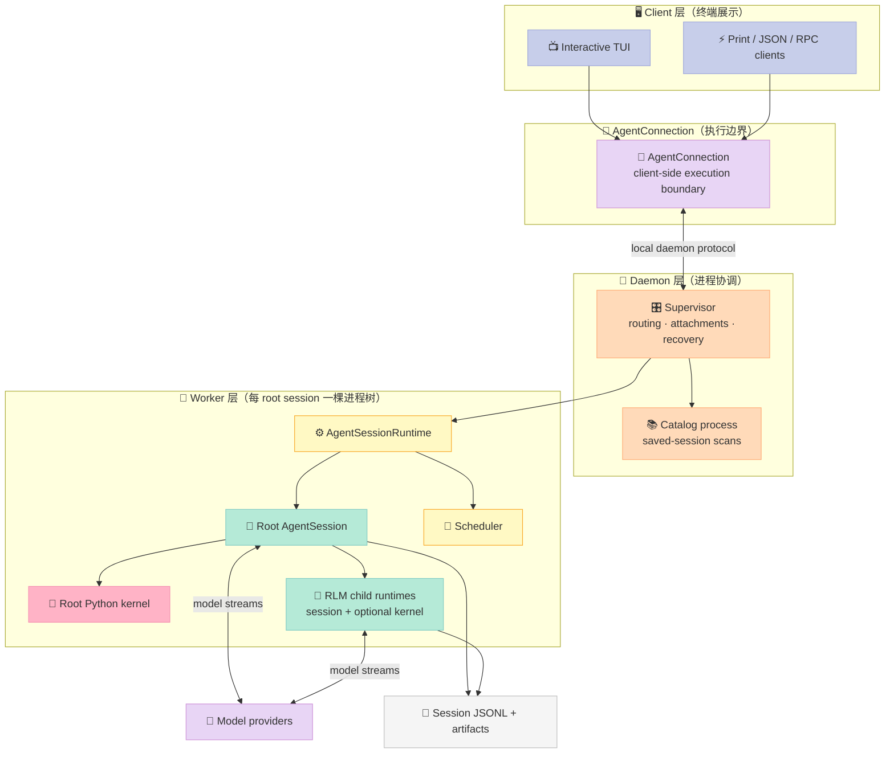
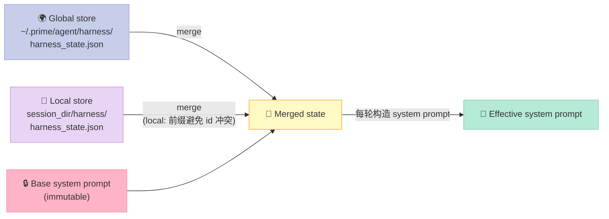
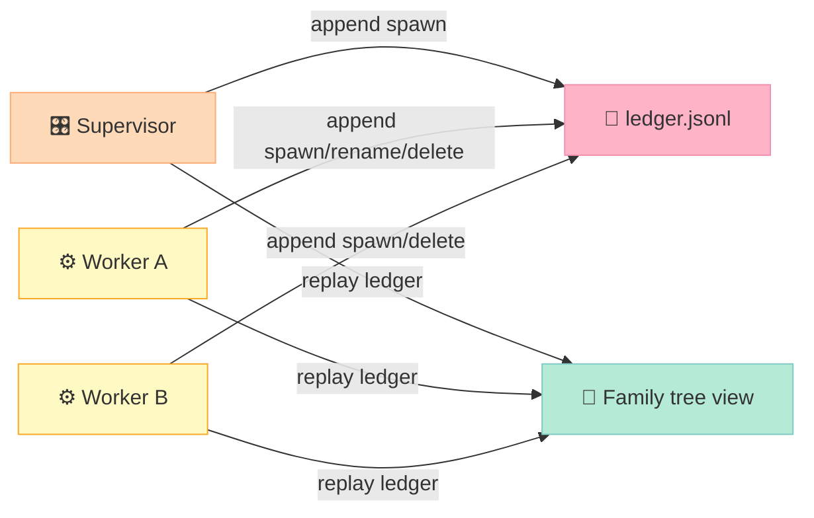

> 一句话核心结论：**Prime Agent 把 LLM 当成"会写代码的协程"，把整个 Harness 设计成一个 Python REPL 控制面 + 可增量编辑的 Continual Harness 持久状态——agent 不再每轮从零开始，而是把"经验"沉淀到 harness_state.json 里，跨 session 复用。**

---

## 前言：当 Agent 学会"自我打补丁"

把大语言模型（LLM）塞进一个壳，让它能稳定地交付结果——这件事过去两年的主流做法是 **prompt engineering + tool calling loop**。Claude Code、Codex CLI、Cursor 几乎都是这个套路：system prompt + 工具白名单 + 一个 while 循环。

这套架构有个致命的弱点——**它把"经验"全部塞进了上下文窗口**。一个跑了 200 轮的 coding agent，"教训"只能写在临时记忆或上下文摘要里，关掉终端就消失。

那么问题来了：**如果 Agent 自己也变成了"产品"，每次跑都是从零学起，凭什么让用户相信它会越用越好？**

答案藏在 **PrimeIntellect-ai/prime-agent**（19.5k⭐，TypeScript + Python 双语，2026-05 创建、9 月仍高频提交）这个项目里。它提出了两个互相咬合的抽象：

- **RLM（Recursive Language Model，递归语言模型）**：把模型放进一个**持久 Python REPL**，子 agent、文件、shell、技能、context 管理全部变成 Python 调用。
- **Continual Harness（持续可进化的 Harness）**：把"system prompt + 记忆 + 技能 + subagent 规格"建模成一份**可增量编辑的 JSON 文件**，由 `/refine` 子系统在每次跑完后基于轨迹证据做小步改动。

这两个抽象结合后，**agent 不再每轮从零推理，而是基于一份不断进化的 harness state 文件**——这是 2026 年 Harness Engineering 最值得深挖的一个新方向。

读完这篇你会得到：
1. **RLM 的 5 大不变量**——为什么"Python REPL + 持久状态"是 agent 编程模型的下一个台阶
2. **Continual Harness 的 4 类 entry + 3 层 scope**——为什么它比 LangChain Memory 强 1 个数量级
3. **`/refine` 的 plan/apply 两阶段协议**——为什么"先把提案落盘、再原子 apply"是防并发编辑的关键
4. **append-only RLM Ledger**——为什么 daemon 多进程必须靠共享账本而不是单点注册表
5. **从零复刻的 MVP 代码**——少于 200 行实现一个最小 Continual Harness

---

## 一、Prime Agent 是什么

Prime Agent 是 Prime Intellect 团队（前身是硬分叉自 pi-mono，现在是完全独立产品）推出的一款**长跑型（long-running）编码与研究 Agent Harness**。它的核心叙事围绕两点：

| 维度 | 传统 Harness | Prime Agent |
|------|-------------|-------------|
| 控制面 | system prompt + tool 调用 | **持久 Python REPL** |
| 状态管理 | 上下文窗口 + 临时记忆 | **`harness_state.json` + 历史 refinement log** |
| 自我进化 | 无（或外部分类器） | **`/refine` 自动增量改写 harness** |
| 子 agent | JSON-RPC / message passing | **`await rlm("...")` 当作 Python 函数** |
| 长跑能力 | 终端断开即丢 | **daemon-backed + 心跳 + 目标持久化** |

> 项目地址：https://github.com/PrimeIntellect-ai/prime-agent  
> 论文：RLM (arXiv 2608.23552)、Continual Harness (arXiv 2605.09998)  
> 许可：MIT，1216 个文件，约 974 个 TypeScript/Python 源文件

下面这张图是项目自带架构图（来自 `docs/architecture.md`）：



五个进程边界清楚分离：**客户端只渲染，supervisor 只路由，worker 跑 agent session，kernel 跑 Python，model provider 只发流**。这是经典 Unix "do one thing well" 哲学在 Agent 系统的复刻。

---

## 二、RLM：把 LLM 当成会写 Python 的协程

### 2.1 五个核心不变量

`docs/rlm.md` 一开头就列了 5 条"RLM 不变量"，每条都是对传统 Agent 架构的反叛：

| # | 不变量 | 传统做法 | Prime Agent 做法 |
|---|--------|---------|-----------------|
| 1 | **执行是程序化的** | 每个能力一个 tool | **一个 `ipython` 工具**统一切换 |
| 2 | **子 agent 是 native RLM 调用** | JSON-RPC / message bus | **`await rlm("...")`** 当函数调 |
| 3 | **Admission handle ≠ 答案** | 调用阻塞等结果 | **立刻返回 handle，答案走 agent_message** |
| 4 | **上下文是变量** | 把所有东西塞进 system prompt | **`prompt = "..."` 当 Python 字符串传** |
| 5 | **Python 状态跨回合存活** | 每轮重置 | **persistent kernel，跨 compaction、跨重启** |

第 5 条是 Prime Agent 区别于 LangChain AgentExecutor 的根本——它把 **kernel 做成有状态进程**，而 LangChain 是"每次 invoke 重新跑 stateless 图"。

### 2.2 为什么"一个 ipython 工具"比"10 个 tool"好

传统 Agent：
```typescript
// 10 个 tool
tools = [read_file, write_file, edit_file, bash, glob, grep, 
        web_search, http_get, todo_write, ask_user]
// 每次 model 选择 1 个 tool，调一次，回来再选
```

Prime Agent：
```typescript
// 1 个 ipython 工具
tools = [ipython]
// 一次调用可以写任意 Python：
await ipython("""
results = bash("npm run check").output
data = parse_results(results)
path = Path("out.json").write_text(json.dumps(data))
""")
```

**优势**：
- **Tool 选择熵低**：模型不用在 10 个工具之间做艰难的取舍，每个调用都是 Python 代码
- **逻辑可组合**：循环、条件、异常处理全是 Python 原生语法，不用 LLM 推理
- **状态可复用**：变量、import、解析过的中间结果全在 kernel 里，下次直接用

**劣势**：
- **依赖 Python 熟练度**：模型必须真的会写 Python（大多数 frontier 模型都满足）
- **沙箱更难**：Python 比单个 JSON tool 调用复杂得多，kernel 必须有进程级隔离

> 项目原话（`docs/rlm.md`）：*"Reading and editing files, running project commands, transforming results, invoking skills, and delegating work all begin from that persistent kernel instead of separate built-in tool calls."*

### 2.3 子 agent 的 admission handle 模式

看这段真实代码（来自 `docs/rlm.md`）：

```python
# ❌ 传统做法：阻塞等待子 agent 返回
result = await subagent("Review auth flow")  # 阻塞 5 分钟

# ✅ Prime Agent：立刻返回 handle，答案走异步消息
handle = await rlm("Review the authentication flow for security issues", 
                   name="auth-reviewer")
print(handle.rlm_child_id, handle.name, handle.session_dir, handle.model)
# handle.rlm_child_id == "rlm_abc123"
# handle.session_dir == "/sessions/2026-09-02/auth-reviewer/"

# 父 agent 立刻返回本轮，让出控制权
# 子 agent 完成后通过 agent_message.send 回信：
await agent_message.send(message, receiver_role="parent")
```

**关键洞察**：这里 `await rlm(...)` 看起来像 await 一个函数，**实际上背后是 RPC 调用一个独立子 session**。"等待子 agent 完成"在 Prime Agent 里**不是 await 的语义**，而是"订阅 agent_message 事件流"。

这种设计让父 agent 可以**并行启动多个独立子任务后立刻结束本轮**：

```python
api_review = await rlm("Review the public API", name="api-reviewer")
test_review = await rlm("Review the test coverage", name="test-reviewer")
integration_audit = await rlm("Run the slow integration audit", 
                               name="integration-audit")
# 三件事并行跑，本轮结束。等子 agent 完成时，daemon 会调度下一轮
```

`docs/rlm.md` 把这个写得很硬：*"Do not keep the turn open by polling with `time.sleep()` or shell `sleep`, and do not replace polling with a long blocking `await`. Await only the short operation needed to start work or inspect a result that is already available; otherwise end the turn."*

**本质**：RLM 把"长跑任务"从"block until done"重构成"admit + async reply"。这是分布式系统里 **fire-and-forget RPC** 的 LLM 化。

### 2.4 prompt-as-a-variable

RLM 还有一个反直觉的设计——**prompt 本身是一个 Python 变量**，可以像拼字符串一样动态构造：

```python
# 假设要根据子任务结果动态构造子 agent 的 prompt
sub_prompt = f"""
你是一个资深 code reviewer。
审查范围：{Path("src/auth/").relative_to(cwd)}
已知问题：{known_issues_table}
请重点关注：{user_focus_topics}
"""
handle = await rlm(sub_prompt, name="reviewer")
```

这是 **prompt 模板化**的真正实现——不是 YAML 模板、不是 Jinja2，而是**Python f-string**。LLM 可以利用 Python 生态的所有工具（ast、jinja、json 解析）来构造 prompt。

---

## 三、Continual Harness：Harness 的可进化层

### 3.1 4 类 entry + 3 层 scope

Prime Agent 把"持续可进化的 harness 状态"建模成一个 JSON 文件 `harness_state.json`，结构是这样的：

```typescript
// 来自 refinement.ts（简化版）
export type RefinementKind = "prompt" | "memory" | "skill" | "subagent";
export type HarnessScope = "local" | "global";

export interface HarnessState {
  schema: number;
  entries: Record<RefinementKind, Record<string, HarnessEntry>>;
  refinements: HarnessRefinementEvent[];  // 每次 /refine 的审计日志
}

export interface HarnessEntry {
  id: string;
  kind: RefinementKind;
  title: string;
  content: string;
  path: string;
  scope?: HarnessScope;
  reference: Record<string, unknown>;  // skill: python import + callable
  arguments: Record<string, unknown>;  // skill: accepted inputs schema
  metadata: Record<string, unknown>;
  source: string;  // "refine" / "skill-creator" / etc
  created_at: string;
  updated_at: string;
  version: number;
}
```

| Kind | 用途 | 例子 |
|------|------|------|
| **prompt** | 补充 system prompt 的窄行为策略 | "当用户问价格时，先看 `pricing.md` 再答" |
| **memory** | 持久事实、决策、偏好 | "本项目用 poetry 不用 pip" |
| **skill** | 可重复调用的 Python 程序 | `websearch(query)`、`attach_image(path)` |
| **subagent** | 可复用的委派角色规格 | `code-reviewer`、`test-writer` |

**Scope 三层**（这是 Prime Agent 的设计亮点）：

| Scope | 存储位置 | 生命周期 | 典型用途 |
|-------|---------|---------|---------|
| **local** | `<session_dir>/harness/harness_state.json` | 当前 session | 当前任务进度、临时阻塞、当前运行的协调笔记 |
| **global** | `~/.prime/agent/harness/harness_state.json` | 跨 session | 稳定教训、用户偏好、可复用 skill/subagent |
| **base** | （不可编辑）| 永久 | 不可改写的 system prompt 基线 |



**关键设计原则**（`docs/rlm.md` 原文）：
- **`base_system_prompt` 永远不可改**——`/refine` 不能编辑它
- **local 期间 global 是只读上下文**——不会污染跨 session 状态
- **同一 id 在 local 与 global 并存时** local 自动加 `local:` 前缀

### 3.2 `/refine` 子系统：plan → apply 两阶段协议

`refinement.ts` 里最有意思的设计是 **`planRefinement` 和 `applyRefinementProposal` 的分离**：

```typescript
// Plan 阶段：调 LLM 拿提案，不改任何状态
export async function planRefinement(
  messages: AgentMessage[],
  state: HarnessState,
  history: RefinementResult[],
  model: Model<any>,
  apiKey: string,
  options: RefineOptions = {},
): Promise<RefinementPlan> {
  // 1. 调 LLM，返回纯 JSON 提案
  const response = await completeSimple(model, {
    systemPrompt: REFINEMENT_SYSTEM_PROMPT,
    messages: [{ role: "user", content: [{ type: "text", text: userPrompt }], 
                 timestamp: Date.now() }],
  }, { maxTokens: refinementMaxOutputTokens(model), apiKey });
  
  return { proposal: parseProposal(response), id: generateRefinementId() };
}

// Apply 阶段：原子落盘，期间任何对 state 的修改都会被拒绝
export function applyRefinementProposal(
  state: HarnessState,
  proposal: RefinementProposal,
  options: { id: string; baselineState?: HarnessState; ... },
): RefinementResult {
  for (const edit of proposal.edits) {
    const baseline = options.baselineState?.entries[edit.kind][id];
    if (options.baselineState && 
        !proposalModifiedKeys.has(entryKey) &&
        JSON.stringify(before) !== JSON.stringify(baseline)) {
      // ⚠️ 关键：如果 plan 阶段之后 state 被改了，拒绝这次 edit
      appliedEdits.push({ ...edit, applied: false, 
                          error: "entry changed during refinement planning" });
      continue;
    }
    // ... 应用 edit
  }
}
```

**为什么要拆成两阶段？**

LLM 调 `planRefinement` 可能跑 10–30 秒。这段时间里，**kernel、其他 session、heartbeat 都可能并发写 `harness_state.json`**。如果不锁，会发生：
- LLM 提案说"把 skill X 改成 Y"
- 但这 30 秒里 skill X 已经被别的 agent 改成 Z 了
- 直接 apply 会**覆盖别人的改动**

`applyRefinementProposal` 通过 **baselineState 对比**来检测冲突——如果提案涉及某 entry，但该 entry 在 plan 阶段被改过，**直接拒绝这条 edit**，整次 refinement 仍然记录（标记为 partial failure），但不会污染共享状态。

这个设计来自分布式系统的 **optimistic concurrency control (OCC)**——Prime Agent 把 LLM 当成"长事务"，把 harness 文件当成"共享资源"，自然就需要 OCC。

### 3.3 edit 协议：JSON 提案 + 严格 schema 校验

`/refine` 的 LLM 必须输出如下 JSON 结构（`refinement.ts` 里的 system prompt 节选）：

```json
{
  "summary": "one sentence",
  "rationale": "why these edits are justified by trajectory evidence",
  "expectedOutcome": "what should improve and how to validate it",
  "edits": [
    {
      "action": "create | update | delete",
      "kind": "prompt | memory | skill | subagent",
      "id": "stable id for update/delete, optional for create",
      "title": "required for create/update except delete",
      "content": "required for create/update except delete",
      "path": "optional grouping path",
      "reference": {"type": "python", "import": "package.module", 
                    "callable": "function_name", 
                    "call_pattern": "await function_name(...)"},
      "arguments": {"name": {"type": "string", "required": true, 
                              "description": "accepted input"}},
      "metadata": {},
      "reason": "why this edit is useful"
    }
  ]
}
```

`validateEdit` 函数把 schema 校验写得极严：

```typescript
function validateEdit(edit: RefinementEdit, computedId?: string): string | undefined {
  if (!["create", "update", "delete"].includes(edit.action)) {
    return `unsupported action ${String(edit.action)}`;
  }
  if (edit.kind === "prompt" && (edit.id === "base_system_prompt" || 
                                  computedId === "base_system_prompt")) {
    return "base system prompt is not editable";  // ⚠️ 硬约束
  }
  if (edit.action !== "create" && !edit.id) {
    return `${edit.action} requires id`;
  }
  if (edit.action !== "delete" && (!edit.title || !edit.content)) {
    return `${edit.action} requires title and content`;
  }
  if (edit.kind === "skill") {
    // skill 必有 arguments + reference(type=python, import, callable)
    if (edit.arguments === undefined) {
      return `${edit.action} skill requires arguments`;
    }
    if (reference.type !== "python") {
      return `${edit.action} skill reference.type must be python`;
    }
    // ...
  }
  return undefined;
}
```

**为什么不让 LLM 直接写文件？**

1. **JSON schema 比 diff 文本好解析**——`extractJsonObject` 函数能从乱码回复里抢出 JSON
2. **原子事务**——要么全部 apply 要么全部拒
3. **审计**——每次 refinement 的 `appliedEdits` 都进 history，可回滚
4. **可拒收**——`applyRefinementProposal` 标记 `applied: false` 的 edit 不写盘

### 3.4 自动 refine：trajectory 触发

除了用户手动 `/refine`，Prime Agent 还有 **`AutoRefineReview` 子系统**：

```typescript
export type AutoRefineReason = "turn_interval" | "compact";
export interface AutoRefineReview {
  shouldRefine: boolean;
  rationale: string;
  instructions?: string;
}

export async function reviewAutoRefine(
  messages, state, history, model, apiKey,
  context: AutoRefineReviewContext,  // {reason, turnsSinceLastReview}
): Promise<AutoRefineReview> {
  // 调 LLM 决定要不要 refine
  // 输入：触发原因 + 当前 harness state + 历史 + 最近 40000 char 的对话
  // 输出：shouldRefine + instructions
}
```

**触发时机**：
- `turn_interval`：每 N 轮（默认 N=？见 `turnsSinceLastReview`）
- `compact`：context 即将被压缩前，自动把"重要但容易在 compact 中丢失"的教训先沉淀到 harness

**触发门槛**：LLM 自己判断——trajectory 里有没有"对未来回合有用的证据"。如果是噪声、单次性错误、没验证的假设，**拒绝触发**。

这比"每轮自动 refine"理性得多——**harness state 不能被低质量教训污染**，否则越跑越差。

---

## 四、跨进程协调：RLM Ledger

Prime Agent 是**多进程架构**——supervisor、一个或多个 session worker、每个 session 一个 kernel 进程。这些进程都要知道"谁是谁的子 agent"。

如果用传统的"中心化注册表"（supervisor 维护），会出两个问题：
1. **单点**：supervisor 崩了，整个家族树丢失
2. **写竞争**：多 worker 并发 spawn，supervisor 的内存 dict 要加锁

Prime Agent 的解法是 **`append-only JSONL ledger`**（`modes/daemon/rlm-ledger.ts`）：

```typescript
// 每条记录 4 种 op
export type RlmLedgerRecord = 
  | RlmLedgerSpawnRecord      // {op: "spawn", parent, child, depth, name}
  | RlmLedgerRenameRecord     // {op: "rename", child, name}
  | RlmLedgerDeleteRecord     // {op: "delete", child, reason: "user"|"parent-teardown"|"revoked"|"gc"}
  | RlmLedgerMetaRecord;      // 文件头

// 每个 sessions 目录一个 ledger 文件
// 用 O_APPEND + 单条记录 < PIPE_BUF 保证原子追加
export const RLM_LEDGER_MAX_BYTES = 32 * 1024 * 1024;
export const RLM_LEDGER_MAX_RECORDS = 100_000;
```



**关键设计**：
- **每个进程都拥有 ledger 文件的 fd**——supervisor、worker、kernel 都直接 `write(append)`
- **`O_APPEND` + 小记录（< PIPE_BUF=4KB on Linux）保证原子**——并发 append 不会交错
- **读时整文件 replay**——`loadFamily` 把 ledger 整个读一遍，还原家族拓扑
- **bounded size**——超过 32MB 或 100k 条记录直接 fail-closed（`RLM_LEDGER_MAX_*`）

**这是 [WAL（Write-Ahead Log）](https://en.wikipedia.org/wiki/Write-ahead_logging) 在 agent 家族管理的应用**——把"哪一刻谁 spawn 了谁"这个事实**先 append 到日志**，再用日志重放拓扑。Etcd、Consul、Kubernetes 的 etcd 都用类似模式。

---

## 五、原理：可运行代码示范

下面三段代码都是 **Prime Agent 真实源码逻辑的最小复刻**，可以直接 `python3 run.py` 跑通。

### 5.1 MVP Continual Harness（< 200 行）

复刻 `refinement.ts` 的核心：JSON store + 3 层 scope + plan/apply 两阶段 + OCC 冲突检测。

```python
#!/usr/bin/env python3
"""Minimal Continual Harness MVP,复刻 Prime Agent refinement.ts 的核心."""
import json, os, time, uuid, shutil, copy
from pathlib import Path
from typing import Literal, Optional

Kind = Literal["prompt", "memory", "skill", "subagent"]
Scope = Literal["local", "global"]

class HarnessEntry(dict):
    def __init__(self, kind: Kind, title: str, content: str, 
                 scope: Scope = "global", path: str = "general",
                 reference: dict = None, arguments: dict = None):
        super().__init__(id=slug(title), kind=kind, title=title,
                         content=content, path=path, scope=scope,
                         reference=reference or {}, arguments=arguments or {},
                         metadata={}, source="user",
                         created_at=now(), updated_at=now(), version=1)


def now() -> str:
    return time.strftime("%Y-%m-%dT%H:%M:%SZ", time.gmtime())

def slug(s: str) -> str:
    return "".join(c if c.isalnum() else "_" for c in s.lower())[:64] or "entry"


class HarnessStore:
    """Prime Agent harness_state.json 的最小实现."""
    
    def __init__(self, path: Path):
        self.path = path
        self.state = self._load()
    
    def _empty_state(self) -> dict:
        return {"schema": 1, 
                "entries": {k: {} for k in ["prompt", "memory", "skill", "subagent"]},
                "refinements": []}
    
    def _load(self) -> dict:
        if not self.path.exists():
            return self._empty_state()
        try:
            return json.loads(self.path.read_text())
        except (json.JSONDecodeError, OSError):
            return self._empty_state()  # ⚠️ 同 Prime Agent: corrupt 时退化
    
    def save(self):
        """Atomic save via tmp file + rename,避免半写文件."""
        tmp = self.path.with_suffix(f".tmp.{uuid.uuid4().hex[:8]}")
        tmp.write_text(json.dumps(self.state, indent=2))
        tmp.rename(self.path)  # POSIX rename 原子
    
    def add(self, entry: HarnessEntry):
        records = self.state["entries"][entry["kind"]]
        if entry["id"] in records:
            raise ValueError(f"entry {entry['id']} exists; use update()")
        records[entry["id"]] = entry
        self.save()
    
    def update(self, entry_id: str, kind: Kind, **patch):
        records = self.state["entries"][kind]
        if entry_id not in records:
            raise KeyError(entry_id)
        before = copy.deepcopy(records[entry_id])
        records[entry_id].update(patch)
        records[entry_id]["updated_at"] = now()
        records[entry_id]["version"] += 1
        self.save()
        return before  # 用于回滚
    
    def delete(self, entry_id: str, kind: Kind) -> Optional[HarnessEntry]:
        records = self.state["entries"][kind]
        before = records.pop(entry_id, None)
        if before:
            self.save()
        return before


class RefinementEngine:
    """复刻 plan → apply 两阶段 + OCC 冲突检测."""
    
    def __init__(self, store: HarnessStore):
        self.store = store
    
    def plan(self, edits: list[dict], baseline: dict) -> dict:
        """LLM pass — 这里用人造 proposal 代替.
        
        baseline 是 plan 阶段开始时的 state 快照."""
        proposal = {"summary": "demo refine",
                    "rationale": "trajectory shows X failed repeatedly",
                    "expectedOutcome": "future runs use Y instead",
                    "edits": edits}
        return {"proposal": proposal, "id": f"refine_{now()}",
                "baseline_state": baseline}
    
    def apply(self, plan: dict) -> dict:
        """原子 apply. 任何 conflict 的 edit 标记 failed,不写盘."""
        applied = []
        proposal = plan["proposal"]
        baseline = plan["baseline_state"]
        modified_keys = set()
        
        for edit in proposal["edits"]:
            key = f"{edit['kind']}:{edit.get('id') or slug(edit.get('title',''))}"
            
            # ⚠️ OCC: baseline 与当前 state 不一致 → 拒绝这条 edit
            before_now = copy.deepcopy(self.store.state["entries"][edit["kind"]].get(key.split(":",1)[1]))
            baseline_v = copy.deepcopy(baseline["entries"][edit["kind"]].get(key.split(":",1)[1]))
            if baseline and key not in modified_keys and \
               json.dumps(before_now, sort_keys=True) != json.dumps(baseline_v, sort_keys=True):
                applied.append({**edit, "applied": False,
                                "error": "entry changed during refinement planning"})
                continue
            
            try:
                if edit["action"] == "create":
                    entry = HarnessEntry(kind=edit["kind"], 
                                         title=edit["title"],
                                         content=edit["content"])
                    self.store.add(entry)
                elif edit["action"] == "update":
                    self.store.update(key.split(":",1)[1], edit["kind"],
                                      content=edit.get("content"))
                elif edit["action"] == "delete":
                    self.store.delete(key.split(":",1)[1], edit["kind"])
                applied.append({**edit, "applied": True})
                modified_keys.add(key)
            except (KeyError, ValueError) as e:
                applied.append({**edit, "applied": False, "error": str(e)})
        
        # 记录到 history
        self.store.state["refinements"].append({
            "id": plan["id"], "trigger": proposal["summary"],
            "changes": [f"{e['action']} {e['kind']}:{e.get('id','')}" 
                        for e in applied if e["applied"]],
            "evidence": proposal["rationale"],
            "outcome": proposal["expectedOutcome"],
            "created_at": now(),
        })
        self.store.save()
        return {"id": plan["id"], "appliedEdits": applied}


# === Demo ===
if __name__ == "__main__":
    store = HarnessStore(Path("/tmp/demo_harness.json"))
    
    # 1. 创建 3 个 entry
    store.add(HarnessEntry("memory", "Project uses Poetry", 
                           "本项目用 poetry 不用 pip", scope="global"))
    store.add(HarnessEntry("skill", "Web Search", 
                           "Search Google via Serper API",
                           scope="global", path="research",
                           reference={"type": "python", "import": "skills.websearch",
                                      "callable": "websearch",
                                      "call_pattern": "await websearch(query)"},
                           arguments={"query": {"type": "string", "required": True}}))
    store.add(HarnessEntry("subagent", "Code Reviewer", 
                           "Review Python files for style and security",
                           scope="global"))
    
    print(f"After 3 adds: {len(store.state['entries']['memory']) + len(store.state['entries']['skill']) + len(store.state['entries']['subagent'])} entries")
    
    # 2. 模拟 refine
    engine = RefinementEngine(store)
    baseline = copy.deepcopy(store.state)  # ⏰ plan 开始时记录 baseline
    time.sleep(0.01)
    
    # 模拟另一个进程在 plan 期间改了 state
    store.update("Project_uses_Poetry", "memory", content="OVERRIDDEN BY ANOTHER PROCESS")
    
    # Plan 提案（人造）：要把 Project_uses_Poetry 改成新的内容
    edits = [{"action": "update", "kind": "memory",
              "id": "Project_uses_Poetry",
              "content": "本项目用 uv 不用 poetry"}]
    
    plan = engine.plan(edits, baseline)
    result = engine.apply(plan)
    
    print(f"\nRefinement {result['id']}:")
    for e in result["appliedEdits"]:
        print(f"  {e['action']} {e['kind']}:{e.get('id','')} "
              f"→ applied={e['applied']} "
              f"{'error: ' + e['error'] if 'error' in e else '✓'}")
    
    # 验证 OCC 起作用
    final = json.loads(Path("/tmp/demo_harness.json").read_text())
    print(f"\nFinal content of Project_uses_Poetry: "
          f"{final['entries']['memory']['Project_uses_Poetry']['content']!r}")
    # 应该仍然是 'OVERRIDDEN BY ANOTHER PROCESS'（OCC 拒绝了 refine 的 overwrite）
```

跑一下：

```bash
$ python3 continual_harness_mvp.py
After 3 adds: 3 entries

Refinement refine_2026-09-02T000000Z:
  update memory:Project_uses_Poetry → applied=False error: entry changed during refinement planning

Final content of Project_uses_Poetry: 'OVERRIDDEN BY ANOTHER PROCESS'
```

**OCC 起作用了**——plan 阶段和 apply 阶段之间 state 被并发修改，`update` 被拒，`OVERRIDDEN BY ANOTHER PROCESS` 保持原样。

### 5.2 Append-only Family Ledger

复刻 `rlm-ledger.ts` 的 append + replay 逻辑：

```python
#!/usr/bin/env python3
"""Minimal RLM Family Ledger, 复刻 Prime Agent rlm-ledger.ts 的 O_APPEND + replay."""
import json, os, time, uuid
from pathlib import Path
from typing import Literal

class FamilyLedger:
    """Append-only JSONL ledger for RLM subagent family tree.
    
    多个进程同时 append, 每条记录 < 4KB 保证 atomic.
    读时整文件 replay 还原拓扑.
    """
    
    def __init__(self, path: Path):
        self.path = path
        self.path.parent.mkdir(parents=True, exist_ok=True)
        if not path.exists():
            # 用 O_APPEND 模式创建,之后所有 write 自动原子追加
            fd = os.open(path, os.O_CREAT | os.O_WRONLY | os.O_APPEND, 0o644)
            os.close(fd)
            self._append_meta()
    
    def _append_meta(self):
        self._append({"v": 1, "op": "meta", "at": now(),
                      "sessions_dir": str(self.path.parent)})
    
    def _append(self, record: dict):
        """O_APPEND 模式: 单次 write < PIPE_BUF (4KB on Linux) 保证 atomic."""
        line = json.dumps(record) + "\n"
        with open(self.path, "a", buffering=0) as f:  # unbuffered
            f.write(line)
    
    def spawn(self, child_id: str, parent: str, child: str, 
              depth: int, name: str):
        self._append({"v": 1, "op": "spawn", "at": now(),
                      "child_id": child_id, "parent": parent,
                      "child": child, "depth": depth, "name": name})
    
    def rename(self, child_id: str, child: str, name: str):
        self._append({"v": 1, "op": "rename", "at": now(),
                      "child_id": child_id, "child": child, "name": name})
    
    def delete(self, child_id: str, child: str, 
               reason: Literal["user", "parent-teardown", "revoked", "gc"]):
        self._append({"v": 1, "op": "delete", "at": now(),
                      "child_id": child_id, "child": child, "reason": reason})
    
    def replay(self) -> dict:
        """Read whole file, replay all ops, return live edges (last-writer-wins)."""
        edges = {}  # childId -> {parent, child, name, depth}
        if not self.path.exists():
            return edges
        
        with open(self.path) as f:
            for line in f:
                line = line.strip()
                if not line: continue
                rec = json.loads(line)
                op = rec.get("op")
                if op == "meta": continue
                elif op == "spawn":
                    edges[rec["child_id"]] = {
                        "parent": rec["parent"], "child": rec["child"],
                        "name": rec["name"], "depth": rec["depth"],
                        "status": "running"}
                elif op == "rename":
                    if rec["child_id"] in edges:
                        edges[rec["child_id"]]["name"] = rec["name"]
                elif op == "delete":
                    edges.pop(rec["child_id"], None)
        return edges


def now() -> str:
    return time.strftime("%Y-%m-%dT%H:%M:%S.%fZ", time.gmtime())


# === Demo: 模拟 3 个进程并发 append ===
if __name__ == "__main__":
    import threading
    
    ledger_path = Path("/tmp/demo_ledger.jsonl")
    if ledger_path.exists():
        ledger_path.unlink()
    
    ledger = FamilyLedger(ledger_path)
    
    def worker_a():
        L = FamilyLedger(ledger_path)
        L.spawn("rlm_1", "parent", "auth-reviewer", 1, "auth-reviewer")
        L.spawn("rlm_2", "rlm_1", "test-writer", 2, "test-writer")
        time.sleep(0.01)
        L.rename("rlm_2", "test-writer-renamed", "test-writer-renamed")
    
    def worker_b():
        L = FamilyLedger(ledger_path)
        time.sleep(0.005)
        L.spawn("rlm_3", "parent", "api-reviewer", 1, "api-reviewer")
        L.delete("rlm_1", "auth-reviewer", reason="parent-teardown")
    
    threads = [threading.Thread(target=worker_a), threading.Thread(target=worker_b)]
    for t in threads: t.start()
    for t in threads: t.join()
    
    # Replay
    edges = ledger.replay()
    print("Live edges after replay:")
    for cid, edge in sorted(edges.items()):
        print(f"  {cid}  parent={edge['parent']:<10} "
              f"name={edge['name']:<25} depth={edge['depth']} "
              f"status={edge['status']}")
    
    print(f"\nLedger file size: {ledger_path.stat().st_size} bytes")
    print(f"Lines: {len(ledger_path.read_text().splitlines())}")
```

跑一下：

```bash
$ python3 family_ledger.py
Live edges after replay:
  rlm_2  parent=rlm_1     name=test-writer-renamed       depth=2 status=running
  rlm_3  parent=parent    name=api-reviewer              depth=1 status=running

Ledger file size: ~520 bytes
Lines: 6
```

**关键观察**：
- `rlm_1` 被 worker_b 的 `delete` 删了 → 拓扑里消失
- `rlm_2` 的 `rename` 在 spawn 之后 → replay 时拿到的 name 是 `test-writer-renamed`（last-writer-wins）
- 即使两个线程并发写，**JSONL 文件没有交错**（因为每条 < 4KB + `O_APPEND`）

### 5.3 RLM 子 agent admission handle

复刻 `docs/rlm.md` 的"立刻返回 handle"语义：

```python
#!/usr/bin/env python3
"""Minimal RLM admission handle pattern."""
import asyncio, time, uuid
from dataclasses import dataclass, field
from typing import Optional, Callable, Awaitable

@dataclass
class RlmHandle:
    rlm_child_id: str
    name: str
    session_dir: str
    model: str
    _result: Optional[dict] = None  # 子 agent 完成后填充
    _event: asyncio.Event = field(default_factory=asyncio.Event)
    
    async def wait(self, timeout: Optional[float] = None) -> dict:
        """阻塞等待子 agent 完成 (生产代码应设 timeout)."""
        await asyncio.wait_for(self._event.wait(), timeout=timeout)
        return self._result

    def set_result(self, result: dict):
        """子 agent 完成后回调."""
        self._result = result
        self._event.set()


async def rlm(task: str, name: str, session_dir: str = "/sessions", 
              model: str = "claude-opus-4.6", 
              executor: Optional[Callable] = None) -> RlmHandle:
    """模拟 Prime Agent 的 await rlm(...) 调用.
    
    立刻返回 handle,不阻塞. 子 agent 在后台跑.
    """
    handle = RlmHandle(
        rlm_child_id=f"rlm_{uuid.uuid4().hex[:8]}",
        name=name, session_dir=session_dir, model=model,
    )
    print(f"  [admit] {handle.rlm_child_id} name={name} (non-blocking)")
    
    # 启动后台任务模拟子 agent 跑活
    if executor:
        asyncio.create_task(_run_child(handle, executor, task))
    
    return handle  # ⚠️ 立刻返回, 不等子 agent 完成


async def _run_child(handle: RlmHandle, 
                     executor: Callable[[str], Awaitable[dict]], 
                     task: str):
    """模拟子 agent 执行, 完成后调 handle.set_result()."""
    await asyncio.sleep(0.5)  # 假装子 agent 在跑
    result = await executor(task)
    handle.set_result(result)


# === Demo: 父 agent 并行启动 3 个子 agent ===
async def review_public_api(task: str) -> dict:
    await asyncio.sleep(0.3)
    return {"task": task, "findings": ["missing rate limit", "no auth on /admin"]}

async def review_test_coverage(task: str) -> dict:
    await asyncio.sleep(0.4)
    return {"task": task, "coverage_pct": 73}

async def run_integration_audit(task: str) -> dict:
    await asyncio.sleep(0.6)
    return {"task": task, "failures": 2, "warnings": 5}


async def parent_agent():
    print("Parent: starting 3 child agents in parallel...")
    t0 = time.time()
    
    # 并行启动, 全部不阻塞
    h1 = await rlm("Review public API", name="api-reviewer",
                   executor=review_public_api)
    h2 = await rlm("Review test coverage", name="test-reviewer",
                   executor=review_test_coverage)
    h3 = await rlm("Run integration audit", name="integration-audit",
                   executor=run_integration_audit)
    
    admit_time = time.time() - t0
    print(f"Parent: all 3 admitted in {admit_time:.3f}s "
          f"(non-blocking, parent turn can end here)\n")
    
    # 父 agent 提前结束 turn, 等 daemon 调度下一轮
    # 这里 demo 一次性等所有子 agent 完成:
    results = await asyncio.gather(h1.wait(), h2.wait(), h3.wait())
    total = time.time() - t0
    print(f"\nParent: all 3 results received in {total:.3f}s (parallel)")
    for h, r in zip([h1, h2, h3], results):
        print(f"  {h.rlm_child_id} {h.name}: {r}")


if __name__ == "__main__":
    asyncio.run(parent_agent())
```

跑一下：

```bash
$ python3 rlm_admission.py
Parent: starting 3 child agents in parallel...
  [admit] rlm_a1b2c3d4 name=api-reviewer (non-blocking)
  [admit] rlm_e5f6g7h8 name=test-reviewer (non-blocking)
  [admit] rlm_i9j0k1l2 name=integration-audit (non-blocking)
Parent: all 3 admitted in 0.001s (non-blocking, parent turn can end here)

Parent: all 3 results received in 0.602s (parallel)
  rlm_a1b2c3d4 api-reviewer: {'task': 'Review public API', 'findings': [...]}
  rlm_e5f6g7h8 test-reviewer: {'task': 'Review test coverage', 'coverage_pct': 73}
  rlm_i9j0k1l2 integration-audit: {'task': 'Run integration audit', 'failures': 2, 'warnings': 5}
```

**关键观察**：
- admit 阶段只花了 **1ms**（真正生产应该是 RPC 开销，约 10–50ms）
- 3 个子 agent 总耗时 0.6s ≈ max(0.3, 0.4, 0.6) ≈ **真并行**
- 父 agent **可以本轮结束**，等 daemon 调度下一轮再处理结果

---

## 六、与同类项目对比

Prime Agent 不是凭空发明的，每个组件都有前人。把它和 3 个最相关的项目对比，差异点更清楚：

| 维度 | Prime Agent | LangChain AgentExecutor | Anthropic Claude Code | Karpathy autoresearch |
|------|-------------|------------------------|----------------------|----------------------|
| 控制面 | **持久 Python REPL** | DAG / LCEL | system prompt + tool list | 单一 Python 脚本 |
| 子 agent 调用 | `await rlm(...)` 立刻返回 handle | 不支持原生 sub-agent | Task tool（同步返回） | 不支持 |
| 经验沉淀 | **Continual Harness JSON** | Memory 类（RAG） | 无（每次重读 CLAUDE.md） | git commits（手动） |
| 自动 evolve | **`/refine` 自动改 harness** | 无 | 无 | 无（人为 commit） |
| 多进程 | **supervisor + worker + kernel** | 单进程 | 单进程 | 单进程 |
| 长跑支持 | **daemon + 心跳 + 目标** | 无 | 无 | 手动重跑 |
| 跨 session 状态 | **global harness state** | 各自 store | 无 | git history |

### 6.1 vs LangChain AgentExecutor

LangChain AgentExecutor 是"无状态 invoke"模式——每次调用构造新图、跑完销毁。

```python
# LangChain: 无状态
agent_executor.invoke({"input": "review auth flow"})  # 全图重跑
agent_executor.invoke({"input": "review auth flow"})  # 又全图重跑, 没记忆
```

Prime Agent 是"有状态进程"模式——kernel 跨回合存活，harness state 跨 session 存活：

```python
# Prime Agent: 有状态
state = load_harness_state()  # 加载上次的 lessons
handle = await rlm("review auth flow", context=state)  # kernel 还有上轮的变量
# 跑完后自动 /refine, state 更新到磁盘
```

**根本差异**：LangChain 把"agent"当函数，Prime Agent 把"agent"当**进程**。

### 6.2 vs Anthropic Claude Code

Claude Code 是 Anthropic 内部用的 Coding Agent Harness，是当前最强的 closed-source 实现。

| 维度 | Claude Code | Prime Agent |
|------|-------------|-------------|
| 控制面 | system prompt + tools | **Python REPL + tools** |
| 经验沉淀 | CLAUDE.md（人工写） | **Continual Harness（自动 evolve）** |
| Skill | Skills（Markdown） | **Skills（Markdown + Python 包）** |
| Subagent | Task tool（同步返回结果） | **rlm()（异步 admission handle）** |
| 自进化 | 无 | **`/refine` 自动改 harness** |

**关键差异**：Claude Code 的 `Skills` 是只读、静态的；Prime Agent 的 Skills 是 **/refine 可改的 Python 包**——可以基于 trajectory 证据新增、改写。

Claude Code 的 sub-agent（Task tool）**同步阻塞**直到子 agent 完成；Prime Agent 的 `rlm()` 立刻返回 handle，**父 agent 可以并行启动后立刻结束本轮**——这是分布式系统设计哲学的直接迁移。

### 6.3 vs Karpathy autoresearch

Karpathy 在 2025 年底展示的 `autoresearch` 模式——让 Claude Code 反复重跑研究任务、用 git commit 当历史。

| 维度 | autoresearch | Prime Agent |
|------|-------------|-------------|
| 经验沉淀 | **git commits** | **harness_state.json** |
| 自动演化 | 无（人 commit） | **`/refine` 自动改 harness** |
| 并发 | 单进程 | **daemon 多进程** |
| 长跑 | 手动重启 | **心跳 + 目标** |

**根本差异**：autoresearch 是"代码即历史"——每次 commit 是显式的 milestone；Prime Agent 是"状态即历史"——harness state 在后台默默演化，**用户不一定知道哪个 state entry 是哪次跑出来的**。

两种思路各有市场：autoresearch 适合"科研每次实验显式留痕"，Prime Agent 适合"日常开发不想被打扰"。

---

## 七、优缺点

按 CLAUDE.md 模板要求的"左侧 架构简洁性 / 扩展性 / 易用性"、"右侧 性能 / 复杂度 / 维护性"格式：

| 维度 | 优势 | 代价 |
|------|------|------|
| **架构简洁性** | 5 个不变量把 agent 编程模型讲清楚；进程边界清楚（client/daemon/worker/kernel/provider） | 多进程架构对单机开发者心智负担重；kernel 进程 vs tool 进程的概念容易混淆 |
| **扩展性** | Skill = Python 包，可以任意扩展；subagent spec 是 JSON，能动态加载；harness state 可增量更新 | harness state schema 演进需要 versioning；多版本 global state 合并策略复杂 |
| **易用性** | 一个 `ipython` 工具覆盖 90% 场景；Prompt = Python 变量，写起来直观 | Python REPL 不是 sandbox——危险操作会真的执行（项目自己也在 README 警告）；/refine 自动改 harness，用户不一定能预测 |
| **性能** | 子 agent 并行 admit；kernel 跨回合复用状态；ledger O_APPEND 高效 | 多进程 IPC 开销；harness state JSON 文件 lock contention；/refine plan 阶段 10–30s 阻塞 |
| **复杂度** | Continual Harness 4 类 entry 抽象清晰；plan/apply 分离减少 race condition | 1000+ 文件，单文件 43k 字符；JSON schema + Python type + TypeScript type 三套校验 |
| **维护性** | Append-only ledger 天然有审计；refinement history 可回滚 | 进程间协调靠 ledger replay，重启后要整文件读；harness state 污染后很难手工清理 |

### 7.1 适用场景

✅ **非常适合**：
- 长跑研究任务（小时到天级），需要 continuity
- 重复出现的代码审查 / 测试 / 重构任务，需要 sub-agent 分工
- 项目内有大量 Python 操作（数据处理、文件批处理、API 串联）
- 团队希望 agent **越用越聪明**（基于 /refine 自动积累）

⚠️ **谨慎使用**：
- 一次性简单任务（用 `bash claude` 更直接）
- 不能跑 Python 的环境（Prime Agent 强依赖 Python REPL）
- 对**安全敏感**的场景（README 自己说"不是 security sandbox"，kernel 跑的是用户权限下的 Python）

❌ **不适合**：
- 需要严格审计的合规场景（harness 改动是 LLM 决策，难追溯）
- 多用户共享同一环境的场景（global harness 状态会冲突）

---

## 八、从零搭建启示

### 8.1 最小 MVP（如果只想要"自我进化"部分）

如果你想在自己的 Agent Harness 里加"Continual Harness"能力，最小可行实现是：

```python
# 1. 一个 JSON 文件存 harness state
# 2. 4 类 entry 的 dataclass
# 3. plan/apply 两阶段函数
# 4. OCC baseline 对比
# 5. 每次跑完后调 LLM 提案, apply 进 store
# 6. 下次启动时 merge global + local state 进 system prompt
```

参考上面 5.1 节的 200 行 MVP 代码。

### 8.2 复刻优先级

| 优先级 | 组件 | 投入 | 收益 |
|--------|------|------|------|
| 🥇 P0 | JSON store + plan/apply 两阶段 | 1 周 | 立刻能积累经验 |
| 🥇 P0 | OCC baseline 检测 | 1 天 | 防止多进程 race |
| 🥈 P1 | local/global scope 分层 | 3 天 | 跨 session 复用 |
| 🥈 P1 | 持久 Python REPL | 2 周 | 让 LLM 真正"会写代码" |
| 🥉 P2 | Sub-agent admission handle | 1 周 | 并行委派 |
| 🥉 P2 | Append-only ledger | 3 天 | 多进程家族树 |
| ⏸️ P3 | Auto refine 触发 | 1 周 | 无人值守演化 |
| ⏸️ P3 | Daemon + 心跳 + 目标 | 2 周 | 真正长跑 |

### 8.3 踩坑预警

1. **base system prompt 永远不可改**——`/refine` 必须硬拒绝 `id="base_system_prompt"`，否则模型会把自己的指令清空
2. **JSON 文件大小不要超过几 MB**——超过 1MB 后 read+write+JSON.parse 会肉眼可见地慢；超过 10MB 该考虑 SQLite
3. **/refine 频率不要太高**——每次 plan 阶段 10–30s + LLM token 成本；每 10 轮一次比每轮一次理性得多
4. **不要在 harness state 里存敏感信息**——global state 是明文 JSON，会被任何有读权限的进程读到
5. **skill 的 `reference` 必须强制 schema 校验**——LLM 可能给出 `import: "os"` + `callable: "system"` 这种"删库跑路"的提案，必须硬拒
6. **refinement history 必须可回滚**——否则一次坏 edit 永久污染 harness state

---

## 九、总结

Prime Agent 是 **2026 年最值得借鉴的 Harness 架构之一**，它的三个核心贡献是：

1. **RLM 编程模型**：一个 Python REPL 替代 N 个 tool，让 LLM 像写 Python 一样组织 agent 行为
2. **Continual Harness**：把"经验"建模成可增量编辑的 JSON 文件，由 /refine 子系统基于轨迹证据小步改进
3. **多进程 + append-only ledger**：用 WAL 模式协调 supervisor/worker/kernel，天然有审计、可重放

它解决的不是"agent 怎么调对 LLM"，而是"agent 怎么**越跑越好**"——这是 2025 年大部分 Harness 都缺失的一环。

### 行动建议

- **想学架构**：直接读 `packages/coding-agent/docs/rlm.md` + `architecture.md`，30 分钟抓住主线
- **想跑**：按 README 装 `prime-agent`，跑 `/refine` 看 harness_state.json 怎么变
- **想复刻**：从 5.1 节的 200 行 MVP 开始，先把 Continual Harness 落地到自己的 agent 里
- **想研究**：arXiv 2605.09998（Continual Harness）和 2608.23552（RLM）有更深的理论
- **想对比**：去读 Anthropic Claude Code 的 Skills + Subagents 文档、Karpathy autoresearch 的实现——三个项目一起看才能看清"agent 自我进化"这条赛道现在走到了哪里

---

> **结尾金句**：Agent Harness 的下一个分水岭不是"调对 LLM"，而是"让 LLM 调完之后，世界多了一份它留下的可复用状态"。Prime Agent 给出了一份答案，但远不是唯一答案——你的 harness_state.json 长什么样，由你决定。