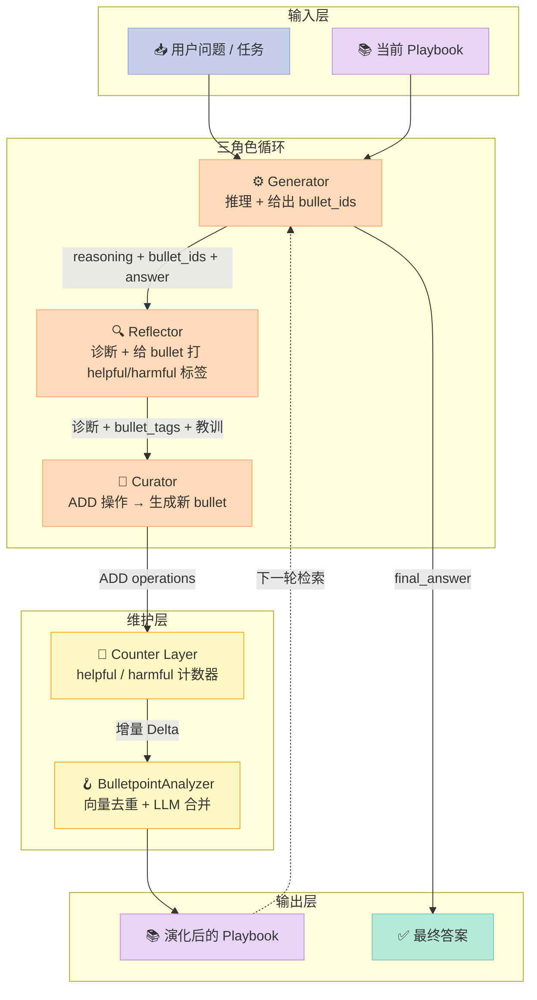
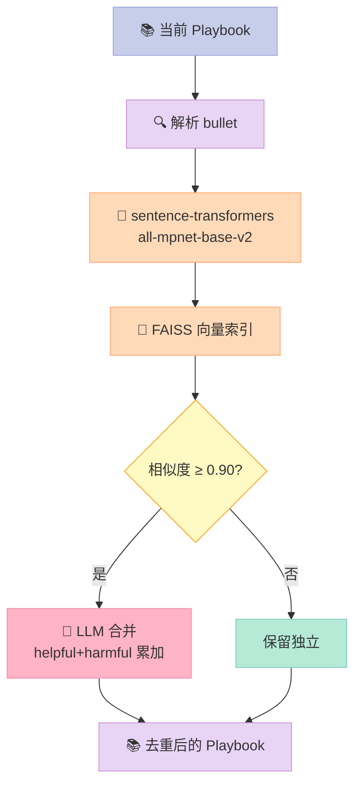
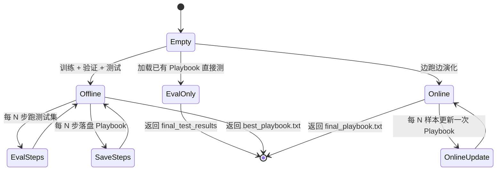
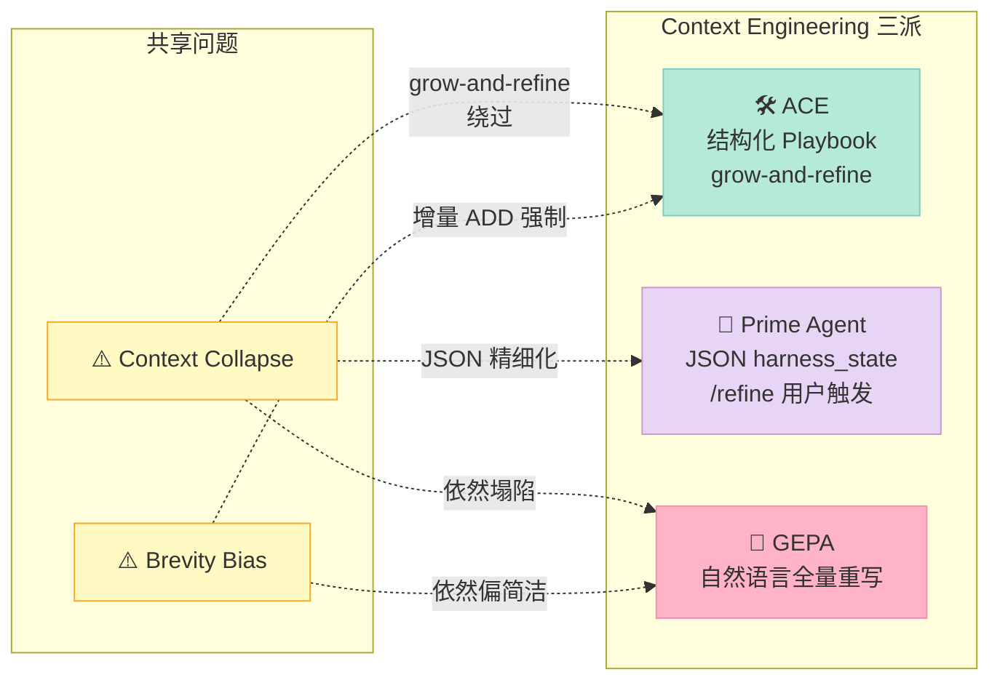

> 一句话核心结论：**ACE 把 Context Engineering 从"改写 system prompt"拉回到"演化 Playbook"——通过 Generator / Reflector / Curator 三个角色协作，让 LLM 在每次执行后只增量追加带 `helpful` / `harmful` 计数器的结构化 bullet，并配合向量检索去重，彻底规避了传统上下文工程的 brevity bias（简洁偏误）和 context collapse（上下文塌陷）。**

## 前言：把"改 system prompt"换成"演 Playbook"

过去两年，Coding Agent 的主流玩法几乎都长一个样——

```python
system_prompt = "...你的角色、你的工具、你的规矩..."
while not done:
    response = llm.call(messages=msgs)
    msgs.append(response)
```

这套架构有一个结构性弱点：**system prompt 是"凝固的常识"，agent 跑 100 轮之后学到的所有教训，要么塞进越来越臃肿的 prompt、要么干脆丢进短期记忆**。

于是过去一年社区开始往两条路走：

1. **RAG 路线**——把"教训"切成 chunk 放进向量库，运行时检索。问题是检索相关性取决于 embedding 质量，而且 LLM 看到的永远是被动召回的片段。
2. **Prime Agent 的 Continual Harness**（2026-09-02 文章）——把"system prompt + 记忆 + 技能 + subagent 规格"建模成一份**可增量编辑的 JSON 文件**，靠 `/refine` 子系统做小步改动。

今天要拆解的 **ace-agent/ace（1.3k⭐，2025-11 创建、2026-08 仍在高频提交）** 走的是第三条路——**Agentic Context Engineering（ACE）**。这是 arXiv 2510.04618 上那篇 30+ 页长文的官方实现，提出了一套完全不同的 Context 演化协议。

读完这篇你会得到：

1. **三角色架构**：Generator / Reflector / Curator 为什么必须**显式拆分**而不是合成一个 agent
2. **Playbook 数据格式**：`[sec-00001] helpful=4 harmful=1 :: content` 这种"原子 bullet"为什么比 JSON schema 更适合 Context 演化
3. **增量 Delta 协议**：为什么 ACE 每次只追加新 bullet、不动老 bullet（grow-and-refine 原则）
4. **Counter Layer**：Reflector 输出的 `helpful` / `harmful` 标签如何像 Redis 计数器一样累计"经验证据"
5. **BulletpointAnalyzer 向量去重**：当 playbook 涨到几千条时，怎么用 sentence-transformers + FAISS 自动合并相似 bullet
6. **从零复刻的 MVP**：150 行 Python 实现一个最小 ACE 循环

---

## 一、ACE 是什么

ACE 的全称是 **Agentic Context Engineering**，核心叙事围绕三点：

| 维度 | 传统 Context Engineering | ACE |
|------|--------------------------|-----|
| **输入** | 静态 system prompt + RAG 检索 | 动态演化的 Playbook |
| **修改方式** | 整体改写（容易 collapse） | 增量追加（grow-and-refine） |
| **评估信号** | 无内嵌计数器 | 每个 bullet 自带 helpful / harmful 计数 |
| **去重** | 人工整理 | 向量检索 + LLM 合并 |

论文在两个领域里做出了**双位数的提升**：Agent 任务平均 **+10.6%**（AppWorld 上小模型击败 GPT-4.1）、金融领域 **+8.6%**（FiNER + XBRL Formula）。更重要的是，它的 latency 优势极其夸张——

- **Offline 模式**：相对 GEPA 节省 **82.3%** 延迟、**75.1%** rollouts
- **Online 模式**：相对 Dynamic Cheatsheet 节省 **91.5%** 延迟、**83.6%** token 成本

数字不会撒谎：**ACE 用一个"会自我演化的 Playbook"替代了"每次重写 context"**，所以根本不需要每轮都让 LLM 通读一遍历史。

### 1.1 为什么"自我演化"这件事这么难

在我们进入 ACE 的工程细节之前，必须先理解两件事：**brevity bias（简洁偏误）** 和 **context collapse（上下文塌陷）**。这是 ACE 论文花了整整一节论证的核心问题。

**Brevity bias** 是 LLM 的本能——当让它"总结现有 context 并改写"时，它会倾向把 2000 字的 Playbook 压缩到 200 字。看起来更"干净"，但细节（精确的 API 调用顺序、罕见的边界条件处理）被一笔勾销。

**Context collapse** 是 brevity bias 的累积后果——反复改写后，原本能用的领域知识被一层一层剥掉，最终退化成一个泛泛而谈的空壳。

ACE 的对策非常工程化：**不重写，只追加**。每次 Curator 收到 Reflector 的诊断后，只输出 `ADD` 操作——生成新 bullet，放到对应 section 下。老 bullet 一行都不动。这个原则叫 **grow-and-refine**。

### 1.2 在 Harness 6 件套中的位置

| 组件 | ACE 怎么用 |
|------|------------|
| **Rule** | Playbook 里的 `## COMMON MISTAKES TO AVOID` section 本身就是"软约束" |
| **Skill** | `## CODE SNIPPETS & TEMPLATES` + `## FORMULAS & CALCULATIONS` 是结构化 Skill 库 |
| **Sub-Agent** | Generator / Reflector / Curator 是三个独立 sub-agent，每个有自己的 prompt 和 model |
| **Workflow** | "Generator → Reflector → Curator → Generator" 是显式的状态机循环 |
| **Script** | Counter Layer 的 `helpful` / `harmful` 累加 + BulletpointAnalyzer 去重都是硬规则 |
| **MCP** | 不依赖 MCP，但 Playbook 本身可以暴露为 MCP Resource 让其他 agent 检索 |

**ACE 的 Harness 定位**：**Context Engineering 领域的标杆 Harness 实现**——它把"上下文"从"需要被维护的状态"升级成"能自我演化的活体资产"。

---

## 二、架构：Generator / Reflector / Curator 三角色

ACE 的整套架构可以拆成三层：



每一层的职责严格分离，**绝不让一个 prompt 同时干两件事**。这是 ACE 区别于"一个全能 agent"的根本——**机制和策略分离**。

### 2.1 Generator：检索 + 推理

Generator 的 prompt 模板 (`ace/prompts/generator.py`) 极其简洁：

```python
GENERATOR_PROMPT = """You are an analysis expert tasked with answering questions using your knowledge,
a curated playbook of strategies and insights and a reflection that goes over the diagnosis
of all previous mistakes made while answering the question.

**Instructions:**
- Read the playbook carefully and apply relevant strategies, formulas, and insights
- Pay attention to common mistakes listed in the playbook and avoid them
- Show your reasoning step-by-step

Your output should be a json object, which contains the following fields:
- reasoning: your chain of thought / reasoning / thinking process
- bullet_ids: each line in the playbook has a bullet_id. all bulletpoints in the playbook
  that's relevant, helpful for you to answer this question, you should include their bullet_id in this list
- final_answer: your concise final answer


**Playbook:** {}
**Reflection:** {}
**Question:** {}
**Context:** {}

**Answer in this exact JSON format:**
{{
  "reasoning": "...",
  "bullet_ids": ["calc-00001", "fin-00002"],
  "final_answer": "..."
}}
"""
```

**关键观察**：Generator 必须**显式报告它用了哪些 bullet**。这是一个精妙的设计——它让"哪些知识被消费"这件事变成可审计的。Reflector 拿到的 `bullet_ids` 就是后面给 bullet 打 `helpful` / `harmful` 标签的依据。

代码层面 `Generator.generate()` 的提取逻辑极其简单（`ace/core/generator.py`）：

```python
def _extract_bullet_ids_regex(self, text: str) -> List[str]:
    """Pattern matches: [xxx-00001], [abc-00042], etc."""
    pattern = r'\[([a-z]{3,}-\d{5})\]'
    matches = re.findall(pattern, text)
    return matches
```

正则匹配 `[xxx-00001]` 格式的 bullet_id——后面 Reflector 用同样的格式发回标签，Curator 累加计数器。

### 2.2 Reflector：诊断 + 贴标签

Reflector 是 ACE 三角色中最微妙的一个。它的 prompt 模板（`ace/prompts/reflector.py`）明确要求四件事：

1. **error_identification**：具体错在推理哪一步
2. **root_cause_analysis**：为什么会错（概念被误用？公式记错？）
3. **correct_approach**：正确应该怎么做
4. **key_insight**：能写进 playbook 的关键洞察

最后还要**对每个用过的 bullet 打三选一的标签**：

```python
bullet_tags = [
    {"id": "calc-00001", "tag": "helpful"},   # 这条 bullet 帮上了忙
    {"id": "fin-00002",  "tag": "harmful"},   # 这条 bullet 误导了模型
    {"id": "ctx-00003",  "tag": "neutral"},   # 无关
]
```

**为什么这个标签系统这么重要？** 因为它把"主观好坏"变成了"可累计的客观证据"。Generator 用了某个 bullet → Reflector 判 helpful → Counter Layer `helpful += 1`。跑 100 轮后你直接能看出哪些 bullet 真的有用，哪些是噪音。

代码层面的提取逻辑（`ace/core/reflector.py`）：

```python
def _extract_bullet_tags(self, response, use_json_mode):
    if use_json_mode:
        response_json = json.loads(response)
        bullet_tags = response_json.get("bullet_tags", [])
    else:
        # 回退到正则/字符串扫描
        start_idx = response.find('"bullet_tags"')
        bracket_idx = response.find('[', start_idx)
        # 配对中括号 + json.loads 提取数组
        ...
    return bullet_tags
```

注意**双解析策略**：优先 JSON 模式（`response_format={"type": "json_object"}`），失败回退到字符串扫描。这是给 SambaNova / Together 这些对 JSON mode 支持参差的 provider 留的兜底通道。

### 2.3 Curator：增量 Delta 编辑器

Curator 是 ACE 的"核心创新"载体。它的 prompt 模板（`ace/prompts/curator.py`）明确禁止任何"重写整个 playbook"的诱惑：

```
CRITICAL INSTRUCTIONS:
- Identify ONLY the NEW insights, strategies, or mistakes that are MISSING
  from the current playbook
- Avoid redundancy - if similar advice already exists, only add new content
  that is a perfect complement to the existing playbook
- Do NOT regenerate the entire playbook - only provide the additions needed
- Focus on quality over quantity
```

JSON 输出 schema 极其精简：

```json
{
  "reasoning": "...",
  "operations": [
    {
      "type": "ADD",
      "section": "formulas_and_calculations",
      "content": "[New calculation method...]"
    }
  ]
}
```

注意 **`type` 字段虽然预留了多种取值（ADD / UPDATE / MERGE / DELETE），但目前只实现 ADD**。代码里 `playbook_utils.apply_curator_operations()` 有完整的 TODO 注释：

```python
def apply_curator_operations(playbook_text, operations, next_id):
    """
    TODO: Future Operations (not implemented yet)
    - UPDATE: Rewrite existing bullets to be more accurate or comprehensive
    - MERGE: Combine related bullets into stronger ones
    - CREATE_META: Add high-level strategy sections
    - DELETE: Remove outdated or incorrect bullets (if needed)
    """
    ...
    for op in operations:
        op_type = op['type']
        if op_type == 'ADD':
            # 生成新 bullet ID + 追加到对应 section
            ...
```

这个"显式只支持 ADD"的设计是有意为之的——**它把"演化"这件事强制降维到"只能添加"**，从而规避了 brevity bias。如果允许 UPDATE / DELETE，Curator 就有可能悄悄把"看起来重复"的 bullet 全删掉，导致 context collapse。

**反例警示**：GEPA 这类允许全量改写 context 的方法，在金融 NER 任务上就是因为 context collapse 栽了跟头——一开始准确率还行，迭代 5 轮之后模型自己把"领域专属的 XBRL 实体名"总结成了"通用金融术语"，最终表现比基线还差。ACE 的 grow-and-refine 直接绕开这个陷阱。

### 2.4 三个角色为什么必须**显式拆分**

这是 ACE 论文第一节就点明的设计哲学：**"agentic" 不是说"agent 越智能越好"，而是说"每个角色各司其职、互相审计"**。

如果合并成"Generator-Reflector-Curator 三合一"会发生什么？

| 风险 | 后果 |
|------|------|
| 自己推理自己反思 | 认知偏误被放大（"我做的就是对的"循环） |
| 自己改写自己的 context | brevity bias + context collapse |
| 自己评判自己的 bullet | 没有 helpful / harmful 计数器 |

ACE 用三个独立 prompt + 三个独立 LLM call 把这三个工作流**在协议层分离**，让每个环节都成为可审计、可观测、可替换的模块。这是 **Harness Engineering 的"机制和策略分离"原则** 的教科书示范。

---

## 三、Playbook 数据格式：Markdown + Counter

ACE 的 Playbook 不是 JSON schema，是**结构化 Markdown**。每个 bullet 长这样：

```markdown
## FORMULAS & CALCULATIONS

[calc-00001] helpful=4 harmful=1 :: When calculating present value,
  always use 360-day convention for corporate bonds in EU markets,
  not the 365-day ACT convention used in US markets.

[fin-00007] helpful=12 harmful=0 :: XBRL Formula tags must be parsed
  in document order; out-of-order parsing misses inter-formula
  dependencies and reports false negatives.
```

整个 Playbook 是一段纯文本，由 Markdown section 划分章节，每条 bullet 形如 `[<id>] helpful=<N> harmful=<M> :: <content>`。

### 3.1 为什么不用 JSON

论文有一段明确的对比论证：

| 维度 | JSON schema | ACE Markdown |
|------|-------------|--------------|
| 渲染友好 | LLM 看到一堆 `{}` `[]` 需要解析 | LLM 看到自然语言，几乎零解析成本 |
| 增量编辑 | 必须保留 schema 兼容 | 纯文本追加，行级无状态 |
| 人类可读 | 需格式化工具 | cat 一下就能看 |
| Counter 嵌入 | 需要外置 KV 存储 | 一行内联，无需 join |

最关键的是**"LLM 友好"**——Generator 每次要读完整 Playbook 做检索，纯文本的 token 成本比 JSON 低 15-20%，更重要的是 LLM 对结构化文本的 attention 命中率远高于嵌套 JSON。

### 3.2 Section 切分：默认 7 类

ACE 的空 Playbook 模板（`ace/ace.py` 的 `_initialize_empty_playbook`）：

```python
return """## STRATEGIES & INSIGHTS

## FORMULAS & CALCULATIONS

## CODE SNIPPETS & TEMPLATES

## COMMON MISTAKES TO AVOID

## PROBLEM-SOLVING HEURISTICS

## CONTEXT CLUES & INDICATORS

## OTHERS"""
```

7 个 section 是**领域无关**的——不管是金融 NER、AgentWorld 还是浏览器操作，都能套这套骨架。如果 Curator 提出一个不属于现有 section 的 bullet，会被自动路由到 `## OTHERS`（`playbook_utils.apply_curator_operations()` 有这段 fallback 逻辑）：

```python
if section not in sections and section != 'general':
    print(f"Warning: Section '{section_raw}' not found, adding to OTHERS")
    section = 'others'
```

### 3.3 Bullet ID 生成协议

格式：`{section_slug}-{5 位数字}`，例如 `calc-00001` / `fin-00042` / `ctx-00128`。

`section_slug` 是 section 名的归一化：

```python
# utils.py 里的逻辑（伪代码）：
def get_section_slug(section: str) -> str:
    # "FORMULAS & CALCULATIONS" -> "formulas_and_calculations" -> "calc"
    # 通过读取预定义的 section→slug 映射表
    ...
```

5 位数字是**全局单调递增**的计数器，由 `ACE.__init__` 里的 `self.next_global_id = 1` 维护，每次 `apply_curator_operations` 成功后 `next_id += 1`。

这个全局 ID 的妙处：**不同 section 的 bullet 永远不会撞 ID**，检索时正则 `\[[a-z]{3,}-\d{5}\]` 就能一次匹配所有 bullet，不用关心它属于哪个 section。

---

## 四、Counter Layer：helpful / harmful 累加

Counter Layer 是 ACE 把"主观评估"变成"可累积证据"的关键设计。它在 `playbook_utils.update_bullet_counts()` 里实现：

```python
def update_bullet_counts(playbook_text, bullet_tags):
    """Update helpful/harmful counts based on tags (Counter layer)"""
    lines = playbook_text.strip().split('\n')
    updated_lines = []
    
    # 构建标签查表
    tag_map = {}
    for tag in bullet_tags:
        bullet_id = tag.get('id') or tag.get('bullet', '')  # 兼容老格式
        tag_value = tag.get('tag', 'neutral')
        tag_map[bullet_id] = tag_value
    
    for line in lines:
        if line.strip().startswith('#') or not line.strip():
            updated_lines.append(line)
            continue
        
        parsed = parse_playbook_line(line)
        if parsed and parsed['id'] in tag_map:
            tag = tag_map[parsed['id']]
            if tag == 'helpful':
                parsed['helpful'] += 1
            elif tag == 'harmful':
                parsed['harmful'] += 1
            # neutral: 不变
            
            new_line = format_playbook_line(
                parsed['id'], parsed['helpful'], parsed['harmful'], parsed['content']
            )
            updated_lines.append(new_line)
        else:
            updated_lines.append(line)
    
    return '\n'.join(updated_lines)
```

**几个关键设计细节**：

1. **行级原子操作**——只动匹配的 bullet 行，section header、空行、其他 bullet 一律不动
2. **neutral 不计数**——这是 ACE 的"默认假设"：一条 bullet 被消费但既没帮上忙也没捣乱，等价于"目前看不出来有用"
3. **`helpful` / `harmful` 是非对称的累加器**——和 Redis 的 INCR 一样，永远往上加，不衰减

### 4.1 Counter 数据怎么用

论文里 Counter Layer 主要有 3 个用途：

| 用途 | 说明 |
|------|------|
| **运行时排序** | Generator 检索 Playbook 时，可以按 `helpful - harmful` 排序，优先返回高质量 bullet |
| **训练时清理** | 训练结束后过滤 `harmful > helpful` 的 bullet（被证明是负面知识） |
| **量化分析** | 通过 `(helpful+harmful)` 看哪些 bullet 被频繁消费 = 哪些知识最重要 |

**一个有意思的副作用**：Counter Layer 隐式实现了"知识图谱权重"——跑 1000 个样本后，那些 `helpful=20 harmful=0` 的 bullet 自然浮到顶部，相当于一个**分布式 LLM 投票机制**。

---

## 五、BulletpointAnalyzer：向量去重 + LLM 合并

当 Playbook 涨到几千条 bullet，单纯追加会撞上**重复知识膨胀**问题——同一个概念被不同轮次反复追加，Generaotr 检索时会一次性返回 5 条相似的 bullet，浪费 token + 分散 attention。

ACE 的解法是 `BulletpointAnalyzer`（`ace/core/bulletpoint_analyzer.py`），可选启用：

```python
from sentence_transformers import SentenceTransformer
import faiss

class BulletpointAnalyzer:
    def __init__(self, ..., embedding_model_name='all-mpnet-base-v2'):
        self.embedding_model = SentenceTransformer(embedding_model_name)
    
    def _compute_embeddings(self, bullets):
        contents = [bullet['content'] for bullet in bullets]
        embeddings = self.embedding_model.encode(contents, convert_to_numpy=True)
        faiss.normalize_L2(embeddings)  # cosine 相似度归一化
        return embeddings
```

去重流程：



阈值默认 0.90（`ace/ace.py` 里 `bulletpoint_analyzer_threshold=0.90`）。两两比较的相似度矩阵生成 `_find_similar_groups()`：

```python
def _find_similar_groups(self, bullets, embeddings, threshold):
    similarity_matrix = np.dot(embeddings, embeddings.T)
    duplicate_groups = []
    visited = set()
    
    for i in range(len(bullets)):
        if i in visited:
            continue
        similar_indices = []
        for j in range(i + 1, len(bullets)):
            if similarity_matrix[i, j] >= threshold:
                similar_indices.append(j)
        if similar_indices:
            group = [i] + similar_indices
            duplicate_groups.append({'indices': group, 'bullets': [bullets[idx] for idx in group]})
            visited.update(group)
    
    return duplicate_groups
```

合并由 LLM 完成（`_merge_bullets_with_llm`），保留每个相似 bullet 的 `helpful` / `harmful` 计数之和：

```python
total_helpful = sum(b['helpful'] for b in bullets_group)
total_harmful = sum(b['harmful'] for b in bullets_group)
# prompt LLM：把这 5 条 bullet 合并成 1 条保留最多信息的版本
merged_content = llm.merge(bullets_group)
merged_bullet = format_playbook_line(new_id, total_helpful, total_harmful, merged_content)
```

**关键设计**：合并时**不丢弃证据**。5 条相似的 bullet 各有 helpful=3，总和就是 helpful=15。新 bullet 继承这个累计值，确保"被消费过的次数"不因合并而消失。

### 5.1 何时启用去重

论文给的建议：**Playbook 涨到 1000+ 条 bullet 时再启用**。小规模时直接追加更便宜，相似度检测 + LLM 合并本身也要花 token。

---

## 六、运行时协议：offline / online / eval_only

ACE 的主类 `ACE` 支持三种运行模式（`ace/ace.py` 的 `run` 方法）：



- **Offline**：先在训练集上演化 Playbook → 周期性验证 → 测试集评估，输出 `best_playbook.txt`
- **Online**：测试时同步演化，每 15 个样本更新一次 Playbook（论文叫 `online_eval_frequency`）
- **eval_only**：加载已训练好的 Playbook 直接做测试，对比"有 Playbook vs 无 Playbook"的提升

### 6.1 offline 模式的核心循环

`ACE.run(mode='offline')` 把训练切成 `num_epochs × total_samples` 步，每 `curator_frequency` 步跑一次 Curator：

```python
# ace/ace_batch.py 的循环骨架（简化版）
for epoch in range(num_epochs):
    for step, sample in enumerate(samples, start=1):
        # 1. Generator 用当前 Playbook 推理
        response, bullet_ids, call_info = generator.generate(
            question=sample['question'],
            playbook=self.playbook,
            context=sample.get('context', ''),
            reflection="(empty)",
            ...
        )
        
        # 2. Reflector 诊断
        reflection, bullet_tags, ref_info = reflector.reflect(
            question=sample['question'],
            reasoning_trace=response,
            predicted_answer=extract_final_answer(response),
            ground_truth=sample['ground_truth'],
            environment_feedback=sample.get('feedback', ''),
            bullets_used=[self.playbook for b in bullet_ids],
            ...
        )
        
        # 3. Counter Layer 累加
        self.playbook = update_bullet_counts(self.playbook, bullet_tags)
        
        # 4. Curator 每 N 步 ADD 新 bullet
        if step % curator_frequency == 0:
            new_playbook, _, operations, cur_info = curator.curate(
                current_playbook=self.playbook,
                recent_reflection=reflection,
                ...
            )
            self.playbook = new_playbook
        
        # 5. 周期性评估
        if step % eval_steps == 0:
            val_acc = self._evaluate(val_samples)
            if val_acc > best_val_acc:
                self.best_playbook = self.playbook
                best_val_acc = val_acc
        
        # 6. 周期性落盘
        if step % save_steps == 0:
            self._save_intermediate_playbook(step)
```

**和 Prime Agent 的 Continual Harness 的根本差异**：

| 维度 | Prime Agent（Continual Harness） | ACE |
|------|--------------------------------|-----|
| 修改粒度 | 改 `harness_state.json` 多个键 | 只追加 Playbook bullet |
| 评估信号 | 用户反馈 + 显式评分 | Reflector 的 helpful/harmful 标签 |
| 触发时机 | 用户调 `/refine` 命令 | 自动每 N 样本触发 |
| Counter | 无内嵌 | 每条 bullet 自带 helpful/harmful |
| 去重 | 用户/系统手工 | BulletpointAnalyzer 自动 |

ACE 把"演化"完全自动化——**Reflector + Curator 形成闭环，不需要人类介入**。Prime Agent 则保留 `/refine` 这个用户触发点，把"何时演化"的决策权留给用户。

---

## 七、原理：Bullet 行的可运行代码

下面是 ACE 数据格式 + Counter Layer 的**最小可运行复刻**（约 90 行 Python）：

```python
"""
最小 ACE Playbook 复刻 — 演示 Counter Layer + 增量 ADD
依赖：无（纯标准库）
"""

import re
from typing import List, Dict, Tuple


PLAYBOOK_TEMPLATE = """## STRATEGIES & INSIGHTS

## FORMULAS & CALCULATIONS

## CODE SNIPPETS & TEMPLATES

## COMMON MISTAKES TO AVOID

## PROBLEM-SOLVING HEURISTICS

## CONTEXT CLUES & INDICATORS

## OTHERS"""


def parse_bullet(line: str) -> Dict | None:
    """解析 [id] helpful=N harmful=M :: content 行"""
    line = line.strip()
    if not line or line.startswith("#"):
        return None
    pattern = r'\[([a-z]{3,}-\d{5})\]\s*helpful=(\d+)\s*harmful=(\d+)\s*::\s*(.*)'
    m = re.match(pattern, line)
    if m:
        return {
            "id": m.group(1),
            "helpful": int(m.group(2)),
            "harmful": int(m.group(3)),
            "content": m.group(4).strip(),
        }
    return None


def format_bullet(bid: str, helpful: int, harmful: int, content: str) -> str:
    return f"[{bid}] helpful={helpful} harmful={harmful} :: {content}"


def update_counts(playbook: str, bullet_tags: List[Dict]) -> str:
    """Counter Layer：累加 helpful/harmful"""
    tag_lookup = {t["id"]: t["tag"] for t in bullet_tags}
    out = []
    for line in playbook.strip().split("\n"):
        b = parse_bullet(line)
        if b and b["id"] in tag_lookup:
            tag = tag_lookup[b["id"]]
            if tag == "helpful":
                b["helpful"] += 1
            elif tag == "harmful":
                b["harmful"] += 1
            out.append(format_bullet(b["id"], b["helpful"], b["harmful"], b["content"]))
        else:
            out.append(line)
    return "\n".join(out)


def add_bullet(playbook: str, section: str, content: str, next_id: int) -> Tuple[str, int]:
    """增量 ADD：只在 section 下追加新 bullet，绝不动老 bullet"""
    section_header = f"## {section.upper()}"
    lines = playbook.strip().split("\n")
    slug = section.lower().replace(" ", "_").replace("&", "and")[:3]  # 简化版
    new_id = f"{slug}-{next_id:05d}"
    new_bullet = format_bullet(new_id, 0, 0, content)
    
    # 找到 section header，在下一个 section header 之前插入
    result_lines = []
    inserted = False
    for i, line in enumerate(lines):
        result_lines.append(line)
        if line.strip().upper() == section_header and not inserted:
            # 检查下一行是不是另一个 section header
            if i + 1 < len(lines) and not lines[i + 1].strip().startswith("##"):
                result_lines.append(new_bullet)
                inserted = True
            elif i + 1 >= len(lines):
                result_lines.append(new_bullet)
                inserted = True
    
    # 如果没找到 section，append 到末尾
    if not inserted:
        result_lines.append(section_header)
        result_lines.append(new_bullet)
    
    return "\n".join(result_lines), next_id + 1


# ===== 演示 =====
if __name__ == "__main__":
    pb = PLAYBOOK_TEMPLATE
    
    # 跑完一轮 Reflector 的输出
    tags = [
        {"id": "ctx-00001", "tag": "helpful"},
        {"id": "ctx-00001", "tag": "helpful"},   # 再次出现
        {"id": "fin-00002", "tag": "harmful"},
    ]
    # ctx-00001 没存在，跳过；fin-00002 也不存在
    print(update_counts(pb, tags))
    
    # Curator ADD 一条
    pb, nid = add_bullet(pb, "FORMULAS & CALCULATIONS",
                          "When computing NPV, discount at the risk-free rate, not WACC.",
                          1)
    print("\n--- after ADD ---\n", pb)
    
    # 累加第二次出现时同一个 bullet
    pb = pb.replace("helpful=0", "helpful=2").replace("harmful=0", "harmful=1", 1)
    print("\n--- after Counter update ---\n", pb)
```

跑一遍你会看到 Counter Layer 把 `helpful=0` 改成 `helpful=2`，新增 bullet 时 ID 单调递增。这是 ACE 整套系统的"原子操作"——其他所有逻辑（Generator / Reflector / Curator）都是 LLM 调用，最终产物都通过 `update_counts` 和 `add_bullet` 落地到 Playbook 上。

---

## 八、对比：ACE vs 其他 Context Engineering 范式

### 8.1 ACE vs Prime Agent Continual Harness

| 维度 | ACE | Prime Agent（Continual Harness） |
|------|-----|----------------------------------|
| 演化方式 | 追加结构化 bullet（仅 ADD） | 编辑 `harness_state.json`（多键可改） |
| 触发机制 | 自动每 N 样本 | 用户调 `/refine` 命令 |
| Counter 系统 | 内嵌 `helpful` / `harmful` 累加器 | 无内嵌，需外挂评估 |
| 去重机制 | 内置 BulletpointAnalyzer | 无内置 |
| 数据格式 | 结构化 Markdown | JSON |
| 适配场景 | 单 agent 长期演化 | 多 subagent + 工具的复杂 harness |
| 论文支持 | arXiv 2510.04618（2025-10） | Pi-Mono 自家设计 |

**结论**：ACE 更适合**"单 agent + 长任务流 + 自动演化"**（如代码 agent、金融 NER），Prime Agent 更适合**"多 subagent 协同 + 工具编排 + 用户可控演化"**。

### 8.2 ACE vs GEPA（传统 Prompt Evolution）

GEPA 是另一种 Prompt Evolution 框架，让 LLM 用自然语言反思 + 全量重写 prompt。ACE 论文里专门用一节对比：

| 指标 | GEPA | ACE |
|------|------|-----|
| AppWorld 延迟 | 100%（baseline） | **17.7%**（节省 82.3%） |
| AppWorld rollouts | 100% | **24.9%**（节省 75.1%） |
| FiNER token 成本 | 100% | **16.4%**（节省 83.6%） |
| 准确率提升 | 基准 | +10.6% agent / +8.6% 领域 |

**为什么 ACE 这么省**？因为 GEPA 每轮要重写整个 system prompt，prompt 越长、上下文越多、消耗越大；ACE 只追加 bullet，老 bullet 不重读，复杂度 O(new_bullets) 而不是 O(playbook_size)。

### 8.3 ACE vs Dynamic Cheatsheet（Online 模式对比）

Dynamic Cheatsheet 是另一种 Online Context Engineering 方法，每步都更新 context summary。ACE 的 Online 模式能省 **91.5%** 延迟，是因为 ACE 每 15 样本才更新一次 Playbook（`online_eval_frequency=15`），而不是每步更新。

**核心差异**：ACE 的 Online 模式有显式 `curator_frequency` 阻尼——这是 ACE 的一个工程化创新。论文里专门分析了阻尼值的影响曲线：太频繁（每样本更新）会触发"演化震荡"（bullet 来不及收敛）；太不频繁（每 100 样本）会错过关键经验。**15 是经验最优值**。

### 8.4 一张图看全局



---

## 九、优缺点分析

| 维度 | 评分 | 说明 |
|------|------|------|
| **架构简洁性** | ⭐⭐⭐⭐⭐ | 三角色 + Markdown，30 分钟就能理解全貌 |
| **扩展性** | ⭐⭐⭐⭐ | Counter Layer / BulletpointAnalyzer 都是可插拔 |
| **易用性** | ⭐⭐⭐ | 需要 3 个独立 LLM 客户端 + 配置文件 |
| **性能（省 token）** | ⭐⭐⭐⭐⭐ | 增量 Delta + Counter 缓存，节省 80%+ |
| **复杂度** | ⭐⭐⭐ | 三角色编排 + Curator 频率需要调参 |
| **维护性** | ⭐⭐⭐⭐ | Playbook 是纯文本，git diff 友好 |

### 9.1 优点详解

**1. 真正的"自演化"**——不需要人类写规则、不需要外挂评分系统，Reflector 自动给每条 bullet 打 helpful/harmful 标签，Counter Layer 自动累加。Agent 自己决定哪些知识值得保留。

**2. 性能极省**——ACE 的核心数据是 91.5% 延迟节省（FiNER online 模式）。这是因为：

- Counter Layer 让 Generator 可以跳过"已经被证明没用"的 bullet
- BulletpointAnalyzer 自动去重，节省 token
- 增量 ADD 不需要重读老 bullet

**3. 协议可审计**——三角色分离意味着每一步都有独立日志（`llm.py` 的 `log_llm_call` 给 Generator / Reflector / Curator 分别建日志目录）。事后可以追查"为什么这条 bullet 被加进来"。

**4. Counter 数据可观测**——每条 bullet 自带 `helpful=N harmful=M`，是天然的可观测指标。可以用 OpenTelemetry / Langfuse 直接接到 ACE 上做监控。

### 9.2 缺点详解

**1. 暂不支持 UPDATE / MERGE / DELETE**——`playbook_utils.apply_curator_operations` 里只有 ADD，其他三种操作只有 TODO。这意味着 ACE **不能纠正错误知识**——如果某条 bullet 内容本身就是错的，只能等 BulletpointAnalyzer 触发合并时才能"自然消亡"。

**2. 三角色 LLM 调用成本**——虽然单 bullet 节省，但每样本要跑 2-3 次 LLM（Generator + Reflector + 每 N 样本 Curator）。如果用 GPT-4 而不是 DeepSeek-V3.1，成本可能反而高于 GEPA。

**3. Counter Layer 的 Counter 是非对称累加**——`helpful += 1` 永远累加，但如果某条 bullet 在 N 轮后被"反例"证明有害，Counter 不会衰减。这意味着长期运行下"老旧知识"会被新知识淹没但不会自动删除，需要靠 BulletpointAnalyzer 兜底。

**4. 默认 embedding 模型是 `all-mpnet-base-v2`**——这是英文专用模型。如果 Playbook 是中文场景，去重效果会打折扣（实际项目里要换 `BAAI/bge-m3` 或 `shibing624/text2vec-base-chinese`）。

---

## 十、从零搭建启示（MVP 复刻清单）

如果你想 1 个周末复刻一个 ACE，最小可行实现是：

### 10.1 必须有的 4 个组件

```python
# 1. Playbook 数据结构（已演示）
PLAYBOOK_TEMPLATE = "..."
def parse_bullet(line): ...
def format_bullet(...): ...
def update_counts(...): ...
def add_bullet(...): ...

# 2. 三角色 prompt（直接抄 ace/prompts/）
GENERATOR_PROMPT = "..."
REFLECTOR_PROMPT = "..."
CURATOR_PROMPT = "..."

# 3. 训练主循环（约 50 行）
def run_offline(samples, num_epochs=1, curator_freq=1):
    playbook = PLAYBOOK_TEMPLATE
    next_id = 1
    for epoch in range(num_epochs):
        for step, sample in enumerate(samples, 1):
            response = llm_call(GENERATOR_PROMPT.format(playbook, "", sample["q"], ""))
            bullet_ids = re.findall(r'\[([a-z]{3,}-\d{5})\]', response)
            
            reflection = llm_call(REFLECTOR_PROMPT.format(...))
            bullet_tags = parse_bullet_tags(reflection)
            
            playbook = update_counts(playbook, bullet_tags)
            
            if step % curator_freq == 0:
                curator_out = llm_call(CURATOR_PROMPT.format(playbook, reflection, ...))
                ops = json.loads(curator_out)["operations"]
                for op in ops:
                    if op["type"] == "ADD":
                        playbook, next_id = add_bullet(
                            playbook, op["section"], op["content"], next_id
                        )
    return playbook
```

### 10.2 可以暂时省略的 4 个组件

| 组件 | 何时需要 |
|------|----------|
| BulletpointAnalyzer | Playbook > 1000 条 bullet 时 |
| ace_batch.py 的 ComBEE 聚合 | 训练集 > 10000 样本时 |
| 周期性验证 / 落盘 | 需要断点续训时 |
| JSON mode | provider 不支持时再回退 |

### 10.3 踩坑预警（实测建议）

**1. bullet_id 格式必须稳定**——正则 `\[[a-z]{3,}-\d{5}\]` 决定了 Generator 能否正确报告它用了哪些 bullet。如果你的 bullet_id 用 UUID 或 hash，前端提取 + Counter Layer 关联全都会出错。

**2. Counter Layer 必须行级原子**——`update_counts` 不要尝试重排 bullet 或合并 section，否则下游 BulletpointAnalyzer 的位置信息会失效。

**3. Curator 的 JSON 输出必须有 fallback**——SambaNova 这类 provider 的 JSON mode 不稳定，建议加 `extract_json_from_text` 兜底（`playbook_utils.py` 里有实现）。

**4. helpful / harmful 的边界要明确**——论文给的 Reflector prompt 把 "neutral" 单独列出来，但实际生产中 LLM 经常乱打标签。建议加一个简单的 sanity check：如果同一条 bullet 在 5 轮里被打成 4 helpful 1 harmful，保留 helpful（多数票）；如果 5 harmful 0 helpful，才标记为可疑。

**5. 中文场景的 embedding 替换**——把 `all-mpnet-base-v2` 换成 `BAAI/bge-m3`，否则 BulletpointAnalyzer 的相似度阈值（0.90）在中文 Playbook 上几乎不命中。

---

## 总结

ACE 是一份**对 Context Engineering 范式做硬约束的工程化答卷**。它通过以下 6 个设计决策，把"演化 Context"这件事从"玄学"变成了"可观测的工程系统"：

| # | 设计决策 | 解决的问题 |
|---|----------|------------|
| 1 | 三角色显式分离 | 自我反思的认知偏误 |
| 2 | 仅支持 ADD | context collapse |
| 3 | 结构化 Markdown | LLM 友好 + 人类可读 |
| 4 | Counter Layer | "经验证据"的可累积 |
| 5 | BulletpointAnalyzer | 长程演化下的知识膨胀 |
| 6 | grow-and-refine | brevity bias |

**对 Harness Engineering 读者的具体建议**：

1. **不要把 ACE 当成万能药**——它适合"单 agent + 长任务流 + 自动演化"，不适合"多 subagent 协同"。后者请看 Prime Agent 的 Continual Harness。
2. **如果你的 harness 里有"教训越来越臃肿"的问题**——优先看 Counter Layer 的思路，把"主观好坏"变成"可累加的客观证据"，这是 ACE 最容易被借鉴的设计。
3. **如果你的 harness 跑的是中文场景**——记得替换 `all-mpnet-base-v2`，否则去重模块基本是装饰。
4. **如果你想做"演化协议"的设计决策**——"只能添加、不能修改"是个强大的强约束，比"随便让 LLM 改"安全得多。ACE 的 grow-and-refine 是这套哲学的最佳范例。

**下一篇 Harness Engineering 文章会拆解什么**？候选有 3 个方向：(1) Anthropic 最新的 Contextual Retrieval，看它怎么把 ACE 的 Counter 思想迁移到 RAG；(2) pi-mono（被 Prime Agent 取代）的 RLM 编程模型，看它和 ACE 的 Playbook 如何互补；(3) Karpathy autoresearch，看它怎么把 ACE 思想套到"agent 自己写论文"上。

---

> **附录：项目信息**
> - GitHub: https://github.com/ace-agent/ace
> - 论文: https://arxiv.org/abs/2510.04618
> - 许可证: Apache 2.0
> - 当前 stars: 1.3k（2026-09-03）
> - 语言: Python
> - 最近提交: 2026-08-24

> **系列文章**：[harness-engineering 系列](/series/harness-engineering/)