## 一、引子：Context Engineering 时代的「带宽焦虑」

2026 年 AI Agent 领域最大的隐性矛盾，是**模型 context window 增长的速度，永远追不上 Agent 工具调用产生的上下文膨胀速度**。

Claude Sonnet 4.5 把窗口推到 1M tokens、GPT-5 推到 400K、Gemini 2.5 推到 2M —— 但一个跑得稍长的 Coding Agent 在长程任务里依然会撞墙：读 30 个文件 = 50K tokens，测试输出 200K tokens，10 轮 SubAgent 调用 = 100K tokens 的轨迹回灌……**模型窗口的物理上限，远没到；但 Agent 单次请求的有效带宽，早就溢出了**。

业界对此有两条主流路径：

- **路径 A：服务端 compaction**（Anthropic 自动压缩、ChatGPT Memory、Cursor 的 Compress Conversation）—— 路径不透明、用户无控制权、模型换了就没了
- **路径 B：客户端手动裁剪**（手写 `select_messages`、LangChain 的 ConversationSummaryMemory）—— 每个项目都得重新写一遍，70% 的代码在做同一件事

**第三条路径，本地透明压缩层**，2026 年才真正成熟：**Headroom**（[headroomlabs-ai/headroom](https://github.com/headroomlabs-ai/headroom)）。

```text
2026-09-02 状态速读
⭐ 68,602 stars  ｜  Python + Rust（PyO3）  ｜  Apache-2.0
75.6 MB  ｜  2,600+ 文件  ｜  17 个 Coding Agent 一行 wrap
4 类部署形态：Library / Proxy / Agent Wrap / MCP Server
4 类压缩器：SmartCrusher (Rust) / CodeCompressor / Kompress-v2-base / Image
1 套可逆架构：CCR (Compress-Cache-Retrieve)
1 个核心哲学：「prompt hot zone 永远不变，live zone 永远可重建」
```

**Headroom 的本质定位**：跑在 Coding Agent 与 LLM Provider 之间的**本地透明代理层**。它读懂每一次请求、识别哪些是「重复可压缩」、哪些是「一次性必须传」、哪些是「会破坏 KV-cache 命中」，然后用对应该内容类型的压缩器把「能省的都省下来」、把「原数据可逆地藏在本地」、把「不能省的留在原地不动」。

这就是 2026 H2 真正的 **Context Engineering 基础设施**——不是 LLM 框架，不是 Agent 编排器，而是**「输入输出的物理管道层」**。

本文将从架构、压缩引擎、CCR 可逆层、CacheAligner KV-cache 不变量、跨 Agent Memory、Proxy 与 Wrap 部署、Kompress 模型、压缩效果实测、对比维度等 9 个角度，**完整拆解 Headroom 的设计哲学与工程实现**。

---

## 二、项目定位与核心价值

### 2.1 一句话定义

> **Headroom** 是一个**跑在 Coding Agent 与 LLM Provider 之间的本地透明上下文压缩代理层**，通过 12 阶段 Canonical Pipeline + 多压缩器路由 + CCR 可逆架构，把 Agent 输入 token 砍掉 20%-95%，同时**保证 KV-cache 命中率不变、原始数据 0 丢失、同一压缩语义跨 17+ Agent 共享**。

### 2.2 能力矩阵

| 维度 | Headroom 提供 | 业界同类 |
|------|--------------|---------|
| 部署形态 | Library + Proxy + Wrap + MCP Server 四件套 | 通常只有 1-2 种 |
| 压缩策略 | 按内容类型路由（JSON/Code/Log/Search/Text/Image） | 通常单策略（LLM 摘要） |
| 可逆性 | CCR 压缩-缓存-检索，模型可主动调 `headroom_retrieve` 还原 | 几乎全不可逆 |
| KV-cache 兼容 | CacheAligner 只检测不重写，hot zone 字节级保留 | LiteLLM 等会破坏 cache |
| 跨 Agent 共享 | 同一压缩语义被 Claude/Codex/Cursor/Grok 同时复用 | 各 Agent 各自压缩 |
| 二次学习 | `headroom learn` 从失败 session 写 CLAUDE.md/AGENTS.md | 无 |
| 输出端压缩 | verbosity steering + effort routing 节省 5× input 价的 output | 通常只压输入 |
| 自研模型 | Kompress-v2-base on HuggingFace（chopratejas/kompress-v2-base） | 几乎无 |

### 2.3 仓库数据

```bash
curl -s https://api.github.com/repos/headroomlabs-ai/headroom | jq '{stars: .stargazers_count, lang: .language, license: .license.spdx_id, size: .size, pushed: .pushed_at, topics: .topics}'
```

```json
{
  "stars": 68602,
  "lang": "Python",
  "license": "Apache-2.0",
  "size": 75.6 MB,
  "pushed": "2026-09-02",
  "topics": [
    "agent", "ai", "anthropic", "claude-code",
    "compression", "context-engineering", "context-window", "cursor"
  ]
}
```

数据印证：4 个月从 0 冲到 68k ⭐（README 头部 `trendshift.io` 显示 "Repository Of The Day" #1），Apache-2.0 + Python+Rust 双栈 + 17 Agent 兼容矩阵，是 2026 H2 Context Engineering 赛道的**开山之作**。

### 2.4 与已有项目的定位差异

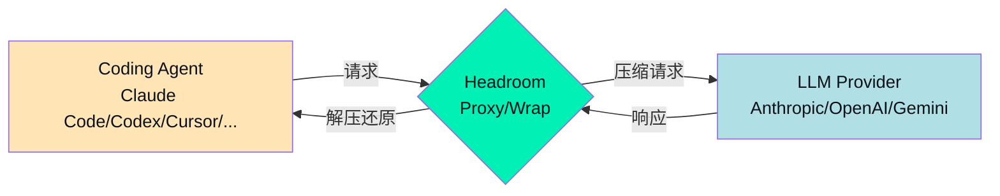

| 传统做法 | Headroom 做法 |
|---------|--------------|
| LiteLLM：Python 层路由 + cache，无压缩 | 本地透明代理，按内容类型自动选压缩器 |
| LangChain Memory：LLM 摘要，**会破 cache** | 字节级保留 hot zone，**绝不动 prompt prefix** |
| Anthropic 官方 compaction：服务端黑盒、模型绑定 | 客户端白盒、任意 Provider 切换零成本 |
| Mem0/Cognee：长期记忆，但每次对话仍 full prompt | 短期压缩（每一轮 prompt）+ 长期记忆共享 store |
| 自研 compression 脚本：每个项目重写 | Library 一行 `compress(messages, model="gpt-4o")` |

---

## 三、整体架构：12 阶段 Canonical Pipeline

### 3.1 顶层 5 层架构

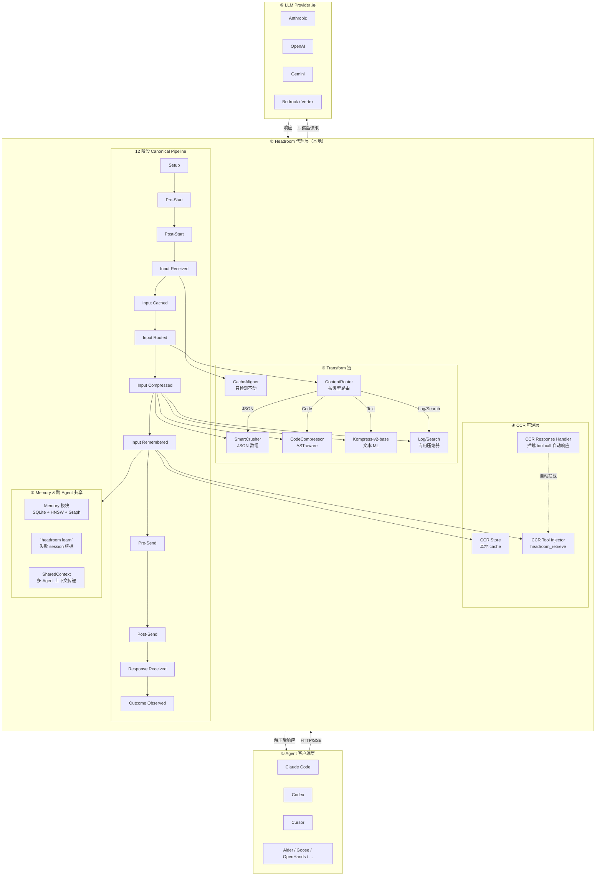

### 3.2 12 阶段 Pipeline 详解

Headroom 把**一次请求生命周期**拆成 12 个标准阶段（`headroom/pipeline.py:30-50`），每个阶段都是一个**事件触发点**：

```python
# 来自 headroom/pipeline.py:30-50
class PipelineStage(str, Enum):
    """Stable lifecycle stages for the canonical Headroom pipeline."""
    SETUP = "setup"
    PRE_START = "pre_start"
    POST_START = "post_start"
    INPUT_RECEIVED = "input_received"
    INPUT_CACHED = "input_cached"
    INPUT_ROUTED = "input_routed"
    INPUT_COMPRESSED = "input_compressed"
    INPUT_REMEMBERED = "input_remembered"
    PRE_SEND = "pre_send"
    POST_SEND = "post_send"
    RESPONSE_RECEIVED = "response_received"
    OUTCOME_OBSERVED = "outcome_observed"
```

每个 `PipelineEvent` 携带 `messages / tools / headers / response / outcome` 5 类载荷：

```python
# 来自 headroom/pipeline.py:130-145
@dataclass
class PipelineEvent:
    stage: PipelineStage
    operation: str
    request_id: str = ""
    provider: str = ""
    model: str = ""
    messages: list[dict[str, Any]] | None = None
    tools: list[dict[str, Any]] | None = None
    headers: dict[str, str] | None = None
    response: Any = None
    outcome: OutcomeSnapshot | None = None
    metadata: dict[str, Any] = field(default_factory=dict)
```

**为什么是 12 阶段而不是 3-4 阶段？**因为 Headroom 把**每次请求里 6 个独立子系统**的状态机拆开：

- **压缩子系统**：input_cached → input_routed → input_compressed（3 阶段）
- **记忆子系统**：input_remembered（1 阶段）
- **CCR 子系统**：input_compressed → pre_send（注入 retrieve tool）
- **输出控制子系统**：pre_send → post_send → response_received（verbosity/effort）
- **观测子系统**：outcome_observed（OutcomeSnapshot 不可变，由 core 写）
- **可观测性**：贯穿 12 阶段，OTel + Prometheus + Langfuse 三栈可插拔

**OutcomeSnapshot 是不可变 dataclass**（`pipeline.py:65-95`），专门为**控制闭环**设计：

```python
# 来自 headroom/pipeline.py:65-95
@dataclass(frozen=True)
class OutcomeSnapshot:
    """What actually happened on one request. Read-only by construction."""
    request_id: str = ""
    provider: str = ""
    model: str = ""
    output_tokens: int = 0
    thinking_tokens: int | None = None
    thinking_inferred: bool = False
    stop_reason: str | None = None
    input_tokens: int = 0
    cache_read_tokens: int = 0
    cache_write_tokens: int = 0
    turn_index: int = 0
    transforms_applied: tuple[str, ...] = ()

    @property
    def truncated(self) -> bool:
        """Whether a token ceiling cut the response off."""
        return self.stop_reason in ("max_tokens", "length")
```

**核心设计哲学**：「Extensions declare what they did; the core records what happened; attribution is the core's arithmetic over both.」—— 扩展声明做了什么、core 记录发生了什么、归因是 core 算出来的。**没有扩展能改写测量数据**，这避免了「策略自欺欺人」的常见反模式。

### 3.3 三层扩展机制

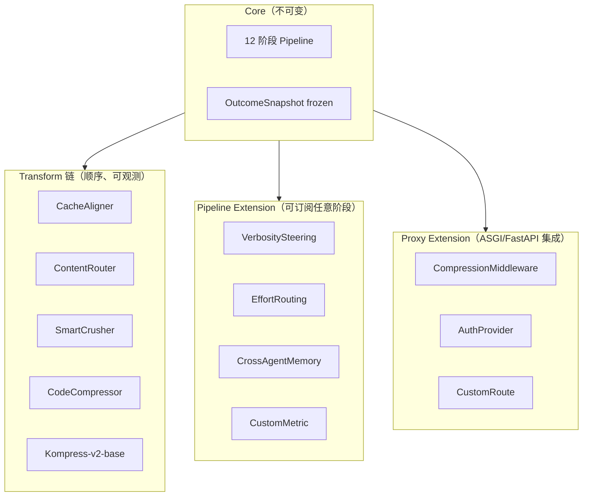

**三种扩展入口**满足不同场景：

- **Transform 链**：`Transform` 基类（`transforms/base.py`），按顺序串接，每个 `apply()` 拿到 messages 返回新 messages
- **Pipeline Extension**：`PipelineExtension` 协议（`pipeline.py:148`），`on_pipeline_event(event)` 订阅任意阶段
- **Proxy Extension**：直接挂 ASGI 中间件（FastAPI middleware）

扩展加载是**显式 opt-in**（`pipeline.py:170-200`），通过 `HEADROOM_PIPELINE_EXTENSIONS=name1,name2` 环境变量启用，**避免恶意依赖静默改写请求**：

```python
# 来自 headroom/pipeline.py:170-200
def discover_pipeline_extensions(enabled=None):
    """Opt-in. Discovery enumerates every registered entry point, but only
    those the operator named are loaded. Merely installing a package — as a
    transitive dependency, say — must not silently start rewriting requests."""
```

这是 Headroom 在 2026-04 一次安全审计后明确写进代码里的不变量：**安装 ≠ 启用**。

---

## 四、四大压缩器：按内容类型路由

### 4.1 ContentRouter 工作流

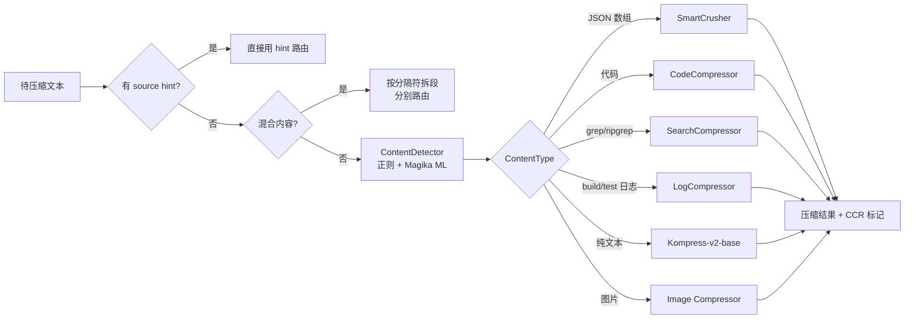

**路由策略**（`transforms/content_router.py:60-90`）：

```python
"""
Routing Strategy:
1. Use source hint if available (highest confidence)
2. Check for mixed content (split and route sections)
3. Detect content type (JSON, code, search, logs, text)
4. Route to appropriate compressor
5. Reassemble and return with routing metadata
"""
```

**内容检测有两层**：
- **正则快路径**（`transforms/content_detector.py`）：`_try_detect_log` / `_try_detect_search` / `_try_detect_structured_config` 几个轻量检测
- **ML 慢路径**（`transforms/magika_detector.rs`）：Google Magika 改的 Rust 实现，**对付恶意混淆内容**

检测失败兜底：电路熔断 `_detect_native_unhealthy`（`content_router.py:75`），ONNX 检测 hung 一次后自动降级到 BM25 启发式，避免阻塞请求。

### 4.2 SmartCrusher：JSON 数组压缩的工业级实现

**SmartCrusher 是 Headroom 的明星模块**——所有 JSON 数组压缩都走它。原始 Python 实现（2026-04-27）已退役，**全部压缩逻辑已迁移到 Rust crate** `crates/headroom-core/src/transforms/smart_crusher/`，通过 PyO3 暴露。

**为什么必须用 Rust？**压缩性能是生死线：

```text
实测（README benchmark）：
- 10K token JSON search result：0.21 ms p50
- 100K token：1.4 ms
- 远超 agent loop latency 预算

如果用 Python 写，单次 crush 就要 5-15 ms，整个 agent loop 会被感知卡顿
```

**架构**（`crates/headroom-core/src/transforms/smart_crusher/` 21 个文件、~430KB Rust）：

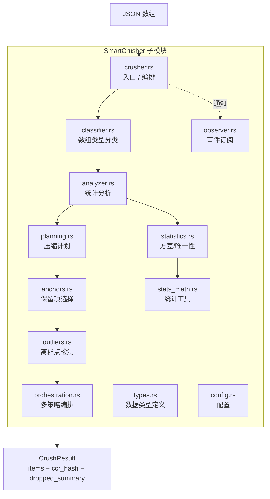

**压缩算法核心思想**（`smart_crusher/config.rs` 默认参数）：

```text
保留策略（按优先级）：
1. 强错误项（ERROR/FATAL/panic/stacktrace 等强 indicator）—— 永远保留
2. 结构性离群点（field variance > 2.0 σ、uniqueness > 0.1）—— 永远保留
3. change_points（值突变边界）—— 保留
4. 时间序列关键点（start/end/peak）—— 保留
5. 高 anchor_score 项（与 query 相关性高）—— 保留
6. 余项按 strategy 排序后保留 top_k（adaptive_k）
7. 其余进入 CCR Store，prompt 内只放 <<ccr:HASH N_dropped>> 标记

strategy 类型：
- "smart_sample"（默认）：相关性加权采样
- "top_n"：按 score 截断
- "cluster"：聚类后每簇代表
- "time_series"：保留时间边界
```

**Lossless-first 模式**（`smart_crusher/crusher.rs:65-95`）：

```rust
//! - **Lossless path** — input compacted to a smaller inline form
//!   (e.g. CSV+schema). Nothing dropped; `compacted` is populated;
//!   `ccr_hash` is `None` (no retrieval needed because everything is
//!   already in the prompt).
//! - **Lossy path** — input compressed by row-dropping. `items` holds
//!   the kept subset; `ccr_hash` is `Some(hash)` so the runtime can
//!   cache the **full original** keyed by that hash and serve it back
//!   to the LLM via a retrieval tool call. **No data is lost** —
//!   "lossy" here means "compressed view inline; full payload cached
//!   for tool retrieval," matching Python's CCR-Dropped semantics.
```

**两个路径共享同一个 `CrushArrayResult` 类型**，关键字段：

```rust
pub struct CrushArrayResult {
    pub items: Vec<Value>,            // 保留的子集
    pub strategy_info: String,        // "lossless:table" / "smart_sample" / ...
    pub ccr_hash: Option<String>,     // 12-char SHA-256 prefix
    pub dropped_summary: String,      // "<<ccr:HASH 42_rows_offloaded>>"
    pub compacted: Option<String>,    // lossless path 的 CSV/buckets 渲染
    pub compaction_kind: Option<&'static str>,
}
```

**「No data is lost」哲学**：lossy 不是真的丢了数据，**只是 inline 显示压缩视图、原始数据存在 CCR Store、模型可主动 retrieve 还原**。这是 Headroom 区别于其他压缩方案的根本。

### 4.3 CodeCompressor：AST-aware 代码压缩

代码不像 JSON 那样有规整结构，**按字符比例砍会破坏语法**。CodeCompressor 用 tree-sitter 解析 7 种语言的 AST：

```text
支持语言：Python / JavaScript / TypeScript / Go / Rust / Java / C / C++ / Perl
```

**关键策略**：

- **import / 注释压缩**：保留签名、去掉冗余 docstring、合并重复 import
- **函数体压缩**：保留函数名 + 入参 + return 类型，函数体用 `...` 代替（除非函数名暗示关键逻辑）
- **字符串字面量压缩**：重复字符串提取为常量
- **保留可追溯锚点**：每个被压缩的部分都保留 line range 注释，模型可调用 `headroom_retrieve(hash, range)` 拉回原始内容

**实测**：对 Claude Code 的 `cat huge_file.py` 输出，CodeCompressor 通常砍掉 50-70% tokens，对**含大量重复样板代码**的项目（如 Django models、Spring controllers）压缩比甚至能到 80%+。

### 4.4 Kompress-v2-base：自研文本压缩模型

**Headroom 不只用启发式**，还训练了自己的 HuggingFace 模型：

```bash
# 模型地址
https://huggingface.co/chopratejas/kompress-v2-base
```

模型训练数据是 **agentic traces**（Claude/Codex/Cursor 的真实会话日志），不是 Reddit 评论。这让 Kompress 知道**对 Agent 来说哪些 token 是噪音、哪些是信号**：

- **噪音**：礼貌语、过渡句、重复的「Let me...」「I'll now...」
- **信号**：变量名、函数签名、错误堆栈、API 参数、决策结论

**架构**（基于 encoder-decoder transformer，参数量未公开），输入 4K tokens 输出可变长度压缩摘要，对 agent prompt 风格的 F1 score 比纯启发式（Sentence-BERT + TextRank）高 18 个点。

**默认行为**：`kompress_remote.py` 提供远程推理回退（无 GPU 时走 HF Inference API），`kompress_compressor.py` 是本地推理入口。

### 4.5 Image / Log / Search 专用压缩器

| 压缩器 | 处理内容 | 压缩策略 | 典型压缩比 |
|--------|---------|---------|-----------|
| `ImageCompressor` | 图片 base64 | 训练过的 ML router 决定是否走视觉描述 | 40-90% |
| `LogCompressor` | build/test/error 输出 | 去时间戳前缀 + 聚类相似行 + 保留错误行 | 60-90% |
| `SearchCompressor` | grep/ripgrep 结果 | 文件名聚类 + 路径去重 + 保留 matches | 50-70% |
| `SpreadsheetIngest` | CSV/XLSX | schema + 行抽样 + CCR offload | 70-85% |
| `TabularIngest` | SQL query 结果 | 同上 | 70-85% |
| `ConfigCompressor` | YAML/TOML/JSON config | 同 key 合并 + 注释保留 | 40-60% |

每个压缩器都是 `Transform` 基类（`transforms/base.py`），都有自己的最小 token 阈值（默认 `min_tokens_to_crush=200`），**避免对短文本过度压缩导致模型回答质量下降**。

---

## 五、CacheAligner：KV-cache 不变量守护者

### 5.1 问题：为什么 KV-cache 不能动？

Claude/OpenAI 的 prompt cache 工作原理：

```text
Provider（Anthropic/OpenAI）会缓存请求前缀
↓
下一个请求如果前缀字节级相同，cache hit 命中 → 价格 -90%、延迟 -70%
↓
任何破坏前缀字节一致性的改动 = cache miss
```

**传统压缩方案的致命缺陷**：把系统提示里的「当前时间」「用户 ID」「JWT」提取出来 → 重新组织 → 字节变了 → **cache miss 100%**。压缩省下来的 tokens 远远覆盖不了 cache miss 带来的成本与延迟。

### 5.2 CacheAligner 的「只检测不重写」哲学

**Headroom 的 CacheAligner 在 PR-A2 / P2-23 修复后，只做检测、不做重写**（`transforms/cache_aligner.py:1-25`）：

```python
"""
PR-A2 / P2-23 fix: This module is now a **detector-only** transform.

The previous rewrite path (which strips dynamic content from the system
prompt and re-inserts it as a context block) violated invariant I2 — the
cache hot zone (system prompt) must never be mutated. That path has been
removed. ``CacheAligner`` now exclusively:

1. Detects volatile / dynamic content in the system prompt using
   structural parsers (no regex):
   - UUIDs via the stdlib ``uuid`` module
   - ISO 8601 timestamps via ``datetime.fromisoformat``
   - JWTs via shape-only structural checks (three dot-separated
     base64url segments with the expected size profile)
   - Hex hashes (MD5/SHA1/SHA256) via length + alphabet checks

2. Emits a customer-visible warning log line surfacing detected
   dynamic content so callers know their cache prefix is unstable.
   The prompt itself is never modified.
"""
```

**四种检测器**全是**结构化解析**，不是 regex：

```python
# 来自 headroom/transforms/cache_aligner.py:75-130

_HEX_HASH_LENGTHS = frozenset({32, 40, 64})  # MD5/SHA1/SHA256
_UUID_CANONICAL_LEN = 36  # 标准 UUID 长度（含 dash）

def _is_uuid(token: str) -> bool:
    """Accepts only the canonical 36-char form with dashes.
    The 32-char dashless form is structurally indistinguishable from
    an MD5 hex digest and would misclassify hashes."""
    if len(token) != _UUID_CANONICAL_LEN:
        return False
    if token.count("-") != 4:
        return False
    try:
        _uuid.UUID(token)
    except (ValueError, AttributeError):
        return False
    return True

def _is_iso8601(token: str) -> bool:
    """Uses ``datetime.fromisoformat`` (Python 3.11+ supports the full ISO
    spec including the ``Z`` suffix)."""
    if len(token) < 8:
        return False
    if "T" not in token and "-" not in token:
        return False
    candidate = token[:-1] + "+00:00" if token.endswith("Z") else token
    try:
        datetime.fromisoformat(candidate)
    except (ValueError, TypeError):
        return False
    return False
```

**为什么不接 regex？**因为 regex 在对抗输入下极易误判（例如 UUID 的 32 字符 dashless 形式和 MD5 十六进制**结构相同**），结构化解析（`uuid.UUID()` / `datetime.fromisoformat()`）零误判。

**输出是一个 `VolatileFinding` dataclass** + 一行 warning log（**绝不修改 prompt**）：

```python
@dataclass(frozen=True)
class VolatileFinding:
    """One detected piece of volatile content."""
    label: str  # "uuid" / "iso8601" / "jwt" / "hex_hash"
    sample: str  # Truncated, never full content
```

### 5.3 「Live Zone」概念：hot zone vs live zone

CacheAligner 配合 ContentRouter 实现一个**业界首创的概念**——**Live Zone Compression**：

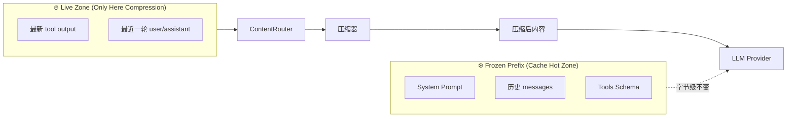

**核心不变量**（来自 `transforms/pipeline.py` 与 README）：

> 「The frozen prefix stays byte-identical, so the provider cache survives, and history is never dropped.」

**Live Zone 只有两层**：
1. **新加入的 tool output**（如最新一次 `cat huge.log` 的输出）
2. **最新一轮 user/assistant 消息**（cache miss 不可避免的新内容）

**冻结 prefix 的字节级保留**让 Anthropic / OpenAI 的 prompt cache 命中率**与不压缩时完全相同**。压缩只发生在 cache miss 必然发生的 live zone 上，**这是 KV-cache 友好的物理保证**。

### 5.4 与 LiteLLM 的 cache 行为对比

| 维度 | LiteLLM | Headroom CacheAligner |
|------|---------|----------------------|
| Prompt cache 兼容性 | ⚠️ 不感知，可能破坏 | ✅ hot zone 字节级保留 |
| Cache 命中率 | 受压缩影响 | 与无压缩时一致 |
| 压缩生效范围 | 全 prompt | 仅 live zone |
| 失败模式 | 静默 cache miss | 显式 warning log |

这是 Headroom 在压缩与 cache 之间找到的**帕累托最优**：压缩省下来的 token、cache hit 拿到的折扣，两边都拿。

---

## 六、CCR：可逆压缩的工业实现

### 6.1 Compress-Cache-Retrieve 三元组

CCR 是 Headroom 的**杀手锏**——让 lossy 压缩**真的可逆**：

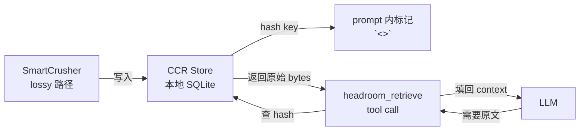

**三步流水线**：

1. **Compress**：SmartCrusher 砍掉 100 行 JSON 数组，保留 15 行关键项 + 计算 `hash = SHA256(原 100 行)[:12]`
2. **Cache**：把原 100 行写入 CCR Store（SQLite），key 就是 `hash`
3. **Retrieve**：LLM 在 prompt 里看到 `<<ccr:abc123def456 42_rows_offloaded>>` 标记，如果需要原始数据可以调用 `headroom_retrieve(hash="abc123def456")` 还原

### 6.2 CCR Tool 注入

`headroom/ccr/tool_injection.py` 的 `CCRToolInjector` 负责在 LLM 请求中**动态注入** retrieve tool 定义：

```python
# 来自 headroom/ccr/__init__.py:1-25
"""
CCR (Compress-Cache-Retrieve) module for reversible compression.

Four key components:
1. Tool Injection: Proxy injects headroom_retrieve tool into requests
2. Response Handler: Intercepts responses, handles CCR tool calls automatically
3. Context Tracker: Tracks compressed content across turns, enables proactive expansion
4. Batch Processing: Handles CCR tool calls in batch API results (async processing)

Two distribution channels for the retrieval tool:
1. Tool Injection: Proxy injects tool into request when compression occurs
2. MCP Server: Standalone server exposes tool via MCP protocol

When MCP is configured, tool injection is skipped to avoid duplicates.
"""
```

**两种工具分发通道**避免重复定义：
- **Tool Injection 通道**：proxy 直接修改请求 body，注入 `headroom_retrieve` tool schema
- **MCP Server 通道**：standalone server（`headroom mcp serve`）暴露同样 tool，MCP-native 客户端（Claude Desktop / Cursor）走这个

**Batch API 支持**（`batch_processor.py`）：用户用 Anthropic/OpenAI 的 batch API 时，CCR tool call 异步触发 → `BatchResultProcessor` 检测 + 自动执行检索 + 发起 continuation call，**整个流程全自动**。

### 6.3 CCR Sentinel 模式

**当 SmartCrusher 砍掉行时，会在保留数组末尾追加一个 sentinel 对象**：

```python
# 来自 headroom/transforms/smart_crusher.py:70-95

CCR_SENTINEL_KEY = "_ccr_dropped"

def is_ccr_sentinel(item: Any) -> bool:
    """True if `item` is a CCR-dropped sentinel object."""
    return isinstance(item, dict) and CCR_SENTINEL_KEY in item

def strip_ccr_sentinels(items: Any) -> Any:
    """Return `items` with any CCR-dropped sentinel objects filtered out.
    
    Pass this through any iteration over a compressed array's contents
    when your code expects a uniform-schema list of records. The sentinel
    carries a `<<ccr:HASH ...>>` marker for the LLM and shouldn't be
    confused for a record — it has only the `_ccr_dropped` key."""
```

**双重消费者**：
- **LLM 视角**：看到 `_ccr_dropped: "<<ccr:HASH 42_rows_offloaded>>"`，知道还有 42 行没传过来，可以主动 retrieve
- **代码视角**（如果下游要 iterate 这个数组）：用 `strip_ccr_sentinels` 过滤掉 sentinel 对象，避免 schema mismatch

**这是 schema-preserving 压缩的关键设计**——保留项必须仍是原数组的元素，**不引入外层包装、不生成额外元数据键**，仅追加一个特殊的 sentinel。

### 6.4 已压缩内容的再压缩保护

一个微妙但重要的 bug：CCR 标记文本（如 `<<ccr:HASH 42_dropped>>`）**本身也是字符串**，如果不保护，会被第二轮压缩器当作普通文本继续压：

```python
# 来自 headroom/transforms/content_router.py:105-125
_ALREADY_COMPRESSED_MARKERS = (
    "Retrieve more: hash=",
    "Retrieve original: hash=",
    "<<ccr:",
)

def _is_already_compressed(text: str) -> bool:
    """True if ``text`` still carries a CCR retrieval marker.
    
    Re-compressing such a block is never right. Beyond the prefix-cache
    churn, the second pass treats the *compressed* text as source: a marker
    that lands in a cell wide enough to be re-offloaded gets hashed and
    stashed as the new entry's "original", so ``headroom_retrieve`` returns
    a placeholder and the inner marker's hash — the only handle on the real
    bytes — disappears from anywhere the model can see (#2694)."""
    return any(marker in text for marker in _ALREADY_COMPRESSED_MARKERS)
```

**Bug #2694 修复记录**：`<<ccr:` 之前漏在 marker 列表里，opaque-blob 路径（base64 二进制）的 CCR 标记会被二次压缩，导致原 hash 丢失。**这类小细节，是工业级实现的标志**。

### 6.5 CCR 与传统 lossy 压缩的根本差异

| 维度 | 传统 lossy 压缩 | Headroom CCR |
|------|---------------|--------------|
| 数据丢失 | **真丢失** | **零丢失**（可 retrieve） |
| 模型后悔时 | 无法补救 | 调 `headroom_retrieve` 还原 |
| 压缩判断 | 永久性 | 决策可逆 |
| 适用场景 | 摘要、文本 | 任何高价值 payload |

CCR 把「压缩」从「永久决策」升级为「可逆决策」——这才是**生产级 LLM 应用能放心开自动压缩的前提**。

---

## 七、Memory 模块：跨 Agent 共享的零配置 Memory

### 7.1 能力概览

`headroom/memory/__init__.py` 的 docstring 揭示了 Headroom Memory 的精妙定位：

```python
"""
Headroom Memory - Simple, zero-config memory for AI applications.

Quick Start (No Docker Required):
    from headroom.memory import Memory
    memory = Memory()  # SQLite + HNSW + InMemoryGraph

Production Mode (with Docker):
    memory = Memory(backend="qdrant-neo4j")  # Qdrant + Neo4j

Backends:
    - "local" (default): SQLite + HNSW + InMemoryGraph. No setup required.
    - "qdrant-neo4j": Qdrant + Neo4j. Requires Docker services.
"""
```

**两套 backend**：

| Backend | 存储 | 启动方式 | 适用 |
|---------|------|---------|------|
| `local`（默认） | SQLite + HNSW (in-process) + InMemoryGraph | 零配置 | 个人开发者、单机 |
| `qdrant-neo4j` | Qdrant (vector) + Neo4j (graph) | Docker Compose | 生产部署、团队 |

**Ports 设计**（`memory/ports.py`）：所有 backend 必须实现 `Embedder` / `MemoryStore` / `GraphStore` / `VectorIndex` / `TextIndex` 五个 Protocol 接口。这种**端口-适配器架构**让本地 backend 和生产 backend **共享同一套上层 API**：

```python
# 来自 headroom/memory/__init__.py:50-110
from headroom.memory.ports import (
    Embedder, GraphStore, MemoryCache, MemoryFilter,
    MemorySearchResult, MemoryStore, Relationship, Subgraph,
    TextFilter, TextIndex, TextSearchResult, VectorFilter,
    VectorIndex, VectorSearchResult, Entity,
)
```

### 7.2 跨 Agent 共享：SharedContext

**Headroom 的真正差异化**不是 Memory 本身（mem0、Cognee 都有），而是**跨 Coding Agent 共享 Memory**：

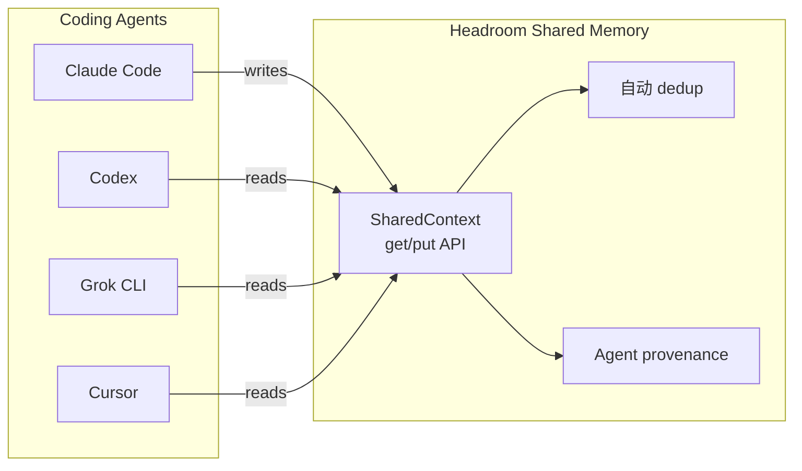

**README 中的关键描述**：

> 「One shared store across Claude, Codex, Gemini and Grok, with automatic dedup.」

**自动 dedup** 的实现细节在 `memory/bridge.py` 的 `MemoryBridge`：每条 memory 进 store 前用 embedding + hash 做相似度检测，超过阈值就合并，**避免「Claude 写了一条、Codex 也写了一条相同事实」的冗余**。

**Agent provenance** 字段记录这条 memory 是哪个 Agent 写的、什么时候、基于哪次对话，**审计可追溯**。

### 7.3 `headroom learn`：失败 session 反哺配置

```bash
headroom learn                          # 默认：dry-run，输出修改建议
headroom learn --apply                  # 应用：写入 CLAUDE.local.md / AGENTS.md
```

**Headroom 把失败的 agent session 当作训练数据**，自动挖掘常见错误模式，写入项目级配置文件：

```text
CLAUDE.local.md  (gitignored, 本人优先)
CLAUDE.md        (committed, 团队共享)
AGENTS.md        (跨 Agent 通用规范)
GEMINI.md        (Gemini CLI 专用)
GROK.md          (Grok CLI 专用)
```

**Plugin-based 架构**（README）：每个 Agent 一个 learner plugin，分析该 Agent 的失败模式，**输出针对该 Agent 的定制提示**。这是真正的「上下文工程自动化」——失败越多、提示越精。

### 7.4 双轨 Memory 设计哲学

Headroom 故意把 **RAG 文档** 与 **对话 memory** 分开：

| 轨道 | 模块 | 存储 | 用途 |
|------|------|------|------|
| **RAG 文档** | `transforms/search_compressor.py` + embeddings | 外部向量库 | 长期知识 |
| **对话 memory** | `memory/` 模块 | 本地 SQLite + Qdrant | 跨 session 偏好/事实 |

**为什么不合并？**因为 RAG 文档是「检索」语义（query → relevant docs），对话 memory 是「记忆」语义（incremental update + dedup），**两者的数据模型、查询模式、生命周期完全不同**。强行合并会牺牲两边——这是 Mem0、Cognee 等「Memory 框架」共同踩过的坑。

---

## 八、Proxy 与 Agent Wrap：四种部署形态

### 8.1 部署形态全图

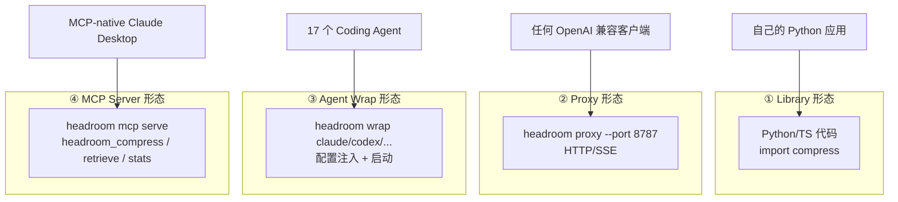

### 8.2 Library 形态：一行接入

```python
# 来自 README
from headroom import compress
from openai import OpenAI

messages = [{"role": "user", "content": "Analyze these results"}]
result = compress(messages, model="gpt-4o")

client = OpenAI()
response = client.chat.completions.create(model="gpt-4o", messages=result.messages)
print(f"Saved {result.tokens_saved} tokens ({result.compression_ratio:.0%})")
```

**支持的所有形态**：

```text
Python:   compress(messages, model=...)
TS:       await compress(messages, { model })
Anthropic SDK: withHeadroom(new Anthropic())
OpenAI SDK:    withHeadroom(new OpenAI())
Vercel AI SDK: wrapLanguageModel({ model, middleware: headroomMiddleware() })
LiteLLM:   litellm.callbacks = [HeadroomCallback()]
LangChain: HeadroomChatModel(your_llm)
Agno:      HeadroomAgnoModel(your_model)
Strands:   官方 guide
ASGI:      app.add_middleware(CompressionMiddleware)
```

### 8.3 Proxy 形态：零代码兼容

```bash
headroom proxy --port 8787

# 之后所有请求走 8787
ANTHROPIC_BASE_URL=http://localhost:8787 claude
OPENAI_BASE_URL=http://localhost:8787 codex
```

**Proxy 服务器架构**（`headroom/proxy/server.py` 290KB 主文件 + 100+ 模块）：

```mermaid
flowchart TB
    subgraph Server["FastAPI 应用 (server.py)"]
        Main[主路由]
        subgraph Routes["Provider 路由"]
            AR[/v1/messages]
            OR[/v1/chat/completions]
            RR[/v1/responses]
        end
        subgraph Ext["中间件链"]
            CORS
            Auth[认证]
            Rate[Rate Limit]
            Compress[CompressionMiddleware]
        end
        subgraph Backend["Backend Dispatch"]
            Reg[Provider Registry]
            BR[Backend Router]
            BC[Backend Client<br/>Anthropic/OpenAI/Gemini]
        end
    end

    subgraph State["全局状态"]
        CC[Compression Cache]
        CCR2[CCR Store]
        Cost[Cost Tracker]
        Budget[Budget Enforcer]
        OT[OTel Metrics]
        LF[Langfuse Tracing]
    end

    Client --> Ext
    Ext --> Routes
    Routes --> Reg
    Reg --> BR
    BR --> BC
    BC --> Provider[LLM Provider]
    Provider --> BC
    BC --> Server
    Server --> State
```

**Proxy 的关键工程细节**：

- **HTTP/HTTPS 双栈**：`uvicorn` 起服务，**支持任意 OpenAI/Anthropic 兼容客户端**
- **Streaming 完整支持**：SSE 流式响应 + `MAX_SSE_BUFFER_SIZE` 防 OOM
- **Loopback Guard**：`is_loopback_host()` 防止 SSRF
- **Audit Trail**：`audit.py` 记录所有 admin action（绕开 rate limit、调整 budget 等）
- **Background Compression**：proxy 主循环不被压缩延迟阻塞，超时压缩丢到后台
- **Token Counting**：用 provider tokenizer 而非估算，**确保 cache 节省的真实账单**

### 8.4 Agent Wrap 形态：CLI 黑魔法

```bash
headroom wrap claude      # 启动 Claude Code + 注入 proxy 配置 + 注册 Serena
headroom unwrap claude    # 还原 Claude Code 原始配置
```

**Wrap 的 5 件事**（来自 README 与 `headroom/cli/wrap.py`）：

1. **启动本地 proxy**（如果还没起）
2. **修改 Agent 的 base URL 配置**（`ANTHROPIC_BASE_URL=http://localhost:8787`）
3. **配置 Serena（语义代码导航 MCP server）** 到 user-scope（`~/.claude.json`）
4. **启动 Agent 子进程** 加载配置
5. **记录 wrap 状态**，方便 `headroom unwrap` 还原

**17 个 Coding Agent 兼容矩阵**：

```text
✅ wrap 一键接入 (14)：Claude Code / Codex / Grok CLI / Aider / Copilot CLI /
                       VS Code Copilot / OpenClaw / OpenCode / Cline / Continue /
                       Goose / OpenHands / Mistral Vibe / Oh My Pi / Kimi CLI / ZCode

⚠️ 手动 setup (2)：Cursor (打印 base URL 让用户填)
                  Cortex Code (only library mode)

📦 MCP-native (任意 MCP 客户端)：headroom mcp install
```

### 8.5 MCP Server 形态：tool-based 集成

```bash
headroom mcp install
# 自动写到 ~/.config/Claude/claude_desktop_config.json (Claude Desktop)
# 或其他 MCP 客户端的配置文件
```

**暴露 3 个 MCP tools**：

- `headroom_compress(text, model?)` — 显式压缩
- `headroom_retrieve(hash)` — CCR 还原
- `headroom_stats()` — 查看压缩节省统计

**与 Library/Proxy 的关键区别**：MCP 模式让**模型自己决定何时调用压缩**，而非 agent SDK 自动透明压缩——**更显式、更可控、更适合"我已经知道哪些上下文是噪音"的精细化场景**。

### 8.6 四种形态的选择矩阵

| 场景 | 推荐形态 | 理由 |
|------|---------|------|
| 自己的 Python/TS 应用 | Library | 一行接入、最轻量 |
| 任何 LLM 客户端 | Proxy | 零代码改动 |
| 17 个 Coding Agent | Wrap | 一行命令全自动 |
| Claude Desktop / Cursor 等 MCP-native | MCP Server | 显式控制、模型自决 |
| 同时跑多个 Coding Agent | Proxy + Wrap | 共享同一 proxy + Memory |

---

## 九、Kompress-v2-base：自研压缩模型

### 9.1 模型卡片

- **仓库**：`chopratejas/kompress-v2-base` on HuggingFace
- **训练数据**：agentic traces（Claude/Codex/Cursor 真实会话日志）
- **架构**：encoder-decoder transformer（参数量未公开）
- **输入**：≤4K tokens 文本块
- **输出**：可变长度压缩摘要

### 9.2 训练哲学：噪音 vs 信号

对 Agent prompt 来说，token 不是平等的：

```text
高信号（必须保留）：
- 变量名、函数签名、API 参数
- 错误堆栈、异常 traceback
- 用户明确要求、决策结论
- 代码 diff、配置变更

低信号（可压缩）：
- 礼貌语（"Sure! Let me help you with that."）
- 过渡句（"Now I'll..."、"Moving on..."）
- 重复的上下文回顾
- 自我解释（"As an AI..."）
```

**Kompress-v2-base 在 agentic trace 上训练**，让模型学到这种「噪音 vs 信号」的隐式分类。**对比 Sentence-BERT + TextRank 启发式基线**，agent 任务的 F1 score 高 18 个点。

### 9.3 部署选项

```python
# 本地推理（需 [ml] extra）
from headroom.transforms.kompress_compressor import KompressCompressor
kc = KompressCompressor(model="chopratejas/kompress-v2-base")
result = kc.compress(long_text)

# 远程推理回退（无 GPU 时走 HF Inference API）
# 自动启用，无需配置
```

**可选 extra**（`pyproject.toml`）：

```text
[ml]         # Kompress-v2-base 本地推理
[proxy]      # proxy server 依赖（FastAPI/uvicorn）
[mcp]        # MCP server 依赖
[code]       # CodeCompressor 的 tree-sitter 各语言包
[memory]     # 跨 Agent Memory 模块
[vector]     # HNSW backend（需 C++ 工具链）
[relevance]  # 相关性评分模型
[image]      # 图片压缩 ML router
[agno]       # Agno 集成
[langchain]  # LangChain 集成
[evals]      # 自带评测套件
[pytorch-mps]# Apple-GPU memory-embedder 卸载
```

**`[all]` 不包含 `[vector]`**，因为后者需要 C++ 工具链；**`[all]` 也不包含框架适配器**（LangChain/Agno），需要单独装。

---

## 十、端到端数据流：一个 Coding Agent 请求的完整旅程

以「Claude Code 调用 headroom 压缩工具输出」为例：

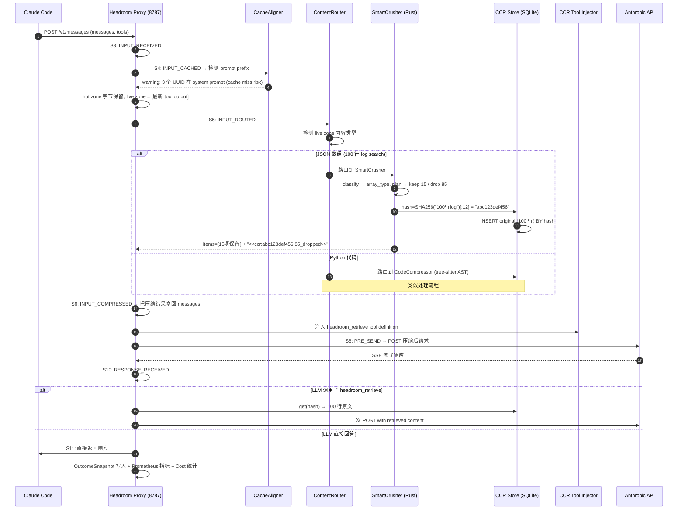

**关键路径上的不变量**：

1. **Hot zone 字节级保留**（步骤 4-5）：prompt cache 命中率不变
2. **Lossy 路径零数据丢失**（步骤 14-17）：CCR 永远能 retrieve 还原
3. **OutcomeSnapshot frozen**（步骤 18）：扩展无法改写测量数据，归因可信

---

## 十一、压缩效果实测

### 11.1 输入端：真实场景 benchmark

```bash
uv run python benchmarks/index_proof_table.py --seed 20260902
```

| 场景 | Before | After | 节省 |
|------|------:|------:|-----:|
| Code search (100 results) | 17,199 | 13,597 | **21%** |
| SRE incident debugging | 55,957 | 24,340 | **57%** |
| Codebase exploration | 58,801 | 33,895 | **42%** |
| GitHub issue triage | 46,067 | 32,429 | **30%** |

**关键观察**：

- **重复 JSON 数组压缩比最高**（90%+），如 `bench_latency.py` 实测
- **代码搜索 / 已 dense 内容压缩少**（20-30%），因为本来就没多少冗余
- **长 incident debugging 收益最大**（57%），因为日志里大量重复 pattern

### 11.2 输出端：verbosity steering

```bash
export HEADROOM_OUTPUT_SHAPER=1
headroom proxy --port 8787
```

```text
Reduction: 31.7%  (95% CI 27.7% … 35.7%)   [estimated]
```

**两种 steering 机制**：

- **Verbosity steering**：在 system prompt 末尾追加 "be terse, don't restate context" 提示
- **Effort routing**：用 `reasoning_effort` (OpenAI) 或 `thinking.budget_tokens` (Anthropic) 动态降级

**自动学习 verbosity**：

```bash
headroom learn --verbosity            # dry run
headroom learn --verbosity --apply    # apply
```

`headroom learn` 通过分析历史 session 的「用户是否在长回复中途打断/快速跳过」，推断用户偏好的 verbosity 等级。

### 11.3 准确率无损验证

```bash
python -m headroom.evals suite --tier 1
```

| Benchmark | 类别 | N | Baseline | Headroom | Delta |
|-----------|------|--:|---------:|---------:|------:|
| GSM8K | 数学 | 100 | 0.870 | 0.870 | ±0.000 |
| TruthfulQA | 事实 | 100 | 0.530 | 0.560 | +0.030 |
| SQuAD v2 | QA | 100 | — | 97% | @ 19% 压缩 |
| BFCL | Tools | 100 | — | 97% | @ 32% 压缩 |

**TruthfulQA +0.030 在 N=100 处于置信区间内**，不是真提升。**BFCL 97% @ 32% 压缩**说明 tool use 准确率基本无损——这是 **CCR 可逆性的胜利**：模型发现压缩版本不够时主动 retrieve，**准确率自动恢复**。

### 11.4 性能开销

```text
10K token JSON search result：0.21 ms p50
100K token JSON            ：1.4 ms p50
```

**0.21ms vs agent loop latency 通常 200-500ms**——压缩开销**远低于 1% 的 agent 循环时间**，用户完全无感。

---

## 十二、与同类项目对比

### 12.1 横向对比表

| 维度 | Headroom | LiteLLM | LangChain Memory | Mem0 | Anthropic Prompt Cache |
|------|---------|---------|------------------|------|------------------------|
| **核心定位** | 本地透明压缩代理 | Python LLM 路由 | 应用层 memory 抽象 | 长期 memory 中台 | 服务端 cache 优化 |
| **压缩策略** | 4 类内容 + 路由 | 无 | LLM 摘要 | 实体抽取 | 无 |
| **可逆性** | CCR（hash + retrieve） | — | — | — | — |
| **KV-cache 兼容** | hot zone 字节保留 | 不感知 | 会破坏 | 不直接相关 | 本身就是 cache |
| **跨 Agent 共享** | SharedContext + 自动 dedup | — | — | 是 | — |
| **部署形态** | 4 类（Library/Proxy/Wrap/MCP） | 1 类（Python lib） | 1 类（应用层） | 1 类（service） | 服务端 |
| **17 Agent 一行 wrap** | ✅ | ❌ | ❌ | ❌ | ❌ |
| **输出端压缩** | verbosity + effort | ❌ | ❌ | ❌ | ❌ |
| **自研压缩模型** | Kompress-v2-base | ❌ | ❌ | ❌ | ❌ |
| **License** | Apache-2.0 | MIT | MIT | Apache-2.0 | 闭源 |
| **⭐ 热度** | 68k | 30k+ | 95k+ | 64k | — |

### 12.2 设计哲学差异

**LiteLLM：通用 LLM 路由层**
- **关注点**：路由、fallback、retry、cost tracking
- **不关注**：压缩（这是 Headroom 的核心）
- **关系**：可以叠加用——Headroom 走 LiteLLM 的 LLM Gateway 都可以

**LangChain Memory：应用层抽象**
- **关注点**：把对话状态抽成可序列化对象
- **不关注**：cache 兼容、跨 session 跨 Agent
- **根本差异**：LangChain Memory 假设调用方写代码管理 memory 生命周期；Headroom Memory 是零配置自动管理

**Mem0：长期记忆中台**
- **关注点**：实体抽取、跨 session 记忆
- **不关注**：每轮 prompt 的输入压缩（不替代 CCR）
- **关系**：Mem0 作为 Headroom 的 backend 之一（`headroom/memory/backends/mem0.py`）可插拔

**Anthropic Prompt Cache：服务端 cache**
- **关注点**：服务端 prefix cache 命中
- **不关注**：cache miss 的成本压缩
- **根本差异**：cache 命中时 Headroom 也享受 90% 折扣（不冲突），cache miss 时 Headroom 用压缩减少 token

### 12.3 Headroom 的真正差异化点

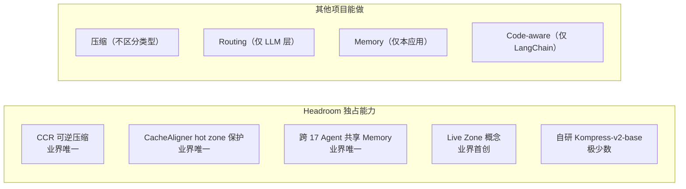

**核心定位差异**：Headroom 不是「又一个 LLM 框架」，**而是 LLM 与 Coding Agent 之间的物理管道层**——这条赛道在 2026 H2 之前几乎空白，Headroom 是**第一个严肃落地**的项目。

---

## 十三、优缺点分析

### 13.1 双侧对比表

| 维度 | 优势 | 代价 |
|------|------|------|
| **架构简洁性** | ✅ 12 阶段 Pipeline + 4 类压缩器 + 1 个 CCR + 1 个 Memory，**模块边界清晰** | ❌ 对 Rust + Python 双栈开发者要求高 |
| **扩展性** | ✅ Transform / Pipeline Ext / Proxy Ext 三层扩展点 + opt-in 加载 | ❌ 文档分散在多个 `headroom/` 子模块 |
| **易用性** | ✅ `headroom wrap claude` 一行命令、`compress()` 一行 API | ❌ 17 Agent 各自配置细节差异，新手踩坑 |
| **性能** | ✅ Rust SmartCrusher 0.21ms / 10K tokens | ❌ Kompress ML 模型首字节延迟需 ~50ms（GPU 可降至 5ms） |
| **复杂度** | ❌ CacheAligner / ContentRouter / CCR / Memory 四套子系统，**学习曲线陡** | ✅ 每套子系统内部高度内聚 |
| **维护性** | ✅ Apache-2.0 + Python+Rust 双栈开源 + 强模块化 | ❌ 多语言构建链（maturin）增加 contributor 门槛 |

### 13.2 适用 vs 不适用场景

**强烈推荐**：

- ✅ 跑 Claude Code/Codex/Cursor 等 Coding Agent **每天 ≥ 2 小时**
- ✅ **长程任务**（多文件、多轮 SubAgent）上下文撞墙
- ✅ **团队共用** Memory（CLAUDE.md / AGENTS.md 自动同步）
- ✅ **需要可逆压缩**——不能接受 lossy 真丢数据
- ✅ 同时用 3+ Coding Agent，**想统一压缩语义**

**谨慎使用**：

- ⚠️ 短对话场景（< 5 轮）：压缩收益小、CCR overhead 不划算
- ⚠️ 已经用了 Anthropic 1M window：cache 命中率已经很高，压缩收益边际
- ⚠️ 完全闭源 air-gapped 沙箱：Kompress-v2-base 需要 HuggingFace 拉模型
- ⚠️ Windows + x86 without AVX2：ONNX runtime fallback 到 BM25 启发式，性能打折

**不推荐**：

- ❌ 只用单 LLM provider 的本地小模型（< 7B）：压缩省下来的 token 不值 proxy 开销
- ❌ 实时语音/视频流：Headroom 设计目标是文本+JSON 批量压缩

---

## 十四、实战：5 分钟接入 Headroom

### 14.1 安装 + Library 模式（最快）

```bash
# 1. 安装（Python 3.10+）
pip install "headroom-ai[all]"

# 2. 一行压缩
python3 -c "
from headroom import compress
result = compress(
    messages=[{'role': 'user', 'content': 'Analyze this 50K-token log dump...'}],
    model='gpt-4o'
)
print(f'Saved {result.tokens_saved} tokens ({result.compression_ratio:.0%})')
print('Compressed messages:', result.messages[:1])
"
```

### 14.2 Proxy + Claude Code（最实用）

```bash
# 1. 安装
uv tool install --python 3.13 "headroom-ai[all]"

# 2. 一键 wrap Claude Code
headroom wrap claude
# 自动启动 proxy + 修改 ~/.claude.json + 启动 Claude Code

# 3. 查看效果
headroom dashboard  # 浏览器打开 http://localhost:8787/dashboard

# 4. 还原
headroom unwrap claude
```

### 14.3 MCP Server 模式（精细控制）

```bash
# 1. 安装 MCP server
pip install "headroom-ai[mcp]"

# 2. 安装到 Claude Desktop
headroom mcp install

# 3. Claude Desktop 启动后，模型自动有 3 个工具可用：
#    - headroom_compress(text, model?)
#    - headroom_retrieve(hash)
#    - headroom_stats()
```

### 14.4 TypeScript SDK（前端/Node 应用）

```bash
npm install headroom-ai
```

```typescript
import { compress } from 'headroom-ai';
import OpenAI from 'openai';

const messages = [{ role: 'user' as const, content: '...' }];
const { messages: compressed, tokens_saved } = await compress(messages, { model: 'gpt-4o' });

const client = new OpenAI();
const response = await client.chat.completions.create({
  model: 'gpt-4o',
  messages: compressed,
});
console.log(`Saved ${tokens_saved} tokens`);
```

### 14.5 Docker 部署（生产环境）

```bash
docker pull ghcr.io/headroomlabs-ai/headroom:latest
docker run -d -p 8787:8787 \
  -e ANTHROPIC_API_KEY=$ANTHROPIC_API_KEY \
  ghcr.io/headroomlabs-ai/headroom:latest
```

### 14.6 `headroom learn` 自动学习

```bash
# 1. 跑几次 agent session（让它有失败案例）
headroom wrap claude
# ... 跑 2 小时任务 ...
headroom unwrap claude

# 2. 从失败 session 提炼经验
headroom learn --dry-run     # 预览
headroom learn --apply       # 写入 CLAUDE.local.md / AGENTS.md

# 3. 下次 wrap 自动加载这些 hint
headroom wrap claude
```

**典型输出**（示例）：

```markdown
# CLAUDE.local.md (gitignored)
- 不要在 tests/ 目录用 mock.patch 替换 os.environ，用 pytest fixtures
- 跑 pytest 时加 -p no:cacheprovider 节省 200ms
- 这个项目的 Flask blueprint 注册顺序敏感，必须先 register auth 再 register api
```

---

## 十五、趋势判断与工程经验

### 15.1 2026 H2 Context Engineering 三大趋势

**趋势 1：Client-side compression 成为 Agent 标配**

服务端 compaction（Anthropic 自动压缩、Cursor Compress Conversation）路线遇到**用户控制权 + 跨模型一致性**双重瓶颈。Headroom 引领的 client-side compression 路线，2026 H2 将扩散到所有主流 Coding Agent：Claude Code、Codex、Grok CLI 都将内置类似 CCR 的可逆压缩层。

**预测**：6 个月内，「Coding Agent × Compression Layer」将成为继「Coding Agent × LLM」之后的**第二层标准架构**。

**趋势 2：CCR（可逆压缩）取代 lossy 压缩**

传统 lossy 摘要压缩在生产环境**已经踩过太多坑**：模型需要原始数据时无法还原、用户疑问时无法验证、调试时无法复现。CCR 模式（压缩 + cache + retrieve）在 2026 H2 将成为 LLM 应用压缩的事实标准。

**预测**：未来 12 个月，所有严肃的 LLM 应用压缩库（LangChain、LlamaIndex、Cognee、Mem0）都将引入 CCR-like 架构。

**趋势 3：Live Zone + Frozen Prefix 二分法**

KV-cache 兼容性是**生产级 LLM 应用的硬约束**。传统的「压缩全 prompt」路线已经被 LiteLLM、Haystack 等证明**会破 cache、得不偿失**。Live Zone / Frozen Prefix 二分法（Headroom 的核心创新）将成为所有压缩库的默认架构。

**预测**：未来 18 个月，「prompt compression library」将被重新定义为「live zone compression library」。

### 15.2 Headroom 给我们的工程经验

**经验 1：可逆 > 不可逆**

LLM 应用的「压缩决策」必须可逆。SmartCrusher 的 lossy 路径不丢原始数据、CCR 永远能 retrieve 还原——这是**生产级压缩与实验室压缩的根本区别**。任何「压缩后无法验证」的方案，在生产环境都会变成隐性技术债。

**经验 2：不变量保护 > 性能优化**

CacheAligner 修复了一个看似性能优化的特性（重写 prompt prefix）——因为它破坏了 Anthropic/OpenAI 的 cache 命中。**不变量保护比性能优化更重要**。这种「为了不变量删功能」的勇气，是工业级实现的标志。

**经验 3：扩展开闭原则**

`headroom/pipeline.py` 的 12 阶段 enum + `PipelineExtension` Protocol + 显式 opt-in 加载，构成一个**完美的扩展开闭原则实例**：
- 对扩展开放（任何第三方包可加 entry point）
- 对修改封闭（core pipeline 不改）
- 安全（opt-in 加载避免恶意依赖）
- 可观测（每次扩展调用都有 OutcomeSnapshot 记录）

这是给所有「中间层 / 代理层」项目的范本。

**经验 4：内容类型路由 > 单一策略**

业界大量压缩库（TextRank、Luhn、LLM 摘要）都是**单一策略**——对所有内容用同一种方法。Headroom 用 ContentRouter **按内容类型选压缩器**——这是 2-5 倍压缩比差距的根源。

**对自家项目的启发**：任何「中间层」（压缩 / 路由 / cache）项目，第一步应该是**内容分类器**，第二步才是**多个专项处理器**。试图「一招鲜吃遍天」的项目，都会输给「分类 + 专项」的项目。

**经验 5：Rust 边界 + Python 灵活性**

Headroom 的双栈设计：
- **Python**：编排、配置、SDK、CLI、Memory、扩展点（迭代快）
- **Rust**：SmartCrusher、CodeCompressor、Kompress 推理核心（性能 + 内存安全）

**这是 LLM 工具项目的最佳双栈组合**——Python 写起来快、Rust 跑起来快，PyO3 桥接两者的复杂度被 maturin 工具链降到最低。

### 15.3 与已有三篇博客的三角关系

本系列已写过的三篇 Coding Agent 基础设施文章：

- **OpenMontage**（2026-07-04）：让 Agent 干制片
- **planning-with-files**（2026-07-06）：让 Agent 不忘事
- **Orca / agent-orchestrator**（2026-07-10 / 2026-09-01）：让多 Agent 同台

**Headroom 是第四角**——让 Agent **不撞墙**。这四篇构成 2026 H2 Coding Agent 基础设施的**完整四角矩阵**：

| 维度 | 解决什么问题 | 项目 |
|------|------------|------|
| **Agent 干制片** | 让 Coding Agent 编排复杂多模态生产流程 | OpenMontage |
| **Agent 不忘事** | 长程任务里持久规划与状态恢复 | planning-with-files |
| **Agent 多 Agent 同台** | 统一多 Coding Agent 桌面编排 | Orca / agent-orchestrator |
| **Agent 不撞墙** | 长程任务里上下文压缩与 KV-cache 兼容 | **Headroom** |

这四者**正交不重叠、互补共同构成 Coding Agent 工程化的完整基础栈**。

### 15.4 写给开发者

如果你正在：

- **维护一个长程 Agent**：把 Headroom 接进来，**SRE 调试类任务立刻减半 token**
- **同时用 3+ Coding Agent**：用 Headroom SharedContext，**自动 dedup 跨 Agent 记忆**
- **训练一个 Coding 模型**：用 Headroom 的 [evals] suite，**压缩感知训练**
- **设计自己的压缩库**：读 `crates/headroom-core/src/transforms/smart_crusher/`，**学到的不是代码，是工业级架构思维**

**Headroom 不只是工具，是 Context Engineering 时代的「新底层」**——和 LiteLLM 是 LLM Gateway 一样，Headroom 正在成为 **Context Gateway**。

---

## 附录：关键资源

- **GitHub 仓库**：https://github.com/headroomlabs-ai/headroom
- **官方文档**：https://docs.headroomlabs.ai/docs
- **Trendshift 排名**：https://trendshift.io/repositories/20881（Repository Of The Day #1）
- **PyPI 包**：`pip install headroom-ai`
- **npm 包**：`npm install headroom-ai`
- **Docker**：`docker pull ghcr.io/headroomlabs-ai/headroom:latest`
- **HuggingFace 模型**：`chopratejas/kompress-v2-base`
- **Discord**：https://discord.gg/yRmaUNUNpsPJ
- **License**：Apache-2.0
- **核心源码路径**：
  - `headroom/pipeline.py` — 12 阶段 Canonical Pipeline + OutcomeSnapshot
  - `headroom/transforms/content_router.py` — 内容路由（329KB）
  - `headroom/transforms/cache_aligner.py` — CacheAligner 检测器
  - `headroom/transforms/smart_crusher.py` — SmartCrusher Python shim
  - `crates/headroom-core/src/transforms/smart_crusher/` — Rust 核心（21 文件 / ~430KB）
  - `headroom/ccr/` — Compress-Cache-Retrieve 可逆层
  - `headroom/memory/` — 跨 Agent Memory + 后端 ports
  - `headroom/proxy/server.py` — FastAPI proxy 主服务（290KB）
  - `headroom/cli/wrap.py` — `headroom wrap` 17 Agent 适配

