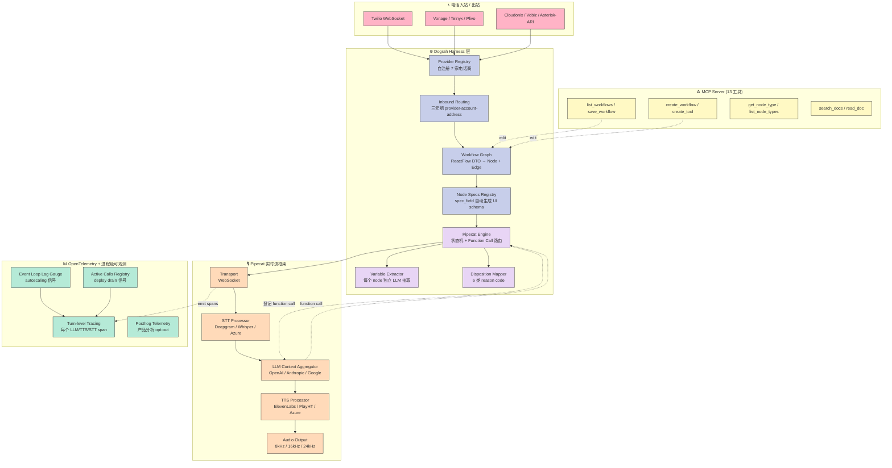
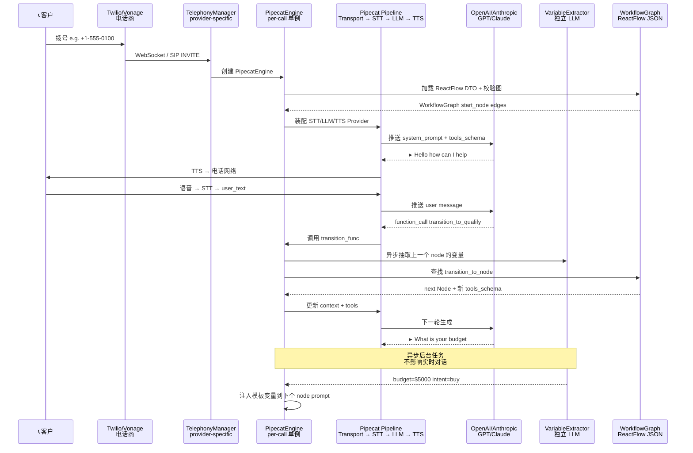
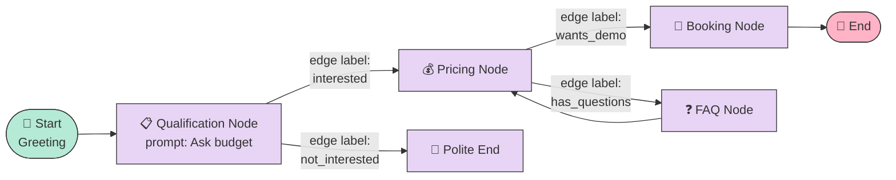
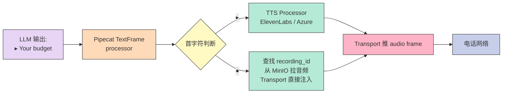
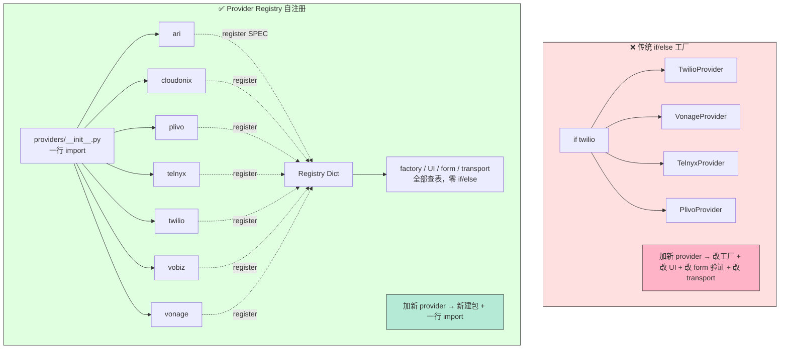

## 一、引子：Voice Agent 赛道的「SaaS 锁定」陷阱

2026 年的 Voice AI 商业格局几乎被两家美国公司**完全锁定**——Vapi 与 Retell。它们用极简的可视化构建器、模板化的 LLM/TTS/STT 集成、托管的电话号码，让开发者**五分钟上线一个电话机器人**。但代价同样明显：

- **源码不可见**：所有对话逻辑、prompt、function call 都跑在它们云端，调试只能看 transcript
- **数据不出门**：通话录音、PII、call disposition 全在 SaaS 厂内，合规与隐私问题让医疗/金融/政企客户直接被排除
- **每分钟计费**：每通电话 0.05–0.50 美元，1000 通/天 = 1500–15000 美元/月，规模化成本失控
- **集成锁定**：BYOK（自带 LLM 密钥）看似灵活，但 prompt template、variable extraction、webhook 都在它们系统内，迁出代价巨大

2026 年 9 月初 GitHub Trending 上一匹黑马悄然登顶：[dograh-hq/dograh](https://github.com/dograh-hq/dograh)——**BSD-2-Clause 开源、self-hostable、自带 MCP server、Twilio/Vonage/Telnyx/Plivo/Cloudonix/Asterisk-ARI 七家电话商开箱即用**。本文从架构、Provider Registry 自注册、Pipecat 之上的状态机、inbound routing 冲突检测、MCP for coding agent、并发可观测性 6 个角度，**完整拆解 Dograh 的工程实现**。

```text
2026-09-04 状态速读
⭐ 5,576 stars  ｜  🍴 1,361 forks  ｜  Python (FastAPI) + TypeScript UI + Docker
BSD-2-Clause  ｜  1,594 文件  ｜  Apache-2.0 (Pipecat) 上构建
7 家电话商：Twilio / Vonage / Telnyx / Plivo / Cloudonix / Vobiz / Asterisk-ARI
1 个可视化工作流（ReactFlow）+ 1 个 MCP Server + 1 套 Recording 标记协议
4 类 Provider 抽象：Telephony / LLM / STT / TTS
1 套可观测层：OpenTelemetry turn-level + event-loop lag gauge + active calls registry
```

**Dograh 的本质定位**：跑在电话网络（Telephony Provider）和 LLM 之间的**Voice Agent Harness 平台**——它把"如何让 LLM 听懂电话里的人在说什么并实时回应"这件事，做成了一个**可插拔、可自托管、可被 coding agent 直接编辑**的完整工程方案。

本文将从架构、Provider 自注册机制、Function-Call 状态机、In-band Routing、并发自托管设计、对比维度 6 个角度，**完整拆解 Dograh 的设计哲学与工程实现**。

---

## 二、项目定位与核心价值

### 2.1 一句话定义

> **Dograh** 是一个**基于 Pipecat 之上的开源 Voice Agent Harness 平台**，通过 Provider Registry 自注册式多商抽象、Function-Call 路由的可视化 Workflow、MCP Server 让 coding agent 直接编辑 workflow、OpenTelemetry turn-level tracing，实现「**BSD-2 开源 + Docker 一键部署 + 七家电话商即插即用 + Coding Agent 友好**」的 Vapi/Retell 替代方案。

### 2.2 能力矩阵

| 维度 | Dograh | Vapi | Retell |
|------|--------|------|--------|
| License | BSD-2-Clause | Proprietary | Proprietary |
| Self-hostable | ✅ Docker 一键 | ❌ SaaS only | ❌ SaaS only |
| 电话商 | 7 家（Twilio/Vonage/Telnyx/Plivo/Cloudonix/Vobiz/Asterisk-ARI） | 主要 Twilio | 主要 Twilio |
| BYOK 全栈 | LLM + STT + TTS + Telephony | LLM + STT + TTS 限定集 | 同上 |
| Coding Agent 接入 | ✅ MCP Server（13 个工具） | ❌ | ❌ |
| 工作流编辑 | ✅ ReactFlow 可视化 + node schema 自动生成 | 模板化 | 模板化 |
| 录音回放 | ✅ Recording 标记协议 + ●/▸ 双模式 | 需外接 | 需外接 |
| 变量抽取 | ✅ 每个 node 可独立配置 schema + LLM | 全局 | 全局 |
| 通话 disposition | ✅ 映射规则 + 6 类 reason code | 简单标签 | 简单标签 |
| Tracing | OpenTelemetry turn-level + event-loop lag | 黑盒 | 黑盒 |

### 2.3 仓库速览

```bash
dograh/
├── api/                            # FastAPI 后端（核心 1,397 行 PipecatEngine）
│   ├── services/
│   │   ├── workflow/                # 工作流引擎（graph + node specs + pipecat engine）
│   │   ├── telephony/               # 7 家电话商 Provider Registry + Factory
│   │   ├── gen_ai/                  # LLM/STT/TTS Embedding 服务抽象
│   │   ├── observability/           # 进程级可观测信号（active calls + loop lag）
│   │   └── pipecat/                 # Pipecat 框架的 tracing/transport 包装
│   ├── mcp_server/                  # MCP Server（13 工具：list_workflows / save_workflow / create_tool）
│   ├── db/                          # SQLAlchemy + Alembic（400+ 迁移）
│   └── routes/                      # FastAPI 路由
├── ui/                              # ReactFlow 可视化工作流编辑器
├── sdk/                             # Python + Node SDK
├── docker-compose.yaml              # 一键自托管（含 Postgres + Redis + MinIO）
└── deploy/                          # K8s / 远程部署脚本
```

**1,594 个文件中，核心引擎仅 5 个文件**：workflow_graph.py（445 行） + pipecat_engine.py（1397 行）+ pipecat_engine_context_composer.py（133 行）+ pipecat_engine_variable_extractor.py（136 行）+ workflow_graph.py 的 node_specs/。**Less is More 在这里被严格执行**。

---

## 三、整体架构：Pipecat 之上的「状态机 + Function Call」双层引擎

### 3.1 核心架构图

Dograh 不是从零实现实时语音 pipeline——它**完整复用 Pipecat 的实时流框架**（[pipecat-ai/pipecat](https://github.com/pipecat-ai/pipecat) ⭐15k），自己只做**两件事**：

1. **把可视化工作流（ReactFlow JSON）变成 Pipecat pipeline 配置**
2. **在每个 node 上挂「Function Call 路由」让 LLM 决定下一个 node**



**3 个关键设计哲学**：

1. **机制和策略分离**：Dograh 不实现 STT/TTS/LLM，只把它们抽象成可替换 Provider；Pipecat 提供实时流框架，Dograh 在其上构建状态机
2. **Provider 自注册**：新电话商只需在 `providers/__init__.py` 加一行 import，registry 自动发现——**业务代码完全不用改**
3. **In-band Function Call 路由**：LLM 通过 function call 决定跳到哪个 node，**无需图遍历算法**，LLM 本身就是状态机引擎

### 3.2 数据流：从电话呼入到 LLM 回复的完整链路



**关键观察**：

- **PipecatEngine 是 per-call 单例**——每通电话一个 engine 实例，生命周期 = 通话时长
- **Function Call = 路由协议**：LLM 通过 `transition_func` 这个动态生成的工具函数，**自主决定跳到哪个 node**——不需要 Dijkstra/BFS 这类图算法
- **Variable Extractor 是「out-of-band」LLM**——为了不影响实时对话延迟，用独立的 inference_llm 异步抽取变量

---

## 四、Provider Registry 自注册机制：零侵入扩展电话商

### 4.1 设计哲学

**问题**：7 家电话商（Twilio/Vonage/Telnyx/Plivo/Cloudonix/Vobiz/Asterisk-ARI）每家 API 都不一样。如果用传统的 `if provider == "twilio"` 分支，**加一家新电话商要改 7 个文件**。

**Dograh 的解法**：**Self-registering Provider Registry**——每个 provider 包在自己的 `__init__.py` 里 `register(SPEC)`，factory 只查表，**零 if/else**。

### 4.2 核心实现代码

**Step 1：Registry 数据结构**（`api/services/telephony/registry.py`）：

```python
from dataclasses import dataclass, field
from typing import Any, Awaitable, Callable, Dict, List, Optional, Type

@dataclass(frozen=True)
class ProviderSpec:
    """One row in the provider registry. Immutable so lookups are hash-stable."""
    name: str                              # 'twilio' / 'vonage' / 'ari'
    provider_cls: Type["TelephonyProvider"]
    config_loader: Callable[[Dict], Dict]  # DB row → provider ctor dict
    transport_factory: Callable            # provider-specific transport
    transport_sample_rate: int             # 8000 (telephony) / 16000 / 24000
    config_request_cls: Type[BaseModel]    # Pydantic form validation
    ui_metadata: "ProviderUIMetadata"      # auto-generated UI form
    account_id_credential_field: str       # inbound 路由键的字段

# 进程内单例字典：name → ProviderSpec
_REGISTRY: Dict[str, ProviderSpec] = {}

def register(spec: ProviderSpec) -> None:
    """Provider 包在 __init__.py 里调用一次. 重复注册覆盖并 warn."""
    if spec.name in _REGISTRY:
        logger.warning(f"Provider {spec.name} re-registered; overwriting")
    _REGISTRY[spec.name] = spec

def get(name: str) -> ProviderSpec:
    """Factory / audio_config / schemas / run_pipeline 全部走这里查表"""
    if name not in _REGISTRY:
        raise KeyError(f"Unknown provider: {name}. Registered: {list(_REGISTRY)}")
    return _REGISTRY[name]

def all_specs() -> List[ProviderSpec]:
    """UI 列举可用 provider 时遍历"""
    return list(_REGISTRY.values())
```

**Step 2：Twilio 包自注册**（`api/services/telephony/providers/twilio/__init__.py`）：

```python
"""Twilio telephony provider package."""

from api.services.telephony.registry import (
    ProviderSpec, ProviderUIField, ProviderUIMetadata, register,
)
from .config import TwilioConfigurationRequest
from .provider import TwilioProvider
from .transport import create_transport


def _config_loader(value: Dict[str, Any]) -> Dict[str, Any]:
    """DB 行 → provider 构造函数期望的标准 dict"""
    return {
        "provider": "twilio",
        "account_sid": value.get("account_sid"),
        "auth_token": value.get("auth_token"),
        "from_numbers": value.get("from_numbers", []),
        "amd_enabled": value.get("amd_enabled", False),
    }


_UI_METADATA = ProviderUIMetadata(
    display_name="Twilio",
    docs_url="https://docs.dograh.com/integrations/telephony/twilio",
    fields=[
        ProviderUIField(name="account_sid", label="Account SID",
                        type="text", sensitive=True),
        ProviderUIField(name="auth_token", label="Auth Token",
                        type="password", sensitive=True),
        ProviderUIField(name="from_numbers", label="Phone Numbers",
                        type="string-array"),
        ProviderUIField(name="amd_enabled", label="Answering Machine Detection",
                        type="boolean"),
    ],
)

SPEC = ProviderSpec(
    name="twilio",
    provider_cls=TwilioProvider,
    config_loader=_config_loader,
    transport_factory=create_transport,
    transport_sample_rate=8000,                 # 电话标准 8kHz
    config_request_cls=TwilioConfigurationRequest,
    ui_metadata=_UI_METADATA,
    account_id_credential_field="account_sid",   # 用于 inbound 路由键
)

register(SPEC)   # 关键一行: 包 import 时自动注册
```

**Step 3：触发自注册**（`api/services/telephony/providers/__init__.py`）：

```python
"""Importing this module triggers each provider package to register itself.
Adding a new provider requires exactly one new line below."""
from api.services.telephony.providers import (  # noqa: F401
    ari, cloudonix, plivo, telnyx, twilio, vobiz, vonage,
)
```

**关键洞察**：当 Python 解释器第一次 import `providers/__init__.py` 时，每个 provider 包的 `__init__.py` 都会被加载，每个包都会执行 `register(SPEC)`。**业务代码（factory / schemas / run_pipeline）完全不用知道有几个 provider**——它们只调 `registry.get(name)`。

### 4.3 Factory 解析：三种路由路径

`api/services/telephony/factory.py` 实现三种解析路径，但都通过 `registry.get` 查表，**没有 if/else**：

```python
async def load_telephony_config_by_id(
    telephony_configuration_id: int | str | None,
    organization_id: int,
) -> Dict[str, Any]:
    """路径 1: by active config id (outbound + websocket 一旦 run 上有 initial_context)"""
    try:
        resolved_cfg_id = int(telephony_configuration_id)
    except (TypeError, ValueError) as e:
        raise ValueError("telephony_configuration_id must be integer") from e
    if not organization_id:
        raise ValueError("organization_id is required")

    cfg = await TelephonyConfigurationModel.get_by_id(resolved_cfg_id, organization_id)
    spec = registry.get(cfg.provider)              # 查表
    return spec.config_loader(cfg.credentials)      # 用 provider 自带的 loader

async def resolve_inbound_by_account(
    provider_name: str, account_id: str, org_id: int
) -> Dict[str, Any]:
    """路径 2: 遍历 org 的所有 active configs, 按 (provider, account_id) 匹配"""
    cfgs = await TelephonyConfigurationModel.list_active(org_id, provider_name)
    for cfg in cfgs:
        spec = registry.get(cfg.provider)           # 同样查表
        credentials = cfg.credentials
        if credentials.get(spec.account_id_credential_field) == account_id:
            return spec.config_loader(credentials)
    raise LookupError(f"No inbound config for {provider_name}/{account_id}")
```

**对比传统 if/else 写法**：

```python
# ❌ 传统写法（Dograh 没采用）：加一家新电话商要改这里
def get_provider(name: str, cfg: dict):
    if name == "twilio":
        return TwilioProvider(account_sid=cfg["account_sid"], ...)
    elif name == "vonage":
        return VonageProvider(api_key=cfg["api_key"], ...)
    elif name == "telnyx":
        return TelnyxProvider(api_key=cfg["api_key"], ...)
    # ... 每加一家 +20 行
```

**关键设计原则**：

> Adding a new provider should not require any edit outside its own folder plus a single import line in providers/__init__.py.

—— `api/services/telephony/registry.py` 头注释直接写明了这个不变量。

---

## 五、Workflow Graph：把 ReactFlow JSON 变成可执行的 Pipecat Pipeline

### 5.1 工作流的数据结构

Dograh 的工作流是**ReactFlow 标准的 JSON**——前端用 ReactFlow 画节点和边，后端把它解析成 Python 对象。每个 node 是一段对话状态（如"问候"、"资格确认"、"报价"），每个 edge 是一个 LLM function call 候选。



### 5.2 WorkflowGraph 校验：图不变量的强制执行

`api/services/workflow/workflow_graph.py` 的构造函数**把"图是否合法"这件事从业务层下沉到数据层**——传入 DTO 时一次性校验，校验失败 raise。

```python
class WorkflowGraph:
    """All business invariants (acyclic, cardinality, etc.) are verified here."""

    def __init__(
        self,
        dto: ReactFlowDTO,
        *,
        skip_instance_constraints_for: Set[str] | None = None,
    ):
        # Build adjacency list from validated DTO nodes
        self.nodes: Dict[str, Node] = {
            n.id: Node(n.id, n.type, n.data) for n in dto.nodes
        }

        # Store all edges with back-references
        self.edges: List[Edge] = []
        for e in dto.edges:
            source_node = self.nodes[e.source]
            target_node = self.nodes[e.target]
            edge = Edge(id=e.id, source=e.source, target=e.target, data=e.data)
            self.edges.append(edge)
            source_node.out_edges.append(edge)
            source_node.out[target_node.id] = target_node

        self._validate_graph(skip_instance_constraints_for or set())

        # Pin start_node + global_node IDs
        self.start_node_id = [
            n.id for n in dto.nodes if n.type == NodeType.startNode.value
        ][0]
        try:
            self.global_node_id = [
                n.id for n in dto.nodes if n.type == NodeType.globalNode.value
            ][0]
        except IndexError:
            self.global_node_id = None

    def _validate_graph(self, skip_instance_constraints_for: Set[str]) -> None:
        errors: list[WorkflowError] = []

        # 1. 实例数约束: Workflow 必须恰好 1 个 Start Node
        errors.extend(
            validate_node_instance_constraints(
                [n.node_type for n in self.nodes.values()],
                skip_types=skip_instance_constraints_for,
            )
        )

        # 2. 每个 node 的入度/出度约束
        errors.extend(self._assert_connection_counts())

        # 3. Edge label 转 LLM function name 冲突检测
        #    同一 source_node 的两条 edge 用了相同 label → 同一 function name → 冲突
        errors.extend(
            validate_unique_transition_tool_names(
                (edge.id, edge.source, edge.label) for edge in self.edges
            )
        )

        # 4. 每个 node 自己的字段校验
        errors.extend(self._assert_node_configs())

        if errors:
            raise ValueError(errors)
```

**关键设计哲学**：

1. **校验下沉到数据结构**——上游（UI 保存、MCP server、AI 生成）只管传 DTO，**不变量由数据结构自己保证**
2. **Edge label = LLM function name**——边不是数据，是协议；它的 label 会被 `transition_tool_name()` 转成 `^[a-z0-9_]+$`，**两个相同 label 边会生成同名 function call，LLM 无法区分**——这就是为什么需要 `validate_unique_transition_tool_names`
3. **Graph constraints 来自 NodeSpec**——`spec.graph_constraints` 字段决定每种 node 的 min/max in-degree，所以新增 node 类型只需在 `node_specs/` 加一个文件

### 5.3 Node Spec 自动生成 UI schema

每个 node 类型的字段定义（Pydantic model + spec_field 元数据）会被自动转成 ReactFlow 节点配置 + MCP 工具 schema：

```python
# api/services/workflow/node_specs/_base.py
class PropertyType(str, Enum):
    """Bounded vocabulary of property types the renderer dispatches on.
    Adding a value here requires a matching arm in the frontend
    PropertyInput switch and (where relevant) the SDK codegen template."""
    string = "string"
    number = "number"
    boolean = "boolean"
    options = "options"           # single-select dropdown
    multi_options = "multi_options"
    fixed_collection = "fixed_collection"
    json = "json"
    tool_refs = "tool_refs"       # 引用已注册的工具（按 UUID）
    document_refs = "document_refs"
    recording_ref = "recording_ref"
    credential_ref = "credential_ref"
    mention_textarea = "mention_textarea"  # textarea with var mentions
    url = "url"


@dataclass(frozen=True)
class NodeSpec:
    """Serialized contract exposed to frontend, MCP tools, and SDKs."""
    name: str                              # agentNode / startNode / endNode
    display_name: str
    category: NodeCategory                 # call_node / global_node / trigger
    graph_constraints: Optional[GraphConstraints]   # min/max in/out degree
    properties: List[NodeProperty]         # 字段定义 带 Pydantic + spec_field 元数据


SPEC_VERSION = "1.0.0"   # wire schema 版本号, SDK 检测不匹配会 warn
```

**为什么这个设计值钱**：

- **前端不用 hardcode 节点类型**——`NodeSpec` 序列化成 JSON 后，前端的 AddNodePanel 自动渲染
- **MCP 工具能 inspect**——`get_node_type("agentNode")` 返回完整 schema，Coding agent 就能按字段填表新建 workflow
- **SDK 能 codegen**——Python/Node SDK 用同一份 `NodeSpec` 生成类型安全的 builder API

---

## 六、Pipecat Engine：Function Call 路由的状态机

### 6.1 核心思想：LLM 本身是状态机引擎

Dograh **不做图遍历算法**——它让 LLM 通过 function call **自己决定跳到哪个 node**。每个 outgoing edge 的 label 被编译成一个独立的 LLM function，**LLM 选择调用哪个 = 路由决策**。

### 6.2 真实代码：transition_func 工厂

`api/services/workflow/pipecat_engine.py` 第 ~320 行的 `_create_transition_func`：

```python
async def _create_transition_func(
    self,
    name: str,
    transition_to_node: str,
    transition_speech: Optional[str] = None,
    transition_speech_type: Optional[str] = None,
    transition_speech_recording_id: Optional[str] = None,
):
    """为每条 outgoing edge 生成一个 LLM function call handler.

    LLM 调用此函数 = 选择此 edge = 跳到 transition_to_node
    """
    async def transition_func(function_call_params: FunctionCallParams) -> None:
        logger.info(f"LLM Function Call EXECUTED: {name}")
        logger.info(f"Function: {name} -> transitioning to node: {transition_to_node}")

        try:
            # 1. 异步抽取上一个 node 的变量（不阻塞实时对话）
            await self._perform_variable_extraction_if_needed(
                self._current_node,
                run_in_background=self._run_transition_variable_extraction_in_background,
            )

            # 2. 播报过渡语（动态 TTS 或预录音）
            speech_type = transition_speech_type or "text"
            if (speech_type == "audio"
                and transition_speech_recording_id
                and self._fetch_recording_audio):
                self._queued_speech_mute_state = "waiting"
                result = await self._fetch_recording_audio(
                    recording_pk=int(transition_speech_recording_id)
                )
                if result:
                    await play_audio(
                        result.audio,
                        sample_rate=self._audio_config.pipeline_sample_rate
                        if self._audio_config else 16000,
                        queue_frame=self._transport_output.queue_frame,
                        transcript=result.transcript,
                        persist_to_logs=True,
                    )
            elif transition_speech:
                self._queued_speech_mute_state = "waiting"
                await self.task.queue_frame(
                    TTSSpeakFrame(transition_speech, append_to_context=False, persist_to_logs=True)
                )

            # 3. 切换到下一个 node（更新 LLM context + tools）
            await self.set_node(transition_to_node)

            async def on_context_updated() -> None:
                """Pipecat 框架在 function call result frame 写入 context 后回调.
                此时 set_node 已切 prompt, 新一轮 LLM generation 用新的 system_prompt."""
                pass

        except Exception as e:
            logger.error(f"Transition {name} failed: {e}")
            await self.end_call_with_reason(EndTaskReason.ERROR)

    return transition_func
```

**关键设计点**：

1. **每条 edge 一个独立 function**——`name` 就是 `transition_tool_name(edge.label)`，LLM 通过 function schema 知道有哪些选项
2. **抽取是 out-of-band**——`_perform_variable_extraction_if_needed` 在后台跑，不阻塞 transition
3. **过渡语可混合**——`text`（动态 TTS）和 `audio`（预录音）二选一，对应"●/▸ 标记协议"
4. **错误处理兜底**——任何 transition 失败 → `end_call_with_reason(ERROR)`，保证不会卡死

### 6.3 Recording 标记协议：● vs ▸ 双模式 TTS

Dograh 支持**预录音 + 动态 TTS 混合**——同一个 workflow 里某些过渡语是固定的录音（音色更好），另一些是动态生成的（个性化）。它用一个**单字符前缀协议**让 LLM 选择模式：

```python
# api/services/workflow/pipecat_engine_context_composer.py
RECORDING_MARKER = "●"   # Play pre-recorded audio
TTS_MARKER = "▸"          # Generate dynamic TTS text

RECORDING_RESPONSE_MODE_INSTRUCTIONS = """\
RESPONSE MODE INSTRUCTIONS - MANDATORY FORMAT:
Every response you generate MUST begin with exactly one response mode indicator.
You have two modes for responding:

1. DYNAMIC SPEECH (▸): Generate text that will be converted to speech by TTS.
   Format: ▸ followed by a space and your full spoken response. Nothing else.
   Example: ▸ Hello! How can I help you today?

2. PRE-RECORDED AUDIO (●): Play a pre-recorded audio message.
   Format: ● followed by a space followed by recording_id followed by provided transcript.
   Example: ● rec_greeting_01 [ Provided Transcript ]

RULES:
- Your response MUST start with either ▸ or ● as the very first character.
- For ▸ (dynamic speech): Follow with a space and your response ...
- For ● (pre-recorded audio): Follow with a space and recording_id ...
- Use ● when a pre-recorded message matches the situation well.
- Use ▸ when you need to generate a dynamic, contextual response.
- *NEVER* mix modes in a single response, since we rely on the markers to decide
  whether to play using TTS or Pre-recorded audio."""
```

**Pipecat 流解析流程**：



**对比传统方案**：

- **Vapi/Retell**：录音和 TTS 必须分开配置到不同节点，**不能在同一轮回复里混合**
- **Dograh**：LLM 自学"何时用哪种"，**一气呵成**——大幅降低 prompt engineering 复杂度

---

## 七、Inbound Routing：三元组路由键的冲突检测

### 7.1 问题：电话路由的"同一号码冲突"

电话 inbound 路由需要把来电映射到一个 org 的具体 config。Dograh 用**三元组 (provider, account_id, address)** 作为唯一键：

```python
# api/services/telephony/inbound_routing.py

def canonical_address(address: str, country_hint: Optional[str] = None) -> str:
    """E.164 规范化: +1-555-0100 / +15550100 / 555-0100 都归一为 +15550100"""
    return normalize_telephony_address(address, country_hint=country_hint).canonical


def routing_account_id(
    provider: str, credentials: Optional[Mapping[str, Any]]
) -> Optional[str]:
    """不同 provider 的账号字段不一样:
    Twilio → account_sid, Vonage → api_key, Cloudonix → bearer_token
    但抽象成统一的 routing_account_id() 函数"""
    spec = registry.get(provider)
    if spec is None or spec.account_id_credential_field is None:
        return None
    return credentials.get(spec.account_id_credential_field)
```

**为什么是三元组而不是单一字段**：

- 一个 Twilio 账号可以挂多个号码，每个号码路由到不同 org 的 config（如果它们共享 account_sid）
- 一个 Cloudonix 账号挂多个号码，每个号码属于不同 org
- **账号 ID + 号码 = 全局唯一**

### 7.2 冲突检测：每次写入前必跑

```python
class InboundRoutingConflictError(ValueError):
    def __init__(self, *, address, configuration_name, same_organization):
        self.address = address
        self.configuration_name = configuration_name
        self.same_organization = same_organization
        scope = (
            f"telephony configuration '{configuration_name}'"
            if same_organization
            else "another organization using the same provider account"
        )
        super().__init__(
            f"Phone number {address} is already registered under {scope}. "
            f"Inbound calls cannot be uniquely routed when the same number is "
            f"configured against the same provider account in more than one place."
        )


async def assert_no_inbound_routing_conflict(
    db: Any, org_id: int, provider: str, address_canonical: str,
    excluding_configuration_id: Optional[int] = None,
) -> None:
    """任何 create_phone_number / update_telephony_configuration 前必调"""
    rows = await db.list_active_telephony_configurations(provider)
    for cfg in rows:
        spec = registry.get(provider)
        account_id = routing_account_id(provider, cfg.credentials)
        if account_id is None:
            continue
        for phone in cfg.phone_numbers:
            if canonical_address(phone) == address_canonical:
                if excluding_configuration_id and cfg.id == excluding_configuration_id:
                    continue
                same_org = cfg.organization_id == org_id
                raise InboundRoutingConflictError(
                    address=address_canonical,
                    configuration_name=cfg.name,
                    same_organization=same_org,
                )
```

**模块头注释明确说明不变量**：

> Two operations can create or change a component of the key:
> - adding a phone number to a configuration — introduces address_normalized
> - changing a configuration's credentials — changes the account_id
> Any new caller of create_phone_number or update_telephony_configuration must call this module first — the invariant is enforced here and nowhere else.

—— **`assert_no_inbound_routing_conflict` 是唯一的不变量执行点**。

### 7.3 为什么这事很难做对

| 维度 | Dograh 解法 |
|------|------------|
| 跨 org 隔离 | 通过 `(provider, account_id, address)` 唯一索引，DB 层无 UNIQUE 约束时仍能保证 |
| 字段名差异 | `routing_account_id()` 函数按 provider spec 提取对应字段 |
| 地址规范化 | E.164 标准化，所有变体归一为同一字符串 |
| 错误信息可读 | 同 org 报配置名；跨 org 模糊化为"另一家 org 使用同一账号"（**不泄露 PII**） |
| 删除安全 | `excluding_configuration_id` 让 update 时不与自己冲突 |

---

## 八、Provider 注册式扩展：新增电话商只需一行

### 8.1 自注册 vs 工厂方法对比



### 8.2 实际新增电话商的步骤

假设要加一家新电话商「Bandwidth」：

```bash
# Step 1: 创建包结构
mkdir -p api/services/telephony/providers/bandwidth
touch api/services/telephony/providers/bandwidth/{__init__.py,config.py,provider.py,transport.py}
```

```python
# Step 2: 写配置 Pydantic (api/services/telephony/providers/bandwidth/config.py)
from pydantic import BaseModel

class BandwidthConfigurationRequest(BaseModel):
    account_id: str
    api_token: str
    from_numbers: list[str]
```

```python
# Step 3: 实现 Provider + Transport (provider.py / transport.py)
class BandwidthProvider:
    def __init__(self, account_id, api_token, from_numbers): ...

# Step 4: 注册 (api/services/telephony/providers/bandwidth/__init__.py)
from api.services.telephony.registry import (
    ProviderSpec, ProviderUIField, ProviderUIMetadata, register,
)
from .config import BandwidthConfigurationRequest
from .provider import BandwidthProvider
from .transport import create_transport

def _config_loader(value):
    return {
        "provider": "bandwidth",
        "account_id": value.get("account_id"),
        "api_token": value.get("api_token"),
        "from_numbers": value.get("from_numbers", []),
    }

_UI_METADATA = ProviderUIMetadata(
    display_name="Bandwidth",
    fields=[
        ProviderUIField(name="account_id", label="Account ID", type="text"),
        ProviderUIField(name="api_token", label="API Token", type="password", sensitive=True),
        ProviderUIField(name="from_numbers", label="Phone Numbers", type="string-array"),
    ],
)

SPEC = ProviderSpec(
    name="bandwidth",
    provider_cls=BandwidthProvider,
    config_loader=_config_loader,
    transport_factory=create_transport,
    transport_sample_rate=8000,
    config_request_cls=BandwidthConfigurationRequest,
    ui_metadata=_UI_METADATA,
    account_id_credential_field="account_id",
)
register(SPEC)

# Step 5: 在 providers/__init__.py 加一行
# from api.services.telephony.providers import (
#     ari, bandwidth, cloudonix, plivo, telnyx, twilio, vobiz, vonage,  # 加这一行
# )
```

**完成**——无需改 factory、UI、schema、run_pipeline。**业务代码完全不知道你加了 Bandwidth**。

---

## 九、MCP Server：让 Coding Agent 直接编辑 Workflow

### 9.1 为什么 Voice Agent 需要 MCP

Voice workflow 的痛点：**自然语言描述的复杂对话流**很难用表单配置。客服机器人需要「先用英文问候、若 5 秒无回应切换西班牙语、若提到价格则跳到折扣节点」——这种条件分支用表单配置会疯。

**Dograh 的解法**：通过 MCP（Model Context Protocol）暴露 13 个工具，让 Claude Code / Codex / Cursor 能**直接读、改、新建 workflow**。

### 9.2 MCP Server 实现

```python
# api/mcp_server/server.py
from fastmcp import FastMCP
from mcp.types import ToolAnnotations

from api.mcp_server.instructions import DOGRAH_MCP_INSTRUCTIONS
from api.mcp_server.tools.catalog import (
    list_credentials, list_documents, list_recordings, list_tools,
)
from api.mcp_server.tools.create_workflow import create_workflow
from api.mcp_server.tools.docs_search import list_docs, read_doc, search_docs
from api.mcp_server.tools.get_workflow_code import get_workflow_code
from api.mcp_server.tools.node_types import get_node_type, list_node_types
from api.mcp_server.tools.save_workflow import save_workflow
from api.mcp_server.tools.tool_creation import create_tool
from api.mcp_server.tools.voice_prompting_guide import get_voice_prompting_guide
from api.mcp_server.tools.workflows import get_workflow, list_workflows

mcp = FastMCP("dograh", instructions=DOGRAH_MCP_INSTRUCTIONS)

for _tool in (
    create_workflow, create_tool, get_node_type, get_workflow,
    get_workflow_code, list_credentials, list_documents, list_node_types,
    list_recordings, list_tools, list_workflows, save_workflow,
):
    mcp.tool(_tool)   # 注册 13 个工具
```

### 9.3 实战场景

**用户在 Claude Code 里输入**：

> 「帮我做一个客服机器人：先英文问候，若客户沉默 5 秒改西班牙语，若问到价格跳到折扣节点」

**Claude Code 通过 MCP 调用**：

```text
1. list_node_types()           → 拿到所有 node 类型 schema
2. get_node_type("startNode")  → 拿到 startNode 字段定义
3. create_workflow({           → 创建一个空 workflow
     name: "Multilingual Support Bot",
     start_node: { ... }
   })
4. save_workflow({             → 保存节点 1: Spanish fallback
     id: "wf_123",
     nodes: [...],
     edges: [...]
   })
5. get_workflow_code("wf_123") → 拿可读的 workflow JSON
```

**Dograh 的 README 也明确推荐这条路**：

> Prefer an AI agent to set it up for you? If you use **Claude Code** or **Codex**, install the official [Dograh setup skill](https://github.com/dograh-hq/dograh-plugins) and let your agent handle installation, configuration, and troubleshooting.

### 9.4 Tool Annotations：精细化权限控制

```python
_GUIDE_TOOL_ANNOTATIONS = ToolAnnotations(
    readOnlyHint=True,        # 只读
    idempotentHint=True,      # 幂等
    destructiveHint=False,    # 非破坏性
    openWorldHint=False,      # 不访问外部世界
)

mcp.tool(get_voice_prompting_guide, annotations=_GUIDE_TOOL_ANNOTATIONS)

_DOCS_TOOL_ANNOTATIONS = ToolAnnotations(
    readOnlyHint=True, idempotentHint=True,
    destructiveHint=False, openWorldHint=False,
)
for _tool in (list_docs, read_doc, search_docs):
    mcp.tool(_tool, annotations=_DOCS_TOOL_ANNOTATIONS)
```

**对比 Vapi/Retell**：**没有任何 MCP 集成**，所有 workflow 必须在它们的可视化编辑器里拖拽——这是 Dograh 拉开差距的关键功能。

---

## 十、可观测性：Turn-Level Tracing + 进程级 Lag Gauge

### 10.1 OpenTelemetry Turn-Level Tracing

Dograh 把每通电话的对话切分成「turn」（一轮用户输入 + LLM 回复 + TTS），每个 turn 一个 OTel span。**`api/services/pipecat/tracing_config.py`** 注册到 Pipecat pipeline：

```python
# pipecat_engine.py 里
def _get_otel_context(self):
    """Extract the OTel Context from the task's TracingContext.
    Returns the turn-level context if available, otherwise the
    conversation-level context, or None.
    """
    tracing_ctx: TracingContext | None = getattr(self.task, "_tracing_context", None)
    if not tracing_ctx:
        return None
    return tracing_ctx.get_turn_context() or tracing_ctx.get_conversation_context()
```

**为什么需要 turn-level 而不只是 conversation-level**：

- **debugging 单轮对话卡顿**：LLM 生成慢还是 TTS 合成慢？
- **A/B 测试不同 prompt**：哪个 prompt 让 STT→LLM 链路延迟更低？
- **per-call 计费**：用户为 turn 数还是时长付费？

### 10.2 进程级 Event Loop Lag

```python
# api/services/observability/loop_lag.py
"""Event-loop lag gauge; the per-pod saturation signal for autoscaling load tests.
Neither is domain logic: modules here observe the running process, they don't drive calls."""
```

这个 lag gauge **不是 Prometheus exporter**——它是个 Python 协程，定期检查 event loop 调度延迟，**给 K8s HPA 当 autoscaling 信号**：

```python
# 简化示意
import asyncio

async def measure_loop_lag():
    while True:
        start = time.monotonic()
        await asyncio.sleep(0.1)  # 计划 100ms 后唤醒
        actual_delay = time.monotonic() - start
        lag = max(0, actual_delay - 0.1)
        gauge.set(lag)   # 给 Prometheus / OpenTelemetry metrics 用
        await asyncio.sleep(0.9)  # 每秒 1 次
```

**为什么需要这个**：

- **CPU 争用检测**：如果多个并发电话在同一进程里跑，event loop 会卡
- **autoscaling 触发**：lag > 100ms → 横向扩容
- **负载测试验证**：dograh 自带 `evals/` 目录跑 load test，用这个 lag gauge 评估容量

### 10.3 Active Calls Registry：Drain 信号

```python
# api/services/observability/active_calls.py
"""In-process registry of live calls; the drain signal for deploys and scale-down."""

# 简化示意
class ActiveCallsRegistry:
    _registry: dict[str, datetime] = {}

    @classmethod
    def register(cls, call_id: str):
        cls._registry[call_id] = datetime.utcnow()

    @classmethod
    def unregister(cls, call_id: str):
        cls._registry.pop(call_id, None)

    @classmethod
    def active_count(cls) -> int:
        return len(cls._registry)
```

**部署时序**：

1. K8s 收到 SIGTERM
2. Pod 进入 `drain` 状态
3. Pod 停止接受新电话（健康检查失败）
4. 等 `active_count() == 0` 后才退出
5. **保证正在进行的通话不会被打断**

---

## 十一、并发可自托管设计

### 11.1 docker-compose 一键部署

```bash
curl -o docker-compose.yaml https://raw.githubusercontent.com/dograh-hq/dograh/main/docker-compose.yaml
curl -o start_docker.sh https://raw.githubusercontent.com/dograh-hq/dograh/main/scripts/start_docker.sh
chmod +x start_docker.sh
./start_docker.sh
```

**docker-compose 包含**：

```yaml
services:
  api:
    image: dograh/api
    depends_on: [postgres, redis, minio]
  ui:
    image: dograh/ui
    depends_on: [api]
  postgres:    # 工作流 + 通话记录
  redis:       # 实时会话状态
  minio:       # 录音文件 + 文档 RAG
  livekit:     # WebRTC transport（可选）
```

### 11.2 K8s 多副本部署

每个 Pod 跑独立的 Pipecat pipeline 集合；电话商 WebSocket 通过 sticky session 路由到同一 Pod。`Active Calls Registry` + `loop_lag` 给 K8s HPA 提供**真正可量化的饱和度信号**。

### 11.3 数据持久化

| 数据类型 | 存储 | 生命周期 |
|----------|------|----------|
| 工作流配置 | Postgres | 永久 |
| 通话记录 + transcript | Postgres | 永久（合规存档） |
| 录音文件 | MinIO / S3 | 30–90 天（可配） |
| 实时会话状态 | Redis | 会话期间 |
| Embedding 缓存 | Postgres | 永久 |

---

## 十二、与同类项目对比

### 12.1 vs Pipecat（Dograh 的底层）

| 维度 | Pipecat | Dograh |
|------|---------|--------|
| 定位 | 实时语音 pipeline 框架 | Voice Agent 平台 |
| 抽象层级 | Transport / Processor / Pipeline | Workflow / Node / Edge / Provider |
| 多电话商 | ❌ 自己接 | ✅ 7 家开箱即用 |
| 工作流编辑器 | ❌ 无 | ✅ ReactFlow 可视化 |
| 变量抽取 | ❌ 自己实现 | ✅ 每个 node 独立 schema |
| Coding Agent | ❌ 无 MCP | ✅ 13 工具 MCP |
| 自托管 | 容易（库） | 容易（Docker 一键） |
| 适合谁 | 想造语音平台的开发者 | 想 5 分钟上线电话机器人的团队 |

**关系**：Dograh = Pipecat + Workflow Engine + Provider Registry + MCP Server + UI。

### 12.2 vs LiveKit Agents

| 维度 | LiveKit Agents | Dograh |
|------|---------------|--------|
| 定位 | 多模态实时 AI 框架（voice + video + text） | Voice Agent 平台 |
| 传输 | LiveKit Cloud / 自托管 WebRTC | 直接电话商 WebSocket / SIP |
| 视频 | ✅ 原生支持 | ❌ 纯音频 |
| 电话商 | 第三方对接 | ✅ 7 家内置 |
| 工作流 | ❌ 自己实现状态机 | ✅ ReactFlow + Function Call 路由 |
| 适用 | 视频会议、多人游戏、远程协作 | 客服机器人、销售外呼、IVR 替代 |

### 12.3 vs TEN Framework

| 维度 | TEN Framework | Dograh |
|------|--------------|--------|
| 定位 | 语音 AI agent 编排框架 | Voice Agent Harness 平台 |
| 设计模式 | Graph + Extension | Workflow + Node + Function Call |
| 多电话商 | 第三方对接 | ✅ 7 家内置 |
| 开源 | Apache-2.0 | BSD-2-Clause |
| 目标用户 | 自定义 agent 框架 | 一键部署的电话机器人 |

### 12.4 vs Patter（开源 Vapi/Retell 替代）

| 维度 | Patter | Dograh |
|------|--------|--------|
| Stars | 1,047 | 5,576 |
| License | MIT | BSD-2 |
| 底层 | 自己实现 | Pipecat |
| 电话商 | 较少 | 7 家 |
| MCP | ❌ | ✅ |
| 工作流 | 简单状态 | ReactFlow 完整可视化 |
| 活跃度 | 中等 | 高（9 月初仍有更新） |

### 12.5 vs Vapi / Retell（SaaS 对照）

| 维度 | Vapi / Retell | Dograh |
|------|--------------|--------|
| 部署 | SaaS only | Self-hostable Docker |
| 源码 | 闭源 | BSD-2 全开源 |
| 数据 | 厂商云 | 你的基础设施 |
| 计费 | $0.05–0.50/分钟 | 0（仅基础设施成本） |
| BYOK | 限定集 | LLM + STT + TTS + Telephony 全栈 |
| Coding Agent | ❌ | ✅ MCP 13 工具 |
| 合规 | 黑盒 | 透明可审计 |
| 适合 | MVP 快速验证 | 规模化生产、政企合规 |

---

## 十三、优缺点深度分析

### 13.1 架构维度

**架构简洁性** ⭐⭐⭐⭐⭐

- **核心引擎仅 5 个文件**：workflow_graph.py（445 行） + pipecat_engine.py（1397 行）+ 3 个 helper
- **数据流单向**：ReactFlow DTO → WorkflowGraph → PipecatEngine → Pipecat pipeline
- **Provider 自注册**：加电话商不改业务代码
- **MCP Server 是 FastMCP 包装**：13 个工具 56 行代码注册

**架构可扩展性** ⭐⭐⭐⭐⭐

- **Provider Registry**：新电话商只需新建包 + 一行 import
- **NodeSpec 元数据驱动**：新 node 类型自动生成 UI + MCP schema
- **Workflow Graph DTO**：ReactFlow JSON 是事实标准，前端工具链丰富
- **Pipecat 上层抽象**：未来想换底层实时流框架，只需替换 pipecat_engine.py 的 ~1400 行

**架构易用性** ⭐⭐⭐⭐⭐

- **Docker 一键部署**：curl + chmod + start
- **No-code 可视化**：非工程师也能配工作流
- **Coding Agent 友好**：MCP + node schema 自动生成
- **SDK 双语言**：Python + Node SDK

### 13.2 工程维度

**性能** ⭐⭐⭐⭐

- **复用 Pipecat**：底层延迟由 Pipecat 决定（sub-500ms end-to-end）
- **Out-of-band 变量抽取**：不影响实时对话延迟
- **Turn-level OTel**：可量化每个 turn 的瓶颈
- **但**：BSD-2 + Pipecat Apache-2.0 链路长，debug 时需跨多个仓库

**复杂度** ⭐⭐⭐

- **1594 个文件**：DB 迁移就有 ~150 个 Alembic 文件
- **学习曲线陡**：要懂 Pipecat + ReactFlow + FastMCP + Pipecat pipeline 概念
- **多 Provider 矩阵**：7 家电话商 × 4 类 LLM × 3 家 STT × 3 家 TTS = 252 种组合，**测试覆盖挑战大**
- **录音 + TTS 双协议**：●/▸ 标记需要前端 + LLM prompt + parser 三处一致

**维护性** ⭐⭐⭐⭐

- **Self-registering 模式**：加 provider 不改业务代码
- **Workflow 不变量下沉到数据结构**：上游 UI/MCP 不用重复实现
- **OpenTelemetry 全链路**：debug 路径清晰
- **但**：跨多个仓库的依赖（Pipecat/FastMCP/LiveKit），版本升级需谨慎

### 13.3 横向对比矩阵

| 维度 | 架构简洁性 | 扩展性 | 易用性 | 性能 | 复杂度 | 维护性 |
|------|----------|--------|--------|------|--------|--------|
| **Dograh** | ⭐⭐⭐⭐⭐ | ⭐⭐⭐⭐⭐ | ⭐⭐⭐⭐⭐ | ⭐⭐⭐⭐ | ⭐⭐⭐ | ⭐⭐⭐⭐ |
| Pipecat | ⭐⭐⭐⭐ | ⭐⭐⭐⭐ | ⭐⭐⭐ | ⭐⭐⭐⭐⭐ | ⭐⭐⭐⭐ | ⭐⭐⭐⭐ |
| LiveKit Agents | ⭐⭐⭐ | ⭐⭐⭐⭐ | ⭐⭐⭐⭐ | ⭐⭐⭐⭐⭐ | ⭐⭐⭐ | ⭐⭐⭐ |
| TEN Framework | ⭐⭐⭐ | ⭐⭐⭐⭐ | ⭐⭐⭐ | ⭐⭐⭐⭐ | ⭐⭐⭐ | ⭐⭐⭐ |
| Vapi（闭源） | N/A | ⭐⭐⭐ | ⭐⭐⭐⭐⭐ | ⭐⭐⭐⭐ | N/A | N/A |
| 自己造轮子 | ⭐⭐ | ⭐⭐ | ⭐ | 取决于 | ⭐⭐⭐⭐⭐ | ⭐⭐ |

---

## 十四、从零搭建启示：MVP 三步走

### 14.1 第一步：基础 Pipeline（1–2 天）

复用 Pipecat + 1 个电话商（推荐 Twilio），搭最小可运行 pipeline：

```python
# minimal_mvp.py
import asyncio
from pipecat.pipeline.pipeline import Pipeline
from pipecat.transports.services.twilio import TwilioTransport
from pipecat.services.deepgram import DeepgramSTTService
from pipecat.services.openai import OpenAILLMService
from pipecat.services.elevenlabs import ElevenLabsTTSService

async def main():
    transport = TwilioTransport(...)
    stt = DeepgramSTTService(api_key=...)
    llm = OpenAILLMService(api_key=..., model="gpt-4o")
    tts = ElevenLabsTTSService(api_key=...)

    pipeline = Pipeline([transport.input(), stt, llm, tts, transport.output()])
    await pipeline.run()

asyncio.run(main())
```

**踩坑预警**：

- Twilio 用 8kHz μ-law 编码，Pipecat transport 会自动重采样到 16kHz 给 STT
- WebSocket 必须用 `wss://` 不能用 `ws://`
- Twilio 5 秒静默会自动断电话，**STT 静音检测要小心**

### 14.2 第二步：Workflow 引擎（3–5 天）

在 Pipecat 之上加 WorkflowGraph + Function Call 路由：

```python
# workflow_engine.py
import re
from dataclasses import dataclass, field
from typing import Dict, List, Set, Optional

@dataclass
class Node:
    id: str
    type: str                    # start / agent / end
    prompt: str
    edges: List["Edge"] = field(default_factory=list)

@dataclass
class Edge:
    id: str
    source: str
    target: str
    label: str                   # LLM function name

class WorkflowGraph:
    """Validate ReactFlow DTO; expose start_node + outgoing edges as functions."""

    def __init__(self, nodes: List[Node], edges: List[Edge]):
        self.nodes = {n.id: n for n in nodes}
        self.edges = edges
        self._validate_acyclic()
        self._validate_unique_labels()
        self.start_node_id = next(n.id for n in nodes if n.type == "start")

    def get_functions_for_node(self, node_id: str) -> List[dict]:
        """Return LLM tool schemas for outgoing edges."""
        node = self.nodes[node_id]
        return [{
            "type": "function",
            "function": {
                "name": self._label_to_fn(edge.label),
                "description": f"Transition when {edge.label}",
                "parameters": {"type": "object", "properties": {}},
            }
        } for edge in node.edges]

    @staticmethod
    def _label_to_fn(label: str) -> str:
        return re.sub(r"[^a-z0-9]", "_", label.lower())

    def _validate_acyclic(self):
        color = {}
        def dfs(nid):
            if color.get(nid) == "gray":
                raise ValueError(f"Cycle at {nid}")
            if color.get(nid) == "black":
                return
            color[nid] = "gray"
            for e in self.nodes[nid].edges:
                dfs(e.target)
            color[nid] = "black"
        for nid in self.nodes:
            dfs(nid)

    def _validate_unique_labels(self):
        per_source = {}
        for e in self.edges:
            fn = self._label_to_fn(e.label)
            per_source.setdefault((e.source, fn), []).append(e.id)
        for (src, fn), ids in per_source.items():
            if len(ids) > 1:
                raise ValueError(f"Duplicate function name {fn} from {src}: {ids}")
```

### 14.3 第三步：Provider Registry + MCP（1–2 周）

加电话商抽象 + MCP server，让 coding agent 能编辑 workflow：

```python
# provider_registry.py
from dataclasses import dataclass
from typing import Callable, Dict, TYPE_CHECKING

@dataclass(frozen=True)
class ProviderSpec:
    name: str
    factory: Callable[[dict], "Provider"]
    sample_rate: int
    account_field: str

_REGISTRY: Dict[str, ProviderSpec] = {}

def register(spec: ProviderSpec):
    _REGISTRY[spec.name] = spec

def get(name: str) -> ProviderSpec:
    return _REGISTRY[name]

# 每个 provider 包在自己 __init__.py 里 register(SPEC(...))

# mcp_server.py
from fastmcp import FastMCP
mcp = FastMCP("my_voice_platform")
mcp.tool(list_workflows)
mcp.tool(save_workflow)
mcp.tool(create_workflow)
```

**踩坑预警**：

- **Provider 自注册**用 import side effect，但要注意**循环 import**
- **MCP tool schema** 必须与 ReactFlow node schema **完全同步**——否则 coding agent 生成的工作流会被 `WorkflowGraph` 校验拒绝
- **电话商 SIP 配置**：Asterisk-ARI 的 inbound 路由键完全不同（按 channel ID），不能和 Twilio 共用 `routing_account_id` 函数
- **录音文件存储**：MinIO bucket 名建议按 org_id 隔离，否则合规审计时很难分清
- **Turn-level OTel**：记得给每个 STT/LLM/TTS span 加 `call.id` 属性，否则 trace 串不起来

---

## 十五、总结：Harness Engineering 的 Voice Agent 范式

Dograh 给所有做 Voice Agent Harness 的团队树立了一个**清晰的设计范式**：

### 15.1 5 大核心原则

1. **复用底层实时框架**——不要从零实现 STT/LLM/TTS pipeline，Pipecat/LiveKit 帮你做对了
2. **Provider 自注册**——`register(SPEC)` + 一行 import，零侵入扩展
3. **Workflow 不变量下沉到数据结构**——`WorkflowGraph.__init__` 校验一切，上游 UI/MCP 不重复实现
4. **LLM 是状态机引擎**——Function Call 路由取代图遍历算法
5. **Coding Agent 是头等公民**——MCP Server 让 workflow 可被编程生成

### 15.2 与 Vapi/Retell 的本质差异

| 维度 | Vapi/Retell | Dograh |
|------|------------|--------|
| 哲学 | SaaS 平台 | Harness 工具集 |
| 商业模式 | 按分钟计费 | 自托管零成本 |
| 扩展性 | 平台方控制 | 用户控制（自注册 provider + 自定义 node） |
| 透明度 | 黑盒 | BSD-2 全开源 + OTel 可观测 |
| 数据主权 | 厂商云 | 用户基础设施 |

### 15.3 一句话推荐

> **如果你的语音机器人 MVP 要在 1 周内上线、未来要规模化到 1000+ 并发电话、需要合规存档、且团队有 Python 工程师**——**Dograh 是 2026 年开源 Voice Agent Harness 的最优解**。

如果你只是 5 分钟 demo、不在乎数据主权、合规可外包——**Vapi/Retell 更省事**。

如果你要造底层实时流框架、想做差异化（多模态、视频会议、远程协作）——**Pipecat + LiveKit 是上游依赖，不是竞争者**。

---

## 附录：参考资源

- **Dograh 仓库**：https://github.com/dograh-hq/dograh
- **Pipecat 底层框架**：https://github.com/pipecat-ai/pipecat
- **LiveKit Agents**：https://github.com/livekit/agents
- **MCP 协议**：https://modelcontextprotocol.io
- **ReactFlow 编辑器**：https://reactflow.dev
- **OpenTelemetry Pipecat 集成**：https://pipecat.ai/docs/guides/features/tracing/

