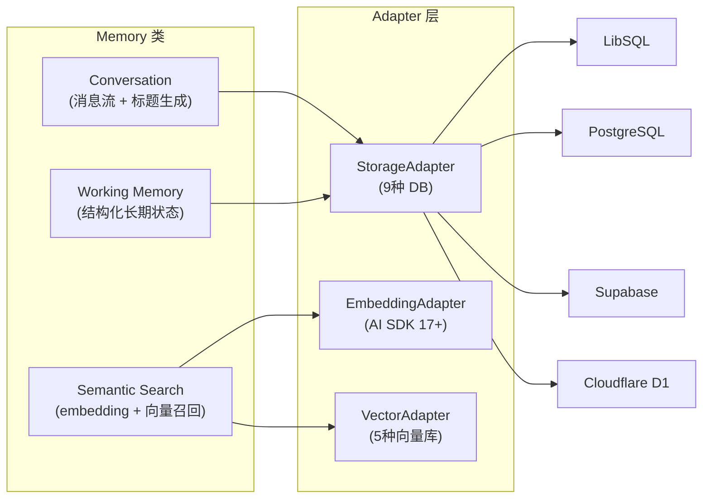
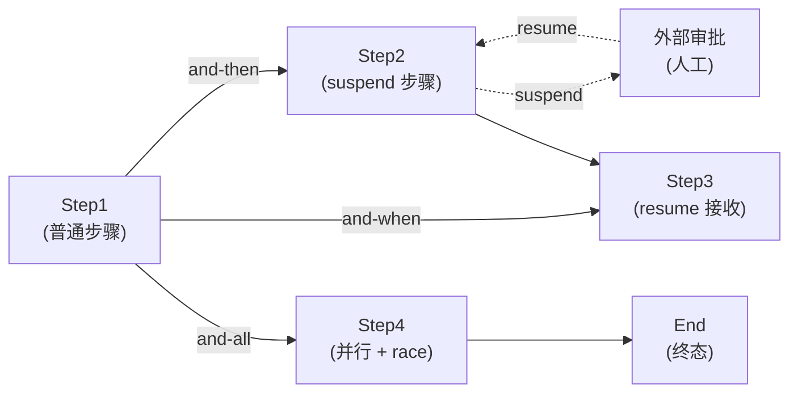
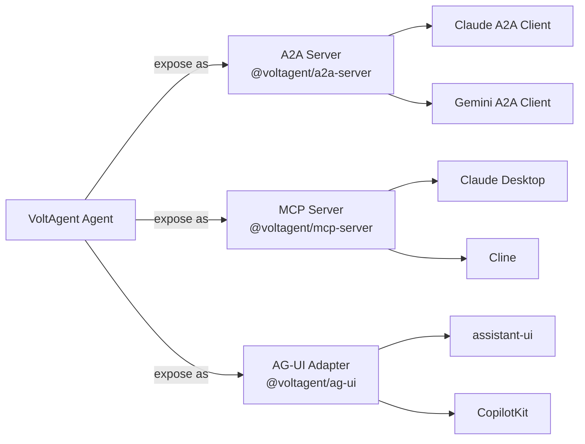
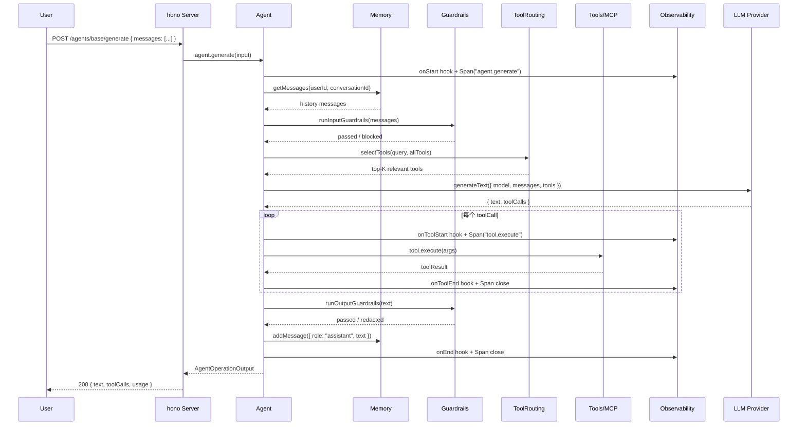

## 引子

2024 年起，AI Agent 框架赛道进入"百团大战"。Python 阵营有 LangGraph、CrewAI、AutoGen、OpenAI-Agents-SDK；TypeScript 阵营长期缺位——直到 **VoltAgent** 出现。

[VoltAgent/voltagent](https://github.com/VoltAgent/voltagent)（⭐10,539，MIT，全 TypeScript）是 2026 年最值得关注的 TypeScript AI Agent 框架。它的核心定位是：

> **「让 TypeScript 开发者用最熟悉的语言、最现代的工具链，搭出生产级 AI Agent 系统。」**

它和 Dify、bisheng、Flowise 等"可视化低代码平台"**完全正交**——VoltAgent 是 **100% 代码优先** 的框架，30+ 个 npm 包覆盖从 LLM Provider、MCP 客户端、工作流引擎、记忆系统、可观测性、语音、Guardrail、Eval 的完整工业链条。本文将深入剖析其核心架构。

## 项目定位与核心价值

### 一句话定义

**VoltAgent 是一个端到端 TypeScript AI Agent 工程平台，由开源核心框架（`@voltagent/core` + 30+ 包）和云端 VoltOps 控制台（观测/部署/评估）两层组成。**

### 能力矩阵

| 维度 | VoltAgent 覆盖 |
|------|----------------|
| LLM Provider | 17+ 官方适配（OpenAI、Anthropic、Google、Mistral、Groq、DeepInfra、Cerebras、xAI、Together、Perplexity、Cohere、Vertex、Azure、Bedrock、Workers AI、SAP AI、GitLab AI）+ 自定义 AI SDK Provider |
| 工具集成 | MCP Client + MCP Authorization + Tool Routing（embedding 检索）+ 自定义 ToolKit |
| 记忆 | Conversation Buffer + Working Memory + Vector Memory（Semantic Search）+ 9 种 Storage Adapter + 5 种 Vector Adapter |
| 工作流 | Workflow Core（chain + suspend/resume + time-travel）+ 状态机 + and-then/and-when/and-all 三向分支 |
| 协议 | MCP Client + MCP Server + A2A Server + AG-UI 适配 |
| 可观测性 | OpenTelemetry + 自研 WebSocket SpanProcessor + Local Storage + OTLP Export + Serverless 模式 |
| 部署 | `@voltagent/server-hono` / `@voltagent/server-elysia` / `@voltagent/serverless-hono` + Cloudflare Workers |
| 安全 | Input/Output Guardrails（11 个内置）+ Middleware + Prompt Injection 检测 |
| 评估 | Eval 评分 + Scorer + SamplingPolicy |
| 语音 | Voice Provider 抽象（OpenAI/11 Labs 等） |
| 多 Agent | Supervisor + Sub-Agent + Handoff + 委托链 |

### 仓库统计

| 指标 | 值 |
|------|----|
| Stars | 10,539 |
| License | MIT |
| 主语言 | TypeScript 100% |
| 包数量 | 34 个 npm 包（`packages/`） |
| examples/ | 60+ 个示例（`examples/`） |
| pushed_at | 2026-08-27（活跃） |
| 设计文档 | DESIGN.md 27KB |
| 核心代码 | `agent.ts` 311KB / `workflow/core.ts` 141KB / `memory/index.ts` 38KB |

## 整体架构

VoltAgent 采用 **「Framework + Console」** 双层结构，但本文聚焦于开源层。开源层本身是一个 monorepo，由 `@voltagent/core`（核心）+ 30+ 周边包（Provider / Storage / Server / Voice / Voice / Eval / Scorer / Voice 等）组成：

```mermaid
flowchart TB
    subgraph User["用户层"]
        Dev["TypeScript 开发者<br/>(npm install @voltagent/core)"]
        Prod["生产用户<br/>(VoltOps Console Cloud/Self-Host)"]
    end

    subgraph Core["核心层 @voltagent/core"]
        Agent["Agent<br/>(主类，~28000 行)"]
        Memory["Memory<br/>(Conversation + Vector + Working)"]
        Workflow["Workflow Core<br/>(chain.ts + core.ts + suspend)"]
        Tool["Tool Manager<br/>(Toolkit + ProviderTool + Routing)"]
        MCP["MCP Registry<br/>(client/server/authorization)"]
        Obs["Observability<br/>(OpenTelemetry + 自研)"]
        Guard["Guardrails<br/>(Input/Output 11 类)"]
        Eval["Eval<br/>(Scorers + 采样策略)"]
        Reg2["Registries<br/>(Agent + Provider)"]
    end

    subgraph Pkg["周边包 30+"]
        AI["AI SDK<br/>17+ Provider"]
        Storage["Storage Adapter<br/>LibSQL/Postgres/Supabase/InMemory"]
        Vector["VectorAdapter<br/>pgvector/LibSQL/Chroma/Qdrant"]
        Server["Server<br/>hono/elysia/serverless"]
        Voice["Voice<br/>OpenAI/ElevenLabs"]
        A2A["A2A Server<br/>@voltagent/a2a-server"]
        AGUI["AG-UI Adapter<br/>@voltagent/ag-ui"]
        Sandbox["Sandbox<br/>E2B/Daytona/Blaxel"]
        Scorer["Scorers<br/>@voltagent/scorers"]
        EvalPkg["Evals<br/>@voltagent/evals"]
    end

    subgraph Infra["基础设施"]
        OTel["OpenTelemetry<br/>Trace + Logs"]
        WS["WebSocket<br/>实时推送"]
        OTLP["OTLP<br/>远程导出"]
        LS["LocalStorage<br/>SpanProcessor"]
    end

    Dev --> Agent
    Dev --> Memory
    Dev --> Workflow
    Dev --> Tool
    Dev --> MCP

    Agent --> AI
    Agent --> Memory
    Agent --> Tool
    Agent --> Workflow
    Agent --> Obs
    Agent --> Guard

    Memory --> Storage
    Memory --> Vector

    MCP --> A2A
    MCP --> AGUI
    MCP --> Sandbox

    Obs --> OTel
    Obs --> WS
    Obs --> OTLP
    Obs --> LS

    Prod -.telemetry.-> Obs
```



### Monorepo 布局（30+ packages）

| 包名 | 职责 |
|------|------|
| `@voltagent/core` | Agent / Memory / Workflow / MCP / Observability 核心 |
| `@voltagent/internal` | 内部类型 + 工具函数 |
| `@voltagent/anthropic-ai` / `google-ai` / `groq-ai` | Provider 适配（虽然 core 已直连 AI SDK） |
| `@voltagent/postgres` / `libsql` / `supabase` | Storage Adapter |
| `@voltagent/cloudflare-d1` | Cloudflare D1 适配 |
| `@voltagent/voice` | 语音抽象 |
| `@voltagent/mcp-server` | 把 Agent 暴露为 MCP Server |
| `@voltagent/a2a-server` | 把 Agent 暴露为 A2A Server |
| `@voltagent/ag-ui` | AG-UI 协议适配 |
| `@voltagent/server-hono` / `server-elysia` / `serverless-hono` | HTTP Server |
| `@voltagent/scorers` / `evals` | 评估 |
| `@voltagent/sandbox-e2b` / `sandbox-daytona` / `sandbox-blaxel` | 沙盒执行 |
| `@voltagent/logger` / `langfuse-exporter` / `vercel-ai-exporter` | 生态集成 |
| `@voltagent/cli` / `create-voltagent-app` | 脚手架 |
| `@voltagent/docs-mcp` | 文档 MCP Server |
| `@voltagent/resumable-streams` | 流式响应持久化 |

## 核心引擎一：Agent 主类

`@voltagent/core` 的核心是 `packages/core/src/agent/agent.ts`——单文件 311KB、~28,000 行（**全仓库最大单文件**），承载了 Agent 的所有生命周期逻辑。

### Agent 构造与初始化

```python
// 来自 examples/base/src/index.ts:1-36
import { Agent, Memory, VoltAgent } from "@voltagent/core";
import { LibSQLMemoryAdapter, LibSQLVectorAdapter } from "@voltagent/libsql";
import { createPinoLogger } from "@voltagent/logger";
import { honoServer } from "@voltagent/server-hono";

const logger = createPinoLogger({ name: "base", level: "info" });

const memory = new Memory({
  storage: new LibSQLMemoryAdapter(),
  embedding: "openai/text-embedding-3-small",  // 字符串会被自动包装为 AiSdkEmbeddingAdapter
  vector: new LibSQLVectorAdapter(),
  generateTitle: true,  // 对话自动生成标题
});

const agent = new Agent({
  name: "Base Agent",
  instructions: "You are a helpful assistant.",
  model: "openai/gpt-4o-mini",  // Vercel AI SDK 协议
  memory: memory,
});

new VoltAgent({
  agents: { agent },
  server: honoServer(),
  logger,
});
```

### Provider 三级抽象（Vercel AI SDK 适配）

VoltAgent 直接基于 Vercel AI SDK 构建，所以其 Provider 体系是**「字符串 → AI SDK Model → Volts 包装」三级抽象：

```typescript
// 来自 packages/core/src/memory/index.ts:32-58
const isEmbeddingAdapter = (value: EmbeddingAdapterInput): value is EmbeddingAdapter =>
  typeof value === "object" &&
  value !== null &&
  "embed" in value &&
  typeof (value as EmbeddingAdapter).embed === "function" &&
  "embedBatch" in value &&
  typeof (value as EmbeddingAdapter).embedBatch === "function";

const isEmbeddingAdapterConfig = (value: EmbeddingAdapterInput): value is EmbeddingAdapterConfig =>
  typeof value === "object" && value !== null && "model" in value && !isEmbeddingAdapter(value);

const resolveEmbeddingAdapter = (
  embedding?: EmbeddingAdapterInput,
): EmbeddingAdapter | undefined => {
  if (!embedding) return undefined;
  if (isEmbeddingAdapter(embedding)) return embedding;  // 已构造的 adapter
  if (typeof embedding === "string") {
    return new AiSdkEmbeddingAdapter(embedding);  // 字符串简写
  }
  if (isEmbeddingAdapterConfig(embedding)) {
    const { model, ...options } = embedding;
    return new AiSdkEmbeddingAdapter(model, options);
  }
  return new AiSdkEmbeddingAdapter(embedding);
};
```

**关键设计**：

1. **字符串简写**（`embedding: "openai/text-embedding-3-small"`）→ 自动包装为 `AiSdkEmbeddingAdapter`。
2. **已构造对象** → 直接复用。
3. **Config 对象** → 拆出 `model` + `options` 构造。

这种「接受多种形态输入」的 resolver 模式，让 API 同时支持 5 行快速启动 和 50 行精细配置。

### Agent 主循环（generate/stream）

VoltAgent 在 AI SDK 的 `generateText` / `streamText` 之上封装了一层：

```typescript
// 来自 packages/core/src/agent/agent.ts:1-30
import {
  generateText,
  streamText,
  generateObject,
  streamObject,
  consumeStream,
  createUIMessageStream,
  createUIMessageStreamResponse,
  convertToModelMessages,
  // ... AI SDK 完整 API
} from "ai";

// VoltAgent Agent 类内部循环（简化）：
class Agent {
  async generate(input, opts) {
    // 1. 加载记忆：getMessages → 注入 messages
    // 2. 应用 Guardrails：input middleware 链
    // 3. AI SDK generateText({ model, messages, tools, ... })
    // 4. Tool routing：tools 超过 50 → 触发 embedding 检索
    // 5. 工具执行：tool.execute() 走 ToolManager
    // 6. Output guardrails：输出 middleware 链
    // 7. 保存记忆：addMessage
    // 8. 触发钩子：onEnd / onToolEnd
    // 9. 返回 AgentOperationOutput（标准化输出）
  }

  async stream(input, opts) {
    // 类似 generate，但使用 streamText + createUIMessageStream
    // UIMessage 流式协议，便于前端 useChat 钩子直接消费
  }
}
```

**4 个关键技术点**：

1. **AI SDK UIMessage 协议** — VoltAgent 全面采用 Vercel AI SDK v6 的 `UIMessage` 流式协议，可直接被 `@assistant-ui/react`、`@copilotkit/react` 等前端库消费。
2. **Tool Routing 自动触发** — 当 Tool 数量 > 阈值（默认 50），自动启用 embedding 检索，只把相关的 5-10 个 tool 发给 LLM（详见下文「工具路由」）。
3. **Guardrails 双层** — Input Guardrails 在调用前拦截恶意消息；Output Guardrails 在响应后过滤 PII / 越权内容。
4. **钩子 11 个时机** — `onStart / onEnd / onHandoff / onHandoffComplete / onToolStart / onToolEnd / onToolError / onPrepareMessages / ...`（详见下方「Agent 钩子」）。

### Agent 钩子（11 时机）

VoltAgent 通过 `AgentHooks` 接口暴露 11 个生命周期钩子：

```typescript
// 来自 packages/core/src/agent/hooks/index.ts:1-80
export interface AgentHooks {
  // === 生命周期 ===
  onStart?: (args: OnStartHookArgs) => Promise<void> | void;       // 开始一次 generate/stream
  onEnd?: (args: OnEndHookArgs) => Promise<void> | void;           // 结束（含错误）

  // === 消息准备 ===
  onPrepareMessages?: (args: OnPrepareMessagesHookArgs) => ...;    // 在发给 LLM 前最后改 messages

  // === 工具调用 ===
  onToolStart?: (args: OnToolStartHookArgs) => ...;                // 工具开始执行
  onToolEnd?: (args: OnToolEndHookArgs) => OnToolEndHookResult | ...;  // 工具成功结束（可替换 output）
  onToolError?: (args: OnToolErrorHookArgs) => OnToolErrorHookResult | ...;  // 工具失败（可替换 error payload）

  // === Handoff（多 Agent 委托） ===
  onHandoff?: (args: OnHandoffHookArgs) => ...;                    // 主管 Agent 委派给 Sub-Agent
  onHandoffComplete?: (args: OnHandoffCompleteHookArgs) => ...;    // Sub-Agent 完成（可 bail() 跳过主管处理）
}
```

**亮点：`OnHandoffCompleteHookArgs.bail()`** — 让 Sub-Agent 完成时**绕过** Supervisor 后处理，直接返回结果。VoltAgent 给每个钩子单独定义了 Arg 接口（**不用泛型 tuple**，避免 7+ 个泛型参数的 ergonomics 灾难），代码可读性极强。

## 核心引擎二：Memory 系统

`packages/core/src/memory/index.ts` 是 VoltAgent 记忆系统的主类（38KB / ~1500 行）。

### Memory 类结构

```typescript
// 来自 packages/core/src/memory/index.ts:68-110
export class Memory {
  private readonly storage: StorageAdapter;
  private readonly embedding?: EmbeddingAdapter;
  private readonly vector?: VectorAdapter;
  private embeddingCache?: BatchEmbeddingCache;  // 批量 embedding 缓存
  private readonly workingMemoryConfig?: WorkingMemoryConfig;
  private readonly titleGenerationConfig?: MemoryConfig["generateTitle"];

  private resourceId?: string;
  private logger?: Logger;

  constructor(options: MemoryConfig) {
    this.storage = options.storage;
    this.embedding = resolveEmbeddingAdapter(options.embedding);
    this.vector = options.vector;
    this.workingMemoryConfig = options.workingMemory;
    this.titleGenerationConfig = options.generateTitle;

    if (options.enableCache && this.embedding) {
      this.embeddingCache = new BatchEmbeddingCache(
        options.cacheSize ?? 1000,
        options.cacheTTL ?? 3600000,  // 默认 1 小时 TTL
      );
    }
  }

  async getMessages(userId, conversationId, options?, context?) {
    return this.storage.getMessages(userId, conversationId, options, context);
  }

  async addMessage(message, userId, conversationId, context?) {
    if (this.embedding && this.vector) {
      await this.embedAndStoreMessage(message, userId, conversationId);  // 自动 embedding 入库
    }
    // ...
  }
}
```

**三大子系统**：



### 9 种 Storage Adapter

| Adapter | 包 | 适用场景 |
|---------|----|---------|
| `LibSQLMemoryAdapter` | `@voltagent/libsql` | 本地 / Turso / SQLite |
| `PostgresMemoryAdapter` | `@voltagent/postgres` | 自托管 PG |
| `SupabaseMemoryAdapter` | `@voltagent/supabase` | Supabase BaaS |
| `CloudflareD1MemoryAdapter` | `@voltagent/cloudflare-d1` | Edge 部署 |
| `InMemoryStorageAdapter` | `core` 内置 | 测试 / 原型 |
| 自定义 | `StorageAdapter` 接口 | 任何 KV/SQL |

### 工作记忆（Working Memory）

Working Memory 是 VoltAgent 的创新——结构化长期状态：

```typescript
// 概念：
memory = new Memory({
  storage: ...,
  workingMemory: {
    enabled: true,
    schema: z.object({
      userPreferences: z.object({
        language: z.string().default("zh-CN"),
        timezone: z.string().default("UTC"),
      }),
      ongoingProjects: z.array(z.object({
        id: z.string(),
        name: z.string(),
        status: z.enum(["active", "paused", "done"]),
      })),
      // ...
    }),
  },
});
```

Agent 每次对话可读写 Working Memory（自动 schema 校验），**持久化在 StorageAdapter 里**，跨 session 共享。这是 LangChain Memory 没有的能力——LangChain 只有 free-form message buffer。

## 核心引擎三：MCP 集成

`packages/core/src/mcp/registry.ts` 是 MCP 注册中心（5KB / ~150 行，但设计很精妙）。

### MCPServerRegistry 类

```typescript
// 来自 packages/core/src/mcp/registry.ts:8-100
export class MCPServerRegistry<TServer extends MCPServerLike = MCPServerLike> {
  private readonly servers = new Set<TServer>();
  private readonly idByServer = new Map<TServer, string>();
  private readonly serverById = new Map<string, TServer>();
  private readonly metadataById = new Map<string, MCPServerMetadata>();
  private anonymousCounter = 0;

  register(server: TServer, deps: MCPServerDeps, options?: RegisterOptions): void {
    if (this.servers.has(server)) return;  // 幂等

    server.initialize(deps);

    const metadata = this.resolveMetadata(server);  // 规范化 ID（trim/lowercase/replace 非法字符）

    this.servers.add(server);
    this.idByServer.set(server, metadata.id);
    this.serverById.set(metadata.id, server);
    this.metadataById.set(metadata.id, metadata);

    if (options?.startTransports) {
      this.startConfigured(server, options.transportOptions).catch((error) => {
        console.warn("Failed to start MCP transports", { error });
      });
    }
  }

  unregister(server: TServer): void {
    this.servers.delete(server);
    const serverId = this.idByServer.get(server);
    if (serverId) {
      this.idByServer.delete(server);
      this.serverById.delete(serverId);
      this.metadataById.delete(serverId);
    }
    void server.close?.().catch(() => { /* noop */ });
  }

  listMetadata(): MCPServerMetadata[] {
    return Array.from(this.metadataById.values()).map((metadata) => ({
      ...metadata,
      protocols: metadata.protocols ? { ...metadata.protocols } : undefined,
      capabilities: metadata.capabilities ? { ...metadata.capabilities } : undefined,
      packages: metadata.packages ? [...metadata.packages] : undefined,
      remotes: metadata.remotes ? [...metadata.remotes] : undefined,
    }));
  }

  private normalizeIdentifier(value: string): string {
    return value
      .trim()
      .toLowerCase()
      .replace(/[^a-z0-9_-]/g, "-")
      .replace(/-{2,}/g, "-")
      .replace(/^[-_]+|[-_]+$/g, "");
  }
}
```

**3 个亮点**：

1. **泛型 `<TServer>`** — 支持自定义 Server 实现，只要实现 `MCPServerLike` 接口即可注册。
2. **规范化 + 唯一化 ID** — `normalizeIdentifier` 处理大小写/非法字符，`ensureUniqueId` 处理重名（自动追加 `-2`、`-3`）。
3. **深拷贝 metadata** — `listMetadata()` 返回时把 `protocols` / `capabilities` / `packages` / `remotes` 全深拷贝，**避免外部代码通过返回值修改内部状态**。

### MCP 双形态

VoltAgent 同时支持 **MCP Client**（消费外部 MCP Server）和 **MCP Server**（把 Agent 暴露为 MCP Server）：

| 方向 | 包 | 用途 |
|------|----|------|
| Client | `@voltagent/core` 内置 | Agent 调用外部 MCP Server 的工具 |
| Server | `@voltagent/mcp-server` | 让 Claude Desktop / Cline / 其他 Agent 调用 VoltAgent |
| Authorization | `packages/core/src/mcp/authorization` | OAuth2 + 动态客户端注册（DCR） |

**OAuth2 + DCR**（Dynamic Client Registration）是亮点——VoltAgent MCP Server 支持让 Claude Desktop 通过 PKCE 流自动注册客户端，无需预共享 secret。

## 核心引擎四：Workflow Core

`packages/core/src/workflow/core.ts` 是工作流引擎（141KB / ~5000 行）。VoltAgent 工作流不是简单的 DAG，而是 **suspend/resume + 时间旅行 + 三向分支** 的完整状态机。

### 工作流核心概念



### 三向分支

```typescript
// 概念 VoltAgent workflow chain：
import { createWorkflowChain } from "@voltagent/core";

const wf = createWorkflowChain({
  id: "approval-flow",
  name: "Approval Workflow",
  input: z.object({ requestId: z.string() }),
})
  .andThen({
    id: "validate",
    execute: async ({ data }) => {
      // 验证请求合法性
      return { validated: true, data };
    },
  })
  .andWhen({
    // 条件分支：只在 validated=true 时执行
    id: "check-policy",
    condition: async ({ data }) => data.validated === true,
    execute: async ({ data }) => {
      return { policy: "ok", data };
    },
  })
  .andAll({
    // 并行：多个独立步骤同时跑
    id: "fetch-resources",
    branches: {
      user: { execute: async ({ data }) => fetchUser(data.userId) },
      account: { execute: async ({ data }) => fetchAccount(data.accountId) },
    },
  })
  .andThen({
    id: "finalize",
    execute: async ({ data }) => ({ ...data, finalized: true }),
  });
```

### Suspend / Resume

VoltAgent 工作流可以在任意步骤挂起，等待外部信号后恢复：

```typescript
// 概念：suspend + resume
.andThen({
  id: "human-approval",
  execute: async ({ data, suspend, resume }) => {
    const approved = await checkAutoApproval(data);
    if (!approved) {
      const ticket = await suspend({ reason: "needs_human_approval", data });
      // 等外部调用 wf.resume(ticket) 后继续
      return ticket;
    }
    return { approved: true, data };
  },
});
```

`workflow/suspend-controller.ts`（1.7KB）+ `suspend-resume.spec.ts`（32KB）覆盖了完整的 suspend 时序。

### 时间旅行（Time Travel）

VoltAgent 工作流支持**回放历史步骤**调试（`time-travel.spec.ts` 10KB），这在生产事故排查时极其有用。

## 核心引擎五：Observability（OpenTelemetry 全链路）

`packages/core/src/observability/index.ts` 是 VoltAgent 整个可观测性层的入口。

### 设计哲学：Zero-config 默认 + 自研 SpanProcessor

```typescript
// 来自 packages/core/src/observability/index.ts:30-90
export const createVoltAgentObservability = (config?: ObservabilityConfig) => {
  const baseConfig: ObservabilityConfig = { ...config };

  if (isServerlessRuntime()) {
    const logger = getGlobalLogger().child({ component: "observability", runtime: "serverless" });
    if (!baseConfig.serverlessRemote) {
      const voltOpsClient = AgentRegistry.getInstance().getGlobalVoltOpsClient();
      if (voltOpsClient) {
        const baseUrl = voltOpsClient.getApiUrl().replace(/\/$/, "");
        const headers = voltOpsClient.getAuthHeaders();
        logger.info(
          "[createVoltAgentObservability] Auto-configured serverless remote from VoltOpsClient",
          { baseUrl, hasPublicKey: Boolean(headers["X-Public-Key"] || headers["x-public-key"]) },
        );
        baseConfig.serverlessRemote = {
          traces: {
            url: `${baseUrl}/api/public/otel/v1/traces`,
            headers,
          },
          logs: {
            url: `${baseUrl}/api/public/otel/v1/logs`,
            headers,
          },
          sampling: baseConfig.voltOpsSync?.sampling,
          maxQueueSize: baseConfig.voltOpsSync?.maxQueueSize,
          maxExportBatchSize: baseConfig.voltOpsSync?.maxExportBatchSize,
          scheduledDelayMillis: baseConfig.voltOpsSync?.scheduledDelayMillis,
          exportTimeoutMillis: baseConfig.voltOpsSync?.exportTimeoutMillis,
        };
      }
    }
    return new ServerlessVoltAgentObservability(baseConfig);
  }

  return new NodeVoltAgentObservability(baseConfig);
};

export {
  WebSocketSpanProcessor,        // 实时推送到 WebSocket（VoltOps Console）
  LocalStorageSpanProcessor,     // 浏览器/Node 持久化
  LazyRemoteExportProcessor,     // 懒加载远程导出（仅在需要时上传）
  SpanFilterProcessor,           // 过滤 span
};
```

### 5 个自研 SpanProcessor

| Processor | 职责 |
|-----------|------|
| `WebSocketSpanProcessor` | 实时推送 span/event 到 VoltOps Console（WebSocket） |
| `LocalStorageSpanProcessor` | 浏览器 localStorage 持久化（调试用） |
| `LazyRemoteExportProcessor` | 仅在用户主动上报时才上传（隐私优先） |
| `SpanFilterProcessor` | 按 attributes / name 过滤 span |
| `StorageLogProcessor` / `WebSocketLogProcessor` / `RemoteLogProcessor` | 日志三形态（与 span 同构） |

### 运行时分支

```typescript
// 来自同一文件
export const VoltAgentObservability = NodeVoltAgentObservability;
// 自动检测：Node.js 用 NodeVoltAgentObservability（完整功能）
//          Serverless（Cloudflare Workers / Vercel Edge）用 ServerlessVoltAgentObservability（轻量）
```

**ServerlessVoltAgentObservability** 减少了内存占用，避免 V8 isolate 内存超限——这是 VoltAgent 能部署到 Cloudflare Workers / Vercel Edge 的关键。

## 核心引擎六：工具路由（Tool Routing）

当 Agent 有 50+ 工具时，全部发给 LLM 会爆 token window。VoltAgent 提供 `tool routing`：

```typescript
// 来自 packages/core/src/tool/routing/types.ts（推断）
import { ToolRoutingConfig } from "@voltagent/core";

const agent = new Agent({
  name: "Tool-Rich Agent",
  instructions: "...",
  model: "openai/gpt-4o",
  tools: [
    /* 50 个工具 */
  ],
  toolRouting: {
    strategy: "embedding",  // 用 embedding 检索最相关的 5-10 个
    maxTools: 8,             // 限制发给 LLM 的工具数
    threshold: 0.7,          // embedding 相似度阈值
  },
});
```

**实现位置**：`packages/core/src/tool/routing/embedding.ts`（6.8KB）+ `packages/core/src/tool/routing/types.ts`（1.9KB）。

**算法流程**：

1. 用户 query 进入
2. `EmbeddingAdapter.embed(query)` → 向量
3. `VectorAdapter.search(tools.embeddings, query.vector, topK=maxTools, threshold=0.7)` → 返回相关工具集
4. LLM 看到的 `tools` 字段被替换为筛选后的子集
5. Tool 调用时仍可路由到全集（防止漏选）

这种"LLM 视野窄，实际调用宽"的设计，是 2026 年 Agent 工具集规模化最关键的能力之一。

## 核心引擎七：Guardrails（11 类内置）

`packages/core/src/agent/guardrails/defaults` 提供开箱即用的 Guardrail：

```typescript
// 来自 packages/core/src/agent/index.ts:42-58
export {
  createSensitiveNumberGuardrail,         // 拦截银行卡/身份证号
  createEmailRedactorGuardrail,         // 邮箱脱敏
  createPhoneNumberGuardrail,           // 手机号脱敏
  createProfanityGuardrail,             // 脏话拦截
  createMaxLengthGuardrail,             // 长度限制
  createProfanityInputGuardrail,        // 输入脏话
  createPIIInputGuardrail,              // 输入 PII 检测
  createPromptInjectionGuardrail,       // 提示注入攻击检测
  createInputLengthGuardrail,           // 输入长度限制
  createHTMLSanitizerInputGuardrail,    // HTML sanitizer
  createDefaultInputSafetyGuardrails,   // 默认安全组合
  createDefaultPIIGuardrails,           // 默认 PII 组合
  createDefaultSafetyGuardrails,        // 默认全开
} from "./guardrails/defaults";
```

**每个 Guardrail** 都返回标准化的 `InputGuardrailResult` / `OutputGuardrailResult`，包含 `blocked: true` + 拦截原因，**可被 Agent 主循环直接拦截**。

## 协议层：A2A + AG-UI + MCP-Client

VoltAgent 在协议层拥抱了 3 个开放标准：



| 协议 | 包 | 用途 | 对端 |
|------|----|------|------|
| A2A | `@voltagent/a2a-server` | 把 Agent 暴露为 Agent-to-Agent 协议 | Google A2A 客户端 |
| MCP | `@voltagent/mcp-server` | 把 Agent 暴露为 MCP Server | Claude Desktop / Cline / 其他 |
| AG-UI | `@voltagent/ag-ui` | 把 Agent 流转换为 AG-UI 协议 | assistant-ui / CopilotKit |

**亮点**：VoltAgent 是少数几个**同时支持 3 种 Agent 互操作标准** 的框架，让 Agent 能**消费**任何 MCP Server + **被**任何 A2A/AG-UI 客户端调用。

## 端到端数据流：用户消息 → LLM → 工具 → 响应



## 与同类项目对比

| 维度 | VoltAgent | LangGraph | CrewAI | OpenAI Agents SDK |
|------|-----------|-----------|--------|-------------------|
| 主语言 | TypeScript | Python | Python | Python |
| Provider 数量 | 17+ | 任意 | 任意 | 仅 OpenAI 系 |
| 工作流 | suspend/resume + 三向 | 图（DAG） | 角色流 | Handoff |
| 记忆 | Conversation + Vector + Working | Checkpoint | 角色 | 内置 |
| MCP 双形态 | Client + Server | 仅 Client | 否 | 否 |
| 可观测性 | OpenTelemetry + WebSocket + 4 Processor | LangSmith 专属 | 否 | Tracing 内置 |
| 多 Agent | Supervisor + Handoff | 子图 | Crew | Handoff |
| 协议 | A2A + AG-UI + MCP | 无 | 无 | 仅 OpenAI |
| 部署 | hono / elysia / Workers | Python 任意 | Python 任意 | Python 任意 |

### 关键差异

**vs LangGraph**：
- LangGraph = 「用 Python 函数定义图工作流」
- VoltAgent = 「用 TypeScript 类 + AI SDK 写 Agent + Workflow」
- LangGraph 更适合「确定性流程」（多步 ETL），VoltAgent 更适合「灵活对话 + 工具调度」

**vs CrewAI**：
- CrewAI = 「角色扮演式多 Agent」
- VoltAgent = 「Supervisor + Handoff + Memory 完整工程平台」
- CrewAI 写 demo 快，VoltAgent 写生产稳

**vs OpenAI Agents SDK**：
- OpenAI Agents SDK = 「绑定 OpenAI」
- VoltAgent = 「绑定 Vercel AI SDK（17+ Provider）」
- VoltAgent 跨 Provider + 跨部署（Cloudflare Workers）能力远超 OpenAI Agents SDK

## 优缺点分析

| 维度 | 优点 | 缺点 |
|------|------|------|
| **架构简洁性** | AI SDK UIMessage 统一抽象；30+ 包按职责拆分清晰 | 核心 `agent.ts` 311KB 单文件，函数极多（100+ methods） |
| **扩展性** | 17+ Provider + 9 Storage + 5 Vector + 3 Protocol 全可插拔 | TypeScript 类型体操复杂，新人 onboarding 曲线较陡 |
| **易用性** | 一行 `new Agent()` 起手；60+ examples 覆盖全场景 | Zod schema 必填，配置文件较长 |
| **性能** | Embedding 路由节省 token；OTel 批处理；Lazy remote export | TypeScript 单线程，CPU bound 任务不如 Go/Rust |
| **复杂度** | 钩子 11 时机 + 三向分支 + suspend/resume 完整状态机 | 学习曲线陡，调试 Workflow suspend 比 LangGraph 难 |
| **维护性** | Monorepo + 34 包边界清晰；DESIGN.md 27KB 解释设计 | 单文件 agent.ts 311KB 是双刃剑（易看 vs 改） |

## 实践：5 行启动 + 完整生产模板

### 5 行启动

```typescript
import { Agent, VoltAgent } from "@voltagent/core";
import { honoServer } from "@voltagent/server-hono";

new VoltAgent({
  agents: {
    assistant: new Agent({
      name: "assistant",
      instructions: "You are helpful.",
      model: "openai/gpt-4o-mini",
    }),
  },
  server: honoServer(),
});
```

### 完整生产模板（含 MCP + Memory + Guardrail + Observability）

```typescript
// 来自 packages/core/src/agent/guardrails/defaults + Memory 全套
import {
  Agent,
  Memory,
  VoltAgent,
  createVoltAgentObservability,
  createPIIInputGuardrail,
  createProfanityGuardrail,
} from "@voltagent/core";
import { LibSQLMemoryAdapter, LibSQLVectorAdapter } from "@voltagent/libsql";
import { createPinoLogger } from "@voltagent/logger";
import { honoServer } from "@voltagent/server-hono";
import { openai } from "@ai-sdk/openai";

// 1. Logger
const logger = createPinoLogger({ name: "prod-agent", level: "info" });

// 2. Memory（LibSQL + Vector + Working Memory + Title Gen）
const memory = new Memory({
  storage: new LibSQLMemoryAdapter({ url: "file:./prod.db" }),
  embedding: openai.textEmbedding("text-embedding-3-small"),
  vector: new LibSQLVectorAdapter({ url: "file:./vectors.db" }),
  workingMemory: {
    enabled: true,
    schema: z.object({
      userPreferences: z.object({ language: z.string(), timezone: z.string() }),
      ongoingProjects: z.array(z.object({ id: z.string(), name: z.string(), status: z.string() })),
    }),
  },
  generateTitle: { model: openai("gpt-4o-mini"), enabled: true },
});

// 3. Agent（含 Guardrails + Tool Routing + MCP）
const agent = new Agent({
  name: "prod-agent",
  instructions: "You are a production agent.",
  model: openai("gpt-4o"),
  memory,
  guardrails: {
    input: [createPIIInputGuardrail(), createProfanityGuardrail()],
    output: [createPIIInputGuardrail(), createProfanityGuardrail()],
  },
  toolRouting: {
    strategy: "embedding",
    maxTools: 8,
    threshold: 0.7,
  },
  // MCP Client（消费外部 MCP Server）
  mcpServers: {
    github: {
      command: "npx",
      args: ["-y", "@modelcontextprotocol/server-github"],
      env: { GITHUB_TOKEN: process.env.GITHUB_TOKEN! },
    },
  },
  hooks: {
    onStart: async ({ agent, context }) => {
      logger.info({ agentId: agent.name, ctx: context }, "agent.start");
    },
    onEnd: async ({ agent, output, error }) => {
      logger.info({ agentId: agent.name, hasError: !!error }, "agent.end");
    },
    onToolError: async ({ error, tool }) => {
      logger.error({ tool: tool.name, error: error.message }, "tool.error");
      return { output: { retriable: true } };  // 自定义 error payload
    },
  },
});

// 4. Observability（OTel + WebSocket + LocalStorage）
const observability = createVoltAgentObservability({
  serviceName: "prod-agent",
  processors: [
    // 实时推送到 VoltOps Console
    new WebSocketSpanProcessor({ url: "wss://cloud.voltagent.dev/ws" }),
    // 浏览器本地持久化（debug）
    new LocalStorageSpanProcessor({ key: "voltagent-traces" }),
    // 远程 OTLP 导出（Datadog / Honeycomb）
    new LazyRemoteExportProcessor({ endpoint: process.env.OTLP_ENDPOINT }),
  ],
});

// 5. VoltAgent 实例
new VoltAgent({
  agents: { "prod-agent": agent },
  server: honoServer({ port: 3141 }),
  logger,
  observability,
});
```

### 部署

```bash
# 开发
npm install @voltagent/core @voltagent/server-hono @voltagent/libsql
npm run dev

# 生产：Node.js
node --enable-source-maps dist/server.js

# Serverless：Cloudflare Workers
wrpx deploy

# 自带 VoltOps Console（云端）
# 访问 https://console.voltagent.dev 查看实时 trace
```

## 趋势 + 总结

### 3 个趋势判断

1. **TypeScript AI Agent 框架会爆发** — Vercel AI SDK v6 的 UIMessage 协议标准化了流式响应，CopilotKit / assistant-ui / VoltAgent 形成 TypeScript Agent 生态三角。Python 不再独占 AI Agent。
2. **A2A + MCP + AG-UI 三协议并列** — Google 主推 A2A、Anthropic 主推 MCP、CopilotKit 主推 AG-UI，VoltAgent 是少数同时原生支持三者的框架，**Agent 互操作性**成为新基础设施。
3. **OpenTelemetry 成为 Agent 可观测性标准** — Logfire / RagaAI / Langfuse / VoltAgent 全部走 OTel 协议，**「trace 一等公民」**取代传统 metrics + logs 二元论。

### 工程提炼

- **AI SDK UIMessage 流式协议**是 2026 年 TS Agent 工程的事实标准，前端 `useChat` 直接消费
- **Tool Routing（embedding 检索）**是工具集规模化的关键，>50 工具必备
- **Working Memory（结构化长期状态）**比 free-form conversation buffer 更适合多 session 场景
- **OTel + 自研 SpanProcessor** 的双层结构是开源 Agent 框架的最优解
- **Provider 抽象统一化**让 TypeScript 跨 LLM 切换无成本（OpenAI ↔ Anthropic ↔ 自托管）

### 适用场景

✅ **适合**：需要生产部署的 TypeScript 后端（Next.js / Hono / Cloudflare Workers）、多 LLM Provider 切换、需要 MCP + A2A + AG-UI 三协议、需要可观测性 trace 推送。

❌ **不适合**：纯 Python 团队（推荐 LangGraph / AutoGen）、纯前端无 Node.js 后端（推荐 assistant-ui 直接调 LLM API）、需要 GUI 低代码（推荐 Dify / bisheng / FastGPT）。

## 附录：关键资源

| 资源 | 链接 |
|------|------|
| GitHub | https://github.com/VoltAgent/voltagent |
| 官网 | https://voltagent.dev |
| 文档 | https://voltagent.dev/docs |
| Console | https://console.voltagent.dev |
| 设计文档 | https://github.com/VoltAgent/voltagent/blob/main/DESIGN.md |
| Examples | https://github.com/VoltAgent/voltagent/tree/main/examples |
| Discord | https://s.voltagent.dev/discord |
| License | MIT |

---

**仓库统计**：⭐ 10,539 · MIT · TypeScript 100% · 34 npm 包 · pushed 2026-08-27

**核心代码量**：`agent.ts` 311KB · `workflow/core.ts` 141KB · `memory/index.ts` 38KB · `mcp/registry.ts` 5KB