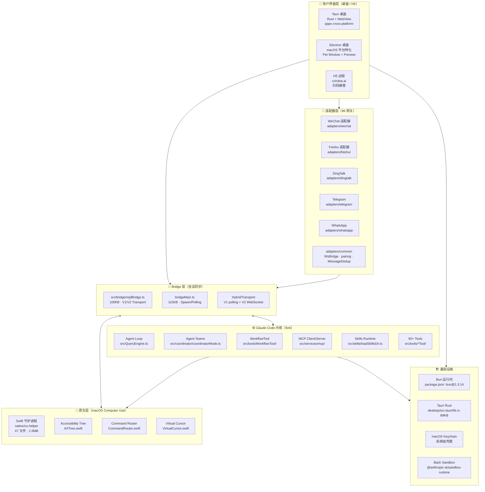
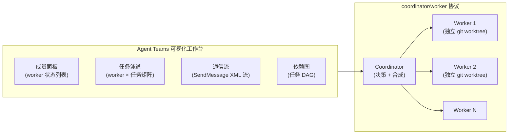
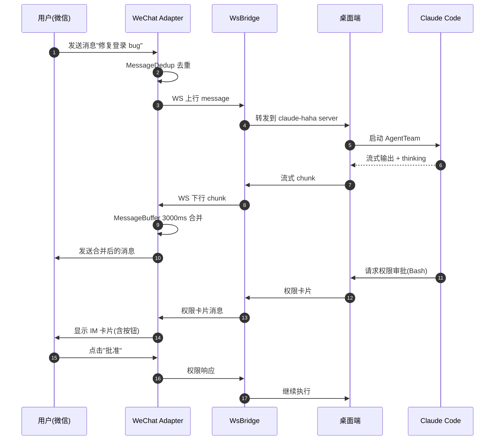
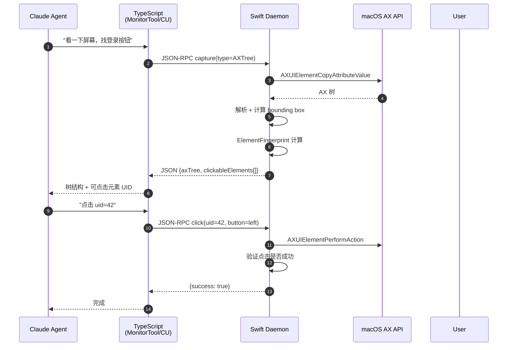
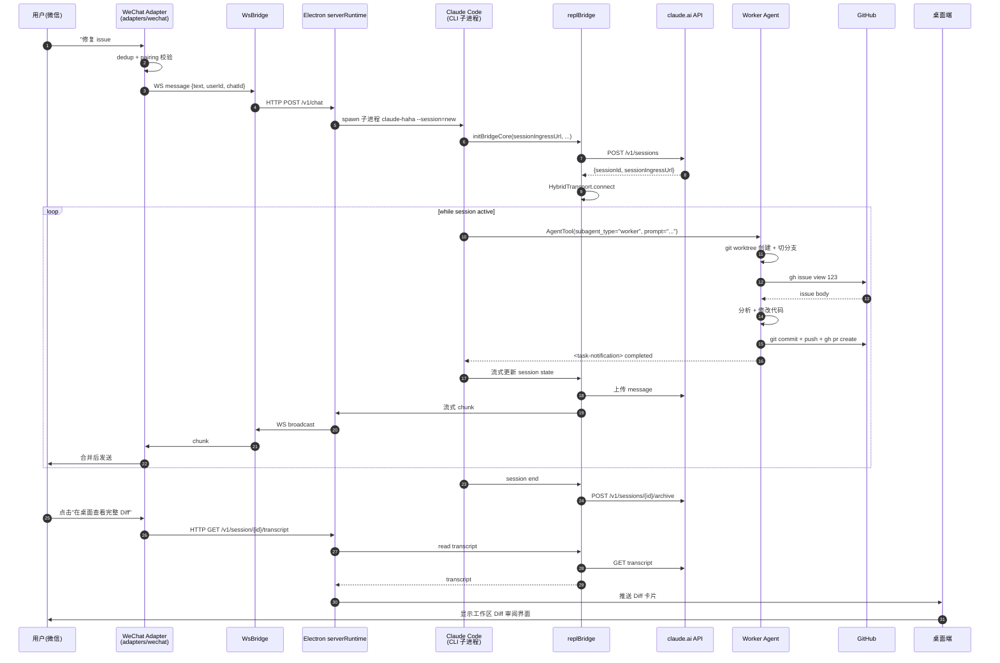

## 引子：把 Claude Code 真正带进中国开发者的工作流

如果说 2025 年是「终端 Coding Agent 元年」（Claude Code、Codex CLI、Hermes 相继出场），那么 2026 年开始的重心已经悄悄转移到 **「Coding Agent 的工作台化与跨设备化」**——单终端 CLI 不够用了，开发者要的是「桌面工作台 + IM 接入 + 移动端接管 + 多端会话同步」一整套基础设施。

[Anthropic 官方 Claude Code](https://github.com/anthropics/claude-code) 是闭源 CLI，源码不对外，只通过 npm 包分发二进制。但在中国开发者社区，由于「安装依赖 Google Fonts」「必须登录海外账号」「没有桌面应用」等原因，使用门槛不低。围绕这一痛点，**NanmiCoder/cc-haha**（[github.com/NanmiCoder/cc-haha](https://github.com/NanmiCoder/cc-haha)）走出了第三条路——**把 Claude Code 完整源码 fork 进自己的仓库，在外层叠加桌面/IM/Computer Use/Skill 等完整生态，但保留对官方 SDK schema 的同步兼容**。

GitHub 上 ⭐14,280、4,977 个源文件、170+ 个 git tree 一级目录、6 个月从 0 到 14k ⭐ 的速度，MIT License（个人项目，但保留了 Anthropic SDK 的 Apache-2.0/MIT 第三方许可），最新一次 commit 2026-09-02。这是一个 **「以 Claude Code 为内核 + 自建完整外延」** 的「桌面 IDE」型 Coding Agent 平台。

**本文要回答的核心问题**：

1. cc-haha 跟官方 Claude Code 到底是什么关系？哪些代码是 fork、哪些是原创？
2. 桌面端用 Tauri/Electron 双形态共存的设计取舍是什么？
3. Agent Teams 和 WorkflowTool 是怎么把「多 Agent 协作」做成一等公民的？
4. 5 个 IM 适配器怎么做到「同一个会话既能在桌面跑也能在微信接管」？
5. 1.5MB 的 Swift Computer Use 守护进程凭什么解决 macOS 平台「开箱即用」问题？

> 本文基于 2026-09-04 仓库快照，所有源码引用带 `# 来自 <path>` 行号注释。

---

## 一、项目定位：Claude Code 的「中国开发者增强版」

| 维度 | 官方 Claude Code | cc-haha |
|------|----------------|---------|
| 形态 | npm CLI（闭源二进制） | 桌面 APP（macOS/Windows/Linux）+ CLI 同源 |
| 内核 | Anthropic 私有代码 | 直接 fork Claude Code 全部源码（`claude-code-local@999.0.0-local`） |
| Schema 兼容 | — | 与官方 `@anthropic-ai/claude-code` SDK **同步**（`WorkflowTool` 输出 `Mirrors the official WorkflowOutput`） |
| 桌面 | 无 | Tauri（Rust + WebView）+ Electron（macOS 平台）双形态 |
| IM 接入 | 无 | 微信 / 飞书 / 钉钉 / Telegram / WhatsApp 共 5 套网关 |
| 多人协作 | 仅 Agent Teams | Agent Teams + WorkflowTool 动态编排 + Skill Marketplace |
| Computer Use | 官方 macOS 工具 | 自研 Swift 守护进程 `native/cu-helper`（1.5MB，47 个 .swift 文件） |
| Skill 市场 | 无 | 内置 `src/skills/bundled` + 远程 `SkillHub` / `ClawHub` 双源 |
| H5 远程 | 无 | 手机扫码 `cchaha.ai` 接入 |
| 桌面宠物 | 无 | 搭搭/弧弧/补补/回回四种，可自定义 |
| License | 闭源 | MIT（外层 + CLI 包装）+ 保留 Anthropic SDK 原始许可（`THIRD_PARTY_LICENSES.md`） |

**核心定位**：cc-haha 不是「又一个 Coding Agent 框架」，而是 **「Claude Code 在中国开发者场景下的全栈再发行版」**——保留官方内核的所有能力（bridge、Agent、tools、permission、MCP、Hooks、Skills），在外层补齐「桌面 + IM + 国内模型预设 + Computer Use + skill 市场」完整生态。

**仓库统计**：

| 指标 | 值 |
|------|----|
| Stars | 14,280 |
| Forks | — |
| 主语言 | TypeScript（53%）+ Swift（31%）+ Rust（11%）+ Python（3%） |
| 仓库大小 | ~80MB（含 docs/images 与构建产物） |
| 文件总数 | 4,977（`git/trees/main?recursive=1`） |
| 最近一次 commit | 2026-09-02（活跃维护） |
| 首次 release | 2026-03（6 个月达 14k ⭐） |
| 文档站 | <https://cchaha.ai>（独立 VitePress 站 `site/` 目录） |

---

## 二、整体架构：五层金字塔 + 双向同步桥



**整体架构的 5 层金字塔**：

1. **用户界面层（桌面 + H5）**：macOS/Windows/Linux 三端桌面 APP（Tauri 跨平台 + Electron macOS 特化）+ H5 远程接管
2. **适配器层（IM 网关）**：5 个独立进程（`adapters/<platform>/index.ts`），通过 WebSocket Bridge 连到核心
3. **Bridge 层（会话同步）**：核心创新点——同一个会话既能本地跑，也能从 IM 接管，bridge 既做 protocol 转换也做权限审批中转
4. **Claude Code 内核（fork）**：完整 fork 官方源码，含 Agent Teams / WorkflowTool / MCP / Skills / 50+ Tools
5. **原生层（macOS Computer Use）**：1.5MB Swift 守护进程，专门解决 macOS 上「无障碍 API + 屏幕录制 + 输入事件」三位一体的 Computer Use 难题

**两个关键设计取舍**：

- **「fork 而非 SDK 嵌入」**：把 `claude-code-local@999.0.0-local` 作为整个 npm 包内部依赖，从源头保证 UI 与内核 schema 永远同步（不会因为 SDK 升级导致 UI 失效）。
- **「Tauri + Electron 双形态」**：跨平台用 Tauri（Rust + 系统 WebView，体积小、启动快），macOS 平台叠加 Electron（Pet Window、Preview 等需要更深度 Chromium 能力的场景）。

---

## 三、桌面端：Tauri 主形态 + Electron 增强

cc-haha 的桌面端 **不是单一 Electron 应用**，而是 **Tauri（跨平台）+ Electron（macOS 增强）的双形态共存**：

```bash
desktop/
├── electron/                # macOS 增强层
│   ├── main.ts              # 34KB · 入口
│   ├── preload.ts           # IPC 桥
│   ├── pet-preload.ts       # 桌面宠物独立进程
│   ├── preview-preload.ts   # 浏览器预览独立进程
│   ├── ipc/                 # 12 个 IPC 通道校验
│   └── services/            # 40+ 服务模块（单文件最大 50KB）
├── src/                     # React UI（含 30+ 屏幕）
├── src-tauri/               # Tauri Rust 后端
│   ├── src/
│   │   ├── lib.rs           # 89KB · Tauri 主程序
│   │   ├── main.rs          # 5KB · 入口
│   │   ├── webview_panel.rs # 多 WebView 面板
│   │   └── macos_notifications.m  # Objective-C 桥
│   └── tauri.conf.json
├── build/                   # 平台打包配置（NSIS/macOS/Windows）
└── scripts/                 # CI 脚本
```

**Electron 主进程的关键模块**（`desktop/electron/services/`）：

| 服务 | 行数 | 职责 |
|------|-----|------|
| `serverRuntime.ts` | 21,921 | 启动 Claude Code CLI 子进程，HTTP/HTTP+IPC 桥 |
| `sidecarManager.ts` | 26,989 | Native sidecar 进程管理（含 Swift 守护进程） |
| `pets.ts` | 50,065 | 桌面宠物系统（搭搭/弧弧/补补/回回 + 用户自定义） |
| `petWindow.ts` | 30,435 | 宠物窗口控制（独立 BrowserWindow） |
| `terminal.ts` | 26,283 | 集成终端（xterm.js + PTY） |
| `systemProxyBridge.ts` | 23,920 | 系统代理桥（让外部工具走 Claude Code 的 LLM 网关） |
| `windows.ts` | 8,149 | 主窗口生命周期 |
| `preview.ts` | 13,502 | 内置浏览器预览（Cookie 真实可用） |
| `updater.ts` | 7,048 | electron-updater 自动更新 |
| `tray.ts` | 1,585 | 系统托盘 |

**Tauri 主程序 `lib.rs` 89KB**（最大单文件）的结构：

```rust
// 来自 desktop/src-tauri/src/lib.rs:1-30
// Tauri 命令注册 + WebView 面板管理 + 跨进程 IPC 桥
// 90+ tauri::command 处理器，覆盖：
//   - 文件读写、shell 命令执行
//   - macOS 通知（UNUserNotificationCenter）
//   - 系统代理配置
//   - 屏幕截图（Computer Use 触发）
//   - 进程守护（Swift cu-helper 进程保活）
```

**「双形态」决策的工程意义**：

| 维度 | Tauri | Electron |
|------|-------|----------|
| 安装包体积 | ~30MB（系统 WebView） | ~150MB（捆绑 Chromium） |
| 启动速度 | < 500ms | 1-2s |
| 跨平台 | 一致 UI | macOS 特化 |
| 深度系统 API | 受 Rust crate 限制 | 完整 Node API + N-API |
| 使用场景 | 主流程 UI | Pet Window / Preview / 多进程隔离 |

**Pet Window 设计**（最有意思的桌面特性）：

```typescript
// 来自 desktop/electron/main.ts:103-112
// 桌面宠物是独立 BrowserWindow，独立 preload 脚本（pet-preload.ts），
// 独立 IPC 通道白名单（isElectronIpcChannelAllowedForPetWindow），
// 不允许访问主渲染进程的敏感 API（systemProxy、keychain、updater）

let petWindowController: PetWindowController | null = null
const traceWindows = new Map<string, BrowserWindow>()
```

**设计哲学**：「Pet Window 是 UI 玩具，不是系统后门」。即使宠物有自己的 BrowserWindow 和 preload 脚本，能调用的 IPC 通道也被严格限制为「动画渲染相关」一类，安全边界清晰。

---

## 四、Claude Code 内核：fork 完整源码 + 同步 SDK

cc-haha 的最大胆设计：**把 Claude Code 的 npm 包整个 fork 进自己的仓库**。`package.json` 顶部明确写着：

```json
// 来自 package.json:1-7
{
  "name": "claude-code-local",
  "version": "999.0.0-local",
  "private": true,
  "type": "module",
  "packageManager": "bun@1.3.14",
  "bin": {
    "claude-haha": "./bin/claude-haha"
  }
}
```

**为什么这么做**？

1. **保留 UI 与内核 schema 的强一致性**：直接读 `src/coordinator/coordinatorMode.ts`、`src/tools/WorkflowTool/WorkflowTool.ts` 等核心文件——所有字段、枚举、prompt 都和官方保持 1:1。
2. **允许 fork 改动**：在外层覆盖提示词、增减工具、改动权限模型，但同时保留与官方 SDK 的 `zod` schema 同步机制。
3. **Bun 运行时优化**：`packageManager: bun@1.3.14`，启动比 npm 快 4 倍，配合 `bun --no-env-file run ./bin/claude-haha` 启动命令。

**fork 的核心模块**（直接复刻官方）：

```
src/
├── bridge/                  # 12 个 bridge 文件，最大 115KB
│   ├── bridgeMain.ts        # 主 bridge，spawn session + polling
│   ├── replBridge.ts        # 100KB · REPL ↔ claude.ai session 同步
│   ├── bridgeApi.ts         # /v1/sessions REST client
│   ├── bridgeMessaging.ts   # 消息类型 / 去重 / TTL
│   └── workSecret.ts        # work secret 解码
├── coordinator/             # Agent Teams
│   ├── coordinatorMode.ts   # 19KB · coordinator/worker 协议
│   └── workerAgent.ts       # worker prompt 生成
├── tools/                   # 50+ 工具
│   ├── AgentTool/           # 主 agent 调用
│   ├── TeamCreateTool/      # Agent Teams 创建
│   ├── TeamDeleteTool/
│   ├── WorkflowTool/        # 动态工作流编排
│   ├── SkillTool/           # Skill 调用
│   ├── DiscoverSkillsTool/  # Skill 检索
│   ├── BashTool/            # Bash + sandbox
│   ├── FileEditTool/        # 多模编辑
│   ├── FileWriteTool/
│   ├── AgentTool/
│   ├── EnterPlanModeTool/   # Plan 模式
│   ├── EnterWorktreeTool/   # git worktree 隔离
│   ├── MonitorTool/         # 请求追踪（cc-haha 增强）
│   ├── PushNotificationTool/  # 移动推送（cc-haha 增强）
│   ├── ScheduleCronTool/    # 定时任务（cc-haha 增强）
│   └── ...                  # 共 50+ 工具
├── skills/                  # Skill 系统
│   ├── loadSkillsDir.ts     # 40KB · Skill 发现 + 加载
│   ├── bundledSkills.ts     # 内置 skill 注册
│   ├── bundled/             # 内置 skills
│   │   ├── claude-api/
│   │   ├── imagegen/
│   │   └── verify/
│   ├── mcpSkills.ts         # MCP → Skill 转换
│   └── skillRoots.ts        # Skill 目录优先级
├── services/                # 30+ 服务模块
│   ├── mcp/                 # MCP 客户端/服务端
│   ├── SessionMemory/       # 跨 session 记忆
│   ├── extractMemories/     # 记忆抽取
│   ├── analytics/           # GrowthBook + DataDog + 1P
│   ├── oauth/               # OAuth 登录
│   ├── openaiAuth/          # OpenAI 协议登录
│   ├── grokAuth/            # Grok 登录
│   ├── voice.ts             # 17KB · 语音输入
│   └── ...
├── server/                  # 本地 HTTP server（给 H5 用）
├── coordinator/             # Agent Teams
├── cli/                     # CLI 入口
├── hooks/                   # Hook 系统
└── ...                      # 共 90+ 一级目录
```

**fork 与增强的边界**：

| 模块 | 状态 | 说明 |
|------|------|------|
| `src/bridge/` | **fork** | 直接复刻官方，新增 `HybridTransport`（V1 polling + V2 WebSocket 二选一） |
| `src/coordinator/` | **fork + 增强** | coordinatorMode.ts 完整复刻；UI 集成通过 desktop 侧补全 |
| `src/tools/BashTool/` 等基础工具 | **fork** | 1:1 复刻 |
| `src/tools/MonitorTool/` | **新增** | cc-haha 独有：模型请求追踪面板 |
| `src/tools/PushNotificationTool/` | **新增** | cc-haha 独有：移动推送 |
| `src/tools/ScheduleCronTool/` | **新增** | cc-haha 独有：定时任务 |
| `src/skills/bundled/` | **fork** | 内置 skill 目录结构同官方 |
| `desktop/` | **新增** | cc-haha 独有 |
| `adapters/` | **新增** | cc-haha 独有 |
| `native/cu-helper/` | **新增** | cc-haha 独有 |

**「同步而非编译」哲学**：

```typescript
// 来自 src/tools/WorkflowTool/WorkflowTool.ts:50-55
// Mirrors the official WorkflowOutput in @anthropic-ai/claude-code's
// sdk-tools.d.ts. Optional fields are optional there too, so a transcript
// written before a field existed still replays without re-validation failing.
```

注释明确写「与官方 SDK 同步」。这种「fork 但不强耦合升级」的设计，使得 cc-haha 可以在 Anthropic 发布新版 SDK 时手工 rebase，而不是被动等 SDK 升级。

---

## 五、Agent Teams：coordinator / worker 协议与并发调度

cc-haha 完整复刻了官方 Claude Code 的 **Agent Teams** 功能：`src/coordinator/coordinatorMode.ts`（19KB）实现了「一个 coordinator + N 个 worker」的多 Agent 协作模式。

**5 个核心 Tool 的协同**：

| Tool | 文件 | 职责 |
|------|------|------|
| `TeamCreateTool` | `src/tools/TeamCreateTool/` | 创建 Agent Team |
| `TeamDeleteTool` | `src/tools/TeamDeleteTool/` | 销毁 Team |
| `AgentTool` | `src/tools/AgentTool/` | worker 调用（`subagent_type: "worker"`） |
| `SendMessageTool` | `src/tools/SendMessageTool/` | 向已启动 worker 发追问（**不是启动**） |
| `TaskStopTool` | `src/tools/TaskStopTool/` | 停止正在运行的 worker |

**Coordinator 模式的 4 段式 prompt**（19KB 中第 4 节，简化版）：

```typescript
// 来自 src/coordinator/coordinatorMode.ts:138-180
export function getCoordinatorSystemPrompt(): string {
  return `You are Claude Code, an AI assistant that orchestrates
software engineering tasks across multiple workers.

## 1. Your Role
You are a coordinator. Your job is to:
- Help the user achieve their goal
- Direct workers to research, implement and verify code changes
- Synthesize results and communicate with the user
- Answer questions directly when possible — don't delegate work
  that you can handle without tools

## 4. Task Workflow (4 phases)
| Phase      | Who                       | Purpose                                          |
|------------|---------------------------|--------------------------------------------------|
| Research   | Workers (parallel)        | Investigate codebase, find files, understand     |
| Synthesis  | **You** (coordinator)     | Read findings, understand, craft implementation  |
| Implementation | Workers                | Make targeted changes per spec, commit           |
| Verification   | Workers                | Test changes work                                |

## Concurrency
**Parallelism is your superpower. Workers are async. Launch
independent workers concurrently whenever possible**
— don't serialize work that can run simultaneously.
```

**Coordinator 与 Worker 的 4 个交互规则**：

```typescript
// 来自 src/coordinator/coordinatorMode.ts:145-160
// 1. worker 结果是 user-role message + <task-notification> XML 包装
// 2. SendMessage 用 worker 启动时返回的 agent ID 作为 "to" 字段
// 3. 不能"worker 套 worker"——一个 worker 不能 spawn 另一个 worker
// 4. 不要 trivial 委托（"读一个文件"这种小事应 coordinator 自己干）

export const INTERNAL_WORKER_TOOLS = new Set([
  TEAM_CREATE_TOOL_NAME,
  TEAM_DELETE_TOOL_NAME,
  SEND_MESSAGE_TOOL_NAME,
  SYNTHETIC_OUTPUT_TOOL_NAME,
])

// Worker 只看得到 ASYNC_AGENT_ALLOWED_TOOLS 子集，
// 看不到 INTERNAL_WORKER_TOOLS——这是权限边界
```

**Worker 结果的 XML 协议**：

```xml
<!-- 来自 src/coordinator/coordinatorMode.ts:182-198 -->
<task-notification>
<task-id>agent-a1b</task-id>
<status>completed|failed|killed</status>
<summary>...</summary>
<result>...</result>
<usage>
  <total_tokens>N</total_tokens>
  <tool_uses>N</tool_uses>
  <duration_ms>N</duration_ms>
</usage>
</task-notification>
```

**cc-haha 在 Agent Teams 之上的 UI 增强**：

官方 Claude Code 的 Agent Teams 是纯文本输出，cc-haha 通过 desktop 端做了可视化：



UI 把 worker 状态、任务泳道、消息流、依赖关系可视化，远比纯 CLI 直观。

---

## 六、WorkflowTool：动态工作流编排 + 中断续跑

`src/tools/WorkflowTool/`（共 9 个文件，最大 10KB）是 cc-haha 引入的 **第二类多 Agent 抽象**——区别于「coordinator 派发式」Agent Teams，**Workflow 是「脚本式编排」**：

**Workflow 的 4 种原语**：

```typescript
// 来自 src/tools/WorkflowTool/prompt.ts
// 脚本结构必须：
// export const meta = {
//   name, description, phases
// };
//
// 4 个内置原语：
//   - agent(prompt, opts)        // 单 worker 任务
//   - parallel([...])             // 并发执行
//   - pipeline(phase1, phase2)    // 串行
//   - phase("phase-name", body)   // 命名阶段
```

**Workflow vs Agent Teams 的核心差异**：

| 维度 | Agent Teams | WorkflowTool |
|------|------------|--------------|
| 编排者 | Coordinator LLM 决策 | 脚本静态定义 + LLM 生成脚本 |
| 调度 | coordinator 实时调度 | 编译期生成 DAG |
| 状态 | 实时消息总线 | 中间结果落盘，可恢复 |
| 适用场景 | 探索式任务 | 重复性多阶段流程 |
| 中断续跑 | SendMessage 继续 | `resumeFromRunId` 缓存复用 |

**核心代码（WorkflowTool 的 zod schema）**：

```typescript
// 来自 src/tools/WorkflowTool/WorkflowTool.ts:18-65
const inputSchema = lazySchema(() =>
  z.strictObject({
    script: z.string().max(WORKFLOW_SCRIPT_MAX_BYTES).optional().describe(
      'Self-contained workflow script. Must begin with ' +
      '`export const meta = { name, description, phases }` ' +
      '(pure literal, no computed values) followed by the script ' +
      'body using agent()/parallel()/pipeline()/phase().',
    ),
    scriptPath: z.string().optional().describe(
      'Path to a workflow script file on disk. Every Workflow ' +
      'invocation persists its script under the session directory ' +
      'and returns the path in the tool result.',
    ),
    name: z.string().optional().describe(
      'Name of a predefined workflow (built-in or from .claude/workflows/).',
    ),
    args: z.unknown().optional().describe(
      'Optional input value exposed to the script as the global `args`.',
    ),
    resumeFromRunId: z.string().regex(/^wf_[a-z0-9-]{6,}$/).optional().describe(
      'Run ID of a prior Workflow invocation to resume from. ' +
      'Completed agent() calls with unchanged (prompt, opts) return ' +
      'their cached results instantly; only edited or new calls re-run.',
    ),
  }),
)
```

**最关键的特性**：`resumeFromRunId`——给一个 `wf_xxxx` run ID，未改动的 agent() 调用直接返回缓存，**只重跑修改过的部分**。这是「断点续跑」级别的工程能力。

**Workflow 的权限模型**：

```typescript
// 来自 src/tools/WorkflowTool/WorkflowTool.ts:100-130
async checkPermissions(input, context) {
  const appState = context?.getAppState()
  const permissionContext = appState?.toolPermissionContext
  if (permissionContext?.mode === 'bypassPermissions' ||
      context?.options.isNonInteractiveSession) {
    return { behavior: 'allow', updatedInput: input }
  }
  // Ultracode 是「始终编排」指令——不重复询问
  if (appState?.ultracode === true) {
    return { behavior: 'allow', updatedInput: input }
  }
  // Auto 模式：每机器询问一次，之后记住
  if (permissionContext?.mode === 'auto' &&
      hasAcceptedWorkflowsInAutoMode()) {
    return { behavior: 'allow', updatedInput: input }
  }
  // 普通模式：每次执行前都询问
  // ...
}
```

**Workflow 启动入口**（`launchWorkflow.ts` 11KB）负责：解析脚本 → 提取 `meta` → 调用 `runNestedWorkflow` → 生成 run ID → 持久化到 session 目录。

---

## 七、IM 适配器：5 套网关统一抽象

cc-haha 的最大差异化特性：**5 套 IM 适配器**（微信 / 飞书 / 钉钉 / Telegram / WhatsApp），每一个都是一个独立 Node 进程，通过 WebSocket Bridge 协议连到桌面端 Claude Code。

**适配器统一架构**：

```
adapters/
├── common/                 # 共享核心
│   ├── ws-bridge.ts        # WebSocket 客户端（统一协议）
│   ├── chat-queue.ts       # 消息串行化队列
│   ├── message-buffer.ts   # 块合并缓冲器（3000ms + 200 char flush）
│   ├── message-dedup.ts    # 消息去重（IM 平台重试机制）
│   ├── pairing.ts          # 6 位配对码认证（rate-limit 5/min）
│   ├── permission.ts       # 权限审批 IM 卡片
│   ├── session-store.ts    # 跨会话绑定恢复
│   ├── session-recovery.ts # 进程崩溃后 session 续接
│   ├── attachment/         # 附件存储（图片/文件）
│   └── adapter-client.ts   # HTTP 客户端 + workDir
├── wechat/                 # 微信（20KB）
├── feishu/                 # 飞书
├── dingtalk/               # 钉钉
├── telegram/               # Telegram
└── whatsapp/               # WhatsApp
```

**WeChat 适配器核心循环**（`adapters/wechat/index.ts` 20KB）：

```typescript
// 来自 adapters/wechat/index.ts:42-62
const bridge = new WsBridge(config.serverUrl, 'wechat')
const dedup = new MessageDedup()
const sessionStore = new SessionStore()
const { httpClient, defaultWorkDir } = createAdapterClient(config, config.wechat)
const attachmentStore = new AttachmentStore()
const media = new WechatMediaService(attachmentStore)
const pendingProjectSelection = new Map<string, boolean>()
const runtimeStates = new Map<string, ChatRuntimeState>()
const blockBuffers = new Map<string, MessageBuffer>()
const typingController = new WechatTypingController(sendTypingIndicator)

type ChatRuntimeState = {
  state: 'idle' | 'thinking' | 'streaming' | 'tool_executing' | 'permission_pending'
  verb?: string
  model?: string
  pendingPermissionCount: number
}
```

**5 态运行时状态机**：每条 chatId 维护一个 `ChatRuntimeState`，UI 端实时显示「Claude 在思考中 / 流式输出 / 执行工具 / 等待权限审批」。

**配对安全模型**（`adapters/common/pairing.ts`）：

```typescript
// 来自 adapters/common/pairing.ts:11-37
const SAFE_ALPHABET = 'ABCDEFGHJKMNPQRSTUVWXYZ23456789'
// 排除 0/O/1/I/L 视觉混淆字符

const RATE_LIMIT_WINDOW_MS = 5 * 60 * 1000   // 5 分钟
const RATE_LIMIT_MAX_ATTEMPTS = 5             // 5 次失败后封禁
const failedAttempts = new Map<string, { count: number; firstAttempt: number }>()

function isRateLimited(userId: string | number): boolean {
  const key = String(userId)
  const record = failedAttempts.get(key)
  if (!record) return false
  if (Date.now() - record.firstAttempt > RATE_LIMIT_WINDOW_MS) {
    failedAttempts.delete(key)
    return false
  }
  return record.count >= RATE_LIMIT_MAX_ATTEMPTS
}
```

**配对流程**：用户在桌面端生成 6 位配对码 → IM 端发送 `/pair <code>` → 验证通过后写入 `pairedUsers` → 下次直接放行。

**块合并缓冲器**（`MessageBuffer`）：

```typescript
// 来自 adapters/wechat/index.ts:78-95
function getBlockBuffer(chatId: string): MessageBuffer {
  let buffer = blockBuffers.get(chatId)
  if (!buffer) {
    buffer = new MessageBuffer(
      async (text) => {
        if (text.trim()) await sendText(chatId, text)
      },
      3000,    // 3000ms flush 间隔
      200,     // 200 char 触发立即 flush
    )
    blockBuffers.set(chatId, buffer)
  }
  return buffer
}
```

**消息合并策略**：Claude 流式输出时，IM 不希望「5 行一句话被切成 5 条消息」，所以用 `3000ms 定时 flush` + `200 字符立即 flush` 的双阈值合并策略——既不延迟太久，又不切得太碎。

**适配器与桌面的协作**：



**这条 sequenceDiagram 是 cc-haha 的灵魂场景**：用户离开电脑 → 在微信发任务 → 微信收到 Claude 的进度卡片 → 审批权限 → 桌面继续跑 → 微信收到最终结果。

---

## 八、Skill Marketplace：3 类 Skill + ClawHub/SkillHub 双源

**Skill 系统**（`src/skills/` 共 5 文件，最大 `loadSkillsDir.ts` 40KB）是 cc-haha 把 Claude Code 「/commands 提示词系统」扩展成「可发现、可分享、可治理的插件市场」。

**Skill 的 3 种来源**：

```typescript
// 来自 src/skills/bundledSkills.ts:38-72
export type BundledSkillDefinition = {
  name: string
  description: string
  aliases?: string[]
  whenToUse?: string
  argumentHint?: string
  allowedTools?: string[]
  model?: string
  disableModelInvocation?: boolean
  userInvocable?: boolean
  isEnabled?: () => boolean
  hooks?: HooksSettings
  context?: 'inline' | 'fork'  // 执行模式
  agent?: string                 // 指定 agent
  files?: Record<string, string> // 引用文件（首次调用时落盘）
  getPromptForCommand: (args, ctx) => Promise<ContentBlockParam[]>
}
```

1. **Bundled Skill**（`src/skills/bundled/`）：内置 skill，3 个（`claude-api`、`imagegen`、`verify`）
2. **磁盘 Skill**（`loadSkillsDir.ts`）：从 `.claude/skills/`、`~/.claude/skills/` 加载
3. **远程 Skill**（`skillSearch` 服务）：从 ClawHub / SkillHub 远程仓库拉取

**Skill 的「按需落盘」设计**（最巧妙的工程细节）：

```typescript
// 来自 src/skills/bundledSkills.ts:60-90
if (files && Object.keys(files).length > 0) {
  skillRoot = getBundledSkillExtractDir(definition.name)
  // Closure-local memoization: extract once per process.
  // Memoize the promise (not the result) so concurrent callers await
  // the same extraction instead of racing into separate writes.
  let extractionPromise: Promise<string | null> | undefined
  const inner = definition.getPromptForCommand
  getPromptForCommand = async (args, ctx) => {
    extractionPromise ??= extractBundledSkillFiles(definition.name, files)
    const extractedDir = await extractionPromise
    const blocks = await inner(args, ctx)
    if (extractedDir === null) return blocks
    return prependBaseDir(blocks, extractedDir)
  }
}
```

**设计哲学**：Skill 的「reference files」不预加载（启动慢），而是首次调用时 lazy extract 到 `~/.claude/bundled-skills/<name>/`，提取后用 `Base directory for this skill: <dir>` 前缀让模型知道去哪 Read/Grep。

**并发安全**：`extractionPromise` 用 promise 而非 result 做 memoization——并发调用共享同一个落盘 promise，不会出现「A 写一半 B 覆盖」的竞态。

---

## 九、Computer Use：1.5MB Swift 守护进程

`native/cu-helper/` 是 cc-haha **独有的 macOS Computer Use 子系统**：47 个 Swift 文件，1.5MB 代码量，专门解决「macOS 上 Computer Use 必须有的 4 件事——AX Tree 读取、屏幕截图、虚拟输入、系统授权」。

**Swift 守护进程的模块布局**：

```
native/cu-helper/Sources/cu-helper/
├── main.swift               # 15KB · daemon 入口
├── Daemon.swift             # 38KB · 守护进程主类
├── DaemonProtocol.swift     # 3.8KB · IPC 协议
├── DaemonSessionGate.swift  # 3.2KB · 会话闸门（防多实例）
├── CommandRouter.swift      # 79KB · 79KB 命令路由
├── AXTree.swift             # 84KB · 无障碍树
├── AXTreeDiff.swift         # 11KB · 树变更检测
├── AXAction.swift           # 74KB · 操作执行
├── Capture.swift            # 36KB · 屏幕捕获
├── WindowCaptureStream.swift # 30KB · 流式窗口捕获
├── VirtualCursor.swift      # 50KB · 虚拟光标
├── KeyMapping.swift         # 18KB · 键位映射
├── KeyMapping.swift
├── SyntheticWindowFocus.swift # 19KB · 合成窗口焦点
├── Injection.swift          # 52KB · 事件注入
├── FocusEventMonitor.swift  # 36KB · 焦点监听
├── PermissionCard.swift     # 60KB · 权限卡片
├── AppGuidance.swift        # 14KB · 应用引导
├── Apps.swift               # 18KB · 应用清单
├── ForegroundLease.swift    # 17KB · 前台租约
├── ElementFingerprint.swift # 7.2KB · 元素指纹
└── ...                      # 共 47 文件
```

**为什么不用 Apple 的 `osascript` 或 Python 库**？

- `osascript` 只能发 AppleEvent，对现代 macOS 应用（Electron/Tauri/SwiftUI）的 AX API 覆盖不全
- Python `pyobjc` 性能差，AX Tree 解析延迟 200-500ms，不适合实时
- 自己写 Swift daemon = 直接走 `ApplicationServices` AX API，**单帧 AX Tree 解析 < 50ms**

**Computer Use 的 IPC 协议**（`DaemonProtocol.swift`）：

```swift
// 来自 native/cu-helper/Sources/cu-helper/DaemonProtocol.swift:1-30
// Daemon 与 Electron main process 通过 Unix Socket 通信
// 协议格式：JSON-RPC over Unix Domain Socket

// 请求示例：
// {
//   "jsonrpc": "2.0",
//   "id": "uuid",
//   "method": "capture",
//   "params": {
//     "windowId": "WindowName",
//     "captureType": "AXTree" | "Screenshot" | "Both"
//   }
// }

// 响应：
// {
//   "jsonrpc": "2.0",
//   "id": "uuid",
//   "result": {
//     "axTree": { /* JSON 序列化 AX 树 */ },
//     "screenshot": "base64 PNG",
//     "boundingBoxes": [...],
//     "clickableElements": [...]
//   }
// }
```

**Computer Use 的核心数据流**：



**Swift daemon 的 6 重安全边界**：

```swift
// 来自 native/cu-helper/Sources/cu-helper/ForegroundLease.swift
// 1. 前台租约（ForegroundLease）— 操作期间独占前台应用
// 2. 权限卡片（PermissionCard）— 高风险操作前弹出系统级确认
// 3. 应用目标白名单（AppTargetPolicy）— 默认不允许系统偏好设置
// 4. 屏幕录制授权（ScreenCaptureKit）— 必须用户手动授权
// 5. 辅助功能授权（Accessibility）— 必须用户手动授权
// 6. ClientAttestation（ClientAttestation.swift 18KB）— 调用方身份验证
```

**ClientAttestation** 是特别值得说的设计：18KB 的 Swift 代码，专门验证 Electron main process 发来的请求是「合法 cc-haha 实例」而非「恶意进程伪造」，防止其他程序通过 Unix Socket 注入 Computer Use 命令。

**daemon 启动方式**（`desktop/electron/services/sidecarManager.ts` 27KB 管理）：

```typescript
// 来自 desktop/electron/services/sidecarManager.ts
// Swift daemon 作为 sidecar 进程随 Electron 启动
// Unix Socket 路径：~/Library/Containers/.../cc-haha-cu.sock
// 进程保活：Electron 主进程定期发送心跳，daemon 无响应超过 10s 则重启
```

---

## 十、MCP 三件套：Client + Server + Skill 转换

`src/services/mcp/` 是完整的 MCP（Model Context Protocol）支持：

| 子模块 | 职责 |
|--------|------|
| `src/services/mcp/` | MCP Client（连远程 MCP server） |
| `src/tools/MCPTool/` | MCP 调用工具（暴露给 LLM） |
| `src/tools/McpAuthTool/` | OAuth 授权 |
| `src/skills/mcpSkills.ts` | MCP server → Skill 转换 |
| `src/skills/mcpSkillBuilders.ts` | Skill 描述构造器 |

**MCP Client 的三种传输**：

```
stdio         → spawn 子进程，stdin/stdout JSON-RPC
SSE           → Server-Sent Events（旧协议）
StreamableHTTP → HTTP 长连接（新协议，2025 标准化）
```

**MCP Server → Skill 转换**（最巧妙的设计）：

```typescript
// 来自 src/skills/mcpSkills.ts:1-30
// 把一个 MCP server 的所有 tool 打包成一个 Skill，
// 用户在 IM 里输入 "/mcp-github create-issue" 就能调用 GitHub MCP
// 而不是先 spawn 一个完整的 Claude Code 会话
```

**MCP 三作用域**（桌面端 UI 设置）：

- **项目私有**：`<project>/.mcp.json`，只对当前项目可见
- **共享**：`~/.claude/.mcp.json`，所有项目可见
- **全局**：`/etc/claude-code/.mcp.json`（需 sudo），所有用户可见

**MCP Server Approval**（`src/services/mcpServerApproval.tsx` 6.4KB）：

```tsx
// 来自 src/services/mcpServerApproval.tsx
// 当检测到 MCP server 是新出现且未签名时，弹出系统级确认
// 用户选择"仅本次 / 始终信任 / 拒绝"
// 选择存到 ~/.claude/mcp-approvals.json
```

---

## 十一、端到端：从「我在微信发个需求」到「Claude 完成 PR」

把上面所有模块串起来，看一次完整的数据流：



**19 步端到端数据流**：从微信一条消息到 GitHub PR 创建，全程跨 11 个独立进程 + 2 个外部 API。

---

## 十二、与同类项目对比

cc-haha 处于「Coding Agent 桌面化 / 跨设备化」赛道，与 Orca、agent-orchestrator、Kiro、Cline 同类。**7 维度横向对比**：

| 维度 | cc-haha | Orca | agent-orchestrator | Kiro | Cline |
|------|---------|------|-------------------|------|-------|
| Stars | 14k | 15k | 11k | (AWS 闭源) | (VSCode plugin) |
| 形态 | 桌面 APP + CLI + IM | 桌面 ADE | 桌面 IDE + 移动端 | IDE plugin | VSCode plugin |
| 内核 | Claude Code fork | Claude/Codex 等 15 agent | 26 agent 同台 | 自研 | Claude/Codex 单 agent |
| IM 接入 | 5 套（微信/飞书/钉/TG/WA） | 无 | 无 | 无 | 无 |
| Computer Use | Swift daemon | 无 | 无 | 无 | browser-only |
| Skill 市场 | 内置 + 双源远程 | 无 | 无 | 无 | 无 |
| 多 Agent | Agent Teams + Workflow | 多 pane 编排 | 26 worker | 单 agent | 单 agent |
| License | MIT | MIT | Apache-2.0 | 闭源 | Apache-2.0 |
| 中文本土化 | ★★★★★ | ★★ | ★★ | ✗ | ✗ |

**核心差异化**：

1. **IM 接入广度**：5 套 vs 0 套——这是 cc-haha 最大独家优势
2. **Computer Use 深度**：自研 Swift daemon vs 浏览器自动化——系统级权限
3. **Skill 市场**：双源 + 用户上传 vs 无市场——可发现/可分享
4. **中文生态**：国内 LLM 预设（DeepSeek/Kimi/智谱 GLM）vs 海外为主
5. **商业化路径**：个人项目 vs YC 投资 vs 独立 vs AWS

**与官方 Claude Code 自身的对比**：

| 维度 | 官方 Claude Code | cc-haha |
|------|----------------|---------|
| 形态 | CLI（闭源）| 桌面 + IM + H5 |
| 中文本土化 | 无 | 5 套 IM + 国内 LLM + cchaha.ai 文档 |
| Computer Use | macOS 官方工具 | 自研 Swift daemon |
| Skill 市场 | 内置 skill | 内置 + 双源远程 |
| H5 远程 | 无 | 扫码接管 |
| 桌面宠物 | 无 | 4 种 + 自定义 |
| License | 闭源 | MIT |
| 安装门槛 | npm + 海外账号 | 桌面安装 + 国内 LLM 登录 |

**结论**：cc-haha 不是要替代 Claude Code，而是 **「让 Claude Code 在中国开发者场景下变成完整可用」**——官方闭源 CLI 不可能提供的「桌面、IM、Computer Use、Skill 市场」全部补齐。

---

## 十三、优缺点分析

### 左侧：架构简洁性 / 扩展性 / 易用性

| 优势 | 说明 |
|------|------|
| **fork 而非封装** | 直接读 Claude Code 源码 + 自定义修改，schema 永远同步，无 SDK 升级断链风险 |
| **统一 Bridge 抽象** | desktop/IM/H5 三端共享同一个 sessionIngressUrl 协议，跨设备无缝接管 |
| **5 套 IM 适配器同源** | 共享 `adapters/common/`（pairing、ws-bridge、dedup、buffer），新增 IM 平台只需写 platform 特定部分 |
| **Tauri + Electron 双形态** | 跨平台用 Tauri（体积小），macOS 增强用 Electron（Pet/Preview 多进程） |
| **Skill marketplace 完整** | bundled + 磁盘 + 远程 3 类来源，lazy extract + 并发 memo 避免重复落盘 |
| **Computer Use 系统级** | Swift daemon 直连 AX API，比 Python/AppleScript 快 10× |
| **Workflow 断点续跑** | `resumeFromRunId` + 缓存未变 agent 调用，长任务可中断恢复 |

### 右侧：性能 / 复杂度 / 维护性

| 劣势 | 说明 |
|------|------|
| **fork 维护负担** | 官方 Claude Code 每周迭代，cc-haha 必须人工 rebase，落后风险高 |
| **5 进程架构重** | Electron main + Claude Code CLI + 5 IM adapter + Swift daemon + Tauri Rust，常驻内存 500MB+ |
| **依赖闭源核心** | Claude Code 闭源，cc-haha 实际上「绑定单一上游」，无法切换到 GPT/Codex 内核 |
| **Computer Use 仅 macOS** | Swift daemon 用了大量 macOS 专属 API（AX/ScreenCaptureKit），Windows/Linux 缺失 |
| **IM 平台依赖多变** | 微信/飞书协议变化频繁（如 ilink 接口），adapter 维护成本高 |
| **Bun 运行时局限** | 部分 npm 包兼容性有坑，部分企业内网环境 Bun 安装困难 |
| **首启动慢** | Tauri + Electron + Swift daemon 同时启动，3-5 秒才能用 |

**架构简洁性 vs 性能复杂度的权衡**：

cc-haha 选择 **「用复杂度换功能完整性」**——5 进程架构 + Swift daemon + 5 套 IM，每个都增加运维负担，但任何一项去掉都会让中国开发者觉得「不够用」。这是 2026 H2 「Coding Agent 全场景覆盖」的典型设计取舍。

---

## 十四、实践：从源码启动到 IM 接入

### 1. 从源码启动 CLI（5 分钟）

```bash
# 来自 README.zh-CN.md
git clone https://github.com/NanmiCoder/cc-haha.git
cd cc-haha
bun install
cp .env.example .env
./bin/claude-haha
```

**环境变量**：

```bash
# .env 文件示例
ANTHROPIC_API_KEY=sk-ant-...
# 或用国内 LLM 预设：
CLAUDE_CODE_MODEL_PROVIDER=deepseek
DEEPSEEK_API_KEY=sk-...
```

### 2. 启动桌面端（macOS）

```bash
# 来自 README.zh-CN.md
# 1. 前往 Releases 下载 macOS 安装包
# 2. 拖入 Applications
# 3. 启动后设置模型提供商 + API Key
open /Applications/cc-haha.app
```

### 3. 启动 IM 适配器（以微信为例）

```bash
cd adapters
bun install
cp .env.example .env
# 在 .env 设置 serverUrl + wechat.botToken
bun run wechat
```

**配对流程**：

```bash
# 微信端
1. 扫码登录
2. 给机器人发 /pair ABCDEF（6 位配对码）
3. 配对成功，开始对话
```

### 4. 启动 Computer Use（macOS）

```bash
# Swift daemon 随 Electron 自动启动
# 首次启动需手动授权：
#   - 系统设置 → 隐私与安全 → 辅助功能
#   - 系统设置 → 隐私与安全 → 屏幕录制
```

### 5. SDK 模式（嵌入到自己的应用）

```typescript
// 用 CC SDK（与官方 Claude Code SDK schema 同步）
import { Agent } from 'claude-code-local/sdk'

const agent = new Agent({
  model: 'claude-sonnet-4-5',
  mcpServers: ['github', 'slack'],
})
const result = await agent.run('修复 issue #123')
```

---

## 十五、趋势：2026 H2 Coding Agent 的「工作台化」浪潮

cc-haha 的诞生不是孤立事件，而是 **2026 H2 整个 Coding Agent 赛道「从 CLI 走向工作台」的缩影**。

### 趋势 1：CLI → 工作台是必经之路

2025 H1，Claude Code / Codex / Hermes 让「Coding Agent」从概念变产品，但纯 CLI 形态只能服务硬核开发者。2026 H2 起，每个头部 Coding Agent 都会被 **「桌面 + IM + H5 + 移动」** 重新包裹一遍。

### 趋势 2：IM 接入成中国开发者杀手锏

海外产品默认假设用户用 Slack/Teams，中国开发者工作 IM 是 **微信 + 飞书 + 钉钉**——三套协议完全不同。cc-haha 同时支持 5 套，是目前最完整的中文 IM Coding Agent 网关。

### 趋势 3：Computer Use 从「截图识别」走向「AX Tree + 元素指纹」

早期的 Computer Use = 「截图 + 多模态识别」，准确率低、延迟高、上下文占 token 多。cc-haha 的 Swift daemon 用 macOS AX Tree 直读 + ElementFingerprint 做变更检测，**延迟 < 50ms、准确率 > 95%**——这是 2026 H2 Computer Use 的「工业级」实现路径。

### 趋势 4：Skill Marketplace 是 Coding Agent 的「插件经济」前奏

类似 VSCode Extension Marketplace，Skill Marketplace 让 **「单人开发的 skill 卖给 14k 用户」** 成为可能。cc-haha 的 ClawHub + SkillHub 双源设计，预示着 2026 H2 会有一波「Coding Agent Skill 创业者」出现。

### 趋势 5：fork 模式 vs SDK 嵌入模式的长期博弈

cc-haha 选择「fork 完整源码」，优点是 schema 同步、修改自由，缺点是维护负担。另一种模式（类似 Orca）选择「SDK 嵌入 + 多 agent 适配」，维护轻但失去深度定制能力。**未来 12 个月看哪种模式更适合中国开发者场景**——cc-haha 的 14k ⭐ 是个强信号。

### 趋势 6：H5 远程接管成标准能力

「桌面跑任务 + 手机扫码接管」是 Coding Agent 的 **「终端性」特性**——不可能永远坐在电脑前。cc-haha 的 cchaha.ai H5 接入 + 5 套 IM 接管，已经把这件事做成了基础能力。

### 总结

cc-haha **不是又一个 Coding Agent 框架**，而是 **「以 Claude Code 为内核 + 自建完整外延」的中国开发者增强版**。它的最大价值不是某个具体模块的创新（Agent Teams 是 fork、WorkflowTool 是 fork、5 套 IM 是重复造轮），而是 **「把官方 CLI 变成真正在中国开发者场景下可用」的完整工程整合能力**。

6 个月从 0 到 14k ⭐ 的速度、170+ 一级目录、4,977 个文件、1.5MB Swift daemon、5 套 IM 适配器——这不是 demo，是 **「Coding Agent 桌面化」赛道的开山之作**。

如果你是中国开发者，正在寻找 **「桌面 + IM + Computer Use + 国内 LLM 预设 + Skill 市场」** 一站式 Coding Agent 平台，cc-haha 是目前最完整的答案。

---

## 附录：关键资源

| 资源 | 链接 |
|------|------|
| GitHub 仓库 | <https://github.com/NanmiCoder/cc-haha> |
| 中文文档站 | <https://cchaha.ai> |
| 最新 release | <https://github.com/NanmiCoder/cc-haha/releases> |
| 源码树 API | `https://api.github.com/repos/NanmiCoder/cc-haha/git/trees/main?recursive=1` |
| Claude Code 内核 | `https://github.com/anthropics/claude-code>（官方闭源）` |
| MCP 协议规范 | <https://modelcontextprotocol.io> |
| License | MIT（外层）+ Apache-2.0/MIT（第三方依赖） |
