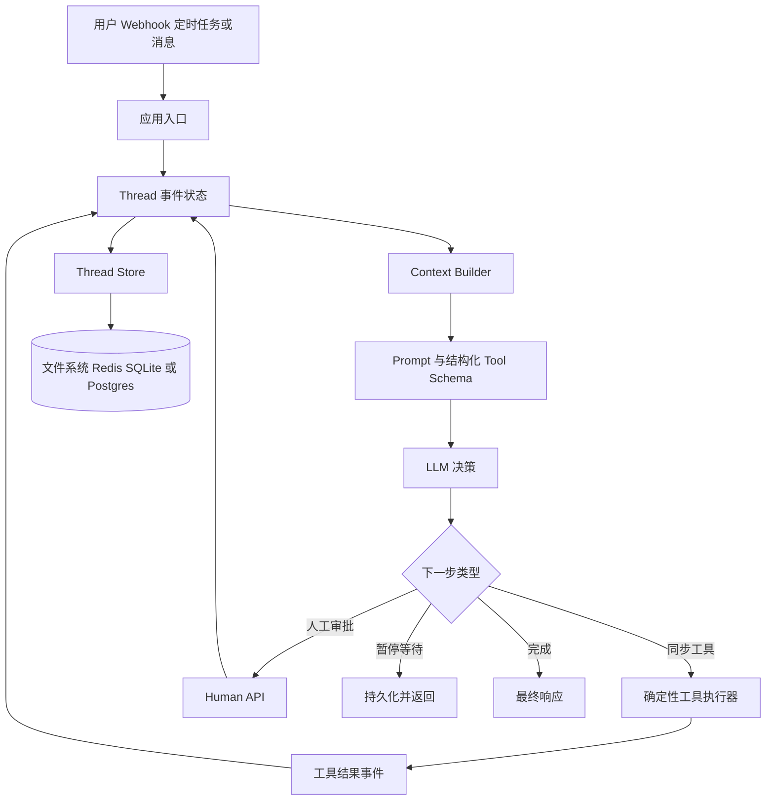
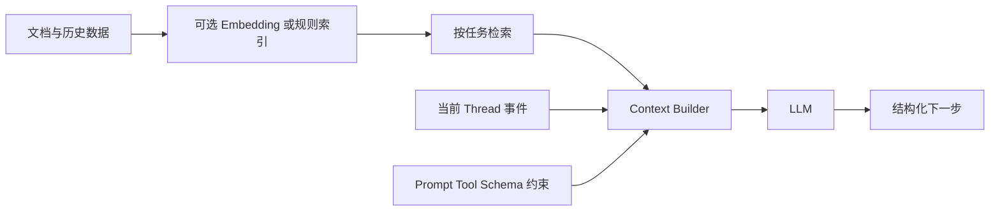
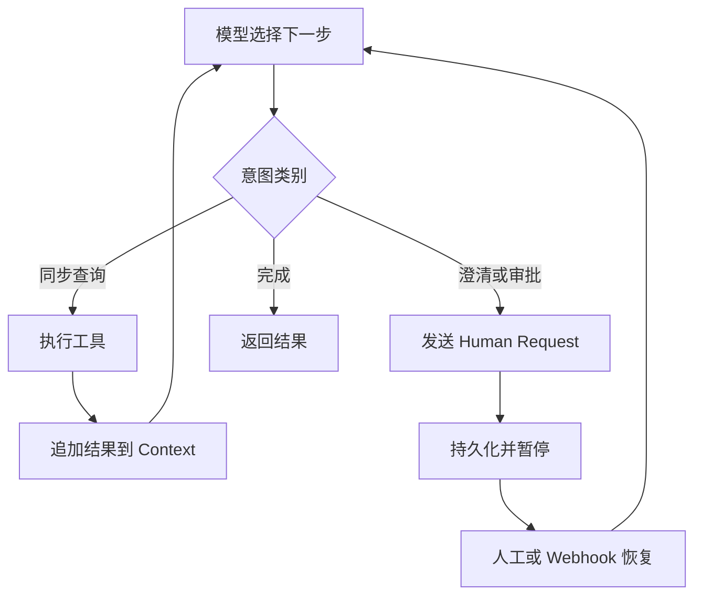
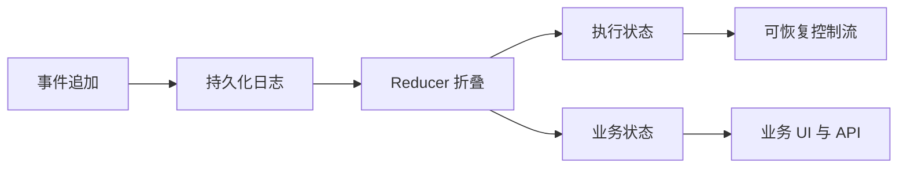
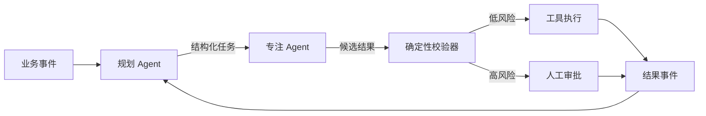

# 【12-factor-agents】核心架构与设计原理深度解析

> 本文基于项目公开仓库在 2026 年 9 月 6 日可见的信息撰写。项目的代码内容采用 Apache 2.0，文档内容采用 CC BY-SA 4.0；具体使用时应以仓库当前 LICENSE 为准。

## 一、引子：真正难的不是让 Agent 跑起来，而是让它可控

一个最小 Agent 往往只有三步：把用户输入交给模型、让模型选择工具、执行工具并把结果放回上下文。演示到这里已经足够，但生产系统很快会遇到另一组问题：

- 哪些状态应该持久化，哪些内容才值得再次送入模型？
- 高风险工具调用如何暂停并等待人工批准？
- 长任务被进程重启、网络断开或上下文压缩后，如何继续？
- 为什么模型明明知道工具，却仍然选择了错误的控制路径？
- 多个产品都需要 Agent 时，应该复制一套 while 循环，还是引入一个巨大框架？

`humanlayer/12-factor-agents` 的答案并不是另一个 Agent SDK，而是一套工程原则：**把 Agent 看成由确定性软件包围的 LLM 决策点**。它反对把全部业务逻辑压缩成一个通用的自主循环，主张开发者拥有 Prompt、Context、Tool、Control Flow、Execution State 和 Human-in-the-loop。

这使它适合用来回答一个更现实的问题：**如何把 LLM 的不确定性限制在可审计、可恢复的边界内？**

## 二、项目定位与核心价值

### 2.1 一句话定义

> 12-factor-agents 是面向生产 LLM 应用的设计原则与可运行模板集合，而不是一个替你接管运行时的全能 Agent 框架。

项目以类似 Twelve-Factor App 的方式，把 Agent 系统拆成十二个可独立采用的因子：

1. 自然语言转工具调用
2. 拥有自己的 Prompt
3. 拥有自己的 Context Window
4. 工具就是结构化输出
5. 统一执行状态与业务状态
6. 用简单 API 启动、暂停、恢复
7. 用工具联系人工
8. 拥有自己的控制流
9. 将错误压缩为上下文
10. 小而专注的 Agent
11. 从任何地方触发，并在用户所在的渠道响应
12. 把 Agent 做成无状态 reducer

### 2.2 仓库概览

| 项目 | 信息 |
| --- | --- |
| GitHub | [humanlayer/12-factor-agents](https://github.com/humanlayer/12-factor-agents) |
| Stars | 约 25.7k（调研时 GitHub API 返回值） |
| 主要内容 | Markdown 原则、TypeScript 模板、BAML 示例 |
| 默认分支 | main |
| 代码许可 | 仓库 API 返回 `NOASSERTION`，README 标注 Apache 2.0 代码许可 |
| 文档许可 | README 标注 CC BY-SA 4.0 |
| 近况 | 调研时最近推送时间为 2025-09-21；项目影响力高，但不满足严格的近 30 天活跃过滤，因此本文明确将其定位为方法论与模板分析，而非宣称其近期提交活跃 |

### 2.3 它解决的不是模型能力问题

项目没有把重点放在更高 temperature、更大的模型或新的 embedding 模型上，而是把 LLM 当作一个近似无状态函数：

```text
下一步 = LLM(系统指令 + 当前上下文 + 结构化输出约束)
```

因此，质量提升主要来自输入和边界设计：

- Context 是否只包含当前决策需要的事实？
- Tool Schema 是否表达了足够清楚的动作边界？
- 失败结果是否以可恢复的形式反馈？
- 控制流是否允许暂停，而不是强迫模型继续循环？

## 三、总体架构：LLM 只负责决策，应用负责现实



图中最重要的边界是 `M` 与 `X` 之间：模型提出结构化意图，应用决定是否执行、何时执行以及执行失败后怎样恢复。Agent 并不是一个包住所有副作用的黑盒，而是一个**状态变换器**。

### 3.1 四层职责

| 层 | 职责 | 是否应该由模型决定 |
| --- | --- | --- |
| Agent 决策层 | 从当前上下文选择下一意图 | 是，但只输出受约束结构 |
| Context 层 | 组织历史、检索结果、工具结果和规则 | 否，由应用掌控 |
| Tool 层 | 执行 API、数据库、代码或人工沟通 | 否，执行必须确定且可审计 |
| Model 层 | 生成结构化决策 | 只负责推理，不直接拥有业务状态 |

## 四、核心循环：不是永远循环，而是按意图分叉

README 给出的基本 Agent 循环可以抽象为以下真实可运行 Python 示例。它不依赖外部服务，用一个本地决策器模拟 LLM，展示同一套控制流如何区分同步工具、人工等待和完成。

```python
# 来自 humanlayer/12-factor-agents README.md 的 Agent Loop 思路
from dataclasses import dataclass, field
from typing import Any

@dataclass
class Event:
    kind: str
    data: Any

@dataclass
class Thread:
    events: list[Event] = field(default_factory=list)

    def context(self) -> str:
        return "\n".join(f"<{e.kind}> {e.data} </{e.kind}>" for e in self.events)

def determine_next_step(thread: Thread) -> dict[str, Any]:
    """可替换成真实 LLM structured output；这里用确定性规则演示。"""
    if not any(e.kind == "tags_result" for e in thread.events):
        return {"intent": "fetch_tags"}
    if not any(e.kind == "approval_request" for e in thread.events):
        return {"intent": "request_approval", "target": "deploy"}
    return {"intent": "done", "answer": "已完成审批前的准备工作"}

def run_agent(thread: Thread) -> Thread:
    while True:
        step = determine_next_step(thread)
        thread.events.append(Event("tool_call", step))

        if step["intent"] == "fetch_tags":
            tags = ["v1.2.3", "v1.2.2"]
            thread.events.append(Event("tags_result", tags))
            continue

        if step["intent"] == "request_approval":
            thread.events.append(Event("approval_request", step))
            # 关键：持久化后退出，而不是 while sleep 等待人工
            return thread

        if step["intent"] == "done":
            thread.events.append(Event("final", step["answer"]))
            return thread

if __name__ == "__main__":
    result = run_agent(Thread([Event("user", "准备发布后端")]))
    for event in result.events:
        print(event.kind, ":", event.data)
```

这个例子体现了项目的核心思想：

- `fetch_tags` 是同步步骤，工具结果回到上下文后继续决策。
- `request_approval` 是异步步骤，任务落盘并退出。
- 后续人工回复可以重新加载 Thread，再调用同一个 reducer。

## 五、拥有 Context Window：上下文是应用的主接口

### 5.1 Context 不是聊天记录的同义词

项目把 Context 定义得更宽：

- Prompt 与指令
- RAG 文档与外部数据
- 历史工具调用及其结果
- 相关会话的记忆
- 输出格式与工具 schema
- 错误、重试与恢复线索

传统 SDK 往往默认使用 `system/user/assistant/tool` 消息序列。12-factor-agents 并不否定标准格式，而是强调：**当业务需要时，可以自定义上下文表示，以提高信息密度、可控性和 token 效率。**

### 5.2 XML 风格事件序列

仓库模板中的 `Thread.serializeForLLM()` 将事件序列化为带标签文本。下面是同样思想的独立实现：

```python
# 来自 packages/create-12-factor-agent/template/src/agent.ts 的 Thread 序列化思路
from dataclasses import dataclass
from typing import Any
import json

@dataclass
class Event:
    type: str
    data: Any

class Context:
    def __init__(self) -> None:
        self.events: list[Event] = []

    def append(self, event_type: str, data: Any) -> None:
        self.events.append(Event(event_type, data))

    def serialize_one(self, event: Event) -> str:
        payload = event.data if isinstance(event.data, str) else json.dumps(
            event.data, ensure_ascii=False, indent=2
        )
        return f"<{event.type}>\n{payload}\n</{event.type}>"

    def serialize_for_llm(self) -> str:
        return "\n\n".join(self.serialize_one(e) for e in self.events)

if __name__ == "__main__":
    c = Context()
    c.append("user_message", "查询最新版本并准备发布")
    c.append("tool_call", {"intent": "list_tags"})
    c.append("tool_result", {"tags": ["v1.2.3"]})
    print(c.serialize_for_llm())
```

这种格式的价值不是 XML 本身，而是**让事件类型成为可观测协议**。模型可以区分原始请求、意图、工具结果和错误；应用也能在发送前删除敏感字段、压缩已经解决的错误，或只保留与当前任务相关的历史。

### 5.3 RAG 与 Memory 在哪里

项目不是向量数据库，也没有规定某个 embedding 实现。它对 RAG 和 Memory 的态度是分层的：



也就是说，向量检索不是 Agent 的核心循环，而是 Context Builder 的一种输入来源。这样做有两个好处：

1. 更换向量库不会改变 Agent 控制流。
2. 应用可以根据任务选择 RAG、SQL、全文搜索或直接读取业务状态。

### 5.4 上下文压缩的工程策略

当上下文接近上限时，不应该简单截断最早消息。更可控的策略是：

- 保留当前未完成任务和最近决策。
- 把已经解决的工具错误压缩为一条事实。
- 将大段工具输出替换为摘要和可重新获取的引用。
- 删除不会影响下一步决策的中间事件。
- 对敏感字段执行脱敏，而不是把完整历史全部传给模型。

## 六、Tool 是结构化输出，不是模型直接执行的函数

模型输出工具调用，本质上是一个受 schema 约束的结构化结果。真正执行工具的仍然是应用代码。这个边界允许我们加入权限、审批、幂等、超时和审计。

```python
# 来自 packages/create-12-factor-agent/template/src/agent.ts 的 handleNextStep 思路
from typing import TypedDict, Literal

class AddCall(TypedDict):
    intent: Literal["add"]
    a: float
    b: float

class DivideCall(TypedDict):
    intent: Literal["divide"]
    a: float
    b: float


def execute_calculator(step: AddCall | DivideCall) -> float:
    if step["intent"] == "add":
        return step["a"] + step["b"]
    if step["b"] == 0:
        raise ValueError("division by zero")
    return step["a"] / step["b"]

if __name__ == "__main__":
    print(execute_calculator({"intent": "add", "a": 2, "b": 3}))
    print(execute_calculator({"intent": "divide", "a": 8, "b": 2}))
```

这里有一个容易被忽略的设计判断：**工具列表不等于权限列表**。即使模型能输出 `deploy_backend`，应用也可以根据用户、环境、风险等级和审批状态拒绝执行。

## 七、Own your control flow：把暂停、重试和人工协作写进业务逻辑

项目认为通用 `while tool_call` 循环无法覆盖生产系统的全部控制流。至少需要区分三类路径：

| 路径 | 模型输出 | 应用动作 |
| --- | --- | --- |
| 同步查询 | `fetch_open_issues` | 执行、追加结果、继续循环 |
| 需要澄清 | `request_clarification` | 发给人工、保存 Thread、退出 |
| 高风险操作 | `deploy_backend` | 创建审批请求、保存 Thread、退出 |
| 长任务 | `start_training` | 发起任务、等待 webhook、恢复 Thread |
| 完成 | `done_for_now` | 返回最终响应 |



### 7.1 高风险操作的审批边界

审批必须发生在工具选择与工具执行之间，而不是工具执行之后。一个最小的安全实现如下：

```python
# 来自 content/factor-08-own-your-control-flow.md 的审批边界
from dataclasses import dataclass

@dataclass
class Approval:
    approved: bool
    comment: str = ""

def dispatch(step: dict, approval: Approval | None = None) -> str:
    if step["intent"] == "deploy_backend":
        if approval is None:
            return "PAUSED: waiting for human approval"
        if not approval.approved:
            return f"REJECTED: {approval.comment or 'human rejected'}"
        return "EXECUTED: deploy_backend"
    return "EXECUTED: low-risk step"

if __name__ == "__main__":
    step = {"intent": "deploy_backend"}
    print(dispatch(step))
    print(dispatch(step, Approval(False, "生产窗口未开放")))
    print(dispatch(step, Approval(True, "批准")))
```

### 7.2 Human API 与 A2H 思路

模板包含 A2H 类型定义：Agent 向服务发送 `Message`，其中可以带 `response_schema`；人工响应再以结构化结果回到 Agent。审批不是一条无法解析的聊天文本，而是可以验证的对象：

```typescript
// 来自 packages/create-12-factor-agent/template/src/a2h.ts
import { z } from "zod";

const ApprovalSchema = z.object({
  approved: z.boolean(),
  comment: z.string().optional(),
});

type Approval = z.infer<typeof ApprovalSchema>;

export function parseApproval(input: unknown): Approval {
  return ApprovalSchema.parse(input);
}

console.log(parseApproval({ approved: true, comment: "已检查变更" }));
```

结构化人工反馈同时改善了审计和恢复：系统可以知道谁批准了什么，也可以在恢复时把批准对象作为 Context 事件，而不是依赖模型猜测一段自然语言的含义。

## 八、统一执行状态与业务状态

一个常见错误是把 Agent 执行状态留在队列、内存或框架内部，把业务状态另存到数据库。两套状态一旦不同步，就会出现：

- UI 显示已完成，但业务记录仍是处理中。
- 工具已执行，Agent 却因崩溃不知道结果。
- 重试重复扣款、重复发邮件或重复部署。

项目的建议是让 Thread 事件成为统一事实来源。执行状态可以由事件折叠出来：



这是一种事件溯源风格，但项目没有强制某个数据库。核心要求是：

1. 每个副作用都有可识别的意图和结果。
2. 结果持久化后才允许进入下一步。
3. 恢复时根据已存在事件判断是否已经执行。
4. 工具需要幂等键时，将其作为事件数据的一部分。

## 九、Thread Store：文件系统只是起点

模板的 `FileSystemThreadStore` 同时保存两份文件：一个 JSON 保存完整事件，另一个文本保存给 LLM 的序列化上下文。这个设计很有启发性：**机器事实和模型视图可以分离**。

```typescript
// 来自 packages/create-12-factor-agent/template/src/state.ts
import crypto from "crypto";
import fs from "fs/promises";
import path from "path";

export interface Thread {
  events: Array<{ type: string; data: unknown }>;
  serializeForLLM(): string;
}

export class FileSystemThreadStore {
  private dir = path.join(process.cwd(), ".threads");

  async create(thread: Thread): Promise<string> {
    await fs.mkdir(this.dir, { recursive: true });
    const id = crypto.randomUUID();
    await Promise.all([
      fs.writeFile(path.join(this.dir, `${id}.json`), JSON.stringify(thread, null, 2)),
      fs.writeFile(path.join(this.dir, `${id}.txt`), thread.serializeForLLM()),
    ]);
    return id;
  }
}
```

生产环境可以替换为 Redis、SQLite、Postgres 或事件流，但不应改变上层接口。这里的抽象不是为了隐藏数据库，而是为了保持 Agent 控制流不依赖存储实现。

## 十、Stateless Reducer：Agent 可以无状态，系统不能无状态

标题中的无状态不是指丢掉历史，而是指 Agent 函数本身不依赖进程内隐藏变量：

```text
next_thread = reducer(current_thread, external_event, llm_output, tool_result)
```

同样的 Thread 和新事件，应该能得到可解释的下一状态。这带来三个直接收益：

- 进程重启后可恢复。
- 任务可以从 API、Webhook、定时器或队列任意触发。
- 测试可以用固定事件重放，而不必启动整个 Agent 进程。

```python
# 来自 content/factor-12-stateless-reducer.md 的 reducer 思路
from dataclasses import dataclass, replace

@dataclass(frozen=True)
class State:
    status: str
    count: int = 0
    message: str = ""

def reduce_state(state: State, event: dict) -> State:
    kind = event["kind"]
    if kind == "started":
        return replace(state, status="running")
    if kind == "step_completed":
        return replace(state, count=state.count + 1)
    if kind == "paused":
        return replace(state, status="paused", message=event.get("reason", ""))
    if kind == "resumed":
        return replace(state, status="running")
    if kind == "finished":
        return replace(state, status="done")
    raise ValueError(f"unknown event: {kind}")

if __name__ == "__main__":
    s = State("new")
    for e in [
        {"kind": "started"},
        {"kind": "step_completed"},
        {"kind": "paused", "reason": "等待人工"},
        {"kind": "resumed"},
        {"kind": "finished"},
    ]:
        s = reduce_state(s, e)
        print(s)
```

## 十一、错误不是日志，而是下一轮 Context 的输入

项目的第九条因子强调把错误压缩为上下文。错误处理不应只是 `print(exception)`，而应回答：

- 哪一步失败？
- 输入是什么？
- 是否已经产生副作用？
- 可重试、需人工介入，还是应该终止？
- 下一次模型决策需要知道什么？

```python
# 来自 content/factor-09-compact-errors.md 所强调的错误上下文思路
from dataclasses import dataclass

@dataclass
class ToolError:
    tool: str
    category: str
    retryable: bool
    safe_summary: str

def compact_error(tool: str, exc: Exception) -> ToolError:
    if isinstance(exc, TimeoutError):
        return ToolError(tool, "timeout", True, "外部服务超时，尚未确认副作用")
    if isinstance(exc, PermissionError):
        return ToolError(tool, "permission", False, "权限不足，需要人工检查凭据")
    return ToolError(tool, "unknown", False, f"工具失败：{type(exc).__name__}")

if __name__ == "__main__":
    print(compact_error("deploy", TimeoutError()))
    print(compact_error("deploy", PermissionError()))
```

错误压缩还有安全价值：原始异常可能包含 token、内部 URL 或用户隐私。向模型发送经过分类和脱敏的错误，比把完整堆栈直接塞入上下文更稳健。

## 十二、小而专注的 Agent 与多 Agent 协作

12-factor-agents 并不把多 Agent 协作描述为越多角色越先进。它更接近这样的拆分：

- 一个 Agent 负责规划或判断。
- 一个小 Agent 负责特定领域分类。
- 确定性程序负责副作用。
- 人工负责不可逆或高风险决策。

小 Agent 的优势是上下文更短、工具集合更小、评测边界更清晰。代价是需要在 Agent 之间设计事件协议和 handoff。



与自由对话式多 Agent 不同，这种模式把协作关系放在结构化事件上。每个参与者都可以替换，只要输入输出协议保持稳定。

## 十三、与同类项目的设计差异

本文不把项目与其他框架做功能清单式比较，而是比较它们把不确定性放在哪里。

| 项目 | 核心抽象 | 控制流归属 | Context 归属 | 主要取舍 |
| --- | --- | --- | --- | --- |
| 12-factor-agents | 原则、事件、Reducer、应用模板 | 业务代码 | 应用自建 | 灵活可控，但需要自己完成工程集成 |
| LangGraph | 状态图与节点 | 图运行时 | 图状态与节点逻辑 | 图结构清晰，适合显式工作流，但需适应图模型 |
| CrewAI | 角色、任务、团队 | 框架编排 | 角色与任务上下文 | 上手直观，角色协作快，但业务边界容易被框架抽象包住 |
| OpenAI Agents SDK | Agent、工具、handoff | SDK 循环与 handoff | 消息与运行时上下文 | Provider 体验统一，但控制面仍依赖 SDK 约定 |

### 13.1 与 LangGraph：图优先 vs 应用优先

LangGraph 让节点和边成为一等公民，适合需要可视化、检查点和明确拓扑的流程。12-factor-agents 则不要求所有业务都先建图：简单任务可以是普通函数和事件 reducer，复杂流程才引入图或状态机。

差异不在于谁能循环，而在于**控制流的所有权**：LangGraph 提供一个运行时模型；12-factor-agents 提醒你不要为了使用框架而放弃业务控制流。

### 13.2 与 CrewAI：角色优先 vs 意图优先

CrewAI 的抽象是角色和任务，开发者通过角色描述驱动团队协作。12-factor-agents 更关心一个意图何时被执行、何时暂停、怎样恢复。角色可以存在，但不是必须存在的运行时实体。

因此，前者适合快速表达协作叙事；后者适合把 Agent 嵌入已有订单、审批、工单和任务系统。

### 13.3 与 OpenAI Agents SDK：SDK 优先 vs 边界优先

OpenAI Agents SDK 通过统一 API 提供工具、handoff、guardrail 等能力，降低初始开发成本。12-factor-agents 则把 Prompt、Context、Thread Store、控制流和模型调用尽量留在应用侧，以避免长期依赖某个运行时抽象。

这并不意味着二者互斥：可以使用 SDK 做模型调用，同时采用 12-factor 的状态和控制流原则。

## 十四、优缺点：简洁性与扩展性换来的责任

| 左侧：架构简洁性 / 扩展性 / 易用性 | 右侧：性能 / 复杂度 / 维护性 |
| --- | --- |
| 不绑定单一 Agent 框架，普通函数即可开始 | 需要团队自己实现重试、幂等、可观测和权限边界 |
| Thread 事件让暂停与恢复成为自然能力 | 每个外部副作用都要设计事件模型，初期代码量增加 |
| Context Builder 可自由接入 RAG、SQL 或 API | 自定义上下文格式需要自行评测 token 效率和模型兼容性 |
| Tool 是结构化输出，便于审批和安全检查 | Schema 设计不严谨时，模型会在合法格式内做错误决策 |
| Stateless reducer 支持回放和水平扩展 | 事件版本迁移、重复事件和并发写入需要长期治理 |
| 小 Agent 限制上下文和工具范围 | 多 Agent 之间的协议、路由和调试成本会上升 |
| 文件系统模板容易本地试用 | 文件存储不适合高并发，生产环境必须替换为可靠存储 |

### 14.1 性能判断

项目不提供一个统一的性能基准，因为它不是固定运行时。性能瓶颈主要来自：

- LLM 往返次数与上下文 token 数。
- 工具执行和外部 API 延迟。
- 持久化频率及事件大小。
- 并发任务对同一业务实体的冲突。

它的优化方向也很明确：让同步工具尽量一次完成、让错误和历史压缩、让人工等待不占用 worker、让工具结果可缓存，并在低风险步骤使用更小模型。

## 十五、实践：从零实现一个可暂停的 Agent

下面给出一个不依赖 LLM API 的完整最小版本，便于读者先验证架构，再替换 `decide()`。

```python
# 可直接运行：python3 minimal_agent.py
from dataclasses import dataclass, field
import json
from pathlib import Path

@dataclass
class AgentState:
    events: list[dict] = field(default_factory=list)

    def save(self, filename: str = "agent-state.json") -> None:
        Path(filename).write_text(json.dumps(self.events, ensure_ascii=False, indent=2))

    @classmethod
    def load(cls, filename: str = "agent-state.json") -> "AgentState":
        p = Path(filename)
        return cls(json.loads(p.read_text())) if p.exists() else cls()

def decide(state: AgentState) -> dict:
    kinds = {e["kind"] for e in state.events}
    if "lookup_done" not in kinds:
        return {"intent": "lookup"}
    if "approval" not in kinds:
        return {"intent": "approval", "question": "是否继续执行高风险操作？"}
    if state.events[-1].get("kind") == "approval" and state.events[-1].get("approved"):
        return {"intent": "finish", "answer": "任务完成"}
    return {"intent": "finish", "answer": "任务因未批准而结束"}

def run(state: AgentState) -> AgentState:
    while True:
        step = decide(state)
        state.events.append({"kind": "decision", "data": step})
        if step["intent"] == "lookup":
            state.events.append({"kind": "lookup_done", "value": ["v1.2.3"]})
            continue
        if step["intent"] == "approval":
            state.events.append({"kind": "approval_request", "question": step["question"]})
            state.save()
            print(step["question"], "状态已保存，进程可以退出")
            return state
        state.events.append({"kind": "final", "value": step["answer"]})
        state.save()
        print(step["answer"])
        return state

if __name__ == "__main__":
    run(AgentState.load())
```

要恢复审批，可以增加一个单独命令，将 `approval` 事件追加到文件，再重新执行 `run()`。生产实现还应加入：

- 事件 ID 与幂等键。
- 乐观锁或数据库事务。
- 工具超时和重试上限。
- 用户身份、权限和审批有效期。
- Prompt、模型版本和 Tool Schema 的版本记录。
- OpenTelemetry trace 与业务事件关联。

## 十六、落地检查清单

在已有系统中采用这套原则，可以按以下顺序渐进改造：

### 第一步：先把模型输出结构化

不要先追求自主循环。先定义 `intent`、参数、完成和请求人工等有限状态，并拒绝未知意图。

### 第二步：建立 Thread 事件

把用户输入、模型决策、工具调用、工具结果、错误和人工响应都保存为事件。先用文件或 SQLite 验证，再迁移到服务化存储。

### 第三步：把控制流从 Prompt 中拿出来

Prompt 可以告诉模型任务规则，但暂停、审批、重试和超时应由应用代码执行。

### 第四步：分离机器事实与模型视图

完整事件用于审计和恢复；`serializeForLLM()` 只生成当前模型需要的上下文。不要因为模型看过某字段，就认为系统事实只能以同一格式存储。

### 第五步：最后才引入 RAG 和多 Agent

先让单 Agent 的状态、工具和控制流可靠，再扩大检索范围或拆分角色。否则 RAG、多个 Agent 和复杂框架只会放大不可观测性。

## 十七、趋势判断：Agent 正从 Prompt 演示走向业务运行时

### 17.1 Context Engineering 会成为应用层基础设施

随着模型上下文越来越大，瓶颈不会自动消失。无关内容过多会降低注意力质量、增加成本并扩大隐私泄露面。Context Builder、压缩、检索和事件选择会像缓存与数据库一样成为应用基础设施。

### 17.2 人机协作会从聊天功能变成协议

审批、澄清和补充信息不应依赖人工阅读一段长文本后再手工操作。A2H 这类结构化消息会让人工成为控制流中的正式参与者。

### 17.3 可恢复性将比自主性更重要

在真实业务中，网络断开、服务重启、审批等待和外部系统延迟都是常态。一个能可靠暂停、恢复、回放和幂等执行的 Agent，通常比一个能连续运行数小时但无法解释的 Agent 更有价值。

### 17.4 框架会变薄，业务边界会变厚

未来的 Agent 框架可能更多提供模型适配、schema、trace 和基础存储，而把业务控制流交还给应用。12-factor-agents 的长期价值正在这里：它不是要求大家照抄某个 API，而是提供了一组判断标准。

## 十八、总结

12-factor-agents 最值得借鉴的不是十二条口号，而是它对 Agent 边界的重新划分：

1. LLM 负责在有限结构中提出下一步。
2. 应用拥有 Context 的构造与筛选。
3. Tool 是结构化意图，不是模型直接拥有的副作用。
4. 控制流必须支持同步、暂停、审批、重试和恢复。
5. Thread 事件把执行状态与业务状态连接起来。
6. Agent 可以是无状态 reducer，但系统必须保留可回放事实。
7. RAG、Memory 和多 Agent 都应作为可替换的输入或协作层，而不是吞掉整个应用。

如果你正在从零构建 Agent，最稳妥的起点不是安装更多框架，而是先回答三个问题：**下一步由谁决定？事实保存在哪里？高风险动作如何暂停？** 这三个问题的答案，基本决定了系统能否从 Demo 走到生产。

## 附录：关键资源

- 项目仓库：[humanlayer/12-factor-agents](https://github.com/humanlayer/12-factor-agents)
- README：[12-factor-agents README](https://github.com/humanlayer/12-factor-agents/blob/main/README.md)
- Context 原则：[Factor 3: Own your context window](https://github.com/humanlayer/12-factor-agents/blob/main/content/factor-03-own-your-context-window.md)
- 控制流原则：[Factor 8: Own your control flow](https://github.com/humanlayer/12-factor-agents/blob/main/content/factor-08-own-your-control-flow.md)
- 无状态 reducer：[Factor 12: Make your agent a stateless reducer](https://github.com/humanlayer/12-factor-agents/blob/main/content/factor-12-stateless-reducer.md)
- TypeScript 模板：[create-12-factor-agent](https://github.com/humanlayer/12-factor-agents/tree/main/packages/create-12-factor-agent)
