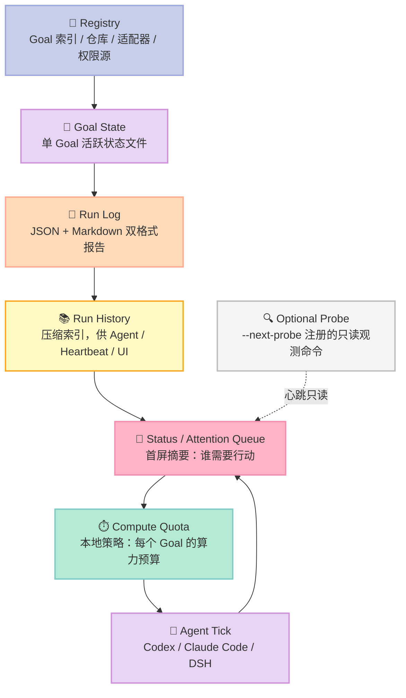
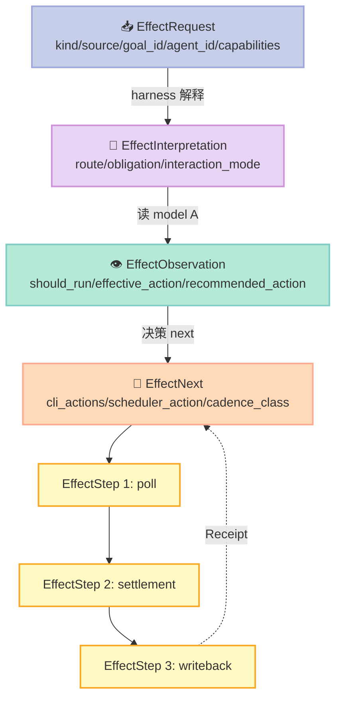
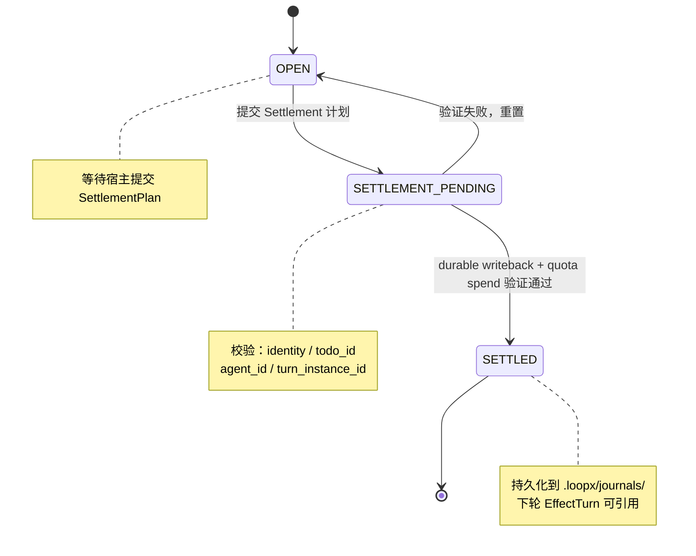
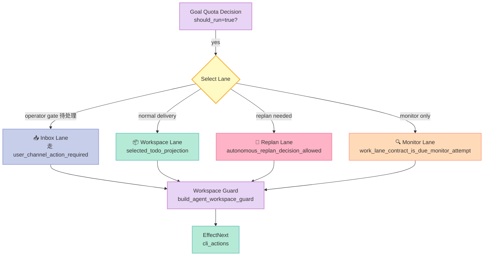

## 引子

2026 年的 AI Agent 社区，几乎所有 Harness Engineering 讨论都默认了一个假设：**Agent 在一次会话内完成任务**。但如果你把视角放大到 200 小时、20 次重启、4 类宿主切换的尺度，这个假设会立刻崩塌：

1. **目标漂移**：周一的 Objective，到了周三已经被 Agent 改成"顺带优化一下"的产物；周五产出的 evidence 来自两周前的代码分支，**没人记得"为什么是这个 todo"**。
2. **算力失控**：你说"每小时最多 1 次 Claude Code turn"，结果 Agent 因为上下文塞满，每小时跑了 12 次；chat memory 没有"算力预算"这一概念。
3. **宿主碎片化**：周一在 Codex App 跑，周三切到 Claude Code，周五 DSH 自托管；每个宿主对"Goal"的理解都不一样——state 该放在哪、permission 怎么对齐、recover 时丢多少？

[huangruiteng/loopx](https://github.com/huangruiteng/loopx)（⭐5,630，Apache-2.0，912 个 Python 文件）是 2025 年至今成长最快的「**Provider-neutral 长时 Agent 控制平面**」之一。它的设计哲学用一句话概括：

> **"Agent runtimes execute the work. LoopX governs the state that lets engineering, research, discovery, and operations loops continue across runs."**

LoopX **不取代任何 Agent Harness**（Codex / Claude Code / Cursor / DSH），而是作为"包裹层"运行在它们之上，把"目标、门禁、待办、证据、配额、移交"这 6 个状态放到一个**单一可信源**，让跨会话、跨宿主、跨周的工作变得**可重放、可治理、可交接**。

本文围绕 LoopX 的核心架构展开：6 层持久化契约、Quota 7 态有限状态机、`EffectRequest → EffectInterpretation → EffectObservation → EffectNext` 的 effect-program 解释器、Settlement Receipt 三相回放、以及 **3 种主流 Agent 宿主（Codex App / Claude Code / DSH）的 Goal 适配器**。最后对比 Ouroboros / LongHorizon-Harness / Karpathy autoresearch 在"自治循环"上的设计差异。

## 一、项目定位与 Harness 6 件套矩阵

### 1.1 一句话定义

**LoopX = Open + Provider-neutral + Local-first + Stateful 控制平面，专门为多日、多宿主、多 Agent 协作的"长时 Loop"设计**。

它不运行任何 LLM，只做以下 4 件事：
1. **持久化** Goal / Todo / Evidence / Run / Quota 5 类状态到本地文件系统
2. **决策** 每个 tick 是否该让 Agent 跑（基于 quota、health、gate、scheduler hint）
3. **解释** Agent 的 effect request（CLI 命令）→ execution obligation（type-checked plan）
4. **回放** Settlement Receipt 决定 turn-scoped monitor / replay / terminal 三相

### 1.2 能力矩阵

| 能力 | 是否原生支持 | 备注 |
|------|-------------|------|
| 📂 本地优先 Goal Registry | ✅ | `.loopx/registry.json` + `.codex/goals/` 双栈兼容 |
| 📊 Quota Compute（7 态有限状态机） | ✅ | `blocked_health / operator_gate / focus_wait / eligible / waiting / throttled / paused` |
| 🎯 Goal-Claim / Lease 协议 | ✅ | `claimed_by / blocks_agent / bound_agent / excluded_agents` 4 字段 |
| 🪝 Effect Interpreter（Request → Obs → Next） | ✅ | `EffectRequest / Interpretation / Observation / Next` 4 dataclass |
| 📜 Settlement Receipt 三相 | ✅ | `OPEN / SETTLEMENT_PENDING / SETTLED`，含 `ReceiptBoundMonitorPhase` + `ReceiptBoundReplayPhase` |
| 🧠 Sub-Agent Peer 协作（无 Leader） | ✅ | Registered agents are peers，CLAIM/MONITOR/REPLAN/GATE 都可对等触发 |
| 🪜 4 档 Agent Lane | ✅ | `inbox / workspace / replan / monitor` |
| 🔌 3 套宿主适配 | ✅ | Codex App / Claude Code / DSH（含 goal-mode adapters） |
| 🛡️ Self-Repair 反 stall | ✅ | `boundary_projection_repair` 兜底 |
| ⏸️ Goal-Level Hard Pause | ✅ | `quota.compute=0` 一键冻结（区别于 agent-level `monitor_only`） |
| 📡 Heartbeat 自动化 | ✅ | Codex App Scheduler Hook 集成 |
| 🖥️ Dashboard（浏览器 + PWA） | ✅ | `loopx dashboard` 一行启动 |
| 💼 Desktop（实验性 Tauri） | ✅ | `apps/desktop/loopx-control-plane` 复用同一组 loopback 服务 |
| 📦 Workflow Skills 安装器 | ✅ | `loopx workflow-skills --install` 把 skill facade 注入宿主 |
| 🧪 本地优先 + 可重放 | ✅ | evidence / decision / state 全留盘 |

### 1.3 在 Harness 6 件套中的位置

| 组件 | 主角 | LoopX 的角色 |
|------|------|--------------|
| **Rule** | `agents-md` / `Ruler` | LoopX 不直接管 Rule，但 Goal 注册表里可以声明 capability gate（隐式 Rule） |
| **Skill** | `Skill-MD` / `Tons of Skills` | LoopX 通过 `loopx slash-commands --install --surface {host}` 把 skill facade 注入 Codex / Claude Code / DSH |
| **Sub-Agent** | `AGT Sub-Agent` / `GoClaw` | LoopX 用 peer coordination 协议（无 Leader）支持多 Agent CLAIM/GATE |
| **Workflow** | `LangGraph` / `Inngest` / `flow-next` | LoopX 的 Goal + Todo + Effect Program 是"接力赛协议"——但 state 由 LoopX 持久 |
| **Script** | `Master Gatekeeper` | LoopX 的 `quota should-run` + `quota_settlement_validation` 是硬关卡 |
| **MCP** | `mcp-memory-service` / `chrome-devtools-mcp` | LoopX 提供 `loopx_mcp` 服务（`loopx/claude_goal_mode/mcp/loopx_mcp.py`），让 Claude Code 把 LoopX 当 MCP Server 调用 |

**LoopX 的本质**：它是 **Workflow 组件** + **Sub-Agent 组件** 的"长时版本"——把"对话内接力"扩展到"对话间接力"，把"单 Agent 上下文隔离"扩展到"跨宿主编排"。

## 二、架构总览：6 层持久化契约

LoopX 的全部持久化数据落在 `.loopx/` 和 `.codex/goals/` 两个目录下，按 6 层契约组织：



**6 层的设计哲学**：每层都同时承担**存储**和**计算**两个角色——它不只存数据，还解释下一轮的 effect request。这就是 LoopX 文档里反复强调的「**Control Plane as Effect Interpreter**」：

```text
model → effect request → harness interprets effect → observation → model
```

- **读模型（`A`）**：Registry + Goal State + Run History
- **投影（`F[B]`）**：Status + Attention Queue + Run Summaries
- **决策（`A => F[QuotaDecision]`）**：quota + interaction contract + capability gates + work-lane routing + scheduler hints
- **处理器（`next_effect`）**：CLI actions / scheduler ACK / writeback / spend

## 三、核心机制一：Quota 7 态有限状态机

LoopX 把"Agent 什么时候能跑"这个看似简单的问题，拆成了一个**严格有序的 7 态有限状态机**。源码在 `loopx/control_plane/quota/states.py`（仅 60 行，但被全文 26+ 文件引用）：

```python
# loopx/control_plane/quota/states.py
from __future__ import annotations

from enum import Enum
from typing import Any


QUOTA_STATE_ORDER = (
    "blocked_health",
    "operator_gate",
    "focus_wait",
    "eligible",
    "waiting",
    "throttled",
    "paused",
)


class AutomaticTurnPauseCause(str, Enum):
    """Typed owner-policy reason that hard-pauses automatic Goal turns."""

    GOAL_STOPPED = "goal_stopped"
    COMPUTE_QUOTA_ZERO = "compute_quota_zero"


def automatic_turn_pause_cause(item: dict[str, Any]) -> AutomaticTurnPauseCause | None:
    """Read pause cause from item.quota, with typed enum coercion."""
    raw_quota = item.get("quota")
    quota = raw_quota if isinstance(raw_quota, dict) else {}
    raw_cause = str(quota.get("pause_cause") or "").strip()
    if raw_cause:
        try:
            return AutomaticTurnPauseCause(raw_cause)
        except ValueError:
            return None
    if str(quota.get("goal_activation_state") or "") == "stopped":
        return AutomaticTurnPauseCause.GOAL_STOPPED
    compute = quota.get("compute")
    if (
        isinstance(compute, (int, float))
        and not isinstance(compute, bool)
        and compute <= 0
    ):
        return AutomaticTurnPauseCause.COMPUTE_QUOTA_ZERO
    return None


def quota_item_is_paused(item: dict[str, Any]) -> bool:
    """Return True when a plan item carries a Goal-level hard pause."""
    raw_quota = item.get("quota")
    quota = raw_quota if isinstance(raw_quota, dict) else {}
    if str(quota.get("state") or "") == "paused":
        return True
    return automatic_turn_pause_cause(item) is not None
```

7 个状态按**短路优先级**排序，**前面的状态一旦命中就立刻返回**，后面的状态不再评估：

```mermaid
graph LR
    A["1️⃣ blocked_health<br/>registry 损坏 / 契约失败"] --> B["2️⃣ operator_gate<br/>只读 opt-in / write-control / 生产动作"]
    B --> C["3️⃣ focus_wait<br/>waiting 外部 evidence"]
    C --> D["4️⃣ eligible<br/>可执行"]
    D --> E["5️⃣ waiting<br/>等待 next tick"]
    E --> F["6️⃣ throttled<br/>quota 配额内但降速"]
    F --> G["7️⃣ paused<br/>Goal 级硬冻结"]

    style A fill:#FFB3C6,stroke:#F48FB1,stroke-width:2px,color:#333
    style B fill:#FFB3C6,stroke:#F48FB1,stroke-width:2px,color:#333
    style C fill:#FFF9C4,stroke:#F9A825,stroke-width:2px,color:#333
    style D fill:#B5EAD7,stroke:#80CBC4,stroke-width:2px,color:#333
    style E fill:#C7CEEA,stroke:#9FA8DA,stroke-width:2px,color:#333
    style F fill:#FFDAB9,stroke:#FFAB91,stroke-width:2px,color:#333
    style G fill:#F5F5F5,stroke:#BDBDBD,stroke-width:2px,color:#333
```



**为什么是这个顺序？** 4 个设计哲学：

1. **故障优先于策略**：`blocked_health` 永远在前——registry 写不进去时，不要做任何 AI 推理
2. **人工优于自动**：`operator_gate` 在 `eligible` 之前——写库、生产部署、奖励判断都需 human 显式
3. **证据优先于配额**：`focus_wait` 在 `eligible` 之前——等待 benchmark / 外部 controller 响应时不要消耗算力
4. **暂停是终态**：`paused` 永远是最后——`quota.compute=0` 时，所有 selector lane 都走不通

**Quota 数值表示**（registry 默认值）：

```json
{
  "quota": {
    "compute": 0.5,
    "window_hours": 24,
    "slot_minutes": 1,
    "allowed_slots": 720,
    "spent_slots": 240,
    "state": "eligible",
    "next_eligible_at": "2026-09-06T12:00:00+08:00",
    "reason": "0.5 compute quota, 240/720 minute-slots spent in the current window"
  }
}
```

- `compute=1.0`：满负荷（24h × 60min = 1440 slots）
- `compute=0.5`：半负荷（720 slots）
- `compute=0.0`：**Goal-Level 硬冻结**（与 `monitor_only` 不同——后者是单 Agent lane）

`spent_slots` 由 `quota_slot_spent` runtime events 累计；registry 是策略源，不是账本。

## 四、核心机制二：Effect-Request → Effect-Observation 解释器

LoopX 把每轮 Agent tick 抽象成 **4 个不可变的 dataclass 流转**（`loopx/control_plane/effect_program.py`）：

```python
# loopx/control_plane/effect_program.py（节选）
@dataclass(frozen=True)
class EffectRequest:
    """模型发出的请求——描述意图，不含执行细节"""
    kind: str
    source: str
    goal_id: str | None = None
    agent_id: str | None = None
    capabilities: tuple[str, ...] = ()
    context: Mapping[str, Any] = field(default_factory=dict)


@dataclass(frozen=True)
class EffectInterpretation:
    """LoopX 解释 request 后的路由 + obligation"""
    route: str
    obligation: str
    interaction_mode: str
    capability_action: str | None = None
    cadence_class: str | None = None


@dataclass(frozen=True)
class EffectObservation:
    """当前 goal 的可观察状态快照"""
    decision: str
    should_run: bool
    effective_action: str
    recommended_action: str
    action_portfolio: Mapping[str, Any] | None = None
    planning_horizon: Mapping[str, Any] | None = None
    protocol_summary: str | None = None


@dataclass(frozen=True)
class EffectNext:
    """下一轮 effect 的精确指令"""
    cli_actions: tuple[str, ...] = ()
    execution_mode: str | None = None
    scheduler_action: str | None = None
    cadence_class: str | None = None
    ack_cli_args: tuple[str, ...] = ()
    failure_cli_args: tuple[str, ...] = ()


@dataclass(frozen=True)
class EffectTurn:
    """一轮完整 turn 的不可变快照（request + interpretation + observation + next_effect）"""
    request: EffectRequest
    interpretation: EffectInterpretation
    observation: EffectObservation
    next_effect: EffectNext
```

**核心洞察**：这 4 个 dataclass 都是 `frozen=True`——**每一轮 tick 都是不可变的快照**。新 turn 创建新对象，旧 turn 通过 journal 持久化。这意味着：
- 并发安全（不可变 = 无锁）
- 重放安全（旧 turn 永远不变）
- 调试安全（任意时刻可 dump 当前 `EffectTurn`）

**完整 effect 流转**：



**为什么用 effect-program 而非简单的"should-run"布尔？**

| 简单做法 | LoopX 做法 |
|----------|-----------|
| `should_run: bool` | `EffectObservation` 含 30+ 字段，含 interaction_mode / cadence_class |
| 决策即返回 | 决策即返回，但同时给出 `next_effect.cli_actions`（CLI 命令） |
| 无 receipt 校验 | 必须有 `SettlementResult` 三相回放 |
| 单 Agent | 支持多 lane（`inbox / workspace / replan / monitor`）+ peer coordination |

**Lane（4 档）说明**：

| Lane | 用途 | 进入条件 |
|------|------|----------|
| **inbox** | 用户通知 / pending review | operator gate / human reward 待处理 |
| **workspace** | 正常交付 | normal delivery + selected todo |
| **replan** | 重新规划 | autonomous_replan_decision_allowed |
| **monitor** | 只读监控 | work_lane_contract_is_due_monitor_attempt |

每条 lane 都有**独立的 guard**（workspace_guard / boundary_projection_repair），但都共用同一组 quota 决策。

## 五、核心机制三：Settlement Receipt 三相回放

每个 turn 结束后，LoopX 不会立刻让下一个 turn 跑——它要求宿主提交**Receipt（收据）**。Receipt 必须经过三相回放验证：

```python
# loopx/control_plane/effect_program.py（节选）
class ReceiptBoundMonitorPhase(StrEnum):
    """Monitor lane 的回放阶段"""
    POLL_DUE = "poll_due"
    SETTLEMENT_PENDING = "settlement_pending"
    SETTLED = "settled"


class ReceiptBoundReplayPhase(StrEnum):
    """Replay lane 的回放阶段"""
    OPEN = "open"
    SETTLEMENT_PENDING = "settlement_pending"
    SETTLED = "settled"


def receipt_bound_monitor_phase(
    *,
    poll_present: bool,
    material_change: bool,
    durable_writeback_present: bool,
    quota_spend_present: bool,
) -> ReceiptBoundMonitorPhase | None:
    """基于 4 个 boolean 决定 Monitor phase"""
    result = effect_runtime_result(
        "settlement.receipt_bound_monitor_phase",
        {
            "poll_present": poll_present,
            "material_change": material_change,
            "durable_writeback_present": durable_writeback_present,
            "quota_spend_present": quota_spend_present,
        },
    )
    if result is None:
        return None
    return ReceiptBoundMonitorPhase(str(result))
```

**三相语义**：



**为什么需要 Receipt？** 没有 Receipt 时，长时 Loop 会面临 3 类问题：
1. **重复执行**：Agent 完成一次 turn 后崩溃，重启时不知道上次是否真的成功
2. **写入遗漏**：Agent 说"已写文件 X"，但实际只写了一半
3. **配额错配**：Agent 说"用了一次 turn"，但 quota 没扣；下次又扣一次

Receipt 通过 `SettlementIdentity` dataclass 强制绑定（`loopx/control_plane/quota/slot_accounting.py`）：

```python
@dataclass(frozen=True)
class SettlementIdentity:
    """Receipt 的不可变身份——和 turn-scoped effect 必须完全一致"""
    goal_id: str
    agent_id: str
    todo_id: str | None
    turn_instance_id: str
    replan_obligation_id: str | None
```

任何字段不匹配 → `quota spend binding does not match the original settlement identity` 错误。**Receipt 是 LoopX 防止"Agent 自欺欺人"的关键机制**。

## 六、核心机制四：3 类宿主适配器

LoopX 真正的"魔法"在于：它**不绑定任何 Agent 宿主**。Codex App / Claude Code / DSH 各有各的 turn 协议，LoopX 通过 3 套 adapter 抽象成同一套 `quota should-run` 决策。

### 6.1 Codex App 适配器

Codex App 的 `quota should-run` 集成最自然——它本身就有 heartbeat scheduler。LoopX 提供：

```bash
# Codex App 配置（project .codex/config.toml）
[automation.heartbeat]
prompt = "Run `loopx quota should-run` and dispatch next CLI action."
```

Codex App 每轮心跳自动调 `loopx quota should-run`，LoopX 返回的 `EffectObservation.next_effect.cli_actions` 被 Codex App 当成下一条 CLI 命令执行。

### 6.2 Claude Code 适配器

Claude Code 没有原生 scheduler，LoopX 通过 **MCP Server + Slash Command** 注入（`loopx/claude_goal_mode/mcp/loopx_mcp.py`）：

```bash
# 安装 LoopX 作为 Claude Code 的 MCP Server
loopx workflow-skills --install --surface claude-code
# 在 Claude Code 里用 /loopx <task> 触发
/loopx 实现 Issue #42 的 fix
```

LoopX 通过 MCP 协议向 Claude Code 暴露：
- `quota should-run`：返回 `EffectObservation` + `next_effect.cli_actions`
- `quota spend`：扣配额（绑定 `SettlementIdentity`）
- `goal status`：读 Goal State

### 6.3 DSH（DeepSeek Harness）适配器

DSH 是 LoopX 的"原生宿主"——LoopX 提供 **native plugin**（`packages/dsh-loopx-plugin/`），DSH session 内直接 `/loopx` 切换到 LoopX 控制：

```bash
# 在 DSH session 内
/loopx 训练一个 KNN baseline

# LoopX 会：
# 1. 调 quota should-run 决定是否 eligible
# 2. 把 next_effect.cli_actions 注入 DSH 同 session 继续
# 3. DSH 完成 turn 后写 Receipt
```

**3 类宿主的设计差异**：

| 维度 | Codex App | Claude Code | DSH |
|------|-----------|-------------|-----|
| 集成方式 | Scheduler Hook | MCP Server | Native Plugin |
| Turn 触发 | Heartbeat 自动化 | 手动 `/loopx` | Session 内 `/loopx` |
| State 持久化 | 双栈（`.loopx/` + `.codex/goals/`） | `.loopx/` | `.loopx/` |
| Recovery | Codex App 自动 | 依赖 Claude Code 会话恢复 | 同 session 自动 |
| Adapter 包大小 | 中 | 小 | 大（含 goal-mode 适配） |

**LoopX 的设计哲学**：**3 个 adapter 完全独立，互不依赖**。Codex App 用户换到 Claude Code，不需要重写 Goal State——只是换 adapter 而已。

## 七、关键细节：Sub-Agent Peer 协作与 Capability Gate

### 7.1 Peer Coordination 协议

LoopX 的 multi-agent 不是"主从式"，而是**完全对等**（peer-to-peer）。每个 registered agent 都能 CLAIM 一个 todo，提交 Settlement，或触发 GATE。

核心数据结构（`loopx/control_plane/agents/agent_scope.py`）：

```python
AGENT_TASK_SCOPE = "goal_all_read_claimed_run_global_read_v0"


def agent_scope_item_matches_agent_or_unclaimed(
    item: dict[str, Any],
    *,
    agent_id: str | None,
) -> bool:
    """判断 agent 是否有权处理这个 todo"""
    normalized_agent_id = normalize_todo_claimed_by(agent_id)
    if not normalized_agent_id:
        return True
    if todo_item_excludes_agent(item, agent_id=normalized_agent_id):
        return False
    return agent_scope_item_claimed_by_agent_or_unclaimed(
        item,
        agent_id=normalized_agent_id,
    )
```

**Todo 的 4 个 agent 关联字段**：

| 字段 | 语义 |
|------|------|
| `claimed_by` | 当前 owner agent（None = 未认领） |
| `blocks_agent` | 阻塞某 agent 直到 todo 完成 |
| `bound_agent` | 强制绑定某 agent（不可被其他 agent 抢） |
| `excluded_agents` | 黑名单 agent（不能处理此 todo） |

### 7.2 Capability Gate

Capability 是 LoopX 的"**最小权限单元**"——每个 Goal 注册时声明 `capabilities`，每个 todo 引用 `required_capabilities`，Agent 必须**同时满足**才能执行：

```python
# loopx/control_plane/agents/capability_gate.py
def missing_required_capabilities(
    *,
    available_capabilities: list[str] | None,
    required_capabilities: list[str] | None,
) -> list[str]:
    """返回缺失的能力列表"""
    if not required_capabilities:
        return []
    available = set(available_capabilities or [])
    return [cap for cap in required_capabilities if cap not in available]
```

**示例场景**：
- Goal "training-kNN-baseline" 声明 capability: `["bash", "python", "fs:read", "fs:write:./out/*"]`
- todo "execute benchmark" 声明 required_capabilities: `["bash", "python"]`
- Agent A（只挂 `["chat"]`）调用 → `missing_required_capabilities` 返回 `["bash", "python"]` → **gate 拒绝**

### 7.3 Work-Lane 4 档路由



每条 lane 都有**独立的 guard**（workspace_guard + boundary_projection_repair），保证跨 lane 切换时 selected_todo 不会被污染。

## 八、设计哲学：Bitter Lesson vs Loop Engineering

### 8.1 LoopX 做了多少"聪明但终将被淘汰"的代码？

**Sutton 的 Bitter Lesson** 说："通用方法 + 大算力 最终碾压人类先验知识"。但 LoopX **故意反其道而行之**——它写了很多看似"过度工程"的硬约束：

| 设计 | Bitter Lesson 视角 | LoopX 视角 |
|------|-------------------|-----------|
| Quota 7 态状态机 | 模型自己学会 | **但 200 小时窗口下需要可审计的硬上限** |
| Settlement Receipt 三相 | 模型自己保证一致性 | **但 crash-recovery 时必须可重放** |
| Capability Gate | 模型自己判断权限 | **但 production 写入必须人审** |
| Effect Program 4 dataclass | 模型自己组织 turn | **但跨宿主切换必须 type-safe** |

**LoopX 的官方解释**（架构文档原话）：

> LoopX should not grow by adding commands one at a time. New capabilities must fit a clear state model between the goal, the Codex App executor, the human operator, and the dashboard.

翻译：**LoopX 不是"Agent 框架"，是"Agent 的运行环境"**——就像 Linux 内核不是应用程序，但应用程序必须经过它才能跑。这种"系统层"思维决定了 LoopX 必然要写很多"硬契约"。

### 8.2 Loop Engineering 是什么？

LoopX 文档定义了一个新概念 **Loop Engineering**：

> **Loop Engineering = 让多日、多宿主、多 Agent 的长时 loop 保持可治理、可复盘、可交接的工程方法论。**

**Loop 的 4 个不变式**：
1. **目标持续性**：Goal 必须跨会话、跨重启、跨宿主存活
2. **状态权威性**：Goal State 是 source of truth，Agent / UI 都是 projection
3. **证据可追溯**：每个 decision 都有 run log + journal 可查
4. **人工把关**：production writes / 奖励判断 / 长期目标变更必须人审

**对比传统 Workflow**：

| 维度 | 传统 Workflow（Airflow / Temporal） | Loop Engineering |
|------|-----------------------------------|------------------|
| 调度单位 | Task DAG | Goal（durable 对象） |
| 失败恢复 | DAG 节点重试 | Quota + Receipt + Settlement |
| 状态持久化 | 数据库 | 本地文件系统 + Goal State 文件 |
| 决策方 | 调度器 | Agent + LoopX 协作 |
| 时间尺度 | 小时 / 天 | 周 / 月 / 永久 |
| 跨宿主 | 单一 runtime | Codex / Claude Code / DSH 任选 |

**Loop Engineering 是 Harness Engineering 的"长时切片"**——它不是替代 Harness，而是把 Harness 从"对话内"扩展到"对话间"。

## 九、与同类项目对比

### 9.1 Ouroboros（Agent OS）vs LoopX

[Ouroboros](https://github.com/hjiang/ouroboros) 是另一个长时 Agent 框架，但设计哲学**根本不同**：

| 维度 | Ouroboros | LoopX |
|------|-----------|-------|
| 自治度 | 5 阶段闭环 + 30 代硬上限 | 持续运行 + 人工配额 |
| 决策单元 | Manager + Auditor 双角色 | Quota + Effect Interpreter |
| 状态持久化 | Checkpoint（memory dump） | Goal State 文件 + Journal |
| Recovery | Manager 重规划 | Receipt 三相回放 |
| 跨宿主 | 单 runtime | 3 套 adapter（Codex / Claude / DSH） |
| 核心卖点 | "5 阶段闭环" | "Provider-neutral 6 层契约" |
| Codex App 集成 | 无 | 原生 Heartbeat Hook |

**关键差异**：Ouroboros 假设"Agent 是自主的"——5 阶段闭环跑完即结束；LoopX 假设"Agent 是被治理的"——只要 quota 允许，loop 可以无限跑下去。

### 9.2 LongHorizon-Harness vs LoopX

[LongHorizon-Harness](https://github.com/aithoughtflux/longhorizon-harness) 走"独立 Auditor + 强制协议"路线：

| 维度 | LongHorizon-Harness | LoopX |
|------|---------------------|-------|
| Auditor 角色 | **强制独立** | 无独立 auditor（依赖 quota + capability gate） |
| 状态机驱动 | ✅ | ✅（但更细：7 态） |
| Manager 协议 | 强制 `Next: <route>` | 自由（建议但不强制） |
| Evidence | 简化 | 完整（3 类：monitor / replay / terminal） |
| 上手成本 | 高（需读懂协议） | 中（CLI 即可） |
| 跨宿主 | 自定义 runtime | 3 套 adapter |

**关键差异**：LongHorizon-Harness 是"hard protocol"路线——强制要求 Manager 输出 `Next:` 行；LoopX 是"soft steering"路线——提供 `next_cli_actions` 建议但不强制。

### 9.3 Karpathy autoresearch vs LoopX

[Karpathy autoresearch](https://github.com/karpathy/autoresearch) 是"极简 handoff"代表：

| 维度 | Karpathy autoresearch | LoopX |
|------|----------------------|-------|
| State | git commit + Markdown | Goal State + Journal + Receipt |
| Agent | 单 agent（Claude Code） | 多 agent + 多宿主 |
| 持久化 | Git 历史 | 本地文件 + 投影层 |
| Quota | 无 | 7 态有限状态机 |
| 复杂度 | 1 个 Markdown + 1 个 prompt | 912 Python 文件 |
| 上手时间 | 5 分钟 | 30 分钟 |

**关键差异**：autoresearch 是"git 即数据库"的极简哲学；LoopX 是"6 层契约 + type-safe effect program"的工程化哲学。两者解决不同问题——autoresearch 适合"个人极客 1 周跑出 SOTA"，LoopX 适合"团队 1 个月交付可治理的长时 Agent 项目"。

### 9.4 横向对比表

| 维度 | LoopX | Ouroboros | LongHorizon-Harness | Karpathy autoresearch |
|------|-------|-----------|---------------------|-----------------------|
| ⭐ GitHub stars | 5630 | ~3000 | ~500 | ~2000 |
| 核心抽象 | 6 层契约 + Effect Program | 5 阶段闭环 | 强制协议 + 状态机 | Git + Markdown |
| 状态持久化 | 本地 FS（多文件） | Checkpoint | In-memory state | Git history |
| 跨宿主 | ✅ 3 套 adapter | ❌ | ❌ | ❌ |
| Quota 控制 | ✅ 7 态 | ⚠️ 30 代上限 | ❌ | ❌ |
| Receipt 回放 | ✅ 3 相 | ❌ | ⚠️ 半覆盖 | ❌ |
| Tooling | Dashboard + CLI + Desktop | CLI | CLI | CLI |
| License | Apache-2.0 | MIT | MIT | MIT |
| 复杂度 | 高（912 文件） | 中（~30 文件） | 中（~50 文件） | 极低（~10 文件） |
| 上手时间 | 30 分钟 | 1 小时 | 1 小时 | 5 分钟 |
| 适用场景 | 团队长时 Agent 项目 | 个人研究实验 | 个人研究实验 | 个人 SOTA 复现 |

## 十、优缺点分析

### 10.1 优点

✅ **Provider-neutral**：3 套 adapter（Codex / Claude Code / DSH），不绑定任何 Agent 框架
✅ **6 层契约清晰**：Registry / Goal / Run / History / Status / Quota 各司其职，状态权威性可追溯
✅ **Quota 7 态有限状态机**：短路过 7 个状态，避免"死循环 / 配额失控"两大长时 Loop 噩梦
✅ **Effect Program 4 dataclass**：frozen=True 不可变快照，并发安全 + 可重放
✅ **Settlement Receipt 三相**：type-safe Receipt 绑定，杜绝"Agent 自欺欺人"
✅ **Sub-Agent Peer 协议**：4 字段（claimed_by / blocks / bound / excluded）覆盖所有对等协作场景
✅ **Capability Gate**：最小权限单元 + 强制 required_capabilities 校验
✅ **Self-Repair 反 stall**：`boundary_projection_repair` 自动修复 projection 异常
✅ **Local-first**：全部状态在 `.loopx/`，不依赖云
✅ **跨宿主可切换**：Codex App 用户换 Claude Code，Goal State 不丢

### 10.2 缺点

⚠️ **912 个 Python 文件**：上手成本高，新人需要至少 1 周才能完全理解 6 层契约
⚠️ **executor 端必须配合**：每个 turn 都要写 Receipt，没 Receipt 配额不扣（但 state 不推进）
⚠️ **adapter 维护负担**：3 套 adapter × N 个宿主版本号，需长期维护
⚠️ **没有原生云**：local-first 是优点也是缺点——团队协作需要共享 `.loopx/` 目录
⚠️ **CLI 命令过多**：`loopx` 主命令下有 90+ 子命令，新人记不住
⚠️ **文档覆盖不均**：核心 6 层文档详尽，但 capability / receipt / replan 等细节文档较散
⚠️ **测试代码占比大**：912 文件里有 ~250 个 `examples/control_plane/*-smoke.py` 烟雾测试，对生产部署不直接相关
⚠️ **quota.slot_minutes 默认 1 分钟**：粒度太粗，长 turn（>60min）会被错误扣多次

### 10.3 适用 vs 不适用场景

| ✅ 适合 | ❌ 不适合 |
|---------|----------|
| 团队长时（>1 周）Agent 项目 | 个人 5 分钟一次性脚本 |
| 多宿主切换场景（Codex ↔ Claude Code） | 单一固定宿主 |
| 需要可审计的 production 写入 | 纯实验性研究 |
| 多人协作（共享 `.loopx/`） | 单人一次性任务 |
| 需要 hard quota 控制（成本敏感） | 算力无限 |
| 需要跨 turn 状态恢复 | 单 turn 就能完成 |

## 十一、从零搭建启示：MVP Loop Engineering

如果我自己复刻一个最小可用 Loop Engineering Harness，会怎么设计？

### 11.1 MVP 必含组件（最少 4 个）

```python
# mini_loopx.py —— 80 行的极简版 LoopX

from dataclasses import dataclass, field
from enum import Enum
from pathlib import Path
import json
import time


class GoalState(str, Enum):
    HEALTH_BLOCKED = "blocked_health"
    OPERATOR_GATE = "operator_gate"
    ELIGIBLE = "eligible"
    PAUSED = "paused"


@dataclass
class Goal:
    """MVP 核心：Goal = 单一持久化对象"""
    goal_id: str
    objective: str
    state: GoalState = GoalState.ELIGIBLE
    quota_spent_minutes: int = 0
    quota_max_minutes_per_day: int = 60
    last_receipt: dict | None = None


@dataclass(frozen=True)
class EffectTurn:
    """单轮不可变快照"""
    goal_id: str
    request_kind: str
    should_run: bool
    next_action: str | None
    receipt_required: bool = True


class MiniLoopX:
    def __init__(self, storage_dir: Path):
        self.storage_dir = storage_dir
        self.storage_dir.mkdir(parents=True, exist_ok=True)
        self.goals: dict[str, Goal] = self._load()

    def _load(self) -> dict[str, Goal]:
        path = self.storage_dir / "goals.json"
        if not path.exists():
            return {}
        return {g["goal_id"]: Goal(**g) for g in json.loads(path.read_text())}

    def _save(self):
        path = self.storage_dir / "goals.json"
        path.write_text(json.dumps(
            [vars(g) for g in self.goals.values()],
            indent=2,
            default=str,
        ))

    def quota_should_run(self, goal_id: str) -> EffectTurn:
        """核心决策：评估后返回 EffectTurn"""
        goal = self.goals.get(goal_id)
        if not goal:
            return EffectTurn(goal_id, "unknown", False, None)
        # 7 态优先级（精简为 4 态）
        if goal.state == GoalState.HEALTH_BLOCKED:
            return EffectTurn(goal_id, "request", False, None)
        if goal.state == GoalState.OPERATOR_GATE:
            return EffectTurn(goal_id, "request", False, "wait_operator")
        if goal.state == GoalState.PAUSED:
            return EffectTurn(goal_id, "request", False, None)
        if goal.quota_spent_minutes >= goal.quota_max_minutes_per_day:
            return EffectTurn(goal_id, "request", False, "quota_exceeded")
        # eligible
        return EffectTurn(goal_id, "delivery", True, "next_todo")

    def submit_receipt(self, goal_id: str, receipt: dict):
        """Receipt 校验 + 推进状态"""
        goal = self.goals[goal_id]
        if receipt.get("status") != "settled":
            return  # 失败不扣配额
        # 计算本轮消耗（简化：每次固定 1 分钟）
        goal.quota_spent_minutes += 1
        goal.last_receipt = receipt
        self._save()

    def set_quota_pause(self, goal_id: str, paused: bool):
        goal = self.goals[goal_id]
        goal.state = GoalState.PAUSED if paused else GoalState.ELIGIBLE
        self._save()


# === 使用示例 ===
loop = MiniLoopX(Path("./.mini_loopx"))
loop.goals["knn-baseline"] = Goal(
    goal_id="knn-baseline",
    objective="训练 KNN baseline",
    quota_max_minutes_per_day=30,
)

# 每轮 Agent tick 调一次
for tick in range(5):
    turn = loop.quota_should_run("knn-baseline")
    print(f"Tick {tick}: should_run={turn.should_run} next={turn.next_action}")
    if turn.should_run:
        # 假装 Agent 跑了 1 分钟
        time.sleep(0.1)
        loop.submit_receipt("knn-baseline", {"status": "settled", "turn": tick})
```

### 11.2 MVP 可省略的组件

| 组件 | 是否 MVP 必需 | 何时必需 |
|------|--------------|----------|
| 6 层契约 | ⚠️ 简化为 1 层（goals.json） | 团队协作时 |
| Quota 7 态 | ✅ 必含（简化为 4 态） | 永远 |
| Effect Program 4 dataclass | ⚠️ 简化为 1 个 EffectTurn | 跨宿主切换时 |
| Settlement Receipt | ✅ 必含（最简实现） | 永远 |
| Capability Gate | ❌ 可省略 | 生产环境 |
| Sub-Agent Peer 协议 | ❌ 可省略 | 多人协作 |
| Dashboard | ❌ 可省略 | 监控需求 |

### 11.3 踩坑预警

1. **Receipt 不要"乐观记账"**：Agent 自报"已完成"时，不要立刻扣配额；等 durable writeback 验证
2. **quota.slot_minutes 不要设太大**：默认 1 分钟，长 turn 会被错误多次扣
3. **Goal State 文件要 atomic write**：用 `tempfile + rename` 避免 crash 时写一半
4. **不要把 LLM context 塞进 Goal State**：LoopX 的状态应当是"模型可重读"的，但不应塞大段 prompt
5. **跨宿主切换必须 type-safe**：每个 adapter 的 `EffectTurn` 字段必须严格一致，否则 state 投影会错位

## 十二、行动建议

如果你是 AI Agent 工程师，**LoopX 给你的最大启发不是"用 LoopX"**，而是**Loop Engineering 思维**：

### 12.1 立刻可做的 3 件事

1. **给 Agent 加 Quota**：即使没用 LoopX，也可以在你现在的脚本里加一个简单的"每日最多 60 分钟 Agent time"硬关卡——避免 API 费用失控
2. **把状态外置**：当前 Agent 的 state 都塞在 chat memory / prompt 里？立刻把 objective / todo / evidence 提取到独立文件（JSON / YAML 都行），让 Agent 每次 tick 都重读
3. **加 Receipt 校验**：Agent 写完文件后，下次 tick 之前必须 verify 文件确实存在 / hash 一致——避免"Agent 自欺欺人"

### 12.2 中期可以做的 3 件事

4. **拆 Effect Program**：把你现在的 Agent 抽象成 `Request → Interpretation → Observation → Next` 4 阶段，每阶段写 dataclass 而不是字典
5. **多宿主切换演练**：同一份 Goal State，测试在 Codex App / Claude Code / DSH 三个宿主之间切换——看 state 是否能完整恢复
6. **Peer Agent 协作**：如果有 2 个以上 Agent 在跑同一个项目，把单 Agent 架构升级成 peer 协议（CLAIM / GATE / HANDOFF）

### 12.3 长期方向

LoopX 让我看到 Harness Engineering 的下一站：**Loop Engineering**——把 Harness 从"对话内"扩展到"对话间"。这意味着：

- **持久化变一等公民**：state 不再是 LLM context 的副产品，而是 first-class
- **跨宿主变刚需**：Codex / Claude Code / DSH 不再是排他选择，而是 plug-in runtime
- **人工把关变机制**：production writes / 奖励判断 / 长期目标变更不再依赖"Agent 自觉"
- **可治理变默认值**：每个 decision 都有 journal / receipt / evidence 可审计

LoopX 不是终点——它是 Loop Engineering 时代的 **Linux 内核**。904+ 文件的"过度工程"恰恰说明：**长时 Agent 需要系统层抽象**，而不只是"更好的 prompt"。

---

> **下篇预告**：我们将进入 Harness 6 件套的 **Long-Running 组件专题**（Karpathy autoresearch / PlanWeave / LoopX），从「如何在 200 小时内保持目标持续性」角度做横向对比，敬请期待。

## 参考资料

1. [huangruiteng/loopx GitHub 仓库](https://github.com/huangruiteng/loopx)
2. [LoopX 官方文档](https://huangruiteng.github.io/loopx/docs/)
3. [LoopX 架构设计（docs/architecture.md）](https://github.com/huangruiteng/loopx/blob/main/docs/architecture.md)
4. [Quota Compute 设计（docs/quota-allocation.md）](https://github.com/huangruiteng/loopx/blob/main/docs/quota-allocation.md)
5. [State Interaction Model（docs/state-interaction-model.md）](https://github.com/huangruiteng/loopx/blob/main/docs/state-interaction-model.md)
6. [Loop Engineering 中文开发者手册](https://huangruiteng.github.io/loopx/docs/book/zh/)
7. [Sutton, "The Bitter Lesson"](http://www.incompleteideas.net/IncIdeas/BitterLesson.html)
8. [Karpathy autoresearch](https://github.com/karpathy/autoresearch)
9. [LongHorizon-Harness](https://github.com/aithoughtflux/longhorizon-harness)
10. [Ouroboros Agent OS](https://github.com/hjiang/ouroboros)
