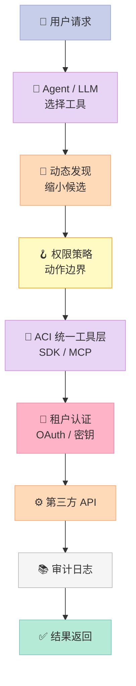

> **核心结论：Agent 的可靠性不只取决于模型推理，更取决于工具层是否把权限、认证和失败边界做成协议。**

## 引子：工具越多，Agent 越不可靠？

当 Agent 从日历扩展到邮件、CRM、云平台和监控系统时，真正膨胀的不是函数数量，而是 OAuth、租户隔离、参数校验与错误处理的组合。ACI.dev（[GitHub](https://github.com/aipotheosis-labs/aci)）的 README 将它定位为开源工具调用平台：提供 600+ 集成、多租户认证、动态工具发现，并同时支持 SDK 与 Unified MCP Server。

它在 Harness 6 件套中属于 **MCP / Tool 桥接层**：模型提出意图，工具层负责让意图在可控边界内落地。

## 一、架构：把策略放在工具边界



**核心机制**是统一 schema、调用协议、认证存取和审计；**可插拔策略**是工具可见性、用户权限以及 SDK/MCP 出口。模型能学习选择工具，却不能凭空取得 OAuth token，也不能代替系统承担跨租户隔离。

## 二、关键原理：统一网关 + 默认拒绝

下面是可直接运行的最小实现。它不依赖 ACI 私有服务，但复刻了值得借鉴的边界：工具注册与 Agent 解耦、写操作默认拒绝、调用可审计。

```python
from dataclasses import dataclass
from typing import Callable, Any

@dataclass(frozen=True)
class Tool:
    name: str
    description: str
    handler: Callable[..., Any]
    risk: str  # read / write

class Gateway:
    def __init__(self):
        self.tools = {}
        self.audit = []

    def register(self, tool: Tool):
        self.tools[tool.name] = tool

    def call(self, user: str, name: str, args: dict, allow_write=False):
        tool = self.tools[name]
        if tool.risk == "write" and not allow_write:
            raise PermissionError(f"{user} cannot call {name}")
        result = tool.handler(**args)
        self.audit.append({"user": user, "tool": name, "ok": True})
        return result

def search_docs(query):
    return [f"match: {query}"]

def create_ticket(title):
    return {"id": "T-001", "title": title}

g = Gateway()
g.register(Tool("search_docs", "Search docs", search_docs, "read"))
g.register(Tool("create_ticket", "Create ticket", create_ticket, "write"))
print(g.call("alice", "search_docs", {"query": "OAuth"}))
try:
    g.call("alice", "create_ticket", {"title": "timeout"})
except PermissionError as e:
    print("blocked:", e)
print(g.call("alice", "create_ticket", {"title": "timeout"}, allow_write=True))
print("audit:", len(g.audit))
```

### 为什么要动态发现？

README 宣称 600+ 集成。假设一个工具描述平均 150 token，全量暴露约需 90,000 token，还会增加相似工具之间的选择噪声。动态发现先找工具，再调用工具，以一次发现请求换取更小的决策空间。

代价是发现器成为新的故障点：召回错误时，模型甚至看不到正确工具。因此生产系统应记录“意图—候选工具—最终调用”，而非只记录最后一个 HTTP 请求。

## 三、与同类项目的设计差异

| 维度 | ACI.dev | mark3labs/mcp-go | mcp-gateway-registry |
|---|---|---|---|
| 核心抽象 | 工具调用基础设施 | Go MCP SDK | 工具元数据目录 |
| 责任边界 | 认证、权限、发现、执行 | 帮你实现 Server | 帮你登记和查找 |
| 协议出口 | SDK + Unified MCP | MCP | 注册协议/目录 |
| Harness 位置 | 外部能力的可审计执行面 | 协议零件 | 工具索引 |

ACI.dev 不是“更大的 MCP SDK”。mcp-go 解决实现协议的工程成本；registry 解决工具目录的查找成本；ACI.dev 试图解决多用户、多工具场景下的执行边界成本。三者可以组合，但不能互相替代。

## 四、优缺点：左简右重

| 左侧：架构简洁性 / 扩展性 / 易用性 | 右侧：性能 / 复杂度 / 维护性 |
|---|---|
| Agent 只面对统一 schema，换模型或框架成本低。 | 动态发现、鉴权和转发增加网络跳数。 |
| 新增连接器主要落在工具层，业务 Agent 不必复制 OAuth。 | OAuth、密钥轮换和第三方错误码集中到平台，平台更重。 |
| SDK 与 MCP 双出口，接入路径短。 | 600+ 集成会持续面对供应商 API 变更。 |
| 审计与权限靠近执行面，边界比 prompt 更可靠。 | 统一网关配置错误可能放大权限事故，必须默认拒绝写操作。 |

我的判断：**ACI.dev 更适合企业 Agent，不适合只有三个内部函数的单机 Demo**。工具、用户和租户开始同时增长时，集中边界才值得这份复杂度。

## 五、从零搭建启示

MVP 只需四块：`ToolSpec`（描述与风险）、`Registry`（发现）、`Gateway`（执行与超时）、`Policy`（用户/租户/动作矩阵）。完整 OAuth 门户、跨区域部署、计费和大规模连接器都可以后置。

三个常见坑：

- 不要把权限写进 prompt；提示词不是安全边界。
- 不要一次暴露全部工具；上下文变长会增加选择噪声。
- 不要只记录 API 错误；必须知道谁、在哪个租户、调用了哪个动作。

## 总结与行动建议

ACI.dev 最值得借鉴的不是“600+”这个数量，而是把工具调用拆成 **发现、授权、认证、执行、审计** 五层。MCP 解决互操作，Harness 负责边界。

建议从今天开始做一个小实验：两个只读工具、一个写工具，统一 schema，默认拒绝，保留审计，再接入一个 MCP 客户端。能否回答“谁调用了什么、为什么允许、失败后发生了什么”，比再增加一个模型更能说明 Agent 是否接近生产可用。
