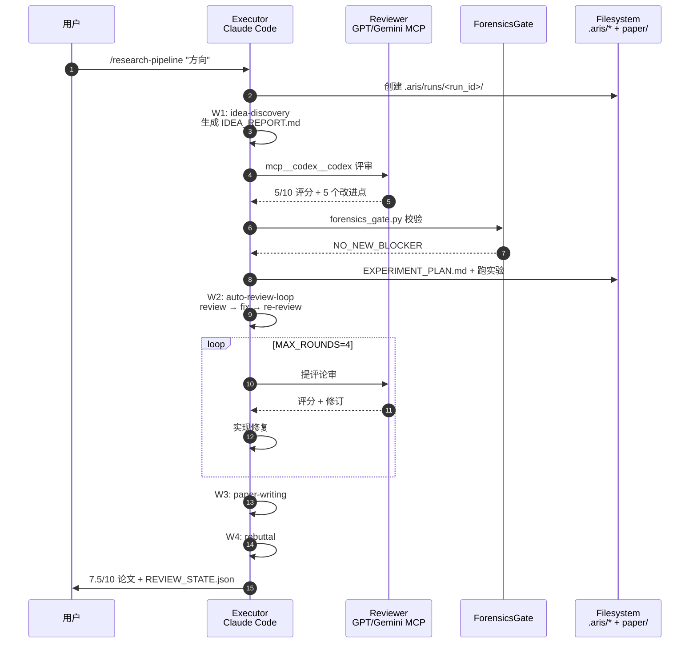
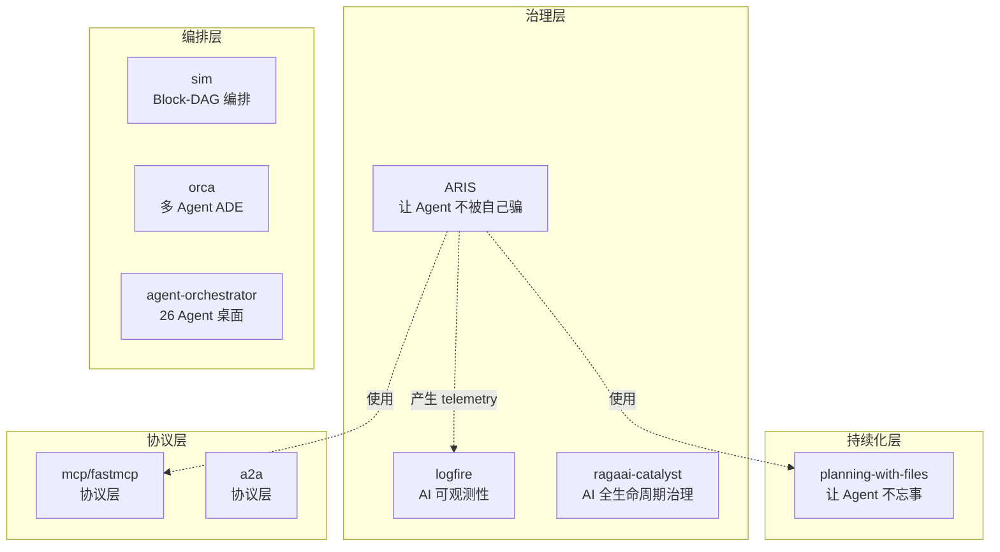

# 【ARIS】核心架构与设计原理深度解析：让 Coding Agent 当 ML 研究员的 Adversarial Multi-Agent 方法论

## 一、引子：当 ML 研究员开始"睡觉"

每一个做过 ML 研究的同学都熟悉这样的节奏：

1. 花 3 周读 80 篇论文。
2. 头脑风暴 12 个 idea，在心里砍掉 9 个，剩下 3 个又来不及快速验证。
3. 挑 1 个跑实验，被 bug 卡一周，错过 GPU 时段。
4. 投稿后拿到 5/10 的审稿，意见写着"缺少与 XYZ 的 ablation"。
5. Rebuttal 只有 72 小时，但你还有 2 天课要上。

**真正的瓶颈不是 idea，而是「文献 → 构思 → 实验 → 写作 → 反驳」端到端的编排能力**。AI 可以压缩每一段单独的步骤，但**整合是脆弱的**——更糟糕的是，**单个模型自评自己的作品**会陷入局部最优：相同的训练数据、相同的盲区、相同的偏见。

> 🚨 **为什么不让一个 Agent 既写又评？** 同族模型自评会陷入局部最小值。ARIS 强制跨族对抗：**Claude 执行，GPT 评审**——它们没有共享 lineage、没有共享训练数据、没有共享盲区。

[wanshuiyin/Auto-claude-code-research-in-sleep](https://github.com/wanshuiyin/Auto-claude-code-research-in-sleep)（下文简称 **ARIS**，⭐15,841）正是冲着这个痛点来的：把整套 ML 研究生命周期（从 idea 发现到 rebuttal 投稿）拆成 **82 个可组合的 Markdown Skill**，**7 个 MCP Server**，并用**跨模型对抗评审协议**强制不同 LLM 互相挑刺。本文带你深入它的工程化实现。

---

## 二、项目定位与核心价值

### 2.1 一句话定义

> **ARIS** = **A**uto-**R**esearch-**I**n-**S**leep。让 Claude Code 在你睡觉时跑完整套 ML 研究流程：读论文 → 找 idea → 跑实验 → 写论文 → 投 rebuttal，早上醒来时拿到一份被 GPT/Claude/Gemini 三方交叉评审过的 7.5/10 草稿。

### 2.2 仓库统计

| 指标 | 数值 |
|------|------|
| ⭐ Stars | 15,841 |
| 🍴 Forks | 1,372 |
| 📦 Size | 34 MB |
| 🌐 主语言 | Python + Markdown |
| 📜 License | MIT |
| 📅 首次提交 | 2026-03-10 |
| 📅 最近 push | 2026-09-06 |
| 🏷 Topics | ai-research, autonomous-agent, claude-code-skills, idea-generation, paper-writing, paper-review, ml-research, mcp, mcp-server |
| 📂 目录 | `skills/` (345) · `docs/` (178) · `tests/` (62) · `tools/` (47) · `templates/` (21) · `mcp-servers/` (16) |

### 2.3 能力矩阵

| 能力 | ARIS 提供 |
|------|-----------|
| **跨模型对抗评审** | Claude 执行 + GPT/Claude/Gemini 评审，独立族系 |
| **82 个 Skill** | 全 Markdown 描述，可被任意 Coding Agent 加载 |
| **7 个 MCP Server** | claude-review / gemini-review / codex-image2 / manual-review / llm-chat / feishu-bridge / minimax-chat |
| **双控制轴** | `effort` (lite/balanced/max/beast) × `assurance` (draft/polished/conference-ready/submission) |
| **强制审计门** | typed policy gate + append-only obligations ledger |
| **Stall 检测** | 连续零发现迭代触发 structural pivot（不改 quality，只改 direction） |
| **风格迁移** | `--style-ref` 提取参考论文的**结构风格**，禁止复制内容 |
| **多平台适配** | Claude Code / Codex / Cursor / Antigravity / Trae / Copilot CLI / OpenClaw / DeepSeek Harness |

### 2.4 实测数据

README 公布的真实跑分：

> 在一个真实的 ICLR/NeurIPS overnight run 中，分数从 **5/10 → 7.5/10**，跑了 **20+ GPU 实验**，涉及完整的 idea → experiment → review → paper → rebuttal 流程。

---

## 三、整体架构

### 3.1 顶层架构（4 层 + 7 大模块）

```mermaid
flowchart TB
    subgraph L1["🎯 用户入口层（任意 Coding Agent）"]
        ClaudeCode["Claude Code"]
        Codex["Codex CLI"]
        Cursor["Cursor"]
        Antigravity["Antigravity"]
        Trae["Trae"]
        Copilot["Copilot CLI"]
        OpenClaw["OpenClaw"]
        DeepSeek["DeepSeek Harness"]
    end

    subgraph L2["📚 Skill 调度层（82 个 Markdown）"]
        Mainline["skills/<name>/SKILL.md<br/>主分支"]
        CodexMirror["skills/skills-codex/<name>/<br/>Codex 镜像"]
        CodexClaude["skills/skills-codex-claude-review/<br/>Codex+Claude 评审叠加层"]
        CodexGemini["skills/skills-codex-gemini-review/<br/>Codex+Gemini 评审叠加层"]
        Shared["skills/shared-references/*.md<br/>共享契约"]
    end

    subgraph L3["🔧 MCP 跨模型评审桥"]
        ClaudeReview["mcp__claude-review<br/>Claude 评审"]
        GeminiReview["mcp__gemini-review<br/>Gemini 评审"]
        CodexImg["mcp__codex-image2<br/>Codex 图像生成"]
        ManualReview["mcp__manual-review<br/>人工兜底"]
        LLMChat["mcp__llm-chat<br/>通用 OpenAI 协议"]
        Feishu["mcp__feishu-bridge<br/>飞书通知"]
        MiniMax["mcp__minimax-chat<br/>MiniMax M3"]
    end

    subgraph L4["🛡️ 强制审计层"]
        ForensicsGate["forensics_gate.py<br/>typed policy + append-only ledger"]
        IdeaGate["idea_discovery_gate.py<br/>evidence gate"]
        CopilotEv["copilot_native_evidence.py<br/>rubber-duck evidence"]
        IterLog["iteration_log.py<br/>stall detection"]
        StyleExtract["extract_paper_style.py<br/>结构风格提取"]
    end

    L1 --> L2
    L2 --> L3
    L2 --> L4
    L3 --> L4
```



### 3.2 7 个工作流（W1-W6）


每条工作流是一个 **Skill 链**：执行 Skill 调用子 Skill，调用 MCP Server 拿跨模型评审，调用 Python Tool 做 evidence gate。

### 3.3 数据流（一篇论文的完整旅程）



---

## 四、核心引擎一：跨模型对抗评审协议

### 4.1 为什么必须"跨族系"？

ARIS 在 [shared-references/reviewer-independence.md](https://github.com/wanshuiyin/Auto-claude-code-research-in-sleep) 中明确写道：

> The reviewer MUST be a different family from the executor. Same-family self-review falls into local minima — the same model reviewing its own patterns creates blind spots.

具体实现上，ARIS 通过 **`_executor_family()` 函数**和**显式的 family 标记**来强制这件事：

```python
# 来自 tools/copilot_native_evidence.py
_FAMILY_NEEDLES = [
    ("anthropic", ("claude", "opus", "sonnet", "haiku")),
    ("openai", ("gpt", "codex", "oracle", "chatgpt", "o1", "o3", "o4")),
    ("google", ("gemini", "palm", "bard")),
]

def _executor_family(name):
    n = (name or "").strip().lower()
    hits = {fam for fam, needles in _FAMILY_NEEDLES
            if any(x in n for x in needles)}
    return next(iter(hits)) if len(hits) == 1 else "unknown"
```

任何无法归类（`unknown`）的 model name **不能被显示给评审**——因为它无法证明与 executor 不同族系。

### 4.2 强制 fresh-thread 协议

**关键规则**：每次评审开**新线程**，**永远不用 `codex-reply` 续接旧评审**。

```yaml
# 来自 skills/auto-review-loop/SKILL.md
MAX_ROUNDS = 4
# 评审完成后必须用新 codex thread，不复用 conversation
# 原因：在某个真实 NeurIPS run 中，codex-reply 链导致评分通胀
```

这条规则是从一次失败实验里学到的：长期 chain 会让 review score 虚高（模型"讨好"自己的历史输出），破坏独立性。

### 4.3 Copilot CLI 的 Rubber-Duck Evidence

Copilot CLI 没有 `codex-reply` 这种显式 reviewer API，ARIS 改用**机器可读的事件链**来证明评审独立性：

```python
# 来自 tools/copilot_native_evidence.py
CHALLENGE_SCHEMA = "aris.copilot-native.challenge/v1"
EVIDENCE_SCHEMA = "aris.copilot-native.evidence/v1"
NONCE_PREFIX = "ARIS_REVIEW_NONCE="
KNOWN_FAMILIES = {"openai", "anthropic", "google"}

# 协议三步：
# 1. marker — 一个 root tool call，发射唯一的 nonce
# 2. challenge — Copilot 持久化 marker 事件后，绑定 nonce + host-reported executor model
# 3. verify — 调用 native rubber-duck，verify 要求成功完成的子 subagent
#              必须带相同 tool-call id，extract host-reported model，
#              拒绝同族 / 未知族系配对
```

结果证据由 `review_gate.py` 在每次评审结束前**重新校验**——这意味着同一个证据不能跨 run 复用，**没有"打包好的绿章"**。

---

## 五、核心引擎二：双控制轴（effort × assurance）

### 5.1 两个独立正交的轴

```python
# 来自 AGENT_GUIDE.md
# Axis 1 — effort (depth / budget)
"— effort: lite | balanced | max | beast      # default: balanced"

# Axis 2 — assurance (audit strictness, independent of effort)
"— assurance: draft | polished | conference-ready | submission"
```

**关键设计**：`effort` 和 `assurance` **完全独立**——你可以用 `effort: lite` 但 `assurance: conference-ready`（快速出稿但严格审计），也可以 `effort: beast` 但 `assurance: draft`（深度实验但只交草稿）。`lite/balanced` 默认 `assurance=draft`，`max/beast` 默认 `assurance=submission`。

### 5.2 Assurance Contract 的硬保证

[skills/shared-references/assurance-contract.md](https://github.com/wanshuiyin/Auto-claude-code-research-in-sleep) 定义了 4 个 assurance 等级对应的强制审计：

```yaml
# 简化版 assurance-contract 语义
assurance: draft
  → 无强制审计门
assurance: polished
  → citation-audit 必须通过
assurance: conference-ready
  → forensics_gate + citation-audit + figure-quality
assurance: submission
  → 全部审计 + 手动 review sign-off
```

这是 **Runtime Contract** 而不是 Prompt Hint——`forensics_gate.py` 在 assurance ≥ polished 时会**阻断**任何未通过 citation-audit 的论文。

### 5.3 Codex reasoning 兜底

不管 effort 多低，Codex reasoning **永远不掉到某个 tier 之下**：

```python
# 来自 AGENT_GUIDE.md
# Codex reasoning never drops below the tier floor regardless of effort
# (regular reviews `xhigh`; the deep-audit skills run `ultra`)
```

理由：评审质量不能因 effort 而妥协，否则整个对抗评审协议就失效了。

---

## 六、核心引擎三：Typed Policy Gate + Append-Only Ledger

### 6.1 三段式 gate policy

[tools/forensics_gate.py](https://github.com/wanshuiyin/Auto-claude-code-research-in-sleep/blob/main/tools/forensics_gate.py) 是 ARIS 的审计心脏，**32KB** 严格政策：

```python
# 来自 tools/forensics_gate.py
GATE_VERSION = "1"
AUDITOR_FAMILY = "openai"   # Anti-AR 的 reviewer 固定 GPT 族系

# Gate policy (固定):
#   upstream HARD_FLAGS           → BLOCK
#   upstream REVIEW_UNAVAILABLE   → BLOCK   (不完整 sweep 不能放行)
#   any OPEN critical obligation  → BLOCK
#   upstream SOFT_FLAGS           → WARN    (人工处置)
#   any OPEN obligation           → WARN
#   otherwise                     → NO_NEW_BLOCKER
```

输出三态枚举：

```python
BLOCK = "BLOCK"
WARN = "WARN"
NO_NEW_BLOCKER = "NO_NEW_BLOCKER"
```

**关键点**：`NO_NEW_BLOCKER` ≠ `PASS`！这是 ARIS 的核心设计哲学——**flag 是可计算的，acquittal 不可计算**。

```python
# 来自 forensics_gate.py docstring
# Anti-Autoresearch's verdict is preserved VERBATIM and never re-labeled.
# In particular CLEAN_GIVEN_EVIDENCE maps to NO_NEW_BLOCKER — 
# "no flag found in the evidence at hand" — NEVER to PASS/accepted.
# A forensics sweep can raise flags; it cannot acquit anything.
```

### 6.2 Append-Only Obligations Ledger

每个 finding 进入 ledger 后**永不自动关闭**——即使后续报告中消失了：

```python
# 来自 forensics_gate.py
# Findings become APPEND-ONLY obligations. A re-run may add obligations;
# a finding that disappears from a later report NEVER auto-closes its obligation
# (an LLM asked to "make the flag go away" learns to reword the span faster
# than to fix the number). A vanished, unresolved obligation is marked
# UNRESOLVED_DISAPPEARANCE — deterministically recorded, not an accusation.
```

关闭 obligation 必须显式操作：

```python
FIX_TYPES = (
    "corrected-from-results",   # 用结果修正
    "claim-narrowed",            # 收窄声明
    "claim-withdrawn",           # 撤回声明
    "citation-replaced",         # 替换引文
)
# resolve: typed fix + evidence file hashed at closure time + who verified
# waive: human sign-off（waive 永远不是 resolution）
```

### 6.3 Finding Fingerprint

每个 finding 必须有**跨 run 稳定的 fingerprint**：

```python
# 来自 forensics_gate.py
def fingerprint(f):
    """Stable identity of a finding ACROSS re-runs.
    Deliberately excludes:
      finding_id (F001... is positional),
      claim_id (positional in the ledger),
      artifact_hash  # 不让 hash 阻挡 fingerprint
    """
```

这套设计让"刷掉旧 flag"变得极其困难——任何 obligation 都能被追溯回它的源头。

---

## 七、核心引擎四：External Cadence 与 Stall Detection

### 7.1 External Cadence 规则

ARIS 有一条非常反直觉但深刻的规则：**外部 heartbeat 只能"推动"，不能"判定"**。

```yaml
# 来自 skills/auto-review-loop/SKILL.md
🔒 Do not wrap this skill in /loop, /schedule, or CronCreate.
It already loops internally (review → fix → re-review) and the reviewer carries
round-to-round memory in one threadId (codex-reply). An external timer re-enters
from the top each tick — fresh threadId, reviewer memory reset — firing the verdict
on wall-clock time instead of on artifact change: zero new signal, full token cost.
```

**核心观点**：

| | 内部 cadence | 外部 cadence |
|---|---|---|
| 触发条件 | artifact 变化 | wall-clock 时间 |
| 决策内容 | "好/不好" verdict | "继续 / 改变方向" |
| 质量判定 | cross-model jury | **永不判定** |
| 失败后果 | 资源浪费 | 自我 acquittal（永远出错） |

### 7.2 Stall Detection & Forced Pivot

[tools/iteration_log.py](https://github.com/wanshuiyin/Auto-claude-code-research-in-sleep/blob/main/tools/iteration_log.py) 监控"零发现"迭代：

```python
# 来自 tools/iteration_log.py
PIVOT_STRUCTURAL_AT = 2   # 连续零发现迭代 → 强制 structural pivot
ESCALATE_HUMAN_AT = 4     # 仍停滞 → flag for human attention

# Type-A signal: it COUNTS entries and changes direction; 
# it does NOT judge quality — quality/correctness stays with 
# the cross-model jury. It only ever says "keep going / change direction,"
# never "good enough".
```

Stall 阈值触发后**强制**改变**结构性约束**（不是调战术参数）：

```python
# 简化版 pivot 决策
if stale_count >= 2:
    pivot = "structural"  # 换研究问题/方法/数据集
elif stale_count >= 4:
    pivot = "human"        # 标记让人来
```

**关键洞察**：质量判定永远在 cross-model jury，stall detection **只改方向**，**不判定好坏**——避免重蹈"AI 判定 AI 自己"陷阱。

---

## 八、Style Extraction：结构风格而非内容复制

### 8.1 Style Ref 协议

很多用户想让生成的论文匹配参考论文的**结构风格**——section ordering、sentence-length cadence、theorem density、figure density——**但不复制内容**。

[tools/extract_paper_style.py](https://github.com/wanshuiyin/Auto-claude-code-research-in-sleep/blob/main/tools/extract_paper_style.py) 是这个功能的核心：

```python
# 来自 extract_paper_style.py docstring
# Writer skills that accept --style-ref <source>:
#   - paper-write, paper-plan, paper-writing
#   - paper-illustration, paper-slides
#   - grant-proposal, auto-paper-improvement-loop

# Strict rules for the calling skill:
# 1. Opt-in only. 不传 --style-ref 时行为不变。
# 2. 先 run 这个脚本，再开始起草。
# 3. STRUCTURAL guidance only. Do not copy sentences, phrases, claim bullets.
# 4. NEVER pass --style-ref to reviewer / auditor sub-agents.
#    Cross-model review independence requires reviewers see only the artifact
#    and the user's prompt, not the author's stylistic context.
# 5. Cache is deterministic. Same source → same cache dir.
```

### 8.2 缓存确定性

```python
# 简化版 cache 路径生成
# <cache>/source_manifest.json   (provenance)
# <cache>/style_profile.md       (the style guidance)

# 调用 skill 应显式传 resolved cache path 给后续 step
```

### 8.3 风格 vs 内容的边界

| | 结构风格 | 内容 |
|---|---|---|
| 复制 | ✅ 允许 | ❌ 禁止 |
| 例证 | section ordering, figure density | sentences, phrases, claims |
| 缓存 | deterministic | none |

**关键洞察**：style ref **永远不传给 reviewer/auditor**——评审独立性要求评审者只看 artifact + 用户 prompt，不被作者的风格选择影响。

---

## 九、MCP Server 矩阵

### 9.1 7 个 MCP Server 总览

| Server | 族系 | 用途 | 字节数 |
|--------|------|------|--------|
| `claude-review` | anthropic | Claude 跨族评审 | 26 KB |
| `gemini-review` | google | Gemini 跨族评审 | 66 KB |
| `codex-image2` | openai | Codex 图像生成（app-server 桥） | 31 KB |
| `manual-review` | human | 人工兜底评审（browser/file 模式） | 34 KB |
| `llm-chat` | any | 通用 OpenAI 协议（DeepSeek/Kimi/MiniMax 等） | 24 KB |
| `feishu-bridge` | any | 飞书通知桥 | 7 KB |
| `minimax-chat` | minimax | MiniMax M3 chat 桥 | 13 KB |

### 9.2 manual-review：人工兜底

[mcp-servers/manual-review/server.py](https://github.com/wanshuiyin/Auto-claude-code-research-in-sleep/blob/main/mcp-servers/manual-review/server.py) 处理**没有 API key 的场景**：

```python
# 来自 mcp-servers/manual-review/server.py
# A human-in-the-loop reviewer bridge: when the pipeline needs cross-model
# review, this server opens a browser page (or writes a file on headless Linux)
# where the user can copy the prompt to a different-family model and paste the
# response back.
# 
# Zero API cost. The reviewer must be a model this server can classify by family
# (OpenAI, Anthropic, Google, DeepSeek, Moonshot/Kimi, Qwen) — an unclassifiable
# name cannot be shown to differ from the executor's, so it cannot acquit.
```

**族系分类函数**：

```python
def model_family(model: str) -> str:
    """Derive a known provider family from a model identity, failing closed."""
    name = (model or "").strip().lower()
    families: set[str] = set()
    if re.search(r"(^|[^a-z0-9])(gpt|chatgpt|codex|oracle|o1|o3|o4)([^a-z0-9]|$)", name):
        families.add("openai")
    if re.search(r"(^|[^a-z0-9])(claude|sonnet|opus|haiku|anthropic)([^a-z0-9]|$)", name):
        families.add("anthropic")
    if re.search(r"(^|[^a-z0-9])(gemini|google)([^a-z0-9]|$)", name):
        families.add("google")
    if re.search(r"(^|[^a-z0-9])(deepseek)[0-9.]*([^a-z0-9]|$)", name):
        families.add("deepseek")
    if re.search(r"(^|[^a-z0-9])(kimi|moonshot)[0-9.]*([^a-z0-9]|$)", name):
        families.add("moonshot")
    # ... qwen
```

**File-mode stability**：在 headless Linux 上，要求内容**两次读取间隔稳定**才接受回答：

```python
# File-mode stability: require content unchanged across two reads with this gap
FILE_STABLE_INTERVAL_SEC = 3
FILE_POLL_INTERVAL_SEC = 2
```

防有人粘一半就提交，导致评审输入不完整。

### 9.3 llm-chat：通用 OpenAI 协议

[mcp-servers/llm-chat/server.py](https://github.com/wanshuiyin/Auto-claude-code-research-in-sleep/blob/main/mcp-servers/llm-chat/server.py) 让任何 OpenAI 兼容 API 都能当评审：

```python
# 来自 mcp-servers/llm-chat/server.py
# Supported Providers (examples):
#   OpenAI:      LLM_BASE_URL=https://api.openai.com/v1 LLM_MODEL=gpt-4o
#   DeepSeek:    LLM_BASE_URL=https://api.deepseek.com/v1 LLM_MODEL=deepseek-chat
#   Kimi:        LLM_BASE_URL=https://api.moonshot.cn/v1 LLM_MODEL=moonshot-v1-32k
#   MiniMax:     LLM_BASE_URL=https://api.minimax.io/v1 LLM_MODEL=MiniMax-M3

# Environment Variables:
#   LLM_API_KEY         - API key (required)
#   LLM_BASE_URL        - API base URL (default: https://api.openai.com/v1)
#   LLM_MODEL           - Model name (default: gpt-4o)
#   LLM_FALLBACK_MODEL  - Fallback model on 504 timeout (default: gpt-4o)
#   LLM_REVIEW_FALLBACK_ENABLED - Expose review/review_reply tools when true
```

**设计哲学**：**单协议多 provider**——把 OpenAI 协议当成 "LLM HTTP"，任何兼容 API 都是潜在评审者。

---

## 十、证据门与 Idea Discovery Gate

### 10.1 Evidence Gate 强制要求

[tools/idea_discovery_gate.py](https://github.com/wanshuiyin/Auto-claude-code-research-in-sleep/blob/main/tools/idea_discovery_gate.py) 强制 idea-discovery 阶段**5 个必跑 phase**：

```python
# 来自 tools/idea_discovery_gate.py
GATE_NAME = "idea-discovery-evidence"
REQUIRED_PHASES = (
    "research-lit",
    "idea-creator",
    "novelty-check",
    "research-review",
    "research-refine-pipeline",
)
# These phases promise a model review, not merely executor-produced prose.
# A heading and a done self-report therefore cannot satisfy their evidence obligation
REVIEW_REQUIRED_PHASES = frozenset({"novelty-check", "research-review"})
```

**关键设计**：novelty-check 和 research-review 阶段**必须有 model review 证据**，heading + done self-report **不算**——LLM 不能用"我做了"来证明它做了。

### 10.2 证据标记语言

```python
START_MARKER = "<!-- ARIS_IDEA_DISCOVERY_EVIDENCE_GATE:START -->"
END_MARKER = "<!-- ARIS_IDEA_DISCOVERY_EVIDENCE_GATE:END -->"
```

在文档中插入 start/end marker，gate 扫描后**只接受** marker 之间的 receipt（来自 `accept` 或 `mark-provisional` 命令）。

---

## 十一、End-to-End Run：跑通一次完整研究

### 11.1 启动命令

```bash
# 安装（在 Claude Code 项目根）
git clone https://github.com/wanshuiyin/Auto-claude-code-research-in-sleep ~/.aris/repo
ln -sf ~/.aris/repo/skills ~/.claude/skills/aris

# 在 Claude Code 中触发
/research-pipeline "对抗训练的梯度稀疏化方法"
# 默认 effort: balanced, assurance: draft
```

### 11.2 配置双轴

```yaml
# 在 prompt 中显式传
/research-pipeline "对抗训练的梯度稀疏化方法" \
  --- effort: max \
  --- assurance: conference-ready \
  --- human checkpoint: true \
  --- difficulty: hard \
  --- venue: ICLR \
  --- sources: web, zotero, deepxiv, exa \
  --- gpu: vast
```

### 11.3 Resume from Run ID

```bash
# 中断后恢复（避免重新跑已完成的阶段）
/research-pipeline "继续" --- resume: <run_id>
```

`run_id` 由 `.aris/runs/<run_id>/` 目录持有，state 全部 JSON 化。

### 11.4 完整文件布局

```bash
.paper-project/
├── .aris/
│   ├── runs/<run_id>/
│   │   ├── run_state.json          # 状态机
│   │   ├── iterations.jsonl         # stall 检测 ledger
│   │   └── evidence/                # review receipts
│   ├── forensics/
│   │   ├── gate.json                # 单次 forensics sweep 结果
│   │   └── obligations.json         # append-only ledger
│   └── pending_review/              # manual-review 兜底
├── idea-stage/
│   ├── IDEA_REPORT.md               # W1 输出
│   ├── EXPERIMENT_PLAN.md
│   └── FINAL_PROPOSAL.md
├── refine-logs/                     # W1 内部中间产物
├── paper/
│   ├── main.tex                     # W3 输出
│   ├── figures/
│   └── bibliography.bib
├── rebuttal/                        # W4 输出
└── REVIEW_STATE.json                # W2 最终状态
```

---

## 十二、与同类项目对比

### 12.1 同类项目对比表

| 维度 | **ARIS** | planning-with-files | ACE (Agentic Context Engineering) | Rowboat Desktop | OpenMontage |
|------|----------|---------------------|----------------------------------|------------------|-------------|
| 形态 | 82 Markdown Skill | 3-File + 5 Hook | 自我进化 playbook | 长知识图谱桌面 | Agentic 视频生产 |
| 核心场景 | ML 研究全流程 | Coding Agent 持久化 | Context 自我演化 | 长记忆办公 | 视频生产 |
| 跨模型 | ✅ 强制（executor ≠ reviewer） | ❌ 单模型 | ❌ 单模型 | ❌ 单模型 | ❌ 单模型 |
| Typed Gate | ✅ forensics_gate | ✅ v3 gate | ❌ | ❌ | ✅ delivery_promise |
| Append-only ledger | ✅ obligations | ❌ | ❌ | ❌ | ❌ |
| External cadence | ✅ heartbeat 只推动不判定 | ❌ | ❌ | ❌ | ❌ |
| Stall detection | ✅ forced structural pivot | ❌ | ❌ | ❌ | ❌ |
| Style extraction | ✅ structural only | ❌ | ❌ | ❌ | ✅ cinematic skill |
| MCP servers | ✅ 7 个 | ❌ | ❌ | ✅ | ❌ |
| 主动式推送 | ❌ | ❌ | ❌ | ✅ | ✅ |
| Stars | 15.8k | 24.7k | ~10k | ~6k | 32k |

### 12.2 设计差异分析

**ARIS vs planning-with-files（已写 2026-07-06）**：
- planning-with-files = "Coding Agent 不忘事"（task_plan/findings/progress 三件套 + SHA-256 attestation）
- ARIS = "Coding Agent 不被自己骗"（跨模型对抗 + typed gate + append-only ledger）
- **正交关系**：一个管持久化，一个管评审；ARIS 可以**内部嵌入** planning-with-files 作为 W1.5 的 sub-skill

**ARIS vs ACE（已写 2026-09-03）**：
- ACE = Agentic Context Engineering，self-evolution playbook（LLM 通过生成新 context 自我升级）
- ARIS = 反向：**不让 LLM 自己判定自己**（跨族评审 + typed gate 阻断 self-acquittal）
- **正交关系**：ACE 关心"如何让 LLM 进化"，ARIS 关心"如何防止 LLM 自我欺骗"——两者都跨上下文，但角度相反

**ARIS vs MetaGPT（已写 2026-06-25）**：
- MetaGPT = "Code = SOP(Team)"，靠 prompt 工程驱动多 agent 协作
- ARIS = "Research = Executor + Adversarial Reviewer"，靠 **MCP 桥**强制不同 LLM 互相挑刺
- **关键差异**：MetaGPT 同族系 agent（都是 GPT），ARIS 强制异族系（Claude × GPT × Gemini）

**ARIS vs CrewAI/AutoGen**：
- CrewAI/AutoGen = 角色对话驱动（Role-playing + Group chat）
- ARIS = 不靠对话，靠**结构化 review-fixing loop** + **typed policy gate**
- **关键差异**：CrewAI 自由对话容易陷入同意陷阱（agents 都讨好对方），ARIS 的 reviewer **显式拒绝同族系**+ **fresh-thread**

### 12.3 共同的设计哲学

| 哲学 | ARIS 实现 |
|------|-----------|
| **族系对抗** | `_FAMILY_NEEDLES` + `KNOWN_FAMILIES` 强制不同族系 |
| **状态可证伪** | append-only obligations + 显式 `resolve` / `waive` |
| **flag ≠ acquittal** | `NO_NEW_BLOCKER` 永不升级为 `PASS` |
| **心跳 ≠ 判定** | external cadence 只能 nudge 不能 verdict |
| **风格 ≠ 内容** | `--style-ref` 只传 writer-side，不传 reviewer |
| **架构 vs 战术** | stall detection 强制 pivot structural constraint |

---

## 十三、优缺点分析

### 13.1 优势

| 维度 | 优势 |
|------|------|
| **架构简洁性** | 82 个纯 Markdown Skill，无复杂框架；任何支持 SKILL.md 的 Coding Agent 即插即用 |
| **扩展性** | MCP server 矩阵让任何 OpenAI 协议 LLM 都能当 reviewer；双轴独立组合 |
| **可证伪性** | append-only obligations ledger + 显式 `resolve/waive` + fingerprint——任意 finding 都能追到源头 |
| **抗自评陷阱** | 跨族强制 + fresh-thread + rubber-duck evidence 三重防护 |
| **风格控制** | style-ref 显式分结构 vs 内容，永不传给 reviewer |
| **stall 应对** | Type-A signal 只改 direction，不改 quality judgment |
| **门槛低** | manual-review 兜底让没 API key 也能跑（只要你能打开浏览器粘 prompt） |
| **成熟度** | 已在真实 ICLR/NeurIPS 跑通 5/10 → 7.5/10 |

### 13.2 劣势

| 维度 | 劣势 |
|------|------|
| **性能开销** | 每轮 review 开新 thread + 跨模型调用，token 成本显著高于同模型 |
| **复杂度** | 82 skill × 7 MCP × 4 assurance × 4 effort = 9383 种组合，新人入门曲线陡峭 |
| **维护性** | 每个 skill 的 SKILL.md 是源真相（source of truth），AGENT_GUIDE 只是 routing index——单点维护成本高 |
| **跨族系假设** | 如果未来所有 LLM 都用同一份 RLHF 数据训练（趋同），跨族评审就退化为同族 |
| **零发现定义** | Type-A signal 的 "new finding" 定义主观，可能与"重要 finding"错位 |
| **依赖 MCP** | 7 个 MCP server 必须全部正确注册才能完整跑；一个挂掉整个 pipeline 阻 |
| **强约束研究方法** | 对实验科学之外的领域（如理论数学）适用性待验证 |
| **中文支持有限** | 部分 skill 仅英文版本（README 中带 `_CN` 后缀的是中文版，但功能可能落后） |

### 13.3 适用场景

| 场景 | 推荐度 |
|------|--------|
| ML 顶会论文（ICLR/NeurIPS/ICML） | ⭐⭐⭐⭐⭐ |
| 实验科学（physics/chem/bio 的实验类工作） | ⭐⭐⭐⭐ |
| 工程类研究（systems/security） | ⭐⭐⭐ |
| 纯理论数学 | ⭐⭐ |
| 快速 prototype 验证 | ⭐ |

---

## 十四、实践：在 Claude Code 中跑通 ARIS

### 14.1 环境准备

```bash
# 1. 安装 ARIS
git clone https://github.com/wanshuiyin/Auto-claude-code-research-in-sleep ~/.aris/repo

# 2. 链接 skills 到 Claude Code
mkdir -p ~/.claude/skills
ln -sf ~/.aris/repo/skills/* ~/.claude/skills/

# 3. 注册 MCP server（以 Codex 评审为例）
# ~/.claude/mcp.json
{
  "mcpServers": {
    "codex": {
      "command": "python3",
      "args": ["-m", "aris.codex_mcp"],
      "env": {
        "CODEX_API_KEY": "<your-key>",
        "CODEX_MODEL": "gpt-6-astra"
      }
    },
    "manual-review": {
      "command": "python3",
      "args": ["~/.aris/repo/mcp-servers/manual-review/server.py"]
    }
  }
}
```

### 14.2 第一次跑：idea discovery

```bash
# Claude Code 中
/idea-discovery "对抗训练的梯度稀疏化方法"

# 等价命令（如果不用 slash）
@aris-skills/idea-discovery "对抗训练的梯度稀疏化方法"
```

输出：
- `idea-stage/IDEA_REPORT.md` —— 排序后的 idea 列表
- `idea-stage/EXPERIMENT_PLAN.md` —— top-1 idea 的实验计划
- `idea-stage/FINAL_PROPOSAL.md` —— 给 reviewer 看的最终提案

### 14.3 第二次跑：跑实验

```bash
/experiment-bridge
# 自动读 EXPERIMENT_PLAN.md，部署到指定 GPU（vast / remote / local）
# 输出：EXPERIMENT_LOG.md + 训练指标 + 模型 checkpoint
```

### 14.4 第三次跑：自动评审

```bash
/auto-review-loop
# 跑 MAX_ROUNDS=4 轮 review → fix → re-review
# 输出：REVIEW_STATE.json + paper/main.tex（每轮更新）
```

### 14.5 配置 evidence gate

```bash
# 默认 balanced + draft
# 升级到 conference-ready：
/auto-review-loop --- assurance: conference-ready

# 此时 forensics_gate 会强制：
# - citation-audit 必须通过
# - forensics_gate 必须 NO_NEW_BLOCKER
# - figure-quality 必须 ≥ 阈值
```

### 14.6 写论文

```bash
/paper-writing "IDEA_REPORT.md"
# 自动跑 paper-plan → paper-figure → paper-write → paper-compile

# 改进循环（再润色 2 轮）：
/auto-paper-improvement-loop --- edit-whitelist ./
```

### 14.7 反驳

```bash
/rebuttal "reviewer_comments.md"
# 自动生成 rebuttal letter + 补实验
```

---

## 十五、趋势与未来

### 15.1 趋势预测

1. **跨族对抗评审会成为研究类 Agent 的标配**——单一 LLM 自我优化的天花板已被反复证明，2026 H2 开始，所有严肃研究类工具都必须有跨族评审通道。
2. **Typed Policy Gate 取代 Prompt Hint**——把"约束"从 prompt 移到 enforcement layer 是必然趋势（DSPy 已经在 prompt 编译做类似事）。
3. **Append-only Ledger 会扩散到审计领域**——金融、医疗、法律的 AI 决策都需要"flag 可计算、acquittal 不可计算"的 ledger。
4. **External Cadence 心跳规则会被更多 Agent 采纳**——"heartbeat 只能 nudge 不能 verdict" 是 AI 治理的基础设施级规则。
5. **Markdown-only Skill 是 Agent 跨平台的事实标准**——OpenAI Codex、Claude Code、Cursor、Antigravity、Copilot CLI 全部支持 SKILL.md，ARIS 站在这个趋势的浪尖。

### 15.2 工程经验提炼

| 经验 | 启示 |
|------|------|
| **跨族 ≠ 反对同族** | 同族协同 + 异族评审是最佳组合 |
| **flag ≠ acquittal** | "没找到问题"≠"没问题"——AI 治理的核心戒律 |
| **heartbeat ≠ verdict** | 时间维度上的触发 ≠ 质量判定 |
| **style ≠ content** | 结构借鉴必须严格不传 reviewer |
| **状态可证伪** | append-only + 显式 close 才能让"AI 决定"可审计 |

### 15.3 与 2026 H2 Agent 浪潮的关系

ARIS 与本系列已写项目的关系：



**ARIS 处于"治理层"中心位置**，它的 typed policy gate、append-only ledger、external cadence 规则**可以独立出来**作为通用框架（类似 Logfire 的 OTel wrapper）——这可能是 2027 年最值得追的方向。

### 15.4 总结

[wanshuiyin/Auto-claude-code-research-in-sleep](https://github.com/wanshuiyin/Auto-claude-code-research-in-sleep) 不只是一个"Agent 工具"，**它是一套对 AI 自我欺骗的工程化防御体系**：

- **跨族对抗评审**——防止 self-play 局部最优
- **Typed Policy Gate**——把"约束"从 prompt 移到 enforcement layer
- **Append-only Obligations Ledger**——让 AI 决定永远可证伪
- **External Cadence 规则**——heartbeat 只推动不判定
- **Stall Detection & Forced Pivot**——监控"零发现"而非"质量"

**这套体系**可以应用到任何 AI 研究工具——不只 ML 论文，也包括金融建模、医疗诊断、代码审计。**它的真正价值不在于"帮你写论文"，而在于"系统性地防止 AI 自我欺骗"**。

---

## 附录：关键资源

| 类别 | 链接 |
|------|------|
| GitHub 仓库 | https://github.com/wanshuiyin/Auto-claude-code-research-in-sleep |
| 项目介绍 | https://wanshuiyin.github.io/Auto-claude-code-research-in-sleep/ARIS_INTRO.html |
| AGENT_GUIDE | 仓库根目录 `AGENT_GUIDE.md`（LLM 友好版） |
| 82 Skill 目录 | `skills/<name>/SKILL.md`（每个 skill 一个文件） |
| 共享契约 | `skills/shared-references/*.md` |
| MCP Servers | `mcp-servers/`（7 个 server） |
| 工具层 | `tools/`（47 个 Python 工具） |
| 论文模板 | `templates/`（21 个 Markdown 模板） |
| License | MIT |
| 反向工程 | [Anti-Autoresearch](https://github.com/wanshuiyin/Anti-Autoresearch) |
| 衍生项目 | [HERO-Anti-OverDefense](https://github.com/wanshuiyin/HERO-Anti-OverDefense)、[ARIS-Movie-Director](https://github.com/wanshuiyin/ARIS-Movie-Director) |
| 微信解读 | https://mp.weixin.qq.com/s/tDniVryVGjDkkkWl-5sTkQ |
| Skills 引用 | [VoltAgent/awesome-agent-skills](https://github.com/VoltAgent/awesome-agent-skills) |
| Paper | [arXiv:2605.03042](https://huggingface.co/papers/2605.03042) |
