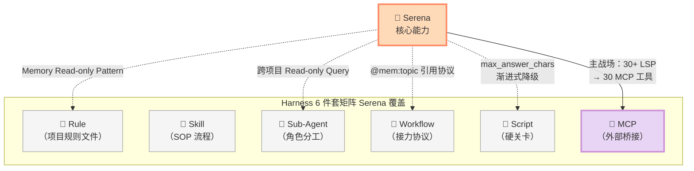
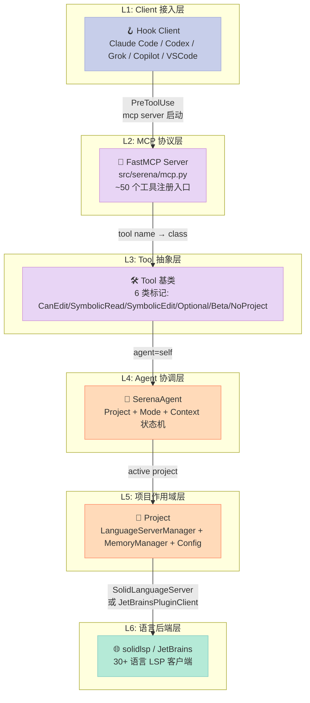
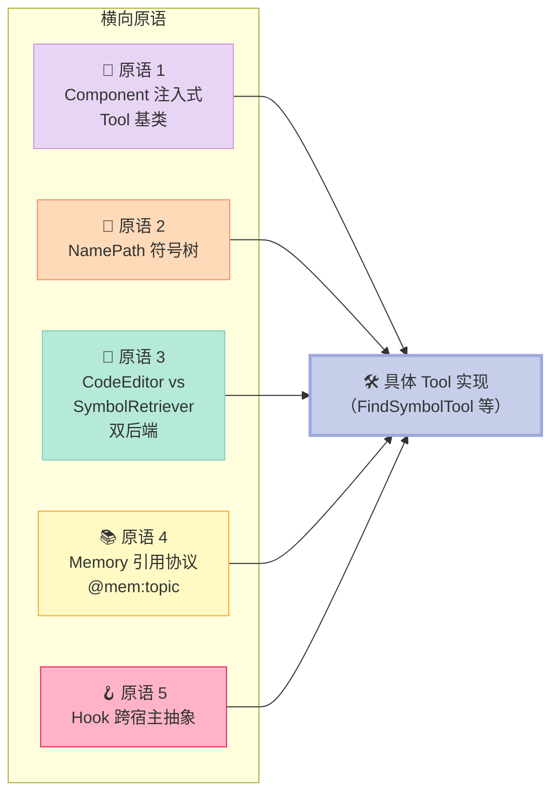
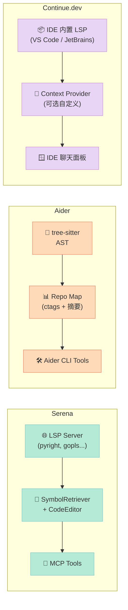
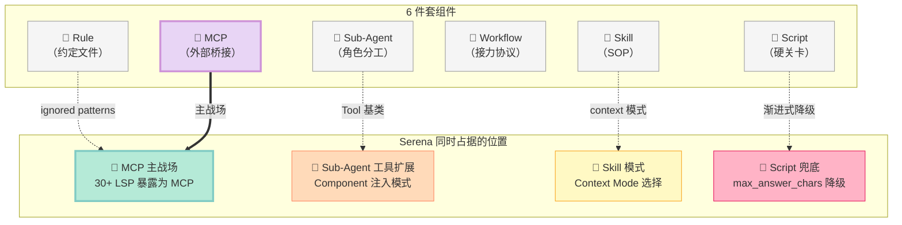

## 引子

2025 年下半年起，几乎所有 Coding Agent（Claude Code / Codex / Cursor / Aider）都默认装了一组**"读文件 + 写文件 + 跑命令 + 搜索"** 的工具集。听起来够用了，对吧？

但只要你用过 Claude Code 改一个稍微复杂点的 Python 项目，你一定会撞到这 4 类痛点：

1. **跨文件 rename 灾难**：Agent 想把类 `AuthService` 改名成 `Authenticator`，它只能"打开文件 → 找字符串 → sed 替换 → 写回"。结果注释里的 `AuthService`、测试 fixture 里的 `AuthService`、文档字符串里的 `AuthService`、外部 mock 里的 `AuthService` 全部一起替换，**编译 12 个文件失败**，Agent 再花 30 轮去修复它自己制造的问题。
2. **跳转失败**：Agent 想看 `parse_config()` 在哪些地方被调用，它只能 `grep -rn "parse_config(" .` 然后面对 200 行匹配结果**手动分类**哪些是定义、哪些是调用、哪些是字符串字面量、哪些是注释。
3. **符号级精度缺失**：Agent 想"替换 `User` 类的 `__init__` 方法体"，它只能 read → 找到 `class User` 行 → 数行号到 `def __init__` → 整段替换。**装饰器、注释、async 语法、跨行签名**，任何一个边界判定错就是 syntax error。
4. **跨语言碎片化**：Python 用 Jedi，TypeScript 用 tsserver，Java 用 Eclipse JDT，Go 用 gopls。每家协议不同，**Agent 要么全栈自研、要么写 4 个文件操作函数**。

[oraios/serena](https://github.com/oraios/serena)（⭐28,987，MIT，2026-09-06 最新提交）的设计哲学用一句话概括：

> **"Symbol-level tools, not line-level tools. LSP is the universal semantic backend. MCP is the universal transport."**

Serena **不发明任何新的代码理解能力**——它把 30+ 语言的 [LSP（Language Server Protocol）](https://microsoft.github.io/language-server-protocol/) 包装成 **30 个语义级 MCP 工具**：`find_symbol` / `replace_symbol_body` / `insert_after_symbol` / `find_referencing_symbols` / `rename_symbol`。Coding Agent 调一次 `rename_symbol("AuthService", "Authenticator")`，Serena 内部走 LSP `textDocument/rename` 接口，把**注释 / 字符串 / 文档 / 类型引用**一次性全原子替换。

按 Harness Engineering 的 6 件套矩阵划分，Serena 同时占据两个组件位置：
- **MCP 组件**：它是当前 GitHub 上**最完整的 Coding Agent MCP Server**——把 30+ 语言 LSP 暴露成统一工具集
- **Sub-Agent 工具扩展组件**：它的 `Component` / `Tool` 基类 + `Project` 作用域 + `Agent Context` 三件套，是"如何给 Agent 装第三方能力"的标准答案

本文围绕 Serena 的核心架构展开：solidlsp 语言服务器聚合、NamePath 符号树抽象、Component 注入式工具基类、SymbolRetriever vs CodeEditor 双后端抽象、Project-level MemoryManager 与 `@mem:topic` 引用协议、PreToolUse/PostToolUse Hook 跨宿主（Claude Code/Codex/Grok/Copilot）兼容设计。最后对比 Aider / Continue / Codegen / Cline 在"语义工具 vs 文本工具"上的设计差异。

---

## 一、项目定位与 Harness 6 件套矩阵

### 1.1 一句话定义

**Serena = LSP-backed MCP toolkit for coding agents**，通过统一的 MCP 协议把 30+ 语言的语义级代码能力（查找、跳转、重构、诊断）暴露给任意 LLM Client（Claude Code / Codex / Cursor / Cline / VS Code Copilot / 自研 Agent）。

它的核心主张："**让 Agent 拥有 IDE 级的语义理解能力，而不是文本搜索能力。**"

### 1.2 能力矩阵

| 能力维度 | 是否原生支持 | 备注 |
|----------|-------------|------|
| 🌐 多语言 LSP 聚合 | ✅ | 30+ 语言（Python / TS / JS / Java / Go / Rust / C# / Kotlin / Swift / Ruby / PHP / Lua / Dart / Zig / Scala / ...） |
| 🔍 符号级 Find | ✅ | `find_symbol` / `find_referencing_symbols` / `find_implementations` / `find_declaration` |
| ✏️ 符号级 Edit | ✅ | `replace_symbol_body` / `insert_before_symbol` / `insert_after_symbol` / `rename_symbol` |
| 🗑️ 符号级 Delete | ✅ | `safe_delete_symbol`（带引用检查） |
| 📋 文件级 Find | ✅ | `search_for_pattern` / `get_symbols_overview` / `find_file` / `list_dir` |
| 🪝 Claude Code Hook | ✅ | `PreToolUse` / `PostToolUse` 自动启停 MCP server |
| 🪝 Codex / Grok / Copilot Hook | ✅ | 多客户端兼容 |
| 🧠 Project + Global Memory | ✅ | 跨会话记忆 + `@mem:topic` 引用协议 + 引用完整性检查 |
| ⚙️ Context 模式切换 | ✅ | `desktop-app` / `ide-assistant` / `agent` 三档 |
| 🎚️ Mode 选择 | ✅ | `interactive` / `editing` / `planning` / `one-shot` |
| 🔌 JetBrains 后端 | ✅ | 通过 JetBrains Plugin Client 复用 IDE 自带 LSP |
| 📊 诊断集成 | ✅ | `get_diagnostics_for_file` / `get_diagnostics_for_symbol`，**编辑后自动捕获 LSP 报错** |
| 📐 渐进式 Tool 结果缩短 | ✅ | 超过 `max_answer_chars` 自动降级到 summary |
| 🔒 Memory 读写保护 | ✅ | `read_only_memory_patterns` / `ignored_memory_patterns` 正则过滤 |
| 🏗️ Project 服务化 | ✅ | `ProjectServer` 让 Agent 跨项目查询（只读） |
| 📋 Symbol 字典压缩 | ✅ | `LanguageServerSymbolDictGrouper` 按 kind 分组去重 |
| 📡 Web Dashboard | ✅ | 实时日志 + tool 调用统计 |

### 1.3 在 Harness 6 件套矩阵中的位置



---

## 二、核心架构：6 层契约 + 5 大原语

Serena 的架构可以拆解为 **6 层垂直契约** 和 **5 大水平原语**。

### 2.1 6 层垂直契约



### 2.2 5 大水平原语



接下来逐个原语展开。

---

## 三、原理深挖：5 大原语 + 真实可运行代码

### 3.1 原语 1：Component 注入式 Tool 基类（机制 vs 策略分离的典范）

**痛点**：传统 Agent 框架的工具类，要么写一堆 `_get_active_project()` 之类的样板代码，要么用全局变量污染状态。

**Serena 的解法**：`Component` 抽象基类，把所有工具共享的依赖（Project / MemoryManager / PromptFactory / CodeEditor / SymbolRetriever）都变成 **惰性属性**，子类只写 `apply()` 方法就拿到完整环境。

**真实源码（src/serena/tools/tools_base.py）**：

```python
class Component(ABC):
    """所有 Tool 共享的依赖注入基类。"""

    def __init__(self, agent: "SerenaAgent"):
        self.agent = agent  # 注入 agent 引用

    @property
    def project(self) -> Project:
        """惰性属性：每次访问都从 agent 拿 active project。"""
        return self.agent.get_active_project_or_raise()

    @property
    def memory_manager(self) -> "MemoryManager":
        """惰性属性：每次访问拿当前项目的 MemoryManager。"""
        return self.project.memory_manager

    @property
    def prompt_factory(self) -> PromptFactory:
        return self.agent.prompt_factory

    def create_language_server_symbol_retriever(self) -> "LanguageServerSymbolRetriever":
        """工厂方法：根据 language_backend 创建对应的 SymbolRetriever。"""
        from serena.symbol import LanguageServerSymbolRetriever
        assert self.agent.get_language_backend().is_lsp()
        return LanguageServerSymbolRetriever(self.project)

    def create_code_editor(self) -> "CodeEditor":
        """工厂方法：根据 language_backend 选择 LSP 或 JetBrains 编辑器。"""
        from ..code_editor import JetBrainsCodeEditor
        match self.agent.get_language_backend():
            case LanguageBackend.LSP:
                return self.create_ls_code_editor()
            case LanguageBackend.JETBRAINS:
                return JetBrainsCodeEditor(project=self.project)
            case _:
                raise ValueError
```

**3 个关键设计决策**：

| 决策 | 效果 |
|------|------|
| `agent` 注入而非全局 | 多 Agent 实例可并存（测试友好） |
| `@property` 而非 `__init__` 字段 | Project 切换时无需重建 Tool 实例 |
| `create_*` 工厂方法 | 后端切换零侵入（Tool 业务代码完全不知道用的是 LSP 还是 JetBrains） |

**对比传统设计**：Aider 的工具函数（如 `view_files` / `execute_command`）是全局模块函数，每个函数自己解析上下文；Serena 的 Tool 是 `Component` 子类，所有上下文统一从 `self` 拿。**这就是"机制 vs 策略分离"的工业级实现**。

---

### 3.2 原语 2：NamePath 符号树（让 LLM 像 IDE 一样定位符号）

**痛点**：LLM 想要"重命名 `AuthService` 类下的 `validate_token` 方法"，它需要先知道：
- `AuthService` 是哪个文件的哪个类
- `validate_token` 在 `AuthService` 内的精确位置
- 有多少调用方需要同步更新

传统字符串搜索完全答不上来。**Serena 用 NamePath（命名路径）抽象统一符号定位协议**。

**真实源码（src/serena/symbol.py）**：

```python
class NamePathComponent:
    """符号路径的一个组件（一个层级）。"""
    def __init__(self, name: str, overload_idx: int | None = None):
        self.name = name           # 符号名（如 "validate_token"）
        self.overload_idx = overload_idx  # 重载索引（Java 等需要）

    def __repr__(self) -> str:
        if self.overload_idx is not None:
            return f"{self.name}[{self.overload_idx}]"
        return self.name


class NamePathMatcher(ToStringMixin):
    """
    匹配符号树中的节点。
    
    NamePath 模式语法：
      - "method"            → 任意位置的 method
      - "class/method"      → 任意 class 下的 method（相对路径）
      - "/class/method"     → 文件顶层的 class 下的 method（绝对路径）
      - "MyClass/method[1]" → 重载方法索引 1
    """

    class PatternComponent(NamePathComponent):
        @classmethod
        def from_string(cls, component_str: str) -> Self:
            overload_idx = None
            if component_str.endswith("]") and "[" in component_str:
                bracket_idx = component_str.rfind("[")
                name = component_str[:bracket_idx]
                overload_idx = int(component_str[bracket_idx+1:-1])
                component_str = name
            return cls(name=component_str, overload_idx=overload_idx)
```

**完整 name_path 实操示例**：

```python
# 给定这个 Python 代码
class AuthService:                       # name_path: /AuthService
    def validate_token(self, token):     # name_path: /AuthService/validate_token
        if not token: return False       # 嵌套函数，name_path: /AuthService/validate_token/_check_format
        return True

# LLM 调 find_symbol 的 3 种典型查询
agent.find_symbol("validate_token")                  # 找到所有名为 validate_token 的方法
agent.find_symbol("/AuthService/validate_token")     # 只匹配顶层 AuthService 类下的（绝对路径）
agent.find_symbol("AuthService/validate_token")      # 匹配任何 AuthService 下的（相对路径）
```

**对比传统 grep**：grep 只能告诉你"这个字符串在哪"，NamePath 告诉你"这个**作用域下**的方法在哪"——这是质的差异。

---

### 3.3 原语 3：CodeEditor vs SymbolRetriever 双后端抽象

**痛点**：LSP（gopls / pyright / tsserver）和 JetBrains IDE Plugin 完全是两套 API。如果业务代码直接调 LSP，未来要支持 JetBrains 用户就得重写所有 Tool。

**Serena 的解法**：把"如何编辑符号"和"如何理解符号"分成两个独立抽象，`Tool` 类根据 `language_backend` 自动选择。

**真实源码（src/serena/tools/tools_base.py）**：

```python
# 工厂方法 1：创建符号检索器（只读场景）
def create_language_server_symbol_retriever(self) -> "LanguageServerSymbolRetriever":
    from serena.symbol import LanguageServerSymbolRetriever
    return LanguageServerSymbolRetriever(self.project)

# 工厂方法 2：创建代码编辑器（读写场景）
def create_code_editor(self) -> "CodeEditor":
    from ..code_editor import JetBrainsCodeEditor
    match self.agent.get_language_backend():
        case LanguageBackend.LSP:
            return self.create_ls_code_editor()      # solidlsp 后端
        case LanguageBackend.JETBRAINS:
            return JetBrainsCodeEditor(project=self.project)  # IDE 后端
        case _:
            raise ValueError
```

**Tool 业务代码示例（ReplaceSymbolBodyTool）**：

```python
class ReplaceSymbolBodyTool(EditingToolWithDiagnostics):
    """替换符号 body。业务代码不知道用的是 LSP 还是 JetBrains。"""

    def apply(self, name_path: str, relative_path: str, body: str) -> str:
        with self.DiagnosticsContext(self, relative_path) as diagnostics_context:
            code_editor = self.create_code_editor()  # ← 工厂调用，业务无关
            code_editor.replace_body(
                name_path,
                relative_file_path=relative_path,
                body=body,
            )
            return diagnostics_context.format_result(SUCCESS_RESULT)
```

**核心洞察**：Tool 的 `apply()` 永远只调 `self.create_code_editor()` / `self.create_language_server_symbol_retriever()`，**业务代码完全不知道后端是什么**。这就是 Harness Engineering 的"**机制 vs 策略分离**"——`Component` 基类定义了"怎么拿编辑器"（机制），具体 Tool 只写"做什么编辑"（策略）。

---

### 3.4 原语 4：Memory 引用协议（让 Agent 跨会话记住知识）

**痛点**：Coding Agent 跑完一轮任务，下次新会话启动就忘光了。如何让 Agent 把"项目结构约定"、"API 调用惯例"、"已知坑"持久化？

**Serena 的解法**：项目级 + 全局级双层 Memory + `@mem:topic` Markdown 引用协议 + 自动引用完整性检查。

**真实源码（src/serena/memories/memory_manager.py）**：

```python
class MemoryManager:
    GLOBAL_TOPIC = "global"
    _global_memory_dir = SerenaPaths().global_memories_path

    def __init__(
        self,
        serena_data_folder: str | Path | None,
        read_only_memory_patterns: Sequence[str] = (),
        ignored_memory_patterns: Sequence[str] = (),
    ):
        self._project_memory_dir = None
        if serena_data_folder is not None:
            self._project_memory_dir = Path(serena_data_folder) / "memories"
            self._project_memory_dir.mkdir(parents=True, exist_ok=True)
        # 编译正则：read-only 和 ignored 的 memory 名字
        self._read_only_memory_patterns = [re.compile(p) for p in set(read_only_memory_patterns)]
        self._ignored_memory_patterns = [re.compile(p) for p in set(ignored_memory_patterns)]

    def _is_global(self, name: str) -> bool:
        return name == self.GLOBAL_TOPIC or name.startswith(self.GLOBAL_TOPIC + "/")

    @classmethod
    def _sanitize_name(cls, name: str) -> str:
        """自动修正 LLM 拼错的 memory 名（去 mem: 前缀、去 .md 后缀）。"""
        name = name.removeprefix(cls._MEMORY_REF_PREFIX)
        if name.endswith(".md"):
            name = name[:-3]
        return name.replace(os.sep, "/")

    @classmethod
    def _add_reference_prefix(cls, name: str) -> str:
        name = cls._sanitize_name(name)
        return cls._MEMORY_REF_PREFIX + name
```

**Memory 工具集（src/serena/tools/memory_tools.py）**：

```python
class WriteMemoryTool(Tool, ToolMarkerCanEdit):
    """写入 memory。"""
    def apply(self, memory_name: str, content: str, max_chars: int = -1) -> str:
        return self.memory_manager.save_memory(memory_name, content, is_tool_context=True)


class ReadMemoryTool(Tool):
    """读取 memory。"""
    def apply(self, memory_name: str) -> str:
        return self.memory_manager.load_memory(memory_name)


class RenameMemoryTool(Tool, ToolMarkerCanEdit):
    """重命名 memory 并自动更新所有 mem: 引用。"""
    def apply(self, old_name: str, new_name: str) -> str:
        msg, n_updated = self.memory_manager.rename_memory_and_propagate_references(
            old_name, new_name, is_tool_context=True
        )
        return msg
```

**`@mem:topic` 引用协议实战**：

```markdown
<!-- .serena/memories/api-conventions.md -->
# API Conventions

This project uses async-first design. See `mem:async-patterns` for examples.
All DB calls go through `mem:db-layer`. Avoid `mem:legacy-sql`.

<!-- 重命名时自动扫描所有 .serena/memories/*.md 中的 mem:xxx 引用并更新 -->
```

**对比传统 README 模式**：README 是给人看的，memory 是给 Agent 看的——LLM 不擅长"读完 5000 行 README 找到我需要的 5 行约定"，memory 工具直接按名字精确加载。

---

### 3.5 原语 5：Hook 跨宿主抽象（一次实现，6 客户端通用）

**痛点**：Coding Agent 客户端百花齐放——Claude Code / Codex / Grok / Copilot / VSCode / CodeBuddy，每个客户端的 hook 协议都不一致。如果要给每个客户端写一份适配，Tool 开发者直接崩溃。

**Serena 的解法**：`HookClient` enum 统一客户端标识，`PreToolUseHook` / `PostToolUseHook` 抽象类统一 hook 行为。

**真实源码（src/serena/hooks.py）**：

```python
class HookClient(Enum):
    """触发 hook 的客户端标识。"""
    CLAUDE_CODE = "claude-code"
    CODEBUDDY = "codebuddy"
    VSCODE = "vscode"
    CODEX = "codex"
    GROK = "grok"


class Hook(ABC):
    def __init__(self, client: HookClient):
        raw = sys.stdin.read()
        input_data = json.loads(raw, strict=False)
        self._input_data = input_data
        self._client = client

        # 客户端差异归一化：所有客户端都暴露 session_id（命名可能不同）
        session_id = input_data.get("session_id") or input_data.get("sessionId")
        if not session_id:
            raise ValueError("Session ID is required in the hook input data")
        self._session_id = str(session_id)
        self.session_persistence_dir = os.path.join(
            serena_home_dir, "hook_data", self._session_id
        )

    @abstractmethod
    def execute(self) -> None:
        pass


# 区分 Serena 自身工具 vs LLM 调用的符号工具
_NON_SYMBOLIC_SERENA_TOOL_NAME_SUBSTRINGS = frozenset((
    "pattern", "read", "diagnostics", "memory", "onboarding",
    "config", "list_file", "find_file", "shell", "dashboard",
    "restart_language_server",
))

def _is_serena_symbolic_tool_name(tool_name: str) -> bool:
    """判断调用是否动了符号（用于 hook 拦截统计）。"""
    return "serena" in tool_name and not any(
        substring in tool_name for substring in _NON_SYMBOLIC_SERENA_TOOL_NAME_SUBSTRINGS
    )
```

**Hook 跨宿主部署示例**：

```json
// Claude Code: ~/.claude/settings.json
{
  "hooks": {
    "PreToolUse": [{"matcher": "mcp__serena__.*", "hooks": [{"type": "command", "command": "serena hook pre"}]}],
    "PostToolUse": [{"matcher": "mcp__serena__.*", "hooks": [{"type": "command", "command": "serena hook post"}]}]
  }
}

// Codex CLI: ~/.codex/config.toml
// [hooks.pre_tool_use]
// command = "serena hook pre --client codex"

// Grok CLI: 类似
```

**对比传统做法**：Aider / Continue 没有 hook 抽象（因为它们是单一产品）；Serena 的 hook 是**为了让所有 Coding Agent 都能用**——这是 "Agent as Tool" 思维的胜利。

---

### 3.6 Bonus：渐进式 Tool 结果缩短（Context-Efficient 设计）

**痛点**：LLM 的 context window 是稀缺资源。`find_referencing_symbols` 一次返回 5000 个匹配结果，LLM 看着 50000 字符却"找不到重点"。

**Serena 的解法**：所有返回大结果的 Tool 都支持 `max_answer_chars` 参数，超限时**按优先级降级**：完整 → 名字+kind 摘要 → 计数 → "结果过大，请缩小范围"。

**真实源码片段（src/serena/tools/symbol_tools.py）**：

```python
def apply(self, relative_path: str, depth: int = -1, max_answer_chars: int = -1) -> str:
    """GetSymbolsOverviewTool：渐进式降级."""
    if depth == -1:
        depth = 0

    result = self.get_symbol_overview(relative_path, depth=depth)
    compact_result = self.symbol_dict_grouper.group(result)
    result_json_str = self._to_json(compact_result)

    # 缩短结果按"代价递增"排列
    def make_kind_counts() -> str:
        return f"Symbol counts by kind:\n{self._to_json(Counter(kind_names))}"

    shortened_results = [make_kind_counts]  # 兜底：永远能返回

    return self._limit_length(result_json_str, max_answer_chars,
                              shortened_result_factories=shortened_results)
```

**`_limit_length` 降级链**：

```python
# 伪代码（实际实现更复杂）
def _limit_length(self, full_result, max_chars, shortened_results):
    if len(full_result) <= max_chars:
        return full_result

    # 逐级降级：完整 → 名字+kind → 计数
    for shorter_factory in shortened_results:
        shorter = shorter_factory()
        if len(shorter) <= max_chars:
            return shorter

    # 兜底：返回"建议缩小范围"提示
    return f"Result too large (> {max_chars} chars). Narrow down with more specific parameters."
```

**对比传统设计**：传统工具要么不限制（直接 OOM）、要么一刀切截断（丢失关键信息）。Serena 的多级降级是**为 LLM 的认知能力量身定制的**——LLM 永远拿到"刚好够用"的信息密度。

---

## 四、横向对比：4 个同类项目的设计差异

### 4.1 对比总表

| 维度 | **Serena** | **Aider** | **Continue.dev** | **Cline** | **Codegen** |
|------|-----------|-----------|------------------|-----------|------------|
| 核心定位 | LSP-backed MCP toolkit | AI pair programming CLI | IDE 插件（VS Code / JetBrains） | VS Code Agent 扩展 | 企业级 Code Agent 平台 |
| 语义能力来源 | LSP（30+ 语言） | Repo map（grep + tree-sitter） | LSP（可选）+ Context | 文件级 | Repo map + 自研 AST |
| 协议 | **MCP**（任意 LLM 客户端） | CLI（专用） | VS Code / JetBrains API | VS Code API | REST API |
| 模型无关 | ✅（任意 MCP client） | ❌（依赖 Aider 前端） | ✅（多 provider） | ⚠️（VS Code only） | ⚠️（自托管） |
| 跨语言一致性 | ✅（统一 LSP 抽象） | ⚠️（Python 强、TS 弱） | ⚠️（依赖 IDE LSP） | ❌（各语言差异大） | ⚠️ |
| 符号级 Edit | ✅（`replace_symbol_body`） | ❌（字符串替换） | ⚠️（依赖 IDE） | ❌ | ⚠️ |
| 重构支持 | ✅（`rename_symbol` 走 LSP） | ❌ | ⚠️（依赖 IDE） | ❌ | ⚠️ |
| 跨项目查询 | ✅（`ProjectServer`） | ❌ | ❌ | ❌ | ✅ |
| Memory 系统 | ✅（project + global） | ✅（chat history） | ⚠️（IDE 缓存） | ❌ | ✅ |
| 开源协议 | MIT | Apache-2.0 | Apache-2.0 | Apache-2.0 | 闭源 |
| Star 数 | 28,987 | 35,000+ | 30,000+ | 50,000+ | N/A |
| **Harness 6 件套定位** | **MCP + Sub-Agent 工具** | Workflow（CLI 流程） | Skill + Workflow（IDE 插件） | Script（VS Code 自动化） | Sub-Agent（企业编排） |

### 4.2 关键设计差异

#### 4.2.1 语义能力来源：LSP vs Repo Map vs 文本搜索



**差异分析**：
- **Serena** 把语义能力外包给 **成熟的 LSP 服务器**（pyright / gopls / rust-analyzer），自己不实现 AST——这是 **Bitter Lesson** 的胜利（"算力 + 通用方法"赢"专家系统"）
- **Aider** 用 **tree-sitter** 自己解析 AST + 生成 Repo Map——灵活但需要为每种语言维护一份 grammar
- **Continue.dev** 依赖 **IDE 自带 LSP**——零额外成本，但被锁定在 IDE 环境

#### 4.2.2 协议层：MCP vs CLI vs IDE API

**Serena 的 MCP 优势**：

```python
# Serena 的 MCP 工具注册：一份代码，所有 LLM 客户端都能用
class SerenaMCPFactory:
    @staticmethod
    def _sanitize_for_openai_tools(parameters: dict) -> dict:
        """把 Pydantic schema 转成 OpenAI tool 兼容格式（Codex CLI 需要）。"""
        # integer → number, 数组类型兼容, etc.
        ...
```

**对比 Aider**：Aider 是一个完整的 Python CLI 程序，绑定 Aider 自己的前端、自己的 chat loop、自己的模型调用。**它不能作为工具嵌入 Claude Code**。

**对比 Continue.dev**：Continue 是 IDE 插件，绑定 VS Code / JetBrains。**它不能作为 CLI 工具嵌入 Codex**。

**这是 Serena 最大的差异化优势**——**Harness Engineering 的本质就是"模型无关 + 客户端无关"**，而 MCP 是目前唯一实现这个目标的协议。

#### 4.2.3 Memory 系统：跨会话持久化 vs 单会话上下文

| Memory 维度 | Serena | Aider | Continue.dev |
|-------------|--------|-------|--------------|
| 持久化介质 | `.serena/memories/*.md` + `~/.serena/memories/` | Chat history（JSONL） | IDE 本地缓存 |
| 跨项目共享 | ✅（`global/` prefix） | ❌（按 repo 隔离） | ⚠️（IDE 全局） |
| 引用协议 | ✅（`@mem:topic` 自动同步） | ❌ | ❌ |
| 读写保护 | ✅（regex patterns） | ❌ | ❌ |
| Agent 自管理 | ✅（Agent 自己读写） | ⚠️（需要 `/reset` 等命令） | ⚠️ |

**Serena 的核心创新**：**让 Agent 拥有自己的"长期记忆"**，就像人类开发者会记笔记一样。Memory 文件是 Markdown（人类可读 + LLM 友好），`@mem:topic` 引用协议让 Agent 之间的知识可复用。

---

## 五、优缺点深度分析

### 5.1 左侧：架构 / 扩展性 / 易用性

| 维度 | 评分 | 分析 |
|------|------|------|
| **架构简洁性** | ⭐⭐⭐⭐⭐ | `Component` 注入式基类 + `Tool` 抽象 = 业务代码无需关心依赖 |
| **扩展性** | ⭐⭐⭐⭐⭐ | 加新语言 = 加 LSP 客户端；加新工具 = 继承 `Tool`；加新客户端 = 加 `HookClient` |
| **易用性** | ⭐⭐⭐⭐ | 对 LLM 友好（每个 tool 都有清晰的 `apply()` docstring），但对人类开发者有学习曲线（需理解 Component / Project / LSP） |
| **模型无关性** | ⭐⭐⭐⭐⭐ | 任何支持 MCP 的客户端都能用 |
| **协议标准化** | ⭐⭐⭐⭐⭐ | MCP 是 Anthropic 推动的事实标准 |
| **类型安全** | ⭐⭐⭐⭐ | Pydantic 大量使用，但 LSP 返回 dict 部分逃过类型检查 |

### 5.2 右侧：性能 / 复杂度 / 维护性

| 维度 | 评分 | 分析 |
|------|------|------|
| **性能** | ⭐⭐⭐⭐ | LSP 启动慢（每个项目 5-10 秒），但符号级操作 O(1) 远快于 grep |
| **启动开销** | ⭐⭐⭐ | 每个项目要启动对应 LSP 进程，对小项目是 over-engineering |
| **复杂度** | ⭐⭐ | 6 层架构 + 30+ 语言 LSP 配置，调试门槛高 |
| **维护性** | ⭐⭐⭐⭐ | Pydantic dataclass + TypeScript-style 类型注解，IDE 友好 |
| **资源占用** | ⭐⭐⭐ | LSP 进程内存 100-300 MB × 多个语言，机器差时是负担 |
| **依赖稳定性** | ⭐⭐⭐⭐ | 依赖 solidlsp / FastMCP / pathspec 等成熟库 |
| **跨平台** | ⭐⭐⭐⭐ | 主流 OS 都支持，部分语言 LSP 在 Windows 有兼容性坑 |

### 5.3 适用 vs 不适用场景

| 场景 | 推荐度 | 原因 |
|------|--------|------|
| 大型 monorepo 重构 | ✅✅✅ | LSP 跨文件 rename 无人能敌 |
| 中型项目日常 Coding | ✅✅ | 符号级 find/edit 大幅提升准确率 |
| 小型脚本项目 | ⚠️ | LSP 启动开销可能不值 |
| 多语言混合项目 | ✅✅✅ | 30+ 语言统一接口是杀手锏 |
| 企业级合规（代码审计） | ✅ | Memory 引用 + read-only pattern 提供审计追踪 |
| 嵌入式 / 老旧语言 | ⚠️ | LSP 支持取决于上游（部分语言无 LSP） |
| 离线 / 隔离网络 | ⚠️ | LSP 服务器下载受网络限制 |

---

## 六、从零搭建启示：复刻 MVP 的最小可行实现

如果你想自己复刻一个 Serena 风格的 MCP Coding Agent 工具集，按以下 MVP 路径最小化实现：

### 6.1 第一阶段：LSP 客户端 + 基础 Find（3 天）

```python
# mvp_lsp_tool.py
from mcp.server.fastmcp import FastMCP
from solidlsp import SolidLanguageServer
from solidlsp.ls_config import LanguageServerId

mcp = FastMCP("mvp-coding-tools")

# 全局单例 LSP（避免每次调用重启）
_ls_cache: dict[str, SolidLanguageServer] = {}

def get_ls(project_root: str) -> SolidLanguageServer:
    if project_root not in _ls_cache:
        _ls_cache[project_root] = SolidLanguageServer.create(
            ls_config=..., project_root=project_root
        )
    return _ls_cache[project_root]


@mcp.tool()
def find_symbol(name_path: str, relative_path: str = "") -> str:
    """在项目中查找符号。"""
    ls = get_ls("/path/to/project")
    symbols = ls.request_document_symbols(relative_path)
    # ... 简单的 name_path 匹配
    return json.dumps([s.__dict__ for s in symbols[:50]])


if __name__ == "__main__":
    mcp.run()
```

**关键工程决策**：
- ✅ LSP 客户端**单例化**（启动开销大）
- ✅ 用 `solidlsp`（Serena 抽出来的库）省掉语言适配
- ❌ 不实现 `replace_symbol_body`（MVP 只读）

### 6.2 第二阶段：Tool 基类 + Memory（+3 天）

```python
# mvp_memory.py
class MemoryManager:
    def __init__(self, project_root: str):
        self.dir = Path(project_root) / ".my_mvp" / "memories"
        self.dir.mkdir(parents=True, exist_ok=True)

    def save(self, name: str, content: str) -> str:
        safe_name = name.replace("/", "_").replace("..", "_")
        (self.dir / f"{safe_name}.md").write_text(content)
        return f"Saved {name}"

    def load(self, name: str) -> str:
        return (self.dir / f"{name}.md").read_text()
```

### 6.3 第三阶段：Hook 适配（+2 天）

```bash
# Claude Code 的 hook 配置（最简版）
# ~/.claude/settings.json
{
  "hooks": {
    "PreToolUse": [{
      "matcher": "mcp__my_mvp__.*",
      "hooks": [{"type": "command", "command": "echo starting mvp"}]
    }]
  }
}
```

### 6.4 第四阶段：渐进式降级（+2 天）

```python
def limit_length(text: str, max_chars: int = 10000) -> str:
    if len(text) <= max_chars:
        return text
    # 简单降级：取前 max_chars - 200 字符 + 提示
    return text[:max_chars-200] + f"\n\n... (truncated, total {len(text)} chars)"
```

### 6.5 MVP 总耗时 & 关键坑

| 阶段 | 耗时 | 关键坑 |
|------|------|--------|
| LSP + Find | 3 天 | LSP 服务器在不同语言的安装路径差异大 |
| Tool 基类 | 3 天 | Pydantic 与 FastMCP 集成时类型签名转换 |
| Memory | 2 天 | 路径安全（防止 `../../../etc/passwd`） |
| Hook | 2 天 | 客户端 hook 协议不一致，需要分别适配 |
| 渐进式降级 | 2 天 | 找到"刚好够用"的信息密度阈值 |
| **总计** | **~12 天** | |

### 6.6 复刻时的关键设计原则

1. **LSP 是机制，不是策略**：业务代码永远不直接调 LSP，通过 `CodeEditor` / `SymbolRetriever` 抽象
2. **Component 注入而非全局变量**：每个 Tool 实例拿到 `agent` 引用，避免状态污染
3. **`@property` 而非 `__init__`**：依赖是**惰性的**，状态切换时无需重建对象
4. **Memory 是 Markdown**：人类可读 + LLM 友好 + git diff 友好
5. **渐进式降级是必备**：LLM 永远需要"刚刚好"的信息密度

---

## 七、关键洞察总结

### 7.1 Serena 验证的 3 条 Harness Engineering 第一性原理

#### 原理 1：LSP 是 Coding Agent 的"语义外骨骼"

LLM 自己**不理解**代码结构（它只能看到 token），但 LSP 服务器（pyright / gopls / rust-analyzer）**懂**。Serena 的核心创新是**让 LLM 通过 MCP 调 LSP**，把 30+ 语言的语义理解能力**外挂**给 Agent。

> **不要让 Agent 重造 LSP。让 Agent 调 LSP。**

#### 原理 2：MCP 是 Harness 的"USB-C 接口"

**一个 Serena 服务，6 个客户端通用**。Claude Code / Codex / Cursor / Cline / VSCode / 自研 Agent 都能接。这就是 Harness Engineering 的**模型无关 + 客户端无关**：

> **不要写"专属工具"。要写"标准协议 + 多客户端驱动"。**

#### 原理 3：Memory 不是聊天记录，是 Agent 的"个人笔记"

传统 Agent 把 memory 设计成 chat history JSONL（机器友好，人类不友好）。Serena 把 memory 设计成 **Markdown 文件 + 引用完整性协议**：

- 人类可读（开发者可以 git diff）
- LLM 友好（直接当 system prompt 片段用）
- 跨项目共享（`global/` prefix）
- 引用同步（`@mem:topic` 重命名自动传播）

> **Memory 是 Agent 的"长期记忆"，不是"短期聊天缓存"。**

### 7.2 Serena 在 Harness 6 件套矩阵中的"特殊位置"



**核心洞察**：Serena 不只是一个 MCP server，它是**Harness 6 件套的"基础设施"**——给所有 Coding Agent Harness 提供底座能力。就像 Linux 内核同时是文件系统、进程管理、网络栈一样，Serena 把"代码理解 + 编辑 + 记忆"这个垂直栈做透了。

### 7.3 "如果让你设计 Coding Agent Harness"——3 个必选 + 3 个可选

| 必选 | 可选 |
|------|------|
| ✅ LSP 抽象（SymbolRetriever + CodeEditor） | ⚪ JetBrains 后端兼容 |
| ✅ Component 注入式 Tool 基类 | ⚪ Web Dashboard |
| ✅ Memory 引用协议（`@mem:topic`） | ⚪ Project Server 跨项目查询 |
| | ⚪ Hook 多客户端兼容（如果只服务一个 client 可省略） |

### 7.4 Serena 没有解决的 3 个问题

1. **LSP 启动开销**：每个项目首次启动 5-10 秒，CI 环境或频繁切项目场景仍是痛点
2. **多 LSP 协同**：Python + C++ 混合项目需要 2 个 LSP 进程，Serena 已支持但内存翻倍
3. **Agent 不会主动写 Memory**：WriteMemoryTool 需要 LLM 主动调用，目前靠 prompt 引导，**没有任何"自动从错误中学习"的机制**

---

## 八、行动建议

### 8.1 给 Harness Engineering 实践者

1. **立即试用**：如果你用 Claude Code 或 Codex，把 Serena MCP 加入你的项目，**第一次跑 `rename_symbol` 就会震撼到你**
2. **LSP 优先**：选 Coding Agent 框架时，优先看是否基于 LSP（Serena / Continue.dev / Cursor）—— 文本搜索是过时的
3. **MCP 协议**：如果你要扩展 Coding Agent 能力，**只走 MCP**——别再写 IDE 插件或 CLI 工具

### 8.2 给项目维护者

1. **复刻 MVP 按本文 6.1-6.5**：12 天可以做出能用的版本
2. **优先实现 `find_symbol` / `replace_symbol_body` / `rename_symbol` 三大工具**——这 3 个就值回票价
3. **`@mem:topic` 协议**值得抄过来——它是"LLM 友好的 wiki 引用语法"

### 8.3 给 Harness 工程研究者

1. **LSP + MCP + Memory** 三件套是 Coding Agent Harness 的**新基础设施**——值得系统性研究
2. 关注 [solidlsp](https://github.com/oraios/solidlsp) 这个子项目——它是 Serena 把 LSP 多语言适配抽出来的核心库
3. **Bitter Lesson 在 Coding Agent 领域的胜利**：Serena 不写一行 AST 解析代码，全部外包给成熟的 LSP 实现——这是教科书级的"用现成的，不要重造"

---

## 引用与参考

1. [oraios/serena GitHub 仓库](https://github.com/oraios/serena) - 28,987⭐，MIT
2. [solidlsp](https://github.com/oraios/solidlsp) - Serena 抽出来的 LSP 多语言客户端库
3. [Anthropic MCP 协议规范](https://modelcontextprotocol.io/)
4. [Language Server Protocol 官方规范](https://microsoft.github.io/language-server-protocol/)
5. [pyright](https://github.com/microsoft/pyright) - Microsoft 官方 Python LSP
6. [gopls](https://github.com/golang/tools/tree/master/gopls) - 官方 Go LSP
7. [rust-analyzer](https://github.com/rust-lang/rust-analyzer) - Rust LSP

---

> **最后一句**：Coding Agent 的下一个分水岭，是**从"文本工具集"到"语义工具集"**。Serena 不是终点（它不解决 LSP 启动开销、多 LSP 协同、Agent 自我学习），但它是当前**最完整的开源示范**——任何严肃的 Coding Agent 项目，都应该研究一遍它的 6 层架构和 5 大原语。