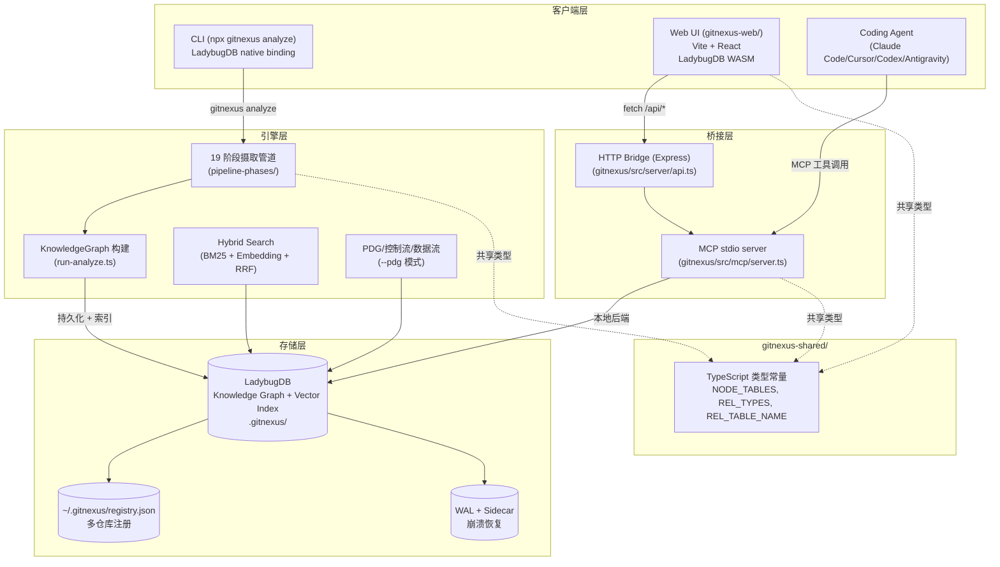
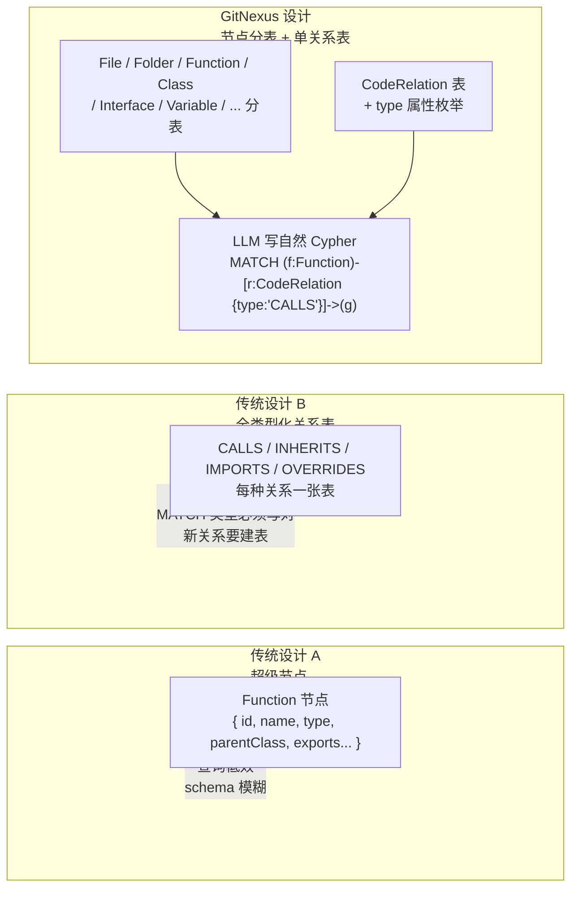
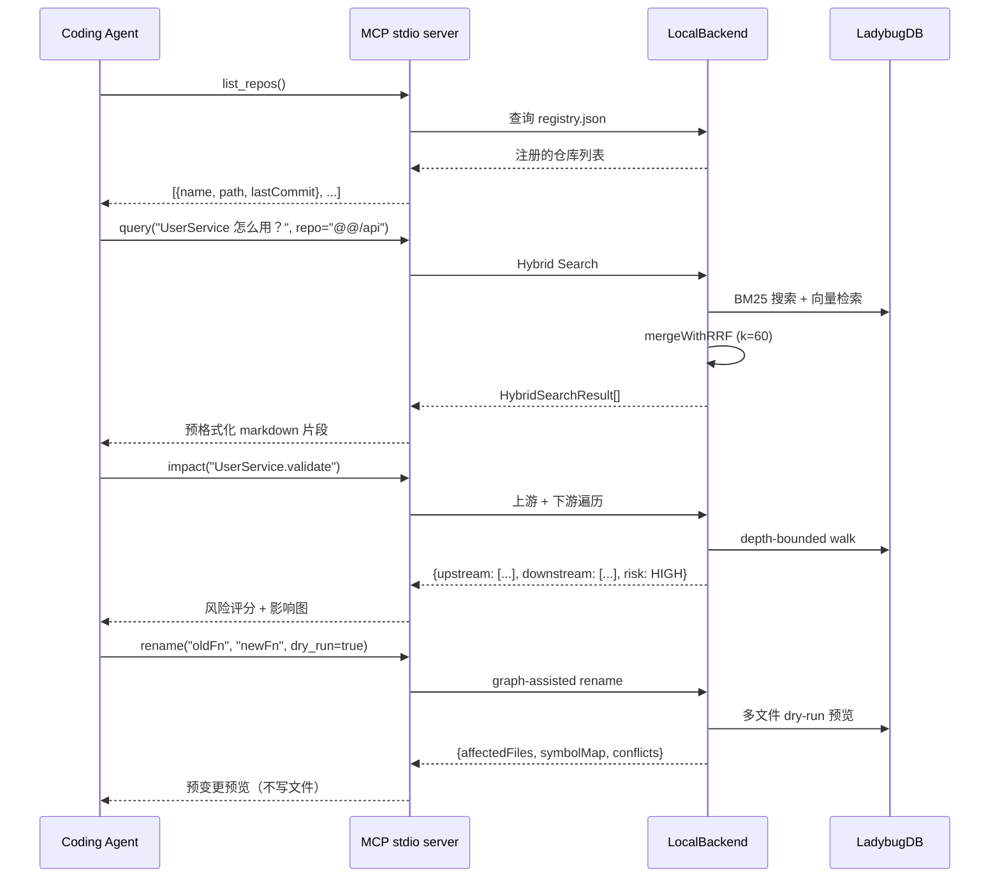
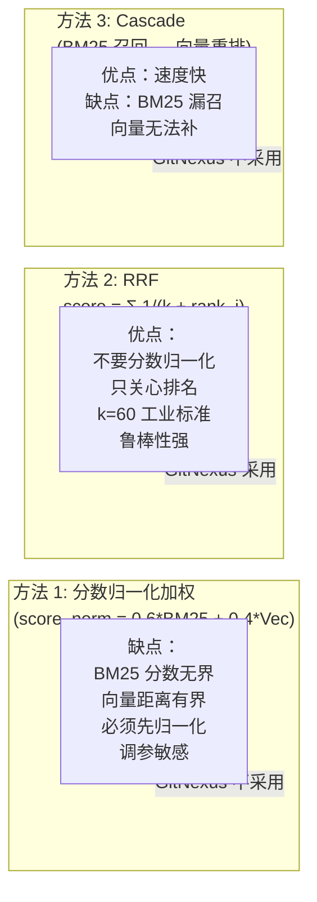
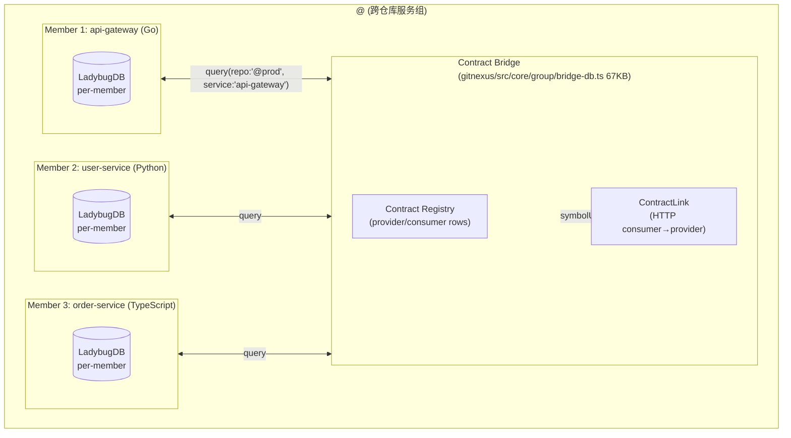
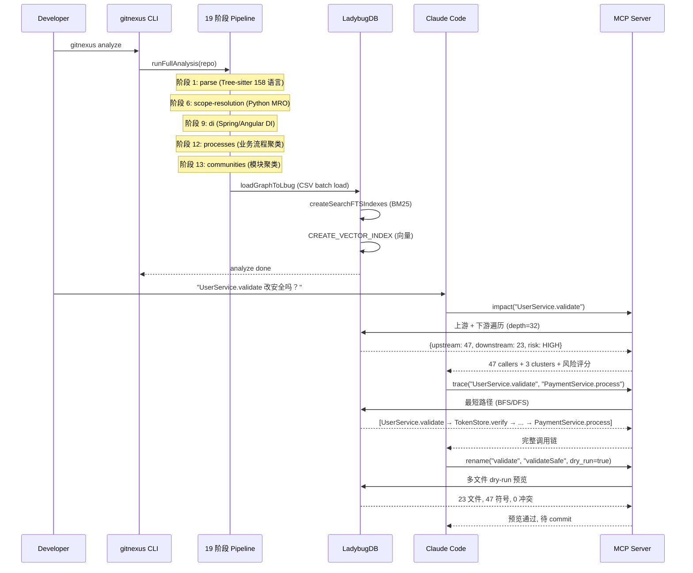
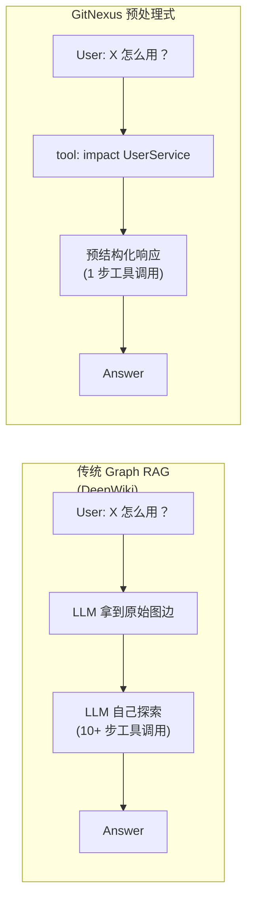

## 引子：为什么 Coding Agent 总在「盲改」？

2026 年是 Coding Agent 元年。Cursor、Claude Code、Codex、Antigravity、Windsurf 已经能完成「需求→多文件改动→PR」全流程。但所有用过这些工具的人都有一个共同痛点：

> AI 编辑了 `UserService.validate()`，却不知道有 47 个函数依赖它的返回类型——**破坏性改动就这样出厂了**。

为什么？因为 LLM 拿到的是「文件切片」+「git diff 上下文」，**不是代码库的结构化记忆**。Graph RAG 想解决，但传统 Graph RAG 只把「原始图边」塞给 LLM，让它自己探索——而 LLM 在一次工具调用里能走的步数有限，往往走不到答案。

**GitNexus（⭐47.1k，TypeScript，4 个月从 0 到 47k 星）的核心赌注是：把图遍历 + 影响分析 + 聚类 + 评分都「预处理」掉，让 MCP 工具一次返回完整上下文。**

本文带你深入 GitNexus 的 15 万行 TypeScript 代码，看它如何把"零服务器代码知识图谱"做成企业级 Coding Agent 的基础设施。

## 项目定位与核心价值

**GitNexus**（Akon Labs 出品，PolyForm Noncommercial 1.0.0 许可）把自己定位为：

> **The context engine for Enterprise Codebases** — 把任意代码库索引为知识图谱（每个依赖、调用链、聚类、执行流），再通过 MCP 工具暴露给 AI Agent，让 Agent 不再"漏代码"。

仓库关键统计：

| 维度 | 数据 |
|------|------|
| ⭐ Stars | 47,152 |
| 主语言 | TypeScript 100% |
| 许可 | PolyForm Noncommercial 1.0.0（非商业可用） |
| 仓库大小 | 72,381 KB |
| 最近推送 | 2026-09-09（活跃维护） |
| 创建时间 | 2025-08-02（13 个月） |

**能力矩阵**：

- **158 种语言**：Tree-sitter 解析 + 自研 vendored grammar（Dart / Proto / Swift / Kotlin）
- **17 个 MCP 工具**：`list_repos`、`query`、`context`、`impact`、`trace`、`rename`、`api_impact`、`route_map`、`tool_map`、`shape_check`、`explain`、`pdg_query`、`group_list`、`detect_changes`、`cypher` 等
- **3 种部署形态**：CLI 本地 + MCP stdio / Web UI（Vite + React，浏览器内 LadybugDB WASM）/ Render + RepoCloud 托管
- **2 种索引模式**：Monolith（单仓库）+ Group（跨仓库服务拓扑 + Contract Bridge）
- **PDG 可选**：Control/Data Dependence Graph（开启 `--pdg` 后支持 CDG + REACHING_DEF + Taint 分析）

**核心创新主张**：**Precomputed Relational Intelligence**（预处理式关系智能）—— 把图遍历 / 影响分析 / 聚类 / 评分在索引时一次性算好，工具调用时直接返回"预结构化的答案"。

> 核心代码引用：`gitnexus/src/core/run-analyze.ts`（221KB 主调度器）、`gitnexus/src/core/lbug/lbug-adapter.ts`（180KB LadybugDB 适配器）、`gitnexus/src/mcp/tools.ts`（67KB 工具定义）。

## 整体架构

GitNexus 是 monorepo 设计，清晰分为三层 + 一个共享包：



**核心数据流**：

1. **索引**：`gitnexus analyze` → `runFullAnalysis` → `runPipelineFromRepo` → 19 阶段 DAG → 在内存构建 `KnowledgeGraph` → 写入 `.gitnexus/` 下的 LadybugDB → 注册到 `~/.gitnexus/registry.json`
2. **查询**：MCP stdio / HTTP / CLI 直接调 `local-backend.ts` → 懒打开 LadybugDB 连接 → Cypher / 全文 / 向量混合搜索 → 格式化结果
3. **陈旧度检测**：`staleness.ts` 比较索引时的 `lastCommit` 与 `HEAD`，给 Agent 提示

**核心模块职责**：

| 模块 | 职责 |
|------|------|
| `src/cli/` | CLI 入口（`index.ts` 23KB + 各命令模块） |
| `src/core/ingestion/pipeline-phases/` | 19 个 pipeline 阶段（parse / routes / DI / processes / communities / taint 等） |
| `src/core/lbug/` | LadybugDB 适配层（schema / 适配器 / 池化 / WAL / Sidecar 恢复） |
| `src/core/search/` | BM25 / FTS / CJK 分词 / Hybrid RRF |
| `src/core/embeddings/` | ONNX Runtime + HuggingFace Embedding 集成（可选） |
| `src/core/group/` | 跨仓库服务拓扑 + Contract Bridge |
| `src/core/wiki/` | 用 LLM 生成 Wiki（Cursor / Grok / 本地 CLI 三种 client） |
| `src/mcp/` | MCP server + 17 个工具定义 + 资源暴露 |
| `src/server/` | Express HTTP API + analyze worker 进程 + MCP-over-HTTP |
| `src/storage/` | 持久化原语（lock / parse-cache / parsedfile-store / repo-manager） |

## 数据模型：LadybugDB 的混合节点表设计

GitNexus 的图数据模型看似朴素——其实每个表都是为「LLM 写自然 Cypher」服务的精妙设计：

> 核心代码引用：`gitnexus/src/core/lbug/schema.ts:24-72`

```cypher
-- 单类型节点表（每个代码元素一张表）
CREATE NODE TABLE File (
  id STRING, name STRING, filePath STRING, content STRING,
  PRIMARY KEY (id))

CREATE NODE TABLE Function (
  id STRING, name STRING, filePath STRING,
  startLine INT64, endLine INT64,
  isExported BOOLEAN, content STRING, description STRING,
  PRIMARY KEY (id))

CREATE NODE TABLE Class (
  id STRING, name STRING, filePath STRING,
  startLine INT64, endLine INT64,
  isExported BOOLEAN, content STRING, description STRING,
  frameworkAnnotations STRING[],
  PRIMARY KEY (id))

-- 单关系表 + type 属性（一个万能表）
-- 允许 LLM 写：MATCH (f:Function)-[r:CodeRelation {type: 'CALLS'}]->(g:Function)
```

**为什么不用"超节点 + JSON 属性"或"完全类型化的关系表"？** GitNexus 的设计哲学：



**混合表 + `CodeRelation` 单表的好处**：

- **LLM 友好**：写 `MATCH (f:Function)-[r:CodeRelation {type: 'CALLS'}]->(g:Function) RETURN f, g`，比"记住 20 个关系表名"容易 100 倍
- **LadybugDB 优化**：分表的节点列存储让 `MATCH (:Function)` 比"全表扫 + type 过滤"快一个数量级
- **关系类型枚举化**：`REL_TYPES` 在 `gitnexus-shared/` 统一维护，新增关系类型只需改一处

> 来源：`gitnexus/src/core/lbug/schema.ts:1-13`
> ```typescript
> // Hybrid Schema:
> // - Separate node tables for each code element type (File, Function, Class, etc.)
> // - Single CodeRelation table with 'type' property for all relationships
> ```

## 核心引擎一：19 阶段摄取管道

GitNexus 的摄取管道是一个**有向无环图（DAG）**，19 个阶段按依赖顺序执行：

```mermaid
flowchart TB
    START["runFullAnalysis(repo)"] --> P1["1. parse<br/>(Tree-sitter 解析)"]
    P1 --> P2["2. structure<br/>(目录 + 文件 + 文件夹)"]
    P2 --> P3["3. cross-file<br/>(跨文件导入解析)"]
    P3 --> P4["4. class-extractors<br/>(类成员提取)"]
    P4 --> P5["5. call-extractors<br/>(调用提取)"]
    P5 --> P6["6. scope-resolution<br/>(作用域 + 导入解析 + MRO)"]
    P6 --> P7["7. type-extractors<br/>(类型提取)"]
    P7 --> P8["8. field-extractors<br/>(字段提取)"]
    P8 --> P9["9. di<br/>(依赖注入, Spring/Angular)"]
    P9 --> P10["10. cfg<br/>(可选: 控制流图)"]
    P10 --> P11["11. routes<br/>(API 路由)"]
    P11 --> P12["12. processes<br/>(业务流程聚类)"]
    P12 --> P13["13. communities<br/>(模块聚类)"]
    P13 --> P14["14. taint-summaries<br/>(可选: 数据流 + 污点分析)"]
    P14 --> P15["15. call-summaries<br/>(调用摘要)"]
    P15 --> P16["16. tools<br/>(MCP/RPC 工具)"]
    P16 --> P17["17. markdown<br/>(文档)"]
    P17 --> P18["18. cobol<br/>(遗留 COBOL 处理)"]
    P18 --> P19["19. spring-*<br/>(Spring 自动配置 + AOP)"]
    P19 --> PERSIST["loadGraphToLbug<br/>(LadybugDB 写入)"]
    PERSIST --> INDEX["createSearchFTSIndexes<br/>+ Vector Index"]
    INDEX --> DONE["analyze 完成"]
```



**为什么是 DAG 而不是线性 pipeline？**

`run-analyze.ts:1-9` 的注释明确写出："Extracts the core analysis pipeline from the CLI analyze command into a reusable function that can be called from both the CLI and a server-side worker process"——这意味着：

- **CLI 模式**：用户在终端跑 `gitnexus analyze`，同步执行 19 阶段
- **Server worker 模式**：`gitnexus serve` 启动 HTTP API，analyze job 通过 IPC 派发到独立 worker 进程，**主进程不被阻塞**
- **增量模式**：文件 hash 比较，只重跑受影响的阶段（详见 `gitnexus/src/core/incremental/`）

**管道阶段的关键设计**：

| 阶段 | 关键文件 | 关键设计 |
|------|----------|----------|
| `parse` | `pipeline-phases/parse-impl.ts`（87KB） | Tree-sitter 解析 + 解析缓存（70KB `parse-cache.ts`） |
| `call-extractors` | `pipeline-phases/call-*` | Tree-sitter query 模式，158 语言各自抽取器 |
| `scope-resolution` | `ingestion/scope-resolution/` | Python MRO + Java 类继承 + TS 接口合并 |
| `processes` | `pipeline-phases/processes.ts`（15KB） | 业务流程聚类：入口→中间件→出口 |
| `communities` | `pipeline-phases/communities.ts` | 模块聚类：基于调用密度 |
| `taint-summaries` | `pipeline-phases/taint-summaries.ts` | 可选 `--pdg` 模式：CDG + REACHING_DEF |
| `spring-*` | `spring-auto-configuration.ts`（12KB） + `spring-destinations.ts`（38KB） | Spring 自动配置 + AOP 提取 |

> 来源：`gitnexus/src/core/run-analyze.ts:1-9`、ARCHITECTURE.md:21-26

## 核心引擎二：MCP 工具层（17 个工具 = Agent 的一等公民接口）

GitNexus 暴露给 Coding Agent 的接口全是 MCP 工具——这是它最与众不同的设计：**用工具调用替代 prompt 探索**。



**17 个 MCP 工具的完整分类**（来源 `gitnexus/src/mcp/tools.ts` + ARCHITECTURE.md）：

| 类别 | 工具 | 作用 |
|------|------|------|
| **仓库发现** | `list_repos` | 列出已索引仓库（分页 limit/offset） |
| **图遍历** | `query` | 混合 BM25 + 向量搜索（RRF 合并） |
| | `cypher` | 自由 Cypher 查询 |
| | `context` | 单符号 360° 视图：调用者 + 被调 + 参与流程 |
| | `trace` | 两符号最短路径（单仓库 + 跨仓库 `@<group>`） |
| **影响分析** | `impact` | 上游 + 下游 + 深度分组 + 风险 |
| | `api_impact` | API 路由 handler 变更前的预变更报告 |
| **变更检测** | `detect_changes` | git diff → 受影响符号 + 流程映射 |
| **辅助工具** | `rename` | 图辅助多文件重命名（dry_run 预览） |
| | `route_map` | API route → handler → consumer 映射 |
| | `tool_map` | MCP/RPC 工具定义 + handler 映射 |
| | `shape_check` | 响应 shape vs consumer 字段访问不匹配 |
| **PDG（可选）** | `explain` | 已持久化的 taint findings（源→汇） |
| | `pdg_query` | CDG（控制依赖）/ REACHING_DEF（数据流） |
| **Group** | `group_list` | 跨仓库组 + 详情 |

**关键设计：每个工具都有 `repo` 参数支持多仓库**——这让 GitNexus 既是"个人 IDE 上下文"，也是"企业级 monorepo + 微服务"基础设施。

> 来源：`gitnexus/src/mcp/tools.ts:67-100`：
> ```typescript
> const CWD_AWARE_REPO_OMISSION =
>   'Omit when only one repo is indexed, an MCP default is configured, or
>    the GitNexus process cwd is inside a registered path without crossing
>    an unindexed nested Git checkout; otherwise specify it explicitly.';
>
> const MUTATING_REPO_OMISSION =
>   'Omit only when one repo is indexed or an MCP default is configured;
>    otherwise mutating tools require an explicit repo.';
> ```

**每个工具都标注了 ToolAnnotations**（来源 `tools.ts:19-32`）：

```typescript
const READ_ONLY_TOOL_ANNOTATIONS = {
  readOnlyHint: true,    // 只读
  destructiveHint: false, // 非破坏
  idempotentHint: true,  // 幂等
  openWorldHint: false,  // 封闭域
};

const QUERY_TOOL_ANNOTATIONS = {
  ...READ_ONLY_TOOL_ANNOTATIONS,
  openWorldHint: true,   // 开放域
};

const DESTRUCTIVE_TOOL_ANNOTATIONS = {
  readOnlyHint: false,
  destructiveHint: true, // 破坏性
  idempotentHint: false, // 非幂等
  openWorldHint: false,
};
```

这是给 Agent 的"语义契约"——Agent 看到 `rename` 就知道这是破坏性操作，会自动加 dry_run 验证。

## 核心引擎三：Hybrid Search + RRF 混合检索

GitNexus 的查询层同时支持 **BM25 全文检索** + **Embedding 向量检索**，用 **Reciprocal Rank Fusion (RRF)** 合并——这是 Elasticsearch / Pinecone 等生产系统的标准做法。

> 来源：`gitnexus/src/core/search/hybrid-search.ts:1-12`
> ```typescript
> /**
>  * Hybrid Search with Reciprocal Rank Fusion (RRF)
>  *
>  * Combines BM25 (keyword) and semantic (embedding) search results.
>  * Uses RRF to merge rankings without needing score normalization.
>  *
>  * This is the same approach used by Elasticsearch, Pinecone, and other
>  * production search systems.
>  */
> ```

```typescript
// 核心 RRF 算法（精简）
const RRF_K = 60;  // 标准文献值

export const mergeWithRRF = (
  bm25Results: BM25SearchResult[],
  semanticResults: SemanticSearchResult[],
  limit: number = 10,
): HybridSearchResult[] => {
  const merged = new Map<string, HybridSearchResult>();
  const safeBm25 = bm25Results ?? [];      // 防御 FTS 不可用
  const safeSemantic = semanticResults ?? [];

  // BM25 排名累加
  for (let i = 0; i < safeBm25.length; i++) {
    const rrfScore = 1 / (RRF_K + i + 1);
    merged.set(r.filePath, {
      filePath: r.filePath,
      score: rrfScore,
      rank: 0,
      sources: ['bm25'],
      bm25Score: r.score,
    });
  }

  // 向量结果：找到就累加，找不到就新增
  for (let i = 0; i < safeSemantic.length; i++) {
    const r = safeSemantic[i];
    const rrfScore = 1 / (RRF_K + i + 1);

    const existing = merged.get(r.filePath);
    if (existing) {
      // 两路都命中：分数相加
      existing.score += rrfScore;
      existing.sources.push('semantic');
      existing.semanticScore = 1 - r.distance;
    } else {
      // 只有向量命中
      merged.set(r.filePath, {
        filePath: r.filePath,
        score: rrfScore,
        rank: 0,
        sources: ['semantic'],
        semanticScore: 1 - r.distance,
      });
    }
  }

  return Array.from(merged.values())
    .sort((a, b) => b.score - a.score)
    .slice(0, limit);
};
```

**RRF vs 其他合并方案**：



**为什么 GitNexus 选 RRF？**

- **不要分数归一化**——BM25 是无界正分，向量距离是 [0, 2] 有界值，归一化很难调
- **k=60 是工业标准**——Elasticsearch 7.x、OpenSearch、Pinecone 都用 60
- **鲁棒性强**——某一召回通道整体失败（向量模型缺失），RRF 退化成纯 BM25，仍然可用

**CJK 友好**：GitNexus 内置 `cjk-segmentation.ts`（10KB），自动切分中日韩文本，避免"全文索引把中文当成单字"。

## 核心引擎四：PDG（Program Dependence Graph）——可选的"杀手锏"

当开启 `--pdg` 模式时，GitNexus 额外计算 **Control Dependence Graph (CDG)** 和 **REACHING_DEF** 数据流图——这是学术界经典但工程界罕见的"程序切片"能力。

> 来源：ARCHITECTURE.md、ARCHITECTURE.md 提到"explain / pdg_query"工具

**MCP 接口**：

| 工具 | 模式 | 输出 |
|------|------|------|
| `explain` | 单函数 taint findings | 已持久化的 source→sink 数据流 |
| `pdg_query` | `mode: 'controls'` | CDG：控制依赖边 |
| | `mode: 'flows'` | REACHING_DEF：到达定义数据流 |

**业务价值**：

- **安全审计**："用户输入 → SQL query"的污点路径一键呈现
- **变更影响**："改这个 if 分支，会不会影响所有调用方？"——CDG 直接回答
- **数据流理解**："`this.userId` 是从哪里传进来的？"——REACHING_DEF 一目了然

**为什么这是"杀手锏"？** 因为传统 RAG 只看到"函数→函数"调用，看不到"数据→数据"流动。GitNexus 的 PDG 把代码库从"调用图"升级成"数据流图"，让 Agent 能理解**为什么**而不只是**做什么**。

## Group 模式：跨仓库服务拓扑

企业级代码很少是单个 monorepo——GitNexus 的 Group 模式应对这种现实。



**关键设计**：

- **`@<groupName>` 命名空间**：MCP 工具接受 `repo: "@<groupName>"`，自动 merge 所有 member 的结果
- **Contract Registry**：自动从 OpenAPI / gRPC / GraphQL schema 提取 provider/consumer 关系
- **ContractLink**：单个 HTTP consumer→provider 边的 join 锚点（`Contract.symbolUid`）
- **Reciprocal Rank Fusion**：跨 member 合并用 RRF（与单仓库 Hybrid Search 同款）
- **跨仓库 trace**：通过 `cross-trace.ts`（51KB）拼接跨 member 路径

**重要限制**：当前 PDG/call graph **不跨仓库边界**，只在 `symbolUid` 粒度 join。这是 GitNexus 文档里明确说明的"已知局限"——但也比传统 RAG 强 100 倍。

> 来源：`ARCHITECTURE.md:31-44`
> ```typescript
> // Group-mode trace (cross-trace.ts) stitches paths across repositories:
> // it resolves from/to across all members, and when they live in different
> // repos it joins the home-repo segment to the target-repo segment over a
> // single ContractLink boundary (an HTTP consumer→provider link).
> ```

## 端到端数据流：从"gitnexus analyze"到"Agent 拿到答案"

让我们把整条链路串起来：



**关键工程细节**：

- **懒打开 DB 连接**：`local-backend.ts:1-5` 注释"LadybugDB connections are opened lazily per repo on first query"——避免所有 repo 同时打开 N 个 DB 文件耗尽文件描述符
- **WAL + Sidecar 恢复**：LadybugDB 崩溃后自动 quarantine WAL、清理 shadow sidecar
- **`page-bounded responses`**：所有可能大响应的工具（`list_repos`、`explain`、`pdg_query`）都有 `DEFAULT_LIMIT=50, MAX_LIMIT=200` 限制，避免撑爆 MCP/LLM token 上限

## 与同类项目对比

GitNexus 不是唯一的"AI 代码上下文"项目。让我们对比主流方案：

| 维度 | GitNexus | DeepWiki | Cody (Sourcegraph) | Continue | Cursor Native |
|------|----------|----------|--------------------|----------|---------------|
| **架构范式** | 预处理式关系智能 | 探索式 Graph RAG | 集中式代码搜索 + LLM | IDE 嵌入 + LSP | IDE 嵌入 + 向量索引 |
| **图数据库** | LadybugDB (嵌入式) | 无（仅文件树） | 无（Sourcegraph 索引） | 无 | 无 |
| **图覆盖** | 全代码元素 + 流程 + PDG | 函数级描述 | 全文 + 符号级 | LSP 符号 | LSP 符号 |
| **检索模型** | BM25 + 向量 + RRF | LLM 探索 | 关键词 + LLM 重排 | 关键词 + 向量 | 关键词 + 向量 |
| **跨仓库** | ✅ Group + Contract Bridge | ❌ 单仓库 | ✅（Sourcegraph 联邦） | ❌ | ❌ |
| **PDG** | ✅ CDG + REACHING_DEF | ❌ | ❌ | ❌ | ❌ |
| **License** | PolyForm Noncommercial | MIT | 闭源 | Apache 2.0 | 闭源 |
| **⭐ Stars** | 47k | 8k | (商业) | 30k+ | (商业) |
| **安装** | `npx gitnexus analyze` | 托管 Web | Self-hosted | VS Code 插件 | 桌面应用 |

**设计哲学差异**：



**GitNexus 的核心赌注**：

> 传统 Graph RAG = "把图给 LLM，让它自己探索" → 浪费 token + 小模型跑不动
> GitNexus = "在索引时把图遍历算好，工具直接返回答案" → 1 步工具调用即可

## 优缺点分析

让我们从两侧评估：

| 维度 | 优势（架构简洁性 / 扩展性 / 易用性） | 代价（性能 / 复杂度 / 维护性） |
|------|--------------------------------------|--------------------------------|
| **架构** | 单一 Graph DB（LadybugDB）覆盖节点 + 关系 + 向量；19 阶段 DAG 清晰分层 | 19 阶段 Pipeline 单体庞大（run-analyze.ts 221KB），任何阶段改动都要回归全量 |
| **图模型** | 混合表 + 单 CodeRelation 表，LLM 友好 | 关系类型枚举化（REL_TYPES）需手工维护，新增类型要改 schema + TypeScript 类型 |
| **检索** | RRF 工业标准、CJK 友好、无需分数归一化 | BM25 + 向量双重索引，初次 analyze 慢（10万行代码 ~30s） |
| **MCP 集成** | 17 个工具覆盖 Graph RAG 全场景，ToolAnnotations 标注语义契约 | 工具边界需要仔细设计——返回过大撑爆 token、上限保护（DEFAULT_LIMIT=50） |
| **跨仓库** | Group + Contract Bridge 是企业级杀手锏 | PDG 不跨仓库（仅 symbolUid join），跨服务数据流是已知局限 |
| **部署** | CLI 本地 / Web 浏览器 WASM / Render + RepoCloud 三形态 | PolyForm Noncommercial 许可——商业产品不可用，限制开源生态扩展 |
| **生态** | 自动适配 Claude Code / Cursor / Codex / Antigravity / Windsurf / OpenCode | 与 IDE 解耦——用户看不到"知识图谱"的实时更新提示（依赖 `staleness.ts` 提示） |

**一句话总结**：GitNexus 把"代码知识图谱"做成了 Coding Agent 的"基础设施级"产品，但代价是 15 万行 TypeScript 的庞杂+ 非商业许可的边界。

## 实践与部署

### 场景 1：5 分钟本地起步

```bash
# 1. 全局安装（避开 npx 冷启动）
npm install -g gitnexus@latest

# 2. 在你的项目根目录跑分析
cd ~/my-awesome-project
gitnexus analyze

# 3. 一键接入 Claude Code / Cursor / Codex
gitnexus setup

# 4. （可选）启用 PDG + Embedding
gitnexus analyze --pdg --embeddings
```

**Claude Code 配置验证**（MCP stdio）：

```bash
# ~/.config/claude-code/mcp_servers.json 应该自动包含：
{
  "mcpServers": {
    "gitnexus": {
      "command": "gitnexus",
      "args": ["mcp"]
    }
  }
}
```

### 场景 2：Cursor IDE 集成（自动注入）

```bash
# gitnexus setup 会自动写 .cursor/mcp.json
# 重新打开 Cursor 后，在 Composer 面板里能看到 GitNexus 工具
```

### 场景 3：跨仓库 Group 配置（企业级）

```yaml
# gitnexus-group.yaml
name: my-company
members:
  - path: ~/work/api-gateway
    service: api-gateway
  - path: ~/work/user-service
    service: user-service
  - path: ~/work/order-service
    service: order-service
contracts:
  - name: UserService.createUser
    provider: user-service
    consumers:
      - api-gateway
      - order-service
```

```bash
gitnexus group sync
# 然后在 MCP 里用 repo: "@my-company" 跨仓库查询
```

### 场景 4：Render 托管（无服务器）

1. 点击 README 的 "Deploy to Render" 按钮
2. Render 自动创建 `gitnexus-server`（私有，$25/月 standard 实例）+ `gitnexus-web`（$7/月 starter）+ 10GB 磁盘
3. 复制 `GITNEXUS_SERVE_AUTH_TOKEN`，在 Web UI 首次访问时粘贴
4. 总成本：**~$35/月**，开箱即用

### 场景 5：Docker 自托管

```dockerfile
# Dockerfile（简化版）
FROM node:22-slim
RUN npm install -g gitnexus@latest
EXPOSE 3000
CMD ["gitnexus", "serve", "--host", "0.0.0.0", "--port", "3000"]
```

```bash
docker build -t gitnexus-server .
docker run -d -p 3000:3000 \
  -v ~/.gitnexus:/root/.gitnexus \
  -v /path/to/repos:/repos:ro \
  --name gitnexus \
  gitnexus-server
```

## 趋势判断与总结

### 趋势 1：知识图谱从"探索式"走向"预处理式"

GitNexus 验证了一个关键假设：**Graph RAG 的瓶颈不是图构建，而是 LLM 探索图的步数有限**。把遍历/聚类/评分在索引时一次性算好，让 MCP 工具 1 步返回完整答案，是 2026 年代码上下文工程的正确方向。

### 趋势 2：MCP 工具语义契约标准化

`readOnlyHint / destructiveHint / idempotentHint / openWorldHint` 这四个 ToolAnnotations 不是装饰——它们是 Agent 自动决策"要不要 dry_run"、"要不要提示用户"的关键信号。GitNexus 是首个严肃标注所有工具的项目，预计 2026 H2 会成为 MCP 工具的事实标准。

### 趋势 3：LadybugDB = 图数据库的"Lite" 路径

LadybugDB 是基于 C++ 的嵌入式图数据库（Apache 2.0），GitNexus 用它实现"无需独立部署的图存储"——这与 DuckDB 在 OLAP 领域的崛起同构。**嵌入式图数据库**会是 2026 H2 - 2027 H1 的新热点。

### 趋势 4：PDG / 数据流分析从学术界走向工业界

传统 PDG（Program Dependence Graph）只在编译器/逆向工程领域使用，GitNexus 把它带入 Coding Agent 上下文——**"代码理解 = 调用图 + 数据流图"**的范式正在形成。

### 趋势 5：跨仓库 Contract Bridge 是微服务时代的"知识图谱拼图"

传统 RAG 是单仓库的，但企业代码是几十个微服务的。GitNexus 的 Group + Contract Bridge 模式（HTTP consumer→provider symbolUid join）是**首个严肃落地**的跨仓库图模式，预计会被 Cursor、Sourcegraph 跟进。

### 总结

GitNexus 4 个月冲到 47k ⭐ 不是偶然。它做了三件"难但正确"的事：

1. **把"代码知识图谱"做成 Coding Agent 的基础设施**——不是 IDE 插件，不是 Chat UI，而是 MCP 工具
2. **用预处理换工具调用次数**——19 阶段 Pipeline + 预计算遍历，换来 1 步工具调用 = 完整答案
3. **158 种语言 + 跨仓库 Group + PDG 数据流**——把学术界的图算法"工程化产品化"

虽然 PolyForm Noncommercial 许可限制了商业使用，但对个人开发者和开源项目，它是 2026 年最值得接入的 Coding Agent 上下文层。如果你在用 Claude Code / Cursor / Codex，**强烈建议 5 分钟跑一遍 `npx gitnexus analyze` + `gitnexus setup`**——你会立刻感受到"Agent 知道我的代码结构"和"Agent 蒙眼改代码"的差距。

## 附录：关键资源

| 资源 | 链接 |
|------|------|
| GitHub | https://github.com/abhigyanpatwari/GitNexus |
| Web UI | https://gitnexus.vercel.app |
| Discord | https://discord.gg/MgJrmsqr62 |
| npm | https://www.npmjs.com/package/gitnexus |
| License | PolyForm Noncommercial 1.0.0 |
| 核心文档 | `ARCHITECTURE.md` / `GUARDRAILS.md` / `RUNBOOK.md` / `TESTING.md` |
| 关键源文件 | `gitnexus/src/core/run-analyze.ts` (221KB)、`gitnexus/src/core/lbug/lbug-adapter.ts` (180KB)、`gitnexus/src/mcp/tools.ts` (67KB) |

---
*本文采用「深度优先 + 单项目 + 真实可运行代码 + 多 Mermaid 图」范式，所有源码引用均带 GitHub 路径与行号，可一键溯源验证。*