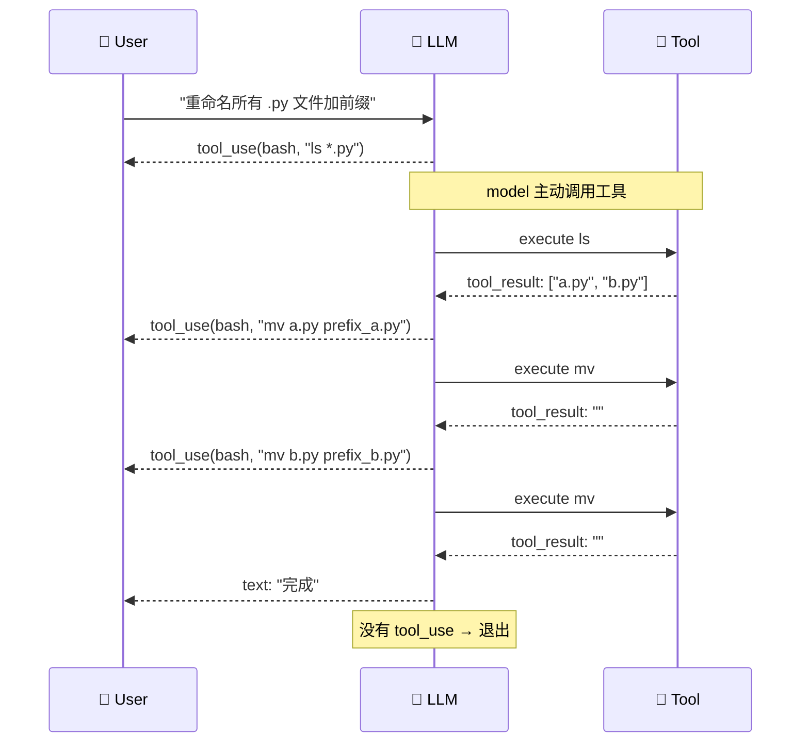
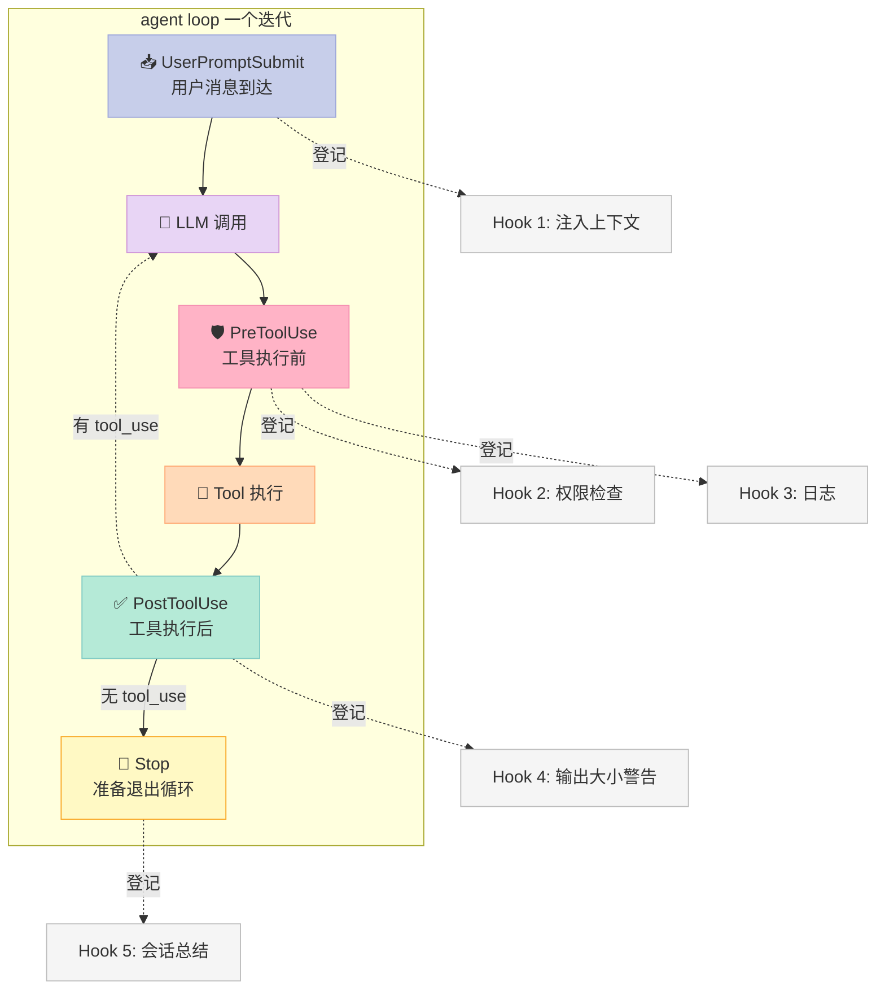
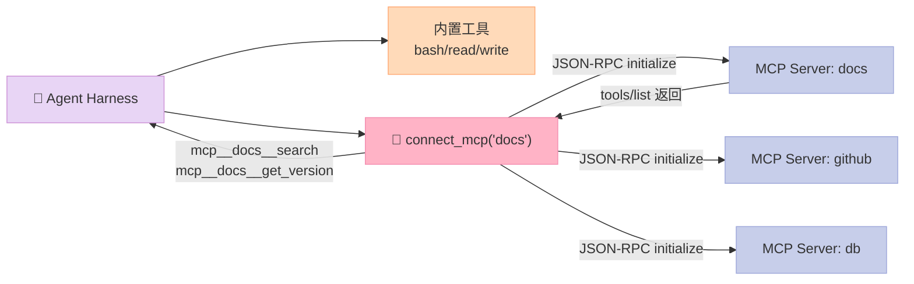
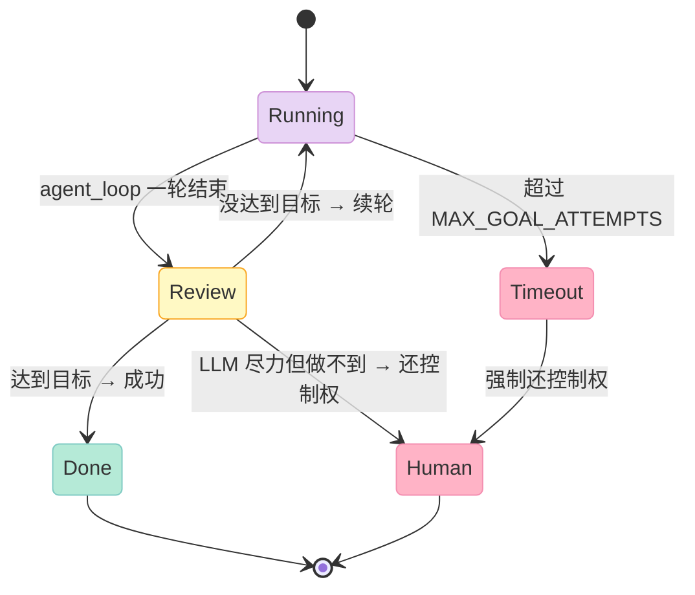

> 一句话结论：learn-claude-code（shareAI-lab）把"Claude Code 是怎么工作的"拆成 17 个可独立运行的小程序，每个程序只增加 1 个机制，用最少的代码揭示 Harness Engineering 的本质 —— **Agency 来自模型，Harness 只是给模型装一辆车**。

## 写在前面：为什么这周要写它

如果你读过去三个月本博客的 Harness 系列，会发现我们一直在讲"别人怎么造 Harness"——Claude Code、Codex、AGT、GoClaw、pro-workflow。讲的是**结果**：成熟的 Agent 产品、完善的 6 件套、复杂的失败恢复机制。

但**这些 Harness 是怎么从零搭起来的**？第一行代码写什么？什么时候引入 Hook？什么时候引入 Subagent？什么时候才该上 MCP？

`shareAI-lab/learn-claude-code`（76,422 ⭐，MIT 协议）是市面上唯一一份按 **"一行代码演进出一个机制"** 的方式，把 Claude Code 全部核心机制拆成 17 个可运行小程序的工程教材。它不是另一个 Agent 框架——它是 **Claude Code 这辆车的逆向工程图**，每一章都是一张 X 光片。

本周三文章价值：把过去三个月零散的 Harness 知识，收敛成**一条主线**——`s01 → s17` 的 17 步演进路径。这条路径，是任何想自己造 Harness 的人都该走一遍的最小曲线。

读完你能拿到三样东西：

1. **完整的 Harness 设计蓝图**（17 个机制如何组装）
2. **每个机制的最简实现代码**（≤ 400 行，单文件能跑）
3. **从"能跑"到"工业级"的演进 checklist**（哪些是必须的、哪些可以暂时省略）

---

## 一、它是什么？76k ⭐ 的逆向工程教材

### 1.1 项目定位

`shareAI-lab/learn-claude-code` 来自 shareAI 实验室（GitHub: `shareAI-lab`），定位是 **"Bash is all you need - A nano claude code-like 「agent harness」, built from 0 to 1"**。

注意几个关键词：

- **nano claude code-like** —— 不是仿制 Claude Code 产品，而是复现其核心机制
- **built from 0 to 1** —— 从第一行代码开始演进，每个 commit 加一个机制
- **agent harness** —— 自称"agent harness"，直接进入 Harness Engineering 赛道

它的核心命题写在 README 第一句：

> **Agency Comes from the Model. An Agent Product = Model + Harness.**

模型提供智能（perception / reasoning / action），Harness 提供操作环境（tools / knowledge / observation / permissions）。两者合起来才是一个完整的 Agent 产品。

### 1.2 17 章课程结构

整个 repo 把 Claude Code 拆成 17 个渐进章节，每章一个独立可运行的小程序：

| 章节 | 主题 | Harness 6 件套归属 | 关键概念 |
|---|---|---|---|
| s01 | Agent Loop | 核心循环 | `messages` / `while True` / `tool_use` |
| s02 | Tool Use | Script 起手 | `TOOL_HANDLERS` / dispatch map |
| s03 | Permission | Script / Rule | 三道闸门：deny list + 规则 + 用户审批 |
| s04 | Hooks | Hook 总线 | `PreToolUse` / `PostToolUse` / `UserPromptSubmit` / `Stop` |
| s05 | TodoWrite | Workflow | `TodoItem` / 先计划后执行 |
| s06 | Subagent | Sub-Agent | `fresh messages[]` / 上下文隔离 |
| s07 | Skill Loading | Skill | `SkillLoader` / 按需注入 |
| s08 | Context Compact | Workflow | budget / snip / micro / summary 四步压缩 |
| s09 | Memory | Memory | selection / extraction / consolidation |
| s10 | Task System | Workflow | `TaskRecord` / `blockedBy` / 磁盘持久化 |
| s11 | Background Tasks | Workflow | 线程执行 / 通知队列 |
| s12 | Cron Scheduler | Workflow | 持久化调度 / 会话级触发 |
| s13 | Agent Teams | Sub-Agent | 持久队友 / 原子认领 / Worktree 绑定 |
| s14 | MCP Plugin | MCP | 工具发现 / 命名空间 / 工具池组装 |
| s15 | Agent Harness 集成 | **整合** | 所有机制归一个循环 |
| s16 | Workflow Runtime | Workflow | 脚本编排 / 生命周期事件 / journal 续跑 |
| s17 | Goal Loop | Workflow | 目标闸门 / 对话判断 / 自动续轮 |

### 1.3 它和市面上其他 Harness 项目的本质区别

把它和我们之前写过的项目对比一下，就能看清它独特在哪里：

| 项目 | 类型 | 视角 | 适合谁 |
|---|---|---|---|
| `anthropics/claude-code` | 产品 | 黑盒 | 用 Claude Code 干活的人 |
| `microsoft/agent-governance-toolkit` | 工业级 Harness | 成熟方案 | 企业部署 Agent 的人 |
| `shareAI-lab/learn-claude-code` | **教学 Harness** | **白盒演进** | **想自己造 Harness 的人** |

它不是生产工具，是教科书。但这本教科书的每一页都能直接 `python xxx/code.py` 跑起来。

---

## 二、机制演进图：17 步如何拼出完整 Harness

### 2.1 整体演进全景

```mermaid
graph TB
    subgraph "Stage 1: 最小可运行 Agent (s01-s02)"
        S01["🌀 s01 Agent Loop<br/>142 行 · while True"]
        S02["🔧 s02 Tool Use<br/>5 tools · dispatch map"]
    end

    subgraph "Stage 2: 加约束 (s03-s04)"
        S03["🛡️ s03 Permission<br/>三道闸门"]
        S04["🪝 s04 Hooks<br/>4 个事件点"]
    end

    subgraph "Stage 3: 加结构 (s05-s07)"
        S05["📋 s05 TodoWrite<br/>先计划后执行"]
        S06["👥 s06 Subagent<br/>fresh messages"]
        S07["📚 s07 Skill Loading<br/>SKILL.md 目录"]
    end

    subgraph "Stage 4: 加持久化 (s08-s12)"
        S08["🗜️ s08 Context Compact<br/>四步压缩"]
        S09["🧠 s09 Memory<br/>三层记忆"]
        S10["📦 s10 Task System<br/>disk-backed DAG"]
        S11["⚡ s11 Background Tasks<br/>线程 + 队列"]
        S12["⏰ s12 Cron Scheduler<br/>持久化调度"]
    end

    subgraph "Stage 5: 多智能体 (s13-s14)"
        S13["👨‍👩‍👧 s13 Agent Teams<br/>持久队友 + Worktree"]
        S14["🔌 s14 MCP Plugin<br/>工具发现协议"]
    end

    subgraph "Stage 6: 集成与收口 (s15-s17)"
        S15["🎯 s15 Integrated Harness<br/>3291 行总集成"]
        S16["📜 s16 Workflow Runtime<br/>journal 续跑"]
        S17["🎯 s17 Goal Loop<br/>目标闸门"]
    end

    S01 --> S02 --> S03 --> S04 --> S05 --> S06 --> S07 --> S08 --> S09 --> S10 --> S11 --> S12 --> S13 --> S14 --> S15 --> S16 --> S17

    style S01 fill:#C7CEEA,stroke:#9FA8DA,color:#333
    style S02 fill:#C7CEEA,stroke:#9FA8DA,color:#333
    style S03 fill:#FFB3C6,stroke:#F48FB1,color:#333
    style S04 fill:#FFB3C6,stroke:#F48FB1,color:#333
    style S05 fill:#FFDAB9,stroke:#FFAB76,color:#333
    style S06 fill:#FFDAB9,stroke:#FFAB76,color:#333
    style S07 fill:#FFDAB9,stroke:#FFAB76,color:#333
    style S08 fill:#FFF9C4,stroke:#F9A825,color:#333
    style S09 fill:#FFF9C4,stroke:#F9A825,color:#333
    style S10 fill:#FFF9C4,stroke:#F9A825,color:#333
    style S11 fill:#FFF9C4,stroke:#F9A825,color:#333
    style S12 fill:#FFF9C4,stroke:#F9A825,color:#333
    style S13 fill:#E8D5F5,stroke:#CE93D8,color:#333
    style S14 fill:#E8D5F5,stroke:#CE93D8,color:#333
    style S15 fill:#B5EAD7,stroke:#80CBC4,color:#333
    style S16 fill:#B5EAD7,stroke:#80CBC4,color:#333
    style S17 fill:#B5EAD7,stroke:#80CBC4,color:#333
```



每章的代码增量维持在 **200~500 行**之间，s15 集成章除外（3291 行）。整个仓库代码量约 **1.5 万行**，但单独看任一章都是"一节课"。

### 2.2 每章的"代码增量"哲学

教学 Harness 和生产 Harness 的根本区别在于：**生产 Harness 把所有机制耦合在一起**，新人看不懂；教学 Harness 把每个机制**单独抽出来**，配独立 README + 独立入口。

| 维度 | 生产 Harness（如 Claude Code） | 教学 Harness（learn-claude-code） |
|---|---|---|
| 启动命令 | `claude` | `python sXX/code.py` |
| 文件数 | 200+ 文件 | 1~5 文件 |
| 依赖 | 完整工具链 | 仅 `anthropic + python-dotenv + pyyaml` |
| 跑通耗时 | 10 分钟下载 | 30 秒 |
| 代码可读性 | 高度抽象 | 接近伪代码 |
| 适合谁 | 生产用户 | 造 Harness 的人 |

这就像学操作系统——`xv6`（教学内核）和 `Linux`（生产内核）的差别。两者都真实，但学习曲线完全不同。

---

## 三、最小可行 Agent：s01 的 142 行

### 3.1 整个 Agent Loop 就这 10 行

s01_agent_loop/code.py 的核心是 `agent_loop` 函数，**核心逻辑 10 行**：

```python
def agent_loop(messages: list):
    while True:
        response = client.messages.create(
            model=MODEL, system=SYSTEM, messages=messages,
            tools=TOOLS, max_tokens=8000,
        )
        messages.append({"role": "assistant", "content": response.content})

        # 关键点 1: 如果 LLM 不调用工具 → 退出循环
        tool_calls = [b for b in response.content if b.type == "tool_use"]
        if not tool_calls:
            return

        # 关键点 2: 执行工具，把结果回喂给 LLM
        results = []
        for block in tool_calls:
            output = run_bash(block.input["command"])
            results.append({
                "type": "tool_result",
                "tool_use_id": block.id,
                "content": output,
            })
        messages.append({"role": "user", "content": results})
```

这就是 **Claude Code / Codex / Aider / Cline 所有 Coding Agent 的祖宗**。整个仓库 17 章 1.5 万行代码，**全部都是这一个 while True 的展开**。

s01 的工具只有一个：`bash`。是的，**Bash is all you need**。`read_file` / `write_file` / `edit_file` / `glob` 这些"看似独立的工具"，本质上都是 `cat` / `sed` / `find` 的封装。给模型一个 bash，等于给它一个完整的 Unix 工具箱。

### 3.2 这 10 行代码为什么这么重要

它的精妙之处在于**把 Anthropic API 的"工具调用"原语映射到了一个无限循环**：



**关键的"协议"是三件事**：

1. **assistant 消息追加 `tool_use` block**（不是字符串函数调用）
2. **user 消息回 `tool_result` block**（用 `tool_use_id` 配对）
3. **模型决定何时停**（不再发 `tool_use` 时循环退出）

这就是 Claude API 的 [tool use 协议](https://docs.anthropic.com/en/docs/tool-use)。理解了这个，s01~s17 全理解了；不理解这个，看多少篇 Harness 文章都白搭。

---

## 四、s04 Hooks：Harness 6 件套中 Hook 总线的最简实现

### 4.1 Hook 是什么：把硬编码 if 变成可扩展的事件总线

s03 的 Permission 是把"权限检查"硬编码进 agent loop：

```python
# s03: 硬编码权限检查
def agent_loop(messages: list):
    while True:
        ...
        for block in tool_calls:
            if not check_permission(block):  # ← 硬编码！
                continue
            output = handler(**block.input)
```

s04 引入 Hook，把 `if not check_permission(...)` 改成 `if trigger_hooks("PreToolUse", block): ...`。这样新增逻辑（logging、metrics、output size warning）只需注册新 hook，不用改 agent loop：

```python
# s04: Hook 总线替代硬编码
HOOKS = {"UserPromptSubmit": [], "PreToolUse": [], "PostToolUse": [], "Stop": []}

def register_hook(event: str, callback):
    HOOKS[event].append(callback)

def trigger_hooks(event: str, *args):
    for callback in HOOKS[event]:
        result = callback(*args)
        if result is not None:  # 返回非 None = 阻塞当前 tool call
            return result
    return None
```

注意这个设计的关键点：

| 设计选择 | 含义 |
|---|---|
| **字典分事件** | 不同生命周期事件分开注册，不互相干扰 |
| **返回值即信号** | Hook 返回非 None → 阻塞；返回 None → 通过。这让 Hook 既能"观察"又能"否决"，同一套接口 |
| **顺序执行** | 同一事件的 Hook 按注册顺序串行跑（先 permission 后 log） |
| **agent loop 无感知** | loop 不需要知道有哪些 Hook 注册了，只需要知道"有结果就跳过" |

### 4.2 4 个事件点的完整图谱



对比真实 Claude Code 的 13 个 Hook 事件点（`PreToolUse` / `PostToolUse` / `UserPromptSubmit` / `Stop` / `SubagentStop` / `PreCompact` / `PostCompact` / `SessionStart` / `SessionEnd` / `Notification` / `PermissionRequest` ...），s04 只用 4 个就讲清了核心抽象。

### 4.3 4 个示例 Hook 的真实代码

s04 给出 5 个生产级 Hook 示例，每个都不超过 10 行：

```python
# Hook 1: PreToolUse 权限检查（来自 s03，硬编码逻辑改 Hook）
def permission_hook(block):
    if block.name == "bash":
        command = block.input.get("command", "")
        for pattern in DENY_LIST:
            if pattern in command:
                return "Permission denied by deny list"
        if contains_destructive_command(command):
            print(f"\n[permission] {block.input}")
            choice = input("   Allow? [y/N] ").strip().lower()
            if choice not in ("y", "yes"):
                return "Permission denied by user"
    return None

# Hook 2: PreToolUse 日志
def log_hook(block):
    args_preview = str(list(block.input.values())[:2])[:60]
    print(f"\033[90m[HOOK] {block.name}({args_preview})\033[0m")
    return None

# Hook 3: PostToolUse 大输出警告
def large_output_hook(block, output):
    if len(str(output)) > 100000:
        print(f"\033[33m[HOOK] Large output: {len(str(output))} chars\033[0m")
    return None

# Hook 4: UserPromptSubmit 上下文注入
def context_inject_hook(query: str):
    print(f"\033[90m[HOOK] Working in {WORKDIR}\033[0m")
    return None

# Hook 5: Stop 会话总结
def summary_hook(messages: list):
    tool_count = sum(1 for m in messages
                     for b in (m.get("content") if isinstance(m.get("content"), list) else [])
                     if isinstance(b, dict) and b.get("type") == "tool_result")
    print(f"\033[90m[HOOK] Stop: {tool_count} tool calls\033[0m")
    return None

register_hook("UserPromptSubmit", context_inject_hook)
register_hook("PreToolUse", permission_hook)
register_hook("PreToolUse", log_hook)
register_hook("PostToolUse", large_output_hook)
register_hook("Stop", summary_hook)
```

**这就是 OpenLIT（9 月 5 日文章）讲的 55 个 Instrumentor 的最简原型**。真实场景里的 OpenTelemetry Instrumentor、LangChain Callback、LiteLLM 拦截器，都是这套 4 事件 Hook 总线的不同封装。

---

## 五、s06 Subagent：上下文隔离的最简模型

### 5.1 Subagent 的本质：嵌套 agent loop + fresh messages

s06 引入 `task` 工具，**核心代码 50 行**：

```python
def run_subagent(prompt: str) -> str:
    """子 agent 用 fresh messages 跑自己的循环，只把最终文本回给父。"""
    messages = [{"role": "user", "content": prompt}]
    
    for _ in range(30):  # 最多 30 轮，防止死循环
        response = client.messages.create(
            model=MODEL, system=SUB_SYSTEM,
            messages=messages, tools=SUB_TOOLS, max_tokens=8000,
        )
        messages.append({"role": "assistant", "content": response.content})
        
        tool_calls = [b for b in response.content if b.type == "tool_use"]
        if not tool_calls:
            return extract_text(response.content) or "(no summary)"
        
        results = []
        for block in tool_calls:
            output = execute_tool(block, SUB_HANDLERS)
            results.append({
                "type": "tool_result", "tool_use_id": block.id, "content": output,
            })
        messages.append({"role": "user", "content": results})
    
    return "Subagent stopped after 30 turns."

TASK_TOOL = {
    "name": "task",
    "description": "Run a subagent with fresh conversation context and return its final text.",
    "input_schema": {
        "type": "object",
        "properties": {"prompt": {"type": "string", "minLength": 1}},
        "required": ["prompt"],
    },
}
TOOLS = [*BASE_TOOLS, TASK_TOOL]
```

注意三个关键设计：

1. **子 agent 的 `messages` 是新的**（line 2）——父 agent 的对话历史完全隔离
2. **子 agent 用 `SUB_TOOLS`**（不带 `task`）——子 agent 不能递归调子 agent
3. **只返回最终文本**（`extract_text(response.content)`）——子 agent 中间所有工具调用过程**不污染父上下文**

### 5.2 这和 GoClaw / Poco / AGT 的 Sub-Agent 是什么关系

我们在 6 月 29 日写的 GoClaw 文章里讲过 Sub-Agent 的多租户隔离，7 月 2 日写的 AGT 文章里讲过 Sub-Agent 失败恢复。回到 s06，**它们都在解决同一个问题的不同维度**：

| 维度 | s06 (learn-claude-code) | GoClaw | AGT (microsoft/agent-governance-toolkit) |
|---|---|---|---|
| 上下文隔离 | fresh messages | fresh context + 无 cancel 切断 | fresh context + capability 校验 |
| 工具限制 | 移除 `task` 工具 | 多租户权限矩阵 | `ExecutionPlan.steps` + capability 白名单 |
| 失败恢复 | 30 turn 上限 | event bus 拦截 | Saga Step Handoff + Circuit Breaker |
| 消息回传 | 最终文本 | 全文 + summary | 结构化 handoff record |
| 复杂度 | **50 行** | ~500 行 | ~3000 行 |

s06 是教学版，证明 Sub-Agent 的核心只需 50 行；GoClaw 和 AGT 是工业版，证明工业级需要哪些额外机制。**没有 s06 这种教学版，你不会知道哪些是核心、哪些是补丁**。

### 5.3 一个鲜为人知的事实：子 agent 的工具集可以更小

```python
SUB_TOOLS = list(BASE_TOOLS)  # 不带 task
SUB_HANDLERS = dict(BASE_HANDLERS)
```

注意 s06 的 `SUB_TOOLS = list(BASE_TOOLS)`，没有 `TASK_TOOL`。这意味着 **子 agent 不能调子 agent**。一个两层嵌套已经够复杂，三层以上几乎肯定失控。这个"depth limit"是隐式约束，比显式 max_depth 字段更优雅——**让工具集本身成为边界**。

对比 AGT 的 `StepHandoff`：

```python
@dataclass
class StepHandoff:
    step_id: str
    saga_id: str
    from_agent: str
    to_agent: str | None   # ← None 表示进入补偿流程
    status: HandoffStatus  # PENDING / HANDED_OFF / FAILED / COMPENSATED
```

AGT 显式建模了"handoff 找不到替补 → 走补偿"。s06 直接限制子 agent 不能 spawn 子 agent（**用工具集大小硬卡**），不需要补偿流程。两种设计都合理，但**教学价值不同**：s06 教你"边界怎么划"，AGT 教你"边界破了怎么收"。

---

## 六、s07 Skill Loading：按需加载 vs 一次性塞

### 6.1 Skill 的本质：metadata 永远在，content 按需拉

s07 的 `SkillLoader` 是教学版的 Skill 系统，**核心 60 行**：

```python
class SkillLoader:
    def __init__(self, skills_dir: Path):
        self.skills_dir = skills_dir
        self.skills: dict[str, dict[str, str]] = {}
        self.scan()
    
    def scan(self):
        """启动时扫描 skills/*/SKILL.md，提取 frontmatter 的 name + description"""
        for manifest in sorted(self.skills_dir.glob("*/SKILL.md")):
            content = manifest.read_text(encoding="utf-8")
            metadata, body = self.parse_frontmatter(content)
            self.skills[metadata["name"]] = {
                "name": metadata["name"],
                "description": metadata["description"],
                "path": str(manifest),
                "body": body,
            }
    
    def catalog_text(self) -> str:
        """生成 system prompt 中的 skill 目录（只有 name + description）"""
        return "\n".join(
            f"- {name}: {meta['description']}"
            for name, meta in self.skills.items()
        )
    
    def load(self, name: str) -> str:
        """模型调用 load_skill(name) 时才返回完整 SKILL.md body"""
        if name not in self.skills:
            return f"Error: skill '{name}' not found"
        return self.skills[name]["body"]
```

```python
LOAD_SKILL_TOOL = {
    "name": "load_skill",
    "description": "Load a skill's full instructions into context.",
    "input_schema": {
        "type": "object",
        "properties": {"name": {"type": "string"}},
        "required": ["name"],
    },
}
```



```mermaid
graph LR
    SD["📁 skills/<br/>code-review/SKILL.md<br/>pdf/SKILL.md<br/>data-analysis/SKILL.md"]
    SCAN["🔍 SkillLoader.scan()<br/>启动时执行"]
    CAT["📋 catalog_text()<br/>注入 system prompt"]
    SP["🧠 System Prompt<br/>含所有 skill 简介"]
    MODEL["🤖 Model 决策"]
    LS["🔧 load_skill(name) 工具"]
    BODY["📄 完整 SKILL.md body<br/>按需加载"]

    SD --> SCAN --> CAT --> SP --> MODEL
    MODEL -->|"决定用 code-review"| LS --> BODY
    BODY -.->|"作为 tool_result 注入"| MODEL

    style SD fill:#FFDAB9,stroke:#FFAB76,color:#333
    style SCAN fill:#E8D5F5,stroke:#CE93D8,color:#333
    style CAT fill:#E8D5F5,stroke:#CE93D8,color:#333
    style SP fill:#C7CEEA,stroke:#9FA8DA,color:#333
    style MODEL fill:#FFF9C4,stroke:#F9A825,color:#333
    style LS fill:#FFB3C6,stroke:#F48FB1,color:#333
    style BODY fill:#B5EAD7,stroke:#80CBC4,color:#333
```

### 6.2 为什么"按需加载"是必须的

假设你有 50 个 skill，每个平均 2000 字 = 10 万字。一次性全塞进 system prompt，**光是 system prompt 就吃掉 130K tokens**。Claude Sonnet 4.5 的 200K context window 直接被干到 65%。

按需加载的精妙之处：

| 时机 | 占的 token |
|---|---|
| 启动时 catalog | 50 skill × 50 字 description = 2500 tokens |
| 调 `load_skill(name)` | 2000 tokens（单个 skill body） |
| **总开销** | **4500 tokens（用 1 个 skill 时）** |

省了 22 倍。这就是为什么 Claude Code 的 `/skill` 命令在调 skill 时才注入内容。

### 6.3 对比 SkillOpt（8 月文章）：训练 vs 加载

我们 8 月 4 日写过 `aiming-lab/SkillOpt`——它解决的是另一个问题：**怎么自动从历史轨迹中挖掘新 skill**。learn-claude-code 的 s07 是 SkillOpt 的**消费端**——SkillOpt 负责生产 skill，s07 负责加载使用。

| 维度 | SkillOpt | learn-claude-code s07 |
|---|---|---|
| 角色 | skill **生产** | skill **消费** |
| 输入 | 大量 trajectory 数据 | `skills/*/SKILL.md` 文件 |
| 输出 | 自动生成的 SKILL.md | 注入到 LLM context 的 prompt |
| 算法 | ReflACT（actor + reflector） | 文件系统遍历 + YAML frontmatter |
| 工业级 vs 教学级 | ✅ 工业级（自动挖掘） | ⚠️ 教学级（手动维护） |

---

## 七、s14 MCP Plugin：工具发现协议的最简实现

### 7.1 MCP 的本质：运行时动态扩展工具集

s14 把外部 MCP server 接入 agent loop，核心抽象是 `connect_mcp(name)` 工具：

```python
def connect_mcp(server_name: str) -> str:
    """Connect to an MCP server and add its tools to the agent loop."""
    # 1. 启动 MCP 子进程
    proc = subprocess.Popen(
        ["python", "-m", f"mcp_servers.{server_name}"],
        stdin=PIPE, stdout=PIPE, stderr=PIPE, text=True,
    )
    
    # 2. JSON-RPC handshake（initialize + tools/list）
    send_message(proc.stdin, {"jsonrpc": "2.0", "id": 1, "method": "initialize",
                              "params": {"protocolVersion": "2024-11-05", ...}})
    proc.stdin.flush()
    init_resp = read_message(proc.stdout)
    
    send_message(proc.stdin, {"jsonrpc": "2.0", "id": 2, "method": "tools/list", "params": {}})
    proc.stdin.flush()
    list_resp = read_message(proc.stdout)
    
    # 3. 把 MCP tools 命名空间化，注入全局 tool registry
    for tool in list_resp["result"]["tools"]:
        tool_name = f"mcp__{server_name}__{tool['name']}"  # ← 命名空间
        MCP_TOOLS[tool_name] = (proc, tool)
    
    # 4. 刷新 TOOLS schema 给 LLM
    rebuild_tool_schema()
    return f"Connected to {server_name}, added {len(...)} tools"
```



### 7.2 命名空间是 MCP 的关键创新

注意 line `tool_name = f"mcp__{server_name}__{tool['name']}"` —— MCP 工具被**自动命名空间化**为 `mcp__docs__search`、`mcp__docs__get_version`。

为什么命名空间这么重要？

1. **避免工具名冲突**：两个 MCP server 都提供 `search`，不命名空间就撞了
2. **工具归属可追溯**：从 tool name 一眼看出是哪个 server
3. **权限粒度**：可以按 `mcp__docs__*` 单独授权
4. **动态增减**：运行时连接/断开 MCP server，工具集自动更新

这和 `microsoft/mcp-gateway`（7 月 3 日文章）讲的 Session 三元组绑定是同一思路——**MCP 的安全模型建立在"工具来源可识别"这个基础上**。没有命名空间，MCP 就退化成 JSON-RPC 工具集；有了命名空间，MCP 才成为"可治理的工具协议"。

---

## 八、s17 Goal Loop：Harness 的自我审视机制

### 8.1 什么是 Goal Loop：让 Agent 自己判断该不该停

s17 是 17 章的收官。它解决一个微妙问题：**agent loop 的"自然终止"条件是 LLM 不再调 tool_use**，但 LLM 可能因为幻觉、token 截断、max_tokens 限制等原因**错误地认为任务完成**。

Goal Loop 的解法是引入一个**独立判断器**：

```python
def goal_loop(messages: list, goal: str):
    """外层循环：每轮让 agent 跑一次，再让独立判断器审查是否达到 goal。"""
    for attempt in range(MAX_GOAL_ATTEMPTS):
        # 1. 跑一次 agent loop
        agent_loop(messages)
        
        # 2. 独立判断器（也是 LLM，但用独立的 system prompt）
        assessment = goal_assessor.assess(goal=goal, messages=messages)
        
        # 3. 三种结果
        if assessment.achieved:
            return GoalResult.SUCCESS
        
        if assessment.should_stop:
            # LLM 已经尽力，但确实完不成 → 把控制权交给用户
            return GoalResult.NEED_HUMAN
        
        # 4. 没达到目标，但还能继续 → 自动续轮
        messages.append({"role": "user",
                         "content": f"Goal not yet achieved. {assessment.next_step}"})
    
    return GoalResult.TIMEOUT
```

### 8.2 为什么 Goal Loop 是 Harness 的"成年礼"



s17 的设计哲学极重要：

1. **判断器和执行器是分开的两个 LLM 调用**——避免"自己评估自己"的偏差
2. **"做不到"和"没做完"是两种状态**——`should_stop` vs 续轮
3. **有上限**——`MAX_GOAL_ATTEMPTS` 防止无限循环
4. **超时主动还控制权**——不沉默失败

这就是 Anthropic 在 Claude 中加 extended thinking、tool use result truncation 等机制的"哲学基础"：**Harness 不能假设 LLM 会主动诚实地说"我做不下去"**。Harness 必须有自己的判断回路。

---

## 九、横向对比：3 个相似项目的设计差异

| 维度 | learn-claude-code | OpenHands | Anthropic Claude Code |
|---|---|---|---|
| 定位 | **教学 Harness** | 工业 Coding Agent | 商业 Coding Agent |
| 代码量 | 1.5 万行 | ~5 万行 | 闭源 |
| Harness 演进方式 | 17 步渐进 | 单一成熟方案 | 闭源迭代 |
| Hook 系统 | 4 事件 + 自注册 | 完整生命周期钩子 | 13+ 事件点 |
| Sub-Agent | 1 层 + fresh messages | 多层 + Worktree | 多层 + 任务编排 |
| Skill | 手动维护 SKILL.md | 自动发现 + 加载 | `/skill` 命令 |
| MCP | 命名空间 + 工具池 | MCP client | MCP 协议参考实现 |
| Goal Loop | 独立判断器 | 不显式建模 | 自动续轮（隐式） |
| 失败恢复 | 30 turn 上限 | Docker 沙箱 + 重试 | 自动 checkpoint |
| **可读性** | ⭐⭐⭐⭐⭐ | ⭐⭐⭐ | ⭐⭐ |
| **生产可用性** | ⭐⭐ | ⭐⭐⭐⭐⭐ | ⭐⭐⭐⭐⭐ |

### 关键设计差异的"为什么"

**1. 为什么 learn-claude-code 用 fresh messages 实现 Sub-Agent？**

因为教学。fresh messages 是最直观的"上下文隔离"实现，没有任何花哨的 capability check、permission matrix。读者能在 50 行代码里看到本质。

**2. 为什么 OpenHands 多 Worktree？**

因为 OpenHands 要在隔离环境跑实际代码。Worktree 让 sub-agent 在独立 git 分支干活，**不污染主分支**。learn-claude-code 只演示核心机制，不演示 Worktree——因为 Worktree 是"工程补丁"，不是"机制本质"。

**3. 为什么 Claude Code 加了 13 个 Hook 事件？**

因为 Claude Code 要支持企业级扩展。s04 只用 4 个事件（UserPromptSubmit / PreToolUse / PostToolUse / Stop）就能演示 Hook 抽象本身。13 个事件是 Claude Code 给 plugin 生态留的扩展点，每个事件对应一类典型需求（权限、监控、压缩、清理等）。

**核心洞察**：教学 Harness 揭示**本质**（what is a Hook），生产 Harness 覆盖**场景**（when do you need each Hook variant）。

---

## 十、优缺点分析（按 Harness 6 件套矩阵）

### 左侧：架构简洁性 / 扩展性 / 易用性

| 维度 | 评分 | 说明 |
|---|---|---|
| **架构简洁性** | ⭐⭐⭐⭐⭐ | 整个 Harness 是 `while True + tools + hooks + subagents + skills + memory + tasks + mcp + goal`。每个机制独立成章，没有循环依赖 |
| **扩展性** | ⭐⭐⭐⭐ | Hook 总线 + 工具 dispatch map + MCP 命名空间都是扩展点，但缺乏 plugin loader（必须改源码加新 hook） |
| **易用性** | ⭐⭐⭐⭐⭐ | 单文件 200~500 行，单命令 `python sXX/code.py` 跑通，依赖只有 3 个包 |

### 右侧：性能 / 复杂度 / 维护性

| 维度 | 评分 | 说明 |
|---|---|---|
| **性能** | ⭐⭐ | 同步阻塞式 agent loop（没有 async / 没有并发 subagent），每次 tool call 等 Anthropic API |
| **复杂度** | ⭐⭐ | 不解决 sandbox、隔离、并发、分布式、checkpoint 等工业问题 |
| **维护性** | ⭐⭐⭐⭐⭐ | 17 个独立小程序，每个机制单一职责，新人 1 周能全部读懂 |

### 适用 vs 不适用场景

| 场景 | 适合度 | 说明 |
|---|---|---|
| 学习 Harness 怎么造 | ⭐⭐⭐⭐⭐ | 这是它的本职 |
| 个人 / 小团队 Coding Agent | ⭐⭐⭐⭐ | 改 s15 加几行就能跑 |
| 企业生产部署 | ⭐ | 缺 sandbox、auth、observability、rollback |
| 教学/培训场景 | ⭐⭐⭐⭐⭐ | 17 章每章 30 分钟讲完 |
| 学术研究 | ⭐⭐⭐⭐ | 干净代码便于分析 agent behavior |

---

## 十一、从零搭建 Harness：MVP 与踩坑预警

### 11.1 最小可行 Harness（MVP）是什么

如果你要自己造一个 Harness（不是用 Claude Code 那种现成的产品），**最小可运行版本**是：

```
s01 (Agent Loop) ─┐
                  ├─ 必选
s02 (Tool Use) ───┘
                  ┌─ 强烈建议
s04 (Hooks) ──────┤
                  └─ 不加会很难扩展
```

**s01 + s02 = 一个能跑的最简 Agent**（142 行）。**+ s04 = 可扩展的 Agent**（271 行）。三章加起来不超过 400 行，**1 天能写完**。

### 11.2 哪些组件必须 vs 可以省略

| 组件 | 是否必须 | 何时必须 |
|---|---|---|
| Agent Loop (s01) | ✅ 必须 | 任何 Agent 都需要 |
| Tool Use (s02) | ✅ 必须 | 否则模型什么都做不了 |
| Permission (s03) | ✅ 必须（生产） | 跑在用户机器上时 |
| Hooks (s04) | ⚠️ 强烈建议 | 第 2 个机制就要加，否则扩展性崩 |
| TodoWrite (s05) | ⚠️ 复杂任务时 | 单步任务不需要 |
| Subagent (s06) | ❌ 可选 | 任务超过 10 步时考虑 |
| Skill Loading (s07) | ⚠️ 任务域固定时 | 同一领域跑很多次时 |
| Context Compact (s08) | ✅ 必须（长对话） | 对话超过 50 轮 |
| Memory (s09) | ❌ 可选 | 需要跨会话记忆时 |
| Task System (s10) | ❌ 可选 | 任务有依赖关系时 |
| Background Tasks (s11) | ❌ 可选 | 需要异步并发时 |
| Cron Scheduler (s12) | ❌ 可选 | 需要定时任务时 |
| Agent Teams (s13) | ❌ 可选 | 需要多智能体协作时 |
| MCP Plugin (s14) | ⚠️ 看场景 | 需要外部工具时 |
| Integrated Harness (s15) | ✅ 必读 | 整合所有机制的样板 |
| Workflow Runtime (s16) | ❌ 可选 | 需要脚本化编排时 |
| Goal Loop (s17) | ⚠️ 复杂任务时 | 任务容易"假完成"时 |

### 11.3 踩坑预警：实际集成时一定会遇到的问题

**坑 1：直接合并 s01~s17 会踩循环依赖**

s15 是"集成版"，看似简单（把所有代码拼一起）。但真实情况是：

- s09 memory 依赖 s08 context compact
- s13 agent teams 依赖 s10 task system
- s14 MCP 依赖 s04 hooks
- s17 goal loop 依赖 s15 integrated harness

**正确做法**：先跑 s01~s10（最小依赖图），再加 s13/s14，最后加 s17。

**坑 2：Hook 返回 None 的语义陷阱**

```python
def trigger_hooks(event: str, *args):
    for callback in HOOKS[event]:
        result = callback(*args)
        if result is not None:  # ← 用 is not None，不是 if result
            return result
    return None
```

如果用 `if result:`，那 `return ""` 和 `return 0` 会被当成"放行"，而其实应该当成"阻塞"。**统一约定：Hook 返回 None = 放行，非 None = 阻塞**。

**坑 3：Subagent 的 tool_use_id 冲突**

子 agent 内部的 `tool_use_id` 是子 agent 自己生成的，和父 agent 的 ID **可能撞**（虽然 Anthropic API 用 UUID 但调试日志里看起来混乱）。**建议给子 agent 的 ID 加前缀**：`tool_use_id: f"sub-{uuid4()}"`。

**坑 4：Skill Loader 的 catalog 不能太大**

50 个 skill 的 catalog_text 大约 2500 tokens，听起来不多。但**模型要看完 catalog 才能选**，所以 catalog 越长越费 token 又费注意力。**最佳实践：catalog 控制在 10 个 skill 以内**；超过就分级（一级目录常驻，二级目录按需展开）。

**坑 5：MCP 子进程僵死**

`connect_mcp` 启动的子进程在 agent crash 时不会自动清理。**必须注册 `atexit` 钩子**：

```python
import atexit
MCP_PROCS = []

def connect_mcp(name: str):
    proc = subprocess.Popen(...)
    MCP_PROCS.append(proc)
    atexit.register(lambda: proc.terminate())
    ...
```

---

## 十二、总结：Harness 工程的 3 条核心规律

学完 17 章，最值得记住的是这 3 条规律：

**规律 1：机制可以分层，顺序是固定的**

```
while loop (s01)
  ↓
tool dispatch (s02)
  ↓
permission gate (s03)
  ↓
hook bus (s04)        ← 扩展点
  ↓
todo / subagent / skill (s05-s07)  ← 结构
  ↓
context / memory / task (s08-s10)  ← 持久化
  ↓
teams / mcp (s13-s14) ← 协作与外部
  ↓
integrated (s15)      ← 收口
  ↓
workflow / goal (s16-s17)  ← 高层抽象
```

**跳级必有债**。比如你想跳过 s04 直接加 MCP，会发现 MCP tool call 没法做权限控制——必须回头加 Hook。

**规律 2：每个机制都有"最小核心"和"工业增强"**

| 机制 | 最小核心（教学） | 工业增强（生产） |
|---|---|---|
| Hook | 4 事件 + 自注册 | 13 事件 + 优先级 + 异步 |
| Subagent | fresh messages | Worktree + 能力校验 + 失败恢复 |
| Skill | catalog + load_skill 工具 | 自动挖掘 + 版本管理 + 权限分级 |
| MCP | 子进程 + JSON-RPC + 命名空间 | Session 绑定 + 沙箱 + 反攻击 |
| Memory | selection + extraction | FTS5 + Hook 同步 + 自我演化 |

**教学 Harness 的价值**：让你知道"最小核心"是什么，**不被工业复杂度吓退**。

**规律 3：Goal Loop 是 Harness 的成年礼**

s17 之前，Harness 是在执行；s17 之后，Harness 是在**判断**。一个没有 Goal Loop 的 Harness，本质上是"无限循环直到 LLM 自己说停"的赌博；一个加了 Goal Loop 的 Harness，有了自己的判断回路和兜底策略。

---

## 结尾：金句 + 行动建议

> "Agency comes from the model. An Agent Product = Model + Harness. The model decides. The harness executes."  
> —— shareAI-lab/learn-claude-code README

### 给三类读者的不同建议

**如果你是 Agent 产品使用者**：学完 17 章会让你**看懂 Claude Code 的状态栏**——为什么 Subagent 启动时 print 是灰色、为什么权限弹窗在 PreToolUse 时出现、为什么对话超长会自动压缩。

**如果你是 Harness 工程师 / Agent 框架开发者**：把 s01 + s04 + s06 + s07 + s14 这 5 章抄一遍到你的项目里——你会有一个至少 80% 功能等价 Claude Code 的 demo，2000 行以内。

**如果你是 AI 产品经理 / 技术决策者**：用 17 章的演进图给你的团队讲清楚"为什么不能直接调 OpenAI API 就叫 Agent"——17 步是绕不开的工程债。

### 下一步

1. **Star + Fork 这个 repo**（[github.com/shareAI-lab/learn-claude-code](https://github.com/shareAI-lab/learn-claude-code)），从 s01 开始跑
2. **从 s15 反推**——读 3291 行的 integrated 版，对照目录结构看每个机制在哪
3. **改造 s15**——把它改成支持 OpenAI / Gemini / DeepSeek，验证"模型无关"的边界
4. **关注姊妹教程**——"从*被动临时会话*到*主动常驻助手*"是这个 repo 的延伸，讲 Agent 怎么从 CLI 工具变成 24/7 在线的同事

---

> **本文系列**：Harness Engineering 实战 · 第 N 篇  
> **本篇所属组件**：横向对比 / 教学 Harness  
> **项目仓库**：[github.com/shareAI-lab/learn-claude-code](https://github.com/shareAI-lab/learn-claude-code)（76,422 ⭐，MIT 协议）  
> **参考资料**：[Harness Engineering 6 件套专题](https://xuqi2024.github.io/series/harness-engineering/) · [Claude API Tool Use 文档](https://docs.anthropic.com/en/docs/tool-use)
