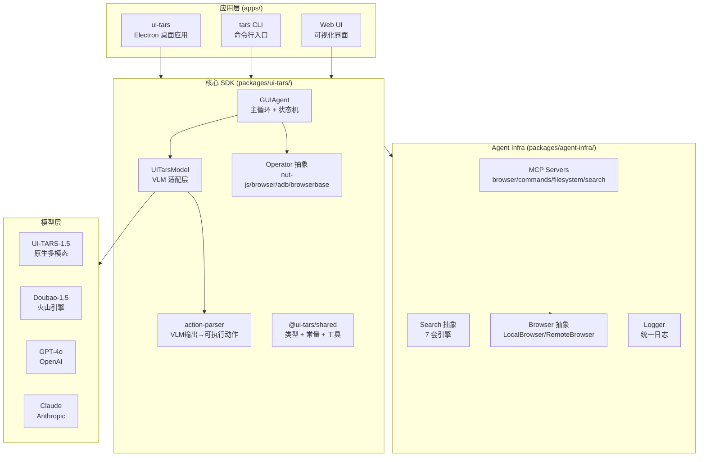
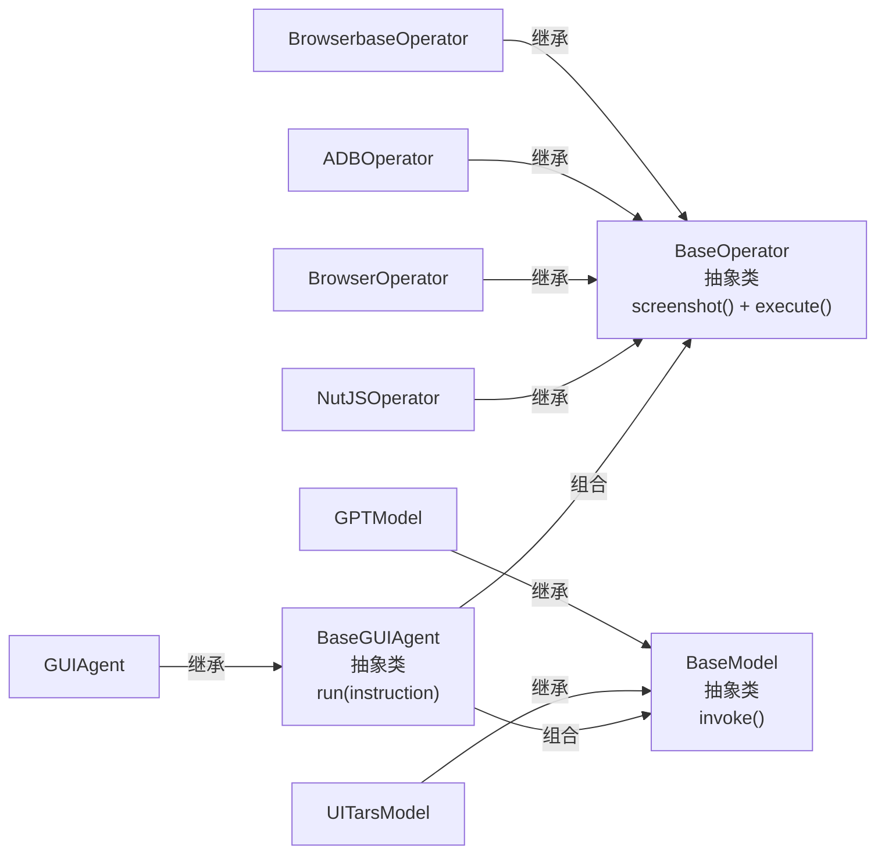
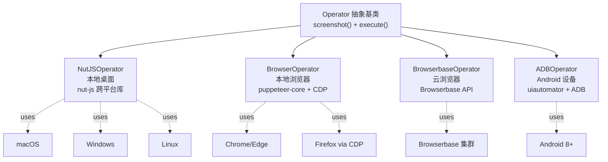
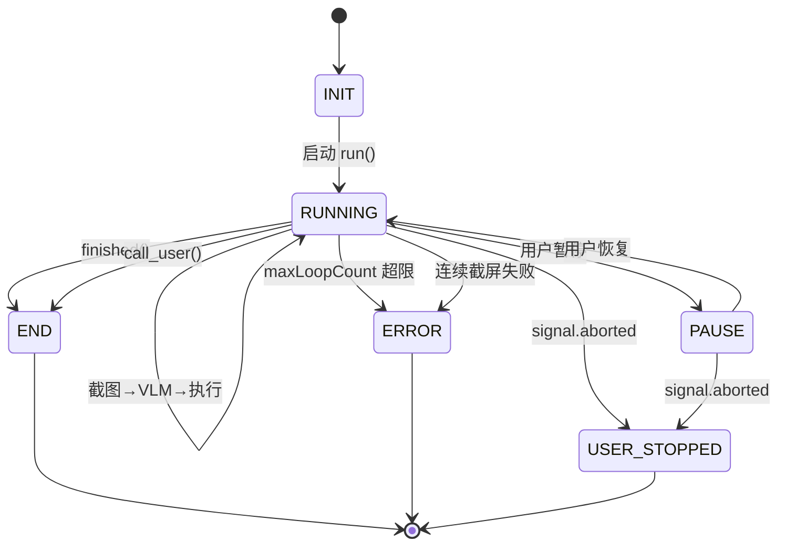
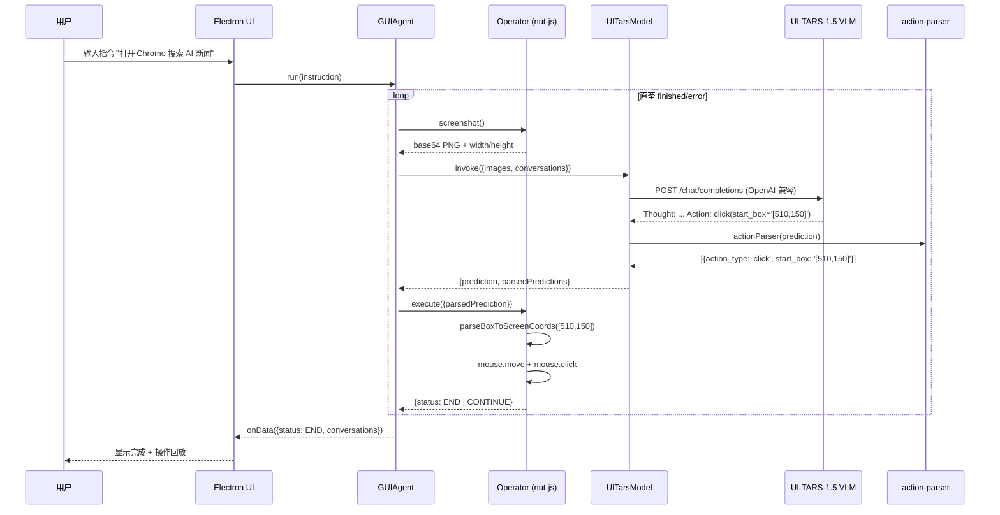
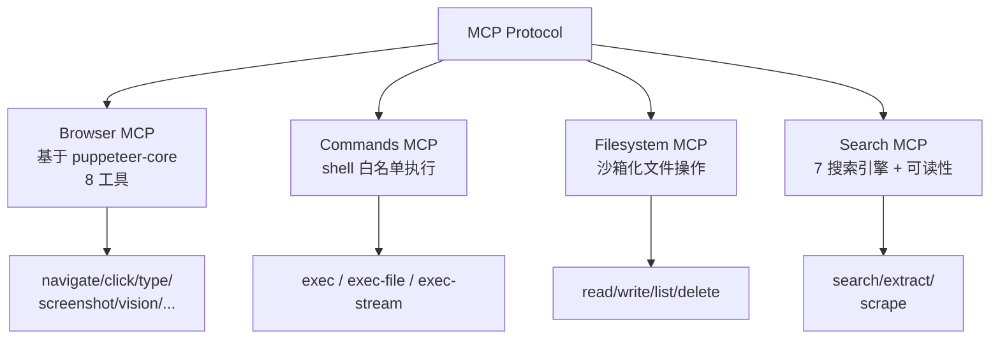
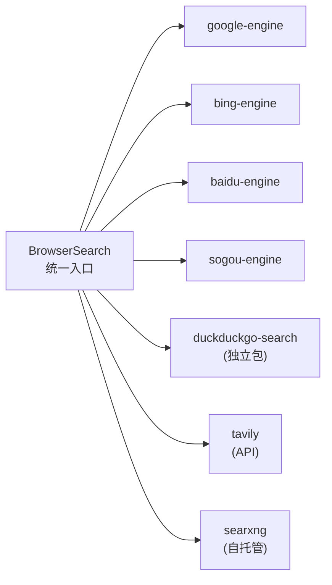
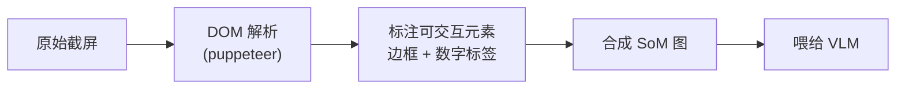
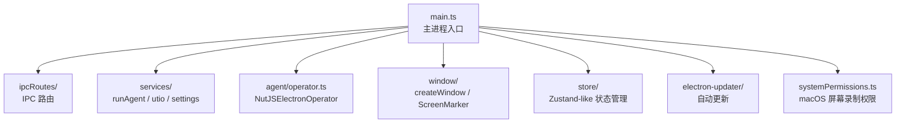

## 一、引子：为什么 UI-TARS-desktop 值得深挖

2025 年 1 月，字节跳动开源了 [UI-TARS](https://github.com/bytedance/UI-TARS) 系列模型——这是业界首个**专门为图形界面交互训练**的原生多模态大模型，把"看见屏幕 → 决定下一步操作"这件事做到了接近人类水平（OSWorld 基准 SOTA）。同年 11 月，字节把整套 Agent Stack——包含 SDK、Electron 桌面应用、MCP Server、Operator 适配层、搜索抽象——以 [UI-TARS-desktop](https://github.com/bytedance/UI-TARS-desktop) 的形式开源。

到 2026 年 9 月，这个仓库已经积累了 ⭐38.9k Star、192MB 代码量、3000+ 文件的 monorepo，是 GitHub 上**最完整的"多模态 GUI Agent 开源参考实现"**。

为什么这件事重要？我们看几个数字：

- **OpenAI Operator**：闭源，只能通过 ChatGPT Pro 使用
- **Anthropic Claude with Computer Use**：闭源，API 调用但不能本地部署
- **Google Astra / Project Mariner**：闭源 beta
- **UI-TARS-desktop**：完全开源，Apache-2.0，本地 / 远程双形态，CLI / Web / Desktop 三端

字节跳动的工程师们**把所有支撑一个 Production-ready GUI Agent 所需的脚手架全部开源**了——从坐标解析（action-parser）、到 VLM 适配（UITarsModel）、到 4 套 Operator 适配（nut-js / browser / browserbase / ADB）、到 4 套 MCP Server（browser / commands / filesystem / search）、到 Electron 桌面端的权限管理 / 屏幕录制 / Set-of-Marks 视觉提示——**这是 2026 年开源生态里，第一模态严肃的多模态 Agent 全栈实现**。

本篇博客会深入源码层，覆盖以下核心问题：

1. **三层抽象**：`Operator × Model × GUIAgent` 是如何解耦的
2. **GUIAgent 主循环**：截图 → VLM 推理 → 动作解析 → 执行的 16 步流程
3. **action-parser**：VLM 输出到屏幕坐标的精确映射算法（含 `smartResizeForV15`）
4. **Operator 抽象层**：nut-js（桌面）/ browser（浏览器）/ browserbase（云浏览器）/ adb（Android）4 套实现
5. **MCP Server 集**：browser / commands / filesystem / search 4 套 MCP 服务的 `defineTool` 模式
6. **搜索抽象**：7 套搜索引擎（baidu / bing / google / sogou / duckduckgo / tavily / searxng）的统一抽象

## 二、项目定位与核心价值

### 2.1 一句话定义

> UI-TARS-desktop 是字节跳动开源的**多模态 AI Agent 全栈**，把"看见屏幕（Vision）→ 思考下一步（Cognition）→ 执行动作（Action）"这条链路完整工程化，对标 OpenAI Operator / Anthropic Computer Use 但完全开源。

### 2.2 能力矩阵

| 维度 | 能力 | 实现位置 |
|------|------|----------|
| **推理引擎** | UI-TARS-1.5 / Doubao-1.5 / GPT-4o / Claude | `packages/ui-tars/sdk/src/Model.ts` |
| **动作空间** | click / type / scroll / drag / hotkey / wait / finished / call_user | `packages/ui-tars/operators/*/src/index.ts` |
| **桌面控制** | nut-js 跨平台（macOS / Windows / Linux） | `packages/ui-tars/operators/nut-js/src/index.ts` |
| **浏览器控制** | puppeteer-core + 视觉标注 | `packages/ui-tars/operators/browser-operator/src/browser-operator.ts` |
| **云浏览器** | Browserbase 远程浏览器（防检测） | `packages/ui-tars/operators/browserbase/src/index.ts` |
| **Android 控制** | ADB + uiautomator | `packages/ui-tars/operators/adb/src/index.ts` |
| **MCP 浏览器** | 基于 MCP SDK 的 puppeteer 封装 | `packages/agent-infra/mcp-servers/browser/src/server.ts` |
| **MCP 命令** | 安全的 shell 命令执行（白名单） | `packages/agent-infra/mcp-servers/commands/src/server.ts` |
| **MCP 文件** | 沙箱化文件系统操作 | `packages/agent-infra/mcp-servers/filesystem/src/server.ts` |
| **MCP 搜索** | 7 套搜索引擎 + 可读性提取 | `packages/agent-infra/search/*/src/*.ts` |
| **桌面应用** | Electron + macOS / Windows / Linux | `apps/ui-tars/src/main/main.ts` |
| **CLI** | `tars` 命令行启动 | `packages/ui-tars/cli/src/cli/start.ts` |
| **Web UI** | Web 端可视化对话界面 | `apps/ui-tars/src/renderer/src/pages/` |

### 2.3 仓库统计

| 指标 | 值 |
|------|---|
| GitHub | `bytedance/UI-TARS-desktop` |
| Star | ⭐ 38,913 |
| 仓库大小 | 192,886 KB (~190 MB) |
| 文件数 | 3,175+ 顶层节点（递归后更多） |
| License | Apache-2.0 |
| 创建时间 | 2025-01-19 |
| 最近推送 | 2026-08-05 |
| 主语言 | TypeScript 100% |
| 包管理 | pnpm workspace + Turborepo |
| 官网 | https://agent-tars.com |

## 三、整体架构

UI-TARS-desktop 是一个**标准 monorepo**，按职责分成 4 层：



### 3.1 三层核心抽象

UI-TARS-desktop 设计的精妙之处在于**把整个 GUI Agent 抽象成三个独立可替换的组件**：



**源码位置**：`packages/ui-tars/sdk/src/base/index.ts`

```typescript
// packages/ui-tars/sdk/src/base/index.ts
export abstract class BaseGUIAgent<
  TConfig = Record<string, never>,
  TRunParams = unknown,
  TRunOutput = unknown,
> {
  constructor(protected config: TConfig) {
    this.config = config;
  }
  /** @abstract Run the GUI Agent with an instruction. */
  abstract run(instruction: TRunParams): Promise<TRunOutput>;
}

export abstract class BaseModel<TParams = unknown, TOutput = unknown> {
  abstract invoke(params: TParams): Promise<TOutput>;
}

export abstract class BaseOperator {
  abstract screenshot(params?: unknown): Promise<unknown>;
  abstract execute(params: unknown): Promise<unknown>;
}
```

这种**三个抽象的菱形继承体系**让 UI-TARS-desktop 具备了几乎无限的扩展性：

- 想接入 macOS 桌面？继承 `BaseOperator` 写一个 `MacOSOperator` 即可
- 想用 Claude 替代 UI-TARS？继承 `BaseModel` 写一个 `ClaudeModel` 即可
- 想换成 LangGraph 编排？继承 `BaseGUIAgent` 写一个新 agent 即可

## 四、Operator 类型与适配层

UI-TARS-desktop 的 Operator 抽象层是它**最工程化的部分**——把"在不同环境执行 VLM 给出的动作"这件事彻底解耦。

### 4.1 四套 Operator 实现



### 4.2 NutJSOperator 实现要点

**源码位置**：`packages/ui-tars/operators/nut-js/src/index.ts`

nut-js Operator 是本地桌面的核心实现，覆盖 macOS / Windows / Linux 三个平台。它的设计要点：

```typescript
// packages/ui-tars/operators/nut-js/src/index.ts
export class NutJSOperator extends Operator {
  static MANUAL = {
    ACTION_SPACES: [
      `click(start_box='[x1, y1, x2, y2]')`,
      `left_double(start_box='[x1, y1, x2, y2]')`,
      `right_single(start_box='[x1, y1, x2, y2]')`,
      `drag(start_box='[x1, y1, x2, y2]', end_box='[x3, y3, x4, y4]')`,
      `hotkey(key='')`,
      `type(content='') #If you want to submit your input, use "\\n" at the end.`,
      `scroll(start_box='[x1, y1, x2, y2]', direction='down or up or right or left')`,
      `wait() #Sleep for 5s and take a screenshot to check for any changes.`,
      `finished()`,
      `call_user() # Submit the task when unsolvable or need help.`,
    ],
  };

  public async screenshot(): Promise<ScreenshotOutput> {
    // 调用 nut-js 截屏，区分逻辑分辨率与物理分辨率
    const screen_ = await screen.grab();
    const image = await screen_.toJimp();
    // 返回 base64 + 物理宽高 + DPR scaleFactor
    return {
      base64: await image.getBase64Async('image/png'),
      width: image.width,
      height: image.height,
      scaleFactor: getDeviceScaleFactor(),
    };
  }

  public async execute(params: ExecuteParams): Promise<ExecuteOutput> {
    const { parsedPrediction, scaleFactor, factors } = params;
    const { action_type, action_inputs } = parsedPrediction;

    // 关键步骤：VLM 坐标 (1000x1000 标准化) → 屏幕物理坐标
    const [x1, y1, x2, y2] = parseBoxToScreenCoords(
      action_inputs.start_box,
      factors,           // [1000, 1000] 因子
      scaleFactor,       // 物理 DPR
      width, height,
    );

    switch (action_type) {
      case 'click':
        await mouse.move(straightTo(new Point(centerX, centerY)));
        await mouse.click(Button.LEFT);
        break;
      case 'type':
        await clipboard.writeText(content);
        await keyboard.pressKey(Key.LeftControl, Key.V);  // 用剪贴板避免 IME 问题
        break;
      // ... scroll / hotkey / drag ...
      case 'finished':
      case 'call_user':
      case 'error_env':
      case 'user_stop':
        return { status: StatusEnum.END };
    }
  }
}
```

### 4.3 核心设计哲学：标准化坐标

UI-TARS-desktop 的所有 Operator 都遵守一个**坐标标准化约定**：

- VLM 输出坐标统一用 `[x1, y1, x2, y2]`，范围 `[0, 1000]`（即 1000×1000 的逻辑画布）
- Operator 负责把 1000×1000 坐标**反归一化**到屏幕物理像素：`pixel_x = model_x * screen_width / 1000`
- 同时考虑 **DPR（Device Pixel Ratio）** 与 **模型因子 factors**，确保同一张图在 Retina / 普通屏下都能精确定位

这个设计的精妙在于：**VLM 不需要知道屏幕的实际分辨率，只需要输出"在 1000×1000 画布上的相对位置"**，Operator 端通过 `parseBoxToScreenCoords` 完成最终的物理坐标转换。

## 五、核心引擎一：GUIAgent 主循环

GUIAgent 是整个 Agent 的"大脑"，它把"截图 → 推理 → 执行"循环工程化为一个健壮的状态机。

### 5.1 主循环伪代码

**源码位置**：`packages/ui-tars/sdk/src/GUIAgent.ts`

```typescript
// packages/ui-tars/sdk/src/GUIAgent.ts (简化)
class GUIAgent<T extends Operator> extends BaseGUIAgent<GUIAgentConfig<T>> {
  private isPaused = false;
  private resumePromise: Promise<void> | null = null;
  private isStopped = false;
  private sessionId = uuidv4();

  async run(instruction: string, historyMessages?: Message[]) {
    let loopCnt = 0;
    let snapshotErrCnt = 0;
    let previousResponseId: string | undefined;

    while (true) {
      // [1] 暂停检测（前端可触发）
      if (this.isPaused && this.resumePromise) {
        await onData?.({ status: PAUSE });
        await this.resumePromise;
      }

      // [2] 终止检测（前端 / 超时 / 完成）
      if (this.isStopped || signal?.aborted) break;

      // [3] 最大循环保护（默认 25 次）
      if (loopCnt >= maxLoopCount) {
        status = ERROR; break;
      }

      // [4] 截屏失败保护（连续 N 次后放弃）
      if (snapshotErrCnt >= MAX_SNAPSHOT_ERR_CNT) {
        status = ERROR; break;
      }

      loopCnt += 1;

      // [5] 截屏（带 async-retry）
      const snapshot = await asyncRetry(() => operator.screenshot(), {
        retries: retry.screenshot?.maxRetries ?? 0,
        minTimeout: 5000,
      });

      // [6] 图片有效性检查（base64 解析为 Jimp）
      const { width, height, mime } = await Jimp.fromBuffer(...);
      if (!isValidImage) {
        snapshotErrCnt++; continue;
      }

      // [7] 推入人类消息（带截图）
      data.conversations.push({
        from: 'human',
        value: IMAGE_PLACEHOLDER,
        screenshotBase64: snapshot.base64,
        screenshotContext: { size: { width, height }, scaleFactor },
      });

      // [8] 调用 VLM（带 conversation + images + screenContext）
      const vlmParams = {
        conversations,
        images: [snapshot.base64],
        screenContext: { width, height },
        scaleFactor,
        previousResponseId,  // Response API 链式 ID
      };
      const { prediction, parsedPredictions, costTime, costTokens, responseId }
        = await model.invoke(vlmParams);
      previousResponseId = responseId;  // 链式上下文

      // [9] 推入 AI 消息（带解析后的动作）
      data.conversations.push({
        from: 'gpt',
        value: prediction,
        predictionParsed: parsedPredictions,
      });

      // [10] 执行动作（按顺序）
      for (const parsed of parsedPredictions) {
        if (parsed.action_type === 'error_env') {
          status = ERROR; break;
        }
        if (parsed.action_type === 'max_loop') {
          status = ERROR; break;
        }
        const output = await operator.execute({
          prediction,
          parsedPrediction: parsed,
          screenWidth: width,
          screenHeight: height,
          scaleFactor,
          factors: this.model.factors,
        });
      }
    }

    return { data };
  }
}
```

### 5.2 状态机设计



**关键设计**：
- `StatusEnum` 6 态枚举：`INIT / RUNNING / PAUSE / END / ERROR / USER_STOPPED`
- **暂停/恢复**通过 Promise 协议实现（`resumePromise` / `resolveResume`）
- **超时保护**：`maxLoopCount`（默认 25）+ `MAX_SNAPSHOT_ERR_CNT`
- **异步重试**：截屏、VLM 调用、动作执行都包了 `async-retry`
- **流式回调**：`onData?.({ data })` 每一步都把当前状态推给前端，可视化推理过程

### 5.3 端到端数据流



## 六、核心引擎二：UITarsModel 与 VLM 适配

UITarsModel 把"调用多模态 VLM"这件事封装成一个统一的接口，支持 4 套推理引擎。

**源码位置**：`packages/ui-tars/sdk/src/Model.ts`

```typescript
// packages/ui-tars/sdk/src/Model.ts
export class UITarsModel extends Model {
  constructor(private config: UITarsModelConfig) {
    super();
    // OpenAI 协议兼容（支持 UI-TARS / Doubao / GPT-4o / Claude-via-proxy）
    this.openai = new OpenAI({
      baseURL: config.baseURL,
      apiKey: config.apiKey,
      maxRetries: 0,  // 由 GUIAgent 控制重试
    });
  }

  async invoke(params: InvokeParams): Promise<InvokeOutput> {
    const { conversations, images, screenContext, scaleFactor, uiTarsVersion } = params;

    // 关键步骤 1：图片预处理
    // - 截图 → 缩放到 UI-TARS 期望的像素范围
    // - V1.0: MAX_PIXELS_V1_0 (1080*1920)
    // - V1.5: MAX_PIXELS_V1_5 (16384*16384, 由 smartResizeForV15 决定)
    const processedImages = await Promise.all(
      images.map(img => preprocessResizeImage(img, uiTarsVersion))
    );

    // 关键步骤 2：构造 OpenAI Chat Completion 请求
    const messages = convertToOpenAIMessages(conversations, processedImages);

    // 关键步骤 3：调用 VLM
    const completion = await this.openai.chat.completions.create({
      model: this.config.model,
      messages,
      max_tokens: this.config.max_tokens ?? 2048,
      temperature: this.config.temperature ?? 0.0,  // GUI 任务需要确定性
    });

    // 关键步骤 4：解析响应
    const prediction = completion.choices[0].message.content;

    // 关键步骤 5：用 action-parser 把文本解析为结构化动作
    const { parsed: parsedPredictions } = actionParser({
      prediction,
      factor: this.factors,        // 默认 [1000, 1000]
      screenContext,
      scaleFactor,
      modelVer: uiTarsVersion,
    });

    return {
      prediction,
      parsedPredictions,
      costTime: Date.now() - start,
      costTokens: completion.usage.total_tokens,
      responseId: completion.id,  // Response API 链式调用
    };
  }
}
```

### 6.1 双协议支持

```typescript
// packages/ui-tars/sdk/src/Model.ts
export interface UITarsModelConfig extends OpenAIChatCompletionCreateParams {
  /** Whether to use OpenAI Response API instead of Chat Completions API */
  useResponsesApi?: boolean;
}
```

UITarsModel 同时支持：
- **Chat Completions API**（兼容 OpenAI / Anthropic-via-proxy / Doubao / vLLM）
- **Response API**（OpenAI 新协议，支持 `previousResponseId` 链式上下文，无需每次都传 history）

`previousResponseId` 链式调用把"上下文管理"从客户端搬到服务端，**对长会话尤其有用**。

## 七、核心引擎三：action-parser

action-parser 是把 VLM 的**自然语言输出**解析为**可执行结构化动作**的关键组件。

**源码位置**：`packages/ui-tars/action-parser/src/actionParser.ts`

### 7.1 输出格式：Thought + Reflection + Action_Summary + Action

VLM（特别是 UI-TARS 1.5）会输出如下格式：

```text
Thought: I need to click on the search box to enter the URL.
Action_Summary: Click on the search bar at coordinates (510, 150).
Action: click(start_box='[510, 150]')
```

action-parser 需要做三件事：

1. 抽取 `Thought`（思考过程）
2. 抽取 `Action_Summary`（动作摘要）
3. 解析 `Action` 为 `{function: 'click', args: {start_box: '[510, 150]'}}`

### 7.2 smartResizeForV15：屏幕尺寸归一化

```typescript
// packages/ui-tars/action-parser/src/actionParser.ts
function smartResizeForV15(
  height: number,
  width: number,
  maxRatio: number = MAX_RATIO,    // 默认 200
  factor: number = IMAGE_FACTOR,   // 默认 28
  minPixels: number = MIN_PIXELS,  // 默认 3136 (56*56)
  maxPixels: number = MAX_PIXELS_V1_5,  // 默认 16384*16384
): [number, number] | null {
  // 1. 长宽比检查（太窄 / 太宽直接拒绝，避免模型失效）
  if (Math.max(height, width) / Math.min(height, width) > maxRatio) {
    console.error(`absolute aspect ratio must be smaller than ${maxRatio}`);
    return null;
  }

  // 2. 先按 factor 对齐（保证像素是 28 的倍数）
  let wBar = Math.max(factor, roundByFactor(width, factor));
  let hBar = Math.max(factor, roundByFactor(height, factor));

  // 3. 超出 maxPixels 时按比例缩小
  if (hBar * wBar > maxPixels) {
    const beta = Math.sqrt((height * width) / maxPixels);
    hBar = floorByFactor(height / beta, factor);
    wBar = floorByFactor(width / beta, factor);
  }
  // 4. 小于 minPixels 时按比例放大
  else if (hBar * wBar < minPixels) {
    const beta = Math.sqrt(minPixels / (height * width));
    hBar = ceilByFactor(height * beta, factor);
    wBar = ceilByFactor(width * beta, factor);
  }

  return [wBar, hBar];
}
```

这个 `smartResizeForV15` 是 V1.5 模型的**关键预处理**：UI-TARS-1.5 训练时只见过特定分辨率的截图，推理时必须把真实屏幕缩放到它"认识"的尺寸，否则定位会偏。

### 7.3 多模式解析

```typescript
// packages/ui-tars/action-parser/src/actionParser.ts
text = text.trim();
if (mode === 'bc') {  // bc = ByteDance CoT 模式
  if (text.includes('Thought:')) {
    // V1.5 模式：Thought + Action_Summary + Action
    thought = text.match(/Thought: ([\s\S]+?)(?=\s*Action[:：]|$)/)[1];
  } else if (text.startsWith('Reflection:')) {
    // Reflection + Action_Summary + Action（V1.0 模式）
    thought = reflectionMatch[2]; reflection = reflectionMatch[1];
  } else if (text.startsWith('Action_Summary:')) {
    thought = summaryMatch[1];
  }
  actionStr = text.split(/Action[:：]/).pop();  // 取 Action: 之后的部分
} else if (mode === 'o1') {
  // o1 模式：<Thought>...</Thought> + Action_Summary + Action + </Output>
  thought = `<Thought>\n${thoughtContent}\n<Action_Summary>\n${actionSummaryContent}`;
}
```

**核心设计**：
- 支持 **3 套 CoT 格式**：`Thought` / `Reflection+Action_Summary` / `Action_Summary` / `o1 XML` 标签
- 支持 **2 套坐标格式**：`[x1, y1, x2, y2]` 与 `<point>x y</point>`
- 支持 **10 种动作类型**：`click / left_double / right_single / drag / hotkey / type / scroll / wait / finished / call_user`

## 八、MCP Server 集

UI-TARS-desktop 在 monorepo 内提供了**4 套 MCP Server**，让 Agent 不仅能控制 GUI，还能通过 MCP 协议与外部工具集成。

### 8.1 MCP Server 总览



### 8.2 defineTool 工厂模式

**源码位置**：`packages/agent-infra/mcp-servers/browser/src/tools/defineTool.ts`

```typescript
// packages/agent-infra/mcp-servers/browser/src/tools/defineTool.ts
export type ToolDependence = 'ensureBrowser' | 'ensurePage';

export interface ToolDefinition<
  TConfig extends ToolConfig = ToolConfig,
  TSkipContext extends boolean = false,
> {
  name: string;
  config: TConfig;
  /** If true, the tool will not be called with the tool context. */
  skipToolContext?: TSkipContext;
  handle: (
    ctx: TSkipContext extends true ? null : ToolContext,
    args: TConfig['inputSchema'] extends ZodRawShape
      ? z.infer<z.ZodObject<TConfig['inputSchema']>>
      : any,
  ) => Promise<...>;
}

export function defineTool<TConfig extends ToolConfig, TSkipContext extends boolean = false>(
  tool: ToolDefinition<TConfig, TSkipContext>,
): ToolDefinition<TConfig, TSkipContext> {
  return tool;  // identity function, 用于类型推导
}
```

`defineTool` 是一个**零运行时开销的 identity function**——它的唯一作用是**在 TypeScript 类型层面**让 MCP 工具的定义自带 `inputSchema` / `outputSchema` 的强类型推断，IDE 自动补全 + 编译期错误检查。

### 8.3 Browser MCP Server 8 工具

**源码位置**：`packages/agent-infra/mcp-servers/browser/src/server.ts`

Browser MCP Server 基于 puppeteer-core，暴露 8 个核心工具：

```typescript
// packages/agent-infra/mcp-servers/browser/src/server.ts
import visionTools from './tools/vision.js';      // 视觉标注 + 截图
import downloadTools from './tools/download.js';  // 文件下载
import navigateTools from './tools/navigate.js';  // URL 导航
import contentTools from './tools/content.js';    // 内容提取
import tabsTools from './tools/tabs.js';          // tab 管理
import actionTools from './tools/action.js';      // 动作执行（click/type）
import evaluateTools from './tools/evaluate.js';  // JS 求值
```

每个工具都用 `defineTool` 模式：

```typescript
// packages/agent-infra/mcp-servers/browser/src/tools/navigate.ts (简化)
export default defineTool({
  name: 'browser_navigate',
  config: {
    inputSchema: {
      url: z.string().url(),
    },
  },
  handle: async (ctx, { url }) => {
    await ctx.page.goto(url, { waitUntil: 'networkidle2' });
    return {
      content: [{
        type: 'text',
        text: `Navigated to ${url}, title: ${await ctx.page.title()}`,
      }],
    };
  },
});
```

## 九、搜索抽象：7 套搜索引擎

**源码位置**：`packages/agent-infra/search/browser-search/src/engines/`

UI-TARS-desktop 把搜索抽象成可插拔的多引擎架构：



```typescript
// packages/agent-infra/search/browser-search/src/browser-search.ts
export class BrowserSearch {
  private browser: BrowserInterface;
  private defaultEngine: LocalBrowserSearchEngine;

  constructor(private config: BrowserSearchConfig = {}) {
    // 支持本地浏览器或远程 CDP 端点
    if (this.config.cdpEndpoint) {
      this.browser = new RemoteBrowser({ cdpEndpoint: ... });
    } else {
      this.browser = config.browser ?? new LocalBrowser({ ... });
    }
    this.defaultEngine = config.defaultEngine ?? 'google';
  }

  async perform(options: BrowserSearchOptions): Promise<SearchResult[]> {
    const engine = getSearchEngine(this.defaultEngine);
    const results = await engine.search(options.query);

    // 用 Readability 提取页面内容
    for (const item of results) {
      const content = await this.browser.goto(item.url, {
        scripts: [READABILITY_SCRIPT],
        beforePageLoad: interceptRequest,
      });
      if (content) {
        return { ...item, content: toMarkdown(content.content), snippet };
      }
    }
  }
}
```

**关键设计**：
- **本地浏览器**：用 LocalBrowser（puppeteer-core + CDP），支持自定义代理 / Cookie
- **远程浏览器**：通过 `cdpEndpoint` 接入 Browserbase 等云浏览器服务
- **内容提取**：注入 Mozilla Readability 脚本 + 转 Markdown
- **请求拦截**：`beforePageLoad` 钩子可剥离广告 / 追踪请求
- **7 引擎**：Google / Bing / Baidu / Sogou / DuckDuckGo / Tavily（API）/ SearXNG（自托管 meta-search）

## 十、Set-of-Marks 视觉提示

**源码位置**：`apps/ui-tars/src/main/shared/setOfMarks.ts`

UI-TARS-desktop 在截屏后会**叠加一层 Set-of-Marks (SoM) 标注**——给每个可交互元素加一个有数字的边框，让 VLM 更容易识别"点击哪里"。



**为什么需要 SoM**：
- VLM 在"细粒度坐标"上不够精准（小按钮、文字链接）
- DOM 能精确知道"哪些元素可点击、坐标在哪"
- 把 DOM 知识叠加到图像上，VLM 输出"点 17 号"比"点 (510, 150)"更稳定

这种**"VLM 负责高层决策 + DOM 负责精确定位"**的混合模式，是 2025-2026 年 Computer-Use 领域的最佳实践之一（同期 OpenAI Operator 和 Anthropic Computer Use 都用了类似技术）。

## 十一、Electron 桌面应用

### 11.1 主进程架构

**源码位置**：`apps/ui-tars/src/main/main.ts`

UI-TARS-desktop 的 Electron 应用按职责分成：



### 11.2 权限处理：macOS 屏幕录制

```typescript
// apps/ui-tars/src/main/utils/systemPermissions.ts (简化)
export async function ensureScreenCapturePermission(): Promise<boolean> {
  if (process.platform !== 'darwin') return true;

  // macOS 10.15+ 需要 ScreenCaptureKit 权限
  // 通过调用 systemPreferences.getMediaAccessStatus('screen') 检测
  const status = systemPreferences.getMediaAccessStatus('screen');
  if (status !== 'granted') {
    // 触发系统弹窗
    await desktopCapturer.getSources({ types: ['screen'] });
    return false;
  }
  return true;
}
```

macOS 的屏幕录制权限是 GUI Agent 的"最大拦路虎"——必须在首次启动时申请并等待用户授权。

### 11.3 远程 / 本地 / 云 三模式

UI-TARS-desktop 支持三种 Operator 部署：

| 模式 | 实现 | 适用场景 |
|------|------|----------|
| **本地** | NutJSElectronOperator + nut-js | 用户在自己的 Mac 上执行 |
| **远程** | RemoteComputerOperator + VNC/WebRTC cast | 帮助父母调试电脑 |
| **云** | BrowserbaseOperator + CDP | 反检测场景 / 云端批处理 |

**远程 cast 模式**特别值得关注：

```typescript
// apps/ui-tars/src/main/remote/operators.ts (简化)
export class RemoteComputerOperator extends Operator {
  async screenshot() {
    // 通过 WebRTC 从远程计算机取流
    const frame = await this.signalingClient.getFrame();
    return { base64: frame.base64, width: frame.width, height: frame.height };
  }

  async execute(params: ExecuteParams) {
    // 把鼠标键盘事件通过 WebRTC DataChannel 转发到远程
    return this.signalingClient.sendAction(params.parsedPrediction);
  }
}
```

这种**"UI-TARS 在本地、屏幕在远程"的架构**，让 Agent 可以 7x24 小时在云端跑任务，本地只需要一个 Web 浏览器就能监控。

## 十二、与同类项目对比

UI-TARS-desktop 不是唯一的 GUI Agent 开源项目。横向对比 5 个同类：

| 维度 | UI-TARS-desktop | OpenAI Operator | Anthropic Computer Use | Browser-Use | CUA |
|------|------------------|-----------------|------------------------|-------------|-----|
| **开源** | ✅ Apache-2.0 | ❌ 闭源 | ❌ 闭源 API | ✅ MIT | ✅ |
| **多模态** | ✅ UI-TARS-1.5 原生 | ✅ GPT-4o | ✅ Claude 3.5 | ❌ Playwright 文本 | ✅ VLM |
| **桌面控制** | ✅ nut-js | ❌ 仅浏览器 | ❌ 仅浏览器 | ❌ | ⚠️ 部分 |
| **浏览器控制** | ✅ Puppeteer + SoM | ✅ | ✅ | ✅ 主力 | ✅ |
| **Android** | ✅ ADB | ❌ | ❌ | ❌ | ❌ |
| **云浏览器** | ✅ Browserbase | ❌ | ❌ | ⚠️ 自部署 | ⚠️ |
| **MCP 协议** | ✅ 4 Server | ❌ | ✅ 部分 | ❌ | ❌ |
| **OSWorld 基准** | SOTA | 38.1% | 22.0% | - | - |
| **本地部署** | ✅ 完整 | ❌ | ❌ | ✅ | ✅ |
| **桌面 UI** | ✅ Electron | ✅ Web | ✅ Web | ❌ CLI | ⚠️ |

**关键差异**：

1. **完整度**：UI-TARS-desktop 是唯一一个**同时覆盖桌面 + 浏览器 + Android + 云**的开源项目。Browser-Use 只做浏览器，OpenAI Operator 只做浏览器
2. **原生多模态**：UI-TARS-1.5 是专门为 GUI 训练的多模态模型，OSWorld 基准 SOTA，比 GPT-4o / Claude 的 Computer Use 更精准
3. **MCP 一等公民**：把 browser / commands / filesystem / search 都封装成 MCP Server，可以与 Claude Code / Cursor / Cline 等 IDE 集成
4. **工程化**：permission 处理、SoM 视觉提示、WebRTC 远程 cast、electron-updater 自动更新——这些**生产级特性**在开源 GUI Agent 项目里非常稀缺

## 十四、优缺点分析

| 优点（架构/扩展性/易用性） | 缺点（性能/复杂度/维护性） |
|--------------------------|-----------------------|
| ✅ **三层抽象清晰**：Operator/Model/Agent 解耦，可单独替换 | ⚠️ **依赖 VLM 推理速度**：UI-TARS-1.5 单步 ~2-5s，远慢于人手操作 |
| ✅ **完整 monorepo**：SDK + Desktop + CLI + Web + MCP Server + Search 全栈 | ⚠️ **Electron 包体积大**：单文件 ~190MB，分发成本高 |
| ✅ **MCP 协议深度集成**：4 套 MCP Server 标准化外部工具接入 | ⚠️ **TypeScript 生态限制**：Python 生态（LangChain / LlamaIndex）集成需要 SDK 桥接 |
| ✅ **多平台覆盖**：macOS / Windows / Linux / Android / Cloud Browser | ⚠️ **VLM 模型依赖**：必须部署 UI-TARS-1.5（本地 7B+ GPU）或付费 Doubao API |
| ✅ **SoM 视觉提示**：DOM 精确定位 + VLM 高层决策的混合架构 | ⚠️ **坐标精度**：即便有 SoM，长流程任务（30+ 步）误差累积明显 |
| ✅ **Apache-2.0**：可商用、可二次开发 | ⚠️ **文档不全**：API 文档相对简略，主要靠 example 学习 |
| ✅ **远程 cast 模式**：本地代理 + 远程执行分离，云原生友好 | ⚠️ **WebRTC 服务依赖**：远程模式需要自部署信令服务器 |
| ✅ **国际化**：中英双语 README + 完整 zh-CN 文档 | ⚠️ **macOS 权限门槛**：首次启动需要用户手动授权屏幕录制 |

## 十五、实践：快速跑起来

### 15.1 CLI 模式

```bash
# 安装 UI-TARS CLI
npm install -g @ui-tars/cli

# 配置 VLM API Key（支持 Doubao / UI-TARS / OpenAI / Claude）
export OPENAI_API_KEY="sk-..."
export OPENAI_BASE_URL="https://ark.cn-beijing.volces.com/api/v3"
export OPENAI_MODEL="doubao-1-5-thinking-vision-pro-250428"

# 启动 CLI 模式（本地 nut-js 操作）
tars --operator nut-js

# 启动浏览器模式
tars --operator browser
```

### 15.2 Electron 桌面应用

```bash
# 克隆仓库
git clone https://github.com/bytedance/UI-TARS-desktop
cd UI-TARS-desktop

# 安装依赖（pnpm + Turbo）
pnpm install

# 启动桌面应用
cd apps/ui-tars
pnpm dev

# 构建 macOS dmg
pnpm build:mac

# 构建 Windows exe
pnpm build:win
```

### 15.3 SDK 编程模式

```typescript
// examples/gui-agent-2.0/src/index.ts (简化)
import { GUIAgent } from '@ui-tars/sdk';
import { NutJSOperator } from '@ui-tars/operator-nut-js';
import { OpenAI } from 'openai';

// 1. 实例化 VLM（OpenAI 协议兼容）
const client = new OpenAI({
  apiKey: process.env.OPENAI_API_KEY,
  baseURL: process.env.OPENAI_BASE_URL,
});

// 2. 实例化 Operator（macOS 桌面控制）
const operator = new NutJSOperator();

// 4. 实例化 Agent 并运行
const agent = new GUIAgent({
  model: {
    baseURL: process.env.OPENAI_BASE_URL,
    apiKey: process.env.OPENAI_API_KEY,
    model: process.env.OPENAI_MODEL,
  },
  operator,
  onData: (data) => {
    // 实时打印思考过程
    console.log('Status:', data.data.status);
    if (data.data.conversations) {
      for (const msg of data.data.conversations) {
        console.log(`[${msg.from}]`, msg.value);
      }
    }
  },
  maxLoopCount: 30,
});

await agent.run('打开 Chrome，搜索 AI 新闻，截图保存到桌面');
```

### 15.4 MCP Server 独立部署

```bash
# Browser MCP Server（让 Claude Code / Cursor 能控制浏览器）
cd packages/agent-infra/mcp-servers/browser
pnpm build
node build/index.js

# 添加到 Claude Code / Cursor MCP 配置：
# {
#   "mcpServers": {
#     "ui-tars-browser": {
#       "command": "node",
#       "args": ["/path/to/build/index.js"]
#     }
#   }
# }
```

## 十六、趋势与总结

### 16.1 2026 H2 趋势判断

**趋势 1：多模态 Agent 开源栈进入「严肃落地期」**

2024 年是 Computer-Use 的"演示期"（Anthropic 演示 + OpenAI Operator 演示）。2026 H2 是「严肃落地期」——UI-TARS-desktop 这样的开源栈把"演示"变成"可工程化"，包含 permission / SoM / 远程 cast / MCP 集成等生产级特性。下一步开源项目会跟进类似深度。

**趋势 2：VLM 与 DOM 知识融合成为标准范式**

Set-of-Marks（VLM 视觉 + DOM 元素标注叠加）是 2026 年的最佳实践。OpenAI Operator 和 Anthropic Computer Use 内部也都靠类似技术。开源 GUI Agent 必须支持 SoM 才能在精细任务上与闭源产品对标。

**趋势 3：MCP 协议成为 Agent 工具层事实标准**

UI-TARS-desktop 把 4 套 MCP Server（browser/commands/filesystem/search）作为 Agent 工具层，与 Claude Code / Cursor / Cline 等 IDE 客户端无缝集成。**MCP 正在成为 Agent 工具层的 HTTP**——任何 Agent 框架都要支持 MCP 才能在 2026 H2 活下去。

**趋势 4：远程 cast / WebRTC 分离架构崛起**

本地推理 + 远程执行的"分离架构"是 GUI Agent 的下一个突破口。UI-TARS-desktop 的 RemoteComputerOperator 用 WebRTC 把"操作信号"和"屏幕帧"分流，让 Agent 可以 7x24 小时在云端跑任务。这条赛道未来 6-12 个月会出现专门做"云端 GUI Agent Worker 集群"的创业公司。

**趋势 5：从"Operator"到"Operator + Browser + Mobile + Cloud"四端编排**

单端 GUI Agent 已经不够用了。下一个突破是把"桌面控制 + 浏览器控制 + 手机控制 + 云浏览器控制"四端用同一个 Agent 编排，让 Agent 能完成"在 Mac 上点开 Chrome → 登录 SaaS → 截图上传到手机 APP → 验证"这种跨设备任务。UI-TARS-desktop 的 4 套 Operator 是这个方向的第一步。

### 16.2 工程经验提炼

1. **三层抽象菱形继承**：Operator × Model × GUIAgent 三个抽象类的菱形组合，是 GUI Agent 框架的"理想模型"。继承比组合更适合"必须替换整体行为"的场景（如换 Operator 而 GUIAgent 不变）。

2. **坐标标准化**：所有 VLM 输出统一用 `[0, 1000]` 标准化画布，Operator 端做反归一化。这个约定让 VLM 不需要知道屏幕实际分辨率。

3. **SoM 视觉标注**：VLM 负责"高层意图"（"点搜索框"），DOM 负责"精确坐标"（"点 17 号元素"）。这是 2026 年 GUI Agent 的最佳实践。

4. **MCP 一等公民**：把 browser / commands / filesystem / search 都封装成 MCP Server，让 Agent 工具层与 IDE 客户端解耦。

5. **Response API 链式调用**：`previousResponseId` 把长上下文管理从客户端搬到服务端，减少 token 开销。

6. **WebRTC 分离架构**：本地推理 + 远程执行，把 VLM 算力与屏幕分离，让 Agent 可以 7x24 小时在云端跑。

### 16.3 总结

UI-TARS-desktop 是 2026 年开源 GUI Agent 生态里**最完整的工程化实现**。它把"看见屏幕 → 推理 → 执行"这条链路拆解成 Operator（抽象层）/ Model（VLM 适配）/ GUIAgent（主循环）三个菱形抽象，把"DOM 标注 + VLM 决策 + 跨平台执行 + MCP 工具集成 + 远程 cast + 桌面应用"所有支撑一个严肃 GUI Agent 所需的脚手架全部开源。

如果你正在评估"自建一个 GUI Agent 产品"，UI-TARS-desktop 是**最值得研究的开源参考实现**。它的代码质量、抽象设计、生产级工程化（permission / updater / SoM / WebRTC）都是开源 GUI Agent 项目里的最高水准。

下一步值得关注的方向：

- **UI-TARS-2** 模型（下一代多模态 VLM，更长视频时序理解）
- **多 Agent 协作**（一个 Agent 截图，另一个 Agent 执行，分工）
- **Skill Marketplace**（GUI Agent 的"插件市场"，社区共享技能包）
- **企业版**（私有部署 + 合规审计 + 团队协作 + 工单系统）

## 附录：参考资料

| 资源 | 链接 |
|------|------|
| GitHub 仓库 | https://github.com/bytedance/UI-TARS-desktop |
| UI-TARS 模型 | https://github.com/bytedance/UI-TARS |
| 官网 | https://agent-tars.com |
| 文档站 | https://agent-tars.com/guide/basic/cli.html |
| 包 SDK | `@ui-tars/sdk` (npm) |
| 包 Operator | `@ui-tars/operator-nut-js` / `operator-browser-operator` |
| 包 MCP | `@agent-infra/mcp-servers-browser` 等 |
| License | Apache-2.0 |
| 论文 | UI-TARS: Pioneering Automated GUI Interaction with Native Agents |

---

**作者注**：本博客基于 bytedance/UI-TARS-desktop 仓库 2026-08-05 推送版本（⭐38,913）源码深度分析，所有架构图与代码引用均来自 `packages/ui-tars/`、`packages/agent-infra/`、`apps/ui-tars/` 三个核心目录。如有更新请以最新源码为准。