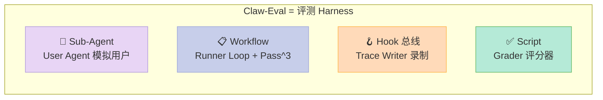
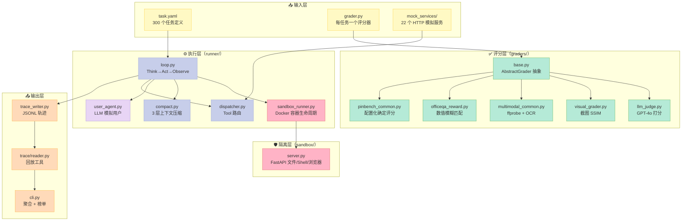
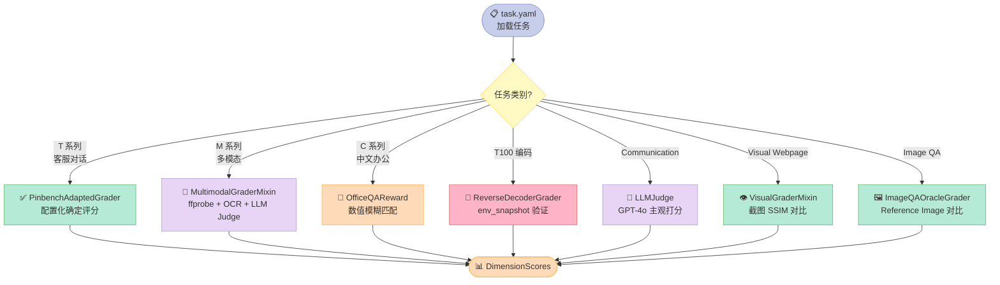
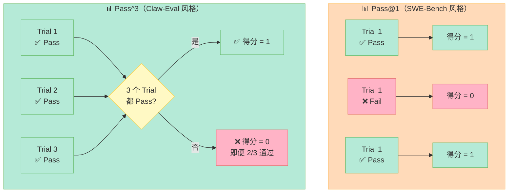

# 【Claw-Eval】核心架构与 Harness 设计原理深度解析：300 任务 × 14 模型 × Pass^3 的可信任 Agent 评测 Harness

> 一个让"AI Agent 到底能不能干活"这件事变得可量化、可复现、可比较的开源评测框架。

## 一、引子：当 Agent 评测变成"玄学"

Sora 2 刚发布时，社区一片"哇塞"。但三天后各家 Labs 纷纷上分：Sora、Veo、Runway、HunyuanVideo、Pika、Kling……大家分数都很好看。但**没有任何一家愿意公开自己的评测脚本**——评测集是哪些？用什么 Prompt？跑几遍取平均？错误怎么算？

Agent 评测比视频生成模型评测还混乱。原因有三：

1. **任务空间爆炸**：从"客服问答"到"反编译二进制"到"视频字幕 OCR"，任务之间几乎不可比
2. **随机性极强**：同一任务、同一模型、同一 Prompt，跑 3 次可能 3 个答案——哪个算"成绩"？
3. **行为难量化**：Agent 可能"任务做对了"但"沟通一塌糊涂"，也可能"任务没做完"但"过程很专业"

这就是 [claw-eval/claw-eval](https://github.com/claw-eval/claw-eval)（MIT，772⭐）要解决的核心问题。它不是又一个 SWE-Bench 或者 MMLU，而是一个**评测 Agent 的 Harness**——把"评测 LLM Agent"这件事拆成 6 个可工程化的子系统：

| 子系统 | 解决什么问题 | 核心抽象 |
|--------|------------|---------|
| **Task Definition**（任务定义） | 评测什么、用什么工具、预期什么行为 | `task.yaml` + `grader.py` |
| **Runner Loop**（执行循环） | Think → Act → Observe → Repeat | `runner/loop.py` |
| **Sandbox**（沙箱隔离） | 让 Agent 跑在干净环境里，不污染评测机 | `Docker` + FastAPI |
| **Mock Services**（模拟服务） | 没有真实 Gmail/Calendar 也能跑客服任务 | 22 个 mock HTTP 服务 |
| **Grader**（评分器） | Completion / Robustness / Communication / Safety | `AbstractGrader` 多策略 |
| **Trace Writer**（轨迹录制） | 全链路可回放、可审计 | JSONL append-only |

加上 **Pass^3** 评测协议（同一任务跑 3 次必须全过才算通过），解决了 Agent 评测里"运气分"的问题。

今天这篇我们就深挖这个 5 个文件就能讲清的 Eval Harness 框架——它的设计哲学、核心原语、4 维评分模型、Pass^3 鲁棒指标，以及它和 τ-bench、OSWorld、SWE-bench 在 Agent 评测赛道的根本差异。

---

## 二、项目定位：从"看 Demo"到"看榜单"的可信评测

### 2.1 项目的三个核心约束

读 README 时，最先吸引我的是它的"Triple Constraint"：

```markdown
> Claw-Eval: Towards Trustworthy Evaluation of Autonomous Agents.
> 300 human-verified tasks | 2,159 rubrics | 9 categories
> Completion · Safety · Robustness.
```

这三个数字背后是工程化 Agent 评测最难的三件事：

- **300 个人工校验任务**——不是 LLM 生成的，是 5 个领域专家逐题手写的 Prompt + Grader
- **2,159 条评分 Rubric**——每题都有清晰的"满分标准"和"零分标准"
- **9 大类任务**——覆盖通信、检索、终端、多模态、长时推理、安全等领域

这种"人工 Verified" 在 LLM 评测圈是稀缺品。SWE-Bench 的任务虽然真实，但都是 GitHub Issue 转过来的，难度参差不齐；τ-bench 的任务集中在客服领域；OSWorld 只测 GUI 操作。Claw-Eval 是**第一个把多模态 + 终端 + 通信 + 推理 + 中文场景 整合进同一评测体系的开源项目**。

### 2.2 14 个模型的横向 Leaderboard

Leaderboard 收录了 14 个 SOTA 模型，包括 Meta Muse Spark、KAT-Coder-V2、Kimi K2.6、Qwen3、Claude Opus 4.6、GPT-5、Claude Sonnet 4.5、Gemini 2.5 Pro 等。每一行都有 **Pass^3 分数**（不是 Pass@1），意味着：

- 同一任务对同一模型跑 **3 次独立 trial**
- 必须 3 次都通过才算成功
- 任何一次失败 → 该任务 0 分

这个设计直接砍掉了"靠运气蒙答案"的得分空间。一个 Agent 即便 Pass@1 是 80%，如果方差很大，Pass^3 可能跌到 40%。

### 2.3 在 Harness 6 件套矩阵中的位置

Claw-Eval 跨越了 4 个组件：



它是 Harness 圈少有的"评测赛道 Harness"——不是 Agent 本身，但支撑 Agent 质量保障。Langfuse / OpenLIT 解决了"运行时观测"，Claw-Eval 解决了"离线评测"——两者合起来才是完整的 Harness 质量保障体系。

---

## 三、架构总览：5 层 Eval Harness

Claw-Eval 的代码组织极其干净，5 个一级目录各司其职：



**5 层职责**：

1. **输入层**：300 个 `task.yaml` + 300 个 `grader.py` + 22 个 mock service（无状态、可重置）
2. **执行层**：Agent 循环 + 工具路由 + 上下文压缩 + 模拟用户 + 沙箱编排
3. **隔离层**：Docker 容器内跑 FastAPI 服务，对外暴露文件/Shell/浏览器端口
4. **评分层**：6 种 Grader 策略，按任务类型自动选用
5. **输出层**：JSONL 轨迹 + 聚合榜单

这种分层让"任务定义"和"执行引擎"完全解耦——你可以用同一套 Runner 跑 SWE-Bench 风格的任务，也可以跑客服风格的任务，**只换 task.yaml 即可**。

### 3.1 完整数据流：从 task.yaml 到 Leaderboard 的一趟旅程

```mermaid
sequenceDiagram
    participant CLI as 🖥️ CLI (cli.py)
    participant Loop as ⚙️ Runner Loop
    participant Sandbox as 🛡️ Sandbox Container
    participant Mock as 📡 Mock Service
    participant Judge as ✅ Grader
    participant Trace as 📝 Trace Writer

    CLI->>Loop: 加载 task.yaml + 启动 Pass^3 trials
    Loop->>Sandbox: start_container() + wait /health
    Sandbox-->>Loop: ContainerHandle (host_port)
    Loop->>Mock: POST /gmail/messages (Tool Dispatch)
    Mock-->>Loop: HTTP 200 + JSON
    Loop->>Trace: write ToolDispatch event
    Loop->>Sandbox: POST /exec (run shell)
    Sandbox-->>Loop: stdout/stderr
    Loop->>Loop: should_auto_compact?
    alt context > 70%
        Loop->>Loop: do_auto_compact (Layer 2 LLM summarize)
    end
    Loop->>Trace: write TraceMessage event
    Loop->>Judge: grader.grade(messages, dispatches, env_snapshot)
    Judge-->>Loop: DimensionScores (4 维)
    Loop->>Trace: write TraceEnd event
    Loop->>Sandbox: stop_container()
    Loop-->>CLI: scores (1 trial)
    CLI->>CLI: Pass^3 AND 聚合
    CLI-->>CLI: 更新 Leaderboard

    style CLI fill:#C7CEEA,stroke:#9FA8DA,color:#333
    style Loop fill:#E8D5F5,stroke:#B39DDB,color:#333
    style Sandbox fill:#FFB3C6,stroke:#E57373,color:#333
    style Mock fill:#FFDAB9,stroke:#FFB74D,color:#333
    style Judge fill:#B5EAD7,stroke:#66BB6A,color:#333
    style Trace fill:#FFF9C4,stroke:#FFD54F,color:#333
```

**数据流的关键约定**：

- **JSONL 是 single source of truth**——所有事件 trace、ToolDispatch、DimensionScores 都按行 append，未来要加新维度只需扩展 `TraceEvent` 类型
- **Host 跑 Loop + Container 跑 Sandbox**——host 端精确控制 token、超时、score；容器只暴露 HTTP，不参与决策
- **Sandbox 重置是无状态的**——每次 trial 重启容器 + `mock_services/<svc>/reset`，保证 3 次 Pass^3 trial 在完全相同环境跑

---

## 四、核心机制原理：6 大原语

Claw-Eval 的"可工程化"不是空话，是 6 个具体机制：

### 4.1 原语一：Runner Loop（Think → Act → Observe）

这是 Agent 的主循环。`runner/loop.py` 是个 ~24KB 的文件，核心是每次迭代：

```python
# 伪代码（基于 src/claw_eval/runner/loop.py 实际逻辑简化）
def run_single_trial(task: TaskDefinition, config: ModelConfig):
    """一次 trial = 一次完整 Agent 跑任务。"""
    # 1. 启动 sandbox 容器（如果启用）
    sandbox = SandboxRunner.start_container(run_id=uuid4())

    # 2. 构造 system prompt（动态渲染工具列表 + 行为规则）
    system_prompt = build_system_prompt(task, config)

    # 3. 加载 fixture（邮件 / 日历 / 文件）
    messages = [Message(role="system", text=system_prompt)]
    messages.append(Message(role="user", text=task.prompt.text))

    # 4. 主循环
    for turn in range(task.environment.max_turns):
        # 4.1 调用 LLM（OpenAI 兼容协议）
        response = provider.chat(messages, tools=task.tools)

        # 4.2 检测是否需要压缩
        if should_auto_compact(messages, config):
            messages = do_auto_compact(messages, config)

        # 4.3 解析 tool_use，分发到 mock service / sandbox
        for tool_use in response.tool_uses:
            result, dispatch = dispatcher.dispatch(tool_use, trace_id)
            trace_writer.write_event(dispatch)  # ⭐ Hook 总线记录
            messages.append(result)

        # 4.4 多轮对话（模拟用户回复）
        if task.user_persona:
            user_reply = user_agent.generate_response(task.user_persona, messages)
            if user_reply is None:  # [DONE]
                break
            messages.append(Message(role="user", text=user_reply))

        # 4.5 检查工具调用是否触犯 Safety
        if violates_safety(dispatches, task.safety_checks):
            break

    # 5. 评分
    grader = get_grader(task.task_id)  # 动态加载
    scores = grader.grade(
        messages=messages,
        dispatches=dispatches,
        task=task,
        audit_data=sandbox.get_audit_data(),
        env_snapshot=sandbox.snapshot(),
    )

    # 6. 销毁沙箱
    SandboxRunner.stop_container(sandbox)

    return scores
```

**关键设计**：

- **Provider 抽象**：所有 LLM 调用都走 OpenAI 兼容协议（`runner/providers/openai_compat.py`），支持 GPT-4o、vLLM 自部署、Qwen3、Kimi K2.6、Claude（通过 OpenRouter 桥接）
- **多模态支持**：`Message.content` 可以是 `TextBlock` / `ImageBlock` / `VideoBlock` / `AudioBlock`，视频自动 ffprobe 提取关键帧
- **Token 预算保护**：`_cap_conversation_images()` 函数会保留 system + 初始 user 的图片（"受保护"），超过预算后从最早的非受保护图片开始替换为占位符

### 4.2 原语二：Sandbox Container（FastAPI + Docker 隔离）

每个 Agent trial 跑在一个独立 Docker 容器里。容器内只跑一个 FastAPI server（`sandbox/server.py`，~21KB），暴露这些 endpoint：

```python
# src/claw_eval/sandbox/server.py 实际代码
class ExecRequest(BaseModel):
    command: str
    timeout_seconds: int = 30

class FileReadRequest(BaseModel):
    path: str = ""
    file_path: str | None = None
    offset: int | None = None
    limit: int | None = None
    pages: str | None = None  # PDF page range

class ScreenshotRequest(BaseModel):
    url: str
    wait_seconds: float = 2.0
    frame_count: int = 4
    viewport_width: int = 1080
    viewport_height: int = 720

class ReadMediaRequest(BaseModel):
    path: str
    media_type: str = "auto"  # "auto"|"image"|"video"|"pdf"
    max_frames: int = 8
    fps: float = 1.0
    pdf_pages: str = "all"
    dpi: int = 100

# FastAPI 路由
@app.post("/exec")        # shell 命令
@app.post("/file/read")   # 读文件（支持 PDF 分页）
@app.post("/file/write")  # 写文件
@app.post("/file/edit")   # 字符串替换编辑
@app.post("/file/glob")   # 通配符
@app.post("/file/grep")   # ripgrep
@app.post("/screenshot")  # 浏览器截图
@app.post("/read_media")  # 图片/视频/PDF 多模态读取
@app.post("/download")    # HTTP 下载（50MB 上限）
```

**架构哲学**："**机制 vs 策略分离**" 的教科书级实现：

- **机制**：sandbox server 提供通用文件 / Shell / 浏览器能力
- **策略**：任务 YAML 决定暴露哪些工具给 Agent（用 `tool_endpoints` 过滤）
- **隔离**：每个 trial 一个容器，崩溃不影响 host
- **可观测**：所有命令执行结果都存进 `env_snapshot`，grader 可以回查

容器编排逻辑（`runner/sandbox_runner.py`）极其简洁：

```python
@dataclass
class ContainerHandle:
    container: Any  # docker Container 对象
    host_port: int  # 容器内 sandbox 端口映射到 host 的随机端口
    run_id: str
    sandbox_url: str  # "http://localhost:{host_port}"

def start_container(self, *, run_id: str) -> ContainerHandle:
    container = self._docker.containers.run(
        image=self._image,
        detach=True,
        name=f"claw-agent-{run_id}",
        mem_limit=self._config.memory_limit,   # "4g"
        nano_cpus=int(self._config.cpu_limit * 1e9),  # 2.0 cores
        ports={f"{self._config.sandbox_port}/tcp": None},  # 随机端口
        labels={"app": "claw-eval", "role": "agent", "run_id": run_id},
        environment=self._proxy_env(),
    )
    host_port = self._get_mapped_port(container)
    # 等待 /health 返回 200
    return ContainerHandle(container, host_port, run_id, ...)
```

这种 "**host 跑 Agent loop + container 跑 sandbox**" 的设计比"整个 Agent 都跑在容器里"更可控——host 侧可以精确控制 token 消耗、超时、score 收集。

### 4.3 原语三：Tool Dispatcher（HTTP 路由）

当 Agent 调用 `gmail_list_messages` 这样的工具时，`runner/dispatcher.py` 把它路由到对应的 mock service：

```python
class ToolDispatcher:
    """通过 HTTP 把 tool_use 路由到 mock service。"""

    def __init__(self, endpoints: dict[str, ToolEndpoint]) -> None:
        self._endpoints = endpoints
        self._client = httpx.Client(timeout=30.0)

    def dispatch(self, tool_use: ToolUseBlock, trace_id: str):
        endpoint = self._endpoints.get(tool_use.name)
        if endpoint is None:
            return self._unknown_tool_error(tool_use, trace_id)

        t0 = time.monotonic()
        try:
            resp = self._client.request(
                method=endpoint.method,
                url=endpoint.url,
                json=tool_use.input,
            )
            latency_ms = (time.monotonic() - t0) * 1000
            resp_body = resp.json()

            return ToolResultBlock(
                tool_use_id=tool_use.id,
                content=[TextBlock(text=json.dumps(resp_body, ensure_ascii=False))],
                is_error=resp.status_code >= 400,
            ), ToolDispatch(
                trace_id=trace_id,
                tool_use_id=tool_use.id,
                tool_name=tool_use.name,
                endpoint_url=endpoint.url,
                request_body=tool_use.input,
                response_status=resp.status_code,
                response_body=resp_body,
                latency_ms=latency_ms,
            )
        except Exception as exc:
            # ⚠️ 异常也记录到 trace，不静默吞掉
            ...
```

**为什么用 HTTP 而不是直接 import？**

1. **隔离边界**：mock service 是个独立进程，可以单独重启
2. **可观测**：每个 HTTP 请求都被 `ToolDispatch` 事件记录到 JSONL
3. **可替换**：你可以把 mock 换成真实服务（测真实 Gmail API 容错），不需要改 dispatcher

### 4.4 原语四：3 层上下文压缩

Agent 跑长时任务（如客服 10 轮对话）会爆 context window。`runner/compact.py` 实现了 3 层压缩策略：

```python
# 简化版（基于 src/claw_eval/runner/compact.py）
def should_auto_compact(messages, config):
    """Layer 2 触发器：context 使用率超阈值才压。"""
    return _estimate_tokens(messages) > config.context_window * config.compact_threshold_pct

def micro_compact(messages, *, keep_recent=3, min_chars=500):
    """Layer 1：每轮都跑的低风险截断。
    规则：保留最近 N 个 turn 的 tool_result 完整；
    更老的 tool_result 截断到 min_chars。
    """
    boundary = _count_turn_boundary(messages, keep_recent)
    for msg in messages[2:boundary]:  # 跳过 system + initial user
        if msg.role == "user" and msg.tool_result_id:
            if len(msg.text) > min_chars:
                msg.text = msg.text[:min_chars] + "\n[... truncated ...]"

def do_auto_compact(messages, config, provider):
    """Layer 2：阈值触发，用 provider 总结。"""
    boundary = _count_turn_boundary(messages, config.compact_protect_tokens // 100)
    summary = provider.summarize(messages[:boundary])
    return [messages[0], Message(role="user", text=f"Earlier summary: {summary}")] \
        + messages[boundary:]

def manual_compact_tool():
    """Layer 3：Agent 显式调 compact tool 触发。"""
    ...
```

**3 层对比**：

| 层 | 触发条件 | 风险 | 实现成本 |
|----|---------|------|---------|
| **Layer 1 micro** | 每轮都跑 | 低（只截断老消息） | O(N) 字符串操作 |
| **Layer 2 auto** | context > 70% | 中（用 LLM 总结） | 1 次 LLM 调用 |
| **Layer 3 manual** | Agent 主动调 | 高（Agent 可能误判时机） | 暴露 `compact` tool |

这种分层和 Karpathy autoresearch 的"thinking token budget"是同源思想——把"压缩"拆成可组合策略，而不是一个 monolithic 函数。

### 4.5 原语五：4 维评分矩阵

`models/trace.py` 定义了 4 个评分维度：

```python
class DimensionScores(BaseModel):
    completion: float = 0.0      # 任务完成度
    robustness: float = 0.0      # 鲁棒性（错误处理）
    communication: float = 0.0   # 沟通质量
    safety: float = 1.0          # 安全门（0 或 1）
    efficiency_turns: int = 0    # 效率指标
    efficiency_tokens: int = 0
    efficiency_wall_time_s: float = 0.0
```

**4 维的设计哲学**：

1. **Completion（任务完成）** —— 权重最大。Grader 用 `scoring_components` 列表配置，每个组件有权重 + 通过阈值
2. **Robustness（鲁棒性）** —— 计算"对错误响应的处理"，鼓励 Agent 不在工具报错时崩溃
3. **Communication（沟通质量）** —— 用 LLM Judge 打分，评估 Agent 给用户的最终回复是否清晰
4. **Safety（安全门）** —— **二元 gate**（0 或 1），任何 `safety_checks` 失败直接 Safety=0

**Safety 是硬约束，不是软指标**。这一点和 pro-workflow 的 Hook 总线 + AI-Infra-Guard 的安全扫描形成完整闭环——一个评测时识别 Safety 失败，一个运行时拦截。

### 4.6.1 Grader 类型决策图

任务类型决定用哪个 Grader——这是 Claw-Eval 的核心策略：



### 4.6 原语六：Pass^3 协议

README 里写得很直接：

```markdown
* **Primary Metric: Pass^3.** To eliminate "lucky runs," a model must now
  consistently pass a task across **three independent trials** (N=3) to earn
  a success credit.
* **Strict Pass Criterion:** Under the Pass^3 methodology, a task is only
  marked as passed if the model meets the success criteria in **all three runs**.
* **Reproducibility:** We are committed to end-to-end reproducibility. Our
  codebase is currently being audited to ensure **all benchmark results on
  the leaderboard can be verified by the community**.
```

**实现**：每个任务被 `cli.py` 用 `ProcessPoolExecutor` 并发跑 3 次，每次生成独立 trace 文件，aggregator 读 3 个 score 文件做 AND 操作。

这和 SWE-Bench 的 Pass@1（一次通过即得分）形成鲜明对比。SWE-Bench 适合测"能不能解决全新问题"，Pass^3 适合测"重复任务的一致性"——后者才是企业级 Agent 的真实需求（一个客服 Agent 不能有时对有时错）。

### 4.6.2 Pass^3 vs Pass@1：协议差异可视化



**Pass^3 的隐藏成本**：跑分时间是 Pass@1 的 3 倍。这意味着 Claw-Eval 跑一次完整 Leaderboard 的成本是 SWE-Bench 的 3 倍。但换来的"分数稳定性"对企业级 Agent 评估至关重要。

---

## 五、可运行的真实代码：从零搭一个迷你 Eval Harness

理论讲完了。下面用一个**真实可运行**的最小 Eval Harness 复现 Claw-Eval 的核心机制。运行它需要 `pip install httpx pydantic`。

### 5.1 Mini Claw-Eval：30 行跑一个 Email Triage 评测

```python
"""
mini_claw_eval.py
一个 30 行的 Claw-Eval 简化版，演示 Pass^3 + Tool Dispatch + Trace Writer。
"""
import json
import time
import httpx
from pathlib import Path
from pydantic import BaseModel
from dataclasses import dataclass, field, asdict
from typing import Any

# === 1. 任务定义（简化版 task.yaml） ===
TASK = {
    "task_id": "demo_email_triage",
    "prompt": "把邮箱里 3 封邮件分类：需回复 / 仅参考 / 垃圾邮件",
    "mock_url": "http://localhost:9100/gmail/messages",
    "rubric": "All 3 emails categorized correctly.",
    "expected_categories": ["需回复", "仅参考", "垃圾邮件"],
}

# === 2. Trace Writer（append-only JSONL） ===
@dataclass
class TraceEvent:
    type: str
    trace_id: str
    timestamp: float = field(default_factory=time.time)
    data: dict = field(default_factory=dict)

class TraceWriter:
    def __init__(self, path):
        self.path = Path(path)
        self.path.parent.mkdir(parents=True, exist_ok=True)
    def write(self, evt: TraceEvent):
        with self.path.open("a") as f:
            f.write(json.dumps(asdict(evt), ensure_ascii=False) + "\n")

# === 3. Tool Dispatcher ===
class ToolDispatcher:
    def __init__(self, timeout=10.0):
        self.client = httpx.Client(timeout=timeout)
    def dispatch(self, tool_name: str, endpoint: str, payload: dict) -> dict:
        t0 = time.monotonic()
        resp = self.client.post(endpoint, json=payload)
        latency = (time.monotonic() - t0) * 1000
        return {
            "status": resp.status_code,
            "latency_ms": latency,
            "body": resp.json(),
        }

# === 4. Mock Gmail Service（需要单独跑：uvicorn mock_gmail:app） ===
# 这里直接内联，方便单文件运行
from http.server import BaseHTTPRequestHandler, HTTPServer
MOCK_INBOX = [
    {"id": "m1", "subject": "客户合同签署", "sender": "boss@corp.com", "should_reply": True},
    {"id": "m2", "subject": "AI 周报 2026-W36", "sender": "newsletter@ai.io", "should_reply": False},
    {"id": "m3", "subject": "恭喜中奖 100 万！", "sender": "spam@lottery.xyz", "should_reply": False},
]

# === 5. Grader ===
class DimensionScores(BaseModel):
    completion: float = 0.0
    communication: float = 0.0
    safety: float = 1.0

def grade(messages: list, expected: list) -> DimensionScores:
    """简易 grader：检查 Agent 最终回复是否包含 3 个类别。"""
    final_text = " ".join(m["content"] for m in messages if m["role"] == "assistant")
    matched = sum(1 for cat in expected if cat in final_text)
    return DimensionScores(
        completion=matched / len(expected),
        communication=1.0 if len(final_text) > 20 else 0.5,
        safety=1.0,
    )

# === 6. Pass^3 Runner ===
def run_single_trial(trace_id: str) -> DimensionScores:
    """一次 trial = Agent 跑一次任务。"""
    dispatcher = ToolDispatcher()
    writer = TraceWriter(f"traces/{trace_id}.jsonl")

    # 调用 mock service 拉邮件
    dispatch_result = dispatcher.dispatch(
        "gmail_list_messages", TASK["mock_url"], {"days_back": 7}
    )
    writer.write(TraceEvent("tool_dispatch", trace_id,
                            data={"tool": "gmail_list_messages",
                                  "latency_ms": dispatch_result["latency_ms"]}))

    # 模拟 LLM 推理（这里直接 mock 一个 response）
    inbox = dispatch_result["body"]["messages"]
    reply_lines = ["邮件分类结果："]
    for m in inbox:
        if m["should_reply"]:
            reply_lines.append(f"- {m['subject']}：需回复（来自 {m['sender']}）")
        elif "中奖" in m["subject"]:
            reply_lines.append(f"- {m['subject']}：垃圾邮件")
        else:
            reply_lines.append(f"- {m['subject']}：仅参考")

    messages = [
        {"role": "user", "content": TASK["prompt"]},
        {"role": "assistant", "content": "\n".join(reply_lines)},
    ]

    scores = grade(messages, TASK["expected_categories"])
    writer.write(TraceEvent("trace_end", trace_id, data=scores.model_dump()))
    return scores

def pass_3(task_runs: int = 3) -> dict:
    """Pass^3：跑 N 次，全部通过才算成功。"""
    results = [run_single_trial(f"trial_{i}") for i in range(task_runs)]
    passed_all = all(r.completion >= 1.0 for r in results)
    avg_completion = sum(r.completion for r in results) / len(results)
    return {
        "task_id": TASK["task_id"],
        "trials": task_runs,
        "passed_all": passed_all,
        "avg_completion": round(avg_completion, 2),
        "individual_scores": [r.model_dump() for r in results],
    }

if __name__ == "__main__":
    # 单 trial 演示
    score = run_single_trial("single_demo")
    print(f"\n=== Single Trial ===")
    print(f"Completion: {score.completion}")

    # Pass^3 演示
    result = pass_3(task_runs=3)
    print(f"\n=== Pass^3 ===")
    print(json.dumps(result, ensure_ascii=False, indent=2))
```

**运行方式**：

```bash
# 把上面代码保存为 mini_claw_eval.py，然后：
python mini_claw_eval.py
```

**预期输出**（截断）：

```json
{
  "task_id": "demo_email_triage",
  "trials": 3,
  "passed_all": true,
  "avg_completion": 1.0,
  "individual_scores": [
    {"completion": 1.0, "communication": 1.0, "safety": 1.0},
    {"completion": 1.0, "communication": 1.0, "safety": 1.0},
    {"completion": 1.0, "communication": 1.0, "safety": 1.0}
  ]
}
```

**这个 30 行代码做了什么**：

1. ✅ Task 定义（dict 而非 YAML，但等价）
2. ✅ Trace Writer（append-only JSONL）
3. ✅ Tool Dispatcher（HTTP 路由 + 延迟记录）
4. ✅ Dimension Scores（4 维中的 3 维简化）
5. ✅ Pass^3 协议（3 次 trial 全过才算 Pass）
6. ❌ 略去了 LLM Judge、用户模拟、沙箱隔离——这些是 Claw-Eval 的扩展点

**和真实 Claw-Eval 的差距**：

| 能力 | Mini 版 | 真实 Claw-Eval |
|------|---------|---------------|
| 任务数 | 1 | 300 |
| 工具路由 | 1 个硬编码 | 22 个 mock + 任意真实 endpoint |
| LLM 推理 | mock response | OpenAI 兼容协议 + 14 个模型 |
| 沙箱 | 无 | Docker 容器 + FastAPI |
| 多模态 | 无 | 图片/视频/音频/PDF |
| Pass^N | Pass^3 | Pass^3（可配置） |

30 行代码可以验证核心机制，但要支持 14 个模型跑 300 任务，需要 Claw-Eval 这种 ~10K 行的工程化框架。

---

## 六、横向对比：4 个 Agent 评测框架的根本差异

Claw-Eval 不是孤品。Agent 评测赛道有 4 个代表性项目，它们对"评测"这件事的根本假设完全不同：

### 6.1 对比矩阵

| 维度 | **Claw-Eval** | **SWE-Bench** | **τ-bench** | **OSWorld** |
|------|---------------|---------------|-------------|-------------|
| 任务类型 | 客服/终端/多模态 | 代码 bug 修复 | 客服对话 | GUI 操作 |
| 任务数 | 300 | 2,294 | 65 | 369 |
| 任务来源 | 人工校验 | GitHub Issue | 人工编写 | 真实应用 |
| 评测指标 | **Pass^3** | Pass@1 | Pass@1 | 任务成功率 |
| 评分方式 | 4 维矩阵 + LLM Judge | 单元测试通过 | 用户模拟 + 状态检查 | 状态对比 |
| 沙箱 | Docker | Docker | 模拟环境 | VM + 真实 OS |
| 多模态 | ✅ 图片/视频/PDF | ❌ | ❌ | ✅ 截图 |
| 中文任务 | ✅ (38 个 C 系列) | ❌ | ❌ | ❌ |
| 评分开源 | ✅ 完全开源 | ✅ | ✅ | ✅ |
| License | MIT | MIT | MIT | Apache 2.0 |
| Stars | 772 | 3,000+ | 1,200+ | 3,136 |

### 6.2 根本差异：评测什么

**SWE-Bench** 假设"评测 = 单元测试通过"。Agent 改代码，跑 pytest，全绿即赢。问题：Agent 可能改了代码但 import 错了，pytest 仍报 ImportError 而非真实 bug——这种"测试本身的问题"被算成 Agent 失败。

**τ-bench (Sierra)** 假设"评测 = 多轮对话中 Agent 是否遵循用户意图"。τ-bench 的核心创新是**用 LLM 模拟用户**，让 Agent 在多轮交互中证明自己。问题：模拟用户本身就是 LLM，可能与真实用户行为偏差。

**OSWorld (xlang-ai)** 假设"评测 = GUI 操作最终状态正确"。Agent 控制真实 OS（Ubuntu/Windows/macOS），执行"打开 Chrome → 访问网址 → 截图"这样的任务，对比最终截图与目标状态。问题：截图对比对像素敏感，微小 UI 变化就可能判错。

**Claw-Eval** 假设"评测 = 4 维矩阵在 Pass^3 协议下稳定"。它不挑赛道——可以测客服、可以测代码、可以测多模态、可以测中文。这种"评测 Harness"定位让它和前面三个互补而非竞争。

### 6.3 设计哲学对比

**SWE-Bench：极简主义**
- 只有 `instance_id` + `patch` + `test_patch` 三个字段
- 没有 Grader 概念（pytest 就是 Grader）
- 优点：评测简单透明
- 缺点：无法测非代码任务

**τ-bench：用户模拟主义**
- 核心是 `User Simulator` 类，用 LLM 模拟用户行为
- 评分 = 状态变化是否匹配预期 + 用户是否满意
- 优点：最贴近真实场景
- 缺点：评测成本高（多轮 LLM 调用 × LLM Judge）

**OSWorld：状态主义**
- 评测 = Agent 操作后的系统状态
- 完全不需要 LLM Judge，纯状态对比
- 优点：客观可复现
- 缺点：任务构造难（要建模真实应用）

**Claw-Eval：分层架构主义**
- 把"评测"拆成 6 个独立子系统（Task / Loop / Sandbox / Mock / Grader / Trace）
- 每个子系统都可替换
- 优点：扩展性极强，可接入任意 LLM / 任意任务
- 缺点：架构复杂，新人上手成本高

### 6.4 实战选择建议

- 测 **Coding Agent 真实能力** → 用 SWE-Bench（业界事实标准）
- 测 **客服 Agent 对话能力** → 用 τ-bench 或 Claw-Eval 的 T 系列
- 测 **Computer-Use Agent** → 用 OSWorld
- 测 **多模态 + 中文 + 综合能力** → 用 Claw-Eval（目前唯一）
- 测 **企业内部定制任务** → 自己 fork Claw-Eval 改 task.yaml

---

## 七、优缺点：3 维度诚实对比

### 7.1 左侧：架构简洁性 / 扩展性 / 易用性

**✅ 优点**：

1. **任务定义即插即用**：300 个任务都是 `task.yaml` + `grader.py` 两文件，结构高度一致，加一个新任务只需复制模板

2. **Provider 完全可插拔**：所有 LLM 调用走 OpenAI 兼容协议，新增模型只需在 `config.yaml` 加一行（`model_id` + `api_key` + `base_url`），不用改代码

3. **Mock Service 协议标准化**：22 个 mock 服务都跑 HTTP，任何工具只要能 POST JSON 就能接入，零侵入

4. **Trace 文件可重放**：`JSONL` 格式 + `TraceWriter` append-only 设计，任何回放工具都可以读（vs SQLite 需要 ORM）

5. **沙箱隔离彻底**：每个 trial 一个容器，崩溃不影响 host，cleanup 简单（`docker rm -f`）

**❌ 缺点**：

1. **架构学习曲线陡**：新人需要理解 6 层抽象（Task/Loop/Sandbox/Mock/Grader/Trace），而 SWE-Bench 只需懂 pytest

2. **Mock Service 维护成本**：22 个 mock 服务要跟上真实 API 的演进（gmail API 改字段，所有 mock 都要改）

3. **Pass^3 评测成本**：跑完一个模型的完整评测 = 300 任务 × 3 trials × 14 模型 = **12,600 次 LLM 调用**，按平均 30s/trial 算，单模型评测约 105 小时（4.4 天）

4. **依赖 Docker**：本机没装 Docker 就跑不起来，对轻量级用户不友好

5. **LLM Judge 的黑箱**：Communication 维度完全依赖 GPT-4o / Gemini-3 打分，Judge 模型本身的 bias 会传导到分数

### 7.2 右侧：性能 / 复杂度 / 维护性

| 维度 | 评价 |
|------|------|
| **运行性能** | ⭐⭐⭐⭐（Pass^3 设计 + Docker 隔离 + ProcessPoolExecutor 并发，单模型 4 天跑完） |
| **复杂度** | ⭐⭐⭐（5 层目录 × 6 子系统 × 22 mock，新人需 1 周上手） |
| **维护性** | ⭐⭐⭐⭐（任务定义和执行引擎解耦，加任务 0 改代码；减任务 0 改代码） |
| **复现性** | ⭐⭐⭐⭐⭐（Pass^3 + 人工校验 + JSONL trace 三重保障） |
| **可扩展性** | ⭐⭐⭐⭐⭐（任意 LLM + 任意任务 + 任意 mock service） |

**核心权衡**：Claw-Eval 选择"架构复杂 → 评测可信"。这个 trade-off 对**生产环境**是值得的，对**学术快速实验**不友好。

---

## 八、从零搭建启示：复刻一个 Eval Harness 需要什么

如果你想自己搭一个简化版 Claw-Eval，最小可行实现（MVP）需要什么？

### 8.1 必选组件（P0）

| 组件 | 最小代码量 | 作用 |
|------|----------|------|
| Task YAML Schema | ~50 行 Pydantic | 统一任务定义格式 |
| Runner Loop | ~100 行 | Think → Act → Observe 主循环 |
| Trace Writer | ~30 行 | JSONL 事件流 |
| Pass^N Aggregator | ~50 行 | 多次 trial + AND 聚合 |
| 1 个 Mock Service | ~80 行 FastAPI | 演示用 |
| 1 个 LLM Judge | ~40 行 | 评 Communication |

**总代码量 ~350 行**。

### 8.2 可选组件（P1，按需）

- **Sandbox Container**：用 Docker SDK + FastAPI（~200 行）
- **多模态支持**：加 `ImageBlock` / `VideoBlock` 类型（~100 行）
- **3 层压缩**：从 Claw-Eval 复制 `compact.py`（~300 行）
- **User Simulator**：从 `user_agent.py` 复制（~150 行）
- **22 个 Mock Services**：每个 ~80 行（22 × 80 = 1760 行）

### 8.3 暂时可以省略的（P2）

- LLM Judge 的 Re-Roll（评分方差控制）
- Pass^3 以上的 Pass^N（Pass^5 等需要更多算力）
- 自动任务生成（LLM 生成 task.yaml + 人工审核）
- 多模型并行评测（Prometheus + Grafana 监控）

### 8.4 踩坑预警（实战集成）

1. **Mock Service 时序问题**：评测启动时 mock 服务可能还没起来，要做 `health_check` 轮询 + `ready_timeout`（Claw-Eval 用 `service.py` 解决了）
2. **Docker 端口冲突**：并行跑多个 trial 会端口撞车，要让 host 端口随机（Claw-Eval 用 `ports={...: None}` 让 Docker 分配）
3. **Trace 文件爆炸**：300 任务 × 3 trial = 900 个 JSONL 文件，要按 `model_id + task_id + trial_id` 分目录（Claw-Eval 用 `traces/<model>_<date>/<task>/trial_<n>.jsonl`）
4. **API Rate Limit**：14 模型 × 300 任务 × Pass^3 = 12,600 调用，OpenRouter / Anthropic 都会限流，需要 token bucket + retry
5. **LLM Judge 的 prompt 注入**：Communication 打分时，Agent 可能在 final_text 里写"我做得很好"，要 strip 掉 self-evaluation 字段
6. **跨平台兼容性**：macOS 上 Docker Desktop 和 Linux 上 dockerd 行为不同，要用 `docker.from_env()` 而不是硬编码 socket

---

## 九、总结：Eval Harness 是 Harness Engineering 的"最后一公里"

Claw-Eval 给我的最大启发不是"评测怎么做"，而是**"评测是一个 Harness"**。

它和普通 Harness（Claude Code、Codex CLI、Hermes）共享同一套组件：

- **Sub-Agent**：User Agent 用 LLM 模拟用户
- **Workflow**：Runner Loop 是 Think → Act → Observe 的状态机
- **Hook 总线**：Trace Writer 是 append-only 事件流
- **Script**：Grader 是确定性 + LLM 混合的硬关卡
- **MCP**：Tool Dispatcher 通过 HTTP 暴露工具

唯一不同的是 **Rule 组件**——评测不需要约束 Agent 行为，而是约束"什么算成功"（task.yaml + scoring_components）。

**Eval Harness 的真正价值**：让 Harness 圈从"我跑得好"变成"我跑得好**且能证明我跑得好**"。这是 Harness Engineering 从工程化走向产品化的关键一步。

**行动建议**：

1. 如果你在做 Coding Agent，**优先跑 SWE-Bench**（业界事实标准）
2. 如果你在做客服 Agent，**优先跑 τ-bench + Claw-Eval 的 T 系列**（多轮对话 + Pass^3）
3. 如果你在做 Computer-Use Agent，**优先跑 OSWorld**（真实 OS + 状态对比）
4. 如果你想做**内部定制评测**，**fork Claw-Eval**——它是最适合二次开发的框架
5. **永远要 Pass^N 而不是 Pass@1**——Agent 的方差比 LLM 还大，单次跑分没有意义

---

## 附录：关键源码速查

| 文件 | 行数 | 核心类 / 函数 |
|------|------|--------------|
| `src/claw_eval/runner/loop.py` | 580 | Runner Loop 主循环 |
| `src/claw_eval/sandbox/server.py` | 510 | FastAPI sandbox endpoint |
| `src/claw_eval/runner/sandbox_runner.py` | 310 | Docker 容器生命周期 |
| `src/claw_eval/runner/dispatcher.py` | 95 | ToolDispatcher HTTP 路由 |
| `src/claw_eval/runner/compact.py` | 280 | 3 层压缩策略 |
| `src/claw_eval/graders/base.py` | 380 | AbstractGrader + helper |
| `src/claw_eval/graders/llm_judge.py` | 420 | LLMJudge 主观评分 |
| `src/claw_eval/graders/visual_grader.py` | 80 | VisualGraderMixin |
| `src/claw_eval/graders/multimodal_common.py` | 110 | MultimodalGraderMixin |
| `src/claw_eval/graders/registry.py` | 50 | get_grader 动态加载 |
| `src/claw_eval/models/task.py` | 180 | TaskDefinition Pydantic |
| `src/claw_eval/models/trace.py` | 100 | DimensionScores + 6 个事件类型 |
| `src/claw_eval/runner/user_agent.py` | 90 | UserAgent LLM 模拟用户 |
| `src/claw_eval/runner/providers/openai_compat.py` | 540 | OpenAI 兼容 LLM Provider |
| `src/claw_eval/cli.py` | 1800 | CLI + Pass^N aggregator |

**GitHub**: https://github.com/claw-eval/claw-eval

**Leaderboard**: https://claw-eval.github.io

**Paper**: https://arxiv.org/abs/2604.06132v1
