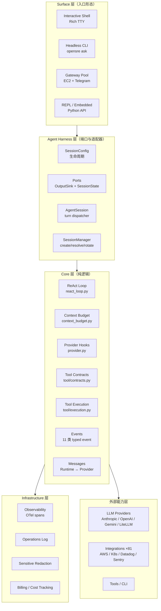
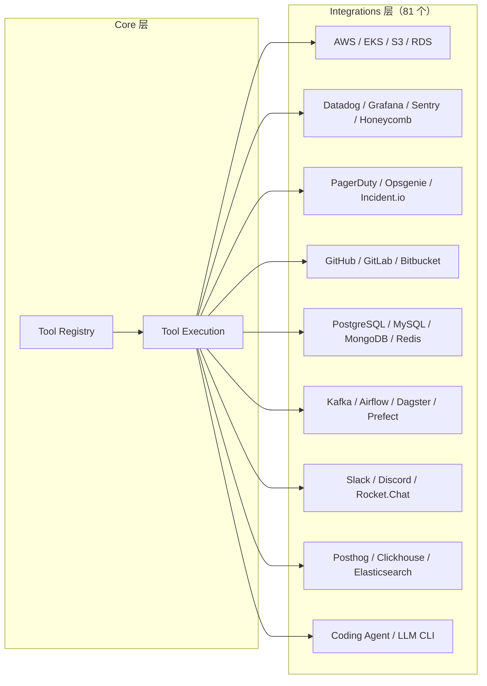
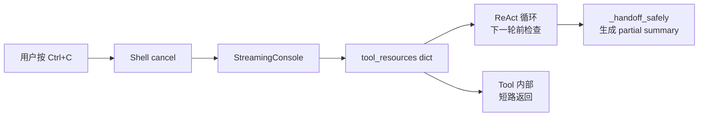
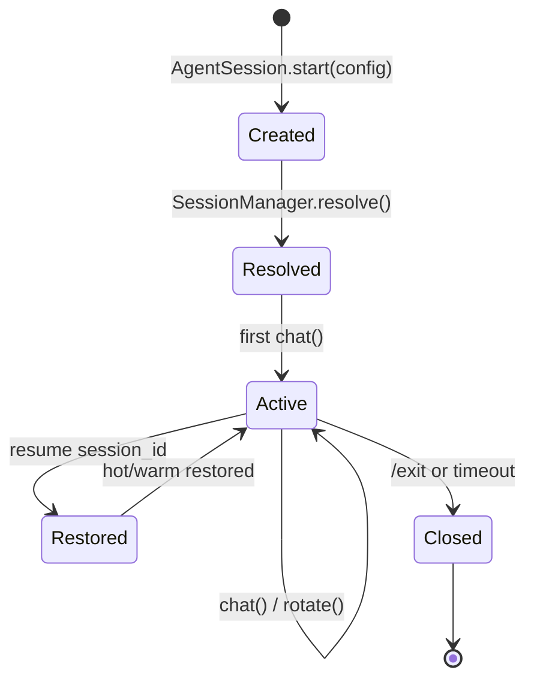
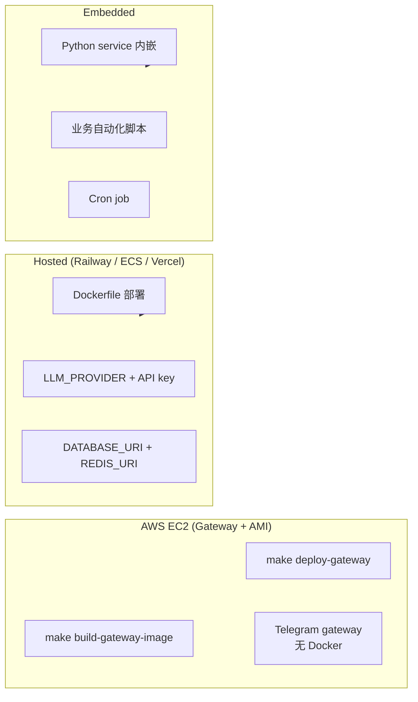

## 一、引子

当 SWE-bench 让 Coding Agent 拥有可规模化的训练数据和明确反馈信号时，**生产事故响应**却仍然是个黑盒——分布式故障更慢、更嘈杂、更难仿真和评估，AI SRE 至今悬而未决。

[Tracer-Cloud/opensre](https://github.com/Tracer-Cloud/opensre)（⭐11k，Apache-2.0，2026-01 创建）是首个明确把"AI SRE Agent"作为独立赛道的开源项目。它不是又一个 ChatBot、不是又一个 SWE-bench 风格的编程 Agent，而是**为生产事故响应量身打造的 Agent 框架**：

- 自带 **60+ 集成**（实际 81 个），覆盖 AWS / Kubernetes / Datadog / Grafana / Sentry / PagerDuty / Slack 等事故现场的全部信号源；
- **六边形架构（Ports & Adapters）** 严格隔离 `core/agent/` 与具体 surface（交互式 Shell / Headless Gateway / REPL）；
- **ReAct 循环 + 上下文预算 + 协同取消 + ProviderHooks** —— 这是把 Coding Agent 思想移植到 SRE 场景后做的关键工程化决策；
- 目标不是 demo，而是 **"build your own AI SRE agents"** —— 让团队把 Agent 嵌入日常运维 / 自动化脚本里。

> OpenSRE 目前是 **Public Alpha**：核心工作流可用，但 API 仍可能演进。本文写作时仓库 commit 为 `2026-09-10`，star 11,029，fork 1,611。

本文将逐层拆解 OpenSRE 的架构、关键抽象、ReAct 循环实现、与同类项目的设计差异，并给出实践指南。

## 二、项目定位与核心价值

**一句话定义**：OpenSRE 是「面向生产事故响应的 AI Agent 框架」，给团队提供可自托管、可定制、可评估的 AI SRE。

**能力矩阵**：

| 维度 | OpenSRE 提供 |
|------|--------------|
| Agent Loop | ReAct（reason → act → observe），4 个内置安全兜底 |
| 上下文管理 | Context Budget Engine，按模型动态窗口裁剪，Pinned 消息保活 |
| Provider 抽象 | ProviderHooks（5 个 hook 点）跨 Anthropic / OpenAI / Gemini / LiteLLM |
| Tool 抽象 | ToolSurface + RuntimeTool，自定义 Approval Expiry |
| 集成覆盖 | **81 个集成**，覆盖云平台 / 监控 / 数据库 / 协作 / CI/CD |
| 部署形态 | CLI 交互式 Shell / Headless Gateway / Python API 嵌入式 / AWS AMI + systemd |
| 取消机制 | 协同取消（cooperative cancel），工具与 loop 共享 flag |
| 事件系统 | 11 类 Typed RuntimeEvent，支撑 observability 与 UI 流式渲染 |
| 评估 | e2e 测试 + tests/README.md 语义目录（unit/e2e/local/cloud 边界清晰） |

**仓库统计**：

| 字段 | 值 |
|------|-----|
| Stars | 11,029 |
| Forks | 1,611 |
| 语言 | Python（~94%） |
| License | Apache-2.0 |
| 创建时间 | 2026-01-13 |
| 最近 push | 2026-09-10 |
| 仓库大小 | 184MB |
| 一级目录 | `core/`、`agent_harness/`、`tools/`、`integrations/`、`surfaces/`、`infrastructure/`、`gateway/`、`config/`、`bootstrap/` |
| 默认分支 | main |

**核心哲学（来自 README）**：

> Production incident response still lacks [a SWE-bench equivalent]. Distributed failures are slower, noisier, and harder to simulate and evaluate than local code tasks, which is why AI SRE remains unsolved.

OpenSRE 的目标不是"做一个 Agent"，而是**构建"可重复、可评估"的 SRE Agent 训练与运行环境**。这一定位让它站在了 2026 H2 AI 工程化的正确跑道上。

## 三、整体架构

OpenSRE 是一个 **monolith 风格的 Python monorepo**，但通过**严格的目录层级 + 类型约束**实现了逻辑分层。下面是顶层架构图：



**目录职责清单**（按文件数排序）：

| 目录 | 行数级 | 职责 |
|------|--------|------|
| `core/agent/` | ~10 文件 | ReAct 循环、Goal、Cancel、RunIO、LoopHost 协议 |
| `core/agent_harness/` | 239 文件 | Session / Ports / Goal / Turn / Prompt 组装 |
| `core/tool/` | 4 文件 + 多个 mixin | Tool 契约、注册、执行、Approval |
| `core/llm/` | 多个 | Provider 类型、Failure、ReasoningEffort |
| `integrations/` | 81 子目录 | 一个集成 = 一个 `*_integration.py` |
| `surfaces/` | 339 文件 | interactive_shell / gateway / headless 等入口 |
| `infrastructure/` | 234 文件 | observability / billing / persistent_tasks |
| `gateway/` | 313 文件 | 部署侧 Gateway 服务（hosted 模式） |

**关键边界原则**（来自 docstring 反复强调）：

> `core/agent_harness/` MUST NOT import `surfaces.interactive_shell`. Surfaces inject prompt context through `SessionConfig`.

这是 **Inversion of Control** 的具体体现——高层（harness）只定义 Ports（Protocol），低层（surface）注入适配器。

## 四、六边形架构：Ports & Adapters

OpenSRE 的核心特征是严格的六边形架构。`core/agent_harness/ports.py` 集中定义了 Agent 运行时需要的所有"端口"。

**Ports 定义（节选自 `core/agent_harness/ports.py`）**：

```python
# 来自 core/agent_harness/ports.py
ToolEventObserver = Callable[[str, dict[str, Any]], None]
ConfirmFn = Callable[[str], str]
LlmFactory = Callable[[], AgentLLMClient]


@runtime_checkable
class OutputSink(Protocol):
    """Where the engine renders user-facing output."""

    def print(self, message: str = "") -> None: ...
    def render_response_header(self, label: str) -> None: ...
    def render_error(self, message: str) -> None: ...
    def stream(self, *, label: str, chunks: Iterable[str],
               suppress_if_starts_with: str | None = None,
               defer_want_me_to_closer: bool = False) -> str: ...


@runtime_checkable
class SessionState(Protocol):
    """Mutable per-session state the engine reads and writes."""

    cli_agent_messages: list[tuple[str, str]]
    configured_integrations_known: bool
    @property
    def configured_integrations(self) -> Sequence[str]: ...
    reasoning_effort: ReasoningEffortChoice | None
    history: list[dict[str, Any]]
    session_id: str
    # ... gather caches: resolved_integrations, vcs scopes ...
```

**设计哲学**：这些不是基类（ABC），而是 **Python Protocol + `@runtime_checkable`**——结构化匹配意味着**任何 duck-typed 实现都自动满足**。Interactive shell 有自己的 Session / Rich console，headless gateway 有最小内存版，两者都"碰巧"满足 Protocol。

**关键 Ports 清单**：

| Port | 职责 | 实现位置 |
|------|------|----------|
| `OutputSink` | 用户输出渲染（print / stream / error） | `surfaces/interactive_shell` |
| `SessionState` | 每 session 可变状态 | 各 surface 的 `Session` |
| `ToolProvider` | 工具注册 + 调用入口 | 各 surface 的 tool registry |
| `PromptContextProvider` | Prompt 组装（避免 surface 反向依赖） | 通过 `SessionConfig` 注入 |
| `TurnBinding` | 单 turn 的 LLM / tools / sink 装配 | 由 `Session` 持有 |
| `ToolEventObserver` | Tool loop 事件回调 `(kind, data)` | UI / observability |
| `LlmFactory` | 构造 `AgentLLMClient` | 由测试 / host 注入 |

**为什么用 Protocol 而不是 ABC**：

1. **零继承耦合**：测试时直接构造 `class FakeSession: ...` 满足所有 Protocol，无需继承。
2. **运行时可检查**：`@runtime_checkable` + `isinstance(obj, OutputSink)` 让 debug 时直接验证契约是否满足。
3. **避免 import 循环**：`core/agent_harness/` 定义协议，`surfaces/` 反向导入——打破常见 hexagonal 实现的 import 死锁。

## 五、ReAct 推理循环（核心引擎）

`core/agent/react_loop.py` 是 Agent 的心脏。**关键设计**：loop 不直接调用 LLM，而是通过 `AgentRunInput` + `LoopHost` 实现与具体 Agent / surface 完全解耦。

**ReAct 循环主流程图**：

```mermaid
sequenceDiagram
    participant Host as LoopHost<br/>(surface)
    participant Loop as ReactLoop
    participant LLM as AgentLLMClient
    participant Tool as Tool Runtime
    participant Budget as ContextBudget
    participant Events as EventBus

    Host->>Loop: run_react_loop(run_input, host)
    Loop->>Events: emit AgentStartEvent
    Loop->>Budget: estimate tokens
    Budget-->>Loop: token_estimate
    Loop->>Budget: enforce_context_budget
    Budget-->>Loop: trimmed messages

    loop Until done or cancel
        Loop->>Events: emit TurnStartEvent
        Loop->>LLM: invoke(messages, tools)
        LLM-->>Loop: response + tool_calls
        Loop->>Events: emit ProviderRequestEndEvent

        alt tool_calls present
            Loop->>Events: emit ToolExecutionStartEvent
            Loop->>Tool: execute_tool_calls(calls)
            Tool-->>Loop: results
            Loop->>Events: emit ToolExecutionEndEvent
        else no tool_calls
            Loop->>Events: emit TurnEndEvent
            Note over Loop: 自然结束
        end

        Loop->>Budget: enforce_context_budget
        Loop->>Loop: detect cancel / stagnation / overflow
    end

    Loop->>Events: emit AgentEndEvent
    Loop-->>Host: AgentRunResult
```

**ReAct 主循环代码（节选自 `core/agent/react_loop.py`）**：

```python
# 来自 core/agent/react_loop.py
def run_react_loop(run_input: AgentRunInput, host: LoopHost) -> AgentRunResult:
    """Run one ReAct loop pass until the LLM answers without tool calls
    or a safety limit fires. Cancellation is checked every iteration."""
    messages = list(run_input.messages)
    iteration = 0
    seen_tool_call_fingerprints: set[Any] = set()

    while True:
        iteration += 1
        # 1) cancel probe — cooperative cancellation
        if tool_resources_cancel_requested(host.tool_resources):
            return _handoff_safely(messages, reason="cancel")

        # 2) enforce context budget BEFORE the next provider request
        messages = enforce_context_budget(messages, model=run_input.model)

        # 3) emit provider request events
        request = ProviderRequest(messages=messages, system=run_input.system,
                                  tools=run_input.tool_schemas)
        request = host.provider_hooks.apply_before_request(request)

        # 4) invoke the LLM
        response = host.llm.invoke(request)

        # 5) tool-call routing
        if response.tool_calls:
            # record fingerprint for stagnation detection
            for call in response.tool_calls:
                seen_tool_call_fingerprints.add(_fingerprint(call))
            results = execute_tool_calls(
                response.tool_calls, host=host,
                hooks=host.tool_execution_hooks,
                tool_resources=host.tool_resources,
            )
            messages = _append_tool_messages(messages, response, results)
            continue  # loop back to step 1

        # 6) no tool calls → final answer
        return AgentRunResult(text=response.content, iterations=iteration, ...)


_OVERFLOW_RETRY_BUDGET_FACTOR = 0.6
# After a provider rejects a request as too large, the run's budget drops
# to this share of the rejected request's estimate, keeping at least this
# many message tokens above the fixed system-and-tools overhead.
```

**安全兜底（4 重保险）**：

1. **Cancel**：协同取消，工具与 loop 共享 `cancel_requested` flag，下一轮 LLM 前检查；
2. **Stagnation**：相同 tool call fingerprint 重复出现 → 触发 `_STAGNATION_FALLBACK` 提示（"Change the inputs or tool strategy before continuing"）；
3. **Overflow**：provider 拒绝请求太大 → 触发 `_OVERFLOW_RETRY_BUDGET_FACTOR = 0.6` 把 budget 砍到 60%；
4. **Iteration Cap**：达到 emergency ceiling → 触发 `_ITERATION_CAP_FALLBACK`（"I reached the emergency tool-iteration ceiling"）。

**关键洞察**：`ReactLoop` **不知道 `Agent` 是什么**。它接受 `AgentRunInput`（resolved inputs）和 `LoopHost`（callbacks），任何 host 都能驱动它。这种 "loop-as-library" 是 OpenSRE 能把同一循环复用到 CLI / Shell / Gateway / Test 的根本原因。

## 六、上下文预算（Context Budget Engine）

生产事故响应的 prompt 经常爆炸：Datadog 查询返回 10k 行 metrics、kubectl get pods 输出几百行 JSON、Slack thread 几百条消息。**Context Budget Engine** 是 OpenSRE 与"把更多 token 塞给 LLM"思路正交的核心创新。

**核心思想**：在每次 LLM 调用前 **enforce** 上下文窗口，trim 旧 tool exchange 而非整体 truncate。

**关键代码（节选自 `core/context_budget.py`）**：

```python
# 来自 core/context_budget.py
_MODEL_CONTEXT_WINDOWS: dict[str, int] = {
    "claude": 200_000,
    "gemini": 1_000_000,
    "gpt-4o": 128_000,
    "gpt-4.1": 1_000_000,
    "gpt-4": 128_000,
    # Lookup is first-substring-match in insertion order, so gpt-5.4 / gpt-5.6
    # must stay above the gpt-5 catch-all or they are never reached.
    "gpt-5.6": 1_000_000,
    "gpt-5.4": 1_000_000,
    "gpt-5": 128_000,
    "o1": 128_000,
    "o3": 128_000,
}
_DEFAULT_CONTEXT_WINDOW = 128_000

_PINNED_MESSAGE_KEY = "_opensre_seed"
_DUPLICATE_RESULT_KEY = "_opensre_duplicate_result"


def strip_internal_message_markers(messages: list[dict[str, Any]]) -> list[dict[str, Any]]:
    """Return a copy of ``messages`` without internal ``_opensre_*`` keys.

    Context-budget eviction tags seed and duplicate tool exchanges with these
    markers. They must remain on the in-memory transcript for trimming
    heuristics but are rejected by strict provider message schemas (e.g. Anthropic).
    """
    return [
        {k: v for k, v in m.items() if not k.startswith("_opensre_")}
        for m in messages
    ]
```

**4 类裁剪策略**：

| 策略 | 触发条件 | 行为 |
|------|----------|------|
| `pinned` (seed) | `_opensre_seed = True` | 永不裁剪，用于系统消息 / 关键 AGENTS.md |
| `duplicate-only` | `_opensre_duplicate_result = True` | 仅保留最新一次重复 tool result |
| `tool-use + tool-result` pair | 超过 budget 时 | 整对移除（一问一答） |
| 单条 overflow | 极巨大单条 | 字符截断 + `_TRUNCATION_MARKER = "…[truncated to fit context budget]"` |

**关键细节**：

1. **substring 优先级**：`gpt-5.4` 必须排在 `gpt-5` 之前（注释明确警告），否则 catch-all 永远命中；
2. **内部 marker**：`_opensre_*` 在内存 transcript 里用于 trim 启发，但 provider schema（如 Anthropic 严格模式）不允许——所以发送前 `strip_internal_message_markers` 必须跑；
3. **retry budget factor**：overflow 后下一次 budget = 当前 estimate × 0.6（且至少保留 system+tools overhead）；
4. **保守默认**：未知模型用 128k 而不是抛错，"trim early rather than overflow"。

**与同类对比**：

| 方案 | 裁剪粒度 | Pinned | Duplicate-Aware |
|------|----------|--------|-----------------|
| LangChain ConversationSummaryMemory | 全局 | ❌ | ❌ |
| LlamaIndex ChatMemoryBuffer | 最近 N 消息 | ❌ | ❌ |
| **OpenSRE ContextBudget** | **tool exchange pair** | ✅ | ✅ |
| Mem0 / Zep Graphiti | 向量检索 | ❌ | ❌ |

## 七、Provider Hooks（跨 Provider 兼容层）

OpenSRE 不强制 LiteLLM 抽象。它定义了一套 **Provider Hooks**，让 `core/llm/` 严格解耦于具体 Provider SDK——这是它能跨 Anthropic / OpenAI / Gemini / LiteLLM 四套 API 共存的根本原因。

**ProviderHooks 完整定义（来自 `core/provider.py`）**：

```python
# 来自 core/provider.py
@dataclass(frozen=True)
class ProviderRequest:
    """Provider request payload before the concrete LLM client is invoked."""
    messages: list[ProviderMessage]
    system: str | None = None
    tools: list[dict[str, Any]] | None = None
    metadata: dict[str, Any] = field(default_factory=dict)


TransformMessagesHook = Callable[[Sequence["RuntimeMessage"]], Sequence["RuntimeMessage"]]
ConvertToLlmHook = Callable[[Any, Sequence["RuntimeMessage"]], list["ProviderMessage"]]
BeforeProviderRequestHook = Callable[[ProviderRequest], ProviderRequest | None]
AfterProviderResponseHook = Callable[[ProviderRequest, Any], Any | None]
ApiKeyResolver = Callable[[str], str]


@dataclass(frozen=True)
class ProviderHooks:
    """Hooks around context conversion, credentials, and provider requests."""
    transform_messages: TransformMessagesHook | None = None
    convert_to_llm: ConvertToLlmHook | None = None
    before_provider_request: BeforeProviderRequestHook | None = None
    after_provider_response: AfterProviderResponseHook | None = None
    get_api_key: ApiKeyResolver | None = None
```

**5 个 Hook 点的语义**：

| Hook | 调用时机 | 典型用途 |
|------|----------|----------|
| `transform_messages` | 任何 Provider 调用前 | 注入 cache breakpoint、prefix cache 对齐 |
| `convert_to_llm` | 构造 `ProviderMessage[]` | 跨 Provider schema 翻译（Anthropic tool_use vs OpenAI function_call） |
| `before_provider_request` | 发送前最后一步 | 注入 metadata、改写 max_tokens |
| `after_provider_response` | 收到响应后 | 改写 usage、注入 trace span |
| `get_api_key` | 凭据解析 | 运行时轮换、BYOK（bring your own key） |

**关键设计决策**：Hook 是 `Callable`，不是继承——任何 lambda / 函数都能挂载。`ProviderHooks` 是 frozen dataclass，**整个生命周期不可变**，避免运行时被恶意改写。

**LLM Type 抽象（节选自 `core/llm/types.py`）**：

```python
# 来自 core/llm/types.py
@runtime_checkable
class SchemaDescribedTool(Protocol):
    """The three attributes a provider reads to build a tool-schema payload."""
    @property
    def name(self) -> str: ...
    @property
    def description(self) -> str: ...
    @property
    def public_input_schema(self) -> dict[str, Any]: ...


class ModelType(StrEnum):
    """Configured model tiers for non-agent LLM clients."""
    REASONING = "reasoning"
    CLASSIFICATION = "classification"
    TOOLCALL = "toolcall"


@dataclass(frozen=True)
class LLMRoute:
    """The resolved provider/transport decision shared by every role this turn."""
    settings: Any
    provider: str  # runtime provider (after auth-method resolution)
    cli_provider_registration: Any | None
    use_litellm: bool
```

**洞察**：`SchemaDescribedTool` 注释里有一段特别坦诚的反思：

> Stated here rather than imported from the tool tier. Naming the tool union put `core.llm` on a path back into `core.tool`, which closed a package cycle the moment `core/tool/__init__` grew imports — and it bought nothing: every provider client widened the parameter to `list[Any]` anyway.

这是工程实践中典型的"打破循环依赖"反思——他们故意**不去**做"完美类型"，而是接受 runtime 灵活性。

## 八、Tool 系统与 60+ 集成

OpenSRE 的 `core/tool/` 模块用 4 个文件 + 多个 mixin 实现了 Tool 契约、注册、执行与 Approval 的全部能力。

**Tool Surface（节选自 `core/tool/contracts.py`）**：

```python
# 来自 core/tool/contracts.py
class ToolSurface(StrEnum):
    """Which UI surface the tool is allowed to run on."""
    INTERACTIVE = "interactive"
    HEADLESS = "headless"
    GATEWAY = "gateway"
    ALL = "all"
```

**Approval 机制**（关键工程细节）：

```python
# 来自 core/tool/contracts.py (摘自 imports)
from config.constants.tooling import DEFAULT_APPROVAL_EXPIRY_SECONDS
```

`DEFAULT_APPROVAL_EXPIRY_SECONDS` 是 SRE 场景特有的设计：**tool 一旦被批准，TTL 内不再重复询问**——避免事故响应时被 kubectl / AWS CLI 这种高频调用打扰。

**集成架构**：



**集成的关键原则**（来自 docstring）：

每个 `integrations/<name>/` 子目录都是**自治**的：

- 一个 `_integration.py` 定义 Tool 类；
- 一个 `client.py`（可选）做 SDK 适配；
- 自己的 config schema；
- 通过 `@runtime_checkable` Protocol 注册到全局 Registry。

这种"每个集成一个文件夹 + 共享 Tool Surface 契约"的模式让 OpenSRE 能在 8 个月内扩展到 81 个集成，且每个集成都可独立测试。

## 九、协同取消机制

OpenSRE 的取消机制是 **cooperative cancel**，区别于"kill -9"或"threading.Thread.terminate()"。

**Cancel probe（节选自 `core/agent/cancel.py`）**：

```python
# 来自 core/agent/cancel.py
def tool_resources_cancel_requested(tool_resources: Any) -> bool:
    """True when any tool-resource console reports ``cancel_requested``.

    Hosts put a console with ``cancel_requested`` on an object in
    ``tool_resources``:

    * shell — ``StreamingConsole``
    * gateway — ``CancelConsole`` (wraps ``sink.turn_cancel``)
    * gather — cancel probe from ``host_cancel.cancel_tool_resources``

    Tools already short-circuit on the same flag; the loop uses this helper so
    the next LLM iteration does not start after cancel is set.
    """
    if not isinstance(tool_resources, dict):
        return False
    for value in tool_resources.values():
        console = getattr(value, "console", None)
        if console is not None and bool(getattr(console, "cancel_requested", False)):
            return True
    return False
```

**取消传播链**：



**关键洞察**：取消**不打断 in-flight LLM 调用**，只阻止**下一轮开始**。这种"合作式取消"在生产环境至关重要：

1. **不会浪费已发出的 LLM token**（已付的钱不能退）；
2. **不会半完成 Tool**（Tool 自己检查 flag 后短路）；
3. **保证 partial summary 写入 transcript**（`_handoff_safely` 仍返回带部分结果的对象）。

## 十、事件系统（Typed RuntimeEvent）

`core/events.py` 定义了 11 类 typed event，覆盖 Agent 完整生命周期。

**事件列表（来自 `core/events.py`）**：

```python
# 来自 core/events.py
RuntimeEventType: TypeAlias = Literal[
    "agent_start",
    "turn_start",
    "message_start",
    "message_update",
    "provider_request_start",
    "provider_request_end",
    "tool_execution_start",
    "tool_execution_update",
    "tool_execution_end",
    "turn_end",
    "agent_end",
]
```

**事件流的端到端时序**：

```mermaid
sequenceDiagram
    participant User
    participant Sink as OutputSink
    participant Loop as ReactLoop
    participant LLM
    participant Tool

    User->>Loop: chat("why is checkout-api slow?")
    Loop->>Sink: AgentStartEvent
    Loop->>Sink: TurnStartEvent(iteration=1)
    Loop->>Sink: ProviderRequestStartEvent
    Loop->>LLM: invoke
    LLM-->>Loop: response
    Loop->>Sink: ProviderRequestEndEvent(has_tool_calls=True)
    Loop->>Sink: ToolExecutionStartEvent(tool="datadog_query")
    Loop->>Tool: execute
    Tool-->>Loop: result
    Loop->>Sink: ToolExecutionUpdateEvent(partial)
    Loop->>Sink: ToolExecutionEndEvent
    Loop->>Sink: TurnEndEvent

    Loop->>Sink: TurnStartEvent(iteration=2)
    Loop->>LLM: invoke (now with tool result)
    LLM-->>Loop: final answer (no tool_calls)
    Loop->>Sink: MessageStartEvent
    Loop->>Sink: MessageUpdateEvent(delta="Based on...")
    Loop->>Sink: TurnEndEvent
    Loop->>Sink: AgentEndEvent
```

**关键设计**：

1. **每事件都是 frozen dataclass + Literal type**——schema 严格、易序列化、易 trace；
2. **`MessageUpdateEvent.delta`** 字段支持流式增量更新（UI / observability 都吃这个）；
3. **所有 emit 走 EventBus**（`Operation` observer 模式），不影响 loop 主流程；
4. **OpenTelemetry 集成**通过 `infrastructure/observability/trace/spans.py` 把这些事件桥接成 OTel span——同一 trace 既能看 LLM 调用又能看 tool execution。

## 十一、Session 生命周期

`core/agent_harness/session/` 模块负责 Session 全生命周期。`AgentSession` 是**嵌入器（embedder）的统一入口**。

**Session 主入口（节选自 `core/agent_harness/harness.py`）**：

```python
# 来自 core/agent_harness/harness.py
class ChatDispatcher(Protocol):
    """Anything that can run one chat turn for a message (headless or TTY)."""
    def dispatch(self, message: str) -> TurnResult: ...


@runtime_checkable
class GoalDispatcher(ChatDispatcher, Protocol):
    """A dispatcher that also drives the session-goal loop (a :class:`HeadlessAgent`)."""
    def run_goal(
        self,
        text: str,
        binding: TurnBinding | None = None,
        *,
        goal: SessionGoal | None = None,
        evaluate: Callable[..., str] | None = None,
        cancel_requested: Callable[[], bool] | None = None,
        on_progress: Callable[[SessionGoal], None] | None = None,
    ) -> SessionGoalRunResult: ...


@dataclass(frozen=True)
class SessionConfig:
    """What a surface hands :class:`AgentSession` to start up.

    Every field is optional so a surface only opts into the behavior it
    needs: a fresh gateway turn has nothing to resume (``session_id=None``);
    a headless action-only turn has no grounded context (``prompts=None``).
    """
    session_id: str | None = None
    prompts: PromptContextProvider | None = None
    load_env: bool = True
    hydrate_integrations: bool = True
    warm_integrations: bool | None = None  # None = defer to SessionManager default
    persistent_tasks: bool = True
    open_store: bool = True
    session_manager: SessionManager | None = None
```

**Session 生命周期状态机**：



**关键设计**：

- `warm_integrations=None` → 由 `SessionManager` 决定 eager vs lazy；
- `session_manager=None` → 由 harness 自己创建默认；
- `prompts=None` → headless action-only turn 没有 grounded context（CI / 自动化脚本）；
- `hydrate_integrations` 与 `warm_integrations` 分离——前者决定是否拉取集成清单，后者决定是否提前加载凭据。

## 十二、与同类项目对比

OpenSRE 处于**生产事故响应 + AI Agent**交叉点，与多个赛道有交集但定位完全正交。下面是 4 个最相关项目的设计差异。

**对比表**：

| 维度 | OpenSRE | Claude Code | LangGraph | Autogen | ChatDev |
|------|---------|-------------|-----------|---------|---------|
| 目标场景 | 事故响应 / SRE | 软件工程 | 通用 Agent 编排 | 多 Agent 对话 | 软件团队协作 |
| 架构模式 | 六边形 Ports | 单进程 harness | 图工作流 | 对话驱动 | Chat Chain |
| 集成数量 | **81** | ~10 MCP | 无 | 无 | 无 |
| 上下文管理 | **Context Budget + pinned** | 全量塞 | 节点级状态 | 无 | 无 |
| 取消机制 | **cooperative cancel** | Ctrl+C 强杀 | 无 | 无 | 无 |
| 部署形态 | **CLI + Gateway + Embedded** | CLI | Python lib | Python lib | 单进程 |
| License | Apache-2.0 | 闭源 | MIT | CC-BY-3.0 | Apache-2.0 |
| 评估体系 | **e2e + semantic tests/** | 无 | 无 | 无 | 无 |

**核心设计差异**：

### 12.1 OpenSRE vs Claude Code（生产事故 vs 软件开发）

- **Claude Code** 假设你在 IDE / 终端里执行开发任务，强调 tool call 反馈即时；
- **OpenSRE** 假设你在 on-call 时被 page，强调**长 prompt（Datadog 返 10k 行）、长 session（跨小时）、协同取消（on-call 同事按 stop）**；
- **关键差异**：Claude Code 的 Context 策略是"全部塞"，OpenSRE 的 ContextBudget 是"主动 trim"——前者优化交互流畅度，后者优化**长任务可完成率**。

### 12.2 OpenSRE vs LangGraph（六边形 vs 图工作流）

- **LangGraph** 把"Agent 决策"建模为图节点 + 边——适合**显式可控的状态机**；
- **OpenSRE** 用 Ports 把"决策"建模为 ReAct 循环 + Tool 调度——适合**不可枚举的工具集**（81 个集成）；
- **关键差异**：LangGraph 强在"业务流可视化"，OpenSRE 强在"基础设施解耦"。事故响应里 90% 工作是**调用合适工具查数据**——OpenSRE 模式更合适。

### 12.3 OpenSRE vs Autogen（协同取消 vs 自由对话）

- **Autogen** 强调多 Agent 自由对话，每个 Agent 有独立 prompt + 工具；
- **OpenSRE** 是单 Agent + 多 Tool，所有协作通过 ReAct 循环 + Tool Surface 完成；
- **关键差异**：事故响应**没有"协作"语义**——on-call 时你不会让 3 个 AI 互相讨论"alertmanager 是不是误报"——你只会让一个 Agent **快速调用 alertmanager + 看 metrics + 写 incident**。

### 12.4 OpenSRE vs ChatDev（嵌入式 API vs GUI 桌面）

- **ChatDev** 是 GUI 桌面 + 多 Agent Chat Chain 演示；
- **OpenSRE** 是 **headless CLI / Python API**——可直接嵌入公司内部 cron / Slack bot / on-call rotation；
- **关键差异**：ChatDev 适合"展示 AI 软件公司"这个 idea，OpenSRE 适合"真的让团队用 AI 处理事故"——后者的可嵌入性是 10× 价值。

## 十三、优缺点分析

下面从**架构简洁性 / 扩展性 / 易用性** vs **性能 / 复杂度 / 维护性**两侧维度评估。

| 维度 | 优势 | 代价 |
|------|------|------|
| **架构简洁性** | ✅ **六边形严格分层**，Protocol + Port 解耦清晰 | ⚠️ 文件数 4512（一级 16 个），新手 onboarding 成本高 |
| **扩展性** | ✅ **81 个集成 + 简单加新集成 = 一个文件夹** | ⚠️ Protocol 增加需要改 `core/agent_harness/ports.py`，影响面大 |
| **易用性** | ✅ **`opensre` 一行启动 + `opensre ask` 一行提问** | ⚠️ Public Alpha，API 不稳定，团队生产部署前需自己 fork 锁版本 |
| **性能** | ✅ **ContextBudget 主动 trim**，长任务可完成率显著高 | ⚠️ 协同取消不打断 in-flight LLM，已发出的 token 浪费 |
| **复杂度** | ✅ **5 个 Hook 点足够覆盖 4 大 Provider** | ⚠️ Provider SDK 差异（如 Anthropic system vs OpenAI messages）需每个 Provider 单独适配 |
| **维护性** | ✅ **public open source + Apache-2.0 + 8 个月迭代** | ⚠️ monorepo 单仓 4512 文件，CI 与 reviewer 负担大 |
| **事故现场适配** | ✅ **ContextBudget + Cancel + 81 集成 + 嵌入式 API** | ⚠️ 没有 SWE-bench 那种"可量化进步"的 benchmark |
| **协议 / 标准化** | ✅ **Protocol + dataclass + Literal event** | ⚠️ 没走 A2A / MCP 等外部协议，纯内部 type |

**核心 trade-off**：

- **正**：为生产事故"量身定做"——ContextBudget、协同取消、嵌入式 API、81 个集成，全部直接服务于"on-call 快速解决事故"；
- **反**：Public Alpha 阶段、API 不稳定、没有公开 benchmark、团队生产部署需自己 fork 锁版本——**这是任何"非 CopilotKit 这种纯 GUI 框架"的代价**。

## 十四、实践 / 部署

### 14.1 安装与运行

```bash
# macOS / Linux 一键安装
curl -fsSL https://install.opensre.com | bash

# 或 brew
brew tap tracer-cloud/tap
brew install tracer-cloud/tap/opensre

# 一次性 setup
opensre setup

# 交互式 Shell（TTY 必需）
opensre

# Headless CLI
opensre ask "why is checkout-api slow?"

# 列出已配集成
opensre integrations list

# 验证集成凭据
opensre integrations verify
```

### 14.2 Python 嵌入式 API

```python
# 来自 docs/python-api.mdx
from core.agent_harness import AgentSession

session = AgentSession.start()
result = session.chat("why is checkout-api slow?")
if result.answered:
    print(result.primary_response_text)
```

### 14.3 自定义 OutputSink 适配器

```python
# 任何 duck-typed 类都满足 Protocol
from core.agent_harness.ports import OutputSink, SessionState

class SlackSink:
    """向 Slack thread 推送 Agent 输出的最小适配器。"""

    def print(self, message: str = "") -> None:
        send_to_slack(message)

    def render_response_header(self, label: str) -> None:
        send_to_slack(f"*{label}*")

    def render_error(self, message: str) -> None:
        send_to_slack(f":warning: {message}")

    def stream(self, *, label: str, chunks, suppress_if_starts_with=None,
               defer_want_me_to_closer=False) -> str:
        full = "".join(chunks)
        send_to_slack(full)
        return full

# runtime check
assert isinstance(SlackSink(), OutputSink), "must be duck-typed OutputSink"
```

### 14.4 部署形态

OpenSRE 提供 3 种部署路径：



### 14.5 评估

```bash
# e2e 测试（云故障场景）
opensre test e2e

# unit 测试
opensre test unit

# 边界命名约定：tests/e2e/ vs tests/unit/ vs tests/local/ vs tests/cloud/
# （来自 tests/README.md）
```

## 十五、趋势与总结

### 15.1 2026 H2 三大趋势

**趋势 1：AI Agent 从"软件工程"扩散到"运维 / 事故响应"**

Coding Agent 已饱和（Coding Agent Harness 类 7+ 篇已写），下一个战场是 **Domain-Specific Agent**：SRE / Sales / Legal / Customer Success。OpenSRE 是 SRE 方向的开山之作——填补"SWE-bench 已解决，Coding 已自动化，但生产事故响应还没人做"这个空白。

**趋势 2：六边形架构成为大型 Agent 框架的事实标准**

OpenSRE 的 `core/agent_harness/ports.py` 用 Protocol + `runtime_checkable` 实现的 Ports 与 Adapters，比 LangGraph 的图节点更易测试、比 Autogen 的 ABC 更易演进。**Protocol > ABC、frozen dataclass > mutable state、Callable hook > inheritance**——这是 2026 H2 大型 Agent 项目的设计公约。

**趋势 3：Context Budget 成为长任务 Agent 的标配**

Datadog 查询返 10k 行、Kubernetes describe pod 几百行、Slack thread 几百条——长任务 prompt 必然爆炸。OpenSRE 的 `enforce_context_budget` + pinned message + duplicate-result eviction 是一个**可工程化**的解决方案，区别于 LangChain 的 `ConversationSummaryMemory` 这种"全局总结"方案。

### 15.2 工程经验提炼

- **不要把 LLM 调用当终点**：每次 invoke 前 enforce context budget，每次 invoke 后检查 cancel，每次 tool call 后 emit event；
- **Protocol 优于 ABC**：duck-typed 端口让测试简单、避免 import 循环、允许运行时 isinstance 检查；
- **协同取消优于 kill -9**：保护已付 token、保护 partial summary、保护 tool 状态；
- **嵌入式 API 优于 GUI 桌面**：让团队把 Agent 塞进 cron / Slack bot / on-call rotation，价值 10×；
- **每个集成一个文件夹 + 共享 Tool Surface 契约**：是 8 个月扩到 81 个集成的根本原因。

### 15.3 OpenSRE 适合谁

| 角色 | 是否适合 | 理由 |
|------|----------|------|
| 初创 SRE 团队 | ✅ 强烈推荐 | 嵌入式 API + 81 集成 = 一天接入 on-call rotation |
| 大厂 SRE 平台团队 | ✅ 推荐 | 六边形架构 + Protocol 易测试 / 易扩展 |
| AI Agent 框架研究者 | ✅ 推荐 | ReAct + ContextBudget + ProviderHooks 是教科书级实现 |
| 纯软件工程 Agent 需求 | ❌ 不推荐 | 用 Claude Code / Continue / Cline 更直接 |
| GUI 桌面演示需求 | ❌ 不推荐 | OpenSRE 是 headless CLI / API，不提供 GUI |

## 附录

### 关键资源

| 资源 | 链接 |
|------|------|
| GitHub | <https://github.com/Tracer-Cloud/opensre> |
| 官网 | <https://opensre.com> |
| Quick Start | <https://opensre.com/docs/quickstart> |
| Python API | <https://opensre.com/docs/python-api> |
| Headless CLI | <https://opensre.com/docs/headless-cli> |
| Discord | <https://discord.gg/7NTpevXf7w> |
| License | Apache-2.0 |
| 引用论文 | SWE-bench: <https://arxiv.org/abs/2310.06770> |

### 仓库结构速查

```text
core/
├── agent/              # ReAct 循环 + LoopHost + Cancel
├── agent_harness/      # Ports + Session + Goals
├── context_budget/     # 上下文预算引擎
├── events.py           # 11 类 typed event
├── llm/                # Provider 抽象 + Failure
├── messages/           # Runtime ↔ Provider schema
├── provider.py         # ProviderHooks (5 hook 点)
└── tool/               # Tool 契约 / 注册 / 执行
integrations/           # 81 个集成
surfaces/               # Shell / Gateway / Headless 入口
infrastructure/         # observability / billing / persistent_tasks
gateway/                # 部署侧 Gateway 服务
```

### 关键架构决策（Source-of-Truth）

| 决策 | 位置 | 说明 |
|------|------|------|
| ReAct 循环与 Agent 解耦 | `core/agent/react_loop.py:1-50` | 通过 `AgentRunInput` + `LoopHost` 接口 |
| ContextBudget 4 类裁剪 | `core/context_budget.py:50-80` | pinned / duplicate / pair / overflow |
| Provider Hooks 5 个点 | `core/provider.py:30-90` | transform / convert / before / after / api_key |
| Tool Surface 枚举 | `core/tool/contracts.py:SchemaDescribedTool` | Protocol + `runtime_checkable` |
| 协同取消 | `core/agent/cancel.py:tool_resources_cancel_requested` | 工具与 surface 共享 flag |
| SessionConfig 7 字段 | `core/agent_harness/harness.py:SessionConfig` | 全 optional，按 surface 按需 opt-in |
| 11 类 Typed Event | `core/events.py:RuntimeEventType` | Literal + frozen dataclass |
| 81 集成结构 | `integrations/<name>/` | 每个集成 = 一个文件夹 + 自治注册 |