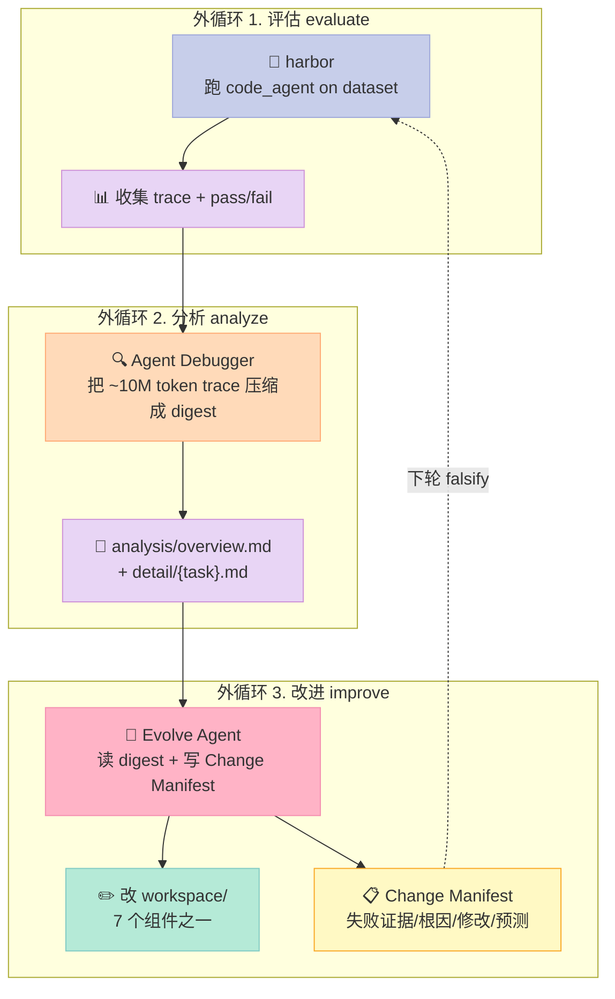
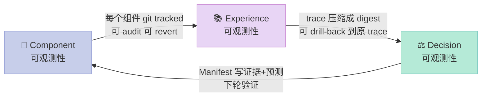
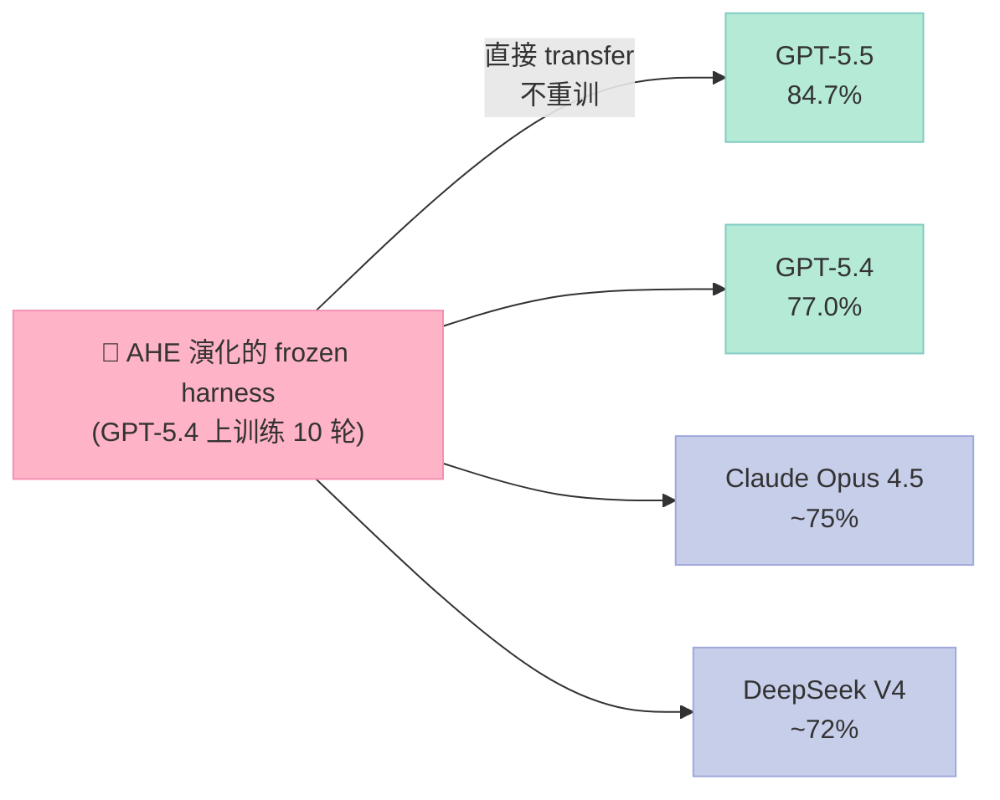

> **一句话核心结论**：AHE（Agentic Harness Engineering）把 Harness 当成"可被 git 追踪的工程产物"——固定基模型，靠 3 层可观测性（Component / Experience / Decision）和 7 个正交组件，让 Harness 在"评估 → 分析 → 改进"的闭环里**自我演化**，且每次改动都被 falsifiable 验证。在 Terminal-Bench 2 上把 GPT-5.4 从 69.7% 拉到 77.0%，且 frozen harness 不重新演化就能迁移到 SWE-bench-Verified。

## 一、为什么需要 AHE：Harness 调优的"炼丹困境"

2026 年的 AI Agent 行业有个残酷真相：**决定 Agent 能不能稳定干活的，从来不是模型本身，而是模型外面那套 Harness（外挂系统）**。

但调 Harness 的工程师会陷入"炼丹困境"：

- 改了 system prompt，跑分掉了，但**不知道是改坏了还是运气差**。
- 加了一个 middleware 修复了 A 任务，但**偷偷搞挂了 B 任务**，3 周后才发现。
- 同事说"我用 Claude Code 调出过 95%"，但**他把哪些 system prompt / tool description / middleware 改了**，根本没记录。

**AHE 的回答是：把 Harness 当成可被 git 追踪、可被 manifest 验证的"工程产物"，而不是模型开发者脑子里那点魔法**。

它对应的就是 6 件套里的 **Loop（外循环）+ Script（硬关卡）+ Skill（工作流模式）** 这三类组件的深度融合：Harness 在 Loop 里不断评估，Script 拦截不安全动作，Skill 把"如何审计 Harness"做成可复用工作流。

### 1.1 论文 + 代码一手数据

| 维度 | 数据 |
|---|---|
| 项目地址 | <https://github.com/china-qijizhifeng/agentic-harness-engineering> |
| Stars | 881⭐（实测 2026-09-12） |
| License | MIT |
| 论文 | arXiv 2604.25850（复旦 & 北大，2026-04-28） |
| 排名 | Terminal-Bench 2.0 leaderboard #3，84.7% pass@1 |
| 关键数字 | 10 轮迭代 GPT-5.4：69.7% → 77.0%；frozen harness 迁移到 4 个其他模型仍有效 |
| 语言 | Python（≥ 3.13），依赖 NexAU 框架 |
| Skill 配套 | `skills/agentic-harness-engineering/SKILL.md`（可被 Claude Code / Codex 直接加载） |

### 1.2 AHE 想解决的 3 个具体问题

1. **缺乏统一语言**：不同 Agent 框架（Hermes / OpenClaw / Claude Code / Codex）的 Harness 结构千差万别，改动无法对比。  
   → AHE 给出 **HARNESS.md v1.0 规范**：7 个正交组件 + 标准目录 + 注册格式。

2. **改动无法验证**：调完 harness 跑一次，发现分数变了——是好事还是坏事？**没有 falsifiable 证据**。  
   → AHE 引入 **Change Manifest**：每次改动必须填写「失败证据 / 根因 / 修改 / 预测影响」，下次评估自动验证。

3. **无法跨模型迁移**：在 Claude 上调到 90%，换 GPT 就掉到 60%。  
   → AHE 的 **frozen harness** 跨 4 个模型都仍有效——说明它编码的是"工程经验"，不是"对某个模型的过拟合"。

## 二、AHE 整体架构：3 层可观测性 + 7 个正交组件

AHE 不是一个模型，是一个**让 Harness 自我演化的操作系统**。它由两条主线组成：

- **基模型固定**：`code_agent` 用同一个 LLM（GPT-5.4 / GPT-5.5 等），变的是 Harness。
- **外循环**：`evaluate → analyze → improve` 三步循环，每一步都有可观测性兜底。



**关键不变量**：Evolve Agent **只能写 `workspace/`**，所有其他路径（`runs/`、`llm_config`、`verifier`）都是只读的。这一条铁律保证了"演化只动 Harness，不动评估基础设施"。

### 2.1 7 个正交组件（HARNESS.md v1.0 规范）

AHE 强行把 Harness 切成 7 个互不重叠的组件，每个都有明确的职责和典型文件：

| # | 组件 | 职责 | 类比 |
|---|------|------|------|
| 1 | **System Rules** | Agent 行为规则、边界定义 | 宪法 |
| 2 | **Tool Descriptions** | 工具 Schema、用途说明、使用陷阱 | 产品说明书 |
| 3 | **Tool Implementations** | 工具执行的代码逻辑 | 机器人工厂 |
| 4 | **Middleware** | 执行管道钩子（拦截 / 转换 / 增强） | 安检通道 |
| 5 | **Skills** | 可复用工作流模式（`SKILL.md`） | SOP 手册 |
| 6 | **Sub-Agents** | 可委托执行的子代理 | 外包团队 |
| 7 | **Long-Term Memory** | 跨会话持久知识 | 个人笔记 |

**正交性 = 可独立演化**。AHE 的 Evolve Agent 每次只能改其中 1-2 个组件，且必须在 Change Manifest 里标注「我改了哪个组件」，这样下次评估时就能精确归因。

### 2.2 3 层可观测性（Component / Experience / Decision）

AHE 把"可观测"做到 3 个层次：



**第 1 层 · Component 可观测性**：由 [NexAU](https://github.com/nex-agi/NexAU.git) 框架实现。Harness 的每个文件都 git tracked（`systemprompt.md` / `code_agent.yaml` / `tool_descriptions/*.yaml` / `tools/*.py` / `middleware/*.py` / `skills/*/SKILL.md` / `LongTermMEMORY.md`）。**这意味着 Harness 的任何修改都是一个 git commit，可以 diff、可以回滚、可以 blame**。

**第 2 层 · Experience 可观测性**：Agent Debugger（独立 skill 包）把单次迭代产生的 ~10M token 原始 trace 压缩成有来源的 digest：
- `analysis/overview.md`：跨任务根因汇总
- `analysis/detail/{task}.md`：单任务深度分析

每条结论都链回原始 trace 位置——Evolve Agent 默认看 digest，但**需要时可以钻回原 trace**。

**第 3 层 · Decision 可观测性**：每次 Harness 修改都伴随一份 Change Manifest，**强制 Evolve Agent 写 4 个字段**：

1. **Failure evidence** — 失败任务 + trace 摘录
2. **Root cause** — 为什么失败（不是"工具报错"）
3. **Targeted fix** — 具体改了哪里
4. **Predicted impact** — 预期修复 / 风险回归

下轮评估时，预测中"应该修好的任务"如果还没修好，或"风险回归的任务"真的挂了——**Manifest verdict = revert，文件被 git revert**。

## 三、核心机制原理（含可运行代码）

AHE 有 4 个关键机制值得拆解：

### 3.1 评估阶段：trace 是比 pass rate 更重要的产物

`harbor` 跑 `code_agent` 在每个 task 上产出 3 个文件（`runs/iteration_NNN/{task}/` 下）：

- `agent/nexau_in_memory_tracer.cleaned.json` — 完整 step-level trace（messages + tool_calls + middleware events）
- `agent/nexau.txt` — 运行时日志（middleware 错误、崩溃、warning）
- `verifier/reward.txt` — pass / fail 结果

**核心洞见**：trace（不是 pass rate）是后续分析 / 改进步骤操作的"基本粒子"。

```python
# evolve.py 中"evaluate → analyze" 的最小骨架
def run_one_task(task_name: str, code_agent_config: Path, sandbox) -> TaskResult:
    """单任务评测。返回 trace + pass/fail。"""
    sandbox.spawn(template=build_template(task_name))
    try:
        # 跑 code_agent，trace 自动由 InMemoryTracer 落盘
        result = sandbox.run_agent(
            agent_config=code_agent_config,
            task=task_name,
            timeout_minutes=60,
        )
        # 关键：返回完整 trace，不只返回 pass/fail
        return TaskResult(
            task=task_name,
            passed=result.exit_code == 0,
            trace_path=sandbox.path / "agent" / "nexau_in_memory_tracer.cleaned.json",
            runtime_log=sandbox.path / "agent" / "nexau.txt",
            reward_path=sandbox.path / "verifier" / "reward.txt",
        )
    finally:
        sandbox.terminate()
```

### 3.2 Token Threshold Trigger：什么时候该压缩 context？

`agents/evolve_agent/middleware/context_compaction/trigger_strategies/token_threshold.py` 是 AHE 自带的"自动压缩 context"决策器：

```python
class TokenThresholdTrigger:
    """Trigger compaction when token usage exceeds a percentage threshold."""

    def __init__(self, threshold: float = 0.75):
        self.threshold = threshold

    def should_compact(
        self,
        messages: list[Message],
        current_tokens: int,
        max_context_tokens: int,
    ) -> tuple[bool, str]:
        """Returns (should_compact, reason)."""
        usage_ratio = current_tokens / max_context_tokens
        if usage_ratio >= self.threshold:
            remaining = 1.0 - usage_ratio
            return (
                True,
                f"Token usage {usage_ratio:.1%} >= threshold {self.threshold:.1%} "
                f"({current_tokens}/{max_context_tokens} tokens, {remaining:.1%} remaining)",
            )
        return False, ""
```

**默认值 0.75**——当 context 用了 75% 就触发压缩。这是 Claude Code 默认行为，但 AHE 把它实现为**可插拔策略**。

### 3.3 Ralph Loop Middleware：硬关卡（Script 组件的教科书实现）

这是 AHE 最值得借鉴的设计之一。`agents/evolve_agent/middleware/ralph_loop.py` 拦截 `complete_task` 工具调用，**强制 agent 必须先跑过验证命令**才能"宣告完成"。

```python
class RalphLoopMiddleware(Middleware):
    """Intercept complete_task and require passing verification first."""

    _VERIFICATION_INDICATORS = (
        "pytest", "python -m pytest", "make test", "npm test",
        "cargo test", "go test", "bash test_", "diff ", "cmp ",
        # ... 30+ 个常见验证命令的关键字
    )

    _CODE_MODIFICATION_TOOLS = frozenset({
        "write_file", "replace", "apply_patch",
    })

    def after_model(self, hook_input: AfterModelHookInput) -> HookResult:
        """检测到 complete_task → 检查是否有通过的验证命令 → 没有则拦截"""
        parsed = hook_input.parsed_response
        complete_calls = [tc for tc in parsed.tool_calls
                          if tc.tool_name == "complete_task"]
        if not complete_calls:
            return HookResult.no_changes()

        block_count = hook_input.agent_state.get_context_value(
            "__ralph_block_count__", 0
        )
        if block_count >= self.max_blocks:
            # 避免无限循环：拦截 max_blocks 次后强制放行
            return HookResult.no_changes()

        if (self.skip_for_non_code_tasks
            and not self._has_code_modifications(hook_input.messages)):
            # 没改过代码的任务（纯查询）放行
            return HookResult.no_changes()

        has_verification, reason = self._has_recent_verification(
            hook_input.messages, self.lookback_iterations
        )
        if has_verification:
            return HookResult.no_changes()  # 有验证过 → 放行

        # 关键：拦截 + 注入提醒
        block_count += 1
        hook_input.agent_state.set_context_value(
            "__ralph_block_count__", block_count
        )
        # ... 移除 complete_task 调用，注入"请先跑测试"的 FRAMEWORK 消息
```

**为什么这是 Harness 6 件套里"Script"组件的教科书**：

1. **机制 vs 策略分离**：`max_blocks=3` / `lookback_iterations=8` / `skip_for_non_code_tasks=True` 都是可调参数，**核心机制（拦截+验证）是固定的，参数可改**。
2. **明确触发条件**：用 `_VERIFICATION_INDICATORS` 元组枚举 30+ 种验证命令，**可读、可审计、可扩展**（想加 Rust 测试？加一行）。
3. **逃生通道**：连拦 3 次就强制放行，**防止无限循环**——这是任何 Script 必须设计的"人肉安全网"。

**实战配置示例**：

```yaml
# evolve_agent.yaml 中的 middleware 链
middlewares:
  - import: middleware.ralph_loop:RalphLoopMiddleware
    params:
      max_blocks: 3                  # 最多拦截次数
      lookback_iterations: 8         # 扫描最近 8 轮
      require_exit_code_zero: true   # exit_code 必须为 0
      skip_for_non_code_tasks: true  # 纯查询任务不强制
```

### 3.4 LLM Failover Middleware：可证伪的降级

`agents/evolve_agent/middleware/llm_failover.py` 是另一个可作为"参考实现"的 middleware。它做了三件事：降级触发判定、熔断器（circuit breaker）、按顺序尝试 fallback provider。

```python
def wrap_model_call(self, params, call_next):
    """Intercept LLM calls and failover on matching errors."""
    # 1. 熔断器开了就跳过主 provider
    skip_primary = (self._circuit_breaker is not None
                    and self._circuit_breaker.should_skip_primary())
    last_exc = None

    if not skip_primary:
        try:
            result = call_next(params)
            if self._circuit_breaker is not None:
                self._circuit_breaker.record_success()
            return result
        except Exception as exc:
            last_exc = exc
            if self._circuit_breaker is not None:
                self._circuit_breaker.record_failure()
            if not self._should_failover(exc):
                raise
            logger.warning(
                "LLM failover: primary provider failed (%s), trying fallback",
                type(exc).__name__,
            )

    # 2. 依次尝试 fallback
    for i, provider in enumerate(self._fallback_providers):
        try:
            fallback_params = self._apply_fallback(params, provider)
            result = call_next(fallback_params)
            logger.info("LLM failover: succeeded with '%s'", provider.name)
            return result
        except Exception as exc:
            last_exc = exc
            if i == len(self._fallback_providers) - 1:
                logger.error("LLM failover: all providers exhausted")
                raise
            logger.warning(
                "LLM failover: provider '%s' failed (%s), trying next",
                provider.name, type(exc).__name__,
            )
    # 防御性兜底
    if last_exc is not None:
        raise last_exc
    raise RuntimeError(
        "LLM failover: Primary provider skipped and no fallback configured"
    )
```

**配套的 Circuit Breaker 状态机**：

```python
class _CircuitBreaker:
    """CLOSED → OPEN → HALF_OPEN → CLOSED"""
    def __init__(self, config: CircuitBreakerConfig):
        self._threshold = config.failure_threshold      # 默认 3 次
        self._recovery_timeout = config.recovery_timeout_seconds  # 默认 60 秒
        self._consecutive_failures = 0
        self._opened_at: float | None = None

    def should_skip_primary(self) -> bool:
        if self._opened_at is None:
            return False
        elapsed = time.monotonic() - self._opened_at
        if elapsed >= self._recovery_timeout:
            return False  # HALF_OPEN：放一次探测
        return True
```

**3 个对照亮点（与"自己写 if/else 降级"对比）**：

| 维度 | 自己写 if/else | AHE Failover Middleware |
|---|---|---|
| 降级触发 | 看 message 关键字（脆弱） | 匹配 `status_code` + `exception_types`（精确） |
| 防雪崩 | 无 | Circuit Breaker 3 态机 + recovery timeout |
| 配置方式 | 散落代码里 | YAML 声明 `params:`（可被 Change Manifest 追踪） |

### 3.5 Change Manifest Schema：可证伪的工程产物

AHE 的 `skills/agentic-harness-engineering/references/change-manifest-schema.json` 是整个系统的灵魂：

```json
{
  "manifest_version": "1.0",
  "harness_spec_version": "1.0",
  "iteration": 7,
  "timestamp": "2026-05-21T14:23:01Z",
  "author": "evolve_agent@nexau",
  "changes": [
    {
      "change_id": "ch_001",
      "component": "middleware",
      "subtype": "create",
      "file_path": "middleware/ralph_loop.py",
      "summary": "强制 complete_task 前必须有验证命令",
      "failure_evidence": "迭代 3-5 中 12/30 任务因 agent 跳过测试直接 complete_task 而失败",
      "root_cause": "agent 没意识到 terminal-bench 验证需要显式 pytest 调用",
      "targeted_fix": "新建 RalphLoopMiddleware 拦截 complete_task，检查最近 8 轮是否含 pytest/make test 等关键字且 exit_code=0",
      "predicted_impact": {
        "expected_fixes": ["t001-build-error", "t017-pytest-missing"],
        "at_risk_regressions": ["t030-pure-query"],   # 纯查询任务可能被误拦
        "rationale": "skip_for_non_code_tasks=True 已为纯查询开逃生通道"
      }
    }
  ],
  "verification": {
    "status": "pending",
    "scheduled_at": "iteration_8_eval"
  }
}
```

**为什么这是工程化突破**：

1. **每次改动都有"失败证据 + 根因 + 修复 + 预测"**——这 4 个字段**逼着 Evolve Agent 不能凭直觉瞎改**。
2. **`predicted_impact.at_risk_regressions`** 是反向压力测试——你必须列出"我这次改动可能搞挂哪些任务"，**让 AHE 真的能 falsify**。
3. **JSON Schema 强制**：`validate_harness.py` 和 `verify_manifest.py` 都会强制校验 manifest 格式合规。

## 四、Evolve Agent 实战：AHE 真演化出了什么？

`experiments/evolved_harness/` 是 AHE 在 Terminal-Bench 2 上**跑了 10 轮后冻结的最终 Harness**，可以当真实案例来拆。

### 4.1 演化前 vs 演化后

**演化前**（`agents/code_agent_simple/systemprompt.md`，仅 11 行）：

```markdown
You solve software tasks in a non-interactive setting. Your only tool is **`run_shell_command`**: use the shell to inspect the repo, edit files, run builds/tests, and finish the work. Do not ask the user questions.

- Prefer short replies; use the tool for actions.
- Before commands that delete or overwrite important data, state briefly what they do.
- Long-running processes: use `is_background: true` on `run_shell_command` (do not use `&` in the command string).
```

**演化后**（`experiments/evolved_harness/systemprompt.md`，253 行 + `LongTermMEMORY.md` 7 条 Agent Added Memories）：

新增的关键规则：
- **Contract first**：第一轮先识别"评估契约"（精确文件名 / 路径 / 端口 / 输出格式），把契约字面复制进自己的检查。
- **Mirror the evaluator before finishing**：实现和验证分离；最后用"评估者视角"独立检查。
- **Performance 必须留安全余量**：单次 near-threshold pass 不算数；要在 baseline 上做多次交替比较，确认有明显 headroom。

新增的 middleware：`ExecutionRiskHintsMiddleware`（一个**比 Ralph Loop 更细粒度**的"基于正则的模式匹配"提醒器）。

**核心发现**：AHE 没有发明新机制，而是**把"agent 反复犯的同类错误"沉淀成了 3 类东西**：

1. **可枚举的 prompt 规则**（如"contract first"）
2. **可枚举的 middleware 规则**（如"性能任务必须有 headroom"）
3. **可枚举的 Long-Term Memory 经验**（如"最终验证必须 close loop from submitted artifact"）

### 4.2 真实成绩：跨模型迁移



**意义**：frozen harness 在 4 个不同模型上都比 baseline 强——说明它编码的不是"对 GPT-5.4 的过拟合"，而是**"通用工程经验"**（contract first / mirror evaluator / fail-fast validation 等）。这是 AHE 相比"在某个模型上调到极致"的最大价值。

## 五、配套的 HARNESS.md Skill：让审计 Harness 本身成为工作流

AHE 不只是论文 + 代码，它还附带一个**可直接加载的 Skill**（`skills/agentic-harness-engineering/SKILL.md`）。任何 Agent（Claude Code / Codex / Hermes / OpenClaw）加载这个 skill 就能：

| 工作流 | 何时用 | 输出 |
|---|---|---|
| **Harness Audit** | 想知道当前 workspace 结构是否符合规范 | 合规度评分（满分 10）+ 7 组件状态表 |
| **Generate Change Manifest** | 准备改一个组件 | 标准 JSON Manifest |
| **Verify Changes** | 跑完一轮评估，看之前预测对不对 | verdict: keep / revert / partial |
| **Harness 初始化** | 从零搭一个新 Agent workspace | 完整目录 + 最小可运行文件 |

**关键的 4 条设计原则**（SKILL.md 中明文写出）：

> 1. **Evidence-Driven** — 不要基于直觉、猜测或"最佳实践"做修改。每一次修改必须能追溯到具体的失败证据。
> 2. **Falsifiable** — 每次修改都是一个可被证伪的假设。如果下一轮评估证明预测错误，修改应被回滚。
> 3. **最小化起始** — 从最少组件开始演化。不需要一次性配齐 7 个组件——只需要 System Rules + 1-2 个工具。
> 4. **组件外推** — 如果同一个失败模式在 2+ 次迭代中持续出现，且在当前组件层面修复无效 → 回滚，换一个组件层面重新解决。

**配套的 profile 系统**：skill 自带 3 个 YAML profile（`hermes.yaml` / `openclaw.yaml` / `codex.yaml`），每个定义了对应框架的"哪些组件 required、哪些 optional、哪些 weight 不同"：

```yaml
# profiles/openclaw.yaml
check:
  system_rules:
    files: ["AGENTS.md", "SOUL.md", "systemprompt.md", "CLAUDE.md"]
    required: true
    weight: 2
  tool_descriptions:
    dir: tool_descriptions
    required: false        # OpenClaw 有运行时注入的描述
    weight: 1
  tool_implementations:
    dir: tools
    required: true
    weight: 2
  skills:
    dir: skills
    indicator: "SKILL.md"
    required: true         # OpenClaw 强依赖 skills
    weight: 2
```

这意味着**同一个 HARNESS.md v1.0 规范，可被不同 Agent 框架差异化地"认领"**——这是 AHE 推动"跨 Agent 通用 Harness 语言"的关键工程支撑。

## 六、横向对比：3 类"自我演化"项目

AHE 不是一个孤岛。把它放在 Harness 6 件套里和同类项目对比，能看清它的独特位置。

| 项目 | 演化什么 | 触发方式 | 是否可证伪 | 跨模型迁移 | 关键差异 |
|---|---|---|---|---|---|
| **AHE** | Harness 全部 7 组件 | 评估分数 + Agent Debugger digest | ✅ Change Manifest + 下轮 eval | ✅ 4 模型验证 | 唯一把"演化 Harness"做成完整闭环 + 跨规范的开源项目 |
| **ACE（Agentic Context Engineering）** | 仅 Context（Playbook） | Reflector + Curator 三角色 | ⚠️ Playbook diff 可看 | ⚠️ 未声明 | 演化粒度更细（仅 Playbook），不碰 system prompt / middleware |
| **pro-workflow**（rohitg00，2753⭐） | Self-evolving memory harness | `[LEARN]` 块正则捕获 + Skill Optimizer | ⚠️ 有 reject-replay 但不是 falsifiable | ⚠️ 跨 32 Agent 但不区分模型 | 演化目标是"skill 自我生长"，不是"通用工程经验" |
| **DeepAgents**（LangChain） | 不演化 | n/a | n/a | n/a | 固定 harness，是"通用模板"而非"演化系统" |
| **AutoGen / CrewAI** | 不演化 | n/a | n/a | n/a | Multi-Agent 框架，但 harness 是手写 |

**AHE 的独特位置**：它是**唯一同时覆盖「演化粒度 = 7 个组件」+「演化闭环 = evaluate-analyze-improve」+「演化可证伪 = Change Manifest + 下轮 eval」+「跨模型迁移 = frozen harness」4 个维度**的开源实现。

## 七、优缺点分析

| 维度 | 优点 | 缺点 |
|---|---|---|
| **架构简洁性** | ✅ 7 组件正交切分清晰，每个组件职责单一 | ⚠️ 7 组件目录结构对小项目可能过重 |
| **扩展性** | ✅ 组件 + middleware + skill 都可插拔，profile 机制覆盖多框架 | ❌ middleware 用 NexAU 私有接口，复用到非 NexAU 框架需改写 |
| **易用性** | ✅ `init_harness.py` + `validate_harness.py` 一键生成 / 审计 workspace | ❌ 必须跑 NexAU + harbor + E2B 沙箱才能跑完整循环，本地试错成本高 |
| **性能** | ✅ trace 压缩成 digest 后 Evolve Agent token 消耗可控 | ⚠️ full evaluation 跑 10 轮 = 数十万美元 API 费用 |
| **复杂度** | ✅ 单一职责 middleware（如 ralph_loop）可独立审计 | ❌ 跨 7 组件 + 3 层可观测性 + Manifest 的全局心智模型重 |
| **维护性** | ✅ 每个组件 git tracked，Change Manifest 强制归档 | ⚠️ Manifest 累积后会膨胀，需要定期 prune |
| **可证伪性** | ✅ 唯一强制"prediction 必须被下轮 eval 验证"的开源实现 | ⚠️ Evolution Agent 写 Manifest 时可能"作弊"——预测写得保守 |
| **跨模型迁移** | ✅ frozen harness 跨 4 模型仍有效 | ⚠️ 只在 coding agent 上验证，未在 browser / voice agent 上验证 |

## 八、从零搭建启示：我自己复刻 AHE 的最小可行版本

如果你想"吸取 AHE 的精华但不照搬 7 组件"，下面是 MVP 路线图：

### 8.1 必选组件（第一周）

**System Rules + 1 个工具 + Change Manifest + 评估循环**——4 件事就能跑：

```text
my-mvp-harness/
├── AGENTS.md                   # System Rules（你的 system prompt）
├── tool_descriptions/
│   └── shell.tool.yaml         # 至少 1 个工具描述
├── tools/
│   └── shell.py                # 工具实现
├── manifests/
│   └── change_001.json         # Change Manifest（手写也行）
└── evolve.py                   # 评估 → 分析 → 改进循环
```

### 8.2 必加的 3 个 middleware（第 2-3 周）

按优先级排：

| 优先级 | middleware | 来源 | 作用 |
|---|---|---|---|
| 🥇 | **RalphLoop** | AHE `middleware/ralph_loop.py` | 拦截 complete_task 强制验证 |
| 🥈 | **LongToolOutput** | AHE `middleware/long_tool_output.py` | 截断超长 tool output（head + tail） |
| 🥉 | **LLMFailover** | AHE `middleware/llm_failover.py` | 主 provider 失败自动降级 |

### 8.3 Change Manifest 的 4 字段强制化

**不要"鼓励"——要"硬约束"**：

```python
# 在 evolve.py 里强制校验
REQUIRED_MANIFEST_FIELDS = [
    "failure_evidence", "root_cause",
    "targeted_fix", "predicted_impact",
]
def validate_manifest(manifest: dict) -> None:
    for change in manifest["changes"]:
        for field in REQUIRED_MANIFEST_FIELDS:
            if not change.get(field):
                raise ValueError(
                    f"Manifest missing required field: {field} "
                    f"(this is the whole point of AHE — falsifiability)"
                )
```

### 8.4 踩坑预警（实测）

| 坑 | 现象 | 解决 |
|---|---|---|
| **trace 太大** | 一次评测 trace 10M+ token，Evolve Agent 读不完 | 强制 Agent Debugger 压缩到 digest，下钻用 raw trace 路径 |
| **Manifest 沦为形式** | Evolve Agent 写空泛的 `failure_evidence` | 校验长度 + 必须含 `trace://path` 链接到原始 trace |
| **无限循环** | AHE 不收敛，来回在 2 个组件之间改 | 设 `max_iterations` + 上一轮 manifest `verdict=revert` 时强制回退 |
| **API 费烧钱** | 10 轮全量评估 = $ 数十万 | 用 `k=2`（每个 task 跑 2 次）+ 只在 manifest pending 时跑验证轮 |
| **E2B 沙箱并发限制** | SaaS E2B 有 per-account 并发上限 | `n_concurrent` 调到 < tier quota，或者自托管 E2B |

### 8.5 适配到非 NexAU 框架

AHE 的 middleware 用 NexAU 私有 hook 接口（`AfterModelHookInput` / `BeforeModelHookInput` / `wrap_model_call`），但**核心逻辑是框架无关的**。迁移到 LangChain / Claude Code / OpenAI Agents SDK 时：

| AHE 接口 | LangChain 等价 | Claude Code 等价 | OpenAI Agents SDK 等价 |
|---|---|---|---|
| `AfterModelHook` | `before_agent` callback | `PostToolUse` hook | `Agent.tool_use` event |
| `BeforeModelHook` | `before_llm` callback | `PreToolUse` hook | `Agent.pre_llm` event |
| `wrap_model_call` | `wrap_model_call` Runnable | n/a（需 LLM 中转） | `Agent.override_llm` |
| `agent_state.set_context_value` | `RunnableConfig` | `CLAUDE.md` + memory | `Agent.context` |

迁移成本主要是"框架间接口翻译"，业务逻辑（Ralph Loop / Failover / Context Compaction 的策略）**一字不改**。

## 九、结论与建议

AHE 给 Harness 工程界贡献的不是某个炫技的组件，而是**一套"把 Harness 当工程产物"的方法论**：

- **Harness 不是 prompt 工程，是 software engineering**——所以它该被 git 追踪、被 manifest 验证、被测试覆盖。
- **可证伪 > 感觉良好**——每一次改动都必须有失败证据 + 预测影响；下次 eval 是真验证，不是"嗯感觉变好了"。
- **跨模型迁移 = 通用工程经验**——把在 GPT-5.4 上调到 77% 的 harness 直接搬到 Claude / DeepSeek 上仍有效，这才是 AHE 真正的"科学价值"。

**给不同读者的建议**：

| 你是谁 | 立刻能做的 |
|---|---|
| **Agent 框架作者** | 把 AHE 的 HARNESS.md v1.0 规范**直接 fork 成你框架的标准**，然后用 `validate_harness.py` 当 CI gate |
| **Agent 应用开发者** | 把 Change Manifest 的 4 字段（失败证据 / 根因 / 修改 / 预测）**抄进你的 prompt 工程 SOP**——你不需要 AHE 的全套循环，但你需要"每次改 prompt 都写下为什么改、预测影响什么" |
| **研究 / 评测人员** | AHE 的 frozen harness + cross-model transfer 实验设计是**可复现的学术模板**——直接拿它在你的自定义 benchmark 上跑 |
| **Harness 调优工程师** | 加载 `skills/agentic-harness-engineering/SKILL.md` 这个 skill，让它**审计你当前 workspace 的 7 组件合规度**——这是 0 成本起步 |

> **结尾金句**：Harness 工程的尽头不是"调出 100%"，而是"**让每一次改动都可被 git revert、被 manifest 验证、被跨模型迁移**"。AHE 把这三条全部做成了可复现的开源实现——这才是 2026 年 Harness Engineering 真正进入工程化的标志。

---

*参考资料*：
- 论文：[Agentic Harness Engineering: Observability-Driven Automatic Evolution of Coding-Agent Harnesses](https://arxiv.org/abs/2604.25850)（复旦 & 北大，2026）
- 代码：[china-qijizhifeng/agentic-harness-engineering](https://github.com/china-qijizhifeng/agentic-harness-engineering)
- 依赖框架：[nex-agi/NexAU](https://github.com/nex-agi/NexAU.git)
- Skill 包：`skills/agentic-harness-engineering/SKILL.md`
- 评测数据：Terminal-Bench 2.0 leaderboard #3（84.7% pass@1）

*系列文章*：[Harness Engineering 实战](https://xuqi2024.github.io/series/harness-engineering/)
