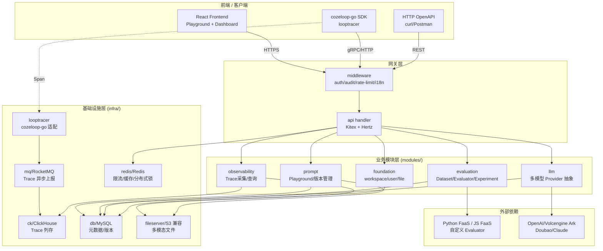
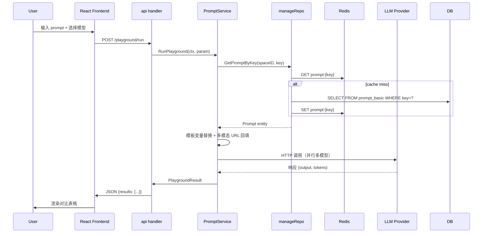
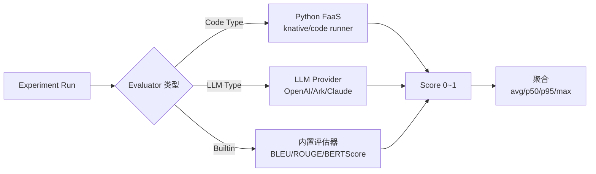
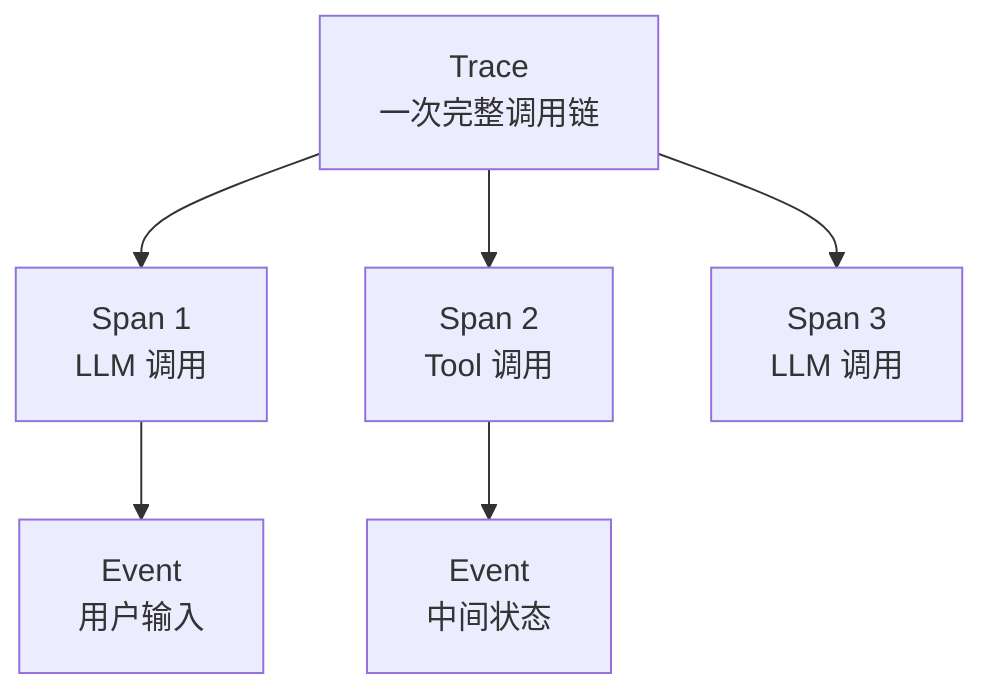
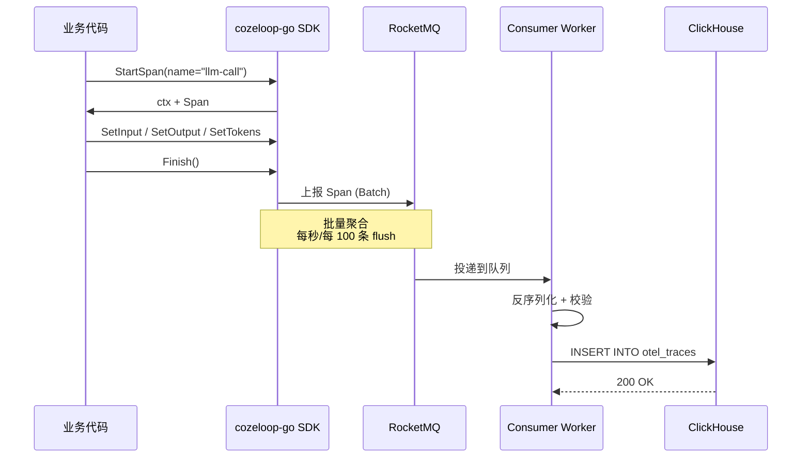
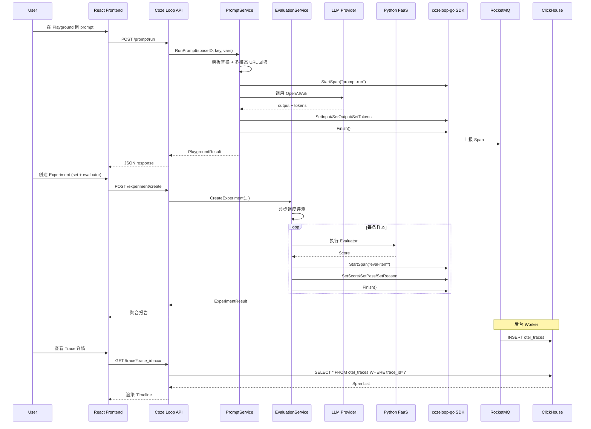

## 引子

2026 年的 AI 工程化战场已经从「能不能调通一个大模型 API」升级为「能不能让一群 Agent 持续稳定地跑在生产环境」。这条路上有三个绕不开的工程问题：

1. **Prompt 调优没有版本管理**：改一个 prompt 不知道哪个版本效果更好，A/B 测试靠工程师手动截图对比
2. **Evaluation 评测体系不闭环**：人工评审的几十条 case 无法扩展到万级数据集，自动化评测缺平台
3. **Trace 链路缺失**：线上 Agent 出问题只能看 LLM Provider 的日志，没有端到端可观测性

ByteDance 旗下的 Coze 团队在 2025 年 6 月开源了 **Coze Loop** —— 一句话定义：「**面向开发者的 AI Agent 全生命周期优化平台，从开发、调试、评估到监控**」。它在 GitHub 上线 15 个月就攒下了 ⭐5,715 stars，被 Coze 商业版作为底层基础设施支撑着抖音 / 飞书 / 剪映等场景的 Agent 业务。

它的与众不同之处在于 **Dev → Debug → Eval → Monitor 的四段式闭环**，每一段都对应一个独立模块（Prompt / Evaluation / Observability / Foundation），但共享同一套领域模型（`entity` / `repo` / `service`）。这种「**单体仓库 + 模块化拆分 + 统一数据底座**」的架构，与 Langfuse / Helicone 等单点工具形成鲜明对比。

本文将以源码为依据，深度拆解 Coze Loop 的五层架构、四段闭环、OpenAPI/SDK 双通道、Prompt 多模态处理、Evaluation 三件套、Trace 采集与回放、与同类项目（Langfuse/Helicone/RagaAI/Logfire）的设计差异。

## 项目定位与核心价值

Coze Loop 的官方定位语非常工程师化：

> **Next-generation AI Agent Optimization Platform**: Cozeloop addresses challenges in AI agent development by providing full-lifecycle management capabilities from development, debugging, and evaluation to monitoring.

我们将其解构成「**4 段闭环 × 3 类用户**」的二维价值矩阵：

| 阶段 | 核心能力 | 用户 |
|------|----------|------|
| **开发（Development）** | Prompt Playground 多模型对比 + 多模态文件上传 + 版本快照 | Prompt 工程师、应用开发者 |
| **调试（Debugging）** | Trace 链路查询 + Span 详情 + 输入输出对比 | 平台 SRE、应用 Owner |
| **评估（Evaluation）** | 评测集（Dataset）+ 评估器（Evaluator）+ 实验（Experiment）三件套 | 算法工程师、QA |
| **监控（Monitoring）** | 多维度聚合指标 + 异常告警 + 成本分析 | 业务方、运营 |

仓库关键指标（截至 2026-09-11）：

| 维度 | 数据 |
|------|------|
| ⭐ Stars | 5,715（15 个月） |
| 推送日期 | 2026-09-11（仍在活跃） |
| 主语言 | Go + TypeScript |
| License | Apache-2.0 |
| 仓库大小 | 39,058 KB |
| 模块数 | 6 个（foundation / prompt / evaluation / observability / llm / data） |
| 核心依赖 | ClickHouse + Redis + MySQL + RocketMQ + MinIO |
| 协议 | 自研 Kitex (Thrift RPC) + HTTP OpenAPI |

与已写过的 Logfire（pydantic/logfire，OTel wrapper）和 RagaAI Catalyst（raga-ai-hub/RagaAI-Catalyst，8 模块聚合）相比，Coze Loop 走的是 **「平台级基础设施 + 与 Coze 商业版同源」** 路线 —— 它不是某个团队的工具，而是 Coze 整个 Agent 业务的底座。

## 整体架构

Coze Loop 采用「**monorepo + 6 模块 + 4 段闭环**」的架构。我们从 GitHub 仓库目录树（7,238 个节点）就能清晰看出分层：

```
coze-loop/
├── backend/                      # Go 后端（Kitex RPC + HTTP OpenAPI）
│   ├── api/                      # HTTP 网关层
│   ├── cmd/main.go               # 进程入口（依赖注入 + 信号处理）
│   ├── infra/                    # 基础设施（ck/db/redis/mq/fileserver/looptracer）
│   ├── kitex_gen/                # Thrift IDL 生成代码
│   ├── loop_gen/                 # 内部 IDL 生成代码
│   ├── modules/                  # 业务模块
│   │   ├── foundation/           # 工作空间 / 用户 / 文件 / 权限
│   │   ├── prompt/               # Prompt Playground + 版本管理
│   │   ├── evaluation/           # 评测集 / 评估器 / 实验
│   │   ├── observability/        # Trace 采集 / 聚合 / 查询
│   │   ├── llm/                  # 多模型抽象 + FaaS 调度
│   │   └── data/                 # 数据集 / Dataset 模板
│   └── pkg/                      # 通用库（conf/logs/errorx/lang）
├── frontend/                     # TypeScript + React 前端（Playground / Dashboard）
├── release/deployment/           # docker-compose + Helm Chart + K8s manifests
├── idl/                          # Thrift IDL 源文件（前后端契约）
└── docs/                         # 用户文档 + 开发者文档
```

### 顶层架构 flowchart

我们用一张 Mermaid flowchart 展示从用户接入到数据落盘的全链路：



### 后端服务的依赖注入起点

`backend/cmd/main.go` 演示了一个非常干净的进程入口设计 —— **所有依赖通过 `newComponent(ctx)` 集中装配**：

```go
// 来自 backend/cmd/main.go:24-72
func main() {
    ctx := context.Background()
    c, err := newComponent(ctx)
    if err != nil {
        panic(err)
    }

    handler, err := api.Init(ctx,
        c.idgen, c.db, c.redis, c.redis, c.cfgFactory,
        c.mqFactory, c.objectStorage, c.batchObjectStorage,
        c.benefitSvc, c.auditClient, c.metric, c.limiterFactory,
        c.ckDb, c.translater, c.plainLimiterFactory)
    if err != nil {
        panic(err)
    }

    if err := initTracer(handler); err != nil { panic(err) }

    signalCtx, signalCancel := signal.NotifyContext(ctx, syscall.SIGTERM, syscall.SIGINT)
    defer signalCancel()

    r := registry.NewConsumerRegistryWithShutdown(signalCtx, c.mqFactory).
        Register(MustInitConsumerWorkers(c.cfgFactory, c.mqFactory,
                handler, handler, handler, handler))
    if err := r.StartAll(ctx); err != nil { panic(err) }

    go api.Start(handler)
    <-signalCtx.Done()
    // 30s 优雅停机
    stopCtx, stopCancel := context.WithTimeout(context.Background(), 30*time.Second)
    defer stopCancel()
    _ = r.StopAll(stopCtx)
}
```

这种「**配置 → 组件 → Handler → 注册消费 Worker → 启动 HTTP → 阻塞信号**」的 5 段式 main 函数，是字节系 Go 后端的标准模式（Kitex + RocketMQ + Hertz 三件套）。

## 核心模块一：Prompt Playground 与版本管理

Prompt 模块是 Coze Loop「**开发阶段**」的核心。它不是简单的 prompt CRUD，而是覆盖了：

1. **Playground 多模型对比**：同一 prompt 实时调用多个 LLM Provider 并排对比输出
2. **多模态文件处理**：图片 / 视频 URL 与 base64 内联双向转换
3. **版本快照**：每次保存生成不可变快照（commit-like）
4. **Template 模板**：变量插值 + Jinja-like 占位符

### Prompt 服务的设计哲学

Prompt 模块下的 `manage.go`（18KB）展示了「**Prompt Key = 唯一标识 + Prompt Snapshot = 不可变版本**」的两段式模型：

```go
// 来自 backend/modules/prompt/domain/service/manage.go:23-37
func (p *PromptServiceImpl) MGetPromptIDs(ctx context.Context,
    spaceID int64, promptKeys []string) (PromptKeyIDMap map[string]int64, err error) {
    promptKeyIDMap := make(map[string]int64)
    if len(promptKeys) == 0 {
        return promptKeyIDMap, nil
    }
    basics, err := p.manageRepo.MGetPromptBasicByPromptKey(ctx, spaceID, promptKeys,
        repo.WithPromptBasicCacheEnable())
    if err != nil {
        return nil, err
    }
    for _, basic := range basics {
        promptKeyIDMap[basic.PromptKey] = basic.ID
    }
    for _, promptKey := range promptKeys {
        if _, ok := promptKeyIDMap[promptKey]; !ok {
            return nil, errorx.NewByCode(prompterr.ResourceNotFoundCode,
                errorx.WithExtraMsg(fmt.Sprintf("prompt key: %s not found", promptKey)),
                errorx.WithExtra(map[string]string{"prompt_key": promptKey}))
        }
    }
    return promptKeyIDMap, nil
}
```

**关键设计**：
- `WithPromptBasicCacheEnable()` —— 显式开启缓存策略
- **强一致校验**：传入的 promptKey 必须在库里找到，少一个就抛 `ResourceNotFoundCode`
- **结构化错误**：`errorx.WithExtra()` 把 prompt_key 透出到日志 / Trace

### 多模态文件双向转换

`manage.go` 后续展示了 `MCompleteMultiModalFileURL`（fileKey → URL 反查填充）和 `MConvertBase64DataURLToFileURI`（base64 → 上传转 URI）两条管道，避免前端把 base64 直接送进 LLM（OpenAI 不接受超过 5MB 的内联图片）。

### Prompt Playground 工作流时序



## 核心模块二：Evaluation 三件套

Evaluation 模块是 Coze Loop 的「**算法层核心**」，包含三个互锁的实体：

| 实体 | 作用 | 关键字段 |
|------|------|----------|
| **EvaluationSet（评测集）** | 评测样本集（带模板） | SpaceID / Name / Description / FieldSchemas / DatasetKey |
| **Evaluator（评估器）** | 评分函数（Code / LLM / 自定义 FaaS） | Type / Prompt / Code / ModelConfig |
| **Experiment（实验）** | 一次完整评测运行 | SetID / EvaluatorIDs / TargetType / Status |

### EvaluationSet 创建的服务实现

```go
// 来自 backend/modules/evaluation/domain/service/evaluation_set_impl.go:39-77
func (d *EvaluationSetServiceImpl) CreateEvaluationSet(ctx context.Context,
    param *entity.CreateEvaluationSetParam) (id int64, err error) {
    if param == nil {
        return 0, errorx.NewByCode(errno.CommonInternalErrorCode)
    }
    if param.TemplateDatasetID != nil {
        param.EvaluationSetSchema, err = d.templateService.BuildEvaluationSetSchemaFromTemplate(ctx,
            &entity.BuildEvaluationSetSchemaFromTemplateParam{
                SpaceID:           param.SpaceID,
                TemplateDatasetID: *param.TemplateDatasetID,
                RequestedSchema:   param.EvaluationSetSchema,
            })
        if err != nil { return 0, err }
    } else {
        clearFieldLocks(param.EvaluationSetSchema)
    }
    // 依赖底层 Dataset 服务（通过 RPC 适配）
    return d.datasetRPCAdapter.CreateDataset(ctx, &rpc.CreateDatasetParam{
        SpaceID:            param.SpaceID,
        Name:               param.Name,
        Desc:               param.Description,
        EvaluationSetItems: param.EvaluationSetSchema,
        BizCategory:        param.BizCategory,
        Session:            param.Session,
        DatasetType:        param.DatasetType,
        Tags:               param.Tags,
        DatasetKey:         param.DatasetKey,
        TemplateDatasetID:  param.TemplateDatasetID,
    })
}
```

**关键设计**：
1. **`sync.Once` 单例化**：上面的 `evaluationSetServiceOnce` 确保测试和生产都不会重复构造 `EvaluationSetServiceImpl`
2. **模板注入**：`BuildEvaluationSetSchemaFromTemplate` 让用户从模板快速生成 schema（如「客服对话评测集」模板已经定义好 `query / response / expected_intent` 三个字段）
3. **RPC 抽象**：不直接调 DB，通过 `datasetRPCAdapter` 把 Dataset 的真实存储解耦 —— 未来切到 ClickHouse / Iceberg 都只改 Adapter
4. **`clearFieldLocks`**：非模板创建的 schema 默认所有字段 `Locked = false`，允许后续编辑；模板创建的字段默认 locked，避免用户误改破坏模板契约

### Evaluator 的三种执行方式

Coze Loop 的 Evaluator 是评测的核心，**支持三种执行后端**：



FaaS 模式让用户上传任意 Python / JS 代码作为评估器，平台在隔离沙箱里执行，**避免 Evaluator 污染主进程**。这是 Coze Loop 与 Langfuse（仅 LLM-as-judge）/ Helicone（无评估器）的关键差异。

## 核心模块三：Observability 链路追踪

Observability 是 Coze Loop 的「**SRE 视角核心**」，与 Prompt / Evaluation 互为正交：后两者是开发期工具，前者是运行期工具。

### Trace 抽象的三层模型



每个 Span 携带：
- **基础属性**：`TraceID / SpanID / ParentSpanID / WorkspaceID / SpanType / StartTime / Duration`
- **业务属性**：`SetInput / SetOutput / SetError / SetStatusCode`
- **用户属性**：`SetUserID / SetUserIDBaggage / SetMessageID / SetThreadID`
- **LLM 属性**：`SetPrompt / SetModelProvider / SetModel / SetTokens / SetCompletionTokens`

### cozeloop-go SDK 与 looptracer 适配层

`backend/infra/looptracer/tracer.go` 是 Coze Loop 的「**自家协议 ↔ cozeloop-go 官方 SDK**」桥接层：

```go
// 来自 backend/infra/looptracer/tracer.go:13-23
const (
    TraceContextHeaderParent    = "X-Cozeloop-Traceparent"
    TraceContextHeaderBaggage   = "X-Cozeloop-Tracestate"
    TraceContextHeaderParentW3C = "traceparent"      // W3C Trace Context 标准
    TraceContextHeaderBaggageW3C = "tracestate"
)

type TracerImpl struct {
    cozeloop.Client
}

func NewTracer(client cozeloop.Client) Tracer {
    return &TracerImpl{Client: client}
}
```

**关键设计**：
- **W3C Trace Context 兼容**：自动把内部的 `X-Cozeloop-*` 头与 W3C 标准的 `traceparent` / `tracestate` 互相转换
- **`InjectW3CTraceContext(ctx) map[string]string`**：把当前 Span 的 trace 信息注入到 HTTP 头，让跨服务调用能串联 trace

### Span 业务属性 API

`span.go` 提供了 18 个 `SetXxx` 方法，让业务代码把语义信息绑到 Span 上：

```go
// 来自 backend/infra/looptracer/span.go:13-83
type SpanImpl struct {
    LoopSpan cozeloop.Span
}

func (s SpanImpl) SetUserID(ctx context.Context, userID string) {
    s.LoopSpan.SetUserID(ctx, userID)
}

func (s SpanImpl) SetUserIDBaggage(ctx context.Context, userID string) {
    s.LoopSpan.SetUserIDBaggage(ctx, userID)
}

func (s SpanImpl) SetMessageID(ctx context.Context, messageID string) {
    s.LoopSpan.SetMessageID(ctx, messageID)
}

func (s SpanImpl) SetThreadID(ctx context.Context, threadID string) {
    s.LoopSpan.SetThreadID(ctx, threadID)
}

func (s SpanImpl) SetPrompt(ctx context.Context, prompt entity.Prompt) {
    s.LoopSpan.SetPrompt(ctx, prompt)
}

func (s SpanImpl) SetModelProvider(ctx context.Context, modelProvider string) {
    s.LoopSpan.SetModelProvider(ctx, modelProvider)
}
```

**关键设计**：
- **`SetXxx` + `SetXxxBaggage` 两套方法**：直接 Set 只影响当前 Span；Baggage 跨 Span 透传（用于在子 Span 里继续拿到 user_id / thread_id）
- **语义化 API**：`SetPrompt(entity.Prompt)` 直接吃业务对象而非字符串 —— SDK 层做了对象 → JSON 序列化

### noopTracer：开发期的零开销 fallback

```go
// 来自 backend/infra/looptracer/tracer.go:108-131
type noopTracer struct {
    c cozeloop.Client
}

func (d *noopTracer) StartSpan(ctx context.Context, name, spanType string,
    opts ...StartSpanOption) (context.Context, Span) {
    return ctx, &noopSpan{}
}

func (d *noopTracer) Flush(ctx context.Context) {}
func (d *noopTracer) Inject(ctx context.Context) context.Context { return ctx }
func (d *noopTracer) InjectW3CTraceContext(ctx context.Context) map[string]string {
    return map[string]string{}
}
```

**关键设计**：开发 / 单元测试场景下可以注入 `noopTracer`，所有 Span 操作都是零开销的 no-op，**避免 SDK 在测试代码里疯狂打印日志或写本地文件**。

## 核心模块四：looptracer + RocketMQ 异步上报

Trace 数据量巨大（每个 LLM 调用至少 1 个 Span），**不能同步写库**。Coze Loop 用 RocketMQ 做异步缓冲：



**关键设计**：
- **批量聚合**：SDK 内部 buffer 到一定大小 / 时间窗口才发 MQ，**减少 95%+ 的网络请求**
- **异步 ack**：Span finish 不阻塞业务，等 MQ 投递完成才落库
- **ClickHouse 列存**：亿级 Span 查询毫秒级返回（vs MySQL 的分钟级）

## 核心模块五：looptracer Provider 抽象与多框架集成

Coze Loop 不只是自给自足，它通过 **`cozeloop-go` SDK** 给所有 Go 业务代码提供 trace 上报能力。`provider.go` 展示了 provider 模式的标准设计：

```go
// 来自 backend/infra/looptracer/provider.go（节选）
type Provider interface {
    NewTracer() Tracer
}

// 默认实现：基于环境变量注入真实 cozeloop.Client
func NewDefaultProvider() Provider {
    return &defaultProvider{
        client: cozeloop.NewClient(cozeloop.WithWorkspaceID(os.Getenv("COZE_LOOP_WORKSPACE_ID"))),
    }
}
```

**这种 Provider 抽象的价值**：
1. **测试时**可以注入 mock provider，所有 Span 写入内存
2. **多租户**可以根据 workspaceID 选择不同上报后端
3. **跨框架**：Eino（Coze 自研 LLM 框架）/ LangChain Go / OpenAI SDK 都能通过 `WithChildOf` 串联 trace

## 端到端数据流

把上述 5 个模块串成完整用户故事（用户用 Playground 调 Prompt + 评测 + 上线观察）：



## 部署与运维

Coze Loop 提供 **docker-compose** 和 **Helm Chart** 两种部署方式。开箱即用的 5 个核心依赖：

```yaml
# 来自 release/deployment/docker-compose/docker-compose.yml 节选
services:
  app:
    profiles: ["app", "nginx"]
    image: "${COZE_LOOP_APP_IMAGE_REGISTRY}/${COZE_LOOP_APP_IMAGE_REPOSITORY}/${COZE_LOOP_APP_IMAGE_NAME}:${COZE_LOOP_APP_IMAGE_TAG}"
    depends_on:
      redis: { condition: service_healthy }
      mysql: { condition: service_healthy }
      clickhouse: { condition: service_healthy }
      minio: { condition: service_healthy }
      rocketmq-namesrv: { condition: service_healthy }
      rocketmq-broker: { condition: service_healthy }
      coze-loop-python-faas: { condition: service_healthy }
      coze-loop-js-faas: { condition: service_healthy }
    healthcheck:
      test: ["CMD", "sh", "/coze-loop/bootstrap/healthcheck.sh"]
      interval: 15s
      timeout: 5s
      retries: 30
      start_period: 10s
```

**关键设计**：
- **`profiles: [app, nginx]`**：通过 `docker-compose --profile app up` 选择性启动，避免开发期启动不必要的服务
- **8 个 `depends_on` + `condition: service_healthy`**：声明式等待依赖 ready，**避免 race condition**
- **`start_period: 10s`**：给应用 10s 启动缓冲后才开始 healthcheck，**避免 JVM/Go 冷启动期 false negative**
- **独立的 FaaS 服务**：Python 和 JS Evaluator 在隔离的 FaaS 容器里跑，**避免用户代码污染主进程**

## 与同类项目对比

我们把 Coze Loop 与 Langfuse / Helicone / RagaAI Catalyst / Logfire 做 7 维度横向对比：

| 维度 | Coze Loop | Langfuse | Helicone | RagaAI Catalyst | Logfire |
|------|-----------|----------|----------|-----------------|---------|
| **License** | Apache-2.0 | MIT | Apache-2.0 | Apache-2.0 | AGPL / 商业 |
| **主语言** | Go + TS | TS + Python | TS | Python | Python + Rust |
| **自研 trace** | ✅ cozeloop-go | ✅ Langfuse SDK | ✅ Helicone Proxy | ✅ RagaAI SDK | ❌ OTel wrapper |
| **Prompt 版本** | ✅ 完整 | ✅ 基础 | ❌ | ✅ 基础 | ❌ |
| **Evaluation** | ✅ Dataset/Evaluator/Exp 三件套 + FaaS | ✅ 基础（LLM-as-judge） | ❌ | ✅ 8 模块聚合 | ❌ |
| **多模型 Provider** | ✅ OpenAI/Ark/Claude | ✅ 50+ | ✅ 50+ | ✅ 30+ | ✅ 30+ |
| **自研 Evaluator FaaS** | ✅ Python + JS | ❌ | ❌ | ❌ | ❌ |
| **部署形态** | Docker + K8s Helm | Docker + Cloud | Cloud 优先 | 自托管 Dashboard | SaaS + 自托管 |

### 设计差异分析（不是罗列功能）

#### 差异一：闭环 vs 单点工具

- **Langfuse**：Trace + Prompt + Eval 三个独立 tab，但 Prompt 和 Eval 的关联弱（Eval 只能引用 Prompt ID）
- **Helicone**：纯 LLM Gateway + Trace，**没有 Prompt Playground**
- **Coze Loop**：把 Playground / Experiment / Trace 三个 tab **用 `entity` 互相打通** —— 在 Trace 详情页可以直接跳到 Prompt 版本对比，在 Experiment 报告里可以直接看到对应的 Trace ID

#### 差异二：Evaluator 三档执行后端

- **Langfuse**：仅支持 LLM-as-judge（必须调外部 LLM 评分）
- **RagaAI Catalyst**：Evaluator 用 Python 代码 + 内置 metrics
- **Coze Loop**：**Code FaaS + LLM + Builtin 三档**，用户可上传任意 Python/JS 函数，平台在隔离沙箱执行 —— **评估器可任意复杂**（如调内部 RPC、读数据库、跑 RAGAS 评分）

#### 差异三：商业版与开源版同源

- **Langfuse / Helicone**：开源版 + 云版功能有差异（云版有 RAG / Dashboard 高级特性）
- **Coze Loop**：**开源版就是 Coze 商业版底层**（剪映 / 飞书的 Agent 优化都用同一套），**核心模块全开源** —— 这是 ByteDance 在 Coze 上的策略：开放基础设施、运营商业分发渠道

#### 差异四：Trace 协议自研 vs 兼容 OTel

- **Logfire**：基于 OTel 上报，所有 OTel SDK 都能接入
- **Helicone**：自研 HTTP Proxy + Event 上报
- **Coze Loop**：自研 `cozeloop-go` SDK + W3C Trace Context 兼容 —— **Otel 数据可以反向转 W3C 头串联，但不能用 OTel SDK 直接上报**

#### 差异五：ClickHouse 列存 vs Postgres 行存

- **Langfuse**：Postgres（事务 + OLTP 友好）+ ClickHouse（Hobby 计划起）
- **Helicone**：Postgres + Snowflake
- **Coze Loop**：**ClickHouse 一把梭**（Trace 数据）+ MySQL（业务元数据）—— 亿级 Span 查询性能强，但事务能力弱于 Postgres

## 优缺点分析

我们按「**架构简洁性 / 扩展性 / 易用性**」vs「**性能 / 复杂度 / 维护性**」两侧对比：

| 维度 | Coze Loop 表现 |
|------|----------------|
| ✅ 架构简洁性 | 单体仓库 + 6 模块清晰分层；`cmd/main.go` 依赖注入集中装配；模块间通过 RPC Adapter 解耦 |
| ✅ 扩展性 | Provider 模式（Tracer / LLM / Storage）+ Evaluator FaaS；新 LLM Provider 加一个 Adapter 即可 |
| ✅ 易用性 | Prompt Playground 即开即用；Experiment 报告自动聚合；Trace 详情页时间轴可视化 |
| ⚠️ 性能 | ClickHouse 处理 Trace 查询性能强；RocketMQ 异步缓冲抗流量；FaaS Evaluator 冷启动 ~500ms |
| ⚠️ 复杂度 | 8 个 Docker 依赖（Redis/MySQL/ClickHouse/MinIO/RocketMQ × 2 + 2 FaaS）；本地开发启动门槛高 |
| ⚠️ 维护性 | 6 个业务模块 × 4 层架构（api/handler/service/repo），新需求改动跨多层；IDL 改一处需重新生成代码 |

### 与 Langfuse 对比的具体场景

| 场景 | Coze Loop 优势 | Langfuse 优势 |
|------|----------------|---------------|
| 本地 5 分钟跑起来 | ⚠️ 需 Docker Compose 起 8 服务 | ✅ 2 服务（Postgres + Langfuse） |
| 写自定义 Evaluator | ✅ 上传 Python FaaS | ⚠️ 仅 LLM-as-judge |
| 亿级 Span 查询 | ✅ ClickHouse 列存 | ⚠️ Postgres 慢，ClickHouse 需 Hobby 计划 |
| 与现有 OTel 系统集成 | ⚠️ 需用自研 SDK + W3C 头桥接 | ✅ 直接接 OTel collector |
| 多租户隔离 | ✅ WorkspaceID + Redis 限流 | ✅ Org/Project 双层 |

## 实践示例：用 Coze Loop SDK 上报一个 LLM 调用

假设你有一个 Go 业务服务，想把每次 OpenAI 调用的 trace 上报到 Coze Loop。完整流程只需 4 步：

### 1. 安装 SDK

```bash
go get github.com/coze-dev/cozeloop-go
```

### 2. 初始化 Tracer

```go
package main

import (
    "context"
    "github.com/coze-dev/cozeloop-go"
)

func main() {
    ctx := context.Background()
    client, err := cozeloop.NewClient(
        cozeloop.WithWorkspaceID(os.Getenv("COZE_LOOP_WORKSPACE_ID")),
    )
    if err != nil { panic(err) }
    defer client.Flush(ctx)

    handleUserQuery(ctx, client, "user-123", "你好，请介绍下 Coze Loop")
}

func handleUserQuery(ctx context.Context, client cozeloop.Client, userID, query string) {
    // 启动根 Span
    ctx, span := client.StartSpan(ctx, "user-query", "llm",
        cozeloop.WithUserID(userID),
        cozeloop.WithMessageID(uuid.NewString()),
    )
    defer span.Finish(ctx)

    span.SetInput(ctx, query)

    // 调用 OpenAI
    resp, err := callOpenAI(ctx, query)
    if err != nil {
        span.SetError(ctx, err)
        return
    }
    span.SetOutput(ctx, resp)
    span.SetTokens(ctx, resp.PromptTokens, resp.CompletionTokens)
}

func callOpenAI(ctx context.Context, prompt string) (*OpenAIResponse, error) {
    // 业务实现：调 OpenAI API 并返回
    return &OpenAIResponse{Output: "...", PromptTokens: 100, CompletionTokens: 50}, nil
}
```

### 3. 用 Playground 创建 Prompt 并通过 SDK 引用

```go
import "github.com/coze-dev/coze-loop/backend/modules/prompt/domain/repo"

// 在 Coze Loop Playground 里创建一个 prompt：key = "greeting"
// 模板：Hello {{.name}}, welcome to Coze Loop!
func renderGreeting(ctx context.Context, client cozeloop.Client, name string) (string, error) {
    ctx, span := client.StartSpan(ctx, "render-greeting", "prompt")
    defer span.Finish(ctx)

    // 通过 HTTP OpenAPI 拉取最新版本 prompt
    prompt, err := fetchPromptByKey(ctx, "greeting")
    if err != nil { return "", err }

    span.SetPrompt(ctx, prompt.ToEntity())

    return prompt.Render(map[string]string{"name": name}), nil
}
```

### 4. 用 Experiment 跑评测

```bash
# 通过 OpenAPI 创建一个 Experiment
curl -X POST http://localhost:8882/api/v1/experiment/create \
  -H "Authorization: Bearer $TOKEN" \
  -d '{
    "space_id": 12345,
    "name": "greeting-quality-v1",
    "evaluation_set_id": 67890,
    "evaluator_ids": [111, 222],
    "target_type": "prompt",
    "target_id": "greeting"
  }'
```

5 分钟后在 Dashboard 查看聚合报告：每条样本的得分、通过率、平均分位数、最差 5 条样本的可点击 Trace 链接。

## 趋势判断

基于 Coze Loop 的架构与定位，我们对未来 6-12 个月有 4 个趋势判断：

1. **「DevOps for AI Agent」标准化**：Coze Loop 的 Dev → Debug → Eval → Monitor 四段闭环会逐渐成为 AI Agent 平台的事实标准。Langfuse / Helicone / Arize 都在朝这个方向补齐，**未来 1 年内不会有「只剩 Trace 不做 Eval」的平台生存空间**。

2. **Evaluator FaaS 成为差异化主战场**：能不能让用户上传任意 Python / JS 作为评估器，是 Coze Loop vs Langfuse / Helicone 的核心差异点。**未来 Evaluator FaaS 会演化为「Agent 评测 DSL」**（类似 GitHub Actions 的 YAML 步骤编排），覆盖在线 A/B、离线回放、人工标注三条管线。

3. **ClickHouse 成为 AI 可观测性事实存储**：Postgres 撑不住亿级 Span，Snowflake 太贵。**ClickHouse 的列存 + 冷热分层 + 物化视图**让它成为 AI Trace 场景的最优解 —— 2026 年下半年会有更多 AI 平台从 Postgres 迁到 ClickHouse。

4. **Prompt 版本管理从「可选」变「必选」**：当 Agent 业务跑过 100 万次调用时，Prompt 改动就是核心风险点。**Coze Loop 的「Prompt Key + Snapshot」两段式模型会成为行业标准**，类似 Git 之于代码。

## 关键资源

| 资源 | 链接 |
|------|------|
| GitHub 仓库 | https://github.com/coze-dev/coze-loop |
| License | Apache-2.0 |
| 主语言 | Go + TypeScript |
| 官方文档 | https://github.com/coze-dev/coze-loop/wiki |
| 中文 README | https://github.com/coze-dev/coze-loop/blob/main/README.cn.md |
| DeepWiki | https://deepwiki.com/coze-dev/coze-loop |
| Docker Compose | https://github.com/coze-dev/coze-loop/tree/main/release/deployment/docker-compose |
| Helm Chart | https://github.com/coze-dev/coze-loop/tree/main/release/deployment/helm-chart |
| Go SDK | https://github.com/coze-dev/cozeloop-go |
| 商业版 | https://www.coze.cn/loop |

---

**一句话总结**：Coze Loop 把 AI Agent 工程化的「**开发 → 调试 → 评测 → 监控**」四段闭环，做成了一个 Apache-2.0 开源的平台 —— 它不是某个团队的工具，而是 Coze 整个 Agent 业务的底座；与 Logfire 的「OTel 包装」、RagaAI 的「8 模块聚合」走的是完全不同的路线 —— **把商业版的核心全开源**，让任何团队都能自托管一套 Coze 商业版同源的 Agent 优化平台。
