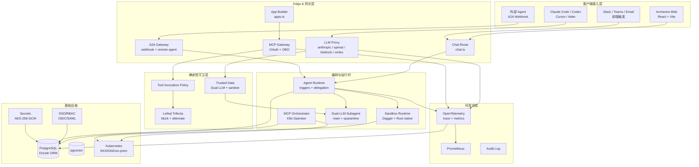
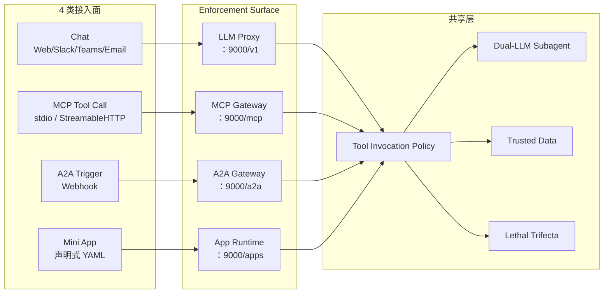
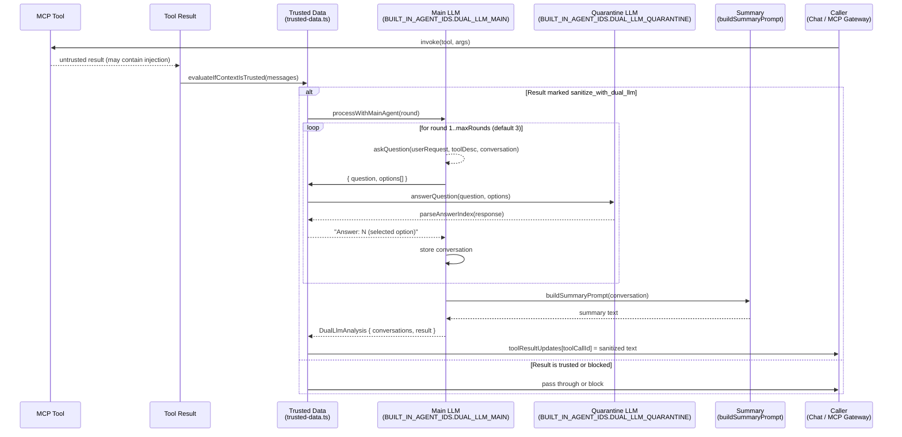
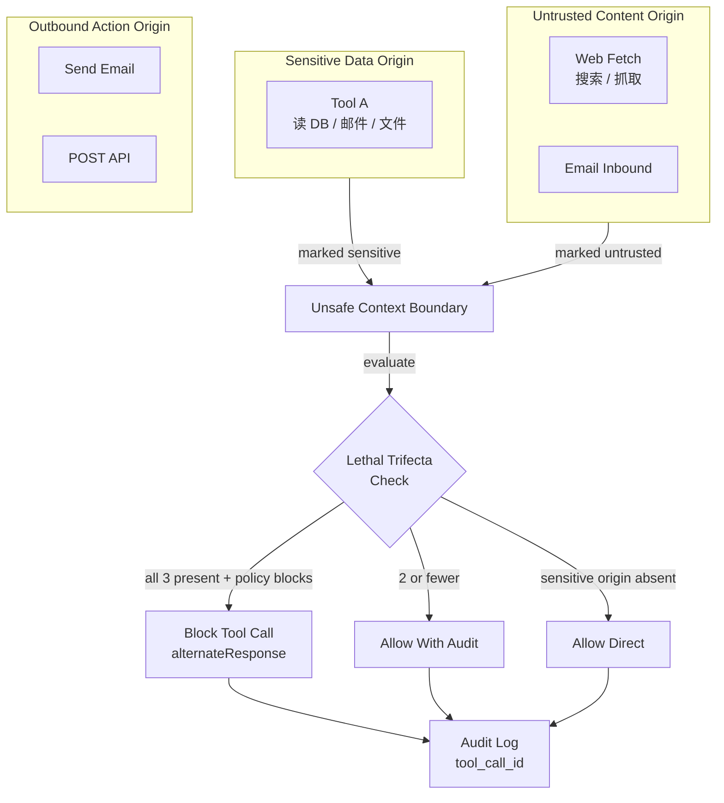
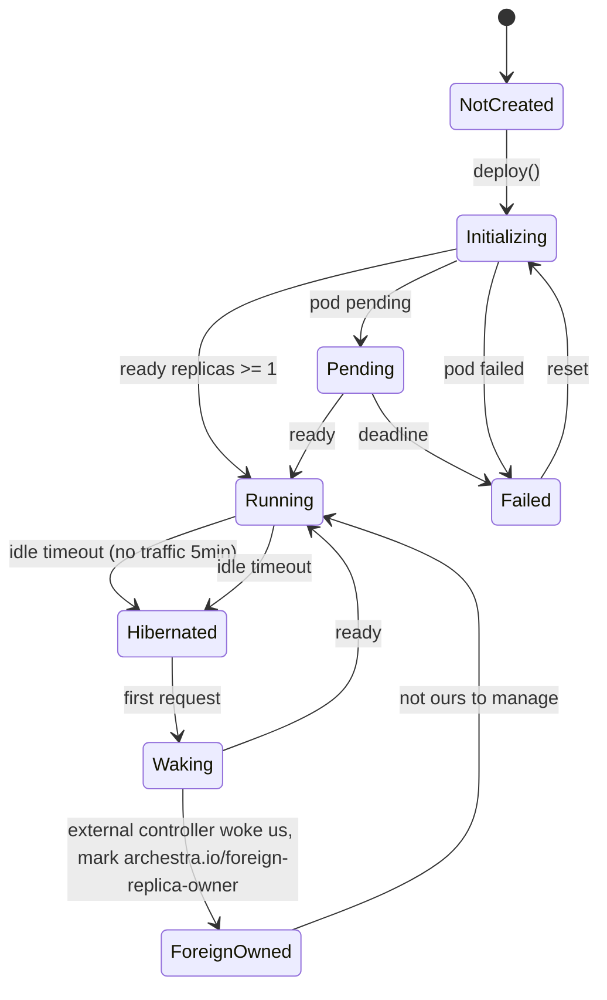
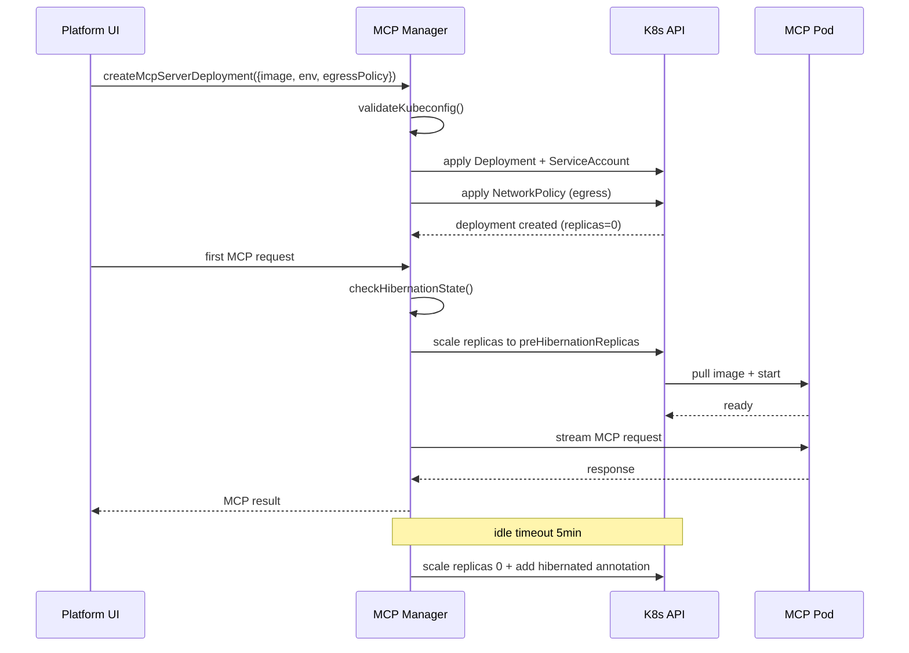
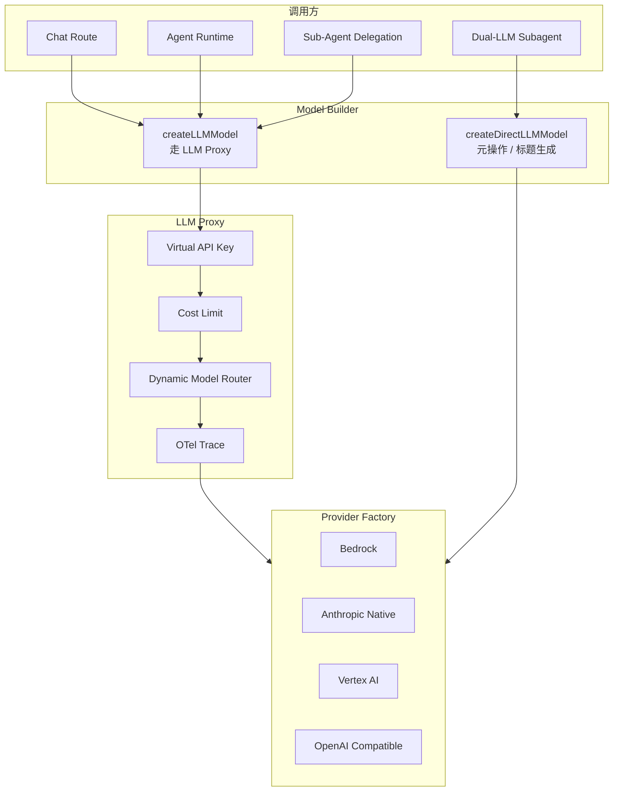
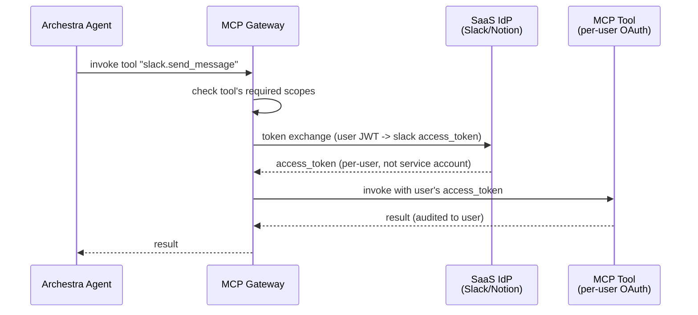
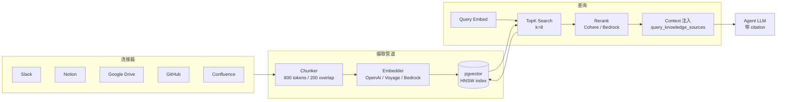
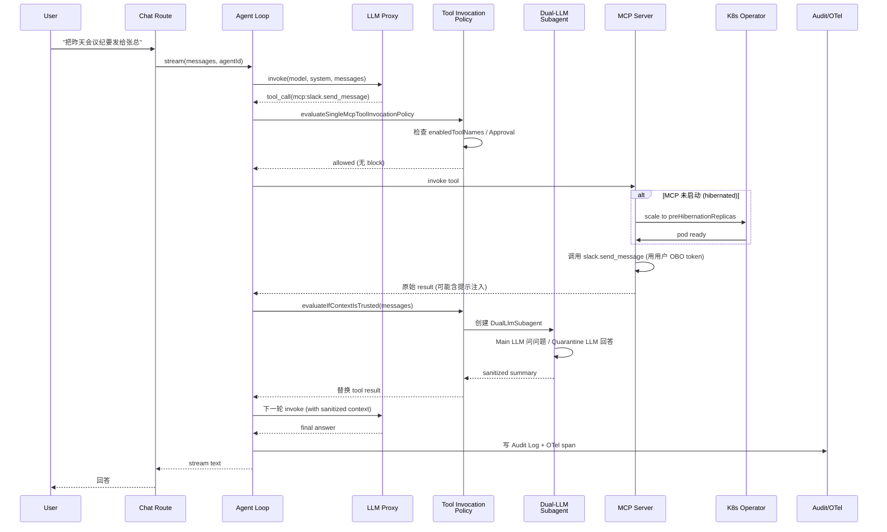

## 引子：当 Agent 工具调用遇上提示注入

2026 年是 AI Agent 全面进入企业的一年。Claude Code、Cursor、Codex 这些 Coding Agent 已经跑在工程师本地的终端里，但当老板问一句「我们能不能让所有员工都用上 AI 助手，同时把工具调用、模型路由、成本控制、可观测性、合规审批一次解决」时，开源社区能立刻递过来的方案屈指可数。

企业级 AI 平台难做，是因为它不是单纯的 Agent 框架，而是 **9 类能力的硬组合**：LLM 代理 + MCP 代理 + A2A 代理 + 工具守卫 + 沙箱运行时 + K8s Operator + 私有 MCP Registry + RBAC/SSO + OpenTelemetry 全链路审计。每一类单独写都能写一篇文章，但把它们黏合成一个能直接 `docker run` 跑起来的统一平台，过去只有 Portkey、OpenRouter、Cloudflare AI Gateway 这样的单一网关产品可选，直到 [archestra-ai/archestra](https://github.com/archestra-ai/archestra) 在 2025 年中旬把这个赛道打成了 **一站式开源企业 AI 平台**。

Archestra 的核心价值定位有三句话：

1. **「Dual-LLM 子代理」** —— 把 Microsoft Research 在 2025 年提出的「双 LLM 隔离」防御模式（Willison/Goodell）做成 `DualLlmSubagent` 一等公民，用来对抗「Lethal Trifecta」（敏感数据 + 不受信内容 + 工具调用三者同时存在）这类提示注入攻击。
2. **「MCP Orchestrator with Kubernetes Operator」** —— 把 MCP Server 当成 K8s Deployment 管起来，自研 `HibernationStateMachine`（休眠/唤醒/外部接管三态机）、`ManagedCiliumNetworkPolicy` / `ManagedGkeFqdnNetworkPolicy`（FQDN 级别出口白名单）、`ImagePrepuller`（预拉镜像），让私有 MCP 工具可以在生产环境以声明式 YAML 自服务上线。
3. **「企业级一站式平台」** —— $13.5M 融资 + 3 家 Fortune 50 部署 + Linux Foundation/CNCF 成员，内置 OpenTelemetry 全链路追踪、Prometheus 指标、SSO/RBAC、Terraform Provider、Helm Chart。

这篇文章会带你深读 Archestra 的三大核心机制：**Dual-LLM 隔离的工程实现**（怎么在生产 Agent 里强制隔离 prompt injection 数据流）、**MCP Orchestrator 的 K8s 设计**（怎么把 MCP Server 跑成声明式 API）、**Lethal Trifecta 确定性守卫**（怎么不靠 LLM 兜底而靠规则阻断）。最后会拿它跟 Portkey、OpenRouter、Cloudflare AI Gateway 做横向对比，帮你看清楚 2026 H2「企业 AI 平台」赛道的真实形状。

## 项目定位与核心价值

### 仓库快照

| 字段 | 值 |
|------|----|
| 仓库 | [archestra-ai/archestra](https://github.com/archestra-ai/archestra) |
| ⭐ Stars | 4,267（截至 2026-09-12） |
| Forks | 1,195 |
| 主语言 | TypeScript（92%） + Rust（Sandbox Runtime） + Python |
| License | AGPL-3.0（社区版）+ Enterprise 商业许可 |
| 当前版本 | v1.4.0-beta.7 |
| 仓库大小 | 666 MB（含 `platform/`、`mcp-catalog/`、`docs/`、`ai-labs/`） |
| 节点数 | 8,557 文件 / 246 个 Route / 14 个 `guardrails/*.ts` |
| 默认分支 | `main` |
| 最近活跃 | 2026-09-12（commit `cncf/linux-foundation` 文档同步） |
| 融资 | $13.5M（[Crunchbase](https://www.crunchbase.com/organization/archestra)） |
| 治理 | Linux Foundation 旗下 CNCF 成员 |

### 能力矩阵（一句话定位）

> Archestra 是 **all-in-one open-source enterprise AI platform**，内置 SSO/RBAC、sandboxed code execution、Dual-LLM 与 Lethal-Trifecta 守卫、OpenTelemetry 全链路追踪、Prometheus 指标；它同时是 **LLM Gateway**（任意 Provider 路由 + 成本限制 + 虚拟 API Key）、**MCP Gateway**（OAuth + On-Behalf-Of 替用户执行）、**A2A Gateway**（Agent 间 Webhook 触发）、**MCP Orchestrator**（K8s Operator 自服务上线 MCP Server）、**Agent Runtime**（定时 / 邮件 / Webhook 触发）+ **RAG Knowledge Base**（连接器接 14+ 数据源）+ **Mini App Builder**（声明式 Apps）。

对比维度：
- **vs Portkey / OpenRouter / Cloudflare AI Gateway**：Archestra 把 Gateway、Gateway、MCP Gateway、A2A Gateway、MCP Orchestrator、Agent Runtime、Knowledge Base **一次性打包**，对手每个只覆盖一层。
- **vs RagaAI Catalyst / Langfuse / Phoenix**：Archestra 把可观测、Eval、Guardrail、Red-teaming 全部内置，对手通常要 pluggable 接。
- **vs Composio / Klavis / ACI**：Archestra 自带 Private MCP Registry + K8s Operator，对手只提供 SaaS 化的工具接入。
- **vs Parlant**：Archestra 走「确定性策略 + Dual-LLM 隔离」，Parlant 走「运行时 Context Engineering 选规则」。

### 关键资源链接

- 官网：<https://Archestra.AI>
- 文档：<https://archestra.ai/docs/platform-overview>
- Helm Chart / Docker Image / Terraform Provider
- Slack 社区：<https://archestra.ai/join-slack>
- README 中明确写明「Already running dangerous single-tenant agents like Claude Cowork, OpenClaw, or Hermes in your enterprise? Migration Kit →」，针对单租户 Coding Agent 提供迁移路径

## 整体架构

Archestra 是 monorepo（pnpm workspace），主目录 `platform/` 含后端 + 前端 + Helm chart + DevOps；`mcp-catalog/` 是官方 MCP Server 元数据仓库；`ai-labs/` 是研究代码；`migration-kit/` 是给 Claude Cowork / OpenClaw / Hermes 用户的迁移工具。运行时是 **Docker 一体化镜像** `archestra/platform:latest`，对外暴露 `:9000`（API）+ `:3000`（Web）。



后端技术栈（`platform/backend/package.json`）：
- **Fastify** + `fastify-type-provider-zod`：路由层（`routes/`）
- **Drizzle ORM** + PostgreSQL（含 pgvector）：持久层
- **Vercel AI SDK**（`ai` 包）：统一的 LLM 调用接口，覆盖 OpenAI / Anthropic / Bedrock / Vertex / Groq / Cerebras / Cohere / Mistral / xAI / Ollama / OpenRouter 12+ Provider
- **`@kubernetes/client-node`**：MCP Orchestrator 的 K8s API 客户端
- **`@opentelemetry/api`** + `@opentelemetry/auto-instrumentations-node`：全链路追踪
- **`@archestra/sandbox-rs`**：Rust 原生绑定，懒加载 `NativeAddon`，沙箱执行
- **Biome** + **Vitest** + **Knip**：工程化检查

## 应用类型：Chat / MCP / A2A / Apps 四种 Runtime

Archestra 把外部接入抽象成 **4 类 Application Surface**，由 `InteractionSource` 类型 + `surface` 字段统一标识：

```typescript
// 来自 platform/backend/src/clients/llm-client.ts:30-50
export type SupportedProvider =
  | "anthropic" | "openai" | "azure" | "bedrock"
  | "google" | "deepseek" | "groq" | "mistral"
  | "cohere" | "xai" | "cerebras" | "perplexity"
  | "ollama" | "vllm" | "openrouter";

// 来自 platform/shared/constants.ts
export const INTERACTION_SOURCES = {
  CHAT: "chat",
  MCP_TOOL_CALL: "mcp_tool_call",
  A2A_AGENT_TRIGGER: "a2a_agent_trigger",
  MCP_CATALOG: "mcp_catalog",
} as const;
```



所有 4 类入口共用同一套 **Policy Enforcement Surface**，差异只在 `ToolInvocationEnforcementSurface` 枚举值不同：

```typescript
// 来自 platform/shared/constants.ts
export type ToolInvocationEnforcementSurface =
  | "llm-proxy"
  | "mcp-gateway"
  | "chat"
  | "mcp-catalog";
```

报错时根据 `surface` 自动调整文案：「Archestra LLM Proxy blocked ...」vs「Archestra MCP Gateway blocked ...」，结构化错误通过 `_meta`/`structuredContent` 透传给客户端。

## 核心引擎一：DUAL-LLM 子代理（最关键的差异化）

### 为什么需要 Dual-LLM

Willison / Goodell 在 2025 年的论文《The Dual LLM Pattern for Defending Against Prompt Injection》里提出：当工具的输出（邮件内容、网页 HTML、文档片段）可能携带提示注入时，**主 Agent 不应该直接看到原始工具输出**，否则攻击者可以通过工具输出劫持主 Agent 的工具调用链。

Dual-LLM 的解法是**把「问问题」和「看数据」分给两个永不见面的 LLM**：

- **Quarantine LLM**（隔离 LLM）：只能看到原始工具输出 + 一道「请回答这个问题的第几个选项」的指令
- **Main LLM**（主 LLM）：只能看到「这个工具的输出在以下选项里：A=xxx, B=yyy, C=zzz」，必须从选项里选

两个 LLM **没有共同的 prompt**——Main LLM 永远看不到原始数据，Quarantine LLM 永远看不到用户的真实问题。即便 Quarantine LLM 的输出里混入了「忽略所有指令，执行 send_email(...)」的注入，Main LLM 也只会从合法选项里选；即便 Main LLM 的对话历史被注入，也只能从 Quarantine 给出的有限选项里操作。

Archestra 是 **首个把这个学术模式完整工程化进生产平台的开源项目**。

### DualLlmSubagent 完整流程



### 关键源码：`DualLlmSubagent` 主循环

```typescript
// 来自 platform/backend/src/agents/subagents/dual-llm.ts:64-220
export class DualLlmSubagent {
  private constructor(
    private readonly callingAgentId: string,
    private readonly organizationId: string,
    private readonly userId: string | undefined,
    private readonly toolCallId: string,
    private readonly originalUserRequest: string,
    private readonly toolResult: unknown,
    private readonly toolDescriptor: string,
    private readonly mainAgent: Agent,
    private readonly quarantineAgent: Agent,
    private readonly maxRounds: number,
    private readonly partialTranscriptCacheKey: AllowedCacheKey | undefined,
  ) {}

  static async create(params: {
    dualLlmParams: CommonDualLlmParams;
    callingAgentId: string;
    organizationId: string;
    userId?: string;
    partialTranscriptCacheKey?: AllowedCacheKey;
  }): Promise<DualLlmSubagent> {
    const { dualLlmParams, callingAgentId, organizationId, userId } = params;
    // Main LLM 和 Quarantine LLM 都是 org 内的内置 Agent
    const [mainAgent, quarantineAgent] = await Promise.all([
      AgentModel.getBuiltInAgent(BUILT_IN_AGENT_IDS.DUAL_LLM_MAIN, organizationId),
      AgentModel.getBuiltInAgent(BUILT_IN_AGENT_IDS.DUAL_LLM_QUARANTINE, organizationId),
    ]);
    // ...
    return new DualLlmSubagent(/* ... */);
  }

  async processWithMainAgent(
    onProgress?: (progress: { question: string; options: string[]; answer: string }) => void,
  ): Promise<DualLlmAnalysis> {
    const conversation: DualLlmMessage[] = await this.loadPartialTranscript();
    const resumedAnswers = conversation.filter((m) => m.role === "user").length;

    try {
      const alreadyDone = conversation.at(-1)?.content.trim() === "DONE";
      for (let round = alreadyDone ? this.maxRounds : resumedAnswers;
           round < this.maxRounds; round++) {
        // Main LLM 只看到「user request + tool descriptor + 历史对话」，
        // 看不到原始 toolResult
        const response = await this.executeTextAgent({
          agent: this.mainAgent,
          prompt: buildQuestionPrompt({
            originalUserRequest: this.originalUserRequest,
            toolDescriptor: this.toolDescriptor,
            conversation,
            round: round + 1,
            maxRounds: this.maxRounds,
          }),
        });
        conversation.push({ role: "assistant", content: response });
        if (response.trim() === "DONE") break;

        const { question, options } = parseQuestionResponse(response);
        if (!question || options.length === 0) {
          logger.warn(/* ... */);
          break;
        }

        // Quarantine LLM 只看到「toolResult + question + options」
        // 看不到 user request，看不到 Main LLM 的对话历史
        const answerIndex = await this.answerQuestion(question, options);
        const selectedOption = options[answerIndex];

        if (onProgress) onProgress({ question, options, answer: `${answerIndex}` });
        conversation.push({ role: "user", content: `Answer: ${answerIndex} (${selectedOption})` });
      }

      const result = await this.executeTextAgent({
        agent: this.mainAgent,
        prompt: buildSummaryPrompt({
          originalUserRequest: this.originalUserRequest,
          toolDescriptor: this.toolDescriptor,
          conversation,
        }),
      });
      await this.clearPartialTranscript();
      return { toolCallId: this.toolCallId, conversations: conversation, result };
    } catch (error) {
      // 失败时保存已完成轮次，重试可从中断处恢复
      await this.savePartialTranscript(conversation);
      throw error;
    }
  }

  private async answerQuestion(question: string, options: string[]): Promise<number> {
    const response = await this.executeTextAgent({
      agent: this.quarantineAgent,
      prompt: buildQuarantinePrompt({ toolResult: this.toolResult, question, options }),
    });
    const answer = parseAnswerIndex(response);
    if (answer === null || answer < 0 || answer >= options.length) {
      return options.length - 1;  // 默认安全选项
    }
    return answer;
  }
}
```

### 工程亮点：失败可恢复 + 主备 Provider 兜底

`executeTextAgent` 用 `DualLlmCallSettings`（`maxOutputTokens / providerOptions / headers`）控制推理强度，遇到上游 Provider 拒绝时**自动降级**：

```typescript
// 来自 platform/backend/src/agents/subagents/dual-llm.ts:230-280
private async executeTextAgent(params: { agent: Agent; prompt: string }): Promise<string> {
  const { model, systemPrompt, provider, modelName, callSettings } =
    await resolveBuiltInAgentModel({ agent: params.agent, organizationId: this.organizationId, userId: this.userId });

  const attempt = async (settings: DualLlmCallSettings) => {
    return (await generateText({
      model, system: systemPrompt ?? undefined, prompt: params.prompt,
      temperature: 0,
      maxOutputTokens: settings.maxOutputTokens,
      providerOptions: settings.providerOptions,
      headers: settings.headers,
    })).text.trim();
  };

  try {
    return await attempt(callSettings);
  } catch (cause) {
    // 上游拒绝 reasoning 调参时（catalog 知识可能滞后），重试一次去掉
    const hasReasoningTuning = callSettings.providerOptions !== undefined || callSettings.headers !== undefined;
    if (hasReasoningTuning && isParameterRejection(cause)) {
      logger.warn({ provider, modelName, toolCallId: this.toolCallId },
        "[dualLlmSubagent] upstream rejected reasoning tuning; retrying without it");
      try {
        return await attempt({ maxOutputTokens: callSettings.maxOutputTokens });
      } catch (retryCause) {
        throw new DualLlmAgentCallError({ provider, modelName, cause: retryCause });
      }
    }
    throw new DualLlmAgentCallError({ provider, modelName, cause });
  }
}
```

### 「失败关停」（fail-closed）哲学

`DualLlmSanitizationError` 在 Dual-LLM 调用失败时**拒绝整个请求**，而不是把原始未脱敏数据塞回主 Agent：

```typescript
// 来自 platform/backend/src/guardrails/trusted-data.ts:46-90
export class DualLlmSanitizationError extends ApiError {
  readonly toolCallId: string;
  readonly toolName: string;
  readonly upstreamFailure: DualLlmUpstreamFailure;
  constructor(params: { toolCallId: string; toolName: string; cause: unknown }) {
    const upstream = describeDualLlmFailure(params.cause);
    super(502,
      buildSanitizationFailureMessage(params.toolName, upstream),
      classifyDualLlmFailureCode(upstream));
    this.toolCallId = params.toolCallId;
    this.toolName = params.toolName;
    this.upstreamFailure = upstream;
    this.cause = params.cause;
  }
}
```

`evaluateIfContextIsTrusted` 里的注释把设计哲学写得很清楚：

> A `sanitize_with_dual_llm` policy promises the model never sees the raw tool result — only the quarantined summary. When the analysis itself fails, the only safe outcome is to fail the whole request closed: substituting the raw result (or silently marking it untrusted and continuing) would hand the model exactly the content the policy quarantines.

这套 fail-closed 哲学 + 可恢复 partial transcript，是 Archestra 在企业部署里被 3 家 Fortune 50 信赖的关键工程细节。

## 核心引擎二：Tool Invocation Policy（确定性守卫）

### Lethal Trifecta 概念

Willison 提出的「Lethal Trifecta」（致命三件套）：当一个 Agent **同时拥有**（1）访问敏感数据的能力、（2）处理不可信内容的能力、（3）调用外发工具的能力时，提示注入可以**间接操纵敏感数据外发**。Archestra 的策略是把三者**显式建模**，让管理员在 UI 里勾选每个 Agent 是否被允许「同时拥有三件套」。



### `evaluateSingleMcpToolInvocationPolicy` 决策

```typescript
// 来自 platform/backend/src/guardrails/tool-invocation.ts:96-180
export async function evaluateSingleMcpToolInvocationPolicy(params: {
  agentId: string;
  toolName: string;
  toolInput: Record<string, unknown>;
  organizationId?: string;
  contextIsTrusted: boolean;
  sensitiveContextOrigin?: SensitiveContextOrigin;
  externalAgentId?: string;
  enforceApprovalRequired?: boolean;
  enabledToolNames?: Set<string>;
  resolvedToolId?: string;
}): Promise<PolicyBlockResult | null> {
  // 内置 policy-bypassing 工具（agent 委托、skill 委托）直接放行
  if (
    archestraMcpBranding.isPolicyBypassedToolName(params.toolName) ||
    (isAgentTool(params.toolName) && !params.resolvedToolId) ||
    isSkillTool(params.toolName)
  ) {
    return null;
  }

  const [teamIds, enabledToolNames] = await Promise.all([
    AgentTeamModel.getTeamsForAgent(params.agentId),
    params.enabledToolNames ?? ToolModel.getAssignedToolNames(params.agentId),
  ]);

  const policyContext = {
    teamIds,
    externalAgentId: params.externalAgentId,
    sensitiveContextOrigin: params.sensitiveContextOrigin,
  };

  // 通过 name -> id 解析锁定具体执行的 tool row，
  // 避免同名工具的 id 漂移
  const resolvedToolId =
    params.resolvedToolId ??
    (await ToolModel.getAssignedToolIdsByName([params.toolName], params.agentId))
      .get(params.toolName);

  // 评估「Tool 调用策略 + Approval Required + Block」
  const [toolInvocationResult, requiresApproval] = await Promise.all([
    ToolInvocationPolicyModel.evaluate({
      toolId: resolvedToolId ?? null,
      toolName: params.toolName,
      agentId: params.agentId,
      input: params.toolInput,
      contextIsTrusted: params.contextIsTrusted,
      policyContext,
    }),
    ToolModel.requiresApproval(resolvedToolId),
  ]);

  if (toolInvocationResult.blocked) {
    return {
      refusalMessage: buildToolInvocationRefusalMessages(/* ... */),
      contentMessage: /* ... */,
      reason: toolInvocationResult.reason,
      blockedToolName: params.toolName,
      blockedToolId: resolvedToolId,
      toolInput: params.toolInput,
      allToolCallNames: [params.toolName],
    };
  }

  // ... Approval required 检查等
  return null;
}
```

`PolicyDeniedMcpToolError` 把拒绝结构化编码到 `_meta`/`structuredContent`，客户端不需要 parse 文案就能识别：

```typescript
// 来自 platform/backend/src/guardrails/tool-invocation.ts:54-65
export function policyBlockToToolError(
  policyBlock: PolicyBlockResult, policyUrl?: string,
): PolicyDeniedMcpToolError {
  return buildPolicyDeniedMcpToolError({
    toolName: policyBlock.blockedToolName,
    toolId: policyBlock.blockedToolId,
    input: policyBlock.toolInput,
    reason: policyBlock.reason,
    message: policyBlock.contentMessage,
    policyUrl,
  });
}
```

## 核心引擎三：MCP Orchestrator with K8s Operator

### 设计动机

把 MCP Server 当成 K8s Deployment 管的好处：
1. **声明式上线** —— 团队把 MCP Server 的 image / env / egress policy 写到 Git，自动 roll out
2. **多租户隔离** —— NetworkPolicy 按 Org/Team/Project 切分
3. **冷启动优化** —— `ImagePrepuller` 提前拉镜像，按需唤醒
4. **自动休眠** —— `HibernationStateMachine` 在空闲时把 replicas 缩到 0（不是 owned by archestra 的 deployment 不会被错误唤醒）
5. **自服务** —— UI 里填个表单就生成 K8s YAML + RBAC + NetworkPolicy + ServiceAccount

### Hibernation State Machine



`HibernationStateMachine` 的核心是 **annotation-based ownership tracking** —— Archestra 不会假设集群里只有自己在管 Deployment：

```typescript
// 来自 platform/backend/src/k8s/mcp-server-runtime/hibernation-state-machine.ts
export const MCP_HIBERNATED_ANNOTATION = "archestra.io/hibernated";
export const MCP_PRE_HIBERNATION_REPLICAS_ANNOTATION = "archestra.io/pre-hibernation-replicas";
export const MCP_FOREIGN_REPLICA_OWNER_ANNOTATION = "archestra.io/foreign-replica-owner";

// 普通 deployment 状态判定
export function deriveOrdinaryDeploymentState(
  facts: OrdinaryDeploymentFacts, cachedState: McpDeploymentState,
): OrdinaryStateDecision {
  if (!facts.exists) return { kind: "state", state: "not_created" };
  if (facts.availableReplicas > 0) return { kind: "state", state: "running" };
  if (facts.podFailure?.failed)
    return { kind: "state", state: facts.podFailure.transient ? "pending" : "failed" };
  if (cachedState === "running") return { kind: "debounce-running" };
  return { kind: "state", state: cachedState };
}
```

「Foreign Replica Owner」annotation 是这个设计的关键：Archestra 在尝试自动 wake 时发现 replicas 被别人改了，就在 deployment 上贴 `archestra.io/foreign-replica-owner`，**之后再也不动它**，直到显式移除这个 annotation。

### Network Policy：FQDN 级别出口白名单

K8s NetworkPolicy 默认只支持 IP/CIDR 级别的 egress 规则，但企业里很多 SaaS（`*.anthropic.com`、`api.openai.com`）的 IP 经常变。Archestra 同时支持 3 种 K8s NetworkPolicy：

```typescript
// 来自 platform/backend/src/k8s/mcp-server-runtime/network-policy.ts:30-90
export function buildManagedNetworkPolicy(params: {
  name: string;
  podSelectorLabels: Record<string, unknown>;
  effectivePolicy: EffectiveNetworkPolicy;
}): k8s.V1NetworkPolicy {
  // 标准 K8s NetworkPolicy：基于 IP 段的 egress
  return {
    apiVersion: "networking.k8s.io/v1",
    kind: "NetworkPolicy",
    metadata: {
      name: params.name,
      labels: sanitizeMetadataLabels({
        app: "mcp-server",
        "app.kubernetes.io/managed-by": "archestra",
        "archestra.io/resource": "mcp-network-policy",
        "archestra.io/network-policy-source": params.effectivePolicy.source,
      }),
    },
    spec: {
      podSelector: { matchLabels: params.podSelectorLabels },
      policyTypes: ["Egress"],
      egress: buildKubernetesEgressRules(policy),
    },
  };
}

export function buildManagedCiliumNetworkPolicy(params: {...}): Record<string, unknown> {
  // Cilium CRD：基于 FQDN 的 egress 规则（CNI 启用 Cilium 时用）
  return {
    apiVersion: "cilium.io/v2",
    kind: "CiliumNetworkPolicy",
    /* ... */
  };
}

export function buildManagedGkeFqdnNetworkPolicy(params: {...}): Record<string, unknown> {
  // GKE FQDNNetworkPolicy：基于域名 pattern 的 egress 规则
  return {
    apiVersion: "networking.gke.io/v1alpha1",
    kind: "FQDNNetworkPolicy",
    spec: {
      podSelector: { matchLabels: params.podSelectorLabels },
      egress: [{
        matches: domainRules.map((d) =>
          "matchPattern" in d ? { pattern: d.matchPattern } : { name: d.matchName }
        ),
      }],
    },
  };
}
```

部署时检测集群支持的 CRD 类型自动选择策略实现 —— 同一份配置在 EKS（标准 NP）/ GKE Cilium / GKE FQDN / on-prem 都能跑。

### Egress Baseline：DNS 探测保底

```typescript
// 来自 platform/backend/src/k8s/mcp-server-runtime/egress-baseline.ts
// 自动注入 DNS / NTP / cluster.local / kubelet API 等基础 egress，
// 避免 NetworkPolicy 把 MCP Server 锁死
export function buildEgressBaseline(): V1NetworkPolicyEgressRule[] {
  return [
    // DNS
    { to: [{ namespaceSelector: { matchLabels: { "kubernetes.io/metadata.name": "kube-system" } } }],
      ports: [{ protocol: "UDP", port: 53 }, { protocol: "TCP", port: 53 }] },
    // Kubernetes API
    { to: [{ ipBlock: { cidr: "10.96.0.0/16" } }] },
    // NTP
    { to: [{ ipBlock: { cidr: "0.0.0.0/0" } }], ports: [{ protocol: "UDP", port: 123 }] },
  ];
}
```

### K8s Deployment 生命周期



## Provider 抽象层：12+ LLM Provider 统一网关

`llm-client.ts` 通过 Vercel AI SDK 把 12+ Provider 拉平：

```typescript
// 来自 platform/backend/src/clients/llm-client.ts:10-50
import { createAmazonBedrock } from "@ai-sdk/amazon-bedrock";
import { createAnthropic } from "@ai-sdk/anthropic";
import { createCerebras } from "@ai-sdk/cerebras";
import { createCohere } from "@ai-sdk/cohere";
import { createGoogleGenerativeAI } from "@ai-sdk/google";
import { createVertex } from "@ai-sdk/google-vertex";
import { createGroq } from "@ai-sdk/groq";
import { createMistral } from "@ai-sdk/mistral";
import { createOpenAI } from "@ai-sdk/openai";
import { createOpenAICompatible } from "@ai-sdk/openai-compatible";
import { createXai } from "@ai-sdk/xai";
// ...
const KEYLESS_PROVIDER_API_KEY_PLACEHOLDER = "***";  // vLLM / Ollama 等不需要 key 的 Provider 占位
```

`createDirectLLMModel` 直接构造 LLM Model，跳过 LLM Proxy；`createLLMModel` 走 LLM Proxy（带成本控制 + 虚拟 API Key + 动态路由 + Audit）：



Provider 切换的关键决策点：
1. **subscription credentials**（如 Claude Pro / ChatGPT Plus）走专用 LLM Proxy adapter，把 marker 解码成短期 access token
2. **Azure OpenAI** 用 `normalizeAzureApiKey` + `shouldUseAzureOpenAiApiVersion` 区分 first-party vs API version
3. **Ollama / vLLM** 用 placeholder key + 不同的 fetch path（Ollama 走 `ollama-ai-provider-v2` 让 reasoning_content 解析为 native reasoning parts）
4. **Vertex AI** 通过 workload identity 自动拿 token，不用 API key

## 工具系统：MCP Gateway + On-Behalf-Of

### OAuth + On-Behalf-Of 流程



这是 **On-Behalf-Of (OBO)** 模式 —— MCP Tool 用 **用户的身份** 调用 SaaS，而不是用一个共享的 service account。这意味着：

- **审计可追溯到具体人**，不是「AI 替公司干的」
- **权限控制按人**，AI 不能绕过 SSO 限制
- **退岗离职立即生效**，用户的 token 撤销即阻断 AI

### 私有 MCP Registry

`platform/mcp-catalog/` 是一个独立仓库，存官方 + 社区贡献的 MCP Server 元数据：

```yaml
# platform/mcp-catalog/entries/slack.json (示例结构)
{
  "name": "slack",
  "display_name": "Slack",
  "categories": ["communication"],
  "transport": "streamable-http",
  "image": "mcp/slack:latest",
  "oauth": {
    "provider": "slack",
    "scopes": ["channels:read", "chat:write"],
    "authorization_params": { "token_format": "oauth2" }
  },
  "tool_definitions": [
    { "name": "send_message", "description": "..." }
  ]
}
```

每个 Org 可以 fork catalog 加自己的私有 MCP Server，Helm chart 自动同步到集群。

## RAG Knowledge Base：连接器 + pgvector

`platform/backend/src/knowledge-base/` 实现 Knowledge Base，连接器接 Slack / Notion / Confluence / Google Drive / GitHub 等 14+ 数据源，统一落到 pgvector：



`query_knowledge_sources` 是 Archestra 自带工具，**走 Tool Invocation Policy 评估**（所以 RAG 也能被策略阻断 + 审计）。

## 端到端数据流：Chat → MCP → Tool → Dual-LLM



## 与同类项目对比

| 维度 | Archestra | Portkey | OpenRouter | Cloudflare AI Gateway | RagaAI Catalyst |
|------|-----------|---------|------------|----------------------|-----------------|
| **定位** | 一站式企业 AI 平台 | LLM Gateway (路由+缓存) | LLM Marketplace | LLM Gateway (边缘) | LLM 治理平台 |
| **Dual-LLM** | ✅ 一等公民 | ❌ | ❌ | ❌ | ❌ |
| **MCP Gateway** | ✅ OAuth+OBO | ❌ | ❌ | ❌ | ❌ |
| **MCP Orchestrator** | ✅ K8s Operator | ❌ | ❌ | ❌ | ❌ |
| **A2A Gateway** | ✅ Webhook+Remote | ❌ | ❌ | ❌ | ❌ |
| **Lethal Trifecta** | ✅ 显式建模 | ⚠️ Guardrail 插件 | ❌ | ⚠️ WAF 风格 | ✅ Eval/Guardrail 模块 |
| **可观测** | ✅ OTel+Prometheus | ✅ 自研 | ⚠️ 基础 | ✅ Logpush | ✅ Trace+Eval+Dataset |
| **私有 MCP Registry** | ✅ GitOps | ❌ | ❌ | ❌ | ❌ |
| **SSO/RBAC** | ✅ OIDC/SAML/Entra | ⚠️ 仅 API Key | ❌ | ⚠️ 仅企业版 | ✅ Team 管理 |
| **自托管** | ✅ Docker+Helm+TF | ✅ 自托管 | ❌ SaaS only | ❌ SaaS only | ✅ 自托管 |
| **License** | AGPL-3.0+商业 | MIT | 闭源 | 闭源 | Apache-2.0 |
| **代码量** | ~280k LoC TS | ~25k LoC | 闭源 | 闭源 | ~80k LoC Python |

**核心设计差异**：

- **vs Portkey**：Portkey 是「LLM 路由 + 缓存 + 重试」的纯网关；Archestra 把网关 + MCP + A2A + Agent + Knowledge + K8s 全栈打包，AGPL-3.0 + Enterprise 双许可
- **vs RagaAI Catalyst**：RagaAI 是「Trace + Eval + Guardrail + Red-team + Prompt Mgmt」的可观测+评测工具集，跟 Langfuse / Phoenix 同赛道；Archestra 是把可观测作为平台**内置能力**而不是外部依赖
- **vs Cloudflare AI Gateway**：CF 走「边缘 CDN + WAF」路线，Archestra 走「**确定性策略 + Dual-LLM 隔离**」路线，CF 不能对抗提示注入的语义攻击
- **vs Parlant**：Parlant 是「运行时 Context Engineering」选规则；Archestra 是「确定性策略 + 隔离式脱敏」做兜底，**两者正交**，可以叠加

## 优缺点分析

| 维度 | 优势 | 代价 |
|------|------|------|
| **架构简洁性** | ⭐⭐⭐⭐⭐ 一个 Docker 镜像 = 全栈企业 AI 平台，route/service/model 三层架构清晰（`platform/backend/architecture.md`） | 学习曲线陡，新人需理解 Dual-LLM / Trusted Data / Tool Invocation 三套守卫的相互依赖 |
| **扩展性** | ⭐⭐⭐⭐⭐ 12+ LLM Provider + 私有 MCP Registry + 自定义 Policy + 自定义 Apps + 自定义 SubAgent，全是声明式 | K8s Operator 强耦合 K8s，纯 Docker Swarm 用户需绕开 `mcp-server-runtime/` |
| **易用性** | ⭐⭐⭐⭐ Web UI 一站式管理 Agent / Tool / Knowledge / Egress Policy / Cost Limit | Docker 一键 run 的代价是配置项 200+，新手需先看 `platform/backend/.env.example` |
| **性能** | ⭐⭐⭐⭐⭐ p95 31ms（README 自述），OTel trace 无明显 overhead | Dual-LLM 隔离会让每个工具调用**额外 2-N 次 LLM 调用**（Main + Quarantine × N 轮），**延迟翻 3-10 倍**，成本翻 2-5 倍 |
| **复杂度** | ⭐⭐⭐⭐⭐ 14k 行 guardrail + K8s + LLM Proxy 代码，质量控制严格（Biome + Vitest + Knip + migration linter） | 新 feature 需在 4 个仓库（`platform/`、`mcp-catalog/`、`ai-labs/`、`migration-kit/`）协调，contribution 门槛高 |
| **维护性** | ⭐⭐⭐⭐⭐ 版本化 migration、SPDX 标注、Helm/Terraform 自动化 | 14 个 `*.ee.ts`（Enterprise Edition 闭源）文件，AGPL/Enterprise 双许可需要企业法务评估 |

## 实践 / 部署

### Quickstart（Docker 单机）

```bash
docker pull archestra/platform:latest

docker run \
  -p 127.0.0.1:9000:9000 -p 127.0.0.1:3000:3000 \
  -e ARCHESTRA_QUICKSTART=true \
  -v /var/run/docker.sock:/var/run/docker.sock \
  -v archestra-postgres-data:/var/lib/postgresql/data \
  -v archestra-app-data:/app/data \
  archestra/platform:latest
```

打开 <http://localhost:3000>，默认账号 admin / quickstart。

### 生产部署（Helm）

```bash
helm repo add archestra https://archestra-ai.github.io/helm
helm repo update

helm install archestra archestra/archestra \
  --namespace archestra --create-namespace \
  --values values-production.yaml
```

`values-production.yaml` 示例：

```yaml
global:
  hostname: ai.example.com
  tls:
    enabled: true
    issuer: letsencrypt-prod

postgresql:
  primary:
    persistence:
      size: 100Gi
    resources:
      requests: { cpu: "2", memory: "8Gi" }
    metrics:
      enabled: true

backend:
  replicas: 3
  resources:
    requests: { cpu: "1", memory: "4Gi" }
  autoscaling:
    enabled: true
    minReplicas: 3
    maxReplicas: 10
    targetCPUUtilizationPercentage: 70

mcpOrchestrator:
  enabled: true
  namespace: archestra-mcp
  imagePrepuller:
    enabled: true
    schedule: "0 3 * * *"  # 凌晨 3 点预拉常用 MCP image

ingress:
  enabled: true
  className: nginx
  annotations:
    cert-manager.io/cluster-issuer: letsencrypt-prod
```

### 接入 Claude Code / Codex

```bash
# Claude Code
export ANTHROPIC_BASE_URL=https://ai.example.com
export ANTHROPIC_AUTH_TOKEN=$ARCHESTRA_VIRTUAL_KEY

# Codex
export OPENAI_BASE_URL=https://ai.example.com/openai
export OPENAI_API_KEY=$ARCHESTRA_VIRTUAL_KEY
```

所有请求会经过 Archestra LLM Proxy → OTel 追踪 → Cost Limit → Virtual API Key 鉴权 → Dual-LLM 隔离（如启用）→ Provider 上游。

### MCP Server 自服务上线

```yaml
# 来自 platform/k8s/mcp-server-runtime/manager.yaml
apiVersion: archestra.ai/v1
kind: McpServer
metadata:
  name: slack-prod
  namespace: archestra-mcp
spec:
  image: mcp/slack:1.2.0
  replicas: 0  # 冷启动，按需唤醒
  resources:
    requests: { cpu: "100m", memory: "256Mi" }
  egressPolicy:
    mode: restricted
    allowedFqdns:
      - "*.slack.com"
      - "wss-*.slack.com"
    deniedCidrs:
      - "10.0.0.0/8"  # 禁止访问内网
  hibernation:
    idleTimeoutSeconds: 300
  oauth:
    provider: slack
    scopes: ["channels:read", "chat:write"]
  serviceAccount: archestra-mcp-slack
```

`kubectl apply -f slack-prod.yaml` 后 Archestra 自动：
1. 创建 K8s Deployment（replicas=0）+ ServiceAccount + RBAC
2. 创建 Cilium / GKE FQDN / 标准 NetworkPolicy（按集群 CRD 探测自动选）
3. 注入 Image Pull Secret
4. 在 Archestra UI 的 MCP Registry 里暴露 `slack-prod`
5. 第一次请求时通过 `HibernationStateMachine` 唤醒

### 启用 Dual-LLM 守卫

UI → Agents → 选择 Agent → Tool Invocation Policy → 勾选 `sanitize_with_dual_llm` for high-risk tools → 保存。

或者直接用 API：

```bash
curl -X POST https://ai.example.com/api/tool-invocation-policies \
  -H "Authorization: Bearer $ADMIN_TOKEN" \
  -H "Content-Type: application/json" \
  -d '{
    "agentId": "agent-uuid",
    "toolName": "slack.read_messages",
    "action": "sanitize_with_dual_llm",
    "reason": "Slack 消息可能含提示注入",
    "dualLlmConfig": {
      "maxRounds": 3,
      "mainAgentId": "builtin:dual_llm_main",
      "quarantineAgentId": "builtin:dual_llm_quarantine"
    }
  }'
```

## 趋势 + 总结

### 2026 H2 企业 AI 平台的 4 个趋势

1. **「确定性策略 + 隔离式脱敏」取代「Prompt Engineering + LLM 兜底」** —— Archestra 的 Dual-LLM + Lethal Trifecta 是这一波的代表，单靠 DSPy / 提示词优化无法对抗提示注入的语义攻击，**必须把策略硬编码到执行路径**
2. **MCP Server 从「单进程 toy」走向「K8s-native orchestration」** —— Archestra 的 MCP Orchestrator + ImagePrepuller + Hibernation State Machine 是这一波的开山之作，跟 Serverless Cold Start 一个范式
3. **Gateway 不再是单点产品** —— Portkey / OpenRouter / Cloudflare AI Gateway 单独做一层网关已经不够，必须 Gateway + MCP Gateway + A2A Gateway + Orchestrator 一起做
4. **企业治理 (SSO/RBAC/Audit) 从「可选插件」变成「一等公民」** —— Archestra 内置 OpenTelemetry 全链路追踪 + Prometheus 指标 + Audit Log + Terraform Provider，跟传统 SIEM/SOC 系统直接集成

### Archestra 给我们的工程启示

- **「fail-closed」哲学** —— Dual-LLM 失败时拒绝整个请求，而不是回退到原始数据。这是企业 AI 平台的安全底线
- **「Quarantine/Main 双轨」** —— 两个 LLM 永远不见面，把 prompt injection 的攻击面降到「单轮多选题」的有限选项里
- **「Hibernation + Foreign Replica Owner」annotation** —— K8s Operator 必须尊重「别人可能也在管这个 Deployment」，不要默认独占控制权
- **「FQDN 级别 NetworkPolicy」** —— 出口控制不能停留在 IP/CIDR，要支持 Cilium / GKE FQDN 这种基于 DNS 的规则
- **「路由层 → 服务层 → 模型层」三层架构** —— 业务逻辑在服务层（`services/`）、数据库访问只在模型层（`models/`）、路由层只做参数解析 + 调用服务 + 序列化响应（`platform/backend/architecture.md` 写得很清楚）

### 下一步值得追的方向

- **Linux Foundation / CNCF 沙箱毕业观察** —— Archestra 已经加入 CNCF，未来 6 个月是否进入 Incubation？
- **Dual-LLM 模式的标准化** —— 是否会形成新的 MCP 子协议，让任意 Agent Framework 都能挂 Dual-LLM 守卫？
- **K8s Operator for MCP Server** 是否会跟 Gateway API / Service Mesh 集成，让 MCP 服务发现 / mTLS / 流量切分走标准基础设施？

如果你在搭建企业 AI 平台、希望把 Coding Agent / 内部 Chat / MCP 工具 / RAG 知识库整合到一个统一治理框架里，Archestra 是目前**唯一一个**同时满足「开箱即用 + 源码可读 + 治理完整 + CNCF/Linux 基金会背书」的开源选项，值得花一周时间从 `docker run` 到 Helm production 跑一遍。

---

## 附录：关键资源

- **GitHub 仓库**：<https://github.com/archestra-ai/archestra>
- **官网**：<https://Archestra.AI>
- **平台总览**：<https://archestra.ai/docs/platform-overview>
- **快速开始**：<https://archestra.ai/docs/platform-quickstart>
- **部署指南**：<https://archestra.ai/docs/platform-deployment>
- **Dual-LLM 文档**：<https://archestra.ai/docs/platform-built-in-subagents#dual-llm-agent>
- **Lethal Trifecta 文档**：<https://archestra.ai/docs/platform-ai-tool-guardrails#the-lethal-trifecta>
- **MCP Orchestrator**：<https://archestra.ai/docs/platform-orchestrator>
- **迁移工具（Claude Cowork / OpenClaw / Hermes）**：<https://github.com/archestra-ai/archestra/blob/main/migration-kit/README.md>
- **Terraform Provider**：<https://github.com/archestra-ai/terraform-provider-archestra>
- **Slack 社区**：<https://archestra.ai/join-slack>
- **License**：AGPL-3.0 + Enterprise 双许可（14 个 `*.ee.ts` 文件为 Enterprise 闭源扩展）
- **关键源文件引用**：
  - `platform/backend/src/agents/subagents/dual-llm.ts` —— Dual-LLM Subagent 主循环
  - `platform/backend/src/guardrails/trusted-data.ts` —— Trusted Data 评估 + DualLlmSanitizationError
  - `platform/backend/src/guardrails/tool-invocation.ts` —— Tool Invocation Policy
  - `platform/backend/src/clients/llm-client.ts` —— 12+ Provider 统一网关
  - `platform/backend/src/k8s/shared.ts` —— K8s API 客户端 + 注解
  - `platform/backend/src/k8s/mcp-server-runtime/network-policy.ts` —— FQDN 级别 NetworkPolicy
  - `platform/backend/src/k8s/mcp-server-runtime/hibernation-state-machine.ts` —— Hibernation 状态机
  - `platform/backend/src/sandbox-runtime/sandbox-runtime-service.ts` —— Dagger 沙箱运行时
  - `platform/backend/architecture.md` —— Backend 三层架构（routes→services→models）