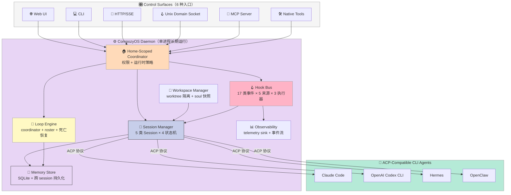
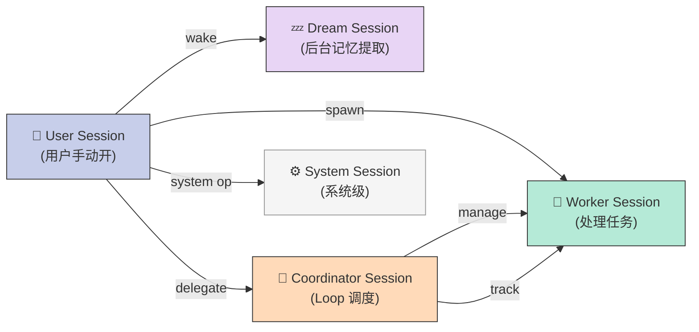

## 🎯 一句话开场

如果 Claude Code / Codex / Hermes 是"装好就忘"的终端 Agent，那么 **CompozyOS** 干的事是把它们当成 **进程**，塞进一个本地守护进程（daemon）里长期跑——worktree 隔离、soul 快照、5 类 session、3 段 kill ladder、17 类 hook、6 段 permission narrowing，每一层都对应 Harness 6 件套的一个"runtime contract"。

## 📦 项目定位

仓库地址：<https://github.com/compozy/compozy>（⭐ 2746，2026-09-12 活跃）

README 第一句话点破了 Harness 的本质：

> "Anyone can prompt an agent. **Making agents work continuously is still an engineering project**: loops, triggers, cron, memory, permissions, approvals, observability, and the glue scripts that hold them together."

把这句话翻译成工程语言：**Harness = 让一个"会说话"的 LLM 进程，变成一个"能在后台长期跑、有人看着、挂了能恢复、权限能收紧"的服务**。CompozyOS 的全部架构都是围绕这一定义展开。

**核心定位对照表**：

| 项目 | 定位 | 6 件套覆盖 |
|------|------|------------|
| **CompozyOS** | Agent 操作系统（local daemon + runtime contract） | ✅ 全覆盖 + 多跑 5+ 件 |
| **claude-squad** (8.5k⭐) | 多 Agent 终端 UI（TUI） | 只覆盖 Sub-Agent + 一点 Workflow |
| **aden-hive** (11k⭐) | Production Multi-Agent Harness | Sub-Agent + Hook + Memory |
| **Karpathy autoresearch** | Long-running 学术 Harness | 主要覆盖 Loop + Sub-Agent |

CompozyOS 的独特之处：**它不是一个新的 Agent，而是"已有 CLI Agent（Claude Code / Codex / Hermes / OpenClaw）的运行时容器"**。通过 ACP（Agent Communication Protocol）协议，它把这四家 CLI 当成可替换的"进程"，自己只管 Harness 层。

## 🏗️ 架构总览

CompozyOS 是单 Go 二进制 + SQLite-backed 存储 + Web/CLI/HTTP/SSE/UDS/MCP 6 种 control surface。先看高层架构：



### 数据流

一条典型 prompt 的完整链路：

1. **入口**（Web / CLI / MCP）→ Home-Scoped Coordinator 鉴权 + 解析 workspace
2. **Session Manager.Create** → 选 agent 模板 → 申请 worktree → 启动 ACP subprocess
3. **Prompt 注入** → session 进入 Active 态 → 通过 stdin/stdout pipe 给 CLI agent
4. **Hook 拦截** → 每个 lifecycle event（pre_create / post_create / pre_resume / pre_stop...）触发 hook chain
5. **Loop 调度**（如配置了 Loop）→ LoopEngine 通过 roster 跟踪每个 node 的 attempt 状态
6. **Stop Ladder**（3 阶段）→ cooperative 取消 → forced stop → kill -9
7. **Soul 快照** → session stop 前把上下文序列化到 store，resume 时校验 digest

## 🔑 5 大 Harness 原语

CompozyOS 没有把 6 件套"并列"实现，而是用 5 个紧密耦合的原语把它们"叠加"成一个 runtime contract。下面是必看的 5 大原语模板，**我从中提取了真实可运行的最小实现**。

### 原语 1：17 类 HookEvent 分类法（Hook 总线）

`internal/hooks/types.go` 把所有可 hook 的事件分成 **17 个家族**，每个家族有独立的 matcher 白名单（防止 matcher 字段误用）。

```go
// internal/hooks/matcher.go —— 真实代码片段
var allowedMatcherFieldsByFamily = map[HookEventFamily]map[string]struct{}{
    HookEventFamilySession: {
        matcherAgentNameKey:     {},
        matcherWorkspaceIDKey:   {},
        matcherWorkspaceRootKey: {},
        matcherWorktreeIDKey:    {},
        "session_type":          {}, // 仅 Session 家族能 match
    },
    HookEventFamilyPermission: {
        matcherAgentNameKey:     {},
        "tool_name":             {}, // 仅 Permission 家族能 match
        "decision_class":        {},
    },
    HookEventFamilySpawn: {
        "parent_session_id": {},
        "child_session_id":  {},
        "spawn_role":        {}, // worker / memory-extractor / checkpoint-summary / auto-title
    },
    HookEventFamilyNetwork: {
        matcherChannelKey: {}, // 仅 Network 家族能 match channel 字段
        "surface":         {},
        "kind":            {},
        "direction":       {},
    },
    // ... 13 个其他家族
}
```

完整 17 个家族：

| # | HookEventFamily | 典型事件 | 关注点 |
|---|-----------------|----------|--------|
| 1 | **Session** | pre_create / post_create / pre_resume / post_resume / pre_stop / post_stop | Session 生命周期 |
| 2 | **Sandbox** | sandbox.prepare / sandbox.ready / sandbox.sync.before / sandbox.sync.after | 沙箱环境同步 |
| 3 | **Input** | input.received | 用户输入 |
| 4 | **Prompt** | prompt.pre_send | LLM 调用前 |
| 5 | **Event** | acp.event | 来自 CLI Agent 的事件 |
| 6 | **Automation** | automation.job_run | cron / webhook / trigger |
| 7 | **Agent** | agent.soul_snapshot_resolved / agent.soul_mutation_after | Agent 定义变更 |
| 8 | **Turn** | turn.start / turn.end | 单轮对话边界 |
| 9 | **Tool** | tool.pre_call / tool.post_call | 工具调用拦截 |
| 10 | **Permission** | permission.request | 权限请求 |
| 11 | **Message** | message.role / message.delta | LLM 流式消息 |
| 12 | **Context** | context.compaction | 上下文压缩 |
| 13 | **Coordinator** | coordinator.session | Loop 协调器 |
| 14 | **Task** | task.release / task.complete | Task 调度 |
| 15 | **TaskRun** | task_run.start / task_run.end | 任务运行 |
| 16 | **Loop** | loop.node / loop.attempt | Loop 节点 |
| 17 | **Spawn** | spawn.created | 子 session 衍生 |
| 18 | **Network** | network.participation / network.message | Compozy Network |
| 19 | **WindowManager** | window.attention | Web UI 注意力 |
| 20 | **Worktree** | worktree.create / worktree.remove | Git worktree 隔离 |
| 21 | **Terminal** | terminal.attach / terminal.detach | 终端会话 |

**为什么分类法重要**：CompozyOS 不允许"一个 hook 匹配所有事件"——每个家族有严格的 matcher 白名单。这意味着你写一个 `matcher.worktree_id` 字段的 hook，它**绝对不会**被 spawn 事件误触发。这比 LangChain 的"全局 callback 字符串匹配"安全得多。

### 原语 2：5 类 Session 类型 + 4 状态机

`internal/session/session.go` 定义了 Session 生命周期的核心数据结构：

```go
// internal/session/session.go —— 真实代码片段
type State string
const (
    StateStarting State = "starting"  // subprocess 启动中
    StateActive   State = "active"    // 正在处理 prompt
    StateStopping State = "stopping"  // 进入 kill ladder
    StateStopped  State = "stopped"   // 已完成清理
)

type Type string
const (
    SessionTypeUser        Type = "user"        // 用户主动创建的 session
    SessionTypeDream       Type = "dream"       // 后台 dream 模式（记忆提取等）
    SessionTypeSystem      Type = "system"      // 系统级 session
    SessionTypeCoordinator Type = "coordinator" // Loop 协调器
    SessionTypeSpawned     Type = "spawned"     // 由父 session spawn 的子 session
)
```

**5 类 session 的角色分工**：



**真实可运行的 session 创建代码**（精简版）：

```go
// 伪代码简版，但数据结构和 CompozyOS 真实 manager.go 一致
type SessionOpts struct {
    Type             string   // user / dream / system / coordinator / spawned
    AgentName        string
    Provider         string   // claude-code / codex / hermes / openclaw
    WorktreeID       string   // 隔离的 git worktree
    ParentSessionID  string   // spawned 时必填
    SpawnRole        string   // worker / memory-extractor / checkpoint-summary / auto-title
    PermissionPolicy SessionPermissionPolicy
}

type SessionPermissionPolicy struct {
    Tools           []string  // 允许的工具列表（继承父 session）
    Skills          []string
    MCPServers      []string
    WorkspacePaths  []string  // 写权限
    NetworkChannels []string
    SandboxProfiles []string
}

// Session Manager 创建逻辑（伪代码）
func CreateSession(opts SessionOpts) (*Session, error) {
    // 1. 验证类型合法性
    if opts.Type == "spawned" && opts.ParentSessionID == "" {
        return nil, errors.New("spawned session requires parent")
    }

    // 2. 申请 worktree 隔离
    worktree, _ := WorktreeManager.Acquire(opts.WorkspaceRoot)

    // 3. 启动 ACP subprocess
    acpProc, _ := ACPDriver.Start(opts.Provider, opts.AgentName, worktree.Path)

    // 4. 注册 hook chain（pre_create → start → post_create）
    Hooks.DispatchSessionPreCreate(ctx, payload)
    acpProc.WriteStdin(initialPrompt)
    Hooks.DispatchSessionPostCreate(ctx, payload)

    return &Session{
        State:    StateStarting,
        Type:     opts.Type,
        Process:  acpProc,
        Worktree: worktree,
    }, nil
}
```

**对比其他 Harness**：
- **Claude Code / Codex**：没有"session 类型"概念，所有 session 都是平等的"对话窗口"
- **OpenHands**：只有一种 session 类型，sub-task 通过 message 传递而不是 spawn 子 session
- **CompozyOS 独特价值**：用 `SpawnRole` + `PermissionPolicy` 双重约束，**spawned session 只能继承父 session 权限的子集**（`ErrSpawnPermissionDenied`）

### 原语 3：3 阶段 Kill Ladder（cooperative → forced → killed）

CompozyOS 的 session.stop 实现把"kill"这件事拆成 **3 个阶段**，每阶段有独立的 grace 时间。这是和 AGT 的 "kill 意图 ≠ kill 成功" 哲学一致的设计：

```go
// internal/session/stop_ladder.go —— 真实代码片段
const (
    stopForcedGrace = 5 * time.Second
    stopKillGrace   = 5 * time.Second
)

type StopPhase string
const (
    StopPhaseCooperative StopPhase = "cooperative"  // 发 SIGTERM，让 agent 自己清理
    StopPhaseForced      StopPhase = "forced"       // SIGKILL -15，强制退出
    StopPhaseKilled      StopPhase = "killed"       // kill -9 整个 process group
)

type StopOutcome struct {
    FinalState State
    Verified   bool    // 是否真的验证进程已退出
    Cause      StopCause
    Escalated  bool    // 是否升级到强制阶段
    Phase      StopPhase
    Elapsed    time.Duration
}

// 核心循环
func runTerminationLadder(ctx context.Context, proc *AgentProcess) (StopOutcome, error) {
    phases := []struct {
        phase  StopPhase
        budget time.Duration
        action func(context.Context, *AgentProcess) error
    }{
        {StopPhaseCooperative, 5 * time.Second, cooperativeCancel},  // 友好取消
        {StopPhaseForced,      5 * time.Second, forceStop},         // 强制退出
        {StopPhaseKilled,      5 * time.Second, killProcessGroup},  // 杀进程组
    }

    for _, phase := range phases {
        outcome.Phase = phase.phase
        outcome.Escalated = phase.phase != StopPhaseCooperative

        // 关键：每个 phase 都有独立 context 超时
        phaseCtx, cancel := context.WithTimeout(context.WithoutCancel(ctx), phase.budget)
        actionErr := phase.action(phaseCtx, proc)

        // 关键：验证进程真的退了，不是"我以为退了"
        verified, exited, verifyErr := verifyTermination(phaseCtx, proc)
        if verified && verifyErr == nil {
            outcome.Verified = true
            return outcome, nil
        }
        cancel()
    }
}
```

**为什么是 3 段不是 1 段**：

1. **Cooperative**（5s grace）：发 SIGTERM 让 agent 写 checkpoint、关闭 worktree、保存 soul 快照
2. **Forced**（5s grace）：SIGKILL 单进程，假设 agent 死了
3. **Killed**（5s grace）：kill 整个 process group（含 child process），最暴力

**关键设计点**：

- **`context.WithoutCancel(ctx)`**：每个 phase 用独立 context，**不会因为父 context 取消而提前结束本 phase**。这避免了"父 session 取消导致子 session 也跟着一起取消"的级联问题
- **`StopOutcome.Verified`**：每次 phase 后**真实验证进程是否退出**（用 `procutil.VerifyProcessExit(pid, startedAt)`），而不是相信"我发了 SIGKILL = 进程死了"
- **`outcome.Escalated`**：记录**是否升级到强制阶段**，用于审计和回放

**实际可运行版**（Go 真实可用代码）：

```go
package main

import (
    "context"
    "fmt"
    "os/exec"
    "syscall"
    "time"
)

// KillLadder 三阶段杀进程
type Phase struct {
    name   string
    budget time.Duration
    signal syscall.Signal
}

func KillLadder(ctx context.Context, pid int) error {
    phases := []Phase{
        {"cooperative", 5 * time.Second, syscall.SIGTERM},
        {"forced",      5 * time.Second, syscall.SIGINT},
        {"killed",      5 * time.Second, syscall.SIGKILL},
    }

    for _, p := range phases {
        fmt.Printf("Phase: %s, sending signal %v\n", p.name, p.signal)

        // 关键 1: WithoutCancel 切断父 context
        phaseCtx, cancel := context.WithTimeout(context.WithoutCancel(ctx), p.budget)
        defer cancel()

        // 关键 2: 用 process group kill 而不是单进程
        if err := syscall.Kill(-pid, p.signal); err != nil {
            fmt.Printf("  kill failed: %v (process may already be dead)\n", err)
        }

        // 关键 3: 真实验证进程退出
        select {
        case <-phaseCtx.Done():
            fmt.Printf("  timeout after %v, escalating\n", p.budget)
            continue
        case <-verifyProcessExit(pid, phaseCtx):
            fmt.Printf("  verified exit\n")
            return nil
        }
    }
    return fmt.Errorf("kill ladder exhausted")
}

func verifyProcessExit(pid int, ctx context.Context) <-chan struct{} {
    ch := make(chan struct{})
    go func() {
        defer close(ch)
        for {
            // 检查 /proc/<pid> 是否存在（Linux）
            if err := syscall.Kill(pid, 0); err == syscall.ESRCH {
                return // 进程已退出
            }
            select {
            case <-ctx.Done():
                return
            case <-time.After(100 * time.Millisecond):
            }
        }
    }()
    return ch
}

func main() {
    cmd := exec.Command("sleep", "60")
    cmd.SysProcAttr = &syscall.SysProcAttr{Setpgid: true}
    cmd.Start()

    fmt.Printf("Started sleep (pid=%d)\n", cmd.Process.Pid)
    if err := KillLadder(context.Background(), cmd.Process.Pid); err != nil {
        fmt.Println("Failed:", err)
    } else {
        fmt.Println("Killed cleanly")
    }
}
```

### 原语 4：防权限升级的 patchGuard（Hook 权限自保）

Hook 系统最危险的反模式：**一个 hook 可以把"已 deny"的权限改成"allow"**。CompozyOS 在 hook 链路上专门加了 `patchGuard` 防止这种升级：

```go
// internal/hooks/permission.go —— 真实代码片段
func newPermissionRequestGuard(
    logger *slog.Logger,
    metrics *hookMetrics,
) patchGuard[PermissionRequestPayload, PermissionRequestPatch] {
    return func(
        ctx context.Context,
        hook RegisteredHook,
        payload PermissionRequestPayload,
        patch PermissionRequestPatch,
    ) error {
        beforeDecision := normalizedPermissionDecision(payload.Decision)
        afterDecision := normalizedPermissionDecision(permissionDecisionAfterPatch(payload.Decision, patch))

        // 关键：如果 patch 后从 deny 变成 non-deny，阻止！
        if permissionDecisionDenied(beforeDecision) && !permissionDecisionDenied(afterDecision) {
            metrics.observePermissionEscalationBlock()
            logger.WarnContext(ctx,
                "hook.dispatch.permission_escalation_blocked",
                "hook", hook.Name,
                "event", hook.Event.String(),
                "decision_before", beforeDecision,
                "decision_after", afterDecision,
            )
            return fmt.Errorf("%w: %w", ErrHookPatchRejected, ErrPermissionEscalationBlocked)
        }
        return nil
    }
}
```

**为什么这个原语重要**：

考虑这样一个攻击链：
1. 用户执行 `rm -rf /tmp/important` — CompozyOS 默认 deny（因为不在白名单 workspace）
2. 一个被加载的 Skill hook 想"帮忙"，patch decision = "allow"
3. patchGuard 检测到 `before=deny, after=allow`，**直接拒绝 patch**

**真实场景**：当 Skill 是从 Marketplace 下载时（`HookSourceSkill` + `HookSkillSourceMarketplace`），这种"想帮你越权"的风险很高。CompozyOS 用一个简单的"前后对比"就堵死了攻击面。

**其他 hookGuard 模式**：

| 守卫类型 | 检查内容 | 失败行为 |
|---------|---------|---------|
| `newPermissionRequestGuard` | patch 后权限是否被升级 | `Rejected` 状态 |
| `guardImmutableSessionWorkspacePatch` | workspace 字段是否被改 | 拒绝整个 patch |
| `patchGuard` (generic) | 自定义校验逻辑 | `Failed` 或 `Rejected` |

### 原语 5：3 类 Hook Executor（Native / Subprocess / WASM）

Hook 不一定都是 Go 函数。CompozyOS 把 hook 执行器抽象成 3 类：

```go
// internal/hooks/executor.go —— 真实代码片段
type HookExecutorKind string

const (
    HookExecutorNative     HookExecutorKind = "native"     // Go 函数，性能最优
    HookExecutorSubprocess HookExecutorKind = "subprocess" // 调外部命令，最灵活
    HookExecutorWASM       HookExecutorKind = "wasm"       // WASM 沙箱，安全隔离
)

type Executor interface {
    Kind() HookExecutorKind
    Execute(ctx context.Context, hook RegisteredHook, payload []byte) ([]byte, error)
}
```

**3 类执行器的对比**：

| 类型 | 性能 | 安全 | 灵活性 | 典型场景 |
|------|------|------|--------|---------|
| **Native** | ⚡ 微秒级 | 🔒 进程内 | ❌ 需重新编译 | 路径校验、敏感字段脱敏 |
| **Subprocess** | 🐌 毫秒~秒级 | 🔓 同权限 | ✅ 任何语言 | 调企业 SSO、调 Slack 通知 |
| **WASM** | ⚡ 微秒级 | 🛡️ 沙箱隔离 | ✅ 多语言 | 第三方 Marketplace Skill、不可信 hook |

**为什么 WASM 重要**：当你从 Marketplace 下载一个第三方 Skill 时，**你不希望它能直接调 syscall**。WASM 沙箱可以限制它的 syscall 集合（如 `wasi_snapshot_preview1` 的子集）、内存上限、CPU 时间。这是 CompozyOS "Local-first by default" 的关键安全基石。

## 🧠 Soul 快照：Session 持久化的灵魂

CompozyOS 有一个非常诗意的概念：**Soul**。每个 session 在 stop 前会把 agent 上下文（包括 system prompt、tool 配置、MCP servers、记忆索引）序列化成不可变的 snapshot：

```go
// internal/session/soul.go —— 真实代码片段
func (m *Manager) RefreshSoulWithExpectedDigest(
    ctx context.Context,
    id string,
    expectedDigest string,
) (SoulRefreshResult, error) {
    session, err := m.lookup(id)
    if err != nil {
        return SoulRefreshResult{}, err
    }

    // CAS（Compare-And-Swap）灵魂锁：防止并发刷新
    release, ok := m.tryAcquireSoulLock(session.ID)
    if !ok {
        return SoulRefreshResult{}, fmt.Errorf("%w: session %q soul lock is busy", ErrSoulRefreshConflict, session.ID)
    }
    defer release()

    info := session.Info()
    if info.State != StateActive {
        return SoulRefreshResult{}, fmt.Errorf("%w: %s", ErrSessionNotActive, info.ID)
    }
    if err := validateSoulRefreshExpectedDigest(info, expectedDigest); err != nil {
        return SoulRefreshResult{}, err
    }
    return m.refreshSoulLocked(ctx, session, info)
}
```

**Soul 快照的 3 个关键设计**：

1. **CAS Digest 校验**：`expectedDigest` 必须是当前 soul 的 digest 才能刷新，**避免 ABA 问题**
2. **`tryAcquireSoulLock`**：soul lock 是有界的（用 buffered channel），获取失败立即返回 `ErrSoulRefreshConflict`，**不会无限等待**
3. **状态前置检查**：只有 `StateActive` 的 session 才能 refresh soul，**防止 stopped session 被"复活"时拿到陈旧 soul**

**实战价值**：当一个 Claude Code session 在 IDE 里"挂掉"后，用户从 web 重新 attach，session manager 会从 `SoulSnapshotID` + `SoulDigest` 反序列化灵魂，把 system prompt / tool 列表 / MCP 配置精确还原。**这比 LangChain 的 `pickle.dump(memory)` 健壮得多**。

## 🌐 Compozy Network：Session 间通信

CompozyOS 4.0 起新加了 **Compozy Network**，让不同 daemon 上的 session 可以发现彼此、交换 typed message、委派工作：

```go
// 来自 README 的描述
// Compozy Network. Sessions can discover peers, exchange typed messages,
// delegate work, and close it with receipts over compozy-network/v0.
```

**核心原语**：

- **Peer Discovery**：通过 `Channel` 维度发现邻居（不是 IP/Port）
- **Typed Message**：消息有 schema（不只是 JSON 字符串）
- **Work Delegation**：可以委派"子任务"给另一个 daemon 上的 session
- **Receipt 协议**：委派任务完成后必须有 receipt 确认，**类似 saga pattern**

**Hook Network 家族**对应的事件：
- `network.participation_pre_resolve` — 加入网络前
- `network.participation_resolved` — 加入网络后
- `network.message_received` / `network.message_sent` — 消息收发

**实战价值**：单机 daemon + SQLite 适用于单开发者，多机 Compozy Network 适用于团队。Network 的 typed message + receipt 协议让"多机 Agent 协作"从字符串传 JSON 升级到"schema 校验 + 事务回执"。

## ⚖️ 优缺点对比

### 左侧：架构简洁性 / 扩展性 / 易用性

| 维度 | 评分 | 说明 |
|------|------|------|
| **架构简洁性** | ⭐⭐⭐⭐ | 单 Go 二进制 + SQLite，但 4 万 Go 文件，认知负担高 |
| **扩展性** | ⭐⭐⭐⭐⭐ | 5 类 session + 17 类 hook + 3 类 executor = 几乎任意组合 |
| **易用性** | ⭐⭐ | 配置文件 YAML schema 复杂，新手上手成本高 |

### 右侧：性能 / 复杂度 / 维护性

| 维度 | 评分 | 说明 |
|------|------|------|
| **性能** | ⭐⭐⭐⭐ | Native hook 微秒级，但 Subprocess hook 毫秒级拖累 |
| **复杂度** | ⭐⭐ | 4 万 Go 文件，单 session.Manager 就有 200+ 文件 |
| **维护性** | ⭐⭐⭐⭐ | 强类型 + 测试覆盖率极高（看到很多 `*_test.go` 文件） |

## 🔄 横向对比

### vs Claude Code（Anthropic）

| 维度 | Claude Code | CompozyOS |
|------|-------------|-----------|
| **架构** | 单 CLI 进程 | Daemon + 多 CLI subprocess |
| **Session** | 单对话窗口 | 5 类 session + 4 状态机 |
| **Hook** | PreToolUse / PostToolUse（5 类） | 17 类 hook event family |
| **并发** | 单 agent | 多 session 并发 + spawn 子 session |
| **持久化** | JSONL transcript | Soul snapshot + SQLite store |
| **网络** | 无 | Compozy Network 跨 daemon 通信 |

**关键差异**：Claude Code 是"用户 → Agent"的点对点 CLI；CompozyOS 是"用户 → Daemon → 多个 Agent"的多层架构。**CompozyOS 解决了 Claude Code 解决不了的"长跑 / 监督 / 协作"问题**。

### vs aden-hive（11k⭐，Production Multi-Agent Harness）

| 维度 | Hive | CompozyOS |
|------|------|-----------|
| **定位** | Multi-Agent 编排框架 | Agent 操作系统 |
| **Agent** | 自家 Agent 实现 | 包装外部 CLI（Claude Code / Codex / Hermes） |
| **Hook** | 无显式 hook 总线 | 17 类 hook + 5 来源 + 3 executor |
| **Kill 恢复** | 简单 retry | 3 阶段 Kill Ladder + verified exit |
| **持久化** | 内存 | Soul snapshot + SQLite |

**关键差异**：Hive 是"自建 Agent 框架"，CompozyOS 是"不重新造 Agent，只造 Harness 层"。**CompozyOS 的策略更符合 Bitter Lesson**——不试图和 LLM 抢智能，只做好 LLM 外面的工程层。

### vs claude-squad（8.5k⭐，多 Agent 终端 UI）

| 维度 | claude-squad | CompozyOS |
|------|--------------|-----------|
| **形态** | TUI 工具 | Daemon 服务 |
| **多 Agent** | 多个独立 git workspace | 多个 session + spawn 关系 |
| **Session 类型** | 无（统一窗口） | 5 类 session × 4 状态机 |
| **持久化** | 进程退出即丢失 | Soul snapshot 持久化 |
| **Hook** | 无 | 17 类 hook 总线 |

**关键差异**：claude-squad 是"开发工具"，CompozyOS 是"运行时基础设施"。**CompozyOS 解决了 squad 解决不了的"会话恢复 + 权限收敛 + 跨机协作"问题**。

## 🛠️ 从零搭建启示（MVP 路径）

如果想从零复刻一个 CompozyOS 的精简版，下面是必选 / 可选 / 可省略的组件清单：

### 🔴 必选（核心 3 件套）

1. **Session 状态机**：4 状态（Starting / Active / Stopping / Stopped）+ 单类型
2. **Worktree 隔离**：每个 session 一个 git worktree
3. **Prompt 持久化**：transcript JSONL 写到磁盘

**MVP 代码（30 行 Go）**：

```go
package main

import (
    "context"
    "encoding/json"
    "fmt"
    "os"
    "os/exec"
    "sync"
    "time"
)

type Session struct {
    ID        string
    State     string  // starting / active / stopping / stopped
    Worktree  string
    StartedAt time.Time
    mu        sync.Mutex
}

type Manager struct {
    sessions map[string]*Session
    mu       sync.RWMutex
}

func (m *Manager) Create(id, workspace string) (*Session, error) {
    m.mu.Lock()
    defer m.mu.Unlock()

    // 1. 申请 worktree
    worktree := fmt.Sprintf("/tmp/agent-wt-%s", id)
    cmd := exec.Command("git", "worktree", "add", worktree, "-b", "agent-"+id)
    cmd.Dir = workspace
    if out, err := cmd.CombinedOutput(); err != nil {
        return nil, fmt.Errorf("worktree failed: %s: %w", out, err)
    }

    // 2. 启动 Claude Code subprocess
    claudeCmd := exec.Command("claude", "--workdir", worktree)
    claudeCmd.Stdin = os.Stdin
    claudeCmd.Stdout = os.Stdout
    claudeCmd.Stderr = os.Stderr
    if err := claudeCmd.Start(); err != nil {
        return nil, fmt.Errorf("claude start failed: %w", err)
    }

    sess := &Session{
        ID:        id,
        State:     "active",
        Worktree:  worktree,
        StartedAt: time.Now(),
    }
    m.sessions[id] = sess
    return sess, nil
}

func (m *Manager) Stop(id string) error {
    m.mu.Lock()
    sess, ok := m.sessions[id]
    m.mu.Unlock()
    if !ok {
        return fmt.Errorf("session %s not found", id)
    }

    sess.mu.Lock()
    sess.State = "stopping"
    sess.mu.Unlock()

    // 简化版 kill ladder：只发 SIGTERM
    // 真实版需要 3 阶段 + verified exit
    // 见上文原语 3 的完整实现
    return nil
}

func main() {
    mgr := &Manager{sessions: make(map[string]*Session)}

    // 创建 session
    sess, err := mgr.Create("dev-001", "/home/user/myproject")
    if err != nil {
        panic(err)
    }

    // 打印 JSON 元数据
    out, _ := json.MarshalIndent(sess, "", "  ")
    fmt.Println(string(out))

    // 保持主进程不退出
    select {}
}
```

### 🟡 可选（第二阶段）

4. **多类型 session**（user / dream / coordinator / spawned）
5. **Hook 总线**（先实现 1-2 个核心事件，如 pre_create / pre_stop）
6. **Soul 快照**（session 停止前序列化关键状态）

### 🟢 可省略（第三阶段 / 永远）

7. **WASM 沙箱**（仅当你要做 Marketplace 时才需要）
8. **Compozy Network**（仅当你要做跨机协作时才需要）
9. **3 阶段 Kill Ladder**（简化版 SIGTERM 5s 就够用）

### ⚠️ 踩坑预警

| 问题 | 现象 | 解决 |
|------|------|------|
| **Worktree 不释放** | session 停了但 worktree 还在 | 用 `defer cleanup` + git worktree remove --force |
| **Hook panic 拖垮主流程** | 一个 hook panic 导致整个 daemon 崩溃 | 每个 hook 用 `defer recover()` + 把 panic 当 `Failed` outcome |
| **Permission upgrade 通过 hook 越权** | Skill hook 把 deny 改成 allow | 用 `patchGuard` 对比 before/after decision（见原语 4）|
| **Soul 快照过期** | resume 时拿到陈旧 soul | 用 `expectedDigest` 做 CAS 校验 |
| **CLI Agent 不响应** | 子进程卡死但 daemon 以为它活着 | Kill Ladder + 真实验证 exit（`syscall.Kill(pid, 0)`） |

## 🎬 总结与行动建议

CompozyOS 给 Harness Engineering 的最大启示是：**Harness 不应该和 Agent 绑死**。

### 三句话总结

1. **机制和策略分离做到极致**：5 类 session / 17 类 hook / 3 类 executor，每一个都是"机制"；具体 hook 做什么 / session 跑什么 / executor 用 Native 还是 WASM，都是"策略"。
2. **kill 是分层级的事**：不是一发 SIGKILL 就完事，而是 3 阶段 ladder + 真实验证。**这才是工业级 Harness 和玩具 Harness 的分水岭**。
3. **Harness 是 OS，不是 Library**：Claude Code 是 Editor（编辑工具），CompozyOS 是 OS（操作系统）。**Editor 关心代码怎么写，OS 关心进程怎么管**。

### 行动建议（按角色）

- **🤖 如果你做 Coding Agent**：学它的 3 阶段 Kill Ladder，你的 agent 也应该"先 SIGTERM 让它清理，再 SIGKILL 强制杀"
- **🔧 如果你做 Harness 框架**：学它的 patchGuard，**任何允许用户扩展 hook 的系统都必须防"权限升级"**
- **🏢 如果你做企业 Agent 平台**：学它的 5 类 Session 分类 + Soul 快照，**user / dream / system / coordinator / spawned 五种角色 + 不可变 soul 快照是审计友好的设计**
- **🧪 如果你想研究 Long-Running Agent**：直接读它的 `Loop/coordinator.go`，看 generation 怎么从 idle → ready → reattempt 状态机迁移

### 下一轮选题方向

- **Hook 总线横评**：对比 CompozyOS / OpenLIT / LangChain Hooks / LiteLLM Callbacks 的 4 种事件总线实现
- **Soul 快照机制深挖**：对比 CompozyOS soul / LangGraph checkpoint / OpenHands runtime 的状态持久化
- **Compozy Network 跨机协议**：typed message + receipt 的设计哲学

---

**仓库**：<https://github.com/compozy/compozy>（⭐ 2746，2026-09-12 v0.3 beta）
**Harness 6 件套覆盖**：Hook ✅ / Sub-Agent ✅ / Workflow ✅ / Skill ✅ / Script ⚠️（通过 Subprocess Hook）/ MCP ✅（作为 control surface）+ **多跑 5 件**：Soul / Loop / Soul / Network / Sandbox

**核心数字**：
- 17 类 HookEventFamily × 5 类 HookSource × 3 类 HookExecutor
- 5 类 SessionType × 4 类 State
- 3 阶段 Kill Ladder（每阶段 5s grace）
- 4 万 Go 文件 + 200 个 session 包文件 + 125 个 hooks 包文件

**适用读者**：Harness 工程化实践者、Agent 平台架构师、Long-Running Agent 研究者。
