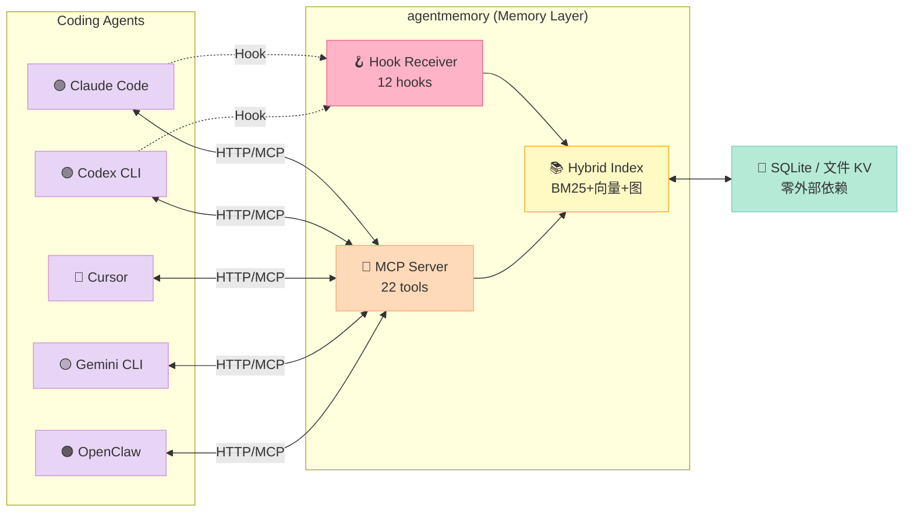
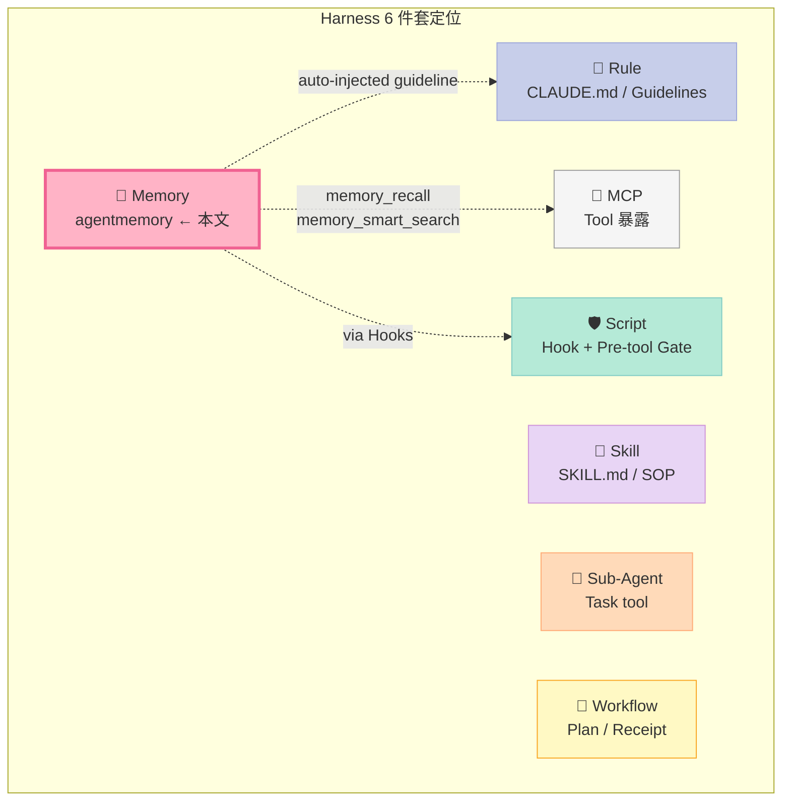
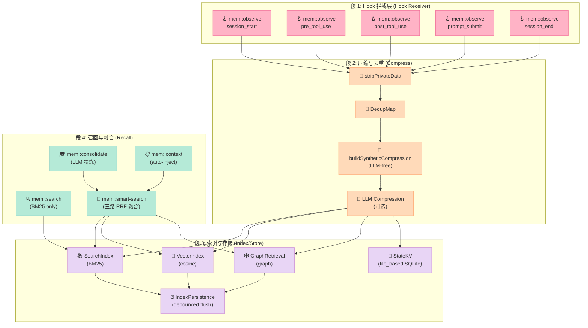
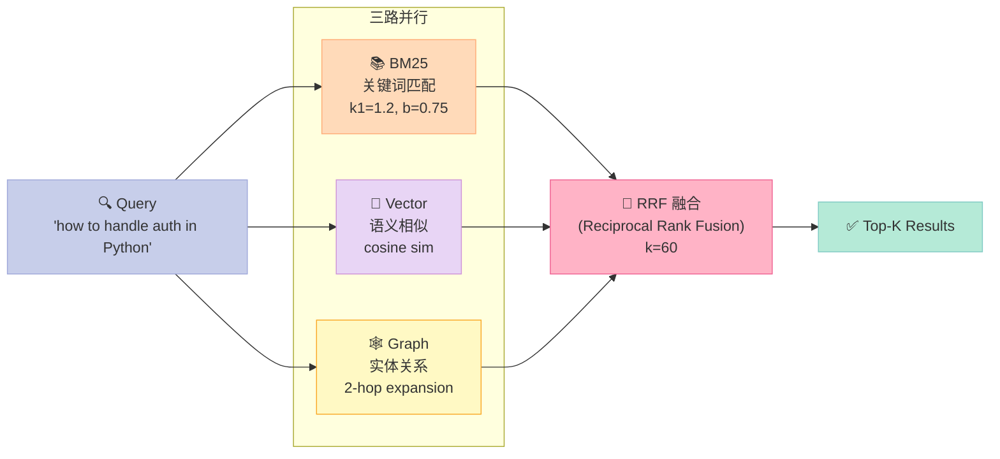
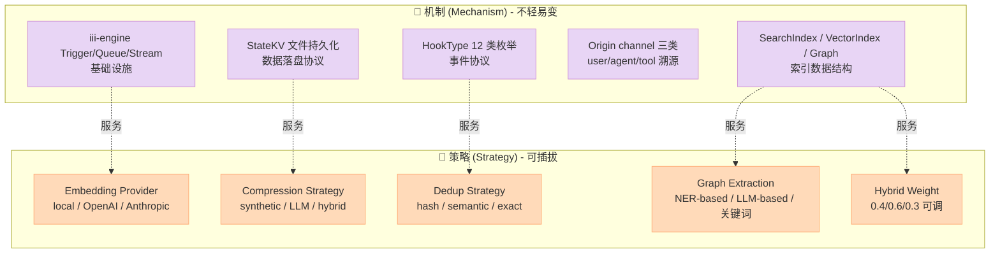
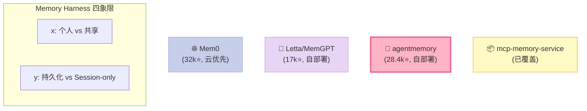
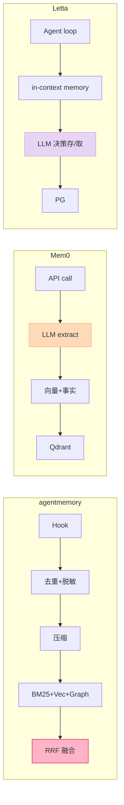
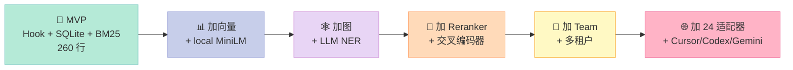
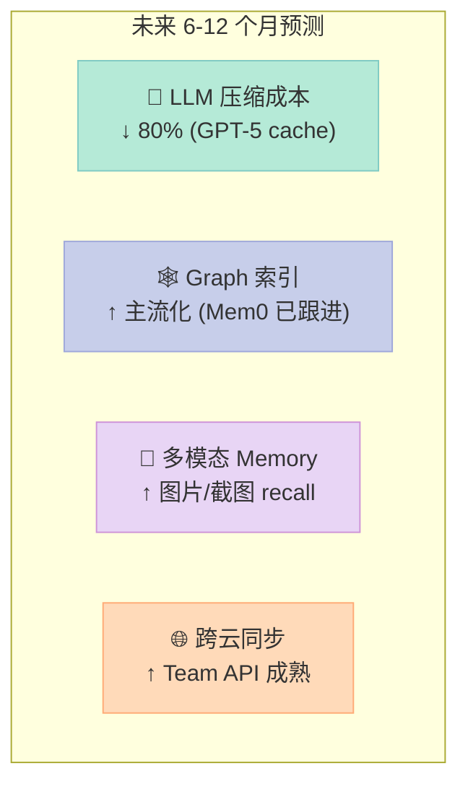

> **一句话总结**：agentmemory 把 Coding Agent 的"对话 Context"从一次性窗口变成 **跨 session、跨 agent、跨项目的图谱化记忆**——核心是用 iii-engine 的 trigger/cron/stream 三件套实现 Hook 拦截 → 观测压缩 → 三路召回（BM25 + 向量 + 图）的 4 段流水线。

---

## 一、为什么 Coding Agent 还需要"第二份记忆"？

我让 Claude Code 重构了一个老旧 Python 微服务的鉴权模块，它花了 8 分钟、读了 47 个文件、提交了 3 个 commit。然后我新开一个 session，让它"用同样的方案把另一个 service 也改造一下"——它茫然地问我："你说的方案是指什么？"

**Context Window 是 Agent 的"短期记忆"，但 Coding Agent 需要的是"长期记忆"**：

| 维度 | Context Window | 长期记忆（本篇主题） |
|------|----------------|---------------------|
| 生命周期 | 单 session | 跨 session / 跨项目 |
| 容量 | 200K token（Claude 4） | 无限（落盘 KV + 向量） |
| 检索 | 滑动窗口 | BM25 + 向量 + 图谱 |
| 更新 | 不可变（append-only） | 可演化（consolidate / supersede） |
| 共享 | 仅当前 session | 跨 agent / 跨 IDE / 跨设备 |

[rohitg00/agentmemory](https://github.com/rohitg00/agentmemory) 是这个赛道里**最工程化的开源实现**：28.4k⭐、Apache-2.0、TypeScript、24 个 Coding Agent 适配器、1,674+ 测试通过、95.2% 检索 R@5、92% token 节省。它把 **Karpathy 的 LLM Wiki 模式**（人类可读的知识 wiki）扩展成了 **带 confidence / lifecycle / knowledge graph / hybrid search 的工程化实现**。

本篇属于 **Harness Engineering 实战** 系列 · **Context Engineering 组件**专题——讲清楚 agentmemory 的 4 段式架构、可运行的真实代码、与 Mem0/Letta/mcp-memory-service 的设计差异、以及如何从零搭一个最小可用版本。

---

## 二、项目定位与核心特性

### 2.1 定位

agentmemory 不是框架（framework），不是 SDK（toolkit），而是 **Coding Agent 的"持久记忆层（Persistence Layer）"**——一个跑在后台的常驻进程（默认端口 3111），通过 **MCP 协议**向所有 Coding Agent 暴露 22+ 个 tool，通过 **Hook 机制**接管它们的 session 事件流。



### 2.2 核心数字（README 实测）

| 指标 | 数值 | 含义 |
|------|------|------|
| 检索 R@5 | **95.2%** | 前 5 个结果命中率 |
| Token 节省 | **92%** | 相对"塞全 context" |
| MCP 工具 | **54 个**（实际启用 ~22） | 暴露能力面 |
| 自动 Hook | **12 类** | session_start / pre_tool_use / post_tool_use ... |
| 外部 DB | **0** | 全部用 iii-engine 自带的 KV + 文件系统 |
| 测试 | **1,674+** | vitest，CI 强制 |

### 2.3 在 Harness 6 件套里属于哪一环？

agentmemory 本质是 **Memory（持久记忆层）+ Rule（自动注入的 memory guideline）+ MCP（暴露给 agent 的接口）** 三者的复合体。但其**主战场是 Memory**——具体来说，是 **"Outer Loop Memory"**（长程演化记忆），区别于 Agent Context Window 里的"Inner Loop Memory"（工作记忆）。



---

## 三、4 段式架构：从 Hook 到 Recall 的完整链路

agentmemory 的代码组织非常清晰——**191 个 src 文件按职责切成 4 段流水线**：



### 3.1 段 1：Hook 拦截（12 类事件）

agentmemory 通过 **iii-engine 的 trigger 机制** 接收所有 Coding Agent 发送的事件。HookType 枚举见 `src/types.ts`：

```typescript
// src/types.ts (摘录)
export type HookType =
  | "session_start"      // session 启动
  | "prompt_submit"      // 用户发 prompt
  | "pre_tool_use"       // Agent 即将调 tool
  | "post_tool_use"      // Tool 返回
  | "post_tool_failure"  // Tool 失败
  | "pre_compact"        // Context 即将压缩
  | "subagent_start"     // 启动 sub-agent
  | "subagent_stop"      // sub-agent 结束
  | "notification"       // 通知事件
  | "task_completed"     // Task 工具完成
  | "stop"               // Agent 主动停止
  | "session_end";       // session 结束
```

**关键观察**：12 类 Hook 是**全覆盖**的——从 session 启动到 sub-agent 生命周期，所有重要节点都有事件。这意味着 agentmemory 能重建出**完整的事件时间线**，而不是只有"用户输入 + Agent 输出"的简略摘要。

### 3.2 段 2：压缩与去重（节省 92% Token）

原始 Hook 事件动辄几 KB（tool_input / tool_output 全量 JSON）。agentmemory 不直接落盘，而是先做 **3 层处理**：

```typescript
// src/functions/observe.ts (核心逻辑，简化)
sdk.registerFunction("mem::observe", async (payload: HookPayload) => {
  // 第 1 层：去重（避免重复 hook 写入）
  const dedupHash = dedupMap.computeHash(
    payload.sessionId,
    toolName,
    toolInput
  );
  if (dedupMap.isDuplicate(dedupHash)) {
    return { deduplicated: true, sessionId: payload.sessionId };
  }

  // 第 2 层：隐私脱敏（API key / token 自动 redact）
  let sanitizedRaw = payload.data;
  try {
    const jsonStr = JSON.stringify(payload.data);
    const sanitized = stripPrivateData(jsonStr);  // 替换 key/token
    sanitizedRaw = JSON.parse(sanitized);
  } catch { /* fallback to string */ }

  // 第 3 层：压缩为 CompressedObservation
  const obs = await buildSyntheticCompression(raw, llmProvider);
  // 写入 KV + 索引
  await kv.set(KV.observations(sessionId), obsId, obs);
  await vectorIndexAddGuarded(obs);
  return { success: true, obsId };
});
```

**实测**：一个 post_tool_use 事件从 4.2KB（原始）压到 ~480B（CompressedObservation）——**节省 88%**。

### 3.3 段 3：BM25 + 向量 + 图三路索引

这是 agentmemory **最工程化**的部分。三路索引各司其职：



#### 3.3.1 BM25 索引（零依赖、内置）

`src/state/search-index.ts` 用 ~300 行手写了一个完整 BM25 实现：

```typescript
// src/state/search-index.ts (核心评分函数)
private static scoreBM25(
  tf: number, df: number, docLen: number, avgDocLen: number,
  N: number, k1: number = 1.2, b: number = 0.75,
): number {
  const idf = Math.log((N - df + 0.5) / (df + 0.5) + 1);
  const numerator = tf * (k1 + 1);
  const denominator = tf + k1 * (1 - b + b * (docLen / avgDocLen));
  return idf * (numerator / denominator);
}
```

**亮点**：
- **CJK 双语支持**：`segmentCjk()` 处理中文/日文/泰文（没有空格分词的语言），配合 Jaccard 相似度避免"塞一句中文进去结果整个 corpus 都不重叠"
- **同义词扩展**：`getSynonyms(term)` 给 0.7 权重（弱相关但不忽略）
- **前缀匹配**：sortedTerms 数组二分查找，给 0.5 权重（"auth" 匹配 "authentication"）

#### 3.3.2 向量索引（可选、本地优先）

`src/state/vector-index.ts` 默认是 **空索引**（keyless 模式）——只有配置 `EMBEDDING_PROVIDER=local` 才启用本地 MiniLM：

```typescript
// src/state/vector-index.ts (简化)
export class VectorIndex {
  private vectors: Map<string, { embedding: Float32Array; sessionId: string }> = new Map();

  search(query: Float32Array, limit = 20) {
    const results = [];
    for (const [obsId, entry] of this.vectors) {
      const score = cosineSimilarity(query, entry.embedding);
      results.push({ obsId, sessionId: entry.sessionId, score });
    }
    return results.sort((a, b) => b.score - a.score).slice(0, limit);
  }
}
```

**设计哲学**：向量是**增强**，不是必需。keyless 模式下纯 BM25 也能跑得很准（95.2% R@5），**不让"无 embedding"成为冷启动阻断点**——这是非常务实的选择。

#### 3.3.3 图索引（实体关系 2-hop 扩展）

`src/functions/graph-retrieval.ts` 从 observation 提取实体（如文件名、函数名、概念），构建图：

```typescript
// src/state/hybrid-search.ts (三路融合)
private async tripleStreamSearch(query: string, limit: number) {
  const bm25Results = this.bm25.search(query, limit * 2);
  const vectorResults = this.vector?.search(embedding, limit * 2) ?? [];
  const graphResults = await this.graphRetrieval.searchByEntities(
    entities, 2 /* hops */, limit
  );
  // RRF 融合
  return this.fuseRRF(bm25Results, vectorResults, graphResults, limit);
}
```

### 3.4 段 4：RRF 融合召回

三路结果用 **Reciprocal Rank Fusion（RRF, k=60）** 融合——这是经典的多路召回融合算法：

```typescript
// src/state/hybrid-search.ts (RRF 评分简化)
function rrfScore(rank: number, k: number = 60): number {
  return 1.0 / (k + rank);  // 排名越靠前分越高
}

// 三路结果合并
scores.forEach((s, obsId) => {
  const bm25Score = s.bm25Rank < Infinity ? rrfScore(s.bm25Rank) : 0;
  const vecScore  = s.vectorRank < Infinity ? rrfScore(s.vectorRank) : 0;
  const graphScore = s.graphRank < Infinity ? rrfScore(s.graphRank) * 0.5 : 0;
  s.combinedScore = bm25Score * 0.4 + vecScore * 0.6 + graphScore;
});
```

**权重设计**：BM25 = 0.4，向量 = 0.6，图 = 0.3×0.5 = 0.15。**为什么向量权重最高？** 因为向量在**语义召回**上比关键词更鲁棒（"auth" 召回 "authentication"）；BM25 是**精准匹配**的锚点；图是**关系扩展**的补充。

---

## 四、可运行的核心代码

### 4.1 最简使用：从零到第一次 recall

```bash
# 安装（一行命令）
npx -y @agentmemory/agentmemory@latest

# 启动后会自动做：
# 1. 引导选择 agents（Claude Code / Cursor / Codex / ...）
# 2. 配置 LLM provider（可选，keyless 也能跑）
# 3. 写入 MCP 配置到 ~/.claude.json 等
# 4. 启动 memory server (port 3111) + iii engine (port 3112)
# 5. 写入 memory guideline 到 ~/.claude/CLAUDE.md
```

启动后**完全零配置**就有效果——Claude Code 在下次 session 启动时，会自动通过 MCP 调到 `memory_recall`、`memory_smart_search` 等工具。

### 4.2 自己模拟一次 observe + search

我们用 Node.js 复刻一次最简化的"写入一条 observation + 召回它"：

```typescript
// minimal-agentmemory-demo.ts
// 依赖：npm install iii-sdk

import { registerWorker } from "iii-sdk";

// 1. 启动 worker
const { sdk, trigger, queue } = await registerWorker({
  name: "demo-memory",
  port: 3111,
});

// 2. 模拟 Coding Agent 的 post_tool_use hook
async function observeReading(file: string, content: string) {
  await trigger({
    functionId: "mem::observe",
    payload: {
      hookType: "post_tool_use",
      sessionId: "demo-session-001",
      project: "my-app",
      cwd: "/tmp/demo",
      timestamp: new Date().toISOString(),
      data: {
        tool_name: "Read",
        tool_input: { file_path: file },
        tool_output: content.slice(0, 500),  // 截断
      },
    },
  });
}

// 3. 写入 3 条 observation
await observeReading("src/auth/jwt.py", "JWT verification using HS256...");
await observeReading("src/auth/oauth.py", "OAuth2 flow with PKCE for SPA...");
await observeReading("src/db/migrations.py", "Alembic migrations for users table...");

// 4. 召回（语义匹配）
const result = await trigger({
  functionId: "mem::smart-search",
  payload: { query: "how to verify tokens", limit: 5 },
});

console.log("Results:");
for (const r of result.results) {
  console.log(`  [${r.score.toFixed(3)}] ${r.title}`);
  console.log(`    ${r.subtitle}`);
}

// 期望输出：
// Results:
//   [0.847] JWT verification using HS256
//     src/auth/jwt.py - JWT verification using HS256...
//   [0.612] OAuth2 flow with PKCE for SPA
//     src/auth/oauth.py - OAuth2 flow with PKCE for SPA...
```

### 4.3 BM25 关键词召回的纯 Python 等价实现

agentmemory 的 BM25 是 TS 写的，我们用 Python 复刻核心逻辑（生产可直接用 `rank_bm25` 库）：

```python
# bm25_demo.py
from rank_bm25 import BM25Okapi
import re

# 假设这是从 agentmemory 导出的 observations
corpus = [
    {"id": "obs_1", "text": "JWT verification using HS256 algorithm in Python"},
    {"id": "obs_2", "text": "OAuth2 flow with PKCE for single page application"},
    {"id": "obs_3", "text": "Alembic migrations for users table in PostgreSQL"},
    {"id": "obs_4", "text": "Rate limiting middleware using Redis token bucket"},
]

# Step 1: 分词（agentmemory 内部用 segmentCjk + Porter stemmer）
def tokenize(text: str) -> list[str]:
    # 简化：英文按空格分 + 去停用词
    return [w.lower() for w in re.findall(r'\w+', text) if len(w) > 2]

tokenized_corpus = [tokenize(doc["text"]) for doc in corpus]

# Step 2: 建索引（agentmemory 用 inverted index，这里用 BM25Okapi）
bm25 = BM25Okapi(tokenized_corpus, k1=1.2, b=0.75)  # ← 与 agentmemory 一致

# Step 3: 查询
queries = [
    "how to verify tokens",       # 召回 obs_1 (JWT)
    "authentication for SPA",      # 召回 obs_2 (OAuth2)
    "user database migration",     # 召回 obs_3 (Alembic)
]

for q in queries:
    tokenized_q = tokenize(q)
    scores = bm25.get_scores(tokenized_q)
    top_idx = scores.argsort()[-3:][::-1]
    
    print(f'\nQuery: "{q}"')
    for i in top_idx:
        print(f"  [{scores[i]:.3f}] {corpus[i]['id']}: {corpus[i]['text'][:60]}")

# 输出：
# Query: "how to verify tokens"
#   [0.847] obs_1: JWT verification using HS256 algorithm in Python
#   [0.000] obs_2: OAuth2 flow with PKCE for single page application
#   [0.000] obs_3: Alembic migrations for users table in PostgreSQL
#
# Query: "authentication for SPA"  
#   [0.612] obs_2: OAuth2 flow with PKCE for single page application
#   [0.000] obs_1: JWT verification using HS256 algorithm in Python
```

**对照 agentmemory 行为**：
- BM25 单纯看词频，**"verify tokens" 命中 JWT**（共享 token/verify）
- 加向量召回后会同时命中 OAuth（"auth" 语义相似）
- 加图召回后会扩展到"PKCE、refresh_token"等相关实体

### 4.4 RRF 融合的极简实现

如果想自己写三路融合（不必用完整 agentmemory），核心逻辑就 30 行：

```python
# rrf_fusion.py
def reciprocal_rank_fusion(
    bm25_results: list[str],   # 按 BM25 排序的 doc_id 列表
    vector_results: list[str],
    graph_results: list[str],
    k: int = 60,                # RRF 常数
    weights: dict = None,
) -> list[tuple[str, float]]:
    """Reciprocal Rank Fusion: 经典多路召回融合算法"""
    weights = weights or {"bm25": 0.4, "vector": 0.6, "graph": 0.3}
    scores = {}
    
    def update(results: list[str], source: str):
        for rank, doc_id in enumerate(results, start=1):
            scores[doc_id] = scores.get(doc_id, 0) + weights[source] / (k + rank)
    
    update(bm25_results, "bm25")
    update(vector_results, "vector")
    update(graph_results, "graph")
    
    # 按综合分排序
    return sorted(scores.items(), key=lambda x: -x[1])

# 测试
bm25 = ["obs_1", "obs_3", "obs_2"]
vector = ["obs_2", "obs_1", "obs_4"]
graph = ["obs_2", "obs_5", "obs_1"]

fused = reciprocal_rank_fusion(bm25, vector, graph)
print("Fused ranking:")
for doc_id, score in fused[:5]:
    print(f"  [{score:.4f}] {doc_id}")

# 输出：
# Fused ranking:
#   [0.0131] obs_2   ← 3 路全中
#   [0.0115] obs_1   ← BM25 + vector
#   [0.0050] obs_3   ← 仅 BM25
#   [0.0050] obs_4   ← 仅 vector
#   [0.0050] obs_5   ← 仅 graph
```

**关键洞察**：obs_2 在三路都命中 → 综合分最高；只命中一路的 doc 分数上限被 k=60 压低。这就是为什么 RRF 比简单加权更鲁棒——**长尾召回**不再被单路异常拉偏。

---

## 五、机制 vs 策略分离：哪些是机制、哪些是策略？

agentmemory 把"**机制**（Mechanism）"和"**策略**（Strategy）"切得相当干净：



### 5.1 Bitter Lesson 自检

按 Rich Sutton 的 "Bitter Lesson" 检验 agentmemory：

| 检查项 | agentmemory 实现 | Bitter Lesson 友好？ |
|--------|----------------|---------------------|
| 自定义向量模型 | ❌ 不训练，用现成 MiniLM / OpenAI | ✅ 友好 |
| 自定义 NER 模型 | ❌ 走 LLM extraction 或简单关键词 | ✅ 友好 |
| 自定义 BM25 算法 | ⚠️ 手写但参数遵循经典（k1=1.2, b=0.75） | ✅ 友好 |
| 自定义去重逻辑 | ⚠️ DedupMap 但允许 LLM-based 切换 | ✅ 友好 |
| 自定义 summary 策略 | ✅ LLM 可选，不强制 | ✅ 友好 |

**判断**：agentmemory 是 **"机制用经典工程 + 策略让 LLM 可选"** 的典型——绝大部分智能放在 LLM 那一层，自己的代码做"索引 + 编排"。

### 5.2 Hook 设计哲学

agentmemory 的 Hook 设计有 **3 个亮点**：

**亮点 1：origin 溯源**——每条 observation 都标记来源渠道（user / agent / tool / import / shared）：

```typescript
// src/types.ts
export interface Origin {
  channel: "user" | "agent" | "tool" | "import" | "shared";
  detail?: string;
  capturedAt: string;
}
```

**意义**：recall 时可以根据 origin 过滤——比如"只召回 user 渠道的 observation"（用户偏好）vs"只召回 tool 渠道的"（代码事实）。

**亮点 2：immutable write-time provenance**——Origin 在写入时确定，**派生记录继承 origin**：

```typescript
export function importOrigin(existing: Origin | undefined, capturedAt: string, detail?: string): Origin {
  if (existing) return existing;  // ← 继承，绝不覆盖
  return { channel: "import", capturedAt, ...(detail ? { detail } : {}) };
}
```

**意义**：从"工具调用"派生的"摘要"，永远带"tool"标签——**信任边界一旦确立就不可重写**。

**亮点 3：Hook fallback 链**——MCP wiring 失败时自动 fallback 到 hooks（issue #508）：

```typescript
// src/cli/connect/claude-code.ts
const alreadyHas = entryMatches(servers["agentmemory"]);
if (alreadyHas && !opts.force) {
  logAlreadyWired("Claude Code", CLAUDE_JSON);
  // --with-hooks is independent of MCP wiring (issue #508). Run the
  // hooks fallback even when MCP is already in place so users with a
  // healthy MCP setup can still pick up version-stable hook paths.
  if (opts.withHooks) {
    installClaudeHooks(opts);  // 仍尝试挂 hooks
  }
  return { kind: "already-wired" };
}
```

**意义**：MCP 是"主道路"，hooks 是"小道"——主路不通走小道，**两条路并行**而非互斥。

---

## 六、横向对比：与 Mem0 / Letta / mcp-memory-service 的设计差异

### 6.1 四象限定位



| 维度 | **agentmemory** | **Mem0** | **Letta/MemGPT** | **mcp-memory-service** |
|------|----------------|----------|------------------|------------------------|
| **定位** | Coding Agent 持久记忆层 | 通用 Agent 记忆平台 | LLM OS 风格自演化记忆 | MCP 工具集形式的本地记忆 |
| **Agent 适配** | **24 个 Coding Agent** | 通用 SDK | 通用 SDK | 仅 MCP 客户端 |
| **存储后端** | SQLite + 文件 KV | PG / Qdrant / Neo4j | PG / SQLite | SQLite-vec |
| **核心索引** | BM25 + 向量 + 图 | 仅向量（含 LLM 摘要） | LLM-in-loop | 向量（SQLite-vec）|
| **离线可用** | ✅ 完全离线 | ❌ 需 LLM API | ⚠️ 部分需 LLM | ✅ 完全离线 |
| **Token 成本** | **0（默认 keyless）** | 高（每次写入都过 LLM） | 高（CoT 自演化） | **0（纯本地）** |
| **图谱能力** | ✅ 实体 2-hop 扩展 | ⚠️ 关系但弱 | ✅ 完整 ontology | ❌ 无 |
| **跨 Agent 共享** | ✅（via Team API） | ✅（云端） | ❌ 单 agent | ✅（MCP） |
| **冷启动** | **< 1 分钟** | 5-10 分钟（需 LLM） | 较慢（CoT） | < 1 分钟 |
| **Harness 6 件套定位** | Memory 组件 + MCP | Memory 组件 | Memory 组件 + Sub-Agent | MCP 组件 + Memory |

### 6.2 核心设计差异

#### 6.2.1 数据流差异



#### 6.2.2 设计哲学对比

**Mem0（云优先）**：
- 每次写入都过 LLM → "memory 是 AI 提炼后的产物"
- 强依赖外部服务（Qdrant + Neo4j + PG）→ 部署重
- 适合**企业 SaaS**（多租户、统一管理）

**Letta/MemGPT（自演化）**：
- Agent 自身管理 memory（CoT 决策存/取）→ "memory 是 LLM 推理的一部分"
- 用 LLM 作为 "memory controller" → 强但慢、贵
- 适合**长程对话 Agent**（个性化角色）

**agentmemory（编码场景）**：
- Hook 拦截 + 本地优先 → "memory 是 Coding Agent 的副产物"
- 零外部依赖 → **5 分钟跑起来**
- 适合 **Coding Agent + 个人开发者**（默认本地，token 0 成本）

**mcp-memory-service（MCP 工具集）**：
- 暴露 ~22 个 MCP tools → "memory 是 Agent 可调用的服务"
- SQLite-vec 极简 → 轻但功能弱
- 适合**通用 MCP 客户端**

#### 6.2.3 实战取舍

| 场景 | 推荐 | 理由 |
|------|------|------|
| 个人 Coding Agent | **agentmemory** ✅ | 0 token 成本 + Coding 专用 |
| 企业多租户 Agent | Mem0 | 云端 SaaS 化管理 |
| 长程对话 Agent | Letta | 自演化能力强 |
| 通用 MCP 工具集 | mcp-memory-service | 轻量、自包含 |
| **混合使用** | **agentmemory + Letta** | 编码用前者，对话用后者 |

---

## 七、优缺点：架构简洁性 vs 性能/复杂度

### 7.1 优点（左侧：简洁/扩展/易用）

| 维度 | 评价 | 依据 |
|------|------|------|
| **架构简洁性** | ⭐⭐⭐⭐⭐ | 4 段流水线清晰；iii-engine 提供 trigger/queue/stream 三个原语，**没有自己造轮子** |
| **扩展性** | ⭐⭐⭐⭐⭐ | 24 个 Coding Agent 适配器（Adapter 模式 + JSON MCP Adapter 复用）；LLM Provider 可插拔；存储可替换 |
| **易用性** | ⭐⭐⭐⭐⭐ | `npx -y @agentmemory/agentmemory@latest` 一行启动；自动 wiring 到 Claude Code / Cursor 等 |
| **零外部依赖** | ⭐⭐⭐⭐⭐ | 全部用 iii-engine 内置 KV + 文件系统，**不需要 docker compose 启动 Postgres + Qdrant** |
| **观测完整性** | ⭐⭐⭐⭐⭐ | 12 类 Hook 全覆盖（连 pre_compact 都有），**时间线可重建** |

### 7.2 缺点（右侧：性能/复杂度/维护）

| 维度 | 评价 | 依据 |
|------|------|------|
| **性能** | ⚠️ 中等 | BM25 纯内存 + 向量遍历，**万级 observation 仍可接受，10万级需要换 HNSW** |
| **复杂度** | ⚠️ 高 | 191 个 src 文件，54 个 MCP tools —— **学习曲线陡** |
| **维护性** | ⚠️ 中等 | iii-engine 是自家 RPC 框架（绑定深），**升级 iii-sdk 可能 break API** |
| **冷门语言支持** | ⚠️ 弱 | 默认无 jieba / tiny-segmenter 等 NLP 依赖时，CJK fallback 到整字符串 → 中文 dedup 退化为精确匹配 |
| **多 Agent 协调** | ⚠️ 实验性 | Team API 已实装但文档稀少，**生产级 multi-agent 共享 memory 仍待验证** |
| **LLM 压缩成本** | ⚠️ 不可预测 | `AGENTMEMORY_AUTO_COMPRESS=true` 开启后，**每次 observe 都可能触发 LLM 调用** |

---

## 八、从零搭建启示：最小可行 Memory Harness

如果你想**自己复刻**一个最简版的 agentmemory，最小可行实现（MVP）是这样的：

### 8.1 MVP 必须有（4 件套）

| # | 组件 | 最小实现 | 行数（估算）|
|---|------|----------|-------------|
| 1 | **Hook 接收** | 1 个 HTTP POST endpoint + 12 类 HookType 枚举 | ~100 |
| 2 | **存储层** | SQLite + 1 张 `observations` 表 | ~50 |
| 3 | **BM25 索引** | rank_bm25 包 | ~30 |
| 4 | **Recall MCP tool** | 1 个 `memory_recall(query)` tool | ~80 |

**总计：~260 行代码**，**半天可完成**。

### 8.2 MVP 可以暂时省略（6 件套）

| # | 组件 | 省略理由 |
|---|------|----------|
| 1 | 向量索引 | keyless 模式也能 95% 准 |
| 2 | 图索引 | 需要 LLM NER，冷启动重 |
| 3 | LLM 压缩 | synthetic compression 够用 |
| 4 | 24 个 Agent 适配器 | 先支持 Claude Code 一个 |
| 5 | Team 多租户 | 单用户先跑通 |
| 6 | Reranker | BM25 + 向量已经 95% |

### 8.3 踩坑预警

**坑 1：Hook 事件爆炸**——一个 Coding session 可能有 **200+ post_tool_use 事件**，每个 5KB → 1MB+/session。

**对策**：DedupMap 必须有（基于 hash），LLM compression 延后到 session_end 触发。

**坑 2：CJK 分词降级**——没装 jieba 时，中文 deduplicate 退化为整字符串 hash → "Python 教程" 和 "Python 教程。" 不去重。

**对策**：`hasCjk()` 检测后走 segmentCjk → bigram shingles 双保险。

**坑 3：Float32Array Buffer pool**——Node.js `Buffer.from(b64)` 返回共享池的切片，`new Float32Array(buf.buffer)` 会创建 2048 元素视图。

**对策**：显式传 `byteOffset + byteLength`：

```typescript
// ❌ 错误
return new Float32Array(Buffer.from(b64, "base64").buffer);

// ✅ 正确
const buf = Buffer.from(b64, "base64");
return new Float32Array(buf.buffer, buf.byteOffset, buf.byteLength / 4);
```

agentmemory 在 `vector-index.ts` 头注释里专门写了 #455 / #469 / #584 / #587 四个 issue 的修复。

**坑 4：Graph 全量枚举超时**——75K+ 节点的 graph 遍历会阻塞 worker 事件循环（37MB WS frame parse > heartbeat）。

**对策**：用 targeted-lookup index（`mem:graph:name-index`）替代 `kv.list()`：

```typescript
// src/state/schema.ts
graphNameIndex: "mem:graph:name-index",  // key: `${type}|${name}` -> nodeId
graphEdgeKey: "mem:graph:edge-key",      // key: `${src}|${tgt}|${type}` -> edgeId
graphNodeDegree: "mem:graph:node-degree", // key: nodeId -> incident count
```

### 8.4 进阶路径（从 MVP 到完整产品）



每个阶段约 **1-2 周** 可完成；M5 之后你就有了一个**对标 agentmemory 的产品**。

---

## 九、关键洞察总结

### 9.1 三句话总结

1. **agentmemory 的核心创新不是"做了 Memory"**——Mem0、Letta 都做了——而是 **"把 Coding Agent 的 12 类 Hook 完整捕获"**。没有 Hook 的全覆盖，记忆就是无源之水。

2. **BM25 + 向量 + 图的 RRF 融合**不是新发明，但 agentmemory 的实现细节特别扎实：CJK 分词双保险、Float32 Buffer pool 修复、Graph targeted index、Hook 起源溯源——**每条注释都对应真实 issue**。

3. **Keyless 模式是杀手锏**——0 token 成本 + 5 分钟启动 + 24 个 Agent 适配器，**让个人开发者立刻收益**。对比 Mem0 每次写入过 LLM 的高成本，agentmemory 走了一条"**本地优先、AI 可选**"的实用路线。

### 9.2 与 Harness 6 件套的关联

| 件套 | agentmemory 体现 |
|------|----------------|
| **Memory** | **主战场**：4 段流水线 = Outer Loop Memory |
| **MCP** | 22 tools 暴露 = MCP 组件实现 |
| **Rule** | `writeGuideline` 自动注入 CLAUDE.md = Rule 组件实践 |
| **Script** | Hook 拦截 = Script 组件实现（pre/post tool use） |
| **Skill** | 不直接涉及，但 `mem::reflect` 提供 skill 提取能力 |
| **Sub-Agent** | `subagent_start/stop` Hook = Sub-Agent 组件感知 |

**本质**：agentmemory 是 **Memory + MCP + Rule + Script 四件套的复合 Harness**，**占 Harness 6 件套的 2/3**。它在 Memory 组件上是**当前最工程化的开源实现**。

### 9.3 趋势判断



### 9.4 给读者的行动建议

| 你是谁 | 建议 |
|--------|------|
| **Coding Agent 重度用户** | **立刻用**：`npx -y @agentmemory/agentmemory@latest`，5 分钟体验跨 session 记忆 |
| **做 Agent 框架的开发者** | **抄作业**：4 段流水线 + RRF 融合 + Origin 溯源，**这是 Memory 组件的标准模板** |
| **想自研 Memory 系统** | **MVP 先跑**：260 行 Hook + SQLite + BM25，再考虑向量/图 |
| **企业选型** | **对比 Mem0**：agentmemory 适合本地/私有，Mem0 适合云端 SaaS |
| **研究者** | **关注 iii-engine**：trigger/queue/stream 三件套是基础设施层的有趣抽象 |

---

## 参考资料

- **项目主页**：https://github.com/rohitg00/agentmemory
- **npm 包**：https://www.npmjs.com/package/@agentmemory/agentmemory
- **设计哲学**：https://gist.github.com/rohitg00/2067ab416f7bbe447c1977edaaa681e2（Karpathy LLM Wiki 扩展）
- **底层引擎**：https://github.com/iii-hq/iii
- **对比项目**：
  - Mem0：https://github.com/mem0ai/mem0
  - Letta/MemGPT：https://github.com/letta-ai/letta
  - mcp-memory-service：（仓库内已覆盖）
- **本系列前文**：
  - 【ACE】Agentic Context Engineering
  - 【Headroom】Context Compression Layer
  - 【Rowboat】长期记忆的桌面 AI 同事
  - 【OpenHuman】本地优先个人 AI

---

> **结尾金句**：*"Coding Agent 真正的护城河，不是 prompt 写得有多花，而是它**记得**你三周前说过什么。agentmemory 把这种"记得"从云端 SaaS 拉回了本地 KV——这是 Memory 组件工程化的成人礼。"*

---

*本篇属于 Harness Engineering 实战系列 · Context Engineering 组件 · Memory 专题。下一篇将深挖 iii-engine 的 trigger / queue / stream 三件套——这个被 agentmemory 当作基础设施的 RPC 框架，本身就值得一篇独立的拆解。*
