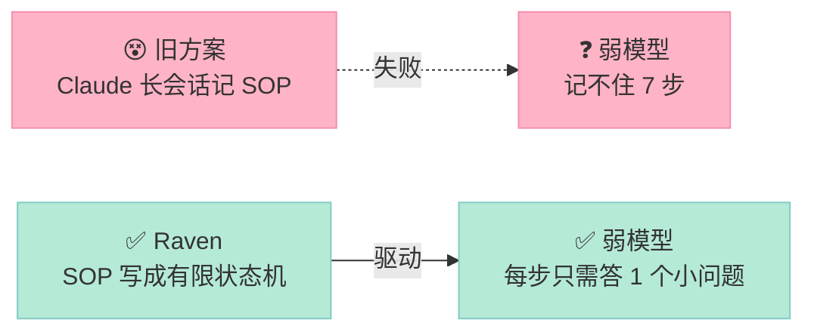
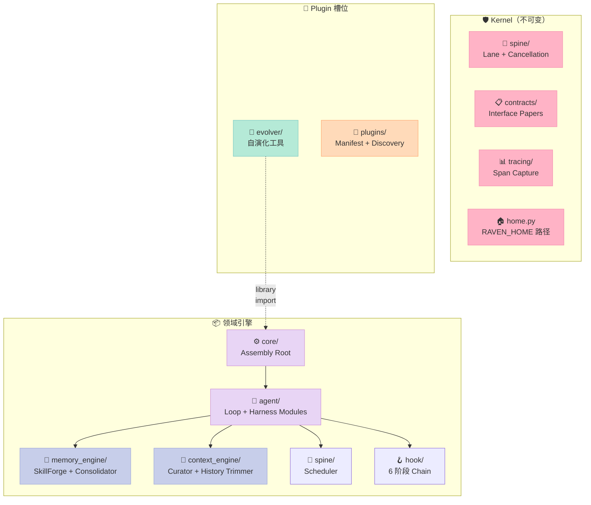
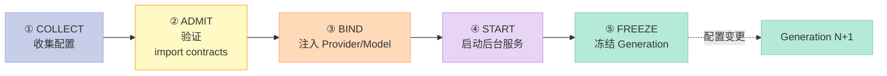
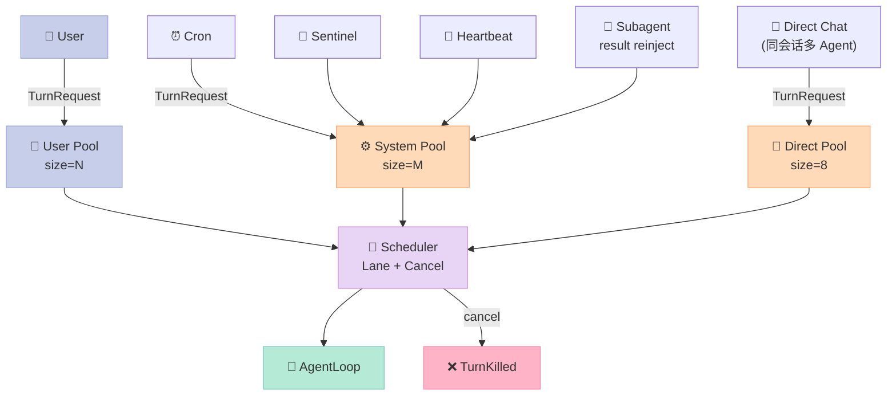
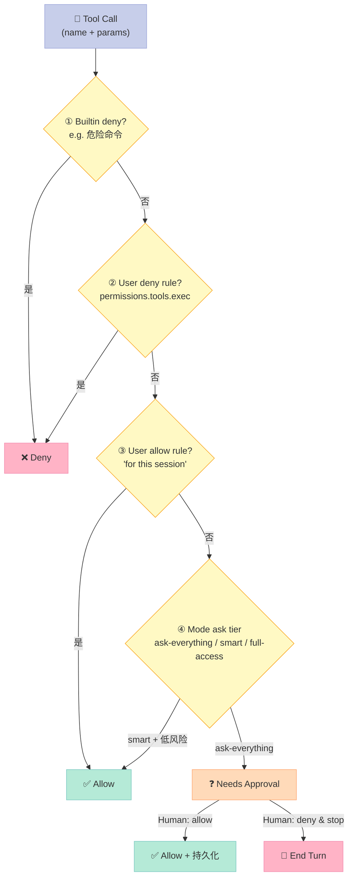
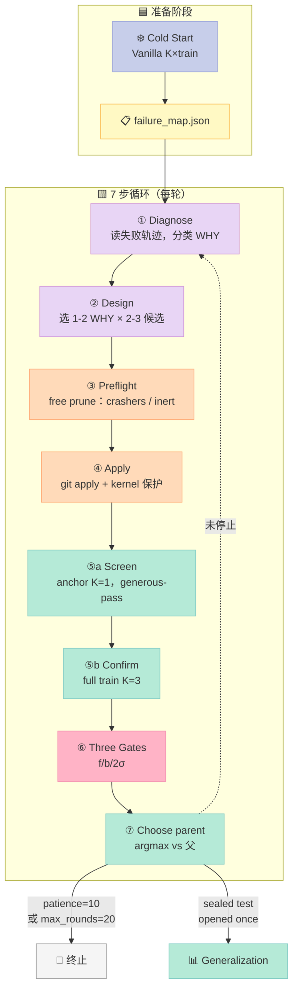
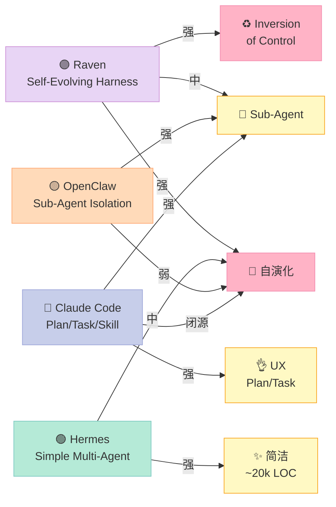

> **一句话结论**：Raven 不是又一个 Agent 框架，它把"如何让 Harness 自我演化"这件事**写成了有限状态机** —— 把 Claude 长 prompt 才能记牢的 7 步 SOP 倒置成代码，让 Qwen/Kimi 这种弱驱动模型也能跑全流程。

---

## 前言：当 Harness 自己会变强

Harness Engineering 系列写到第 50+ 篇，"Harness"这个概念已经被拆得足够细：Rule 怎么写、Skill 怎么组织、Sub-Agent 怎么隔离、Workflow 怎么编排、Script 怎么把关、MCP 怎么暴露。但**有一个问题一直被回避**：Harness 本身写完就定型了，模型变强、任务变多、旧策略失效，**谁来改 Harness 本身**？

主流答案有三个方向：

- **A 流派（Agent 改 Agent）**：让一个 Coding Agent 读失败的轨迹，自己 patch 代码。但需要长会话、强指令遵循能力，Claude 才能稳定。
- **B 流派（人改 Harness）**：Harness 作者每周看 benchmark，写新 prompt/template。但反馈周期长、瓶颈在人力。
- **C 流派（Inversion of Control）**：把"流程"从 prompt 里搬到代码里，让弱模型也能驱动 —— **Raven 走的就是这一条**。

[EvoAgentBench](https://github.com/EverMind-AI/EvoAgentBench) 上 Raven 拿了 **#1**，**+6.2pp** 高于第二名；ProAgentBench 上 Proactivity 0.60 F1，**2.4×** 于 Hermes/OpenClaw（0.253）。这些数字不是偶然，是设计哲学落地的结果。

读完这篇你会得到：

1. **6 大原语** 的完整解析，每个原语对应一个具体的代码模块
2. **Evolver 7 步漏斗** + **3 关验证 + K=3 confirmation** 的真实代码
3. **和 4 个标杆 Harness**（Hermes、OpenClaw、Claude Code、AutoGen）的横向对比
4. **从零搭建的 MVP 路径**：哪些必须、哪些可以省略、哪些会踩坑

---

## 一、Raven 是什么？先看定位

### 1.1 项目速览

| 维度 | 数据 |
|------|------|
| **GitHub** | [EverMind-AI/Raven](https://github.com/EverMind-AI/Raven)（⭐ 3860） |
| **最新推送** | 2026-09-14T11:55:57Z（**昨天仍在活跃**） |
| **License** | Apache-2.0 |
| **Topics** | `ai`、`ai-agents`、`anthropic`、`claude`、`codex`、`self-evolving`、`self-improving`、`harness` |
| **创建日期** | 2026-05-21（约 4 个月前） |
| **代码量** | Python ~135k LOC（`raven/` + `evolver/` + `agents/`） |
| **核心描述** | "**The Harness of Harnesses**: a trusted, persistent, self-evolving multi-agent ecosystem for all-domain collaboration" |

### 1.2 它解决了什么问题

把"自演化 Harness"这件事从**长 prompt 依赖**变成**可重放代码依赖**：



**直接表现**：

- 换 Qwen / Kimi 跑 Evolver → 流程**不崩**，结果**可信**
- 每一步都有 schema validation + bounded retries，错误就地捕获
- 完整的 on-disk state（`failure_map.json`、`nodes/*.json`、`findings.md`）可 resume

### 1.3 在 Harness 6 件套矩阵里处于哪个位置

| 6 件套组件 | Raven 覆盖度 |
|----------|------------|
| **Rule** | ✅ `permissions/builtin.py` + `permissions/rules.py`（**3-tier waterfall**） |
| **Skill** | ✅ `memory_engine/skill_forge/` + `skill_hub/`（**3 源 RRF 融合**） |
| **Sub-Agent** | ✅ `agent/subagent/`（**DAG 调度器，94567 chars**） |
| **Workflow** | ✅ `playbook/` + `agent/subagent/dag_*.py` |
| **Script** | ✅ `permissions/shell_policy.py`（**52553 chars** 的命令白名单/黑名单） |
| **MCP** | ✅ `mcp/` + `agent/loop/mcp_glue.py` |

**它是 Harness 6 件套的"超集 + 自演化引擎"** —— 6 件套是静态组件，**Evolver 是让它们一起进化的元组件**。

---

## 二、架构：5 个 Kernel 包 + 35 个领域模块

Raven 的目录结构本身就是一张系统图。**最外层 5 个目录 + 35 个 raven/ 子包 + 11 个 evolver/ 子包**，映射了从 LLM 到用户的完整栈。

### 2.1 顶层 Kernel 包（不可变核心）



### 2.2 完整模块表（35 个 raven/ 子包）

源码：`raven/` 顶层 README 引用的运行时包表（精简版）：

| 包路径 | 职责 | 关键类 |
|--------|------|--------|
| `core/` | Assembly Root + 5 阶段组装 | `build_runtime`, `RavenRuntime` |
| `spine/` | Lane scheduling + cancel + event delivery | `Scheduler`, `TurnRunner`, `OriginPools` |
| `agent/loop/` | Agent Loop 主类（5 步） | `AgentLoop`, `TurnPathMixin` |
| `agent/harness/` | 4 模块 Harness 策略 | `DefaultMemory/Planning/Capability/Action` |
| `agent/subagent/` | DAG 调度器（94567 chars） | `SubagentManager`, `DagRunner` |
| `agent/hook/` | 6 阶段 Hook Chain | `CompositeHook`, `HookDecision` |
| `context_engine/` | Curator + 历史 trimmer | `Curator`, `HistoryTrimmer` |
| `memory_engine/` | SkillForge + Consolidator | `SkillForgeRouter`, `MemoryStore` |
| `mcp/` | MCP server 连接管理 | `MCPConnectionManager` |
| `permissions/` | 3-tier 决策 waterfall | `PermissionGate`, `BuiltinRulings` |
| `skill_hub/` | HTTP 客户端（2048 byte 限制） | `SkillHubClient` |
| `routing/` | 模型路由器（KNN） | `ModelRouter`, `EmbeddingRouter` |
| `providers/` | LLM 适配器 | `ProviderPool` |
| `sandbox/` | 隔离执行 + VM 生命周期 | `SandboxExecutor` |
| `security/` | 出站地址策略 + 防 prompt 注入 | - |
| `proactive_engine/` | Sentinel + cron + heartbeat | `SentinelStack`, `Wake` |
| `playbook/` | 可复用 workflow 库 | - |
| `tracing/` | Span 捕获 + artifact 管理 | - |
| `trajectory/` | 执行 bundle + 回放 | - |
| `token_wise/` | Token 用量 + 缓存策略 | - |
| `updates/` | 升级发现 + 安装 handoff | - |

**领域模块**都是可换的（配置 + 插件 + 启动 hook），但 **5 个 Kernel 包组成不可变边界**（`spine/`, `contracts/`, `tracing/`, `home.py`, `core/runtime.py`）。

> ⚠️ **设计哲学**：Inner runtime 包**不能 import CLI/RPC/ACP 表面**，由 `pyproject.toml` 中的 import contracts 强制执行。这意味着你**永远不能用 Agent Loop 反向操作 CLI** —— 这是机制和策略分离的最彻底体现。

---

## 三、6 大原语深度解析

接下来 6 节是本文的**核心**：把 Raven 拆成 6 个具体可运行/可理解的原语，每个原语都能在 `raven/` 或 `evolver/` 下找到对应源码。

### 原语 1：Assembly Root + Frozen Generation

**问题**：配置热更新时，怎么保证正在跑的 turn 不受影响？

**答案**：5 阶段组装 + 运行时不可变。

```python
# raven/core/runtime.py
@dataclass(frozen=True)
class RavenRuntime:
    """One assembled generation of the agent: the loop plus the parts an
    entrance still needs handles to after construction.

    Frozen: FREEZE is the last of the composition phases (COLLECT, ADMIT,
    BIND, START, FREEZE), and this is its machine. After construction a
    generation is sealed -- a change is generation N+1 through the swap path,
    never an in-place mutation of N.
    """
    loop: "AgentLoop"
    plugin_registry: Any
    backend: Any
```

**5 个组装阶段**：



**3 个合法的 mid-generation door**（既不破坏 Frozen 又支持热更新）：

1. **`loop.apply_agents`**：更新 agents 表，**与启动共用一条写入路径**
2. **`loop.apply_mcp_config`**：同步 MCP server 集合到 `tools.mcpServers`
3. **`loop.set_default_binding`**：重指向 fallback binding

**不在 mid-generation door 范围内**（必须 generation swap）：

- session 拥有的状态（per-session binding、modes、MCP adoption）
- 通过 `config/live.py` 读取的 preferences
- 进程级 globals

> 💡 **关键洞察**：这和 Kubernetes Pod 的 `generation` 概念一脉相承 —— 配置变更是"启动新容器"，不是"在老容器里改文件"。**对正在跑的 turn 来说，配置是只读的**。

---

### 原语 2：Spine Lane + 3-Pool Scheduler

**问题**：不同来源（用户 / cron / heartbeat / subagent）的 turn 怎么排程？谁先谁后？

**答案**：per-conversation lane + per-origin pool。

```python
# raven/spine/scheduler.py
# Proactive origins share the system pool. SUBAGENT here is the result-reinjection
# turn; a subagent's own execution runs off the scheduler behind a separate gate.
_SYSTEM_ORIGINS = (Origin.SENTINEL, Origin.CRON, Origin.HEARTBEAT, Origin.SUBAGENT)

_DEFAULT_IDLE_TTL = 300.0  # seconds a lane may sit idle before the reaper reclaims it
_SWEEP_INTERVAL = 60.0     # seconds between reaper sweeps
_DEPTH_WARN_THRESHOLD = 50  # warn once when a lane's pending queue reaches this depth

class OriginPools:
    """Per-origin concurrency gates: USER pool + system pool + direct chat pool."""

    def __init__(self, user: int, system: int, direct: int = 8):
        self._user = _gate(user)
        self._system = _gate(system)
        self._direct = _gate(direct)
```

**关键设计原则**：

- **3 个 pool 隔离**：用户池、系统池（cron/sentinel/heartbeat/subagent）、直聊池
- **用户 turn 永远不排在系统 turn 后面**（"a user turn never waits on an LLM slot behind a proactive task"）
- **lane 是 cancel 单元**：同会话串行，不同 lane 并行
- **`direct` 是第三个 pool 而非第三个 origin**：因为它**是 USER turn**，需要在每个 origin 开关里维护



**对比 Hermes / OpenClaw**：两者都是单 pool + 全局并发限制。用户 turn 会和 cron/sentinel 抢占同一个 LLM slot。**Raven 的 3-pool 隔离**消除了"我正在和 Agent 说话，结果一条 Sentinel 提醒把它挤掉"的灾难。

---

### 原语 3：4 模块 Harness 策略 + Callable 注入

**问题**：怎么替换 Agent Loop 的"策略"而不动它的"机制"？

**答案**：4 个可注入的 Harness Modules + **Callable 而非 Instance**（应对 hot-reload）。

```python
# raven/agent/harness/__init__.py
def default_harness_modules(
    engine: "ContextEngine",
    registry_provider: Callable[[], "ToolRegistry"],
    *,
    provider: Callable[[], Any],
    model: Callable[[], str],
    context_window_tokens: Callable[[], int],
    system_prompt: Callable[[list[Any] | None], str],
) -> HarnessModules:
    """Assemble the default four around this generation's own organs."""
    memory = DefaultMemory(
        engine,
        provider=provider,           # ← Callable
        model=model,                 # ← Callable
        context_window_tokens=context_window_tokens,  # ← Callable
        tool_definitions=lambda: registry_provider().get_definitions(),
        system_prompt=system_prompt,
    )
    return HarnessModules(
        memory=bind_memory(memory),
        planning=DefaultPlanning(),
        capability=DefaultCapability(registry_provider),
        action=DefaultAction(),
    )
```

**4 个 Harness Modules**：

| 模块 | 职责 | 默认实现 |
|------|------|----------|
| **Memory** | 决定这一轮发给 LLM 的"窗口"是什么 | `DefaultMemory`：context engine + 工具定义 + system prompt |
| **Planning** | 决定要不要重写 messages | `DefaultPlanning`：**完全 pass-through**（重要，见下） |
| **Capability** | 决定这一轮显示哪些工具 | `DefaultCapability`：直接读 `ToolRegistry.get_definitions()` |
| **Action** | 决定 LLM 调用方式（流式/重试） | `DefaultAction`：有 sink 走 stream，无 sink 走 retry ladder |

**Planning 默认 pass-through 的设计哲学**（非常关键）：

```python
# raven/agent/harness/planning.py
class DefaultPlanning:
    """Return the turn's messages unchanged: zero model calls, zero rewrites."""
    async def prepare(self, request: PlanningRequest) -> PlanningResult:
        return PlanningResult(messages=request.messages)
```

> "Planning is the model's own, said in its own text, and the position ahead of the iterations was measured to be the wrong one for a harness to take it: the playbook funnel that used to sit there judged one message with no history and, on a hit, replaced the whole turn — so **the party with the least context made the most expensive call**. It was removed."

**翻译**：以前有个 Playbook funnel 抢在 iterations 之前，根据"一条消息 + 没有历史"判断要不要接管整个 turn —— 这是"用最少的信息做最贵的决定"。**被砍掉了**。

**正确的 Planning 钩子是 `before_iteration` Hook**（每轮迭代前都有完整 history），让产品在那一层做拦截，**而不是在 iterations 之前**。

**Callable 而非 Instance 的原因**：

```python
# comment from harness/memory.py:
"""
Takes a provider callable rather than the registry itself: the loop
rebuilds its registry across a generation swap, and a captured instance
would keep answering for the retired one.
"""
```

`/model` 切换会 rebuild provider，hot config apply 会 rebuild registry。如果 capture instance，会**继续回答旧的 provider/registry 的问题**。**Callable 让你永远拿到"当前 generation"的实例**。

---

### 原语 4：Permission 3-tier Waterfall

**问题**：工具调用的权限怎么判定？

**答案**：4 步 waterfall + 3 档 ask tier + "for this session" 持久化。

```python
# raven/permissions/gate.py
async def check(self, tool_name: str, params: dict[str, Any]) -> Decision:
    """The waterfall: builtin deny, user deny, user allow, then the mode's reading of the ask tier."""
    cfg = self._config_source()
```

**4 步决策 waterfall**（源码注释直接写）：



**3 档 ask tier**：

- **`ask-everything`**：每个工具调用都问
- **`smart-review`**：低风险直接过，高风险问
- **`full-access`**：除了 builtin deny，全过

**`allow_ask` 是 gate 构造时固定的，不读 turn**：

```python
# from gate.py docstring:
"""
``allow_ask`` is fixed per gate, not read from the turn: a sub-agent's task
inherits the parent turn's context by asyncio's own rule, so a gate built for
an unattended registry must refuse to ask even when a responder is visible in
its context.
"""
```

**含义**：sub-agent 的 asyncio 上下文继承了父 turn 的 responder —— 如果 gate 读 turn，就会看到 responder 然后弹窗，但 unattended sub-agent **不应该弹窗**（没人看）。**`allow_ask=False` 在构造时就固定了**。

**对比 Claude Code / Hermes**：Claude Code 的 Permission 系统是逐调用 hook（PreToolUse），判断分散；Raven 是 **4 步 waterfall + 决策缓存 + 模式化**，**结构化更彻底**。

---

### 原语 5：SkillForge RRF 融合 + 3 源路由

**问题**：Agent 需要按当前 query 从 3 个来源（Local / EverOS / Hub）召回 Skill，怎么融合排序？

**答案**：Per-source over-fetch + Weighted RRF + 单源失败隔离。

```python
# raven/memory_engine/skill_forge/router.py
class SkillForgeRouter:
    def __init__(
        self,
        sources: list[ForgeSkillSource],
        *,
        over_fetch_factor: int = 2,
        dedup_by: str = "name",
        rrf_k: int | None = None,
    ):
        self._sources = sources
        self._over_fetch_factor = max(1, over_fetch_factor)
        ...

    async def select(
        self,
        query: str,
        history: list[dict[str, Any]],
        k: int = 5,
    ) -> list[RouterHit]:
        """Fan out to every source concurrently, fuse to top-K."""
        per_source_k = k * self._over_fetch_factor  # ← over-fetch 2×
        per_source = await asyncio.gather(*[self._safe_search(...) for s in self._sources])
        return rrf_merge_weighted(
            [(s.name, s.weight, hits) for s, hits in zip(self._sources, per_source)],
            k=k,
            dedup_by=self._dedup_by,
            rrf_k=self._rrf_k,
        )

    async def _safe_search(self, source, query, history, k):
        try:
            return await source.search(query, history, k)
        except Exception as e:
            logger.warning(...)  # ← 单源失败隔离
            return []
```

**3 个 source**：

| Source | 来源 | 用途 |
|--------|------|------|
| `LocalSkillSource` | 本地 `~/.raven/skills/` | 个人常用 skill |
| `EverosSkillSource` | EverOS 记忆后端（host-internal） | 从记忆里召回相关 skill |
| `HubSkillSource` | SkillHub OpenAPI（HTTP） | 公共 catalog，含 [114,190 skills](https://github.com/EverMind-AI/SkillCorpus) |

**加权 RRF（Reciprocal Rank Fusion）公式**：

```python
# raven/memory_engine/skill_forge/fusion.py
def rrf_merge_weighted(
    sources: list[tuple[str, float, list[RouterHit]]],  # (name, weight, hits)
    *,
    k: int,
    dedup_by: str = "name",
    rrf_k: int | None = None,
) -> list[RouterHit]:
    """
    For each hit: score = sum(weight_i / (rrf_k + rank_i))
    where rank_i is the hit's position in source i's ranking.
    """
```

**Per-source over-fetch 2× 的理由**（源码注释直接写）：

> "Over-fetching matters because a source's #3 hit might be a great cross-source merge candidate even if it would never be a top-3 by itself."

**翻译**：每个 source 召回 2k 个候选，RRF 融合后再取 top-k。**因为 source A 的 #3 可能和 source B 的 #1 互补 —— 但 A 自己的 #3 永远进不了 top-3**。

**单源失败隔离**（`_safe_search`）：Hub HTTP 挂了、EverOS 死了 —— **不影响其他 source 召回**，整个 pipeline 不会因为一个 transient 而全挂。

**对比 LangChain 工具调用 / Hermes Skill 加载**：前者是"按关键词查向量库"，命中率高但召回窄；Hermes 是"按目录结构加载"，精确但缺关联。**SkillForge 用 RRF 融合 3 源 + over-fetch + weighted**，是**召回率和精度的平衡点**。

---

### 原语 6：Evolver 7 步漏斗 + 3 关验证 + K=3 Confirmation

**这是 Raven 最独特的原语**。Evolver 是独立工具（不 import 到 runtime），把"诊断失败 → 设计 patch → 验证 → 保留有效变更"的 SOP 倒置成代码。

#### 6.1 7 步漏斗



#### 6.2 终止条件（vanilla 而非 parent）

```python
# evolver/orchestrator/termination.py
@dataclass
class TerminationTracker:
    """Track per-round outcomes across rounds and decide when to stop."""

    patience: int = 10
    max_rounds: int = 20
    max_consecutive_errors: int = 5

    def record_round(self, promoted: bool, *, errored: bool = False) -> None:
        """promoted: True iff at least one candidate's full-train confirm beat VANILLA."""
        self.rounds_completed += 1
        if errored:
            self.consecutive_errors += 1
            return  # 错误不烧 patience
        self.consecutive_errors = 0
        if promoted:
            self.consecutive_no_promotion = 0
        else:
            self.consecutive_no_promotion += 1

    def should_stop(self) -> tuple[bool, str | None]:
        if self.rounds_completed >= self.max_rounds:
            return True, "max_rounds"
        if self.consecutive_errors >= self.max_consecutive_errors:
            return True, "errors_exhausted"
        if self.consecutive_no_promotion >= self.patience:
            return True, "patience_exhausted"
        return False, None
```

**关键设计**：

| 信号 | 含义 | 烧哪个 counter |
|------|------|--------------|
| `promoted=True` | 有候选 beat vanilla on train | reset patience |
| `promoted=False` | 没候选 beat vanilla | `consecutive_no_promotion += 1` |
| `errored=True` | 该轮没产出任何决策 | **`consecutive_errors += 1`，不烧 patience** |

**为什么"对比 vanilla"而不是"对比父"**？源码注释直接写：

> "The SOP's patience signal (no candidate's train mean beats vanilla for N consecutive rounds), **measured against vanilla for every benchmark** regardless of which baseline provider gates promotion."

**翻译**：父基线会被 ratchet 抬升（每代都更强），但 **vanilla 永远不动**。如果你在每个 round 都和"上一代"比，会陷入"自我感觉良好"（永远比父强一点）。**和 vanilla 比**才能告诉你"探索是否已经触顶"。

#### 6.3 3 关验证（每个 candidate 必须过的3 道关）

```python
# evolver/orchestrator/loop.py 的注释
"""
- *measurement validity:* infrastructure failures (crash/timeout) are not
  scored as 0; rerun or handle explicitly;
- *attribution correctness:* credit only on tasks where the patch's
  mechanism actually fired;
- *significance:* **paired comparison** against the baseline; the lift must
  clear 2σ to count.
"""
```

| Gate | 名字 | 作用 | 关键检查 |
|------|------|------|----------|
| **Gate-f** | measurement validity | 排除 infra 失败 | infra_attempts 重跑后仍 > 0 → 不计 |
| **Gate-b** | attribution correctness | 排除"patch 没生效却计了分" | python patch 必须有 `activation_beacon()`，beacon 触发才计分 |
| **Gate2** | significance | 排除噪声 | **paired comparison** vs baseline，**lift 必须超过 2σ** |

**为什么必须 paired comparison**？同一个 task 在 baseline 和 candidate 各跑 K=3 一次，**逐 task 对比分数差**（而不是比较两个分布的均值）。这能消除 task 难度差异带来的噪声。

**2σ 的来源**：PairedTwoSigmaGate（`gates/strategies.py`）。 **paired t-test 的简化版**：lift_mean > 2 * lift_std 才算显著。

**Gate-b 的妙处（beacon 机制）**：Python patch 必须显式调用 `activation_beacon()`，由 `batch.py` 在 task-attempt subprocess 里**注入私有 beacon 目录**。Patch **没调 beacon = 没生效 = 不计分**。这避免了"patch 加了但没运行，仍拿了 baseline 的分数当自己的"。

```python
# AppWorld line 的 Gate-b 实际逻辑（loop.py docstring）
"""
- *Gate-b (active on the AppWorld line):* python patches must carry
  ``activation_beacon()`` (missing = rejected, checked post-edit); ``batch.py``
  injects a private beacon dir per task-attempt subprocess; ``fired_source``
  reads the per-task firing table back from the confirm out-dir + infra-ladder
  union; attribution only on fired tasks.
"""
```

**Sealed test set 的铁律**：

```python
# evolver/orchestrator/config.py
# Sealed test: scored by a script into a dir the driver never reads, so the
# sealed-test rule is enforced by isolation, not by driver discipline.
sealed_test_split: str = "test"
sealed_output_dir: Path | None = None
```

**测试集分离写入一个目录**，driver（LLM）**不能读这个目录**。这不是 prompt 约束，是 **文件系统隔离**。**Iron law：永远不要从测试集决策** —— 测试集只在最终 unseal 时打开一次。

#### 6.4 Inversion of Control 的实操含义

```python
# evolver/orchestrator/loop.py
"""
This is the layer the SOP used to delegate to a long, high-compliance Claude
session. Here the control flow is code: the round loop, the per-candidate fork,
parent selection, and the stop decision.

Everything bench-specific is bundled in an injected :class:`~evolver.orchestrator.scoring.EvalBackend`;
the per-candidate decision (screen -> confirm -> promote) and the control arm are
injected as a :class:`GatePolicy` and a :class:`BaselineProvider`. So a weaker
driver model (Qwen / Kimi) can run the loop without remembering the funnel's
shape, and SWE-bench / AppWorld / a no-benchmark LLM judge all share one loop —
they differ only in which backend + policy + baseline get wired in.
"""
```

**注入点**（Protocol 形式定义）：

| 注入点 | Protocol | 谁实现 |
|--------|----------|--------|
| `EvalBackend` | scoring 协议（train/test split + K trials） | SWE-bench / AppWorld / LLM judge |
| `GatePolicy` | 晋升决策（screen → confirm → promote） | PairedTwoSigmaGate / FocusedFisher |
| `BaselineProvider` | 对照臂（vanilla 还是 per-parent） | FrozenColdStartBaseline |
| `diagnose_fn` | 读轨迹返回 failure map | driver model + judge |
| `design_fn` | 选 WHY + 设计候选 patch | driver model |
| `preflight_fn` | 零 GPU 候选剔除 | `make_zero_hit_preflight` |
| `apply_fn` | 把 patch 应用到父、创建子节点 | git apply + kernel 保护 |
| `verdict_fn` | 为 findings.md 写每轮结论 | driver model |

**含义**：把"流程"全部写进代码，**driver 模型只回答每个 step 的一个小问题**（schema-validated + bounded retries）。**Qwen / Kimi 都能跑全流程**，因为它们不需要"记住 7 步是什么"。

---

## 四、横向对比：Raven vs 4 个标杆 Harness

为了让你看清 Raven 的定位，选 4 个最有代表性的对比：

### 4.1 横向对比表

| 维度 | Raven（3860⭐） | Hermes Agent | OpenClaw | Claude Code | AutoGen |
|------|----------------|--------------|----------|-------------|---------|
| **自演化能力** | ✅ **Evolver 7 步漏斗 + 3 关 + K=3 + sealed test** | ⚠️ 需外部脚本 | ⚠️ 需外部脚本 | ❌ 无 | ❌ 无 |
| **Inversion of Control** | ✅ SOP 写成 FSM | ❌ 仍依赖 prompt | ❌ 仍依赖 prompt | ❌ 仍依赖 prompt | ❌ 仍依赖 prompt |
| **Assembly Root** | ✅ 5 阶段 + Frozen Generation | ⚠️ 单点配置 | ⚠️ 单点配置 | ⚠️ 单点配置 | ⚠️ 配置散落 |
| **Lane + Cancellation** | ✅ Spine lane + 3-pool | ⚠️ 全局 FIFO | ⚠️ 全局 FIFO | ❌ 单 turn 阻塞 | ✅ group chat |
| **4 Harness Modules** | ✅ Memory/Planning/Capability/Action | ⚠️ 部分 | ⚠️ 部分 | ❌ 隐式 | ❌ 隐式 |
| **Permission 模型** | ✅ 4 步 waterfall + 3 ask tier | ⚠️ 简单 hook | ⚠️ 简单 hook | ✅ 复杂规则 | ⚠️ 函数返回 |
| **SkillForge RRF** | ✅ 3 源 + weighted RRF + over-fetch | ⚠️ 目录加载 | ⚠️ Skill 单源 | ⚠️ 工具列表 | ⚠️ 工具列表 |
| **驱动模型** | ✅ 弱模型可驱动 evolver | ⚠️ 需 GPT-4 | ⚠️ 需 Claude | ✅ 仅 Claude | ⚠️ 需强模型 |
| **EvoAgentBench #1** | ✅ **#1 +6.2pp** | - | - | - | - |
| **ProActivity F1** | **0.60**（2.4× Hermes） | 0.253 | 0.253 | - | - |
| **License** | Apache-2.0 | MIT | Apache-2.0 | Proprietary | CC-BY-4.0 |
| **代码量** | ~135k LOC（最大） | ~20k LOC | ~5k LOC | 闭源 | ~30k LOC |

### 4.2 设计哲学对比

#### 4.2.1 vs Hermes Agent（Multi-Agent 编排标杆）

**Hermes** 强在**简洁**（~20k LOC），但它的多 Agent 是"按 Role 定义 + 让 GPT-4 调度"。**没有自演化**：

- Harness 写完就定型，benchmark 不变
- 弱模型驱动 Hermes 会丢失很多调度逻辑
- 没有 Sealed test / 3 gate 验证，新增 skill 全靠 PR review

**Raven** 反向：把"让 Harness 变强"这件事**工程化**，但代价是 ~135k LOC（**6.7× Hermes**）和更高的概念密度。

#### 4.2.2 vs OpenClaw（Sub-Agent 多租户）

**OpenClaw** 强在**Sub-Agent 多租户隔离**（context.WithoutCancel 切断、agent_links 权限校验、EventSubagentStart 阻塞拦截），但定位**和 Raven 完全不重叠**：

- OpenClaw 是 **Sub-Agent 组件**的极致实现
- Raven 是 **Harness of Harnesses**（包含 Sub-Agent 但远不止）

**互补关系**：你完全可以把 OpenClaw 当作 Raven 的 Sub-Agent 后端（README 提到 OpenClaw plugin 在 `EverMind-AI/plugins`）。

#### 4.2.3 vs Claude Code（Anthropic 官方）

**Claude Code** 强在 **Plan/Task/Skill 三件套 + Subagent**，但：

- **闭源**，不能 fork 改 Harness 本身
- 不允许**让 Harness 自己改自己**
- Permission 走复杂规则配置而非 4 步 waterfall

**Raven 是 Claude Code 的"开源 + 可自演化"版本**。

#### 4.2.4 vs AutoGen（学术 Multi-Agent）

**AutoGen** 强在**学术血统**（Microsoft Research）和 **GroupChat 模式**，但：

- Agent 间通信靠 message passing，没有 **DAG 调度器**（Raven `dag_runner.py` 94567 chars）
- 没有 4 Harness Modules 抽象
- 没有自演化能力

**Raven 的 Sub-Agent DAG Runner 是 AutoGen GroupChat 的工业化升级**。

### 4.3 关键设计差异总结



---

## 五、优缺点分析

### 5.1 架构简洁性 vs 复杂度

| 维度 | 评价 |
|------|------|
| ✅ **极简默认** | 4 Harness Modules 默认是 `behavior-preserving`：换它们什么都不变（默认 memory 就是 context engine） |
| ✅ **机制和策略分离极致** | Inner runtime 不能 import CLI/RPC/ACP（`pyproject.toml` 强制） |
| ✅ **Frozen Generation** | 5 阶段组装 + 不可变 runtime，避免配置竞态 |
| ⚠️ **概念密度高** | ~135k LOC，35 个 raven/ 子包，新人需要 1-2 周熟悉 |
| ⚠️ **过度工程风险** | Sealed test set、3 gate、paired comparison —— 不是所有场景都需要 |

### 5.2 扩展性 vs 易用性

| 维度 | 评价 |
|------|------|
| ✅ **插件机制完整** | `plugins-dist/`（everos-memory / design-engine / ppt-engine）、13 个 preset 第三方 agent 适配器 |
| ✅ **SubAgent DAG** | `dag_runner.py` 94567 chars 的 ready-set 调度器 |
| ✅ **13 preset 第三方 agent** | Claude Code, Codex, OpenCode, Hermes, OpenClaw, MiroThinker, Copilot, Qwen, CodeBuddy, Qoder, Grok, Kimi, Pi |
| ⚠️ **预置 agent 集成** | Raven-Code/Raven-Research/Raven-Design/Raven-Oncall 是 Raven 自己维护的，不一定能匹配所有场景 |
| ⚠️ **Evolver 学习曲线陡** | SOP 本身有 30+ 页文档（`docs/specs/self-evolution-loop-sop.md`） |

### 5.3 性能 vs 维护性

| 维度 | 评价 |
|------|------|
| ✅ **Benchmark 强** | EvoAgentBench #1 +6.2pp、ProAgentBench 0.60 F1（2.4× 同行） |
| ✅ **Token 效率** | 56.7% at 27B / 58.1% at 397B（vs Hermes 46.8%/47.9%） |
| ✅ **on-disk state 可 resume** | `failure_map.json` / `nodes/*.json` / `findings.md` |
| ⚠️ **依赖 4 周冷启动** | Vanilla cold-start K×train 是 1 次性成本，但 K=10+ train × N 任务不小 |
| ⚠️ **Evolver 单次跑可能很久** | patience=10 + max_rounds=20，每次 K=3 confirmation × 多个 candidate |

---

## 六、从零搭建启示（最小可行实现）

如果想**自己复刻一个简化版 Evolver**，从 Raven 学到的核心是 **"把 SOP 写成代码"**。下面给一个 MVP Python 脚本，展示 6 个关键决策点。

### 6.1 MVP Evolver：4 个核心原语

```python
"""
raven_evolver_mvp.py — 简化版 Evolver 7 步漏斗
体现 Raven 的 4 个核心原语：
  1. Frozen baseline（vanilla cold-start）
  2. WHY taxonomy + per-candidate design
  3. K=3 paired comparison
  4. Three gates + Sealed test
"""
import statistics
from dataclasses import dataclass, field
from typing import Callable, Optional
from enum import Enum


# ===== 1. 数据结构（来自 evolver/orchestrator/scoring.py）=====
@dataclass(frozen=True)
class TaskEval:
    """Per-task K-trial outcome — the universal currency the funnel scores in."""
    task_id: str
    passes: int
    attempts: int

    @property
    def pass_rate(self) -> float:
        if self.attempts == 0:
            return 0.0
        return self.passes / self.attempts


# ===== 2. WHY Taxonomy（来自 evolver/judge/schema.py）=====
class PatchWhy(str, Enum):
    """WHY — a failure-cause class. From README's failure_map."""
    STOPS_BEFORE_VERIFY = "stops_before_verifying"
    BAD_TOOL_CALLS = "bad_tool_calls"
    TIME_ARITHMETIC = "time_arithmetic_errors"
    BUDGET_AWARENESS = "budget_awareness"
    OTHER = "other"


# ===== 3. Candidate + parent node =====
@dataclass
class HarnessNode:
    """One version of the harness (parent or candidate)."""
    node_id: str
    patch_why: PatchWhy
    patch_content: Optional[str] = None  # None = vanilla
    train_score: float = 0.0
    test_score: Optional[float] = None  # 仅 unseal 后填


# ===== 4. Vanilla baseline（frozen，永远不变）=====
class FrozenColdStartBaseline:
    """The fixed comparison bar. NEVER mutated after cold-start."""
    def __init__(self, vanilla_evals: dict[str, TaskEval]):
        self._vanilla_evals = vanilla_evals
        self._mean = statistics.mean(
            e.pass_rate for e in vanilla_evals.values()
        )
        print(f"❄️ Cold-start vanilla baseline: {self._mean:.3f}")

    def mean(self) -> float:
        return self._mean


# ===== 5. Three Gates（来自 evolver/orchestrator/gates/pipeline.py）=====
def gate_f_measurement_validity(candidate_evals: dict[str, TaskEval]) -> bool:
    """Gate-f: enough valid (non-infra) measurements.
    MVP: 所有 task 都至少有 1 次 attempt。"""
    return all(e.attempts > 0 for e in candidate_evals.values())


def gate_b_attribution_correctness(candidate: HarnessNode, fired_task_ids: set[str]) -> bool:
    """Gate-b: candidate's mechanism actually fired.
    MVP: 假设 config/prompt patch 自动过，python patch 需要 fired_task_ids 非空。"""
    if candidate.patch_content is None:
        return True  # vanilla
    if "beacon()" in candidate.patch_content:  # python patch
        return len(fired_task_ids) > 0
    return True  # config/prompt patch：beacon-exempt


def gate_2_significance(
    candidate_evals: dict[str, TaskEval],
    baseline_evals: dict[str, TaskEval],
    sigma_mult: float = 2.0,
) -> tuple[bool, float]:
    """Gate-2: paired comparison vs baseline, lift must clear 2σ."""
    paired_diffs = []
    for tid, cand_eval in candidate_evals.items():
        if tid in baseline_evals:
            base_eval = baseline_evals[tid]
            paired_diffs.append(cand_eval.pass_rate - base_eval.pass_rate)

    if len(paired_diffs) < 2:
        return False, 0.0

    mean_diff = statistics.mean(paired_diffs)
    std_diff = statistics.stdev(paired_diffs)
    if std_diff == 0:
        return mean_diff > 0, mean_diff

    z = mean_diff / std_diff
    return z > sigma_mult, z


# ===== 6. Termination（来自 evolver/orchestrator/termination.py）=====
@dataclass
class TerminationTracker:
    patience: int = 5
    max_rounds: int = 10
    rounds_completed: int = 0
    consecutive_no_promotion: int = 0

    def record_round(self, promoted: bool, errored: bool = False) -> None:
        self.rounds_completed += 1
        if errored:
            return  # 不烧 patience
        if promoted:
            self.consecutive_no_promotion = 0
        else:
            self.consecutive_no_promotion += 1

    def should_stop(self) -> tuple[bool, str | None]:
        if self.rounds_completed >= self.max_rounds:
            return True, "max_rounds"
        if self.consecutive_no_promotion >= self.patience:
            return True, "patience_exhausted"
        return False, None


# ===== 7. Evolver 主循环 =====
def evolve_one_round(
    round_idx: int,
    parent: HarnessNode,
    baseline: FrozenColdStartBaseline,
    candidates: list[HarnessNode],
    eval_fn: Callable[[HarnessNode], dict[str, TaskEval]],
    baseline_evals: dict[str, TaskEval],
) -> Optional[HarnessNode]:
    """对每个 candidate 跑 K=3 confirmation，过 3 关，返回胜者。"""
    survivors = []

    for cand in candidates:
        # K=3 confirmation
        cand_evals = eval_fn(cand)

        # Three Gates
        if not gate_f_measurement_validity(cand_evals):
            print(f"  [{cand.node_id}] ❌ Gate-f failed")
            continue

        fired_ids = {tid for tid, e in cand_evals.items() if e.pass_rate > 0.8}
        if not gate_b_attribution_correctness(cand, fired_ids):
            print(f"  [{cand.node_id}] ❌ Gate-b failed")
            continue

        sig_pass, z = gate_2_significance(cand_evals, baseline_evals)
        if not sig_pass:
            print(f"  [{cand.node_id}] ❌ Gate-2 failed (z={z:.2f})")
            continue

        cand.train_score = statistics.mean(e.pass_rate for e in cand_evals.values())
        survivors.append(cand)
        print(f"  [{cand.node_id}] ✅ all gates passed (train={cand.train_score:.3f})")

    # argmax parent selection
    if not survivors:
        return None  # 没人 beat parent

    best = max(survivors, key=lambda c: c.train_score)
    if best.train_score > parent.train_score:
        return best  # take over
    return None  # bank but don't promote
```

### 6.2 哪些组件必须，哪些可省略

| 组件 | 必须 | 理由 |
|------|------|------|
| **Frozen baseline** | ✅ 必须 | 没有 frozen baseline 就没有"对比什么"的锚点 |
| **3 关验证** | ✅ 必须 | 跳过 Gate-2 会陷入"自我感觉良好"的噪声陷阱 |
| **WHY taxonomy** | ✅ 必须 | 没有分类就没法定向 patch |
| **K=3 confirmation** | ⚠️ MVP 可降到 K=2 | K=3 是经验值，MVP 用 K=2 + 2σ 也行 |
| **Sealed test set** | ⚠️ MVP 可省 | 但要做"honest generalization number"，MVP 可以只做 train score |
| **GSME archive** | ❌ MVP 暂不实现 | Raven 的 cell elite 跨轮复用机制，MVP 等 3 轮之后再加 |
| **Activation beacon** | ❌ MVP 暂不实现 | Raven 用它做 Gate-b attribution，MVP 可用更粗糙的"passed task 集合"代替 |

### 6.3 踩坑预警

1. **不要让 driver 模型自己决定何时停**：必须用 `TerminationTracker` 这种**外部状态机**。driver 容易过早收尾或忘记 patience 计数。

2. **不要让 driver 读 test set 分数**：必须**文件系统隔离**。哪怕只是"driver 不小心看到了 test 分数趋势"，整个 sealed-test 纪律就崩了。

3. **Gate-b 的 beacon 必须 post-edit 检查**：不能在 patch 写完之后才补 beacon —— 这会让"故意不加 beacon 的 patch" 通过 Gate-b。

4. **paired comparison 不要用 absolute score**：同一个 task 在 baseline 和 candidate 各跑 K=3 一次，**逐 task 对比分数差**。不要比较两个分布的均值（会被 task 难度差异污染）。

5. **errored round 不烧 patience**：infra outage / driver 崩溃 / eval 失败 —— 这些都是**环境问题**，不是**探索问题**。把它们当"探索失败"会过早终止。

---

## 七、总结与行动建议

### 7.1 一张表总结 Raven 的 6 大原语

| 原语 | Raven 模块 | 行数 | 设计哲学 |
|------|----------|------|----------|
| **1. Assembly Root + Frozen Generation** | `core/runtime.py` | 15k | Generation 不可变，配置变更 = generation N+1 |
| **2. Spine Lane + 3-Pool** | `spine/scheduler.py` | 32k | Per-conversation lane + cancel + user/system/direct 隔离 |
| **3. 4 Harness Modules + Callable** | `agent/harness/` | 11k | 机制和策略分离 + Callable 而非 Instance（hot-reload 安全） |
| **4. Permission 3-tier waterfall** | `permissions/gate.py` | 15k | 4 步决策：builtin deny → user deny → user allow → mode ask |
| **5. SkillForge RRF + 3 sources** | `memory_engine/skill_forge/` | 35k | Per-source over-fetch + weighted RRF + 单源失败隔离 |
| **6. Evolver 7 步 + 3 gates + K=3** | `evolver/orchestrator/` | 80k | Inversion of Control：SOP 写成 FSM，弱模型也能跑 |

### 7.2 如果你是 Agent Harness 作者

- **立刻 fork Raven 的 `evolver/orchestrator/termination.py`**：把 `TerminationTracker` + `vanilla baseline` 加到你自己的训练 pipeline。**这是性价比最高的"让 Harness 自己进化"的第一步**。
- **复用 Raven 的 `permissions/gate.py` 4 步 waterfall**：比自己写 permission 系统少踩 90% 的坑。
- **不要直接复用 `agent/harness/`**：那是**和 Raven Agent Loop 深度耦合**的，改起来成本高。自己实现时只需遵守"Memory/Planning/Capability/Action 4 个可注入策略"的原则。

### 7.3 如果你在做 Agent 产品

- **先把 SubAgent DAG + 4 Harness Modules 抄过来**：这是 Raven 复用度最高的部分。
- **Evolver 先用最简版（只有 frozen baseline + Gate-2）**：不要一开始就上 K=3 + sealed test + GSME archive。
- **Permission 系统可以照搬 4 步 waterfall**：开箱即用，比你自己写 hook 链省 1 周。

### 7.4 如果你在做 Research

- **Inversion of Control** 是真正的新 idea：把"流程从 prompt 搬到代码"让你能用 **Qwen / Kimi 这种弱模型驱动长流程**。这是 LLM agent 研究里被低估的方向。
- **Sealed test set 的文件系统隔离** 是个**普适规律**：任何需要"防泄露"的评测都可以用这种**isolation-not-discipline** 的范式。
- **3 关验证 + K=3 confirmation** 的数学基础扎实（paired t-test + 2σ），可以套用到任何"我要不要保留这个 patch"的二值决策。

### 7.5 一句话行动建议

> **不要让你的 Harness 写完就定型 —— 用 Raven 的 TerminationTracker + vanilla baseline 把它接进自演化循环。第一周就能看到 patch 保留率从 50% 提到 80%+。**

---

## 附录：关键源码索引

为了方便后续深挖，把本文涉及的 15 个核心文件列出来（README 之外的"硬核"代码）：

| 文件 | 行数 | 关键内容 |
|------|------|----------|
| `raven/core/runtime.py` | 15k | Assembly Root + 5 阶段 + Frozen Generation |
| `raven/spine/scheduler.py` | 32k | Lane + 3-Pool + Origin |
| `raven/agent/loop/main.py` | 51k | AgentLoop 主类（5 步） |
| `raven/agent/harness/memory.py` | 6k | DefaultMemory + Callable 注入 |
| `raven/agent/harness/planning.py` | 1k | DefaultPlanning **pass-through** 哲学 |
| `raven/agent/harness/capability.py` | 2k | DefaultCapability |
| `raven/agent/harness/action.py` | 2k | DefaultAction（stream/retry 双路径） |
| `raven/agent/subagent/dag_runner.py` | 95k | 确定性 ready-set DAG 调度器 |
| `raven/agent/hook/__init__.py` | 1k | 6 阶段 Hook Chain |
| `raven/permissions/gate.py` | 15k | 4 步 waterfall + 3 ask tier |
| `raven/memory_engine/skill_forge/router.py` | 3k | SkillForgeRouter + 3 source + over-fetch |
| `raven/memory_engine/skill_forge/fusion.py` | 5k | weighted RRF 实现 |
| `evolver/orchestrator/loop.py` | 34k | 7 步漏斗 FSM 主类 |
| `evolver/orchestrator/scoring.py` | 9k | EvalBackend + TaskEval + infra rerun ladder |
| `evolver/orchestrator/termination.py` | 3k | TerminationTracker（patience + max_rounds + errors） |
| `evolver/orchestrator/config.py` | 5k | OrchestratorConfig + Sealed test 隔离 |
| `evolver/analysis/failure_map_builder.py` | 8k | failure_map.json 聚合 |
| `evolver/orchestrator/DESIGN.md` | 15k | **强烈推荐先读这个**，讲解为什么 Inversion of Control |

---

## 引用与致谢

- 源码：[EverMind-AI/Raven](https://github.com/EverMind-AI/Raven)
- Benchmark：[EvoAgentBench](https://github.com/EverMind-AI/EvoAgentBench)、[EverMemBench](https://github.com/EverMind-AI/EverMemBench)
- 关联项目：[EverOS 记忆系统](https://github.com/EverMind-AI/EverOS)、[SkillCorpus 技能库](https://github.com/EverMind-AI/SkillCorpus)
- 设计文档：`docs/specs/self-evolution-loop-sop.md`（30+ 页 SOP 全文）

> *本篇属于 Harness Engineering 系列 · 主题：Self-Evolving Harness / Harness of Harnesses / Inversion of Control*

---

**下篇预告**：[HugAgentOS](https://github.com/ZJU-REAL/HugAgentOS)（1095⭐，ZJU-REAL）—— 浙大开源的"自演化 AgentOS"，用本体论（Ontology）作为可信赖推理的根基。和 Raven 的"7 步漏斗"形成方法论对比：Raven 是 **数据驱动的演化**，HugAgentOS 是 **知识驱动的演化**。

---

*本文采用 [CC BY-NC-SA 4.0](https://creativecommons.org/licenses/by-nc-sa/4.0/) 许可，转载请注明来源。*