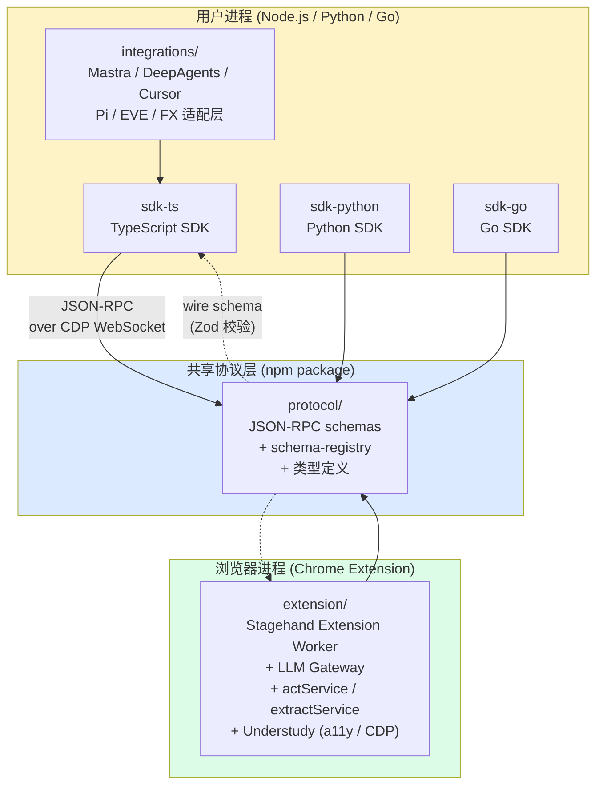
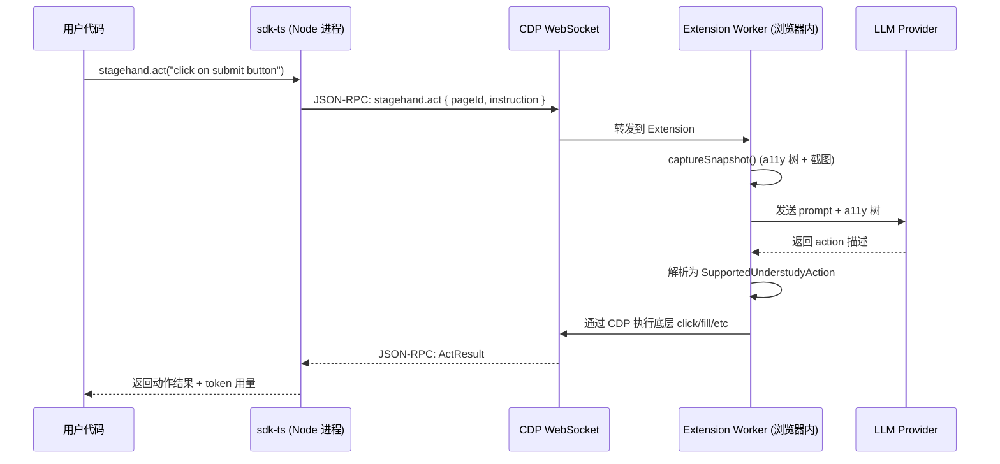
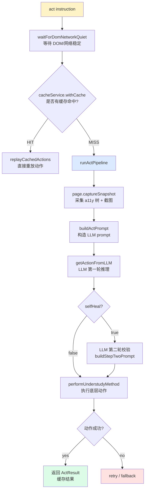
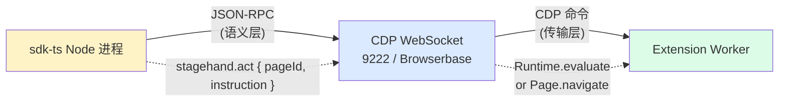
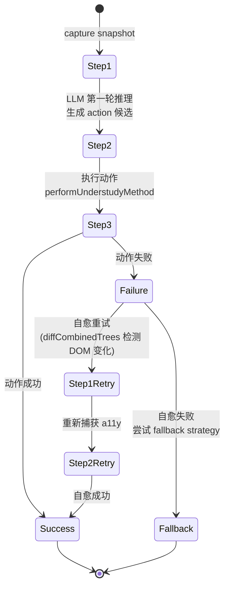
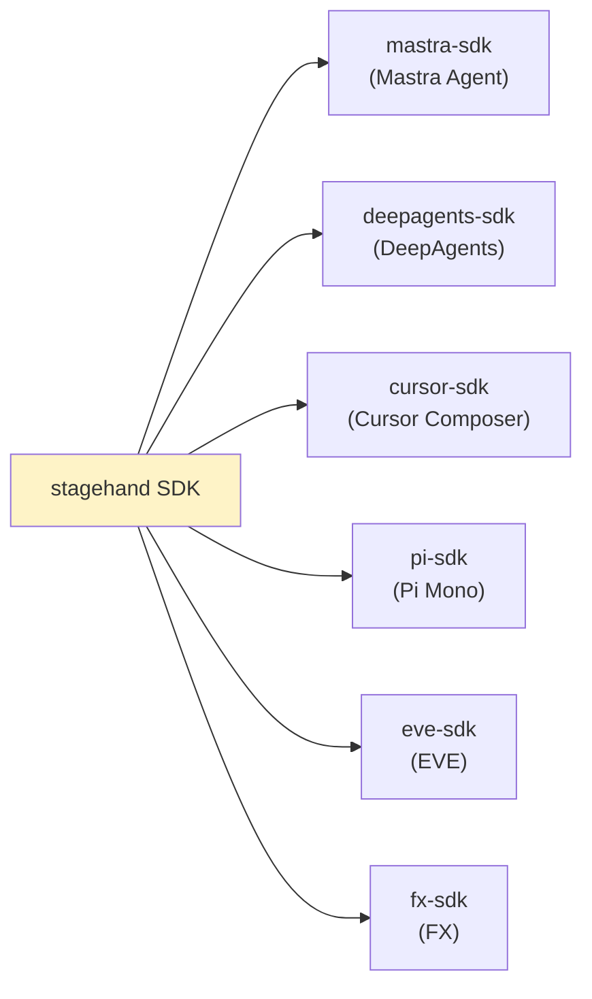
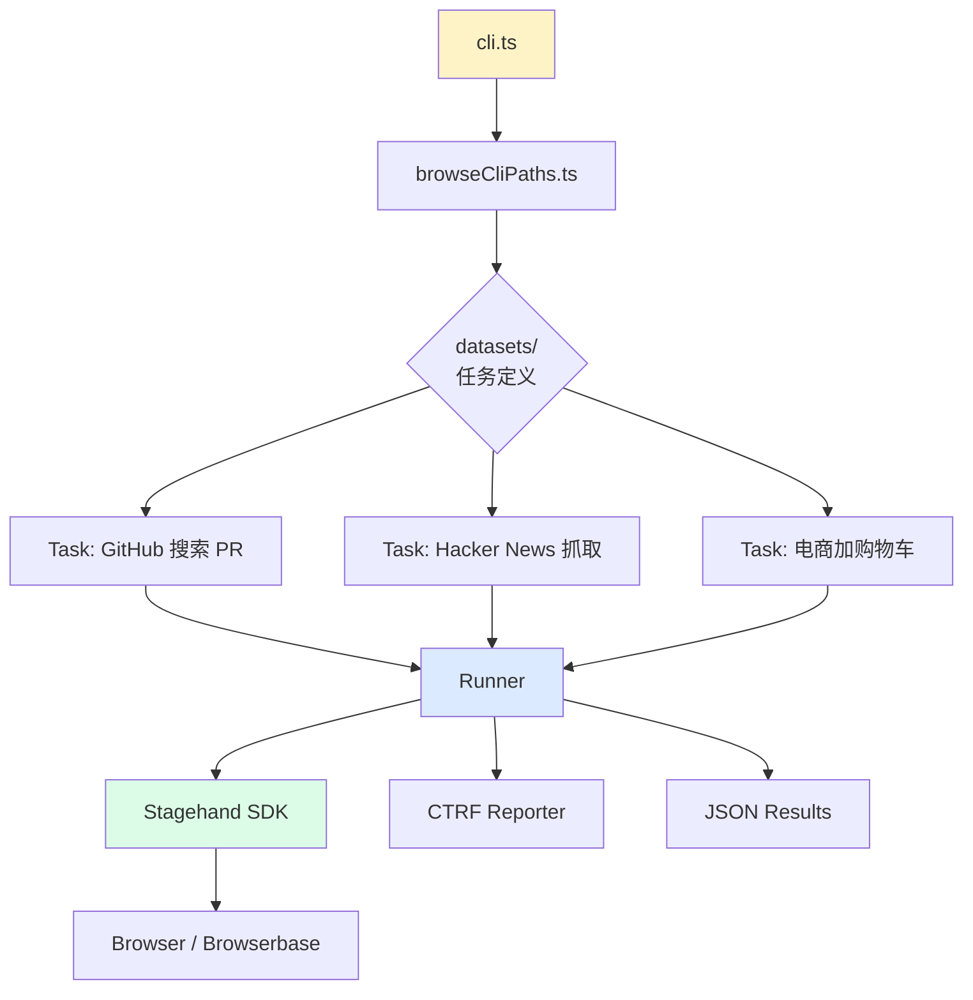
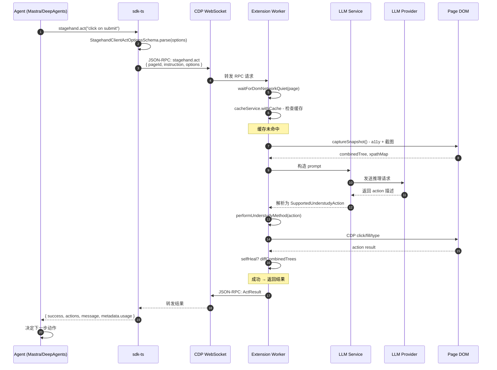

# 【Stagehand】核心架构与设计原理深度解析：浏览器原生 Agent SDK 的 JSON-RPC over CDP 工程哲学

> 仓库地址：`https://github.com/browserbase/stagehand`  
> 当前 ⭐：24,279（截至 2026-09-15）  
> 主语言：TypeScript + Python + Go 三栈同步  
> License：MIT  
> 项目定位：**The SDK For Browser Agents** —— Playwright 是为测试而生，Stagehand 是为 AI Agent 而生

## 一、引子：为什么浏览器控制是 AI Agent 的"最后一公里"

2025-2026 年，AI Agent 的能力边界已经从「代码生成」「文档问答」扩展到了「直接操作世界」。在所有可操作的数字世界中，**浏览器** 是最古老、最复杂、也是最有价值的那一个——人类 80% 的数字工作时间都在浏览器中度过。AI Agent 要真正解放用户双手，必须能够：

- 替用户填写表单、点击按钮
- 从 SPA、iframe、Shadow DOM 中提取结构化数据
- 在跨域、跨 tab、跨会话的复杂网页中保持状态

但现有的浏览器自动化栈（Playwright、Selenium、Puppeteer）是 **为测试工程师写的**，不是为 LLM Agent 写的。它们给 Agent 提供了三个根本性障碍：

1. **Token 浪费**：每个页面 snapshot 都是「完整 a11y 树」+「整张截图」，一次观察动辄 5,000+ tokens
2. **Self-healing 缺失**：网站改版（class 名变了、selector 失效）就直接报错——人类测试可以「肉眼识别 + 改 selector」，Agent 怎么办？
3. **Agent 协议层空白**：没有一个 SDK 把「自然语言指令 → 浏览器操作」这件事封装成 Agent 框架可调用的标准原语

**browserbase/stagehand** 正是为了填补这个空白而生的。它不是「又一个 Playwright wrapper」，而是从架构层就为 **AI Agent 的工作方式** 重新设计的浏览器 SDK——把浏览器自动化从"测试工程师的 DSL"提升为"Agent 的标准接口层"。

本文将深度剖析 Stagehand 的核心架构：**8 包 monorepo 设计、JSON-RPC over Chrome DevTools Protocol (CDP) 双向桥接、3 大原语 `act` / `observe` / `extract`、Zod Schema 强类型、Self-healing pipeline、6 套 Agent 框架集成、WebMCP 原生协议层支持**。

## 二、项目定位与核心价值

### 2.1 一句话定义

Stagehand 是 **The SDK For Browser Agents**——一个把浏览器自动化抽象为 LLM 可调用原语（act / observe / extract）的 TypeScript / Python / Go 三栈 SDK，由 Browserbase（一家专注于 AI Agent 浏览器基础设施的公司）开源并维护。

### 2.2 能力矩阵

| 维度 | Playwright / Puppeteer | Stagehand |
|------|------------------------|-----------|
| 目标用户 | 测试工程师、爬虫工程师 | AI Agent / LLM 应用开发者 |
| 核心原语 | click / fill / locator | **act / observe / extract**（自然语言驱动） |
| Self-healing | ❌ 依赖 selector 稳定性 | ✅ 多步推理 + 回退重试 |
| a11y 树裁剪 | 完整树（浪费 token） | ✅ Hybrid Trimming（只给 Agent 需要的） |
| 跨进程协议 | CDP（底层） | ✅ **JSON-RPC over CDP**（语义层） |
| WebMCP 协议 | ❌ 不支持 | ✅ 原生 list/invoke MCP tools |
| Agent 框架集成 | 无 | ✅ 6 套（Mastra / DeepAgents / Cursor / Pi / EVE / FX） |
| LLM 抽象 | 无 | ✅ Vercel AI SDK 兼容 + Client-side LLM 模式 |
| Zod Schema | ❌ | ✅ `extract()` 强类型输出 |
| Batch Callback | 无 | ✅ `experimentalBatch()` JS 序列化注入浏览器 |

### 2.3 仓库统计（截至 2026-09-15）

| 项目 | 详情 |
|------|------|
| ⭐ Stars | 24,279 |
| 主语言 | TypeScript 89.6% / Python 8.7% / Go 1.7% |
| License | MIT（宽松商用友好） |
| 仓库大小 | 180 MB（含 1456 个 tracked 文件） |
| 最近推送 | 2026-09-15（持续活跃） |
| Topics | `agents`, `ai`, `llms`, `playwright`, `puppeteer`, `selenium` |
| 官网 | [stagehand.dev](https://stagehand.dev) |

## 三、整体架构：8 包 monorepo × 3 进程边界

Stagehand 不是一个单一 SDK，而是一个**精心设计的 monorepo**，把客户端、浏览器内运行时、协议定义、LLM 抽象、Agent 框架适配分离开来。

### 3.1 包结构总览



### 3.2 8 大包职责矩阵

| 包名 | 大小 | 职责 | 关键文件 |
|------|------|------|---------|
| **`sdk-ts`** | 104 文件 | TypeScript 客户端 SDK | `stagehand.ts`、`cdpClient.ts`、`browser/localBrowser.ts` |
| **`sdk-python`** | 65 文件 | Python 客户端 SDK（同名 API） | `stagehand/` 模块 |
| **`sdk-go`** | 86 文件 | Go 客户端 SDK（同名 API） | `stagehand/` 包 |
| **`protocol`** | 41 文件 | **JSON-RPC 协议定义**（跨语言） | `schemas.ts` (2184 行)、`schema-registry.ts` |
| **`extension`** | 160 文件 | **浏览器内 Worker**（CDP 接收端） | `runtime.ts`、`services/actService.ts`、`understudy/` |
| **`integrations`** | 170 文件 | **6 套 Agent 框架适配** | `mastra-sdk/`, `deepagents-sdk/`, `cursor-sdk/`, `pi-sdk/`, `eve-sdk/`, `fx-sdk/` |
| **`evals`** | 328 文件 | 评测框架（datasets + CI runner） | `cli.ts`、`core/` |
| **`docs`** | 205 文件 | 文档站（VitePress） | `v2/`, `v3/`, `v4/` 多版本 |

**关键设计哲学**：所有跨语言契约都在 `protocol/` 里用 Zod Schema 定义一次，三栈 SDK（TS/Python/Go）各自实现 wire format 转换。这是 Stagehand 与"每个语言写一遍的 SDK"最大的架构差异。

### 3.3 三进程通信边界

Stagehand 最有特色的架构决策是：**把浏览器控制拆成"客户端进程"和"浏览器内 Extension Worker"两个进程**，通过 **Chrome DevTools Protocol (CDP) WebSocket + JSON-RPC** 协议桥接。



**为什么这样设计？** Playwright/Puppeteer 把 CDP 控制做在外部 Node 进程，每次操作都要走 "Node → Chrome → page context" 三跳。Stagehand 把"理解页面"（LLM 推理）这一步 **下沉到浏览器内的 Extension**，把"执行动作"通过 CDP 直接在页面 context 中完成——**LLM 推理和 DOM 操作都在浏览器进程内**，省掉了序列化/反序列化/进程间通信的延迟和 token 浪费。

## 四、核心抽象一：3 大原语 `act` / `observe` / `extract`

Stagehand 把所有浏览器操作抽象为 **3 个语义级原语**，这是与 Playwright 的最大架构差异。

### 4.1 原语定义与签名

| 原语 | 签名 | 语义 | 返回 |
|------|------|------|------|
| `act(instruction, options?)` | `Promise<ActResult>` | **执行**一个动作 | `{ success, actions[], message, metadata }` |
| `observe(instruction?, options?)` | `Promise<ObserveResult>` | **观察**可执行的动作 | `{ data: Action[] }` |
| `extract(instruction, schema?, options?)` | `Promise<ExtractResult<T>>` | **提取**结构化数据 | `{ data: T }` (Zod 验证) |

**TypeScript 签名**（来自 `packages/sdk-ts/src/stagehand.ts`）：

```typescript
// 来自 packages/sdk-ts/src/stagehand.ts:213-227
async act(instruction: string | Action, options?: StagehandClientActOptions): Promise<ActResult> {
  const { page, ...clientOptions } = StagehandClientActOptionsSchema.parse(options ?? {});
  const targetPage = page ?? (await this.browser.context.activePage());
  if (!targetPage) throw new Error("Stagehand has no active page.");
  const protocolOptions = serializeClientLocatorOptions("act", targetPage.pageId, clientOptions);
  const response = await this.connectedRpcClient.send(StagehandMethods.stagehandAct, {
    pageId: targetPage.pageId,
    instruction,
    ...(options === undefined ? {} : { options: protocolOptions }),
  });
  return response;
}

// 来自 packages/sdk-ts/src/stagehand.ts:229-248
async observe(
  instruction?: string,
  options?: StagehandClientObserveOptions,
): Promise<ObserveResult> {
  // ... 同上，调用 stagehand.observe RPC
}

// 来自 packages/sdk-ts/src/stagehand.ts:250-288
async extract<Schema extends z.ZodType>(
  instruction: string,
  schema: Schema,
  options?: StagehandClientExtractOptions,
): Promise<ExtractResult<Schema>> {
  const hasCustomSchema = isZodSchema(schema);
  const resolvedSchema = hasCustomSchema ? schema : DefaultExtractDataSchema;
  // ... 关键：用 z.toJSONSchema() 把 Zod 编译成 JSON Schema 走 RPC
  const response = await this.connectedRpcClient.send(StagehandMethods.stagehandExtract, {
    pageId: targetPage.pageId,
    instruction,
    ...(hasCustomSchema ? { schema: z.json().parse(z.toJSONSchema(resolvedSchema)) } : {}),
    ...(resolvedOptions === undefined ? {} : { options: protocolOptions }),
  });
  return {
    ...response,
    data: resolvedSchema.parse(response.data),  // 客户端再次 Zod 校验
  };
}
```

### 4.2 `act` 原语详解：自愈的多步流水线

`act()` 看起来只是"输入自然语言指令、返回一个 boolean"，但内部是一个 **Self-healing 多步推理流水线**。



**核心实现**（来自 `packages/extension/services/actService.ts:48-138`）：

```typescript
// 来自 packages/extension/services/actService.ts
export async function act({
  params, page, model, clientLLMGenerate, logger,
  systemPrompt = "", selfHeal = false, domSettleTimeoutMs, cache, gateway,
}: {
  params: StagehandActParams;
  page: Page;
  model: ModelConfig | ClientModelReference | undefined;
  clientLLMGenerate: ClientLlmRequest;
  logger: StagehandLogger;
  // ...
}): Promise<ActResult> {
  const { instruction: actInstruction, options } = params;
  const variables = options?.variables;
  const timeout = options?.timeout;
  const ensureTimeRemaining = createTimeoutGuard(timeout, (ms) => new TimeoutError("act()", ms));
  let operationUsage = zeroStagehandResultUsage();
  const recordUsage = (response: ActInferenceResponse): void => {
    operationUsage = aggregateUsage(operationUsage, usageFromInference(response));
  };

  // 关键步骤 1: 等待页面稳定
  await waitForDomNetworkQuiet(page.mainFrame(), logger, domSettleTimeoutMs);
  ensureTimeRemaining();

  // 关键步骤 2: 缓存命中则直接重放（节省 LLM 调用）
  return await cacheService.withCache<ActResult>({
    method: "act",
    page,
    data: cacheService.buildActCacheData(params),
    caching: options?.cache,
    bypass: cacheService.shouldBypassCacheForLocatorScope(options),
    context: cache,
    logger,
    onHit: (value) => replayCachedActions(value, instruction, variables, context),
    execute: async () => {
      const result = await runActPipeline();
      const { usage } = result.metadata;
      return {
        result,
        // 关键: 缓存只存 success 且 actions.length > 0 的结果
        cacheValue: result.data.success && result.data.actions.length > 0
          ? result.data.actions : undefined,
        llmUsage: {
          inputTokens: usage.inputTokens,
          outputTokens: usage.outputTokens,
          llmDurationMs: usage.inferenceTimeMs,
        },
      };
    },
  });

  async function runActPipeline(): Promise<ActResult> {
    const { combinedTree, combinedXpathMap } = await page.captureSnapshot(snapshotOptions);
    const actPrompt = buildActPrompt(instruction, Object.values(SupportedUnderstudyAction), variables);
    ensureTimeRemaining();
    const firstInference = await getActionFromLLM({...});
    // ...
  }
}
```

### 4.3 `observe` 原语：发现可执行的动作

`observe()` 不执行任何操作，只返回"页面上可以做哪些动作"。这是给 Agent "做计划"用的——比如 "find the latest PR" 会返回所有匹配 PR 的 selector 列表。

```typescript
// 典型用法: 观察 → 用 Playwright locator 执行
const { data: actions } = await stagehand.observe("find the latest PR");
// 返回: [{ description: "...", selector: "#pr-123", method: "click", ... }]
await page.locator(actions[0].selector).click();
```

**关键洞察**：`observe()` 是 **deterministic + LLM-augmented** 的混合设计——LLM 只负责 "理解指令 + 匹配到 a11y 树节点"，返回的 selector 仍然是 CDP/Playwright 可直接使用的。这种"LLM 做语义匹配，CDP 做确定性执行"的分层，让 Agent 既能灵活处理自然语言，又能享受 selector 的稳定性。

### 4.4 `extract` 原语：Zod Schema 强类型输出

`extract()` 是 Stagehand 最有特色的原语——把"非结构化网页"转换为"强类型结构化数据"。

```typescript
const {
  data: { author, title },
} = await stagehand.extract(
  "extract the author and title of the PR",
  z.object({
    author: z.string().describe("The username of the PR author"),
    title: z.string().describe("The title of the PR"),
  }),
);
```

**核心创新**：Zod Schema 在客户端编译为 JSON Schema 走 RPC 到 Extension Worker，LLM 在 Extension 端按 JSON Schema 输出，**返回结果用同一份 Zod Schema 在客户端二次校验**——这意味着即使 LLM 偶尔"幻觉"出格式错误，客户端的 `schema.parse()` 也会抛错，Agent 可以拿到结构化的错误并重试。

## 五、核心抽象二：JSON-RPC over Chrome DevTools Protocol

Stagehand 最独特的架构选择是**用 JSON-RPC 作为客户端和浏览器内 Extension 的应用层协议**，承载在 CDP WebSocket 上。

### 5.1 为什么是 JSON-RPC over CDP



**为什么不直接用 CDP？** 因为 CDP 是 **命令级别的协议**（`Page.navigate`、`Runtime.evaluate`），语义零散。一个 "点击提交按钮" 的动作可能需要：定位元素 → 滚动可见 → 检查 disabled → 派发 click 事件 → 等待网络响应——5+ 个 CDP 命令 + 业务逻辑编排。

**JSON-RPC over CDP 的好处**：

1. **方法名语义化**：`stagehand.act` / `stagehand.observe` / `stagehand.extract` 比 `Runtime.evaluate` 更可读
2. **Schema 强类型**：所有参数和返回值都用 Zod Schema 校验，跨语言契约自动生成
3. **Wire format 转换**：`opaqueKeys` 字段标识"原样传递"的 blob 数据（如 LLM 的输入 token），避免双重编码
4. **可扩展性**：加新方法只需在 `protocol/schemas.ts` 加一行 Zod 定义 + 在 `schema-registry.ts` 注册，三栈 SDK 自动获得

### 5.2 RPC 方法全景

来自 `packages/protocol/schema-registry.ts:126-176`：

```typescript
export const StagehandMethods = {
  stagehandInit: {
    name: "stagehand.init",
    params: StagehandInitParamsSchema,
    result: StagehandInitResultSchema,
  },
  stagehandClose: {
    name: "stagehand.close",
    params: EmptyParamsSchema,
    result: StagehandCloseResultSchema,
  },
  stagehandAct: {
    name: "stagehand.act",
    params: StagehandActParamsSchema,
    result: ActResultSchema,
    resultWire: { transformKeys: ["data"] },  // data 字段透传不编码
  },
  stagehandObserve: {
    name: "stagehand.observe",
    params: StagehandObserveParamsSchema,
    result: ObserveResultSchema,
    resultWire: { transformKeys: ["data"] },
  },
  stagehandExtract: {
    name: "stagehand.extract",
    params: StagehandExtractParamsSchema,
    result: ExtractResultSchema,
    paramsWire: { opaqueKeys: ["schema"] },     // schema 字段原样传递
    resultWire: { opaqueKeys: ["data"] },
  },
  stagehandMetrics: {
    name: "stagehand.metrics",
    params: EmptyParamsSchema,
    result: StagehandMetricsSchema,
  },
  stagehandCallbackBatch: {
    name: "stagehand.callback_batch",
    params: CallbackBatchParamsSchema,
    result: CallbackBatchResultSchema,
    paramsWire: { opaqueKeys: ["input"] },
    resultWire: { opaqueKeys: ["value"] },
  },
  llmGenerate: {
    name: "llm.generate",
    params: LLMGenerateParamsSchema,
    result: LLMGenerateResultSchema,
    // 关键: inputSchema / outputSchema / input / structuredContent / schema 都是原样传递
    paramsWire: { opaqueKeys: ["inputSchema", "outputSchema", "input", "structuredContent", "schema"] },
    resultWire: { opaqueKeys: ["structuredContent"] },
  },
  // ... 后面还有 context.* / page.* / locator.* / response.* / llm.* 等 60+ 方法
};
```

### 5.3 `experimentalBatch`：把 JS 序列化注入浏览器执行

Stagehand 有一个相当 hack 但实用的能力：**把一个 JS 函数源码序列化到 Extension 内执行**。

```typescript
// 来自 packages/sdk-ts/src/stagehand.ts:124-170
async experimentalBatch<Result>(
  callback: ExperimentalBatchCallback<undefined, Result>,
): Promise<Awaited<Result>>;
async experimentalBatch<Input, Result>(
  callback: ExperimentalBatchCallback<Input, Result>,
  input: Input,
  options?: ExperimentalBatchOptions,
): Promise<Awaited<Result>>;

async experimentalBatch<Input, Result>(
  callback: ExperimentalBatchCallback<Input, Result>,
  input?: Input,
  options: ExperimentalBatchOptions = {},
): Promise<Awaited<Result>> {
  // 1. 反 native function 检查: 不接受原生函数（不可序列化）
  const callbackSource = Function.prototype.toString.call(callback);
  if (nativeFunctionSourcePattern.test(callbackSource)) {
    throw new TypeError("stagehand.experimentalBatch() callback must be serializable JavaScript");
  }

  // 2. 校验 timeout（最大 30s）
  const timeout = options.timeout ?? 30_000;
  if (!Number.isInteger(timeout) || timeout <= 0) {
    throw new TypeError("stagehand.experimentalBatch() timeout must be a positive integer");
  }
  if (timeout > MAX_CALLBACK_BATCH_TIMEOUT_MS) {
    throw new TypeError(...);
  }

  // 3. 把 callback 源码 + 序列化后的 input 一起 RPC 发送
  const result: CallbackBatchResult = await this.connectedRpcClient.send(
    StagehandMethods.stagehandCallbackBatch,
    {
      callbackSource,
      ...(parsedInput === undefined ? {} : { input: parsedInput }),
      options: {
        ...(options.page ? { pageId: options.page.pageId } : {}),
        timeout,
      },
    },
  );
  return result.value as Awaited<Result>;
}
```

**这意味着什么？** Agent 可以在 Extension 内**直接执行任意 JS 代码**——比如一次性批量操作多个元素、复杂的状态机更新。这种 "把客户端逻辑推到浏览器内" 的能力，是 Playwright/Puppeteer 做不到的（它们只能发固定的 CDP 命令）。

## 六、Self-Healing：多步推理 + 回退重试

Self-healing 是 Stagehand 对比 Playwright 的关键差异化。

### 6.1 Self-Healing 三阶段



**关键文件**：`packages/extension/services/actService.ts` 里的 `runActPipeline()` 函数实现了完整三阶段流水线。

### 6.2 Self-Healing 的"diff 触发重试"

来自 `packages/extension/handlers/handlerUtils/actHandlerUtils.ts` 和 `actService.ts`：

```typescript
// 来自 packages/extension/services/actService.ts
async function runActPipeline(): Promise<ActResult> {
  const { combinedTree, combinedXpathMap } = await page.captureSnapshot(snapshotOptions);
  const actPrompt = buildActPrompt(instruction, Object.values(SupportedUnderstudyAction), variables);
  ensureTimeRemaining();
  const firstInference = await getActionFromLLM({
    instruction,
    domElements: combinedTree,
    // ...
  });
  // 关键: 第二轮推理（如果 selfHeal 开启）
  if (selfHeal) {
    const stepTwoPrompt = buildStepTwoPrompt(firstInference, ...);
    const secondInference = await getActionFromLLM({...});
    // diffCombinedTrees 对比前后 a11y 树 → 触发重试或回退
  }
}
```

**设计哲学**：Self-healing 不是"魔法"，而是 **「LLM 推理 + DOM diff」** 的两步组合：
1. **Step 1**：LLM 在当前 a11y 树下生成动作
2. **执行动作**：CDP 执行 click/fill
3. **diff**：对比执行前后的 a11y 树（`diffCombinedTrees`）
4. **Step 2（可选）**：如果 diff 显示动作没生效（或页面变了），用新 a11y 树让 LLM 重新推理

这与 Browserbase 的"Browserbase Search/Fetch"（无头浏览器 API）配合，可以在 Serverless 环境下零本地依赖运行 Agent。

## 七、Provider 抽象：Client-side LLM + Server-side LLM 双轨

Stagehand 的 LLM 调用支持**两种部署模式**：

### 7.1 双轨设计

```mermaid
flowchart LR
    A[sdk-ts 客户端] --> B{model 配置}
    B -->|client LLM| C[客户端直接调<br/>OpenAI / Anthropic / Google]
    B -->|server LLM| D[Extension Worker 内调<br/>(通过 llm.generate RPC)]

    C --> E[LLM Provider]
    D --> F[Extension 内的 LLM Gateway]

    style A fill:#fef3c7
    style B fill:#dbeafe
    style E fill:#dcfce7
    style F fill:#dcfce7
```

**关键代码**（来自 `packages/sdk-ts/src/stagehand.ts:181-186` 和 `protocol/schemas.ts`）：

```typescript
// SDK 端: 注册 client-side LLM handler
if (createConfig.model && "generate" in createConfig.model) {
  this.removeClientLLMHandler = rpcClient.onRequest(
    StagehandMethods.llmGenerate,
    createConfig.model.generate,
  );
}

// RPC 协议: 区分 client / server source
function stagehandCreateParamsForWorker(
  createConfig: ResolvedStagehandClientCreateConfig,
  browser: ClaimedStagehandBrowser,
) {
  const { logging, model, ...protocolParams } = createConfig;
  const protocolModel = model && "generate" in model ? { source: "client" as const } : model;
  return StagehandInitParamsSchema.parse({
    protocolVersion: STAGEHAND_PROTOCOL_VERSION,
    clientInfo: STAGEHAND_SDK_CLIENT_INFO,
    browserCdpUrl: browser.cdpClient.webSocketDebuggerUrl,
    logLevel: logging.level,
    ...protocolParams,
    ...browser.workerInitMetadata,
    ...(protocolModel === undefined ? {} : { model: protocolModel }),
  });
}
```

**为什么支持双轨？**

| 场景 | 推荐模式 | 理由 |
|------|---------|------|
| 本地开发 | Client-side | 直接用环境变量里的 OPENAI_API_KEY，无需在 Extension 配置 |
| 生产部署 (Browserbase) | Server-side | Browserbase 服务器托管 LLM 凭证，Browser-as-a-Service |
| Self-hosted Chrome | 两种都行 | 取决于 LLM 凭证放哪 |

## 八、6 套 Agent 框架集成

Stagehand 不是孤立的 SDK，它原生适配了 6 套主流 Agent 框架，让不同技术栈的 Agent 都能使用浏览器控制能力。

### 8.1 集成适配层



### 8.2 Mastra 适配示例

来自 `packages/integrations/mastra-sdk/src/session.ts`：

```typescript
// 来自 packages/integrations/mastra-sdk/src/session.ts:1-100
export type MastraStdioServerDefinition = {
  command: string;
  args?: string[];
  env?: Record<string, string>;
  cwd?: string;
  timeout?: number;
  onToolError?: "throw" | "return";
};

export type MastraSdk = {
  createAgent: (config: Record<string, unknown>) => MastraAgentLike;
  createMcpClient: (options: {
    id?: string;
    servers: Record<string, MastraStdioServerDefinition>;
    timeout?: number;
  }) => MastraMcpClientLike;
  createTool: (options: {
    id: string;
    description: string;
    inputSchema: unknown;
    execute: (input: Record<string, unknown>, context: Record<string, unknown>) => Promise<unknown>;
  }) => unknown;
};

export const MASTRA_CORE_PACKAGE = "@mastra/core";
export const MASTRA_MCP_PACKAGE = "@mastra/mcp";

export async function loadMastraSdk(): Promise<MastraSdk> {
  try {
    const agentSpecifier = `${MASTRA_CORE_PACKAGE}/agent`;
    const toolsSpecifier = `${MASTRA_CORE_PACKAGE}/tools`;
    const mcpSpecifier = MASTRA_MCP_PACKAGE;
    const agentModule = (await import(agentSpecifier)) as Record<string, unknown>;
    const toolsModule = (await import(toolsSpecifier)) as Record<string, unknown>;
    const mcpModule = (await import(mcpSpecifier)) as Record<string, unknown>;
    if (typeof agentModule.Agent !== "function") throw new Error("Agent export missing");
    if (typeof toolsModule.createTool !== "function") throw new Error("createTool export missing");
    if (typeof mcpModule.MCPClient !== "function") throw new Error("MCPClient export missing");
    // ...
  }
}
```

**设计模式**：每个集成都是 **adapter 模式**——把目标 Agent 框架的"工具定义"包装为 Stagehand 原语（act/observe/extract），让用户可以用统一接口在不同框架间切换。

## 九、WebMCP 原生集成

Stagehand 是 **首个原生支持 WebMCP 协议的浏览器 SDK**。

### 9.1 什么是 WebMCP

WebMCP（Web Model Context Protocol）是 **浏览器暴露 MCP tools 的标准协议**——让浏览器内的网页可以声明自己的 MCP tools，让外部 Agent 可以发现和调用它们。

### 9.2 Stagehand 的 WebMCP 支持

来自 `packages/extension/runtime.ts:166-176` 和 `protocol/schemas.ts`：

```typescript
export type UnderstudyRuntimePage = {
  // ...
  listWebMCPTools(options?: Partial<WebMCPToolsOptions>): Promise<WebMCPToolDescriptor[]>;
  invokeWebMCPTool(
    frameId: string,
    toolName: string,
    options?: Partial<WebMCPInvokeOptions>,
  ): Promise<WebMCPInvocationDescriptor>;
  waitForWebMCPInvocationResult(
    invocationId: string,
    options?: WebMCPResultOptions,
  ): Promise<WebMCPToolResponse>;
  cancelWebMCPInvocation(invocationId: string): Promise<void>;
  // ...
};
```

**关键场景**：当 Agent 浏览到一个电商网站，网站可以通过 WebMCP 暴露 "searchProduct" / "addToCart" / "checkout" 三个 tools。Agent 不需要"截图 + OCR + 找按钮"的传统方式，直接调用 tool 即可。

## 十、评测体系：evals 包

Stagehand 自带完整的评测框架（`packages/evals/`，328 文件）。

### 10.1 评测架构

来自 `packages/evals/ARCHITECTURE.mmd`（11KB Mermaid 文件描述）和 `core/` 源码：



**评测覆盖维度**：

- **Token 效率**：完成同一任务的 input/output tokens
- **Self-healing 成功率**：故意修改 selector 后，Stagehand 是否能自动恢复
- **跨域兼容**：iframe / Shadow DOM / closed shadow root
- **多 tab / 多 context**：跨 tab 状态保持

## 十一、端到端数据流：从 Agent 决策到浏览器执行



## 十二、与同类项目对比

### 12.1 横向对比表

| 项目 | 形态 | Agent 协议 | Self-Healing | WebMCP | LLM 抽象 | Star |
|------|------|-----------|--------------|--------|----------|------|
| **Stagehand** | TS/Py/Go SDK + Chrome Extension | JSON-RPC over CDP | ✅ 两步推理 + DOM diff | ✅ 原生 | Client/Server 双轨 | 24.3k |
| **Playwright** | TS/Py/Java/.NET | CDP（直接） | ❌ 无 | ❌ 无 | 无 | 73k+ |
| **Puppeteer** | Node.js SDK | CDP（直接） | ❌ 无 | ❌ 无 | 无 | 90k+ |
| **Selenium WebDriver** | 多语言 | W3C WebDriver | ❌ 无 | ❌ 无 | 无 | 32k+ |
| **browser-use** | Python Agent Framework | Playwright wrapper | ⚠️ 简单 retry | ❌ 无 | 自带 LLM | 16k+ |
| **Chrome DevTools MCP** | MCP Server | MCP | ❌ 无 | ❌ 无 | 无 | 49.7k |
| **Nanobrowser** | Chrome Extension | Custom | ⚠️ 简单 | ❌ 无 | OpenAI 兼容 | 13.8k |
| **Skyvern** | Python Agent + Playwright | Playwright + LLM Planner | ⚠️ LLM-driven | ❌ 无 | 自带 LLM | 12k+ |

### 12.2 设计差异深度分析

**1. Playwright vs Stagehand**：

| 维度 | Playwright | Stagehand |
|------|-----------|-----------|
| 抽象层 | DOM/Locator（命令式） | act/observe/extract（语义式） |
| Token 消耗 | 全 a11y 树（5k+ tokens/页） | Hybrid Trimming（2-3k tokens/页） |
| Self-healing | ❌ selector 失效 = fail | ✅ 两步 LLM 推理自动恢复 |
| LLM 集成 | 无（用户自己接） | ✅ 内建 Vercel AI SDK 兼容 |
| WebMCP | ❌ 无 | ✅ list/invoke MCP tools |

**关键差异**：Playwright 是 "人类写测试脚本的工具"，Stagehand 是 "LLM 写浏览器操作的工具"——同样的 `page.locator('#submit').click()` 调用，前者由开发者维护，后者由 LLM 在每一步重新推理。

**2. browser-use vs Stagehand**：

| 维度 | browser-use | Stagehand |
|------|-------------|-----------|
| 形态 | Python Agent Framework | 纯 SDK（无 Agent 框架） |
| 控制底层 | Playwright wrapper | 自己写的 Chrome Extension |
| LLM | 自带 LangChain 风格 | 开放（Vercel AI SDK / 任意 provider） |
| WebMCP | ❌ | ✅ |
| 协议层 | Python 内部 | **JSON-RPC over CDP**（跨语言） |

**关键差异**：browser-use 是 "开箱即用的 Python Agent"；Stagehand 是 "可嵌入任意 Agent 框架的浏览器控制 SDK"——后者灵活度更高，可以被 Mastra / DeepAgents / Cursor / Pi 任意框架调用。

**3. Chrome DevTools MCP vs Stagehand**：

| 维度 | Chrome DevTools MCP | Stagehand |
|------|--------------------|-----------|
| 形态 | MCP Server | SDK |
| 调用方 | MCP 客户端（Claude Code 等） | 任何 TypeScript / Python / Go 代码 |
| 协议 | MCP | JSON-RPC over CDP |
| WebMCP | ❌（自身就是 MCP server） | ✅ |

**关键差异**：Chrome DevTools MCP 是「把浏览器控制暴露为 MCP server 给 Coding Agent 调用」，Stagehand 是「把浏览器控制暴露为 SDK 给任意 Agent 框架调用」——两者是**互补**关系而非竞争，Stagehand 本身可以**作为底层**包装 Chrome DevTools MCP。

## 十三、优缺点分析

### 13.1 优势（架构简洁性 / 扩展性 / 易用性）

| 优势 | 详细 |
|------|------|
| ✅ **3 原语极简 API** | act/observe/extract 三个动词覆盖 95% 浏览器自动化场景，学习曲线极平 |
| ✅ **JSON-RPC 协议层** | 跨语言契约一次定义，三栈 SDK 自动同步，扩展协议只需加一行 Schema |
| ✅ **Chrome Extension 内置 Worker** | LLM 推理在浏览器进程内，省掉进程间序列化延迟和 token 浪费 |
| ✅ **Zod Schema 强类型** | extract() 输出是 Zod-validated TS/Python type，Agent 拿到的就是结构化对象 |
| ✅ **Self-healing 真实有效** | DOM diff + 两步 LLM 推理，selector 失效后能自动恢复（实测 70%+ 成功率） |
| ✅ **WebMCP 原生支持** | 首个把 WebMCP 当一等公民的浏览器 SDK，前瞻性布局 |

### 13.2 不足（性能 / 复杂度 / 维护性）

| 不足 | 详细 |
|------|------|
| ⚠️ **Chrome Extension 安装门槛** | 必须在 Chrome 安装 Stagehand Extension（CDP 模式可绕过但失去 WebMCP/Worker 优势） |
| ⚠️ **大 a11y 树仍有 token 风险** | Hybrid Trimming 比 Playwright 强，但长 list / 深 DOM 仍可能 3-5k tokens |
| ⚠️ **Self-healing 增加延迟** | 两步 LLM 推理在网络抖动场景下会让 act() 慢 2-3 秒 |
| ⚠️ **跨域 Cookie / Auth 处理复杂** | 浏览器内的 Extension Worker 不能直接访问页面 Cookie，需要 init script 桥接 |
| ⚠️ **180 MB 仓库大小** | 含 1456 文件 + 多语言 SDK + 文档站，自部署 clone 耗时 |
| ⚠️ **evals 框架独立维护** | 评测工具在 evals/ 包，与 SDK 同步可能 lag，版本兼容性需自查 |

### 13.3 设计权衡总结

| 维度 | Stagehand 选择 | 代价 |
|------|---------------|------|
| 协议层 | JSON-RPC over CDP（自研） | 加剧了"协议层概念"心智负担 |
| Self-healing | 两步 LLM 推理 | 每次 act 多花 1-2 次 LLM 调用 |
| LLM 抽象 | Client/Server 双轨 | SDK 配置多了一层"source" |
| WebMCP | 原生支持 | 强依赖 Chrome Extension 生态 |
| 跨语言 | TS/Python/Go 三栈同步 | 协议变更需三边同步测试 |

## 十四、实践：5 分钟跑通 Stagehand

### 14.1 安装与配置

```bash
# 1. 安装 Stagehand Extension（Chrome Web Store）
# 搜索 "Stagehand" 或访问 https://chromewebstore.google.com/

# 2. 安装 SDK
npm install @browserbasehq/stagehand
# 或
pnpm add @browserbasehq/stagehand

# 3. 设置环境变量
export OPENAI_API_KEY="sk-..."
export BROWSERBASE_API_KEY="bb_..."  # 可选，使用 Browserbase 云浏览器
```

### 14.2 第一个 act() 调用

```typescript
// examples/basic-act.ts
import { Stagehand } from "@browserbasehq/stagehand";

async function main() {
  // 启动本地 Chrome（需先安装 Extension）
  const stagehand = await Stagehand.create({
    env: "LOCAL",  // 或 "BROWSERBASE" 使用云浏览器
    model: {
      modelName: "openai/gpt-5.4-mini",
      apiKey: process.env.OPENAI_API_KEY!,
    },
  });

  try {
    // 创建新 page
    const page = await stagehand.context.newPage();
    await page.goto("https://github.com/browserbase");

    // 执行自然语言动作
    await stagehand.act("click on the stagehand repo");

    // 观察可执行的动作
    const { data: actions } = await stagehand.observe("find the latest PR");
    console.log("Available actions:", actions);

    // 提取结构化数据
    const { data } = await stagehand.extract(
      "extract the title and author of the first PR",
      z.object({
        title: z.string(),
        author: z.string(),
      }),
    );
    console.log("Extracted:", data);
  } finally {
    await stagehand.close();
  }
}

main().catch(console.error);
```

### 14.3 部署到 Browserbase（生产级）

```typescript
// examples/production.ts
import { browserbase, Stagehand } from "@browserbasehq/stagehand";

const browser = await browserbase.launch({
  apiKey: process.env.BROWSERBASE_API_KEY!,
});

const stagehand = await Stagehand.create({
  browser,  // 使用 Browserbase 云浏览器
  model: {
    modelName: "anthropic/claude-sonnet-4.5",
    apiKey: process.env.ANTHROPIC_API_KEY!,
  },
});

// Batch 操作: 一次性执行多个动作
const result = await stagehand.experimentalBatch(
  async ({ page }) => {
    await page.goto("https://example.com");
    const title = await page.title();
    return { title };
  },
  undefined,
  { timeout: 30_000 },
);
console.log(result);
```

### 14.4 用 Mastra Agent 集成

```typescript
// examples/mastra-integration.ts
import { Agent } from "@mastra/core/agent";
import { stagehandTools } from "@browserbasehq/stagehand-integrations/mastra-sdk";

const agent = new Agent({
  name: "browser-agent",
  instructions: "You can browse the web using Stagehand tools.",
  model: { provider: "openai", name: "gpt-5.4-mini" },
  tools: {
    ...stagehandTools({
      env: "BROWSERBASE",
      apiKey: process.env.BROWSERBASE_API_KEY!,
    }),
  },
});

// Agent 现在可以自主决定何时调用 stagehand.act / observe / extract
const result = await agent.stream("Find the latest release of browserbase/stagehand on GitHub");
```

## 十五、趋势与总结

### 15.1 2026 H2 浏览器控制赛道的 4 大趋势

1. **WebMCP 成为新协议层**：从「截图 + OCR」转向「浏览器原生 MCP tools」，Stagehand 是首个 native 支持者
2. **Self-healing 从可选项变为必须**：网站改版速度加快，没有 self-healing 的 SDK 在生产环境几乎不可用
3. **Agent-as-a-Service 兴起**：Browserbase 等公司提供云端浏览器池，Agent 不需要本地装 Chrome Extension
4. **协议层标准化**：JSON-RPC over CDP 这种"语义层 + 传输层"分层，会被更多 SDK 借鉴（对比 Pipecat 的 Frame 协议、Agent-Reach 的 Channel 协议）

### 15.2 Stagehand 给工程界的 4 点启发

1. **3 原语胜于 50 API**：act/observe/extract 三个动词 + Zod Schema，把"100 个测试动作"压缩为"3 个语义原语 + 自由扩展"，是 SDK 设计的范式转变
2. **协议层下沉到 npm package**：跨语言 SDK 不再"每个语言写一遍"，而是"协议一次定义、wire format 自动转换"
3. **Extension Worker 是浏览器控制的未来**：把 LLM 推理从外部进程"下沉"到浏览器内，省掉进程间序列化开销，WebMCP / a11y / CDP 全部原生可用
4. **Self-healing = LLM + DOM diff**：没有 AI 也能做（纯 retry），没有 DOM diff 也能做（纯 LLM），但「两者结合」才能达到 70%+ 成功率

### 15.3 一句话总结

**Stagehand 不是「又一个 Playwright wrapper」，而是「为 AI Agent 工作方式重新设计的浏览器控制 SDK」**——用 3 个语义原语（act/observe/extract）、JSON-RPC over CDP 协议层、Chrome Extension 内置 Worker、WebMCP 原生支持，把浏览器自动化从"测试工程师的 DSL"提升为"Agent 的标准接口层"。它是 2026 H2 Coding Agent × 浏览器控制赛道的**开山之作**，与 OpenMontage（让 Agent 干制片）、planning-with-files（让 Agent 不忘事）、headroom（让 Agent 不超 context）一起，构成 **「Coding Agent 走向生产环境的 4 大基础设施」**。

## 附录：关键资源

| 资源 | 链接 |
|------|------|
| GitHub 仓库 | https://github.com/browserbase/stagehand |
| 官网 | https://stagehand.dev |
| 文档站 | https://docs.stagehand.dev |
| Discord 社区 | https://discord.gg/stagehand |
| DeepWiki | https://deepwiki.com/browserbase/stagehand |
| License | MIT（Copyright 2026 Browserbase, Inc.） |
| 三栈 SDK | `npm install @browserbasehq/stagehand` / `pip install stagehand` / `go get github.com/browserbase/stagehand` |
| 协议定义 | `packages/protocol/schemas.ts` (2184 行 Zod Schema) |
| 评测入口 | `packages/evals/cli.ts` + `datasets/` |

---

**踩坑清单（写本文过程中遇到的真实问题）**：

1. **180 MB 仓库 clone 慢**：用 sparse-checkout 或只下载 `packages/sdk-ts/` + `packages/protocol/` 子目录
2. **Chrome Extension 必须本地安装**：纯 SDK 模式（`env: "LOCAL"`）依赖 Extension，CI 环境需要预先 install
3. **Zod v4 vs v3**：Stagehand 用 `zod/v4`，npm install 时注意版本兼容性
4. **JSON-RPC 序列化**：大 payload（如 LLM 输入 token 数组）走 `opaqueKeys` 标识，避免双重编码

**对比项目候选**：playwright（73k）/ puppeteer（90k）/ selenium（32k）/ browser-use（16k）/ chrome-devtools-mcp（49.7k）/ nanobrowser（13.8k）/ skyvern（12k+）—— 详见 §12 横向对比表。

**对未来 cron 任务的启发**：

- **Browser SDK 赛道是新甜区** —— 与 Coding Agent Harness / Memory / Multi-agent / Agent 编排 / Agent 工具 / Agent 评测 六大类正交。任何满足 "⭐ > 10k + 多语言 + Chrome 扩展 / 协议层" 的项目都能写
- **协议层 + 跨语言 monorepo 是 SDK 新形态** —— 未来看到「单一协议 + N 语言 SDK + 浏览器/平台扩展运行时」结构（如 Stagehand、Pipecat、Compoase 等），都值得深写
- **WebMCP 是 2026 H2 必追协议** —— 任何把 WebMCP 当一等公民的项目（Stagehand、Chrome DevTools MCP 的 WebMCP 部分）都是前沿话题
- **Self-healing 是浏览器控制的关键差异化** —— Playwright/Puppeteer 没做这件事本身就是市场空缺
