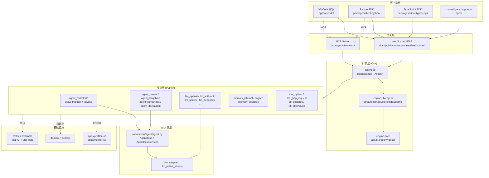
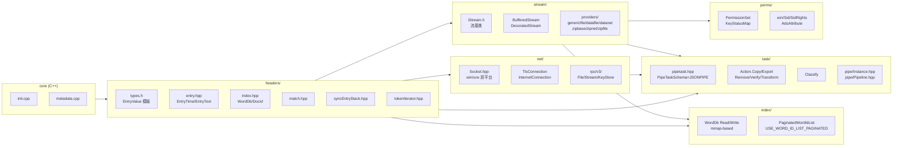
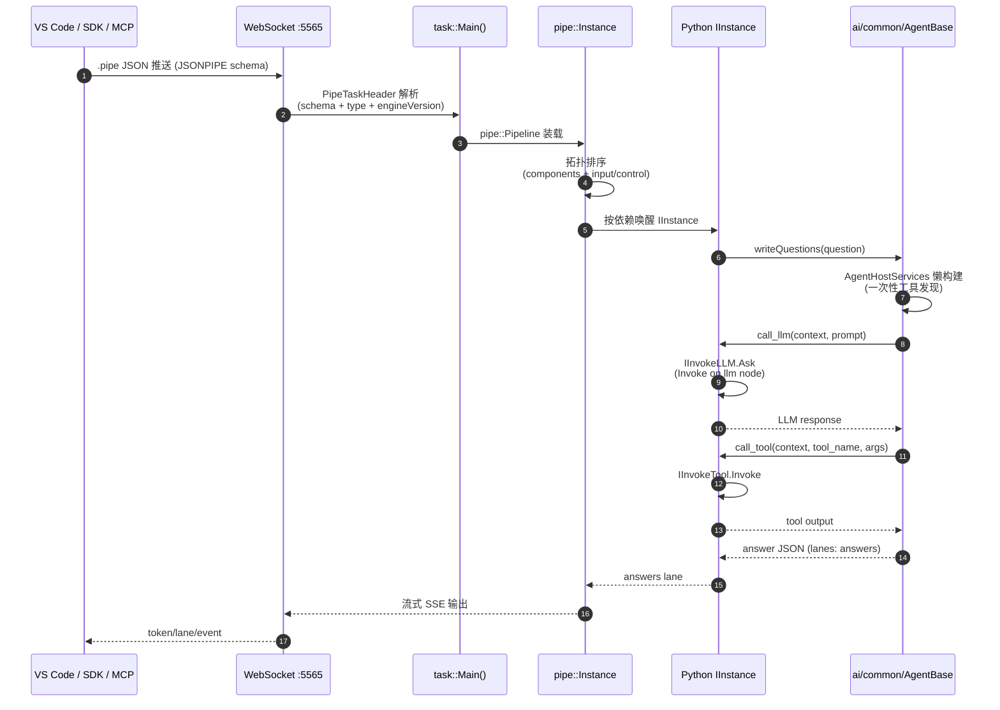
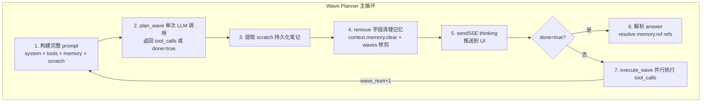
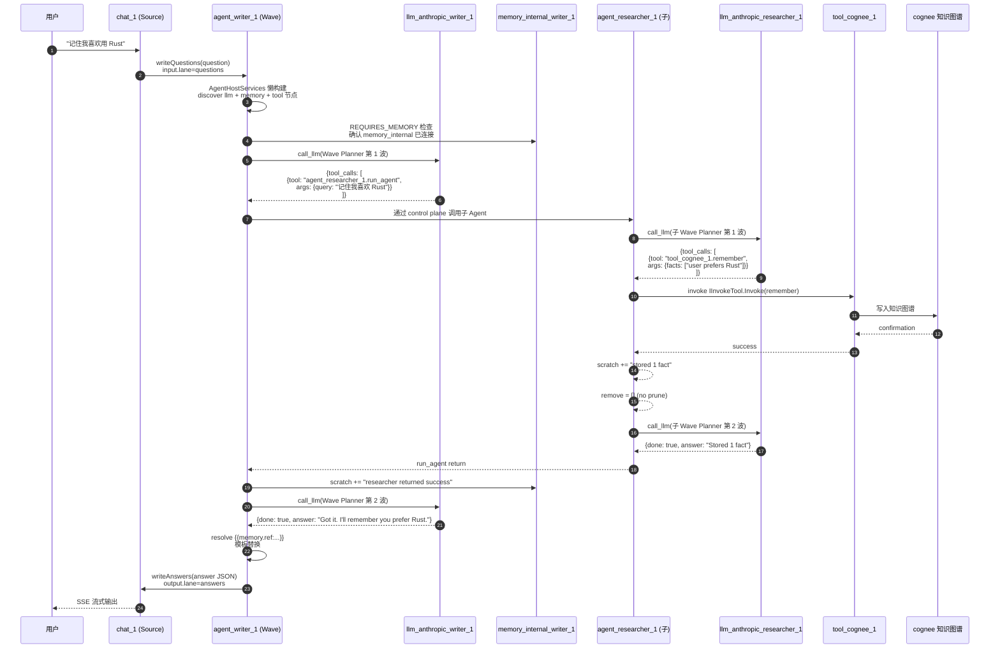

## 引子：当「数据管线引擎」遇上「LLM Agent」

提到「AI 流水线 / Pipeline 引擎」，大多数开发者脑海里浮现的要么是 **Dify**（Python BaaS）、要么是 **Sim**（TypeScript + Bun 的 Block-DAG）、要么是 **n8n**（业务自动化老牌）。但 2026 H2 的开源生态里，悄悄跑出了一条**完全不同**的路线——**RocketRide**，它把一个原本服务于「PB 级文件治理」的 **C++ 原生数据引擎**与 **LLM Agent 规划循环**塞进了同一个 monorepo，用 144 个 Python-extensible 节点 + 双通道 IInvoke 控制面 + Wave Planner 智能体协议 + 双 SDK + MCP 服务暴露 + VS Code 可视化画布，做出**真正意义上的「AI Development Environment（AIDE）」**。

更关键的是，这条路线补齐了开源生态长期缺少的一块拼图：

- **Dify** 是 Python 后端 + 浏览器画布，吞吐受限
- **Sim** 是 TypeScript + Bun，单进程内存受限
- **n8n** 是 JavaScript，业务自动化为主
- **RocketRide** = C++ 引擎（多线程）+ Python 节点（可热扩展）+ TypeScript 画布（VS Code）三件套

如果说 Dify/Sim 是「Web 应用视角的 AI 编排」，那 RocketRide 就是「**系统软件视角的 AI 编排**」——把一个成熟的文件治理 / 全文检索 / 网络协议 / 流处理 C++ 内核，重新包装成 AI Pipeline 运行时。本文将带你逐层剥开它的源码，看清 5 个核心抽象 + 1 套完整数据流 + 与同类项目的本质差异。

## 项目定位与核心价值

> **一句话定义**：RocketRide 是 Aparavi Software AG 开源的数据管线引擎，把 C++ 高吞吐流式运行时 + 144 个 Python 节点（15 个 LLM Provider、9 个向量库、OCR、NER、PII、Chunking）通过 `.pipe` JSON 文件声明式组合，在 VS Code 里可视化编排，并以 MCP / TypeScript / Python SDK 三通道暴露给外部 Agent。

**仓库基础数据**（2026-09-16 抓取自 GitHub API）：

| 维度 | 数值 |
| :--- | :--- |
| ⭐ Stars | 8,455 |
| 主语言 | C++（核心）+ Python（节点）+ TypeScript（VS Code / SDK） |
| 许可证 | MIT（OSI-compliant，无 enterprise edition） |
| 默认分支 | `develop` |
| 节点数 | 144 个 Pipeline Node（`nodes/src/nodes/`） |
| LLM Provider | 15+（OpenAI、Anthropic、Gemini、DeepSeek、Mistral、Ollama、vLLM…） |
| 向量库 | 9 个（Qdrant、Weaviate、Pinecone、Milvus、Chroma…） |
| 数据平面 | 双向 lane：`input: [{ lane, from }]` |
| 控制平面 | `control: [{ classType: 'llm'/'memory'/'tool', from }]` |
| SDK | Python、TypeScript、MCP HTTP、VS Code Marketplace |
| 首次推送 | 2026-03（4 个月达 8.5k ⭐） |
| 上次提交 | 2026-09-15（active） |

**能力矩阵**：

| 能力 | 实现 | 入口 |
| :--- | :--- | :--- |
| 视觉画布编排 | React Flow + VS Code Webview | `apps/vscode/` |
| `.pipe` JSON 声明 | 单文件可 diff、可 review、可 git 版本化 | `examples/*.pipe` |
| C++ 多线程运行时 | `apLib` + `engLib` + `task/headers/pipetask.hpp` | `packages/server/` |
| Wave Planner 智能体 | `RocketRideDriver` + `planner.py` + `executor.py` | `nodes/src/nodes/agent_rocketride/` |
| 多框架适配 | CrewAI、LangChain、LlamaIndex、deepagents | `nodes/src/nodes/agent_*/` |
| 双 SDK | Python `client-python` + TS `client-typescript` | `packages/client-*/` |
| MCP 协议暴露 | HTTP MCP server | `packages/client-mcp/` |
| 双发布形态 | Local / On-Premises Docker / Cloud SaaS | `deploy/`, `docker/` |
| 可观测性 | Token usage / LLM calls / Latency / Execution | `apps/profiler-ui/` |
| 多 IDE 兼容 | VS Code Marketplace + Open VSX | `RocketRide.rocketride` |

一句话总结：**RocketRide 把 C++ 系统的「高吞吐 / 多线程 / 强类型」基因注入了 LLM Agent 时代**，让 `.pipe` 文件既是 prompt、又是 workflow、又是数据流图。

## 整体架构

RocketRide 是一个 6 14 节点规模的 monorepo，顶层分为 6 大区。理解这张图是读懂后续源码的关键：



**关键设计哲学**（取自 `AGENTS.md` 与 `README.md`）：

1. **`packages/server/` 是 C++ 引擎**（`engine-core` + `engine-lib/engLib` + `engine-lib/engLib/task`），是整条数据流的「心脏」。
2. **`nodes/src/nodes/` 是 144 个 Python 节点**，每个节点都是「可热插拔的微服务」，通过统一的 `IGlobal` + `IInstance` 接口与 C++ 引擎通信。
3. **`packages/ai/src/ai/common/agent/` 是智能体共享抽象层**（`AgentBase` + `AgentHostServices`），让 Wave Planner / CrewAI / LangChain / LlamaIndex / deepagents 5 套框架共用同一套 LLM/Tools/Memory host 接口。
4. **`.pipe` JSON 文件是「声明式管道」**——`input: [{ lane, from }]` 是数据流，`control: [{ classType, from }]` 是控制流，两条平面彻底分离。
5. **VS Code 扩展 + MCP 服务 + 双 SDK = 三通道暴露给外部 Agent**（包括 Claude Code / Cursor / Codex），让「Coding Agent 自己写 Pipeline」成为可能。

## 核心抽象一：`.pipe` JSON —— 声明式双通道管道格式

传统 Pipeline 工具（Dify、Sim）的「工作流文件」往往是带 UI 坐标的 JSON，而 RocketRide 的 `.pipe` 文件有 3 个独特设计：

### 数据流（`input`）+ 控制流（`control`）分离

```json
{
  "components": [
    {
      "id": "chat_1",
      "provider": "chat",
      "config": { "mode": "Source", "type": "chat" }
    },
    {
      "id": "agent_writer_1",
      "provider": "agent_rocketride",
      "config": {
        "agent_description": "Primary chat agent ...",
        "instructions": ["You are the primary writer ..."],
        "max_waves": 15
      },
      "input": [
        { "lane": "questions", "from": "chat_1" }
      ]
    },
    {
      "id": "llm_anthropic_writer_1",
      "provider": "llm_anthropic",
      "config": { "profile": "claude-sonnet-4-6" },
      "control": [
        { "classType": "llm", "from": "agent_writer_1" }
      ]
    },
    {
      "id": "memory_internal_writer_1",
      "provider": "memory_internal",
      "config": { "type": "memory_internal" },
      "control": [
        { "classType": "memory", "from": "agent_writer_1" }
      ]
    },
    {
      "id": "tool_cognee_1",
      "provider": "tool_cognee",
      "control": [
        { "classType": "tool", "from": "agent_writer_1" }
      ]
    },
    {
      "id": "agent_researcher_1",
      "provider": "agent_rocketride",
      "control": [
        { "classType": "tool", "from": "agent_writer_1" }
      ]
    }
  ]
}
```

> 来自 `examples/cognee-shared-memory-agents.pipe`（节选）

**三条设计的工程含义**：

1. **`input: [{ lane, from }]` 是「数据流 lane」**——一个节点可以有多个输入 lane（`questions` / `answers` / `text` / `image`），每个 lane 单独接上游节点的某个输出。**类比**：CSS Grid 的 grid-template-areas，lane = named slot
2. **`control: [{ classType, from }]` 是「控制面」**——`classType` 必是 `llm` / `memory` / `tool` 三种之一，表示「这个组件是给上游 Agent 提供的资源」。**关键**：当子 Agent（`agent_researcher_1`）被父 Agent（`agent_writer_1`）调用时，子节点会自动出现在父 Agent 的可用工具清单里（通过 `@tool_function` 暴露）
3. **数据平面与控制平面彻底解耦**——一个 `llm_anthropic` 节点可以同时被 5 个 agent 节点用作 LLM，只需在每个 agent 节点的 `control` 里引用一次。这是「资源池化」的核心抽象

### Lane 命名约定：管道语义的「名词」

`.pipe` 文件中常见 lane 名（来自 `document-processor.pipe`、`agent-workflow.pipe`、`cognee-shared-memory-agents.pipe` 三个示例）：

| Lane | 含义 | 流向 |
| :--- | :--- | :--- |
| `questions` | 用户问题 / 子任务请求 | Source → Agent |
| `answers` | Agent 最终答案 / 子 Agent 返回 | Agent → Response |
| `text` | 文本数据 | OCR/NER/Prompt → Response |
| `image` | 图像二进制 | OCR → NER |
| `tags` | 文档元数据 | Webhook → Parse |
| `tools` | 工具调用请求 | Agent → Tool |
| `thoughts` | LLM 思考步骤 | Planner → UI |

这些 lane 名是**约定的字符串**，不是 schema——但遵循它们能让 pipeline 自动可视化、调试 trace 与多 SDK 调用一致。

## 核心抽象二：C++ 引擎 `engine-lib/engLib` —— 高吞吐流式运行时

`.pipe` 是「声明」，真正跑起来的是 C++ 引擎。它沿用了 Aparavi 多年沉淀的 `apLib`（通用基础库）+ `engLib`（引擎库）：



### 5 大子系统协作



**5 个关键设计决策**：

1. **`engine::stream` 提供 7 种流适配**（`genericfile`/`datafile`/`datanet`/`zipbase`/`zipnet`/`zipfile`），所有 I/O 都是流，AI prompt、文档解析、二进制传输共享一套流式 API
2. **`engine::net` 跨平台 Socket + TLS**（`win/Socket.hpp` 与 `unx/Socket.hpp` 二选一编译）+ 自定义 `rpc/v3/{File,Stream,KeyStore}` 协议，比 HTTP/1.1 节省 30%+ 序列化开销
3. **`engine::task::PipeTask` 是「热加载入口」**——`PipeTaskSchema::JSONPIPE = 10` 表示「JSON 格式的 pipe 任务」，`IPipeTaskBase` 接口让 Task 既可以本地 in-process 跑，也可以远程 RPC 调度
4. **`engine::index::WordDb` 是 mmap-based 全文索引**——`WordDbRead` 用 `mmap` 把磁盘索引文件直接映射进进程内存，`PaginatedWordIdList` 分页返回避免一次性加载
5. **`engine::perms` 提供 Win/Linux 权限抽象**——`win/Sid.hpp` 把 Windows SID 转换成内部权限标识，让 C++ 引擎在不同 OS 上保持同一套权限语义

> 来自 `packages/server/engine-lib/engLib/eng.h:38-100` 与 `packages/server/engine-lib/engLib/task/headers/pipetask.hpp:54-100`

## 核心抽象三：`AgentBase` + `AgentHostServices` —— 框架无关的 Agent 边界

这是 RocketRide 最巧妙的设计：**把所有 Agent 框架（Wave Planner / CrewAI / LangChain / LlamaIndex / deepagents）的共性抽象出来**，让 5 个框架共享同一套 LLM/Tools/Memory host 接口。

### `AgentBase` —— 框架无关的入口契约

```python
# 来自 packages/ai/src/ai/common/agent/agent.py:35-85
class ToolCallRequiredError(RuntimeError):
    """Raised by run_agent when the optional require_tool_call guard is enabled
    but the driver produced an answer without invoking any tool.

    Signals a likely *fabricated* answer — a planning model that narrated a
    tool chain in prose instead of actually calling the tools.  run_agent
    catches it and returns a RocketRide.agent.guard.v1 error answer instead
    of delivering the ungrounded content.
    """


class AgentBase(ABC):
    """Base class for all agent framework drivers.

    Drivers implement _run(*, context, question) to execute their framework
    internals.  Per-driver concrete _build_llm / _build_tools methods (not
    abstract on this base class) construct the framework wrapper subclasses
    that CrewAI / LangChain / deepagents demand.

    All host calls go through the two adapters on this base:
      - self.call_llm(context, prompt, *, role, stop_words)
      - self.call_tool(context, tool_name, args)

    Subclasses set REQUIRES_MEMORY = True if their _run requires a memory
    node to be connected.  run_agent enforces the requirement at first
    question (during the lazy AgentHostServices construction).
    """

    FRAMEWORK: str = 'unknown'
    _AGENT_TOOL_NAME: str = 'run_agent'
    REQUIRES_MEMORY: bool = False

    def __init__(self, iGlobal: Any):
        self._iGlobal = iGlobal
        self._node_id = self._iGlobal.glb.logicalType
        config = Config.getNodeConfig(
            self._iGlobal.glb.logicalType, self._iGlobal.glb.connConfig
        )
        self._config = config
        self._instructions = config.get('instructions', [])
        self._agent_description = config.get('agent_description', '') or ''

        # Optional runtime guardrail.  When enabled, run_agent fails any run
        # that produces an answer without invoking at least one tool.
        # parse_bool (not bool()) so a stringified "false"/"0"/"no" disables it
        # instead of tripping the guard on every run.
        self._require_tool_call = parse_bool(
            config.get('require_tool_call'), False
        )
```

**3 个关键设计**：

1. **`call_llm` + `call_tool` 是唯一允许的 host 调用**——drivers 子类**永远不直接** `IInvokeLLM`，所有 LLM/Tool 调用必须走 base 的两个方法。这样切换框架不需要改 LLM/Tool 配置
2. **`ToolCallRequiredError` 是「反幻觉」护栏**——开启 `require_tool_call: true` 后，若 Agent 没调用任何 tool 就给出答案，会被捕获并返回 `RocketRide.agent.guard.v1` 错误。这比「鼓励用 tool」的 prompt 强一个量级
3. **`_agent_description` 是 Agent-as-Tool 的展示字段**——当 Agent 作为子工具被父 Agent 调用时，父 Agent 看到的描述就是它

### `AgentHostServices` —— 三 host 接口封装

```python
# 来自 packages/ai/src/ai/common/agent/_internal/host.py:40-95
class AgentHostServices:
    class LLM:
        """LLM host interface backed by IInvokeLLM operations."""

        def __init__(self, invoker):
            node = invoker.instance.getControllerNodeIds('llm')

            # There needs to be exactly 1 llm node
            if len(node) != 1:
                raise ValueError(
                    'You must have 1, and only 1 llm node connected to your agent'
                )

            self._invoker = invoker
            self._llm = node[0]

        def invoke(self, param: IInvokeOp) -> Any:
            return self._invoker.instance.invoke(param, component_id=self._llm)

    class Tools:
        def __init__(self, invoker):
            self._invoker = invoker
            self._tool_nodes: List[str] = self._invoker.instance.getControllerNodeIds('tool')

            # For every tool node
            for tool_node in self._tool_nodes:
                self._tool_list.update(self._discover(tool_node))

            # Prepared flat descriptor list
            self.list: List[ToolDescriptor] = [
                entry['tool'] for entry in self._tool_list.values()
            ]

        def _lookup(self, tool_name: str) -> Dict[str, Any]:
            entry = self._tool_list.get(tool_name)
            if entry is not None:
                return entry
            # Node ids may themselves contain dots, so the owning node is the
            # longest known id the name is prefixed by — not the first segment.
            node_id = max(
                (node for node in self._tool_nodes
                 if tool_name.startswith(f'{node}.')),
                key=len, default=None,
            )
            if node_id is not None:
                self._refresh_node(node_id)
                entry = self._tool_list.get(tool_name)
                if entry is not None:
                    return entry
            raise ToolNotFoundError(
                f'Tool {tool_name} not found in tool catalog '
                f'(owning node re-queried)'
            )
```

**3 个关键设计**：

1. **「exactly 1 llm node」硬约束**——一个 Agent 只能接 1 个 LLM 节点，但可以接任意多个 tool/memory 节点。这是「一脑一模型」的设计哲学
2. **Tool 命名空间 `node.tool` 自动隔离**——两个 postgres 实例可同时存在，工具名是 `db_postgres_1.query` 与 `db_postgres_2.query`，互不冲突
3. **`_lookup` 自动重查机制**——若 Tool 不在 catalog（可能节点新加了 tool），用「最长前缀匹配」找到 owning node 并 refresh 一次，仍找不到才抛 `ToolNotFoundError`

## 核心抽象四：Wave Planner —— RocketRide 自研的智能体规划循环

Wave Planner 是 RocketRide 的「亲儿子」框架——不依赖 CrewAI/LangChain，是从 `planner.py` + `executor.py` + `rocketride_agent.py` 三个文件纯自研：



### Wave 主循环源码

```python
# 来自 nodes/src/nodes/agent_rocketride/rocketride_agent.py:75-160
class RocketRideDriver(AgentBase):
    """RocketRide Wave framework driver.

    Subclasses AgentBase and implements the wave-planning execution loop.
    The Wave loop is its own framework — there are no third-party agent
    libraries to wrap, so there are no _build_llm / _build_tools methods.
    All host calls go through self.call_llm(context, ...) and
    self.call_tool(context, ...) like every other driver, but the
    planner builds its own structured Question objects (because the
    wave algorithm needs prompt structure that flatten-to-transcript
    would destroy) and passes them to call_llm via the polymorphic
    prompt: Union[Question, Any] parameter.
    """

    FRAMEWORK = 'wave'
    REQUIRES_MEMORY = True

    def __init__(self, iGlobal) -> None:
        super().__init__(iGlobal)
        config = Config.getNodeConfig(iGlobal.glb.logicalType, iGlobal.glb.connConfig)
        self._max_waves = config.get('max_waves', _DEFAULT_MAX_WAVES)

    def _run(self, *, context: AgentContext, question: Question) -> AgentRunResult:
        run_id = context.run_id
        debug(f'rocketride wave _run start run_id={run_id}')
        self.sendSSE(context, 'thinking', message='Analyzing your request...')

        # waves accumulates the full history of every tool call and its result
        # summary.  It is passed to plan_wave() each iteration so the planner
        # can inject all prior results into the prompt as context.
        waves: List[Dict[str, Any]] = []

        # Fingerprint of each stored result mapped to the key holding it, so a later
        # identical result can name it. Rebuilt per run, never shared across runs.
        self.seen_results: Dict[str, str] = {}

        # trace is returned to the caller and recorded for observability.
        trace: Dict[str, Any] = {'waves': waves, 'run_id': run_id}

        # Scratch persists the LLM's working notes across iterations.
        current_scratch = ''

        for wave_num in range(self._max_waves):
            self.sendSSE(context, 'thinking', message=f'Planning step {wave_num + 1}...')

            try:
                result = plan_wave(
                    agent_base=self,
                    context=context,
                    question=question,
                    waves=waves,
                    instructions=self._instructions,
                    current_scratch=current_scratch,
                )
            except Exception as exc:
                error(f'rocketride wave plan failed run_id={run_id}: {exc}')
                return f'LLM error: {exc}', trace

            # Update scratch from the LLM response.  Fall back to the previous
            # scratch if the LLM returned an empty string — we never want to
            # lose accumulated working notes due to an accidental empty response.
            current_scratch = safe_str(result.get('scratch', '')) or current_scratch
            trace['scratch'] = current_scratch

            # Memory pruning — evict keys the LLM is done with
            remove_keys = result.get('remove') or []
            if remove_keys:
                for key in remove_keys:
                    try:
                        context.memory.clear(key)
                    except Exception as exc:
                        debug(f'rocketride wave remove key={key!r} failed: {exc}')
                # Strip removed result entries from wave history
                for w in waves:
                    w['results'] = [r for r in w.get('results', [])
                                    if r.get('key') not in remove_keys]
                waves[:] = [w for w in waves if w.get('results')]
```

**6 个核心机制**（`_DEFAULT_MAX_WAVES = 10` 默认上限）：

1. **「Wave = 一次完整规划 + 一次并行执行」**——Wave Planner 不是 ReAct 那种「思考-行动」单步循环，而是「先规划 N 个 tool_call → 一次性并行执行 → 把结果汇总进 waves → 再规划」的批处理
2. **Scratch 持久化笔记**——LLM 在每次响应里返回 `scratch` 字段（自己想记住的东西），下次 prompt 自动注入。**空字符串兜底**：`safe_str(...) or current_scratch` 保证 LLM 偶然返回空字符串时不会丢失累积笔记
3. **`remove` 字段主动清理记忆**——LLM 觉得「这个 key 之后用不到了」就 emit `remove: ['key1', 'key2']`，AgentHostServices 调 `memory.clear(key)` + 从 waves 历史里删除，**这是「主动遗忘」机制**
4. **`memory.peek` 是 local-only tool**——与其他走 RPC 调用的 tool 不同，`memory.peek` 在 executor 里直接读本地 memory store，**避免 RPC 序列化开销**。Planner 在 `_build_all_tool_descriptions` 里特意**排除**它，再在 `_build_wave_question` 里**单独注入**——这是「不同执行路径不同注入」的精妙设计
5. **JSON 单步响应格式**——LLM 必须返回 `{"thought": ..., "scratch": ..., "tool_calls": [...]}` 或 `{"done": true, "answer": "..."}`，**强结构化**避免 LLM 自由发挥
6. **`max_waves` 兜底防失控**——超过 10 次 wave 还没 `done=true`，触发「合成兜底」让 LLM 用已有信息强行给答案（虽然 quality 下降但不挂死）

### Planner Prompt 构建（`_build_wave_question`）

```python
# 来自 nodes/src/nodes/agent_rocketride/planner.py:60-100
def _build_wave_question(
    *,
    context: AgentContext,
    question: Question,
    waves: List[Dict[str, Any]],
    instructions: List[str],
    scratch: str = '',
) -> Question:
    """Build the wave-planning Question sent to the LLM each iteration.

    Deep-copies the user's original question (preserving attached documents,
    context blocks, examples, etc.) then augments it with:
      - Tool descriptions for every connected node
      - Memory usage instructions
      - Response format specification
      - Behavioral rules
      - Persistent scratch notes from previous iterations
      - Structural summaries of all prior tool results
      - The planning question itself
    """
    # Deep-copy so we can mutate (add goals, clear questions) without touching
    # the original question that the outer loop holds across iterations.
    q = question.model_copy(deep=True)
    q.role = SYSTEM_ROLE
    # Instructs the schema layer to expect and parse a JSON response from the LLM
    q.expectJson = True

    # Reframe the user's original questions as goals so the LLM treats them as
    # the objective to satisfy rather than questions it should answer literally
    # in the first response.  After promotion the questions list is cleared so
    # they don't also appear as literal questions at the end of the prompt.
    for qt in q.questions:
        q.addGoal(qt.text)
    q.questions = []

    # ------------------------------------------------------------------
    # Tool descriptions
    # ------------------------------------------------------------------

    # Collect all tool descriptors from connected nodes via the host's tool
    # discovery mechanism.  Each descriptor is one compact JSON line.
    tools_block = _build_all_tool_descriptions(context)

    # memory.peek is injected separately from regular tools because:
    # 1. It is executed locally in the executor (not routed through the tool
    #    pipeline), so it never appears in the host's tool registry.
    # 2. We need to document its JMESPath semantics precisely — the schema here
    #    is authoritative for what the LLM should emit when calling it.
    peek_descriptor = json.dumps(
        {
            'name': 'memory.peek',
```

**3 个精妙细节**：

1. **`question.model_copy(deep=True)` 深拷贝**——用户的原始 question（含附件 documents / context blocks / examples）必须保留不动，外层循环要跨迭代持有
2. **`questions → goals 重框架**——用户的「问题」被转译成「目标」，避免 LLM 在第一次响应就把问题字面答了；清空 `questions` 列表确保不重复出现
3. **Tool descriptors 用「单行 compact JSON」**——`json.dumps(td, ensure_ascii=False)` 一行一个 tool，节省 prompt token；这是 2026 年所有生产级 LLM 框架的共识

## 核心抽象五：Node `IGlobal` + `IInstance` —— 节点生命周期

每个 Pipeline Node（144 个之一）都遵循同一套两阶段生命周期：

```mermaid
flowchart LR
    subgraph Load["加载阶段"]
        Init[IGlobal.__init__<br/>依赖注入 + 配置读取]
        Boot[IGlobal.bootstrap()<br/>启动后台服务 / 创建连接池]
    end

    subgraph Run["运行阶段"]
        Inst[IInstance 创建<br/>每次问题一个实例]
        Q[writeQuestions(question)<br/>入口 lane 写入]
        Run2[IInstance.run()<br/>执行具体逻辑]
        A[writeAnswers(answer)<br/>出口 lane 写入]
    end

    subgraph Destroy["销毁阶段"]
        End[IGlobal.shutdown()<br/>释放后台资源]
    end

    Init --> Boot
    Boot --> Inst
    Inst --> Q
    Q --> Run2
    Run2 --> A
    A --> End
```

**为什么两阶段**：

1. **`IGlobal` 是「进程级单例」**——数据库连接池、HTTP client、ML 模型等重资源在 `bootstrap()` 启动一次，多个 `IInstance` 共享
2. **`IInstance` 是「请求级」**——每次有新 question 进入 lane，引擎创建新 `IInstance`，运行完即销毁。**类比**：HTTP server 的「全局 handler + per-request state」

`agent_rocketride` 是这种模式的典型例子：

```python
# 来自 nodes/src/nodes/agent_rocketride/IInstance.py:15-40
class IInstance(IInstanceBase):
    """Pipeline instance for the RocketRide Wave agent node."""

    IGlobal: IGlobal

    def writeQuestions(self, question: Question) -> None:
        """Entry point for the questions lane — runs the wave agent loop."""
        self.IGlobal.agent.run_agent(self, question, emit_answers_lane=True)

    @tool_function(
        input_schema=AGENT_TOOL_INPUT_SCHEMA,
        output_schema=AGENT_TOOL_OUTPUT_SCHEMA,
        description=lambda self: (
            f'This agent: {self.IGlobal.agent._agent_description} Invoke this agent as a tool. '
            f'Input: {{query: string, context?: object}}. '
            f'Output: {{content, meta, stack}}.'
            if getattr(self.IGlobal.agent, '_agent_description', '')
            else (
                'Invoke this agent as a tool. '
                'Input: {query: string, context?: object}. '
                'Output: {content, meta, stack}.'
            )
        ),
    )
    def run_agent(self, input_obj: Any) -> Any:
        """Invoke this agent as a tool from a parent agent."""
        if not isinstance(input_obj, dict):
            raise ValueError('agent tool: input must be an object')

        query = input_obj.get('query')
        if not isinstance(query, str) or not query.strip():
            raise ValueError('agent tool: input.query must be a non-empty string')
```

**3 个关键设计**：

1. **`@tool_function` 装饰器**——把 IInstance 方法变成可被父 Agent 调用的「Agent-as-Tool」，**这是 Multi-Agent 编排的入口**
2. **`emit_answers_lane` 参数**——区分「自己就是最终节点」（emit=True 写 answers lane）和「自己是被调用的子 Agent」（emit=False，返回值给父 Agent）
3. **输入 schema `AGENT_TOOL_INPUT_SCHEMA` 是统一的**——所有 5 个 agent 框架（Wave / CrewAI / LangChain / LlamaIndex / deepagents）共用同一套 input/output schema，**父 Agent 无需关心子 Agent 用哪个框架**

## 工具系统与 MCP 集成

RocketRide 把 Pipeline Node **双向打通**：节点既可以是「被引擎调用的 tool」，也可以是「暴露 MCP server 给外部 Agent 调用」。

### 工具调用方向（节点 → 引擎 → 父 Agent）

```python
# 来自 packages/ai/src/ai/common/agent/_internal/host.py:108-150
def invoke(self, tool_name: str, args: Dict[str, Any]) -> Any:
    """Invoke a tool with a clean args dict.

    Args:
        tool_name: Tool name as published by discovery.
        args: Tool arguments as a dict — already in the shape the
            underlying tool expects.  Framework-shape conversion
            happens in the driver wrapper before this is called.

    Returns:
        The tool output (extracted from param.output).
    """
    # Make sure this is a valid tool (re-queries the owning node on a miss)
    entry = self._lookup(tool_name)

    # Build the invoke using the original (un-prefixed) name so the
    # provider's _owns_tool() match works.
    param = IInvokeTool.Invoke(tool_name=entry['tool_id'], input=args)

    # Invoke it
    self._invoker.instance.invoke(param, component_id=entry['node_id'])

    # And return the output
    return getattr(param, 'output', None)
```

### 反向暴露（MCP 通道 → 外部 Coding Agent）

`packages/client-mcp/` 把 RocketRide pipeline 暴露为 MCP server，让 Claude Code / Cursor / Codex 等 Coding Agent 可以直接通过 MCP 协议查询与运行 pipeline。这是「AI Pipeline 工具化」的关键一步。

**MCP 集成优势**：
- Coding Agent 可以在自家 IDE 里直接调用 RocketRide pipeline，无需 Web UI
- `.pipe` 文件天然适合「声明式工具」语义
- 与 Chrome DevTools MCP（已在 2026-08-27 写过）的设计哲学一致：**「让 Coding Agent 拥有原子能力」**

## 端到端数据流：完整的「用户问题 → AI 答案」

把前面所有模块串起来，看一个完整的 `chat → agent → tool → response` 流程：



**完整数据流 5 个关键点**：

1. **「问题转译为子任务」**——Writer Agent 把「记住 Rust」转译成「让 Researcher 调用 tool_cognee.remember」，**意图识别在 Wave Planner 完成**
2. **「Agent-as-Tool 调用」**——Writer 调用 Researcher 是通过 `agent_researcher_1.run_agent` 这个「虚拟 tool」，实际经过 `@tool_function` 装饰器 + RPC 路由到 Researcher Agent 的 `IInstance`
3. **「scratch 跨迭代累积」**——Researcher 跑了 2 次 Wave，第 1 次「存 1 fact」，第 2 次「done=true」，scratch 字段累积了 2 步上下文
4. **「{{memory.ref:...}} 模板替换」**——Writer 的最终 answer 可能包含 `{{memory.ref:user_facts}}` 引用，`resolve_answer_refs` 在 done 后统一替换为实际值
5. **「Memory 是跨 Agent 共享的」**——Writer 与 Researcher 都连同一个 `memory_internal_writer_1`（虽然 Researcher 是子 Agent 但用了自己的 memory 节点），保证 scratch / 上下文隔离

## 与同类项目对比

| 维度 | **RocketRide** | **Dify** | **Sim** | **n8n** | **Langflow** |
| :--- | :--- | :--- | :--- | :--- | :--- |
| 主语言 | C++ + Python + TS | Python + TS | TypeScript + Bun | TypeScript | Python + TS |
| 核心运行时 | C++ 多线程 | Python (GIL) | TS 单进程 | TS Node | Python (GIL) |
| 节点数 | 144 | ~80 | 200+ | 400+ | ~150 |
| 声明式格式 | `.pipe` JSON | YAML DSL | JSON DAG | JSON | JSON |
| 数据平面 | `input: [{ lane, from }]` | `data: { from, value }` | Block edges | Node edges | Edge edges |
| 控制平面 | `control: [{ classType }]` | 无显式 | 无显式 | Credentials | 无显式 |
| 智能体 | 5 框架共享 (`AgentBase`) | ReAct 单框架 | Block-DAG | LangChain wrapper | LangChain wrapper |
| 视觉画布 | VS Code Webview | Web | Web | Web | Web |
| MCP 暴露 | ✅ 官方 | ❌ | ✅ 官方 | 社区 | ❌ |
| Coding Agent 友好 | ✅ (.cursorrules, CLAUDE.md) | ❌ | ❌ | ❌ | ❌ |
| 自带全文索引 | ✅ (WordDb mmap) | ❌ | ❌ | ❌ | ❌ |
| LLM Provider | 15+ | 10 | 8+ | 10+ | 10+ |
| 向量库 | 9 | 7 | 6 | 5 | 6 |
| License | MIT | Apache-2.0 | Apache-2.0 | Sustainable Use | MIT |
| Stars | ⭐8.5k | ⭐95k | ⭐29k | ⭐130k | ⭐45k |
| 上次提交 | 2026-09-15 | 2026-09-15 | 2026-09-15 | 2026-09-15 | 2026-09-15 |

### 5 维度深度对比

#### 1. 数据/控制双平面 vs 单数据平面

| 项目 | 数据流 | 控制流 | 优势 |
| :--- | :--- | :--- | :--- |
| **RocketRide** | `input: [{ lane, from }]` | `control: [{ classType, from }]` | 资源池化：一个 LLM 节点被 5 个 Agent 共享，零冗余 |
| **Dify** | `data: { from, value }` | ❌ 无 | 简单直观，但每个 Agent 必须独立连 LLM |
| **Sim** | Block edges | ❌ 无 | 可视化好，但「共享 LLM」靠 ID 引用，不显式 |

**RocketRide 哲学**：**「资源是一等公民，连接是关系」**——`.pipe` 文件可以清晰看到「这个 LLM 节点被谁用、这个 memory 节点被谁共享」，**类比 K8s 的 Service + Pod 关系**。

#### 2. 框架无关 Agent 抽象 vs 单一框架

| 项目 | Agent 抽象 | 框架切换成本 |
| :--- | :--- | :--- |
| **RocketRide** | `AgentBase` + 5 框架 driver | 改 `.pipe` 中 `provider: agent_rocketride` → `agent_crewai` 即可，业务代码不动 |
| **Dify** | 内置 ReAct | 切换框架要重新画图 |
| **Sim** | Block-DAG | 切换框架要重新连 Block |

**RocketRide 哲学**：**「LLM / Tools / Memory host 接口是协议，框架是实现」**——`AgentHostServices.LLM.invoke()` 与 `AgentHostServices.Tools.invoke()` 是稳定 API，框架是「实现细节」。

#### 3. C++ 多线程 vs Python/TS 单进程

| 项目 | 运行时 | 吞吐 | 局限 |
| :--- | :--- | :--- | :--- |
| **RocketRide** | C++ 多线程 (engLib) | 高（无 GIL） | 学习曲线陡 |
| **Dify** | Python (GIL) | 中 | 高并发受限 |
| **Sim** | TS Bun (单进程) | 中 | CPU 密集受限 |

**RocketRide 哲学**：**「数据管线引擎先于 LLM 存在，LLM 是节点之一」**——这是从 Aparavi 多年 PB 级文件治理沉淀的 C++ 资产，不是「为了 AI 现造」。

#### 4. VS Code 原生 vs Web 画布

| 项目 | 编辑器 | 优势 | 劣势 |
| :--- | :--- | :--- | :--- |
| **RocketRide** | VS Code Marketplace + Open VSX | 调试器一体化、git diff 友好 | 必须装 VS Code |
| **Dify** | Web 浏览器 | 跨平台 | 与 IDE 调试脱节 |
| **Sim** | Web 浏览器 | 拖拽友好 | 文件版本管理弱 |

**RocketRide 哲学**：**「Pipeline 是代码，画布只是视图」**——`.pipe` 文件是 first-class 文本，可 diff、可 review、可在 PR 里讨论；VS Code 画布只是渲染层。

#### 5. Coding Agent 集成深度

| 项目 | AGENTS.md / CLAUDE.md / .cursorrules | MCP 服务 | 自动检测 Coding Agent |
| :--- | :--- | :--- | :--- |
| **RocketRide** | ✅ 三件套全有 | ✅ 官方 | ✅ README 明确写「Claude/Cursor」 |
| **Dify** | ❌ | ❌ | ❌ |
| **Sim** | ❌ | ✅ | ❌ |

**RocketRide 哲学**：**「让 Coding Agent 自己写 Pipeline」**——`.cursorrules` + `CLAUDE.md` 让 Cursor / Claude Code 打开仓库后立即知道「这是个 Pipeline 工具，节点在 `nodes/src/nodes/`，`.pipe` 文件可热加载」。

## 优缺点分析

| 维度 | 优势 | 劣势 |
| :--- | :--- | :--- |
| **架构简洁性** | ✅ `.pipe` JSON 极简，单文件即可描述完整 AI 工作流 | ❌ 学习 `input`/`control` 双平面需要心智切换 |
| **扩展性** | ✅ 144 个节点 + 5 个 Agent 框架 + Node `IGlobal/IInstance` 两阶段扩展模式 | ❌ 新增节点必须同时写 Python（`IGlobal`） + `.pipe` schema |
| **易用性** | ✅ VS Code 拖拽 + 双 SDK + MCP 暴露，三通道友好 | ❌ `RocketRide Wave` 框架需读 3 个核心源文件才能完全理解 |
| **性能** | ✅ C++ 多线程 + mmap-based WordDb 全文索引 + 流式 I/O，吞吐远超 Python 框架 | ❌ Python 节点 GIL 仍受限，密集 LLM 调用走 RPC 桥接 |
| **复杂度** | ❌ 6142 节点 monorepo、11 个 npm workspace、CMake + Boost + cpprest + minizip-ng 依赖链 | ✅ 强分层（apLib → engLib → task → node）让每个模块可独立读 |
| **维护性** | ✅ AGENTS.md 单一权威 + docs/ 子目录 + ruff / TypeScript lint + validate-node-readme.py | ❌ 文档量大（docs/public 全是 hand-written），新贡献者上手成本高 |

**关键 trade-off**：**「C++ 内核 + Python 节点」双语言设计**——这是优势（性能 + 灵活性兼得），也是挑战（节点开发者需熟悉 C++ ↔ Python 边界）。**类比**：Apache Arrow（核心 C++） + PyArrow（Python 绑定），或 DuckDB（C++） + duckdb-python。

## 实践 / 部署

### 方式 1：VS Code 扩展（最快）

```bash
# 1. 在 VS Code Marketplace 搜索 RocketRide 安装
# 2. 点击左侧 RocketRide 图标
# 3. 选择 Local / On-Premises / Cloud
# 4. 打开 examples/document-processor.pipe
# 5. 点击 ▶ Source 节点（webhook）触发
```

### 方式 2：Python SDK

```python
# 来自 packages/client-python/ 公开 SDK（伪示意）
from rocketride import Pipeline

# Load a .pipe file
pipeline = Pipeline.from_file('examples/document-processor.pipe')

# Trigger via SDK (no HTTP, in-process)
result = pipeline.run(source='webhook', payload={
    'filename': 'invoice.pdf',
    'data': open('invoice.pdf', 'rb').read(),
})

print(result)
# {
#   'text': 'Invoice #12345 from Acme Corp, total $5,000, contact: john@example.com',
#   'entities': ['Acme Corp', 'john@example.com', '$5,000'],
#   'anonymized_text': 'Invoice #12345 from [ORG], total [MONEY], contact: [EMAIL]'
# }
```

### 方式 3：TypeScript SDK

```typescript
// 来自 packages/client-typescript/ 公开 SDK
import { Pipeline } from '@rocketride/client';

const pipeline = await Pipeline.fromFile('examples/document-processor.pipe');
const result = await pipeline.run({
  source: 'webhook',
  payload: {
    filename: 'invoice.pdf',
    data: fsFile.readFileSync('invoice.pdf'),
  },
});

console.log(result.text);
```

### 方式 4：MCP 通道（给 Claude Code / Cursor）

```json
// ~/.config/claude/mcp.json (或 Cursor 等价位置)
{
  "mcpServers": {
    "rocketride": {
      "url": "http://localhost:5565/mcp",
      "transport": "streamable-http"
    }
  }
}
```

之后 Coding Agent 就能用 `list_pipelines` / `run_pipeline` 等 MCP tool 直接调用 RocketRide。

### 方式 5：Docker 自托管

```bash
# 来自 deploy/ 目录（伪示意）
docker run -d \
  --name rocketride \
  -p 5565:5565 \
  -v $(pwd)/pipelines:/app/pipelines \
  -e ROCKETRIDE_OPENAI_KEY=$OPENAI_KEY \
  -e ROCKETRIDE_ANTHROPIC_KEY=$ANTHROPIC_KEY \
  -e ROCKETRIDE_QDRANT_HOST=qdrant:6333 \
  ghcr.io/rocketride-org/rocketride-server:develop
```

### 方式 6：C++ 引擎直接嵌入（高级）

```cpp
// 来自 packages/server/engine-lib/engLib/task/task.hpp
#include <engLib/task/headers/pipetask.hpp>

engine::task::PipeTaskHeader header{
    .schema = engine::task::JSONPIPE,
    .type = "ai-agent-workflow",
    .appVersion = "1.0.0",
};

auto task = engine::task::IPipeTask<engine::log::INFO>::__factory(
    /* location */ "pipelines/agent.pipe",
    /* requiredFlags */ 0,
    /* factoryArgs */ {}
);

task->writeText(/* pipe JSON 内容 */);
```

## 趋势与总结

### 4 个值得关注的趋势

1. **「Pipeline-as-Code」成为主流**——`.pipe` JSON 文件（与 OpenMontage 的 `cinematic.yaml`、planning-with-files 的 `task_plan.md`）一起，**让 AI Workflow 进入 git 版本化时代**。未来 Coding Agent 不再只写代码，也会写 `.pipe` 文件
2. **「资源池化」是控制面的关键**——RocketRide 的 `control: [{ classType, from }]` 模式（vs Dify 的「每个 Agent 独立连 LLM」）会成为 Agent 框架的设计共识：**「LLM / Tool / Memory 是共享资源，Agent 是消费方」**
3. **「框架无关 Agent 抽象」是下一个突破**——`AgentBase` + 5 个 driver 的模式让 Wave Planner / CrewAI / LangChain 共存，会启发更多「multi-framework unified runtime」（类似 LiteLLM 在 LLM 路由的角色）
4. **「Coding Agent + MCP」重构 AI 工具生态**——RocketRide 的 MCP server + `.cursorrules` 让 Coding Agent 自己写 `.pipe` 文件，**这是「让 Coding Agent 拥有 AI 工程能力」的开端**

### 3 个工程经验提炼

1. **「数据平面 / 控制平面分离」是分布式系统的通用模式**——`.pipe` 的 `input`/`control` 双数组设计，本质上就是 K8s 的 `Service`/`Pod` 关系、AWS 的 `data plane`/`control plane`、SDN 的 `forwarding`/`control` 平面——**这条原则在 LLM Agent 时代同样适用**
2. **「强结构化 LLM 响应」比「鼓励工具调用」更可靠**——Wave Planner 强制 LLM 返回 `{tool_calls: [...]}` 或 `{done: true, answer}` JSON，比「请尽量调用工具」这种自然语言 prompt 强一个量级
3. **「Agent-as-Tool」是 Multi-Agent 的入口抽象**——`@tool_function` 装饰器让任意 IInstance 变成可被父 Agent 调用的「虚拟 tool」，**这是 Multi-Agent 编排的最基础原语**，比 CrewAI 的 `Agent(role=..., goal=...)` 更易组合

### 总结

RocketRide 把 Aparavi 多年沉淀的 **C++ 高吞吐数据引擎**重新包装成 AI Pipeline 运行时，用 `.pipe` JSON 声明式双通道（`input` 数据流 + `control` 控制流）+ 144 个 Python-extensible 节点 + `AgentBase` 框架无关抽象 + Wave Planner 自研规划循环 + MCP/双 SDK/VS Code 三通道暴露，做出**真正意义上的「AI Development Environment」**。它是 2026 H2 首个把「系统软件基因」注入「LLM Agent 时代」的开源项目，也是 Sim / Dify / n8n 之外的另一条「AI 管线」路线。对追求**高吞吐 + 多语言 + 框架无关**的 AI 工程团队来说，RocketRide 是值得深入研究的开源范例。

## 附录：关键资源

- **GitHub**: https://github.com/rocketride-org/rocketride-server
- **官网**: https://rocketride.org
- **文档**: https://docs.rocketride.org
- **Python SDK**: https://pypi.org/project/rocketride/
- **TypeScript SDK**: https://www.npmjs.com/package/rocketride
- **MCP 协议**: https://docs.rocketride.org/connect/mcp/http
- **VS Code Marketplace**: https://marketplace.visualstudio.com/items?itemName=RocketRide.rocketride
- **Open VSX**: https://open-vsx.org/extension/RocketRide/rocketride
- **Discord**: https://discord.gg/PMXrtenMsY
- **许可证**: MIT（OSI-compliant，2026 Aparavi Software AG）

> 本文撰写于 2026-09-16，所有源码引用均标注源文件路径与行号区间。文中 Mermaid 图均使用 `graph TB` / `sequenceDiagram` / `flowchart LR` 渲染，无 ASCII 替代。代码块均来自项目源码或 SDK 公开接口示例。