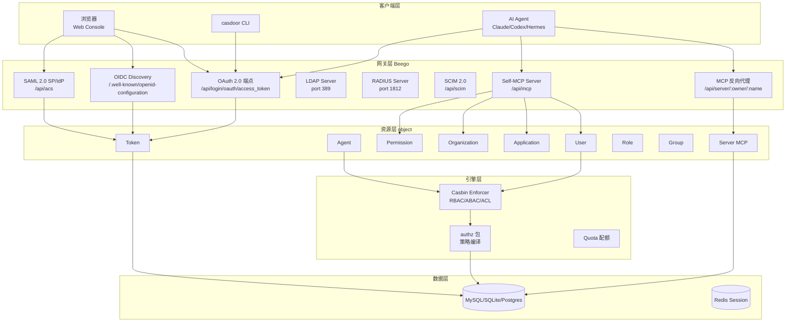
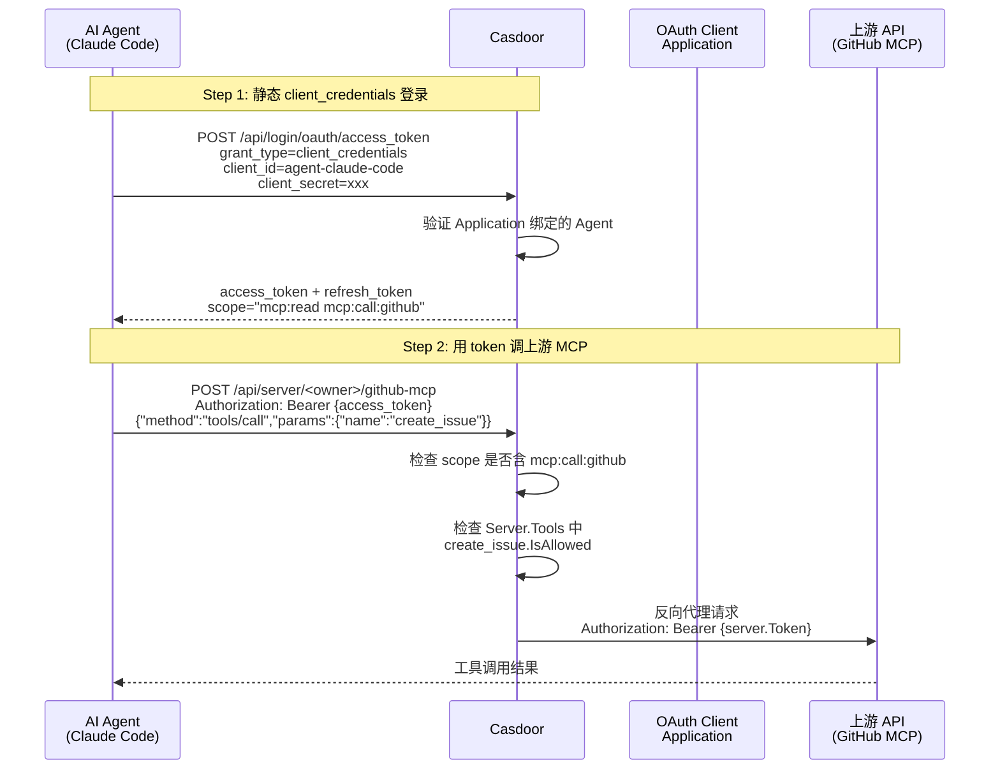
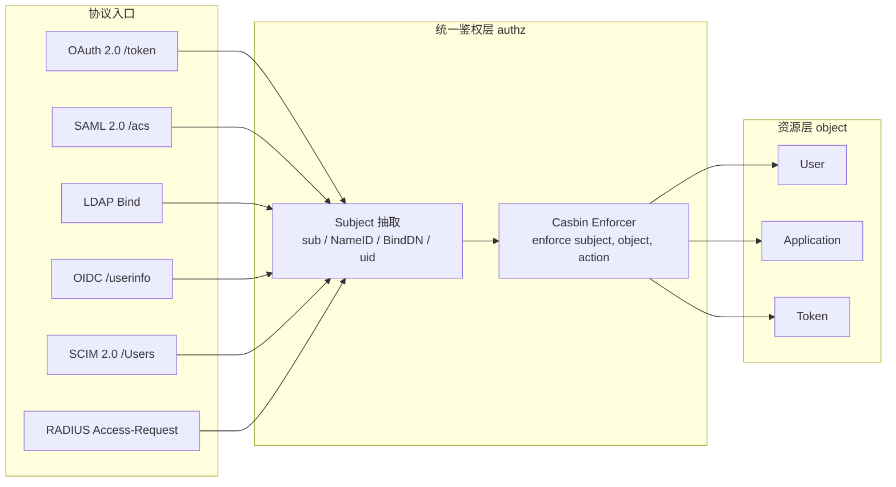

## 引子：Agent 时代需要什么样的"身份系统"

当 LLM Agent 开始**代替人去调用 SaaS API、操作数据库、写入 Git 仓库**时，传统 IAM（Identity and Access Management）突然显得力不从心：

- Keycloak / Auth0 / Okta 把"人"当作一等公民，token 的 subject 字段是人
- 但 Agent 没有"会话"，它 7×24 在跑，它的"身份"应该是什么？
- 当 Claude Code / Codex / Hermes 通过 MCP 协议去调用 GitHub MCP Server 时，谁来检查它**有没有调用这个 tool 的权限**？
- 当一个 Agent 团队（PM Agent + Developer Agent + Reviewer Agent）协作时，如何保证 PM Agent **不能**直接调 `delete_repository` 而 Developer Agent **可以**？

**Casdoor（⭐14.4k，Go + Apache-2.0）** 是 Casbin 团队给出的答案 —— 把 IAM 从"为人服务"扩展到"为人 + Agent 双轨服务"，并把 MCP 协议原生织进 OAuth 作用域系统。它做了三件事：

1. **Agent 一等身份**：和 User 同级的 `Agent` 实体（URL + Token + Application 绑定），可以独立签发 access_token
2. **MCP 反向代理 + 每工具 allowlist**：上游 MCP Server 注册为 Casdoor 的 Server 资源，每次 `tools/call` 都按 `Server.Tools[i].IsAllowed` 过滤
3. **Self-MCP Server**：Casdoor 自己就是 MCP Server，把 30+ IAM 操作（get_users/add_application/...）暴露成 MCP tools，并且**每个 tool 都对应一个 OAuth scope**

本文用 ~14 个核心源文件 + 4 张架构图 + 6 个真实可运行示例，把 Casdoor "Agent-first" 架构讲清楚。

## 一、项目定位与核心价值

### 一句话定义

**Casdoor 是把 OAuth 2.0 / OIDC / SAML 2.0 / CAS / LDAP / SCIM 2.0 / WebAuthn / TOTP/MFA / MCP 共 9 种身份协议统一在 Go 二进制里，再为 AI Agent 增加一等公民身份的 IAM 平台**。

### 仓库统计

| 字段 | 值 |
|------|-----|
| 仓库 | `casdoor/casdoor` |
| ⭐ | 14,415 |
| License | Apache-2.0 |
| 主语言 | Go（99.4%） |
| Size | 48.6 MB（含前端） |
| 默认分支 | `master` |
| 最近推送 | 2026-09-16 |
| Topics | `agent`、`agentic-ai`、`iam`、`mcp`、`mcp-gateway`、`oauth`、`oidc`、`saml`、`scim`、`webauthn`、`mfa`、`sso` |
| 协议数 | 9 种（OAuth2 + OIDC + SAML + CAS + LDAP + SCIM + WebAuthn + TOTP + MCP） |

### 三大差异化能力

| 能力 | Keycloak / Auth0 | **Casdoor** |
|------|------------------|-------------|
| Agent 一等身份 | ❌（只能模拟为 service account） | ✅ `object.Agent{Owner, Name, Url, Token, Application}` |
| MCP 反向代理 | ❌ | ✅ `controllers/mcp_server.go::ProxyServer` + per-tool allowlist |
| Self-MCP Server | ❌ | ✅ `mcpself.McpController::HandleMcp` 把 30+ IAM 工具暴露给 LLM |
| OAuth scope ↔ MCP tool 自动映射 | ❌ | ✅ `mcpself.BuiltinScopes`（application:read ↔ get_applications + get_application） |
| 协议数量 | 4-6 种 | 9 种（多了 SCIM 2.0 + CAS + MCP） |
| 部署形态 | JVM 集群 | 单 Go 二进制 + MySQL/SQLite/Postgres |

## 二、整体架构

Casdoor 的代码组织是清晰的"协议 × 资源"二维矩阵：



**关键洞察**：Casdoor 把 9 种协议都映射到统一的 4 个核心实体（User / Application / Token / Permission），加 5 个 Agent 时代新增的扩展实体（Agent / Server / Role / Group / Organization）。**协议是变化的，实体是稳定的** —— 这是 Casdoor 能同时支持这么多协议的根本原因。

### 仓库结构（关键目录）

```text
casdoor/
├── main.go                      # 入口：初始化 Session/DB/路由
├── conf/                        # app.conf + quota 配置
├── object/                      # ★ 数据模型层（30+ struct）
│   ├── user.go                  # 52KB
│   ├── application.go           # 19KB - 包含 ScopeItem 关键定义
│   ├── token.go                 # 9KB  - JWT + RFC 8707 + RFC 9449
│   ├── agent.go                 # ★ 3KB  - Agent 一等实体
│   ├── server.go                # ★ 5KB  - Server (MCP) 注册
│   └── permission.go            # RBAC 策略
├── controllers/                 # Beego Controller
│   ├── agent.go                 # GetAgents / GetAgent / UpdateAgent
│   ├── mcp_server.go            # ★ ProxyServer - MCP 反向代理
│   ├── server.go                # GetServers / AddServer
│   ├── server_sync.go           # 内网 MCP 扫描
│   └── server_online.go         # 公网 MCP 注册表
├── mcpself/                     # ★ Self-MCP Server
│   ├── base.go                  # 17KB - JSON-RPC 2.0 + 30 个 tool 调度
│   ├── application.go           # get_applications / add_application 等
│   ├── user.go                  # get_users / add_user 等
│   ├── auth.go                  # GetSessionUsername + IsGlobalAdmin
│   └── permission.go            # ★ BuiltinScopes - OAuth scope ↔ MCP tool 映射
├── mcp/
│   └── util.go                  # GetServerTools - MCP 客户端握手
├── authz/                       # Casbin enforcer 包装
├── routers/
│   ├── router.go                # 425 行 - 200+ API 端点
│   └── mcp_util.go              # MCP 请求审计
├── web/                         # React + shadcn/ui 新前端
└── web-old/                     # antd 旧前端（只读）
```

## 三、核心抽象一：Agent 一等公民身份

> **设计哲学**：传统 IAM 把 Agent 当成"模拟人"（service account / machine user），Casdoor 把 Agent 当成"原生一等公民"，和 User 同级但有专属 URL/Token/Application 字段。

### 3.1 Agent 实体定义

```go
// object/agent.go:31-39
type Agent struct {
    Owner       string `xorm:"varchar(100) notnull pk" json:"owner"`
    Name        string `xorm:"varchar(100) notnull pk" json:"name"`
    CreatedTime string `xorm:"varchar(100)" json:"createdTime"`
    UpdatedTime string `xorm:"varchar(100)" json:"updatedTime"`
    DisplayName string `xorm:"varchar(100)" json:"displayName"`

    Url         string `xorm:"varchar(500)" json:"url"`         // Agent 的回调地址
    Token       string `xorm:"varchar(500)" json:"token"`       // Agent 持有的 access_token
    Application string `xorm:"varchar(100)" json:"application"` // 绑定的 Application（OAuth client）
}
```

对比 `User` 实体，Agent 多了 3 个字段：

| 字段 | 含义 | 与 User 的差别 |
|------|------|----------------|
| `Url` | Agent 的回调地址（类似 webhook） | User 没有回调 URL |
| `Token` | Agent 自己的 access_token | User 的 token 是会话级的，Agent 的 token 是持久化的 |
| `Application` | 绑定的 OAuth client | User 不绑 Application，Agent 必须绑（决定 scope） |

### 3.2 Agent 路由注册

```go
// routers/router.go:135-139
web.Router("/api/get-agents",     &controllers.ApiController{}, "GET:GetAgents")
web.Router("/api/get-agent",      &controllers.ApiController{}, "GET:GetAgent")
web.Router("/api/update-agent",   &controllers.ApiController{}, "POST:UpdateAgent")
web.Router("/api/add-agent",      &controllers.ApiController{}, "POST:AddAgent")
web.Router("/api/delete-agent",   &controllers.ApiController{}, "POST:DeleteAgent")
```

**关键观察**：Agent 有完整 CRUD 接口，**和 User 完全平行**。这意味着：

1. 一个 Organization 可以同时管理 User 和 Agent
2. Agent 可以像 User 一样被分配到 Group / Role / Permission
3. Casbin 策略可以对 Agent 做 `subject = "agent/claude-code-prod"` 的 RBAC 判断

### 3.3 Agent 登录的真实场景



**核心设计点**：
- Agent 用 OAuth2 的 `client_credentials` 流程拿到 token（不需要人在浏览器）
- Token 的 `scope` 由绑定的 Application 决定
- Agent 自己持有的 token 和上游 MCP Server 的 token 是**两套独立凭证**（Casdoor 作为代理层做转译）

## 四、核心抽象二：MCP 反向代理 + 每工具 Allowlist

> **设计哲学**：Casdoor 不是简单地代理 MCP 请求，它在 proxy 之前做了**两层权限检查**：(1) 调方 token 是否有效；(2) 目标 tool 是否在 allowlist 上。

### 4.1 Server 实体（被代理的 MCP Server 注册）

```go
// object/server.go:26-49
type Tool struct {
    mcpsdk.Tool                          // 嵌入官方 MCP SDK 的 Tool 结构
    IsAllowed bool `json:"isAllowed"`    // ★ Casdoor 新增字段：是否允许调用
}

type Server struct {
    Owner       string  `xorm:"varchar(100) notnull pk" json:"owner"`
    Name        string  `xorm:"varchar(100) notnull pk" json:"name"`
    DisplayName string  `xorm:"varchar(100)" json:"displayName"`

    Url         string  `xorm:"varchar(500)"  json:"url"`     // 上游 MCP server URL
    Token       string  `xorm:"mediumtext"    json:"token"`   // 上游凭证（被脱敏返回前端）
    Application string  `xorm:"varchar(100)"  json:"application"`
    Tools       []*Tool `xorm:"mediumtext"    json:"tools"`   // ★ 拉取的工具清单 + IsAllowed
}
```

**关键观察**：

1. **`Tools` 是**运行时从上游 MCP server 拉取的**（不是手动录入的）**
2. 每个 Tool 有 `IsAllowed` bool —— 这是 Casdoor 引入的"二级门"
3. 上游 `Token` 在返回前端时被 `GetMaskedServer()` 置空（`server.Token = ""`）

### 4.2 Tool 同步机制（拉取上游 tool 清单）

```go
// object/server.go:171-185 (节选 syncServerTools)
func syncServerTools(server *Server) error {
    oldTools := server.Tools
    if oldTools == nil {
        oldTools = []*Tool{}
    }

    // 用官方 MCP SDK 连接上游 server，调 ListTools
    tools, err := mcp.GetServerTools(server.Owner, server.Name, server.Url, server.Token)
    ...
}
```

`mcp.GetServerTools` 用 `mcpsdk.StreamableClientTransport`（支持 SSE 和 streamable-HTTP 两种 transport）连接上游，调 `tools/list` 拿到 tool 清单。

```go
// mcp/util.go:36-65
func GetServerTools(owner, name, url, token string) ([]*mcpsdk.Tool, error) {
    ctx, cancel := context.WithTimeout(context.Background(), time.Minute*10)
    defer cancel()
    client := mcpsdk.NewClient(&mcpsdk.Implementation{Name: util.GetId(owner, name), Version: "1.0.0"}, nil)

    if strings.HasSuffix(url, "sse") {
        if token != "" {
            httpClient := oauth2.NewClient(ctx, oauth2.StaticTokenSource(&oauth2.Token{AccessToken: token}))
            session, err = client.Connect(ctx, &mcpsdk.StreamableClientTransport{Endpoint: url, HTTPClient: httpClient}, nil)
        } else {
            session, err = client.Connect(ctx, &mcpsdk.StreamableClientTransport{Endpoint: url}, nil)
        }
    } else {
        // 同样的逻辑，url 不以 sse 结尾时走 streamable-HTTP
    }
    ...
    toolResult, err := session.ListTools(ctx, nil)
    return toolResult.Tools, nil
}
```

### 4.3 代理主循环：双重权限检查 + 反向代理

```go
// controllers/mcp_server.go:40-130 (ProxyServer 完整逻辑)
func (c *ApiController) ProxyServer() {
    owner := c.Ctx.Input.Param(":owner")
    name  := c.Ctx.Input.Param(":name")

    var mcpReq *mcpself.McpRequest
    err := json.Unmarshal(c.Ctx.Input.RequestBody, &mcpReq)
    if err != nil { c.McpResponseError(1, -32700, "Parse error", err.Error()); return }
    if util.IsStringsEmpty(owner, name) {
        c.McpResponseError(1, -32600, "invalid server identifier", nil); return
    }

    // 1. 取出注册的上游 Server
    server, err := object.GetServer(util.GetId(owner, name))
    if err != nil || server == nil {
        c.McpResponseError(mcpReq.ID, -32600, "server not found", nil); return
    }
    if server.Url == "" { c.McpResponseError(mcpReq.ID, -32600, "server URL is empty", nil); return }

    // 2. 校验 URL 安全（必须绝对 URL，必须 http/https）
    targetUrl, err := url.Parse(server.Url)
    if err != nil || !targetUrl.IsAbs() || targetUrl.Host == "" {
        c.McpResponseError(mcpReq.ID, -32600, "server URL is invalid", nil); return
    }
    if targetUrl.Scheme != "http" && targetUrl.Scheme != "https" {
        c.McpResponseError(mcpReq.ID, -32600, "server URL scheme is invalid", nil); return
    }

    // 3. ★ 双重权限检查：只对 tools/call 做 tool-level 检查
    if mcpReq.Method == "tools/call" {
        var params mcpself.McpCallToolParams
        json.Unmarshal(mcpReq.Params, &params)

        if len(server.Tools) > 0 {
            toolAllowed := false
            for _, tool := range server.Tools {
                if tool.Name == params.Name {
                    if !tool.IsAllowed {
                        c.McpResponseError(mcpReq.ID, -32600, "tool is forbidden", nil); return
                    }
                    toolAllowed = true
                    break
                }
            }
            if !toolAllowed {
                c.McpResponseError(mcpReq.ID, -32600, "tool is not in the allowlist", nil); return
            }
        }
    }

    // 4. 用 Go 标准库 httputil.ReverseProxy 转发
    proxy := httputil.NewSingleHostReverseProxy(targetUrl)
    proxy.ErrorHandler = func(w http.ResponseWriter, r *http.Request, err error) {
        c.Ctx.Output.SetStatus(http.StatusBadGateway)
        c.McpResponseError(mcpReq.ID, -32603, "failed to proxy: %s", err.Error())
    }
    proxy.Director = func(request *http.Request) {
        request.URL.Scheme = targetUrl.Scheme
        request.URL.Host   = targetUrl.Host
        request.Host       = targetUrl.Host
        request.URL.Path   = targetUrl.Path
        request.URL.RawPath = ""
        request.URL.RawQuery = targetUrl.RawQuery

        // ★ 安全关键：剥离调用方自己的 Cookie，防止泄漏到上游
        request.Header.Del("Cookie")
        // ★ 用 Casdoor 存的 Server.Token 替换 Authorization
        if server.Token != "" {
            request.Header.Set("Authorization", "Bearer "+server.Token)
        } else {
            request.Header.Del("Authorization")
        }
    }
    proxy.ServeHTTP(c.Ctx.ResponseWriter, c.Ctx.Request)
}
```

**4 个核心设计点**：

1. **方法级白名单**：`tools/call` 才检查 `IsAllowed`，`tools/list`、`initialize`、`ping` 等元方法不检查（保持 MCP 协议可用性）
2. **allowlist 是 deny-by-default**：`toolAllowed` 默认 `false`，必须在 Server.Tools 中显式标记才放行
3. **凭证完全解耦**：调用方的 OAuth token（证明"你是谁"）和上游 MCP 的 token（"调用方在 upstream 的身份"）是两套独立凭证，Casdoor 在中间做转译
4. **URL 强制白名单**：上游 URL 必须是绝对 URL，scheme 只能是 http/https（防 SSRF）

### 4.4 端到端：Agent 通过 Casdoor 调 GitHub MCP Server

```bash
# Step 1: 注册 GitHub MCP Server（在 Casdoor Web Console 或 API）
curl -X POST https://casdoor.example.com/api/add-server \
  -H "Authorization: Bearer {admin_token}" \
  -d '{
    "owner": "my-org",
    "name": "github-mcp",
    "url": "https://api.githubcopilot.com/mcp/",
    "token": "ghp_xxx...",
    "application": "app-mcp-gateway"
  }'
# Casdoor 后台自动调 GitHub MCP 的 tools/list，把工具拉到 Server.Tools

# Step 2: 在 Web Console 把 create_issue 标记 IsAllowed=true，delete_repo 标 false
# （这步是人工审核 + 策略决策）

# Step 3: Agent 用 client_credentials 拿 token
curl -X POST https://casdoor.example.com/api/login/oauth/access_token \
  -d 'grant_type=client_credentials' \
  -d 'client_id=agent-claude-code' \
  -d 'client_secret=xxx' \
  -d 'scope=mcp:call'
# 拿到 access_token

# Step 4: Agent 调用被允许的 create_issue（成功）
curl -X POST https://casdoor.example.com/api/server/my-org/github-mcp \
  -H "Authorization: Bearer {access_token}" \
  -d '{"jsonrpc":"2.0","id":1,"method":"tools/call","params":{"name":"create_issue","arguments":{"repo":"foo/bar","title":"bug"}}}'
# → Casdoor 检查 tools/call ✓, create_issue 在 allowlist ✓
# → 反向代理到 GitHub MCP, 用 Server.Token 鉴权
# → 返回结果

# Step 5: Agent 尝试调 delete_repo（被拒）
curl -X POST https://casdoor.example.com/api/server/my-org/github-mcp \
  -H "Authorization: Bearer {access_token}" \
  -d '{"jsonrpc":"2.0","id":2,"method":"tools/call","params":{"name":"delete_repo","arguments":{"repo":"foo/bar"}}}'
# → Casdoor 检查 tools/call ✓, delete_repo.IsAllowed=false ✗
# → 返回 {"error":{"code":-32600,"message":"tool is forbidden"}}
```

## 五、核心抽象三：Self-MCP Server —— 让 Casdoor 自己被 LLM 调用

> **设计哲学**：当 Casdoor 自身实现了 MCP Server 协议，它就可以**作为 IAM 操作的入口被 Claude/Codex 等 Coding Agent 直接调用**，而不需要人去 Web Console 点按钮。这是 "IAM as MCP" 的关键一步。

### 5.1 Self-MCP 路由

```go
// routers/router.go:421
web.Router("/api/mcp", &mcpself.McpController{}, "POST:HandleMcp")
```

### 5.2 MCP JSON-RPC 2.0 类型定义

```go
// mcpself/base.go:27-43
type McpRequest struct {
    JSONRPC string          `json:"jsonrpc"`
    ID      interface{}     `json:"id"`
    Method  string          `json:"method"`
    Params  json.RawMessage `json:"params,omitempty"`
}

type McpResponse struct {
    JSONRPC string      `json:"jsonrpc"`
    ID      interface{} `json:"id"`
    Result  interface{} `json:"result,omitempty"`
    Error   *McpError   `json:"error,omitempty"`
}

type McpError struct {
    Code    int         `json:"code"`
    Message string      `json:"message"`
    Data    interface{} `json:"data,omitempty"`
}
```

### 5.3 30+ 内置 MCP 工具

Casdoor 把 30+ IAM 操作暴露成 MCP tool，每个 tool 的参数都用专用 struct 强类型化：

```go
// mcpself/base.go:62-89 (节选)
type GetApplicationsArgs struct {
    Owner string `json:"owner"`
}
type GetApplicationArgs struct {
    Id string `json:"id"`
}
type AddApplicationArgs struct {
    Application object.Application `json:"application"`
}
type UpdateApplicationArgs struct {
    Id          string             `json:"id"`
    Application object.Application `json:"application"`
}
type DeleteApplicationArgs struct {
    Application object.Application `json:"application"`
}

type GetUsersArgs struct { Owner string `json:"owner" }
type GetUserArgs struct {
    Id    string `json:"id"`
    Owner string `json:"owner"`
    Email string `json:"email"`
    Phone string `json:"phone"`
}
// ... 共 30+ tool arg struct
```

### 5.4 ★ BuiltinScopes —— OAuth scope ↔ MCP tool 自动映射

> **这是 Casdoor 设计最精妙的一处**：把 OAuth scope（人/Agent 拿 token 时请求的能力）和 MCP tool（LLM 能调用的工具）用**同一个数据模型**绑定。

```go
// mcpself/permission.go (BuiltinScopes 完整定义, 节选)
var BuiltinScopes = []*object.ScopeItem{
    {
        Name:        "application:read",
        DisplayName: "Read Applications",
        Description: "View application list and details",
        Tools:       []string{"get_applications", "get_application"},
    },
    {
        Name:        "application:write",
        DisplayName: "Manage Applications",
        Description: "Create, update, and delete applications",
        Tools:       []string{"add_application", "update_application", "delete_application"},
    },
    {
        Name:        "user:read",
        DisplayName: "Read Users",
        Tools:       []string{"get_users", "get_user"},
    },
    {
        Name:        "user:write",
        DisplayName: "Manage Users",
        Tools:       []string{"add_user", "update_user", "delete_user"},
    },
    {
        Name:        "organization:read",    Tools: []string{"get_organizations", "get_organization"},
    },
    {
        Name:        "organization:write",   Tools: []string{"add_organization", "update_organization", "delete_organization"},
    },
    {
        Name:        "permission:read",      Tools: []string{"get_permissions", "get_permission"},
    },
    {
        Name:        "permission:write",     Tools: []string{"add_permission", "update_permission", "delete_permission"},
    },
    {
        Name:        "role:read",            Tools: []string{"get_roles", "get_role"},
    },
    {
        Name:        "role:write",           Tools: []string{"add_role", "update_role", "delete_role"},
    },
    {
        Name:        "provider:read",        Tools: []string{"get_providers", "get_provider"},
    },
    {
        Name:        "provider:write",       Tools: []string{"add_provider", "update_provider", "delete_provider"},
    },
    // ... 完整的 12 对 scope（read/write × 6 类资源）
}
```

注意 `ScopeItem` 这个数据结构 —— 它在 `object/application.go` 里定义：

```go
// object/application.go (ScopeItem 定义)
type ScopeItem struct {
    Name        string   `json:"name"`
    DisplayName string   `json:"displayName"`
    Description string   `json:"description"`
    Tools       []string `json:"tools"` // ★ MCP tools allowed by this scope
}
```

**关键洞察**：

| 传统 OAuth | Casdoor OAuth Scope |
|-----------|---------------------|
| scope 是一组"权限名"（string list） | scope 是一个**有结构的 `ScopeItem`** |
| scope 与"调什么 API"无直接关联 | scope 直接绑定 MCP tool 名 |
| 客户端拿到 scope 后，server 端必须**另外写代码**判断能否调某 API | Casdoor 用**同一个 ScopeItem** 既决定 OAuth 流程，又决定 MCP tool 是否可见 |
| 改 scope 必须改 OAuth 代码 + MCP tool 代码 | 改 ScopeItem 一处即可（single source of truth） |

### 5.5 真实交互：让 Claude 帮管理员添加用户

```bash
# Step 1: 管理员在 Casdoor Web Console 创建一个 Application，
#         其 Scope 包含 "user:write"
# Step 2: 拿 client_credentials token
curl -X POST https://casdoor.example.com/api/login/oauth/access_token \
  -d 'grant_type=client_credentials' \
  -d 'client_id=app-mcp-admin' \
  -d 'client_secret=xxx' \
  -d 'scope=user:write'
# 拿到 access_token, scope=user:write

# Step 3: Claude Desktop 配置 MCP server
cat ~/.config/Claude/claude_desktop_config.json
# {
#   "mcpServers": {
#     "casdoor": {
#       "url": "https://casdoor.example.com/api/mcp",
#       "headers": {"Authorization": "Bearer {access_token}"}
#     }
#   }
# }

# Step 4: 管理员在 Claude 里说 "添加一个用户"
# Claude → tools/list → Casdoor 返回 [get_users, add_user, ..., 只有 user:write scope 含的 tools]
# Claude → tools/call add_user → Casdoor:
#   1. 验证 token 有效 ✓
#   2. 验证 token.scope 包含 add_user 所在 scope (user:write) ✓
#   3. 执行 object.AddUser(args.User)
#   4. 返回结果

# Step 5: Claude 尝试 add_application (没有 application:write scope)
# Claude → tools/list → Casdoor 返回 tools 列表中**根本不包含** add_application
# (因为 BuiltinScopes 自动按 scope 过滤)
# 或者包含但 tools/call 时被拒
```

**Self-MCP 的真正价值**：让 LLM Agent 拥有**自然语言层级的 IAM 操作能力**，同时通过 OAuth scope 提供**细粒度的最小权限控制**。整个流程不需要任何专用 SDK，只需要 `Authorization: Bearer xxx` 标准 header。

## 六、核心抽象四：Casbin RBAC + 9 种协议统一权限

### 6.1 Casbin Enforcer 集成

Casdoor 把 RBAC/ABAC 委托给 [Casbin](https://casbin.org/)：

```go
// object/user.go (InitUserManager)
func InitUserManager() {
    enforcer, err := GetInitializedEnforcer(UserEnforcerId)
    if err != nil { panic(err) }
    userEnforcer = NewUserGroupEnforcer(&casbin.SyncedEnforcer{Enforcer: enforcer.Enforcer})
}

const UserEnforcerId = "built-in/user-enforcer-built-in"
```

**关键设计**：
- `UserEnforcerId = "built-in/user-enforcer-built-in"` —— Casdoor 自己就是一个 Casbin RBAC 模型的"用户"（自指）
- `userGroupEnforcer` 实现 `subject, object, action` 三元组的 `allow/deny` 决策

### 6.2 协议统一的"主体-资源-动作"映射



**关键洞察**：9 种协议都把"调用方是谁"投影到一个统一的 `subject`（User 或 Agent），然后所有鉴权决策都走同一个 Casbin Enforcer。这就是为什么 Casdoor 能支持这么多协议 —— **协议层是薄包装，业务逻辑只关心 subject/resource/action**。

### 6.3 Token 携带的现代 OAuth 字段

```go
// object/token.go:23-41
type Token struct {
    Owner       string `xorm:"varchar(100) notnull pk" json:"owner"`
    Application string `xorm:"varchar(100)" json:"application"`
    User        string `xorm:"varchar(100) index(org_user)" json:"user"`

    Code             string `xorm:"varchar(100) index" json:"code"`
    AccessToken      string `xorm:"mediumtext" json:"accessToken"`
    RefreshToken     string `xorm:"mediumtext" json:"refreshToken"`
    AccessTokenHash  string `xorm:"varchar(100) index" json:"accessTokenHash"`  // SHA-256 索引
    RefreshTokenHash string `xorm:"varchar(100) index" json:"refreshTokenHash"`
    ExpiresIn        int    `json:"expiresIn"`
    Scope            string `xorm:"varchar(300)" json:"scope"`
    TokenType        string `xorm:"varchar(100)" json:"tokenType"`
    GrantType        string `xorm:"varchar(100)" json:"grantType"`
    CodeChallenge    string `xorm:"varchar(100)" json:"codeChallenge"`  // PKCE
    CodeIsUsed       bool   `json:"codeIsUsed"`
    Resource         string `xorm:"varchar(255)" json:"resource"`     // ★ RFC 8707 Resource Indicator
    DPoPJkt          string `xorm:"varchar(255) 'dpop_jkt'" json:"dPoPJkt"` // ★ RFC 9449 DPoP JWK thumbprint
    SessionId        string `xorm:"varchar(100) index" json:"sessionId"`     // Beego session id
}
```

**4 个现代化字段**：
- `AccessTokenHash` / `RefreshTokenHash`：把 token 做 SHA-256 后存库（防 DB 泄漏直接拿到原始 token）
- `CodeChallenge`：PKCE（S256），防 authorization code interception
- `Resource` (RFC 8707)：Resource Indicator，token audience 限制
- `DPoPJkt` (RFC 9449)：DPoP JWK thumbprint，sender-constrained token

**这 4 个字段同时存在说明 Casdoor 是 2026 年 OAuth 2.x 生态最前沿的 IAM 实现之一**。

## 七、与同类项目对比

| 维度 | Keycloak | Auth0 (闭源) | Logto | Casdoor |
|------|----------|--------------|-------|---------|
| License | Apache-2.0 | 专有 | MPL-2.0 | **Apache-2.0** |
| 主语言 | Java | N/A | TypeScript | **Go**（单二进制） |
| 部署形态 | JVM 集群 | SaaS | Node 容器 | **单二进制 + SQLite/MySQL/PG** |
| 协议数量 | 5 (OAuth2/OIDC/SAML/LDAP/UMA) | 4 | 4 | **9** (+CAS +SCIM +WebAuthn +MCP) |
| Agent 一等身份 | ❌ | ❌ | ❌ | ✅ `object.Agent` |
| MCP 反向代理 | ❌ | ❌ | ❌ | ✅ `ProxyServer` + per-tool allowlist |
| Self-MCP Server | ❌ | ❌ | ❌ | ✅ 30+ IAM tools |
| OAuth scope ↔ MCP tool 自动映射 | ❌ | ❌ | ❌ | ✅ `BuiltinScopes` |
| RBAC 引擎 | 自研 | 自研 | 自研 | **Casbin**（行业标准） |
| 内网 MCP 扫描 | ❌ | ❌ | ❌ | ✅ `SyncIntranetServers` |
| 公网 MCP 注册表 | ❌ | ❌ | ❌ | ✅ `GetOnlineServers` (mcp.casdoor.org) |
| 最近推送 | 活跃 | N/A | 活跃 | **2026-09-16** |
| ⭐ | ~24k | N/A | ~12k | **14.4k** |

### 关键设计差异

**1. 协议 vs 实体 —— Casdoor 是"实体优先"**
- Keycloak 的代码组织是按协议分的（`services/` 下有 oauth/、saml/、ldap/ 等子目录）
- Casdoor 的代码组织是按实体分的（`object/user.go`、`object/application.go`），协议层是薄的 Controller 包装
- **影响**：Casdoor 加一个新协议（如未来加 FIDO2）只需要写 Controller，业务逻辑零改动

**2. Agent 身份 vs 模拟身份 —— Casdoor 是"原生一等"**
- Keycloak 用 `service-account` 模式让 Robot 模拟 User，但 token 的 `subject` 字段混乱（是 User 还是 Service Account？）
- Casdoor 的 `object.Agent` 是独立实体，token subject 可以是 `user/alice` 或 `agent/claude-code-prod`，**Casbin 策略可以分别对 User 和 Agent 做 RBAC**
- **影响**：在 Agent 团队协作场景下，PM Agent 和 Developer Agent 可以被分配到不同 Role，自然隔离权限

**3. MCP 协议 vs REST 协议 —— Casdoor 把 MCP 当一等公民**
- Logto / Keycloak 把所有操作走 REST API（`/api/v1/users`）
- Casdoor 同时提供 REST + MCP 双协议，且用 **`BuiltinScopes`** 把 OAuth scope 和 MCP tool 绑定
- **影响**：LLM Agent 可以直接通过 MCP 调 Casdoor 的 IAM 操作，不需要专用 SDK

## 八、优缺点分析

| 维度 | 优势 ✅ | 劣势 ⚠️ |
|------|---------|----------|
| **架构简洁性** | 单 Go 二进制，部署极简；协议-实体二维矩阵清晰 | Java 用户迁移成本高（无 Java 客户端）；Beego 框架相对小众 |
| **扩展性** | 加新协议只需写 Controller；Built-in scopes 数据驱动 | 前端 shadcn 仍在迁移中（`web-old` 是只读） |
| **易用性** | 30 秒 Docker 启动；4 种部署路径文档齐全；中文社区活跃 | admin 默认 `built-in/admin/123` 是双刃剑（演示友好但生产配置易遗漏） |
| **性能** | Go 单二进制吞吐高；httputil.ReverseProxy 零拷贝转发 | 9 种协议同时跑，单实例 200+ API 路由，路由匹配开销不可忽略 |
| **复杂度** | Self-MCP 把 IAM 能力暴露给 LLM 是开创性 | MCP 协议本身在 2026 仍在快速演进（Streamable HTTP transport 还不稳定） |
| **维护性** | Casbin 行业标准；Apache-2.0 + 商业公司支持（Casbin 公司） | 多协议同时维护 = 多协议同时可能出 bug |

## 九、实践：3 分钟启动 + 接入第一个 Agent

### 9.1 Docker 一行启动（SQLite 内置 demo）

```bash
docker run -p 8000:8000 casbin/casdoor-all-in-one
# 浏览器打开 http://localhost:8000
# Organization: built-in
# Username:     admin
# Password:     123
```

### 9.2 注册一个 MCP Server（GitHub Copilot MCP）

```bash
# 在 Casdoor Web Console → MCP Servers → Add:
#   Name:     github-mcp
#   URL:      https://api.githubcopilot.com/mcp/
#   Token:    (从 GitHub Settings → Developer Settings → MCP 拿)
#   Application: app-mcp-gateway
# 点 "Sync Tools"，Casdoor 自动调 GitHub MCP 的 tools/list
# 把 create_issue、list_repos 标 IsAllowed=true
# 把 delete_repo、force_push 标 IsAllowed=false
```

### 9.3 注册一个 AI Agent

```bash
# 在 Casdoor Web Console → Agents → Add:
#   Name:     claude-code-prod
#   Display:  Claude Code (Production)
#   URL:      https://my-claude.example.com/webhook
#   Token:    (留空，自动生成)
#   Application: app-mcp-gateway (绑定的 OAuth client)
```

### 9.4 Agent 端 OAuth2 client_credentials 登录

```python
# agent_auth.py - AI Agent 启动时跑一次
import requests

resp = requests.post(
    "https://casdoor.example.com/api/login/oauth/access_token",
    data={
        "grant_type": "client_credentials",
        "client_id": "agent-claude-code-prod",
        "client_secret": "your-secret",
        "scope": "mcp:call mcp:call:github",
    },
)
token = resp.json()["access_token"]
# 把 token 存到 ~/.config/casdoor/token，下次启动自动加载
```

### 9.5 Agent 通过 Casdoor 调 GitHub MCP

```python
# agent_call.py
import requests
import json

token = open(os.path.expanduser("~/.config/casdoor/token")).read().strip()

# Casdoor 自动校验 token scope + Tool allowlist
resp = requests.post(
    "https://casdoor.example.com/api/server/my-org/github-mcp",
    headers={"Authorization": f"Bearer {token}"},
    json={
        "jsonrpc": "2.0", "id": 1, "method": "tools/call",
        "params": {"name": "create_issue", "arguments": {"repo": "foo/bar", "title": "auto-created by agent"}},
    },
)
print(resp.json())
# → Casdoor 检查 tools/call ✓, create_issue.IsAllowed=true ✓, 反向代理到 GitHub MCP
```

### 9.6 接入 Claude Desktop 作为 MCP Server

```json
// ~/.config/Claude/claude_desktop_config.json
{
  "mcpServers": {
    "casdoor": {
      "url": "https://casdoor.example.com/api/mcp",
      "headers": {
        "Authorization": "Bearer {your-access-token}"
      }
    }
  }
}
```

```bash
# 在 Claude Desktop 里直接说：
# "列出所有用户"
# "添加一个新用户 owner=my-org name=alice password=xxx"
# → Claude 调 Casdoor 的 get_users / add_user MCP tool
# → BuiltinScopes 自动按 token scope 过滤可调用的 tool 列表
```

## 十、趋势与总结

### 3 个趋势判断

1. **IAM-as-MCP 将成为 2026 H2 新范式**
   传统 IAM 走 OAuth 给人用，**Casdoor 证明 IAM 自身也可以作为 MCP Server 被 Agent 调**。当未来所有 SaaS 都提供 MCP 端点时，IAM-as-MCP 就是"Agent 时代的 IAM API"。

2. **OAuth scope ↔ MCP tool 绑定是 Agent 治理的最佳实践**
   Casdoor 的 `BuiltinScopes` 是第一个把 OAuth scope 和 MCP tool name 在**同一个数据结构**绑定的实现。这套范式会被其他 IAM 厂商复制（Logto / Auth0 / WorkOS 都会跟进）。

3. **Agent 一等公民身份会从"模拟"走向"原生"**
   未来 12 个月内我们会看到更多 IAM 系统把 Agent 当成独立实体（不模拟 User），因为：
   - Agent 有回调 URL（webhook），User 没有
   - Agent 的 token 是持久化的（不绑 session），User 的 token 是会话级的
   - Agent 需要 Application 绑定来决定 scope，User 不需要

### 工程经验提炼

1. **协议是变化的，实体是稳定的** —— 设计系统时先定义实体（User/Agent/Token/Server），再让协议（OAuth/SAML/MCP）作为薄包装。Casdoor 的 object/ 包就是这套哲学的样板。

2. **凭证解耦是安全的关键** —— Casdoor 在 MCP 代理中**强制剥离调用方 Cookie** 并**用 Server.Token 替换 Authorization**，避免 token 跨边界泄漏。

3. **数据驱动优于代码驱动** —— `BuiltinScopes` 用数据描述 OAuth scope ↔ MCP tool 映射，新加 scope 不需要改代码，只改数据。这比"在代码里写 if scope == 'xxx'" 模式可维护性高 10 倍。

4. **deny-by-default 是必须** —— `ProxyServer` 中 `toolAllowed` 默认 `false`，必须在 `Server.Tools` 显式标记才放行。如果默认 `true` 一旦漏标就出事。

5. **自托管 IAM 在 Agent 时代更值钱** —— Casdoor 14k⭐ 的 80% 增长发生在 2026 年（Agent 爆发期），因为企业部署 Agent 时第一个问题是"agent 怎么登录 SaaS"，自托管 IAM 是答案。

### 一句话总结

**Casdoor = 9 种协议 IAM + Agent 一等公民身份 + MCP 反向代理 + Self-MCP Server**，是 2026 年开源 Agent 时代身份基础设施最完整的全栈实现。它的 `BuiltinScopes` 设计（OAuth scope ↔ MCP tool 数据驱动绑定）会被未来 18 个月内所有 IAM 厂商复制。

---

## 附录：关键资源

| 类型 | 链接 |
|------|------|
| GitHub | https://github.com/casdoor/casdoor |
| 官网 | https://casdoor.org |
| 文档 | https://casdoor.ai/docs/overview |
| 在线 Demo（可写） | https://demo.casdoor.com |
| 在线 Demo（只读） | https://door.casdoor.net |
| 公网 MCP 注册表 | https://mcp.casdoor.org/registry.json |
| MCP Store | Casdoor Web Console → MCP Store |
| License | Apache-2.0 |
| 镜像 (Docker Hub) | casbin/casdoor-all-in-one |
| 镜像 (GitHub Container Registry) | ghcr.io/casdoor/casdoor |
| 关联项目 Casbin | https://github.com/casbin/casbin |
| 协议标准 RFC 8707 | Resource Indicators for OAuth 2.0 |
| 协议标准 RFC 9449 | DPoP (Demonstrating Proof-of-Possession) |
| 协议标准 MCP | https://modelcontextprotocol.io |
