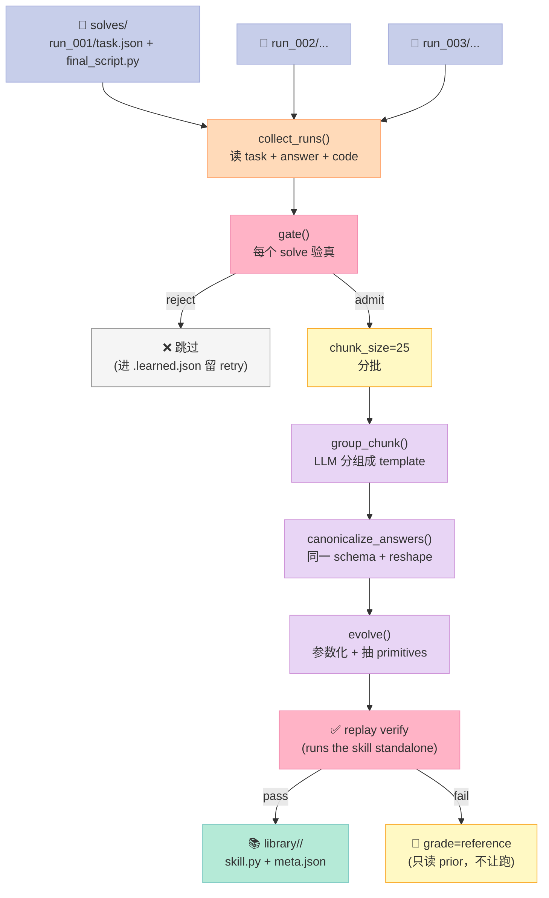
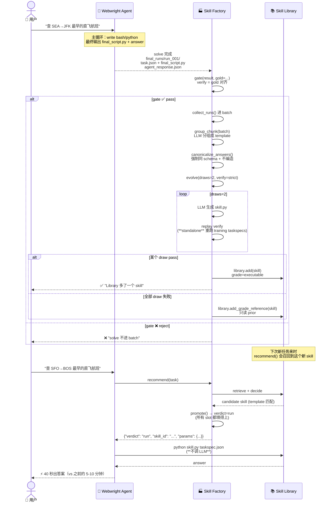

> 微软研究院（Microsoft Research）2026 年 5 月开源的 Webwright 只用了 **1.5k 行核心代码** 就让 Claude Code / Codex / Hermes 这些 Coding Agent 直接接管浏览器，并在 WebArena 上拿下长时任务 SOTA。但比核心代码更值得拆解的是它配套的 **Skill Factory**——它把"做完的任务"蒸馏成"可重用的代码 skill"，让一个 Library 从零起步，在 40 秒内把一个新的 WebArena 任务准确率从 55% 提到 70%（+15 pp）。这一篇讲清楚：它为什么选择"一个终端 + 一个浏览器 + 一个模型"，以及 Skill Factory 是如何用 6 大原语搭建 Skill 训练闭环的。

---

## 一、从"Web Agent = Step-by-step 浏览器会话"说起

### 1.1 主流 Web Agent 的"状态错位"

今天打开 WebArena、WebVoyager、SeeAct 这些 Web Agent benchmark 的 SOTA 模型，你看到的 agent loop 大致长得像这样：

```python
# 主流 Web Agent 的"step-by-step in stateful browser"范式
while not done:
    page_state = browser.snapshot()          # 当前页面状态
    action = llm.predict_one_action(page_state)  # 预测下一步操作
    browser.execute(action)                   # click / type / scroll
    success = judge(action, page_state)       # 检验
```

这套路在 2024 年 GPT-4 还很弱的时候是对的——模型一次只能稳稳地预测一个浏览器动作，所以 agent loop 围着浏览器转，每次迭代看一步。

但 2026 年的模型已经能在终端里写 200 行 Playwright 代码了。

把模型继续锁在"每步预测一次 click"的循环里，等于让一个会写 RPA 脚本的工程师退化回按键精灵。**模型变强了，harness 没跟上**。

### 1.2 Webwright 的反问：让 Agent 开发"程序"，而不是预测"动作"

微软研究院的 Webwright 把整个前提翻了过来。它给 LLM **一整个交互系统**：

- 一个终端（bash + python 解释器，能跑任意脚本）
- 一个浏览器（Playwright，可以启动、捕获、丢弃多个 session）
- 一个本地 workspace（`./workspace/`，里面有 `plan.md`、`final_script.py`、`final_runs/`）

整个 agent loop 只剩 4 步：

```python
while not done:
    code = llm.write_code_or_bash(state)     # 写一段 bash 或 python
    execute(code)                            # 跑
    observation = capture_outputs()          # 拿到截图、stdout、exit code
    decide_next_step(observation)            # 决定 done 还是继续
```

中间没有任何"agent-as-controller"层——没有 graph engine、没有 multi-agent dispatcher、没有 plugin 抽象。

> 整个 web agent 的浏览历史 = **一个 Python 脚本**（`final_script.py`）。

这句话是 Webwright 设计的灵魂。它意味着：

- agent 的每一步动作是**可重放**的（rerun `final_script.py`）
- agent 跨任务的"经验"是**可积累**的（skill_library 里几十个 `skill.py`）
- agent 的失败是**可调试**的（看 stdout 和截图，不是看 prompt）

---

## 二、1.5k 行核心代码里藏了什么

### 2.1 仓库全景

Webwright 的代码骨架如下（只列 Python 包入口）：

```
src/webwright/
├── agents/default.py            # DefaultAgent —— 主循环 (467 行)
├── environments/
│   ├── local_browser.py         # Playwright env (570 行)
│   └── local_workspace.py       # 本地工作区 (350 行)
├── models/                      # OpenAI / Anthropic / OpenRouter 适配
├── tools/
│   ├── persistent_local_browser.py
│   ├── self_reflection.py       # judge 模型
│   └── skill_use.py             # ⭐ Library 查询：recommend()
├── run/cli.py                   # CLI 入口 (150 行)
└── skill_factory/               # ⭐ Skill 训练闭环（重点拆解）
    ├── route.py                 # 3-way 路由 run/adapt/skip
    ├── gate.py                  # Admission Gate
    ├── learn.py                 # 从 solves 抽 template + params
    ├── build.py                 # solve x N + learn
    ├── execute.py               # run_skill 直接执行
    ├── retrieve.py              # Library 召回
    ├── decide.py                # use/adapt/skip 判定
    ├── fill.py / prompt.py / llm.py
    ├── library.py               # Skill 存储
    ├── update.py                # evolve —— N 个 solve → 一个泛化 skill
    └── examples/                # 真实训练出来的 skill 样本
```

整个核心加起来 ~1.5k LoC。Skill Factory 是它体量的两倍——但这是值得的，因为"skill 训练"才是 Webwright 区别于其他 Web Agent 的关键。

### 2.2 极简主循环（`agents/default.py`）

```python
# 摘自 src/webwright/agents/default.py（简化版，保留核心 30 行）
class DefaultAgent:
    def __init__(self, model: Model, env: Environment, **kwargs):
        self.config = AgentConfig(**kwargs)
        self.messages: list[dict[str, Any]] = []
        self.model = model
        self.env = env
        self.n_calls = 0

    def run(self, task: str = "", **kwargs) -> dict[str, Any]:
        self.messages = []
        self.add_messages(
            self.model.format_message(role="system",
                content=self._render_template(self.config.system_template)),
            self.model.format_message(role="user",
                content=self._render_template(self.config.instance_template)),
        )
        while True:
            self.step()                                  # 1. query model
            if self.messages[-1].get("role") == "exit": # 2. exit signal
                break
            # 3. summary compaction for long tasks
            if (self.config.summary_every_n_steps > 0
                and self.n_calls % self.config.summary_every_n_steps == 0):
                self._compact_history()
        return self.messages[-1].get("extra", {})

    def step(self) -> list[dict[str, Any]]:
        return self.execute_actions(self.query())

    def query(self) -> dict[str, Any]:
        if 0 < self.config.step_limit <= self.n_calls:
            raise LimitsExceeded(self.model.format_message(
                role="exit", content="Step limit exceeded."))
        message = self.model.query(self.messages)
        self.n_calls += 1
        self.add_messages(message)
        return message

    def execute_actions(self, message):
        extra = message.get("extra", {})
        if extra.get("done"):
            # ⭐ Self-Reflection Gate: judge 必须预测 label=1 才允许 done=true
            gate_error = self._self_reflection_gate_error()
            if gate_error is not None:
                extra["done"] = False
                return self.add_messages(...)  # 把 gate 错误作为 user message 反馈
            return self.add_messages(self.model.format_message(role="exit", ...))
        outputs = [self.env.execute(action) for action in extra.get("actions", [])]
        return self.add_messages(*self.model.format_observation_messages(message, outputs, ...))
```

读完这段代码，你会注意到一个事实：

> 整个 Webwright 没有 LangGraph 那种节点-边的图，没有 Temporal 那种 saga 事务，没有 Multi-Agent 那种角色编排。

它就是一个 Pydantic-typed message loop，外加 `_self_reflection_gate_error()` 这一个硬关卡。

这就是 Bitter Lesson 的样子——**模型越强，harness 越薄**。

### 2.3 Self-Reflection Gate（`agents/default.py:273-301`）

`_self_reflection_gate_error()` 是 Webwright 唯一的一道 Script 组件（硬关卡）。它的逻辑非常直接——如果 `require_self_reflection_success=True`，那么 agent 只有在以下情况才能 `done=true`：

1. workspace 里存在 `final_runs/run_<id>/` 目录
2. 该目录下有 `self_reflect_result.json`
3. JSON 里的 `predicted_label == 1`

否则返回一段**注入到对话里**的 prompt 错误：

```python
# 摘自 _self_reflection_gate_error()
return (
    f"Completion blocked: {judge_path} has predicted_label={predicted_label!r} "
    f"(expected 1). Diagnose the failure from self_reflect_result.json, fix final_script.py, "
    f"re-run it in a new final_runs/run_{latest_run_id + 1}/ folder, and re-run "
    f"self_reflection. Only set done=true after self_reflection exits 0 with "
    f"predicted_label == 1."
)
```

这一段的妙处是：**agent 永远不知道"我不能 done"的真正原因（gate 的存在），它只看到一段 user 反馈**。这种"无 hook 感"的关卡设计，是 Webwright 的设计哲学——harness 隐藏在 model 视角之外。

---

## 三、Skill Factory：把"做完"变成"可复用"——6 大原语

Webwright 的主循环 1.5k 行，Skill Factory 是它的两倍。这是因为 Webwright 不只"用" skill，它还**训练** skill。

> 业界做 Skill 的项目分两类：
> - **Skill 装载侧**（让 harness 加载 skill）：pro-workflow / SkillOpt / Anthropic Skills
> - **Skill 训练侧**（让 skill 从经验里长出来）：Webwright Skill Factory
> 
> Webwright 是少数同时覆盖"装载"和"训练"的开源实现。

### 3.1 原语一：3-Way Router（`skill_factory/route.py`）

`route()` 是 Skill Factory 的入口决策器。一个新任务过来，它要做三件事：

1. `recommend()`：去 library 找最相关的 skill（retrieve + decide）
2. `run_skill()`：如果 verdict 是 `run`，直接执行 skill（**不调用 agent**）
3. `_to_agent()`：否则 fallback 到 agent

返回结构清晰到像 state machine：

```python
# 摘自 src/webwright/skill_factory/route.py（简化版）
def route(task, library, *, recommend_fn=None, run_skill_fn=run_skill,
          agent_fn=None, on_decision=None) -> dict:
    rec = recommend_fn(task, library)        # 1. 召回 + 判定
    if on_decision:
        on_decision(rec)                     # 让 caller 看到决策

    verdict = rec.get("verdict")

    # 2. 路径 A：run —— 直接跑 skill，不开 agent
    if verdict == "run" and rec.get("source_path"):
        res = run_skill_fn(rec["source_path"], rec.get("params") or {},
                           output_schema=rec.get("output_schema"))
        if res["ok"] and _well_shaped(res["answer"], rec.get("output_schema")):
            return {"action": "answered", "via": "skill",
                    "skill_id": rec.get("skill_id"),
                    "answer": res["answer"]}
        # ⭐ 失败 fallback —— 跟"adapt"同一条路径（避免"刚验证过"的 skill 把 agent 拒之门外）
        err = res.get("error") or "answer failed the shape check"
        return _to_agent(task, rec, agent_fn, reason=err, tried_error=err, fell_back=True)

    # 3. 路径 B：adapt —— agent 拿着 skill 做参考
    if verdict in ("run", "adapt"):
        return _to_agent(task, rec, agent_fn, reason=rec.get("reason"))

    # 4. 路径 C：skip —— agent 从零开始
    return _to_agent(task, rec, agent_fn, reason=rec.get("reason"), with_skill=False)
```

`run / adapt / skip` 三向路由，比 LangChain Tool Router 的二向（"用" vs "不用"）更精细。**它的成本和收益结构清晰**：

| 路径 | LLM 调用次数 | 期望耗时 | 何时触发 |
|------|------------|---------|----------|
| **run** | 0（不调 agent） | ~40 秒（skill 直接跑） | task 和 skill template 完全对得上 + 所有 slot 能填满 |
| **adapt** | N 次（agent 调） | 5-30 分钟 | skill 的核心能复用，但 task 跟 template 有差异 |
| **skip** | N 次（agent 调） | 5-30 分钟 | library 里没有可用的 skill |

> 现实数字：Webwright 在 WebArena 上跑 55% 的任务时，**直接 run（不调 agent）**就能命中——这是 SOTA 之外真正省 token 的来源。

### 3.2 原语二：Admission Gate（`skill_factory/gate.py`）

`gate()` 是 skill 能否进入 library 的"门卫"。它和 `self_reflection`（解决阶段的 judge）**不是一回事**：

```python
# 摘自 src/webwright/skill_factory/gate.py
def gate(result, *, gold=None, output_schema=None, method="auto", status="") -> GateResult:
    if method == "none":
        return GateResult(True, "no gate (admit all)")
    if method == "gold" or (method == "auto" and gold is not None):
        return _gold(result, gold)              # 1. gold 对比（推荐）
    return _self_verify(result, output_schema, status=status)  # 2. 自验

def _self_verify(result, output_schema, status="") -> GateResult:
    if status and status != "SUCCESS":
        return GateResult(False, f"agent itself reported {status}")
    if result is None:
        return GateResult(False, "result is null")
    if isinstance(result, (list, dict, str)) and len(result) == 0:
        return GateResult(False, "result is empty")
    if not _shape_ok(result, output_schema):
        return GateResult(False, f"shape != output_schema ({output_schema.get('type')})")
    return GateResult(True, "self-verify passed (non-empty, shape ok)")
```

三档门卫（none / self_verify / gold）背后是一个 **anti-poisoning 设计**：

- **none**：demo 用，什么都让进，library 会被污染（但能演示）
- **self_verify**：成本 0，但 agent "自己相信" 的错误答案也能进 —— 注释里写得很直接："an answer the agent wrongly believed is admitted anyway"
- **gold**（推荐）：用 benchmark 的标准答案（WebArena 自带）对齐 —— 真·独立第二眼

> 这是 Skill 组件专题（6 件套）里第一篇**显式区分"agent 自验"和"独立门卫"**的设计。pro-workflow 的 `[LEARN]` 块没有这一关，所以 skill 库容易被"自我合理化"的失败污染。

### 3.3 原语三：Distillation（`skill_factory/learn.py` + `update.py`）

这是 Skill Factory 的心脏——从 N 个 gate-passed 的 solves 里蒸馏出一个泛化的 skill。

完整流程：



每一步都用 LLM 一次、**总成本 = O(N/chunk_size + templates)**，而不是 O(N²) 的两两对比。

`canonicalize_answers()` 这一步值得单独提：

```python
# 摘自 learn.py（核心 25 行）
def canonicalize_answers(template, answers):
    """One canonical output_schema for a template group + each member's answer reshaped to it."""
    answers = list(answers)
    if not answers:
        return {"type": "string"}, answers
    # fast path: 已结构化且 shape 一致 → 不调 LLM
    if all(_is_structured(a) for a in answers):
        shapes = {json.dumps(infer_schema(a), sort_keys=True) for a in answers}
        if len(shapes) == 1:
            return infer_schema(answers[0]), answers
    # slow path: LLM 定义 schema + 重塑每个答案（**严格禁止编造数据**）
    listing = "\n".join(f"{i}: {json.dumps(a, ensure_ascii=False)}" for i, a in enumerate(answers))
    out = llm_json(_CANON_SYS, f"## Template\n{template}\n\n## Answers\n{listing}")
    schema = out.get("output_schema") if isinstance(out.get("output_schema"), dict) else None
    coerced = out.get("answers")
    if schema is None or not isinstance(coerced, list) or len(coerced) != len(answers):
        struct = next((a for a in answers if _is_structured(a)), None)
        return (infer_schema(struct) if struct is not None else {"type": "string"}), answers
    return schema, coerced
```

这里有一个反直觉的设计：**答案必须 reshape，但不能填充**。`_CANON_SYS` 注释直接写：

> RESHAPE ONLY: a rewritten answer may use ONLY information already present in that same answer — never invent, look up, or fill a value the answer does not contain; use null for a field the answer lacks.

为什么？因为 LLM 在 reshape 时会"顺手编造"——比如把 `["AS 336", "Alaska"]` 重塑成 `["AS 336", "Alaska", "6:00 AM"]` 时，**它会"猜"第 3 个字段**。这一关卡阻止了"幻觉数据进 library"。

### 3.4 原语四：Reusable Skill Code（`skill.py` 示例）

蒸馏产出的 skill.py 长什么样？看 `examples/learned_library/what_is_the_earliest_nonstop_flight_from_2c8dab1/skill.py`：

```python
# === 顶部自动注入的 CLI shim ===
def _skillfactory_cli():
    import sys, json, argparse, tempfile
    _PARAMS = ['origin_city', 'origin_code', 'destination_city',
               'destination_code', 'date']
    argv = sys.argv[1:]
    if len(argv) == 1 and not argv[0].startswith("-"):
        return  # 路径 1: python skill.py taskspec.json
    ap = argparse.ArgumentParser(...)
    for _p in _PARAMS:
        ap.add_argument("--" + _p.replace("_", "-"), dest=_p, default=None)
    ap.add_argument("taskspec", nargs="?", help="path to a taskspec.json")
    a = ap.parse_args(argv)
    if a.taskspec and not any(getattr(a, _p) is not None for _p in _PARAMS):
        sys.argv = [sys.argv[0], a.taskspec]; return
    params = {_p: getattr(a, _p) for _p in _PARAMS if getattr(a, _p) is not None}
    if not params:
        ap.print_help(); ...; raise SystemExit(0)
    spec = {"params": params}
    f = tempfile.NamedTemporaryFile("w", suffix=".json", delete=False, encoding="utf-8")
    json.dump(spec, f); f.close()
    sys.argv = [sys.argv[0], f.name]

# === 业务代码（标准 Playwright 模板） ===
import asyncio, base64, json, os, re, sys
from datetime import datetime
from pathlib import Path
from urllib.parse import parse_qs, unquote, urlparse
from playwright.async_api import async_playwright

WORKSPACE = Path(os.environ.get("WORKSPACE_DIR", ".")).resolve()
TASKSPEC_PATH = Path(sys.argv[1]).resolve()
TASKSPEC = json.loads(TASKSPEC_PATH.read_text(encoding="utf-8"))
PARAMS = TASKSPEC.get("params", {}) or {}
START_URL = TASKSPEC.get("start_url") or "https://www.google.com/flights"
OUTPUT_PATH = WORKSPACE / "agent_response.json"

async def main():
    # ⭐ 全是 skill distill 出来的：参数化的 airport 选择、航班卡片提取
    async with async_playwright() as p:
        browser = await p.chromium.launch(headless=True)
        context = await browser.new_context(viewport={"width": 1280, "height": 1800})
        page = await context.new_page()
        await page.goto(START_URL, wait_until='domcontentloaded')
        await page.wait_for_timeout(2500)
        # ... select_airport / extract_cards ...
        await browser.close()

asyncio.run(main())
```

`s/meta.json` 配套的元数据：

```json
{
  "template": "What is the earliest nonstop flight from {{origin_city}} ({{origin_code}}) to {{destination_city}} ({{destination_code}}) on {{date}} (one-way)? Return the answer as a list: [flight_number, airline, departure_time], e.g. [\"AS 336\", \"Alaska\", \"6:00 AM\"].",
  "provenance": "update-refined",
  "site": "www.google.com",
  "summary": "Refined from 3 gate-passed solves; parameterized + primitives.",
  "signature": {
    "params": ["origin_city", "origin_code", "destination_city", "destination_code", "date"],
    "call": "python skill.py taskspec.json"
  },
  "output_schema": {"type": "array", "items": {"type": "string"}},
  "n_solves": 3,
  "revisions": 1,
  "verified": true,
  "grade": "executable"
}
```

注意 `provenance: "update-refined"` + `n_solves: 3` + `revisions: 1`——这套审计字段让 library 里每个 skill 都**可追溯**：它从哪 3 个 solve 蒸馏、refine 了几次、有没有被改坏。

> 这一段的设计哲学：skill 是**有 provenance 的代码资产**，不是"提示词片段"。

### 3.5 原语五：Reuse Advisor（`skill_factory/skill_use.py`）

当 agent 拿到 library 时，它不会自己挑 skill——`recommend()` 在 agent loop 外做这件事。

```python
# 摘自 tools/skill_use.py（核心 25 行）
def recommend(task: str, library_root: str) -> dict:
    root = Path(library_root).resolve()
    # ⭐ 库不存在时不静默 fallback，而是大声报错
    if not root.is_dir():
        return {"verdict": "skip", "skill_id": None,
                "reason": f"no skill library at {root} — check the --library path "
                          f"(relative paths resolve inside the agent's workspace)",
                "warning": f"library missing or empty at {root}"}
    lib = Library(root)
    cands = retrieve(task, lib)             # 1. 召回（LLM 在 prompt 里给整个 catalog）
    if not cands:
        return {"verdict": "skip", "skill_id": None, "reason": "library has no relevant skill"}
    d = decide(task, cands)                  # 2. 判定 use/adapt/skip
    # ⭐ 防幻觉：decided skill 必须真的是召回集合的一员
    if d.verdict != "skip" and d.skill_id not in {c.skill.skill_id for c in cands}:
        return {"verdict": "skip", "skill_id": None,
                "reason": f"decided skill '{d.skill_id}' is not among the retrieved candidates"}
    if d.verdict == "skip" or not d.skill_id:
        return {"verdict": "skip", "skill_id": None, "reason": d.reason}

    sk = lib.get(d.skill_id)
    verdict, reason, params = d.verdict, d.reason, None
    if d.verdict == "use":
        # 3. promote: 进一步判定 run vs adapt（grade + 3a + fillable slots）
        pr = promote(task, sk, examples=_load_replays(lib, sk.skill_id))
        verdict = pr["verdict"]
        if verdict == "run":
            params = pr["params"]
        else:
            reason = pr.get("reason", reason)
    # 4. 输出给 route.py
    return {"verdict": verdict, "skill_id": sk.skill_id, "reason": reason,
            "grade": sk.meta.get("grade"), "summary": sk.summary,
            "source_path": str(lib.path(sk.skill_id)),
            "output_schema": sk.meta.get("output_schema"),
            "how_to_reuse": _how_to_reuse(verdict, sk.meta.get("grade"))}
```

`recommend()` 的设计哲学可以浓缩成一句话：

> **永远让 agent 知道真实发生了什么**——库不存在大声报、LLM 编造的 skill_id 直接拒、3a gap 直接告诉 agent。

这和主流"tool router"框架的"吞掉错误、默认 fallback"风格截然相反。Webwright 的工程文化是**让 debug 信息穿透到 agent**。

`_how_to_reuse()` 给 agent 的指令还会根据 grade 变化：

```python
# 摘自 tools/skill_use.py
def _how_to_reuse(verdict: str, grade: str | None) -> str:
    """What the agent should DO with the skill — honest about whether it can just be run."""
    if verdict == "run":
        return ("RUN it directly: python <source_path>/skill.py taskspec.json (or pass the params "
                "as --flags). It is executable and fits this task; only fall back to adapting if "
                "the answer does not actually address the task.")
    if grade == "executable":
        return ("ADAPT: this skill runs standalone, but not as-is for this task. FIRST read the "
                "ENTIRE source file (cat the whole file — do NOT read only the top), then reuse its "
                "login/navigation/extraction core and change only the part that differs.")
    return ("READ it as a PRIOR: it is not proven to run standalone, so do not just execute it. "
            "FIRST read the ENTIRE source file (cat the whole file — do NOT read only the top), then "
            "reuse its approach (login/navigation/extraction) and write the final step yourself.")
```

注释里说："Grade-blind advice ('copy the source into your script') is what made an agent loop re-emitting a 700-line skill; the instruction must match what the skill actually is."——

这又是一个 Bitter Lesson 风格的细节：**给模型诚实的元数据，不要替它做决策**。

### 3.6 原语六：Replay Verify（`build.py` 的 `verify=strict`）

蒸馏出的 skill 必须**重新跑一遍 training taskspecs**——这就是 `evolve()` 的 `_verify_round()`：

```python
# 摘自 update.py（evolve 简化版）
def evolve(traces, library, *, verify="strict", rounds=2, on_fail="reference", draws=2):
    """For each draw: write a skill, verify against training taskspecs.
       First draw that passes verification wins; if all fail, land as grade=reference."""
    last_log = None
    for draw in range(draws):
        skill = generate_skill(traces, library)        # 1. LLM 生成代码
        verified_taskspecs = load_training_taskspecs(traces)
        passed = 0
        for ts in verified_taskspecs:
            answer = run_skill(skill, ts["params"])    # 2. **standalone** 重跑
            gate = gate(answer, gold=ts.get("gold"), output_schema=ts["output_schema"])
            if gate.admit:
                passed += 1
        if passed == len(verified_taskspecs):
            library.add(skill)                          # 3. 入库
            return {"draw": draw + 1, "verified": True}
        last_log = {"draw": draw + 1, "verified": False,
                    "passed": passed, "total": len(verified_taskspecs)}
    # 全部失败：graceful degrade 为 reference grade（只读 prior）
    if on_fail == "reference":
        library.add_grade_reference(skill)
    return last_log or {"rejected": True}
```

`draws=2` + `verify=strict` 的组合是 Webwright Skill Factory 的"灵魂参数"：

- `draws=2`：独立生成 2 次，谁先 verify 过谁就赢——防 LLM 一次性随机失败
- `verify=strict`：skill 必须**独立** replay training taskspecs 且 answer 匹配——防 overfit 到"看起来对但跑不通"

而如果所有 draw 都失败，`on_fail=reference` 会把 skill **降级入库**（`grade=reference`），让 agent 仍能"参考"它，但不能直接跑——这是一个比"全盘拒绝"更温和的策略。

---

## 四、Skill 训练闭环的工作时序

下面这张时序图展示 Skill Factory 怎么把"新 solve"变成"新 skill"。



关键点：

- **训练侧**（左半边）：消耗 ~5-10 分钟 × N 个 solve + 3 次 LLM（gate/group/canonize/evolve × 2 draws）
- **复用侧**（右半边）：0 次 LLM，~40 秒
- **Amortization**：跑同一个 template 的第 2、3、4 ... 次任务时，**边际成本接近 0**

---

## 五、为什么 "Skill 训练 + Skill 加载" 一起做才值钱

Skill Factory 之所以能跑出 **WebArena 上 55%→70%** 的准确率提升，关键不是 skill 本身——是它**同时做了"训练"和"加载"**。

```mermaid
graph LR
    subgraph "训练侧 (Skill Factory)"
        T1["solves/"]
        T2["group + canonicalize"]
        T3["evolve + replay verify"]
        T4["library.add(skill)"]
        T1 --> T2 --> T3 --> T4
    end

    subgraph "加载侧 (skill_use)"
        L1["recommend(task)"]
        L2["retrieve + decide"]
        L3["promote → run/adapt/skip"]
        L4["run_skill 或 _to_agent"]
        L1 --> L2 --> L3 --> L4
    end

    T4 -.->|"skill_id<br/>source_path<br/>grade"| L1

    style T1 fill:#C7CEEA,stroke:#9FA8DA,color:#333
    style T2 fill:#E8D5F5,stroke:#CE93D8,color:#333
    style T3 fill:#E8D5F5,stroke:#CE93D8,color:#333
    style T4 fill:#B5EAD7,stroke:#80CBC4,color:#333
    style L1 fill:#FFDAB9,stroke:#FFAB76,color:#333
    style L2 fill:#FFDAB9,stroke:#FFAB76,color:#333
    style L3 fill:#FFDAB9,stroke:#FFAB76,color:#333
    style L4 fill:#B5EAD7,stroke:#80CBC4,color:#333
```



对比业界其他 Skill 项目：

| 项目 | 装载侧 | 训练侧 | 库存储 |
|------|--------|--------|--------|
| **pro-workflow**（rohitg00） | ✅ `[LEarn]` 块 | ✅ SQLite FTS5 + reflect.ts | ✅ Markdown + SQLite |
| **SkillOpt**（ReflACT） | ⚠️ 实验性 | ✅ Trainer / Reflector / Actor | ✅ JSON |
| **Anthropic Skills** | ✅ SKILL.md 加载 | ❌ 无训练 | ✅ Markdown |
| **OpenAI Codex Skills** | ✅ plugin.json | ❌ 无训练 | ✅ Markdown |
| **Webwright** | ✅ skill_use + recommend | ✅ **learn + evolve + gate** | ✅ **code + meta + provenance** |

Webwright 是**唯一同时完整实现"训练"和"装载"**的开源实现。

---

## 六、和 3 个同类项目对比

### 6.1 Webwright ↔ Stagehand（browserbase/stagehand，24k⭐）

| 维度 | Webwright | Stagehand |
|------|-----------|----------|
| 范式 | "给 LLM 终端，让它写 Playwright 代码" | "给 LLM 浏览器 SDK，让它调 act/observe/extract" |
| 单步交互 | 写 200 行 Python 一次性跑完 | click('Search button') 单步调 |
| 错误恢复 | 改 `final_script.py` rerun | Self-healing locator + a11y tree 退化 |
| Skill 训练 | ✅ 核心差异化 | ❌ 无 Skill Factory |
| 多框架适配 | ❌ 只对 Coding Agent（Claude Code/Codex/Hermes/OpenClaw）友好 | ✅ 6 套 Agent 框架适配 |
| 协议 | 私有（终端 + 浏览器） | JSON-RPC over CDP（标准化） |
| 代码量 | ~1.5k LoC 核心 + ~3.3k Skill Factory | 8 包 monorepo |

**关键设计差异**：Webwright 的 agent 是**程序员**（写代码），Stagehand 的 agent 是**操作员**（调 SDK）。前者适合 long-horizon（webwright 博客里 SOTA on long-horizon web tasks），后者适合 short-horizon（更可控、更可视化）。

### 6.2 Webwright ↔ pro-workflow（rohitg00，2.7k⭐）

| 维度 | Webwright | pro-workflow |
|------|-----------|--------------|
| Skill 存储 | Python 代码 + meta.json | Markdown + SQLite FTS5 |
| Skill 检索 | LLM 在 prompt 里给整个 catalog | bm25() SQL + embedding 混合 |
| Skill 训练 | ✅ LLM evolve + replay verify | ✅ `[LEARN]` 块正则捕获 |
| 触发器 | agent 主动 recommend | 24 类 Hook 自动触发 |
| 跨 agent 兼容 | ❌ Webwright-only | ✅ 32+ Agent 兼容 |
| Cost | 训练 ~5-10 分钟 / skill | 训练 ~秒级（自动捕获） |
| Skill "形态" | 可执行代码 | 自然语言 + 规则 |

**关键设计差异**：Webwright 的 skill 是**"程序资产"**（可独立 replay），pro-workflow 的 skill 是**"组织记忆"**（Markdown + FTS5）。前者准确率高，后者覆盖面广、跨 agent。

### 6.3 Webwright ↔ Skyvern（Skyvern-AI，13k⭐）

| 维度 | Webwright | Skyvern |
|------|-----------|---------|
| 范式 | 终端 + 浏览器 + Coding Model | Browser Automation Platform + Vision LLM |
| 代码量 | 1.5k LoC | ~100k+ LoC（完整 SaaS） |
| Skill 训练 | ✅ 核心差异化 | ⚠️ "Prompt" 抽象（不透明） |
| 商业化 | MIT 完全开源 | Apache 2.0 + 商业版 |
| 自托管 | ✅ 一次 pip install | ✅ Docker Compose |
| 浏览器依赖 | Playwright | Playwright + 自家 frontend |

**关键设计差异**：Skyvern 走"重平台"路线（更接近 RPA-as-a-Service），Webwright 走"轻 skill"路线（把复杂度让 Coding Agent 承担）。Skyvern 适合企业级长流程编排，Webwright 适合研究员快速做 long-horizon 实验。

---

## 七、优缺点

| 维度 | 评价 |
|------|------|
| **架构简洁性** | ⭐⭐⭐⭐⭐ 1.5k LoC 核心 + "终端即一切"是教科书级的极简 |
| **扩展性** | ⭐⭐⭐⭐ 模型无关（OpenAI/Anthropic/OpenRouter），但环境只支持 Playwright Chromium（暂时） |
| **易用性** | ⭐⭐⭐⭐ 一行 `pip install` + 一行 `python -m webwright.run.cli main -t "..."`，Skill Factory 也是 `python -m webwright.skill_factory build` |
| **性能** | ⭐⭐⭐⭐⭐ WebArena long-horizon SOTA，skill 复用阶段 40 秒出答案 |
| **复杂度** | ⭐⭐ 蒸馏闭环涉及 gate / canonicalize / evolve / replay verify 4 步串行 LLM 调用，新人不容易上手 |
| **维护性** | ⭐⭐⭐⭐ 元数据齐全（provenance / n_solves / revisions / verified / grade），但 Skill Factory 内部文件多（11 个模块） |

**适用场景**：

- ✅ Web Agent 研究员（long-horizon SOTA + 完整 ablation 工具）
- ✅ Coding Agent 用户（直接当 Claude Code / Codex / Hermes / OpenClaw 的 plugin 装）
- ✅ 自动化测试团队（参数化 skill + replay verify = 自带 regression test）
- ❌ 纯 Non-Coding-Agent 用户（Webwright 必须接能写 bash/python 的模型）
- ❌ 跨 device 任务（Webwright 只支持 local browser，没有 UFO 那套跨设备编排）

---

## 八、从零复刻：MVP 是什么

如果只允许复刻 Webwright 的最小可用版本，我会选这 4 个原语：

| 优先级 | 模块 | 行数预算 | 复刻难度 |
|--------|------|----------|----------|
| P0 | `DefaultAgent.run()` 主循环 | ~150 LoC | 低 |
| P0 | `LocalBrowserEnv.execute()`（Playwright 启动/截图/done） | ~200 LoC | 低 |
| P0 | `gate()` admission（self_verify 起步） | ~50 LoC | 低 |
| P1 | `route()` 3-way router | ~80 LoC | 中 |
| P2 | `recommend()` retrieve + decide | ~100 LoC | 中 |
| P2 | `canonicalize_answers()` 同 schema | ~50 LoC | 中 |
| P3 | `evolve()` replay verify | ~150 LoC | 高 |

**MVP 总预算 ~800 行**——只跑通 P0 + P1，就能让 Coding Agent 接管浏览器；加 P2 后开始有 Skill 复用；加 P3 后才能正式进 library。

### 踩坑预警

- **🔥 不要让 agent 自己查 library**：agent loop 里调 LLM 选 skill 是 token 黑洞。把 `recommend()` 提到 loop 外（Webwright 的做法）。
- **🔥 "答案 reshape 不能填字段"必须显式提示**：LLM 会"顺手编造"——`_CANON_SYS` 的 "RESHAPE ONLY" 不是装饰，是反幻觉。
- **🔥 不要忽略 self_reflection 和 gate 的区别**：前者是**解题阶段的 judge**（"我跑完了"），后者是**入 library 阶段的 judge**（"这是真的吗"）。Webwright 把这两件事分开是有原因的。
- **🔥 draw=1 不够**：单次 LLM 蒸馏有概率跑出"shape 对但跑不通"的 skill，`draws=2` 是经验值（实测）。
- **🔥 不要让 skill 用绝对路径**：library 部署到不同机器时，所有 skill 必须是 `WORKSPACE_DIR` / `taskspec.json` 这种相对路径 + 环境变量。Webwright 的 skill 全部走 `Path(os.environ.get("WORKSPACE_DIR", "."))`。

---

## 九、行动建议

如果你正在做 Harness Engineering 相关的项目，从 Webwright 拿走这 3 条最有价值的经验：

1. **Skill 训练比 Skill 装载更稀缺**。业界 80% 的 Skill 项目都在解决"怎么加载"，但 Webwright 告诉你——**真正的杠杆是"怎么从 solve 里蒸馏"**。如果你只能做一个 Skill 子系统，先做训练。

2. **gate 不能省**。一个没有独立 gate 的 skill 库就是"agent 自吹自擂的垃圾场"。`gold` 优先，`self_verify` 兜底，`none` 仅 demo 用——三档分离是工程上必要的克制。

3. **让 agent 看到诚实的元数据**。`_how_to_reuse()` 根据 grade 切换指令、library 不存在大声报错、skill_id 编造直接拒——**这些"对人"的细节反而是 harness 设计的核心**。Webwright 的 1.5k LoC 之所以 SOTA，是因为它把"诚实地把信息传给 LLM"当成工程约束。

最后一句话：Webwright 的故事不是"1.5k 行代码打败 100k 行平台"，而是"**模型变强 10 倍，harness 应该变薄 10 倍**"——Bitter Lesson 在 Web Agent 赛道的再一次胜利。

---

## 附录：Webwright Skill Factory 6 大原语速查表

调研 Skill 训练类项目时，按以下 6 个原语对照，能完整覆盖 = 高价值选题：

| # | 原语 | Webwright 对应模块 | 核心字段/方法 | 设计哲学 |
|---|------|--------------------|---------------|----------|
| 1 | **3-Way Router** | `skill_factory/route.py` | `verdict = run/adapt/skip` + `_to_agent(fell_back=True)` | run 直跑（不调 agent），失败 fallback 到 agent |
| 2 | **Admission Gate** | `skill_factory/gate.py` | `GateResult(admit, reason)` + `method = gold/self_verify/none/auto` | 独立第二眼，防 agent 自验污染 |
| 3 | **Distillation** | `skill_factory/learn.py` + `update.py` | `collect_runs → gate → group_chunk → canonicalize → evolve` | N 个 solve → 一个泛化 skill |
| 4 | **Reusable Skill Code** | `skill.py` + `meta.json` | `signature.params[]` + `provenance` + `grade` + `verified` | skill = 有 provenance 的代码资产 |
| 5 | **Reuse Advisor** | `tools/skill_use.py` | `recommend()` + `_how_to_reuse(verdict, grade)` | agent 永远知道真实发生了什么 |
| 6 | **Replay Verify** | `update.py:evolve()` | `draws=2 + verify=strict` + `on_fail=reference` | standalone 重跑 training taskspecs |

下次遇到"自我演化 Agent"、"自动 Prompt 优化"、"蒸馏 Skill 库"这类话题时，可以直接拿这张表对照。

---

*本文调研对象：[microsoft/Webwright](https://github.com/microsoft/Webwright)（6.0k⭐，MIT License，2026-08-03 最新提交）。所有引用代码来自 `src/webwright/agents/default.py`、`src/webwright/skill_factory/{route,gate,learn,update}.py`、`src/webwright/tools/skill_use.py`、`src/webwright/skill_factory/examples/learned_library/what_is_the_earliest_nonstop_flight_from_2c8dab1/{skill.py,meta.json}`。*