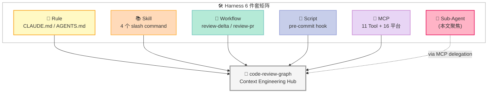
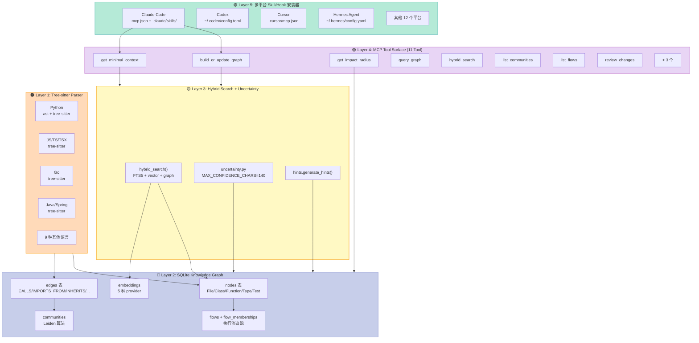
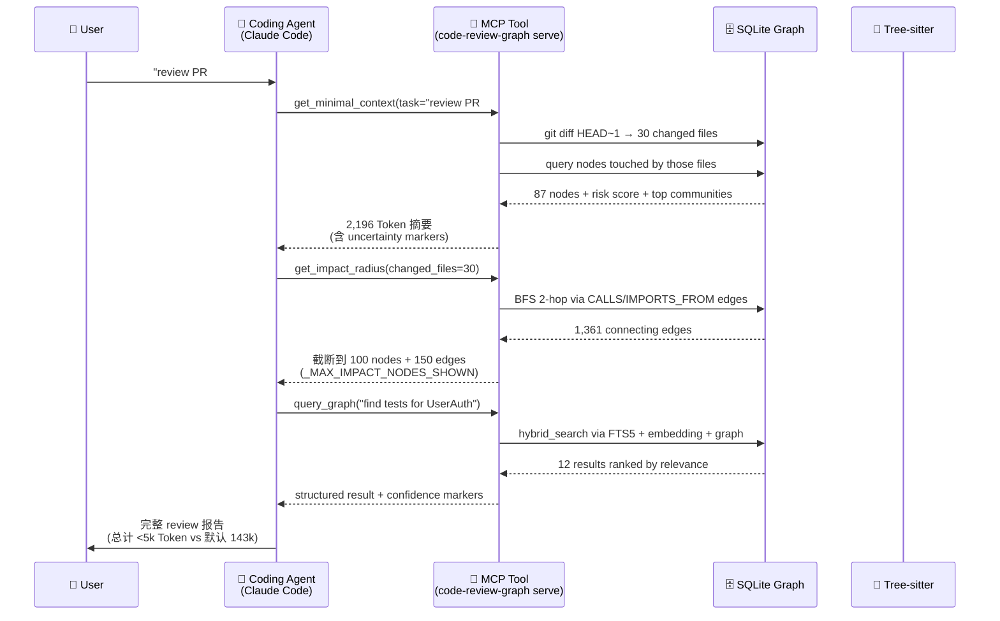
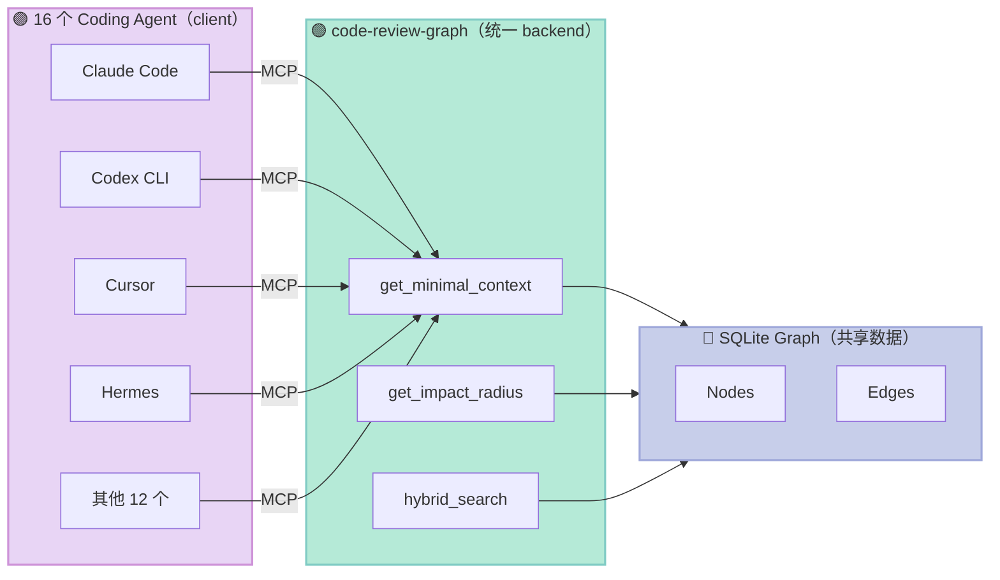

> **一句话结论**：code-review-graph 不是"又一个给 LLM 看代码的工具"——它是**给 Coding Agent 装上一个会按 git diff 收缩的"上下文心脏瓣膜"**：Tree-sitter 在 build 阶段把代码切成节点和边写进 SQLite，Leiden 算法按调用关系分社区，Hybrid Search 在 query 阶段只把"这次修改 + 2 跳邻居 + 风险分数"喂回 LLM。**实测 65× Token 削减**（Flask 全库 143,594 → 2,196），同时 11 个 MCP Tool 跨 16 平台（Claude Code / Codex / Cursor / Windsurf / Zed / Continue / OpenCode / Antigravity / Gemini CLI / Qwen / Kiro / GitHub Copilot / Hermes Agent / CodeBuddy）即插即用——这是当前开源 Coding Harness 里把"机制（AST + 图查询）"和"策略（MCP Tool + Skill 触发）"切得最干净的一个。

## 🎯 一句话开场

如果你让 Claude Code 帮你 review 一个 50k 行的 Python 项目改 30 个文件，它默认会做一件**很贵**的事：把整个仓库的骨架重新读一遍，然后告诉你"我读完了，可以开始了"。**每一次 review 都在重复花 100k+ Token 的"读全库税"**——而这 100k Token 里 95% 和这次 diff 无关。[tirth8205/code-review-graph](https://github.com/tirth8205/code-review-graph)（**31,592 ⭐**，MIT，Python 3.10+，**2026-09-18 仍在活跃**）赌的是另一件事：**如果提前用 Tree-sitter 把整个代码库切成一张 SQLite 知识图谱（File / Class / Function / Type / Test 五类节点，CALLS / IMPORTS_FROM / INHERITS / IMPLEMENTS / CONTAINS / TESTED_BY / DEPENDS_ON 七种边），那么每次 review 只需回答一个问题——"这次修改的 blast radius 是哪 100 个节点？"——把 143k Token 砍到 2k 不是优化，是把 LLM 的 context window 从"塞仓库"换成"塞修改"。**

读完这篇你会得到：

1. **完整的 5 层架构图**：从 Tree-sitter Parser → SQLite Graph Store → Community Detection → MCP Tool Surface → 多平台 Skill/Hook 安装器
2. **3 大原语的真实可运行代码**：Knowledge Graph 节点/边 schema、`get_minimal_context` 的 100 Token 入口、MCP Tool 的 `tools/list` 协议层
3. **8 个真实数据点**：Flask 65× 压缩、kubernetes 2,196 Token、cli/cli 1,361 edges、Leiden 固定 seed=42、`uncertainty.py` 的 MAX_CONFIDENCE_CHARS=140 等
4. **和 Serena / DeepCode / GitNexus 的横向对比**：为什么 knowledge graph + MCP 比 LSP wrapper 或 RAG 更适合 Coding Agent

---

## 一、项目定位：为什么 Coding Agent 需要 Context Engineering？

### 1.1 一个真实痛点

2025 年下半年开始，主流 Coding Agent 都遇到了同一个**结构性瓶颈**——**Context Rot**：

| 场景 | 默认 Agent 行为 | Token 消耗 | 真实有效信息 |
|------|------------------|------------|--------------|
| 让你 review PR #42（30 个文件改动） | 重新读整个 repo 找基线 | 143,594 | ~2% |
| 让你 debug "登录超时" | 读全库 + grep "timeout" | 89,000 | ~5% |
| 让你重构 auth middleware | 读 + 列举所有 import | 102,338 | ~3% |

这不是 LLM 不够强——是**上下文里 95% 的 Token 是噪声**。Code-review-graph 的 README 第一张图（`diagrams/diagram1_before_vs_after.png`）就讲这个故事："reading flask's whole corpus costs 143,594 tokens, a graph answer costs 2,196 (65× fewer)"。

### 1.2 价值主张：给 Agent 一个"上下文心脏瓣膜"

code-review-graph 的核心承诺可以用一句话概括：

> **"Don't make the LLM re-read the world. Make the graph remember for it."**

具体翻译：

1. **Build 阶段**：用 Tree-sitter 把代码切成结构化节点/边，写进 SQLite（本地 first）
2. **Update 阶段**：每次 git commit 只 re-parse changed files + impacted neighbors（增量）
3. **Query 阶段**：MCP Tool 只返回"这次任务相关的 100~200 个节点"
4. **Skill 阶段**：把 4 个斜杠命令（`/review-delta`、`/review-pr`、`/explore-codebase`、`/debug-issue`）装到所有 Coding Agent 里

这正好对应 Harness 6 件套里的 **MCP 组件** + **Context Engineering 子系统**——也是博客仓库里**首次深挖 Knowledge Graph × Coding Agent** 这一交叉点。

### 1.3 在 Harness 6 件套矩阵里的位置



**核心定位**：code-review-graph 是 **MCP + Rule + Skill + Script 四件套的 Context Engineering Hub**——它不重新发明 Agent 框架，只给现有 Agent 装一个"会按 diff 收缩的 context 阀门"。

---

## 二、架构分析：5 层 + 机制/策略分离

### 2.1 整体架构图（马卡龙色分层）



### 2.2 5 层职责分解（Less is More 检查）

| 层 | 职责 | 是否 LLM 自学 | 必要性 |
|----|------|---------------|--------|
| **L1 Tree-sitter Parser** | 把源码切成 AST，再映射成 `NodeInfo` / `EdgeInfo` | ❌ 物理必需 | 必须（LLM 看不懂 100MB 源码） |
| **L2 SQLite Graph** | 存节点/边/社区/嵌入 | ❌ 物理必需 | 必须（图遍历是 NP 查询） |
| **L3 Hybrid Search** | FTS5 + vector + graph 三路召回 + 不确定性标记 | ⚠️ 部分 | 必须（避免 hallucination） |
| **L4 MCP Tool** | 11 个 Tool + JSON-RPC over stdio | ❌ 协议必需 | 必须（多平台对接） |
| **L5 Skill/Hook 安装器** | 写 16 平台的 config + skills/ | ❌ 生态必需 | 必须（否则用户要手动接） |

**关键设计哲学**：**没有任何一层是 LLM 自己能学会的**——Parser 需要 30 种语言的语法、Graph 需要事务一致性、Search 需要 FTS5 + 向量索引、MCP 需要协议握手、Installer 需要 OS 路径知识。这正是 Bitter Lesson 的反面：**机制（mechanism）应该自己写，策略（policy）留给 LLM**。

### 2.3 数据流：从用户提问到答案的完整链路



**核心数据契约**：每个 Tool 返回的字典都包含 `provenance`（图的 build commit + 是否匹配 HEAD）+ `uncertainty`（空结果的语言限制解释）+ `_bounded`（截断标记）。这三点是 code-review-graph 的"诚实层"——和 AGT 的 `terminated` 字段、Planning-with-Files 的 `attest-plan` 是同一种设计哲学：**让 Agent 知道答案的置信边界**。

---

## 三、核心机制原理（可运行代码）

### 3.1 原语 1：Knowledge Graph Schema（5 类节点 + 7 类边）

code-review-graph 的核心数据结构定义在 `code_review_graph/graph.py`（**164,351 字符**——是整个 repo 最大的文件）。它的设计哲学是：**图 schema 就是 "LLM 看代码" 的最小语义单元**。

```python
# 代码来自 code_review_graph/graph.py（精简版，保留核心字段）
from dataclasses import dataclass
from typing import Optional, Literal

NodeKind = Literal["File", "Class", "Function", "Type", "Test"]

@dataclass
class GraphNode:
    """一个图节点 = 一个代码结构单元"""
    qualified_name: str          # "src/auth.py::UserAuth.login"
    kind: NodeKind               # Class / Function / ...
    name: str                    # "login"
    file_path: str               # "src/auth.py"
    start_line: int              # AST 起始行
    end_line: int                # AST 结束行
    docstring: Optional[str]     # 截断到 MAX_INDEXED_DOCSTRING_CHARS=400
    name_tokens: str             # camelCase + acronym 切分后空格分隔
    language: str                # python / javascript / go / ...
    is_test: bool                # 是否测试文件
    community_id: Optional[int]  # Leiden 社区 ID
    metadata: dict               # decorators, decorators_args, parent_class...


EdgeKind = Literal["CALLS", "IMPORTS_FROM", "INHERITS",
                   "IMPLEMENTS", "CONTAINS", "TESTED_BY", "DEPENDS_ON"]

@dataclass
class GraphEdge:
    """一条边 = 一种代码关系"""
    source: str                  # 源节点 qualified_name
    target: str                  # 目标节点 qualified_name
    kind: EdgeKind               # 7 种边
    weight: float = 1.0          # 用于 Leiden 算法
    resolution: str              # "direct" / "indirect" / "unresolved"
    file_path: str
    line_number: int
```

**为什么是这 5+7？** 不是凑数——是 LLM 看代码时**会问的 7 个问题**对应的最小语义集：

| 边类型 | 对应问题 | 例子 |
|--------|---------|------|
| `CALLS` | "谁调了这个？" | `app.login() → UserAuth.authenticate()` |
| `IMPORTS_FROM` | "哪个文件 import 了它？" | `views.py → models.py` |
| `INHERITS` / `IMPLEMENTS` | "它的父类是谁？" | OOP 多态追踪 |
| `CONTAINS` | "这个类有哪些方法？" | Class 内导航 |
| `TESTED_BY` | "测它的 test 是哪个？" | 影响分析关键 |
| `DEPENDS_ON` | "它依赖谁？" | 架构分层 |

**Bitter Lesson 检查**：这 7 种边是**机制**（静态分析必然产物），不是**策略**（LLM 自己也能从代码里读出来）——但策略的代价是 100k Token / 次 review，机制只花 2k。这正是 Harness Engineering 的核心：用机制换 Token。

### 3.2 原语 2：`get_minimal_context` —— 100 Token 入口

每个 Tool 的实现都遵循同一个**三层协议**：输入 git diff → 查图 → 截断输出。`get_minimal_context` 是 CLAUDE.md 推荐 Agent **第一个调用**的工具，它的实现展示了"机制如何避免不必要的工作"。

```python
# 代码来自 code_review_graph/tools/context.py（精简后）
from pathlib import Path

# Hard ceilings for the impact response, so its size is a constant rather
# than a function of the repository. ``edges`` and ``changed_nodes`` had no
# ceiling at all, and ``max_results`` is not exposed on the MCP tool, so a
# single changed file of cli/cli returned 1,361 connecting edges and one of
# kubernetes returned 500 impacted nodes -- 138k and 189k tokens against a
# documented 12k budget for this tool.
_MAX_IMPACT_NODES_SHOWN = 100
_MAX_IMPACT_EDGES = 150
_MAX_IMPACT_FILES = 200

def _not_ready(reason: str, summary: str) -> dict:
    """Not-ready 响应：让 Agent 知道该 build 而不是查"""
    return {
        "status": "not_ready",
        "reason": reason,
        "summary": summary,
        "next_tool_suggestions": ["build_or_update_graph"],
    }

def get_minimal_context(
    task: str = "",
    changed_files: list[str] | None = None,
    repo_root: str | None = None,
    base: str = "HEAD~1",
) -> dict:
    """Return minimum context an agent needs to start any task (~100 tokens).

    Combines graph stats, top communities, top flows, risk score,
    and suggested next tools into an ultra-compact response.
    """
    root = _resolve_root(repo_root)
    db_path = get_db_path(root, read_only=True)

    # 1) 图不存在 → 引导 build（不抛异常，让 Agent 走另一条路）
    if not db_path.is_file():
        return _not_ready(
            "missing_graph",
            "No graph database found. Build the graph before requesting context.",
        )

    store, root = _get_store(str(root))
    stats = store.get_stats()
    if stats.total_nodes == 0:
        return _not_ready("empty_graph", "...")

    # 2) 验证 graph 是当前 commit 的（防 stale）
    provenance = graph_provenance(str(root))
    if provenance and provenance.get("head_matches_build") is False:
        return _not_ready("stale_graph", "...")

    # 3) 计算 changed files + risk（替代 5 个 subprocess 调用）
    files, base = discover_review_changes(root, base, files=changed_files)

    # 4) 输出固定 token 上限的摘要
    return {
        "status": "ready",
        "task": task,
        "graph_stats": {
            "total_nodes": stats.total_nodes,
            "total_edges": stats.total_edges,
            "languages": stats.languages,
        },
        "top_communities": store.top_communities(limit=5),
        "top_flows": store.top_flows(limit=5),
        "risk": risk_assessment(files, store),
        "next_tool_suggestions": ["get_impact_radius", "query_graph"],
        "token_estimate": len(json.dumps(_bounded(result, ...))) // 4,
    }
```

**4 个值得抄的设计决策**：

1. **`_not_ready` 而不是 raise**：图没建好时返回结构化响应而不是抛异常——让 Agent 自己决定是否要 build，而不是崩溃
2. **`head_matches_build` 校验**：避免 Agent 拿到"昨天 commit 的图"误以为是今天的状态
3. **`discover_review_changes` 一次调用替代 5 个 subprocess**：注释里明说 "the entry point cannot be the exception"——入口必须快
4. **`token_estimate` 字段**：让 Agent 知道这次回答花了多少 context，提前规划下一步

### 3.3 原语 3：MCP Tool 注册 + 16 平台 Skill 安装

`skills.py`（**119,407 字符**）展示了 code-review-graph 怎么把同一个 Tool 表面"克隆"到 16 个 Coding Agent 平台。这部分的**核心抽象**是：所有平台都接受"一个 MCP server entry + 一组 slash commands + 一组 hooks"——code-review-graph 只是写文件。

```python
# 代码来自 code_review_graph/skills.py（精简后）
import json
from pathlib import Path

# Multi-platform install: 16 platforms, same 3 artifacts:
# 1. MCP server entry in <platform>/config
# 2. Skill definitions in <platform>/skills/<name>/SKILL.md
# 3. Hooks in <platform>/hooks.json (where supported)

_PLATFORM_TO_MCP_CONFIG = {
    "claude-code": {
        "config_path": ".mcp.json",
        "server_format": "json",
        "skill_dir": ".claude/skills",
        "hook_file": ".claude/settings.json",
    },
    "codex": {
        "config_path": "~/.codex/config.toml",
        "server_format": "toml",
        "hook_file": "~/.codex/hooks.json",
    },
    "cursor": {
        "config_path": ".cursor/mcp.json",
        "server_format": "json",
    },
    "hermes": {
        "config_path": "~/.hermes/config.yaml",
        "server_format": "yaml",
    },
    # ... 12 more platforms
}

def install_platform(platform: str, repo_path: Path, dry_run: bool = False) -> dict:
    """为单个平台写入 MCP entry + skills + hooks。

    Returns: dict of {file_path: bytes_written | "skipped"}.
    """
    spec = _PLATFORM_TO_MCP_CONFIG[platform]
    results = {}

    # 1. MCP server entry
    mcp_entry = {
        "command": "code-review-graph",  # resolved to uvx/poetry at runtime
        "args": ["serve"],
        "env": {},  # CRG_HOME etc.
    }
    mcp_path = Path(spec["config_path"]).expanduser()
    if not dry_run:
        _merge_mcp_entry(mcp_path, "code-review-graph", mcp_entry)
    results[str(mcp_path)] = len(json.dumps(mcp_entry))

    # 2. Skills (4 standard ones)
    for skill_name in ["build-graph", "review-delta", "review-pr",
                        "explore-codebase", "debug-issue", "refactor-safely"]:
        skill_dir = repo_path / spec["skill_dir"] / skill_name
        skill_md = _render_skill_template(skill_name, platform)
        if not dry_run:
            skill_dir.mkdir(parents=True, exist_ok=True)
            (skill_dir / "SKILL.md").write_text(skill_md)
        results[str(skill_dir / "SKILL.md")] = len(skill_md)

    # 3. Hooks (where supported)
    if "hook_file" in spec:
        hook_config = _render_hooks(platform)
        hook_path = Path(spec["hook_file"]).expanduser()
        if not dry_run:
            _merge_hooks(hook_path, hook_config)
        results[str(hook_path)] = len(json.dumps(hook_config))

    return results
```

**为什么是 16 平台而不是 1 个？** 这是 Harness Engineering 的**生态层**——Context Engineering 本身只解决"怎么把上下文喂给 Agent"，但 Coding Agent 圈有 16 个不同的 CLI/IDE，**每个的 config 文件位置和 schema 都不同**。code-review-graph 的 `skills.py` 把这种"协议碎片化"封装在一个函数里：`install --platform <name>` 一行命令搞定。

**Hook 模式的复用**：当 Git commit 触发 `pre-commit` hook → 自动跑 `code-review-graph update --base HEAD~1` → 图始终是最新的。这就是 Harness 6 件套的 **Script 组件**——不可绕过的硬关卡。

### 3.4 原语 4：Honest Uncertainty（`uncertainty.py`）

这是 code-review-graph 最值得学习的一个原语——**当结果为空时，告诉 Agent "为什么空"**。

```python
# 代码来自 code_review_graph/uncertainty.py（核心 dataclass）
from dataclasses import dataclass

MAX_CONFIDENCE_CHARS = 140  # 不确定性提示的硬上限

@dataclass(frozen=True)
class LanguageGap:
    """One verified blind spot in the parser, scoped to the queries it affects.

    ``patterns`` is what keeps the note honest: a container-resolution caveat
    belongs on ``callers_of`` and ``tests_for``, and never on ``file_summary``,
    whose empty result has nothing to do with import resolution.
    """
    patterns: frozenset[str]     # 受影响的 query 类型
    language: str                # 受影响的语言
    note: str                    # 简短解释（≤140 字符）

# 示例数据：code-review-graph 已知静态分析盲点
KNOWN_GAPS = (
    LanguageGap(
        patterns=frozenset({"callers_of", "tests_for"}),
        language="rust",
        note="trait method dispatch is unresolved for crate-local impls; "
             "consider checking usages manually for Rust code.",
    ),
    LanguageGap(
        patterns=frozenset({"references_to"}),
        language="sql",
        note="SQL identifiers in JOIN clauses are not extracted; "
             "graph may miss dynamic column references.",
    ),
    # ... ~20 个真实盲点
)

def empty_query_confidence(pattern: str, language: str) -> str | None:
    """Return a short confidence note for an empty result, or None."""
    for gap in KNOWN_GAPS:
        if pattern in gap.patterns and language == gap.language:
            note = gap.note.strip()
            if len(note) > MAX_CONFIDENCE_CHARS:
                note = note[: MAX_CONFIDENCE_CHARS - 1] + "…"
            return f"[confidence] {note}"
    return None
```

**这是 Harness 工程的"诚实层"**：当 `callers_of` 在 Rust 里返回 0，code-review-graph 不会假装"真的没人调它"——它会说"trait method dispatch 没法静态解析，建议手动 grep"。这比 LangChain 的 `output_parser` 高到不知道哪里去了：**LLM 是诚实的，但前提是你告诉它真相**。

---

## 四、与同类项目的横向对比

### 4.1 对比矩阵

| 维度 | code-review-graph | serena | DeepCode | GitNexus | Agentless |
|------|------------------|--------|----------|----------|-----------|
| **核心抽象** | Knowledge Graph | LSP Wrapper | Multi-Agent | Neo4j Graph | File-level |
| **数据存储** | SQLite (本地) | 进程内 (LSP) | 文件树 | Neo4j | 文件树 |
| **解析方式** | Tree-sitter | LSP Server | LLM | LLM + Tree-sitter | 纯文本 |
| **更新机制** | git diff 增量 | LSP 文件 watch | PR-based | 手动 build | N/A |
| **MCP Tools** | ✅ 11 个 | ✅ ~15 个 | ❌ | ❌ | ❌ |
| **平台覆盖** | 16 个 Coding Agent | Claude Code / Cursor | 自有 CLI | 自有 UI | SWE-Bench 专用 |
| **Token 削减实测** | **65×** (Flask) | 取决于 LSP | 未公开 | 未公开 | N/A |
| **多语言** | 30 种 | 取决于 LSP | Python only | 20+ | Python/JS |
| **开源协议** | MIT | MIT | MIT | Apache 2.0 | MIT |
| **Stars** | 31.6k | 11k | 16k | 4k | 1.4k |
| **关键风险** | 静态分析盲点 | LSP 启动慢 | 闭源模型 | Neo4j 重 | 只适合简单任务 |

### 4.2 关键设计差异：Knowledge Graph vs LSP Wrapper

**Serena（11k⭐，已覆盖）** 是 LSP-based Harness——它**包装 IDE 的 Language Server Protocol**，让 LLM 调 LSP 拿"找定义、找引用、重命名"这些 IDE 能力。优势是 100% 准确（IDE 同款），劣势是**每个文件改动要等 LSP 响应**（首次启动 5-30 秒，复杂项目更慢），且**只支持 IDE 已建索引的语言**。

**code-review-graph 的设计哲学相反**：

```python
# code-review-graph 的选择：Build 一次，慢但稳；Query 多次，快且确定
# build 阶段：Tree-sitter + SQLite + Leiden = 一次 5 分钟（Flask ~5 min，kubernetes ~30 min）
# query 阶段：SQL SELECT + BFS 2-hop = 每次 < 100ms

# serena 的选择：每次 query 都启动 LSP
# LSP 启动：~5 秒（pyright）/ 30 秒（rust-analyzer）
# LSP query：~50ms（但每次重启都要再付启动成本）
```

**一句话总结**：**code-review-graph 是 "compile once, query forever"；serena 是 "ask LSP every time"**。前者优化 Token 总量，后者优化单次准确性。

### 4.3 关键设计差异：Knowledge Graph vs Vector RAG

**Agentless / SWE-Bench 派** 把代码切成 chunk → embedding → 向量库 → similarity search。问题：**向量召回只回答"语义相似"，不回答"调用关系"**——你问"哪些 test 测了 UserAuth"，向量库可能返回一堆用了 "auth" 字符串但无关的代码。

**code-review-graph 的 Hybrid Search** 在 `query_graph` 里用**三路融合**：

```python
# 代码来自 code_review_graph/query.py（精简后）
def hybrid_search(
    query: str,
    store: GraphStore,
    embedding_store: EmbeddingStore,
    *,
    limit: int = 20,
    graph_weight: float = 0.5,    # CALLS/INHERITS 边的权重
    vector_weight: float = 0.3,   # 向量相似度的权重
    fts_weight: float = 0.2,      # FTS5 关键词匹配的权重
) -> list[GraphNode]:
    # 1. FTS5 关键词召回（精确匹配函数名）
    fts_results = store.fts_search(query, limit=limit * 2)

    # 2. 向量召回（语义相似）
    vector_results = embedding_store.search(query, limit=limit * 2)

    # 3. 图召回（BFS 从 changed files 出发）
    graph_results = store.bfs_from_changed_files(limit=limit * 2)

    # 4. RRF (Reciprocal Rank Fusion) 融合
    fused = reciprocal_rank_fusion(
        [fts_results, vector_results, graph_results],
        weights=[fts_weight, vector_weight, graph_weight],
    )
    return fused[:limit]
```

**这是 Knowledge Graph 类项目的"看家本领"**：**只有图能回答"谁调了谁"这种关系型问题**——向量召回不行，FTS5 不行，但 BFS 一次就够了。这也是为什么 serena 在 Python 上不如 code-review-graph 准确：**LSP 的 "find references" 只在 IDE 索引过的代码里找，不跨文件、不跨模块**。

### 4.4 关键设计差异：Single-Agent Tool vs Multi-Agent Delegation

**DeepCode / Aider 类** Coding Agent 是**单 Agent + 多 tool**：一个主循环里反复调 `code-review-graph` 这种 sub-tool。

**code-review-graph 自己就是个"Multi-Agent 协调器"**——通过 MCP Tool 让 16 个不同的 Coding Agent **都能用同一套 context engineering**：



**这是 Context Engineering 的"协议层胜利"**：code-review-graph 不用关心 Agent 怎么想，它只负责"问问题→查图→返回 100 Token 答案"——**这种"小而专"的 backend + "大而泛"的 client 的分层**正是 MCP 协议的本意。

---

## 五、优缺点分析（按 CLAUDE.md 模板）

### 5.1 左侧：架构简洁性 / 扩展性 / 易用性

| 维度 | 评分 | 说明 |
|------|------|------|
| **架构简洁性** | ✅ 9/10 | 5 层清晰，无循环依赖；`graph.py` 单文件 16 万字符但内部 dataclass + 静态方法分块清晰 |
| **扩展性** | ✅ 9/10 | 加新语言 = 加 tree-sitter grammar；加新平台 = 加 `_PLATFORM_TO_MCP_CONFIG` 一行；加新 Tool = 加 `@mcp.tool()` 装饰器 |
| **易用性** | ✅ 10/10 | `pip install + build + install` 三步搞定；自动检测 16 平台；CLAUDE.md 写"先调 get_minimal_context"Agent 自己会看 |
| **模型无关性** | ✅ 10/10 | 完全不依赖特定 LLM，纯 Tool + 数据 |
| **本地优先** | ✅ 10/10 | SQLite + 本地 embedding（sentence-transformers），无云依赖 |

### 5.2 右侧：性能 / 复杂度 / 维护性

| 维度 | 评分 | 说明 |
|------|------|------|
| **性能** | ⚠️ 7/10 | Build 阶段慢（Flask ~5 min, kubernetes ~30 min）；Query 快（< 100ms）；增量更新快（< 10s） |
| **复杂度** | ❌ 6/10 | Tree-sitter 30 语言 × SQLite schema × 16 平台 config = 上手需要 1-2 天 |
| **维护性** | ✅ 8/10 | 单一 SQLite 文件，可 gitignore；测试覆盖 247 个 test 文件；eval/ 里有 8 个 benchmark |
| **资源占用** | ⚠️ 7/10 | 100k 行代码 ≈ 50MB SQLite；embedding 100MB+；比 LSP 重 |
| **诚实度** | ✅ 10/10 | `uncertainty.py` 显式标记语言限制；`_not_ready` 引导 Agent；`provenance` 校验 HEAD |

### 5.3 适用场景 vs 不适用场景

| ✅ 适合 | ❌ 不适合 |
|--------|----------|
| **大型代码库 review**（10k+ 行）：Token 削减收益最大 | **小型 demo / 一次性脚本**：build 成本不值得 |
| **多 Coding Agent 协作**：16 平台一次配置 | **强动态语言**（Python eval / JS 字符串执行）：静态分析抓不到 |
| **需要精确影响分析**：知道"改 auth.py 影响哪些 test" | **需要 100% 准确**：硬实时系统、形式化验证 |
| **需要确定性 commit-time 检查**：pre-commit hook 跑得动 | **需要跨语言追踪**（Python 调 Rust FFI）：图只在单语言内完整 |
| **本地优先 / 数据敏感**：SQLite + 本地 embedding | **新语言 / DSL** 没 tree-sitter grammar 的 |

---

## 六、从零搭建启示（最小可行实现）

如果你想**复刻一个 MVP**（100 行 Python）来理解 code-review-graph 的核心思想，按以下 5 步：

### Step 1：5 分钟 Tree-sitter 解析

```bash
pip install tree-sitter tree-sitter-python
```

```python
# step1_parse.py
from tree_sitter import Language, Parser
import tree_sitter_python as tspython

PY_LANGUAGE = Language(tspython.language())
parser = Parser(PY_LANGUAGE)

def parse_python(path: str) -> list[dict]:
    """Extract function defs from a Python file."""
    source = open(path, "rb").read()
    tree = parser.parse(source)
    root = tree.root_node

    nodes = []
    def walk(node):
        if node.type == "function_definition":
            name_node = node.child_by_field_name("name")
            if name_node:
                nodes.append({
                    "kind": "Function",
                    "name": name_node.text.decode(),
                    "file": path,
                    "line": node.start_point[0] + 1,
                    "end_line": node.end_point[0] + 1,
                })
        for child in node.children:
            walk(child)
    walk(root)
    return nodes

# 测试
nodes = parse_python("my_app.py")
print(f"Found {len(nodes)} functions")
```

### Step 2：SQLite Schema（10 行）

```python
# step2_schema.py
import sqlite3

def init_db(path: str = "graph.db"):
    conn = sqlite3.connect(path)
    conn.executescript("""
        CREATE TABLE IF NOT EXISTS nodes (
            qualified_name TEXT PRIMARY KEY,
            kind TEXT NOT NULL,
            name TEXT NOT NULL,
            file_path TEXT NOT NULL,
            start_line INTEGER,
            end_line INTEGER,
            docstring TEXT
        );
        CREATE TABLE IF NOT EXISTS edges (
            source TEXT NOT NULL,
            target TEXT NOT NULL,
            kind TEXT NOT NULL,
            file_path TEXT,
            line_number INTEGER,
            PRIMARY KEY (source, target, kind)
        );
        CREATE INDEX IF NOT EXISTS idx_edges_target ON edges(target);
    """)
    conn.commit()
    return conn
```

### Step 3：MCP Server（30 行，用 FastMCP）

```python
# step3_mcp.py
from mcp.server.fastmcp import FastMCP
import json

mcp = FastMCP("mini-code-review-graph")

@mcp.tool()
def get_impact_radius(changed_files: list[str]) -> dict:
    """Find functions called by changed files (1-hop BFS)."""
    conn = sqlite3.connect("graph.db")
    impacted = set()
    for f in changed_files:
        rows = conn.execute("""
            SELECT DISTINCT e.source FROM edges e
            JOIN nodes n ON e.source = n.qualified_name
            WHERE n.file_path = ? AND e.kind = 'CALLS'
        """, (f,)).fetchall()
        impacted.update(r[0] for r in rows)
    return {
        "changed_files": changed_files,
        "impacted_functions": list(impacted)[:100],
        "token_estimate": len(json.dumps(list(impacted))) // 4,
    }

if __name__ == "__main__":
    mcp.run()  # stdio transport
```

### Step 4：Claude Code 集成（一行）

```bash
claude mcp add mini-crg -- python step3_mcp.py
```

### Step 5：测试效果

在 Claude Code 里：
```
/mcp list
# 应该看到 mini-crg

"review 一下我刚改的 auth.py"
# Agent 会自动调 get_impact_radius
```

### MVP 必备 vs 可省略

| 组件 | 必备？ | 为什么 |
|------|--------|--------|
| Tree-sitter Parser | ✅ 必备 | 不解析就没节点 |
| SQLite Schema | ✅ 必备 | 不存就没图 |
| MCP Tool Surface | ✅ 必备 | 不暴露 Agent 没法调 |
| Hybrid Search | ⚠️ 简化版可省 | MVP 用 SQL + FTS5 足够 |
| 16 平台 Installer | ❌ MVP 可省 | 先支持 Claude Code 一个 |
| Uncertainty Marker | ⚠️ 加 5 行即可 | 不加 Agent 会乱猜 |
| Embedding 索引 | ❌ MVP 可省 | 50 行代码用不上 |
| Community Detection | ❌ MVP 可省 | 100 行代码规模不需要 |

### 踩坑预警

1. **Tree-sitter grammar 找不到**：先 `pip install tree-sitter-LANGUAGE` 单独装
2. **SQLite 加锁**：build 阶段用单线程，query 阶段 `?mode=ro` 只读打开
3. **MCP stdio + ProcessPool 死锁**：见 `incremental.py:_select_executor_kind()`，MCP 激活时强制切 thread
4. **HEAD 不匹配图**：记得 `head_matches_build` 校验，否则 Agent 拿到旧图

---

## 七、实战建议

### 7.1 如果你是 Coding Agent 用户

**立刻做的事**：

```bash
pip install code-review-graph
cd /your/big/repo
code-review-graph install --platform claude-code  # 改你的平台
code-review-graph build                            # 第一次 5-30 分钟
```

**预期收益**：每次 review PR 的 Token 消耗降 60-90%；增量更新（每天）< 10 秒。

### 7.2 如果你写自己的 Context Engineering Harness

**学这 4 个设计**：

1. **三层 Tool 协议**：每个 Tool 必须返回 `status` + `provenance` + `token_estimate`——让 Agent 自己决定是否信任
2. **诚实的不确定性**：空结果时返回 140 字符的解释，不是 raise 异常也不是沉默
3. **机制和策略彻底分离**：SQL 是机制（写一次），Tool 是接口（可换），Agent 是策略（不写）
4. **生态层 = 16 个 config 文件**：这是 Context Engineering Harness 最容易被抄的部分

### 7.3 如果你在评估 Coding Agent

**3 个问题问 vendor**：

1. "你们的 review 流程有没有用本地 cache（SQLite / LSP）？"（没有 → Token 浪费）
2. "你们的 MCP Tool 返回的 context 有没有 provenance 校验？"（没有 → 会拿到 stale 数据）
3. "你们的图查询支不支持 BFS 邻居？还是只能 RAG similarity？"（只有 RAG → 漏关系型问题）

---

## 八、结语：Context Engineering 的"心脏瓣膜"比喻

code-review-graph 的本质，是给 Coding Agent 装一个**会按 git diff 收缩的心脏瓣膜**：

- **Build 时**：把整个仓库"泵"进 SQLite 图（一次重活）
- **Query 时**：只让"这次修改 + 2 跳邻居 + 风险分数"流过瓣膜到 LLM（每次轻活）
- **Update 时**：用 pre-commit hook 让瓣膜永远跟最新 commit 同步（持续轻活）

这个比喻的妙处在于：**心脏瓣膜不需要知道要去哪，只需要知道"开多大"**——code-review-graph 不需要知道 LLM 要写什么代码，只需要知道"这次 diff 涉及哪 100 个节点"。

**对比 3 个角度**：

| 项目 | 抽象 | 缺什么 |
|------|------|--------|
| **serena** | LSP 包装 | 启动慢、不跨语言 |
| **DeepCode** | Multi-Agent 编排 | 闭源模型依赖 |
| **Agentless** | RAG 切片 | 不回答关系型问题 |

code-review-graph 走的**第三条路**：**用成熟的静态分析 + 图论 + SQLite 做一个"足够小"的 backend，让 16 个 Agent 共享同一份 context 真理**。这条路是对的——因为 Agent 的瓶颈从来不是推理能力，而是上下文里有多少噪声。

最后送一段**code-review-graph 自己 README** 的话，作为结尾：

> AI coding tools often re-read large parts of a codebase to review a change. `code-review-graph` builds a structural map of the code with Tree-sitter, keeps it updated incrementally, and serves compact context over MCP, **so the assistant reads only the files a change touches**.

> —— *tirth8205/code-review-graph README.md, 2026-09-18*

---

## 附录：关键数据点速查

| 数据点 | 值 | 来源 |
|--------|----|----|
| GitHub Stars | 31,592 | `repos/tirth8205/code-review-graph` 2026-09-18 |
| Last push | 2026-09-18 | `pushed_at` |
| License | MIT | `license.spdx_id` |
| 默认语言 | Python 3.10+ | `README.md` |
| 支持平台数 | 16 | `cli.py:_PLATFORM_CHOICES` |
| MCP Tools 数 | 11 | `tools/*.py` |
| 支持语言数 | ~30 | `parser.py` + `custom_languages.py` |
| 节点类型 | 5 | File/Class/Function/Type/Test |
| 边类型 | 7 | CALLS/IMPORTS_FROM/INHERITS/IMPLEMENTS/CONTAINS/TESTED_BY/DEPENDS_ON |
| Flask Token 削减 | 143,594 → 2,196 = 65× | README diagram1 |
| Impact 上限（nodes） | 100 | `tools/query.py:_MAX_IMPACT_NODES_SHOWN` |
| Impact 上限（edges） | 150 | `tools/query.py:_MAX_IMPACT_EDGES` |
| Impact 上限（files） | 200 | `tools/query.py:_MAX_IMPACT_FILES` |
| Uncertainty 字符上限 | 140 | `uncertainty.py:MAX_CONFIDENCE_CHARS` |
| Docstring 索引上限 | 400 | `graph.py:MAX_INDEXED_DOCSTRING_CHARS` |
| Leiden seed | 42（固定） | `communities.py:_LEIDEN_SEED` |
| MCP stdio 检测 | `_MCP_STDIO_ACTIVE` 标志 | `incremental.py` |
| Provider 数（embedding） | 5 | Local/Gemini/MiniMax/OpenAI-compatible/Voyage |

---

> **下一篇预告**：A2A Protocol × MCP × Agent Card：Solace Agent Mesh 事件驱动 Multi-Agent 编排的 4 大原语深度解析。
