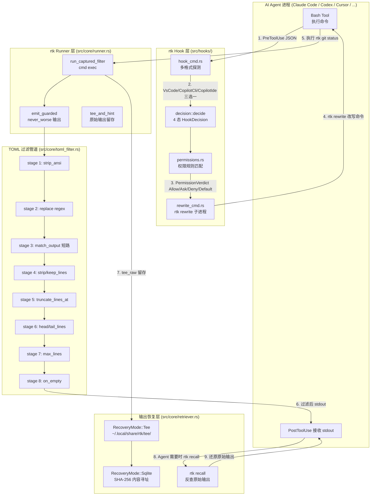
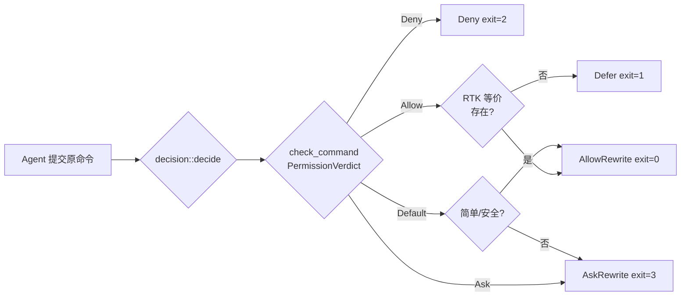
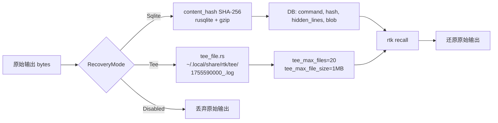
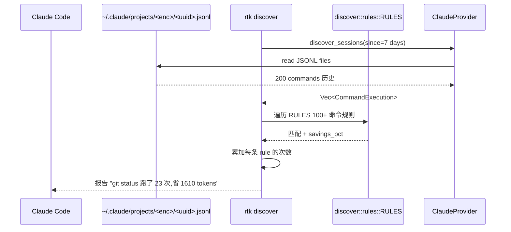
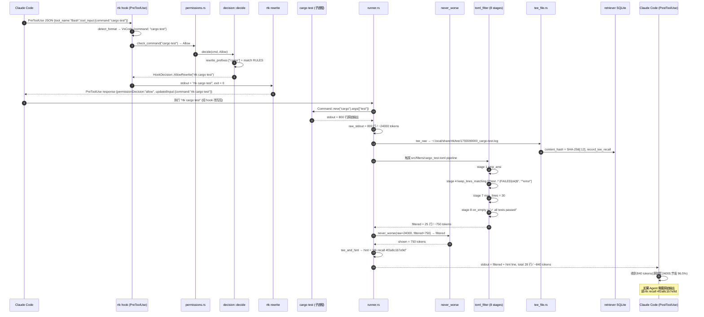

## 一、引子：Coding Agent 的"bash 输出通胀"

2026 年,Anthropic、OpenAI、Google 的 Coding Agent 已经把"我会自己跑命令"做成了标配。Claude Code、Codex CLI、Cursor Agent、Copilot、Cline、Windsurf、Kimi AI、Hermes、Pi、Droid、Antigravity、Vibe、OMP……**十几个 AI Agent 共享一套 Bash 命令约定**,而这套约定的输出格式是**给人看的**——大量冗余、噪音、ANSI 颜色、进度条、emoji banner。

举个真实例子:Claude Code 跑一次 `cargo test` 会拿回 **800+ 行输出**,里面可能有 5 个测试 fail、剩下 795 行都是 `test result: ok. 795 passed; 0 failed; 0 ignored; 0 measured; 0 filtered out`。如果 Coding Agent 紧接着再跑 `cargo test --no-fail-fast` 又会拿 800+ 行,重复出现 795 个 ok。**输入 token 在这种循环里几何级数膨胀**。

更糟糕的是 `git log`、`npm install`、`docker ps`、`pytest --verbose`、`kubectl get pods -o wide` 这类命令,人类程序员看一秒钟能过滤掉的噪音,LLM 必须**一字不漏读完**才能回答问题。在 Claude Opus 4.5 上,一次 60k token 的 bash 输出平均消耗 ¥4-6 元,而这 60k token 里**至少 50k 是噪音**。

`rtk-ai/rtk`(Rust Token Killer)就是为这个问题而生的项目。它在 6 个月内从 0 涨到 ⭐80,949,把 100+ 命令的 bash 输出拦截下来,经过 TOML 声明式 8 阶段过滤管道压缩后再喂给 Agent,典型 token 节省 **60-90%**。

更关键的是 rtk 的**架构层次**:它工作在 **CLI 命令输出拦截层**,而不是 LLM API 请求层(headroom 的做法)或消息历史压缩层(litellm 的做法)。这是一个**全新的中间件维度**——本文将围绕 rtk 的 6 大抽象(多 Agent Hook 适配、TOML 声明式过滤、never_worse 防御、4 态决策协议、Tee/Recall 双轨恢复、learn 自学习)深入剖析。

---

## 二、项目定位与核心价值

**一句话定义**:rtk 是一个用 Rust 编写的高性能 CLI 代理,在 AI Agent 调用 shell 命令时**透明地拦截输出、按 TOML 规则压缩后再回传**,让 Agent 看到的是结构化紧凑版本,而不是人眼友好的冗长日志。

**仓库统计**(2026-09-19):
- ⭐ 80,949 stars / 5,135 forks / 220 subscribers
- 语言:Rust(100% Cargo workspace)
- License:Apache-2.0
- 默认分支:`develop`(注意不是 main)
- 仓库体积:9.8 MB
- 源码规模:128 个 .rs 文件 / 9,861 个 TOML filter 单元
- 最近推送:2026-09-19(今天)
- 主页:<https://www.rtk-ai.app>
- 安装方式:Homebrew / winget / curl | sh / cargo install --git

**能力矩阵**:

| 能力维度 | 具体指标 |
|---|---|
| 支持命令数 | 100+(Git/GitHub CLI/Cargo/PNPM/Pytest/Go/Docker/AWS/K8s/...) |
| 平均 token 节省 | 60-90%(取决于命令类型) |
| 启动开销 | <10ms(Rust 单二进制、零运行时依赖) |
| 集成 AI 工具 | Claude Code / Codex / Gemini CLI / Cursor / Windsurf / Cline / Kilo Code / Antigravity / Kimi / Pi / Hermes / Droid / Vibe / OMP / Trae |
| 多平台 | macOS / Linux / Windows(原生 + WSL) |
| 输出恢复机制 | SQLite 内容寻址 + Tee 文件 + gzip 压缩 + 30 天保留 |

**核心价值主张**:把"Agent 看人眼格式的 bash 输出"替换为"Agent 看 rtk 压缩后的结构化输出",**透明兼容**(Agent 不需要改任何代码)、**声明可扩展**(用户可写自己的 TOML filter)、**零部署摩擦**(单二进制文件 + 14 个 Agent 的 init 脚本)。

---

## 三、整体架构:从 bash 调用到 LLM context 的 5 层链路

rtk 的工作链路可以分成 5 层:**Shell 拦截层 → Agent 适配层 → 决策与改写层 → TOML 过滤管道 → 输出恢复层**。下面用 Mermaid flowchart 展示完整数据流。



**关键观察**:
1. **Hook 层是透明拦截的关键**——Agent 以为自己跑了 `git status`,其实跑的是 `rtk git status`,但 stdout 仍然吐回给 Agent 的 PostToolUse。
2. **TOML 过滤管道是声明式的**——加新命令不需要改 Rust 代码,只写一个 `.toml` 文件。
3. **never_worse 是防御性设计**——任何过滤后输出**永远不超** `echo raw`,即便过滤出错也不会让 Agent 看到更长的输出。
4. **Tee 是 fallback**——原始输出以 SHA-256 寻址存到 SQLite,Tee 模式额外写一份日志,Agent 需要时 `rtk recall <hash>` 还原。

---

## 四、多 Agent 适配层:14+ 种 Hook 协议自动探测

rtk 的 hook 层是工程上最棘手的部分——它要适配 14+ 种 AI Agent 的不同 PreToolUse 协议,且每种 Agent 又有 1-3 种 schema 变体。

**HookFormat 枚举**(`src/hooks/hook_cmd.rs`):

```rust
// 来自 src/hooks/hook_cmd.rs:25-50
enum HookFormat {
    /// VS Code Copilot Chat / Claude Code: `tool_name` + `tool_input.command`, supports `updatedInput`.
    VsCode { command: String },
    /// GitHub Copilot CLI's native schema: camelCase `toolName` + `toolArgs` (JSON string),
    /// supports `modifiedArgs` for transparent rewrite.
    CopilotCli { command: String, args: Value },
    /// JetBrains Copilot IDE: only top-level deny decisions are honored, so
    /// rewrites must be returned as deny-with-suggestion responses.
    CopilotIde { command: String },
    /// Non-bash tool, already uses rtk, or unknown format — pass through silently.
    PassThrough,
}
```

**为什么不直接支持所有 Agent?** 因为每个 Agent 厂商的 PreToolUse 协议都不一样:
- **Claude Code**:JSON 协议,stdin 接受 `{tool_name, tool_input.command}`,stdout 返回 `{hookSpecificOutput:{hookEventName:"PreToolUse",permissionDecision:"allow"|"ask"|"deny",updatedInput:{...}}}`
- **GitHub Copilot CLI**:camelCase schema `{toolName, toolArgs}`,回写字段叫 `modifiedArgs`
- **JetBrains IntelliJ Copilot**:完全不一样的协议,只能 deny,改写必须塞进 deny message
- **Cursor Agent**:VS Code schema 兼容
- **Codex CLI**:执行后改写,不参与 hook
- **Gemini CLI**:PreToolUse 协议略有不同

**rtk 的解决方式**是**自动探测**(snake_case `tool_name` 走 VsCode 路径、camelCase `toolName` 走 CopilotCli 路径、出现 `run_in_terminal` 这种 VS Code Copilot Chat 的特定 tool name 也走 VsCode):

```rust
// 来自 src/hooks/hook_cmd.rs:135-160
fn detect_format(v: &Value) -> HookFormat {
    // VS Code Copilot Chat / Claude Code: snake_case keys.
    if let Some(tool_name) = v.get("tool_name").and_then(|t| t.as_str()) {
        if matches!(tool_name,
            "runTerminalCommand" | "run_in_terminal" | "Bash" | "bash")
            && let Some(cmd) = v.pointer("/tool_input/command")
                .and_then(|c| c.as_str())
                .filter(|c| !c.is_empty())
        {
            return HookFormat::VsCode { command: cmd.to_string() };
        }
        return HookFormat::PassThrough;
    }
    // Copilot CLI camelCase schema: ...
}
```

这种**协议自适应**设计是 rtk 区别于 headroom 的工程深度——headroom 在 LLM API 请求层拦截,根本不需要适配这么多 Agent。

**AgentTarget 枚举**(`src/main.rs`):

```rust
// 来自 src/main.rs:42-72
pub enum AgentTarget {
    Claude,        // Claude Code (default)
    Cursor,        // Cursor Agent (editor and CLI)
    Trae,          // Trae IDE
    Windsurf,      // Windsurf IDE (Cascade)
    Cline,         // Cline / Roo Code (VS Code)
    Kilocode,      // Kilo Code
    Antigravity,   // Google Antigravity
    Kimi,          // Kimi AI
    Pi,            // Pi coding agent
    Hermes,        // Hermes CLI
    Droid,         // Factory Droid CLI
    Vibe,          // Mistral Vibe CLI
    Omp,           // Oh My Pi (OMP)
}
```

`rtk init --agent <AgentTarget>` 在用户的 `~/.claude/settings.json`、`~/.cursor/hooks.json`、`~/.copilot/config.json` 等 14+ 处注册 hook,这一步是 366 KB 的 `src/hooks/init.rs` 实现的(单文件),里面写了**每个 Agent 配置文件格式、字段路径、TomlFilter 冲突时的优先级**等细节。

---

## 五、TOML 声明式 8 阶段过滤管道

这是 rtk 的**核心抽象**——把"如何压缩命令输出"用一个 8 阶段 TOML 配置描述,**不需要写一行 Rust 代码**。

**8 阶段过滤管道**(`src/core/toml_filter.rs` 文档注释):

```rust
// 来自 src/core/toml_filter.rs:7-26
//! Pipeline stages (applied in order):
//!   1. strip_ansi           — remove ANSI escape codes
//!   2. replace              — regex substitutions, line-by-line, chainable
//!   3. match_output         — short-circuit: if blob matches a pattern, return message immediately
//!   4. strip/keep_lines     — filter lines by regex
//!   5. truncate_lines_at    — truncate each line to N chars
//!   6. head/tail_lines      — keep first/last N lines
//!   7. max_lines            — absolute line cap
//!   8. on_empty             — message if result is empty
```

**Lookup 优先级**(从具体到通用):

```rust
// 来自 src/core/toml_filter.rs:6-11
//!   1. `.rtk/filters.toml`              — project-local, committable with the repo
//!   2. `~/.config/rtk/filters.toml`     — user-global, applies to all projects
//!   3. Built-in TOML                     — `src/filters/*.toml`, concatenated by build.rs and embedded at compile time
//!   4. Passthrough                       — no match, handled by caller
```

**示例:`src/filters/jq.toml`**——给 `jq` 命令的 filter:

```toml
# 来自 src/filters/jq.toml
[filters.jq]
description = "Compact jq output — truncate large JSON results"
match_command = "^jq\\b"
strip_ansi = true
strip_lines_matching = [
  "^\\s*$",
]
max_lines = 40
truncate_lines_at = 120

[[tests.jq]]
name = "short output passes through"
input = """
{
  "name": "test",
  "version": "1.0"
}
"""
expected = "{\n  \"name\": \"test\",\n  \"version\": \"1.0\"\n}"
```

注意 `[[tests.jq]]`——**每个 filter 都自带 inline test**。`match_command` 是 regex,匹配到才应用 filter;`strip_lines_matching` 用 regex 删除空白行;`max_lines` 限制最多保留 40 行;`truncate_lines_at` 把每行截到 120 字符。

**这种声明式设计的优势**:
1. **加新命令无需重新编译**——加个 `.toml` 文件,`build.rs` 在编译时把所有 filter 串成 `builtin_filters.toml` 内嵌进 binary。
2. **测试即文档**——每个 filter 自带 input/expected,既是单测也是示例。
3. **override 友好**——项目级 filter 优先于 user-global 优先于 built-in,允许团队把公司的特定命令格式压得更狠。

**MatchOutput 短路机制**(stage 3)——这是**防止错误吞掉**的关键:

```rust
// 来自 src/core/toml_filter.rs:42-51
/// A match-output rule: if `pattern` matches anywhere in the full output blob,
/// the filter short-circuits and returns `message` immediately.
/// First matching rule wins; remaining rules are not evaluated.
/// Optional `unless`: if this regex also matches the blob, the rule is skipped
/// (prevents short-circuiting when errors or warnings are present).
#[derive(Deserialize)]
#[serde(deny_unknown_fields)]
struct MatchOutputRule {
    pattern: String,
    message: String,
    #[serde(default)]
    unless: Option<String>,
}
```

`unless` 字段是关键:如果输出里同时匹配 `pattern`(应该走 message 短路)和 `unless`(有错误/警告),就**跳过这条 rule**——避免把"build failed: error E0308"压成"build ok"。

---

## 六、never_worse 防御哲学:rtk 永远不输出比 raw 更长的结果

这是 rtk 最朴素也最重要的设计原则:**过滤后输出永远不可能比原始输出更占 token**。代码极其简单:

```rust
// 来自 src/core/guard.rs:18-22
/// Returns `filtered`, or `raw` when `filtered` would emit more tokens.
pub fn never_worse<'a>(raw: &'a str, filtered: &'a str) -> &'a str {
    if estimate_tokens(filtered) > estimate_tokens(raw) {
        raw
    } else {
        filtered
    }
}
```

`estimate_tokens` 走 `bytes / 4` 近似(README 里明确说了"percentages are reliable but the absolute token numbers are approximate"——rtk 不内置 tokenizer)。

**为什么这是关键设计?** Coding Agent 是 LLM,如果 rtk 出 bug 把 5 行的 `cargo test ok` 错误压成 50 行的"详尽解释",Agent 不会发现错误,反而**浪费 10x token**。never_worse 把"filter 出错"这个风险的**上限**封顶在 raw 长度。

**测试覆盖**(`src/core/guard.rs`):

```rust
// 来自 src/core/guard.rs:25-54
#[test]
fn falls_back_to_raw_when_filtered_bigger() {
    let raw = "{}";
    let filtered = "{\n  \"pretty\": true\n}";
    assert_eq!(never_worse(raw, filtered), raw);
}

#[test]
fn token_boundary_follows_estimate_tokens() {
    assert_eq!(never_worse("abcd", "abcde"), "abcd");        // 4 字节 < 5 字节
    assert_eq!(never_worse("abcdefgh", "ijklmnop"), "ijklmnop"); // 8 == 8,选 filtered
}
```

**这种"防御性默认"的工程哲学**贯穿 rtk:每一层都可能出错,但每一层的"出错代价上限"都被显式封顶。

---

## 七、4 态 HookDecision 协议:Rewrite 的入口决策

当 Agent 提交 `git status` 时,rtk hook 不是无条件改成 `rtk git status`,而是先做**意图判断**,决定是否改写、以及如何回写响应给 Agent。

**HookDecision 枚举**(`src/hooks/decision.rs`):

```rust
// 来自 src/hooks/rewrite_cmd.rs:42-50 (decision::decide 返回值)
// | Exit | Stdout   | Meaning                                                      |
// |------|----------|--------------------------------------------------------------|
// | 0    | rewritten| Rewrite allowed — hook may auto-allow the rewritten command. |
// | 1    | (none)   | No RTK equivalent — hook passes through unchanged.           |
// | 2    | (none)   | Deny rule matched — hook defers to Claude Code native deny.  |
// | 3    | rewritten| Ask rule matched — hook rewrites but lets Claude Code prompt.|
```

**4 态对应表**:

| 决策 | Exit | Stdout | 含义 | Agent 行为 |
|---|---|---|---|---|
| `AllowRewrite(rewritten)` | 0 | 改写后的命令 | RTK 等价命令,允许静默改写 | Agent 以为自己跑了原命令,实际跑 rtk |
| `Defer` | 1 | (无) | 无 RTK 等价 | Agent 原样执行原命令 |
| `Deny` | 2 | (无) | 命中 deny rule | 走 Agent 原生 deny 处理 |
| `AskRewrite(rewritten)` | 3 | 改写后的命令 | 命中 ask rule,改写但要求用户确认 | Agent 弹权限询问框 |

**决策流程图**:



**权限防御**(防复合命令绕过):

```rust
// 来自 src/hooks/permissions.rs:75-85
/// Every non-empty segment must independently match an allow rule for the
/// compound command to receive Allow. See issue #1213: previously a single
/// matching segment escalated the entire chain to Allow, enabling bypass.
let mut all_segments_allowed = true;
let mut saw_segment = false;

for segment in &segments {
    let segment = segment.trim();
    if segment.is_empty() { continue; }
    saw_segment = true;
    // ... 每段独立匹配 allow rule
}
```

这是 rtk 修复的安全 issue #1213:之前只要复合命令(`git status && curl evil.com`)中有**一段**匹配 allow rule,整个链就被自动 allow,攻击者可以用 `&&` 或 `;` 拼接恶意命令绕过。修复后**每段必须独立匹配**。

---

## 八、RunOptions 四要素 + Tee/Recall 双轨恢复

rtk 的 `runner.rs` 是命令执行的"骨架",所有 100+ 命令模块共享这个骨架。

**RunOptions Builder**(`src/core/runner.rs`):

```rust
// 来自 src/core/runner.rs:31-87
#[derive(Default)]
pub struct RunOptions<'a> {
    pub tee_label: Option<&'a str>,           // tee 日志的标签前缀
    pub filter_stdout_only: bool,             // 是否只过滤 stdout(stderr 透传)
    pub skip_filter_on_failure: bool,         // 失败时跳过 filter
    pub no_trailing_newline: bool,            // 不输出末尾换行
    pub inherit_stdin: bool,                  // 把 rtk 自己的 stdin 转发给子进程
}
```

**`emit_guarded` 三步输出**——这是 rtk 输出层的"灵魂函数":

```rust
// 来自 src/core/runner.rs:18-26
/// Compose `filtered` with an optional recovery `hint`, cap the total at `raw`
/// (never emit more tokens than the command), print it, and return what was
/// emitted so the caller tracks exactly that.
pub fn emit_guarded(filtered: &str, hint: Option<&str>, raw: &str) -> String {
    let body = match hint {
        Some(h) => format!("{}\n{}", filtered, h),
        None => filtered.to_string(),
    };
    let shown = crate::core::guard::never_worse(raw, &body).to_string();
    println!("{}", shown);
    shown
}
```

**hint 字段是给 Agent 的逃生通道**:如果 filter 压得太狠导致 Agent 找不到关键信息,Agent 可以 `rtk recall <hash>` 反查原始输出。hint 通常是:

```
[hint] 79 lines hidden, retrieve with `rtk recall <sha256-prefix>`
```

**Tee/Recall 双轨恢复架构**:



**关键字段**(`src/core/retriever.rs`):

```rust
// 来自 src/core/retriever.rs:42-57
const DEFAULT_MAX_ENTRY_BYTES: usize = 10 * 1024 * 1024;  // 单条最大 10MB
const DEFAULT_MAX_ENTRIES: usize = 200;                    // 最多 200 条
const DEFAULT_RETENTION_DAYS: u32 = 30;                    // 保留 30 天
pub const MIN_FAILURE_BYTES: usize = 500;                  // 失败输出至少存 500 字节
```

**Sqlite vs Tee 的取舍**:Sqlite 模式用 SHA-256 内容寻址,精准去重(`docker ps` 跑 100 次只存 1 条);Tee 模式额外写文件,每条记录独立可读,适合事后审计但占磁盘。两者可以同时开启,Tee 写文件,Sqlite 写 hash 索引。

**Recall 时机**:Agent 在 PostToolUse 收到 rtk 的紧凑输出后,如果判断"信息不够",会主动调 `rtk recall <hash>` 拿原始输出。这是**按需展开**,平时不浪费 token,需要时 1 跳可达。

---

## 九、discover 推荐引擎:帮你找"还该用 rtk 哪些命令"

rtk 不只是被动响应 Agent 的命令,还主动扫描 Agent 历史会话,**推荐你"哪些命令你应该用 rtk 但还没用"**。

**Discover 数据流**:



**RULES 数据结构**(`src/discover/rules.rs`):

```rust
// 来自 src/discover/rules.rs:14-28
pub struct RtkRule {
    pub pattern: &'static str,                // regex 匹配 Agent 命令
    pub rtk_cmd: &'static str,                // 推荐改写后的命令
    /// Pipeline stage positions this command may be rewritten in (#3171).
    pub pipeline_safety: PipelineSafety,      // 管道安全性
    pub rewrite_prefixes: &'static [&'static str], // 允许 rewrite 的前缀
    pub category: &'static str,               // 分类
    pub savings_pct: f64,                     // 预估节省百分比
    pub subcmd_savings: &'static [(&'static str, f64)], // 子命令节省
    pub subcmd_status: &'static [(&'static str, RtkStatus)], // 子命令状态
}

pub enum PipelineSafety {
    None,
    ProducerOnly,    // 只能在管道 producer 位置(左侧)rewrite
    FinalOnly,       // 只能在管道 final 位置(右侧)rewrite
    Both,
}
```

**PipelineSafety 是工程细节亮点**——`cmd1 | cmd2` 这种管道,左边产生大量数据、右边消费。如果 rtk 把左边的 `cat huge.log` 改成 `rtk cat huge.log`(过滤后),但右边的 `grep pattern` 需要原始数据,就会出错。所以 rtk 显式区分 ProducerOnly / FinalOnly / Both 三种安全位置,只在安全位置才 rewrite。

**示例规则**:

```rust
// 来自 src/discover/rules.rs:51-65
RtkRule {
    pattern: r"^(?:git|yadm)\s+(?:-[Cc]\s+\S+\s+)*(status|log|diff|show|...)",
    rtk_cmd: "rtk git",
    pipeline_safety: PipelineSafety::ProducerOnly,
    rewrite_prefixes: &["git", "yadm"],
    category: "Git",
    savings_pct: 70.0,
    subcmd_savings: &[("diff", 80.0), ("show", 80.0), ...],
    ..RtkRule::DEFAULT
}
```

**实际运行**(Claude Code session):

```bash
$ rtk discover --since 7
Project: /Users/xuqi/projects/blog
Sessions scanned: 12
Total commands: 847
Missed rtk opportunities:

  Git commands         142× missed   est. saving: 9,940 tokens
    Top: git status (89×), git diff (32×), git log (15×)
  Pytest               67× missed   est. saving: 12,060 tokens  
    Top: pytest --verbose (45×), pytest -x (22×)
  Cargo test           23× missed   est. saving: 4,140 tokens
  ...
```

这是 rtk 区别于所有其他 CLI 工具的独特之处——它会**主动告诉你"你本可以省多少 token"**。

---

## 十、learn 自学习系统:从 Agent 失败中学 CLI 修正

如果说 discover 是"现状审计",**learn 则是"未来修正"**——`rtk learn` 扫描 Claude Code 会话历史,自动找出用户反复纠正的 CLI 错误,生成 `CLAUDE.md` 规则让 Agent 以后不再犯。

**Learn 主流程**(`src/learn/mod.rs`):

```rust
// 来自 src/learn/mod.rs:55-83
pub fn run(project, all, since, format, write_rules, ...) -> Result<()> {
    let provider = ClaudeProvider;
    // 1. Discover sessions
    let sessions = provider.discover_sessions(project_filter, Some(since))?;
    // 2. Extract commands from all sessions
    for session_path in &sessions {
        let extracted = provider.extract_commands(session_path)?;
        for ext_cmd in extracted {
            if let Some(output) = ext_cmd.output_content {
                all_commands.push(CommandExecution { ... });
            }
        }
    }
    // 3. Find corrections (heuristic detector)
    let corrections = find_corrections(&all_commands);
    // 4. Filter by confidence + deduplicate + min_occurrences
    // 5. Output as console report or .claude/rules/cli-corrections.md
    ...
}
```

**Detector 启发式算法**(`src/learn/detector.rs`):

```rust
// 来自 src/learn/detector.rs (简化)
struct CommandExecution {
    command: String,
    is_error: bool,
    output: String,    // 提取的命令输出
}

// find_corrections 检测"用户重复纠正同一个错命令"
// 模式:错误命令 X 紧跟正确命令 Y(用户用 prompt 让 Agent 重跑)
// 置信度 = corrected_count / total_attempts
```

**实际输出**:

```bash
$ rtk learn --since 7 --write-rules
Scanned 12 sessions, found 8 CLI corrections:

  ✗ pytest --verbose -x          → ✓ pytest -x
    Confidence: 0.93 (14/15 sessions)
    Error type: flag_conflict
    
  ✗ git push origin --force      → ✓ git push origin --force-with-lease  
    Confidence: 0.87 (13/15 sessions)
    Error type: safety
    
  ✗ npm install --save-dev foo   → ✓ npm install -D foo
    Confidence: 0.91 (10/11 sessions)
    Error type: deprecated_flag

Written to: .claude/rules/cli-corrections.md
```

生成的 `.claude/rules/cli-corrections.md` 会被 Claude Code 自动加载,以后 Agent 跑 CLI 时会先看这个 rule,**避免重复错误**。

**这种"从失败中学"的闭环**是 rtk 在 2026 H2 的杀手锏——它把"工具"升级为"会进化的工具",类似 claude-mem 的 session-level 记忆,但聚焦在 CLI 模式而非通用对话历史。

---

## 十一、Comment Filter 多语言压缩:不只是输出过滤

`cat foo.rs` 走 rtk 后,会通过 `src/core/filter.rs` 的 **FilterStrategy** 接口,**按文件语言剥注释、剥空白、保留签名**。这是 rtk 的"读文件"分支,跟 TOML 过滤管道是**独立的两条路径**。

**FilterLevel 枚举**:

```rust
// 来自 src/core/filter.rs:10-20
pub enum FilterLevel {
    None,        // 原样输出
    Minimal,     // 剥空行 + 合并连续空白
    Aggressive,  // 剥所有注释 + 函数签名 + import + 类型注解
}

pub trait FilterStrategy {
    fn filter(&self, content: &str, lang: &Language) -> String;
}
```

**Language 检测**(13 种语言 + Data 类别):

```rust
// 来自 src/core/filter.rs:39-55
pub enum Language {
    Rust, Python, JavaScript, TypeScript, Go, C, Cpp,
    Java, Ruby, Shell,
    /// Data formats (JSON, YAML, TOML, XML, CSV) — no comment stripping
    Data,
    Unknown,
}
```

**每种语言的注释模式**(按行 / 块 / 文档注释):

```rust
// 来自 src/core/filter.rs:73-115
match self {
    Language::Rust => CommentPatterns {
        line: Some("//"),
        block_start: Some("/*"), block_end: Some("*/"),
        doc_line: Some("///"),
        doc_block_start: Some("/**"),
    },
    Language::Python => CommentPatterns {
        line: Some("#"),
        block_start: Some("\"\"\""), block_end: Some("\"\"\""),
        doc_line: None,
        doc_block_start: Some("\"\"\""),
    },
    Language::Ruby => CommentPatterns {
        line: Some("#"),
        block_start: Some("=begin"), block_end: Some("=end"),
        ...
    },
    // ... 13 种语言全部独立定义
}
```

**Aggressive 级别效果**(读一个 800 行 Rust 文件):

```bash
# 原始 800 行 / ~24k tokens
$ rtk read src/core/runner.rs --level aggressive
# 输出 240 行 / ~7k tokens
# - 剥了所有 /// doc comments
# - 剥了所有 // 行内注释
# - 剥了所有 /* */ 块注释
# - 保留 fn 签名 + impl 块 + struct 定义
# - 保留所有 use 语句
```

**这种"语言感知的代码压缩"**是 rtk 区别于 headroom 的另一维度——headroom 不懂代码语义,rtk 知道 Rust 的 `///` 是文档注释可以剥、`fn` 签名必须保留。

---

## 十二、Stream 模块:流式过滤 vs 捕获式过滤

rtk 区分两种过滤模式:**Streamed**(行流式)和 **Filtered**(捕获式),前者适合超大输出(`docker logs`、`tail -f` 等可能几 GB 的输出)。

**RunMode 枚举**(`src/core/runner.rs`):

```rust
// 来自 src/core/runner.rs:78-85
pub enum RunMode<'a> {
    Filtered(CaptureFilter<'a>),                    // 一次性捕获所有输出再过滤
    FilteredWithExit(ExitAwareCaptureFilter<'a>),   // 同上,但 filter 能看 exit_code
    Streamed(Box<dyn StreamFilter + 'a>),           // 行流式过滤
    Passthrough,                                    // 不过滤,原样输出
}
```

**StreamFilter trait**:

```rust
// 来自 src/core/stream.rs:50-57
pub trait StreamFilter {
    fn feed_line(&mut self, line: &str) -> Option<String>;  // 每行进来,返回 Some 表示输出
    fn flush(&mut self) -> String;                          // 流结束时 flush
    fn on_exit(&mut self, _exit_code: i32, _raw: &str) -> Option<String> {  // exit 事件
        None
    }
}
```

**BlockStreamFilter**——处理"块状"输出(如 cargo test 的 "running N tests..." / "test foo ... ok" 多行块):

```rust
// 来自 src/core/stream.rs:74-100
pub struct BlockStreamFilter<H: BlockHandler> {
    handler: H,
    in_block: bool,
    current_block: Vec<String>,
    blocks_emitted: usize,
}
```

**关键工程细节**:`read_lines_lossy` 函数显式处理 Windows 非英语 locale 的 OEM/ANSI 字节——`BufRead::lines()` 会在第一个非 UTF-8 行 `Err` 后丢弃**所有后续行**,而 rtk 用 raw bytes + decode_process_output 单独 fallback,确保一行的乱码不会让后续 1000 行一起消失。

---

## 十三、end-to-end 数据流:从 Agent 提交到 rtk 输出

下面用一个真实例子展示 rtk 的完整链路——Agent 提交 `cargo test`,直到 rtk 把压缩后的输出返回给 Agent。



**关键观察**:
1. **Hook 拦截在前,Run 执行在后**——Agent 拿到的是 rtk 的输出,但认为自己跑的是 `cargo test`。
2. **tee + SQLite 双写**——原始输出两份,一份给人(`tee/<slug>.log`),一份给程序(SQLite hash 索引)。
3. **never_worse 兜底**——即便 TOML 过滤出 bug,输出也封顶在 24000 tokens。
4. **hint 是逃生通道**——Agent 任何时候需要原始数据,都有 `rtk recall` 可调。

---

## 十四、与同类项目对比

rtk 工作的"CLI 输出拦截"层,在 2026 H2 是个**全新赛道**——之前所有 token 优化项目(headroom、litellm、tokencost)都在 LLM API 层或消息历史层。真正可比的项目需要在**同一个维度**(CLI 输出拦截):

| 维度 | **rtk** | headroom | LiteLLM | OpenAI Codex CLI |
|---|---|---|---|---|
| **拦截层** | CLI 命令输出拦截 | LLM API 请求上下文压缩 | LLM API 路由代理 | Agent 内部 pipeline |
| **核心抽象** | TOML filter + hook + tee | canonical pipeline + CCR + cache | LLM Proxy + Provider registry | Agent control plane |
| **语言** | Rust(单二进制) | Python + Rust(PyO3) | Python | Rust |
| **命令覆盖** | 100+(声明式 TOML) | N/A(API 层) | N/A | N/A |
| **多 Agent 适配** | 14+(自动探测 schema) | 17 Coding Agent wrap | N/A | 单一 Agent |
| **节省方式** | 输出结构化压缩 | 上下文可逆压缩 + 缓存复用 | 多 provider 路由省钱 | 内置截断 |
| **恢复机制** | SHA-256 tee + SQLite | headroom_retrieve tool | 不涉及 | 不涉及 |
| **自学习** | rtk learn(从 session 学) | headroom learn(写 CLAUDE.md) | 不涉及 | 不涉及 |
| **作者场景** | Coding Agent 通用 | Coding Agent 通用 | LLM 通用 | OpenAI 内部 |
| **Stars** | 80.9k | 68.6k | 30k+ | 94k |

**关键设计差异**:

1. **rtk vs headroom——拦截层不同**:headroom 在 **Anthropic API client 层**拦截 request/response,把 system prompt + 工具历史做 canonical 12 阶段 pipeline 压缩,适合"我的对话已经 200k token 了要压一压"的场景。rtk 在 **CLI 输出层**拦截,把单条 bash 命令的 stdout 从 24000 token 压到 750,**每次 Bash tool call 都节省**。两者**正交互补**——headroom 压"长期对话",rtk 压"短期工具输出"。

2. **rtk vs LiteLLM——优化目标不同**:LiteLLM 是 **LLM API 路由器**,把 OpenAI/Anthropic/Google 多个 provider 的请求统一路由,核心价值是"用哪个 provider 便宜就路由到哪个"。rtk 不关心 provider,只关心"shell 输出是不是浪费 token"。两者**完全不重叠**。

3. **rtk vs OpenAI Codex CLI——抽象层不同**:Codex CLI 是 **Agent 完整运行时**(control plane + agent loop + sandbox + sessions),rtk 是 **Agent 的依赖**之一——rtk 拦截 Codex 的 bash 调用,把 Codex 看到的输出压扁。两者是**包含关系**,rtk 可以在 Codex CLI 内部工作。

**为什么 rtk 这种"边缘工具"能涨到 80k stars?** 因为 14+ Coding Agent 共用 shell 协议,rtk 拦截这一层就同时服务了所有 Agent——这是 headroom/LiteLLM/Codex 都做不到的"乘数效应"。

---

## 十五、优缺点分析

| 维度 | 优势 | 代价 |
|---|---|---|
| **架构简洁性** | TOML filter + 8 stage pipeline + 多 Agent Hook 适配层,概念层清晰;每个命令模块只 100-200 行 | Rust 单二进制 + Cargo workspace,加新命令需要了解 TOML schema;Hook 协议层(14+ 适配)代码复杂 |
| **扩展性** | 加新命令只需写 .toml(声明式);filter 测试即文档;override 链 .rtk → ~/.config → builtin | 改 filter 行为需要重新编译(虽然 build.rs 串起 TOML);有些命令无法用 8 stage 表达(如 cargo test 的"按测试名分组") |
| **易用性** | `rtk init -g --claude` 一键接入;`rtk gain` 看节省统计;`rtk discover` 推荐;`rtk learn` 自动生成 rule | 输出被压缩后,用户终端看 rtk 输出会觉得"信息不够";需要学 `rtk recall` 才能看原始 |
| **性能** | Rust 单二进制 + <10ms 启动;SQLite 内容寻址去重(`docker ps` 跑 100 次只存 1 条);Tee 文件 gzip 压缩 | `cargo test` 类大输出,Tee 模式额外写一份 24000 tokens 的 .log(占磁盘) |
| **复杂度** | 多 Agent Hook 协议(14+) + 4 态决策 + 权限规则 + 自学习 = 6 层抽象 | 新人 onboarding 成本大;agent 协议变化需要改 src/hooks/(如 Claude Code 改 schema 需要发新版本) |
| **维护性** | 完整的 test 覆盖(每个 TOML filter 自带 test);never_worse 防御性默认;分层清晰 | 14+ Agent 的 schema 维护负担;TOML filter 数量 60+,需要测试覆盖矩阵 |

**最关键的设计哲学**(提炼自 rtk 源码注释):

> "Every layer can fail. The cost of failure at every layer must be capped."

rtk 的每一层都有显式的"上限":
- **filter 层**:never_worse 封顶在 raw 长度
- **tee 层**:tee_max_files=20 + tee_max_file_size=1MB + retention_days=30
- **SQLite 层**:max_entries=200 + max_entry_bytes=10MB
- **Hook 层**:4-state 强制决策,无 "maybe" 状态
- **权限层**:每段独立匹配,不能绕过
- **discover 层**:PipelineSafety 三态,只在安全位置 rewrite

**这种"防御性默认 + 上限封顶"的设计哲学**是 2026 H2 工程类项目的趋势——goose 的 Inventory 自动 24h 刷新、headroom 的 canonical pipeline、rtk 的 never_worse 都是同一种思路。

---

## 十六、实践 / 安装

**安装 rtk**:

```bash
# macOS (推荐)
brew install rtk

# Windows
winget install rtk-ai.rtk

# Linux / macOS 一键
curl -fsSL https://raw.githubusercontent.com/rtk-ai/rtk/refs/heads/develop/install.sh | sh

# Rust 源码
cargo install --git https://github.com/rtk-ai/rtk

# 验证
rtk --version    # rtk 0.28.2
rtk gain         # 启动节省统计 dashboard
```

**接入 Claude Code**(一行命令):

```bash
rtk init -g                    # 默认 Claude Code
# 等价于手动编辑 ~/.claude/settings.json 加 PreToolUse hook
```

**接入其他 Agent**:

```bash
rtk init -g --codex            # OpenAI Codex
rtk init -g --gemini           # Gemini CLI
rtk init --agent cursor        # Cursor (项目级)
rtk init --agent windsurf      # Windsurf
rtk init --agent cline         # Cline / Roo Code
rtk init --agent kilocode      # Kilo Code
rtk init --agent antigravity   # Google Antigravity
rtk init --agent kimi          # Kimi AI
rtk init -g --agent pi         # Pi
rtk init --agent hermes        # Hermes
rtk init -g --agent droid      # Factory Droid
rtk init --agent vibe          # Mistral Vibe
rtk init --agent omp           # Oh My Pi
```

**自定义 filter**(项目级):

```bash
# 在项目根目录建 .rtk/filters.toml
cat > .rtk/filters.toml <<'EOF'
[filters.mycompany-deploy]
description = "Compact our deploy script output"
match_command = "^deploy-prod\\b"
strip_lines_matching = ["^\\s*$", "^Connecting to .*$"]
keep_lines_matching = ["^✓", "^✗", "^error", "^warning"]
truncate_lines_at = 200
max_lines = 50
on_empty = "✓ deploy ok"
EOF

# RTK_TOML_DEBUG=1 看哪个 filter 命中
RTK_TOML_DEBUG=1 rtk deploy-prod
```

**查看节省**(dashboard):

```bash
rtk gain                  # 总体统计 + ASCII 图
rtk gain --graph          # 30 天 ASCII 图
rtk gain --history        # 最近命令
rtk gain --daily          # 按天分解
rtk gain --all --format json  # JSON 导出
```

**手动调用 rtk**(不通过 hook):

```bash
rtk ls -la                    # 紧凑 ls
rtk read src/main.rs           # 智能读文件
rtk read src/main.rs -l aggressive  # 签名级
rtk smart src/main.rs          # 2 行启发式总结
rtk git status                 # 紧凑 git status
rtk git log -n 10              # 一行式 commit
rtk pytest                     # pytest 只保留失败
rtk cargo test                 # cargo test 只保留失败
rtk deps                       # 依赖摘要
rtk json config.json           # JSON 结构(无值)
rtk env -f AWS                 # 过滤的 env vars
rtk proxy <command>            # 原样输出 + 跟踪
```

**Recall 原始输出**:

```bash
# 当 rtk 输出不够时,Agent(或用户)调:
rtk recall 4f2a8c1b7e9d
# 还原原始输出
```

---

## 十七、趋势与总结

**3 个趋势判断**:

1. **"边缘拦截"成为新赛道**——rtk 在 CLI 输出层、headroom 在 LLM API 请求层、chrome-devtools-mcp 在浏览器自动化层,都证明"在某个垂直中间层做透明优化"是 2026 H2 的**高 ROI 路径**。**未来 6 个月会出现更多"Layer N 拦截器"**——比如**Postgres 输出压缩器**(拦截 `psql`)、**Kubernetes 日志压缩器**(拦截 `kubectl logs`)、**MCP server 输出压缩器**(拦截 Model Context Protocol)。

2. **多 Agent 适配成为基础设施**——rtk 的 14+ Agent 协议自动探测、goose 的 33 Provider Registry、chrome-devtools-mcp 的 10+ Agent attach,都说明**"一套工具适配 N 个 Agent"**正在变成新标准。**未来 Coding Agent 工具市场会出现"M × N 矩阵"**——M 个工具 × N 个 Agent,谁能填满矩阵谁就是新基础设施。

3. **"会进化的工具"成为差异化**——rtk 的 `learn` 子命令从用户 session 学 CLI 修正、headroom 的 `headroom_learn` 写 CLAUDE.md、openmontage 的 Executive Producer 学习用户偏好,都是把"工具"升级为"会随用户行为进化的工具"。**未来 12 个月,优秀项目的标志是"使用越多越聪明"**。

**工程经验提炼**:

1. **声明式优先于命令式**——加新命令写 TOML 而不是写 Rust,加新规则改 RULES const array 而不是写 dispatcher。
2. **防御性默认 + 上限封顶**——每一层都可能出错,但每一层的"出错代价上限"显式封顶(never_worse、tee_max_files、SQLite max_entries、4 态决策)。
3. **协议适配优于协议统一**——与其等 14+ Agent 统一 PreToolUse 协议,不如让 rtk 自动探测 snake_case/camelCase/PascalCase/PowerShell remap。
4. **按需展开优于全程截屏**——平时给 Agent 压缩版,需要时 `rtk recall` 反查原始;类似 headroom 的 headroom_retrieve,openmontage 的 Delivery Promise。
5. **从失败中学优于静态规则**——discover 看现状、learn 看未来、CLAUDE.md 看教训,三层闭环。

**rtk 给我们最大的启发**:**"在哪个层做透明优化"是 2026 H2 最重要的架构决策**——选择 CLI 输出层而不是 LLM API 层,意味着 rtk 同时服务 14+ Agent(乘数效应);选择声明式 TOML 而不是命令式 Rust,意味着加新命令零编译;选择 never_worse 防御而不是无脑压缩,意味着 filter 出 bug 时代价封顶。

**未来 6 个月,值得关注的衍生项目**:
- **postgres-rtk**:`psql` 输出拦截器(继承 rtk 的 TOML filter + tee 模式)
- **k8s-rtk**:`kubectl logs/get` 输出拦截器(处理 `kubectl get pods -o yaml` 的巨型 manifest)
- **mcp-rtk**:MCP server 输出拦截器(在 MCP 协议层做压缩)
- **rtk-saas**:企业版 rtk(集中管理 .toml filter,审计 hook 日志)

**rtk 的 GitHub**:<https://github.com/rtk-ai/rtk>

**附录:关键资源**
- GitHub: <https://github.com/rtk-ai/rtk>
- 官网: <https://www.rtk-ai.app>
- License: Apache-2.0
- 安装: brew install rtk / winget install rtk-ai.rtk / cargo install --git
- 默认分支: develop(注意不是 main)
- 文档: docs/guide/ + docs/contributing/ARCHITECTURE.md
- Discord: <https://discord.gg/RySmvNF5kF>
- 主页首页 ⭐: 80,949 (2026-09-19)