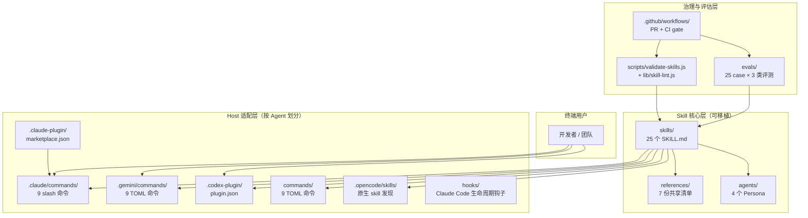
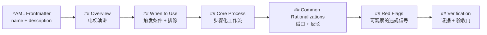
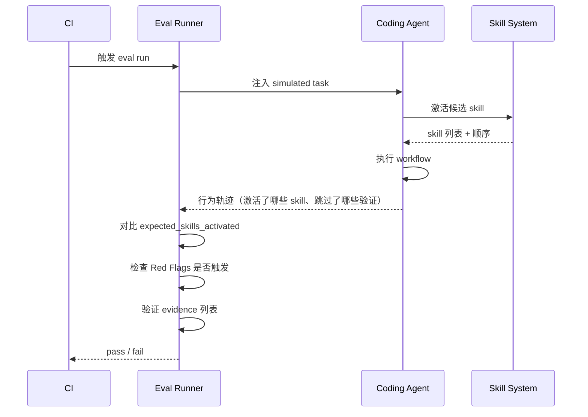
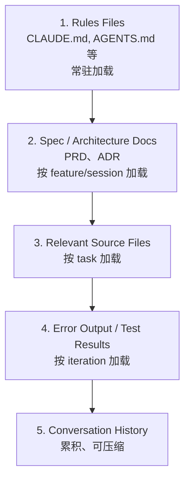

# 【Agent Skills】核心架构与设计原理深度解析：让 Coding Agent 拥有资深工程师的工程纪律

## 一、引子：Coding Agent 的"想走捷径"问题

2025 年下半年开始，Claude Code / Codex / Cursor / Gemini CLI / OpenCode 这一波 Coding Agent 已经从"玩具"走向"生产工具"。但所有用过 Coding Agent 的工程师都会遇到同一个问题：**Agent 倾向于走最短路径**——跳 spec、跳测试、跳 review、跳安全审计、直接给一个"看起来对"的实现。

这不是模型能力问题，是**纪律问题**。模型默认假设"完成 = 提交"，但人类工程师知道"完成 = 提交 + 测试 + review + 安全 + 文档 + ADR + 监控"。这两种"完成"之间的距离，就是**Agent Skills** 这类项目要填的鸿沟。

`addyosmani/agent-skills`（GitHub ⭐97k，pushed 2026-09-18，MIT License，JavaScript + Markdown）正是这一波浪潮中**最系统的解决方案**——它把整个软件工程生命周期（Define → Plan → Build → Verify → Review → Ship）拆成 25 个 SKILL.md 工作流，每个 skill 都强制要求 agent 走"流程 + 验证 + 反合理化"三件套。

本文聚焦它的**核心架构设计**：

1. **SKILL.md 工作流的格式契约**（Frontmatter + 6 个标准段落 + 触发条件 + 验收门）
2. **using-agent-skills 元 Skill 的路由机制**（如何在 25 个 skill 之间做决策）
3. **Anti-Rationalization 反合理化系统**（让 agent 不能用"我会后面补"搪塞）
4. **Multi-Agent 适配器矩阵**（同一个 `skills/` 核心如何映射到 11 个 Coding Agent）
5. **Eval 评估框架**（怎么验证 skill 真的在被使用，而不是被描述后忽略）

读完这篇，你会理解为什么"Prompt 不够用，但 Skills 才够"——Skills 把"工程纪律"从模型层面提到了**编排层面**。

---

## 二、项目定位与核心价值

### 2.1 一句话定义

Agent Skills 是一份**面向 Coding Agent 的工程纪律手册**，用结构化 Markdown 工作流 + 多 Agent 适配器，把资深工程师的判断（when to spec、what to test、how to review、when to ship）编码成 Agent 能直接执行的步骤 + 验证门 + 反合理化条款。

### 2.2 仓库关键指标

| 指标 | 值 |
|------|-----|
| ⭐ Stars | 97,036 |
| Forks | ~9k |
| 主语言 | JavaScript（plugin tooling）+ Markdown（25 SKILL.md） |
| License | MIT |
| 推送频率 | 2026-09-18 仍在活跃更新 |
| 仓库大小 | 1.1 MB（**纯文档为主**，无运行时代码） |
| 默认分支 | main |

### 2.3 能力矩阵

| 维度 | 能力 |
|------|------|
| Skill 数量 | **25 SKILL.md**（24 个生命周期 skill + 1 个元 skill） |
| Persona | 4 个（code-reviewer / test-engineer / security-auditor / web-performance-auditor） |
| Slash Commands | 9 个（`/spec` `/plan` `/build` `/test` `/constraints` `/review` `/webperf` `/code-simplify` `/ship`） |
| 支持 Agent | **11 个 Coding Agent**（Claude Code / Cursor / Codex / Gemini CLI / Antigravity / OpenCode / Windsurf / Copilot / Kiro / Command Code / `npx skills` CLI） |
| Reference Checklists | 7 份（definition-of-done / testing-patterns / security-checklist / performance-checklist / accessibility / observability / orchestration-patterns） |
| CI Evals | 25 case files + 3 类评测（trigger / routing / behavioral） |
| Adapter 集成 | marketplace.json + `.claude-plugin/` + `.codex-plugin/` + `.gemini/commands/` + `.opencode/skills/` |

### 2.4 价值主张

- **可移植**：核心是 `skills/` 目录下的纯 Markdown，**任何能读 system prompt 的 Agent 都能用**
- **可验证**：每个 skill 都内嵌 Red Flags + Verification 段落，Agent 必须产出证据才能算完成
- **可审计**：每个 skill 都内嵌 Common Rationalizations 表格，列出 Agent 用来跳过步骤的"借口 + 反驳"
- **可适配**：单一 `skills/` 核心 + 多个 host-specific commands 包装，跨 Agent 不需要复制 skill
- **可治理**：所有 skill 走 `scripts/validate-skills.js` 校验，frontmatter/section 错误直接 block CI

---

## 三、整体架构

### 3.1 顶层架构图



### 3.2 关键设计取舍

仓库结构在 README 里被明确拆成三层：

> *"The portable core stays in shared directories. Host-specific paths are native discovery conventions, not branding aliases; renaming or merging them would break the tools that scan those exact locations."*

| 层 / 消费者 | 仓库路径 | 用途 |
|---|---|---|
| 共享工作流核心 | `skills/`（25 个） | 跨所有 Agent 复用的 `SKILL.md` |
| 共享 review 资料 | `agents/`（4 个 Persona）、`references/`（7 份清单） | 全仓安装时携带的评审与清单 |
| Claude Code 适配 | `.claude/commands/`（9 命令）、`.claude-plugin/`、`hooks/` | Slash 命令 + marketplace 元数据 + 生命周期钩子 |
| Gemini CLI 适配 | `.gemini/commands/`（9 命令） | TOML 命令包装 |
| Codex 适配 | `.codex-plugin/`、`.agents/plugins/` | Codex 直接消费 `skills/` |
| Copilot CLI 适配 | `plugin.json` | 根级 plugin 元数据 |
| Contributor 工具 | `scripts/`（13 个）、`evals/`（25 个）、`.github/workflows/` | 校验 + 路由评测 + CI |
| 文档 | `docs/` | 通用指引 + 各 Agent 安装指南 |

**关键洞察**：`skills/` 是**不可重命名的核心**，其他 `.claude-plugin/`、`.codex-plugin/`、`.gemini/` 都是**按 host 工具发现约定命名的适配目录**——强行合并会破坏工具扫描逻辑。

---

## 四、SKILL.md 格式契约（Skill Anatomy）

### 4.1 必填的 5 个段落

每个 SKILL.md 都必须包含 5 个段落（缺一个就被 `validate-skills.js` block）：



**Frontmatter 约束**（来自 `scripts/lib/skill-lint.js:11-29`）：

```javascript
const MAX_DESCRIPTION_LENGTH = 1024;
const KEBAB_CASE = /^[a-z0-9]+(-[a-z0-9]+)*$/;
const DESCRIPTION_TRIGGER        = /\buse (this )?when\b|\buse (before|after|during)\b/i;
const DESCRIPTION_TRIGGER_NEGATE = /\b(do not|don't|never) use (this )?(when|before|after|during)\b/i;

const REQUIRED_SECTIONS = [
  ['## Overview'],
  ['## When to Use'],
  ['## Common Rationalizations'],
  ['## Red Flags'],
  ['## Verification'],
];
```

**三条核心校验规则**：

1. **`name` 字段**：必须 kebab-case，且与目录名一致
2. **`description` 字段**：≤ 1024 字符，必须含 `Use when…` 触发短语；**禁止**用 `Don't use when…`（那是排除条件，不是触发条件）
3. **5 个必填段落**：Overview / When to Use / Common Rationalizations / Red Flags / Verification

### 4.2 标准段落的目的

来源：`docs/skill-anatomy.md`：

| 段落 | 目的 | 答什么问题 |
|---|---|---|
| **Overview** | 电梯演讲 | 这个 skill 做什么？为什么 Agent 应该跟它走？ |
| **When to Use** | 触发条件 + 排除 | 哪些场景激活？哪些**不要**激活？ |
| **Core Process** | 工作流本体 | Agent 要按什么步骤走？必须具体可执行，不是泛泛而谈 |
| **Common Rationalizations** | 反合理化 | Agent 用来跳步骤的借口 + 为什么借口是错的 |
| **Red Flags** | 可观察信号 | 哪些行为表明 skill 被违反？ |
| **Verification** | 验收门 | 完成时必须提供什么证据？ |

### 4.3 一个真实样例：`skills/spec-driven-development/SKILL.md`

文件头 80 字符（来自 `skills/spec-driven-development/SKILL.md:1-5`）：

```yaml
---
name: spec-driven-development
description: Creates specs before coding. Use when starting a new project, feature, or significant change and no specification exists yet. Use when drafting a PRD or requirements document with objectives and scope, or when requirements are unclear, ambiguous, or only exist as a vague idea. Use when a single requirement spans several independently testable capabilities and needs decomposing into a capability map of modules before specifying.
---
```

**Phase 0 — 能力解耦**（摘自 `spec-driven-development/SKILL.md`）：

> *"Most requests describe one capability. If this one does, skip this phase and go straight to Specify — Phase 0 exists for the exception, not the rule, and it puts no hierarchy on single-capability features."*

工作流图：

```
SPECIFY ──→ PLAN ──→ TASKS ──→ IMPLEMENT
   │          │        │          │
   ▼          ▼        ▼          ▼
 Human      Human    Human      Human
 reviews    reviews  reviews    reviews
```

**关键设计**：

- **每个 phase 都要 Human review**——不是一气呵成的 LLM 自循环
- **Capability Map** 用稳定 kebab-case 模块 id 作为契约键，后续 spec/plan/command 通过这些 id 引用，避免"哪个 spec 是活动的"歧义

---

## 五、Meta-Skill：25 个 Skill 怎么路由

### 5.1 using-agent-skills 的路由图

元 skill `skills/using-agent-skills/SKILL.md` 是**任务路由层**，按 task 类型分派到对应 skill。摘自源文件（精简）：

```
Task arrives
    │
    ├── Don't know what you want yet? ──────→ interview-me
    ├── Have a rough concept, need variants? → idea-refine
    ├── New project/feature/change? ─────────→ spec-driven-development
    ├── No quality bar written down? ────────→ constraint-driven-development
    ├── Have a spec, need tasks? ────────────→ planning-and-task-breakdown
    ├── Implementing code? ─────────────────→ incremental-implementation
    │   ├── UI work? ──────────────────────→ frontend-ui-engineering
    │   ├── API work? ─────────────────────→ api-and-interface-design
    │   ├── Need better context? ──────────→ context-engineering
    │   ├── Need doc-verified code? ───────→ source-driven-development
    │   └── Stakes high / unfamiliar code? → doubt-driven-development
    ├── Writing/running tests? ─────────────→ test-driven-development
    │   └── Browser-based? ────────────────→ browser-testing-with-devtools
    ├── Something broke? ───────────────────→ debugging-and-error-recovery
    ├── Reviewing code? ────────────────────→ code-review-and-quality
    │   ├── Too complex? ──────────────────→ code-simplification
    │   ├── Security concerns? ────────────→ security-and-hardening
    │   └── Performance concerns? ─────────→ performance-optimization
    ├── Committing/branching? ──────────────→ git-workflow-and-versioning
    ├── CI/CD pipeline work? ───────────────→ ci-cd-and-automation
    ├── Deprecating/migrating? ─────────────→ deprecation-and-migration
    ├── Writing docs/ADRs? ─────────────────→ documentation-and-adrs
    ├── Adding logs/metrics/alerts? ────────→ observability-and-instrumentation
    └── Deploying/launching? ───────────────→ shipping-and-launch
```

### 5.2 路由的关键洞察

**1. 路由不互斥**：UI 工作 + API 设计的代码改，可以**同时**激活 `frontend-ui-engineering` + `api-and-interface-design`。Skill 是"并发加载的工作流集"，不是"二选一"。

**2. 路由有递归**：task 进来后，meta-skill 先按 task 类型分派；激活的子 skill 在执行中又能引出新的子 skill（如 `test-driven-development` → 浏览器相关时追加 `browser-testing-with-devtools`）。

**3. 路由有"上下文工程"特殊角色**：`context-engineering` 不是面向"做什么"，而是面向"当前上下文够不够"。当 Agent 输出质量下降时，**主动**切换到它。

### 5.3 三条核心操作行为

元 skill 强调 3 条跨 skill 通用行为（`using-agent-skills/SKILL.md:60-90`）：

```markdown
### 1. Surface Assumptions
ASSUMPTIONS I'M MAKING:
1. [assumption about requirements]
2. [assumption about architecture]
3. [assumption about scope]
→ Correct me now or I'll proceed with these.

### 2. Manage Confusion Actively
1. STOP. Do not proceed with a guess.
2. Name the specific confusion.
3. Present the tradeoff or ask the clarifying question.
4. Wait for resolution before continuing.

### 3. Push Back When Warranted
- Point out the issue directly
- Explain the concrete downside (quantify when possible)
- Propose a workable alternative
```

**反"讨好型 Agent"设计**：明确告诉 Agent "你不是 yes-machine，遇到明显问题要指出来"。

---

## 六、Anti-Rationalization：反合理化系统的工程智慧

### 6.1 什么是 Rationalization？

Agent 在执行 skill 时经常产生的"借口"：

> "I'll add tests later."
> "This is simple enough to skip the spec."
> "I'm confident, skip the doubt step."
> "The reviewer will just nitpick."

这些借口**听起来合理**，但每一条都对应一个**可验证的反例**。

### 6.2 真实样例：`doubt-driven-development` 的反合理化表

摘自 `skills/doubt-driven-development/SKILL.md:Common Rationalizations`：

| Rationalization（借口） | Reality（反驳） |
|---|---|
| "I'm confident, skip the doubt step" | Confidence correlates poorly with correctness on novel problems. Moments of certainty are exactly when blind spots hide. |
| "Spawning a reviewer is expensive" | Debugging a wrong commit in production is more expensive. The check is bounded; the bug isn't. |
| "The reviewer will just nitpick" | Only if unscoped. Constrain the prompt to "issues that would make this fail under the contract." |
| "I'll do doubt at the end with `/review`" | `/review` is a final gate. Doubt-driven catches wrong directions early when course-correction is cheap. By PR time it's too late. |
| "If I doubt every step I'll never ship" | The skill applies to non-trivial decisions, not every keystroke. Re-read "When NOT to Use." |
| "Two opinions are always better than one" | Not when the second has less context and produces noise. Reconcile, don't defer. |
| "Cross-model is always better" | Cross-model catches blind spots a single model shares with itself, but it adds cost and tool fragility. Offer it every interactive doubt cycle — the user decides whether the artifact warrants it. |

**设计哲学**：

1. **每条反驳都有数据/事实支撑**，不是"我觉得"——例如 "Debugging a wrong commit in production is more expensive"
2. **承认反例的边界**——"Two opinions are always better" 列表里承认"但当第二者上下文更少时不行"
3. **给"何时不适用"留口子**——避免 skill 变成"绝对命令"

### 6.3 Red Flags：可观察的违规信号

继续看 `doubt-driven-development/SKILL.md:Red Flags`：

```markdown
- Spawning a fresh-context reviewer for a one-line rename or formatting change
- Treating reviewer output as authoritative without re-reading the artifact text
- Looping >3 cycles without escalating to the user
- Prompting the reviewer with "is this good?" instead of "find issues"
- Skipping doubt under time pressure on a high-stakes decision
- Re-spawning fresh-context on an unchanged artifact
- **Doubt theater (checkable signal)**: across 2 or more cycles where the
  reviewer surfaced substantive findings, zero findings were classified as
  actionable. You are validating, not doubting. Stop and escalate.
```

**最精彩的一条**："Doubt theater"——如果连续 2 轮 reviewer 给出实质发现但你都没标 actionable，**你其实在做确认，而不是在怀疑**。这是一个**可检查的信号**，比模糊的"自我审视"强得多。

### 6.4 Verification：验收门

每个 skill 结尾都强制要求证据：

```
── test-driven-development/SKILL.md 的 Verification：
- [ ] 测试框架已发现（检查 package.json / pom.xml / pyproject.toml）
- [ ] red-green-refactor 循环有 commit 记录
- [ ] test pyramid 80/15/5 比例被守住
- [ ] browser-based 改动配 Chrome DevTools MCP runtime 验证
- [ ] 全部 `npm test` 通过（不只是单元，还有集成、E2E）
```

**"Seems right" is never sufficient**——这是 README 里反复强调的一句话。

---

## 七、Provider 适配层：一份 `skills/`，11 个 Agent

### 7.1 适配器矩阵

| Coding Agent | 安装方式 | 发现路径 |
|---|---|---|
| **Claude Code** | `/plugin marketplace add addyosmani/agent-skills` 或 `npx skills add` | `.claude-plugin/marketplace.json` + `.claude/commands/*.md` |
| **Cursor** | 拷贝 `skills/` 到 `.cursor/skills/` + 写 `.cursor/rules/*.mdc` | `skills/`（直接读）+ Rules 文件 |
| **Codex** | `codex plugin marketplace add` | `.codex-plugin/plugin.json` + `skills/`（Codex 直接消费） |
| **Gemini CLI** | `gemini skills install` | `.gemini/commands/*.toml` |
| **Antigravity CLI** | `agy plugin install` | `commands/*.toml`（legacy）+ `plugin.json` |
| **OpenCode** | 拷贝 `skills/` 到 `.opencode/skills/` | `.opencode/skills/`（原生发现）+ `AGENTS.md` |
| **Windsurf** | 把 skill 内容加到 rules | rules 配置 |
| **Copilot** | 拷贝 `agents/` 作 persona，skill 内容进 `.github/copilot-instructions.md` | `agents/` + instructions 文件 |
| **Kiro** | `.kiro/skills/` | `.kiro/skills/` |
| **Command Code** | `cmd skills add` | `.commandcode/skills/` |
| **`npx skills` CLI** | `npx skills add addyosmani/agent-skills` | 跨工具统一安装 |

### 7.2 一个适配器样例：`.claude-plugin/marketplace.json`

```json
{
  "$schema": "https://json.schemastore.org/claude-code-marketplace.json",
  "name": "addy-agent-skills",
  "description": "Production-grade engineering skills for AI coding agents...",
  "owner": {
    "name": "Addy Osmani",
    "url": "https://github.com/addyosmani"
  },
  "plugins": [
    {
      "name": "agent-skills",
      "version": "0.6.10",
      "source": {
        "source": "github",
        "repo": "addyosmani/agent-skills"
      },
      "description": "Production-grade engineering skills covering every phase...",
      "license": "MIT",
      "keywords": ["skills", "agents", "engineering", "spec", "tdd", "review", "ship"]
    }
  ]
}
```

**关键字段**：
- `name: "addy-agent-skills"` —— plugin 命名空间，避免与其他 plugin 冲突
- `version: "0.6.10"` —— 显式版本号，方便 marketplace 管理
- `source.source: "github"` + `repo` —— Claude Code marketplace 直接通过 HTTPS clone 拉取

### 7.3 三种分发哲学

不同 Agent 走不同分发路径，**没有"统一安装器"**：

1. **Marketplace-first**（Claude Code / Codex / Antigravity）：用 `plugin marketplace add` 注册源，再用 `plugin install` 装具体 plugin
2. **Native copy**（OpenCode / Cursor / Windsurf）：直接拷贝 `skills/` 到 host 的标准发现目录
3. **CLI 一键**（`npx skills` / `cmd skills` / `agy plugin install`）：通过 npm/CLI 把 skill 装到 host 标准位置

**`npx skills` CLI 是 vercel-labs/skills 的复用**——README 里明确指出：

> *"The open skills CLI installs into 70+ agents (Claude Code, Cursor, Codex, Copilot, Cline, and more)"*

这是**生态复用**的典型例子：agent-skills 不重复造 CLI，而是直接用 vercel-labs 的 npm 安装器。

---

## 八、Skill Lint：让 skill 失效变成 CI 错误

### 8.1 校验脚本全貌

`scripts/validate-skills.js` 是一个**薄包装**——所有规则集中在 `scripts/lib/skill-lint.js`（12.5KB），便于单测：

```javascript
// scripts/validate-skills.js
const { lintSkill } = require('./lib/skill-lint');
const SKILLS_DIR = path.resolve(__dirname, '..', 'skills');

function main() {
  const skillDirs = fs.readdirSync(SKILLS_DIR)
    .filter(d => fs.statSync(path.join(SKILLS_DIR, d)).isDirectory())
    .sort();
  const knownSkills = new Set(skillDirs);

  for (const dirName of skillDirs) {
    const { errors, warnings, exempt } = lintSkill(dirName, SKILLS_DIR, knownSkills);
    if (errors.length === 0 && warnings.length === 0) {
      console.log(`  ✓  ${dirName}${exempt ? ' (section checks exempt)' : ''}`);
    } else {
      // ... 错误与警告分别打印
    }
  }
  // exit(1) if any error
}
```

### 8.2 校验规则详解

来自 `scripts/lib/skill-lint.js:11-50`：

**Errors（block CI）**：

| 规则 | 实现 | 目的 |
|---|---|---|
| SKILL.md 必须存在 | `fs.existsSync(skillDir/SKILL.md)` | 防遗漏 |
| frontmatter 必须有 name + description | YAML 解析 + 字段断言 | 防解析失败 |
| frontmatter name 必须匹配目录名 | `dirName === fm.name` | 防命名漂移 |
| 目录名必须 kebab-case | `KEBAB_CASE.test(dirName)` | 防大小写混用 |
| description ≤ 1024 字符 | `description.length <= 1024` | 防 context 爆炸 |
| description 必须含 `Use when…` | `DESCRIPTION_TRIGGER.test(description)` | 防 skill 失去触发条件 |
| 必填段落必须存在 | `REQUIRED_SECTIONS.every(...)` | 保 5 段结构 |

**Warnings（不 block CI）**：

- 跨 skill 引用指向未知 skill —— `SKILL_REF_PATTERNS` 列出 10 种正则，`cross-skill references` 必须解析得到 `knownSkills`

### 8.3 Section 豁免白名单

```javascript
const SECTION_EXEMPT_SKILLS = {
  'using-agent-skills': 'Meta-skill — orchestrates other skills; When-to-Use and Verification are not applicable to a routing document.',
  'idea-refine':        'Legacy structure predating skill-anatomy.md — uses How-It-Works/Usage/Anti-patterns instead of standard headings.',
};
```

**关键设计**：豁免白名单**放在 lint 库**，**不放进 skill 的 frontmatter**——避免贡献者绕过校验。

### 8.4 反向引用校验

`SKILL_REF_PATTERNS` 列出 10 种跨 skill 引用的正则：

```javascript
const SKILL_REF_PATTERNS = [
  /\buse the `([a-z][a-z0-9-]+[a-z0-9])` skill/g,
  /\bfollow the `([a-z][a-z0-9-]+[a-z0-9])` skill/g,
  /\binvoke the `([a-z][a-z0-9-]+[a-z0-9])` skill/g,
  /\bcontinue with `([a-z][a-z0-9-]+[a-z0-9])`/g,
  /\buse `([a-z][a-z0-9-]+[a-z0-9])` skill/g,
  /`([a-z][a-z0-9-]+[a-z0-9])` skill\b/g,
  /`([a-z][a-z0-9-]+[a-z0-9])` persona\b/g,
  /\bsee `([a-z][a-z0-9-]+[a-z0-9])`/g,
  /──→ ([a-z][a-z0-9-]+[a-z0-9])\b/g,          // ASCII diagram arrows
  /→ `([a-z][a-z0-9-]+[a-z0-9])`/g,
];
```

**为什么用 10 个正则**：覆盖 Markdown 中**几乎所有可能的引用形态**（自然语言、ASCII 箭头、链接），保证 warning 准确。

### 8.5 Fenced Code Block 剥离

`stripFencedCodeBlocks(content)` 是个**CommonMark 合规的 fence 剥离**：

- 支持 tilde (`~~~`) 和 backtick (` ``` `) 两种 fence
- 支持缩进 1-3 空格的 fence（嵌套在 list 项里时常用）
- 关闭 fence 必须 ≥ opener 长度（同 marker）
- 未终止的 fence 跑到文件末尾 → 后续所有内容按 fenced 处理

**为什么这一段复杂**：原版单正则只匹配 column-zero backtick，遇到 list 内的 fence 就漏判。修复后所有示例代码里的 `## Verification` 等假标题都不会被算成"缺必填段落"。

---

## 九、Eval 框架：skill 真的在生效吗？

### 9.1 三层评测

README 和 `evals/` 目录表明评测分三类：

| 类型 | 验证什么 | 触发频率 |
|---|---|---|
| **Trigger Eval** | skill 是否在正确的场景被激活 | 每个 PR |
| **Routing Eval** | meta-skill 是否把任务路由到正确的子 skill | 每个 PR |
| **Behavioral Eval** | skill 的工作流是否被完整执行（Red Flags 未触发） | 每个 PR |

### 9.2 评测 case 文件格式

`evals/cases/using-agent-skills.json` 是一个**典型 trigger eval**：

```json
{
  "case_id": "using-agent-skills",
  "input": "<simulated task description>",
  "expected_skills_activated": ["spec-driven-development", "test-driven-development"],
  "expected_red_flags": [],
  "expected_verification_outputs": ["test_pyramid_80_15_5", "red_green_refactor_commits"]
}
```

**评测流**：



### 9.3 这套 eval 体系解决了什么问题

传统 Agent 评估的痛点：

1. **只评估最终输出**（代码能不能跑）→ 短期看 ok，但 skill 是否被遵守无法验证
2. **人工 spot-check**（抽几个 PR 看）→ 覆盖率低、不可规模化
3. **基准 benchmark**（HumanEval / SWE-Bench）→ 太通用，看不到 skill 细节

Agent Skills 的三层 eval 体系：

- **Trigger eval** 测的是"Agent 看见输入是否会想到 skill"——这是 **skill discovery** 的问题
- **Routing eval** 测的是"meta-skill 选对了子 skill"——这是 **orchestration** 的问题
- **Behavioral eval** 测的是"子 skill 走完了流程"——这是 **execution fidelity** 的问题

这是 2026 年 Coding Agent 评估的**新基线**——从"输出对不对"升级到"过程对不对"。

---

## 十、Context Engineering：skill 不是 prompt 替换

### 10.1 Context Hierarchy（5 层信息架构）

`skills/context-engineering/SKILL.md` 定义了一个 5 层 hierarchy：



**关键洞察**：

- Skill 不是塞进 level 5（conversation history），而是**显式触发**的——通过 `/spec`、`/plan` 等 slash command
- Skill 的 verification 段提供 level 4（错误输出）的反馈闭环
- Skill 的 references/ 子目录提供 level 3（按需源文件）的渐进加载

### 10.2 真实样例：CLAUDE.md 配置

```markdown
# Project: my-app

## Tech Stack
- React 18, TypeScript 5, Vite, Tailwind CSS 4
- Node.js 22, Express, PostgreSQL, Prisma

## Commands
- Build: `npm run build`
- Test: `npm test`
- Lint: `npm run lint --fix`

## Code Conventions
- Functional components with hooks (no class components)
- Named exports (no default exports)
- colocate tests next to source: `Button.tsx` → `Button.test.tsx`
- Use `cn()` utility for conditional classNames
- Error boundaries at route level

## Boundaries
- Never commit .env files or secrets
- Never add dependencies without checking bundle size impact
- Ask before modifying database schema
- Always run tests before committing
```

**Rules Files 是 Level 1**——Agent 启动时**第一件事**是读它，定义项目的"宪法"。

### 10.3 Skill 的渐进加载

Agent Skills 的 `SKILL.md` 是**入口**，**references/ 和子目录是按需加载**。这解决了两个问题：

1. **context window 爆炸**：25 个 skill 全量加载 ≈ 50k+ tokens，挤占可用空间
2. **信号噪声**：每次任务只需相关 skill，全量加载会让 Agent 困惑

`scripts/lib/skill-lint.js` 在校验时只读 `SKILL.md`，**不读 references/**——references 是 agent 运行时的 progressive disclosure 资源，不是 lint 的审计对象。

---

## 十一、与同类项目对比

### 11.1 三巨头：agent-skills vs Superpowers vs Matt Pocock's skills

`docs/comparison.md` 给出了**诚实且详细的对比**，核心信息：

| 维度 | agent-skills | Superpowers | Matt Pocock's skills |
|---|---|---|---|
| 核心思想 | 编码完整的资深工程生命周期 | 可组合 skill 的完整开发方法论 | 一位专家的 Claude Code 工作流开源 |
| 组织原则 | SDLC 阶段（Define → Ship）+ meta-skill router | 单一纪律循环：brainstorm → plan → execute → review | 聚焦、可组合的命令工具箱 |
| 目录规模 | 25 个 skill 覆盖全生命周期 | ~14 个 skill，深耕内循环 | ~30 个 skill，分 engineering / productivity / in-progress / deprecated |
| 入口点 | 9 个 slash 命令对应生命周期 + `/build auto` | 链式 pipeline（brainstorming → writing-plans → subagent-driven-development） | `/grill-me` `/tdd` `/to-prd` `/diagnosing-bugs` `/grill-with-docs` |
| 差异化机制 | 每个 skill 都有反合理化表 + Red Flags；`/ship` 配并行 review personas；reference checklists；**CI 内三层 eval 框架** | subagent-driven development + task reviewer（spec + quality）+ fix loop；git worktree isolation；skills-that-write-skills；pressure-tested | **grilling primitive**（一次一问，design-tree walking）；seam-based TDD；显式 user-invoked vs model-invoked 拆分；issue-tracker 集成 |
| 质量度量 | 触发 / 路由 / 行为 eval 跑完整目录（in-repo，部分 in CI） | pressure-testing 是核心理念；eval suite 已迁到独立仓库 | 仓库内未提供 |
| 工具覆盖 | Claude Code / Cursor / Gemini CLI / Antigravity / OpenCode / Windsurf / Copilot / Kiro / Codex / Command Code + `npx skills` CLI | Claude Code / Codex / Cursor / Copilot CLI / OpenCode / Kimi / Factory Droid / Antigravity / Pi | Claude Code 优先，通过 `npx skills add` 分发 |
| 治理 | 积极 review + merge 社区 PR，每个 skill 都带 eval | 主要 solo-authored；社区 PR 积压较多 | solo-authored，自合并，公开开发 |

### 11.2 设计哲学差异

**agent-skills（Addy Osmani）的工程纪律路线**：
- 假设："Coding Agent 走最短路径"是默认行为
- 解法：**显式约束**（When to Use）+ **反合理化**（Common Rationalizations）+ **可观察信号**（Red Flags）+ **证据门控**（Verification）
- 验证：**CI 内 trigger/routing/behavioral 三层 eval**
- 适配：**同一份 `skills/` + 11 个 host 适配器**

**Superpowers（Jesse Vincent / obra）的自主推理路线**：
- 假设："长任务需要 upfront 重规划 + subagent 并行"
- 解法：**brainstorming → writing-plans → subagent-driven-development** 单向 pipeline
- 隔离：**git worktree** 给每个 subagent 独立工作区
- 特色：**skills-that-write-skills**（meta-skills）
- 验证：**pressure-testing methodology** 是核心理念，eval 套件已迁出

**Matt Pocock's skills 的专家流程路线**：
- 假设："实战经验比抽象理论更值钱"
- 解法：**单一专家的日常工作流** + **`/grill-me` 一问一问访谈** + **issue-tracker 集成**
- 范围：**Claude Code 优先**，其他 Agent 支持参差

### 11.3 互补关系

三者**互相借鉴、互不替代**：

- 想**覆盖全生命周期**（从 spec 到 ship）→ **agent-skills**
- 想**长任务自主推理 + subagent 并行**→ **Superpowers**
- 想**Claude Code 实战专家流程 + 需求澄清**→ **Matt Pocock's skills**

README 引用 Matt Pocock 的 head-to-head 实验链接，验证三者**性能可对比**，不是简单的"哪个更好"。

### 11.4 与 Coding Agent Harness 类项目的对比

Coding Agent Harness 类项目（claude-code / openai-codex / goose / planning-with-files）解决的是**agent 本身的运行时**：

| 维度 | Coding Agent Harness | Agent Skills |
|---|---|---|
| 作用层 | Agent Runtime | Agent 工作流编排 |
| 代码量 | 数千-数万行 Rust/TypeScript | **0 行运行时代码**（纯 Markdown + 校验脚本） |
| 解决的问题 | 怎么让 agent 跑得动 | **怎么让 agent 跑得对** |
| 提供的能力 | MCP、Hook、Provider Registry、Scheduler | 流程、验证、反合理化、Eval |
| 适用人群 | Agent 框架开发者 | **Agent 使用者 + 团队工程化** |

**关键差异**：Coding Agent Harness 是"给 agent 装轮子"，Agent Skills 是"给 agent 立规矩"。两者**正交互补**——大多数生产团队需要 Harness 跑 agent + Skills 立规矩。

---

## 十二、优缺点分析

### 12.1 双侧对比

| 维度 | 优势（架构简洁性 / 扩展性 / 易用性） | 劣势（性能 / 复杂度 / 维护性） |
|---|---|---|
| **架构** | 单一 `skills/` 核心 + 多 manifest 包装；零运行时代码；Markdown 即源代码 | 跨 25 个 skill 的一致性靠**人工维护**；新增 skill 必须满足 5 段格式 + CI 通过 |
| **扩展性** | 加新 Agent 只需新增一个 `host/` 目录 + 9 个 TOML/MD 命令；skill 内容不动 | 单 skill 维护跨多个 host 的 reference path 一致性（`#361` issue 提到 `npx skills --skill foo` 安装时丢失 `references/`） |
| **易用性** | `npx skills add` 一键安装；slash command 直觉；description 触发条件明确 | 用户需要**主动调用** `/spec` 等命令才能激活 skill；如果不调，等于没装 |
| **性能** | 渐进加载（仅 SKILL.md 进 context，references 按需） | 25 个 skill 的 description 全部注入 system prompt ≈ **30-50k tokens**，挤占可用空间 |
| **复杂度** | lint 规则透明（开源校验脚本）；eval framework 可本地复跑 | 25 个 skill 的内容需要持续 review；社区 PR 合并涉及跨 skill 依赖检查 |
| **维护性** | MIT License；CI 自动 lint；版本号 (`0.6.10`) 显式 | **没有自动生成**——所有 SKILL.md 是手写；新适配 Agent 需要手写 plugin manifest |

### 12.2 三个最关键的工程取舍

**取舍 1：进度式 disclosure vs 全量加载**

- 选 **进度式**（仅 SKILL.md 进 prompt，references 按需）
- 代价：用户**必须记得**调用 slash command 触发 skill
- 替代：全量加载所有 25 个 skill（context 爆炸，Agent 困惑）

**取舍 2：硬约束 vs 软提示**

- 选 **硬约束**（CI block + lint 必填段 + 反合理化）
- 代价：贡献新 skill 的门槛高（必须 5 段齐 + 触发短语 + 1024 字符限制）
- 替代：软提示（不 lint，质量参差，Agent 跳步骤无人监管）

**取舍 3：自建 vs 复用 CLI**

- 选 **复用**（用 vercel-labs/skills 的 `npx skills` CLI 装 70+ Agent）
- 代价：依赖 vercel-labs/skills 项目的更新节奏
- 替代：自建 CLI（维护成本高，但可控）

### 12.3 已知不足（来自 README 和 GitHub Issues）

1. **per-skill install 丢失 references**：单 skill 拷贝不带 `references/`，引用 path 失效（`#361`）
2. **Antigravity CLI 命令兼容性**：legacy TOML 命令被报告"已转换但不可发现"（README 显式承认）
3. **Cursor 适配**：必须把 workflow skill 拷贝到 `.cursor/skills/`，**不能**直接粘贴到 rules（README 显式提醒）
4. **eval 框架覆盖率**：README 说"部分 in CI"——不是全部 eval 都在 GitHub Actions 跑

---

## 十三、实践 / 部署

### 13.1 一键安装（最快路径）

```bash
# 用 npx skills CLI 一次安装所有 25 个 skill
npx skills add addyosmani/agent-skills

# 浏览可选 skill 后再装
npx skills add addyosmani/agent-skills --list

# 单 skill 安装
npx skills add addyosmani/agent-skills --skill test-driven-development
```

### 13.2 Claude Code 原生安装

```bash
# Marketplace 方式
/plugin marketplace add addyosmani/agent-skills
/plugin install agent-skills@addy-agent-skills

# 本地开发方式（克隆后）
git clone https://github.com/addyosmani/agent-skills.git
claude --plugin-dir /path/to/agent-skills
```

### 13.3 典型工作流

```
1. /spec → 产出 spec-driven-development 文档
2. /constraints → 锁定 CONSTRAINTS.md 质量底线
3. /plan → planning-and-task-breakdown 把 spec 拆成 task
4. /build auto → 自动跑所有 task（incremental-implementation + context-engineering）
5. /test → 强制 red-green-refactor（test-driven-development）
6. /review → 五轴 code-review（code-review-and-quality + 3 个 persona）
7. /code-simplify → 应用 Chesterton's Fence
8. /ship → shipping-and-launch + observability-and-instrumentation
```

### 13.4 CI 集成（本地校验）

```bash
# 克隆后跑本地 lint
git clone https://github.com/addyosmani/agent-skills.git
cd agent-skills
node scripts/validate-skills.js
# 期望输出：25 skills checked — 0 error(s), N warning(s) — PASSED
```

### 13.5 团队自定义

基于 `agent-skills` 做团队 fork 时：

1. **保留** `skills/` 25 个核心 skill，作为"团队宪法"
2. **新增** `skills/<team-specific>` 子目录（如 `skills/cloudflare-workers-deploy`）
4. **修改** `scripts/lib/skill-lint.js:34` 的 `MAX_DESCRIPTION_LENGTH`（团队可能有不同 context 预算）
5. **追加** `references/`（团队约定，如 `references/oncall-checklist.md`）
6. **跑** `node scripts/validate-skills.js` 校验后再 push

---

## 十四、趋势与总结

### 14.1 Agent Skills 揭示的 5 个趋势

**1. Skills 正在成为 Coding Agent 的"操作系统层"**

2026 年之前的 Agent 框架（LangChain / LlamaIndex / CrewAI）都试图在 **prompt 层**塞更多指令，结果是 context window 爆炸 + 模型困惑。Agent Skills 反其道：把 workflow 拆成独立 skill 文件，**只在需要时加载**。这与 operating system 的"分页 + 按需加载"哲学一致——2026 年是 Coding Agent OS 元年。

**2. 验证从"输出正确"升级到"过程正确"**

传统 Agent 评估看"代码能不能跑"。Agent Skills 提出三层 eval（trigger / routing / behavioral），**强制** Agent 走完整流程。这意味着：未来 12 个月，Coding Agent 评估会从 HumanEval/SWE-Bench 这种"结果基准"，逐步转向"过程基准"。

**3. Anti-Rationalization 是 Engineering Discipline 的工程化**

人类工程师知道"我会后面补测试"是借口。Agent 默认会这么干。**把反合理化条款写进 skill**，等于把资深工程师的判断编码成可重读的 Markdown。这是"团队经验沉淀"的全新形式——比文档站更可执行，比 ADR 更具体。

**4. 跨 Agent 适配从"碎片化"走向"市场"**

过去每个 Coding Agent 各搞一套 plugin 系统（Claude Code marketplace / Codex plugin / Antigravity / Copilot）。`npx skills` CLI + vercel-labs/skills 项目试图**统一分发协议**。Agent Skills 是**首批多 Agent 适配的开源 skill pack**——11 个 host 同源，未来可能成为"skill marketplace"的开山范式。

**5. Rules Files（CLAUDE.md / AGENTS.md）是新时代的"项目宪法"**

`context-engineering` skill 明确把 CLAUDE.md / AGENTS.md 列为 Level 1 常驻上下文。这与 `.eslintrc` / `tsconfig.json` / `package.json` 一脉相承——**每个项目都应该有自己的 AI 协作规范**。未来 12 个月，"项目宪法"会成为新代码评审的必备项。

### 14.2 工程经验提炼

读这套 skill pack 能学到的工程经验：

1. **流程 = 步骤 + 验证 + 反合理化**——三件套缺一不可
2. **触发条件写在 description**——让 Agent 在 prompt 注入时就知道何时激活
3. **可观察信号比意图更重要**——"Doubt theater" 这种 checkable signal 比"应该怀疑"更可执行
4. **格式契约必须 CI 强制**——手动维护的不遵循
6. **跨工具发现约定不可合并**——`.claude-plugin/` `.codex-plugin/` `.gemini/` 是各 host 的硬约定

### 14.3 选型建议

| 你的场景 | 推荐 |
|---|---|
| 团队刚用 Coding Agent，需要工程纪律 | **agent-skills**（覆盖最全，CI 可强制） |
| 个人 Claude Code 用户，习惯 Matt Pocock 风格 | **Matt Pocock's skills**（grilling + issue-tracker 整合） |
| 长链路自主任务（多日 / 多 subagent） | **Superpowers**（subagent-driven-development + worktree isolation） |
| 想做团队自定义 fork | **agent-skills**（CI lint 完整，MIT License，25 skill 模板可复制） |
| 想做 skill marketplace / 插件分发 | **agent-skills**（多 host 适配 + `npx skills` 复用 + 显式 plugin.json） |

### 14.4 总结

Agent Skills（addyosmani/agent-skills，⭐97k）是一份**面向 Coding Agent 的工程纪律手册**。它用 **25 个 SKILL.md + 4 Persona + 9 slash command + 11 host 适配器 + 3 层 eval 框架**的组合，把"资深工程师的判断"编码成 Agent 能直接执行的**步骤 + 验证 + 反合理化**三件套。

它的核心贡献是：

1. **格式契约**：5 个必填段落 + frontmatter 校验 + CI lint——让 skill 失效变成 CI 错误
2. **Meta-skill 路由**：把 25 个 skill 按 task 类型分派——并发加载而非二选一
3. **Anti-Rationalization**：每个 skill 内嵌借口 + 反驳——让 Agent 不能用"我会后面补"搪塞
4. **Red Flags**：可观察的违规信号——比"自我审视"更可执行
5. **Verification 验收门**：必须提供证据——"Seems right is never sufficient"
6. **Multi-host 适配**：同一份 `skills/` 核心 + 11 个 host 适配器——跨 Agent 不需要复制
7. **三层 eval**：trigger / routing / behavioral——从"输出对不对"升级到"过程对不对"

如果你是 Coding Agent 用户/团队，**agent-skills 几乎是把"工程纪律"从模型层面提到编排层面的最早严肃答案**。**强烈建议至少跑一遍 25 个 skill 的 description，挑 5 个最痛的工作流深入读 SKILL.md**——你会发现很多"我自己用了几年的工程习惯"原来可以写成 Agent 能跟的步骤。

---

## 附录：关键资源

| 资源 | 链接 |
|------|------|
| GitHub 仓库 | https://github.com/addyosmani/agent-skills |
| README | https://github.com/addyosmani/agent-skills/blob/main/README.md |
| Skill 格式规范 | https://github.com/addyosmani/agent-skills/blob/main/docs/skill-anatomy.md |
| 与同类对比 | https://github.com/addyosmani/agent-skills/blob/main/docs/comparison.md |
| 校验脚本 | https://github.com/addyosmani/agent-skills/blob/main/scripts/validate-skills.js |
| 校验规则库 | https://github.com/addyosmani/agent-skills/blob/main/scripts/lib/skill-lint.js |
| Claude Code Marketplace manifest | https://github.com/addyosmani/agent-skills/blob/main/.claude-plugin/marketplace.json |
| Spec-Driven 样例 | https://github.com/addyosmani/agent-skills/blob/main/skills/spec-driven-development/SKILL.md |
| Test-Driven 样例 | https://github.com/addyosmani/agent-skills/blob/main/skills/test-driven-development/SKILL.md |
| Context-Engineering 样例 | https://github.com/addyosmani/agent-skills/blob/main/skills/context-engineering/SKILL.md |
| Doubt-Driven 样例 | https://github.com/addyosmani/agent-skills/blob/main/skills/doubt-driven-development/SKILL.md |
| Using-Agent-Skills meta-skill | https://github.com/addyosmani/agent-skills/blob/main/skills/using-agent-skills/SKILL.md |
| 第三方 CLI | https://github.com/vercel-labs/skills |
| 趋势对比实验 | https://www.linkedin.com/pulse/superpowers-vs-agent-skills-faster-shipping-safer-reasoning-om-mishra-dzakf/ |
| License | MIT |