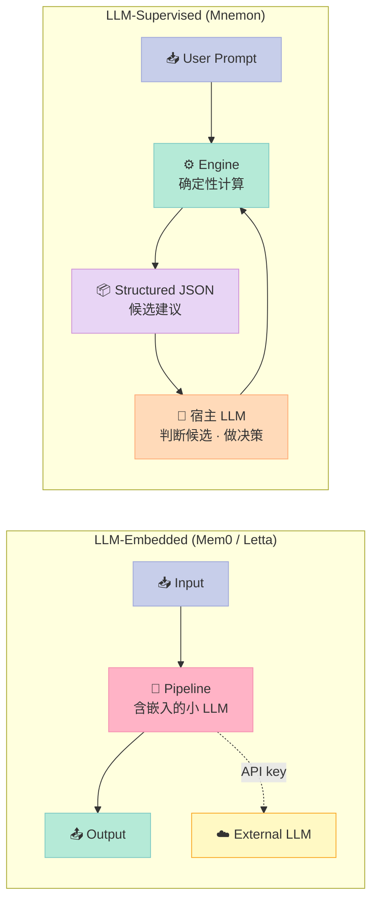
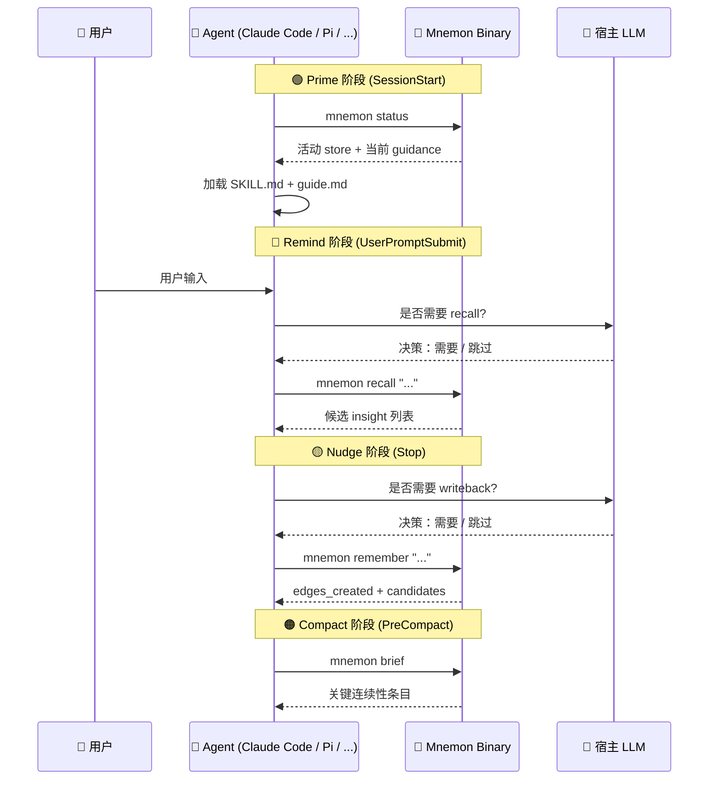
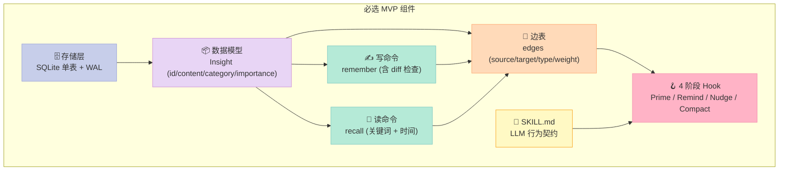

> **核心结论**：Mnemon 把"LLM-Embedded Memory"（Mem0 / Letta / 原版 MAGMA 的做法）反转为"LLM-Supervised Memory"——单一 Go 二进制负责确定性计算（存储、图索引、搜索、衰减），宿主 LLM 负责高价值判断（因果链、相关性、链接去重）。配合 MAGMA 四图谱模型 + `remember / link / recall` 三原语 + 15+ Runtime 协议层投影，它是为数不多在"Memory 协议层"做出工程化贡献的开源实现。

---

## 一、为什么 Memory 是 Harness 中最难也最值得投资的一层

2026 年的 AI Agent 生态里，**Memory 是唯一具有复利效应的组件**——LLM 引擎会持续迭代、Skill 文件几乎零边际成本，但用户的决策、偏好、项目上下文是私有资产，会随时间指数级增值。Mnemon 文档里的一句话点透了这层洞察：

> *Memory has a compound interest effect. LLM engines iterate constantly, skill files cost nearly nothing to write, but memory is a private asset that grows with the user. It is the only component in the agent ecosystem worth deep investment.*

但 LLM Memory 这一层有 3 个**结构性痛点**，至今没有统一解法：

| 痛点 | 表现 | 根因 |
|------|------|------|
| **压缩丢忆** | `/compact` 或自动压缩后，所有先前的决策、发现、上下文全部丢失 | 压缩算法不知道"哪些信息对用户重要" |
| **跨会话失忆** | 每次新会话从零开始，无任何前次会话的知识 | 传统 RAG 把 memory 绑死在 session 生命周期上 |
| **长会话衰减** | 上下文窗口填满后，关键早期信息被推挤出注意力范围 | LLM attention 是滑动窗口，没有持久层 |

更深一层，**当前主流方案都有结构性瓶颈**：

1. **Memory 是事后补救**——它的生命周期被绑定到 agent session，而不是独立实体
2. **写入是被动的**——总结在对话结束后提取，丢失结构信息
3. **检索是扁平的**——只靠向量相似度，无法表达时间/因果/对立关系
4. **没有遗忘机制**——要么全记住，要么 TTL 一刀切，没有智能衰减
5. **依赖重**——需要 API key、外部数据库、网络连接

**Mnemon 用一个 Go 二进制 + 一个意图原生协议**回答了上述所有问题。本文从其源码出发，深度拆解这个 587⭐ 但设计极其工程化的项目。

---

## 二、项目速览：Mnemon 是什么

### 2.1 一句话定位

**Mnemon = LLM-supervised 持久化记忆引擎**——一个 Go 编写的单一二进制，通过 `remember / link / recall` 三个意图原生命令，把 Claude Code / Codex / Cursor / Pi 等 15+ LLM CLI 的会话持久化记忆层统一到 `~/.mnemon/` 下。

### 2.2 关键指标

| 维度 | 数值 |
|------|------|
| ⭐ GitHub Stars | **587** |
| 📦 License | **Apache-2.0** |
| 🛠 语言 | **Go 1.24+**（核心引擎）+ Node.js（npm 启动器） |
| 📂 代码量 | 581 个文件，223 个 Go 源文件（不含测试） |
| 📐 单二进制大小 | ~14 MB（无运行时依赖） |
| 🔌 支持 Runtime | **15+**（Claude Code / Codex / Cursor / ZCode / TRAE / Qoder / CodeBuddy / WorkBuddy / Kimi Code / OpenCode / Hermes / OpenClaw / Pi / NanoClaw / DeepSeek Harness / Nanobot / MiniMax Code） |
| 📜 设计文档 | 49 篇（11 张架构图 + 8 篇理论设计 + 中文版完整翻译） |

### 2.3 三句口号读懂 Mnemon

```text
1. Tools are Organs, Skills are Textbooks     ← 二进制是器官，Skill 是教科书
2. LLM as Supervisor, Binary as Organ         ← LLM 是监督者，引擎是确定性器官
3. Memory Gateway, not Memory Database        ← 协议层与存储层解耦
```

---

## 三、架构总览：二层架构 + 双命令面

Mnemon 把"存储引擎层"与"协议层"严格解耦——这是它最反常识的设计，也是它能跨 15+ Runtime 的根因。

### 3.1 顶层架构图

```mermaid
graph TB
    subgraph "Protocol Layer · 协议层"
        CLI["🖥️ mnemon binary CLI<br/>remember / link / recall / forget / gc"]
        JSON["📦 Structured JSON Output<br/>signal transparency · 候选建议"]
        hooks["🪝 4-Phase Hooks<br/>Prime → Remind → Nudge → Compact"]
    end

    subgraph "Engine Layer · 引擎层"
        model["🧠 Insight/Edge Model<br/>6 类 Category · 5 类 EdgeType"]
        graph["🕸️ MAGMA 4-Graph Engine<br/>Temporal / Entity / Causal / Semantic"]
        store["🗄️ SQLite Store (WAL mode)<br/>insights + edges + oplog"]
        embed["🔢 Ollama Embedding<br/>可选 768-dim nomic-embed-text"]
        decay["⏳ EI Decay + GC<br/>base × access × decay × edge"]
    end

    subgraph "Runtime Projections · Runtime 投影"
        claude["🤖 Claude Code<br/>SKILL.md + settings.json hooks"]
        codex["🤖 Codex<br/>AGENTS.md + hooks.json"]
        cursor["🤖 Cursor<br/>rules + lifecycle hooks"]
        pi["🤖 Pi<br/>TypeScript Extension"]
        openclaw["🤖 OpenClaw<br/>plugin hooks + skills"]
        more["🤖 + 10 more runtimes"]
    end

    CLI --> model
    model --> graph
    graph --> store
    embed -.->|optional| graph
    store --> decay

    hooks --> claude
    hooks --> codex
    hooks --> cursor
    hooks --> pi
    hooks --> openclaw
    hooks --> more

    style CLI fill:#C7CEEA,stroke:#9FA8DA,color:#333
    style JSON fill:#E8D5F5,stroke:#CE93D8,color:#333
    style hooks fill:#FFDAB9,stroke:#FFAB76,color:#333
    style model fill:#B5EAD7,stroke:#80CBC4,color:#333
    style graph fill:#E8D5F5,stroke:#CE93D8,color:#333
    style store fill:#FFF9C4,stroke:#F9A825,color:#333
    style embed fill:#F5F5F5,stroke:#9E9E9E,color:#333
    style decay fill:#FFB3C6,stroke:#F48FB1,color:#333
    style claude fill:#C7CEEA,stroke:#9FA8DA,color:#333
    style codex fill:#C7CEEA,stroke:#9FA8DA,color:#333
    style cursor fill:#C7CEEA,stroke:#9FA8DA,color:#333
    style pi fill:#C7CEEA,stroke:#9FA8DA,color:#333
    style openclaw fill:#C7CEEA,stroke:#9FA8DA,color:#333
    style more fill:#F5F5F5,stroke:#9E9E9E,color:#333
```

### 3.2 单一可执行的两个面

Mnemon 把所有功能塞进**一个 Go 二进制**，但通过命令前缀切分成两个产品面：

```bash
mnemon                ← Memory 命令（根命名空间）
mnemon agency         ← Agency Preview（项目级责任/效果许可，仅 macOS/Linux）
```

Memory 路径管的是**知识存储与检索**，Agency 路径管的是**项目级持久化责任与效果许可**。两条路径共享二进制，但**状态与权限边界完全隔离**——这是 LLM-Supervised 哲学在工程上的延伸。

### 3.3 项目目录结构

```text
mnemon/
├── cmd/
│   ├── root.go                # 总入口
│   ├── memory/                # 根命名空间下的 memory 命令
│   │   ├── remember.go        # 写入
│   │   ├── recall.go          # 读取
│   │   ├── link.go            # 关联
│   │   ├── forget.go          # 删除
│   │   ├── gc.go              # 生命周期
│   │   ├── embed.go           # embedding 管理
│   │   ├── setup.go           # runtime 集成
│   │   └── ...
│   └── agency/                # mnemon agency ... 子命令
├── internal/
│   ├── memory/
│   │   ├── model/             # Insight/Edge 数据模型
│   │   ├── graph/             # 4 图谱引擎（temporal/entity/causal/semantic）
│   │   ├── search/            # 检索算法（intent/recall/keyword/diff）
│   │   ├── store/             # SQLite 持久化
│   │   ├── embed/             # Ollama embedding
│   │   ├── importdraft/       # 历史对话导入
│   │   └── setup/             # runtime 集成器（每个 runtime 一个文件）
│   ├── agency/                # Agency 协议值与投影
│   ├── authority/             # view 封印、intent 许可、durable 写入
│   ├── artifact/              # 内容寻址不可变证据
│   ├── peerlink/              # 可替换的对等传输
│   └── daemon/                # 本地权限进程组合
└── docs/
    ├── design/                # 8 篇设计哲学（英）
    ├── zh/design/             # 8 篇设计哲学（中）
    └── diagrams/              # 11 张架构图
```

---

## 四、核心机制一：LLM-Supervised 二层分离

### 4.1 反常识的起点

传统 LLM Memory 系统（Mem0、Letta、原版 MAGMA）把一个小 LLM **嵌入** pipeline 内部做实体提取、冲突检测、因果推理。Mnemon 称之为 **LLM-Embedded Pattern**。

Mnemon 反其道而行：**你的宿主 LLM 才是 supervisor**。引擎只负责确定性计算（存储、图索引、关键词搜索、向量数学、衰减公式、自动剪枝），宿主 LLM 负责智能判断（因果链评估、相关性判断、链接去重）。



### 4.2 二层分工表

| 层 | 角色 | 负责 |
|----|------|------|
| **Binary (organ)** | 确定性计算 | 存储、图索引、关键词搜索、向量数学、衰减公式、自动剪枝 |
| **Host LLM (supervisor)** | 高价值判断 | 因果链评估、语义相关性判断、实体增强、记忆保留决策 |

这样做有三个直接收益：
1. **零额外 API 成本**——所有计算本地发生
2. **更强的判断能力**——Opus-class LLM 评估候选链接，不是 gpt-4o-mini
3. **LLM 可替换**——同一个 Binary + Skill 在 Claude Code、Cursor、任何 LLM CLI 都能跑

### 4.3 与同类方案的对比

| 模式 | LLM 在哪 | LLM 做什么 | 代表 |
|------|---------|-----------|------|
| **LLM-Embedded** | Pipeline 内部 | Executor（提取、分类、推理） | Mem0、MAGMA 原版 |
| **File Injection** | 会话启动时读文件 | 无——静态文件加载进上下文 | Claude Code Memory (CLAUDE.md) |
| **MCP Server** | 通过 MCP 协议提供工具 | 把记忆操作暴露为 MCP tools | MemCP、claude-mem |
| **LLM-Supervised** | Pipeline 外部 | Supervisor（审视候选、做判断） | **Mnemon** |

---

## 五、核心机制二：MAGMA 四图谱（不是单一向量）

### 5.1 为何单一向量检索不够

Mnemon 的理论基石是 MAGMA 论文的论断：**单一边类型（如纯向量相似度）不足以刻画记忆之间的多维关系**。当用户问"为什么"时需要因果链，问"什么时候"需要时间线，问"关于 X"需要实体关联。**不同查询意图需要不同的关系视角**。

### 5.2 4 类边 + 4 类图谱

```mermaid
graph TB
    subgraph "Temporal Graph 时间图"
        T1["Insight A (2h ago)"] -- backbone --> T2["Insight B (1h ago)"]
        T2 -- backbone --> T3["Insight C (now)"]
        T1 -. proximity w=0.33 .-> T2
    end

    subgraph "Entity Graph 实体图"
        E1["Chose Qdrant"] -- "Qdrant" --> E2["Qdrant perf test"]
        E2 -- "Qdrant" --> E3["Qdrant deployment"]
    end

    subgraph "Causal Graph 因果图"
        C1["Team lacks Redis exp"] -- "causes<br/>w=0.75" --> C2["Chose SQLite"]
    end

    subgraph "Semantic Graph 语义图"
        S1["Insight X"] -- "cos=0.92 auto" --> S2["Insight Y"]
        S3["Insight M"] -. "cos=0.65 review" .-> S4["Insight N"]
    end

    style T1 fill:#C7CEEA,stroke:#9FA8DA,color:#333
    style T2 fill:#C7CEEA,stroke:#9FA8DA,color:#333
    style T3 fill:#C7CEEA,stroke:#9FA8DA,color:#333
    style E1 fill:#E8D5F5,stroke:#CE93D8,color:#333
    style E2 fill:#E8D5F5,stroke:#CE93D8,color:#333
    style E3 fill:#E8D5F5,stroke:#CE93D8,color:#333
    style C1 fill:#FFDAB9,stroke:#FFAB76,color:#333
    style C2 fill:#FFDAB9,stroke:#FFAB76,color:#333
    style S1 fill:#B5EAD7,stroke:#80CBC4,color:#333
    style S2 fill:#B5EAD7,stroke:#80CBC4,color:#333
    style S3 fill:#FFF9C4,stroke:#F9A825,color:#333
    style S4 fill:#FFF9C4,stroke:#F9A825,color:#333
```

### 5.3 4 类边的字段与生成规则

| 边类型 | 字段 | 自动规则 | LLM 是否参与 |
|--------|------|---------|-------------|
| **Temporal** | `sub_type: backbone \| proximity`<br/>`hours_diff` | backbone = 同源最新；proximity = 24h 内 `w = 1/(1+h)` | ❌ 完全自动 |
| **Entity** | `entity: <name>` | 5 个共享实体内自动连边 | ❌ 完全自动 |
| **Causal** | `sub_type: causes\|enables\|prevents`<br/>`weight` | 关键词 (`because`/`由于`) + 15% token 重叠 | ⚠️ 自动发现，LLM 判断 |
| **Semantic** | `cosine` | `cos ≥ 0.80` 自动连；`0.40 ≤ cos < 0.80` 候选给 LLM | ⚠️ 高置信自动，低置信 LLM |
| **Supersedes** | `superseded_by` | 标记被更新的旧记忆 | ❌ 自动 |

### 5.4 数据模型真实代码

`internal/memory/model/node.go` 的核心数据模型：

```go
package model

import (
    "encoding/json"
    "time"
)

type Category string

const (
    CategoryPreference Category = "preference"
    CategoryDecision   Category = "decision"
    CategoryFact       Category = "fact"
    CategoryInsight    Category = "insight"
    CategoryContext    Category = "context"
    CategoryGeneral    Category = "general"
)

// Insight 表示图中的一个记忆节点
type Insight struct {
    ID          string     `json:"id"`
    Content     string     `json:"content"`
    Category    Category   `json:"category"`
    Importance  int        `json:"importance"`        // 1-5
    Tags        []string   `json:"tags"`
    Entities    []string   `json:"entities"`
    Source      string     `json:"source"`
    AccessCount int        `json:"access_count"`
    CreatedAt   time.Time  `json:"created_at"`
    UpdatedAt   time.Time  `json:"updated_at"`
    DeletedAt   *time.Time `json:"deleted_at,omitempty"`
}
```

`internal/memory/model/edge.go` 的边定义（注意 `IsDirected` 的设计哲学）：

```go
type EdgeType string

const (
    EdgeTemporal   EdgeType = "temporal"
    EdgeSemantic   EdgeType = "semantic"
    EdgeCausal     EdgeType = "causal"
    EdgeEntity     EdgeType = "entity"
    EdgeSupersedes EdgeType = "supersedes"
)

// IsDirected 报告该关系是否仅从源到目标。
// 相似度与共现是互反的，因此调用者两个方向都记录。
// Supersession 不互反：它是一个"旧条目被新条目取代"的声明，
// 反向边意味着"修正本身被取代"，会同时降级修正和被修正的条目。
func (t EdgeType) IsDirected() bool { return t == EdgeSupersedes }

type Edge struct {
    SourceID  string            `json:"source_id"`
    TargetID  string            `json:"target_id"`
    EdgeType  EdgeType          `json:"edge_type"`
    Weight    float64           `json:"weight"`
    Metadata  map[string]string `json:"metadata"`
    CreatedAt time.Time         `json:"created_at"`
}
```

### 5.5 Schema（SQLite WAL 模式）

```sql
-- 记忆节点
insights (
  id, content, category, importance,
  tags, entities, source,
  embedding,                    -- 可选 768-dim 向量
  access_count, last_accessed_at,
  effective_importance,          -- 衰减后的有效重要性
  created_at, updated_at, deleted_at
)

-- 关系边（联合主键）
edges (
  source_id, target_id, edge_type,  -- PK
  weight, metadata, created_at
)

-- 操作日志（审计追踪）
oplog (
  id, operation, insight_id, detail, created_at
)
```

每个 named store 在 `~/.mnemon/data/<store>/mnemon.db` 下独立，WAL 模式支持并发读。**prompt 文件（guide.md / skill.md）在 store 间共享，记忆数据按 store 隔离**——这种"行为规则通用 / 记忆数据私有"的拆解非常干净。

---

## 六、核心机制三：`remember / link / recall` 意图原生协议

### 6.1 为什么命令名是 `remember` 不是 `INSERT`

Mnemon 的核心断言：**协议层的命令名应该映射到 LLM 的认知词汇，而不是数据库的操作词汇**。

```text
Code generation (RLM):    intent → Python code → execute → result → interpret
Semantic protocol (Mnemon): intent → mnemon recall "..." --intent causal → result
```

命令动词对比：

| 数据库语义 | Mnemon 语义 | 含义 |
|----------|-------------|------|
| `INSERT INTO ...` | **`remember`** | 提取并记住 |
| `CREATE EDGE ...` | **`link`** | 关联两段记忆 |
| `SELECT ... WHERE` | **`recall`** | 检索 |
| `DELETE ... WHERE` | **`forget`** | 主动遗忘 |

这套三原语对应图构建引擎的**三步范式**：

| 步骤 | 目的 | Mnemon 实现 |
|------|------|-------------|
| **Extract** | 解析原始输入为结构化单元 | `remember` → 节点 + 实体 |
| **Candidate** | 发现潜在连接 | `link` 前的候选输出 |
| **Associate** | 建立关联 | `link --type causal` |

**关键洞察**：读写路径对称。`remember` 是 Extract → Candidate → Associate 的正向；`recall` 是同一模型的反向。这意味着 LLM 只需掌握**一个认知模式**就能同时处理读写。

### 6.2 `remember` 写流水线（真实代码）

源码 `internal/memory/graph/engine.go`：

```go
// Engine orchestrates automatic edge creation when insights are stored.
type Engine struct {
    db         *store.DB
    embedCache EmbedCache
    entityMode EntityMode
    options    EngineOptions
}

// OnInsightCreated runs all edge generators for a newly created insight.
func (e *Engine) OnInsightCreated(insight *model.Insight) EdgeStats {
    var stats EdgeStats

    // 1. 解析实体：用户提供 ∪ 正则+字典抽取
    knownEntities, _ := e.db.LoadKnownEntities()
    insight.Entities = ResolveEntitiesIndexed(
        insight.Content, insight.Entities, e.entityMode, knownEntities)

    // 2. Temporal backbone + proximity 边
    if e.options.TemporalMode != TemporalDisabled {
        stats.Temporal = CreateTemporalEdge(e.db, insight)
    }

    // 3. Entity 共现边
    stats.Entity = CreateEntityEdges(e.db, insight)

    // 4. Causal 关键词边
    stats.Causal = CreateCausalEdges(e.db, insight)

    // 5. Auto semantic 边（embeddings 可用时）
    stats.Semantic = CreateSemanticEdges(e.db, insight, e.embedCache)

    return stats
}
```

完整写事务在 `BEGIN ... COMMIT` 内**原子执行**：

```text
BEGIN TRANSACTION
  ① INSERT insight (UUID, content, category, importance, tags, entities, source)
  ② UPDATE embedding（若向量可用）
  ③ Graph Engine: OnInsightCreated
       ├── CreateTemporalEdge    → backbone + 24h proximity
       ├── CreateEntityEdges     → 正则 + 字典抽取 → 共现链接
       ├── CreateCausalEdges     → 关键词 + token 重叠 → 自动因果边
       └── CreateSemanticEdges   → cos ≥ 0.80 自动连边
  ④ RefreshEffectiveImportance → 更新 EI 衰减值
  ⑤ AutoPrune                  → 软删除 EI 最低 + 超宽限期的条目
COMMIT
```

写完事务后，**只读阶段输出候选**：

```json
{
  "id": "abc-123",
  "action": "added",
  "diff_suggestion": "ADD",
  "edges_created": {"temporal": 2, "entity": 3, "causal": 1, "semantic": 1},
  "semantic_candidates": [
    {"id": "def-456", "content": "...", "cosine": 0.72, "auto_linked": false}
  ],
  "causal_candidates": [
    {"id": "ghi-789", "content": "...", "hop": 1, "suggested_sub_type": "causes"}
  ],
  "embedded": true,
  "effective_importance": 0.85,
  "auto_pruned": 0
}
```

**LLM 拿到这份 JSON**，可以决定是否调用 `mnemon link` 建立它认为合适的边。这就是 LLM-Supervised 模式的闭环。

### 6.3 `recall` 读流水线：Intent Detection → RRF Fusion → Beam Search → Re-rank

`recall` 是 Mnemon 的核心检索算法，4 个步骤走完才能拿到最终结果。

**Step 1 · 意图检测（Intent Detection）**

源码 `internal/memory/search/intent.go`：

```go
type Intent string

const (
    IntentWhy     Intent = "WHY"
    IntentWhen    Intent = "WHEN"
    IntentEntity  Intent = "ENTITY"
    IntentGeneral Intent = "GENERAL"
)

var intentWeightsMap = map[Intent]IntentWeights{
    IntentWhy: {
        model.EdgeCausal:   0.70,
        model.EdgeTemporal: 0.20,
        model.EdgeEntity:   0.05,
        model.EdgeSemantic: 0.05,
    },
    IntentWhen: {
        model.EdgeTemporal: 0.65,
        model.EdgeCausal:   0.15,
        model.EdgeEntity:   0.10,
        model.EdgeSemantic: 0.10,
    },
    IntentEntity: {
        model.EdgeEntity:   0.55,
        model.EdgeSemantic: 0.30,
        model.EdgeTemporal: 0.05,
        model.EdgeCausal:   0.10,
    },
    IntentGeneral: {
        model.EdgeTemporal: 0.25,
        model.EdgeSemantic: 0.25,
        model.EdgeCausal:   0.25,
        model.EdgeEntity:   0.25,
    },
}

var whyPatterns = regexp.MustCompile(
    `(?i)(why|reason|because|cause|motivation|rationale)|` +
        `(为什么|為什麼|為甚麼|原因|理由)`)
```

**支持的语言**：英/中/印地/西班牙/阿拉伯/法/孟加拉/葡/印尼/俄/德 共 11 种问句形式。

**Step 2 · 多信号锚点（RRF 融合）**

```text
Signal 1: Keyword     → KeywordSearch(all_insights, query, top-20)
Signal 2: Vector      → CosineSimilarity(query_vec, all_embeddings, top-20)
Signal 3: Recency     → 按 created_at DESC 排序 top-20
Signal 4: Entity      → 与 query 共享实体的 insight

RRF Score = Σ  1 / (k + rank_i + 1)    (k = 60)
                 for each signal
```

每个 insight 在不同信号下排名不同，RRF 融合产生稳健的综合排序（`k=60` 是 Cormack et al. 2009 的标准值）。

**Step 3 · Beam Search 图遍历（按 intent 自适应）**

源码 `internal/memory/search/recall.go` 中的关键参数：

```go
// Beam search parameters (MAGMA-aligned).
const (
    anchorTopK = 20  // 每个信号锚点上限 (MAGMA: 15-30)
    lambda1    = 1.0 // structural weight (MAGMA paper: 1.0)
    lambda2    = 0.4 // semantic weight (MAGMA paper: 0.3-0.7)
)

// 按 intent 自适应的 traversal 参数
var intentTraversalParams = map[Intent]TraversalParams{
    IntentWhy: {
        BeamWidth:  15, MaxDepth: 5, MaxVisited: 500,
    },
    IntentWhen: {
        BeamWidth:  10, MaxDepth: 5, MaxVisited: 400,
    },
    IntentEntity: {
        BeamWidth:  10, MaxDepth: 4, MaxVisited: 400,
    },
    IntentGeneral: {
        BeamWidth:  10, MaxDepth: 4, MaxVisited: 500,
    },
}
```

WHY 类的查询给更宽的 beam（15）和更深的 traversal（5 跳），因为因果链需要更长路径才能追到底。

**Step 4 · 多因子 Re-rank**

```go
const (
    // Embeddings 可用时的权重
    rerankKeywordWithEmbed    = 0.30
    rerankEntityWithEmbed     = 0.15
    rerankSimilarityWithEmbed = 0.35
    rerankGraphWithEmbed      = 0.20

    // Embeddings 不可用时（similarity 分摊给其他信号）
    rerankKeywordNoEmbed = 0.45
    rerankEntityNoEmbed  = 0.25
    rerankGraphNoEmbed   = 0.30
)
```

**关键设计**：`supersededScoreFactor = 0.25`——被 supersede 的旧条目被**降权 25%** 而不是被过滤掉。"修正"和"被修正"同时可追溯，但修正会胜出——这是工程上"保留 lineage + 防止 stale 行 outrank 修正"的精妙平衡。

---

## 七、核心机制四：Prime/Remind/Nudge/Compact 4 阶段生命周期

Mnemon 把 agent 与 memory 的交互压缩成 4 个 hook 阶段，每个阶段有明确"该做什么 / 不该做什么"：



### 7.1 每个阶段的边界契约

| 阶段 | 典型事件 | 应做 | 应避免 |
|------|---------|------|--------|
| **Prime** | Session 启动 / bootstrap | 让 SKILL.md / guide.md / 活动 store 可见 | 批量注入历史记忆 |
| **Remind** | User prompt 提交 / 规划前 | 提示 recall 决策（仅 memory-sensitive 任务） | 每个 prompt 自动 recall |
| **Nudge** | Stop / 响应后 | 提示 writeback 决策（仅 durable insights） | 把普通 chat log 也存进去 |
| **Compact** | 压缩前 | 仅保留关键连续性 | 存整段 transcript |

**关键原则**：hook 是 reminder，不是 hard workflow。LLM 始终是决策者，不是执行傀儡。

### 7.2 退化路径

如果某个 runtime 不支持 hook（如最简 LLM CLI），Mnemon 退化到**持久化规则**——把这些检查编码成规则文件，agent 在任务开始/结束/压缩边界**自检**。这保证同一份语义契约在所有 runtime 上都能跑。

---

## 八、核心机制五：Effective Importance + GC 生命周期

Memory 不是 append-only。Mnemon 用一个**复合公式**给每条记忆计算 Effective Importance（EI）：

```text
EI = base_weight(importance) × access_factor × decay_factor × edge_factor

base_weight:   imp 5 → 1.0,  4 → 0.8,  3 → 0.5,  2 → 0.3,  1 → 0.15
access_factor: max(1.0, log(1 + access_count))
decay_factor:  0.5 ^ (days_since_access / 30)    // 30 天半衰期
edge_factor:   1.0 + 0.1 × min(edge_count, 5)    // 上限 +0.5
```

含义：
- **高 importance** → 基础分高
- **频繁访问** → 对数增长奖励
- **长时间不访问** → 指数衰减（每 30 天减半）
- **图连接丰富** → 说明与其他知识相关，奖励

### 8.1 免疫规则

两类记忆**免于自动清理**：
- `importance ≥ 4`（高价值记忆）
- `access_count ≥ 3`（频繁被检索）

### 8.2 自动剪枝（默认阈值 1000 条）

```text
1. 计算所有 insight 的 EI
2. 排除 immune insight
3. 按 EI 升序取最低（每批最多 10 个）
4. 软删除（设置 deleted_at）
5. 级联删除相关边
6. 在 oplog 中记录 prune 操作
```

每条自动删除都是**软删除**，在 oplog 中以 `prune` 操作记录，并在触发命令的 `auto_pruned_ids` 字段中按 ID 回报——审计完全可追溯。

### 8.3 与其他 Memory 系统的核心差异

| 维度 | Mem0 | Letta/MemGPT | Claude Code Memory | **Mnemon** |
|------|------|--------------|-------------------|-----------|
| **架构** | SDK 嵌入调用链 | Agent 框架内 | CLAUDE.md 文件注入 | **独立二进制** |
| **LLM 角色** | 内部提取函数 | Agent 自管理 | 无（静态文件加载） | **外部 supervisor** |
| **图模型** | Neo4j 单关系边 | 无 | 无 | **MAGMA 四图谱** |
| **检索** | 向量相似度 | 向量相似度 | 全文本加载进上下文 | **Intent-adaptive 多信号融合** |
| **外部依赖** | PostgreSQL + LLM API | PostgreSQL + LLM API | 无 | **无** |
| **LLM 可替换** | 绑定 OpenAI | 绑定框架 | 仅 Claude Code | **任何 LLM CLI** |
| **生命周期** | 规则引擎 | 无内置衰减 | 手动 / 自动追加 | **EI 衰减 + GC + 免疫** |

---

## 九、设计哲学：为什么 Mnemon 这么做

### 9.1 协议栈的空白

Mnemon 文档点出了一个**协议栈空白**：

```text
  LLM
   ↕  MCP (LLM ↔ Tools)         ← 已标准化
  Tools
   ↕  ??? (LLM ↔ Database)      ← 没有协议
  Database
   ↕  ODBC/JDBC (App ↔ Database) ← 已标准化
  Storage
```

MCP 标准化了 LLM 怎么发现和调用工具；ODBC/JDBC 标准化了应用怎么访问数据库。但 **LLM 用"记忆语义"和数据库交互**——这一层至今没有协议。Mnemon 的 `remember / link / recall` 正是填补这一空白。

### 9.2 与 MCP 类比

| 维度 | MCP | Mnemon 协议 |
|------|-----|------------|
| **问题** | LLM 怎么发现和调用工具 | LLM 怎么读写数据库（带记忆语义） |
| **原语数** | 3（resources / tools / prompts） | 3（remember / link / recall） |
| **后端无关** | 任何工具实现 MCP server | 任何 DB 实现协议适配器 |
| **协议性质** | 发现 + 调用 | 写入 + 关联 + 检索 |

### 9.3 "工具是器官，Skill 是教科书"

Mnemon 用游戏开发的类比解释这层设计哲学：

| 游戏开发 | Agent 生态 | Mnemon 等价物 |
|---------|-----------|--------------|
| 游戏引擎（Unity/Unreal） | LLM CLI（Claude Code/Cursor） | 宿主环境 |
| 原生插件（C++ Plugin） | 二进制工具 | `mnemon` 二进制 |
| 脚本/蓝图（C#/Blueprint） | Skill（.md 定义） | `SKILL.md` 命令参考 |
| 游戏逻辑 | Agent 行为配置 | `guide.md` 执行手册 |

- **二进制 = 器官**：定义"**能做什么**"。封装存储、图遍历、生命周期管理等确定性能力
- **Skill (.md) = 教科书**：定义"**怎么做**"。教 LLM 何时检索、如何判断去重、调用哪些命令

**二进制封装所有不需要 LLM 的逻辑；Skill 只教 LLM 需要智能判断的部分。** 记忆管理逻辑从 prompt 移到代码——确定性、可测试、可移植。

### 9.4 Markdown 自我演化

Mnemon 的集成层主要通过**被审阅的 markdown 补丁**演化：

```text
repeated experience
  → Mnemon recall/writeback 证据
  → LLM 反思
  → SKILL.md / guide.md / project rule 候选补丁
  → 审阅
  → 安装为新行为
```

稳定工作流变成 Skill；稳定判断变化变成 guide 编辑。代码、schema、runtime 内部只在 markdown 循环证明价值后才演化——这是"Harness Maturity Model"的工程化体现。

### 9.5 抽象层次检查（Less is More）

| 组件 | 是否必需 | 为什么 |
|------|---------|--------|
| SQLite 存储 | ✅ | 确定性、零依赖、可移植 |
| MAGMA 四图谱 | ✅ | 单一相似度表达不了 WHY/WHEN/ENTITY/GENERAL |
| Ollama embedding | ❌ 可选 | 没有它用 token 重叠退化，仍可工作 |
| Temporal 边 | ✅ | 时间序列是连续会话的基础 |
| Entity 边 | ✅ | 跨主题关联靠实体 |
| Causal 边 | ✅ | WHY 类查询的根 |
| Semantic 边 | ❌ 可选 | 没有 embedding 时自动降级 |
| Supersedes 边 | ✅ | 修正/更新的核心机制 |
| EI 衰减 | ✅ | 没有衰减 = 记忆只增不减 |
| 4-Phase Hook | ✅ | 跨 runtime 的统一契约 |
| Agency Preview | ❌ 可选 | 还在 Preview 阶段，与 Memory 独立 |

**没有任何组件是"LLM 自己也学得会的"**——所有机制都是把 LLM 拉出"对话上下文"的物理工程，把记忆变成可持久化的资产。

---

## 十、横向对比

### 10.1 vs Mem0（LLM-Embedded）

| 维度 | Mem0 | Mnemon |
|------|------|--------|
| 存储 | PostgreSQL + Neo4j | SQLite 单文件 |
| LLM 角色 | 内部 extractor | 外部 supervisor |
| 检索 | 向量相似度 | RRF + Beam Search + Intent-adaptive |
| 多 runtime | 需要各自 SDK | 一个二进制 + 15+ runtime projection |
| 部署 | 需要 API key + DB | 零依赖、单二进制 |

**核心差异**：Mem0 把 LLM 当执行器，Mnemon 把 LLM 当监督者。

### 10.2 vs Letta / MemGPT（OS-Paging 模型）

Letta 用 OS-style 内存分页模型——context 管理策略和存储模型不可分。Mnemon 把**策略（协议层）和存储（引擎层）解耦**——可以独立替换 PostgreSQL/Neo4j 等后端。

### 10.3 vs Cognee（已在博客覆盖，Context Engineering 横评）

Cognee 是知识图谱 + RAG 的工程化平台；Mnemon 是单一 executable 的 memory engine。两者都认同图谱结构是 LLM 注意力的天然搭档，但**Mnemon 专注 session-persistent memory 这一层**，Cognee 是 broader knowledge management。

### 10.4 vs 4 大 Memory 原型对比

| 项目 | 模式 | 后端 | Runtime 数 | 协议表面 |
|------|------|------|-----------|---------|
| **Mem0** | LLM-Embedded | PG + Neo4j | SDK 调用 | CRUD-like |
| **Letta** | OS-Paging | PG | 框架内置 | Tool calls |
| **OpenViking** | Virtual FS | 自建抽象 | 框架内置 | File-like |
| **claude-mem** | MCP Server | SQLite | Claude Code only | MCP tools |
| **Mnemon** | **LLM-Supervised** | SQLite (WAL) | **15+** | **`remember / link / recall`** |

Mnemon 的差异化是：**唯一一个把"LLM-Supervised + 4 图谱 + 意图原生协议 + 多 runtime projection"四件事同时做对的开源实现**。

---

## 十一、优缺点（按你给我的模板）

### 11.1 架构简洁性 / 扩展性 / 易用性

| 维度 | 评分 | 说明 |
|------|------|------|
| **架构简洁性** | ⭐⭐⭐⭐⭐ | 单一二进制 + 一个协议层；无外部依赖；228 个 Go 源文件覆盖 Memory + Agency |
| **扩展性** | ⭐⭐⭐⭐⭐ | 加新 runtime = 写一个 `setup_<runtime>.go`；加新边类型 = 改 `EdgeType` 常量；加新意图 = 改 `intentWeightsMap` |
| **易用性** | ⭐⭐⭐⭐ | `npm install -g @mnemon-dev/mnemon && mnemon setup` 一键集成；但需要宿主 LLM 理解 3 原语 + 4 阶段契约 |

### 11.2 性能 / 复杂度 / 维护性

| 维度 | 评分 | 说明 |
|------|------|------|
| **性能** | ⭐⭐⭐⭐ | SQLite WAL 模式单库 ≤ 1000 active insights 没问题；超过 1000 触发 GC；embedding 是 HTTP 调用延迟主要瓶颈 |
| **复杂度** | ⭐⭐⭐ | 228 个 Go 文件 + 49 篇文档；4 图谱 + 4 阶段 + 5 边类型是认知负担；LLM 需要记住 3 原语 |
| **维护性** | ⭐⭐⭐⭐⭐ | Apache-2.0 + 完整测试 + 完整中文文档；CI 跑 4 个 workflow（ci / integration / live / release） |

### 11.3 适用场景

| 场景 | 推荐度 | 理由 |
|------|--------|------|
| 个人 Coding Agent（Claude Code / Codex / Cursor） | ⭐⭐⭐⭐⭐ | 零依赖、单二进制、跨 IDE 共享记忆 |
| 多 agent 协作（OpenClaw + Pi + Hermes） | ⭐⭐⭐⭐⭐ | 单一 store / 多 store 切换；named store 隔离 |
| 企业级多租户 | ⭐⭐ | 没有 access control、跨 store 查询、租户元数据——刻意保持简单 |
| 实时高频写入（>10 writes/sec） | ⭐⭐ | SQLite WAL 模式并发读 OK，写并发有限 |
| 需要审计 trail | ⭐⭐⭐⭐ | oplog 表 + receipt 导出（哈希化，不暴露内容） |
| 想做长程 Agent（>10k 记忆） | ⭐⭐ | GC 默认 1000 条，需要调整 `MNEMON_MAX_INSIGHTS` |

---

## 十二、从零搭建的启示（必加小节）

如果你想自己复刻一个 LLM-Supervised Memory 引擎，**MVP（最小可行实现）是什么**？

### 12.1 必选组件（7 个）



### 12.2 可暂时省略的组件

- **Embedding**（Ollama / OpenAI-compatible）：先做 token 重叠排序，后期再上
- **Causal / Semantic 边的 LLM 候选**：先做 Temporal + Entity 自动边，Causal/Semantic 后期上
- **Supersedes 边**：先做硬删除 + oplog 记录，后期做软更新
- **EI 衰减 + GC**：先做静态 importance + TTL 过期，后期上 EI 复合公式
- **Agency Preview**：完全独立的项目级责任层，与 Memory 完全解耦，可以不做

### 12.3 踩坑预警

1. **byte-identical 内容必须硬拦截**：不拦截会导致同一条决策被存几十次。建议在 `remember` 写事务开始前 SELECT 一遍 `WHERE content = ? AND deleted_at IS NULL`
2. **embedding 向量存 BLOB 必须 little-endian**：跨平台读向量时踩过 endian 坑。Go 用 `encoding/binary.LittleEndian.PutUint64()`
3. **Hook 不能强制 LLM**：很多新手会把 hook 写成"自动 recall + 自动 writeback"，导致每次 prompt 都触发。Mnemon 的解法是**只在 hook 里"提醒"，让 LLM 自己决策**
4. **named store ≠ multi-tenant**：不要把 store 当多租户用，跨 store 查询会破坏"每个 store 独立 .db"的隔离假设
5. **RRF 的 k 值不能太小**：Cormack 标准是 60，太小（如 k=1）会让高排名信号过度主导
6. **graph-aware embedding 检索不是 single-step**：先多信号 RRF 选锚点，再 Beam Search 沿 4 类边扩展。直接用向量相似度做全局排序会丢掉图结构信息
7. **每个 runtime 的 hook 字段名都不一样**：Claude Code 用 `SessionStart`，Codex 用 `SessionStart` 但 JSON 结构不同，Pi 用 TypeScript event 而不是 shell hook。要为每个 runtime 写独立的 setup 文件

### 12.4 5 步 MVP 复刻路线图

```text
Week 1: SQLite schema + remember/recall 基本 CRUD（无图谱）
Week 2: 加 Temporal + Entity 边（自动生成）
Week 3: 加 RRF 多信号融合 + intent detection（WHY/WHEN/ENTITY/GENERAL）
Week 4: SKILL.md + 4 阶段 hook 集成 Claude Code
Week 5: Ollama embedding 可选接入 + Causal/Semantic 自动边
```

---

## 十三、给你的行动建议

读完这篇，如果你也在做 Agent Harness 项目，建议从 3 个方向思考：

### 13.1 Memory 协议层：是否需要独立产品面？

Mnemon 的成功很大程度上是因为**把 Memory 和 Agency 切成两个独立产品面**（共享二进制，独立权限）。如果你做的是多组件 Harness，强烈建议按**职责而非技术栈**切分产品面——它们对应不同的演进路径。

### 13.2 你的"图模型"是几维？

大部分 Agent 项目默认走向量数据库，但 Mnemon 用 4 维图谱（Temporal/Entity/Causal/Semantic）+ Intent-Adaptive Beam Search。**问自己**：你的用户查询能不能用 4 种意图分类？你的图能支持哪几种边类型？只靠相似度检索是否能回答所有问题？

### 13.3 LLM-Supervised 是否适合你？

LLM-Supervised 不是银弹。它适合**记忆判断本身需要高质量 LLM** 的场景（决策追溯、上下文相关性、链接去重）。如果你的记忆操作完全是机械的（如 KV cache 替换），LLM-Embedded 反而更省心。**关键是：你的核心价值在"存储"还是"判断"？**

### 13.4 长期投资方向

Memory 是 Harness 生态里**唯一具有复利效应**的资产。LLM 引擎会升级、Skill 文件会重写，但用户的决策、偏好、项目上下文是私有沉淀。**任何一个严肃的 Agent 产品，Memory 子系统都值得投入 6 个月以上的工程化打磨**。

---

## 十四、总结

Mnemon 是 2026 年开源生态里**唯一一个把"LLM-Supervised 模式 + MAGMA 四图谱 + 意图原生协议 + 15+ Runtime 投影"四件事同时做对**的 Memory 引擎。它的核心贡献不在某个新算法，而在**重新划分了"什么该交给 LLM、什么该留给引擎"的边界**：

- **LLM 决定**：哪些记忆值得留、哪些因果链值得连、哪些查询意图是什么
- **引擎决定**：怎么存储、怎么索引、怎么排序、怎么衰减、怎么剪枝

这套边界划分让 Mnemon 做到 **零外部依赖、零 API key、单二进制、跨 15+ Runtime**——其他任何 Memory 引擎都做不到这种"开箱即用 + LLM 无关"。

它最值得借鉴的不是某个 API，而是**"二层架构 + 协议层与引擎层解耦 + LLM-Supervised 哲学"**——这套思想可以应用到任何 Harness 子系统（State / Cache / Tool Registry / Hook Bus）。

---

## 📚 参考资料

- **项目地址**：https://github.com/mnemon-dev/mnemon
- **设计文档**：
  - [01 Vision](https://github.com/mnemon-dev/mnemon/blob/main/docs/design/01-vision.md)
  - [02 Philosophy](https://github.com/mnemon-dev/mnemon/blob/main/docs/design/02-philosophy.md)
  - [03 Concepts](https://github.com/mnemon-dev/mnemon/blob/main/docs/design/03-concepts.md)
  - [04 Graph Model](https://github.com/mnemon-dev/mnemon/blob/main/docs/design/04-graph-model.md)
  - [05 Pipelines](https://github.com/mnemon-dev/mnemon/blob/main/docs/design/05-pipelines.md)
  - [06 Lifecycle](https://github.com/mnemon-dev/mnemon/blob/main/docs/design/06-lifecycle.md)
  - [07 Integration](https://github.com/mnemon-dev/mnemon/blob/main/docs/design/07-integration.md)
  - [08 Decisions](https://github.com/mnemon-dev/mnemon/blob/main/docs/design/08-decisions.md)
- **学术参考**：
  - RLM: [Recursive Language Models](https://arxiv.org/abs/2512.24601) — Zhang, Kraska & Khattab, MIT 2025
  - MAGMA: [A Multi-Graph based Agentic Memory Architecture](https://arxiv.org/abs/2601.03236)
  - Graph-LLM 同构: [Building Powerful GNNs from Transformers](https://arxiv.org/abs/2506.22084)
- **本篇系列**：[Harness Engineering 实战](/series/harness-engineering/)

---

> **本文标签**：Harness Engineering · Mnemon · 持久化记忆 · 知识图谱 · LLM-Supervised · MAGMA · RRF 融合 · Intent-Adaptive Beam Search

> 如果你正在做 Agent 框架或 Memory 子系统，欢迎从 `npm install -g @mnemon-dev/mnemon && mnemon setup` 开始，把"Memory 层"当成 Harness 的"复利资产"投入工程化打磨。