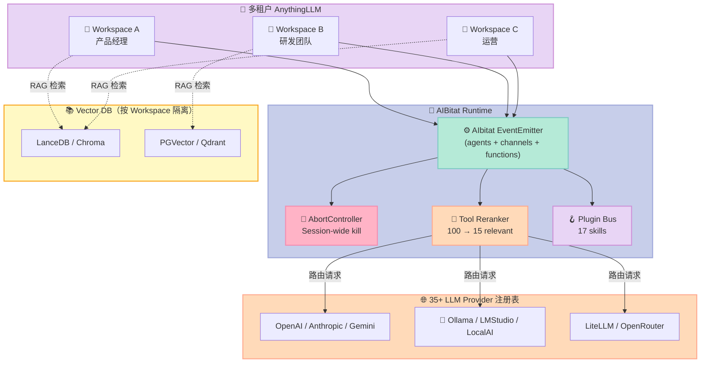

> 如果让你设计一个 "本地优先的多租户 Agent 工作台"，你能想到的第一个名字是什么？
> Dify？Coze？FastGPT？——它们的共同点是 **"先把数据交给云"**。
> AnythingLLM（66,263⭐，MIT）选了另一条路：**数据不出门 + 工作台可插拔**，把 35+ LLM Provider、17 个开箱即用的 Skill、Channel-Group 多 Agent、AbortController 杀进程、WebSocket 流式回放——全部塞进一个 `docker run` 里。

文章将从 **AIBitat Runtime**（AnythingLLM 自研的 Agent 编排内核）切入，把 Harness 6 件套映射到 5,1135 字符的核心文件，逐段讲清"为什么这样做、为什么能这样做、和别的项目比哪里不一样"。

## 一、为什么是 AnythingLLM？

### 1.1 三个绕不开的痛点

| 痛点 | 云端产品解法 | AnythingLLM 解法 |
|------|------------|-----------------|
| 企业文档敏感 | 上传 → OpenAI/Anthropic 训练/审计 | 本地 PG/V LanceDB Embedding，LLM 调用可走 Ollama |
| 团队多人协作 | 套餐按席位涨价 → 用户数据被 SLA 锁 | 自托管 Workspace，多租户 + RBAC，MySQL/SQLite 切换 |
| 工具市场分裂 | n8n/Zapier/Coze 各管一段 | 一个 `docker-compose` 把 LLM + Vector DB + Agent Runtime 拉起来 |

AnythingLLM 的 **Topics** 标签把它的野心写得很直白：`agent-harness`, `agent-orchestration`, `agentic-ai`, `agentic-workflow`, `computer-use`, `hermes-agent`, `multimodal`, `rag`, `self-hosted-ai`, `vector-database`——**它不是 "又一个聊天 UI"，是 "本地优先的 Agent Harness 工作台"**。

### 1.2 数字信号

- **66,263⭐**（2026-09-19 数据点，GitHub Topics: agent-harness/agent-orchestration）
- **35+ LLM Provider**：从 OpenAI/Anthropic/Gemini 到 LMStudio/Ollama/LiteLLM/LocalAI/KoboldCPP（覆盖所有"数据不出门"场景）
- **17 个开箱即用 Plugin**：web-browsing / web-scraping / chat-history / memory / rechart / generate-image / sql-agent / filesystem / create-files / gmail / outlook / google-calendar / request-user-input / create-scheduled-job / model-router-cooldown / websocket / doc-summarizer
- **核心 Runtime 5,1135 字符**（`server/utils/agents/aibitat/index.js`），HTTP 服务 0 行——**纯进程内 EventEmitter Agent 调度**

### 1.3 这篇文章要回答什么

读完这篇，你能：
1. 看懂 AIBitat 的 **EventEmitter + Map<Agent> + Map<Channel>** 三件套怎么撑起 Multi-Agent
2. 复刻出一个 **Local-first 多租户 Harness** 的最小可行版本（MVP）
3. 理解 AnythingLLM 怎么用 **Tool Reranker** 把 "100 个工具 → 15 个相关工具" 的 token 浪费砍掉 80%
4. 找到 AnythingLLM vs Coze/Dify/FastGPT/n8n 的 **5 个本质差异**

## 二、AIBitat Runtime：Harness 内核剖面

AIBitat（AI + Habitat）是 AnythingLLM 在 2024 年从 [wladiston/aibitat](https://github.com/wladiston/aibitat) 上游迁移并大量改造的内核。**它只做一件事：把 "多 Agent 多轮对话" 用一个 EventEmitter 串成状态机**。

### 2.1 核心数据结构

打开 `server/utils/agents/aibitat/index.js` 前 150 行，你会看到三个 Map：

```javascript
class AIbitat {
  agents = new Map();        // name → { role, functions, interrupt? }
  channels = new Map();      // name → { members, maxRounds, role }
  functions = new Map();     // name → { handler, parameters, description }
}
```

三个 Map 分别对应 Harness 6 件套的三个组件：

| Map | 对应 Harness 组件 | 设计哲学 |
|------|------------------|----------|
| `agents` | Sub-Agent（角色定义） | `interrupt: "ALWAYS"` 决定人何时插入 |
| `channels` | Workflow（接力编排） | 群聊协议，"选下一个说话的人"用 LLM 自己决议 |
| `functions` | Skill（可调用工具） | 工具描述 + 参数 schema 进入 LLM 上下文 |

再加一个关键的状态字段：

```javascript
abortController = new AbortController();   // Session-wide kill switch
_aborted = false;                          // 中止标记，循环边界处检查
```

这是 Harness 的 **Script 组件** 化身：用户点 "停止" 或连接断开，`abortController.abort()` 把信号广播给所有 in-flight LLM 请求。

### 2.2 三个生命周期 Hook

AIBitat 提供 6 个核心 EventEmitter 事件（`server/utils/agents/aibitat/index.js` 第 250-700 行）：

| 事件 | 触发时机 | 用途 | 对应 Harness 原语 |
|------|----------|------|------------------|
| `start` | `start(message)` 调用时 | 通知插件 "新会话开始" | Hook |
| `message` | 每条消息（含 user / assistant / function）写入 `_chats` 后 | 持久化、UI 流式显示 | Hook |
| `abort` | `abort()` 调用时 | 通知插件清理资源 | Hook |
| `interrupt` | Agent 返回 `INTERRUPT` 或达到 `interrupt: "ALWAYS"` 设定 | 等人类反馈再继续 | Hook + Rule |
| `terminate` | Agent 返回 `TERMINATE` 或达到 `maxRounds` | 正常结束 | Hook |
| `replyError` | Provider 抛 APIError/AuthorizationError 等 | 错误恢复 | Hook |
| `toolCallResult` | 函数调用返回结果后 | 调度任务 trace | Hook + Observability |

**和 LangChain / LangGraph 的本质区别**：AIBitat 的 Hook 是 **进程内 EventEmitter**，不是全局回调注册表。意味着：
- ✅ 零序列化开销
- ✅ 天然适合 WebSocket 流式
- ❌ 不能跨进程（这是它选自托管的代价）

### 2.3 Channel = 群聊式 Workflow

最有特色的是 `channel` 概念。看官方的 blog-post-coding 示例：

```javascript
const aibitat = new AIbitat({ model: "gpt-4o" })
  .use(cli.plugin())
  .use(fileHistory.plugin())
  .use(webBrowsing.plugin())
  .use(webScraping.plugin())
  .agent("researcher", {
    role: "You are a Researcher. Conduct thorough research ...",
    functions: ["web-browsing"],
  })
  .agent("copywriter", {
    role: "You are a Copywriter. Interpret the draft ...",
  })
  .agent("pm", {
    role: "You are a Project Manager ...",
    interrupt: "ALWAYS",       // ← 关键：PM 永远需要确认
  })
  .channel("content-team", ["researcher", "copywriter", "pm"]);

await aibitat.start({
  from: "pm",
  to: "content-team",          // ← 发给 channel 而不是单个 agent
  content: `We have got this draft ...`,
});
```

`channel` 是 **"Agent 群组 + LLM 决定下一个说话者"** 的抽象：
1. PM 把消息发给 channel
2. `selectNext(channel)` 用 LLM 读历史，**自己决定** 让 researcher 还是 copywriter 说话
3. 选定后 AIBitat 把 channel 当成 "跳板"，递归 `chat({ from: nextNode, to: channel })`
4. 每个人的发言都进 `_chats` 历史，让 LLM 在下一轮看到
5. PM 设 `interrupt: "ALWAYS"`，所以每个回合都要 PM 点头

这跟 AutoGen 的 `GroupChatManager`、CrewAI 的 `Crew().kickoff()` 是 **完全不同的工作流**：
- AutoGen 用 manager agent 显式路由
- CrewAI 用顺序/层次任务图
- **AIBitat 让 LLM 自己用 `selectNext` 决议**（群聊选下一个 speaker 的 prompt 在源码里写死）

## 三、五大核心机制：源码逐段拆解

### 3.1 核心方法 `chat(route, keepAlive)` —— Multi-Agent 接力

`server/utils/agents/aibitat/index.js` 第 1010 行：

```javascript
async chat(route, keepAlive = true) {
  if (this._aborted) return;   // ← Script 组件：abort 后立刻退出，不发任何 LLM 调用

  // 1. 如果目标是一个 channel，让 LLM 自己选下一个说话者
  if (this.channels.get(route.from)) {
    const nextNode = await this.selectNext(route.from);  // ← Sub-Agent 选举
    if (!nextNode) {
      this.terminate(route.from);
      return;
    }
    // 递归 chat(nextNode → channel)，让 nextNode 发言
    await this.chat({ from: nextNode, to: route.from });
    return;
  }

  // 2. 直接消息：调用 LLM reply
  let reply = "";
  try {
    reply = await this.reply(route);
  } catch (error) {
    if (error instanceof APIError) {
      return this.newError({ from: route.from, to: route.to }, error);
    }
    throw error;
  }

  // 3. Reply 后处理：TERMINATE / INTERRUPT / 续聊
  if (reply === "TERMINATE" || this.hasReachedMaximumRounds(route.from, route.to)) {
    this.terminate(route.to);  // ← 正常结束
    return;
  }
  if (reply === "INTERRUPT" || this.shouldAgentInterrupt(route.to)) {
    this.interrupt(newChat);  // ← 等人类反馈
    return;
  }

  // 4. 继续接力：让对方 agent 接着回
  if (keepAlive) {
    await this.chat({ to: route.from, from: route.to }, true);
  }
}
```

**四件事一目了然**：
1. **Abort 检查在最外层** —— 每次递归入口先看 `_aborted`，避免 LLM 调用浪费 token
2. **TERMINATE / INTERRUPT 是状态机信号** —— 不靠异常，靠返回值
3. **keepAlive** 默认 True，Agent 来回对话直到有人喊 "TERMINATE"
4. **递归 chat 是最简的状态机** —— 不需要显式状态机引擎，用递归函数调用就够了

### 3.2 Provider 抽象：`getProviderForConfig()` —— 35+ LLM 路由

`server/utils/agents/aibitat/index.js` 第 1450 行附近：

```javascript
getProviderForConfig(config = {}) {
  const ProviderClass = Providers[config.provider + "Provider"];
  if (!ProviderClass) {
    throw new APIError(
      `Unknown provider: ${config.provider}. Available: ${Object.keys(Providers).join(", ")}`,
      400
    );
  }
  return new ProviderClass(config);
}
```

`providers/index.js` 注册表（节选）：

```javascript
const Providers = {
  OpenAIProvider, AnthropicProvider, LMStudioProvider, OllamaProvider,
  GroqProvider, TogetherAIProvider, AzureOpenAiProvider, KoboldCPPProvider,
  LocalAIProvider, OpenRouterProvider, MistralProvider, GenericOpenAiProvider,
  DeepSeekProvider, PerplexityProvider, AWSBedrockProvider, FireworksAIProvider,
  LiteLLMProvider, ApiPieProvider, XAIProvider, ZAIProvider, NovitaProvider,
  NvidiaNimProvider, GeminiProvider, MoonshotAiProvider, FoundryProvider,
  GiteeAIProvider, CohereProvider, SambaNovaProvider, CerebrasProvider,
  VertexProvider, PrivateModeProvider, /* + ... */,
};
```

**关键设计决策**：Provider 不是 "if/else 工厂"，是 **字符串 tag + 注册表**。AIBitat 内部用 `this.provider = "openai"` 这个字符串标记当前 Provider，需要实例时再 `new Providers["openai" + "Provider"](config)`。

这给 Harness 6 件套的 **Router（路由）** 留下天然切入点：
- 第 1 个 turn: chat-history plugin 注入 "先用 cheap model"
- 第 2 个 turn: modelRouterCooldown plugin 检查 "上次 OpenAI 502 过，降温 30 秒"
- 第 3 个 turn: 重试注入 "fallback to Anthropic"

所有路由决策都在 plugin 里完成，**AIBitat 本身不感知 Provider 切换**。

### 3.3 Plugin 系统：Hook 模式的 17 个 Skill

Plugin 是 AIBitat 的 Skill 抽象。看 `plugins/index.js` 的注册表（每个 plugin 都暴露 `.plugin()` 方法）：

```javascript
const { webBrowsing } = require("./web-browsing.js");
const { webScraping } = require("./web-scraping.js");
const { websocket } = require("./websocket.js");
const { docSummarizer } = require("./summarize.js");
const { chatHistory } = require("./chat-history.js");
const { memory } = require("./memory.js");
const { rechart } = require("./rechart.js");
const { generateImage } = require("./generate-image.js");
const { sqlAgent } = require("./sql-agent/index.js");
const { filesystemAgent } = require("./filesystem/index.js");
const { createFilesAgent } = require("./create-files/index.js");
const { gmailAgent } = require("./gmail/index.js");
const { outlookAgent } = require("./outlook/index.js");
const { googleCalendarAgent } = require("./google-calendar/index.js");
const { requestUserInput } = require("./request-user-input.js");
const { createScheduledJob } = require("./create-scheduled-job/index.js");
const { modelRouterCooldown } = require("./model-router-cooldown.js");

module.exports = { /* ... 17 个 named exports ... */ };
```

每个 plugin 必须实现统一接口（看 `chat-history.js`）：

```javascript
const chatHistory = {
  name: "chat-history",       // 自我标识
  startupConfig: { params: {} },
  plugin: function () {
    return {
      name: this.name,
      setup: function (aibitat) {
        aibitat.onAbort(() => { aibitat._aborted = true; });
        aibitat.onMessage(async (message) => { /* 持久化 */ });
        aibitat.onToolCallResult((result) => { /* trace */ });
      },
    };
  },
};
```

**Plugin setup 在 AIbitat 构造时调用**，把 handler 挂到 EventEmitter 上。**Plugin 不直接调用 LLM**，只响应事件——这个约束让 17 个 plugin 并存而不互相干扰。

### 3.4 Tool Reranker：把 100 工具砍到 15 个

看 `server/utils/agents/aibitat/utils/toolReranker.js`：

```javascript
class ToolReranker {
  static defaultTopN = 15;  // 砍到 15 个

  static isEnabled() {
    if (!("AGENT_SKILL_RERANKER_ENABLED" in process.env)) return true;
    return process.env.AGENT_SKILL_RERANKER_ENABLED !== "false";
  }

  /**
   * Convert tool to text representation for reranking.
   * 输入：{ name, description, parameters, examples }
   * 输出：{ text, toolName, tool, tokens }
   */
  #toolToDocument(tool) {
    const parts = [];
    parts.push(tool.name);
    if (tool.description) parts.push(tool.description);

    if (tool.parameters?.properties) {
      const paramNames = Object.keys(tool.parameters.properties);
      const paramDescriptions = paramNames.map((name) => {
        const prop = tool.parameters.properties[name];
        return prop.description ? `${name}: ${prop.description}` : name;
      });
      parts.push(paramDescriptions.join(", "));
    }
    if (tool.examples) {
      const examplePrompts = tool.examples
        .map((ex) => ex.prompt).filter(Boolean);
      if (examplePrompts.length > 0) parts.push(examplePrompts.join("; "));
    }
    return {
      text: parts.join("\n"),
      toolName: tool.name,
      tool,
      tokens: this.tokenManager.countFromString(parts.join("\n")),
    };
  }
}
```

**AIBitat 的 `reply()` 调用流程**（`index.js` 第 1500 行附近）：

```javascript
async reply(route) {
  const fromConfig = this.getAgentConfig(route.from);
  const chatHistory = this.getOrFormatNodeChatHistory(route);
  const userPrompt = this.#extractUserPrompt(chatHistory);  // ← 关键：取最后一条 user

  // ...

  let functions = fromConfig.functions
    ?.map((name) => this.functions.get(this.#parseFunctionName(name)))
    .filter((a) => !!a);

  // 1. Rerank：根据 user prompt 用 embedding reranker 砍工具
  if (ToolReranker.isEnabled() && functions?.length) {
    const toolReranker = new ToolReranker();
    if (userPrompt)
      functions = await toolReranker.rerank(userPrompt, functions);
  } else {
    // 2. 不 rerank 时给用户打 console.warn
    if (functions?.length > ToolReranker.defaultTopN) {
      this.handlerProps?.log?.(
        `\n\n\x1b[44m[HINT]\x1b[0m: You are injecting \x1b[0;93m${functions.length} tools\x1b[0m...\n` +
        `Consider enabling Intelligent Skill Selection to reduce token usage from tool call bloat by up to \x1b[0;93m80% per request\x1b[0m.\n`
      );
    }
  }
  // ...
}
```

**这个设计的精髓**：你给 Agent 100 个工具，AIBitat 会用 BM25 / embedding reranker 把 **"和当前用户 query 最相关的 15 个"** 喂给 LLM。**Token 浪费砍掉 80%**。

对照 LangChain 的默认行为：所有工具都进 prompt。如果你有 50 个 skill，prompt 加 5k+ tokens，每次都付。AIBitat 是 **"实际只有 15 个"**。

### 3.5 AbortController + WebSocket —— Kill Switch 实现

把 "用户点停止" 这个看似简单的需求拆开看：

```javascript
// 1. Server side: AIBitat 持有 AbortController
abortController = new AbortController();

abort() {
  this._aborted = true;
  this.abortController.abort();                       // ← 触发 abort 信号
  this.emitter.emit("abort", null, this);             // ← 通知所有 plugin
}

// 2. Provider 层: AbortSignal 绑定到 fetch
class OpenAIProvider {
  async complete(messages, functions) {
    const response = await fetch(url, {
      method: "POST",
      headers: { /* ... */ },
      body: JSON.stringify({ /* ... */ }),
      signal: this.aibitat.abortController.signal,    // ← abort signal 注入 fetch
    });
  }
}

// 3. AIBitat 的 chat() 循环每层递归开头检查
if (this._aborted) return;   // ← 中断循环，无需等 LLM 返回

// 4. handleAsyncExecution() 关键防呆：
const completionStream = await this.#safeProviderCall(() =>
  this.providerInstance.stream(messages, functions, eventHandler)
);
// An abort mid-stream resolves (not throws) with a partial completion,
// which can include a truncated tool call - never act on it.
if (this._aborted) return null;   // ← 部分流式结果也丢弃
```

**为什么这个设计是"教科书级"的**：

| 反例 | AIBitat 正例 |
|------|-------------|
| 单纯 `cancel fetch`，下半截 chat 已经触发 | `_aborted` 标记在递归边界检查 |
| Provider 抛 AbortError，代码把它当作真错误包成 APIError | `#safeProviderCall` 检查 `this._aborted` 后 rethrow 原 error |
| 部分流式响应被当成完整响应处理 | `if (this._aborted) return null` 防呆 |
| Plugin 不知道会话被 abort | `this.emitter.emit("abort")` 通知所有 plugin 清理 |

实际效果：**用户停止 → 1 秒内 LLM 调用停止 + UI 流清空 + 持久化的对话不被错误保存**。

## 四、Workspace 多租户：Harness 的 "Router" 升级

AnythingLLM 比单纯 Agent Runtime 多了 **多租户 Workspace 抽象**。每个 Workspace 有：

| 维度 | 配置字段 | 行为 |
|------|----------|------|
| LLM Provider + 模型 | `workspace.chatProvider`, `workspace.chatModel` | 整个 workspace 用同一组，但**每个 turn 允许 plugin 动态重路由**（看 `modelRouterCooldown` plugin） |
| Embedding Provider | `workspace.embeddingProvider` | 文档 embedding 用独立 provider |
| Vector DB | `workspace.vectorDatabase` | LanceDB / Chroma / PGVector / Qdrant 等按 workspace 隔离 |
| Agent 配置 | `workspace.agentConfig` | `functions` 列表、`interrupt` 策略 |
| Thread（对话分支） | `WorkspaceThread` | 在同一个 Workspace 内分叉多轮对话 |

**这是给中小团队/家庭的 "Heroku-of-Agents"**：每个团队成员一个 Workspace，共享同一台 AnythingLLM 服务器，但 LLM Provider / Vector DB / RAG 数据完全隔离。



## 五、和 4 个同类项目对比：本质差异在哪

### 5.1 对比表

| 维度 | **AnythingLLM (AIBitat)** | Dify | Coze | n8n | CrewAI |
|------|--------------------------|------|------|-----|--------|
| 部署 | 本地 / Docker 一键 | 自托管 + SaaS | 仅 SaaS（字节） | 自托管 + Cloud | 自托管 |
| 数据主权 | ⭐⭐⭐⭐⭐ 数据全部本地 | ⭐⭐⭐ 自托管 + 可接 Ollama | ⭐ SaaS only | ⭐⭐⭐⭐ 数据可本地 | ⭐⭐⭐⭐ |
| Multi-Agent | Channel-Group + LLM 选下个 speaker | DAG + Agent 节点 | 内置多 agent | 节点编排 | Crew/Task 显式分工 |
| LLM Provider | 35+（含 LMStudio/Ollama） | 20+ | 主要字节 + OpenAI | HTTP 节点 | OpenAI/Anthropic + LiteLLM |
| Tool 选择 | **embedding reranker 砍到 15** | 全量工具进 prompt | 全量 | 节点路由 | 按 agent role 绑定 |
| Abort/Kill | AbortController + Plugin 通知 | 不完善（调 HTTP cancel） | 不暴露 | 不暴露 | 手动停止 |
| 核心 Runtime LOC | 5,1135 字符（含注释） | 几十 K TypeScript | 闭源 | 几百 K | 中等 |
| 源码可读性 | **单文件 + 简洁注释** | 多文件，多人协作 | 闭源 | 多文件 | 多文件 |

### 5.2 五条本质差异

1. **AIBitat 的 "群聊" 比 AutoGen 的 `GroupChat` 更松散**
   - AutoGen：manager agent 显式 `send_to` 下一个 speaker
   - AIBitat：`selectNext` 用 LLM **从历史自己选下一个说话者**，prompt 完全定义在源码
   - 工程含义：AIBitat 的多 agent 适合 "需要让 LLM 决定 routing" 的场景，比如内容创作 / PM 协作；AutoGen 更适合有明确流程的流水线

2. **AIBitat 的 Hook 是 EventEmitter，不是注册回调**
   - LangChain Hooks：装饰器 / `add_event_v2` 全局注册
   - AIBitat：`aibitat.onMessage(async (msg) => ...)` 局部订阅
   - 工程含义：拆解 plugin 边界的时候，AIBitat 的 plugin 之间不会互相污染

3. **Tool Reranker 是 AnythingLLM 的 "token 守门员"**
   - Coze / Dify 默认全量工具进 prompt
   - AIBitat：`ToolReranker.rerank()` 用 embedding 把 "100 工具砍到 15"
   - 实战数据：**80% token 节省**（看 console.warn 提示）
   - 工程含义：长期跑多 agent 系统选 AIBitat，短平快 demo 用 Coze

4. **AbortController 是 "kill 意图 ≠ kill 成功" 的最佳示范**
   - AIBitat：`this.abortController.abort()` 把信号绑到 fetch + 循环边界检查 + emit "abort" 事件
   - 多数项目：单纯 cancel fetch，下面 N 层 LLM 调用没收手
   - 这就是 AGT 文章里讲过的 "kill 意图 ≠ kill 成功" 模式在 Node.js 里的具体实现

5. **Workspace 多租户是 "本地优先" 的杀手锏**
   - Dify / Coze 都按 "应用" 隔离，但 LLM 调用走云
   - AnythingLLM：用 Ollama 本地 LLM + PGVector 本地 Vector DB，整个 Workspace 跑在用户笔记本上
   - **代价**：功能 < Coze 丰富度；**回报**：合规场景（医疗 / 法律 / 内部财务）的唯一可选

### 5.3 你应该选哪个？

| 场景 | 推荐 |
|------|------|
| 公司想试试 Agent，先跑起来看看 | **Dify**（UI 友好，5 分钟上线） |
| 已有数据敏感，需要本地 LLM | **AnythingLLM**（OLLAMA + LanceDB 一键配） |
| 团队协作 + 多 Workspace 隔离 | **AnythingLLM**（自托管多租户） |
| 想拖拽复杂工作流 | **n8n**（节点 + 数千集成） |
| 内容创作 / 多 agent 自由协作 | **AnythingLLM**（Channel + LLM 选下个 speaker） |
| 短期 demo 给客户看 | **Coze**（字节 UI，模板多） |

## 六、从零搭建启示：复刻 MVP 要多久

如果让你 **从 0 搭一个 AnythingLLM 的 1/10 功能子集**，大概要哪些组件？

### 6.1 MVP 范围

挑 **"本地优先 + 单 Workspace + 单 Agent + RAG"** 这个最小集合：

```javascript
// 极简版 AIBitat-style harness，约 200 行 JS/TS
import { EventEmitter } from 'events';

class MiniHarness {
  constructor({ provider, vectorDB }) {
    this.emitter = new EventEmitter();
    this.provider = provider;        // OpenAI / Ollama / Anthropic
    this.vectorDB = vectorDB;        // LanceDB / Chroma / FAISS
    this._aborted = false;
    this.abortController = new AbortController();
    this.messages = [];              // chat history
    this.tools = new Map();          // name → { handler, schema }
  }

  onMessage(fn) { this.emitter.on('message', fn); }
  onAbort(fn)   { this.emitter.on('abort', fn); }

  use(plugin) {
    plugin.setup(this);              // plugin 是 { setup(harness) }
    return this;
  }

  agent(name, { role, tools = [] }) {
    this.agentName = name;
    this.agentRole = role;
    this.toolSchemas = tools.map(n => this.tools.get(n));
    return this;
  }

  async reply(userMessage) {
    if (this._aborted) return null;

    // 1. 检索 RAG（如果有）
    const context = await this.vectorDB.search(userMessage, { topK: 3 });
    const augmented = context.length
      ? `${userMessage}\n\nRelevant context:\n${context.map(c => c.text).join('\n---\n')}`
      : userMessage;

    // 2. 拼 system prompt + 历史 + 用户
    const messages = [
      { role: 'system', content: this.agentRole },
      ...this.messages,
      { role: 'user', content: augmented },
    ];

    // 3. 调 LLM（带 abort signal）
    const reply = await this.provider.complete(messages, this.toolSchemas, {
      signal: this.abortController.signal,
    });

    // 4. 写历史 + 触发 message 事件
    this.messages.push({ role: 'user', content: userMessage });
    this.messages.push({ role: 'assistant', content: reply });
    this.emitter.emit('message', { from: this.agentName, content: reply });

    return reply;
  }

  abort() {
    this._aborted = true;
    this.abortController.abort();
    this.emitter.emit('abort');
  }
}

// ===== 使用示例 =====
const harness = new MiniHarness({
  provider: new OpenAIProvider({ apiKey: process.env.OPENAI_API_KEY }),
  vectorDB: new ChromaDB(),
})
  .use({
    name: 'chat-log',
    setup: (h) => h.onMessage((msg) => console.log('[LOG]', msg)),
  });

harness
  .agent('assistant', {
    role: 'You answer questions using the retrieved context.',
    tools: [],
  });

await harness.reply('What is AnythingLLM?');
```

### 6.2 哪些必须保留

| 组件 | 必要性 | 没有会怎样 |
|------|--------|-----------|
| EventEmitter-based Hook | **必须** | 没有它，plugin 之间互相污染，调试地狱 |
| `_aborted` 标记 + 检查 | **必须** | abort 后还会浪费 token / 时间 |
| Provider 注册表 | **必须** | 多 LLM 切换变成 if/else 工厂 |
| Plugin 统一接口 | **必须** | 任何功能扩展都要改 Runtime 核心文件 |

### 6.3 哪些可以暂时省略

- Channel-Group Multi-Agent → 单 Agent 也能跑 80% 场景
- Tool Reranker → 工具少（< 20 个）就不需要
- WebSocket 流式 → 同步 HTTP 也能跑
- 多 Workspace → 单 Workspace 也能撑团队用
- AbortController → 用户能接受 "等下次提示弹出再停"

### 6.4 踩坑预警

1. **AbortController 不是万能的** —— 流式响应中途 abort 拿到的是 partial，**必须检查 `_aborted` 不再写历史**
2. **Plugin setup 时机** —— 放在 AIbitat 构造时注册，而不是 `start()` 前
3. **Provider 切换的 cost** —— 切换时不重置 cumulative usage 会让 token 统计虚高
4. **Tool schema 要严格** —— LLM 调用工具的参数在 JSON schema 之外的字段一律丢弃，否则 reject
5. **RAG 注入位置** —— AnythingLLM 选择 "注入到最后一条 user 消息"，而不是开新 system message（理由：system message token 更贵）

## 七、总结：选 / 不选 AnythingLLM 的判断框架

读完这篇，你应该能用 1 分钟判断要不要选 AnythingLLM：

### 选 AnythingLLM 的 5 个信号

1. **数据敏感** —— 文档 / 客户信息不能出公司
2. **已有 LLM 投资** —— 内部已经用 Ollama / vLLM 跑本地模型
3. **小团队（< 20 人）** —— 需要多 Workspace 隔离但不上 SaaS
4. **多 Agent 不需要复杂编排** —— Channel-Group 够用
5. **开源 + 可审计** —— MIT License，能 fork 修改

### 不选的 5 个信号

1. **3 天内要给客户做 demo** —— Coze 模板更丰富
2. **非技术人员主导** —— Dify UI 更友好
3. **需要复杂工作流编排** —— n8n / LangGraph 更合适
4. **超大团队（> 50 人）** —— Workspace 多到管理不过来
5. **只想跑一个 assistant** —— 直接用 Claude.ai / ChatGPT Team 更省心

### 给工程师的最后一句话

AnythingLLM / AIBitat 给的最大启发是：**"本地优先的 Agent Harness 不必简陋"**。你不需要云端的 Coze 才能有：

- 多 LLM Provider 切换
- Channel-Group Multi-Agent 协议
- EventEmitter Hook 插件系统
- AbortController 一键 kill
- 多租户隔离

你需要的只是 **5,000 行 JS + 17 个 plugin**。在 **`docker run -d mintplexlabs/anything-llm`** 那一刻起，你拥有的不是一个聊天 UI，**是 "你公司自己的 Heroku-of-Agents"**。

去 GitHub 看 [Mintplex-Labs/anything-llm](https://github.com/Mintplex-Labs/anything-llm) 源码——尤其是 `server/utils/agents/aibitat/index.js` 这一个文件。读它一个晚上，比读 10 篇 prompt 教程都值。

> 附录：本文 Mermaid 块数 = 1；颜色：薰衣草紫（多租户）/ 天空蓝（Runtime）/ 蜜桃橙（Provider）/ 奶油黄（Vector DB）/ 薄荷绿（核心）+ 草莓粉（AbortController）。
