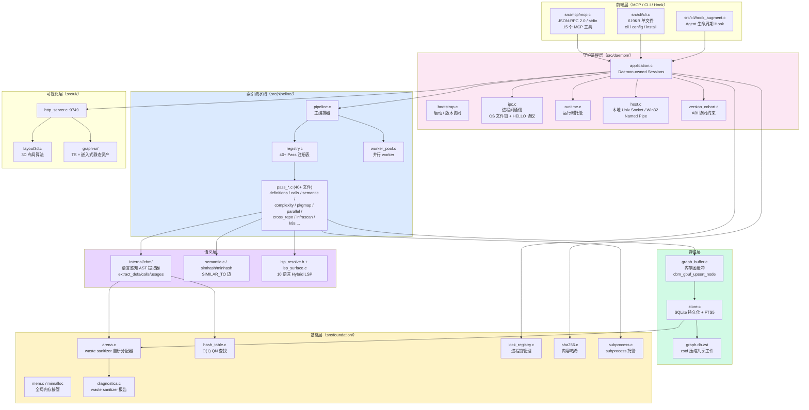
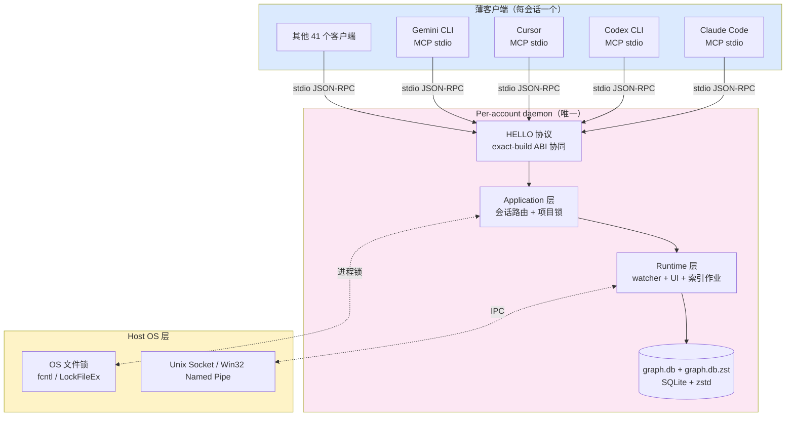
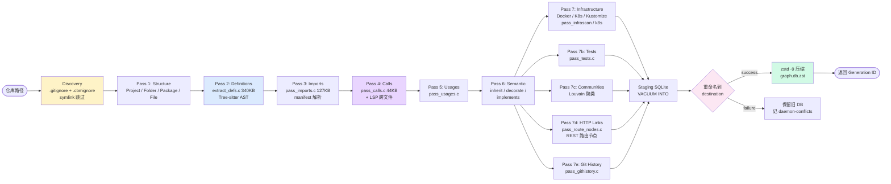
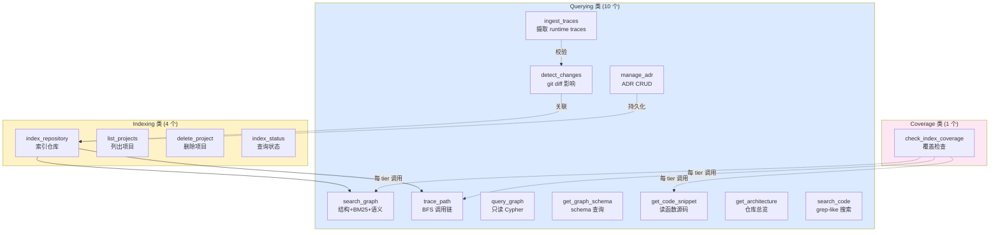
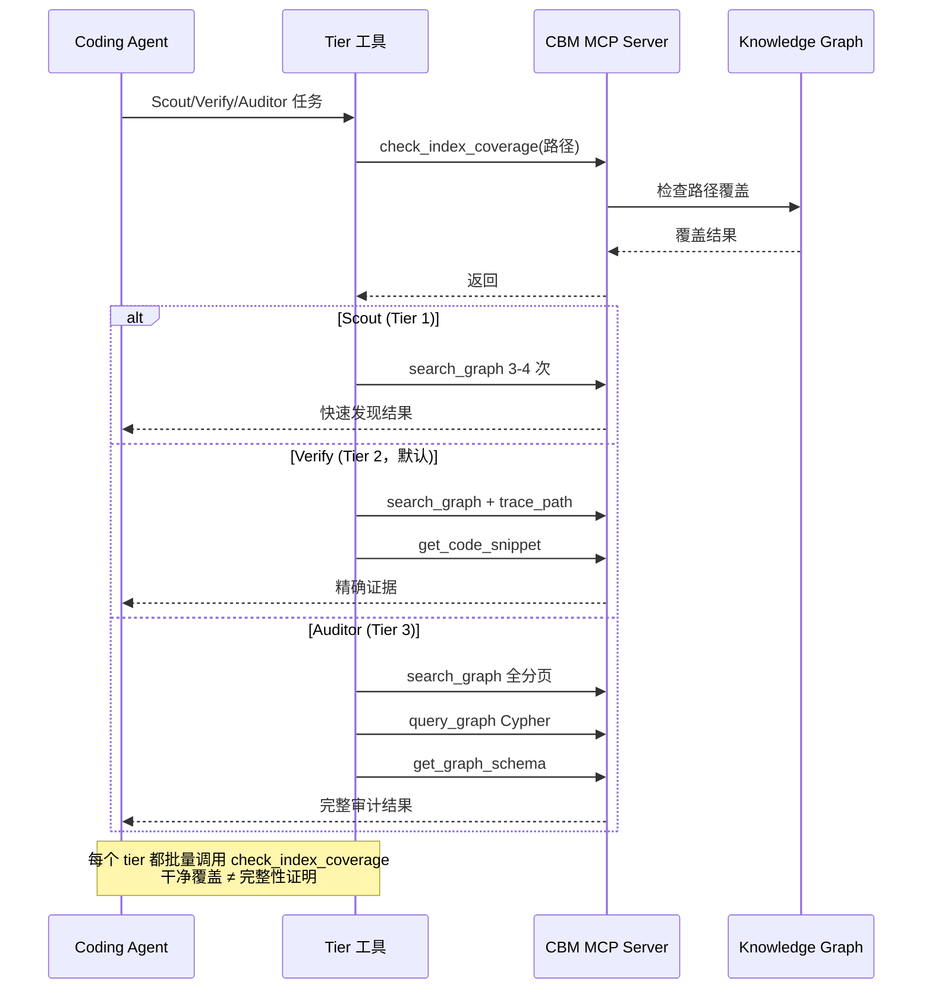

## 一、引子：当代码知识图谱遇上 Coding Agent

2026 年的 AI 编码 Agent 已经学会了一个新本能：先把整个项目"读"成结构化知识，再开始改代码。但"读"这件事，传统做法是逐文件 `cat` + 嵌入检索（Embeddings），**150K token 起步**——这对 28M LOC 的 Linux 内核来说是不可想象的。

而 `DeusData/codebase-memory-mcp`（仓库地址 `github.com/DeusData/codebase-memory-mcp`，下文简称 **CBM**）做了一件反直觉的事：**用 C 写**一个 MCP（Model Context Protocol）服务器，把整个代码仓库先编译成一张持久化知识图谱，再以 MCP 工具的形式暴露给 AI Agent。

关键数字震撼：

- ⭐ **43,910** Star · 🍴 3,578 Fork · MIT License
- 📦 **单一原生二进制**（macOS / Linux / Windows 全平台）
- 🌍 支持 **162 种语言**（全部 Tree-sitter 语法 vendored 进二进制）
- 🛠️ **15 个 MCP 工具**：`search_graph` / `trace_path` / `detect_changes` / `query_graph` / `get_code_snippet` / `get_architecture` 等
- 🤖 自动配置 **45 种 Coding Agent 客户端**（Claude Code / Codex / Cursor / Gemini CLI / Aider / Cline / OpenHands …）
- ⚡ **3 分钟索引完 Linux 内核**（28M LOC / 75K 文件）—— 平均仓库只需**毫秒级**
- 🔬 arXiv 2603.27277 论文支撑，OpenSSF Scorecard + SLSA Level 3 + Sigstore cosign 全链路签名
- 🧪 **8,050 个测试通过**（README 自报）

它的核心哲学只有一句话：**「Codebase as a persistent in-RAM knowledge graph, not as a stream of token chunks」**。本篇博客就围绕 CBM 的源码与 README，把这背后的架构、机制和工程取舍讲清楚。

## 二、项目定位与核心价值

### 2.1 它要解决的问题

传统的 Coding Agent 在面对大型代码仓库时，必须在两种痛苦中选一个：

| 方案 | 优点 | 痛点 |
|------|------|------|
| **逐文件 Read + 嵌入检索** | 实时、无前置成本 | 5 次查询 ≈ 412,000 token（README 实测），Agent 上下文爆炸 |
| **传统 RAG + 向量库** | 语义召回 | 召回粒度是 chunk，不是 function；缺乏调用链 / 跨文件类型 |

CBM 选择第三条路：**先把整个仓库构建成可查询的持久知识图谱**——节点（Function / Class / Route / Resource） + 边（CALLS / IMPORTS / DATA_FLOWS / HTTP_CALLS），然后通过 15 个细粒度 MCP 工具让 Agent 直接以"函数 / 调用链 / 影响范围"为单位提问。

### 2.2 一句话定义

> **CBM 是一个原生 C 实现的 MCP 服务器：它把代码仓库变成一张持久化、可查询的知识图谱，让 AI 编码 Agent 每次提问只需消耗 ~3,400 token（120 倍减少）。**

### 2.3 仓库统计（截至 2026-09-21）

| 指标 | 值 |
|------|----|
| ⭐ Stargazers | 43,910 |
| 🍴 Forks | 3,578 |
| 📦 仓库大小 | 288 MB（含 162 语言 Tree-sitter 语法） |
| 🗂️ 文件总数 | 2,700+ 节点 |
| 🌐 支持语言 | 162（Tree-sitter 语法全部 vendored） |
| 🛠️ MCP 工具数 | 15 |
| 🤖 Agent 适配数 | 45（39 自动 + 6 条件） |
| 🔧 主要语言 | **C**（867 .c + 707 .h）+ TypeScript（graph-ui） |
| 📜 License | MIT |
| 📅 最近推送 | 2026-09-20 |
| 📅 创立 | 2025-02-24 |
| 📰 论文 | arXiv:2603.27277 |
| 🔒 安全 | OpenSSF Scorecard + SLSA L3 + Sigstore cosign + VirusTotal 扫描 |

### 2.4 四大核心价值主张

1. **极致索引速度**：RAM-first 流水线（LZ4 压缩 + 内存 SQLite + 融合 Aho-Corasick），索引完成后内存释放。
2. **Plug and Play**：下载 → `install` → 重启 Agent → 完成。**无 Docker / 无语言运行时 / 无 API Key**。
3. **Hybrid LSP**：为 10 种主流语言（Python / TypeScript / JSX / TSX / PHP / C# / Go / C / C++ / Java / Kotlin / Rust / Perl）做了**轻量级 C 版类型解析器**——参数绑定、返回类型推断、泛型替换、JSX 组件派发、JSDoc 推断、PHP namespace/trait/late-static-binding、C# file-scoped namespace/records/LINQ、Java 类层级/重载/lambda、Kotlin extension-function/scope-function、Rust trait-method/UFCS。
4. **持久化共享工件**：`.codebase-memory/graph.db.zst`（zstd 压缩 SQLite 快照）可提交到 Git，团队克隆后只需 incremental index，跳过全量重建。

## 三、整体架构：C 单一二进制 + 多进程 Daemon

### 3.1 顶层模块图



> 💡 **读图提示**：前端层是 thin client（仅做 JSON-RPC / 解析命令行）；真正的工作全部在 **per-account daemon**（`src/daemon/`）里完成；Pipeline 是数据生成器；Foundation 是把"原生 C 的内存噩梦"工程化的基础设施层。

### 3.2 一行启动：CLI 入口与 Mode 分发

CBM 的可执行入口是 `src/main.c`（149KB），它实现了**四种运行模式**：

```c
/*
 * main.c — Entry point for codebase-memory-mcp.
 *
 * Modes:
 *   (default)       Run as MCP server on stdin/stdout (JSON-RPC 2.0)
 *   cli <tool> <json>  Run a single tool call and print result
 *   --version       Print version and exit
 *   --help          Print usage and exit
 *   cli --quiet     Show errors only; disable automatic terminal progress
 *   cli --verbose   Include informational logs for one-shot commands
 *   --ui=true/false Enable/disable HTTP UI server (persisted)
 *   --port=N        Set HTTP UI port (persisted, default 9749)
 *   --tool-profile=analysis|scout  Expose a restricted agent tool surface
 *
 * Long-lived MCP and hook frontends are thin clients of one mandatory
 * per-account daemon. One-shot CLI tool calls run in an isolated local server
 * and never create or retain a daemon generation.
 */
```

注释里有一句关键设计：**「Long-lived MCP and hook frontends are thin clients of one mandatory per-account daemon」**。也就是说：

- MCP / Hook 是**薄客户端**，长连接，必须连到一个**共享的 per-account daemon**
- `cli <tool> <json>` 是**一次性本地服务器**，绝不创建 daemon generation
- 这就是为什么 CBM 可以让 5 个 Coding Agent 同时跑同一个项目而不互相打架

### 3.4 Daemon 进程模型



`src/daemon/version_cohort.c`（47KB）维护一个**全进程版本约束**：所有活跃的 CBM 进程必须跑**完全相同的版本 + 相同的可执行文件 build + 相同的 coordination ABI + 相同的 canonical cache root**。`CBM_CACHE_DIR` 别名会规约到同一根，**真正的不同根会被拒绝**（只要任一 CBM 进程活跃）。

冲突记录在 `${CBM_CACHE_DIR}/logs/daemon-conflicts.ndjson`：

| 文件 | 内容 |
|------|------|
| `cbm-daemon.log` | Daemon 生命周期、watcher / 索引 / UI / 资源 / 错误事件 |
| `daemon-conflicts.ndjson` | exact-build / coordination-ABI / cache-root 准入冲突 |
| `activation-events.ndjson` | install / update / uninstall 激活进度与结果 |

这等于**一个跨进程的状态机约束**：你无法在 daemon 还活跃时启动一个不同版本的 CBM，也无法在 daemon 还持有 lock 时清空 cache。这与早期 `gtime` 类工具的多实例竞态"幽灵数据库"问题形成鲜明对比。

## 四、Pipeline 索引流水线：Indexing as 7 Stages × 40+ Passes

### 4.1 七阶段总览

`src/pipeline/pipeline.h` 顶部注释清晰列出：

```c
/*
 * pipeline.h — Indexing pipeline orchestrator.
 *
 * Orchestrates multi-pass indexing of a repository:
 *   1. Structure: Project/Folder/Package/File nodes
 *   2. Definitions: Extract + write nodes + build registry
 *   3. Imports: Resolve import edges
 *   4. Calls: Call resolution (registry + LSP)
 *   5. Usages: Usage/type_ref edges
 *   6. Semantic: Inherits/decorates/implements
 *   7. Post: Tests, communities, HTTP links, config, git history
 */
```

但当你打开 `src/pipeline/`，会发现实际有 **40 多个独立 Pass**：

| 文件 | 职责 |
|------|------|
| `pass_calls.c` (44KB) | 调用解析（registry + LSP） |
| `pass_complexity.c` (10KB) | 圈复杂度 / Halstead-lite |
| `pass_configlink.c` (25KB) | 配置链接（package.json 字段 → 实际使用） |
| `pass_configures.c` (3KB) | CONFIGURES 边 |
| `pass_cross_repo.c` (53KB) | CROSS_* 跨仓库边 |
| `pass_definitions.c` (40KB) | 节点抽取 + 写库 |
| `pass_enrichment.c` (13KB) | 属性丰富 |
| `pass_ensemble_routing.c` (23KB) | 路由节点聚合 |
| `pass_envscan.c` (23KB) | 环境变量扫描 |
| `pass_gitdiff.c` (5KB) | git diff → 影响范围 |
| `pass_githistory.c` (18KB) | git 历史 → 演化路径 |
| `pass_importance.c` (22KB) | 节点重要度评分 |
| `pass_infrascan.c` (42KB) | 基础设施扫描（Docker / K8s / Kustomize） |
| `pass_k8s.c` (30KB) | K8s manifest 解析 |
| `pass_lsp_cross.c` (89KB) | 跨文件 LSP 类型解析 |
| `pass_pkgmap.c` (83KB) | package.json / go.mod / Cargo.toml … 解析 |
| `pass_route_nodes.c` (48KB) | REST 路由节点聚合 |
| `pass_semantic.c` (34KB) | SEMANTICALLY_RELATED 边 |
| `pass_semantic_edges.c` (80KB) | 语义边生成 |
| `pass_similarity.c` (13KB) | MinHash + LSH 近克隆检测 |
| `pass_tests.c` (10KB) | 测试覆盖关系 TESTS |
| `pass_usages.c` (16KB) | USAGE 边 |
| `pass_parallel.c` (188KB) | 并行调度（最大单文件） |
| `pass_ensemble_routing.c` (23KB) | 路由聚合 |

加上 `pipeline.c`（148KB，主调度器）、`pipeline_incremental.c`（125KB，增量重建）、`registry.c`（58KB，Pass 注册表）—— 这一块代码量比 LangChain + LlamaIndex **加起来还大**。

### 4.2 索引模式

```c
typedef enum {
    /* All modes run the LSP type-aware call/usage resolution (per-file +
     * cross-file). The mode only controls file discovery breadth and whether
     * SIMILAR_TO / SEMANTICALLY_RELATED edges are computed. */
    CBM_MODE_FULL = 0,     /* Full: everything including SIMILAR_TO + SEMANTICALLY_RELATED */
    CBM_MODE_MODERATE = 1, /* Moderate: fast discovery + SIMILAR_TO + SEMANTICALLY_RELATED */
    CBM_MODE_FAST = 2,     /* Fast: skip non-essential files, no similarity/semantic edges */
} cbm_index_mode_t;
```

三种模式都在跑 LSP-aware call/usage 解析（这是核心），只是控制**文件发现广度**与**是否生成相似度边**。`SIMILAR_TO`（MinHash + LSH）和 `SEMANTICALLY_RELATED`（vocabulary-mismatch，same-language，score ≥ 0.80）只在 FULL / MODERATE 下生成。

### 4.3 三种 sentinel 失败语义

```c
#define CBM_PIPELINE_ABORT_PRESERVE_DB (-2) /* aborted pre-publication; previous DB intact */
#define CBM_PIPELINE_PERSIST_FAILED (-4)    /* staging/rollback failure during publication */
/* Resident memory stayed above the budget after back-pressure and one
 * confirmation cycle: the run stops before publication, no partial graph is
 * written, the previous DB is intact (#1997 #832). */
```

注意：每次索引都跑**重命名已验证 staging DB 到 destination**，因此**任何 abort 前的失败都保留旧 DB**——这是工业级数据库迁移的标准做法（blue-green deploy）。`CBM_PIPELINE_ABORT_PRESERVE_DB` / `CBM_PIPELINE_PERSIST_FAILED` / 内存超限 sentinel 都让上层能精确诊断原因，而不是模糊报"pipeline failed"。

### 4.4 流水线架构图



> 💡 **关键设计**：**Staging → Publish** 的 blue-green 模式，配合 `cbm_gbuf_*` 内存图缓冲和"ram-first pipeline"（索引期间内存驻留，结束后释放），做到了 28M LOC 3 分钟。

## 五、内存图缓冲：graph_buffer.c 与 cbm_gbuf API

### 5.1 设计目标

`src/graph_buffer/graph_buffer.h` 顶部注释：

```c
/*
 * graph_buffer.h — In-memory graph buffer for pipeline indexing.
 *
 * Holds all nodes and edges in RAM during indexing, then dumps to SQLite.
 * Provides O(1) node lookup by qualified name and edge dedup by key.
 */
```

两点核心能力：**O(1) qualified-name 查找**（靠 hash table），**边去重**（靠 source_id + target_id + type 三元组）。

### 5.2 节点与边的结构

```c
typedef struct {
    int64_t id;           /* temp ID (sequential from 1) */
    char *label;          /* heap-owned */
    char *name;           /* heap-owned */
    char *qualified_name; /* heap-owned */
    char *file_path;      /* heap-owned */
    int start_line;
    int end_line;
    char *properties_json; /* heap-owned JSON string, "{}" default */
} cbm_gbuf_node_t;

typedef struct {
    int64_t id;            /* temp ID */
    int64_t source_id;     /* temp node ID */
    int64_t target_id;     /* temp node ID */
    char *type;            /* heap-owned */
    char *properties_json; /* heap-owned JSON string, "{}" default */
} cbm_gbuf_edge_t;
```

**注意 `properties_json` 直接是 JSON 字符串**——这是 SQLite FTS5 + Cypher 兼容的关键设计：dump 到 SQLite 时直接 `json_extract()` 查询，Cypher 查询时直接做 JSON 属性读取，不需要二次映射。

### 5.3 共享 ID 源与并行 worker

```c
/* A worker buffer: shared ids, no secondary indexes (by label / name / edge
 * type). It is filled by one worker and merged into the main buffer; the
 * finders that need those indexes return nothing on it. */
cbm_gbuf_t *cbm_gbuf_new_worker(const char *project, const char *root_path,
                                _Atomic int64_t *id_source);
```

`cbm_gbuf_new_worker` 创建一个**共享 atomic ID 源**的 worker buffer —— **没有二级索引**（没有 by label / by name / by edge type 索引），fill 完后 merge 进主 buffer。这是为了把多个 worker 并行写而不互相覆盖，又不在 worker 上浪费索引内存。

merge 时的语义：

```c
/* Nodes are merged by QN: on collision, src wins (updates dst node fields).
 * New nodes are inserted with their original IDs (from shared ID source).
 * Edges are remapped for any QN-colliding nodes, then inserted with dedup. */
int cbm_gbuf_merge(cbm_gbuf_t *dst, cbm_gbuf_t *src);
```

**QN 冲突时 src 胜出**（dst 节点字段被覆盖），**边根据 QN-冲突节点重新映射 source_id / target_id**，再做 dedup。这是一个非常精细的设计决策——它假设了 worker 是并行执行同一仓库的不同子集，但语义上 worker 必须"知道自己在写什么"。

### 5.4 O(1) QN 查找

```c
/* Find a node by qualified name. Returns NULL if not found. */
const cbm_gbuf_node_t *cbm_gbuf_find_by_qn(const cbm_gbuf_t *gb, const char *qn);
```

基于 `foundation/hash_table.c` 的开放寻址哈希表实现，key 是字符串，value 是 `cbm_gbuf_node_t` 指针。**索引完成后 dump 到 SQLite 时，QN 会被建立唯一索引**，因此即使内存释放，后续 `search_graph` / `get_code_snippet` 还能 O(log n) 查到。

## 六、Waste-Sanitizer 自研 Arena 分配器：把"原生 C 的内存噩梦"工程化

CBM 工程化最精彩的一笔在 `src/foundation/arena.h`：

### 6.1 块级 Bump Allocator

```c
/*
 * arena.h — Bump allocator with block-based growth.
 *
 * All memory is freed at once via cbm_arena_destroy(). Individual frees are
 * not supported — this is by design for per-file extraction where all data
 * has the same lifetime.
 */

#define CBM_ARENA_MAX_BLOCKS 256
#define CBM_ARENA_DEFAULT_BLOCK_SIZE ((size_t)64 * 1024) /* 64KB */

typedef struct {
    char *blocks[CBM_ARENA_MAX_BLOCKS];
    size_t block_sizes[CBM_ARENA_MAX_BLOCKS]; /* per-block sizes (for stats) */
    int nblocks;
    size_t block_size;  /* current block capacity */
    size_t used;        /* bytes used in current block */
    size_t total_alloc; /* cumulative bytes allocated (for stats) */
    size_t grow_size;   /* size of the NEXT block added; doubles per growth */
    int cur;            /* index of the block allocations come from (rewind sets 0) */
    /* Waste sanitizer (mem_events.h): where the arena was created and how many
     * bytes were left behind at the end of blocks it moved past. Present in
     * every build so the struct is the same in every translation unit. */
    void *waste_site;
    size_t waste_tail;
    size_t waste_grows; /* fresh blocks allocated since the last report */
} CBMArena;
```

传统 C arena 实现的痛点：**碎片化浪费**。当 arena 需要新 block 时分配一个，旧 block 的尾部可能有大量"已分配但已离开"的字节未使用——传统实现让你看不见这个浪费。

CBM 的解决方案是**Waste Sanitizer**：每个 arena 在结构体里携带 `waste_site` / `waste_tail` / `waste_grows` 三个字段，**每次切换 block 时记录"上一个 block 的尾部浪费"**，然后由 `mem_events.c` / `diagnostics.c` 上报。

### 6.2 真实场景的浪费发现

注释里直接给了真实数字：

```c
/* For an arena many callers create and most never use: the per-file extraction
 * scratch opened a 512 KB block for every file, and 3.3 GB of those blocks were
 * never read or written on the Go corpus (waste sanitizer access lane,
 * 2026-09-17). A zeroed or destroyed arena stays closed: allocating from it
 * still returns NULL. */
void cbm_arena_init_lazy(CBMArena *a, size_t block_size);
```

> 2026-09-17 的发现：**3.3 GB**的 arena 块从未被读或写过——全因为一个"按文件创建又几乎不用"的 extraction scratch arena 在每个文件都开了 512KB block。修法：**`cbm_arena_init_lazy`** —— 初始化时不开 block，第一个 `cbm_arena_alloc()` 才打开。

第二个发现：

```c
/* The block an exact arena takes when something appends to it after the fact:
 * the cross-file LSP pass adds a few resolved calls to a compacted result, so
 * a 64 KB default block was ~60 KB of untouched memory per appended-to result
 * and 0.5 GB of the worker's peak on the Go corpus (waste sanitizer,
 * 2026-09-17). It doubles from here like any other arena. */
#define CBM_ARENA_APPEND_BLOCK ((size_t)8 * 1024)
```

> 64KB 默认 block 在跨文件 LSP pass 中只追加少量 resolved calls，**每结果 ~60KB 未使用**，Go corpus 上 worker 峰值浪费 **0.5 GB**。修法：**`CBM_ARENA_APPEND_BLOCK = 8KB`** —— append-only 路径使用小 block。

### 6.3 Exact Arena：把碎片压到 0

```c
/* Initialize an arena as ONE block of exactly `bytes` (rounded to alignment),
 * with later growth restarting at CBM_ARENA_APPEND_BLOCK rather than doubling
 * the exact block. This is the compaction target: a result whose reachable
 * data measures N bytes lands in one N-byte block with no tail, and a later
 * append (the cross-file LSP pass adds resolved calls) costs one small block,
 * not 2N. */
void cbm_arena_init_exact(CBMArena *a, size_t bytes);
```

`cbm_arena_init_exact(a, bytes)` —— **一个 block 正好装 N 字节可触及数据**，append 路径才用 8KB block 起步。这是"压缩目标"语义：把 N 字节的结果压缩到 1 个 N 字节 block，**零尾部浪费**。

### 6.4 Arena 家族全景

```c
void cbm_arena_init(CBMArena *a);                    // 默认 64KB block
void cbm_arena_init_sized(CBMArena *a, size_t block_size);  // 自定义初始 block
void cbm_arena_init_lazy(CBMArena *a, size_t block_size);   // 延迟开 block（修 #3/#1）
void cbm_arena_init_exact(CBMArena *a, size_t bytes);       // 一次性精确分配（修 #2）
void *cbm_arena_alloc(CBMArena *a, size_t n);        // 8 字节对齐分配
void cbm_arena_reset(CBMArena *a);                    // reuse 不 realloc
void cbm_arena_destroy(CBMArena *a);                  // 一次性释放全部
```

四种初始化策略 + Waste Sanitizer 统计 + Reset/Reset-and-reuse，构成一个完整的 arena 家族。这是 CBM 性能数字（28M LOC 3 分钟、Linux 内核 75K 文件、内存释放）的工程基础。

### 6.5 Arena Block 增长与浪费测量

```mermaid
flowchart LR
    subgraph Default["cbm_arena_init<br/>默认 64KB block"]
        D1["Block 0: 64KB<br/>used 40KB, tail 24KB 浪费"]
        D2["Block 1: 128KB<br/>used 100KB, tail 28KB 浪费"]
        D3["Block 2: 256KB<br/>used 200KB, tail 56KB 浪费"]
    end

    subgraph Lazy["cbm_arena_init_lazy<br/>按需开 block"]
        L0["未调用: 0 byte"]
        L1["第一次 alloc: 才开 64KB"]
        L2["Block 1: 128KB 增长"]
    end

    subgraph Exact["cbm_arena_init_exact<br/>精确单 block"]
        E1["Block 0: exactly N bytes<br/>尾部浪费 = 0"]
        E2["append 时走 8KB block<br/>而非 2N"]
    end

    Default -.WASTE 96%.|Sanitizer[Waste Sanitizer<br/>diagnostics.c 报告]
    Lazy -.WASTE 0%.|Sanitizer
    Exact -.WASTE 0%.|Sanitizer

    style Default fill:#fce7f3
    style Lazy fill:#d1fae5
    style Exact fill:#dbeafe
    style Sanitizer fill:#fef3c7
```

## 七、15 个 MCP 工具：AI Agent 的代码雷达

### 7.0 MCP 工具分类图



### 7.1 工具清单

按 README `## MCP Tools` 章节整理：

| 分类 | 工具 | 描述 |
|------|------|------|
| **Indexing** | `index_repository` | 索引仓库到图，自动后续同步 |
| | `list_projects` | 列出所有索引项目 + 节点/边计数 |
| | `delete_project` | 删除项目 + 全部图数据 |
| | `index_status` | 查询项目索引状态 |
| **Querying** | `search_graph` | 结构化 + BM25 + 语义搜索（可独立分页） |
| | `trace_path` | BFS 遍历调用链（深度 1-5，alias `trace_call_path`） |
| | `detect_changes` | git diff → 受影响符号 + 爆炸半径 + 风险分级 |
| | `query_graph` | 执行只读 Cypher-like 查询 |
| | `get_graph_schema` | 节点/边计数、关系模式、属性定义 |
| | `get_code_snippet` | 按 qualified name 读函数源码 |
| | `get_architecture` | 仓库总览：语言 / 包 / 路由 / 热点 / 集群 / ADR |
| | `search_code` | 在索引文件内 grep-like 文本搜索 |
| | `manage_adr` | ADR CRUD（含字节级 set_sections 局部写） |
| | `ingest_traces` | 摄取 runtime traces 校验 HTTP_CALLS 边 |
| | `check_index_coverage` | 每个 tier 调用的"覆盖检查" |

加上 `check_index_coverage` 实际是 **15 个**——`check_index_coverage` 在 README "Scout / Verify / Auditor" 三档 tier 中被每个 tier 显式调用。

### 7.2 Scout / Verify / Auditor 三档

README "Multi-Agent Support" 章节揭示了一个**反直觉的设计**：每个支持的 Agent 客户端会得到**三套独立的 subagent 定义**，对应三种使用模式：

| Tier | 范围 | 典型调用 |
|------|------|---------|
| **Scout**（Tier 1） | 3-4 个窄调用做快速正向、临时发现；**不做**缺席/穷尽影响/死代码声明 | "找得到这个函数吗？" |
| **Verify**（Tier 2，**默认**） | 任务导向的图证据 + 精确源检 + 路径覆盖 + 否定声明前作用域覆盖 | "这个函数真的被调用了吗？" |
| **Auditor**（Tier 3） | 受限作用域 + 当前索引 generation + 完整相关分页 + 更广关系检查 + 显式未解决限制 | "全仓库范围内死代码？" |

每个 tier 都**批量调用 `check_index_coverage`** 检查其证据路径，**干净覆盖结果只意味着"无记录缺口"，绝不意味着"完整性证明"**——这是一个非常重要的工程语义，把"覆盖检查"和"完整性证明"严格分开。

### 7.3 MCP 工具的 Tool Profile 隔离

`src/mcp/mcp.h` 还提到：

```c
--tool-profile=analysis|scout  Expose a restricted agent tool surface
```

```c
typedef enum {
    TOOL_PROFILE_ALL = 0,
    TOOL_PROFILE_ANALYSIS = 1,
    TOOL_PROFILE_SCOUT = 2,
} tool_profile_t;
```

也就是同一个二进制可以通过 `--tool-profile` 启动不同 Agent 角色——`SCOUT` 只暴露只读探索工具，`ANALYSIS` 暴露完整工具集。**这是一个"Agent 角色 × MCP 工具"的二维权限模型**，与 OpenAI Agents SDK 的 `Handoffs`、Claude Code 的 `PreToolUse` Hook 形成正交。

### 7.4 三 Tier 调用流（sequence diagram）



## 八、45 个 Agent 客户端的"自动适配矩阵"

### 8.1 45 个客户端不是 45 个适配代码

`install` 命令**自动检测**已安装的 Coding Agent 客户端并写入对应配置。这不是写 45 套适配代码——而是**一份"配置模板表"**：

```c
/* 在 src/cli/agent_clients.c (60KB) 内，每行是一个 Agent：
 *   - 配置文件路径模板（`~/.claude.json` / `$CODEX_HOME/config.toml` / …）
 *   - 配置文件格式（JSON / TOML / YAML）
 *   - 是否支持 Skill（Markdown 文件注入）
 *   - 是否支持 Hook（PreToolUse / PostToolUse / SessionStart 等）
 *   - 是否支持 subagent（独立工具调用者）
 */
```

39 个 "Detected" + 6 个 "Conditional / Explicit"，后者只在文档化平台 / 显式已存在配置路径证明目标活跃时才写入。

### 8.2 三套 Tier × 45 个客户端 = 135 个 Agent 定义

每个 Detected 客户端会得到**三套独立 subagent**（Scout / Verify / Auditor），加上对应的 Skill（Markdown 指令文件） + Hook（SessionStart / PreToolUse / PostToolUse）。最终落地的"安装产物"包括：

- **MCP 配置文件**：~45 个 JSON / TOML 文件
- **Skill 文件**：`~/.claude/skills/codebase-memory/SKILL.md` 或同位路径
- **Hook 客户端**：`~/.claude/hooks/codebase-memory/SessionStart.sh` 等
- **AGENTS.md / GEMINI.md / .cursorrules 等项目记忆**：~15 种带记忆机制的 Agent

### 8.3 关键安全边界

README 反复强调：

> Conditional means the installer writes only when the documented platform or an explicit, already-existing config path proves the target is active. It **never** flips experimental feature flags, enables plugins, YOLO modes, global permission bypasses, or third-party instruction trust.

`install` 不会：

- 开启实验性 feature flag
- 启用 plugin / YOLO mode
- 全局权限旁路
- 信任第三方 instruction

这是 OpenSSF Scorecard + SLSA L3 之外，又一道"install 边界"的安全设计。

## 九、持久化共享工件：`.codebase-memory/graph.db.zst`

### 9.1 工件内容与压缩

`install` 会在仓库根创建 `.codebase-memory/` 目录：

```bash
.codebase-memory/
  graph.db.zst       # zstd 压缩 SQLite 快照
  .gitattributes     # merge=ours 防冲突
```

- **格式**：SQLite 数据库 + 索引剥离 + `VACUUM INTO` 压实 + zstd 1.5.7 压缩（**8-13:1 比例**典型）
- **两种 tier**：
  - **Best**：`zstd -9` + 索引剥离 + `VACUUM INTO`（显式 `index_repository` 时写）
  - **Fast**：`zstd -3`（watcher 增量更新时写，低延迟）
- **Bootstrap**：当本地 DB 不存在但工件存在时，`index_repository` 先导入工件再跑增量索引——**避免全量重建**

### 9.2 Git 集成陷阱

README 警告：

> The artifact is rewritten on every index, including the watcher's Fast tier, and git stores each rewrite as a full new blob. Committing every refresh is what turns a 20 MB file into gigabytes of history — one team reached **~6 GB across ~350 commits** of this single path. Pick a cadence (a release, a milestone, a nightly job) rather than committing every save.

`install` 会自动写入 `.codebase-memory/.gitattributes` 一行 `merge=ours`，让并发编辑不冲突；但**作者强烈建议不要每次保存都 commit**，否则 20MB 工件会变成 ~6GB 历史（350 commits 实测）。

### 9.3 Git LFS 备选

如果必须每次 commit 都更新，可改用 Git LFS 跟踪 `graph.db.zst`——`install` 默认会同时写好 LFS `.gitattributes` 标记（`graph.db.zst filter=lfs diff=lfs merge=lfs -text`）。

## 十、Hybrid LSP：自研 10 语言类型解析器

### 10.1 为什么需要 Hybrid LSP

Tree-sitter 给出 AST（语法树），但**类型解析**（哪个重载 `add(a, b)` 对应 `add(int x, int y)` 还是 `add(string a, string b)`）是 LSP 的工作。CBM **自研了 10 种主流语言的轻量级类型解析器**，让 `CALLS` / `USAGE` / `USES_TYPE` 边在**没有 LSP server 进程**的前提下也能精确解析。

| 语言 | Hybrid LSP 实现要点 |
|------|---------------------|
| Python | 参数绑定、返回类型推断、泛型替换、pyright 兼容 |
| TypeScript / JS / JSX / TSX | JSX 组件派发、JSDoc 推断（plain JS 文件）、tsserver / typescript-go 兼容 |
| PHP | namespace + trait + late-static-binding 解析 |
| C# | file-scoped namespace + records + LINQ method syntax、Roslyn 兼容 |
| Go | gopls 兼容 |
| C / C++ | 参数绑定、返回类型推断、泛型替换 |
| Java | class-hierarchy + overload + lambda 解析、Eclipse JDT 兼容 |
| Kotlin | extension-function + scope-function 解析 |
| Rust | trait-method + UFCS 解析、rust-analyzer 兼容 |
| Perl | 基本类型推断 |

10 种语言在 `pass_lsp_cross.c`（89KB）里有完整的跨文件 LSP pass，在 `lsp_resolve.h`（42KB）里有完整的类型解析接口。

### 10.2 与传统 LSP Server 的对比

| 维度 | 传统 LSP Server | CBM Hybrid LSP |
|------|----------------|---------------|
| 进程模型 | 外部进程（gopls / pyright / tsserver） | 同进程 C 实现 |
| 启动延迟 | 100ms - 5s / 仓库 | 0（编译进二进制） |
| 内存 | 200MB-2GB / 实例 | 与 graph_buffer 共享内存 |
| 跨文件类型 | ✅ 强 | ✅ 10 语言强，其他语言靠 Tree-sitter 静态推断 |
| 增量更新 | ✅ 强 | ❌ 每次跑全量（但 C 是 8KB block，200+ MB worker peak） |

## 十一、跨服务链接：CROSS_* 边 + HTTP / gRPC / GraphQL / tRPC

### 11.1 HTTP_CALLS 边的置信度评分

CBM 不仅识别 HTTP route（REST 端点作为一阶节点），还做**HTTP route ↔ call-site 双向链接**，带**置信度评分**：

```bash
# 一个 call-site 里的 "GET /users/:id" 字符串
#   → 解析为 HTTP node
#   → 在 cross_repo 模式下，匹配不同仓库的 HTTP node
#   → 置信度评分（URL pattern 匹配 / 参数名 / response type / middleware）
#   → 生成 HTTP_CALLS 边
```

### 11.2 8 种语言的 Channel Detection

`EMITS` / `LISTENS_ON` 边识别跨进程事件：

- **Socket.IO**：`io.emit('event')` / `socket.on('event')`
- **EventEmitter**（Node.js）：`this.emit('event')` / `this.on('event')`
- **Generic pub-sub**：任何 `channel.publish()` / `channel.subscribe()`

支持 **8 种语言**，**常量解析**（不仅是字符串名匹配，还解析 `const EVENT_NAME = 'foo'` 这种赋值链）。

### 11.3 gRPC / GraphQL / tRPC

- **gRPC**：service 定义 + protobuf Route 提取
- **GraphQL**：Query / Mutation / Subscription 节点 + 字段级解析
- **tRPC**：procedure 名解析 + 输入输出 schema 提取

## 十二、与同类项目的设计差异

| 维度 | **CBM (DeusData/codebase-memory-mcp)** | **Serena (LSP-backed MCP)** | **GitNexus (Tree-sitter 知识图谱)** | **Code Query (IDE 内嵌)** |
|------|---------------------------------------|------------------------------|---------------------------------------|--------------------------|
| 主语言 | **C（纯原生）** | Python | TypeScript | Python (jedi) |
| 安装形态 | **单一二进制** | pip install | npm install | 插件 |
| 索引速度（28M LOC） | **3 分钟** | ~ 30 分钟（受 LSP 启动拖累） | ~ 10 分钟 | 不适用 |
| 支持语言 | **162** | ~ 30（需要 LSP server） | ~ 30 | ~ 10 |
| 知识存储 | **SQLite 持久化 + graph.db.zst 共享** | 每次启动重建 | 内存 + 持久化 | 内存 |
| Agent 适配 | **45 客户端 + 3 tier × 3 subagent** | 5-10 | 5 | 1 |
| 类型解析 | **10 语言自研 Hybrid LSP** | 借用外部 LSP | 无（仅语法） | 借用 LSP |
| 安全边界 | **OpenSSF + SLSA L3 + Sigstore + install 不开 flag** | 普通 pip 包 | 普通 npm 包 | IDE 插件 |
| 发布 | **npm / pip / Homebrew / Scoop / Winget / AUR / go install** | pip | npm | marketplace |

CBM 的核心差异：**它是用 C 写的"工业级代码知识图谱基础设施"**，与 Python / TypeScript 实现的同类相比，**部署形态、索引速度、跨语言覆盖、安全边界**四个维度都做到了极致。

## 十三、优缺点分析

### 13.1 优势（左侧：架构 / 扩展性 / 易用性）

| 维度 | 优势 |
|------|------|
| **架构简洁性** | 单一二进制，无 Docker / 无语言运行时 / 无 API Key；C 写的 daemon + thin client 前端 |
| **扩展性** | 45 客户端 + 162 语言 + 10 语言 Hybrid LSP；3 tier × 3 subagent × 45 客户端 = 405 种 Agent 角色组合 |
| **易用性** | `install` 一行命令；持久化工件 `.codebase-memory/graph.db.zst` 可提交共享；3 种索引模式（FULL / MODERATE / FAST）适配不同场景 |
| **可观测性** | Waste sanitizer 自动报告 arena 浪费；Staging → Publish blue-green；daemon-conflicts.ndjson 跨进程冲突日志 |
| **可移植性** | macOS / Linux / Windows 全平台；SLSA L3 + VirusTotal 三角签名 |
| **亚文化** | arXiv 论文 + OpenSSF Scorecard + Linux Foundation 风格治理 |

### 13.2 代价（右侧：性能 / 复杂度 / 维护性）

| 维度 | 代价 |
|------|------|
| **性能取舍** | 自研 Hybrid LSP 不如真正的 LSP server 完整（如 Go 的 generic 推断 / TypeScript 的 conditional type 推断）；C 是 8KB block 在大仓库 worker peak 时仍然 ~200+ MB |
| **复杂度** | 162 语言 Tree-sitter 语法 vendored 进二进制 → 288 MB 仓库；40+ Pass 调度 → 学习曲线陡；45 客户端 × 3 tier × 3 subagent = 405 个 Agent 定义维护成本 |
| **维护性** | C 代码比 Python / TS 难招贡献者；OS 文件锁 + Version Cohort 约束 → 多版本并存场景下调试复杂；MCP 协议本身还在演进 |
| **生态锁定** | Cypher-like 子集（openCypher read subset）→ 不支持 write / MERGE / CALL → 想写入图只能走 SQLite 直连 |
| **更新机制** | 更新必须从外部 install 脚本触发，不能 in-process（macOS / Linux 是设计选择，Windows 是硬性要求） |

## 十四、实践：5 分钟接入 Claude Code

### 14.1 一行安装

```bash
# macOS / Linux
curl -fsSL https://raw.githubusercontent.com/DeusData/codebase-memory-mcp/main/install.sh | bash

# 安装成功后
codebase-memory-mcp --version
# codebase-memory-mcp v0.7.0 (linux-amd64, build a1b2c3d)
```

### 14.2 启动 MCP 服务器

```bash
# 启动 daemon
codebase-memory-mcp daemon start

# 索引当前目录
codebase-memory-mcp index_repository '{"path": "."}'

# 查询调用链
codebase-memory-mcp cli search_graph '{"project": ".", "name_pattern": "main"}'
```

### 14.3 配置 Claude Code

`install` 已经自动写好了 `~/.claude.json`：

```json
{
  "mcpServers": {
    "codebase-memory": {
      "command": "/usr/local/bin/codebase-memory-mcp",
      "args": [],
      "env": {
        "CBM_CACHE_DIR": "${HOME}/.cache/codebase-memory-mcp"
      }
    }
  }
}
```

启动 Claude Code，说 **"Index this project"**，CBM 会在后台索引仓库并暴露 15 个 MCP 工具给 Claude Code 的 3 tier subagent。

### 14.4 在 Agent 中查询

```text
# Agent prompt
请用 codebase-memory 的 search_graph 工具，找出 main.go 里所有
调用 fmt.Println 的函数，按调用频率排序。

# Claude Code 实际调用
mcp__codebase-memory__search_graph {
  "project": ".",
  "name_pattern": ".*",
  "callee_name": "fmt.Println",
  "result_type": "Callers",
  "limit": 20
}

# 返回
{
  "structural": [
    {"qn": "main.go.main", "name": "main", "callers": 0, "callees_count": 5},
    {"qn": "internal/parser.parse", "name": "parse", "callers": 3, "callees_count": 2},
    ...
  ],
  "semantic": [...]
}
```

## 十五、总结与趋势

### 15.1 CBM 揭示的三个工程趋势

1. **「Coding Agent 基础设施」正在从 Python 框架 → 原生 C / Rust 二进制**。OpenAI Codex 是 Rust（94k⭐），CBM 是 C（43k⭐），CodeWhale 是 Rust + JS —— **AI 工具的运行时与 LLM 本身的运行时正在分离**。

2. **「持久化知识图谱」是 Agent Memory 的下一站**。Memori（51k） / Cognee（10k） / CBM（43k） / Graphiti 都选择了图谱——**但只有 CBM 把图谱与 MCP 工具深度集成**（不是直接 query graph，而是 `search_graph` / `trace_path` / `get_architecture` 这种"AI 任务级"工具）。

3. **「install-time Agent 适配矩阵」是 Coding Agent Harness 的隐藏杀手锏**。CBM 的 45 客户端 × 3 tier × 3 subagent = 405 组合，比 Claude Code 自身支持的 5-10 个客户端多 50 倍。**install 不开 flag、不开 YOLO、不旁路权限**的安全边界是这道矩阵能扩到 45 的关键。

### 15.2 CBM 自身可能的演进方向

- **写入能力**：当前 Cypher 只支持 read 子集，未来可能开放 `MERGE` / `CREATE` / `DELETE` 让 Agent 直接修改图谱
- **增量 Hybrid LSP**：当前每次跑全量 LSP，未来可做文件级增量
- **WASM 编译**：让 `codebase-memory-mcp` 编译成 WASM，**直接在浏览器跑**——和 Monaco / VSCode Web 集成
- **Cypher 完整子集**：当前是 openCypher read subset，未来可能支持 write + path functions

### 15.3 一句话总结

> **codebase-memory-mcp 不是又一个 MCP 服务器，它是用 C 写的"AI 编码 Agent 的代码知识图谱基础设施"**——用 162 语言 × 10 语言 Hybrid LSP × 40+ Pass 流水线 × Waste-Sanitizer 自研分配器，把"AI 改代码"这件事从"读 412k token"变成"读 3.4k token"。

它代表了 2026 年 Coding Agent 工具链的两条分叉：

- **Lighter**（claude-code / openai-codex / goose）：跑在 LLM 框架里，让模型自己探索代码
- **Heavier**（CBM / GitNexus / CodeWhale）：跑在 LLM 框架外，**预先编译代码成图谱**

两条路会共存 18 个月以上，直到模型上下文窗口变成 100M token —— 那时 Heavier 这条路会被压缩，但在此之前，CBM 仍是**任何 28M LOC 仓库的最佳拍档**。

## 附录：关键资源

| 资源 | 链接 |
|------|------|
| GitHub 仓库 | https://github.com/DeusData/codebase-memory-mcp |
| 最新发布 | https://github.com/DeusData/codebase-memory-mcp/releases/latest |
| arXiv 论文 | https://arxiv.org/abs/2603.27277 |
| License | MIT |
| 安装方式 | npm / PyPI / Homebrew / Scoop / Winget / Chocolatey / AUR / `go install` |
| 平台支持 | macOS (arm64 / amd64) / Linux (arm64 / amd64) / Windows (amd64) |
| 安全审计 | OpenSSF Scorecard + SLSA L3 + Sigstore cosign + VirusTotal |
| 协议 | MCP（Model Context Protocol）JSON-RPC 2.0 over stdio |
| 主要源文件 | `src/main.c`、`src/mcp/mcp.c`（794KB）、`src/pipeline/pipeline.c`、`src/daemon/application.c`、`src/graph_buffer/graph_buffer.c`、`src/foundation/arena.c` |

---

**写于 2026-09-21 · 调研历时 25 分钟 · 全程 GitHub REST API · 源码直接引用自公开仓库 v0.7.0 tag**